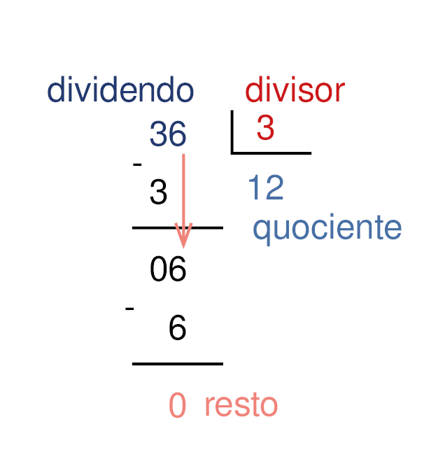

Cálculos
========

Habilidades do SAEB {#habilidades-do-saeb .unnumbered}
-------------------

-   Calcular o resultado de adições ou subtrações, envolvendo números
    naturais de até 6 ordens.

-   Calcular o resultado de multiplicações ou divisões, envolvendo
    números naturais de até 6 ordens.

-   Associar o quociente de uma divisão com resto zero de um número
    natural de até 6 ordens por 2, 3, 4, 5 e 10 às ideias de metade,
    terça, quarta, quinta e décima parte.

-   Resolver problemas de adição ou de subtração, envolvendo números
    naturais de até 6 ordens, com os significados de juntar,
    acrescentar, separar, retirar, comparar ou completar.

-   Resolver problemas de multiplicação ou de divisão, envolvendo
    números naturais de até 6 ordens, com os significados de formação de
    grupos iguais (incluindo repartição equitativa e medida),
    proporcionalidade ou disposição retangular.

### Habilidades da BNCC

-   EF03MA06, EF03MA07, EF03MA08.

```{=html}
<!-- -->
```
-   [Adição]{.smallcaps}

{width=".3\\textwidth"}

-   [Subtração]{.smallcaps}

{width=".3\\textwidth"}

-   [Multiplicação]{.smallcaps}

{width=".3\\textwidth"}

-   [Divisão]{.smallcaps}

{width=".3\\textwidth"}

Atividades {#atividades .unnumbered}
----------

num1 Adicione ou subtraia para obter o número desejado.

Transforme 262 em 362.\

Transforme 1.100 em 1.000.\

Transforme 238 em 239.\

num2 Utilize os sinais menor que (**\<**), maior que (**\>**) ou igual a
(**=**) em cada situação para comparar as quantidades representadas.

7 14

21 5

1 + 3 2 + 2

5 + 2 7 -- 1

20 -- 1 19

Treze quinze

num3 Ligue a operação na coluna 1 ao seu resultado na coluna 2.

2 84 + 12

60 -- 23

67 -- 58

50 -- 2 x (5 + 15) + 2

2 + 8 -- 2 x (1 + 2)

37

9

96

4

12

num4 Observe atentamente a figura dada e, em seguida, responda ao que se
pede em cada item.

{width=".5\\textwidth"}

Calcule a soma de todos os números que estão na 1ª coluna.

Calcule a soma de todos os números que estão na 2ª coluna.

Calcule a soma de todos os números que estão na 3ª coluna.

O que você percebe ao comparar os resultados das somas dos números de
cada coluna?

Calcule a soma dos números que estão na 1ª linha.

Calcule a soma dos números que estão na 2ª linha.

Calcule a soma dos números que estão na 3ª linha.

O que você percebe quando compara os resultados da soma dos números de
cada linha?

num5 Vicente vendeu 6 sorvetes de chocolate, 8 de morango, 3 de groselha
e 5 de creme. Quantas unidades de sorvete Vicente vendeu?

{width=".5\\textwidth"}

num6 A receita de um bolo pede para colocar 260 g de farinha de trigo e
misturar com ovos, açúcar e leite. Em seguida, solicita o acréscimo de
mais 135 g de farinha de trigo. Calcule a quantidade total de farinha
utilizada nesta receita?

{width=".5\\textwidth"}

num7 Raquel adora confeitaria. Por isso, decidiu começar uma pequena
empresa de doces para festas. Para o próximo final de semana, ela
recebeu a seguinte encomenda por mensagem de texto em seu celular:

**Encomenda para a festa da Maria**

-   275 brigadeiros

-   165 beijinhos

-   245 cajuzinhos

Calcule o total de unidades de doces que Raquel terá que fazer para
entregar essa encomenda.

num8 Complete o quadro, transformando as adições em multiplicações. Em
seguida, encontre o resultado.

  **Adição de parcelas iguais**   **Multiplicação**   **Resultado**
  ------------------------------- ------------------- ---------------
  8 + 8 + 8                       3 x 8               24
  10 + 10 + 10 + 10 + 10                              
  6 + 6 + 6 + 6                                       
  5 + 5 + 5 + 5 + 5 + 5 + 5                           
  12 + 12 + 12 + 12 + 12                              

num9 João possui uma distribuidora de ovos. Hoje, ele recebeu 15 caixas
que contém individualmente 252 ovos. Para vendê-los, João utilizou
embalagens de 12 unidades. Quantas embalagens são necessárias para que
João venda todos os ovos que recebeu?

{width=".5\\textwidth"}

num10 A mãe de Beatriz comprou uma caixa de bombons para presentear os
quatro filhos. Na caixa, os bombons estavam distribuídos em 8 fileiras
de 9 unidades.

{width=".4\\textwidth"}

Calcule a quantidade de bombons que cada filho deve receber, caso todos
ganhem a mesma quantidade.

num11 Brenda se deparou com uma divisão em sua prova de matemática.
Nela, o número 5.192 era o dividendo, e o número 22 era o divisor.
Calcule o quociente, sabendo que Brenda acertou o cálculo.

{width=".7\\textwidth"}

num12 Complete cada frase com a palavra "dobro" ou com a palavra
"triplo".

O de 10 é 20.

O de 6 é 18.

O de 7 é 14.

O de 8 é 24.

num13 No quadro branco da professora Adriana, foram escritos os números
a seguir:

{width="\\textwidth"}

Circule aqueles que fazem parte da tabuada do 3.

Treino {#treino .unnumbered}
------

num1 Uma costureira recebeu uma encomenda para colocar 6 botões em cada
uma das 9 camisas que José utiliza para trabalhar. Quantos botões ela
precisará no total para concluir a tarefa?

{width=".8\\textwidth"}

6\.

9\.

15\.

54\.

num2 Para uma festa familiar, a mãe de Josué comprou 12 fardos de suco
como os representados pela imagem a seguir. Quantas garrafas de suco
foram compradas para a festa?

{width="\\textwidth"}

6 garrafas de suco.

12 garrafas de suco.

72 garrafas de suco.

144 garrafas de suco.

num3 Um campeonato interno de basquete será promovido na escola em que
Carlos estuda. Pelas regras, cada time deverá ter 5 jogadores titulares
e mais 3 reservas. Considerando que serão formados 6 times, qual é a
quantidade de alunos que poderão participar do campeonato?

{width=".6\\textwidth"}

2

18\.

30\.

36\.

48\.
