\num{1}

BNCC: EF06MA01 EF06MA05

Habilidades SAEB

*  Escrever números racionais (representação fracionária ou decimal
finita) em sua representação por algarismos ou em língua materna ou
associar o registro numérico ao registro em língua materna.

*  Compor ou decompor números racionais positivos (representação decimal
finita) na forma aditiva, ou em suas ordens, ou em adições e
multiplicações.

*  Comparar ou ordenar números reais, com ou sem suporte da reta
numérica

*  Converter uma representação de um número racional positivo para outra
representação. - Identificar um número natural como primo, composto,
"múltiplo/fator de" ou "divisor de" ou identificar a decomposição de um
número natural em fatores primos ou relacionar as propriedades
aritméticas (primo, composto, "múltiplo/fator de" ou "divisor de") de um
número natural à sua decomposição em fatores primos.

Classes e ordens numéricas:

Produzir uma imagem como essa nos padrões do projeto

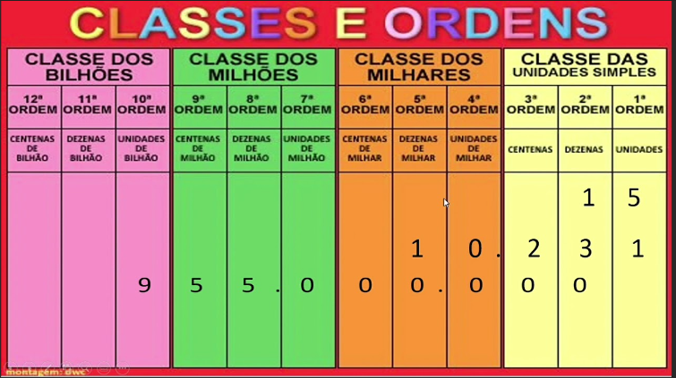{width="5.0in"
height="2.8020833333333335in"}

Números primos: Considerando o conjunto dos números naturais, define-se
como número primo aqueles números que possuem exatamente dois divisores,
o 1 e o próprio número em questão. Na tabela abaixo estão alguns números
considerados primos.

{width="3.2943930446194227in"
height="1.853096019247594in"}

Montar tabela semelhante com as cores do projeto

A decomposição de um número composto em fatores primos consiste em
escrever um número através da multiplicação de números primos que
compõem o próprio número.

Exemplo: Decomposição do número 144 em fatores primos:

> {width="1.3020833333333333in"
> height="1.442684820647419in"}
>
> Alguns sistemas de numeração:
>
> Egípcio:
>
> Produzir uma imagem como essa nos padrões do projeto.
>
> 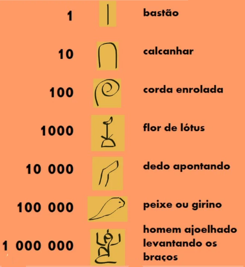{width="2.6936745406824145in"
> height="2.9577602799650045in"}
>
> Romano:
>
> Montar as figuras abaixo no padrão do projeto:
>
> 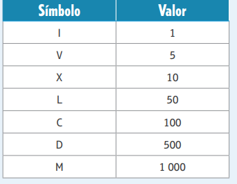{width="3.5625in"
> height="2.7604166666666665in"}
>
> Babilônico:
>
> Montar as figuras abaixo no padrão do projeto:
>
> 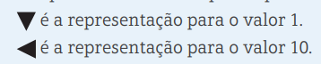{width="3.7291666666666665in"
> height="0.75in"}
>
> 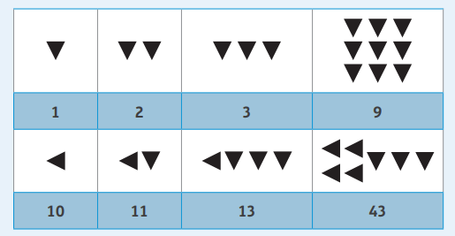{width="5.0in"
> height="2.59375in"}
>
> Chinês:
>
> Montar as figuras abaixo no padrão do projeto:
>
> 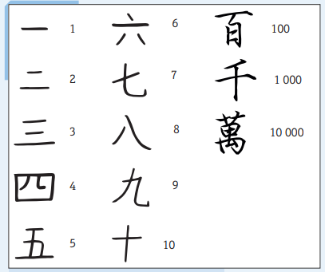{width="4.239583333333333in"
> height="3.5520833333333335in"}

Pedir aos alunos que imaginem um mundo onde os números não existam como
os conhecemos hoje. Propor que descrevam situações em que é necessário
utilizar números para diferentes finalidades, mas eles devem fazer isso
sem utilizar os símbolos que estamos acostumados. Observar o
envolvimento dos alunos, motivando-os a compartilhar a opinião com os
colegas.

O objetivo é incentivar o aluno a refletir sobre os números e as
diversas maneiras com que os utilizamos. Provavelmente, ele já possui um
conhecimento prévio sobre o assunto e utiliza os números em seu
cotidiano para contar, ordenar, codificar e medir, como usar o número
para codificar o telefone, medir sua altura, contar sua idade, ordenar
seu lugar na fila etc. Propor que os alunos reflitam sobre onde eles
utilizam os números no cotidiano, desde a hora que acordam até a hora de
dormir.

Atividades:

1\) Complete as lacunas abaixo com os numeros primos entre 2 e 65

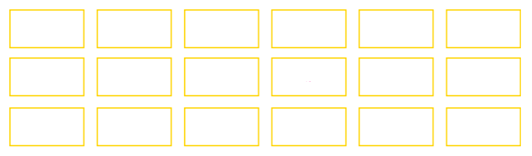{width="5.541666666666667in"
height="1.625in"}

Fazer tabela com as lacunas

Resposta:

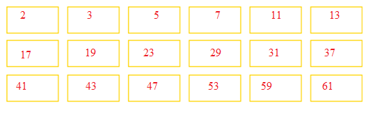{width="5.477083333333334in"
height="1.8138888888888889in"}

Fazer tabela com as lacunas e respostas

Os números primos de 2 a 100, que devem ser obtidos pela construção
proposta aos alunos no boxe, são: 2, 3, 5, 7, 11, 13, 17, 19, 23, 29,
31, 37, 41, 43, 47, 53, 59, 61.

Inserir o quadro acima com os respectivos espaços ou seja um quadro de
3x6

2\) indique V para as afirmações verdadeiras e F para as falsas.

\(V\) o número 2 é o único número par que é primo.

\(F\) todos os números ímpares são primos.

\(F\) o número 9 é primo.

\(V\) o número 121 possui 3 divisores.

\(F\) o número 289 é primo.

\(V\) um número composto possui mais de 2 divisores.

\(V\) um número primo possui 2 divisores: o 1 e ele mesmo.

\(V\) os números 41, 43 e 47 são primos.

Deixar um espaço entre os parenteses para inserção de V ou F

3\) decomponha em fatores primos

a\) 100

b\) 60

c\) 225

d\) 1 000

e\) 36

Deixar um espaço de 5 linhas entre cada item acima

Respostas:

a\) 2² · 5² = 100

b\) 2² · 3 · 5 = 60

c\) 3² · 5² = 225

d\) 2³ · 5^3^ = 1000

e\) 2² · 3² = 36

4\) A decomposição em fatores primos do numero 720 é:

2^4^ · 3² · 5 = 720

Inserir um espaço de 5 linhas para resolução

5\) O menor numero composto formado pelos fatores primos 2, 3, 5 e 11 é:

a\) 21

b\) 165

c\) 330

d\) 3 000

Inserir um espaço de 5 linhas para resolução

Resposta: O menor número possivel é:

2 · 3 · 5 · 11 = 330 logo alternativa C

6\) O numero 8 pode ser fatorado como 8 = 2 · 2 · 2 = 2³ e portanto
possui 3 fatores primos. o numero 30 tambem tem 3 fatores primos, pois
30 = 2 · 3 · 5, dessa forma, assinale a alternativa que apresenta apenas
numeros compostos formados por 3 fatores primos.

Inserir um espaço de 5 linhas para resolução

a\) 12, 18, 27, 50

b\) 20, 24, 32, 125

c\) 25, 49, 64, 81

d\) 32, 36, 48, 80

Resposta: Alternativa C

7\) Observe os numeros a seguir :

> 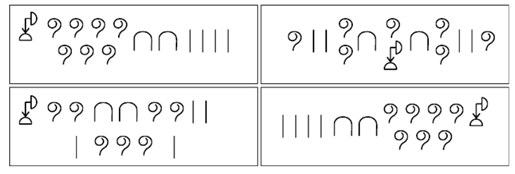{width="5.364583333333333in"
> height="1.8125in"}

Quais numeros estão representados em cada quadro?

Representar fielmente o quadro descrito acima pois qualquer falta de
simbolo em qualquer um dos quadros resulta em erros de interpretação.

Deixar um espaço de 4 linhas para resolução

Resposta: Todos os quadros apresentam o numero: 1724

Explorar com eles as regras do Sistema de Numeração Egípcio nos exemplos
dos números apresentados na página. Reforçar que, nesse sistema de
numeração, a ordem dos símbolos não modifica o número escrito.

8\) Represente a quantidade de objetos a seguir nos sistemas de
numeração romano e decimal

> a\)

{width="2.3224300087489063in"
height="1.1019794400699912in"}

Romano: XI

Decimal: 11

b\)

{width="2.7604166666666665in"
height="1.8012270341207348in"}

Romano: V

Decimal: 5

c\)

{width="3.3958333333333335in"
height="2.3333333333333335in"}

Romano: XX

Decimal: 20

Inserir as figuras descritas acima, podendo ser figuras semelhantes a
essas

Se achar conveniente, apresentar alguns jornais em francês, italiano e
inglês, por exemplo, e mostrar que, em todos, os números utilizados são
os números indo-arábicos. Dessa forma, eles terão uma percepção concreta
da universalidade do Sistema de Numeração Indo-arábico. Uma vez que os
alunos percebam que o Sistema de Numeração Decimal possui regras e
características que o fizeram prevalecer sobre os outros sistemas
apresentados, é chegado o momento de eles verificarem, de fato, quais
são essas regras e características. Uma estratégia possível é fazer a
comparação das características do Sistema de Numeração Decimal com
outros sistemas, ressaltando as diferenças e semelhanças. Com base nessa
discussão, organizar, com a turma, uma tabela para que os alunos
sistematizem as regras estudadas de todos os sistemas que foram
apresentados.

9\) Passe os números do sistema de numeração romano a seguir para o
sistema decimal:

a\) IV = 4

b\) VI = 6

c\) XL = 40

d\) LX = 60

e\) XC = 90

f\) CX = 110

Deixar o espaço de 1 linha para resolução abaixo de cada item

10\) O número 35 482 pose ser decomposto em parcelas 30 000 + 5 000 +
400 + 80 + 2. Seguindo esse mesmo raciocínio decomponha os seguintes
números:

a\) 9 876

9 000 + 800 + 70 + 6

b\) 12 345

10 000 + 2 000 + 300 + 40 + 5

c\) 678 910

600 000 + 70 000 + 8 000 + 900 +10

d\) 60 504

60 000 + 500 + 4

Deixar o espaço de 1 linha para resolução abaixo de cada item

Reforçar aos alunos que o Sistema de Numeração Decimal tem um símbolo
que representa a ausência de quantidade -- o zero (0) -- e tem base 10,
ou seja, utilizam-se apenas 10 símbolos -- 1, 2, 3, 4, 5, 6, 7, 8, 9 e 0
para escrever qualquer número. Além disso, esse sistema de numeração é
posicional; isso quer dizer que a posição do algarismo indica o seu
valor numérico.

Treino

1\) O maior cometa já descoberto é o Holmes, que possui 2 251 km de
diâmetro

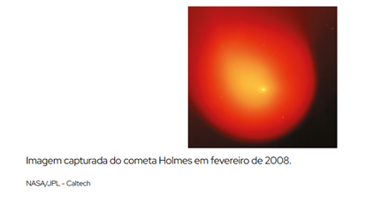{width="3.7178182414698164in"
height="1.9672889326334209in"}

Inserir a figura descrita acima podendo ser outra fotografia, dede que
seja do mesmo planeta

Quantas ordens possui o número que representa diâmetro do cometa?

a\) 2 ordens

b\) 3 ordens

c\) 4 ordens

d\) 10 ordens

Resposta: C

BNCC: EF06MA01 EF06MA05

Habilidade Saeb: Compor ou decompor números racionais positivos
(representação decimal finita) na forma aditiva, ou em suas ordens, ou
em adições e multiplicações.

Alternativa A:Incorreta, o aluno pode ter uma mal interpretação e contar
as classes ao invés das ordens.

Alternativa B: Incorreta, o aluno pode ter uma mal interpretação e
considerar que ordens é um conjunto de 3 números após o ponto.

Alternativa C: Alternativa correta.

Alternativa D: Incorreta, o aluno pode compreender que ordens são a soma
de todos os números descritos.

2\) José tem IX de idade seu irmão mais velho tem XXI e o mais novo V,
somando a idade dos três dá a idade do pai. Quantos anos tem o pai
deles?

a\) XXV

b\) XXXV

c\) XXXVII

d\) XXX

Resposta: B

BNCC: EF06MA01 EF06MA05

Habilidade Saeb: Converter uma representação de um número racional
positivo para outra representação.

Alternativa A: Incorreta, o aluno pode esquecer de somar um "X".

Alternativa B: Alternativa Correta.

Alternativa C: Incorreta, o aluno pode compreender que IX é na verdade
11 ao invés de 9

Alternativa D: Incorreta, o aluno pode esquecer de somar a idade do
irmão mais novo.

Deixar o espaço de 5 linhas para resolução

3\) O algarismo romano MMMDCCXVII representa o seguinte número decimal:

a\) 3225

b\) 3717

c\) 3718

d\) 3417

Deixar o espaço de 4 linhas para resolução

Resposta: B

BNCC: EF06MA01 EF06MA05

Habilidade Saeb: Converter uma representação de um número racional
positivo para outra representação.

Alternativa A: O aluno pode considerar que a letra "D" represente
"Dezena", logo o valor seria esse.

Alternativa B: Correta

Alternativa C: Incorreta, o aluno pode confundir e contar um "I" a mais
e considerar que o valor correto é esse.

Alternativa D: O aluno pode considerar que a letra D signifique
Duzentos, logo o resultado seria esse.

\num{2}

BNCC: EF06MA06 EF06MA07 EF06MA10 EF06MA11 EF07MA04 EF08MA01 EF08MA02
EF08MA03 EF09MA03 EF09MA04

Habilidades SAEB - Calcular o resultado de adições, subtrações,
multiplicações ou divisões envolvendo número reais. - Calcular o
resultado de potenciação ou radiciação envolvendo números reais. -
Resolver problemas de adição, subtração, multiplicação, divisão,
potenciação ou radiciação envolvendo número reais, inclusive notação
científica.

*  Resolver problemas de contagem cuja resolução envolva a aplicação do
princípio multiplicativo. - Resolver problemas que envolvam as ideias de
múltiplo, divisor, máximo divisor comum ou mínimo múltiplo comum.

Adição

Produzir uma figura semelhante a essa nos moldes do projeto.

{width="2.7558136482939632in"
height="1.3998534558180227in"}

Enfatizar que as propriedades da adição são: propriedade comutativa,
propriedade associativa e propriedade do elemento neutro. Elas são
importantes ferramentas de cálculo usadas para facilitar a realização
das operações matemáticas com as quais podemos trocar a ordem das
parcelas e associá-las de maneira conveniente.

Subtração 

Produzir uma figura semelhante a essa nos moldes do projeto.

{width="2.4767443132108484in"
height="1.4581364829396326in"}

Caso julgar necessário, para o melhor entendimento dos processos
envolvidos na resolução das subtrações, utilizar materiais
manipulativos, como o material dourado ou o ábaco. Solicitar aos alunos
que utilizem este material para compreender o "empresta um".

Incentivar os alunos a fazerem comparações entre os procedimentos
adotados e os problemas apresentados; assim poderão perceber que existem
diferentes maneiras de resolver um problema, mas antes disso é preciso
identificar o melhor método para cada um.

Multiplicação

Produzir uma figura semelhante a essa nos moldes do projeto.

{width="1.7263659230096238in"
height="1.1916666666666667in"}

O objetivo aqui é retomar e aprofundar as ideias associadas à
multiplicação. O aluno poderá identificá-la como uma adição de parcelas
iguais e utilizar os fatos básicos da multiplicação por meio da
organização retangular no raciocínio combinatório e na
proporcionalidade. Nesta fase, é importante identificar e respeitar as
possíveis dificuldades que os alunos possam ter no processo de
aprendizagem para que eles não associem a multiplicação apenas com a
memorização da tabuada e o seu algoritmo.

Divisão

Produzir uma figura semelhante a essa nos moldes do projeto.

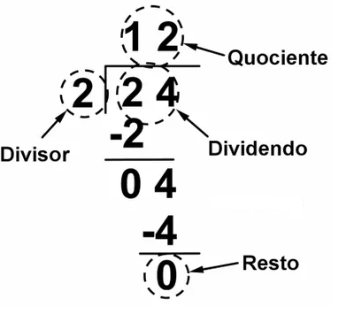{width="1.930232939632546in"
height="1.834780183727034in"}

É importante ressaltar que no algoritmo da divisão os alunos podem
encontrar alguma dificuldade. Provavelmente por não compreenderem o
processo e realizarem o algoritmo de forma mecânica. Por esse motivo,
essa retomada deve ser feita de modo que o aluno compreenda a lógica
aplicada ao processo dos algoritmos da divisão. Para isso, podem-se
utilizar jogos ou materiais manipulativos, como o material dourado, para
dar significado e facilitar a compreensão do aluno. Apresentar algumas
situações-problema que contemplem as ideias de dividir em partes iguais
e de medir, tomando cuidado para que não sejam apresentados exemplos que
compreendam apenas a ideia de distribuir.

Potenciação:

Produzir uma figura semelhante a essa nos moldes do projeto.

{width="2.895138888888889in"
height="1.2555555555555555in"}

Mínimo Múltiplo Comum (M. M. C.)

Exemplo de procedimento de cálculo:

Produzir uma figura semelhante a essa nos moldes do projeto.

MMC entre 5 e 6.

{width="2.186046587926509in"
height="1.6294477252843396in"}

Máximo Divisor Comum (M. D. C)

Exemplo de procedimento de cálculo:

MDC entre 20, 15 e 10:

Produzir uma figura semelhante a essa nos moldes do projeto.

{width="1.0930238407699038in"
height="1.8034897200349955in"}

Atividades

1\) Adriana e Marina são jogadoras de Vôlei, em uma partida Adriana fez
18 pontos e Marina 17 Qual o total de pontos das duas jogadoras juntas?

a\) 25

b\) 30

c\) 35

d\) 40

Deixar o espaço de 2 linhas para resolução e Inserir a figura descrita
acima, podendo ser uma figura semelhante a essa.

Resposta: Alternativa c

18+17=35

Se achar conveniente, registre as propriedades da adição em um quadro
que pode ficar afixado em local de fácil visualização para posterior
consulta dos alunos. Propriedade comutativa A ordem das parcelas não
altera a soma. Em outras palavras, não importa em que ordem os números
são adicionados, a soma sempre será a mesma. a + b = b + a Exemplo: 7 +
4 = 4 + 7

2\) Enzo tinha R\$ 284,00 e ganhou de seu pai uma nota de R\$50,00. Qual
o valor total que ele tem agora?

Deixar o espaço de 3 linhas para resolução e inserir a figura descrita
acima, podendo ser uma figura semelhante a essa.

Resposta: 334 reais

284+ 50 = 334

3\) Em um supermercado há uma balança informando o peso dos alimentos
ali colocados. Aurora pesou seus alimentos e observou o seguinte
resultado no visor da balança

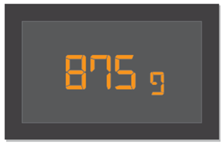{width="2.3333333333333335in"
height="1.53125in"}

Após observar o resultado decidiu pegar mais um item que pesa 225g, após
o item na balança qual o novo valor observado?

Resposta: 1,090 kg

875+225=1,090kg

Deixar o espaço de 4 linhas para resolução e inserir a figura descrita
acima, podendo ser uma figura semelhante a essa.

4\) A coleção de Celso tem 91 bolas de gude, e a de Marcelo 112, eles
juntos tem quantas bolas de gude?

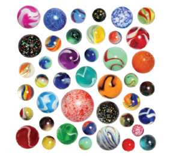{width="2.2383180227471566in"
height="2.062010061242345in"}

Resposta: 203 Bolinhas de gude

Deixar o espaço de 3 linhas para resolução e inserir a figura descrita
acima, podendo ser uma figura semelhante a essa.

5\) Uma biblioteca municipal contém 3 697 livros. Considerando que 391
livros foram emprestados, quantos livros estão nas estantes dessa
biblioteca?

Resposta: 3306 Livros

Deixar o espaço de 3 linhas para resolução e inserir a figura descrita
acima, podendo ser uma figura semelhante a essa.

6\) No início da semana uma lanchonete tinha 530 latas de refrigerante,
ao longo da semana foram vendidas 371 latas, quantas latas restaram na
lanchonete?

Resposta: 159 Latinhas restaram

Deixar o espaço de 3 linhas para resolução e inserir a figura descrita
acima, podendo ser uma figura semelhante a essa.

7\) Utilizando o método de decomposição em fatores primos calcule o
m.m.c. de:

a\) 52 e 78

b\) 8,10,14

c\) 18,42

d\) 12,48

e\) 90,180

Resposta:

a\) 156

b\) 280

c)126

d\) 48

e\) 180

Deixar o espaço de 5 linhas para resolução de cada item acima

8\) Utilizando o método de decomposição em fatores primos calcule o
m.d.c. de:

a\) 52 e 78

b\) 8, 10, 14

c\) 32, 48

d\) 60,72

Resposta:

a\) 78

b\) 2

c\) 16

d\) 12

Deixar o espaço de 5 linhas para resolução de cada item acima

9\) Joana comprou 3 rolos de tecido. O primeiro mede 100cm; o segundo,
80 cm e o terceiro mede 120 cm. Ela pretende dividir os rolos em pedaços
iguais e do maior tamanho possível, sendo assim quantos pedaços terá
cada pedaço de tecido?

a\) 15cm

b\) 18cm

c\) 20cm

d\) 22 cm

Resposta m.d.c. 100, 80, 120 = 20cm

Deixar o espaço de 5 linhas para resolução e inserir a figura descrita
acima, podendo ser uma figura semelhante a essa.

10\) Laura, Pablo e Josiane trabalham em uma empresa de turismo e viajam
constantemente para o nordeste. Laura viaja de 10 em 10 dias, Pablo de
15 em 15 dias e Josiane de 20 em 20 se todos forem hoje para o nordeste,
daqui a quanto tempo eles viajarão no mesmo dia novamente?

Resposta: Daqui a 60 dias.

Deixar o espaço de 5 linhas para resolução e inserir a figura descrita
acima, podendo ser uma figura semelhante a essa.

11\) Um tabuleiro de Xadrez é todo quadriculado e composto de 8 linhas e
8 colunas. Cada quadradinho é chamado de casa. Quantas casas tem esse
tabuleiro?

{width="1.9869028871391077in"
height="1.9869028871391077in"}

Resposta 64 casas

Deixar o espaço de 3 linhas para resolução e inserir a figura descrita
acima, podendo ser uma figura semelhante a essa.

12\) Calcule as potencias abaixo:

a\) 5²

b\) 3²

c\) 4³

d\) 7²

e\) 2³

f\) 10³

g\) 3³

h\) 8²

Respostas:

a\) 25

b\) 9

c\) 64

d\) 49

e\) 8

f\) 1000

g\) 27

h\) 64

Deixar o espaço de 1 linha para resolução de cada item acima

É interessante explorar a operação potenciação por meio de
situações-problema.

Exemplo:

• Em um estacionamento há 4 automóveis, em cada automóvel há 4 rodas e
em cada roda há 4 parafusos. Qual é o total de parafusos desses 4
automóveis?

• Um fazendeiro armazena as laranjas de sua fazenda para vender em
caixas que lembram um cubo. Cada caixa contém 5 laranjas no comprimento,
5 laranjas na largura e 5 laranjas na altura. Quantas laranjas podem ser
armazenadas em 5 caixas?

Observar as estratégias dos alunos para resolver as situações propostas.
É possível que alguns optem em fazer desenhos, esquemas ou optem pelo
material concreto para auxiliá-los no cálculo.

Depois, associar essas atividades com a representação de uma
potenciação. Inicialmente, a linguagem utilizada para definir a
potenciação e seus elementos pode ser confusa para os alunos. Sempre que
possível, fazer a identificação desses elementos utilizando exemplos ou
atividades para que eles possam compreender a nomenclatura correta e as
ideias ligadas a essa simbologia.

Treino:

1\) Três asteroides se aproximam do sol a cada 20, 24, e 28 anos,
respectivamente. Se o último ano em que todos estiveram próximos do sol
foi 1984, o próximo ano em que isso deverá ocorrer será?

a)72

b)840

c)1988

d)2824

Resposta: D

BNCC: EF06MA06 EF06MA07 EF06MA10 EF06MA11

Habilidade Saeb: Resolver problemas que envolvam as ideias de múltiplo,
divisor, máximo divisor comum ou mínimo múltiplo comum.

Alternativa A:Incorreta, o aluno pode realizar a somar a soma ao invés
de calcular o m.m.c.

Alternativa B: Incorreta, o aluno pode considerar que o valor do m.m.c.
em si já é a resposta.

Alternativa C: O aluno pode confundir m.m.c. com m.d.c. nos cálculos e
chegar a esse resultado.

Alternativa D: Correta. Pois somando o resultado do m.m.c. com o ano de
1984 obtemos este valor.

2\) Entre algumas famílias foram distribuídas 240 cadernos, 576 lápis, e
1080 borrachas. A distribuição foi feita de tal modo que o maior número
de famílias fosse contemplado e que cada família recebesse o mesmo
número de lápis, o mesmo número de cadernos e o mesmo número de
borrachas. Nessas condições o número de borrachas que cada família
recebeu foi:

a\) 24 b) 8 c) 12 d) 45

Resposta: D

BNCC: EF06MA06 EF06MA07 EF06MA10 EF06MA11

Habilidade Saeb: Resolver problemas que envolvam as ideias de múltiplo,
divisor, máximo divisor comum ou mínimo múltiplo comum.

Alternativa A: Incorreta, O aluno pode confundir o resultado do m.d.c.
dos valores como resposta.

Alternativa B: Incorreta: O aluno pode calcular incorretamente o m.d.c.
esquecendo do valor 5 no final, onde o resultado seria esse.

Alternativa C: Incorreta, o aluno pode esquecer de contar um número "2"
no cálculo do m.d.c.

Alternativa D: Correta, calculando o m.d.c., obtemos 24, realizando a
operação 1080: 24 obtemos 45.

Deixar o espaço de 5 linhas para resolução e inserir a figura descrita
acima, podendo ser uma figura semelhante a essa.

3\) Jonas abastece seu veículo a cada 3 dias, Moises a cada 6. Paulo vai
abastecer seu veículo sempre aos sábados e em nenhum outro dia. Se no
dia 20 de setembro os três abasteceram seus veículos, a próxima data em
que os três abastecerão juntos será:

a\) 20 de outubro

b\) 2 de novembro

c\) 1 de novembro

d\) 31 de Outubro

Resposta: C

BNCC: EF06MA06 EF06MA07 EF06MA10 EF06MA11

Habilidade Saeb: Resolver problemas que envolvam as ideias de múltiplo,
divisor, máximo divisor comum ou mínimo múltiplo comum.

Alternativa A: incorreta, o aluno pode considerar correta essa
alternativa caso ele considerar que se encontram no mesmo dia de todo o
mês.

Alternativa B: Incorreta, o aluno pode chegar a esse resultado se
considerar que outubro tenha 30 dias.

Alternativa C: Correta, pois realizando o m.m.c. temos 42 dias, então 20
dias depois de 20 de setembro temos 1 de novembro, lembrando que outubro
tem 31 dias.

Alternativa D: O aluno pode considerar que setembro tenha 31 dias.

Deixar o espaço de 5 linhas para resolução e inserir a figura descrita
acima, podendo ser uma figura semelhante a essa.

# Módulo 3

BNCC: EF06MA09

Habilidades Saeb

*  Representar frações menores ou maiores que a unidade por meio de
representações pictóricas ou associar frações a representações
pictóricas.

*  Identificar frações equivalentes.

*  Determinar uma fração geratriz para uma dízima periódica

Uma fração** **é um número usado para representar parcela de um valor
inteiro que foi dividido em partes iguais, ou seja, se um objeto
qualquer for dividido, o número que representará cada uma das partes
obtidas nessa divisão será chamado de fração.

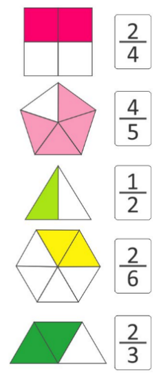{width="1.0625in"
height="2.4833213035870516in"}

A Comparação entre frações significa olhar para duas frações e descobrir
qual é a maior ou qual é a menor. Para comparar frações é necessário
deixá-las com o mesmo denominador e ver qual tem o maior numerador.

{width="2.75in"
height="1.7003444881889764in"}

As Frações Equivalentes são aquelas que aparentemente são diferentes,
mas que possuem o mesmo resultado. Sendo assim, elas representam a mesma
parte de um todo indicando a mesma quantidade.

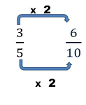{width="1.28125in"
height="1.5625in"}

Resgatar com os alunos os conhecimentos que possuem acerca das frações,
para assim aproximar ou relembrar conceitos estudados anteriormente. Se
possível, levar figuras de círculos de cartolina para que os alunos
possam vivenciar as questões propostas nesta seção. Eles podem dividir
as representações dos círculos em pedaços e recortá-los como se fossem
pizzas e realizar diferentes explorações. Vale destacar que é
interessante refletir com os alunos sobre o uso de alimentos para
representar frações, pois muitas vezes uma fatia pode aparentemente
possuir o mesmo tamanho que outras, mas a massa pode ser diferente.

Atividades

1\) Dois irmãos Abel e Caim resolveram comprar uma pizza juntos, ao
chegar em casa Abel comeu 3/8 da pizza, enquanto Caim comeu 7/16 avos,
qual dos irmãos comeu a maior parte da pizza?

Deixar o espaço de 3 linhas para resolução e inserir a figura descrita
acima, podendo ser uma figura semelhante a essa.

Resposta: Caim comeu a maior quantidade de pizza pois 3/8 \< 7/16

2\) Em um certo dia Mateus comprou uma barra de chocolate com 24 pedaços
para dividir igualmente entre seus 3 filhos, quantos pedaços cada filho
deve receber?

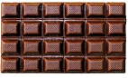{width="1.4784722222222222in"
height="0.8958333333333334in"}

Resposta: 24 pedaços para 3 filhos 24/3= 8 pedaços cada um.

Deixar o espaço de 3 linhas para resolução e Inserir a figura descrita
acima, podendo ser uma figura semelhante a essa.

3\) Ligue as frações equivalentes:

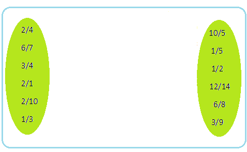{width="4.353931539807524in"
height="2.300997375328084in"}

{width="4.5116043307086615in"
height="2.2892639982502185in"}

Resposta:

Reproduzir fielmente a imagem descrita acima podendo ser alterado as
cores, porém não se alterando o conteúdo.

4\) Para ser aprovado em uma prova Lucas precisava acertar no mínimo 3/5
da prova, ao final do teste Lucas descobriu que acertou 2/3 da prova,
sendo assim ele foi aprovado ou reprovado?

Resposta: Lucas foi aprovado pois 2/3 \> 3/5

Deixar o espaço de 3 linhas para resolução

5\) Sabendo que as figuras foram divididas em partes iguais, em cada
item, escreva a fração correspondente à parte colorida de amarelo e
classifique as em próprias e improprias.

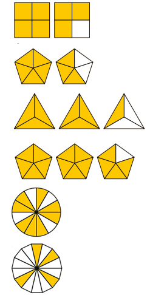{width="2.5729166666666665in"
height="5.0625in"}a)

b\)

c\)

d\)

e\)

f\)

Respostas:

a)7/4 impropria

b\) 8/5 impropria

c\) 7/3 impropria

d\) 14/5 impropria

e\) 8/12 própria

f\) 4/14 própria

Deixar o espaço de 2 linhas para cada item acima e inserir a figura
descrita acima, podendo ser uma figura semelhante a essa, porém contendo
o mesmo conteúdo fracionário

Nestas atividades, reforçar a ideia de fração como parte de um todo.
Quando se trabalha com sua representação geométrica, há necessidade de
fazer a divisão do todo em partes iguais. Sugerir aos alunos que citem
elementos que podem ser representados por meio de uma fração.

6\) Simplifique as frações tornando-as irredutíveis:

a)  24/60

b)  18/90

c)  27/36

d)  63/81

e)  9/81

f)  7/21

g)  60/80

Respostas:

a)2/5

b)1/5

c)3/4

d)7/9

e)1/9

f)1/3

g)3/4

Deixar o espaço de 3 linhas para resolução de cada item acima

7\) Maria resolveu fazer bolos para vender em sua padaria, em cada
receita de bolo utiliza se 3/4 de xicara de farinha de trigo, em um
final de semana Maria faz 8 bolos quantas xicaras serão necessárias?

Resposta: ¾ · 8= 6 xícaras

Deixar o espaço de 3 linhas para resolução e inserir a figura descrita
acima, podendo ser uma figura semelhante a essa.

Sugerir aos alunos que eles grifem cada dado do problema de uma cor.
Recomendar a eles que destaquem a pergunta circulando-a, por exemplo,
para identificar o que deve ser respondido. Pedir que façam uma
estimativa do resultado antes de elaborar a resposta completa. Em
seguida, dar especial atenção aos esquemas utilizados para resolver os
problemas. Incentivá-los a fazer desenhos que representem os dados do
problema, o que pode facilitar sua compreensão. Por fim, pedir que
verifiquem se a resposta está coerente com os dados do problema.

8\) Leonardo resolveu pintar um quadro simples para colocar na parede de
seu quarto

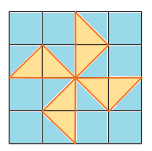{width="1.5833333333333333in"
height="1.5729166666666667in"}

Para pintar o quadro Leonardo comprou 2 tintas de cores diferentes azul
e laranja, qual das tintas Leonardo usou mais?

Resposta: Leonardo usou no seu quadro 12/16 avos de tinta azul e 4/16
avos de tinta laranja como 12/16 \> 4/16 ele usou mais a tinta azul.

Deixar o espaço de 3 linhas para resolução e inserir a figura descrita
acima, podendo ser uma figura semelhante a essa, porém contendo o mesmo
conteúdo fracionário.

9\) Represente por meio de frações:

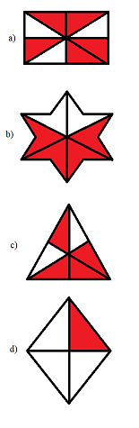{width="1.6145833333333333in"
height="4.947916666666667in"}

Resposta:

a\) 5/8

b\) 6/8

c\) 4/6

d\) ¼

Deixar o espaço de 1 linhas abaixo de cada item para resolução e inserir
a figura descrita acima, podendo ser uma figura semelhante a essa, porém
contendo o mesmo conteúdo fracionário.

10\) Um prêmio em dinheiro foi dividido entre 4 amigos em partes
fracionárias. Pedro recebeu 1/6 do valor, Henrique recebeu 1/2 do
prêmio, Josias recebeu 1/4 do valor e Adriano 1/12 do valor do prêmio.
Qual dos quatro amigos recebeu a maior parte do prêmio?

A\) Pedro

B\) Henrique.

C\) Josias

D\) Adriano

Resposta: Henrique recebeu a maior parte.

Deixar o espaço de 3 linhas para resolução

Com estes exercícios os alunos vão comparar frações por meio da análise
de seus numeradores e denominadores e desenvolver a ideia de frações
equivalentes, que será vista a seguir. Destacar que, para comparar as
frações, é necessário verificar se ambas se referem ao mesmo todo.

Treino:

1\) Ester preencheu 3/4 de uma jarra de 500 ml com refresco. Na hora de
servir a bebida, ele distribuiu o líquido igualmente em 5 copos de 50
ml, ocupando 2/4 da capacidade de cada um. Com base nestes dados
responda: que fração de líquido restou na jarra?

{width="5.427083333333333in"
height="1.774695975503062in"}

a)  3/4

b)  1/3

c)  1/4

d)  ½

Resposta: D

BNCC: EF06MA09

Habilidade Saeb: Representar frações menores ou maiores que a unidade
por meio de representações pictóricas ou associar frações a
representações pictóricas.

Alternativa A: Incorreta, o aluno pode se confundir ao ler o enunciado e
considerar que a parte preenchida da jarra, seja a mesma a ser
preenchida nos copos.

Alternativa B: Incorreta pois: o aluno pode esquecer de ler o restante
do enunciado e considerar que o restante a ser preenchido na jarra é o
valor a ser procurado.

Alternativa C: Incorreta, o aluno pode considerar que ao dividir por 5
copos se tornaria 1/5.

Alternativa D: Correta pois: 1º passo: calcular a quantidade de refresco
na jarra.

500ml · 3/4 = 375ml

2º passo: calcular a quantidade de refresco nos copos

50ml · 2/4= 25ml

3º passo: calcular a quantidade de líquido que sobrou na jarra

375 ml --- 125 ml = 250 ml

A capacidade total da jarra é de 500 ml e a quantidade de líquido que
sobrou na jarra é de 250 ml, ou seja, a metade da sua capacidade.
Portanto a fração de líquido que restou é de 1/2 da sua capacidade.

Deixar o espaço de 6 linhas para resolução e Inserir a figura descrita
acima, podendo ser uma figura semelhante a essa, porém contendo o mesmo
conteúdo fracionário.

2\) Um jogo Matemático é formado por cartas as quais está impressa uma
fração em uma de suas faces. Cada jogador recebe quatro cartas e vence
aquele que primeiro consegue ordenar crescentemente suas cartas pelas
respectivas frações impressas. O vencedor foi o aluno que recebeu as
cartas com as frações: 3/5, 1/4, 2/3 e 5/9.

A ordem que esse aluno apresentou foi

a\) 1/4, 5/9, 3/5, 2/3

b\) 1/4, 2/3, 3/5, 5/9

c\) 5/9, 1/4, 3/5, 2/3

d\) 5/9, 1/4, 3/5, 2/3

Resposta: A

BNCC: EF06MA09

Habilidade Saeb: Identificar frações equivalentes.

Alternativa A: Correta pois:

Para comparar frações elas devem possuir os denominadores iguais. Para
isso, calculamos o MMC entre 5, 4, 3 e 9, que são os denominadores das
frações sorteadas.

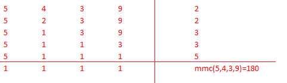{width="5.010416666666667in"
height="1.4479166666666667in"}

Para encontrar as frações equivalentes, dividimos 180 pelos
denominadores das frações sorteadas e, multiplicamos o resultado pelos
numeradores.

Para 3/5

180 / 5 = 36, como 36 x 3 = 108, a fração equivalente será 108 / 180.

Para 1/4

180/4 = 45, como 45 x 1 = 45, a fração equivalente será 45/180

Para 2/3

180/3 = 60, como 60 x 2 = 120, a fração equivalente será 120/180

Para 5/9

180/9 = 20, como 20 x 5 = 100. A fração equivalente será 100/180

Com as frações equivalentes, basta ordenar pelos numeradores em ordem
crescente e associar com as frações sorteadas. Logo 1/4, 5/9, 3/5, 2/3.

Alternativa B: Incorreta, O aluno pode considerar que quanto maior o
denominador maior o valor fracionário, assim ¼ seria uma fração maior
que 2/3

Alternativa C: Incorreta, o aluno pode se confundir na forma de calcular
o m.m.c. e colocar erroneamente as frações de forma incorreta.

Alternativa D: Incorreta, o aluno pode se confundir e colocar as frações
em forma decrescente ao invés de crescente.

Deixar o espaço de 6 linhas para resolução

 3) Elias comprou dois potes de sorvete, ambos com a mesma quantidade do
produto. Um dos potes continha quantidades iguais dos sabores chocolate,
creme e morango; e o outro, quantidades iguais dos sabores chocolate e
baunilha. Então, é CORRETO afirmar que, nessa compra, a fração
correspondente à quantidade de sorvete do sabor chocolate foi:

a\) 2/6\
b) 3/5\
c) 5/12\
d) 5/6

Deixar o espaço de 5 linhas para resolução

Resposta: C

BNCC: EF06MA09

Habilidade Saeb: Representar frações menores ou maiores que a unidade
por meio de representações pictóricas ou associar frações a
representações pictóricas

Alternativa A: Incorreta: o aluno pode erroneamente considerar que ambos
os potes de sorvete foram divididos em 3 partes.

Alternativa B: Incorreta: o aluno erroneamente pode considerar que
somando as partes de chocolates de ambos os potes sem calcular o m.m.c.
pode se tornar uma resposta correta.

Alternativa C: Correta, pois: o primeiro pote continha 3 sabores em
iguais quantidades: 1/3 de chocolate, 1/3 de baunilha e 1/3 de morango.
No segundo pote, havia 1/2 de chocolate e 1/2 de baunilha. Considerando
os dois potes de sorvete dividimos os dois potes em partes iguais.
Fazendo então o m.m.c. de (2,3) obtemos que cada pote foi dividido em 6
partes iguais. Portanto nos dois potes temos 12 partes iguais. Sendo que
destas, 5 partes correspondem ao sabor chocolate.

Alternativa D: Incorreta, o aluno pode considerar dividir os potes em 3
partes iguais e somar sem calcular o m.m.c., que chegará a esse
resultado erroneamente.

# Módulo 4

BNCC: EF06MA13

*  Resolver problemas que envolvam porcentagens, incluindo os que lidam
com acréscimos e decréscimos simples, aplicação de percentuais
sucessivos e determinação de taxas percentuais.

Definição

**Porcentagem** ou **percentagem** é uma medida
de [razão](https://pt.wikipedia.org/wiki/Raz%C3%A3o_(matem%C3%A1tica)) com
base 100 (cem). É um modo de expressar
uma [proporção](https://pt.wikipedia.org/wiki/Propor%C3%A7%C3%A3o) ou
uma relação entre 2 (dois) valores (um é a parte e o outro é o inteiro)
a partir de
uma [fração](https://pt.wikipedia.org/wiki/Fra%C3%A7%C3%A3o) cujo
denominador é 100 (cem), ou seja, é dividir um número por 100 (cem).

Acréscimo

É o valor acrescentado de uma transação comercial em relação à taxa
percentual do capital.
O [acréscimo](https://mundoeducacao.uol.com.br/matematica/aumentos-descontos.htm) ocorre
devido às demandas do mercado de subir o preço de certos produtos e
serviços, por uma série de fatores, e, muitas vezes, com o interesse de
aumento do lucro ou de imposto, o acréscimo é utilizado também em
investimentos de capital.

Desconto

É o** **valor retirado de uma transação comercial em relação à taxa
percentual do capital. Geralmente o desconto é utilizado como meio de
potencializar as vendas ou premiar clientes que pagam a conta em dia.

1\) Calcule as porcentagens abaixo

a\) 1% de 120

b\) 50% de 260

c\) 10% de 1300

d\) 25% de 9

e\) 30% de 120

f\) 5% de 90

g\) 2% de 310

h\) 45% de 195

i\) 33% de 125

j\) 90% de 1700

k\) 70% de 1745

l\) 0,5% de 205

m\) 2,5% de 25

Deixar o espaço de 4 linhas abaixo de cada item acima para resolução

Respostas:

a\) 1,2

b\) 130

c\) 130

d\) 2,25

e\) 36

f\) 4,5

g\) 6,2

h\) 87,75

i\) 41,25

j\) 1530

k)1221,5

l\) 1,025

m)0,625

Existem muitos materiais manipuláveis que podem contribuir para o
ensino-aprendizagem deste conteúdo. Um deles é o material dourado, que
pode ser explorado para facilitar o entendimento da relação entre as
frações e as porcentagens. Pedir aos alunos que montem um quadrado com
10 unidades de lado utilizando os cubinhos. Depois pedir que dividam o
quadrado em dois retângulos iguais, e fazer perguntas como: "Que fração
representa cada retângulo comparado com o quadrado inicial?", "Cada
retângulo representa quantos por cento do quadrado inicial?".
Provavelmente, os alunos responderão que representa a metade do todo, ou
seja, 50%. Espera-se que os alunos percebam que, para determinar 50% de
um valor, basta dividir esse valor por dois. É interessante fazer
perguntas como essas para que os alunos percebam que, para determinar
25% de um valor qualquer, basta dividir esse valor por 4; para
determinar 20%, divide-se por 5 e, para determinar 10%, divide-se por 10

2\) Marly tem um salário atual de R\$1250,00. Seu novo patrão irá
aumentar seu salário em 15%. Qual o valor do novo salário dela?

Resposta: R\$ 1.437,50

Deixar o espaço de 3 linhas para resolução e inserir a figura descrita
acima, podendo ser uma figura semelhante a essa.

3\) Uma televisão em uma loja de departamentos custa R\$ 3800,00.

Sabendo que José adquiriu uma destas TVs e que ele efetuou pagamento à
vista, recebeu um desconto no valor de 15% no produto. Nestas condições,
qual foi a quantia paga por José?

Resposta: R\$ 3230,00

Deixar o espaço de 4 linhas para resolução e inserir a figura descrita
acima, podendo ser uma figura semelhante a essa.

4\) Uma universidade resolveu iniciar uma pesquisa para saber o perfil
dos seus alunos, onde foi descoberto que 46% dos alunos são homens.
Sabendo que a faculdade possui 1250 alunos, quantas mulheres estudam
nessa universidade?

Resposta: 675 Mulheres estudam na universidade.

Deixar o espaço de 4 linhas para resolução e inserir a figura descrita
acima, podendo ser uma figura semelhante a essa.

5\) O campeonato brasileiro de futebol possui 38 rodadas, para cada
vitória a equipe ganha 3 pontos, sendo assim a pontuação máxima a ser
alcançada é de 114 pontos, a equipe vencedora do ano de 2022 obteve 81
pontos, qual a porcentagem de pontos alcançada?

Resposta: A equipe campeã alcançou 71,05% dos pontos disputados

Deixar o espaço de 4 linhas para resolução e Inserir a figura descrita
acima, podendo ser uma figura semelhante a essa.

6\) Em janeiro um brinquedo custava R\$ 90,00. Devido à queda das
vendas, seu preço sofreu uma redução de 20%, mantendo-se este valor até
novembro. Com o aquecimento das vendas de Natal houve um aumento de 10%.
O brinquedo passou a ser vendido por:

Resposta: O brinquedo passou a ser vendido por R\$ 79,20

Deixar o espaço de 4 linhas resolução e inserir a figura descrita acima,
podendo ser uma figura semelhante a essa.

7\) Uma pesquisa constatou que uma cidade do interior de são Paulo no
ano de 2021 possuía 25.000 mil habitantes, considerando que no ano de
2022 houve um aumento de 6 % na população, quantos habitantes havia
nessa cidade no ano de 2022?

Deixar o espaço de 4 linhas para resolução e inserir a figura descrita
acima, podendo ser uma figura semelhante a essa.

Resposta: Em 2022 a população dessa cidade era de 26.500 habitantes

8\) Elias foi em um supermercado, ao chegar ao local foi ao setor de
grãos e viu o pacote de arroz de 5kg com o preço de 21,50\$, ao chegar
ao mesmo local no mês de fevereiro se deparou com o mesmo arroz custando
23,10\$, qual foi o acréscimo em % do arroz?

Resposta: O arroz teve um acréscimo de 6,92%.

Deixar o espaço de 4 linhas para resolução e inserir a figura descrita
acima, podendo ser uma figura semelhante a essa.

9\) Em uma loja, o preço de um determinado par de calçados era R\$
120,00. Certo dia, em uma liquidação, ele era vendido por R\$ 81,00. Em
relação ao preço original, o desconto dado corresponde a uma taxa de:

Resposta: O desconto dado foi de 32,5%

Deixar o espaço de 4 linhas para resolução e inserir a figura descrita
acima, podendo ser uma figura semelhante a essa.

10\) Uma loja oferece descontos na compra de seus produtos, 10% na
compra de 1 produto,20% na compra de 2 produtos e 30% na compra de 3
produtos. Adriano quer comprar camisas cujo preço é R\$80,00 Quanto
Adriano pagaria em cada camisa:

a\) Na compra de apenas 1 camisa:

b\) Na compra de 2 camisas:

c\) Na compra de 3 camisas:

Deixar o espaço de 3 linhas abaixo de cada item acima para resolução e
inserir a figura descrita acima, podendo ser uma figura semelhante a
essa.

Resposta:

a\) R\$72,00

b\) R\$64,00

c\) R\$56,00

Resposta: Alternativa d R\$1,50

11\) Uma pessoa compra um terreno por R\$ 20.000,00 e o vende com o
lucro de 4.000,00 qual a porcentagem de lucro?

Resposta:20% de lucro

Deixar o espaço de 4 linhas para resolução

Treino

1\) Em uma cidade em que as passagens de ônibus custavam R\$1,20 o novo
prefeito reajustou o preço das passagens em 25%. Qual será o novo valor
das passagens?

a\) R\$1,45.

b\) R\$1,23.

c\) R\$1,25.

d\) R\$1,50.

Resposta: D

BNCC: EF06MA13

Habilidade Saeb: Resolver problemas que envolvam porcentagens, incluindo
os que lidam com acréscimos e decréscimos simples, aplicação de
percentuais sucessivos e determinação de taxas percentuais.

Alternativa A: Incorreta: O aluno pode considerar que aumentar 25%
signifique aumentar 25 centavos.

Alternativa B: Incorreta: O aluno pode calcular erroneamente 1,20 x
0,025 assim chegando a esse resultado equivocado.

Alternativa C: Incorreta, o aluno pode considerar que 25% tenha relação
com o valor R\$1,25, pela semelhança.

Alternativa D:Correta, pois R\$ 1,20 x 0,25 = 0,3, logo somando R\$1,20
+ R\$0,30 temos 1,50

2\) Uma loja de CDs realizará uma liquidação e, para isso, o gerente
pediu para Ariane multiplicar todos os preços dos CDs por 0,68. Nessa
liquidação, a loja está oferecendo um desconto de:

A\) 68%

B\) 6,8%

c\) 3,2%

d\) 32%

Resposta: D

BNCC: EF06MA13

Habilidade Saeb: Resolver problemas que envolvam porcentagens, incluindo
os que lidam com acréscimos e decréscimos simples, aplicação de
percentuais sucessivos e determinação de taxas percentuais.

Alternativa A:Incorreta, O aluno pode deduzir que ao multiplicar o valor
por 0,68 que o valor logo terá 68 % de desconto.

Alternativa B: Incorreta, o aluno pode deduzir que ao multiplicar o
valor por 0,68 logo os cds terão 6,8 % devido a semelhança dos termos.

Alternativa C: Incorreta, o cálculo pode ser feito corretamente mas a
semelhança de 3,2% para 32% pode confundir o aluno na hora de decisão de
assinalar a resposta correta.

Alternativa D: Correta Ao multiplicar qualquer valor de CD por 68% obtém
se um desconto de 32%

3\) Em uma loja, uma máquina de lavar roupas custava R\$ 1500,00 e seu
preço sofreu um aumento de 3%. Logo após o aumento a loja resolveu fazer
uma promoção oferecendo um desconto de 3% no mesmo produto. Qual o valor
do produto após o aumento? e após o desconto, ou seja, após as duas
operações?

a\) R\$ 1.555,00 com aumento e R\$ 1.498,65 com desconto.

b\) R\$ 1.545,00 com aumento e R\$ 1.500,00 com desconto.

c\) R\$ 1.545,00 com aumento e R\$ 1.498,65 com desconto.

d\) R\$ 1.555,00 com aumento e R\$ 1.500,00 com desconto.

Resposta: D

BNCC: EF06MA13

Habilidade Saeb: Resolver problemas que envolvam porcentagens, incluindo
os que lidam com acréscimos e decréscimos simples, aplicação de
percentuais sucessivos e determinação de taxas percentuais.

Alternativa A:Incorreta, o aluno pode realizar o cálculo corretamente,
mas confundir os valores próximos de R\$ 1 555, 00 com R\$ 1 545, 00
devido a semelhança.

Alternativa B: Incorreta: o aluno por meio de dedução pode considerar
que somando 3% ao valor inicial e subtraindo 3% o valor inicial fique
inerte.

Alternativa C: Correta, pois:

Cálculo do acréscimo

1500·0,03=45

1550+45=1545

Cálculo do desconto

1545·0,03=46,35

1545-46,35=1498,65

Alternativa D: Incorreta: o aluno por meio de dedução pode considerar
que somando 3% ao valor inicial e subtraindo 3% o valor inicial fique
inerte.

# Módulo 5

BNCC: EF06MA14

Habilidades Saeb

*  Resolver uma equação polinomial de 1º grau.

*  Inferir uma equação, inequação polinomial de 1º grau ou um sistema de
equações de 1º grau com duas incógnitas que modela um problema.

*  Associar uma equação polinomial de 1º grau com duas variáveis a uma
reta no plano cartesiano.

*  Resolver problemas que possam ser representados por sistema de
equações de 1º grau com duas incógnitas.

A equação do 1º grau 

É uma equação que possui uma incógnita com grau 1, ou seja, a incógnita
está elevada a potência 1.

a·x + b = 0, em que a e b são números reais, e a é diferente de 0.

Sistema com equações de 1º grau

Exemplo:\
Produzir uma figura como essa, mas no lugar de 20 colocar 40 e no lugar
de 72 colocar 144.\
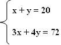{width="1.0930555555555554in"
height="0.8138888888888889in"}\
\
Método da substituição\
Esse método consiste em escolher uma das duas equações, isolar uma das
incógnitas e substituir na outra equação, veja como:

Dado o sistema,

x + y = 40

3·x + 4· y = 144

Enumeramos as equações.

x + y = 40 1°

3·x + 4· y = 144 2°

Escolhemos a primeira equação 1 e isolamos o x:\
\
x + y = 40 $\rightarrow \ $x = 40 -- y

Agora na equação 2 substituímos o valor de x = 40 -- y.

 3x   +   4 y   = 144 $\rightarrow \ $3 (40 -- y) + 4y = 144
$\rightarrow \ $120 - 3y + 4y  = 144$\rightarrow \ $y = 24.\
\
Descobrimos o valor de y, para descobrir o valor de x basta substituir
12 na equação\
x = 40 -- y$\rightarrow \ $x = 40 -- 24 $\rightarrow \ $x = 16\
\
Portanto, a solução do sistema é S = (16, 24)

Atividades

1\) Resolva as Equações polinomiais abaixo e descubra o valor de X em
cada uma delas

a\) 𝑥 + 5 = 8

b\) 𝑥 − 4 = 3

c\) 𝑥 + 9 = −1

d)4𝑥 − 9 = 23

e)7𝑥 − 33 = −12

f\) 33+ 𝑥 = 5 -- 3x

g\) 3(x + 2) = 2 (x -- 7)

h\) 2x -- 10 + 7x + 10 = 180

Deixar 20 linhas para resolução

Respostas:

a\) x=3

b\) x=7

c\) x= -10

d\) x=8

e\) x=3

f\) x= -7

g\) x= -20

h\) x= 20

2\) Responda as sentenças abaixo

a\) O dobro de um número somado com 5 é igual a 91. Qual é esse número?

b\) O triplo de um número diminuído de 4 é igual a 23. Qual é esse
número?

c\) O número somado com o seu dobro é igual a 150. Qual é esse número?

d\) Qual é o número que adicionado a 28 é o mesmo que 3 vezes esse
número?

e\) O triplo de um número, menos 10 é igual ao próprio número mais 70.
Qual é esse número?

f\) Noêmia é 5 anos mais velha que Ágata. A soma das idades dá 43 anos.
Qual a idade de Ágata?

g\) Quando Manoel nasceu, Carlos tinha 3 anos. Atualmente a soma das
idades é 23 anos. Qual é a idade de Carlos?

Deixar o espaço de 4 linhas para resolução para cada item acima

Respostas

a\) x=43

b\) x=9

c\) x=50

d\) x=14

e\) x=40

f\) Ágata tem 19 anos

g\) Carlos tem 13 anos

3\) Os 1200 alunos matriculados numa escola estão assim distribuídos: no
período da manhã há 320 alunos a mais que no período da tarde e, à
noite, há 190 alunos a menos que no período da manhã. O número de alunos
do período da manhã desta escola é?

a\) 250

b)380

c)450

d)570

Resposta: Como não sabemos o a quantidade de alunos no período da tarde
consideraremos

Alunos da tarde= x

Alunos da manhã x + 320

Alunos da noite x+320 -- 190

Sendo o total de alunos 1200 temos que

X+130+ x +320 + x= 1200

Logo x= 250

Fazendo a substituição de x por 250 temos que

Alunos da manhã= 570

Alunos da tarde 250

Alunos da noite 380

Logo alternativa correta é a D

Deixar o espaço de 8 linhas para resolução e Inserir a figura descrita
acima, podendo ser uma figura semelhante a essa.

4\) Resolva os sistemas formados pelas equações abaixo.

a\) x + y = 1

4x + 7y = 10

b\) 3x + y = 13

x -- 2y = 2

d\) 2x + y = 5

x -- y = 1

e\) x + y = 4

3x + 2y = 9

f\) x + y = 10

2x -- y = 8

Deixar o espaço de 6 linhas para resolução para cada item acima

Resposta:

a\) Solução: x= -1, y= 2

b\) solução x=4 y=2

c\) solução x=1 y=2

d\) Solução x=2 y = 1

e\) Solução x=1 y=3

f\) Solução x=6 y=4

5\) Em um determinado mês, duas montadoras e produziram, juntas, 77.500
veículos, sendo que a produção de x foi igual a 2/3 da produção de y.

Nesse mês, a quantidade de veículos produzidos por x Foi:

\(A\) 31.000.

\(B\) 36.000.

\(C\) 42.500

\(D\) 46.500.

Deixar o espaço de 4 linhas para resolução e inserir a figura descrita
acima, podendo ser uma figura semelhante a essa.

Resposta alternativa D

6\) Numa cantina, 2 copos de suco e 3 pastéis custam R\$ 5,70. O preço
de 3 copos de suco e 5 pastéis é R\$ 9,30. Quais os preços de cada
pastel e cada copo de suco?

Resposta: pastel custa R\$ 1,50 e suco custa R\$ 0,60.

Deixar o espaço de 4 linhas para resolução e inserir a figura descrita
acima, podendo ser uma figura semelhante a essa.

7\) Considerando a equação

5(3x --- 8) = -45

É correto afirmar que a equação equivalente a ela é

a\) 8x -32=0

b)15x +5=0

c)8x -58 = 0

d)15x +85=0

Deixar o espaço de 4 linhas para resolução

Resposta alternativa B

8\) Uma região retangular foi totalmente cercada por tela. À figura
mostra as medidas dos lados, em metros, dessa região.

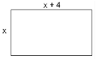{width="1.65625in"
height="1.1458333333333333in"}

Se para cercar totalmente essa região foram utilizados 24 m de tela, a
medida do lado menor é igual à:

A)3

b)4

c)5

d)6

Deixar o espaço de 4 linhas para resolução e inserir a figura descrita
acima, podendo ser uma figura semelhante a essa, porém contendo o mesmo
conteúdo algébrico.

Resposta Alternativa b

9\)

Numa loja, alguns CDs e fitas estão em oferta estão sendo vendidas 3
fitas e 2 CDs por R\$ 56,00 ou então 2 fitas e um CD por R\$ 34,00. O
preço de cada uma das fitas e de cada um dos CD s pode ser determinado a
partir da solução do sistema:

a\) 2x + y =56

x+2y=34

b\) 3x + 2y=56

x + 2y= 34

c\) 3x+2y=56

2x+y=34

d\) x+y= 56

x+y=34

Inserir a figura descrita acima, podendo ser uma figura semelhante a
essa.

Resposta: Alternativa c

Treino:

1\) Numa caixa há bolas Vermelhas e bolas amarelas num total de 360. Se
o número de bolas vermelhas é o quádruplo do de amarelas, o número de
bolas vermelhas é:

a\) 18

b\) 72

d\) 90

d\) 288

Resposta: D

BNCC: EF06MA14

Habilidades Saeb:

BNCC: EF06MA14

Habilidades Saeb: Resolver problemas que possam ser representados por
sistema de equações de 1º grau com duas incógnitas.

Alternativa A: Incorreta: o aluno pode chegar à conclusão que o número
de bolas vermelhas seja 72, e dividir por 4 ao tentar encontrar o número
de bolas amarelas.

Alternativa B: Incorreta: o aluno pode considerar que o enunciado pede o
número de bolas amarelas.

Alternativa C:Incorreta, O aluno pode realizar a operação 360:4, obtendo
um resultado incorreto.

Alternativa D: Correta: Realizando o sistema temos que:

X + Y = 360

X= 4y

Inserindo o valor de X na primeira equação temos que:

4y+ y= 360

5y=360

Y= 72

Realizando 360-72= 288 temos o valor correto de bolas vermelhas.

2\) O tempo t, em segundos, que uma pedra leva para cair de uma altura
x, em metros, é dado aproximadamente pela fórmula t = 0,05x. Se o tempo
t da queda é de 8 segundos, a altura x é:

a\) 0,4 m

b\) 0,00625 m

c\) 160m

d\) 4 m

Resposta: C

BNCC: EF06MA14

Habilidades Saeb: Resolver problemas que possam ser representados por
sistema de equações de 1º grau com duas incógnitas.

Alternativa A: O aluno durante a resolução pode confundir e ao invés de
dividir 8 por 0,05, realizar a multiplicação.

Alternativa B: O aluno pode resolver a equação erroneamente calculando
0,05 : 8

Alternativa C: Correta: pois, ao substituir na equação t por 8 temos:

8=0,05. x

8: 0,05 = x

x= 160

Alternativa D: O aluno pode erroneamente colocar o valor 8 ao invés do
lugar do tempo "t" no valor da incógnita x

3\) Dois produtos químicos A e B são usados em um laboratório. Cada 1g
(grama) do produto A custa R\$ 0,03 e cada 1g do produto B custa R\$
0,05. Se 100g de uma mistura dos dois produtos custam R\$ 3,60, a
quantidade do produto A contida nesta mistura é:

a\) 70g

b\) 100g

c\) 360g

d\) 140g

Resposta: A

BNCC: EF06MA14

Habilidades Saeb: Inferir uma equação, inequação polinomial de 1º grau
ou um sistema de equações de 1º grau com duas incógnitas que modela um
problema.

Alternativa: A Correta, pois considerando:

x = quantidade do produto A em gramas

y = quantidade do produto B em gramas

x + y = 100 \...\...\...\.... (I)

x·A + y·B = 3,60 \...\...\... (II)

De (I), deduzimos:

y = 100 -- x

Que aplicamos em (II):

x·A + (100-x)·B = 3,60

Substituindo A e B pelos seus custos em reais:

x·0,03 +(100-x)y·0,05 = 3,60

Multiplicando toda a equação acima por 100, a fim de tornar inteiros
seus coeficientes:

x·3 + (100-x)·5 = 360

3x + 500 - 5x = 360

-2x = 360 - 500

-2x = -140

x = -140/-2

x = 70 gramas

Alternativa B: Incorreta, pois o aluno pode simplesmente retirar a
quantidade de gramas do enunciado e considerar como resposta correta.

Alternativa C: O aluno pode considerar o preço final do produto como
resposta correta.

Alternativa D:o aluno pode esquecer de dividir a equação final por 2
onde chegará a esse resultado.

# Módulo 6

Habilidade Saeb: Resolver problemas que envolvam variação de
proporcionalidade direta ou inversa entre duas ou mais grandezas,
inclusive escalas, divisões proporcionais e taxa de variação.

+----------------------------------------------------------------------+
| RAZÕES ESPECIAIS                                                     |
+======================================================================+
| ESCALA é uma [razão]{.underline} entre um [comprimento]{.underline}  |
| considerado no [desenho]{.underline} e o [comprimento]{.underline}   |
| [real]{.underline}, medidos na mesma unidade.                        |
+----------------------------------------------------------------------+
|                                                                      |
+----------------------------------------------------------------------+
| VELOCIDADE MÉDIA de um objeto em movimento é a [razão]{.underline}   |
| entre a [distância]{.underline} percorrida pelo objeto e o           |
| [tempo]{.underline} gasto para percorrer essa distância.             |
+----------------------------------------------------------------------+
|                                                                      |
+----------------------------------------------------------------------+
| DENSIDADE DEMOGRÁFICA de uma região é a [razão]{.underline} entre o  |
| [número]{.underline} de [habitantes]{.underline} e a                 |
| [área]{.underline} dessa região                                      |
+----------------------------------------------------------------------+
|                                                                      |
+----------------------------------------------------------------------+
| DENSIDADE de um material é a [razão]{.underline} entre uma certa     |
| quantidade de [massa]{.underline} e o [volume]{.underline} dessa     |
| quantidade de massa.                                                 |
+----------------------------------------------------------------------+
| PROPRIEDADE DAS PROPORÇÕES                                           |
|                                                                      |
| $\frac{a}{b} = \frac{c}{d} = \frac{a + c}{b + d}$                    |
+----------------------------------------------------------------------+

  Grandezas DIRETAMENTE proporcionais
  ----------------------------------------------------------------------------------------------------------
  Duas grandezas são diretamente proporcionais quando ambas aumentam ou ambas diminuem na mesma proporção.
  Grandezas INVERSAMENTE proporcionais
  Duas grandezas são inversamente proporcionais quando uma aumenta e outra diminui na mesma proporção.

Atividades

1\) Para se construir uma calçada, é comum, na constituição do concreto,
se utilizar cimento, areia e brita, na seguinte proporção: 1 parte de
cimento, 4 partes de areia e 2 partes de brita. Para construir o
calçada, uma construtora encomendou um caminhão betoneira com 14 m³ de
concreto. Qual é o volume de cimento, em m³ na carga de concreto trazido
pela betoneira?

a)2 m³

b)1,75 m³

c)4 m³

d)8 m³

Resposta: Alternativa A 2m³

Deixar o espaço de 4 linhas para resolução

2\) Josué tem ração suficiente para alimentar quatro animais durante 18
dias. No fim do 6º dia, ele comprou mais dois animais. Com o restante da
ração, ele poderá alimentar seus animais durante:

a\) 8 dias

b\) 12 dias

c\) 16 dias

d\) 20 dias

Resposta: A

3\) Num teste com 20 questões, uma pessoa acertou 12 questões. À razão
do número de questões erradas para o número total de questões é:

a\) 1/3

b\) 2/3

c\) 1/5

d\) 2/5

Deixar o espaço de 4 linhas para resolução e Inserir a figura descrita
acima, podendo ser uma figura semelhante a essa.

Resposta: Alternativa d 2/5

4\) Uma rua tem 800 m de comprimento e está sendo asfaltada. Em seis
dias foram asfaltados 200 m da rua. Supondo-se que o ritmo de trabalho
continue o mesmo, qual o total de dias empreendidos no asfaltamento?

a)30 dias

b)24 dias

c)20 dias

d)15 dias

Deixar o espaço de 4 linhas para resolução e Inserir a figura descrita
acima, podendo ser uma figura semelhante a essa.

Resposta: Alternativa B 24 dias

5\) Dez operários constroem uma parede em 10 horas. Quantos operários
serão necessários para construir a mesma parede em 2 horas?

Deixar o espaço de 4 linhas para resolução e inserir a figura descrita
acima, podendo ser uma figura semelhante a essa.

Resposta: 50 operários

6\) Sílvia fará um bolo para a festa da primavera. Para cada pacote de
mistura para bolos, Sílvia deve usar 2 ovos. Quantos pacotes dessa
mistura serão necessários se ela usar 10 ovos?

\(A\) 3 pacotes.

\(B\) 5 pacotes.

\(C\) 6 pacotes.

\(D\) 10 pacotes.

Deixar o espaço de 4 linhas para resolução e inserir a figura descrita
acima, podendo ser uma figura semelhante a essa.

Resposta 5 Pacotes

7\) Para fazer um determinado serviço, 5 engenheiros levam 40 dias.
Então, em quanto tempo 10 engenheiros fazem o mesmo serviço.

\(A\) 10 dias.

\(B\) 80 dias.

\(C\) 120 dias.

\(D\) 20 dias.

Deixar o espaço de 4 linhas para resolução e inserir a figura descrita
acima, podendo ser uma figura semelhante a essa.

Resposta: B 80 dias

8\) Para atender todas as ligações telefônicas que recebe, uma empresa
emprega 4 telefonistas que atendem cada uma, em média, 120 ligações por
dia. Se a empresa utilizasse 6 telefonistas, cada uma atenderia, em
média, diariamente,

\(A\) 60 ligações

\(B\) 75 ligações

\(C\) 80 ligações

\(D\) 120 ligações

Deixar o espaço de 4 linhas para resolução e inserir a figura descrita
acima, podendo ser uma figura semelhante a essa.

Resposta alternativa D 120 ligações

9\) Uma torneira despeja 16 litros por minuto e enche uma caixa em 5
horas. Quanto tempo levará para encher a mesma caixa uma torneira que
despeja 20 litros por minuto.

\(A\) 4 horas

\(B\) 5 horas

\(C\) 10 horas

\(D\) 8 horas

Deixar o espaço de 4 linhas para resolução e inserir a figura descrita
acima, podendo ser uma figura semelhante a essa.

Resposta Alternativa B 5 horas

10\) Podemos transportar uma determinada quantidade de pedras em 20
caminhões com capacidade de 7 m3 cada. Caso utilize caminhões com
capacidade para 14 m3, precisaríamos de:

a\) 7 caminhões

b\) 10 caminhões

c\) 12 caminhões

d\) 14 caminhões

e\) 45 caminhões

Deixar o espaço de 4 linhas para resolução e inserir a figura descrita
acima, podendo ser uma figura semelhante a essa.

Grandezas **diretamente **proporcionais:

**Aumento **de uma grandeza é acompanhada pelo **aumento **da outra
grandeza.

Grandezas **inversamente **proporcionais

**Aumento **de uma grandeza acarreta a **diminuição **da outra grandeza.

A questão nos fala que determinada quantidade de pedras é transportada
por** 20 caminhões** com capacidade de **7 m³**.

Se aumentarmos a capacidade dos caminhões para **14 m³,** temos que
determinar a **quantidade de caminhões** que serão necessários.

Para isso, temos que:

Se **aumentarmos **a capacidade dos caminhões, iremos **diminuir **a
quantidade de caminhões necessários.

São grandezas **inversas**.

Com isso, montando uma regra de três, fica:

**20 caminhões \-\-\-\-\-\-\-\-\-\-\-\-\-\-\-\-\-\-\-\-\-\-\-\-\-\-- 7
m³**

**x caminhões \-\-\-\-\-\-\-\-\-\-\-\-\-\-\-\-\-\-\-\-\-\-\-\-\-\-\-\--
14 m³**

Com isso, multiplicando em linha:

14 · x = 20 · 7

14x = 140

x = 140 / 14

**x = 10 caminhões**

Portanto, se caso aumente a capacidade dos caminhões para 14 m³, então o
número de caminhões necessários será igual a 10.

Treino

1\) Em uma indústria, 20 máquinas iguais, de mesmo rendimento, produzem
juntos 5000 peças iguais, em meia hora de funcionamento simultâneo e
ininterrupto. Desse modo, para produzir 1000 unidades das mesmas peças
em uma hora, seria necessário o funcionamento, nas mesmas condições
operacionais, de apenas:

a\) 2 máquinas.

b\) 4 máquinas.

c\) 100 máquinas.

d\) 200 máquinas.

Resposta: A

Habilidade Saeb: Resolver problemas que envolvam variação de
proporcionalidade direta ou inversa entre duas ou mais grandezas,
inclusive escalas, divisões proporcionais e taxa de variação.

Alternativa A: correta, pois ao realizar a regra de 3 simples, obtemos o
valor de 2 maquinas.

Alternativa B: incorreta, pois o aluno pode esquecer de realizar a
conversão de uma hora para meia hora, onde chegará a esse resultado
erroneamente.

Alternativa C: incorreta, o aluno pode ao invés de realizar o cruzamento
na regra de três, ele pode multiplicar reto, chegando a esse resultado.

Alternativa D: O aluno pode realizar a conversão corretamente mas errar
o cruzamento no cálculo de regra de três, onde chegará a esse valor
erroneamente.

2\) Para imprimir 200 apostilas com 27 páginas cada uma, 5 impressoras
levam 54 minutos. Estas impressoras imprimem um mesmo número de páginas
por minuto e tem sistema automático de alimentação de folhas, ou seja,
não precisam parar para o reabastecimento de folhas. Para a impressão de
1 040 apostilas com 35 páginas impressas cada uma, em 52 minutos, ser·
necessário um número dessas impressoras igual a

a\) 2

b\) 35.

c\) 27.

d\) 33.

Resposta: B

Habilidade Saeb: Resolver problemas que envolvam variação de
proporcionalidade direta ou inversa entre duas ou mais grandezas,
inclusive escalas, divisões proporcionais e taxa de variação.

Alternativa A: Incorreta, pois o aluno pode realizar o cruzamento de
dados erroneamente na regra de 3 e chegará a esse valor.

Resposta B, Correta; pois realizando a regra de 3 composta, obtemos o
valor 35.

Resposta C, Incorreta: Pois ao esquecer que o segundo verso do enunciado
as apostilas não tem mais 27 folhas e sim 35, o aluno chega a esse
resultado erroneamente.

Resposta D: Caso o aluno esqueça de ler o enunciado totalmente, ele não
compreenderá que os minutos de funcionamento da impressora 2 diminui
chegando a essa resposta.

3\) Para cobrir 420 m² de um telhado, 7 operários, que apresentam a
mesma produtividade, gastam 3 horas e 30 minutos. Para cobrir outros 1
680 m² do telhado, foram contratados outros 12 operários, que também
possuem a mesma produtividade individual dos operários anteriores. A
previsão de tempo que esses 12 operários gastariam para realizar esse
trabalho É de

a\) 30 minutos

b\) 52 horas e 50 minutos

c\) 490 horas

d\) 8 horas e 10 minutos.

Resposta: D

Habilidade Saeb: Resolver problemas que envolvam variação de
proporcionalidade direta ou inversa entre duas ou mais grandezas,
inclusive escalas, divisões proporcionais e taxa de variação.

Alternativa A: Incorreta, pois o caso o aluno realize a multiplicação da
regra de 3 sem cruzamentos, chegará a esse valor.

Alternativa B, incorreta, ao calcular o cruzamento da regra de 3
erroneamente, chegará a esse valor.

Alternativa C, ao confundir o resultado em horas com minutos acabará
assinalando essa alternativa, erroneamente.

Alternativa D: Correta, pois realizando a regra de três composta,
obtemos esse valor.

# Módulo 7

BNCC: EF06MA16 EF06MA17 EF06MA18 EF06MA20 EF07MA19 EF07MA20 EF07MA21
EF08MA18 EF09MA11 EF09MA12

Habilidades Saeb:

Identificar, no plano cartesiano, figuras obtidas por uma ou mais
transformações geométricas (reflexão, translação, rotação).

*  Relacionar o número de vértices, faces ou arestas de prismas ou
pirâmides, em função do seu polígono da base.

*  Relacionar objetos tridimensionais às suas planificações ou vistas.

*  Classificar polígonos em regulares e não regulares.

*  Reconhecer polígonos semelhantes ou as relações existentes entre
ângulos e lados correspondentes nesses tipos de polígonos.

*  Reconhecer circunferência/círculo como lugares geométricos, seus
elementos (centro, raio, diâmetro, corda, arco, ângulo central, ângulo
inscrito).

*  Construir/desenhar figuras geométricas planas ou espaciais que
satisfaçam condições dadas.

*  Resolver problemas que envolvam relações entre os elementos de uma
circunferência/círculo (raio, diâmetro, corda, arco, ângulo central,
ângulo inscrito).

O plano cartesiano ortogonal é um plano e composto por duas retas
numéricas perpendiculares, ou seja, retas que possuem apenas um ponto em
comum, formando um ângulo de 90°. Esse ponto comum é conhecido como
origem e é nele que é marcado o número zero de ambas as retas.

Veja a figura:

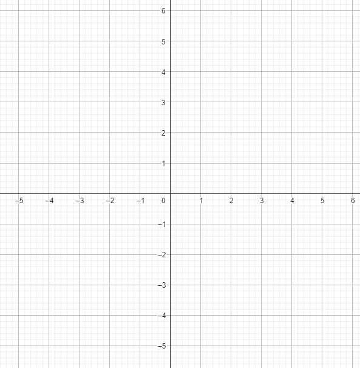{width="3.4257469378827645in"
height="3.5in"}

A reta vertical é orientada para cima e reta horizontal é orientada para
a direita.

É comum usar as letras x para a primeira e y para a segunda e os termos
"coordenada x" e "coordenada y". Cada ponto sobre o plano é representado
por uma letra maiúscula tal como o exemplo, A (valor em x , valor em y).

Iniciando o estudo dos poliedros o matemático suíço Leonhard Euler
(1707-1783) encontrou uma relação entre os vértices, arestas e faces de
qualquer poliedro convexo.

**Alguns tópicos importantes:**

Polígonos são formas geométricas planas compostas por segmentos de reta
que se unem em vértices. Eles são classificados como convexos ou
não-convexos.

Exemplos de polígonos convexo e não convexo.

{width="2.3229166666666665in"
height="1.1938713910761154in"}

Fazer figura semelhante

[Relações de Euler]{.underline}

A relação de Euler nos ajuda a definir a quantidade de vértices, arestas
e faces.

{width="3.619792213473316in"
height="2.6666655730533684in"}

Refazer a imagem

[Elementos da circunferência]{.underline}

{width="1.5302690288713912in"
height="1.5729166666666667in"}

Fazer imagem semelhante

-   Tangente -- um ponto em comum com a circunferência

-   Secante -- dois pontos em comum com a circunferência

-   Corda -- segmento de reta interior a circunferência que não passa
    pelo centro.

-   Diâmetro -- segmento de reta interior a circunferência que passa
    pelo centro.

-   Raio -- segmento de reta entre o centro a e borda da circunferência.

1\) Complete a tabela abaixo

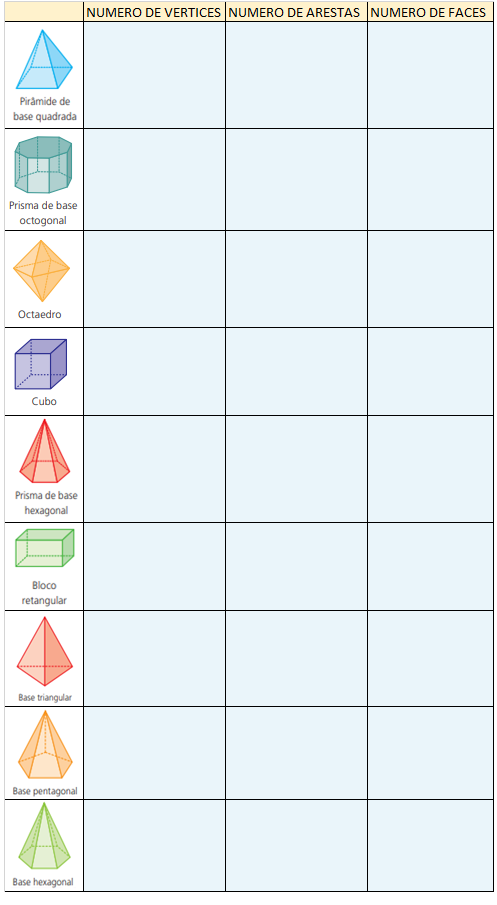{width="5.2in" height="9.4in"}

Reproduzir fielmente a imagem descrita acima podendo ser alterado as
cores, porém não se alterando o conteúdo.

Resposta:

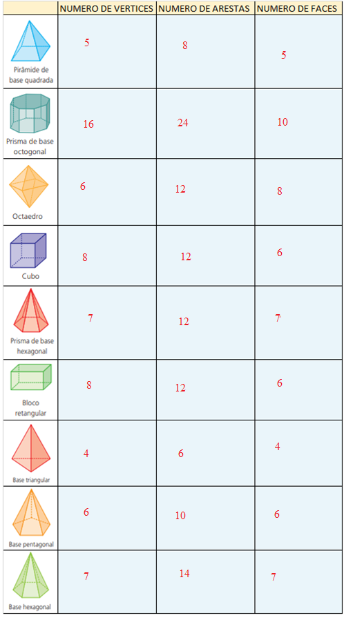{width="4.491982720909887in"
height="8.1in"}

2\) Uma professora resolver lançar um desafio aos seus alunos, onde deu
aos seus alunos várias coordenadas para colocarem em um plano
cartesiano, qual figura se formou ao ligar todos os pontos
correspondentes?

Coordenadas:

A (0,5)

B (-1,2)

C (-4,2)

D (-2,0)

E (-3,-3)

F (0,1)

G (3,-3)

H (2,0)

I (4,2)

J (1,2)

Deixar o espaço de 12 linhas devido a necessidade construção de um plano
cartesiano no espaço

Ligando os pontos obtém se a figura de uma estrela

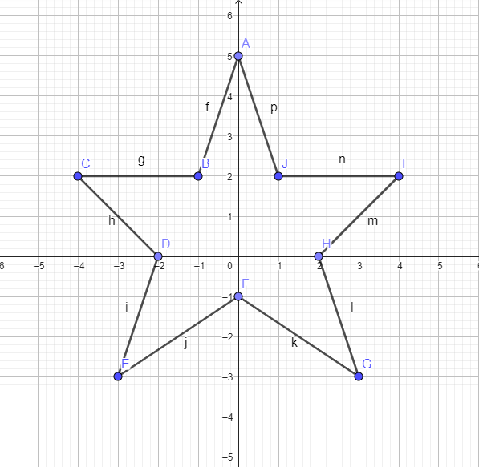{width="3.8541666666666665in"
height="3.5659722222222223in"}

3\) Para realizar o teste físico em determinado concurso da Guarda
municipal, os candidatos devem correr ao redor de uma praça circular
cujo diâmetro mede 90 m. Uma pessoa que dá 9 voltas ao redor dessa praça
percorre: (Dado: π = 3).

a\) 1620 m

b\) 2430m

c\) 4860 m

d\) 6480 m

Deixar o espaço de 3 linhas para resolução

Resposta: alternativa b 2430

4\) Ligue cada figura de poliedro a representação de sua planificação
correspondente

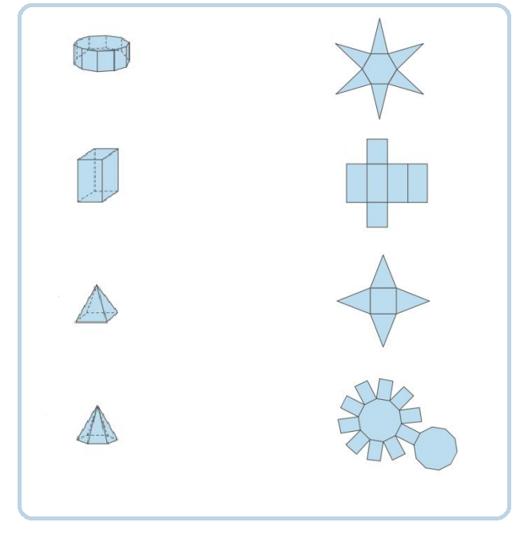{width="3.8958333333333335in"
height="4.067910104986876in"}

Reproduzir fielmente a imagem descrita acima podendo ser alterado as
cores, porém não se alterando o conteúdo.

Resposta:

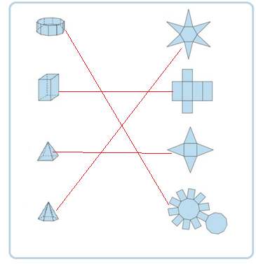{width="2.75in"
height="2.8328762029746284in"}

5\) Na tabela abaixo está transcrito o diâmetro dos planetas do sistema
solar, complete a tabela com os respectivos raios de cada um.

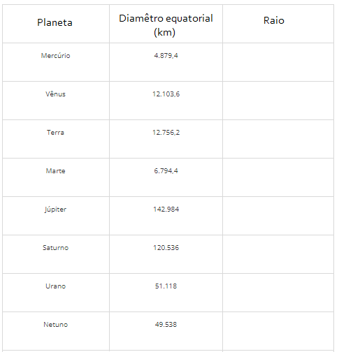{width="4.058333333333334in"
height="4.132121609798775in"}

Reproduzir fielmente a tabela descrita acima podendo ser alterado as
cores, porém não se alterando o conteúdo.

Resposta:

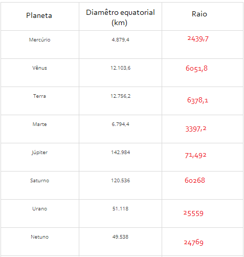{width="4.96875in"
height="5.229166666666667in"}

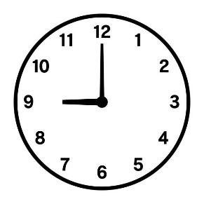{width="1.3208333333333333in"
height="1.3208333333333333in"}6) Qual é a medida do maior ângulo formado
pelos ponteiros de um relógio quando ele marca 9 horas?

\(A\) 90°

\(B\) 120°

\(C\) 160°

\(D\) 270°

Resposta Alternativa d

Deixar o espaço de 3 linhas para resolução e Inserir a figura descrita
acima, podendo ser uma figura semelhante a essa, porém contendo o mesmo
horário.

7\) Se os ângulos internos de um polígono regular medem 36°, então o
número de lados desse polígono é:

a\) 10

b\) 17

c\) 12

d\) 13

Deixar o espaço de 3 linhas para resolução

Resposta alternativa A

8\) Lourdes quer Inovar em sua loja de cosméticos e decidiu embalar seus
produtos em caixas de diferentes formatos. Nas Imagens abaixo estão as
planificações dessas caixas.

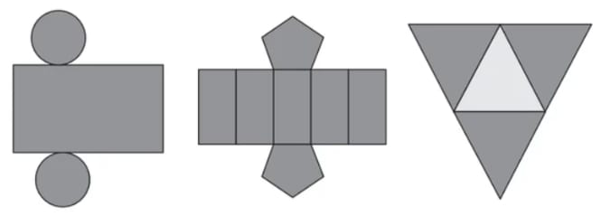{width="5.90625in"
height="2.125in"}

Quais serão os sólidos geométricos que Lourdes obterá a partir dessas
planificações?

A\) Cilindro, prisma de base pentagonal e

Pirâmide.

B\) Cone, prisma de base pentagonal e pirâmide.

C\) Cone, tronco de pirâmide e pirâmide.

D\) Cilindro, tronco de pirâmide e prisma.

Reproduzir fielmente a imagem descrita acima podendo ser alterado as
cores, porém não se alterando o conteúdo.

Resposta Alternativa A

9\) Uma pista de atletismo tem a forma circular e seu diâmetro mede 80
m. Um atleta treinando nessa pista deseja correr 10 km diariamente.
Determine o número mínimo de voltas completas que ele deve dar nessa
pista a cada dia.

Deixar o espaço de 3 linhas para resolução

Resposta: Ele deve completar no mínimo 40 voltas completas.

\num{10} A Linha poligonal é conhecida por formar os polígonos e são de suma
importância nos estudos da geometria. Para ser identificado como um
polígono, uma figura geométrica plana precisa ser:

a\) Aberta e limitada por segmentos de retas que se cruzam.

b\) Fechada e formada por segmentos de retas que não se cruzam.

c\) Aberta e limitada por seguimentos de retas que não se cruzam.

d\) Fechada e formada por seguimentos de retas que se cruzam.

Reposta Alternativa B

Testes:

1\) Deseja-se pregar uma fita decorativa ao redor da tampa de um pote
redondo. Se o diâmetro da tampa mede 12 cm, qual o comprimento mínimo
que a fita deve ter para dar a volta completa na tampa?

Considere pi=3

a\) 72cm

b\) 108 cm

c\) 35 cm

d)11 cm

Resposta: D

BNCC: EF06MA16 EF06MA17 EF06MA18 EF06MA20 EF07MA19 EF07MA20 EF07MA21
EF08MA18 EF09MA11 EF09MA12

Habilidades Saeb: Resolver problemas que envolvam relações entre os
elementos de uma circunferência/círculo (raio, diâmetro, corda, arco,
ângulo central, ângulo inscrito).

Alternativa A: incorreta, pois o aluno pode esquecer que o valor do raio
é a metade do diâmetro, chegando nesse valor.

Alternativa B:Incorreta Ao confundir a formula do perímetro da
circunferência com a formula da área da circunferência chegará a esse
valor.

Alternativa C: Incorreta, ao realizar uma soma ao invés de uma
multiplicação na formula, obterá esse valor.

Alternativa D= Correta, pois ao considerar pi= 3 temos que 2.3.6= 36cm

2\) Uma praça possui o formato circular com diâmetro medindo 20 metros.
Calcule quantos metros quadrados de grama são necessários para preencher
essa área da praça?

Considere pi=3

a\) 300m²

b\) 60 m²

c\) 1200 m²

d\) 300 cm²

Resposta: A

BNCC: EF06MA16 EF06MA17 EF06MA18 EF06MA20 EF07MA19 EF07MA20 EF07MA21
EF08MA18 EF09MA11 EF09MA12

Habilidades Saeb: Resolver problemas que envolvam relações entre os
elementos de uma circunferência/círculo (raio, diâmetro, corda, arco,
ângulo central, ângulo inscrito).

Alternativa A: Correta, pois ao calcular a fórmula da área do círculo,
temos que A= 3 . 10² = 300m²

Alternativa B: Ao realizar o cálculo de perímetro da circunferência, ao
invés do cálculo da área obterá esse valor

Alternativa C: Incorreta, pois o aluno pode esquecer de trocar o
diâmetro pelo raio na formula e chegara a esse valor.

Alternativa D: Incorreta, pois o aluno pode esquecer de verificar que o
valor do enunciado se trata de m² e não cm²,

3\) Num poliedro convexo, o número de faces é 6 e o número de vértices é
8. Então, o número de arestas desse poliedro é:

\(a\) 12

\(b\) 14

\(c\) 2

\(d\) 48

Resposta:

BNCC: EF06MA16 EF06MA17 EF06MA18 EF06MA20 EF07MA19 EF07MA20 EF07MA21
EF08MA18 EF09MA11 EF09MA12

Habilidades Saeb: Relacionar o número de vértices, faces ou arestas de
prismas ou pirâmides, em função do seu polígono da base.

Alternativa A: Correta pois

V+F = A+2

8+6= A+2

14=A+2

A=14-2

A= 12 arestas

Alternativa B: incorreta, pois o aluno pode somar todos os números do
poliedro e chegar a essa conclusão equivocada.

Alternativa C: Incorreta pois o aluno pode realizar uma subtração ao
invés de utilizar a formula.

Alternativa D: incorreta o aluno pode realizar uma multiplicação ao
invés de utilizar a formula.

# Módulo 8

BNCC: EF06MA19

Habilidades Saeb

*  Identificar propriedades e relações existentes entre os elementos de
um triângulo (condição de existência, relações de ordem entre as medidas
dos lados e as medidas dos ângulos internos, soma dos ângulos internos,
determinação da medida de um ângulo interno ou externo).

*  Classificar triângulos ou quadriláteros em relação aos lados ou aos
ângulos internos.

*  Identificar retas ou segmentos de retas concorrentes, paralelos ou
perpendiculares.

*  Identificar relações entre ângulos formados por retas paralelas
cortadas por uma transversal.

*  Resolver problemas que envolvam relações entre ângulos formados por
retas paralelas cortadas por uma transversal, ângulos internos ou
externos de polígonos ou cevianas (altura, bissetriz, mediana,
mediatriz) de polígonos.

*  Resolver problemas que envolvam relações métricas do triângulo
retângulo, incluindo o teorema de Pitágoras.

*  Resolver problemas que envolvam polígonos semelhantes.

*  Resolver problemas que envolvam aplicação das relações de
proporcionalidade abrangendo retas paralelas cortadas por transversais.

*  Determinar o ponto médio de um segmento de reta ou a distância entre
dois pontos quaisquer, dadas as coordenadas desses pontos no plano
cartesiano.

1 -- Triângulos

Os triângulos podem ser classificados pela medida do lado ou pelos
ângulos:

[Lado]{.underline}

-   **Triângulo escaleno**: triângulo que possui todos os lados com
    medidas diferentes.

-   **Triângulos isósceles**: triângulo que possui dois lados com
    medidas iguais.

-   **Triângulo equilátero**: triângulo que possui todos os lados com
    medidas iguais.

[Ângulo]{.underline}

-   **Triângulo acutângulo**: possui todos os ângulos internos menores
    que 90°.

-   **Triângulo obtusângulo**: possui exatamente um ângulo interno maior
    que 90°.

-   **Triângulo retângulo**: possui exatamente um ângulo interno igual a
    90°.

[Propriedades]{.underline}

Estas são as principais propriedades dos triângulos:

-   A soma dos ângulos internos de qualquer triângulo é sempre igual a
    180°.

-   A soma dos ângulos externos de qualquer triângulo é sempre igual a
    360°.

-   A soma das medidas de dois lados de um triângulo é sempre maior que
    a medida do terceiro lado. Essa propriedade é chamada de
    desigualdade triangular, trata-se da condição de existência do
    triângulo.

Atividades

1\) Sabendo que a soma dos ângulos internos de um triangulo
necessariamente é 180° complete as figuras abaixo com seus respectivos
ângulos

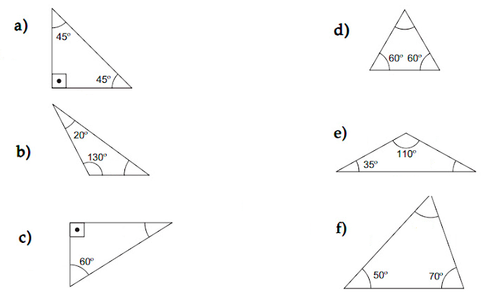{width="5.90625in"
height="3.6354166666666665in"}

Reproduzir fielmente a imagem descrita acima podendo ser alterado as
cores, porém não se alterando o conteúdo.

Respostas:

a\) 90°

b\) 30°

c\) 90° e 30°

d)60°

e\) 35°

f\) 60°

2\) O que é ponto médio?

a\) É um ponto qualquer entre dois outros pontos

b\) É o ponto central entre dois outros pontos.

c\) É um ponto externo a dois pontos quaisquer.

d\) Nenhuma das alternativas

Resposta Alternativa b

3\) Com base no mapa abaixo responda com verdadeiro (V) ou Falso (F)

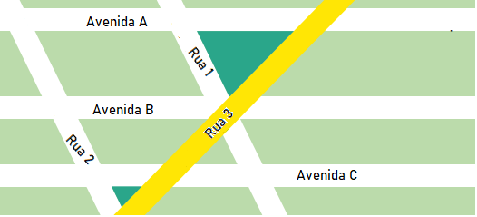{width="5.479166666666667in"
height="2.4895833333333335in"}

( ) As avenidas A e B são paralelas

( ) Pode se considerar que a Rua 2 é paralela a avenida C

( ) A avenida C não é paralela a Avenida B

( ) a rua 3 e a rua 2 são concorrentes

( ) A rua 1 e a rua 3 não são paralelas

( ) A rua 1 e a Rua 2 são concorrentes

Reproduzir fielmente a imagem descrita acima podendo ser alterado as
cores, porém não se alterando o conteúdo.

Respostas

V,F,F,V,V,F

4\) Angélica decidiu pintar um quadro de dimensões 100 cm de largura por
85 cm de altura, com 3 esferas de cores diferentes, qual a área pintada
de cada parte do quadro sabendo que a esfera A tem 60 cm de diâmetro, a
esfera B 20 cm de diâmetro, e a esfera C 10 cm de diâmetro.

Considere pi=3

a\) Área cinza

b\) área azul

c\) Área rosa

d\) Área verde

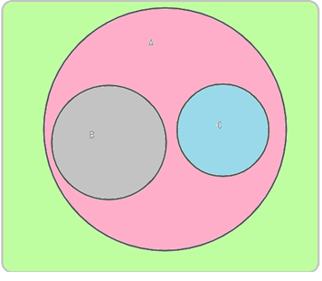{width="3.7083333333333335in"
height="3.2291666666666665in"}

Deixar o espaço de 3 linhas para resolução de cada item acima e
reproduzir fielmente a imagem descrita acima podendo ser alterado as
cores, porém não se alterando o conteúdo.

Respostas:

a\) 1200 cm²

b\) 75 cm²

c\) 2700cm²

d\) 4525 cm²

5 Calcule a diagonal de um retângulo de lados 8 cm e 15 cm.

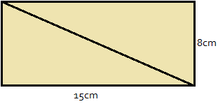{width="3.2444444444444445in"
height="1.5465277777777777in"}

Deixar o espaço de 4 linhas para resolução e reproduzir fielmente a
imagem descrita acima podendo ser alterado as cores, porém não se
alterando o conteúdo.

Resposta

Utilizando Pitágoras obtemos que:

A²= B²+C²

A²=8²+15²

A²=64+225

A²=289

A=17

6\) Estabeleça a correspondência dos itens a seguir com as figuras de 1
a 5.

{width="4.290697725284339in"
height="2.752027559055118in"}

\(3\) bissetriz de um ângulo;

\(4\) ângulos complementares;

\(1\) ângulos suplementares;

\(2\) ângulos adjacentes e complementares;

\(5\) ângulos adjacentes e suplementares.

Reproduzir fielmente a imagem descrita acima podendo ser alterado as
cores, porém não se alterando o conteúdo.

7\) Classifique os ângulos abaixo em agudo, reto e obtuso

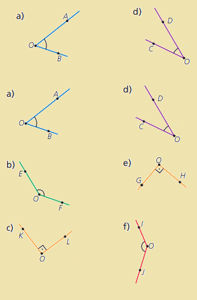{width="3.3604166666666666in"
height="5.104861111111111in"}

Reproduzir fielmente a imagem descrita acima podendo ser alterado as
cores, porém não se alterando o conteúdo.

Respostas:

a\) agudo

b\) Obtuso

c\) Reto

d\) Agudo

e\) Reto

f\) Obtuso

8\) Classifique ordenadamente a sequência de ângulos abaixo e assinale a
alternativa correta:

> {width="3.21875in"
> height="1.9975437445319335in"}
>
> a\) Obtuso, agudo, reto, raso e de uma volta.
>
> b\) Agudo, obtuso, reto, raso e de uma volta.
>
> C\) Obtuso, reto agudo, de uma volta e nulo.

d\) Agudo obtuso de uma volta, reto e raso.

Reproduzir fielmente a imagem descrita acima podendo ser alterado as
cores, porém não se alterando o conteúdo.

Resposta Alternativa B

9\) No interior do segmento (AB) estão os pontos M, N e P, nessa ordem,
de modo que M seja o ponto médio de (AN) e P, o ponto médio de (NB). O
segmento (AB) mede 82 cm e o segmento (AM) mede 11 cm. A medida do
segmento (PB), em cm, é:

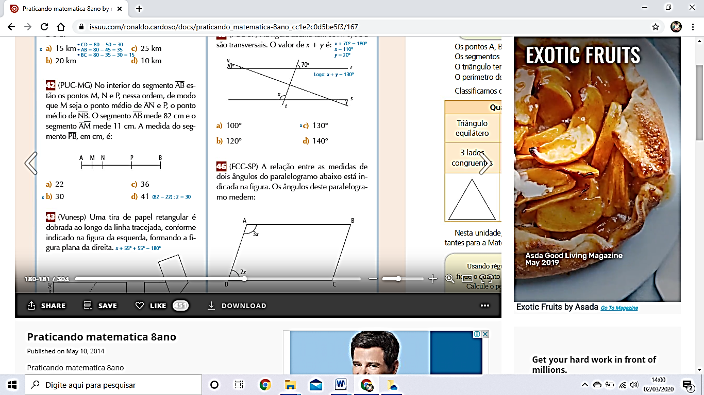{width="2.5in"
height="0.7458333333333333in"}

a)22

b)30

c)36

d)41

Deixar o espaço de 3 linhas para resolução e reproduzir fielmente a
imagem descrita acima podendo ser alterado as cores, porém não se
alterando o conteúdo.

Resposta:

Se o seguimento AM= 11 e M é o ponto médio de AN logo o seguimento AN=22
cm

Subtraindo AN (22) DE AB (82) obtemos o seguimento NB que tem como ponto
médio P que se o seguimento NB possui 60 cm logo seu ponto médio é 30

9\) Sabendo que mediatriz é um segmento que dividi outro segmento ao
meio, e que na figura, a reta m é a mediatriz do segmento BC. Qual é o
valor de x?

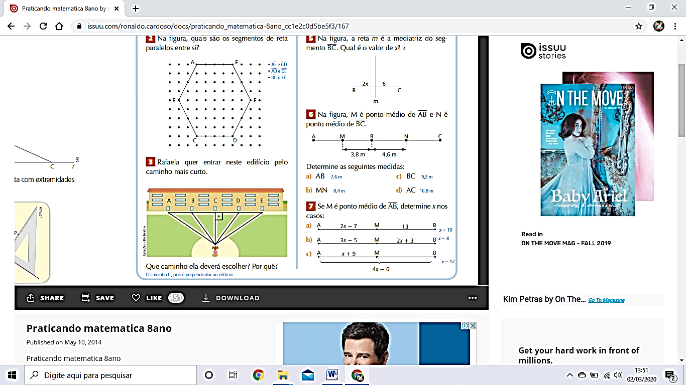{width="1.40625in"
height="1.3315813648293964in"}

a)2

b)3

c)6

d)12

Deixar o espaço de 3 linhas para resolução e Reproduzir fielmente a
imagem descrita acima podendo ser alterado as cores, porém não se
alterando o conteúdo.

Utilizando o método da equação polinomial de grau 1 obtemos que:

2x+6=12

2x=12-6

2x=6

X=6/2

X=3

Logo resposta alternativa b

10\) De acordo com os conceitos de retas paralelas, concorrentes e
perpendiculares, marque as alternativas corretas.

> 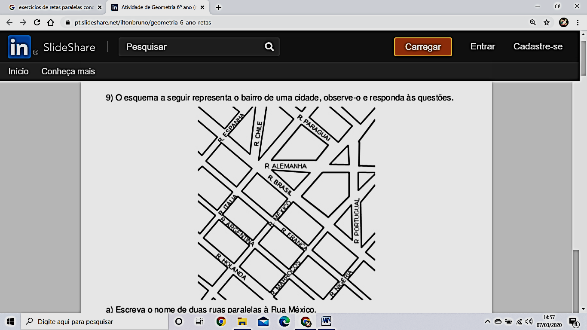{width="3.40625in"
> height="3.6405413385826773in"}

a\) As ruas Alemanha e México são paralelas. F

b\) As ruas Argentina e Itália são perpendiculares. V

c\) As ruas Holanda e Brasil são paralelas. V

d\) As ruas Nigéria e Portugal são concorrentes. V

e\) As ruas Itália e Marrocos são concorrentes F

Reproduzir fielmente o mapa descrito acima podendo ser alterado as
cores, porém não se alterando o conteúdo.

Treino

> 1\) Sabendo que (OP) é bissetriz do ângulo AÔB, qual é o valor de x?

{width="2.1770833333333335in"
height="1.9161931321084864in"}

a)- 2,5

b)13

c)18

d\) 45

Resposta: C

BNCC: EF06MA19

Habilidades Saeb: Identificar relações entre ângulos formados por retas
paralelas cortadas por uma transversal.

Alternativa A: incorreta

Resposta: o aluno pode chegar a essa conclusão somando os valores
literais e dividindo em seguida pelos números restantes.

Alternativa B Incorreta: o aluno pode considerar multiplicar os valores
e dividir após o resultado e chagará a esse valor.

Alternativa C, Correta:

Utilizando os conhecimentos sobre bissetriz obtemos que

As medidas dos Ângulos BÔP e PÔA são iguais, logo

2x+8=3x-10

2x-3x= -10 - 8

-x = -18

x=18

Alternativa D: incorreta, o aluno pela falta de conhecimento sobre
bissetriz pode relembrar que 45 seja o valor da bissetriz do ângulo reto
e chegar a essa conclusão mesmo não se tratando de um ângulo reto.

2\) Marque a alternativa correta em relação à figura abaixo.

> 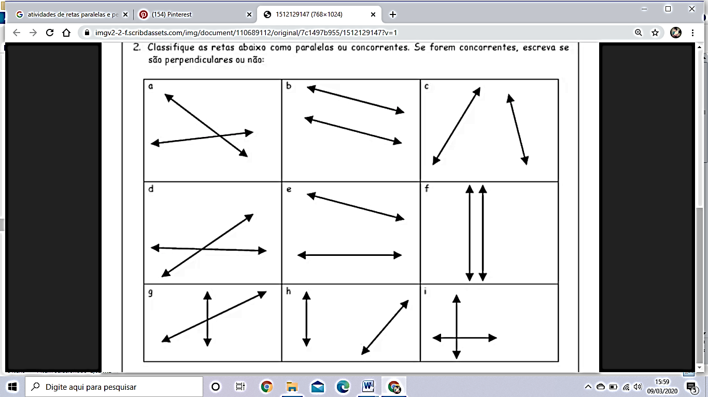{width="4.770833333333333in"
> height="3.2614173228346455in"}

a\) a - concorrente e b-perpendicular

b\) f - paralela e i- perpendicular

c\) g- paralela e h- concorrente

d\) d- concorrente e c- paralela

Reproduzir fielmente a imagem descrita acima podendo ser alterado as
cores, porém não se alterando o conteúdo.

Resposta: B

BNCC: EF06MA19

Habilidades Saeb: Identificar retas ou segmentos de retas concorrentes,
paralelos ou perpendiculares.

Alternativa A: incorreta, o aluno pode confundir retas paralelas com
concorrentes e chegar nessa conclusão.

Alternativa Correta B

Alternativa C: incorreta, o aluno pode esquecer do que significa o
conceito de retas concorrentes.

Alternativa D: incorreta o aluno pode esquecer do conceito do que
significa retas concorrentes e assinalar essa alternativa.

3\) Francisco resolveu fazer um brinquedo de madeira em formato de um
triangulo equilátero para seu filho brincar, sendo assim comprou 3 peças
de madeira com medidas diferentes, 50 cm, 60 cm, e 70 cm, para que ele
corte apenas 2 peças, qual a medida que os lados do triangulo
necessariamente devem ter?

a\) 70 cm

b\) 25 cm

C\) 50 cm

d\) 55 cm

Resposta: C

BNCC: EF06MA19

Habilidades Saeb

*  Identificar propriedades e relações existentes entre os elementos de
um triângulo (condição de existência, relações de ordem entre as medidas
dos lados e as medidas dos ângulos internos, soma dos ângulos internos,
determinação da medida de um ângulo interno ou externo).

*  Classificar triângulos ou quadriláteros em relação aos lados ou aos
ângulos internos.

Alternativa A: incorreta, pois o aluno pode considerar cortar mais peças
que o enunciado recomenda.

Alternativa B: incorreta, pois o aluno pode considerar cortar mais peças
que o enunciado recomenda.

Alternativa C: correta pois: Para cortar apenas 2 peças de madeira o
brinquedo deverá ser um triangulo de lado 50cm. Pois como será um
triangulo equilátero terá 3 lados iguais.

Alternativa D: incorreta, pois o aluno pode considerar cortar mais peças
que o enunciado recomenda.

# Módulo 9

BNCC: EF06MA21

Habilidades Saeb: Descrever ou esboçar deslocamento de pessoas e/ou de
objetos em representações bidimensionais (mapas, croquis etc.), plantas
de ambientes ou vistas, de acordo com condições dadas

Mapa -- Pode ser definido como uma representação reduzida de uma dada
área do espaço geográfico.

Plantas -- Representa um desenho em escala para representar um espaço.

Croqui -- Esboço cartográfico de uma determinada área para ser ter uma
ideia do local, neste caso não há preocupação com escala.

[Escala](https://mundoeducacao.uol.com.br/geografia/a-escala-dos-mapas.htm) --
é a proporção entre a área real e a sua representação em um mapa.

1\) Veja abaixo o mapa onde José mora

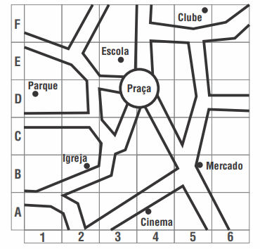{width="3.8604166666666666in"
height="3.686111111111111in"}

No mapa José quer localizar a escola considerando o número e uma letra
qual é a localização da escola?

a\) (2,A)

b\) (3,E)

c\) (2,B)

d\) (1,C)

Reproduzir fielmente o mapa descrito acima podendo ser alterado as
cores, porém não se alterando o conteúdo.

Resposta B

2\) observe abaixo a representação de parte do mapa de uma cidade
planejada

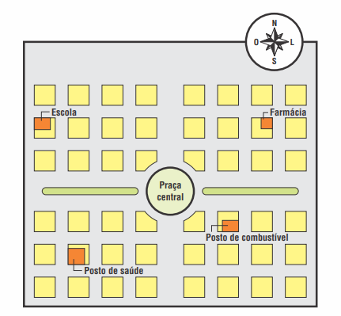{width="3.3953488626421695in"
height="3.143257874015748in"}

Juca saiu da praça central e orientando se por esse mapa caminhou 3
quadras na direção leste e depois, 2 quadras na direção norte diante do
exposto acima, onde Juca parou:

a\) posto de saúde

b\) farmácia

c\) posto de gasolina

d\) escola

Reproduzir fielmente o mapa descrito acima podendo ser alterado as
cores, porém não se alterando o conteúdo.

Resposta: Alternativa C - Farmácia

3\) Observe abaixo o mapa do bairro onde Gabriela mora

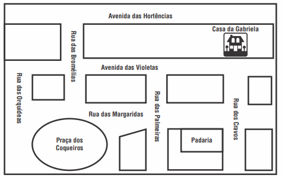{width="4.9534722222222225in"
height="3.1395833333333334in"}

Gabriela estava na Praça dos Coqueiros e passou na padaria antes de ir
para casa. Qual dos caminhos Gabriela fez para chegar em casa?

a\) Entrou na Rua das Margaridas e virou na Rua dos Cravos,

b\) Entrou na Rua das Orquídeas e seguiu pela Avenida das Violetas.

c\) Seguiu pela Rua das Bromélias e virou à esquerda na Avenida das
Hortênsias.

d\) Seguiu pela Rua das Margaridas, entrou na Rua das Palmeiras e virou
à esquerda.

Reproduzir fielmente o mapa descrito acima podendo ser alterado as
cores, porém não se alterando o conteúdo.

Resposta Alternativa A

4\) O croqui abaixo mostra um mapa que fornece as indicações para se
chegar à chácara nele indicada.

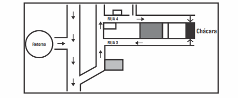{width="4.9534722222222225in"
height="2.046527777777778in"}

Luna, para chegar à chácara, após fazer o retorno, deve:

\(A\) virar à direita, virar à esquerda, entrar na rua 3.

\(B\) virar à direita, virar à esquerda, entrar na rua 4.

\(C\) virar à esquerda, virar à direita, entrar na rua 3.

\(D\) virar à esquerda, virar à esquerda, entrar na rua 4.

Reproduzir fielmente o mapa descrito acima podendo ser alterado as
cores, porém não se alterando o conteúdo.

Resposta Alternativa B

5\) Observe o mapa abaixo.

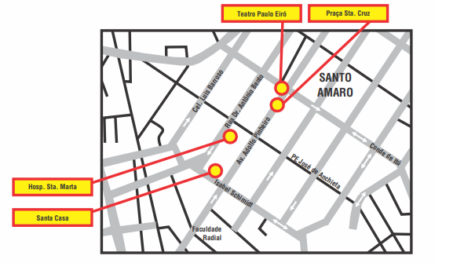{width="5.90625in"
height="3.34375in"}

Localizado na Rua Isabel Schimdt, entre a rua Dr. Antônio Bento e Av.
Adolfo Pinheiro e está:

a\) a Santa Casa

b\) o Hospital Santa Marta.

c\) a Praça Santa Cruz

d\) o Teatro Paulo Eiró.

Reproduzir fielmente o mapa descrito acima podendo ser alterado as
cores, porém não se alterando o conteúdo.

Resposta Alternativa A

6\) A figura abaixo mostra a localização de quatro crianças em relação
às ruas Alegria e Beija-Flor. As demais ruas traçadas são paralelas à
Rua Alegria ou a Rua Beija-flor. A distância entre cada uma das ruas é
de 100m.

Assinale a alternativa correta:

{width="4.197916666666667in"
height="2.9305555555555554in"}

a\) André está à mesma distância das ruas Alegria e Beija-Flor.

b\) Paula está a 100m da Rua Alegria e a 200m da Rua Beija-Flor.

c\) Silvia está a 200m da Rua Alegria e a 100m da Rua Beija-Flor.

d\) Gil está a 200m da Rua Alegria e a 100m da Rua Beija-Flor.

Reproduzir fielmente o mapa descrito acima podendo ser alterado as
cores, porém não se alterando o conteúdo.

Resposta Alternativa A

7\) Observe-o mapa abaixo

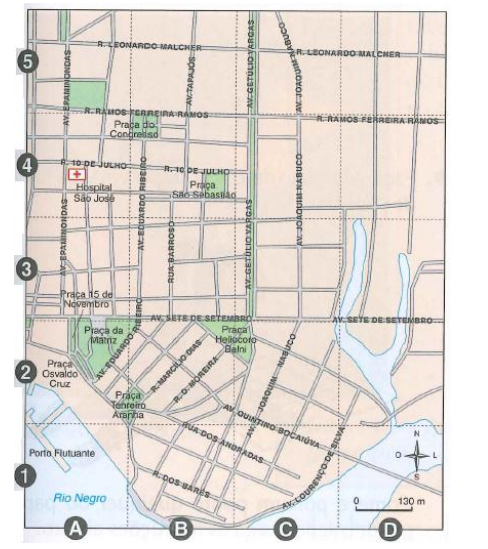{width="5.083333333333333in"
height="5.71875in"}

Segundo o Mapa, a Praça da Matriz e o Hospital São José se localizam,
respectivamente, nas coordenadas:

a\) (A, 2) e (A, 4)

b\) (A, 3) e (B, 4)

c\) (C, 2) e (A, 4)

d\) (A, 1) e (B, 4)

Reproduzir fielmente o mapa descrito acima podendo ser alterado as
cores, porém não se alterando o conteúdo.

Resposta Alternativa A

8\) Hélio desenhou a planta da casa onde mora. Ela tem dois quartos, uma
sala, uma cozinha e um banheiro. Observe essa planta

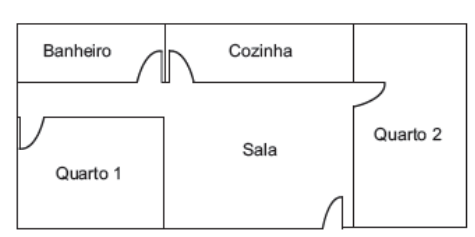{width="4.947916666666667in"
height="2.46875in"}

Ao entrar em sua casa pela porta da sala e virar à direita, Hélio está
indo em direção:

A\) à cozinha.

B\) ao banheiro.

C\) ao quarto 1.

D\) ao quarto 2

Reproduzir fielmente a planta descrita acima podendo ser alterado as
cores, porém não se alterando o conteúdo.

Resposta Alternativa D

9\) A figura abaixo representa o mapa de um bairro, em que cada quadrado
representa um quarteirão, cuja distância entre duas esquinas é de 100m.

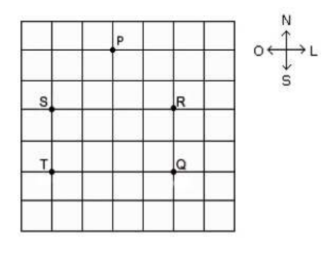{width="4.825694444444444in"
height="3.779166666666667in"}

Uma pessoa saiu da esquina indicada pelo ponto P e percorreu o seguinte
percurso:

• caminhou 300 metros na direção Sul;

• depois caminhou 200 metros na direção Leste;

• e, finalmente, caminhou mais 100 metros na direção Sul.

Ao final desse percurso, essa pessoa chegou na esquina indicada pela
letra

a\) Q.

b\) R

c\) S

d\) T

Reproduzir fielmente a imagem descrita acima podendo ser alterado as
cores, porém não se alterando o conteúdo.

Resposta: Alternativa A

10\) Bia e Celso estão jogando batalha naval. Em dado momento, só sobrou
um submarino para Bia, na posição descrita na figura abaixo.

{width="5.0in"
height="3.5520833333333335in"}

Para Celso ganhar a partida, é preciso que sua jogada seja

a\) A7

b\) D10

c\) F5

d\) G2.

Resposta Alternativa D

Reproduzir fielmente a imagem descrita acima podendo ser alterado as
cores, porém não se alterando o conteúdo.

Treino

1\) Os retângulos da figura representam cidades. Os números na figura
representam os preços dos bilhetes de comboio entre cidades vizinhas. O
Evandro quer ir da cidade A para a cidade B e usando o trajeto que lhe
fica mais barato

{width="5.90625in"
height="2.3854166666666665in"}

Qual é o menor preço que o Pedro tem de pagar para viajar da cidade A
para a cidade B?

Reproduzir fielmente a imagem descrita acima podendo ser alterado as
cores, porém não se alterando o conteúdo.

a\) 80.

b\) 90

c\) 100.

d\) 110.

Resposta: B

BNCC: EF06MA21

Habilidades Saeb: Descrever ou esboçar deslocamento de pessoas e/ou de
objetos em representações bidimensionais (mapas, croquis etc.), plantas
de ambientes ou vistas, de acordo com condições dadas

Alternativa A: incorreta o aluno pode esquecer de somar um quadrinho e
chegar a esse número que pelo quadro é impossível.

Alternativa B Correta: pois Utilizando a Rota 20+10+30+20+10=90

Alternativa C: incorreta: o aluno pode considerar pegar uma rota que não
seja a que realmente se paga menos pedágio

Alternativa D: incorreta: o aluno pode considerar pegar uma rota que não
seja a que realmente se paga menos pedágio

2\) No mapa abaixo, encontram-se representadas as ruas do bairro onde
Natasha mora.

{width="4.760416666666667in"
height="3.4270833333333335in"}

Natasha informou que mora numa rua entre as avenidas A e B e entre as
ruas do hospital e da locadora. Mariana mora na:

a\) Rua 4

b\) Rua 5.

c\) Rua 7.

d\) Rua 9.

Resposta: A

BNCC: EF06MA21

Habilidades Saeb: Descrever ou esboçar deslocamento de pessoas e/ou de
objetos em representações bidimensionais (mapas, croquis etc.), plantas
de ambientes ou vistas, de acordo com condições dadas

Alternativa A: Correta, Rua 4

Alternativa B incorreta, o aluno pode se perder na condução do mapa e
chegar a essa conclusão erroneamente.

Alternativa C: incorreta, o aluno pode se perder na condução do mapa e
chegar a essa conclusão erroneamente.

Alternativa D: incorreta, o aluno pode se perder na condução do mapa e
chegar a essa conclusão erroneamente.

Reproduzir fielmente o mapa descrito acima podendo ser alterado as
cores, porém não se alterando o conteúdo.

# Módulo 10

BNCC: EF06MA31, EF06MA32

Habilidade Saeb:

*  Identificar os indivíduos (universo ou população-alvo da pesquisa),
as variáveis e os tipos de variáveis (quantitativas ou categóricas) em
um conjunto de dados.

*  Representar ou associar os dados de uma pesquisa estatística ou de um
levantamento em listas, tabelas (simples ou de dupla entrada) ou
gráficos (barras simples ou agrupadas, colunas simples ou agrupadas,
pictóricos, de linhas, de setores, ou em histograma).

*  Inferir a finalidade da realização de uma pesquisa estatística ou de
um levantamento, dada uma tabela (simples ou de dupla entrada) ou
gráfico (barras simples ou agrupadas, colunas simples ou agrupadas,
pictóricos, de linhas, de setores ou em histograma) com os dados dessa
pesquisa. - Interpretar o significado das medidas de tendência central
(média aritmética simples, moda e mediana) ou da amplitude.

*  Calcular os valores de medidas de tendência central de uma pesquisa
estatística (média aritmética simples, moda ou mediana).

*  Resolver problemas que envolvam dados estatísticos apresentados em
tabelas (simples ou de dupla entrada) ou gráficos (barras simples ou
agrupadas, colunas simples ou agrupadas, pictóricos, de linhas, de
setores ou em histograma).

*  Argumentar ou analisar argumentações/conclusões com base nos dados
apresentados em tabelas (simples ou de dupla entrada) ou gráficos
(barras simples ou agrupadas, colunas simples ou agrupadas, pictóricos,
de linhas, de setores ou em histograma).

*  Explicar/descrever os passos para a realização de uma pesquisa
estatística ou de um levantamento.

População: todos os indivíduos dentro do grupo que se deseja estudar ou
aferir dados estatísticos.

Amostra: uma porção da população que represente de forma coerente o que
aconteceria se a pesquisa fosse feita como o total da população.

Elaborar uma figura como a abaixo:

{width="4.739583333333333in"
height="2.875in"}

Variável Quantitativa: São aquelas que podem ser facilmente descritas
por números

Exemplos. Quantidade de irmãos, altura, tempo, quantidades de animais de
estimação, etc\...

Variável Qualitativa: são aquelas que não apresentam quantidade, ou
seja, não podem ser medidas por números.

Exemplos: Tamanhos de roupa (P, M e G), cor dos olhos, nível de
escolaridade, etc\...

Tipos de gráficos mais utilizados em estatística:

-   Gráfico de colunas ou barras

Fazer a figura abaixo nos moldes do projeto.

{width="3.71875in"
height="2.2083333333333335in"}

-   Pictograma

Fazer a figura abaixo nos moldes do projeto.

Além disso ao invés de raparigas colocar meninas e no lugar de rapazes
colocar meninos.

{width="5.0in"
height="2.7083333333333335in"}

-   Gráfico de linhas

Fazer a figura abaixo nos moldes do projeto.

Retirar da legenda o nome das emissoras e colocar A, B, C e D.

{width="4.1875in"
height="2.6875in"}

-   Gráfico de setores

Fazer a figura abaixo nos moldes do projeto.

No lugar de autocarro colocar ônibus

{width="2.8854166666666665in"
height="2.03125in"}

1\) A tabela abaixo mostra o número de passageiros transportados por um
trem em uma certa semana.

  Dia da Semana   Número de passageiros
  --------------- -----------------------
  Segunda         280
  Terça           187
  Quarta          211
  Quinta          198
  Sexta           291
  Sábado          110
  Domingo         87

Em que dia dessa semana o trem transportou mais passageiros?

Resposta: Na sexta feira

Reproduzir fielmente a tabela descrita acima podendo ser alterado as
cores, porém não se alterando o conteúdo.

2\) Em uma competição de natação, na prova dos 100 m livres masculino,
os resultados finais foram os seguintes:

{width="3.9270833333333335in"
height="0.8125in"}

Qual a porcentagem de atletas que nadaram em um tempo superior a 46
segundos?

Resposta: 75% dos nadadores nadam acima dos 46 segundos

Deixar o espaço de 3 linhas para resolução e reproduzir fielmente a
tabela descrita acima podendo ser alterado as cores, porém não se
alterando o conteúdo.

3\) A imagem a seguir mostra um mapa de uma sala de aula representando a
cor favorita de casa aluno. Construa uma tabela indicando a frequência e
o percentual correspondente a cada cor.

{width="3.5229166666666667in"
height="2.453472222222222in"}

Deixar o espaço de 8 linhas para resolução e reproduzir fielmente a
imagem descrita acima podendo ser alterado as cores, porém não se
alterando o conteúdo.

Resposta:

  Cores      Frequência   Porcentagem
  ---------- ------------ -------------
  Vermelho   4            13,3
  Azul       5            16,7
  Amarelo    7            23,3
  Rosa       5            16,7
  Laranja    9            30,0

4\) Um zoológico famoso contém em seu interior o total de 3200 animais
que estão separados por classes, observe abaixo o relatório

  Animais no Zoológico   
  ---------------------- -----------------------
  Classes                Quantidade de animais
  Mamíferos              479
  Aves                   1620
  Répteis                640
  Anfíbios               340
  Invertebrados          121

Observando os dados Calcule:

a\) A Porcentagem de mamíferos

b\) A porcentagem de Aves

c\) A porcentagem de Répteis

d\) A porcentagem Anfíbios

e\) A porcentagem Invertebrados

Deixar o espaço de 3 linhas para resolução abaixo de cada item acima
reproduzir fielmente a tabela descrita acima podendo ser alterado as
cores, porém não se alterando o conteúdo.

Respostas:

a\) 14,96875%

b\) 50,625%

c\) 20%

d\) 10,625%

e\) 3,78125%

5\) Leandro decidiu reorganizar suas atividades diárias semanais em uma
tabela, contendo a quantidade de horas de cada atividade.

{width="5.905555555555556in"
height="2.416382327209099in"}

Após a reorganização quantas horas por semana serão destinadas para
atividades escolares?

Deixar o espaço de 3 linhas para resolução e reproduzir fielmente a
tabela descrita acima podendo ser alterado as cores, porém não se
alterando o conteúdo e se possível melhorando um pouco a qualidade dos
pixels pois a tabela acima está com o seu conteúdo levemente desfocado.

Resposta: 5·5+1·2=27 horas semanais para atividades escolares

6\) O gráfico a seguir mostra a evolução mensal das vendas de certo
produto de Julho a

Novembro de 2021

{width="3.3645833333333335in"
height="2.7355774278215224in"}

Sobre as vendas pode se afirmar que

a\) O mês de setembro foi o mês com o maior número de vendas

b\) entre julho e agosto ouve uma queda de vendas

c\) O mês de outubro foi o mês com mais vendas

d\) Entre os meses de agosto e setembro houve uma queda nas vendas

Reproduzir fielmente o gráfico descrito acima podendo ser alterado as
cores, porém não se alterando o conteúdo.

Resposta Correta: Alternativa C

7\) Abaixo temos um gráfico de barras. Cada barra se refere a um mês. Os
meses estão marcados no eixo horizontal. O eixo vertical fornece o
número de bicicletas produzidas pela indústria em cada mês

{width="3.875in"
height="3.5729166666666665in"}

Observe o gráfico e responda:

a\) Qual é o título do gráfico?

b\) Quantas bicicletas foram produzidas em janeiro?

c\) E em maio?

d\) Em que mês a produção de bicicletas foi maior?

Respostas:

a\) Produção de bicicletas superbike 1° semestre de 2021

b\) 150

c\) 250

d\) Junho

Deixar o espaço de 2 linhas para resolução de cada um dos itens acima e
reproduzir fielmente o gráfico descrito acima podendo ser alterado as
cores, porém não se alterando o conteúdo.

8\) Dona Cleuza é uma grande cozinheira, ela sabe fazer vários tipos de
doces e salgados. Para organizar sua produção ela fez uma tabela com as
encomendas da semana.

{width="4.884027777777778in"
height="2.279166666666667in"}

Após completar a tabela responda:

a\) Qual dia da semana houve a maior encomenda?

b\) Qual dia da semana houve a menor encomenda?

c\) Na segunda-feira quantos doces foram encomendados a mais que
salgados?

d\) Na quarta-feira quantos salgados foram encomendados a mais que
doces?

Deixar o espaço de 2 linhas para resolução de cada item acima e
reproduzir fielmente a tabela descrita acima podendo ser alterado as
cores, porém não se alterando o conteúdo.

Resposta:

a\) Terça Feira

b\) Segunda Feira

c\) 12 doces a mais

d\) 111 Salgados a mais

9\) Observe no gráfico abaixo as vendas de uma certa sorveteria.

{width="3.7in" height="2.1in"}

Reproduzir fielmente o gráfico descrito acima podendo ser alterado as
cores porém não se alterando o conteúdo.

a\) Quantos sorvetes foram vendidos:

Segunda-feira: 400

Terça-feira: 300

Quarta-feira: 200

Quinta-feira: 300

Sexta-feira: 500

b\) Quantos sorvetes foram vendidos na sexta-feira a mais que na
quarta-feira? 300

c\) Quantos sorvetes foram vendidos na terça-feira e quinta-feira? 600

d\) Se na quarta-feira fosse vendido o dobro de sorvete, esse valor
seria maior ou menor que sexta-feira? Menor

{width="2.5118055555555556in"
height="2.4770833333333333in"}10) Uma empresa de cosméticos lançou no
mercado 5 produtos diferentes: A, B, C, D e E.

O gráfico ao lado mostra o resultado de uma pesquisa feita para
verificar a preferência dos consumidores em relação a esses produtos.

Se foram entrevistados 2400 consumidores, podemos afirmar que preferem o
produto A:

a\) 1200 consumidores.

b\) 720 consumidores.

c\) 600 consumidores.

d\) 480 consumidores.

Deixar o espaço de 3 linhas para resolução e reproduzir fielmente o
gráfico descrito acima podendo ser alterado as cores porem não se
alterando o conteúdo.

Resposta Alternativa C

Treino:

1\) O trenzinho em que 25% dos vagões estão coloridos é:

{width="3.4652777777777777in"
height="2.384027777777778in"}

a\)

b\)

c\)

d\)

Reproduzir fielmente a imagem descrita acima podendo ser alterado as
cores, porém não se alterando o conteúdo.

Resposta: A

BNCC: EF06MA31, EF06MA32

Habilidade Saeb: Representar ou associar os dados de uma pesquisa
estatística ou de um levantamento em listas, tabelas (simples ou de
dupla entrada) ou gráficos (barras simples ou agrupadas, colunas simples
ou agrupadas, pictóricos, de linhas, de setores, ou em histograma).

Alternativa A Correta

Alternativa B: incorreta, o aluno pode contar vagões a mais que não
estão coloridos e chegar a essa conclusão.

Alternativa C: incorreta, o aluno pode considerar realizar a conta sobre
o represente de vagões que não estão coloridos.

Alternativa D: incorreta o aluno pode não compreender o conceito e
frações e porcentagem e chegar a esse valor erroneamente.

2\) Em um consultório médico, havia 4 pessoas na sala de espera. O
atendimento da primeira pessoa durou 18 minutos; o da segunda, 16
minutos; o da terceira, 14 minutos; o da quarta, 20 minutos.

Qual foi o tempo médio de atendimento, por paciente, nesse consultório?

a\) ( ) 15 minutos

b\) ( ) 16 minutos

c\) ( ) 17 minutos

d\) ( ) 68 minutos

Resposta: C

BNCC: EF06MA31, EF06MA32

Habilidade Saeb:

*  Interpretar o significado das medidas de tendência central (média
aritmética simples, moda e mediana) ou da amplitude.

*  Calcular os valores de medidas de tendência central de uma pesquisa
estatística (média aritmética simples, moda ou mediana).

Alternativa A: incorreta, o aluno pode realizar o cálculo da mediana ao
invés da media aritmética e chegar a essa conclusão

Alternativa b: incorreta, o aluno pode conspirar que o tempo esteja
sendo modificado por uma P.A, de constante de mesmo valor subindo e
descendo o tempo.

Alternativa C: correta pois

Utilizando a média aritmética 18+16+14+20=68

68/4=17

Alternativa D: o aluno pode somar todos os termos e esquecer de dividir
chegando a esse valor.

3\) Cada aluno de uma turma com 60 alunos obteve nota 5 ou nota 10 em
uma lista de atividades. Se a média das notas foi 6, quantos alunos
obtiveram nota 5?

A\) 46

b\) 48

c\) 50

d)52

Resposta: B

BNCC: EF06MA31, EF06MA32

Habilidade Saeb:

*  Interpretar o significado das medidas de tendência central (média
aritmética simples, moda e mediana) ou da amplitude.

*  Calcular os valores de medidas de tendência central de uma pesquisa
estatística (média aritmética simples, moda ou mediana).

Alternativa A: incorreta, o aluno que não compreender corretamente o
enunciado pode calcular 2 notas a menos e chegar a esse resultado.

Alternativa b: Correta 48 alunos.

Alternativa c: incorreta, o aluno que não compreender corretamente o
enunciado pode calcular 2 notas a mais e chegar a esse valor.

Alternativa d: incorreta, o aluno que não compreender corretamente o
enunciado pode calcular 4 notas a mais e chegar a esse valor
erroneamente

# Módulo 11

BNCC: EF06MA24

Habilidade Saeb:

*  Resolver problemas que envolvam medidas de grandezas (comprimento,
massa, tempo, temperatura, capacidade ou volume) em que haja conversões
entre unidades mais usuais. - Resolver problemas que envolvam perímetro
de figuras planas. - Resolver problemas que envolvam área de figuras
planas. - Resolver problemas que envolvam volume de prismas retos ou
cilindros retos

As unidades de medidas de comprimento surgem para padronizar as medidas
de distância. Existem várias unidades de medidas de comprimento, a
utilizada no sistema internacional de unidades é o metro, e seus
múltiplos (quilômetro, hectômetro e decâmetro) e submúltiplos
(decímetro, centímetro milímetro).

Além das unidades de medidas de comprimento apresentadas, existem outras
como as que utilizam o corpo como parâmetro: o palmo, o pé, a polegada.
Ainda, há aquelas que não são do sistema internacional, mas são
utilizadas a depender da região ou de medidas astronômicas, como a
légua, a jarda, a milha e o ano-luz.\"

[Mudança de unidade de medida linear]{.underline}

{width="1.6336636045494313in"
height="0.765670384951881in"}

Refazer imagem

[Mudança de unidades de medida: volume e capacidade]{.underline}

a)  Volume

{width="2.8731769466316712in"
height="0.9207917760279966in"}

Refazer imagem

b)  Capacidade

{width="2.736570428696413in"
height="1.0693066491688539in"}

Refazer imagem

IMPORTANTE

1 m³ = 1 000 Litros

1 cm³ = 1 mL

1 dm³ = 1 Litro

Cálculo de volume

Prismas

{width="1.633474409448819in"
height="1.4751279527559056in"}

Cilindro

{width="1.050090769903762in"
height="1.4167891513560804in"}

Montar imagens iguais

1\) Uma lata de tinta, com a forma de um paralelepípedo retangular reto,
tem as dimensões,

Em centímetros, mostradas na figura abaixo:

{width="1.6979166666666667in"
height="1.8811450131233596in"}

Calcule o volume máximo de tinta que a lata comporta:

Deixar o espaço de 3 linhas para resolução e reproduzir fielmente a
imagem descrita acima, podendo ser alterado as cores, porém não se
alterando o conteúdo.

Resposta: 23040 cm³ de tinta é a capacidade máxima

2\) Um condomínio contém uma cisterna de formato cilíndrico, com 3 m de
altura e2 m de diâmetro qual o volume de agua máximo que a cisterna
comporta?

Utilize 3,0 como aproximação para pi.

Deixar o espaço de 3 linhas para resolução

Resposta: o volume máximo que a cisterna comporta é 9m³

3\) Em uma empresa, os setores alfa e beta fazem acordos diferentes
relativos à carga horária semanal de trabalho. O setor alfa trabalha 38
horas por semana, enquanto o setor beta trabalha 44 horas por semana,
Quantos minutos o setor beta trabalha a mais por semana do que o setor
Alfa?

a)300 minutos

b)315 minutos

c)330 minutos

d)360 minutos

Deixar o espaço de 3 linhas para resolução

Resposta: alternativa D

4\) Calcule

a\) Área de um quadrado de lado 13cm

b\) Perímetro de um quadrado de lado 9cm

c\) Área de um retângulo de lados 4cm e 5 cm

d\) Perímetro de um retângulo de lados 6cm e 4cm

e\) Área de círculo de raio 4 cm, considere (pi=3)

f\) Perímetro de um círculo de diâmetro 8cm (considere pi=3)

Deixar o espaço de 3 linhas para resolução de cada item acima

Respostas

a)169cm²

b)36cm

c)20cm²

d)20cm

e)48 cm²

f)24cm

5\) Marina tem um terreno retangular de 3m por 6 m e pretende cercá-lo
com 3 voltas de arame farpado. Assinale a alternativa que apresenta a
quantidade em metros de arame farpado que ela precisa comprar para fazer
o que pretende.

a\) 20 m

b\) 24 m

c\) 60 m

d\) 54 m

Deixar o espaço de 3 linhas para resolução

Resposta alternativa d

6\) Observe a temperatura registrada em um mesmo dia e horário em 4.

Cidades do mundo.

{width="5.03125in"
height="1.1875in"}

Considerando apenas essas 4 cidades, a diferença entre a maior e a menor
temperatura, em ºC, nesse dia, foi de

a\) 52.

b)50.

c\) 48.

d\) 46.

Deixar o espaço de 3 linhas para resolução reproduzir fielmente a tabela
descrita acima podendo ser alterado as cores, porém não se alterando o
conteúdo

Resposta alternativa b 50 °C

7\) Orlando resolveu concretar seu quintal de forma que ainda sobrasse
espaço para futuramente a construção de um jardim, fez então um esboço
de como seria a área concretada

{width="2.6666666666666665in"
height="1.691402012248469in"}

Seguindo as medidas do esboço acima qual é a área em m² a ser
concretada?

Deixar o espaço de 6 linhas para resolução e Reproduzir fielmente a
imagem descrita acima podendo ser alterado as cores porem não se
alterando o conteúdo.

Resposta 164m²

8\) uma placa avisa: é proibido som alto entre 22 horas e 6 horas.
Durante quantos minutos é proibido som alto?

a)360 minutos

b)800 minutos

c)100 minutos

d)120 minutos

Deixar o espaço de 3 linhas para resolução

Resposta 360 minutos

9\) Pretende-se encher completamente um copo com um liquido. O copo tem
formato cilíndrico, e suas medidas são 10 cm de altura e 4 cm de
diâmetro. A quantidade de liquido que cabe no copo é cerca de

(Utilize p = 3).

a\) 20 mL.

b\) 24 mL.

c)100 mL.

d\) 120 mL.

Deixar o espaço de 3 linhas para resolução

Resposta alternativa d 120 ml

10\) A altura de uma vela mede 28 cm e, conforme ela é consumida, a
medida de sua altura diminui 1mm a cada minuto.

Quanto tempo levará até a vela ser completamente consumida?

a\) 20 min

b\) 2 h

c\) 4 h 40 min

d\) 2 h 20 min

Deixar o espaço de 3 linhas para resolução

Resposta alternativa c

11\) observe as figuras apresentadas a seguir

{width="5.90625in"
height="2.5104166666666665in"}

Reproduzir fielmente as figuras descritas acima podendo ser alterada as
cores, porém não se alterando o conteúdo.

Complete o quadro abaixo contendo o perímetro e área de cada figura

  Figura   Área (cm²)   Perímetro (cm)
  -------- ------------ ----------------
  A                      
  B                      
  C                      
  D                      
  E                      

Reproduzir fielmente a tabela descrita acima podendo ser alterado as
cores porém não se alterando o conteúdo

Resposta:

{width="3.4479166666666665in"
height="1.5833333333333333in"}

Treino

1\) Uma cooperativa agrícola produziu 36 toneladas de feijão. Toda essa
produção será embalada em sacos de 120 kg antes de ser transportada para
os distribuidores. Quantos sacos de feijão serão obtidos depois de
embalada toda a produção?

a\) 300 sacos

b\) 30 sacos

c\) 3 sacos

d\) 3000 sacos

Resposta: A

BNCC: EF06MA24

Habilidade Saeb:

*  Resolver problemas que envolvam medidas de grandezas (comprimento,
massa, tempo, temperatura, capacidade ou volume) em que haja conversões
entre unidades mais usuais.

Alternativa A: correta pois realizando o cálculo de 36 000 : 120 = 300

Alternativa B: incorreta pois o aluno pode converter erroneamente
toneladas para kg e chegar a esse valor.

Alternativa C: incorreta pois o aluno pode converter erroneamente
toneladas para kg e chegar a esse valor.

Alternativa D: incorreta pois o aluno pode converter erroneamente
toneladas para kg e chegar a esse valor.

2\) Um copo cheio de água pesa 325g. Se jogarmos metade da água fora,
seu peso cai para

180g. O peso do copo vazio
é:{width="2.9895833333333335in"
height="1.3854166666666667in"}

a)145g

b)162,5g

c)35g

d)180g

Resposta: C

BNCC: EF06MA24

Habilidade Saeb:

*  Resolver problemas que envolvam medidas de grandezas (comprimento,
massa, tempo, temperatura, capacidade ou volume) em que haja conversões
entre unidades mais usuais.

Alternativa A: incorreta o aluno pode realizar a subtração entre valores
e chegar a esse valor.

Alternativa B:Incorreta, o aluno pode simplesmente dividir o valor 325
por 2 e chegar a essa conclusão.

Alternativa C: Correta, 35g

Alternativa D: incorreta, o aluno pode simplesmente ler o enunciado e
colocar esse valor como correto.

3\) Oito quadrados iguais são colocados lado a lado, formando um
retângulo cujo perímetro é 72 cm. À área de cada quadrado que forma o
retângulo é?

a)16cm²

b)72 cm²

c)64 cm²

d\) 128 cm²

Resposta: A

BNCC: EF06MA24

Habilidade Saeb: Resolver problemas que envolvam área de figuras planas.

Alternativa A: correta 16cm²

Alternativa B: incorreta, o aluno pode considerar que o perímetro e a
área sejam iguais e chegar a essa conclusão.

Alternativa C: incorreta, o aluno pode erroneamente dividir o retângulo
em 2 descobrindo essa área incorretamente.

Alternativa D: incorreta, pois o aluno pode considerar a área final do
retângulo ao invés da área de cada quadrado.

# Módulo 12

BNCC: EF06MA30

Habilidade Saeb: Resolver problemas que envolvam a probabilidade de
ocorrência de um resultado em eventos aleatórios equiprováveis
independentes ou dependentes.

Probabilidade é um essencial à vida dos alunos e extremamente importante
em provas futuras que farão. Explore ao máximo os conceitos com eles
falando de uma maneira leve e interessante para que desperte o gosto dos
alunos.

PROBABILIDADE: é um número p, , que indica a chance de um determinado
resultado ocorrer. O número 0 representa uma probabilidade de 0%, ou
seja, chance nenhuma do resultado ocorrer, enquanto o número 1
corresponde a probabilidade do 100%, o que quer dizer que será certeza
que o evento ocorrerá.

FENÔMENOS ALEATÓRIOS: são fenômenos que mesmo conhecendo todos os
resultados possíveis não podemos, a cada ocorrência, precisar o
resultado final.

ESPAÇO AMOSTRAL: (E) é o conjunto que reúne todos os resultados
possíveis de um fenômeno aleatório.

EVENTO: (A) é o conjunto que reúne todos os resultados de interesse.

{width="4.958333333333333in"
height="1.4791666666666667in"}

Produzir uma figura como essa

Atividades:

{width="0.9375in"
height="0.9375in"}1) Uma moeda é lançada 3 vezes. Qual a probabilidade
de:

a\) sair exatamente 1 cara

b\) sair pelo menos 1 cara

Deixar o espaço de 2 linhas para resolução e inserir a figura descrita
acima, podendo ser uma figura semelhante a essa.

Resposta: a) 3/8 b) 7/8

{width="1.1770833333333333in"
height="0.6729166666666667in"}2) Dois dados foram lançados. Qual a
probabilidade de a soma dos pontos obtidos ser:

a\) S=8

b\) S\>8

Deixar o espaço de 3 linhas para resolução e inserir a figura descrita
acima, podendo ser uma figura semelhante a essa.

Resposta a) 5/36 b) 5/18

{width="0.9791666666666666in"
height="0.9791666666666666in"}3 -- Ronaldo tem 4 camisetas e 3 bermudas.
De quantas maneiras diferentes Ronaldo pode se vestir usando sempre uma
bermuda e uma camiseta?

Deixar o espaço de 2 linhas para resolução e inserir a figura descrita
acima, podendo ser uma figura semelhante a essa.

Resposta: 12 maneiras

{width="1.6854166666666666in"
height="1.5041666666666667in"}4) Uma urna contém 100 bolinhas numeradas
de 1 a 100. Uma bolinha é escolhida e é observado seu número. Admitindo
probabilidades iguais a 1/100 para todos os eventos elementares, qual a
probabilidade de:

a\) Observarmos um múltiplo de 6 e de 8 simultaneamente?

b\) Observarmos um múltiplo de 6 ou de 8?

c\) Observarmos um número não múltiplo de 5?

Deixar o espaço de 3 linhas para resolução para cada item acima e
inserir a figura descrita acima, podendo ser uma figura semelhante a
essa.

Respostas

a\) 1/25

b\) 6/25

c\) 4/5

5\) Uma urna contém 6 bolas pretas, 2 brancas e 10 amarelas. Uma bola é
escolhida ao acaso na urna. Qual a probabilidade de:

a\) A bola não ser amarela

b\) A bola ser branca ou preta

c\) A bola não ser branca, nem amarela

Deixar o espaço de 2 linhas para resolução para cada item acima

Respostas

a\) 4/9

b\) 4/9

c\) 1/3

6\) Num grupo de 500 estudantes, 80 estudam Engenharia, 150 estudam
Economia e 10 estudam Engenharia e Economia. Se um aluno é escolhido ao
acaso, qual a probabilidade de que:

{width="2.426388888888889in"
height="1.34375in"}a) Ele estude Economia e Engenharia

b\) Ele estude somente Engenharia

c\) Ele estude somente Economia

d\) Ele não estude Engenharia nem Economia

e\) Ele estude Engenharia ou Economia

Deixar o espaço de 2 linhas para resolução de cada item acima e inserir
a figura descrita acima, podendo ser uma figura semelhante a essa.

a\) 1/50

b\) 7/50

c\) 7/25

d\) 14/25

e\) 11/25

{width="1.15625in"
height="1.15625in"}7) De um grupo de 200 pessoas, 160 têm fator Rh
positivo, 100 têm sangue tipo O e 80 têm fator Rh positivo e sangue tipo
O. Se uma dessas pessoas for selecionada ao acaso, qual a probabilidade
de:

a\) Seu sangue ter fator Rh positivo

b\) Seu sangue não ser tipo O

c\) Seu sangue ter fator Rh positivo ou ser tipo O

Deixar o espaço de 2 linhas para resolução de cada item acima e inserir
a figura descrita acima, podendo ser uma figura semelhante a essa.

a\) 4/5

b\) 1/2

c\) 9/10

8\) Na loteria são sorteados 5 dezenas distintas dentre as dezenas 00,
01, 02, 03, \..., 99. Um apostador escolhe 10 dezenas. Determine a
probabilidade dele fazer:

{width="1.2916666666666667in"
height="1.2916666666666667in"}a) Um terno

b\) Uma quadra

c\) A quina

Deixar o espaço de 3 linhas para resolução de cada item acima e inserir
a figura descrita acima, podendo ser uma figura semelhante a essa.

a\) 0,638353%

b\) 0,025104%

c\) 0,000335%

9\) Com os dígitos 1, 2, 3, 4, 5 são formados números de 4 algarismos
distintos. Um deles é escolhido ao acaso. Qual a probabilidade de ele
ser:

a\) par

b\) ímpar

Deixar o espaço de 2 linhas para resolução de cada item acima

a\) 2/5

b\) 3/5

10\) Oito pessoas (entre elas Pedro e Silvia) são dispostas ao acaso
numa fila. Qual a probabilidade de:

a\) Pedro e Silvia ficarem juntos

b\) Pedro e Silvia ficarem separados

Deixar o espaço de 2 linhas para resolução para cada item acima

a\) 1/4

b\) 3/4

11\) Uma urna contém 5 bolas vermelhas e 3 brancas. Duas bolas são
extraídas ao acaso, com reposição. Qual a probabilidade de:

a\) ambas serem vermelhas

b\) ambas serem brancas

Deixar o espaço de 2 linhas para resolução de cada item acima

a\) 25/64

b\) 9/64

Treino

1 -- Na lanchonete, você pode escolher entre 4 tipos de pães para seu
sanduíche pão de forma, pão francês, pão sírio e pão preto. Você pode
escolher também 5 tipos de recheios: mortadela, queijo, presunto, peito
de peru ou peito de frango. De quantas maneiras diferentes você pode
pedir seu sanduíche com apenas um recheio?

a\) 20 maneiras

b\) 9 maneiras

c\) 1024 maneiras

d\) 1 maneira

BNCC: EF06MA30

Habilidade Saeb: Resolver problemas que envolvam a probabilidade de
ocorrência de um resultado em eventos aleatórios equiprováveis
independentes ou dependentes.

Alternativa A: correta, pois 4 x 5 = 20 maneiras

Alternativa B: incorreta pois o aluno pode realizar a soma ao invés da
multiplicação

Alternativa C: incorreta, pois o aluno pode realizar a potenciação ao
invés da multiplicação.

Alternativa D: incorreta, o aluno pode realizar a subtração ao invés da
multiplicação

2 -- Dona Josefa vende bolas de sorvete em sua casa. Ela oferece 6
sabores aos seus clientes: chocolate, uva, morango, creme, limão e
flocos. Geralmente seus clientes pedem duas bolas. Quantas combinações
de duas bolas são possível fazer com esses sabores de sorvete?

a\) 1combinação

b\) 46 656 combinações

c)36 combinações

d\) 12 combinações

BNCC: EF06MA30

Habilidade Saeb: Resolver problemas que envolvam a probabilidade de
ocorrência de um resultado em eventos aleatórios equiprováveis
independentes ou dependentes.

Alternativa A: incorreta, o aluno pode realizar a soma ao invés da
multiplicação e chegar a esse resultado

Alternativa b: incorreta, o aluno pode realizar uma potenciação ao invés
da multiplicação

Alternativa c Correta: 36 combinações

Alternativa D: incorreta, o aluno pode realizar uma soma ao invés da
multiplicação

3\) Considere o conjunto D = e o conjunto H formado por todos os
subconjuntos de D com 2 elementos. Escolhendo-se ao acaso um elemento B
H, qual a probabilidade da soma de seus elementos ser 183?

a\) 1/640

b)1/680

c\) 1/ 700

d\) 1/730

BNCC: EF06MA30

Habilidade Saeb: Resolver problemas que envolvam a probabilidade de
ocorrência de um resultado em eventos aleatórios equiprováveis
independentes ou dependentes.

Alternativa A: incorreta, ao não obter um conhecimento prévio sobre
conjuntos e subconjuntos o aluno buscará por alternativas aleatórias
pares como formas de buscar uma solução.

Alternativa B: incorreta, ao não obter um conhecimento prévio sobre
conjuntos e subconjuntos o aluno buscará por alternativas aleatórias
pares como formas de buscar uma solução.

Alternativa C: incorreta, ao não obter um conhecimento prévio sobre
conjuntos e subconjuntos o aluno buscará por alternativas aleatórias
pares como formas de buscar uma solução.

alternativa D, correta 1/730

Simulado 1

1\) O maior cometa já descoberto é o Holmes, que possui 2 251 km de
diâmetro

{width="3.7178182414698164in"
height="1.9672889326334209in"}

Inserir a figura descrita acima podendo ser outra fotografia, dede que
seja do mesmo planeta

Quantas classes possui o número que representa o diâmetro do cometa?

a\) 3

b\) 2

c\) 2 251

d\) 4

BNCC: EF06MA01: Utilizar números naturais, inteiros, racionais e reais,
inclusive raiz quadrada, para resolver problemas com valores
aproximados, utilizando calculadora, mentalmente ou por meio de
estimativas, com ou sem o uso de tecnologias digitais.

Alternativa A: incorreta: caso o aluno resolva transformar km e m, esse
seria o valor, mas não é isso que o enunciado pede.

Resposta: Alternativa B

O número 2 251 possui 2 classes e 4 ordens.

Alternativa C: incorreta, o aluno pode considerar que o numeral
signifique o valor da classe, o que está incorreto.

Alternativa D: incorreta o aluno pode confundir classes com ordens.

2\) Vilma possui um tabuleiro quadriculado com 12 quadradinhos de
largura por 12 quadradinhos de comprimento. Quantos quadradinhos possui
o tabuleiro de Vilma?

a\) 1

b\) 24

c\) 124

d\) 144

BNCC: EF06MA01: Utilizar números naturais, inteiros, racionais e reais,
inclusive raiz quadrada, para resolver problemas com valores
aproximados, utilizando calculadora, mentalmente ou por meio de
estimativas, com ou sem o uso de tecnologias digitais.

Alternativa A: Incorreta, o aluno pode realizar uma divisão ao invés da
multiplicação

Alternativa B:Incorreta, o aluno pode realizar uma soma ao invés da
multiplicação

Alternativa C: Incorreta, pois por semelhança que 12+ 12 seja 24 o aluno
pode assinalar essa erroneamente.

Alternativa D: correta pois

Número de quadradinhos: 12 ·12 = 144.

3 - Em um residencial serão plantadas ao lado da rua de comprimento AB.
Elas serão plantadas igualmente espaçadas como se fosse uma reta
numérica conforme a figura:

Produzir uma figura semelhante a abaixo. Os espaços entre as árvores
devem ser os mesmos e a quantidade de espaços não pode ser alterada.

{width="5.0in"
height="1.1979166666666667in"}

Qual a fração que a distância entre a primeira e a terceira árvores
representa com relação ao tamanho total?

> a)1/4
>
> b)2/5
>
> c)1/3
>
> d)1/5

Alternativa A: incorreta pois o aluno pode visualizar erroneamente o
número de arvores na figura acima e chegar a essa conclusão
precipitadamente

Alternativa B: Correta.

BNCC: EF05MA03, EF05MA04, EF05MA06

Como o tamanho total está dividido em 5 partes iguais a fração será 2/5.

Alternativa C: incorreta o aluno pode simplesmente considerar todas as
arvores e chegar nesse valor.

Alternativa D: incorreta, ao contar uma árvore a menos o aluno chegaria
a esse valor incorretamente.

4\) Um produtor vendeu sua produção no valor de R\$ 1 000,00 a um
feirante com 20% de lucro e este revendeu essas mercadorias com 20 % de
lucro. Sendo assim o valor final da mercadoria foi de:

a\) R\$ 1 020,00

b\) R\$ 1 200,00

c\) R\$ 1 400,00

d\) R\$ 1 440,00

Alternativa A: incorreta, o aluno pode realizar uma soma ao invés de
calcular a porcentagem e chegar a esse valor.

Alternativa b: incorreta, o aluno pode realizar o cálculo de apenas uma
parte do enunciado esquecendo o restante.

Alternativa C: o aluno pode considerar que o mesmo valor dado de 20%
para a primeira parte do enunciado seria o mesmo para a segunda parte, o
que está equivocado.

Alternativa D: Correta.

1 000·1,2·1,2 = R\$ 1 440,0

BNCC: EF06MA14: Resolver problemas envolvendo o cálculo de porcentagens
de um número natural.

5 -- Jean foi ao supermercado e gastou R\$ 19,00 comprando seu chocolate
favorito. Se cada unidade do chocolate custa R\$ 4,75, quantos
chocolates Jean comprou?

> a)14,25
>
> b)4
>
> c\) 23, 75
>
> d)90,25

Alternativa A: incorreta pois o aluno pode realizar a subtração ao invés
da divisão

Alternativa B: correta

4,75· x = 19

x = 4 chocolates

Alternativa C: Alternativa A: incorreta pois o aluno pode realizar a
soma ao invés da divisão

Alternativa D: Alternativa A: incorreta pois o aluno pode realizar a
multiplicação ao invés da divisão

6\) Fred foi comemorar a promoção que recebeu de seu chefe em uma
pizzaria. Inicialmente resolveram pedir 3 pizzas e perceberam que o
valor total seria de R\$ 135,00. Se após alguns cálculos resolvessem
comprar 8 pizzas, o valor que seria pago é de:

Colocar a imagem abaixo

<https://img.freepik.com/fotos-gratis/pizza-de-ingredientes-misturados-em-uma-placa-de-madeira_114579-9317.jpg?w=1060&t=st=1677438726~exp=1677439326~hmac=414162b34390b8a3e55b259971404deb4b174cfe1661757105e4ac4078bf44b1>

a.  R\$ 45,00

b.  R\$ 135,00

c.  R\$ 180,00

d.  R\$ 360,00

Alternativa A: incorreta, esse seria o valor de apenas 1 pizza.

Alternativa B: incorreta esse seria o valor de apenas 3 pizzas

Alternativa C: incorreta esse seria o valor de apenas 4 pizzas

BNCC: EF06MA07: Resolver problemas que envolvam expressões numéricas com
números naturais e com o uso das propriedades das operações.

Resposta: D

Valor de cada pizza: R\$ 135,00/3 = R\$ 45,00

Valor de 8 pizzas: 8 x 45,00 = R\$ 380,00

7 - Pelas regras de um processo seletivo, o candidato que será aprovado
será aquele que tirar todas as notas acima de 30 além disso obtiver o
maior número de notas iguais. As notas de 4 candidatos foram colocadas
na tabela abaixo:

  Candidato   Português   Matemática   Direito   Informática
  ----------- ----------- ------------ --------- -------------
  A           33          33           33        34
  B           32          39           32        40
  C           24          37           40        42
  D           36          16           26        40

Segundo as regras do concurso, o candidato que será aprovado é a
candidato:

a.  A

b.  B

c.  C

d.  D

BNCC: EF06MA19: Resolver problemas que envolvam informações apresentadas
em gráficos ou tabelas.

Alternativa A: Correta

Pela análise da tabela percebe-se que o candidato A teve todas as notas
acima de 30 e é o que teve mais notas iguais. Portanto, o candidato A
deverá ser aprovado.

Alternativa B: incorreta o aluno pode observar erroneamente os dados da
tabela e chegar a essa conclusão sem fundamentos.

Alternativa C: incorreta o aluno pode observar erroneamente os dados da
tabela e chegar a essa conclusão sem fundamentos.

Alternativa d: incorreta o aluno pode observar erroneamente os dados da
tabela e chegar a essa conclusão sem fundamentos.

8 - Uma escola fez um levantamento sobre a quantidade de alunos em dois
anos do ensino fundamental. Os dados foram apresentados no gráfico
abaixo:

Construir um gráfico como o abaixo na formatação do projeto

{width="3.78125in"
height="1.9479166666666667in"}

Após analisar o gráfico, calcule e assinale a alternativa que traz o
número total de alunos do 4º ano.

a.  60

b.  86

c.  62

d.  55

Alternativa A: incorreta, o aluno pode considerar o valor da turma a
como resposta

BNCC: EF06MA19: Resolver problemas que envolvam informações apresentadas
em gráficos ou tabelas.

Resposta: B

Número de alunos do 4º ano: 32 + 29 + 25 = 86

Alternativa C: incorreta, o aluno pode considerar o valor da turma a
como resposta

Alternativa D: incorreta, o aluno pode considerar o valor da turma a
como resposta

9 - Mateus precisa ir ao dentista essa semana. Escolhendo ao acaso um
dia da semana para ir ao dentista, qual a probabilidade de Mateus
escolher uma segunda-feira ou uma quinta-feira?

a.  1/7

b.  2/7

c.  1/5

d.  2/5

Alternativa A: incorreta o aluno pode considerar um dia ao invés das
duas incógnitas.

Resposta: B

Dias da semana: 7

Escolha: 2

Probabilidade: 2/7

Alternativa C: incorreta o aluno pode considerar um dia do meio da
semana encontrar erroneamente esse valor.

Alternativa D: incorreta o aluno pode considerar dois dias do meio da
semana apenas e encontrar erroneamente esse valor.

10 - Uma máquina leva 6 horas para fazer uma peça. Quantas horas ela
levará para fazer 3 peças?

a\) 9 horas

b\) 2 horas

c\) 18 horas

d\) 216 horas

EF06MA16: Resolver problemas utilizando a noção de proporção. 

EF06MA18: Resolver problemas que envolvam variação de grandezas (por
exemplo: preço final de uma mercadoria com desconto, valor de prestações
com acréscimo, reconhecimento de variações proporcionais entre
grandezas, entre outros).

Alternativa A: incorreta o aluno pode realizar uma soma ao invés de uma
razão

Alternativa B: incorreta o aluno pode realizar uma divisão ao invés de
uma razão

Alternativa C: correta pois

Como cada máquina faz uma peça a cada 6 horas, ao triplicar a quantidade
de peças iremos triplicar o tempo.

Alternativa d: incorreta o aluno pode realizar uma potenciação ao invés
de uma razão

11 - Um carro percorre 240 km em 4 horas. Qual a velocidade média do
carro?

a\) 236 km/h

b\) 60 km/h

c\) 244 km/h

d\) 960 km/h

EF06MA16: Resolver problemas utilizando a noção de proporção. 

EF06MA18: Resolver problemas que envolvam variação de grandezas (por
exemplo: preço final de uma mercadoria com desconto, valor de prestações
com acréscimo, reconhecimento de variações proporcionais entre
grandezas, entre outros).

Alternativa A: incorreta o aluno pode realizar uma subtração ao invés de
uma razão

Alternativa B Correta.

A razão entre a distância e tempo teremos a velocidade.

Alternativa C: incorreta o aluno pode realizar uma soma ao invés de uma
razão.

Alternativa D: incorreta o aluno pode realizar uma potência ao invés de
uma razão.

12 - Escreva o número romano correspondente ao número decimal 1985.

a\) MCMLXXXIII

b\) MCMLXXXIV

c\) MCMLXXXV

d\) MCMLXXXVI

Alternativa A: o aluno pode compreender erroneamente a numeração romana
e seu sistema consequentemente não tendo um fundamento básico qualquer
valor descrito nas alternativas será um valor possível para que o aluno
seja induzido a qualquer resposta.

Alternativa B: o aluno pode compreender erroneamente a numeração romana
e seu sistema consequentemente não tendo um fundamento básico qualquer
valor descrito nas alternativas será um valor possível para que o aluno
seja induzido a qualquer resposta.

Resposta: C

M = 1000

CM = 900

LXXX = 80

V = 5

Alternativa D: o aluno pode compreender erroneamente a numeração romana
e seu sistema consequentemente não tendo um fundamento básico qualquer
valor descrito nas alternativas será um valor possível para que o aluno
seja induzido a qualquer resposta.

13 - Uma folha de papel tem 25 mm de largura. Qual é a medida
equivalente em centímetros?

a\) 0,0025 cm

b\) 0,25 cm

c\) 2,5 cm

d\) 25 cm

BNCC: EF06MA30: Utilizar unidades de medida padronizadas para resolver
problemas que envolvam medidas de comprimento.

Alternativa A: incorreta, o aluno pode colocar erroneamente o valor de
"zeros" na expressão obtendo um resultado equivocado.

Alternativa b: incorreta, o aluno pode colocar erroneamente o valor de
"zeros" na expressão obtendo um resultado equivocado.

Resposta: C

1 cm = 10 mm, então 25 mm = 25 ÷ 10 = 2,5 cm.

Alternativa d: incorreta, o aluno pode colocar erroneamente o valor de
"zeros" na expressão obtendo um resultado equivocado.

14 -- Observe a fração $\frac{1}{2}$.

Ela pode ser representada pela figura:

{width="3.5753094925634294in"
height="4.108689851268592in"}

Refazer as imagens adequando a escrita da alternativa de maneira
adequada.

Alternativa A: incorreta, o aluno ao não compreender o conceito correto
de ½ (meio ou metade), logo qualquer alternativa passa a ser válida como
reposta.

Alternativa B: incorreta, o aluno ao não compreender o conceito correto
de ½ (meio ou metade), logo qualquer alternativa passa a ser válida como
reposta.

Alternativa C: incorreta, o aluno ao não compreender o conceito correto
de ½ (meio ou metade), logo qualquer alternativa passa a ser válida como
reposta.

Alternativa D: correta, pois

A alternativa A representa 4/3, alternativa B representa 7/8,
alternativa C representa 6/8 e alternativa D representa 6/12 que é
equivalente a 1/2.

BNCC: EF06MA24: Utilizar a simetria como recurso para construção de
desenhos e problemas geométricos.

15 -- Observe a figura:

{width="3.016928040244969in"
height="2.383540026246719in"}

A vista 3 pode ser representada por:

{width="3.591978346456693in"
height="2.8252449693788275in"}

Refazer as imagens das alternativas e enunciado.

Alternativa A: incorreta, a falta de adaptação a planificações e vistas
aéreas pode levar ao aluno confusão de figuras chegando a assinalar essa
alternativa sem compreender realmente o que a figura representa.

Alternativa B: incorreta, a falta de adaptação a planificações e vistas
aéreas pode levar ao aluno confusão de figuras chegando a assinalar essa
alternativa sem compreender realmente o que a figura representa.

BNCC: EF06MA24: Utilizar a simetria como recurso para construção de
desenhos e problemas geométricos.

Resposta C

A vista 1 está representada na alternativa A, vista 2 na alternativa B,
vista 3 na alternativa C e a alternativa D não representa nenhuma vista,
pois tem uma sequência de 4 blocos.

Alternativa D: incorreta, a falta de adaptação a planificações e vistas
aéreas pode levar ao aluno confusão de figuras chegando a assinalar essa
alternativa sem compreender realmente o que a figura representa.

Simulado 2

1\) Marcos têm três filhos cujas idades foram representadas em números
romanos:

-   José tem IX anos de idade

-   André, o mais velho, tem XXIII anos

-   Joaquim, o mais novo possui VII anos de idade.

Sabendo-se que a idade de Marcos é igual a soma das idades de seus
filhos, podemos afirmar que Marcos possui:

a\) 30 anos de idade

b\) 35 anos de idade

c\) 40 anos de idade

d\) 45 anos de idade

Alternativa A: incorreta, a não compressão do sistema romano de
numeração o aluno pode chegar a essa conclusão erroneamente

Alternativa B: incorreta, a não compressão do sistema romano de
numeração o aluno pode chegar a essa conclusão erroneamente

Resposta: Alternativa C

X = 10

XXIII = 23

VII = 7

Idade de Marcos: 10 + 23 + 7 = 40 anos

Alternativa D: incorreta, a não compressão do sistema romano de
numeração o aluno pode chegar a essa conclusão erroneamente

2\) Entre algumas famílias foram distribuídas 240 cadernos, 576 lápis, e
1 080 borrachas. A distribuição foi feita de tal modo que o maior número
de famílias fosse contemplado e que cada família recebesse o mesmo
número de lápis, o mesmo número de cadernos e o mesmo número de
borrachas. Nessas condições o número de famílias que recebeu um kit
contendo lápis, borrachas e cadernos foi de:

{width="0.8941437007874016in"
height="0.8941437007874016in"}a) 24 b) 28 c) 30 d) 42

Alternativa A: ao não ter um conhecimento prévio que o enunciado demanda
a realização do m.d.c. como forma de resposta, qualquer alternativa
plausível passa a ser um resposta viável ao aluno.

Alternativa B: ao não ter um conhecimento prévio que o enunciado demanda
a realização do m.d.c. como forma de resposta, qualquer alternativa
plausível passa a ser um resposta viável ao aluno

Alternativa C, Correta

MDC (240; 576; 1 080) = 30 famílias

Alternativa D: ao não ter um conhecimento prévio que o enunciado demanda
a realização do m.d.c. como forma de resposta, qualquer alternativa
plausível passa a ser um resposta viável ao aluno

3 - Assinale a alternativa que traz corretamente a divisão das partes e
a fração correspondente escrita.

Construir as figuras abaixo conforme o representado em cada uma.

{width="1.2705293088363954in"
height="4.177083333333333in"}

Alternativa A: incorreta, o aluno que não tem um conhecimento básico de
frações simplesmente por semelhança assinalaria essa questão como
correta

Alternativa B: incorreta, o aluno que não tem um conhecimento básico de
frações simplesmente por semelhança assinalaria essa questão como
correta

Alternativa C: correta

A única que contêm divisões iguais e que condizem com a divisão é a
figura que aparece na alternativa C.

Professor reforce bastante com os alunos que as partes devem ser de
mesmo tamanho para representarem uma parte do todo.

Alternativa D: incorreta, o aluno que não tem um conhecimento básico de
frações simplesmente por semelhança assinalaria essa questão como
correta

4\) Em uma loja, uma máquina custava R\$ 1 500,00 e seu preço sofreu um
aumento de 10%. Logo após o aumento a loja resolveu fazer uma promoção
oferecendo um desconto de 10% no mesmo produto. Qual o valor do produto
após as duas operações?

a\) R\$ 1 500,00

b\) R\$ 1 650,00

c\) R\$ 1 485,00

d\) R\$ 1 400,00

Alternativa A: Incorreta, caso o aluno considere que o preço permaneça
inerte.

Alternativa B: incorreta, ao calcular apenas o 1 termo do enunciado essa
seria a conclusão.

BNCC: EF06MA14: Resolver problemas envolvendo o cálculo de porcentagens
de um número natural.

Alternativa C, correta pois:

Preço após o acréscimo: 1 500·1,1 = R\$ 1 650,00

Preço após a desconto: 1 650·0,9 = R\$ 1 485,00

Alternativa D: Resultado aleatório preciso abaixo dos valores para
considerar uma 4ª via de resposta.

5\) Dois produtos químicos A e B são usados em um laboratório. Cada 1g
(grama) do produto A custa R\$ 0,06 e cada 1g do produto B custa R\$
0,10. Se 100g de uma mistura dos dois produtos custam R\$ 7,20, a
quantidade do produto A contida nesta mistura é:

a\) 70g

b\) 7,20g

c\) 0,60g

d\) 0,10g

BNCC: EF06MA07: Resolver problemas que envolvam expressões numéricas com
números naturais e com o uso das propriedades das operações.

Alternativa A: Correta pois

x = quantidade do produto A em gramas

y = quantidade do produto B em gramas

A = Custo do produto A

B = Custo do produto B

x + y = 100 \...\...\...\.... (I)

x·A + y·B = 7,20 \...\...\... (II)

De (I), deduzimos:

y = 100 -- x

Que aplicamos em (II):

x·A + (100-x)·B = 7,20

Substituindo A e B pelos seus custos em reais:

x·0,06 +(100-x)·0,10 = 7,20

Multiplicando toda a equação acima por 100, a fim de tornar inteiros
seus coeficientes:

x·6 + (100-x)·10 = 720

6x + 1 000 - 10x = 720

-4x = 720 -- 1 000

-4x = -280

x = 70 gramas

Alternativa B: incorreta, ao sair pegando números aleatórios do
enunciado, o aluno sem conhecimento prévio de cálculo tomara como
correto esse valor.

Alternativa C: incorreta, ao sair pegando números aleatórios do
enunciado, o aluno sem conhecimento prévio de cálculo tomara como
correto esse valor.

Alternativa D: incorreta, ao sair pegando números aleatórios do
enunciado, o aluno sem conhecimento prévio de cálculo tomara como
correto esse valor

6\) Para cobrir 840 m² de um telhado, 14 operários, que apresentam a
mesma produtividade, gastam 7 horas. Para cobrir outros 3 360 m² do
telhado, foram contratados outros 14 operários, que também possuem a
mesma produtividade individual dos operários anteriores. A previsão de
tempo que esses 12 operários gastariam para realizar esse trabalho É de

a\) 3 horas e 30 minutos.

b\) 7 horas.

c\) 14 horas.

d\) 18 horas e 10 minutos.

Alternativa A: Incorreta, ao realizar incorretamente a montagem da regra
de 3 chegará a esse valor incorreto

Alternativa B: incorreta, ao realizar incorretamente a multiplicação do
resultado final por 2 o aluno chegara a esse resultado equivocadamente.

Resposta Alternativa C

Telhado operários tempo

840 14 7

3 360 28 x

{width="2.7604166666666665in"
height="1.2083333333333333in"}

Alternativa D: Incorreta, ao realizar incorretamente a montagem da regra
de 3 chegará a esse valor incorreto.

Fazer uma figura como essa

BNCC: EF06MA16: Resolver problemas utilizando a noção de proporção. 

7 - As notas de Geografia de 20 alunos foram colocadas na tabela abaixo:

  7,0   5,0   9,0   5,0   8,0   5,0   8,0   9,0   10,0   8,0
  ----- ----- ----- ----- ----- ----- ----- ----- ------ -----
  6,0   6,0   7,0   7,0   7,0   5,0   5,0   5,0   6,0    6,0

Quantos alunos obtiveram nota maior ou igual a 7,0?

a.  8

b.  10

c.  9

d.  11

BNCC: EF06MA19: Resolver problemas que envolvam informações apresentadas
em gráficos ou tabelas. 

Alternativa A: incorreta, ao visualizar 2 valores a menos do que
realmente está na tabela chegará a essa conclusão erroneamente.

Resposta: B

Entre as notas fornecidas temos 10 notas maiores ou iguais a 7,0.

Alternativa C: incorreta, ao visualizar 1 valor a menos do que realmente
está na tabela chegará a essa conclusão erroneamente.

Alternativa D: incorreta, ao visualizar 1 valor a mais do que realmente
está na tabela chegará a essa conclusão erroneamente.

8 - A biblioteca municipal de uma cidade do interior de São Paulo fez
uma pesquisa sobre a quantidade de livros retiradas pelas pessoas em
alguns determinados meses. Veja o resultado:

Construir um gráfico como esse, mas nos padrões do projeto.

{width="5.0in"
height="1.71875in"}

Pela análise dos dados a razão entre o número de livros retirados em
abril e o número de livros retirados em junho é de:

a.  1/2

b.  52/51

c.  51/52

d.  1

BNCC: EF06MA19: Resolver problemas que envolvam informações apresentadas
em gráficos ou tabelas. 

Alternativa A: incorreta, o aluno pode considerar 2 meses e uma razão e
chegar nessa conclusão

Alternativa B: incorreta, o aluno pode inverter as razões e chegar nessa
conclusão.

Alternativa: C Correta Pois

205/210 = 51/52

Alternativa D: incorreta o aluno pode dividir as razoes a aproximar os
valores para 1 como resposta.

9 - Em um determinado momento, um restaurante está com 28 clientes e 7
garçons. Se escolhermos uma pessoa que está no restaurante, ao acaso,
qual a probabilidade de ser um garçom?

> a)20%
>
> b)50%
>
> c)70%
>
> d)100%

BNCC: EF06MA14: Resolver problemas envolvendo o cálculo de porcentagens
de um número natural.

Alternativa A: correta pois :

Total de pessoas: 28 + 7 = 35

Número de garçons: 7

Probabilidade: 7/35 = 1/5 = 0,2 = 20%

Alternativa B: incorreta pois o aluno pode considerar erroneamente que a
chance seja igual pois ambos estariam misturados.

Alternativa C: pela semelhança com o número 7 o aluno poderia tomar essa
conclusão precipitada e assinalar 70%

Alternativa D: o aluno pode considerar que esse seja um evento certo por
que não tem um conhecimento prévio sobre proporcionalidade e considerará
que o observador conseguirá diferenciar um cliente de um garçom.

10 - Um pedreiro leva 5 dias para construir um muro de 50 metros.
Quantos dias ele levará para construir um muro de 75 metros?

a\) 7,5 dias

b\) 3,3 dias

c\) 130 dias

d\) 18 750 dias

EF06MA16: Resolver problemas utilizando a noção de proporção. 

EF06MA18: Resolver problemas que envolvam variação de grandezas (por
exemplo: preço final de uma mercadoria com desconto, valor de prestações
com acréscimo, reconhecimento de variações proporcionais entre
grandezas, entre outros).

Alternativa A: correta pois:

Tempo Metragem

5 50

x 75

50x = 375

x = 375 / 50

x = 7,5

Alternativa B: incorreta pois o aluno pode realizar a regra de 3
multiplicando reto ao invés de multiplicar em cruz chegando erroneamente
a esse resultado.

Alternativa C: incorreta pois o aluno pode somar todos os termos do
enunciado e chegou a essa conclusão.

Alternativa D: o aluno pode realizar a operação inversa durante o
cálculo da regra de 3 chegando a esse resultado erroneamente.

11 - Um depósito tem capacidade para armazenar 1800 litros de água.
Quantos dias levará para encher o depósito, sabendo que a vazão da
torneira é de 15 litros por hora?

a\) 1 815 horas

b\) 27 000 horas

c\) 120 horas

d\) 1 785 horas

EF06MA16: Resolver problemas utilizando a noção de proporção. 

EF06MA18: Resolver problemas que envolvam variação de grandezas (por
exemplo: preço final de uma mercadoria com desconto, valor de prestações
com acréscimo, reconhecimento de variações proporcionais entre
grandezas, entre outros).

Alternativa A: incorreta o aluno pode realizar erroneamente o cálculo de
soma ao invés da divisão

Alternativa B: incorreta pois o aluno pode realizar uma multiplicação ao
invés da operação de divisão

Alternativa C: Correta pois:

Sabendo que a torneira tem vazão de 15 litros por hora, serão
necessárias $\frac{1800}{15} = 120$ horas.

Alternativa D: incorreta pois o aluno pode realizar uma subtração ao
invés da operação de divisão.

12 - Qual a forma correta de escrever o número 49 em numeração romana?

a\) XLVIX

b\) LIXV

c\) XLIX

d\) XLIVIX

Alternativa A: incorreta, o aluno pode chegar a essa conclusão
esquecendo que que no sistema romano são apenas em casos específicos de
impossibilidade de colocar mais de 3 símbolos iguais para representar o
mesmo número para inserir um número antes de outro representando uma
subtração momentânea.

Alternativa B incorreta, o aluno pode chegar a essa conclusão esquecendo
que que no sistema romano são apenas em casos específicos de
impossibilidade de colocar mais de 3 símbolos iguais para representar o
mesmo número para inserir um número antes de outro representando uma
subtração momentânea.

Alternativa Correta: C Pois:

40 = XL

9 = IX

XLIX = 40 + 9 = 49

Alternativa D: incorreta, o aluno pode chegar a essa conclusão
esquecendo que que no sistema romano são apenas em casos específicos de
impossibilidade de colocar mais de 3 símbolos iguais para representar o
mesmo número para inserir um número antes de outro representando uma
subtração momentânea.

13 - João correu 3,5 km na pista de corrida. Qual é a medida equivalente
em metros?

a\) 3.500 m

b\) 35.000 m

c\) 350 m

d\) 3.500.000 m

EF06MA30: Utilizar unidades de medida padronizadas para resolver
problemas que envolvam medidas de comprimento.

Alternativa A correta pois:

1 km = 1.000 m, então 3,5 km = 3,5 x 1.000 m = 3.500 m.

Alternativa B: incorreta: o aluno pode considerar equivocadamente o
número de "zeros" da conversão e chegar a esse resultado.

Alternativa C: incorreta: o aluno pode considerar equivocadamente o
número de "zeros" da conversão e chegar a esse resultado.

Alternativa D: incorreta: o aluno pode considerar equivocadamente o
número de "zeros" da conversão e chegar a esse resultado.

14 -- Observando a figura e analisando o significado de ter polígonos
convexos e não convexos:

{width="2.3194739720034994in"
height="2.6011242344706913in"}

O polígono não convexo está na figura:

a)  I

b)  II

c)  III

d)  IV

BNCC: EF06MA24: Utilizar a simetria como recurso para construção de
desenhos e problemas geométricos.

Alternativa A incorreta: o aluno pode não recordar que pela definição de
polígono convexo temos que polígonos são convexos quando qualquer
segmento de reta que possui extremidades em seu interior está totalmente
contido no polígono logo tomando uma escolha equivocada ao assinalar
essa resposta visto que um hexágono regular é convexo

Alternativa B: Correta

Pela definição de polígono convexo temos que polígonos são convexos
quando qualquer segmento de reta que possui extremidades em seu interior
está totalmente contido no polígono. Na figura II podemos fazer um
segmento de reta que não estará contido todo em seu interior.

Alternativa C: incorreta: o aluno pode não recordar que pela definição
de polígono convexo temos que polígonos são convexos quando qualquer
segmento de reta que possui extremidades em seu interior está totalmente
contido no polígono logo tomando uma escolha equivocada ao assinalar
essa resposta visto que um pentágono regular é convexo

Alternativa D: incorreta: o aluno pode não recordar que pela definição
de polígono convexo temos que polígonos são convexos quando qualquer
segmento de reta que possui extremidades em seu interior está totalmente
contido no polígono logo tomando uma escolha equivocada ao assinalar
essa resposta visto que o triângulo da figura é convexo

15 -- Laura que nomear as figuras e determinar algumas características.

{width="2.129212598425197in"
height="1.9569980314960629in"}

Refazer a figura

Considerando a figura III, Laura irá nomeará de

a\) heptágono, pois ele possui 7 lados e 9 ângulos.

b\) eneágono, pois ele possui 9 lados e 9 ângulos.

c\) hexágono, pois ele possui 6 lados e 9 ângulos.

d\) octógono, pois ele possui 8 lados e 8 ângulos.

BNCC: EF06MA24: Utilizar a simetria como recurso para construção de
desenhos e problemas geométricos.

Alternativa a: incorreta: incorreta o aluno pode contar ter uma
interpretação errônea da imagem e observar lados a menos, do que a
imagem realmente possui.

Alternativa b: incorreta o aluno pode contar ter uma interpretação
errônea da imagem e observar lados a mais, do que a imagem realmente
possui.

Alternativa C: incorreta o aluno pode contar ter uma interpretação
errônea da imagem e observar lados a menos, do que a imagem realmente
possui.

Alternativa D: correta, pois:

Trata-se de um octógono, por possuir 8 lados e 8 ângulos.

Simulado 3

1\) Ana Beatriz estava lendo um artigo sobre a escrita dos números pelos
romanos quando se deparou com o seguinte número: MMMDCCXVIII. Curiosa,
utilizou seus conhecimentos sobre o assunto chegando à conclusão de que
esse número, no nosso sistema de numeração, representava o:

a\) 3717

b\) 3227

c\) 3418

d\) 3718

Alternativa A: incorreta o aluno pode contar um traço a menos e
encontrar esse resultado.

Alternativa B: incorreta, pois o aluno pode considerar que a letra D
signifique dezena, ao invés de 500.

Alternativa C: incorreta, pois o aluno pode considerar que a letra D
signifique duzentos e chegar a essa conclusão

Alternativa D: Correta.

2\) Amanda abastece seu veículo a cada 5 dias, Carlos a cada 2 dias.
Paulo vai abastecer seu veículo sempre aos sábados e em nenhum outro
dia. Se no dia 28 de outubro os três abasteceram seus veículos, daqui a
quantos dias eles abastecerão, novamente, no mesmo dia?

a\) 31 dias

b\) 25 dias

c\) 70 dias

d\) esse evento nunca mais acontecerá.

Alternativa A: incorreta por questão de semelhança o aluno pode
considerar que as 3 pessoas citadas no enunciado possam abastecer,
sempre no mesmo dia 28 de todo mês.

Alternativa B: Incorreta pois o aluno pode realizar uma soma dos dias ao
invés de realizar o m.m.c.

Alternativa C correta pois

MMC(5;7,2) = 70

Alternativa D: incorreta o aluno pode confundir m.m.c. por m.d.c.

3 - Lúcia faz bombons e os vende em caixas iguais a representada abaixo:

{width="4.291666666666667in"
height="0.96875in"}

Produzir uma imagem de uma caixa de chocolates com 4 bombons brancos e 8
bombons marrons.

Qual das frações abaixo representa a relação entre a quantidade de
bombons de chocolate branco e a quantidade de chocolate ao leite?

> a)4/2
>
> b)8/4
>
> c)1/2
>
> d)2/1

Alternativa A: incorreta, pois o aluno pode ter um compreendimento
equivocado sobre frações e considerar que seja o valor de 4/2 o correto
devido a semelhança, mas estará equivocado.

Alternativa B: incorreta o aluno pode inverter o numerado com o
numerador e obter este valor.

Alternativa C: correta, pois

Chocolate branco/ chocolate ao leite = 4/8 = ½

Professor reforce com os alunos a diferença entre razão de componentes e
a razão com relação ao total.

Alternativa D: incorreta pois o aluno pode obter um resultado final e
inverter numerado com denominador e chegar a esse resultado equivocado.

4\) Uma loja de bijuterias realizará uma liquidação e, para isso, o
gerente resolveu alterar os preços multiplicando todos os preços por
0,85. Nessa liquidação, a loja está oferecendo um desconto de:

A\) 85%

B\) 8,5%

c\) 0,15%

d\) 15%

Alternativa A: Incorreta, o aluno pode considerar que a porcentagem a
ser multiplicada seja o valor final de desconto.

Alternativa B: Incorreta o aluno pode dividir o valor a ser multiplicado
por 100 e obter a porcentagem 8,5, logo estará realizando uma operação
incorreta.

Alternativa C: incorreta, o aluno pode dividir o valor final de desconto
por 100 para tentar encontrar um valor de porcentagem correto, mas
estará equivocado.

Resposta: Alternativa D

Como os preços foram multiplicados por 0,85, temos que o desconto
aplicado será foi de 15%.

EF06MA14: Resolver problemas envolvendo o cálculo de porcentagens de um
número natural.

5\) O tempo t, em segundos, que uma pedra leva para cair de uma altura
x, em metros, é dado aproximadamente pela fórmula t = 0,05·x. Se a
altura x for de 160 m, o tempo t de queda será de:

a\) 3 200 segundos

b\) 8 segundos

c\) 80 segundos

d\) 160,05 segundos

Alternativa A: incorreta pois o aluno pode colocar o valor de 160 no
lugar de t e errar o cálculo da equação.

EF06MA16: Resolver problemas utilizando a noção de proporção.

alternativa B: correta, pois:

t = 0,05·160 = 8 segundos

Alternativa C: incorreta pois o aluno pode realizar a multiplicação por
0,5 ao invés de 0,05

Alternativa D: o aluno pode calcular erroneamente a equação e realizar
uma soma entre 0,05 e 160 e obter esse resultado equivocado.

6\) Para imprimir 400 apostilas com 54 páginas cada uma, 10 impressoras
levam 108 minutos. Estas impressoras imprimem um mesmo número de páginas
por minuto e tem sistema automático de alimentação de folhas, ou seja,
não precisam parar para o reabastecimento de folhas. Para a impressão de
2 080 apostilas com 70 páginas impressas cada uma, em 104 minutos, será
necessário um número dessas impressoras igual a:

a\) 1,5 impressoras

b\) 70 impressoras

c\) 29 impressoras

d\) 0,96 impressoras

EF06MA16: Resolver problemas utilizando a noção de proporção. 

EF06MA18: Resolver problemas que envolvam variação de grandezas (por
exemplo: preço final de uma mercadoria com desconto, valor de prestações
com acréscimo, reconhecimento de variações proporcionais entre
grandezas, entre outros).

Alternativa A: incorreta pois, o aluno pode realizar a multiplicação
reta ao invés da multiplicação cruzada, e chegar a esse resultado.

Alternativa B Correta pois:

Páginas número de impressoras tempo

400 . 54 10 108

2 080 . 70 x 104

{width="3.0416666666666665in"
height="0.90625in"} Fazer uma figura igual a essa

Alternativa C: incorreta pois o aluno pode dividir o número de páginas
pelo número de impressoras onde chegará a esse resultado erroneamente.

Alternativa D: incorreta, pois o aluno pode no final das contas inverter
e realizar a divisão de 104 por 108 e chegar a esse resultado
erroneamente.

BNCC: EF06MA16: Resolver problemas utilizando a noção de proporção.

EF06MA18: Resolver problemas que envolvam variação de grandezas (por
exemplo: preço final de uma mercadoria com desconto, valor de prestações
com acréscimo, reconhecimento de variações proporcionais entre
grandezas, entre outros).

7 - Pretende-se fazer um estudo sobre o número de irmão dos alunos do 5º
ano do ensino fundamental. Qual o tipo de variável, qualitativa,
quantitativa contínua, quantitativa discreta ou nenhum desses tipos que
será estudada nessa pesquisa?

> a\) Qualitativa
>
> b\) Quantitativa discreta
>
> c\) Quantitativa contínua
>
> d\) Qualitativa e quantitativa ao mesmo tempo.

Alternativa A: Incorreta, o aluno pode não ter um compreendimento
necessário para chegar à conclusão que a pesquisa não é qualitativa.

Resposta: B

O número de irmão é uma variável qualitativa discreta.

Alternativa C: Incorreta, o aluno pode não ter um compreendimento
necessário para chegar à conclusão que a pesquisa não é quantitativa
contínua.

Alternativa D: Incorreta, o aluno pode não ter um compreendimento
necessário para chegar à conclusão que a pesquisa não é qualitativa e
quantitativa ao mesmo tempo.

8 - Uma loja de brinquedos efetuou uma pesquisa em determinado dia para
saber a faixa etária das crianças que visitaram a loja e os dados foram
colocados no gráfico abaixo:

{width="4.75in"
height="1.9791666666666667in"}

Produzir uma figura como essa mantendo os valores pois importam para
resolução.

Através da análise do gráfico, podemos afirmar que o total de crianças
de 7 a 12 anos que visitaram a loja é de:

> a)7
>
> b)12
>
> c)16
>
> d)21

BNCC: EF06MA19: Resolver problemas que envolvam informações apresentadas
em gráficos ou tabelas.

Alternativa A:incorreta, o aluno pode ter um método observativo
equivocado ao observar o gráfico e chegar a esse resultado erroneamente.

Alternativa B: incorreta, o aluno pode ter um método observativo
equivocado ao observar o gráfico e chegar a esse resultado erroneamente.

Alternativa C: incorreta, o aluno pode ter um método observativo
equivocado ao observar o gráfico e chegar a esse resultado erroneamente.

Alternativa D: Correta, pois segundo o gráfico apresentado, 12 + 9 = 21
crianças de 7 a 12 anos visitaram a loja.

9 - Três pessoas André, Benício e Carol foram selecionadas para um
concurso promovido por uma rádio. O apresentador faz um sorteio entre
André e Benício e o sorteado participará de outro sorteio mais agora com
Carol e, o vencedor deste último sorteio começará a disputa. Sabendo-se
que todos possuem a mesma chance de ser sorteado quando participam de um
sorteio, qual a probabilidade de Carol iniciar a disputa?

> a)12,5%
>
> b)25%
>
> c)33%
>
> d)50%

BNCC: EF06MA14: Resolver problemas envolvendo o cálculo de porcentagens
de um número natural.

Alternativa A: incorreta pois o aluno pode considerar mais
possibilidades de sorteio que o enunciado condiz.

Alternativa B: essa alternativa seria correta se o aluno considerar que
um sorteio a mais que Carol supostamente teria participado

Alternativa C: incorreta pois o aluno pode considerar que Carol

Participará do sorteio inicial

Alternativa D: correta pois como Carol participará apenas do sorteio
final, ela pode ser sorteada ou não e isso no leva a concluir que ela
terá 50% de chance de iniciar a disputa.

10 - Um pintor consegue pintar uma parede de 20 metros quadrados em 2
horas. Quantas horas ele levará para pintar uma parede de 60 metros
quadrados?

a\) 6 minutos

b\) 6 horas

c\) 60 horas

d\) 40 horas

BNCC: EF06MA16: Resolver problemas utilizando a noção de proporção.

Alternativa A: o aluno pode considerar equivocamente o conceito de horas
e minutos e trocar os valores.

Alternativa B: Correta. Pela proporção podemos perceber que o pintor
pinta 10 metros por hora, desta forma para pintar 60 metros gastará 6
horas.

Alternativa C: o aluno pode equivocadamente inserir um 0 a mais e chegar
nessa conclusão.

Alternativa D: o aluno pode considerar multiplicar reto a regra de 3 ao
invés de cruzar, onde o valor seria esse.

11 - Uma torneira leva 10 minutos para encher um tanque de 50 litros de
capacidade. Qual será o tempo necessário para encher um tanque de 100
litros de capacidade com a mesma torneira?

a\) 50 minutos

b\) 20 minutos

c\) 5 minutos

d\) 60 minutos

EF06MA16: Resolver problemas utilizando a noção de proporção. 

EF06MA18: Resolver problemas que envolvam variação de grandezas (por
exemplo: preço final de uma mercadoria com desconto, valor de prestações
com acréscimo, reconhecimento de variações proporcionais entre
grandezas, entre outros).

Alternativa A: incorreta, o aluno pode errar a regra de 3 e realizar a
multiplicação reto ao invés de cruzada e chegará nesse valor.

Alternativa B: Correta.

Levando em consideração que dobrou o volume do reservatório, teremos que
dobrar o tempo também.

Alternativa C: o aluno pode considerar que se o volume dobra o tempo
diminui por 2

Alternativa D: o aluno pode realizar uma soma ao invés da multiplicação
de 50 litros para 50 minutos onde chegaria a esse resultado.

12 -- O número romano MCMXVIII corresponde a que número decimal?

a\) 1918

b\) 1981

c\) 1819

d\) 1891

Alternativa A: correta pois:

Explicação:

M = 1000

CM = 900

XVIII = 18

1000 + 900 + 18 = 1918.

Alternativa B: O aluno pode inverter a numeração e chegar a essa
conclusão.

Alternativa C: O aluno pode inverter a numeração e chegar a essa
conclusão.

Alternativa D: O aluno pode inverter a numeração e chegar a essa
conclusão.

13 -- Uma corda tem 5 m de comprimento. Qual é a medida equivalente em
milímetros?

a\) 5 mm

b\) 50 mm

c\) 500 mm

d\) 5.000 mm

EF06MA30: Utilizar unidades de medida padronizadas para resolver
problemas que envolvam medidas de comprimento.

Alternativa A: incorreta, o aluno pode inserir a quantidade de "zeros"
erroneamente.

Alternativa B: incorreta, o aluno pode inserir a quantidade de "zeros"
erroneamente.

Alternativa C: incorreta, o aluno pode inserir a quantidade de "zeros"
erroneamente.

Alternativa D: Correta, pois

1 m = 1000 mm, então 5 m = 5 x 1000 = 5000 mm.

14 -- Observando as figuras:

{width="3.383626421697288in"
height="1.5668022747156605in"}

Fazer novas figuras

As duas figuras são denominadas regulares:

a\) se possuírem ângulos e lados congruentes.

b\) caso possuam apenas ângulos internos congruentes.

c\) se possuírem o número de lados igual ao número de ângulos.

d\) se possuírem o número de lados igual ao número de vértices.

EF06MA20: Reconhecer e utilizar características de figuras geométricas
planas

Alternativa A: Correta

Para que um polígono seja regular este deve ter todos os ângulos
internos congruentes e lados congruentes.

Alternativa B: incorreta, o aluno pode compreender erroneamente o
conceito de ângulos internos

Alternativa C: incorreta, o aluno pode compreender erroneamente o
conceito de quantidade de ângulos correlacionado a figuras regulares.

Alternativa D:Incorreta o aluno pode compreender erroneamente o conceito
de quantidade de lados e vértices correlacionado a figuras regulares.

15 -- O Colégio Padre Feijó recebeu 12 225 livros que foram distribuídos
em 25 caixas com capacidades iguais.

A quantidade de livros por caixa é igual a

a\) 498.

b\) 489.

c\) 12 250.

d\) 305 625

BNCC: EF06MA16: Resolver problemas utilizando a noção de proporção.

Alternativa A: Incorreta, o aluno pode inverter os números 8 e 9 onde o
resultado seria esse.

Alternativa B: Correta

12 225 ÷ 25 = 489

Alternativa C: incorreta o aluno pode realizar uma soma ao invés de uma
divisão.

Alternativa D: incorreta o aluno pode realizar uma multiplicação ao
invés de divisão

Simulado 4

1\) Adalberto encontrou nos cadernos antigos de seu pai o seguinte
número em escrita egípcia:

{width="3.3958333333333335in"
height="1.2083333333333333in"}{width="0.8645833333333334in"
height="0.6458333333333334in"}

Produzir uma figura como essa, nos padrões do projeto. A quantidade de
figuras importa para a resolução.

Rapidamente ele se lembrou das aulas de matemática e chegou à conclusão
de que esse número era o:

a)  1 728

b)  7 182

c)  2 178

d)  8 217

Alternativa A: Correta

Flor de lótus = 1 000

Corda enrolada = 100

Pedaço de corda = 10

Traço simples = 1

Portanto: 1 x 1 000 + 7 x 100 + 2 x 20 + 1 x 8 = 1 728

Alternativa B: incorreta, pois o aluno pode não obter o conhecimento
suficiente da numeração egípcia onde pode gerar uma confusão de valores.

Alternativa C: incorreta, pois o aluno pode não obter o conhecimento
suficiente da numeração egípcia onde pode gerar uma confusão de valores.

Alternativa D: incorreta, pois o aluno pode não obter o conhecimento
suficiente da numeração egípcia onde pode gerar uma confusão de valores.

BNCC: EF06MA01: Utilizar números naturais, inteiros, racionais e reais,
inclusive raiz quadrada, para resolver problemas com valores
aproximados, utilizando calculadora, mentalmente ou por meio de
estimativas, com ou sem o uso de tecnologias digitais.

2\) Três asteroides se aproximam do sol a cada 24, 36, e 44 anos,
respectivamente. Se o último ano em que todos estiveram próximos do sol
foi 1984, daqui a quantos anos esse evento acontecerá novamente, ou
seja, daqui a quantos anos eles estarão próximos do sol ao mesmo tempo?

a\) 4

b\) 25

c\) 396

d\) 1 848

Alternativa A: incorreta, o aluno pode confundir o conceito de m.m.c.
com m.d.c.

Alternativa B: incorreta, o aluno no cálculo de m.m.c. poderia realizar
soma ao invés de multiplicação.

Alternativa C: incorreta. O aluno pode esquecer de multiplicar um "2"
onde o resultado seria esse.

Resposta: Alternativa D

MMC (24; 28; 44) = 1 848 anos

3 -- Uma professora fará uma excursão com seus alunos para um museu. No
planejamento da visita, foi informada que em cada seção de visita só
pode levar 25% de seus alunos. Como a sala que ela proporcionará a
visita ao museu tem 36 alunos, qual o número de alunos poderá ir em cada
seção, respeitando o limite imposto?

> a)27
>
> b)9
>
> c)7,2
>
> d)25

BNCC: EF06MA14: Resolver problemas envolvendo o cálculo de porcentagens
de um número natural.

Alternativa A:o aluno pode considerar subtrair o número de alunos pelo
número dos alunos que fossem disponibilizados a o museu e encontrará
esse valor.

Alternativa B:Correta.

25% de 36 = 1/4 · 36 = 9 alunos por seção.

Alternativa C: o aluno pode considerar que o princípio multiplicativo
seja 0,2 onde o resultado seria esse.

Alternativa D: o aluno pode confundir porcentagem com quantidade e
chegará nesse resultado.

4\) Em uma cidade em que as passagens de ônibus custavam R\$2,20, devido
a aumento de gastos, a empresa responsável reajustou o preço das
passagens em 20%. Qual será o novo valor das passagens?

a\) R\$ 2,24.

b\) R\$ 2,40.

c\) R\$ 11,00.

d\) R\$ 2,64.

Alternativa A: incorreta o aluno pode realizar o fator multiplicativo
com 0,02 ao invés de 0,2

Alternativa B:incorreta, o aluno pode realizar a operação de soma ao
invés de multiplicação.

Alternativa C: o aluno pode realizar a operação de divisão ao invés de
multiplicação

Alternativa D: Correta.

2,20·1,2 = R\$ 2,64

5\) Numa caixa há bolas Vermelhas e bolas amarelas num total de 720. Se
o número de bolas vermelhas é o quíntuplo do número de bolas amarelas
então, o número de bolas amarelas é:

a\) 180

b\) 144

d\) 120

d\) 600

EF06MA07: Resolver problemas que envolvam expressões numéricas com
números naturais e com o uso das propriedades das operações.

Alternativa A: incorreta pois o aluno pode realizar a operação de
subtração ao invés de soma no fim da expressão.

Alternativa B: O aluno pode esquecer de acrescentar um x na expressão
onde o resultado ficaria esse.

Alternativa C: Correta

Bolas vermelhas: 5·x

Bolas amarelas: x

5·x + x = 720

6·x = 720

x = 120

Alternativa D: o aluno pode confundir a quantidade de bolas vermelhas
por bolas amarelas no enunciado.

6\) Em uma indústria, 40 máquinas iguais, de mesmo rendimento, produzem
juntos 10 000 peças iguais, em 1 hora de funcionamento simultâneo e
ininterrupto. Desse modo, para produzir 2 000 unidades das mesmas peças
em 2 horas, seria necessário o funcionamento, nas mesmas condições
operacionais, de apenas:

a\) 100 máquinas.

b\) 40 máquinas.

c\) 4 máquinas.

d\) 0,4 máquinas.

BNCC: EF06MA16: Resolver problemas utilizando a noção de proporção.

Alternativa A: Incorreta pois, ao calcular a regra de 3 multiplicando os
resultados "reto" chegará a esse resultado.

Alternativa B: ao inserir um "0" a mais na expressão o resultado ficaria
esse, logo interpretação incorreta de cálculo.

Alternativa C: Correta pois:

Máquinas peças tempo

40 10 000 1

X 2 000 2

$$\frac{x}{40} = \frac{2000}{10000}.\frac{1}{2} \rightarrow x = 4$$

Alternativa D: Incorreta: pois, ao realizar uma divisão ao invés de
multiplicação o resultado ficaria esse.

7 - O gerente de uma empresa, com um total de 350 funcionários, realizou
um experimento com o objetivo de verificar o consumo de água dos
funcionários durante o turno de trabalho. Foram selecionados,
aleatoriamente, 75 funcionários e medida a quantidade de água consumida
por cada um deles durante o período de 10 dias. Qual a população e qual
a amostra?

> a\) População: 10 Amostra: 350
>
> b\) População: 350 Amostra: 10
>
> c\) População: 75 Amostra: 350
>
> d\) População: 350 Amostra: 75

BNCC: EF06MA16: Resolver problemas utilizando a noção de proporção.

Alternativa A: O aluno pode compreender equivocadamente o enunciado e
considerar resultados incorretos como resposta.

Alternativa B: O aluno pode compreender equivocadamente o enunciado e
considerar resultados incorretos como resposta.

Alternativa C: O aluno pode compreender equivocadamente o enunciado e
considerar resultados incorretos como resposta.

Alternativa D: Correta pois a população é o todo, ou seja, os 350
funcionários

A amostra é o número de candidatos que participaram da pesquisa que são
em número de 75.

8 - O gráfico abaixo mostra a quantidade de bolas que uma loja de
artigos esportivos conseguiu vender durante os meses que antecederam e
que aconteceu uma edição da copa do mundo de futebol.

{width="4.25in"
height="2.5729166666666665in"}

Produzir uma figura como essa mantendo os dados pois importam para a
resolução

Analise o gráfico e responda:

Em qual mês a quantidade de bolas vendidas foi exatamente o triplo da
vendida em outra mês?

> a\) Abril
>
> b\) Maio
>
> c\) Junho
>
> d\) Julho

EF06MA19: Resolver problemas que envolvam informações apresentadas em
gráficos ou tabelas.

Alternativa A: Incorreta, o aluno pode ter uma interpretação visual
equivocada sobre o mapa e chegar a essa conclusão.

Alternativa B: Incorreta, o aluno pode ter uma interpretação visual
equivocada sobre o mapa e chegar a essa conclusão.

Alternativa C: Incorreta, o aluno pode ter uma interpretação visual
equivocada sobre o mapa e chegar a essa conclusão.

Alternativa D: Correta pois: Em julho, pois tivemos uma venda de 72
bolas que é o triplo das 24 unidades vendidas em Abril.

9 - Amanda acaba de jogar um dado, honesto, de 6 faces, em que cada face
temos um número natural distinto de 1 a 6. Qual a probabilidade de, na
face voltada para cima, sair um número menor ou igual a 6?

a)0%

b)25%

c)50%

d)100%

Alternativa A: Incorreta: o aluno pode considerar que esse seja um
evento impossível

Alternativa B: incorreta: o aluno pode compreender equivocadamente que
exista 25% de chance que esse evento ocorra.

Alternativa C: incorreta: o aluno pode compreender equivocadamente que
exista 50% de chance que esse evento ocorra.

Alternativa D: Correta, este é considerado um evento certo.

BNCC: EF05MA22, EF05MA23

Habilidade Saeb: Determinar a probabilidade de ocorrência de um
resultado em eventos aleatórios, quando todos os resultados possíveis
têm a mesma chance de ocorrer (equiprováveis).

Todos os números escritos são menores ou igual a 6 e sendo assim, a
probabilidade será de 100%.

10 - As setas, no crocri a seguir, representa o percurso que João faz
todos os dias da sua

casa para a Escola, onde estuda.

{width="2.100181539807524in"
height="1.633474409448819in"}

Refazer a imagem

a\) uma curva para esquerda e outra para direita.

b\) uma curva para direita e outra também para a direita.

c\) uma curva para direita e outra para esquerda.

d\) uma curva para esquerda e outra também para a esquerda.

BNCC: EF06MA11: Identificar a localização/movimentação de objeto(s) no
plano cartesiano

Alternativa A: O aluno pode compreender equivocadamente o conceito de
esquerda e direita no croqui

Alternativa B: O aluno pode compreender equivocadamente o conceito de
esquerda e direita no croqui

Alternativa C: O aluno pode compreender equivocadamente o conceito de
esquerda e direita no croqui

Primeiramente há uma curva a direita e posteriormente para esquerda.

Alternativa D: O aluno pode compreender equivocadamente o conceito de
esquerda e direita no croqui

11 - Um campo de futebol tem 105 m de comprimento.

A medida desse campo em centímetros é igual a

a\) 105 000 cm.

b\) 105 000 cm.

c\) 10 500 cm.

d\) 1 050 cm.

BNCC: EF06MA30: Utilizar unidades de medida padronizadas para resolver
problemas que envolvam medidas de comprimento.

Alternativa A: Ao compreender erroneamente a quantidade de zeros a ser
colocada na expressão o aluno chegará a esse resultado.

Alternativa B: Ao compreender erroneamente a quantidade de zeros a ser
colocada na expressão o aluno chegará a esse resultado.

Alternativa C: correta, pois

Cada metro tem 100 cm, desta forma 105 metros representam 105·100 cm =
10 500 cm.

Alternativa D: Ao compreender erroneamente a quantidade de zeros a ser
colocada na expressão o aluno chegará a esse resultado.

12 -- Uma reta numérica está dividida em partes iguais:

{width="3.441498250218723in"
height="0.6123589238845144in"}

Sendo assim qual a fração que representa a letra U?

a\) $\frac{8}{3}$

b\) $\frac{7}{3}$

c\) $\frac{2}{3}$

d\) $\frac{12}{3}$

BNCC: EF06MA13: Resolver problemas envolvendo a comparação de números
racionais na forma decimal, utilizando a reta numérica como modelo. 

Alterntiva A: Correta.

Cada trecho representa $\frac{1}{3}$ de unidade, sendo assim a letra U
representa $2 + \frac{2}{3} = \frac{8}{3}$.

Alternativa B: Incorreta, O aluno pode ter uma interpretação incorreta
sobre a reta numérica.

Alternativa C: incorreta O aluno pode ter uma interpretação incorreta
sobre a reta numérica.

Alternativa D: incorreta O aluno pode ter uma interpretação incorreta
sobre a reta numérica.

13 - Observe o polígono regular a seguir:

{width="1.2166655730533684in"
height="1.0467224409448819in"}

Refazer imagem

Sobre esse polígono, pode-se afirmar que

a\) é um hexágono e possui 6 vértices, 6 ângulos obtusos, 6 lados e 9
diagonais.

b\) é um hexágono e possui 6 vértices, 6 ângulos agudos e 6 diagonais.

c\) é um quadrilátero e possui 6 vértices, 6 ângulos obtusos e 9
diagonais.

d\) é um pentágono e possui 6 vértices, 6 ângulos agudos, 6 lados e 6
diagonais.

BNCCEF06MA24: Utilizar a simetria como recurso para construção de
desenhos e problemas geométricos.

Alternativa: A Correta, pois

Trata-se de um hexágono, e com isso possui ângulos internos de 120º, ou
seja, obtusos e tem 9 diagonais.

Alternativa B: O aluno pode considerar que como os demais valores do
polígono regular seja 6, que as diagonais também mantenham essa
constância, o que é errado.

Alternativa C: O aluno pode considerar que a figura descrita seja um
quadrilátero o que é impossível devido que a figura tem 6 lados

Alternativa D: O aluno pode considerar que a figura descrita seja um
pentágono o que é impossível devido que a figura tem 6 lados.

14 -- Em um trabalho escolar foram realizadas algumas planificações de
cubos, mas acabou ocorrendo de um planificação errada se misturando as
certas.

{width="2.666897419072616in"
height="1.825158573928259in"}

Montar figura semelhante

Qual planificação não corresponde a um cubo?

a)  Figura 1

b)  Figura 2

c)  Figura 3

d)  Figura 4

Alternativa A: Correta

Na planificação temos que uma figura que não tem as 6 faces, ou seja,
não é possível montar o cubo.

Alternativa B: O aluno pode considerar que a planificação não dê para
montar um cubo, o que é possível.

Alternativa C: O aluno pode considerar que a planificação não dê para
montar um cubo, o que é possível.

Alternativa D: O aluno pode considerar que a planificação não dê para
montar um cubo, o que é possível.

15 -- Observando as planificações:

{width="3.2502821522309713in"
height="2.8335793963254594in"}

Refazer a imagem

Qual das planificações acima representam uma pirâmide de base quadrada?

a)  Letra R

b)  Letra S

c)  Letra T

d)  Letra U

Alternativa A: O aluno pode confundir a planificação de um cone com uma
planificação de uma Pirâmide base quadrada.

Alternativa B: O aluno pode confundir a planificação de um cubo com uma
planificação de uma Pirâmide base quadrada.

Alternativa C: Correta.

Alternativa D: O aluno pode confundir a planificação de uma pirâmide de
base triangular com uma planificação de uma Pirâmide base quadrada.

Letra R -- Cone

Letra S -- Cubo

Letra T -- Pirâmide base quadrada

Letra U -- Pirâmide base triangular
