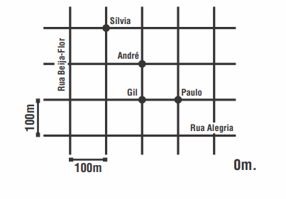
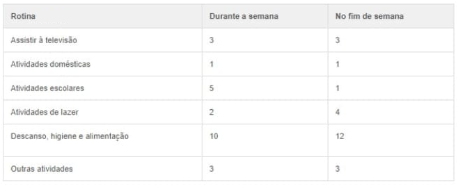

# 1. Representações dos números

Habilidades do SAEB

*  Escrever números racionais (representação fracionária ou decimal
finita) em sua representação por algarismos ou em língua materna ou
associar o registro numérico ao registro em língua materna.

*  Compor ou decompor números racionais positivos (representação decimal
finita) na forma aditiva, ou em suas ordens, ou em adições e
multiplicações.

*  Comparar ou ordenar números reais, com ou sem suporte da reta
numérica.

*  Converter uma representação de um número racional positivo para outra
representação. - Identificar um número natural como primo, composto,
"múltiplo/fator de" ou "divisor de" ou identificar a decomposição de um
número natural em fatores primos ou relacionar as propriedades
aritméticas (primo, composto, "múltiplo/fator de" ou "divisor de") de um
número natural à sua decomposição em fatores primos.

Habilidades da BNCC 
EF06MA01, EF06MA05.

Classes e ordens numéricas:

%Paulo: criar uma tabela com as informações disponíveis na imagem a seguir:

{width="5.0in"
height="2.8020833333333335in"}

Números primos: Considerando o conjunto dos números naturais, definem-se
como números primos aqueles que possuem exatamente dois divisores,
o 1 e o próprio número em questão. Alguns exemplos de números primos são: 2, 
3, 5, 7, 11, 13 etc.

A decomposição de um número composto em fatores primos consiste em
escrever um número através da multiplicação de números primos que
compõem o próprio número.

Exemplo: Decomposição do número 144 em fatores primos:
%Paulo: criar uma tabela com as informações disponíveis na imagem do link https://pt-static.z-dn.net/files/d08/8b00809d79a65807cefe49582b314584.png

> Veja a seguir alguns exemplos provenientes do sistema de numeração romano:
>
> %Paulo: criar uma tabela com as informações da imagem a seguir.
>
> {width="3.5625in"
> height="2.7604166666666665in"}

Pedir aos alunos que imaginem um mundo onde os números não existam como
os conhecemos hoje. Propor que descrevam situações em que é necessário
utilizarmos números para diferentes finalidades, mas que façam isso
sem os símbolos que normalmente empregamos. Observar o
envolvimento dos alunos, motivando-os a compartilhar a opinião com os
colegas.

O objetivo é incentivar o aluno a refletir sobre os números e suas diversas 
utilidades. Provavelmente, ele já possui um conhecimento prévio sobre o 
assunto e utiliza os números em seu cotidiano para contar, ordenar, codificar 
e medir, ao medir sua altura, contar sua idade, ordenar seu lugar na fila etc. 
Propor que os alunos reflitam sobre onde eles utilizam os números no cotidiano, 
desde a hora que acordam até a hora de dormir.

\colorsec{Atividades}

1\) Complete as lacunas abaixo com os números primos entre 2 e 65

%Paulo: Fazer uma tabela tal como a imagem a seguir.

{width="5.541666666666667in"
height="1.625in"}

R:

%Paulo: Fazer uma tabela tal como a imagem a seguir.
{width="5.477083333333334in"
height="1.8138888888888889in"}

R: Os números primos de 2 a 65, que devem ser obtidos pela construção
proposta aos alunos no boxe, são: 2, 3, 5, 7, 11, 13, 17, 19, 23, 29,
31, 37, 41, 43, 47, 53, 59, 61.

2\) indique V para as afirmações verdadeiras e F para as falsas.

\(V\) o número 2 é o único número par que é primo.

\(F\) todos os números ímpares são primos.

\(F\) o número 9 é primo.

\(V\) o número 121 possui 3 divisores.

\(F\) o número 289 é primo.

\(V\) um número composto possui mais de 2 divisores.

\(V\) um número primo possui 2 divisores: o 1 e ele mesmo.

\(V\) os números 41, 43 e 47 são primos.

3\) Decomponha em fatores primos.

a\) 100

b\) 60

c\) 225

d\) 1.000

e\) 36

R:

a\) 2² · 5² = 100

b\) 2² · 3 · 5 = 60

c\) 3² · 5² = 225

d\) 2³ · 5³ = 1.000

e\) 2² · 3² = 36

4\) A decomposição em fatores primos do número 720 é:

2^4 · 3² · 5 = 720

5\) O menor número composto formado pelos fatores primos 2, 3, 5 e 11 é:

R: O menor número possível é:

2 · 3 · 5 · 11 = 330.

6\) O número 8 pode ser fatorado como 8 = 2 · 2 · 2 = 2³ e, portanto,
possui 3 fatores primos. O número 30 também tem 3 fatores primos, pois
30 = 2 · 3 · 5. Dessa forma, assinale a alternativa que apresenta apenas
números compostos formados por 3 fatores primos.

R: 25, 49, 64, 81

7\) Observe os números a seguir :

%Paulo: inserir uma tabela com os seguintes números romanos. Inserir uma
segunda coluna para as respostas:
VIII
XVII
XXIII
LIX
DXLV
MDXCVIII
Quais números estão representados em cada quadro?

Resposta: 8, 17, 23. 59, 545 e 1598.

Explorar com eles as regras do sistema de numeração romano nos exemplos
dos números apresentados na página.

8\) Represente a quantidade de objetos a seguir nos sistemas de
numeração romano e decimal.

> a\)

%Paulo: inserir imagem:
Disponível em: https://br.freepik.com/fotos-gratis/linha-de-lapis-afiados-verdes-sobre-fundo-branco_5223660.htm#query=lined%20up%20pencils&position=21&from_view=search&track=ais. Acesso em: 5 maio 2023.

R:
Romano: IX

Decimal: 9

b\)

%Paulo: inserir imagem:
Disponível em: https://br.freepik.com/fotos-gratis/homem-colheita-segurando-pedido-jogo-livros_5301939.htm#query=five%20books&position=4&from_view=search&track=ais. Acesso em: 5 maio 2023.

R:
Romano: V

Decimal: 5

c\)

%Paulo: inserir imagem:
Disponível em: https://br.freepik.com/fotos-gratis/macas-vermelhas-e-verdes-isoladas-na-placa-de-madeira_14705803.htm#page=2&query=twenty%20apples&position=30&from_view=search&track=ais

R:
Romano: VII

Decimal: 7

Se achar conveniente, apresentar alguns jornais em francês, italiano e
inglês, por exemplo, e mostrar que, em todos, os números utilizados são
os números indo-arábicos. Dessa forma, os alunos terão uma percepção concreta
da universalidade do sistema de numeração indo-arábico. Uma vez que os
alunos percebam que o sistema de numeração decimal possui regras e
características que o fizeram prevalecer sobre os outros sistemas
apresentados, é chegado o momento de eles verificarem, de fato, quais
são essas regras e características. Uma estratégia possível é fazer a
comparação das características do sistema de numeração decimal com
outros sistemas, ressaltando as diferenças e semelhanças. Com base nessa
discussão, organizar, com a turma, uma tabela para que os alunos
sistematizem as regras estudadas de todos os sistemas que foram
apresentados.

9\) Passe os números do sistema de numeração romano a seguir para o
sistema decimal:

a\) IV = 

b\) VI = 

c\) XL = 

d\) LX = 

e\) XC = 

f\) CX = 

R:
4, 6, 40, 60, 90 e 110.

10\) O número 35.482 pode ser decomposto nas parcelas 30.000 + 5.000 +
400 + 80 + 2. Seguindo esse mesmo raciocínio, decomponha os seguintes
números:

a\) 9.876

R: 9.000 + 800 + 70 + 6

b\) 12.345

R: 10.000 + 2.000 + 300 + 40 + 5

c\) 678.910

R: 600.000 + 70.000 + 8.000 + 900 + 10

d\) 60.504

60.000 + 500 + 4

Reforçar aos alunos que o sistema de numeração decimal tem um símbolo
que representa a ausência de quantidade -- o zero (0) -- e tem base 10,
ou seja, utilizam-se apenas 10 símbolos -- 1, 2, 3, 4, 5, 6, 7, 8, 9 e 0
para escrever qualquer número. Além disso, esse sistema de numeração é
posicional; isso quer dizer que a posição do algarismo indica o seu
valor numérico.

\colorsec{Treino}

1\) O maior cometa já descoberto é o Holmes, que possui 2.251 km de
diâmetro

Quantas ordens possui o número que representa diâmetro do cometa?

a\) 2 ordens

b\) 3 ordens

c\) 4 ordens

d\) 10 ordens

SAEB: Compor ou decompor números racionais positivos
(representação decimal finita) na forma aditiva, ou em suas ordens, ou
em adições e multiplicações.

BNCC: EF06MA01 -- Comparar, ordenar, ler e escrever números naturais e números racionais cuja representação decimal é finita, fazendo uso da reta numérica.

Alternativa A: incorreta, pois o aluno pode ter uma mal interpretação e contar
as classes ao invés das ordens.

Alternativa B: incorreta, pois o aluno pode ter uma mal interpretação e
considerar que as ordens são um conjunto de 3 números após o ponto.

Alternativa C: correta, pois são 4 ordens ao total.

Alternativa D: incorreta, pois o aluno pode compreender que ordens são a soma
de todos os números descritos.

2\) José tem IX de idade, seu irmão mais velho tem XXI e o mais novo, V. 
Somando a idade dos três, encontramos a idade de seu pai. Quantos anos 
tem o pai dos garotos?

a\) XXV

b\) XXXV

c\) XXXVII

d\) XXX

SAEB: Converter uma representação de um número racional
positivo para outra representação.

BNCC: EF06MA05 -- Classificar números naturais em primos e compostos, estabelecer relações entre números, expressas pelos termos “é múltiplo de”, “é divisor de”, “é fator de”, e estabelecer, por meio de investigações, critérios de divisibilidade por 2, 3, 4, 5, 6, 8, 9, 10, 100 e 1000.

Alternativa A: incorreta, o aluno pode esquecer de somar um "X".

Alternativa B: correta, pois essa é a representação em numerais romanos.

Alternativa C: incorreta, o aluno pode compreender que IX é 11 ao invés de 9.

Alternativa D: incorreta, o aluno pode esquecer de somar a idade do
irmão mais novo.

3\) O algarismo romano MMMDCCXVII representa o seguinte número decimal:

a\) 3225

b\) 3717

c\) 3718

d\) 3417

SAEB: Converter uma representação de um número racional
positivo para outra representação.

BNCC: EF06MA01 -- Comparar, ordenar, ler e escrever números naturais e números racionais cuja representação decimal é finita, fazendo uso da reta numérica.

Alternativa A: incorreta, pois o aluno pode considerar que a letra "D" representa
"Dezena", logo o valor seria esse.

Alternativa B: correta, pois essa é a representação dos números.

Alternativa C: incorreta, pois o aluno pode confundir e contar um "I" a mais
e considerar que o valor correto é esse.

Alternativa D: incorreta, pois o aluno pode considerar que a letra D signifique
Duzentos, logo o resultado seria esse.

# 2. Operações Aritméticas

Habilidades do SAEB 
* Calcular o resultado de adições, subtrações,
multiplicações ou divisões envolvendo número reais. - Calcular o
resultado de potenciação ou radiciação envolvendo números reais.

* Resolver problemas de adição, subtração, multiplicação, divisão,
potenciação ou radiciação envolvendo número reais, inclusive notação
científica.

*  Resolver problemas de contagem cuja resolução envolva a aplicação do
princípio multiplicativo. - Resolver problemas que envolvam as ideias de
múltiplo, divisor, máximo divisor comum ou mínimo múltiplo comum.

Habilidades da BNCC
EF06MA06, EF06MA07, EF06MA10, EF06MA11.

Adição

%Paulo: colocar a operação a seguir dentro de um quadro.
100 + 500 = 600

Cada termo entre o sinal de + é denominado parcela. O valor representado após o sinal de = é denominado soma ou total. 

Enfatizar que as propriedades da adição são: propriedade comutativa,
propriedade associativa e propriedade do elemento neutro. Elas são
importantes ferramentas de cálculo usadas para facilitar a realização
das operações matemáticas com as quais podemos trocar a ordem das
parcelas e associá-las de maneira conveniente.

Subtração

%Paulo: colocar a operação a seguir dentro de um quadro.
300 - 100 = 200

O primeiro termo da operação deverá, necessariamente, ser o de maior valor. Ele é chamado de minuendo. Já o subtraendo, isto é, o número menor, deverá aparecer na segunda posição. O número encontrado após o sinal de igual é denominado resto ou diferença. 

Caso julgar necessário, para o melhor entendimento dos processos
envolvidos na resolução das subtrações, utilizar materiais
manipulativos, como o material dourado ou o ábaco. Solicitar aos alunos
que utilizem este material para compreender o "empresta um".

Incentivar os alunos a fazerem comparações entre os procedimentos
adotados e os problemas apresentados; assim, poderão perceber que existem
diferentes maneiras de resolver um problema, mas antes disso é preciso
identificar o melhor método para cada um.

Multiplicação

%Paulo: colocar a operação a seguir dentro de um quadro.
4 . 10 = 40

Os dois números sendo multiplicados são denominados fatores. O resultado da operação se chama produto.

O objetivo aqui é retomar e aprofundar as ideias associadas à
multiplicação. O aluno poderá identificá-la como uma adição de parcelas
iguais e utilizar os fatos básicos da multiplicação por meio da
organização retangular no raciocínio combinatório e na
proporcionalidade. Nesta fase, é importante identificar e respeitar as
possíveis dificuldades que os alunos possam ter no processo de
aprendizagem para que eles não associem a multiplicação apenas com a
memorização da tabuada e o seu algoritmo.

Divisão

%Paulo: colocar a operação a seguir dentro de um quadro.
81 / 9 = 9

O primeiro número da operação é chamado de dividendo. O número é seguinte é o divisor. O resultado é denominado quociente.

É importante ressaltar que, no algoritmo da divisão, os alunos podem
encontrar alguma dificuldade, provavelmente por não compreenderem o
processo e realizarem a operação de forma mecânica. Por esse motivo,
essa retomada deve ser feita de modo que o aluno compreenda a lógica
aplicada ao processo dos algoritmos da divisão. Para isso, podem-se
utilizar jogos ou materiais manipulativos, como o material dourado, para
dar significado e facilitar a compreensão do aluno. Apresentar algumas
situações-problema que contemplem as ideias de dividir em partes iguais
e de medir, tomando cuidado para que não sejam apresentados exemplos que
compreendam apenas a ideia de distribuir.

Potenciação:

2² = 2 . 2 = 4
2³ = 2 . 2 . 2 = 8

O número de baixo é denominado base. O número de cima se chama expoente e se refere ao número de vezes que a base é multiplicada por si mesma.

Mínimo Múltiplo Comum (M. M. C.)

Exemplo de procedimento de cálculo:

Produzir uma figura semelhante a essa nos moldes do projeto.

%Paulo: colocar as informações da imagem abaixo em uma tabela.
MMC entre 5 e 6.

{width="2.186046587926509in"
height="1.6294477252843396in"}

Máximo Divisor Comum (M. D. C)

Exemplo de procedimento de cálculo:

%Paulo: colocar as informações a seguir em uma tabela. A barra indica a divisão entre as duas colunas.
MDC entre 20, 15 e 10:

20, 15, 10 / 2
10, 15, 5  / 2
5,  15, 5  / 5
1,  3,  1  / 3
1,  1,  1

Logo, o MDC do exemplo acima é 5, já que é o maior número capaz de dividir todos os outros.

\colorsec{Atividades}

1\) Adriana e Marina são jogadoras de Vôlei. Em uma partida, Adriana fez
18 pontos e Marina, 17. Qual é o total de pontos das duas jogadoras?

R: 18 + 17 = 35

Se achar conveniente, registre as propriedades da adição em um quadro
que pode ficar afixado em local de fácil visualização para posterior
consulta dos alunos. Propriedade comutativa: A ordem das parcelas não
altera a soma. Em outras palavras, não importa em que ordem os números
são adicionados, a soma sempre será a mesma. a + b = b + a Exemplo: 7 +
4 = 4 + 7

2\) Enzo tinha R$284,00 e ganhou de seu pai uma nota de R$50,00. Qual é
o valor total que ele tem agora?

R: 334 reais

284 + 50 = 334

3\) Em um supermercado, há uma balança informando o peso dos alimentos
ali colocados. Aurora pesou suas compras e observou o seguinte
resultado no visor da balança:

{width="2.3333333333333335in"
height="1.53125in"}

Após observar o resultado, decidiu pegar mais um item com o peso de 225g. Após colocar
o item na balança, qual o novo valor observado?

R: 1,090 kg

875 + 225 = 1,090kg

4\) A coleção de Celso tem 91 bolas de gude, e a de Marcelo, 112. Quantas bolas de gude os dois possuem juntos?

%Paulo: inserir a imagem:
Disponível em: https://pixabay.com/pt/photos/m%c3%a1rmores-bolinhas-de-vidro-bolas-1659398/. Acesso em 5 maio 2023.

R: 203 Bolinhas de gude

5\) Uma biblioteca municipal contém 3.697 livros. Considerando que 391
livros foram emprestados, quantos livros estão nas estantes dessa
biblioteca?

R: 3.306 Livros

6\) No início da semana, uma lanchonete tinha 530 latas de refrigerante.
Ao longo da semana, foram vendidas 371 latas. Quantas latas restaram na
lanchonete?

R: 159 latinhas.

7\) Utilizando o método de decomposição em fatores primos, calcule o
m.m.c. de:

a\) 52 e 78

b\) 8,10,14

c\) 18,42

d\) 12,48

e\) 90,180

R:

a\) 156

b\) 280

c) 126

d\) 48

e\) 180

8\) Utilizando o método de decomposição em fatores primos, calcule o
m.d.c. de:

a\) 52 e 78

b\) 8, 10, 14

c\) 32, 48

d\) 60,72

R:

a\) 78

b\) 2

c\) 16

d\) 12

9\) Joana comprou 3 rolos de tecido. O primeiro mede 100 cm; o segundo,
80 cm, e o terceiro mede 120 cm. Ela pretende dividir os rolos em pedaços
iguais e do maior tamanho possível. Sendo assim, quantos pedaços terá
cada pedaço de tecido?

a\) 15 cm

b\) 18 cm

c\) 20 cm

d\) 22 cm

R: m.d.c. -  100, 80, 120 = 20 cm

10\) Laura, Pablo e Josiane trabalham em uma empresa de turismo e viajam
constantemente para o Nordeste. Laura viaja de 10 em 10 dias, Pablo de
15 em 15 dias e Josiane, de 20 em 20. Se todos forem hoje para o nordeste,
daqui a quanto tempo eles viajarão no mesmo dia novamente?

Resposta: Daqui a 60 dias.

11\) Um tabuleiro de Xadrez é todo quadriculado e composto de 8 linhas e
8 colunas. Cada quadradinho é chamado de casa. Quantas casas tem esse
tabuleiro?

%Paulo: inserir a imagem:
Disponível em: https://pixabay.com/pt/vectors/tabuleiro-de-xadrez-xadrez-conselho-29630/. Acesso em: 5 maio 2023.

R: 64 casas.

12\) Calcule as potências abaixo:

a\) 5²

b\) 3²

c\) 4³

d\) 7²

e\) 2³

f\) 10³

g\) 3³

h\) 8²

R:

a\) 25

b\) 9

c\) 64

d\) 49

e\) 8

f\) 1000

g\) 27

h\) 64

É interessante explorar a operação potenciação por meio de
situações-problema.

Exemplo:

• Em um estacionamento há 4 automóveis, em cada automóvel há 4 rodas e
em cada roda há 4 parafusos. Qual é o total de parafusos desses 4
automóveis?

• Um fazendeiro armazena as laranjas de sua fazenda para vender em
caixas que lembram um cubo. Cada caixa contém 5 laranjas no comprimento,
5 laranjas na largura e 5 laranjas na altura. Quantas laranjas podem ser
armazenadas em 5 caixas?

Observar as estratégias dos alunos para resolver as situações propostas.
É possível que alguns optem em fazer desenhos, esquemas ou optem pelo
material concreto para auxiliá-los no cálculo.

Depois, associar essas atividades com a representação de uma
potenciação. Inicialmente, a linguagem utilizada para definir a
potenciação e seus elementos pode ser confusa para os alunos. Sempre que
possível, fazer a identificação desses elementos utilizando exemplos ou
atividades para que eles possam compreender a nomenclatura correta e as
ideias ligadas a essa simbologia.

\colorsec{Treino}

1\) Três asteroides se aproximam do sol a cada 20, 24, e 28 anos,
respectivamente. Se o último ano em que todos estiveram próximos do sol
foi 1984, o próximo ano em que isso deverá ocorrer será?

a) 72

b) 840

c) 1988

d) 2824

SAEB: Resolver problemas que envolvam as ideias de múltiplo,
divisor, máximo divisor comum ou mínimo múltiplo comum.

BNCC: EF06MA06 -- Resolver e elaborar problemas que envolvam as ideias de múltiplo e de divisor.

Alternativa A: incorreta, pois o aluno pode realizar a somar a soma ao invés
de calcular o m.m.c.

Alternativa B: incorreta, pois o aluno pode considerar que o valor do m.m.c.
em si já é a resposta.

Alternativa C: incorreta, pois o aluno pode confundir m.m.c. com m.d.c. nos cálculos e
chegar a esse resultado.

Alternativa D: correta, pois somando o resultado do m.m.c. com o ano de
1984 obtemos este valor.

2\) Entre algumas famílias foram distribuídos 240 cadernos, 576 lápis e
1.080 borrachas. A distribuição foi feita de tal modo que o maior número
de famílias fosse contemplado e que cada família recebesse o mesmo
número de lápis, o mesmo número de cadernos e o mesmo número de
borrachas. Nessas condições o número de borrachas que cada família
recebeu foi:

a\) 24 
b\) 8 
c\) 12 
d\) 45

SAEB: Resolver problemas que envolvam as ideias de múltiplo,
divisor, máximo divisor comum ou mínimo múltiplo comum.

BNCC: EF06MA07 -- Compreender, comparar e ordenar frações associadas às ideias de partes de inteiros e resultado de divisão, identificando frações equivalentes.

Alternativa A: incorreta, pois O aluno pode confundir o resultado do m.d.c.
dos valores como resposta.

Alternativa B: incorreta, pois o aluno pode calcular incorretamente o m.d.c.
esquecendo do valor 5 no final, onde o resultado seria esse.

Alternativa C: incorreta, pois o aluno pode esquecer de contar um número "2"
no cálculo do m.d.c.

Alternativa D: correta, pois, calculando o m.d.c., obtemos 24, realizando a
operação 1080: 24 obtemos 45.

3\) Jonas abastece seu veículo a cada 3 dias e Moises a cada 6. Paulo vai
abastecer seu veículo sempre aos sábados e em nenhum outro dia. Se no
dia 20 de setembro os três abasteceram seus veículos, a próxima data em
que os três abastecerão juntos será:

a\) 20 de outubro
b\) 2 de novembro
c\) 1 de novembro
d\) 31 de Outubro

SAEB: Resolver problemas que envolvam as ideias de múltiplo,
divisor, máximo divisor comum ou mínimo múltiplo comum.

BNCC: EF06MA06 -- Resolver e elaborar problemas que envolvam as ideias de múltiplo e de divisor.

Alternativa A: incorreta, pois o aluno pode considerar correta essa
alternativa caso ele considere que se encontram no mesmo dia de todo
mês.

Alternativa B: incorreta, pois o aluno pode chegar a esse resultado se
considerar que outubro tenha 30 dias.

Alternativa C: correta, pois realizando o m.m.c., temos 42 dias. 20
dias depois de 20 de setembro cairá no dia 1 de novembro, lembrando que outubro
tem 31 dias.

Alternativa D: incorreta, pois o aluno pode considerar que setembro tenha 31 dias.

# 3. Frações

Habilidades do SAEB
*  Representar frações menores ou maiores que a unidade por meio de
representações pictóricas ou associar frações a representações
pictóricas.

*  Identificar frações equivalentes.

*  Determinar uma fração geratriz para uma dízima periódica

Habilidade da BNCC 
EF06MA09.

Uma fração é uma forma de representar uma quantidade ou uma proporção de um todo que é dividido em partes iguais. Ela é composta por duas partes: o numerador e o denominador. O numerador representa a quantidade ou a parte que está sendo considerada, e o denominador representa o total de partes em que o todo foi dividido.

Por exemplo, a fração 3/4 representa a parte de um todo que é igual a três partes em um total de quatro partes iguais. Isso pode ser visualizado como uma pizza dividida em quatro partes iguais, onde três dessas partes são consideradas.

As frações podem ser usadas em diversas situações, como na representação de números decimais em forma de fração, na resolução de problemas que envolvem proporções ou na medição de quantidades em que um todo é dividido em partes iguais, como no caso de receitas culinárias.

As frações também podem ser comparadas e operadas matematicamente através de adição, subtração, multiplicação e divisão, o que permite realizar cálculos e resolver problemas que envolvem frações.

%Paulo: inserir a imagem:
Disponível em: https://br.freepik.com/fotos-gratis/graficos-estatisticos-coloridos-para-fracoes-cientificas_6626366.htm#query=fractions&from_query=fra%C3%A7%C3%B5es&position=6&from_view=search&track=sph. Acesso em: 5 maio 2023.

A comparação entre frações significa olhar para duas frações e descobrir
qual é a maior ou qual é a menor. Para comparar frações, é necessário
deixá-las com o mesmo denominador e ver qual tem o maior numerador.

Por exemplo, a fração 2/3 é maior que a fração 1/3, pois o numerador, isto é, o número de cima é maior. Perceba como o número da parte inferior da fração, o denominador, é o mesmo.

As frações equivalentes são aquelas que, embora aparentemente pareçam diferentes,
possuem o mesmo resultado. Sendo assim, elas representam a mesma parte de um todo indicando a mesma quantidade.

Por exemplo, a fração 1/2 é equivalente à fração 2/4. Para nos certificarmos desse fato, basta dividirmos o numerador e denominador da segunda fração por 2, chegando à fração 1/2 novamente. 

Resgatar com os alunos os conhecimentos que possuem acerca das frações,
para assim aproximar ou relembrar conceitos estudados anteriormente. Se
possível, levar figuras de círculos de cartolina para que os alunos
possam vivenciar as questões propostas nesta seção. Eles podem dividir
as representações dos círculos em pedaços e recortá-los como se fossem
pizzas e realizar diferentes explorações. Vale destacar que é
interessante refletir com os alunos sobre o uso de alimentos para
representar frações, pois muitas vezes uma fatia pode possuir o 
mesmo tamanho que outras, mas as massas podem ser diferentes.

\colorsec{Atividades}

1\) Dois irmãos, Abel e Caim, resolveram comprar uma pizza juntos. Ao
chegar em casa, Abel comeu 3/8 da pizza, enquanto Caim comeu 7/16 avos.
Qual dos irmãos comeu a maior parte da pizza?

R: Caim comeu a maior quantidade de pizza pois 3/8 < 7/16.

2\) Em um certo dia, Mateus comprou uma barra de chocolate com 24 pedaços
para dividir igualmente entre seus 3 filhos. Quantos pedaços cada filho
deve receber?

R: 24 pedaços para 3 filhos - 24 / 3 = 8 pedaços cada um.

Deixar o espaço de 3 linhas para resolução e Inserir a figura descrita
acima, podendo ser uma figura semelhante a essa.

3\) Ligue as frações equivalentes:

{width="4.353931539807524in"
height="2.300997375328084in"}

R:
{width="4.5116043307086615in"
height="2.2892639982502185in"}

4\) Para ser aprovado em uma prova, Lucas precisava acertar no mínimo 3/5
das questões. Ao final do teste, Lucas descobriu que acertou. Sendo assim, ele foi aprovado ou reprovado?

Resposta: Lucas foi aprovado pois 2/3 > 3/5.

5\) Sabendo que as figuras foram divididas em partes iguais, em cada
item, escreva a fração correspondente à parte colorida de amarelo.

{width="2.5729166666666665in"
height="5.0625in"}

a\)

b\)

c\)

d\)

e\)

f\)

R:

a\) 7/4 

b\) 8/5 

c\) 7/3 

d\) 14/5 

e\) 8/12 

f\) 4/14 

Nestas atividades, reforçar a ideia de fração como parte de um todo.
Quando se trabalha com sua representação geométrica, há necessidade de
fazer a divisão do todo em partes iguais. Sugerir aos alunos que citem
elementos que podem ser representados por meio de uma fração.

6\) Simplifique as frações, tornando-as irredutíveis:

a)  24/60

b)  18/90

c)  27/36

d)  63/81

e)  9/81

f)  7/21

g)  60/80

R:

a) 2/5

b) 1/5

c) 3/4

d) 7/9

e) 1/9

f) 1/3

g) 3/4

7\) Maria resolveu fazer bolos para vender em sua padaria Em cada
receita, são utilizadas 3/4 de xícara de farinha de trigo. Em um
final de semana, Maria faz 8 bolos. Quantas xícaras serão necessárias?

R: 3/4 · 8 = 6 xícaras.

Sugerir aos alunos que grifem cada dado do problema de uma cor.
Recomendar a eles que destaquem a pergunta, circulando-a, por exemplo,
para identificar o que deve ser respondido. Pedir que façam uma
estimativa do resultado antes de elaborar a resposta completa. Em
seguida, dar especial atenção aos esquemas utilizados para resolver os
problemas. Incentivá-los a fazer desenhos que representem os dados do
problema, o que pode facilitar sua compreensão. Por fim, pedir que
verifiquem se a resposta está coerente com os dados do problema.

8\) Leonardo resolveu pintar um quadro simples para colocar na parede de
seu quarto

{width="1.5833333333333333in"
height="1.5729166666666667in"}

Para pintar o quadro, Leonardo utilizou as cores azul e laranja. Qual das duas Leonardo usou mais?

R: Leonardo usou no seu quadro 12/16 avos de tinta azul e 4/16
avos de tinta laranja. Como 12/16 > 4/16, ele usou mais a tinta azul.

9\) Represente por meio de frações:

{width="1.6145833333333333in"
height="4.947916666666667in"}

R:

a\) 5/8

b\) 6/8

c\) 4/6

d\) 1/4

Deixar o espaço de 1 linhas abaixo de cada item para resolução e inserir
a figura descrita acima, podendo ser uma figura semelhante a essa, porém
contendo o mesmo conteúdo fracionário.

10\) Um prêmio em dinheiro foi dividido entre 4 amigos em partes
fracionárias. Pedro recebeu 1/6 do valor, Henrique recebeu 1/2, Josias 
recebeu 1/4 e Adriano, 1/12 .
Qual dos quatro amigos recebeu a maior parte do prêmio?

R: Henrique.

Com estes exercícios os alunos vão comparar frações por meio da análise
de seus numeradores e denominadores e desenvolver a ideia de frações
equivalentes, que será vista a seguir. Destacar que, para comparar as
frações, é necessário verificar se ambas se referem ao mesmo todo.

\colorsec{Treino}

1\) Em uma padaria, há uma torta que pode ser dividida em 8 pedaços iguais. João comeu 3 desses pedaços, e Maria comeu 2/4 da torta. Quem comeu mais torta?

a\) João

b\) Maria

c\) João e Maria comeram a mesma quantidade de torta

d\) Não é possível determinar a resposta, pois as frações são diferentes.

SAEB: Representar frações menores ou maiores que a unidade
por meio de representações pictóricas ou associar frações a
representações pictóricas.

BNCC: EF06MA09 -- Resolver e elaborar problemas que envolvam o cálculo da fração de uma quantidade e cujo resultado seja um número natural, com e sem uso de calculadora.

Alternativa A: incorreta, pois o aluno provavelmente efetuou a operação de maneira incorreta.

Alternativa B: correta, pois 2/4 = (2 x 2) / (4 x 2) = 4/8 > 3/8; logo, Maria comeu mais torta.

Alternativa C: incorreta, pois a operação demonstra que Maria e João comeram porções diferentes.

Alternativa D: incorreta, pois o aluno deve saber comparar frações diferentes.

2\) Um jogo matemático é formado por cartas com frações impressas em uma de suas faces. Cada jogador recebe quatro cartas e vence aquele que primeiro conseguir ordená-las crescentemente pelas respectivas frações impressas. O vencedor foi o aluno que recebeu as cartas com as frações: 3/5, 1/4, 2/3 e 5/9.

A ordem que esse aluno apresentou foi

a\) 1/4, 5/9, 3/5, 2/3

b\) 1/4, 2/3, 3/5, 5/9

c\) 5/9, 1/4, 3/5, 2/3

d\) 5/9, 1/4, 3/5, 2/3

SAEB: Identificar frações equivalentes.

BNCC: EF06MA09 -- Resolver e elaborar problemas que envolvam o cálculo da fração de uma quantidade e cujo resultado seja um número natural, com e sem uso de calculadora.

Alternativa A: correta, pois:

Para comparar frações elas devem possuir os denominadores iguais. Para
isso, calculamos o MMC entre 5, 4, 3 e 9, que são os denominadores das
frações sorteadas.

{width="5.010416666666667in"
height="1.4479166666666667in"}

Para encontrar as frações equivalentes, dividimos 180 pelos
denominadores das frações sorteadas e, multiplicamos o resultado pelos
numeradores.

Para 3/5

180 / 5 = 36, como 36 x 3 = 108, a fração equivalente será 108 / 180.

Para 1/4

180/4 = 45, como 45 x 1 = 45, a fração equivalente será 45/180

Para 2/3

180/3 = 60, como 60 x 2 = 120, a fração equivalente será 120/180

Para 5/9

180/9 = 20, como 20 x 5 = 100. A fração equivalente será 100/180

Com as frações equivalentes, basta ordenar pelos numeradores em ordem
crescente e associar com as frações sorteadas. Logo 1/4, 5/9, 3/5, 2/3.

Alternativa B: incorreta, O aluno pode considerar que quanto maior o
denominador, maior o valor fracionário, assim 1/4 seria uma fração maior
que 2/3.

Alternativa C: incorreta, o aluno pode se confundir na forma de calcular
o m.m.c. e colocar erroneamente as frações de forma incorreta.

Alternativa D: incorreta, o aluno pode se confundir e colocar as frações
em forma decrescente ao invés de crescente.

3\) Elias comprou dois potes de sorvete, ambos com a mesma quantidade do
produto. Um dos potes continha quantidades iguais dos sabores chocolate,
creme e morango; e o outro, quantidades iguais dos sabores chocolate e
baunilha. Então, é CORRETO afirmar que, nessa compra, a fração
correspondente à quantidade de sorvete do sabor chocolate foi:

a\) 2/6
b\) 3/5
c\) 5/12
d\) 5/6

SAEB: Representar frações menores ou maiores que a unidade
por meio de representações pictóricas ou associar frações a
representações pictóricas

BNCC: EF06MA09 -- Resolver e elaborar problemas que envolvam o cálculo da fração de uma quantidade e cujo resultado seja um número natural, com e sem uso de calculadora.

Alternativa A: incorreta, pois o aluno pode erroneamente considerar que ambos
os potes de sorvete foram divididos em 3 partes.

Alternativa B: incorreta, pois o aluno erroneamente pode considerar que
somando as partes de chocolates de ambos os potes sem calcular o m.m.c.
pode se tornar uma resposta correta.

Alternativa C: correta, pois: o primeiro pote continha 3 sabores em
iguais quantidades: 1/3 de chocolate, 1/3 de baunilha e 1/3 de morango.
No segundo pote, havia 1/2 de chocolate e 1/2 de baunilha. Considerando
os dois potes de sorvete, dividimos os dois potes em partes iguais.
Fazendo então o m.m.c. de (2,3), obtemos que cada pote foi dividido em 6
partes iguais. Portanto nos dois potes temos 12 partes iguais. Sendo que
destas, 5 partes correspondem ao sabor chocolate.

Alternativa D: incorreta, o aluno pode considerar dividir os potes em 3
partes iguais e somar sem calcular o m.m.c., que chegará a esse
resultado erroneamente.

# 4. Porcentagem

Habilidade do SAEB
*  Resolver problemas que envolvam porcentagens, incluindo os que lidam
com acréscimos e decréscimos simples, aplicação de percentuais
sucessivos e determinação de taxas percentuais.

Habilidade da BNCC 
EF06MA13.

Definição

Porcentagem é uma forma de expressar uma proporção ou uma parte de um todo em termos de uma base de 100 unidades. O símbolo "%" é usado para indicar porcentagem.
Por exemplo, se uma empresa tem 100 funcionários e 50 deles são mulheres, podemos dizer que 50%% dos funcionários são mulheres.
A porcentagem é amplamente utilizada em finanças, negócios, estatísticas, ciência, entre outras áreas, para expressar a parte de um todo ou uma taxa de crescimento ou decréscimo em relação a uma base de 100.

Acréscimo

Acréscimo é o aumento no valor de um produto ou serviço, que pode ser expresso em valores absolutos ou em porcentagem. O acréscimo pode ocorrer por diversos motivos, como a adição de novas funcionalidades ou recursos a um produto, a valorização de um bem ou serviço ou a variação dos custos de produção.

Por exemplo, se o preço de um produto é R$100,00 e houve um acréscimo de 10%, o novo preço será R$110,00. O cálculo do preço com acréscimo é feito multiplicando o preço original pela porcentagem de acréscimo (em forma decimal), e adicionando o resultado ao preço original:

Preço com acréscimo = Preço original + (Preço original x Porcentagem de acréscimo)

Desconto

Desconto é uma redução no preço de um produto ou serviço, geralmente oferecida como uma forma de incentivar as vendas ou recompensar os clientes. O desconto é expresso em porcentagem e é aplicado ao preço original do produto ou serviço.

Por exemplo, se um produto tem um preço original de R$100,00 e há um desconto de 20%, o preço com desconto será R$80,00. O cálculo do preço com desconto é feito multiplicando o preço original pela porcentagem de desconto (em forma decimal), e subtraindo o resultado do preço original:

Preço com desconto = Preço original - (Preço original x Porcentagem de desconto)

\colorsec{Atividades}

1\) Calcule as porcentagens abaixo

a\) 1% de 120

b\) 50% de 260

c\) 10% de 1300

d\) 25% de 9

e\) 30% de 120

f\) 5% de 90

g\) 2% de 310

h\) 45% de 195

i\) 33% de 125

j\) 90% de 1700

k\) 70% de 1745

l\) 0,5% de 205

m\) 2,5% de 25

R:

a\) 1,2

b\) 130

c\) 130

d\) 2,25

e\) 36

f\) 4,5

g\) 6,2

h\) 87,75

i\) 41,25

j\) 1530

k)1221,5

l\) 1,025

m)0,625

Existem muitos materiais manipuláveis que podem contribuir para o
ensino-aprendizagem deste conteúdo. Um deles é o material dourado, que
pode ser explorado para facilitar o entendimento da relação entre as
frações e as porcentagens. Pedir aos alunos que montem um quadrado com
10 unidades de lado utilizando os cubinhos. Depois, pedir que dividam o
quadrado em dois retângulos iguais, e fazer perguntas como: "Que fração
representa cada retângulo comparado com o quadrado inicial?", "Cada
retângulo representa quantos por cento do quadrado inicial?".
Provavelmente, os alunos responderão que representa a metade do todo, ou
seja, 50%. Espera-se que os alunos percebam que, para determinar 50% de
um valor, basta dividir esse valor por dois. É interessante fazer
perguntas como essas para que os alunos percebam que, para determinar
25% de um valor qualquer, basta dividir esse valor por 4; para
determinar 20%, divide-se por 5 e, para determinar 10%, divide-se por 10

2\) Marly tem um salário atual de R$1.250,00. Seu novo patrão irá
aumentar seu salário em 15%. Qual o valor do novo salário dela?

R: R$1.437,50

3\) Uma televisão em uma loja de departamentos custa R$3.800,00.

Como José adquiriu uma TV e efetuou pagamento à vista, recebeu um desconto no valor de 15% no produto. Nestas condições, qual foi a quantia paga por José?

Resposta: R$3.230,00

4\) Uma universidade resolveu iniciar uma pesquisa para saber o perfil
dos seus alunos. Foi descoberto que 46% dos alunos são homens.
Sabendo que a faculdade possui 1.250 alunos, quantas mulheres estudam
nessa universidade?

R: 675 Mulheres estudam na universidade.

5\) O campeonato brasileiro de futebol possui 38 rodadas. Para cada
vitória, a equipe ganha 3 pontos. Sendo assim, a pontuação máxima a ser
alcançada é de 114 pontos. Sabendo que a equipe vencedora do ano de 2022 
obteve 81 pontos, qual a porcentagem de pontos alcançada?

R: A equipe campeã alcançou 71,05% dos pontos disputados

6\) Em janeiro, um brinquedo custava R$ 90,00. Devido à queda nas
vendas, seu preço sofreu uma redução de 20%, mantendo-se este valor até
novembro. Com o aquecimento das vendas de Natal, houve um aumento de 10%.
O brinquedo passou a ser vendido por:

R: O brinquedo passou a ser vendido por R$ 79,20.

7\) Uma pesquisa constatou que, no ano de 2021, uma cidade do interior 
de São Paulo possuía 25.000 habitantes. Considerando que no ano de
2022 houve um aumento de 6 % na população, quantos habitantes havia
nessa cidade no ano de 2022?

R: Em 2022, a população dessa cidade era de 26.500 habitantes.

8\) Elias foi ao supermercado e constatou que o pacote de arroz de 5kg 
custava R$21,50. No mês seguinte, o mesmo produto custava R$23,10. Qual 
foi o acréscimo em % do arroz?

R: O arroz teve um acréscimo de 6,92%.

9\) Em uma loja, o preço de um determinado par de calçados era R$120,00. Durante uma liquidação, ele era vendido por R$ 81,00. Em relação ao preço original, o desconto dado corresponde a uma taxa de:

Resposta: O desconto dado foi de 32,5%.

10\) Uma loja oferece 10% de desconto na compra de 1 produto,
20% na compra de 2 produtos e 30% na compra de 3 produtos. 
Adriano quer comprar camisas com o preço unitário de R$80,00. Quanto
Adriano pagaria...

a\) na compra de apenas 1 camisa?

b\) na compra de 2 camisas?

c\) na compra de 3 camisas?

R:

a\) R$72,00

b\) R$64,00

c\) R$56,00

11\) Uma pessoa comprou um terreno por R$ 20.000,00 e o vendeu com o
lucro de R$4.000,00. Qual a porcentagem de lucro?

R: 20% de lucro.

\colorsec{Treino}

1\) Em uma determinada cidade, as passagens de ônibus custavam R$1,20. O novo
prefeito reajustou esse valor em 25%. Qual será o novo valor das passagens?

a\) R$1,45.

b\) R$1,23.

c\) R$1,25.

d\) R$1,50.

SAEB: Resolver problemas que envolvam porcentagens, incluindo
os que lidam com acréscimos e decréscimos simples, aplicação de
percentuais sucessivos e determinação de taxas percentuais.

BNCC: EF06MA13 -- Resolver e elaborar problemas que envolvam porcentagens, com base na ideia de proporcionalidade, sem fazer uso da “regra de três”, utilizando estratégias pessoais, cálculo mental e calculadora, em contextos de educação financeira, entre outros.

Alternativa A: incorreta, pois o aluno pode considerar que aumentar 25%
signifique aumentar 25 centavos.

Alternativa B: incorreta, pois o aluno pode calcular erroneamente 1,20 x
0,025, chegando a esse resultado equivocado.

Alternativa C: incorreta,  poiso aluno pode considerar que 25% tenha relação
com o valor R$1,25, pela semelhança.

Alternativa D: correta, pois R\$ 1,20 x 0,25 = 0,3, logo somando R\$1,20
+ R\$0,30 temos 1,50

2\) Uma livraria realizará uma liquidação e, para isso, o gerente
pediu para Ariane multiplicar todos os preços dos livros por 0,68. Nessa
liquidação, a loja está oferecendo um desconto de:

A\) 68%

B\) 6,8%

c\) 3,2%

d\) 32%

SAEB: Resolver problemas que envolvam porcentagens, incluindo
os que lidam com acréscimos e decréscimos simples, aplicação de
percentuais sucessivos e determinação de taxas percentuais.

BNCC: EF06MA13 -- Resolver e elaborar problemas que envolvam porcentagens, com base na ideia de proporcionalidade, sem fazer uso da “regra de três”, utilizando estratégias pessoais, cálculo mental e calculadora, em contextos de educação financeira, entre outros.

Alternativa A: incorreta, pois aluno pode deduzir que ao multiplicar o valor
por 0,68 que o valor logo terá 68 % de desconto.

Alternativa B: incorreta, pois o aluno pode deduzir que, ao multiplicar o
valor por 0,68, os livros terão 6,8 % devido à semelhança dos termos.

Alternativa C: incorreta, pois o cálculo pode ser feito corretamente mas a
semelhança de 3,2% para 32% pode confundir o aluno na hora de decisão de
assinalar a resposta correta.

Alternativa D: correta, pois, ao multiplicar qualquer valor de livro por 68%, 
obtém-se um desconto de 32%.

3\) Em uma loja, uma máquina de lavar roupas custava R$1.500,00 e seu
preço sofreu um aumento de 3%. Logo após o aumento, a loja resolveu fazer
uma promoção oferecendo um desconto de 3% no mesmo produto. Qual o valor
do produto após o aumento? E após o desconto, ou seja, após as duas
operações?

a\) R$1.555,00 com aumento e R$1.498,65 com desconto.

b\) R$1.545,00 com aumento e R$1.500,00 com desconto.

c\) R$1.545,00 com aumento e R$1.498,65 com desconto.

d\) R$1.555,00 com aumento e R$1.500,00 com desconto.

SAEB: Resolver problemas que envolvam porcentagens, incluindo
os que lidam com acréscimos e decréscimos simples, aplicação de
percentuais sucessivos e determinação de taxas percentuais.

BNCC: EF06MA13 -- Resolver e elaborar problemas que envolvam porcentagens, com base na ideia de proporcionalidade, sem fazer uso da “regra de três”, utilizando estratégias pessoais, cálculo mental e calculadora, em contextos de educação financeira, entre outros.

Alternativa A: incorreta, pois o aluno pode realizar o cálculo corretamente,
mas confundir os valores próximos de R$1.555, 00 com R$1.545, 00
devido à semelhança.

Alternativa B: incorreta, pois o aluno, por meio de dedução, pode considerar
que, somando 3% ao valor inicial e subtraindo 3%, o valor inicial fique
inerte.

Alternativa C: correta, pois:

Cálculo do acréscimo

1500 · 0,03 = 45

1.550 + 45 = 1.545

Cálculo do desconto

1.545 · 0,03 = 46,35

1.545 - 46,35 = 1.498,65

Alternativa D: incorreta, pois o aluno, por meio de dedução, pode considerar
que, somando 3% ao valor inicial e subtraindo 3%, o valor inicial fique
inerte.

# 5. Equações polinomiais

Habilidades do SAEB
*  Resolver uma equação polinomial de 1º grau.

*  Inferir uma equação, inequação polinomial de 1º grau ou um sistema de
equações de 1º grau com duas incógnitas que modela um problema.

*  Associar uma equação polinomial de 1º grau com duas variáveis a uma
reta no plano cartesiano.

*  Resolver problemas que possam ser representados por sistema de
equações de 1º grau com duas incógnitas.

Habilidades da BNCC
EF06MA14.

A equação do 1º grau 

É uma equação que possui uma incógnita com grau 1, ou seja, a incógnita
está elevada a potência 1.

a·x + b = 0, em que a e b são números reais, e a é diferente de 0.

Sistema com equações de 1º grau

Exemplo:

x + y = 20
3x + 4y = 72

Método da substituição
Esse método consiste em escolher uma das duas equações, isolar uma das
incógnitas e substituir na outra equação, veja como:

Dado o sistema,

x + y = 40

3x + 4y = 144

Enumeramos as equações.

1\) x + y = 40

2\) 3x + 4y = 144

Escolhemos a primeira equação e isolamos o x:

x + y = 40 
x = 40 - y

Agora, na equação 2, substituímos o valor de x = 40 - y.

3x + 4y = 144 
3 (40 - y) + 4y = 144
120 - 3y + 4y  = 144
y = 24

Descobrimos o valor de y. Para descobrir o valor de x, basta substituir o y
na equação:

x = 40 - y
x = 40 - 24 
x = 16

Portanto, a solução do sistema é S = (16, 24)

\colorsec{Atividades}

1\) Resolva as Equações polinomiais abaixo e descubra o valor de X em
cada uma delas

a\) x + 5 = 8

b\) x − 4 = 3

c\) x + 9 = −1

d\) 4x − 9 = 23

e\) 7x − 33 = −12

f\) 33+ x = 5 -- 3x

g\) 3(x + 2) = 2 (x - 7)

h\) 2x - 10 + 7x + 10 = 180

R:

a\) x = 3

b\) x = 7

c\) x = -10

d\) x = 8

e\) x = 3

f\) x = -7

g\) x = -20

h\) x = 20

2\) Responda às sentenças abaixo.

a\) O dobro de um número somado com 5 é igual a 91. Qual é esse número?

b\) O triplo de um número diminuído de 4 é igual a 23. Qual é esse
número?

c\) O número somado com o seu dobro é igual a 150. Qual é esse número?

d\) Qual é o número que, adicionado a 28, é igual a 3 vezes esse
número?

e\) O triplo de um número menos 10 é igual ao próprio número mais 70.
Qual é esse número?

f\) Noêmia é 5 anos mais velha que Ágata. A soma das idades dá 43 anos.
Qual a idade de Ágata?

g\) Quando Manoel nasceu, Carlos tinha 3 anos. Atualmente, a soma das
idades é 23 anos. Qual é a idade de Carlos?

R:

a\) x = 43

b\) x = 9

c\) x = 50

d\) x = 14

e\) x = 40

f\) Ágata tem 19 anos.

g\) Carlos tem 13 anos.

3\) Os 1.200 alunos matriculados numa escola estão assim distribuídos: no
período da manhã, há 320 alunos a mais do que no período da tarde e, à
noite, há 190 alunos a menos do que no período da manhã. O número de alunos
do período da manhã desta escola é?

R: 570

4\) Resolva os sistemas formados pelas equações abaixo.

a\) x + y = 1

4x + 7y = 10

b\) 3x + y = 13

x - 2y = 2

d\) 2x + y = 5

x - y = 1

e\) x + y = 4

3x + 2y = 9

f\) x + y = 10

2x - y = 8

Resposta:

a\) Solução: x = -1, y = 2

b\) solução x = 4, y = 2

c\) solução x = 1, y = 2

d\) Solução x = 2, y = 1

e\) Solução x = 1, y = 3

f\) Solução x = 6, y = 4

5\) Em um determinado mês, duas montadoras produziram, juntas, 77.500
veículos, sendo que a produção de x foi igual a 2/3 da produção de y.

Nesse mês, a quantidade de veículos produzidos por x foi

R: 46.500.

6\) Numa cantina, 2 copos de suco e 3 pastéis custam R$5,70. O preço
de 3 copos de suco e 5 pastéis é R$9,30. Quanto custa cada
pastel e cada copo de suco?

R: cada pastel custa R$1,50 e cada suco custa R$ 0,60.

7\) Considerando a equação

5(3x - 8) = -45

É correto afirmar que a equação equivalente a ela é

R: 15x + 5 = 0

8\) Uma região retangular foi totalmente cercada por uma tela. A figura a seguir
mostra as medidas dos lados, em metros, dessa região.

{width="1.65625in"
height="1.1458333333333333in"}

Se para cercar totalmente essa região foram utilizados 24 m de tela, a
medida do lado menor é igual a:

R: 4

9\)

Numa loja, algumas camisetas e calças estão em oferta. 3 calças e 
2 camisetas são vendidas por R$ 56,00. Por sua vez, 2 calças e 
1 camiseta saem por R$ 34,00. O preço unitário da calça e da 
camiseta pode ser determinado a partir da solução do sistema:

R: 3x + 2y = 56

2x + y = 34

\colorsec{Treino}

1\) Numa caixa, há bolas Vermelhas e bolas amarelas num total de 360 esferas. Se
o número de bolas vermelhas é o quádruplo do de amarelas, o número de
bolas vermelhas é:

a\) 18

b\) 72

d\) 90

d\) 288

SAEB: Resolver problemas que possam ser representados por
sistema de equações de 1º grau com duas incógnitas.

BNCC: EF06MA14 -- Reconhecer que a relação de igualdade matemática não se altera ao adicionar, subtrair, multiplicar ou dividir os seus dois membros por um mesmo número e utilizar essa noção para determinar valores desconhecidos na resolução de problemas.

Alternativa A: incorreta, pois o aluno pode chegar à conclusão de que o número
de bolas vermelhas é 72, dividindo por 4 ao tentar encontrar o número
de bolas amarelas.

Alternativa B: incorreta, pois o aluno pode considerar que o enunciado pede o
número de bolas amarelas.

Alternativa C: incorreta, pois o aluno pode realizar a operação 360:4, obtendo
um resultado incorreto.

Alternativa D: correta, pois, realizando o sistema, temos que:

X + Y = 360

X = 4y

Inserindo o valor de X na primeira equação, temos que:

4y + y = 360

5y = 360

y = 72

Realizando 360 - 72 = 288, temos o valor correto de bolas vermelhas.

2\) O tempo t, em segundos, que uma pedra leva para cair de uma altura
x, em metros, é dado aproximadamente pela fórmula t = 0,05x. Se o tempo
t da queda é de 8 segundos, a altura x é:

a\) 0,4 m

b\) 0,00625 m

c\) 160m

d\) 4 m

SAEB: Resolver problemas que possam ser representados por
sistema de equações de 1º grau com duas incógnitas.

BNCC: EF06MA14 -- Reconhecer que a relação de igualdade matemática não se altera ao adicionar, subtrair, multiplicar ou dividir os seus dois membros por um mesmo número e utilizar essa noção para determinar valores desconhecidos na resolução de problemas.

Alternativa A: incorreta, pois o aluno durante a resolução pode confundir e ao invés de
dividir 8 por 0,05, realizar a multiplicação.

Alternativa B: incorreta, pois o aluno pode resolver a equação erroneamente, calculando
0,05 : 8.

Alternativa C: correta, pois, ao substituir t por 8, temos:

8 = 0,05 . x

8/0,05 = x

x = 160

Alternativa D: incorreta, pois o aluno pode erroneamente colocar o valor 8 na incógnita x.

3\) Dois produtos químicos A e B são usados em um laboratório. Cada 1 g
(grama) do produto A custa R$ 0,03, e cada 1 g do produto B custa R$
0,05. Se 100g de uma mistura dos dois produtos custam R$ 3,60, a
quantidade do produto A contida nesta mistura é:

a\) 70g

b\) 100g

c\) 360g

d\) 140g

SAEB: Resolver problemas que possam ser representados por
sistema de equações de 1º grau com duas incógnitas.

BNCC: EF06MA14 -- Reconhecer que a relação de igualdade matemática não se altera ao adicionar, subtrair, multiplicar ou dividir os seus dois membros por um mesmo número e utilizar essa noção para determinar valores desconhecidos na resolução de problemas.

Alternativa A: correta, pois, considerando:

x = quantidade do produto A em gramas

y = quantidade do produto B em gramas

x + y = 100  (I)

x·A + y·B = 3,60  (II)

De (I), deduzimos:

y = 100 - x

Que aplicamos em (II):

x·A + (100-x)·B = 3,60

Substituindo A e B pelos seus custos em reais:

x·0,03 + (100-x)y·0,05 = 3,60

Multiplicando toda a equação acima por 100, a fim de tornar inteiros
seus coeficientes:

x·3 + (100-x)·5 = 360

3x + 500 - 5x = 360

-2x = 360 - 500

-2x = -140

x = -140/-2

x = 70 gramas

Alternativa B: incorreta, pois o aluno pode simplesmente retirar a
quantidade de gramas do enunciado e considerar como resposta correta.

Alternativa C: incorreta, pois o aluno pode considerar o preço final do produto como
resposta correta.

Alternativa D: incorreta, pois o aluno pode esquecer de dividir a equação final por 2,
chegando a esse resultado.

# 6. Proporções

Habilidade do SAEB 
* Resolver problemas que envolvam variação de
proporcionalidade direta ou inversa entre duas ou mais grandezas,
inclusive escalas, divisões proporcionais e taxa de variação.

Neste módulo, falaremos sobre variações direta e inversamente proporcionais.
Comecemos discutindo alguns tipos de razões.

Escala 
A razão de escala é uma relação matemática que indica a proporção entre as dimensões de duas figuras semelhantes. Ela é dada pela razão entre as medidas de um mesmo lado (ou altura, ou diagonal, etc.) das duas figuras.

Por exemplo, se duas figuras são semelhantes e o lado da primeira figura mede 5 cm e o lado correspondente da segunda figura mede 10 cm, a razão de escala entre as duas figuras é 10/5 ou 2/1.

Velocidade Média
Velocidade média é uma grandeza física que representa a variação de espaço (distância percorrida) em relação ao tempo gasto para percorrê-lo. Ela é dada pela razão entre a distância percorrida e o tempo gasto:

Velocidade média = Distância percorrida / Tempo gasto

Densidade
Densidade é uma grandeza física que representa a quantidade de massa presente em um determinado volume. Ela é calculada pela razão entre a massa de um objeto e o volume ocupado por ele.

A fórmula da densidade é:

Densidade = Massa / Volume

Densidade Demográfica
A densidade demográfica é uma medida que indica a relação entre a população de uma determinada área e a sua superfície. Ela é obtida dividindo-se o número de habitantes pela área total da região.

Por exemplo, se uma cidade tem uma população de 100.000 habitantes e sua área total é de 50 km², sua densidade demográfica é de 2.000 habitantes por km².

Todos esses tipos de razão podem seguir uma lógica direta ou inversamente proporcional.

Grandezas DIRETAMENTE proporcionais
 
Duas grandezas são diretamente proporcionais quando ambas aumentam ou ambas diminuem na mesma proporção.
  
Grandezas INVERSAMENTE proporcionais
  
Duas grandezas são inversamente proporcionais quando uma aumenta e outra diminui na mesma proporção.

\colorsec{Atividades}

1\) Para se construir uma calçada, é comum, na constituição do concreto,
se utilizar cimento, areia e brita na seguinte proporção: 1 parte de
cimento, 4 partes de areia e 2 partes de brita. Para construir o
calçada, uma construtora encomendou um caminhão betoneira com 14 m³ de
concreto. Qual é o volume de cimento, em m³, na carga de concreto trazido
pela betoneira?

R: 2 m³

2\) Josué tem ração suficiente para alimentar quatro animais durante 18
dias. No fim do 6º dia, ele comprou mais dois animais. Com o restante da
ração, ele poderá alimentar seus animais durante:

R: 8 dias.

3\) Num teste, uma pessoa acertou 12 de 20 questões. A razão
do número de questões erradas para o número total de questões é:

R: 2/5

4\) Uma rua tem 800 m de comprimento e está sendo asfaltada. Em seis
dias, foram asfaltados 200 m da rua. Supondo-se que o ritmo de trabalho
continue o mesmo, qual o total de dias empreendidos no asfaltamento?

R: 24 dias.

5\) Dez operários constroem uma parede em 10 horas. Quantos operários
serão necessários para construir a mesma parede em 2 horas?

Resposta: 50 operários

6\) Sílvia fará um bolo para a festa da primavera. Para cada pacote de
mistura para bolos, Sílvia deve usar 2 ovos. Quantos pacotes dessa
mistura serão necessários se ela usar 10 ovos?

R: 5 pacotes.

7\) Para fazer um determinado serviço, 5 engenheiros levam 40 dias.
Em quanto tempo 10 engenheiros fazem o mesmo serviço?

R: 80 dias.

8\) Para atender todas as ligações telefônicas que recebe, uma empresa
emprega 4 telefonistas que atendem, cada uma, 120 ligações por
dia. Se a empresa utilizasse 6 telefonistas, cada uma atenderia,

R: 120 ligações.

9\) Uma torneira despeja 16 litros por minuto e enche uma caixa em 5
horas. Quanto tempo levará para encher a mesma caixa uma torneira que
despeja 20 litros por minuto?

R: 5 horas.

10\) Podemos transportar uma determinada quantidade de pedras em 20
caminhões com capacidade de 7 m³ cada. Caso utilize caminhões com
capacidade para 14 m³, precisaríamos de:

R: 10 caminhões

\colorsec{Treino}

1\) Em uma indústria, 20 máquinas iguais, de mesmo rendimento, produzem
juntas 5.000 peças iguais, em meia hora de funcionamento simultâneo e
ininterrupto. Desse modo, para produzir 1.000 unidades das mesmas peças
em uma hora, seria necessário o funcionamento, nas mesmas condições
operacionais, de apenas:

a\) 2 máquinas.

b\) 4 máquinas.

c\) 100 máquinas.

d\) 200 máquinas.

SAEB: Resolver problemas que envolvam variação de
proporcionalidade direta ou inversa entre duas ou mais grandezas,
inclusive escalas, divisões proporcionais e taxa de variação.

Alternativa A: correta, pois, ao realizar a regra de 3 simples, obtemos o
valor de 2 máquinas.

Alternativa B: incorreta, pois o aluno pode esquecer de realizar a
conversão de uma hora para meia hora, chegando a esse resultado
erroneamente.

Alternativa C: incorreta, pois o aluno pode, ao invés de realizar o cruzamento
na regra de três, multiplicar linearmente, chegando a esse resultado.

Alternativa D: O aluno pode realizar a conversão corretamente, mas errar
o cruzamento no cálculo de regra de três, chegando a esse valor
erroneamente.

2\) Para imprimir 200 apostilas com 27 páginas cada, 5 impressoras
levam 54 minutos. Estas impressoras imprimem um mesmo número de páginas
por minuto e têm um sistema automático de alimentação de folhas, ou seja,
não precisam parar para o reabastecimento. Para a impressão de
1.040 apostilas com 35 páginas impressas cada uma em 52 minutos, seriam
necessárias

a\) 2 impressoras.

b\) 35 impressoras.

c\) 27 impressoras.

d\) 33 impressoras.

SAEB: Resolver problemas que envolvam variação de
proporcionalidade direta ou inversa entre duas ou mais grandezas,
inclusive escalas, divisões proporcionais e taxa de variação.

Alternativa A: incorreta, pois o aluno pode realizar o cruzamento de
dados erroneamente na regra de 3 e chegar a esse valor.

Alternativa B: correta, pois, realizando a regra de 3 composta, obtemos o
valor 35.

Alternativa C: incorreta, pois, ao esquecer que as apostilas não tem mais 
27 folhas e sim 35, o aluno chega a esse resultado erroneamente.

Alternativa D: incorreta, pois, caso o aluno esqueça de ler todo o enunciado, ele não compreenderá que os minutos de funcionamento da impressora 2 diminuem,
chegando a essa resposta.

3\) Para cobrir 420 m² de um telhado, 7 operários que apresentam a
mesma produtividade gastam 3 horas e 30 minutos. Para cobrir outros 1.680 m² do telhado, foram contratados 12 operários, que também possuem a mesma produtividade individual dos operários anteriores. A previsão de tempo que esses 12 operários gastariam para realizar esse trabalho é de

a\) 30 minutos

b\) 52 horas e 50 minutos

c\) 490 horas

d\) 8 horas e 10 minutos.

SAEB: Resolver problemas que envolvam variação de
proporcionalidade direta ou inversa entre duas ou mais grandezas,
inclusive escalas, divisões proporcionais e taxa de variação.

Alternativa A: incorreta, pois, caso o aluno realize a multiplicação da
regra de 3 sem cruzamentos, chegará a esse valor.

Alternativa B: incorreta, pois, ao calcular o cruzamento da regra de 3
erroneamente, o alunochegará a esse valor.

Alternativa C: incorreta, pois, ao confundir o resultado em horas com minutos,
o aluno acabará assinalando essa alternativa erroneamente.

Alternativa D: correta, pois realizando a regra de três composta, obtemos esse valor.

# 7. Introdução a polígonos

Habilidades do SAEB
* Identificar, no plano cartesiano, figuras obtidas por uma ou mais
transformações geométricas (reflexão, translação, rotação).

*  Relacionar o número de vértices, faces ou arestas de prismas ou
pirâmides, em função do seu polígono da base.

*  Relacionar objetos tridimensionais às suas planificações ou vistas.

*  Classificar polígonos em regulares e não regulares.

*  Reconhecer polígonos semelhantes ou as relações existentes entre
ângulos e lados correspondentes nesses tipos de polígonos.

*  Reconhecer circunferência/círculo como lugares geométricos, seus
elementos (centro, raio, diâmetro, corda, arco, ângulo central, ângulo
inscrito).

*  Construir/desenhar figuras geométricas planas ou espaciais que
satisfaçam condições dadas.

*  Resolver problemas que envolvam relações entre os elementos de uma
circunferência/círculo (raio, diâmetro, corda, arco, ângulo central,
ângulo inscrito).

Habilidades da BNCC
EF06MA16, EF06MA17, EF06MA18, EF06MA20.

O plano cartesiano ortogonal é um plano composto por duas retas
numéricas perpendiculares, ou seja, retas que possuem apenas um ponto em
comum, formando um ângulo de 90°. Esse ponto comum é conhecido como
origem e é nele que é marcado o número zero de ambas as retas.

Veja a figura:

{width="3.4257469378827645in"
height="3.5in"}

A reta vertical é orientada para cima e a reta horizontal é orientada para
a direita.

É comum usar as letras x para a primeira e y para a segunda, e os termos
"coordenada x" e "coordenada y". Cada ponto sobre o plano é representado
por uma letra maiúscula, tal como o exemplo, A (valor em x , valor em y).

Um polígono é uma figura geométrica plana formada por segmentos de reta que se encontram apenas em suas extremidades. Um polígono é dito convexo se qualquer segmento de reta que une dois pontos em seu interior estiver completamente contido em seu interior.

Já um polígono é côncavo se existir pelo menos um segmento de reta que une dois pontos em seu interior e que não está completamente contido em seu interior. Em outras palavras, se houver algum ponto no interior do polígono a partir do qual se possa traçar uma reta que corte uma aresta do polígono.

Exemplo de polígono côncavo:

%Paulo: inserir imagem:
Disponível em: https://en.wikipedia.org/wiki/Concave_polygon#/media/File:Simple_polygon.svg. Acesso em 7  maio 2023.

Exemplo de polígono convexo:

%Paulo: inserir imagem:

Disponível em: https://en.wikipedia.org/wiki/Convex_polygon#/media/File:Pentagon.svg. Acesso em 7 maio 2023.

Fórmula de Euler

A relação de Euler, quando aplicada a poliedros convexos, estabelece uma relação fundamental entre o número de vértices, o número de arestas e o número de faces desses poliedros. Essa relação é conhecida como Fórmula de Euler para poliedros convexos, e é dada pela seguinte expressão:

V - A + F = 2,

onde, V é o número de vértices do poliedro, A é o número de arestas do poliedro e F é o número de faces do poliedro.

Essa fórmula estabelece que a soma do número de vértices, o número de faces e o número de arestas de um poliedro convexo é sempre igual a 2. É importante notar que essa fórmula só se aplica a poliedros convexos, ou seja, aqueles que não possuem nenhuma face côncava ou voltada para dentro.

Elementos de circunferência

Uma circunferência é uma figura geométrica plana formada por todos os pontos que estão a uma distância constante, chamada raio, de um ponto central. Os elementos de uma circunferência são:

Centro: é o ponto central da circunferência, que fica equidistante de todos os pontos da circunferência. O centro é geralmente representado pela letra O.

Raio: é a distância do centro da circunferência até qualquer ponto da sua circunferência. A letra R é usada para representar o raio.

Diâmetro: é uma reta que passa pelo centro da circunferência e que liga dois pontos opostos da sua circunferência. O diâmetro é igual a duas vezes o raio. A letra D é usada para representar o diâmetro.

Corda: é uma reta que liga dois pontos da circunferência. Uma corda não necessariamente passa pelo centro da circunferência. Qualquer corda que passa pelo centro é chamada de diâmetro.

Arco: é uma parte da circunferência, limitada por dois pontos. O comprimento do arco é proporcional ao ângulo central correspondente.

Tangente: um ponto em comum com a circunferência.

Secante: dois pontos em comum com a circunferência.

\colorsec{Atividades}

1\) Considere um poliedro convexo. Use a fórmula de Euler para determinar o número de faces desse poliedro, sabendo que possui 10 vértices e 20 arestas.

R:

A fórmula de Euler para poliedros convexos é dada por V - A + F = 2. Podemos usar essa fórmula para determinar o número de faces do poliedro convexo com V = 10 e A = 20 da seguinte forma:

V - A + F = 2

10 - 20 + F = 2

F = 12

Portanto, o número de faces do poliedro convexo é 12.

2\) Uma professora resolver lançar um desafio aos seus alunos, onde deu
aos seus alunos várias coordenadas para colocarem em um plano
cartesiano, qual figura se formou ao ligar todos os pontos
correspondentes?

Coordenadas:

A (0,5)

B (-1,2)

C (-4,2)

D (-2,0)

E (-3,-3)

F (0,1)

G (3,-3)

H (2,0)

I (4,2)

J (1,2)

Ligando os pontos obtém se a figura de uma estrela

{width="3.8541666666666665in"
height="3.5659722222222223in"}

3\) Para realizar o teste físico em determinado concurso da Guarda
municipal, os candidatos devem correr ao redor de uma praça circular
cujo diâmetro mede 90 m. Uma pessoa que dá 9 voltas ao redor dessa praça
percorre: (Dado: π = 3).

R: 2.430 m

4\) Quantas arestas tem uma pirâmide quadrangular regular?

R:

Uma pirâmide quadrangular regular tem uma base que é um quadrado, e quatro faces triangulares congruentes que se encontram em um vértice comum. Para contar o número de arestas da pirâmide, precisamos contar as arestas da base (quatro) e as arestas que conectam o vértice da pirâmide com os vértices da base (quatro). Portanto, a pirâmide quadrangular regular tem 4 + 4 = 8 arestas.

5\) Na tabela abaixo está transcrito o diâmetro dos planetas do sistema
solar, complete a tabela com os respectivos raios de cada um.

{width="4.058333333333334in"
height="4.132121609798775in"}

Resposta:

{width="4.96875in"
height="5.229166666666667in"}

{width="1.3208333333333333in"
height="1.3208333333333333in"}

6\) Qual é a medida do maior ângulo formado
pelos ponteiros de um relógio quando ele marca 9 horas?

R: 270°

7\) Se os ângulos internos de um polígono regular medem 36°, então o
número de lados desse polígono é:

a\) 10

b\) 17

c\) 12

d\) 13

R: alternativa A.

8\) Lourdes quer Inovar em sua loja de cosméticos e decidiu embalar seus
produtos em caixas de diferentes formatos. Nas imagens abaixo estão as
planificações dessas caixas.

{width="5.90625in"
height="2.125in"}

Quais serão os sólidos geométricos que Lourdes obterá a partir dessas
planificações?

a\) Cilindro, prisma de base pentagonal e pirâmide.

b\) Cone, prisma de base pentagonal e pirâmide.

c\) Cone, tronco de pirâmide e pirâmide.

d\) Cilindro, tronco de pirâmide e prisma.

Reproduzir fielmente a imagem descrita acima podendo ser alterado as
cores, porém não se alterando o conteúdo.

Resposta: alternativa A.

9\) Uma pista de atletismo tem a forma circular e seu diâmetro mede 80
m. Um atleta treinando nessa pista deseja correr 10 km diariamente.
Determine o número mínimo de voltas completas que ele deve dar nessa
pista a cada dia.

R: Ele deve completar no mínimo 40 voltas completas.

10\) A Linha poligonal é conhecida por formar os polígonos e são de suma
importância nos estudos da geometria. Para ser identificado como um
polígono, uma figura geométrica plana precisa ser:

R: Fechada e formada por segmentos de retas que não se cruzam.

\colorsec{Treino}

1\) Deseja-se pregar uma fita decorativa ao redor da tampa de um pote
redondo. Se o diâmetro da tampa mede 12 cm, qual é o comprimento mínimo
que a fita deve ter para dar a volta completa nela?

Considere π = 3

a\) 72 cm

b\) 108 cm

c\) 35 cm

d\) 11 cm

SAEB: Resolver problemas que envolvam relações entre os elementos de uma circunferência/círculo (raio, diâmetro, corda, arco, ângulo central, 
ângulo inscrito).

BNCC: EF06MA18 -- Reconhecer, nomear e comparar polígonos, considerando lados, vértices e ângulos, e classificá-los em regulares e não regulares, tanto em suas representações no plano como em faces de poliedros.

Alternativa A: incorreta, pois o aluno pode esquecer que o valor do raio
é a metade do diâmetro, chegando nesse valor.

Alternativa B: incorreta, pois ao confundir a fórmula do perímetro da
circunferência com a fórmula da área da circunferência chegará a esse
valor.

Alternativa C: incorreta, pois, ao realizar uma soma ao invés de uma
multiplicação na fórmula, obterá esse valor.

Alternativa D: correta, pois ao considerar pi = 3, temos que 2.3.6 = 36cm

2\) Uma praça possui o formato circular com diâmetro medindo 20 metros.
Calcule quantos metros quadrados de grama são necessários para preencher
essa área da praça?

Considere π = 3

a\) 300 m²

b\) 60 m²

c\) 1200 m²

d\) 300 cm²

SAEB: Resolver problemas que envolvam relações entre os
elementos de uma circunferência/círculo (raio, diâmetro, corda, arco,
ângulo central, ângulo inscrito).

BNCC: EF06MA18 -- Reconhecer, nomear e comparar polígonos, considerando lados, vértices e ângulos, e classificá-los em regulares e não regulares, tanto em suas representações no plano como em faces de poliedros.

Alternativa A: correta, pois, ao calcular a fórmula da área do círculo,
temos que A= 3 . 10² = 300m²

Alternativa B: incorreta, pois, ao realizar o cálculo de perímetro da circunferência, ao
invés do cálculo da área chegaremos a esse valor.

Alternativa C: incorreta, pois o aluno pode esquecer de trocar o
diâmetro pelo raio na fórmula e chegará a esse valor.

Alternativa D: incorreta, pois o aluno pode esquecer de verificar que o
valor do enunciado se trata de m² e não cm².

3\) Num poliedro convexo, o número de faces é 6 e o número de vértices é
8 . Então, o número de arestas desse poliedro é:

\(a\) 12

\(b\) 14

\(c\) 2

\(d\) 48

Resposta:

SAEB: Relacionar o número de vértices, faces ou arestas de
prismas ou pirâmides, em função do seu polígono da base.

BNCC: EF06MA17 -- Quantificar e estabelecer relações entre o número de vértices, faces e arestas de prismas e pirâmides, em função do seu polígono da base, para resolver problemas e desenvolver a percepção espacial.

Alternativa A: correta, pois

V + F = A + 2

8 + 6 = A + 2

14 = A + 2

A = 14 - 2

A = 12 arestas

Alternativa B: incorreta, pois o aluno pode somar todos os números do
poliedro e chegar a essa conclusão equivocada.

Alternativa C: incorreta pois o aluno pode realizar uma subtração ao
invés de utilizar a fórmula.

Alternativa D: incorreta o aluno pode realizar uma multiplicação ao
invés de utilizar a fórmula.

# 8. Triângulos

Habilidades do SAEB
*  Identificar propriedades e relações existentes entre os elementos de
um triângulo (condição de existência, relações de ordem entre as medidas
dos lados e as medidas dos ângulos internos, soma dos ângulos internos,
determinação da medida de um ângulo interno ou externo).

*  Classificar triângulos ou quadriláteros em relação aos lados ou aos
ângulos internos.

*  Identificar retas ou segmentos de retas concorrentes, paralelos ou
perpendiculares.

*  Identificar relações entre ângulos formados por retas paralelas
cortadas por uma transversal.

*  Resolver problemas que envolvam relações entre ângulos formados por
retas paralelas cortadas por uma transversal, ângulos internos ou
externos de polígonos ou cevianas (altura, bissetriz, mediana,
mediatriz) de polígonos.

*  Resolver problemas que envolvam relações métricas do triângulo
retângulo, incluindo o teorema de Pitágoras.

*  Resolver problemas que envolvam polígonos semelhantes.

*  Resolver problemas que envolvam aplicação das relações de
proporcionalidade abrangendo retas paralelas cortadas por transversais.

*  Determinar o ponto médio de um segmento de reta ou a distância entre
dois pontos quaisquer, dadas as coordenadas desses pontos no plano
cartesiano.

Habilidade da BNCC
EF06MA19.

Existem vários tipos de triângulos, e eles podem ser classificados de acordo com seus lados e ângulos. Abaixo estão os principais tipos de triângulos:

Triângulo Equilátero: um triângulo equilátero é aquele em que todos os três lados são iguais. Além disso, todos os ângulos internos desse tipo de triângulo são iguais a 60 graus.

Triângulo Isósceles: um triângulo isósceles tem dois lados iguais e um lado diferente. Os dois ângulos formados pelos lados iguais são iguais entre si, enquanto o terceiro ângulo é diferente.

Triângulo Escaleno: um triângulo escaleno é aquele em que todos os três lados são diferentes. Como resultado, os três ângulos internos também são diferentes.

Triângulo Retângulo: um triângulo retângulo tem um ângulo reto (isto é, um ângulo de 90 graus). O lado oposto ao ângulo reto é chamado de hipotenusa, enquanto os outros dois lados são chamados de catetos. O teorema de Pitágoras é frequentemente usado para resolver problemas que envolvem triângulos retângulos.

Triângulo Obtusângulo: um triângulo obtusângulo é aquele em que um dos ângulos internos é obtuso, ou seja, tem mais de 90 graus.

Triângulo Acutângulo: um triângulo acutângulo é aquele em que todos os ângulos internos são agudos, ou seja, têm menos de 90 graus.

\colorsec{Atividades}

1\) Sabendo que a soma dos ângulos internos de um triângulo
necessariamente é 180°, complete as figuras abaixo com seus respectivos
ângulos.

{width="5.90625in"
height="3.6354166666666665in"}

Respostas:

a\) 90°

b\) 30°

c\) 90° e 30°

d\) 60°

e\) 35°

f\) 60°

2\) O que é ponto médio?

R: É o ponto central entre dois outros pontos.

3\) Com base no mapa abaixo responda com verdadeiro (V) ou Falso (F).

{width="5.479166666666667in"
height="2.4895833333333335in"}

( ) As avenidas A e B são paralelas

( ) Pode se considerar que a Rua 2 é paralela a avenida C

( ) A avenida C não é paralela a Avenida B

( ) a rua 3 e a rua 2 são concorrentes

( ) A rua 1 e a rua 3 não são paralelas

( ) A rua 1 e a Rua 2 são concorrentes

R:

V, F, F, V, V, F.

4\) Angélica decidiu pintar um quadro com as dimensões 100 cm de largura por
85 cm de altura, com 3 esferas de cores diferentes. Qual é a área pintada
de cada parte do quadro sabendo que a esfera A tem 60 cm de diâmetro, a
esfera B 20 cm de diâmetr, e a esfera C, 10 cm de diâmetro.

Considere π = 3

a\) Área cinza

b\) área azul

c\) Área rosa

d\) Área verde

{width="3.7083333333333335in"
height="3.2291666666666665in"}

R:

a\) 1200 cm²

b\) 75 cm²

c\) 2700cm²

d\) 4525 cm²

5\) Calcule a diagonal de um retângulo de lados 8 cm e 15 cm.

{width="3.2444444444444445in"
height="1.5465277777777777in"}

R:

Utilizando Pitágoras obtemos que:

A² = B² + C²

A² = 8² + 15²

A² = 64 + 225

A² = 289

A = 17

6\) Um fazendeiro quer construir uma cerca para seu campo, que tem a forma de um triângulo retângulo. Ele sabe que a distância entre os dois pontos mais distantes do campo é de 50 metros e que a distância entre esses pontos e um terceiro ponto no campo é de 30 metros. Qual é o comprimento total da cerca que o fazendeiro precisa comprar?

R: 120 m.

7\) Um triângulo tem um ângulo interno de 90 graus, e seus outros dois ângulos internos são iguais entre si. Além disso, o comprimento de um dos lados desse triângulo é o dobro do comprimento do outro lado. Determine os tipos de triângulo possíveis que satisfazem essas condições.

R: o triângulo pode ser um triângulo retângulo isósceles ou um triângulo retângulo escaleno.

8\) Um triângulo tem dois lados iguais, cada um com 6 cm de comprimento, e um ângulo diferente, medindo 45 graus. Classifique esse triângulo de acordo com seus lados e ângulos.

R: Podemos classificar esse triângulo de duas maneiras: pelos seus lados e pelos seus ângulos.

Pelos lados, esse triângulo tem dois lados iguais, o que significa que é um triângulo isósceles.

Pelos ângulos, podemos usar a soma dos ângulos internos de um triângulo, que é sempre igual a 180 graus, para encontrar o valor do terceiro ângulo. Como dois ângulos são iguais a 45 graus cada, a soma desses ângulos é 90 graus. Portanto, o terceiro ângulo é:

180 - 90 = 90 graus

Esse é um ângulo reto, o que significa que esse triângulo é também um triângulo retângulo.

Assim, podemos concluir que esse triângulo é um triângulo isósceles e retângulo.

9\) Um prédio tem 25 metros de altura e um poste de luz de 10 metros de altura está a uma certa distância da base do prédio. A distância entre a base do prédio e a base do poste de luz é de 20 metros. Qual é a distância entre o topo do poste de luz e o topo do prédio?

R: a distância entre o topo do poste de luz e o topo do prédio é de aproximadamente 18,72 m.

10\) Um triângulo tem dois lados iguais, com comprimento de 4 cm cada, e um terceiro lado de 5 cm. Qual é o valor do menor ângulo desse triângulo?

R: o menor ângulo desse triângulo tem um valor de aproximadamente 51,32 graus.

\colorsec{Treino}

1\) Sabendo que (OP) é bissetriz do ângulo AÔB, qual é o valor de x?

{width="2.1770833333333335in"
height="1.9161931321084864in"}

a\)- 2,5

b\) 13

c\) 18

d\) 45

SAEB: Identificar relações entre ângulos formados por retas
paralelas cortadas por uma transversal.

BNCC: EF06MA19 -- Identificar características dos triângulos e classificá-los em relação às medidas dos lados e dos ângulos.

Alternativa A: incorreta, pois o aluno pode chegar a essa conclusão somando os valores
literais e dividindo em seguida pelos números restantes.

Alternativa B: incorreta, pois o aluno pode considerar multiplicar os valores
e dividir após o resultado para chegar a esse valor.

Alternativa c: correta, pois, Utilizando os conhecimentos sobre bissetriz obtemos que as medidas dos Ângulos BÔP e PÔA são iguais, logo

2x+8=3x-10

2x-3x= -10 - 8

-x = -18

x = 18

Alternativa d: incorreta, pois o aluno, pela falta de conhecimento sobre
bissetriz, pode relembrar que 45 seja o valor da bissetriz do ângulo reto
e chegar a essa conclusão mesmo não se tratando de um ângulo reto.

2\) Em um triângulo, se um ângulo mede 90 graus, quanto mede a soma dos outros dois ângulos?

a\) 60 graus

b\) 90 graus

c\) 100 graus

d\) 180 graus

Resposta: B

SAEB: Identificar relações entre ângulos formados por retas
paralelas cortadas por uma transversal.

BNCC: EF06MA19 -- Identificar características dos triângulos e classificá-los em relação às medidas dos lados e dos ângulos.

Alternativa A: incorreta, pois o aluno errou na soma dos ângulos.

Alternativa B: incorreta, pois o aluno não soube aplicar a soma dos ângulos internos.

Alternativa C: incorreta, pois o aluno não somou 80º para encontrar o resultado correto.

Alternativa D: correta, pois a soma dos ângulos internos de um triângulo é sempre igual a 180 graus. Se um dos ângulos mede 90 graus, a soma dos outros dois ângulos deve ser igual a 180 - 90 = 90 graus.

3\) Francisco resolveu fazer um brinquedo de madeira em formato de um
triangulo equilátero para seu filho brincar, sendo assim comprou 3 peças
de madeira com medidas diferentes, 50 cm, 60 cm, e 70 cm, para que ele
corte apenas 2 peças, qual a medida que os lados do triangulo
necessariamente devem ter?

a\) 70 cm

b\) 25 cm

C\) 50 cm

d\) 55 cm

SAEB: Identificar relações entre ângulos formados por retas
paralelas cortadas por uma transversal.

BNCC: EF06MA19 -- Identificar características dos triângulos e classificá-los em relação às medidas dos lados e dos ângulos.

Alternativa A: incorreta, pois o aluno pode considerar cortar mais peças em relação àquilo
que o enunciado recomenda.

Alternativa B: incorreta, pois o aluno pode considerar cortar mais peças em relação àquilo
que o enunciado recomenda.

Alternativa C: correta, pois, para cortar apenas 2 peças de madeira, o
brinquedo deverá ser um triangulo de lado 50 cm. Como será um
triangulo equilátero, terá 3 lados iguais.

Alternativa D: incorreta, pois o aluno pode considerar cortar mais peças em relação àquilo
que o enunciado recomenda.

# 9. A Representação do Espaço

Habilidades do SAEB
* Descrever ou esboçar deslocamento de pessoas e/ou de
objetos em representações bidimensionais (mapas, croquis etc.), plantas
de ambientes ou vistas, de acordo com condições dadas.

Habilidade da BNCC 
EF06MA21.

O espaço pode ser representado de diferentes maneiras.  

Mapa: é uma representação gráfica e simbólica de uma região ou área, geralmente em escala reduzida, que apresenta informações sobre a localização, a topografia, a hidrografia, a vegetação, a infraestrutura, entre outros elementos geográficos e culturais.

Planta: é um tipo de mapa que representa a planta baixa ou a vista aérea de uma construção, edifício, casa, jardim ou terreno, por exemplo. É utilizada na arquitetura, engenharia civil, urbanismo e paisagismo, entre outras áreas.

Croqui: é um desenho esquemático, geralmente feito à mão livre, que representa um objeto, uma paisagem, um ambiente ou uma ideia de forma simplificada e sem escala. É usado em diversos campos, como arquitetura, design, geografia, artes, entre outros.

Escala: é a relação matemática entre as medidas reais e as medidas representadas em um mapa, planta ou croqui. Ela indica quantas vezes a distância real é maior do que a distância representada no desenho. Por exemplo, uma escala de 1:1000 significa que cada 1 cm no mapa representa 1000 cm (ou 10 metros) na realidade. A escala é fundamental para garantir a precisão e a confiabilidade das informações apresentadas em um desenho ou mapa.

\colorsec{Atividades}

1\) Veja abaixo o mapa onde José mora.

{width="3.8604166666666666in"
height="3.686111111111111in"}

No mapa, José quer localizar a escola considerando o número e uma letra
qual é a localização da escola?

R: (3,E)

2\) observe abaixo a representação de parte do mapa de uma cidade
planejada.

{width="3.3953488626421695in"
height="3.143257874015748in"}

Juca saiu da praça central e orientando se por esse mapa caminhou 3
quadras na direção leste e depois, 2 quadras na direção norte diante do
exposto acima, onde Juca parou:

R: posto de gasolina.

3\) Observe abaixo o mapa do bairro onde Gabriela mora

{width="4.9534722222222225in"
height="3.1395833333333334in"}

Gabriela estava na Praça dos Coqueiros e passou na padaria antes de ir
para casa. Qual dos caminhos Gabriela fez para chegar em casa?

R: Entrou na Rua das Margaridas e virou na Rua dos Cravos.

4\) O croqui abaixo mostra um mapa que fornece as indicações para se
chegar à chácara nele indicada.

{width="4.9534722222222225in"
height="2.046527777777778in"}

Luna, para chegar à chácara, após fazer o retorno, deve:

R: virar à direita, virar à esquerda, entrar na rua 4.

5\) Observe o mapa abaixo.

{width="5.90625in"
height="3.34375in"}

Localizado na Rua Isabel Schimdt, entre a rua Dr. Antônio Bento e Av.
Adolfo Pinheiro está:

R: a Santa Casa

6\) A figura abaixo mostra a localização de quatro crianças em relação
às ruas Alegria e Beija-Flor. As demais ruas traçadas são paralelas à
Rua Alegria ou a Rua Beija-flor. A distância entre cada uma das ruas é
de 100m.

{width="4.197916666666667in"
height="2.9305555555555554in"}

R: André está à mesma distância das ruas Alegria e Beija-Flor.

7\) Observe o mapa abaixo.

{width="5.083333333333333in"
height="5.71875in"}

Segundo o Mapa, a Praça da Matriz e o Hospital São José se localizam,
respectivamente, nas coordenadas:

R: (A, 2) e (A, 4)

8\) Hélio desenhou a planta da casa onde mora. Ela tem dois quartos, uma
sala, uma cozinha e um banheiro.

{width="4.947916666666667in"
height="2.46875in"}

Ao entrar em sua casa pela porta da sala e virar à direita, Hélio está
indo em direção:

R: ao quarto 2.

9\) A figura abaixo representa o mapa de um bairro, sendo que cada quadrado
representa um quarteirão, cuja distância entre duas esquinas é de 100 m.

{width="4.825694444444444in"
height="3.779166666666667in"}

Uma pessoa saiu da esquina indicada pelo ponto P e percorreu o seguinte
percurso:

• caminhou 300 metros na direção Sul;

• depois caminhou 200 metros na direção Leste;

• e, finalmente, caminhou mais 100 metros na direção Sul.

Ao final desse percurso, essa pessoa chegou na esquina indicada pela
letra

R: Q.

10\) Bia e Celso estão jogando batalha naval. Em dado momento, só sobrou
um submarino para Bia, na posição descrita na figura abaixo.

{width="5.0in"
height="3.5520833333333335in"}

Para Celso ganhar a partida, é preciso que sua jogada seja

R: G2.

\colorsec{Treino}

1\) Os retângulos da figura representam cidades. Os números na figura
representam os preços dos bilhetes de comboio entre cidades vizinhas. O
Evandro quer ir da cidade A para a cidade B usando o trajeto mais barato.

{width="5.90625in"
height="2.3854166666666665in"}

Qual é o menor preço que o Pedro tem de pagar para viajar da cidade A
para a cidade B?

a\) 80.

b\) 90

c\) 100.

d\) 110.

SAEB: Descrever ou esboçar deslocamento de pessoas e/ou de
objetos em representações bidimensionais (mapas, croquis etc.), plantas
de ambientes ou vistas, de acordo com condições dadas

BNCC: EF06MA21 -- Construir figuras planas semelhantes em situações de ampliação e de redução, com o uso de malhas quadriculadas, plano cartesiano ou tecnologias digitais.

Alternativa A: incorreta, pois o aluno pode esquecer de somar um quadrinho e
chegar a esse número.

Alternativa B: correta: pois, é utilizada a rota 20 + 10 + 30 + 20 + 10 = 90.

Alternativa C: incorreta, pois o aluno pode considerar seguir por uma rota que não
seja a mais vantajosa.

Alternativa D: incorreta, pois o aluno pode considerar seguir por uma rota que não
seja a mais vantajosa.

2\) No mapa abaixo, encontram-se representadas as ruas do bairro onde
Natasha mora.

{width="4.760416666666667in"
height="3.4270833333333335in"}

Natasha informou que mora numa rua entre as avenidas A e B e entre as
ruas do hospital e da locadora. Ela mora na:

a\) Rua 4

b\) Rua 5.

c\) Rua 7.

d\) Rua 9.

SAEB: Descrever ou esboçar deslocamento de pessoas e/ou de
objetos em representações bidimensionais (mapas, croquis etc.), plantas
de ambientes ou vistas, de acordo com condições dadas

BNCC: EF06MA21 -- Construir figuras planas semelhantes em situações de ampliação e de redução, com o uso de malhas quadriculadas, plano cartesiano ou tecnologias digitais.

Alternativa A: correta, pois as coordenadas indicam essa localização.

Alternativa B: incorreta, pois o aluno pode se perder na condução do mapa e
chegar a essa conclusão erroneamente.

Alternativa C: incorreta, pois o aluno pode se perder na condução do mapa e
chegar a essa conclusão erroneamente.

Alternativa D: incorreta, pois o aluno pode se perder na condução do mapa e
chegar a essa conclusão erroneamente.

3\) Qual das seguintes afirmações melhor descreve a diferença entre mapa, planta e croqui?

a) Um mapa é uma representação de uma região ou área, enquanto uma planta é um desenho esquemático de uma construção, e um croqui é uma vista aérea de uma cidade ou paisagem.

b) Um mapa é uma vista aérea de uma cidade ou paisagem, enquanto uma planta é uma representação de uma região ou área, e um croqui é um desenho esquemático de uma construção.

c) Um mapa é um desenho esquemático de uma construção, enquanto uma planta é uma representação de uma região ou área, e um croqui é uma vista aérea de uma cidade ou paisagem.

d) Um mapa, uma planta e um croqui são todos sinônimos e podem ser usados de forma intercambiável.

SAEB: Descrever ou esboçar deslocamento de pessoas e/ou de
objetos em representações bidimensionais (mapas, croquis etc.), plantas
de ambientes ou vistas, de acordo com condições dadas

BNCC: EF06MA21 -- Construir figuras planas semelhantes em situações de ampliação e de redução, com o uso de malhas quadriculadas, plano cartesiano ou tecnologias digitais.

Alternativa A: correta, pois essa definição está correta.

Alternativa B: incorreta, pois as primeiras definições estão incorretas.

Alternativa C: incorreta, pois a definição de planta está incorreta.

Alternativa D: incorreta, pois há diferenças entre esses conceitos.

# 10. A Leitura de Gráficos.

Habilidades do SAEB
*  Identificar os indivíduos (universo ou população-alvo da pesquisa),
as variáveis e os tipos de variáveis (quantitativas ou categóricas) em
um conjunto de dados.

*  Representar ou associar os dados de uma pesquisa estatística ou de um
levantamento em listas, tabelas (simples ou de dupla entrada) ou
gráficos (barras simples ou agrupadas, colunas simples ou agrupadas,
pictóricos, de linhas, de setores, ou em histograma).

*  Inferir a finalidade da realização de uma pesquisa estatística ou de
um levantamento, dada uma tabela (simples ou de dupla entrada) ou
gráfico (barras simples ou agrupadas, colunas simples ou agrupadas,
pictóricos, de linhas, de setores ou em histograma) com os dados dessa
pesquisa. - Interpretar o significado das medidas de tendência central
(média aritmética simples, moda e mediana) ou da amplitude.

*  Calcular os valores de medidas de tendência central de uma pesquisa
estatística (média aritmética simples, moda ou mediana).

*  Resolver problemas que envolvam dados estatísticos apresentados em
tabelas (simples ou de dupla entrada) ou gráficos (barras simples ou
agrupadas, colunas simples ou agrupadas, pictóricos, de linhas, de
setores ou em histograma).

*  Argumentar ou analisar argumentações/conclusões com base nos dados
apresentados em tabelas (simples ou de dupla entrada) ou gráficos
(barras simples ou agrupadas, colunas simples ou agrupadas, pictóricos,
de linhas, de setores ou em histograma).

*  Explicar/descrever os passos para a realização de uma pesquisa
estatística ou de um levantamento.

Habilidades da BNCC 
EF06MA31, EF06MA32.

Tipos de variáveis

Variável Quantitativa: São aquelas que podem ser facilmente descritas
por números

Exemplos. Quantidade de irmãos, altura, tempo, quantidades de animais de
estimação, etc.

Variável Qualitativa: são aquelas que não apresentam quantidade, ou
seja, não podem ser medidas por números.

Exemplos: Tamanhos de roupa (P, M e G), cor dos olhos, nível de
escolaridade, etc\...

Tipos de gráficos mais utilizados em estatística

Gráfico de colunas ou barras

{width="3.71875in"
height="2.2083333333333335in"}

Gráfico de linhas

Fazer a figura abaixo nos moldes do projeto.

Retirar da legenda o nome das emissoras e colocar A, B, C e D.

{width="4.1875in"
height="2.6875in"}

Gráfico de setores

{width="2.8854166666666665in"
height="2.03125in"}

\colorsec{Atividades}

1\) A tabela abaixo mostra o número de passageiros transportados por um
trem em uma certa semana.

%Paulo: criar uma tabela comas informações abaixo:

  Dia da Semana   Número de passageiros
  --------------- -----------------------
  Segunda         280
  Terça           187
  Quarta          211
  Quinta          198
  Sexta           291
  Sábado          110
  Domingo         87

Em que dia dessa semana o trem transportou mais passageiros?

R: Na sexta-feira.

2\) Em uma competição de natação, na prova dos 100 m livres masculino,
os resultados finais foram os seguintes:

{width="3.9270833333333335in"
height="0.8125in"}

Qual é a porcentagem de atletas que nadaram em um tempo superior a 46
segundos?

R: 75% dos nadadores nadam acima dos 46 segundos.

3\) A imagem a seguir mostra um mapa de uma sala de aula representando a
cor favorita de cada aluno. Construa uma tabela indicando a frequência e
o percentual correspondente a cada cor.

{width="3.5229166666666667in"
height="2.453472222222222in"}

R:

%Paulo: criar tabela com as informações a seguir:

  Cores      Frequência   Porcentagem
  ---------- ------------ -------------
  Vermelho   4            13,3
  Azul       5            16,7
  Amarelo    7            23,3
  Rosa       5            16,7
  Laranja    9            30,0

4\) Um zoológico famoso contém em seu interior o total de 3.200 animais
que estão separados por classes.

%Paulo: criar tabela com as informações a seguir:

  Animais no Zoológico   
  ---------------------- -----------------------
  Classes                Quantidade de animais
  Mamíferos              479
  Aves                   1620
  Répteis                640
  Anfíbios               340
  Invertebrados          121

Observando os dados, calcule:

a\) A Porcentagem de mamíferos

b\) A porcentagem de Aves

c\) A porcentagem de Répteis

d\) A porcentagem Anfíbios

e\) A porcentagem Invertebrados

R:

a\) 14,96875%

b\) 50,625%

c\) 20%

d\) 10,625%

e\) 3,78125%

5\) Leandro decidiu reorganizar suas atividades diárias semanais em uma
tabela, contendo a quantidade de horas de cada atividade.

{width="5.905555555555556in"
height="2.416382327209099in"}

Após a reorganização, quantas horas por semana serão destinadas para
atividades escolares?

R: 5·5 + 1·2 = 27 horas semanais para atividades escolares

6\) O gráfico a seguir mostra a evolução mensal das vendas de certo
produto de julho a novembro de 2021.

{width="3.3645833333333335in"
height="2.7355774278215224in"}

Sobre as vendas, pode se afirmar que

R: O mês de outubro foi o mês com mais vendas

7\) Abaixo temos um gráfico de barras. Cada barra se refere a um mês. Os
meses estão marcados no eixo horizontal. O eixo vertical fornece o
número de bicicletas produzidas pela indústria em cada mês.

{width="3.875in"
height="3.5729166666666665in"}

Observe o gráfico e responda:

a\) Qual é o título do gráfico?

b\) Quantas bicicletas foram produzidas em janeiro?

c\) E em maio?

d\) Em que mês a produção de bicicletas foi maior?

R:

a\) Produção de bicicletas superbike 1° semestre de 2021.

b\) 150

c\) 250

d\) Junho

8\) Dona Cleuza é uma grande cozinheira. Ela sabe fazer vários tipos de
doces e salgados. Para organizar sua produção, ela fez uma tabela com as
encomendas da semana.

{width="4.884027777777778in"
height="2.279166666666667in"}

Após completar a tabela, responda:

a\) Em que dia da semana houve a maior encomenda?

b\) Em que dia da semana houve a menor encomenda?

c\) Na segunda-feira, quantos doces foram encomendados a mais que
salgados?

d\) Na quarta-feira, quantos salgados foram encomendados a mais que
doces?

Resposta:

a\) Terça-feira

b\) Segunda-feira

c\) 12 doces a mais.

d\) 111 Salgados a mais.

9\) Observe no gráfico abaixo as vendas de uma sorveteria.

{width="3.7in" height="2.1in"}

a\) Quantos sorvetes foram vendidos?

Segunda-feira: 400

Terça-feira: 300

Quarta-feira: 200

Quinta-feira: 300

Sexta-feira: 500

R: 400, 300, 200, 300 e 500.

b\) Quantos sorvetes foram vendidos na sexta-feira a mais que na
quarta-feira?
R: 300

c\) Quantos sorvetes foram vendidos na terça-feira e quinta-feira?
R: 300

d\) Se na quarta-feira fosse vendido o dobro de sorvete, esse valor
seria maior ou menor que sexta-feira?

{width="2.5118055555555556in"
height="2.4770833333333333in"}

R: menor.

10\) Uma empresa de cosméticos lançou no
mercado 5 produtos diferentes: A, B, C, D e E.

O gráfico ao lado mostra o resultado de uma pesquisa feita para
verificar a preferência dos consumidores em relação a esses produtos.

Se foram entrevistados 2400 consumidores, podemos afirmar que preferem o
produto A:

R: 600 consumidores.

\colorsec{Treino}

1\) O trenzinho em que 25% dos vagões estão coloridos é:

{width="3.4652777777777777in"
height="2.384027777777778in"}

a\) 1

b\) 2

c\) 3

d\) 4

SAEB: Representar ou associar os dados de uma pesquisa
estatística ou de um levantamento em listas, tabelas (simples ou de
dupla entrada) ou gráficos (barras simples ou agrupadas, colunas simples
ou agrupadas, pictóricos, de linhas, de setores, ou em histograma).

BNCC: EF06MA31 -- Identificar as variáveis e suas frequências e os elementos constitutivos (título, eixos, legendas, fontes e datas) em diferentes tipos de gráfico.

Alternativa A: correta, pois 25 % de 8 é igual a 2.

Alternativa B: incorreta, pois o aluno pode contar vagões a mais que não
estão coloridos e chegar a essa conclusão.

Alternativa C: incorreta, pois o aluno pode considerar realizar a conta sobre
o represente de vagões que não estão coloridos.

Alternativa D: incorreta, pois o aluno pode não compreender o conceito e
frações e porcentagem e chegar a esse valor erroneamente.

2\) Em um consultório médico, havia 4 pessoas na sala de espera. O
atendimento da primeira pessoa durou 18 minutos; o da segunda, 16
minutos; o da terceira, 14 minutos; o da quarta, 20 minutos.

Qual foi o tempo médio de atendimento, por paciente, nesse consultório?

a\) ( ) 15 minutos

b\) ( ) 16 minutos

c\) ( ) 17 minutos

d\) ( ) 68 minutos

SAEB: Interpretar o significado das medidas de tendência central (média aritmética simples, moda e mediana) ou da amplitude.

BNCC: EF06MA32 -- Interpretar e resolver situações que envolvam dados de pesquisas sobre contextos ambientais, sustentabilidade, trânsito, consumo responsável, entre outros, apresentadas pela mídia em tabelas e em diferentes tipos de gráficos e redigir textos escritos com o objetivo de sintetizar conclusões.

Alternativa A: incorreta, pois o aluno pode realizar o cálculo da mediana ao
invés da media aritmética e chegar a essa conclusão.

Alternativa b: incorreta, pois o aluno pode conspirar que o tempo esteja
sendo modificado por uma P.A, de constante de mesmo valor subindo e
descendo o tempo.

Alternativa C: correta, pois utilizando a média aritmética 18 + 16 + 14 + 20 = 68

68/4 = 17

Alternativa D: incorreta, pois o aluno pode somar todos os termos e esquecer de dividir
chegando a esse valor.

3\) Cada aluno de uma turma com 60 alunos obteve nota 5 ou nota 10 em
uma lista de atividades. Se a média das notas foi 6, quantos alunos
obtiveram nota 5?

A\) 46

b\) 48

c\) 50

d\) 52

SAEB: Interpretar o significado das medidas de tendência central (média aritmética simples, moda e mediana) ou da amplitude.

BNCC: EF06MA32 -- Interpretar e resolver situações que envolvam dados de pesquisas sobre contextos ambientais, sustentabilidade, trânsito, consumo responsável, entre outros, apresentadas pela mídia em tabelas e em diferentes tipos de gráficos e redigir textos escritos com o objetivo de sintetizar conclusões.

Alternativa A: incorreta, pois o aluno que não compreender corretamente o
enunciado pode calcular 2 notas a menos e chegar a esse resultado.

Alternativa b: correta, pois o resultado final da média é 48 alunos.

Alternativa c: incorreta, pois o aluno que não compreender corretamente o
enunciado pode calcular 2 notas a mais e chegar a esse valor.

Alternativa d: incorreta, pois o aluno que não compreender corretamente o
enunciado pode calcular 4 notas a mais e chegar a esse valor.
erroneamente

# 11. Grandezas e Medidas

Habilidades do SAEB

*  Resolver problemas que envolvam medidas de grandezas (comprimento,
massa, tempo, temperatura, capacidade ou volume) em que haja conversões
entre unidades mais usuais. 

* Resolver problemas que envolvam perímetro
de figuras planas. 

* Resolver problemas que envolvam área de figuras
planas. 

* Resolver problemas que envolvam volume de prismas retos ou
cilindros retos.

Habilidade da BNCC 
EF06MA24.

As unidades de medidas de comprimento surgem para padronizar as medidas
de distância. Existem várias unidades de medidas de comprimento. A
utilizada no sistema internacional de unidades é o metro, e seus
múltiplos (quilômetro, hectômetro e decâmetro) e submúltiplos
(decímetro, centímetro milímetro).

Além dessas unidades, existem outras como as que utilizam o corpo como parâmetro: o palmo, o pé, a polegada. Ainda, há aquelas que não são do sistema internacional, mas são
utilizadas a depender da região ou de medidas astronômicas, como a légua, a jarda, a milha e o ano-luz.

Perímetro

O perímetro é uma medida que representa a soma das medidas de todos os lados de uma figura plana. Em outras palavras, é a distância total ao redor da figura.

O perímetro é uma medida importante para determinar a quantidade de material necessário para cercar ou contornar uma figura, como no caso da construção de cercas, muros, jardins, entre outros. Também é útil em diversas áreas, como em geometria, construção civil, engenharia, arquitetura, artes, entre outras.

O cálculo do perímetro varia de acordo com a figura geométrica. Para um triângulo, basta somar as medidas dos três lados; para um quadrado, basta multiplicar a medida de um dos lados por 4; para um círculo, o perímetro é chamado de circunferência e é calculado por meio da fórmula 2πr (sendo r o raio do círculo).

Área

Área é uma medida que quantifica o tamanho de uma superfície plana ou de uma região delimitada por uma figura geométrica. A área é expressa em unidades de medida quadradas, como metros quadrados (m²), centímetros quadrados (cm²), entre outras.

O cálculo da área varia de acordo com a figura geométrica em questão. Por exemplo, para um retângulo, a área é calculada multiplicando a medida da base pela medida da altura; para um círculo, a área é calculada por meio da fórmula πr², sendo r o raio do círculo; para um triângulo, a área é calculada pela metade do produto da base pela altura; e assim por diante.

Volume

O volume de um prisma reto pode ser calculado multiplicando a área da base do prisma pela sua altura.

A área da base é a área da figura geométrica que forma a base do prisma. Por exemplo, se a base do prisma for um retângulo, a área da base será calculada multiplicando a medida da base pela medida da altura do retângulo.

A altura do prisma é a distância entre as bases paralelas do prisma. Essa medida deve ser perpendicular às bases.

Portanto, a fórmula para calcular o volume de um prisma reto é:

V = Ab x h

Já o volume de um cilindro reto pode ser calculado multiplicando a área da base do cilindro pela sua altura. A área da base do cilindro é igual à área de um círculo, que é dada pela fórmula πr², onde π é a constante de Pi, e r é o raio do círculo.

Portanto, a fórmula para calcular o volume de um cilindro reto é:

V = πr²h

Onde:
V = volume do cilindro
r = raio da base do cilindro
h = altura do cilindro

IMPORTANTE

1 m³ = 1.000 Litros

1 cm³ = 1 mL

1 dm³ = 1 Litro

\colorsec{Atividades}

1\) Uma lata de tinta, com a forma de um paralelepípedo retangular reto,
tem as dimensões, em centímetros, mostradas na figura abaixo:

{width="1.6979166666666667in"
height="1.8811450131233596in"}

Calcule o volume máximo de tinta que a lata comporta:

Resposta: 23040 cm³ de tinta é a capacidade máxima

2\) Um condomínio contém uma cisterna de formato cilíndrico, com 3 m de
altura e2 m de diâmetro qual o volume de agua máximo que a cisterna
comporta?

Utilize 3,0 como aproximação para pi.

Deixar o espaço de 3 linhas para resolução

Resposta: o volume máximo que a cisterna comporta é 9m³

3\) Em uma empresa, os setores alfa e beta fazem acordos diferentes
relativos à carga horária semanal de trabalho. O setor alfa trabalha 38
horas por semana, enquanto o setor beta trabalha 44 horas semanais.
Quantos minutos o setor beta trabalha a mais por semana do que o setor
Alfa?
R: 360 minutos.

4\) Calcule

a\) A Área de um quadrado de lado 13 cm.

b\) Perímetro de um quadrado de lado 9 cm.

c\) Área de um retângulo de lados 4 cm e 5 cm.

d\) Perímetro de um retângulo de lados 6 cm e 4 cm.

e\) Área de círculo de raio 4 cm, considere (π = 3).

f\) Perímetro de um círculo de diâmetro 8cm (considere π = 3).

Deixar o espaço de 3 linhas para resolução de cada item acima.

Respostas

a\) 169 cm²

b\) 36 cm

c\) 20 cm²

d\) 20 cm

e\) 48 cm²

f\) 24 cm

5\) Marina tem um terreno retangular de 3 m por 6 m e pretende cercá-lo
com 3 voltas de arame farpado. Assinale a alternativa que apresenta a
quantidade em metros de arame farpado que ela precisa comprar para fazer
o que pretende.

R: 54 m

6\) Observe a temperatura registrada em um mesmo dia e horário em 4 cidades do mundo.

{width="5.03125in"
height="1.1875in"}

Considerando apenas essas 4 cidades, a diferença entre a maior e a menor
temperatura, em ºC, nesse dia, foi de

R: 50 ºC.

7\) Orlando resolveu concretar seu quintal de forma que ainda sobrasse
espaço para futuramente a construção de um jardim, fez então um esboço
de como seria a área concretada

{width="2.6666666666666665in"
height="1.691402012248469in"}

Seguindo as medidas do esboço acima qual é a área em m² a ser
concretada?

R: 164m²

8\) Uma placa avisa: é proibido som alto entre 22 horas e 6 horas.
Durante quantos minutos essa proibição deve ser respeitada?

R: 360 minutos.

9\) Pretende-se encher completamente um copo com um liquido. O copo tem
formato cilíndrico, e suas medidas são 10 cm de altura e 4 cm de
diâmetro. A quantidade de liquido que cabe no copo é cerca de

(π = 3).

R: 120 mL.

10\) A altura de uma vela mede 28 cm e, conforme ela é consumida, a
medida de sua altura diminui 1 mm a cada minuto.

Quanto tempo levará até a vela ser completamente consumida?

R: 4 h 40 min.

11\) observe as figuras apresentadas a seguir

{width="5.90625in"
height="2.5104166666666665in"}

Complete o quadro abaixo contendo o perímetro e área de cada figura

%Paulo: Criar uma tabela com as informações abaixo:

  Figura   Área (cm²)   Perímetro (cm)
  -------- ------------ ----------------
  A                      
  B                      
  C                      
  D                      
  E                      

R:

{width="3.4479166666666665in"
height="1.5833333333333333in"}

\colorsec{Treino}

1\) Uma cooperativa agrícola produziu 36 toneladas de feijão. Toda essa
produção será embalada em sacos de 120 kg antes de ser transportada para
os distribuidores. Quantos sacos de feijão serão obtidos depois de
embalada toda a produção?

a\) 300 sacos

b\) 30 sacos

c\) 3 sacos

d\) 3.000 sacos

SAEB: Resolver problemas que envolvam medidas de grandezas (comprimento,
massa, tempo, temperatura, capacidade ou volume) em que haja conversões
entre unidades mais usuais.

BNCC: EF06MA24 -- Resolver e elaborar problemas que envolvam as grandezas comprimento, massa, tempo, temperatura, área (triângulos e retângulos), capacidade e volume (sólidos formados por blocos retangulares), sem uso de fórmulas, inseridos, sempre que possível, em contextos oriundos de situações reais e/ou relacionadas às outras áreas do conhecimento.

Alternativa A: correta, pois realizamos o cálculo de 36.000 : 120 = 300

Alternativa B: incorreta, pois o aluno pode converter erroneamente
toneladas para kg e chegar a esse valor.

Alternativa C: incorreta, pois o aluno pode converter erroneamente
toneladas para kg e chegar a esse valor.

Alternativa D: incorreta, pois o aluno pode converter erroneamente
toneladas para kg e chegar a esse valor.

2\) Um copo cheio de água pesa 325g. Se jogarmos metade da água fora,
seu peso cai para 180g. O peso do copo vazio é

{width="2.9895833333333335in"
height="1.3854166666666667in"}

a\) 145g

b\) 162,5g

c\) 35g

d\) 180g

SAEB: Resolver problemas que envolvam medidas de grandezas (comprimento,
massa, tempo, temperatura, capacidade ou volume) em que haja conversões
entre unidades mais usuais.

BNCC: EF06MA24 -- Resolver e elaborar problemas que envolvam as grandezas comprimento, massa, tempo, temperatura, área (triângulos e retângulos), capacidade e volume (sólidos formados por blocos retangulares), sem uso de fórmulas, inseridos, sempre que possível, em contextos oriundos de situações reais e/ou relacionadas às outras áreas do conhecimento.

Alternativa A: incorreta, pois o aluno pode realizar a subtração entre valores
e chegar a esse valor.

Alternativa B: incorreta, pois o aluno pode simplesmente dividir o valor 325
por 2 e chegar a essa conclusão.

Alternativa C: correta, pois a operação chega ao valor 35g.

Alternativa D: incorreta, pois o aluno pode simplesmente ler o enunciado e
colocar esse valor como correto.

3\) Oito quadrados iguais são colocados lado a lado, formando um
retângulo cujo perímetro é 72 cm. A área de cada quadrado que forma o
retângulo é?

a\) 16 cm²

b\) 72 cm²

c\) 64 cm²

d\) 128 cm²

Resposta: A

SAEB: Resolver problemas que envolvam medidas de grandezas (comprimento,
massa, tempo, temperatura, capacidade ou volume) em que haja conversões
entre unidades mais usuais.

BNCC: EF06MA24 -- Resolver e elaborar problemas que envolvam as grandezas comprimento, massa, tempo, temperatura, área (triângulos e retângulos), capacidade e volume (sólidos formados por blocos retangulares), sem uso de fórmulas, inseridos, sempre que possível, em contextos oriundos de situações reais e/ou relacionadas às outras áreas do conhecimento.

Alternativa A: correta, pois a operação matemática a partir da fórmula da área chega ao valor 16cm².

Alternativa B: incorreta, pois o aluno pode considerar que o perímetro e a
área sejam iguais e chegar a essa conclusão.

Alternativa C: incorreta, pois o aluno pode erroneamente dividir o retângulo
em 2, descobrindo essa área incorretamente.

Alternativa D: incorreta, pois o aluno pode considerar a área final do
retângulo ao invés da área de cada quadrado.

# 12. Probabilidade

Habilidade do SAEB
Resolver problemas que envolvam a probabilidade de
ocorrência de um resultado em eventos aleatórios equiprováveis
independentes ou dependentes.

Habilidade da BNCC
EF06MA30.

A probabilidade é uma medida numérica que expressa a chance de um evento ocorrer. É uma forma de quantificar a incerteza em uma situação. A probabilidade é expressa como um número entre 0 e 1, sendo 0 a probabilidade de um evento impossível e 1 a probabilidade de um evento certo.

Por exemplo, se lançarmos uma moeda, a probabilidade de que ela caia com a face "cara" para cima é de 0,5 (ou 50%). Isso significa que, em uma série de lançamentos de moedas, espera-se que a face "cara" apareça em cerca de metade das vezes.

A probabilidade pode ser calculada através da razão entre o número de eventos favoráveis e o número total de eventos possíveis. Por exemplo, se lançarmos um dado de seis faces, a probabilidade de que ele caia com a face 3 para cima é de 1/6, pois há apenas uma face com o número 3 e seis faces no total.

A probabilidade também pode ser calculada a partir da frequência com que um evento ocorre em uma série de experimentos. Por exemplo, se jogarmos um dado várias vezes e o número 3 aparecer em 20% dos lançamentos, podemos estimar que a probabilidade de obter o número 3 em um lançamento único é de aproximadamente 0,2.

\colorsec{Atividades}

1\) Uma moeda é lançada 3 vezes. Qual a probabilidade de:

a\) sair exatamente 1 cara

b\) sair pelo menos 1 cara

R: a) 3/8 b) 7/8

2\) Dois dados foram lançados. Qual é a probabilidade de a soma dos pontos obtidos ser:

a\) S=8

b\) S\>8

R: a\) 5/36 b\) 5/18

3\) Ronaldo tem 4 camisetas e 3 bermudas. De quantas maneiras diferentes Ronaldo pode se vestir usando sempre uma bermuda e uma camiseta?

R: 12 maneiras.

4\) Uma urna contém 100 bolinhas numeradas de 1 a 100. Uma bolinha é escolhida e é observado seu número. Admitindo probabilidades iguais a 1/100 para todos os eventos elementares, qual a probabilidade de:

%Paulo: inserir a imagem.
Disponível em: https://unsplash.com/pt-br/fotografias/y7kVrSjm7Vw. Acesso em 08 maio 2023.

a\) Observarmos um múltiplo de 6 e de 8 simultaneamente?

b\) Observarmos um múltiplo de 6 ou de 8?

c\) Observarmos um número não múltiplo de 5?

R:

a\) 1/25

b\) 6/25

c\) 4/5

5\) Uma urna contém 6 bolas pretas, 2 brancas e 10 amarelas. Uma bola é
escolhida ao acaso na urna. Qual a probabilidade de:

a\) A bola não ser amarela

b\) A bola ser branca ou preta

c\) A bola não ser branca, nem amarela

R:

a\) 4/9

b\) 4/9

c\) 1/3

6\) Num grupo de 500 estudantes, 80 estudam Engenharia, 150 estudam
Economia e 10 estudam Engenharia e Economia. Se um aluno é escolhido ao
acaso, qual é a probabilidade de que:

b\) ele estude somente Engenharia?

c\) ele estude somente Economia?

d\) ele não estude Engenharia nem Economia?

e\) Ele estude Engenharia ou Economia?

R:

a\) 1/50

b\) 7/50

c\) 7/25

d\) 14/25

e\) 11/25

7\) De um grupo de 200 pessoas, 160 têm fator Rh positivo, 100 têm sangue tipo O e 80 têm fator Rh positivo e sangue tipo O. Se uma dessas pessoas for selecionada ao acaso, qual a probabilidade de:

a\) seu sangue ter fator Rh positivo?

b\) seu sangue não ser tipo O?

c\) seu sangue ter fator Rh positivo ou ser tipo O?

R:

a\) 4/5

b\) 1/2

c\) 9/10

8\) Na loteria são sorteadas 5 dezenas distintas dentre as dezenas 00,
01, 02, 03, \..., 99. Um apostador escolhe 10 dezenas. Determine a
probabilidade dele fazer:

a\) Um terno

b\) Uma quadra

c\) A quina

R:

a\) 0,638353%

b\) 0,025104%

c\) 0,000335%

9\) Com os dígitos 1, 2, 3, 4, 5 são formados números de 4 algarismos
distintos. Um deles é escolhido ao acaso. Qual é a probabilidade de ele
ser:

a\) par

b\) ímpar

R:

a\) 2/5

b\) 3/5

10\) Oito pessoas (entre elas Pedro e Silvia) são dispostas ao acaso
numa fila. Qual a probabilidade de:

a\) Pedro e Silvia ficarem juntos?

b\) Pedro e Silvia ficarem separados?

R:

a\) 1/4

b\) 3/4

11\) Uma urna contém 5 bolas vermelhas e 3 brancas. Duas bolas são
extraídas ao acaso, com reposição. Qual é a probabilidade de:

a\) ambas serem vermelhas?

b\) ambas serem brancas?

R:

a\) 25/64

b\) 9/64

\colorsec{Treino}

1\) Na lanchonete, você pode escolher entre 4 tipos de pães para seu
sanduíche: pão de forma, pão francês, pão sírio e pão preto. Você pode
escolher também 5 tipos de recheios: mortadela, queijo, presunto, peito
de peru ou peito de frango. De quantas maneiras diferentes você pode
pedir seu sanduíche com apenas um recheio?

a\) 20 maneiras.

b\) 9 maneiras.

c\) 1.024 maneiras.

d\) 1 maneira.

SAEB: Resolver problemas que envolvam a probabilidade de
ocorrência de um resultado em eventos aleatórios equiprováveis
independentes ou dependentes.

BNCC: EF06MA30 -- Calcular a probabilidade de um evento aleatório, expressando-a por número racional (forma fracionária, decimal e percentual) e comparar esse número com a probabilidade obtida por meio de experimentos sucessivos.

Alternativa A: correta, pois 4 x 5 = 20 maneiras.

Alternativa B: incorreta pois, o aluno pode realizar a soma ao invés da
multiplicação.

Alternativa C: incorreta, pois o aluno pode realizar a potenciação ao
invés da multiplicação.

Alternativa D: incorreta, pois o aluno pode realizar a subtração ao invés da
multiplicação.

2\) Dona Josefa vende bolas de sorvete em sua casa. Ela oferece 6
sabores aos seus clientes: chocolate, uva, morango, creme, limão e
flocos. Geralmente, seus clientes pedem duas bolas. Quantas combinações
de duas bolas são possíveis com esses sabores de sorvete?

a\) 1 combinação

b\) 46.656 combinações

c\) 36 combinações

d\) 12 combinações

SAEB: Resolver problemas que envolvam a probabilidade de
ocorrência de um resultado em eventos aleatórios equiprováveis
independentes ou dependentes.

BNCC: EF06MA30 -- Calcular a probabilidade de um evento aleatório, expressando-a por número racional (forma fracionária, decimal e percentual) e comparar esse número com a probabilidade obtida por meio de experimentos sucessivos.

Alternativa A: incorreta, pois o aluno pode realizar a soma ao invés da
multiplicação e chegar a esse resultado.

Alternativa b: incorreta, pois o aluno pode realizar uma potenciação ao invés
da multiplicação,

Alternativa C: correta, pois são possíveis 36 combinações.

Alternativa D: incorreta, pois o aluno pode realizar uma soma ao invés da
multiplicação.

3\) Suponha que em uma urna haja 10 bolas numeradas de 1 a 10. Qual é a probabilidade de se retirar uma bola com número par?

a\) 0,2

b\) 0,5

c\) 0,6

d\) 0,8

BNCC: EF06MA30 -- Calcular a probabilidade de um evento aleatório, expressando-a por número racional (forma fracionária, decimal e percentual) e comparar esse número com a probabilidade obtida por meio de experimentos sucessivos.

SAEB: Resolver problemas que envolvam a probabilidade de
ocorrência de um resultado em eventos aleatórios equiprováveis
independentes ou dependentes.

Alternativa A: incorreta, pois o aluno pode ter considerado apenas dois números.

Alternativa B: correta, pois há cinco números pares entre um total de 10.

Alternativa C: incorreta, incorreta, pois o aluno pode ter considerado seis números.

alternativa D: incorreta, pois incorreta, pois o aluno pode ter considerado oito números.

# Simulado 1

1\) O maior cometa já descoberto é o Holmes, que possui 2.251 km de
diâmetro

Quantas classes possui o número que representa o diâmetro do cometa?

a\) 3

b\) 2

c\) 2.251

d\) 4

SAEB: Compor ou decompor números racionais positivos (representação decimal finita) na forma aditiva, ou em suas ordens, ou em adições e multiplicações.

BNCC: EF06MA01 -- Utilizar números naturais, inteiros, racionais e reais,
inclusive raiz quadrada, para resolver problemas com valores
aproximados, utilizando calculadora, mentalmente ou por meio de
estimativas, com ou sem o uso de tecnologias digitais.

Alternativa A: incorreta, pois, caso o aluno resolva transformar km em m, esse
seria o valor, mas não é isso que o enunciado pede.

Alternativa B: correta, pois O número 2.251 possui 2 classes e 4 ordens.

Alternativa C: incorreta, pois o aluno pode considerar que o numeral
signifique o valor da classe, o que está incorreto.

Alternativa D: incorreta, pois o aluno pode confundir classes com ordens.

2\) Vilma possui um tabuleiro quadriculado com 12 quadradinhos de
largura por 12 quadradinhos de comprimento. Quantos quadradinhos possui
o tabuleiro de Vilma?

a\) 1

b\) 24

c\) 124

d\) 144

SAEB: Calcular o resultado de adições, subtrações, multiplicações ou divisões envolvendo número reais.

BNCC: EF06MA06: Resolver e elaborar problemas que envolvam as ideias de múltiplo e de divisor.

Alternativa A: incorreta, pois o aluno pode realizar uma divisão ao invés da
multiplicação

Alternativa B: incorreta, pois o aluno pode realizar uma soma ao invés da
multiplicação.

Alternativa C: incorreta, pois o aluno pode assinalar essa erroneamente por conta da semelhança em relação ao resultado correto.

Alternativa D: correta, pois

Número de quadradinhos: 12 ·12 = 144.

3\) Em um residencial serão plantadas ao lado da rua de comprimento AB.
Elas serão plantadas igualmente espaçadas como se fosse uma reta
numérica conforme a figura:

Produzir uma figura semelhante a abaixo. Os espaços entre as árvores
devem ser os mesmos e a quantidade de espaços não pode ser alterada.

{width="5.0in"
height="1.1979166666666667in"}

Qual a fração que a distância entre a primeira e a terceira árvores
representa com relação ao tamanho total?

a\)1/4

b\)2/5

c\)1/3

d\)1/5

SAEB:Representar frações menores ou maiores que a unidade por meio de representações pictóricas ou associar frações a representações pictóricas.

BNCC: EF06MA09-- Resolver e elaborar problemas que envolvam o cálculo da fração de uma quantidade e cujo resultado seja um número natural, com e sem uso de calculadora.

Alternativa A: incorreta, pois o aluno pode visualizar erroneamente o
número de arvores na figura acima e chegar a essa conclusão
precipitadamente

Alternativa B: correta, pois,como o tamanho total está dividido em 5 partes iguais, a fração será 2/5.

Alternativa C: incorreta, pois o aluno pode simplesmente considerar todas as
àrvores e chegar nesse valor.

Alternativa D: incorreta, pois, ao contar uma árvore a menos, o aluno chegaria
a esse valor incorretamente.

4\) Um produtor vendeu sua produção no valor de R$ 1.000,00 a um
feirante com 20% de lucro, e este revendeu essas mercadorias com 20 % de
lucro. Sendo assim o valor final da mercadoria foi de:

a\) R$ 1.020,00

b\) R$ 1.200,00

c\) R$ 1.400,00

d\) R$ 1.440,00

SAEB: Resolver problemas que envolvam porcentagens, incluindo os que lidam com acréscimos e decréscimos simples, aplicação de percentuais sucessivos e determinação de taxas percentuais.

BNCC: EF06MA13 -- Resolver e elaborar problemas que envolvam porcentagens, com base na ideia de proporcionalidade, sem fazer uso da “regra de três”, utilizando estratégias pessoais, cálculo mental e calculadora, em contextos de educação financeira, entre outros.

Alternativa A: incorreta, pois o aluno pode realizar uma soma ao invés de
calcular a porcentagem e chegar a esse valor.

Alternativa b: incorreta, pois o aluno pode realizar o cálculo de apenas uma
parte do enunciado esquecendo o restante.

Alternativa C: pois, o aluno pode considerar que o mesmo valor dado de 20%
para a primeira parte do enunciado seria o mesmo para a segunda, o
que está equivocado.

Alternativa D: correta, pois 1.000 x 1,2 x 1,2 = R$ 1.440,00

5\) Jean foi ao supermercado e gastou R$ 19,00 comprando seu chocolate
favorito. Se cada unidade do chocolate custa R$ 4,75, quantos
chocolates Jean comprou?

a\)14,25

b\)4

c\) 23, 75

d\)90,25

SAEB: Resolver problemas de adição, subtração, multiplicação, divisão, potenciação ou radiciação envolvendo número reais, inclusive notação científica.

BNCC: EF06MA11 -- Resolver e elaborar problemas com números racionais positivos na representação decimal, envolvendo as quatro operações fundamentais e a potenciação, por meio de estratégias diversas, utilizando estimativas e arredondamentos para verificar a razoabilidade de respostas, com e sem uso de calculadora.

Alternativa A: incorreta, pois o aluno pode realizar a subtração ao invés
da divisão.

Alternativa B: correta, pois

4,75· x = 19

x = 4 chocolates.

Alternativa C: incorreta, pois o aluno pode realizar a
soma ao invés da divisão.

Alternativa D: incorreta, pois o aluno pode realizar a
multiplicação ao invés da divisão.

6\) Fred foi comemorar a promoção que recebeu de seu chefe em uma
pizzaria. Inicialmente resolveram pedir 3 pizzas e perceberam que o
valor total seria de R\$ 135,00. Se após alguns cálculos resolvessem
comprar 8 pizzas, o valor que seria pago é de:

a\)  R$ 45,00

b\)  R$ 135,00

c\)  R$ 180,00

d\)  R$ 360,00

SAEB: Resolver problemas de contagem cuja resolução envolva a aplicação do princípio multiplicativo.

BNCC: EF06MA07 -- Resolver problemas que envolvam expressões numéricas com
números naturais e com o uso das propriedades das operações.

Alternativa A: incorreta, pois esse seria o valor de apenas 1 pizza.

Alternativa B: incorreta, pois esse seria o valor de apenas 3 pizzas.

Alternativa C: incorreta, pois esse seria o valor de apenas 4 pizzas.

Alternativa D: correta, pois Valor de cada pizza: R$ 135,00/3 = R$ 45,00,
Valor de 8 pizzas: 8 x 45,00 = R$ 380,00.

7\) Pelas regras de um processo seletivo, o candidato que será aprovado
será aquele que tirar todas as notas acima de 30 além disso obtiver o
maior número de notas iguais. As notas de 4 candidatos foram colocadas
na tabela abaixo:

%Paulo: Criar uma tabela com as informações abaixo:
  Candidato   Português   Matemática   Direito   Informática
  ----------- ----------- ------------ --------- -------------
  A           33          33           33        34
  B           32          39           32        40
  C           24          37           40        42
  D           36          16           26        40

Segundo as regras do concurso, o candidato que será aprovado é a
candidato:

a\)  A

b\)  B

c\)  C

d\)  D

SAEB: Inferir a finalidade da realização de uma pesquisa estatística ou de um levantamento, dada uma tabela (simples ou de dupla entrada) ou gráfico (barras simples ou agrupadas, colunas simples ou agrupadas, pictóricos, de linhas, de setores ou em histograma) com os dados dessa pesquisa.

BNCC: EF06MA19 -- Resolver problemas que envolvam informações apresentadas
em gráficos ou tabelas.

Alternativa A: correta, pois, pela análise da tabela percebe-se que o candidato A teve todas as notas acima de 30 e é o que teve mais notas iguais. Portanto, o candidato A
deverá ser aprovado.

Alternativa B: incorreta, pois o aluno pode observar erroneamente os dados da
tabela e chegar a essa conclusão sem fundamentos.

Alternativa C: incorreta, pois o aluno pode observar erroneamente os dados da
tabela e chegar a essa conclusão sem fundamentos.

Alternativa d: incorreta, pois o aluno pode observar erroneamente os dados da
tabela e chegar a essa conclusão sem fundamentos.

8 - Uma escola fez um levantamento sobre a quantidade de alunos em dois
anos do ensino fundamental. Os dados foram apresentados no gráfico
abaixo:

{width="3.78125in"
height="1.9479166666666667in"}

Após analisar o gráfico, calcule e assinale a alternativa que traz o
número total de alunos do 4º ano.

a\)  60

b\)  86

c\)  62

d\)  55

SAEB: Representar ou associar os dados de uma pesquisa estatística ou de um levantamento em listas, tabelas (simples ou de dupla entrada) ou gráficos (barras simples ou agrupadas, colunas simples ou agrupadas, pictóricos, de linhas, de setores, ou em histograma).

BNCC: EF06MA19 -- Resolver problemas que envolvam informações apresentadas
em gráficos ou tabelas.

Alternativa A: incorreta, pois o aluno pode considerar o valor da turma a
como resposta.

Alternativa B: correta, pois número de alunos do 4º ano: 32 + 29 + 25 = 86.

Alternativa C: incorreta, pois o aluno pode considerar o valor da turma a
como resposta.

Alternativa D: incorreta, pois o aluno pode considerar o valor da turma a
como resposta.

9\) Mateus precisa ir ao dentista essa semana. Escolhendo ao acaso um
dia da semana para ir ao dentista, qual a probabilidade de Mateus
escolher uma segunda-feira ou uma quinta-feira?

a.  1/7

b.  2/7

c.  1/5

d.  2/5

SAEB: Resolver problemas que envolvam a probabilidade de ocorrência de um resultado em eventos aleatórios equiprováveis independentes ou dependentes.

BNCC: EF06MA30 -- Calcular a probabilidade de um evento aleatório, expressando-a por número racional (forma fracionária, decimal e percentual) e comparar esse número com a probabilidade obtida por meio de experimentos sucessivos.

Alternativa A: incorreta, pois o aluno pode considerar um dia ao invés das
duas incógnitas.

Resposta: B, pois

Dias da semana: 7

Escolha: 2

Probabilidade: 2/7

Alternativa C: incorreta, pois o aluno pode considerar um dia do meio da
semana encontrar erroneamente esse valor.

Alternativa D: incorreta, pois o aluno pode considerar dois dias do meio da
semana apenas e encontrar erroneamente esse valor.

10\) Uma máquina leva 6 horas para fazer uma peça. Quantas horas ela
levará para fazer 3 peças?

a\) 9 horas

b\) 2 horas

c\) 18 horas

d\) 216 horas

SAEB:Resolver problemas que envolvam variação de proporcionalidade direta ou inversa entre duas ou mais grandezas, inclusive escalas, divisões proporcionais e taxa de variação.

Alternativa A: incorreta, poic o aluno pode realizar uma soma ao invés de uma
razão.

Alternativa B: incorreta, pois o aluno pode realizar uma divisão ao invés de
uma razão.

Alternativa C: correta, pois, como cada máquina faz uma peça a cada 6 horas, ao triplicar a quantidade de peças iremos triplicar o tempo.

Alternativa D: incorreta, pois o aluno pode realizar uma potenciação ao invés
de uma razão.

11\) Um carro percorre 240 km em 4 horas. Qual é a velocidade média do
carro?

a\) 236 km/h

b\) 60 km/h

c\) 244 km/h

d\) 960 km/h

SAEB: Resolver problemas que envolvam variação de proporcionalidade direta ou inversa entre duas ou mais grandezas, inclusive escalas, divisões proporcionais e taxa de variação.

Alternativa A: incorreta, pois o aluno pode realizar uma subtração ao invés de
uma razão.

Alternativa B: correta, pois pela razão entre a distância e tempo teremos a velocidade.

Alternativa C: incorreta, pois o aluno pode realizar uma soma ao invés de uma
razão.

Alternativa D: incorreta, pois o aluno pode realizar uma potência ao invés de
uma razão.

12\) Escreva o número romano correspondente ao número decimal 1985.

a\) MCMLXXXIII

b\) MCMLXXXIV

c\) MCMLXXXV

d\) MCMLXXXVI

SAEB: Converter uma representação de um número racional positivo para outra representação.

BNCC: EF06MA01 -- Comparar, ordenar, ler e escrever números naturais e números racionais cuja representação decimal é finita, fazendo uso da reta numérica.

Alternativa A: incorreta, pois o aluno pode compreender erroneamente a numeração romana
e seu sistema consequentemente não tendo um fundamento básico qualquer
valor descrito nas alternativas será um valor possível para que o aluno
seja induzido a qualquer resposta.

Alternativa B: incorreta, pois o aluno pode compreender erroneamente a numeração romana
e seu sistema consequentemente não tendo um fundamento básico qualquer
valor descrito nas alternativas será um valor possível para que o aluno
seja induzido a qualquer resposta.

Alternativa C: correta, pois

M = 1000

CM = 900

LXXX = 80

V = 5.

Alternativa D: incorreta, pois o aluno pode compreender erroneamente a numeração romana
e seu sistema consequentemente não tendo um fundamento básico qualquer
valor descrito nas alternativas será um valor possível para que o aluno
seja induzido a qualquer resposta.

13\) Uma folha de papel tem 25 mm de largura. Qual é a medida
equivalente em centímetros?

a\) 0,0025 cm

b\) 0,25 cm

c\) 2,5 cm

d\) 25 cm

SAEB: Resolver problemas que envolvam medidas de grandezas (comprimento, massa, tempo, temperatura, capacidade ou volume) em que haja conversões entre unidades mais usuais.

BNCC: EF06MA30 -- Utilizar unidades de medida padronizadas para resolver
problemas que envolvam medidas de comprimento.

Alternativa A: incorreta, pois o aluno pode colocar erroneamente o valor de
"zeros" na expressão obtendo um resultado equivocado.

Alternativa b: incorreta, pois o aluno pode colocar erroneamente o valor de
"zeros" na expressão obtendo um resultado equivocado.

Alternativa C: correta, pois

1 cm = 10 mm, então 25 mm = 25 / 10 = 2,5 cm.

Alternativa d: incorreta, pois o aluno pode colocar erroneamente o valor de
"zeros" na expressão obtendo um resultado equivocado.

14\) Observe a fração 1/2.

Ela pode ser representada pela figura:

{width="3.5753094925634294in"
height="4.108689851268592in"}

SAEB: Identificar frações equivalentes.

BNCC: EF06MA09 -- Resolver e elaborar problemas que envolvam o cálculo da fração de uma quantidade e cujo resultado seja um número natural, com e sem uso de calculadora.

Alternativa A: incorreta, pois o aluno não compreendeu o conceito correto
de 1/2 (meio ou metade), logo, qualquer alternativa passa a ser válida como
reposta.

Alternativa B: incorreta, pois o aluno não compreendeu o conceito correto
de 1/2 (meio ou metade), logo, qualquer alternativa passa a ser válida como
reposta.

Alternativa C: incorreta, pois o aluno não compreendeu o conceito correto
de 1/2 (meio ou metade), logo, qualquer alternativa passa a ser válida como
reposta.

Alternativa D: correta, pois a figura representa a fração 1/2.

15\) Observe a figura:

{width="3.016928040244969in"
height="2.383540026246719in"}

A vista 3 pode ser representada por:

{width="3.591978346456693in"
height="2.8252449693788275in"}

SAEB: Representar frações menores ou maiores que a unidade por meio de representações pictóricas ou associar frações a representações pictóricas.

BNCC: EF06MA09 -- Resolver e elaborar problemas que envolvam o cálculo da fração de uma quantidade e cujo resultado seja um número natural, com e sem uso de calculadora.

Alternativa A: incorreta, pois a falta de adaptação a planificações e vistas
aéreas pode levar ao aluno confusão de figuras chegando a assinalar essa
alternativa sem compreender realmente o que a figura representa.

Alternativa B: incorreta, pois a falta de adaptação a planificações e vistas
aéreas pode levar ao aluno confusão de figuras chegando a assinalar essa
alternativa sem compreender realmente o que a figura representa.

Alternativa C: correta, pois a vista 1 está representada na alternativa A, vista 2 na alternativa B, vista 3 na alternativa C e a alternativa D não representa nenhuma vista,
pois tem uma sequência de 4 blocos.

Alternativa D: incorreta, pois a falta de adaptação a planificações e vistas
aéreas pode levar ao aluno confusão de figuras chegando a assinalar essa
alternativa sem compreender realmente o que a figura representa.

# Simulado 2

1\) Marcos tem três filhos cujas idades foram representadas em números
romanos:

-   José tem IX anos de idade

-   André, o mais velho, tem XXIII anos

-   Joaquim, o mais novo possui VII anos de idade.

Sabendo-se que a idade de Marcos é igual a soma das idades de seus
filhos, podemos afirmar que Marcos possui:

a\) 30 anos de idade

b\) 35 anos de idade

c\) 40 anos de idade

d\) 45 anos de idade

SAEB: Escrever números racionais (representação fracionária ou decimal finita) em sua representação por algarismos ou em língua materna ou associar o registro numérico ao registro em língua materna.

BNCC: EF06MA01 -- Comparar, ordenar, ler e escrever números naturais e números racionais cuja representação decimal é finita, fazendo uso da reta numérica.

Alternativa A: incorreta, pois a conversão entre os dois sistemas numéricos não foi realizada corretamente

Alternativa B: incorreta, pois a conversão entre os dois sistemas numéricos não foi realizada corretamente.

Alternativa C: correta, pois

X = 10

XXIII = 23

VII = 7

Idade de Marcos: 10 + 23 + 7 = 40 anos.

Alternativa D: incorreta, pois a conversão entre os dois sistemas numéricos não foi realizada corretamente.

2\) Entre algumas famílias foram distribuídas 240 cadernos, 576 lápis, e
1.080 borrachas. A distribuição foi feita de tal modo que o maior número
de famílias fosse contemplado e que cada família recebesse o mesmo
número de lápis, o mesmo número de cadernos e o mesmo número de
borrachas. Nessas condições o número de famílias que recebeu um kit
contendo lápis, borrachas e cadernos foi de:

a\) 24 

b\) 28 

c\) 30 

d\) 42

SAEB: Resolver problemas que envolvam as ideias de múltiplo, divisor, máximo divisor comum ou mínimo múltiplo comum.

BNCC: EF06MA10 -- Resolver e elaborar problemas que envolvam adição ou subtração com números racionais positivos na representação fracionária.

Alternativa A: incorreta, pois, ao não ter um conhecimento prévio sobre a realização do m.d.c. como forma de resposta, qualquer alternativa passa a ser um resposta viável ao aluno.

Alternativa B: incorreta, pois, ao não ter um conhecimento prévio sobre a realização do m.d.c. como forma de resposta, qualquer alternativa passa a ser um resposta viável ao aluno.

Alternativa C: correta , pois

MDC (240; 576; 1 080) = 30 famílias.

Alternativa D: incorreta, pois, ao não ter um conhecimento prévio sobre a realização do m.d.c. como forma de resposta, qualquer alternativa passa a ser um resposta viável ao aluno.

3 - Qual é a fração geratriz da dízima periódica 0,666...?

a\) 2/3

b\) 6/9

c\) 7/10

d\) 3/4

SAEB: Determinar uma fração geratriz para uma dízima periódica.

Alternativa A: correta, pois a dízima periódica em questão corresponde a essa fração.

Alternativa B: incorreta, pois 6/9: essa fração pode ser simplificada dividindo o numerador e o denominador por 3, resultando em 2/3. Portanto, essa é uma resposta equivocada.

Alternativa C: incorreta, pois 7/10: essa fração não é equivalente a 0,666..., que é maior do que 0,7. Portanto, essa é uma resposta incorreta.

Alternativa D: incorreta, pois 3/4: essa fração não é equivalente a 0,666..., que é menor do que 0,75. Portanto, essa é uma resposta incorreta.

4\) Um círculo tem diâmetro de 8cm. Qual é a medida do ângulo central correspondente a um arco que mede 4 cm?

a\) 45º

b\) 60º

c\) 90º

d\) 120º

SAEB: Resolver problemas que envolvam relações entre os elementos de uma circunferência/círculo (raio, diâmetro, corda, arco, ângulo central, ângulo inscrito).

Alternativa A: incorreta, pois 45º: essa medida é obtida dividindo a medida do arco por metade do diâmetro, ou seja, 4/(8/2) = 1. Logo, o ângulo central correspondente seria de 1 x 180º = 180º.

Alternativa B: correta, pois esse é o resultado da operação.

Alternativa C: incorreta, pois 90º: essa medida é obtida dividindo a medida do arco pelo raio, ou seja, 4/4 = 1. Logo, o ângulo central correspondente seria de 1 x 180º = 180º.

Alternativa D: incorreta, pois 120º: essa medida é obtida dividindo a medida do arco por dois terços do diâmetro, ou seja, 4/((2/3) x 8) = 1,5. Logo, o ângulo central correspondente seria de 1,5 x 180º = 270º.

5\) Dois produtos químicos A e B são usados em um laboratório. Cada 1g
do produto A custa R$0,06 e cada 1g do produto B custa R$0,10. Se 100g 
de uma mistura dos dois produtos custam R$ 7,20, a quantidade do produto 
A contida nesta mistura é:

a\) 70g

b\) 7,20g

c\) 0,60g

d\) 0,10g

SAEB: Resolver problemas que possam ser representados por sistema de equações de 1º grau com duas incógnitas.

BNCC: EF06MA14 -- Reconhecer que a relação de igualdade matemática não se altera ao adicionar, subtrair, multiplicar ou dividir os seus dois membros por um mesmo número e utilizar essa noção para determinar valores desconhecidos na resolução de problemas.

Alternativa A: correta,  pois

x = quantidade do produto A em gramas
y = quantidade do produto B em gramas

A = Custo do produto A
B = Custo do produto B

x + y = 100 \...\...\...\.... (I)
x·A + y·B = 7,20 \...\...\... (II)

De (I), deduzimos:
y = 100 -- x

Que aplicamos em (II):
x·A + (100-x)·B = 7,20

Substituindo A e B pelos seus custos em reais:
x·0,06 +(100-x)·0,10 = 7,20

Multiplicando toda a equação acima por 100, a fim de tornar inteiros
seus coeficientes:
x·6 + (100-x)·10 = 720
6x + 1 000 - 10x = 720
-4x = 720 -- 1 000
-4x = -280
x = 70 gramas

Alternativa B: incorreta, pois esse valor não corresponde aos números encontrados 
na solução da expressão.

Alternativa C: incorreta, pois esse valor não corresponde aos números encontrados 
na solução da expressão.

Alternativa D: incorreta, pois esse valor não corresponde aos números encontrados 
na solução da expressão.

6\) Para cobrir 840 m² de um telhado, 14 operários, que apresentam a
mesma produtividade, gastam 7 horas. Para cobrir outros 3.360 m² do
telhado, foram contratados outros 14 operários, que também possuem a
mesma produtividade individual dos operários anteriores. A previsão de
tempo que esses 12 operários gastariam para realizar esse trabalho É de

a\) 3 horas e 30 minutos.

b\) 7 horas.

c\) 14 horas.

d\) 18 horas e 10 minutos.

SAEB: Inferir uma equação, inequação polinomial de 1º grau ou um sistema de equações de 1º grau com duas incógnitas que modela um problema.

BNCC: EF06MA14 -- Reconhecer que a relação de igualdade matemática não se altera ao adicionar, subtrair, multiplicar ou dividir os seus dois membros por um mesmo número e utilizar essa noção para determinar valores desconhecidos na resolução de problemas.

Alternativa A: incorreta, pois ,ao realizar incorretamente a montagem da regra
de 3, o aluno chegará a esse valor incorreto.

Alternativa B: incorreta, pois, ao realizar incorretamente a multiplicação do
resultado final por 2, o aluno chegará a esse resultado equivocadamente.

Alternativa C: correta, pois
{width="2.7604166666666665in"
height="1.2083333333333333in"}

Alternativa D: incorreta, pois, ao realizar incorretamente a montagem da regra
de 3, o aluno chegará a esse valor incorreto.

7\) As notas de Geografia de 20 alunos foram colocadas na tabela abaixo:

%Paulo: Criar uma tabela com as informações a seguir:

  7,0   5,0   9,0   5,0   8,0   5,0   8,0   9,0   10,0   8,0
  ----- ----- ----- ----- ----- ----- ----- ----- ------ -----
  6,0   6,0   7,0   7,0   7,0   5,0   5,0   5,0   6,0    6,0

Quantos alunos obtiveram nota maior ou igual a 7,0?

a\) 8

b\) 10

c\) 9

d\) 11

SAEB: Argumentar ou analisar argumentações/conclusões com base nos dados apresentados em tabelas (simples ou de dupla entrada) ou gráficos (barras simples ou agrupadas, colunas simples ou agrupadas, pictóricos, de linhas, de setores ou em histograma).

BNCC: EF06MA19: Resolver problemas que envolvam informações apresentadas
em gráficos ou tabelas. 

Alternativa A: incorreta, pois, ao visualizar 2 valores a menos do que
realmente está na tabela, o aluno chegará a essa conclusão erroneamente.

Alternativa B: correta, pois entre as notas fornecidas, temos 10 notas maiores 
ou iguais a 7,0.

Alternativa C: incorreta, pois, ao visualizar 1 valor a menos do que realmente
está na tabela, o aluno chegará a essa conclusão erroneamente.

Alternativa D: incorreta, pois, ao visualizar 1 valor a mais do que realmente
está na tabela, o aluno chegará a essa conclusão erroneamente.

8\) A biblioteca municipal de uma cidade do interior de São Paulo fez
uma pesquisa sobre a quantidade de livros retiradas pelas pessoas em
alguns determinados meses. Veja o resultado:

Construir um gráfico como esse, mas nos padrões do projeto.

{width="5.0in"
height="1.71875in"}

Pela análise dos dados a razão entre o número de livros retirados em
abril e o número de livros retirados em junho é de:

a\) 1/2

b\) 52/51

c\) 51/52

d\) 1

SAEB: Inferir a finalidade da realização de uma pesquisa estatística ou de um levantamento, dada uma tabela (simples ou de dupla entrada) ou gráfico (barras simples ou agrupadas, colunas simples ou agrupadas, pictóricos, de linhas, de setores ou em histograma) com os dados dessa pesquisa.

BNCC: EF06MA19 -- Resolver problemas que envolvam informações apresentadas
em gráficos ou tabelas. 

Alternativa A: incorreta, pois o aluno pode considerar 2 meses e uma razão e
chegar nessa conclusão.

Alternativa B: incorreta, pois o aluno pode inverter as razões e chegar nessa
conclusão.

Alternativa C: correta, pois 205/210 = 51/52.

Alternativa D: incorreta, pois o aluno pode dividir as razões e aproximar os
valores para 1 como resposta.

9\) Qual das alternativas abaixo representa a condição de existência de um triângulo?

a\) A soma dos ângulos internos é maior que 360 graus.
b\) A medida de um dos ângulos internos é igual a 90 graus.
c\) A medida do maior lado é igual a soma das medidas dos outros dois lados.
d\) A medida do menor lado é igual a metade da medida da hipotenusa.

SAEB: Identificar propriedades e relações existentes entre os elementos de um triângulo (condição de existência, relações de ordem entre as medidas dos lados e as medidas dos ângulos internos, soma dos ângulos internos, determinação da medida de um ângulo interno ou externo).

BNCC: EF06MA19 -- Identificar características dos triângulos e classificá-los em relação às medidas dos lados e dos ângulos.

Alternativa A: incorreta, pois a soma dos ângulos internos de um triângulo é igual a 180 graus.

Alternativa B: incorreta, pois, embora seja possível ter triângulos com um ângulo interno igual a 90 graus (triângulo retângulo), essa não é uma condição necessária para a existência de um triângulo.

Alternativa C: correta, pois essa é uma regra aplicada aos triângulos.

Alternativa D: incorreta, pois essa alternativa apresenta uma informação contraditória, pois a hipotenusa é o maior lado em um triângulo retângulo, portanto não pode ser menor que um dos outros lados. Além disso, não há relação definida entre a medida do menor lado e a da hipotenusa.

10\) Considere um polígono com 7 lados. É correto afirmar que:

a\) É um polígono regular.

b\) É um polígono não regular.

c\) É um polígono regular ou não regular, dependendo da medida dos seus lados.

d\) É um polígono regular ou não regular, dependendo da medida de seus ângulos internos

SAEB: Classificar polígonos em regulares e não regulares.

BNCC: EF06MA18 -- Reconhecer, nomear e comparar polígonos, considerando lados, vértices e ângulos, e classificá-los em regulares e não regulares, tanto em suas representações no plano como em faces de poliedros.

Alternativa A: é incorreta, pois o polígono não possui lados e ângulos congruentes.
Alternativa B: correta, pois essa é uma das características do polígono.
Alternativa C: é incorreta, pois a medida dos lados não influencia na classificação do polígono como regular ou não regular.
Alternativa D: é incorreta, pois mesmo que os ângulos internos do polígono sejam congruentes, ainda assim é impossível que seus lados sejam congruentes.

11\) Considere três retas paralelas cortadas por uma transversal, formando oito ângulos. Quantos pares de ângulos são correspondentes?

a\) 2

b\) 4

c\) 6

d\) 8

SAEB: Identificar relações entre ângulos formados por retas paralelas cortadas por uma transversal.

BNCC: EF06MA19 -- Identificar características dos triângulos e classificá-los em relação às medidas dos lados e dos ângulos.

Alternativa A: incorreta, pois a alternativa afirma que existem apenas dois pares de ângulos correspondentes, o que está errado.
Alternativa B: incorreta, pois a alternativa afirma que existem quatro pares de ângulos correspondentes, o que corresponde ao número de pares de ângulos correspondentes formados por duas retas paralelas cortadas por uma transversal, não por três retas paralelas.
Alternativa C: correta, pois, quando uma transversal corta duas retas paralelas, cada par de ângulos correspondentes possui medidas iguais. Nesse caso, existem quatro pares de ângulos correspondentes (ângulos 1 e 5, 2 e 6, 3 e 7, 4 e 8). 
A alternativa D: incorreta, pois a alternativa afirma que existem oito pares de ângulos correspondentes, o que está errado.

12\) Qual a forma correta de escrever o número 49 em numeração romana?

a\) XLVIX

b\) LIXV

c\) XLIX

d\) XLIVIX

SAEB: Comparar ou ordenar números reais, com ou sem suporte da reta numérica, ou aproximar número reais para múltiplos de potência de 10 mais próxima.

BNCC: EF06MA01 -- Comparar, ordenar, ler e escrever números naturais e números racionais cuja representação decimal é finita, fazendo uso da reta numérica.

Alternativa A: incorreta, o aluno pode chegar a essa conclusão
esquecendo que que no sistema romano são apenas em casos específicos de
impossibilidade de colocar mais de 3 símbolos iguais para representar o
mesmo número para inserir um número antes de outro representando uma
subtração momentânea.

Alternativa B: incorreta, o aluno pode chegar a essa conclusão esquecendo
que que no sistema romano são apenas em casos específicos de
impossibilidade de colocar mais de 3 símbolos iguais para representar o
mesmo número para inserir um número antes de outro representando uma
subtração momentânea.

Alternativa C: correta, pois

40 = XL

9 = IX

XLIX = 40 + 9 = 49

Alternativa D: incorreta, pois o aluno pode chegar a essa conclusão
esquecendo que que no sistema romano são apenas em casos específicos de
impossibilidade de colocar mais de 3 símbolos iguais para representar o
mesmo número para inserir um número antes de outro representando uma
subtração momentânea.

13\) Um prisma reto tem base quadrada com lado medindo 5 cm e altura medindo 8 cm. Qual é o seu volume?

a\) 20 cm³

b\) 40 cm³

c\) 100 cm³

d\) 200 cm³

SAEB: Resolver problemas que envolvam volume de prismas retos ou cilindros retos.

BNCC: EF06MA24 -- Resolver e elaborar problemas que envolvam as grandezas comprimento, massa, tempo, temperatura, área (triângulos e retângulos), capacidade e volume (sólidos formados por blocos retangulares), sem uso de fórmulas, inseridos, sempre que possível, em contextos oriundos de situações reais e/ou relacionadas às outras áreas do conhecimento.

Alternativa A: incorreta, pois esta alternativa corresponde ao cálculo do volume de um cubo cujo lado mede 2,5 cm, que não é o caso do prisma em questão.

Alternativa B: incorreta, esta alternativa corresponde ao cálculo do volume de um prisma retangular com base de 5 cm x 4 cm e altura de 2 cm, que não é o caso do prisma em questão.

Alternativa C: incorreta, pois esta alternativa corresponde ao cálculo do volume de um prisma triangular com base de 10 cm² e altura de 10 cm, que não é o caso do prisma em questão.

Alternativa D: correta, pois a fórmula para o cálculo do volume de um prisma reto é dada por V = Ab x h, em que Ab é a área da base e h é a altura. No caso deste prisma, a base é um quadrado, cuja área é dada por Ab = lado². Portanto, Ab = 5² = 25 cm². Substituindo os valores na fórmula, temos: V = 25 cm² x 8 cm = 200 cm³.

14\) Em uma pesquisa sobre a altura de 10 estudantes de uma turma, os dados obtidos foram:
1,45 m; 1,50 m; 1,60 m; 1,70 m; 1,75 m; 1,80 m; 1,85 m; 1,90 m; 1,95 m; 2,00 m.
Qual é a média aritmética simples das alturas dos estudantes?

a\) 1,50 m

b\) 1,75 m

c\) 1,85 m

d\) 1,90 m

SAEB: Calcular os valores de medidas de tendência central de uma pesquisa estatística (média aritmética simples, moda ou mediana).

BNCC: EF06MA32 -- Interpretar e resolver situações que envolvam dados de pesquisas sobre contextos ambientais, sustentabilidade, trânsito, consumo responsável, entre outros, apresentadas pela mídia em tabelas e em diferentes tipos de gráficos e redigir textos escritos com o objetivo de sintetizar conclusões.

Alternativa A: incorreta, pois a média aritmética simples não é a menor altura nem a média entre a menor e a maior altura. 

Alternativa B: incorreta, pois a soma das alturas é maior que 17,5 (10 x 1,75), portanto a média aritmética simples não pode ser menor que 1,75.

Alternativa C: correta, pois A média aritmética simples é obtida pela soma de todos os valores e divisão pelo número total de elementos. Portanto, somando as alturas dos 10 estudantes, temos:
1,45 + 1,50 + 1,60 + 1,70 + 1,75 + 1,80 + 1,85 + 1,90 + 1,95 + 2,00 = 18,50
Dividindo esse valor por 10, temos a média aritmética simples:
18,50 / 10 = 1,85.

Alternativa D: incorreta, pois A média aritmética simples é menor que a maior altura (2,00 m) e maior que a menor altura (1,45 m), portanto a alternativa d) é uma possibilidade, mas não é a resposta correta, pois a média aritmética simples não é a média entre a menor e a maior altura.

15\) Qual é a área de um retângulo de base 5 cm e altura 8 cm?

a) 13cm²

b) 35cm²

c) 40cm²

d) 56cm²

SAEB: Resolver problemas que envolvam área de figuras planas.

BNCC: EF06MA24 -- Resolver e elaborar problemas que envolvam as grandezas comprimento, massa, tempo, temperatura, área (triângulos e retângulos), capacidade e volume (sólidos formados por blocos retangulares), sem uso de fórmulas, inseridos, sempre que possível, em contextos oriundos de situações reais e/ou relacionadas às outras áreas do conhecimento.

Alternativa A: incorreta, pois provavelmente houve uma confusão com os valores da base e da altura.

Alternativa B: incorreta, pois o valor encontrado é menor que o produto dos valores da base e altura.

Alternativa C: correta, pois a área de um retângulo é dada pelo produto da base pela altura, ou seja:

Área = Base x Altura

Substituindo os valores dados na questão, temos:

Área = 5cm x 8cm
Área = 40cm²

Alternativa D: incorreta, pois o valor encontrado é maior que o produto dos valores da base e altura.

# Simulado 3

1\) Qual dos seguintes números é irracional?

a\) 0.5

b\) 2/3

c\) raiz quadrada de 25

d\) pi (π)

SAEB: Identificar números racionais ou irracionais.

BNCC: EF06MA01 -- Comparar, ordenar, ler e escrever números naturais e números racionais cuja representação decimal é finita, fazendo uso da reta numérica.

Alternativa A: incorreta, pois 0.5 é um número racional, podendo ser expresso como a fração 1/2.
Alternativa B: incorreta, pois 2/3 é um número racional, já que é uma fração.
Alternativa C: incorreta, pois a raiz quadrada de 25 é um número inteiro.
Alternativa D: correta, pois pi (π) é um número irracional, já que não pode ser expresso como uma fração finita ou decimal exata. Ele tem uma representação decimal infinita e não periódica, o que significa que não há um padrão repetido na sequência de seus dígitos.

2\) Amanda abastece seu veículo a cada 5 dias, Carlos a cada 2 dias.
Paulo vai abastecer seu veículo sempre aos sábados e em nenhum outro
dia. Se no dia 28 de outubro os três abasteceram seus veículos, daqui a
quantos dias eles abastecerão, novamente, no mesmo dia?

a\) 31 dias

b\) 25 dias

c\) 70 dias

d\) esse evento nunca mais acontecerá.

SAEB: Identificar um número natural como primo, composto, “múltiplo/fator de” ou “divisor de” ou identificar a decomposição de um número natural em fatores primos ou relacionar as propriedades aritméticas (primo, composto, “múltiplo/fator de” ou “divisor de”) de um número natural à sua decomposição em fatores primos.

BNCC: EF06MA05 -- Classificar números naturais em primos e compostos, estabelecer relações entre números, expressas pelos termos “é múltiplo de”, “é divisor de”, “é fator de”, e estabelecer, por meio de investigações, critérios de divisibilidade por 2, 3, 4, 5, 6, 8, 9, 10, 100 e 1000.

Alternativa A: incorreta, pois, por questão de semelhança, o aluno pode
considerar que as 3 pessoas citadas no enunciado abastecerão sempre no 
mesmo dia 28 de todo mês.

Alternativa B: incorreta, pois o aluno pode realizar uma soma dos dias ao
invés de realizar o m.m.c.

Alternativa C: correta, pois

MMC(5;7,2) = 70

Alternativa D: incorreta, pois o aluno pode confundir m.m.c. por m.d.c.

3 - Calcule o valor da expressão: 3² + raiz quadrada de 16.

a\) 13

b\) 11

c\) 7

d\) 10

SAEB: Calcular o resultado de potenciação ou radiciação envolvendo números reais.

BNCC: EF06MA11 -- Resolver e elaborar problemas com números racionais positivos na representação decimal, envolvendo as quatro operações fundamentais e a potenciação, por meio de estratégias diversas, utilizando estimativas e arredondamentos para verificar a razoabilidade de respostas, com e sem uso de calculadora.

Alternativa A: incorreta, pois a resolução da expressão não corresponde a esse resultado.

Alternativa B: incorreta, pois a resolução da expressão não corresponde a esse resultado.

Alternativa C: incorreta, pois a resolução da expressão não corresponde a esse resultado.

Alternativa D: correta pois 3² significa 3 elevado ao quadrado, ou seja, 3 x 3 = 9.
A raiz quadrada de 16 é 4. Assim, a expressão pode ser reescrita como 9 + 4 = 13.

4\) O número 17 é classificado como...

a) Primo.

b) Composto.

c) Múltiplo de 3.

d) Divisor de 64.

SAEB:Identificar um número natural como primo, composto, “múltiplo/fator de” ou “divisor de” ou identificar a decomposição de um número natural em fatores primos ou relacionar as propriedades aritméticas (primo, composto, “múltiplo/fator de” ou “divisor de”) de um número natural à sua decomposição em fatores primos.

BNCC: EF06MA05 -- Classificar números naturais em primos e compostos, estabelecer relações entre números, expressas pelos termos “é múltiplo de”, “é divisor de”, “é fator de”, e estabelecer, por meio de investigações, critérios de divisibilidade por 2, 3, 4, 5, 6, 8, 9, 10, 100 e 1000.

Alternativa A: correta, pois m número primo é aquele que possui apenas dois divisores distintos: 1 e ele mesmo. O número 17 atende a essa definição, já que é divisível apenas por 1 e por 17.

Alternativa B: incorreta, pois um número composto é aquele que possui mais de dois divisores distintos.

Alternativa C: incorreta, pois o número 17 não é múltiplo de 3, já que não é divisível por 3.

Alternativa D: incorreta, pois o número 17 não é um divisor de 64, já que 64 não é divisível por 17. 

EF06MA14: Resolver problemas envolvendo o cálculo de porcentagens de um
número natural.

5\) Uma cerca retangular tem 10 metros de comprimento e 6 metros de largura. Qual é o perímetro da cerca?

a\) 16 m

b\) 22 m

c\) 32 m

d\) 60 m

SAEB: Resolver problemas que envolvam perímetro de figuras planas.

BNCC: EF06MA24 -- Resolver e elaborar problemas que envolvam as grandezas comprimento, massa, tempo, temperatura, área (triângulos e retângulos), capacidade e volume (sólidos formados por blocos retangulares), sem uso de fórmulas, inseridos, sempre que possível, em contextos oriundos de situações reais e/ou relacionadas às outras áreas do conhecimento.

Alternativa A, incorreta, pois, ao aplicar a fórmula do perímetro, chegamos a um resultado diferente.

Alternativa B: incorreta, pois, ao aplicar a fórmula do perímetro, chegamos a um resultado diferente.

Alternativa C: correta, pois, no caso da cerca retangular descrita na questão, temos que "a" = 10 metros e "b" = 6 metros. Então, podemos calcular o perímetro da seguinte maneira:

P = 2a + 2b
P = 2(10) + 2(6)
P = 20 + 12
P = 32

Alternativa D: incorreta, pois, ao aplicar a fórmula do perímetro, chegamos a um resultado diferente.

6\) Em uma prova de matemática, 5 alunos tiveram as seguintes notas:

5, 7, 9, 9 e 10.

Qual é a média aritmética simples das notas dos alunos?

a\) 7

b\) 8

c\) 9

d\) 10

SAEB: Interpretar o significado das medidas de tendência central (média aritmética simples, moda e mediana) ou da amplitude.

Alternativa A: incorreta, pois o cálculo da média não chega a esse valor.

Alternativa B: correta, pois a média aritmética simples é a soma de todos os valores dividida pelo número total de valores. No caso das notas dos alunos, temos:

Alternativa C: incorreta, pois o cálculo da média não chega a esse valor.

Alternativa D: incorreta, pois o cálculo da média não chega a esse valor.

7\) Quais são os passos para a realização de uma pesquisa estatística?

a\) Definição do problema, seleção da amostra, coleta de dados, análise dos dados, conclusões e recomendações.

b\) Seleção da amostra, definição do problema, coleta de dados, análise dos dados, conclusões e recomendações.

c\) Coleta de dados, definição do problema, análise dos dados, seleção da amostra, conclusões e recomendações.

d\) Análise dos dados, coleta de dados, definição do problema, seleção da amostra, conclusões e recomendações.

SAEB: Explicar/descrever os passos para a realização de uma pesquisa estatística ou de um levantamento.

Alternativa A: correta, pois essa é a ordem correta de uma pesquisa estatística.

Alternativa B: incorreta, pois o primeiro passo está na posição 2.

Alternativa C: incorreta, pois o primeiro passo está na posição 2.

Alternativa D: incorreta, pois o primeiro passo está na posição 3.

8\) Qual das alternativas abaixo associa corretamente uma equação polinomial de 1º grau com duas variáveis a uma reta no plano cartesiano?

a\) y = 2x - 3 corresponde a uma reta com inclinação 2 e intercepto no eixo y de -3.

b\) y = -3x + 2 corresponde a uma reta com inclinação -3 e intercepto no eixo x de 2.

c\) y = 4x + 1 corresponde a uma reta com inclinação 1/4 e intercepto no eixo y de 1.

d\) y = -x - 5 corresponde a uma reta com inclinação -1 e intercepto no eixo y de -5.

SAEB: Associar uma equação polinomial de 1º grau com duas variáveis a uma reta no plano cartesiano.

BNCC: EF06MA14 -- Reconhecer que a relação de igualdade matemática não se altera ao adicionar, subtrair, multiplicar ou dividir os seus dois membros por um mesmo número e utilizar essa noção para determinar valores desconhecidos na resolução de problemas.

Alternativa A: correta, pois uma equação polinomial de 1º grau com duas variáveis, na forma y = ax + b, representa uma reta no plano cartesiano. O coeficiente a é a inclinação da reta e o coeficiente b é o intercepto no eixo y. Assim, podemos associar a equação y = 2x - 3 com a reta que passa pelo ponto (0, -3) e tem inclinação 2. A inclinação positiva indica que a reta sobe da esquerda para a direita no plano cartesiano. O intercepto no eixo y indica que a reta cruza o eixo y no ponto (0, -3

Alternativa B: incorreta, pois alternativa apresenta uma equação com inclinação negativa.

Alternativa C: incorreta, pois a alternativa apresenta uma equação com inclinação diferente de 1.

Alternativa D: incorreta, pois a alternativa apresenta uma equação com inclinação diferente de 1.

9\) Qual das alternativas abaixo é a solução correta para a equação polinomial de 1º grau 2x + 5 = 11?

a\) x = 6

b\) x = 2

c\) x = 1,5

d\) x = 3

SAEB: Resolver uma equação polinomial de 1º grau.

BNCC: EF06MA14 -- Reconhecer que a relação de igualdade matemática não se altera ao adicionar, subtrair, multiplicar ou dividir os seus dois membros por um mesmo número e utilizar essa noção para determinar valores desconhecidos na resolução de problemas.

Alternativa A: incorreta, pois a solução da expressão traz outro resultado.

Alternativa B: incorreta, pois a solução da expressão traz outro resultado.

Alternativa C: incorreta, pois a solução da expressão traz outro resultado.

Alternativa D: correta, pois 2x + 5 - 5 = 11 - 5
2x = 6
2x/2 = 6/2
x = 3

10\) Qual é a relação entre o número de vértices, faces e arestas de uma pirâmide cuja base é um pentágono?

a\) Tem 10 vértices, 6 faces e 10 arestas.

b\) Tem 6 vértices, 5 faces e 10 arestas.

c\) Tem 6 vértices, 6 faces e 10 arestas.

d\) Tem 5 vértices, 6 faces e 10 arestas.

SAEB: Relacionar o número de vértices, faces ou arestas de prismas ou pirâmides, em função do seu polígono da base.

BNCC: EF06MA17 -- Quantificar e estabelecer relações entre o número de vértices, faces e arestas de prismas e pirâmides, em função do seu polígono da base, para resolver problemas e desenvolver a percepção espacial.

Alternativa A: incorreta, pois o número de faces está errado.

Alternativa B: correta, pois, no caso de uma pirâmide com base pentagonal, o polígono da base tem 5 lados. Cada face da pirâmide é um triângulo, portanto há 5 faces triangulares. Há um vértice comum a todas as faces, mais 5 vértices correspondentes aos vértices do pentágono da base, totalizando 6 vértices. E como cada face tem 3 arestas e a base tem 5, há um total de 10 arestas na pirâmide.

Alternativa C: incorreta, pois os números de vértices e faces estão errados.

Alternativa D: incorreta, pois os números de vértices e faces estão errados.

11\) Qual alternativa abaixo apresenta corretamente os elementos da circunferência/círculo?

a\) Centro, raio, diâmetro, secante, tangente, ângulo inscrito.

b\) Centro, raio, diâmetro, corda, arco, ângulo central, ângulo inscrito.

c\) Centro, raio, diâmetro, corda, arco, ângulo central, ângulo externo.

d\) Centro, raio, diâmetro, corda, arco, ângulo central, ângulo oposto ao central.

SAEB: Relacionar o número de vértices, faces ou arestas de prismas ou pirâmides, em função do seu polígono da base.

BNCC: EF06MA18 -- Reconhecer, nomear e comparar polígonos, considerando lados, vértices e ângulos, e classificá-los em regulares e não regulares, tanto em suas representações no plano como em faces de poliedros.

Alternativa A: incorreta, pois a alternativa menciona secante e tangente.

Alternativa B: correta, pois foram mencionados todos os elementos de uma circunferência.

Alternativa C: incorreta, pois a alternativa menciona ângulo externo.

Alternativa D: incorreta, pois a alternativa menciona ângulo oposto ao central.

12\) Qual das seguintes afirmações é verdadeira sobre polígonos semelhantes?

a\) Dois polígonos são semelhantes se têm o mesmo número de lados.

b\) Dois polígonos são semelhantes se têm ângulos correspondentes congruentes e lados correspondentes proporcionais.

c\) Dois polígonos são semelhantes se têm a mesma medida de área.

d\) Dois polígonos são semelhantes se têm os mesmos comprimentos de lado.

SAEB: Reconhecer polígonos semelhantes ou as relações existentes entre ângulos e lados correspondentes nesses tipos de polígonos.

BNCC: EF06MA18 -- Reconhecer, nomear e comparar polígonos, considerando lados, vértices e ângulos, e classificá-los em regulares e não regulares, tanto em suas representações no plano como em faces de poliedros.

Alternativa A: incorreta, pois o número de lados não é suficiente para determinar se dois polígonos são semelhantes.

Alternativa B: correta, pois dois polígonos são semelhantes se, ao sobrepor um sobre o outro, as medidas de seus lados correspondentes são multiplicadas por uma mesma constante de proporcionalidade.

Alternativa C: incorreta, pois mesmo que dois polígonos tenham áreas iguais, eles não necessariamente são semelhantes.

Alternativa D: incorreta, pois dois polígonos podem ter os mesmos comprimentos de lado, mas não serem semelhantes.

13\) Considere a figura A no plano cartesiano dada por A(2,3). Após a aplicação da seguinte transformação geométrica, a figura A se transforma na figura B:

Reflexão em relação ao eixo y, seguida de uma translação de 4 unidades para a esquerda e 2 unidades para baixo.

Qual é a coordenada da figura B no plano cartesiano?

a\) B(-6,1)

b\) B(2,-5)

c\) B(-2,1)

d\) B(6,-1)

SAEB: Identificar, no plano cartesiano, figuras obtidas por uma ou mais transformações geométricas (reflexão, translação, rotação).

BNCC: EF06MA16 -- Associar pares ordenados de números a pontos do plano cartesiano do 1º quadrante, em situações como a localização dos vértices de um polígono.

Alternativa A: correta, pois a reflexão em relação ao eixo y faz com que o ponto A(2,3) se transforme no ponto A'(-2,3). Em seguida, a translação de 4 unidades para a esquerda e 2 unidades para baixo transforma o ponto A'(-2,3) no ponto B(-6,1). 

Alternativa B: incorreta, pois  não leva em consideração a reflexão em relação ao eixo y.

Alternativa C: incorreta, pois  não leva em consideração a reflexão em relação ao eixo y.

Alternativa D: incorreta, pois não leva em consideração a translação de 4 unidades para a esquerda e 2 unidades para baixo.

14\) Qual figura geométrica plana deve ser construída a partir das seguintes condições?

Construa um triângulo equilátero com um dos lados medindo 6cm.

a\) Triângulo com lados medindo 2cm, 4cm e 6cm.
b\) Triângulo com lados medindo 6cm, 6cm e 6cm.
c\) Triângulo com lados medindo 3cm, 4cm e 3cm.
d\) Triângulo com lados medindo 5cm, 6cm e 7cm.

SAEB: Construir/desenhar figuras geométricas planas ou espaciais que satisfaçam condições dadas.

Alternativa A: incorreta, pois é apresentado um triângulo com lados diferentes.

Alternativa B: correta, pois Um triângulo equilátero possui os três lados com a mesma medida. Logo, se um dos lados mede 6cm, os outros dois também medem 6cm. 

Alternativa C: incorreta, pois é apresentado um triângulo com lados diferentes.

Alternativa D: incorreta, pois é apresentado um triângulo com lados diferentes.

15\) Qual das alternativas abaixo classifica corretamente um triângulo em relação aos seus lados?

a\) Escaleno: possui todos os lados congruentes.

b\) Isósceles: possui exatamente um par de lados congruentes.

c\) Equilátero: possui exatamente dois lados congruentes.

d\) Retângulo: não possui um ângulo interno reto.

SAEB: Classificar triângulos ou quadriláteros em relação aos lados ou aos ângulos internos.

BNCC: EF06MA19 -- Identificar características dos triângulos e classificá-los em relação às medidas dos lados e dos ângulos.

Alternativa A: incorreta, pois um triângulo escaleno não possui lados congruentes.

Alternativa B: correta, pois essa é a definição de um triângulo isósceles.

Alternativa C: incorreta, pois um triângulo equilátero possui todos os lados congruentes.

Alternativa D: incorreta, pois triângulo retângulo possui um ângulo interno reto.

# Simulado 4

1\) Qual das seguintes opções corretamente identifica as relações entre as retas e segmentos de reta no plano cartesiano?

a\) Duas retas são paralelas se possuem a mesma inclinação e intercepto y diferente. Duas retas são perpendiculares se suas inclinações são negativas inversas uma da outra.

b\) Duas retas são concorrentes se possuem a mesma inclinação e intercepto y diferente. Duas retas são paralelas se suas inclinações são negativas inversas uma da outra.

c\) Duas retas são perpendiculares se possuem inclinações iguais a zero e interceptos y diferentes. Duas retas são paralelas se possuem inclinações iguais e interceptos y diferentes.

d\) Duas retas são paralelas se possuem inclinações iguais e interceptos y diferentes. Duas retas são perpendiculares se suas inclinações são negativas inversas uma da outra.

SAEB: Identificar retas ou segmentos de retas concorrentes, paralelos ou perpendiculares.

BNCC: EF06MA19 -- Identificar características dos triângulos e classificá-los em relação às medidas dos lados e dos ângulos.

Alternativa A: incorreta, pois duas retas são paralelas se possuem a mesma inclinação e intercepto y iguais.

Alternativa B: incorreta, pois duas retas são concorrentes se possuem inclinações diferentes, e duas retas são paralelas se possuem a mesma inclinação.

Alternativa C: incorreta, pois duas retas podem ser paralelas sem ter inclinação igual a zero.

Alternativa D: correta, duas retas são perpendiculares se a inclinação de uma é a negativa inversa da outra (isto é, seus coeficientes angulares multiplicados resultam em -1).

2\) João precisa se deslocar do ponto A até o ponto B em um mapa, que possui uma escala de 1 cm para 5 km. A distância entre A e B no mapa é de 7 cm. Qual é a distância real que João precisa percorrer?

a\) 5 km

b\) 10 km

c\) 15 km

d\) 35 km

SAEB: Descrever ou esboçar deslocamento de pessoas e/ou de objetos em representações bidimensionais (mapas, croquis etc.), plantas de ambientes ou vistas, de acordo com condições dadas.

BNCC: EF06MA21 -- Construir figuras planas semelhantes em situações de ampliação e de redução, com o uso de malhas quadriculadas, plano cartesiano ou tecnologias digitais.

Alternativa incorreta, pois a escala indica outra relação entre as unidades no mapa e a distância no mundo real.

Alternativa B: incorreta, pois a escala indica outra relação entre as unidades no mapa e a distância no mundo real.

Alternativa C: incorreta, pois a escala indica outra relação entre as unidades no mapa e a distância no mundo real.

Alternativa D: correta, pois a escala do mapa indica que 1 cm no mapa representa 5 km na realidade. Portanto, se a distância entre A e B no mapa é de 7 cm, a distância real entre A e B será de:

3\) Qual das seguintes opções descreve corretamente o tipo de gráfico que deve ser utilizado para representar os dados de uma pesquisa estatística com uma variável nominal?

a\) Gráfico de linhas

b\) Gráfico de setores

c\) Gráfico de barras

d\) Histograma

SAEB: Representar ou associar os dados de uma pesquisa estatística ou de um levantamento em listas, tabelas (simples ou de dupla entrada) ou gráficos (barras simples ou agrupadas, colunas simples ou agrupadas, pictóricos, de linhas, de setores, ou em histograma).

BNCC: EF06MA32 -- Interpretar e resolver situações que envolvam dados de pesquisas sobre contextos ambientais, sustentabilidade, trânsito, consumo responsável, entre outros, apresentadas pela mídia em tabelas e em diferentes tipos de gráficos e redigir textos escritos com o objetivo de sintetizar conclusões.

Alternativa A: incorreta, pois os gráficos de linhas são utilizados para representar dados de variáveis contínuas e quantitativas.

Alternativa B: correta, pois o gráfico de setores (também conhecido como gráfico de pizza) é utilizado para representar dados de uma variável nominal, ou seja, dados que não têm ordem ou sequência lógica. Este tipo de gráfico é circular e é dividido em fatias que representam as diferentes categorias da variável.

Alternativa C: incorreta, pois os gráficos de barras são usados para representar dados de variáveis discretas ou contínuas.

Alternativa D: incorreta, pois o histograma é utilizado para representar dados de variáveis quantitativas contínuas, mas não é adequado para variáveis nominais.

4\) Qual das alternativas abaixo melhor descreve os conceitos de universo, variáveis e tipos de variáveis em um conjunto de dados?

a\) Universo são as amostras coletadas para uma pesquisa, variáveis são as características das amostras coletadas e tipos de variáveis são as formas de classificar as amostras coletadas.

b\) Universo são os indivíduos ou objetos que são objetos da pesquisa, variáveis são as características que se pretende estudar e tipos de variáveis são a forma como essas características se manifestam.

c\) Universo são as informações coletadas, variáveis são as categorias em que essas informações são classificadas e tipos de variáveis são as formas de visualizar essas categorias.

d\) Universo são as variáveis coletadas, variáveis são as formas como essas variáveis se relacionam e tipos de variáveis são as informações que se pretende coletar.

SAEB: Identificar os indivíduos (universo ou população-alvo da pesquisa), as variáveis e os tipos de variáveis (quantitativas ou categóricas) em um conjunto de dados.

BNCC: EF06MA31 -- Identificar as variáveis e suas frequências e os elementos constitutivos (título, eixos, legendas, fontes e datas) em diferentes tipos de gráfico.

Alternativa A: incorreta, pois o texto da alternativa apresenta definições erradas.

Alternativa B: correta, pois essa alternativa apresenta a definição precisa dos conceitos.

Alternativa C: incorreta, pois o texto da alternativa apresenta definições erradas.

Alternativa D: incorreta, pois o texto da alternativa apresenta definições erradas.

5\) Qual é o ponto médio do segmento de reta que tem as extremidades nos pontos A(1, 2) e B(5, 6)?

a\) (2, 4)

b\) (3, 4)

c\) (4, 5)

d\) (5, 6)

SAEB: Determinar o ponto médio de um segmento de reta ou a distância entre dois pontos quaisquer, dadas as coordenadas desses pontos no plano cartesiano.

Alternativa A: incorreta, pois os valores obtidos após as operações não correspondem à alternativa.

Alternativa B: correta, pois o ponto médio de um segmento de reta AB, cujas coordenadas dos pontos extremos são A(x1, y1) e B(x2, y2), é dado pelas coordenadas do ponto M(xm, ym), em que xm = (x1 + x2)/2 e ym = (y1 + y2)/2. Substituindo os valores dados na questão, temos: xm = (1 + 5)/2 = 3 e ym = (2 + 6)/2 = 4. Portanto, o ponto médio do segmento de reta AB é M(3, 4). As demais alternativas não correspondem às coordenadas do ponto médio.

Alternativa C: incorreta, pois os valores obtidos após as operações não correspondem à alternativa.

Alternativa D: incorreta, pois os valores obtidos após as operações não correspondem à alternativa.

6\) Qual das alternativas abaixo apresenta corretamente a relação de proporcionalidade envolvendo retas paralelas cortadas por uma transversal?

a\) Se duas retas paralelas são cortadas por uma transversal, então as medidas dos ângulos formados são diretamente proporcionais à distância da transversal em relação a cada uma das retas paralelas.

b\) Se duas retas paralelas são cortadas por uma transversal, então a medida dos ângulos formados é diretamente proporcional à medida da transversal.

c\) Se duas retas paralelas são cortadas por uma transversal, então a medida dos ângulos formados é inversamente proporcional à distância da transversal em relação a cada uma das retas paralelas.

d\) Se duas retas paralelas são cortadas por uma transversal, então a medida dos ângulos formados é inversamente proporcional à medida da transversal.

SAEB: Resolver problemas que envolvam aplicação das relações de proporcionalidade abrangendo retas paralelas cortadas por transversais.

Alternativa A: incorreta, pois a definição dessa relação foi descrita erroneamente.

Alternativa B: incorreta, pois a definição dessa relação foi descrita erroneamente.

Alternativa C: correta, pois As retas paralelas cortadas por uma transversal formam oito ângulos, sendo quatro pares de ângulos alternos internos, quatro pares de ângulos alternos externos e dois pares de ângulos correspondentes. Quando a transversal corta duas retas paralelas, a distância da transversal em relação a cada uma das retas paralelas é constante, portanto a relação entre as medidas dos ângulos formados é inversamente proporcional à distância da transversal em relação a cada uma das retas paralelas.

Alternativa D: incorreta, pois a definição dessa relação foi descrita erroneamente.

7\) Um terreno tem formato retangular e sua largura mede 20m. Um outro terreno, que é uma ampliação do primeiro, tem formato retangular também e sua largura mede 30m. Se o comprimento do primeiro terreno é de 40m, qual é o comprimento do segundo terreno?

a\) 60 m

b\) 80 m

c\) 120 m

d\) 150 m

SAEB: Resolver problemas que envolvam polígonos semelhantes.

Alternativa A: incorreta, pois essa é a metade do comprimento do primeiro terreno, o que não condiz com a proporção estabelecida entre os terrenos.

Alternativa B: incorreta, pois essa é uma opção que poderia ser confundida com a resposta correta, já que é um múltiplo do comprimento do primeiro terreno. No entanto, não corresponde à proporção estabelecida entre os terrenos.

Alternativa C: correta, pois sabemos que os terrenos são semelhantes, logo, os lados correspondentes são proporcionais. Como a largura do segundo terreno é 1,5 vezes maior do que a largura do primeiro (30 m/20 m), podemos afirmar que o comprimento do segundo terreno é 1,5 vezes maior do que o comprimento do primeiro terreno.

Alternativa D: incorreta, pois essa é uma opção que poderia ser confundida com a resposta correta, já que é um múltiplo da largura do segundo terreno. No entanto, não corresponde à proporção estabelecida entre os terrenos.

8\) Considere um triângulo ABC, onde AB = 8 cm, AC = 6 cm e BC = 10 cm. Qual é a medida da altura relativa ao lado AB?

a\) 2 cm

b\) 3 cm

c\) 4 cm

d\) 5 cm

SAEB: Resolver problemas que envolvam relações entre ângulos formados por retas paralelas cortadas por uma transversal, ângulos internos ou externos de polígonos ou cevianas (altura, bissetriz, mediana, mediatriz) de polígonos.

BNCC: EF06MA19 -- Identificar características dos triângulos e classificá-los em relação às medidas dos lados e dos ângulos.

Alternativa A: incorreta, pois 2 cm é a medida da altura relativa ao lado BC.

Alternativa B: incorreta, pois 3 cm é a medida da altura relativa ao lado AC.

Alternativa C: correta, pois a altura relativa ao lado AB divide o triângulo ABC em dois triângulos retângulos, onde a altura é a hipotenusa e os catetos são os segmentos AH e BH.
Podemos utilizar o teorema de Pitágoras para calcular a medida da altura e chegar ao resultado.

Alternativa D: incorreta, pois 5 cm é a medida da mediana relativa ao lado AB.

9\) Qual é a medida da hipotenusa de um triângulo retângulo com catetos medindo 3 cm e 4 cm?

a\) 5 cm

b\) 6 cm

c\) 7 cm

d\) 8 cm

SAEB: Resolver problemas que envolvam relações métricas do triângulo retângulo, incluindo o teorema de Pitágoras.

BNCC: EF06MA19 -- Identificar características dos triângulos e classificá-los em relação às medidas dos lados e dos ângulos.

Alternativa A: correta, pois pelo Teorema de Pitágoras, a soma dos quadrados das medidas dos catetos é igual ao quadrado da medida da hipotenusa. Assim, temos:
hipotenusa² = cateto1² + cateto2²
hipotenusa² = 3² + 4²
hipotenusa² = 9 + 16
hipotenusa² = 25
hipotenusa = 5

Alternativa B: incorreta, pois esta alternativa apresenta uma medida que não é condizente com a aplicação do Teorema de Pitágoras.

Alternativa C: incorreta, pois esta alternativa apresenta uma medida que é maior do que a hipotenusa de um triângulo retângulo formado por catetos medindo 3cm e 4cm.

Alternativa D: incorreta, pois esta alternativa apresenta uma medida que é maior do que a hipotenusa de um triângulo retângulo formado por catetos medindo 3cm e 4cm.

10\) Qual é o número romano correspondente ao número 39?

a\) XXXIX
b\) XXIX
c\) XLIX
d\) XXXVIII

SAEB: Escrever números racionais (representação fracionária ou decimal finita) em sua representação por algarismos ou em língua materna ou associar o registro numérico ao registro em língua materna.

BNCC: EF06MA01 -- Comparar, ordenar, ler e escrever números naturais e números racionais cuja representação decimal é finita, fazendo uso da reta numérica.

Alternativa A: correta, pois essa é a representação correta do número.

Alternativa B: incorreta, pois esse é o número 24.

Alternativa C: incorreta, pois esse é o número 49.

Alternativa D: incorreta, pois esse é o número 38.

11\) Um campo de futebol tem 105 m de comprimento.

A medida desse campo em centímetros é igual a

a\) 105.000 cm.

b\) 105.000 cm.

c\) 10.500 cm.

d\) 1.050 cm.

SAEB: Resolver problemas que envolvam medidas de grandezas (comprimento, massa, tempo, temperatura, capacidade ou volume) em que haja conversões entre unidades mais usuais.

BNCC: EF06MA30: Utilizar unidades de medida padronizadas para resolver
problemas que envolvam medidas de comprimento.

Alternativa A: incorreta, pois, ao compreender erroneamente a quantidade de zeros a ser
colocada na expressão, o aluno chegará a esse resultado.

Alternativa B: incorreta, pois, ao compreender erroneamente a quantidade de zeros a ser
colocada na expressão, o aluno chegará a esse resultado.

Alternativa C: correta, pois cada metro tem 100 cm, desta forma 105 metros representam 105·100 cm = 10.500 cm.

Alternativa D: incorreta, pois, ao compreender erroneamente a quantidade de zeros a ser
colocada na expressão, o aluno chegará a esse resultado.

12\) Qual é o resultado da seguinte operação?

(4,5 x 10²) ÷ (1,5 x 10²)

a\) 3

b\) 30

c\) 300

d\) 3000

SAEB: Resolver problemas de adição, subtração, multiplicação, divisão, potenciação ou radiciação envolvendo número reais, inclusive notação científica.

BNCC: EF06MA11 -- Resolver e elaborar problemas com números racionais positivos na representação decimal, envolvendo as quatro operações fundamentais e a potenciação, por meio de estratégias diversas, utilizando estimativas e arredondamentos para verificar a razoabilidade de respostas, com e sem uso de calculadora. 

Alterntiva A: incorreta, pois pois é igual ao resultado da divisão dos coeficientes, sem levar em conta a divisão dos expoentes.

Alternativa B: correta, pois, para resolver a operação, é necessário multiplicar os números antes da divisão e depois dividir os resultados, obtendo:

(4,5 x 10²) ÷ (1,5 x 10²) = (4,5 ÷ 1,5) x (10² ÷ 10²) = 3 x 1 = 3

Alternativa C: incorreta, pois é igual à multiplicação dos coeficientes e dos expoentes, sem levar em conta a divisão dos coeficientes.

Alternativa D: incorreta, pois é igual à multiplicação dos coeficientes e dos expoentes, sem levar em conta a divisão dos expoentes.

13\) Em uma fábrica de bolachas, a quantidade de bolachas produzidas é diretamente proporcional ao número de funcionários trabalhando na linha de produção. Se 6 funcionários produzem 1200 bolachas em 4 horas, quantas bolachas serão produzidas por 8 funcionários em 6 horas?

a\) 1.600
b\) 1.800
c\) 2.000
d\) 2.400

SAEB: Resolver problemas que envolvam variação de proporcionalidade direta ou inversa entre duas ou mais grandezas, inclusive escalas, divisões proporcionais e taxa de variação.

Alternativa A: incorreta, pois não leva em conta a relação de proporcionalidade direta entre a quantidade de bolachas produzidas e o número de funcionários trabalhando na linha de produção.

Alternativa B: incorreta, pois não leva em conta a relação de proporcionalidade direta entre a quantidade de bolachas produzidas e o número de funcionários trabalhando na linha de produção.

Alternativa C: incorreta, pois não leva em conta a relação de proporcionalidade direta entre a quantidade de bolachas produzidas e o número de funcionários trabalhando na linha de produção.

Alternativa D: correta, pois para 8 funcionários em 6 horas, temos:
8 funcionários x 6 horas x 50 bolachas por funcionário por hora = 2.400 bolachas.

14\) Em uma loja de informática, um cliente comprou 2 teclados e 3 mouses por R$ 160,00, e outro cliente comprou 3 teclados e 2 mouses por R$ 170,00. Qual o valor de 1 teclado e de 1 mouse?

a\) Teclado: R$ 50,00 e Mouse: R$ 20,00

b\) Teclado: R$ 30,00 e Mouse: R$ 40,00

c\) Teclado: R$ 38,00 e Mouse: R$ 48,00

d\) Teclado: R$ 20,00 e Mouse: R$ 50,00

SAEB: Resolver problemas que possam ser representados por sistema de equações de 1º grau com duas incógnitas.

BNCC: EF06MA14 -- Reconhecer que a relação de igualdade matemática não se altera ao adicionar, subtrair, multiplicar ou dividir os seus dois membros por um mesmo número e utilizar essa noção para determinar valores desconhecidos na resolução de problemas.

Alternativa A: incorreta, pois ao resolvermos o sistema, encontramos resultados diferentes.

Alternativa B: incorreta, pois ao resolvermos o sistema, encontramos resultados diferentes.

Alternativa C: correta, pois, para resolver esse problema, podemos utilizar um sistema de equações de 1º grau com duas incógnitas. Seja x o valor de um teclado e y o valor de um mouse, temos: 2x + 3y = 160 (equação 1) e 3x + 2y = 170 (equação 2). Subtraindo a equação 1 da equação 2, obtemos:5x = 190, x = 38. Substituindo o valor de x na equação 1 ou na equação 2, obtemos: 2.38 + 3y = 160, 76 + 3y = 160, 3y = 84, y = 28.

Alternativa D: incorreta, pois ao resolvermos o sistema, encontramos resultados diferentes.

15\) Em um saco há 4 bolas azuis, 3 bolas vermelhas e 5 bolas amarelas. Se uma bola é escolhida ao acaso, qual a probabilidade de ser uma bola azul?

a) 1/4
b) 1/3
c) 4/12
d) 6/12

SAEB: Resolver problemas que envolvam a probabilidade de ocorrência de um resultado em eventos aleatórios equiprováveis independentes ou dependentes.

BNCC: EF06MA30 -- Calcular a probabilidade de um evento aleatório, expressando-a por número racional (forma fracionária, decimal e percentual) e comparar esse número com a probabilidade obtida por meio de experimentos sucessivos.

Alternativa A: incorreta, pois essa fração representa a probabilidade de uma bola ser vermelha (3/12), não azul.

Alternativa B: correta, pois Para calcular a probabilidade de uma bola ser azul, precisamos dividir o número de bolas azuis pelo número total de bolas no saco:
Probabilidade = número de bolas azuis / número total de bolas
Número total de bolas = 4 + 3 + 5 = 12
Número de bolas azuis = 4
Probabilidade = 4/12 = 1/3

Alternativa C: incorreta, pois essa fração representa o número de bolas azuis, não a probabilidade.

Alternativa D: incorreta, pois essa fração não é encontrada a partir do sistema.
