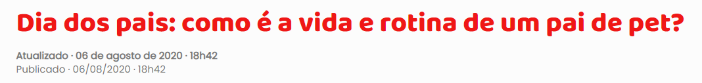
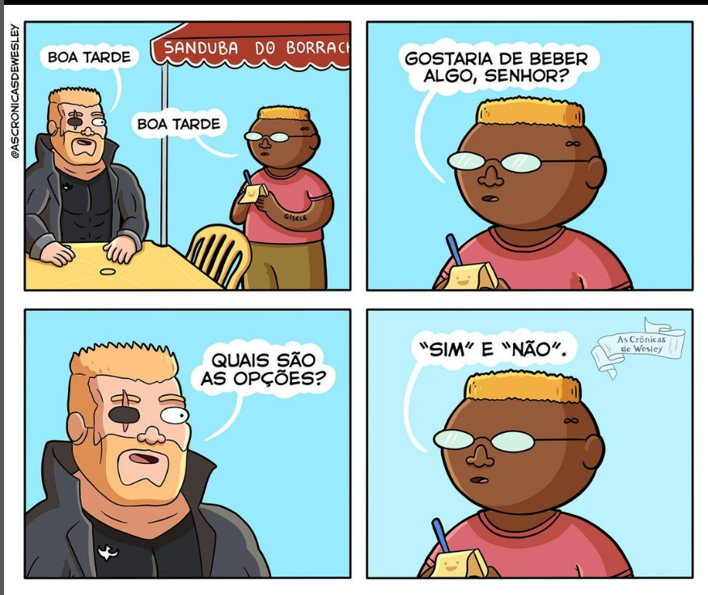
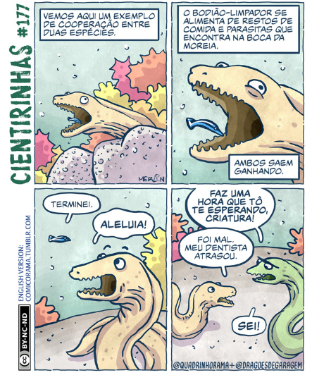
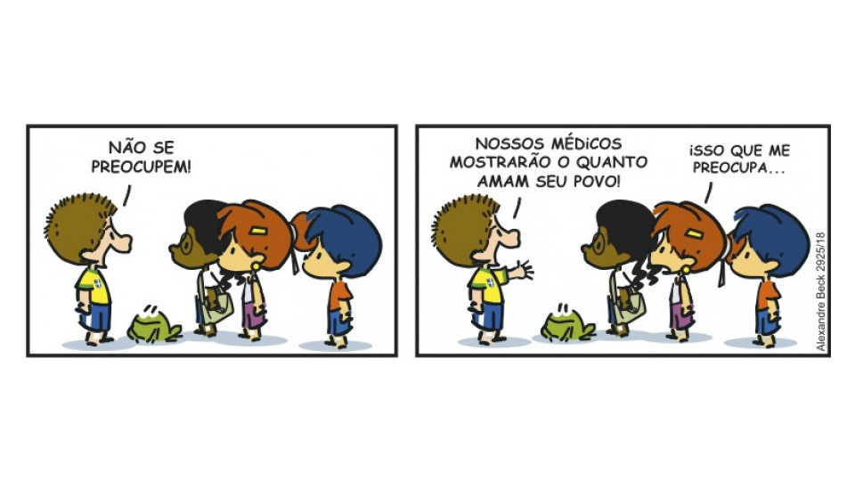
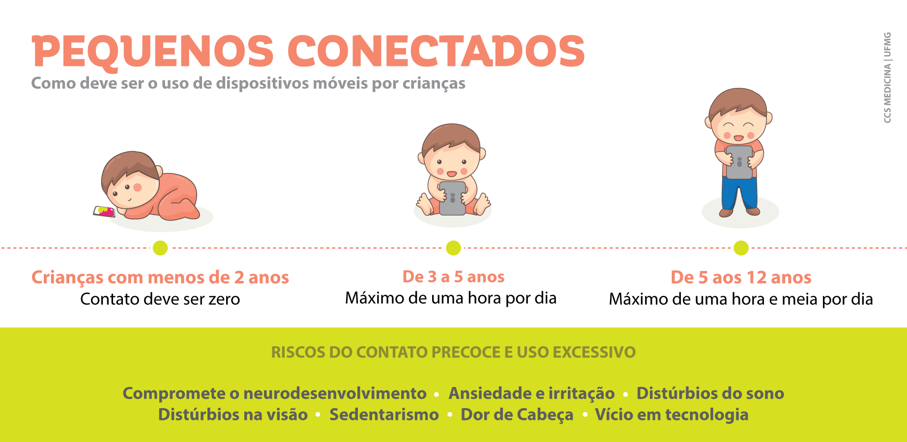
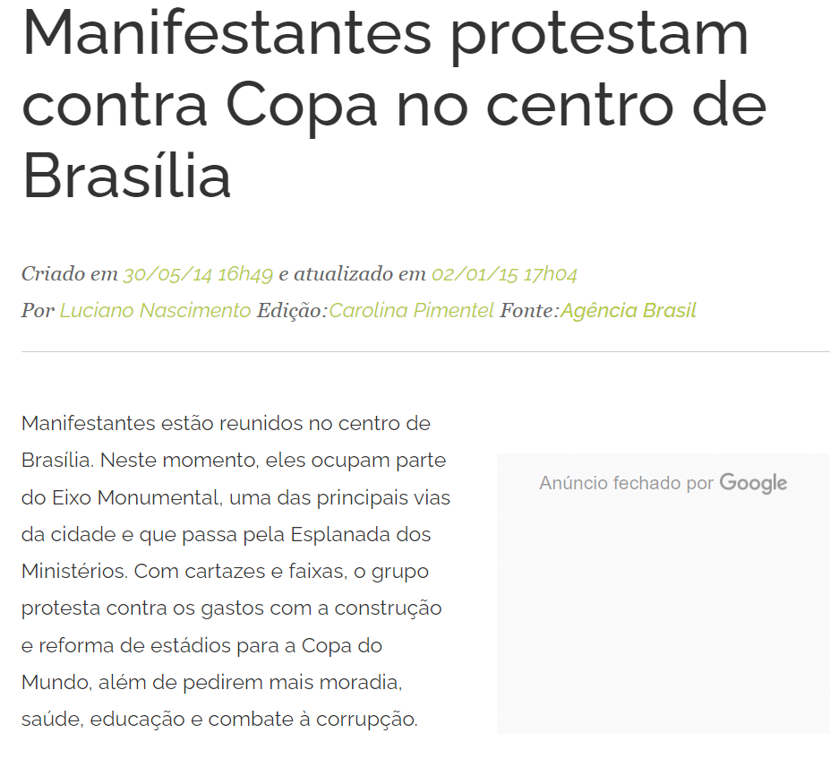
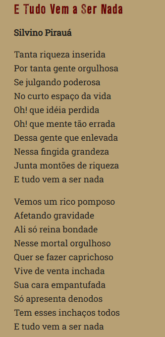
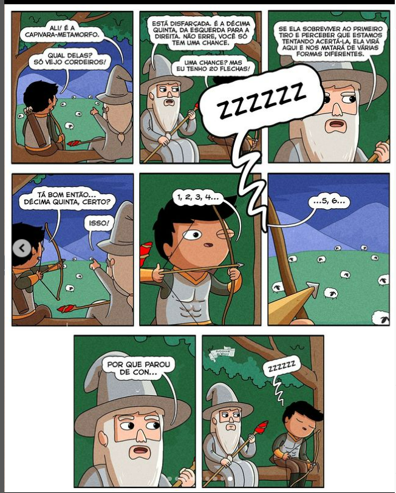
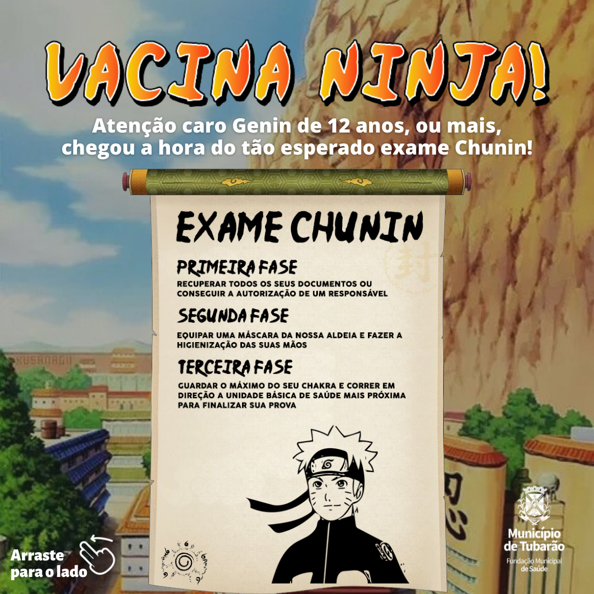

SAEB -- LÍNGUA PORTUGUESA -- 6º ANO

# MÓDULO 1: O que eu penso também tem valor

+----------------------------------+----------------------------------+
| SAEB                             | BNCC                             |
+==================================+==================================+
| \- Identificar o uso de recursos | **(EF67LP05)** Identificar e     |
| persuasivos em textos verbais e  | avaliar                          |
| não verbais.                     | teses/opiniões/posicionamentos   |
|                                  | explícitos e argumentos em       |
| \- Identificar teses, opiniões,  | textos argumentativos (carta de  |
| posicionamentos explícitos e     | leitor, comentário, artigo de    |
| argumentos em textos.            | opinião, resenha crítica etc.),  |
|                                  | manifestando concordância ou     |
|                                  | discordância.                    |
|                                  |                                  |
|                                  | **(EF67LP07)** Identificar o uso |
|                                  | de recursos persuasivos em       |
|                                  | textos argumentativos diversos   |
|                                  | (como a elaboração do título,    |
|                                  | escolhas lexicais, construções   |
|                                  | metafóricas, a explicitação ou a |
|                                  | ocultação de fontes de           |
|                                  | informação) e perceber seus      |
|                                  | efeitos de sentido.              |
+----------------------------------+----------------------------------+

Com frequência no dia a dia nos deparamos com informações de diferentes
tipos, que influenciam nosso modo de pensar ou de agir. Da mesma forma,
é comum que outras pessoas precisem exercer seu posicionamento a
respeito de determinados assuntos, a fim de fazer valer aquilo que
consideram ser mais apropriado.

Mas será que existe uma única forma de se expressar? Qual é a maneira
mais adequada de expressar um ponto de vista? Quais recursos devem ser
usados para dar credibilidade aos nossos argumentos?

Primeiramente, vamos retomar um conceito importante: por definição,
**argumentar** significa relacionar fatos, teses, estudos, opiniões,
problemas e possíveis soluções a fim de embasar determinado pensamento
ou ideia.

Sendo assim, para que uma ideia ou teoria seja considerada plausível, ou
seja, correta, é fundamental que ela esteja apoiada em aspectos
**lógicos**, e não apenas em aspectos **emotivos**. Isso quer dizer que
quando um ponto de vista é fornecido apenas com base na emoção, ele pode
ser facilmente contestado. Por outro lado, quando uma teoria é
apresentada a partir de aspectos lógicos, isto é, apoiados na palavra de
especialistas, em pesquisas e coletas de dados, por exemplo, ela se
torna forte o suficiente para servir, inclusive, como ponto de
referência.

Nos exercícios que se seguem, vamos praticar, por meio de exercícios,
recursos argumentativos a partir de textos comuns em nosso dia a dia,
como o comentário em rede social, o artigo de opinião, a carta de
reclamação, a resenha crítica e a crônica argumentativa.

Neste módulo, os(as) alunos(as) serão desafiados com questões
relacionadas ao campo de atuação jornalístico-midiático a partir de
atividades de análise e interpretação de textos verbais e não verbais
veiculados por diferentes meios e canais de comunicação. É um bom
momento para explorar o multiletramento, uma vez que nos Anos Finais do
Ensino Fundamental espera-se que os(as) estudantes comecem a identificar
teses e informações explícitas e implícitas em textos argumentativos,
bem como o uso de recursos persuasivos nesses gêneros textuais.

Aqui, vamos explorar textos argumentativos presentes no meio
jornalístico, mais precisamente o comentário em rede social, o artigo de
opinião, a carta de reclamação, a resenha crítica e a crônica
argumentativa.

Leia o texto a seguir e responda às questões 1 a 4.

**Estudantes escrevem carta com sugestões para a cidade e entregam ao
prefeito**

As ideias de pequenos cidadãos parecem simples, mas podem resultar em
melhorias para a cidade. Estudantes da turma do 3º ano A, da Escola
Municipal de Ensino Fundamental (Emef) Octacílio Lomba, em Maruípe,
entregaram uma carta ao prefeito de Vitória, Lorenzo Pazolini, com
sugestões para a capital.

Além da escrita, feita a muitos pares de mãos, os estudantes também
fizeram desenhos sobre como está a situação hoje e como eles imaginam
que possa ser, com melhorias. No encontro com o prefeito, os estudantes
leram a carta.

\"Percebemos que a rua da nossa escola alaga, às vezes. E isso tem nos
preocupado devido ao contato com vírus e bactérias que pode haver na
água do esgoto. Nós aprendemos que esses alagamentos acontecem devido ao
lixo que as pessoas jogam na rua. Será que o senhor não poderia investir
mais em trabalhos de conscientização da coleta seletiva? Assim as
pessoas vão aprender como o lixo deve ser organizado\", diz um dos
trechos da carta.\[;;;\]

O amor pelos animais também foi um tópico tratado na carta: \"Se não for
pedir muito, o senhor poderia providenciar campanhas de conscientização
para evitar os maus tratos de animais? Pois eles também têm
sentimentos.\" \[\...\]

(FRANÇA, Brunella. Estudantes escrevem carta com sugestões para a cidade
e entregam ao prefeito. Publicada em 23 de novembro de 2021. Prefeitura
de Vitória. Disponível em: \<
<https://www.vitoria.es.gov.br/noticia/estudantes-escrevem-carta-com-sugestoes-para-a-cidade-e-entregam-ao-prefeito-44202>\>.
Acesso em: 14 fev. 2023. Adaptado.)

1\. O texto noticia a redação de uma carta de reclamação, por parte de
estudantes de uma escola municipal de Maruípe, em Vitória (ES),
destinada ao prefeito da cidade. Qual é o objetivo da carta?

Resposta: O objetivo era demonstrar situações preocupantes no município,
do ponto de vista dos alunos, e sugestões de melhoria propostas por
eles.

2\. Qual argumento os(as) estudantes utilizam para justificar sua
preocupação com os alagamentos na escola? De que maneira eles(as) sabem
desse tipo de informação?

Resposta: Os(as) estudantes se preocupam com os vírus e bactérias que
podem estar presentes na água do esgoto. Segundo a carta, eles
aprenderam que esses alagamentos acontecem devido ao lixo que as pessoas
jogam na rua.

3\. Qual é a tese proposta pelos(as) estudantes como possível solução
para os alagamentos na escola? O que justifica essa escolha?

Resposta: Os(as) estudantes propõem que o prefeito invista em
conscientização sobre coleta seletiva, pois, dessa forma, as pessoas
saberiam melhor a destinação do lixo, reduzindo a possibilidade de o
jogarem incorretamente na rua.

4\. No último parágrafo, a jornalista afirma que "o amor pelos animais
também foi um tópico tratado na carta". Com base na leitura desse
parágrafo, é possível afirmar que a solicitação dos(as) estudantes foi
feita com base em um argumento lógico ou emotivo? Justifique sua
resposta.

Resposta: Pode-se afirmar que a solicitação dos(as) estudantes foi feita
com base em um argumento emotivo, uma vez que afirmam na carta que os
animais também têm sentimentos, mas não apresentam nenhum argumento
lógico, como pesquisa científica ou palavra de especialista, que
justifique esse argumento.

A **resenha crítica** é um tipo de texto que tem por característica
avaliar obras dos mais diversos tipos: artigos, livros, canções, peças
teatrais, filmes etc.

Leia a seguir um trecho da resenha crítica do filme *Turma da Mônica:
Laços* e responda às questões 5, 6 e 7.

*Turma da Mônica: Laços* tem visual super colorido\[\...\]. Essa
estética fornece os pilares imagéticos a uma trama que transcorre
pontuando a importância da amizade em detrimento das diferenças.
\[\...\]

Existe a preservação da pureza das crianças que adentram corajosamente
num território interditado em busca do amigo peludo sob a custódia de
uma figura misteriosa. Todavia, a ingenuidade delas vai até determinado
ponto, não sendo extrapolada e, portanto, caracterizando a infância sem
com isso fazer das figuras bobas ou inverossímeis. \[\...\]

Daniel Rezende, que já havia demonstrado grandes qualidades como diretor
à frente de *Bingo: O Rei das Manhãs* (2017), faz desse seu segundo
longa-metragem uma preciosa homenagem à imaginação de Maurício de Sousa
e, ao mesmo tempo, resgata uma infância com sabor nostálgico de passado,
um período atravessado por questões atemporais, aqui sem a mediação de
dispositivos eletrônicos ou de algo que os valha.

(MÜLLER, Marcelo. Resenha crítica de Turma da Mônica: Laços. Papo de
Cinema. Disponível em:
\<<https://www.papodecinema.com.br/filmes/turma-da-monica-lacos/>\>.
Acesso em: 22 fev. 2023. Fragmento.)

5\. Assinale verdadeiro (V) ou falso (F) para as afirmações a seguir.

( ) A resenha tenta convencer o(a) leitor(a) a assistir ao filme.

( ) O visual colorido do filme favorece a imaginação das pessoas que
assistem ao filme.

( ) A lição do filme é pontuar os laços de amizade, mesmo que em meio às
diferenças.

( ) No filme, as personagens são apresentadas como ingênuas e até mesmo
bobas.

( ) O diretor do filme, Daniel Rezende, pretende desvincular as
personagens de seu autor, Maurício de Sousa.

( ) O filme apresenta crianças em situações de aventuras atemporais, sem
precisar de celulares e outros dispositivos eletrônicos para se
divertir.

Respostas:

( F ) A resenha tenta convencer o(a) leitor(a) a assistir ao filme.

A resenha apenas traz o ponto de vista do resenhista sobre o filme, sem
tentar convencer o(a) leitor(a) a assisti-lo.

( V ) O visual colorido do filme favorece a imaginação das pessoas que
assistem ao filme.

Na segunda linha da resenha o autor pontua que o visual super colorido
do filme favorece pilares imagéticos para quem o assiste.

( V ) A lição do filme é pontuar os laços de amizade, mesmo que em meio
às diferenças.

O autor informa, no primeiro parágrafo do texto, que a trama transcorre
pontuando a importância da amizade em detrimento das diferenças.

( F ) No filme, as personagens são apresentadas como ingênuas e até
mesmo bobas.

O autor informa que as personagens têm a inocência comum a qualquer
criança, porém a infância não é caracterizada como boba ou inverossímil.

( F ) O diretor do filme, Daniel Rezende, pretende desvincular as
personagens de seu autor, Maurício de Sousa.

No texto fica claro que o diretor pretende homenagear o criador da Turma
da Mônica, Maurício de Sousa.

( V ) O filme apresenta crianças em situações de aventuras atemporais,
sem precisar de celulares e outros dispositivos eletrônicos para se
divertir.

Conforme explica o último parágrafo, o diretor resgata uma infância com
sabor nostálgico de passado, sem a mediação de dispositivos eletrônicos.

6\. De que maneira o(a) leitor(a) do texto percebe que o autor da
crítica gostou do filme?

Resposta: O autor da resenha utiliza adjetivos positivos sobre a obra,
ou seja, fala bem das cenas, do visual, do comportamento das personagens
e até mesmo do diretor do filme.

7\. Retire do texto ao menos dois trechos que demonstram o
posicionamento do autor da resenha em relação ao filme *Turma da Mônica:
Laços*.

Resposta: Espera-se que os(as) estudantes retirem do texto trechos que
apresentam adjetivos positivos em relação à obra.

Sugestões de resposta:

*Turma da Mônica: Laços* tem visual **super colorido**.

Existe a preservação da pureza das crianças que adentram
**corajosamente** num território interditado\...

\...faz desse seu segundo longa-metragem uma **preciosa** homenagem à
imaginação de Maurício de Sousa

A **crônica argumentativa** é um gênero textual que busca apresentar
reflexões pontos de vista pessoais a respeito de temas ou situações
cotidianas.

Leia um trecho da crônica *Nadar contra é impossível*, de Marina
Colasanti, e responda às questões 8, 9 e 10.

"Então, agora, além da contaminação do ar e da água, além da
contaminação de oceanos e rios, teremos que nos cuidar da contaminação
digital do cérebro.

E, a partir daqui, entramos na escorregadia área dos vícios.\[\...\]
Adrenalina é um hormônio neurotransmissor derramado no organismo para
prepará-lo a enfrentamentos. E transmite um prazer intenso, diferente de
todos os outros.

O jovem de 20 anos que olha o celular 190 vezes por dia, não o faz por
avidez de notícias ou de conhecimentos. O faz porque não pode deixar de
fazê-lo. É um vício, e uma reafirmação de êxito, tão comum a todos que
sequer é encarado como vício. E, como tal, combatido.

Que geração estamos fabricando, não sabemos. Qual será o resultado, no
cérebro dos pequenos postados durante 4 horas por dia diante de telas de
variados tamanhos, ignoramos. Mas nadar contra a correnteza do próprio
tempo é impossível."

(COLASANTI, Marina. Nadar contra é impossível. Publicado em 3 de
dezembro de 2020. Disponível em:\<
<https://www.marinacolasanti.com/2020/12/nadar-contra-e-impossivel.html>\>.
Acesso em: 22 fev. 2023. Fragmento.)

8\. Segundo a autora, as pessoas não conseguem parar de utilizar o
celular por que estão viciadas. Qual argumento ela utiliza para
justificar essa afirmação?

Resposta: A autora utiliza um dado científico. Ela explica o conceito de
adrenalina, um hormônio que transmite prazer intenso. Segundo ela,
quando a pessoa utiliza o celular, ela libera adrenalina.

9\. A autora se mostra indignada com o fato de o vício em celulares não
ser combatido. Por que, de acordo com o texto, isso acontece?

Resposta: Porque esse tipo de vício passa tão batido no dia a dia que
sequer é considerado um vício.

10\. A que conclusão a autora chega, ao final de sua crônica?

Resposta: A autora conclui que mesmo com todos os problemas causados
pelo vício em celulares, é impossível ir contra esse tipo de evolução
tecnológica que acontece com o tempo.

**TREINO**

**1.**

O consumismo está relacionado à ideia de devorar, destruir e extinguir.
Se agora, tragédias naturais, como queimadas, furacões, inundações
gigantescas, enchentes e períodos prolongados de seca, são muito mais
comuns e frequentes, é porque a exploração irresponsável do meio
ambiente prevaleceu ao longo de décadas.

Concentrar todos os esforços no consumo é contribuir, dia após dia, para
o desequilíbrio global. O consumismo infantil, portanto, é um problema
que não está ligado apenas à educação escolar e doméstica. Embora a
questão seja tratada quase sempre como algo relacionado à esfera
familiar, crianças que aprendem a consumir de forma inconsequente e
desenvolvem critérios e valores distorcidos são de fato um problema de
ordem ética, econômica e social.

(Consumismo infantil: um problema de todos. Disponível em: \<
<https://criancaeconsumo.org.br/consumismo-infantil/>\>. Acesso em: 22
fev. 2022. Fragmento.)

Segundo o texto, o fato de o consumismo estar relacionado ao
desequilíbrio global é apoiado pelo argumento de que

a\) as crianças aprendem a consumir de forma inconsequente.

b\) critérios e valores distorcidos são passados para as pessoas desde a
infância.

a\) a exploração irresponsável do meio ambiente prevaleceu ao longo de
décadas.

d\) critérios e valores distorcidos são problemas de ordem ética,
econômica e social.

Resposta: C.

A. Incorreta. O texto afirma que as crianças aprendem a consumir de
forma inconsequente, porém não é essa a principal razão do desequilíbrio
global.

B. Incorreta. Critérios e valores distorcidos de consumo são passados
para as pessoas desde a infância, e não critérios e valores distorcidos
de modo geral, como dá a entender a afirmativa.

C. Correta. O fato de explorarmos de forma irresponsável o meio ambiente
ao longo de décadas é o principal responsável pelo desequilíbrio global.

D. Incorreta. Critérios e valores distorcidos com relação ao consumo (e
não de modo geral) são de fato problemas de ordem ética, econômica e
social, porém não são os responsáveis diretos pelo desequilíbrio global.

Saeb: Identificar teses, opiniões, posicionamentos explícitos e
argumentos em textos.

BNCC: EF67LP05

Nível: fácil.

2\. Observe a imagem a seguir.

{width="5.905555555555556in"
height="1.5354166666666667in"}

Sugiro que aqui a arte redesenhe esses emojis. No flaticon achei todos
eles:
[[https://br.freepik.com/icones-premium/emojis\_26110665.htm\#query=emoji&position=9&from\_view=search&track=sph]{.underline}](https://br.freepik.com/icones-premium/emojis_26110665.htm#query=emoji&position=9&from_view=search&track=sph)

As cores devem ser mantidas como na imagem original por questões
pedagógicas.

O texto pode ser reescrito da seguinte forma: Quão satisfeito você está
com nossos serviços? Muito insatisfeito, Insatisfeito, Sem opinião
definida, Satisfeito, Muito satisfeito.

A imagem faz parte de uma pesquisa de satisfação. Os recursos que
auxiliam o(a) cliente a identificar com facilidade seu sentimento com
relação aos serviços nessa pesquisa são

a\) os emojis, por extarem muito presentes no dia a dia das pessoas.

b\) os textos, que variam de "muito insatisfeito" a "muito satisfeito",
posicionados abaixo das imagens.

c\) as cores das imagens, que variam em uma escala de vermelho para
"muito insatisfeito" a verde para "muito satisfeito".

d\) a combinação de emojis com expressões faciais, as cores universais e
os textos abaixo das imagens, tornando a pesquisa inclusiva.

Resposta: D

a\) Incorreta. Os emojis de fato estão presentes no dia a dia das
pessoas que utilizam ferramentas de comunicação digital, por exemplo,
mas aqueles que não estão familiarizados com esse tipo de linguagem
poderiam se confundir.

b\) Incorreta. Os textos traduzem as expressões dos emojis, mas somente
eles não tornam a pesquisa intuitiva.

c\) Incorreta. Os emojis estão representados em cores de sinalização
praticamente universal, que já fazem parte do nosso cotidiano, como o
semáforo: vermelho quando não se deve prosseguir, amarelo para alerta e
verde para prosseguir. Contudo, sozinhas as cores não fazem sentido na
pesquisa, elas precisam estar atreladas a uma imagem.

d\) Correta. A combinação de expressões faciais, texto de apoio e cores
torna a pesquisa intuitiva, ou seja, fácil de ser respondida por todos
os públicos, e inclusiva, isto é, acessível a todas as pessoas.

Saeb: Identificar o uso de recursos persuasivos em textos verbais e não
verbais.

BNCC: EF67LP07

Nível de dificuldade: médio.

3\. *Nunca subestime uma mulherzinh*a é uma reunião de contos e crônicas
publicados pela autora nos jornais *Correio Braziliense* e *O Estado de
Minas*, com prefácio de Zélia Duncan.

Nesta publicação o leitor poderá comprovar o talento literário e a
irreverência de *Fernanda Takai*, uma mulherzinha com pouco mais de um
metro e meio, de voz suave, que no *Pato Fu* se escondia atrás de uma
guitarra.\[\...\]

(Disponível em: \<<https://fernandatakai.com.br/livros/>\>. Acesso em:
22 de fev. 2023.)

No título do livro de Fernanda Takai, *Nunca subestime uma mulherzinha*,
a palavra "mulherzinha", no diminutivo, foi escolhida no intuito de

a\) fazer uma chacota com o fato de a autora ser uma mulher baixinha.

b\) tratar mulheres pequenas como autoras de forma carinhosa, ou seja,
"mulherzinhas".

c\) brincar com o fato de a autora ser uma mulher tão pequena que se
escondia atrás da guitarra.

d\) dar um novo sentido à palavra "mulherzinha", que pode ser pejorativo
em alguns contextos, mas aqui está sendo usado para representar a
autora, uma mulher baixinha.

Resposta: D

a\) Incorreta. A intenção de usar a palavra "mulher" no diminutivo não é
fazer chacota com a autora do livro: pelo contrário, é ironizar o fato
de mulheres serem subestimadas por supostamente não conseguirem fazer
certas coisas.

b\) Incorreta. Algumas vezes o diminutivo é usado de forma carinhosa,
porém, neste caso, a palavra "mulherzinha" é usada de forma irônica.

c\) Incorreta. A palavra no diminutivo de certa forma brinca com o fato
de a autora ser uma mulher pequena, porém ela tem outro efeito de
sentido além desse.

d\) Correta. Chamar uma mulher de "mulherzinha" em alguns contextos é
pejorativo, contudo, neste caso, pretende-se dar outro efeito de sentido
à palavra ironizando esse fato ao mesmo tempo em que a palavra é usada
em sentido literal, para representar a autora, que é uma mulher
realmente pequena.

Saeb: Identificar teses, opiniões, posicionamentos explícitos e
argumentos em textos.

BNCC: EF67LP07

Nível de dificuldade: difícil.

# MÓDULO 2: Eu, a sociedade, direitos e deveres

+----------------------------------+----------------------------------+
| SAEB                             | BNCC                             |
+==================================+==================================+
| \- Identificar elementos         | **(****EF69LP02)** Analisar e    |
| constitutivos de textos          | comparar peças publicitárias     |
| pertencentes ao domínio          | variadas (cartazes,              |
| jornalístico/midiático.          | folhetos, *outdoor*, anúncios e  |
|                                  | propagandas em diferentes        |
| \- Identificar formas de         | mídias, *spots*, *jingle*,       |
| organização de textos            | vídeos etc.), de forma a         |
| normativos, legais e/ou          | perceber a articulação entre     |
| reinvindicatórios.               | elas em campanhas, as            |
|                                  | especificidades das várias       |
| \- Identificar elementos         | semioses e mídias, a adequação   |
| constitutivos de gêneros de      | dessas peças ao público-alvo,    |
| divulgação científica.           | aos objetivos do anunciante e/ou |
|                                  | da campanha e à construção       |
| \- Analisar a relação temática   | composicional e estilo dos       |
| entre diferentes gêneros         | gêneros em questão, como forma   |
| jornalísticos.                   | de ampliar suas possibilidades   |
|                                  | de compreensão (e produção) de   |
|                                  | textos pertencentes a esses      |
|                                  | gêneros.                         |
|                                  |                                  |
|                                  | **(****EF69LP20)** Identificar,  |
|                                  | tendo em vista o contexto de     |
|                                  | produção, a forma de organização |
|                                  | dos textos normativos e legais,  |
|                                  | a lógica de hierarquização de    |
|                                  | seus itens e subitens e suas     |
|                                  | partes: parte inicial (título -- |
|                                  | nome e data -- e ementa), blocos |
|                                  | de artigos (parte, livro,        |
|                                  | capítulo, seção, subseção),      |
|                                  | artigos (caput e parágrafos e    |
|                                  | incisos) e parte final           |
|                                  | (disposições pertinentes à sua   |
|                                  | implementação) e analisar        |
|                                  | efeitos de sentido causados pelo |
|                                  | uso de vocabulário técnico, pelo |
|                                  | uso do imperativo, de palavras e |
|                                  | expressões que indicam           |
|                                  | circunstâncias, como advérbios e |
|                                  | locuções adverbiais, de palavras |
|                                  | que indicam generalidade, como   |
|                                  | alguns pronomes indefinidos, de  |
|                                  | forma a poder compreender o      |
|                                  | caráter imperativo, coercitivo e |
|                                  | generalista das leis e de outras |
|                                  | formas de regulamentação.        |
|                                  |                                  |
|                                  | **(EF69LP27)** Analisar a forma  |
|                                  | composicional de textos          |
|                                  | pertencentes a gêneros           |
|                                  | normativos/ jurídicos e a        |
|                                  | gêneros da esfera política, tais |
|                                  | como propostas, programas        |
|                                  | políticos (posicionamento quanto |
|                                  | a diferentes ações a serem       |
|                                  | propostas, objetivos, ações      |
|                                  | previstas etc.), propaganda      |
|                                  | política (propostas e sua        |
|                                  | sustentação, posicionamento      |
|                                  | quanto a temas em discussão) e   |
|                                  | textos reivindicatórios: cartas  |
|                                  | de reclamação, petição           |
|                                  | (proposta, suas justificativas e |
|                                  | ações a serem adotadas) e suas   |
|                                  | marcas linguísticas, de forma a  |
|                                  | incrementar a compreensão de     |
|                                  | textos pertencentes a esses      |
|                                  | gêneros e a possibilitar a       |
|                                  | produção de textos mais          |
|                                  | adequados e/ou fundamentados     |
|                                  | quando isso for requerido.       |
|                                  |                                  |
|                                  | **(EF67LP16)** Explorar e        |
|                                  | analisar espaços de reclamação   |
|                                  | de direitos e de envio de        |
|                                  | solicitações (tais como          |
|                                  | ouvidorias, SAC, canais ligados  |
|                                  | a órgãos públicos, plataformas   |
|                                  | do consumidor, plataformas de    |
|                                  | reclamação), bem como de textos  |
|                                  | pertencentes a gêneros que       |
|                                  | circulam nesses espaços,         |
|                                  | reclamação ou carta de           |
|                                  | reclamação, solicitação ou carta |
|                                  | de solicitação, como forma de    |
|                                  | ampliar as possibilidades de     |
|                                  | produção desses textos em casos  |
|                                  | que remetam a reivindicações que |
|                                  | envolvam a escola, a comunidade  |
|                                  | ou algum de seus membros como    |
|                                  | forma de se engajar na busca de  |
|                                  | solução de problemas pessoais,   |
|                                  | dos outros e coletivos.          |
|                                  |                                  |
|                                  | **(****EF67LP17)** Analisar, a   |
|                                  | partir do contexto de produção,  |
|                                  | a forma de organização das       |
|                                  | cartas de solicitação e de       |
|                                  | reclamação (datação, forma de    |
|                                  | início, apresentação             |
|                                  | contextualizada do pedido ou da  |
|                                  | reclamação, em geral,            |
|                                  | acompanhada de explicações,      |
|                                  | argumentos e/ou relatos do       |
|                                  | problema, fórmula de finalização |
|                                  | mais ou menos cordata,           |
|                                  | dependendo do tipo de carta e    |
|                                  | subscrição) e algumas das marcas |
|                                  | linguísticas relacionadas à      |
|                                  | argumentação, explicação ou      |
|                                  | relato de fatos, como forma de   |
|                                  | possibilitar a escrita           |
|                                  | fundamentada de cartas como      |
|                                  | essas ou de postagens em canais  |
|                                  | próprios de reclamações e        |
|                                  | solicitações em situações que    |
|                                  | envolvam questões relativas à    |
|                                  | escola, à comunidade ou a algum  |
|                                  | dos seus membros.                |
+----------------------------------+----------------------------------+

Os **textos expositivos** são aqueles que têm como objetivo expor
informações, apresentando ao leitor determinado assunto. Com uma
linguagem clara e objetiva, esse tipo de texto apresenta uma ideia
central que, em alguns casos, é o fio condutor para que um autor
argumente sobre ela.

Os textos expositivos podem ser de dois tipos diferentes:

-   Expositivos informativos, cuja função é apenas informar sobre
    determinado assunto, sem que o autor coloque seu ponto de vista
    pessoal com relação a ele. Exemplos: artigo de divulgação
    científica, livros didáticos, enciclopédias, verbetes de
    dicionários, textos acadêmicos, textos normativos, como leis, e
    infográficos.

-   Expositivos argumentativos, no qual o autor geralmente apresenta seu
    ponto de vista sobre o tema, embasando-se em uma série de
    estratégias argumentativas. Exemplos: carta de reclamação, artigo de
    opinião, textos enviados em páginas de internet voltadas ao
    atendimento ao cliente, comentários em redes sociais, entre outros.

Os textos expositivos estão mais presentes em nosso dia a dia do que
imaginamos, e podem utilizar **recursos verbais e não verbais**. Por
exemplo, ao atravessar a rua distraído, você provavelmente ouviu algum
veículo buzinar para chamar sua atenção com relação ao perigo, certo?
Ainda com relação ao trânsito, o próprio semáforo é um tipo de texto
informativo, pois mesmo que as informações não sejam transmitidas com
palavras, a sequência de cores e luzes aciona em nós os comandos de
"pare", "atenção" e "siga em frente".

É importante lembrar que sempre que vamos argumentar, ou seja, defender
um ponto de vista, é preciso utilizar estratégias corretas e voltadas a
cada tipo de texto.

Confira na tabela a seguir as principais estratégias argumentativas que
podemos utilizar em textos expositivos.

  **Tipo de estratégia**                    **Por que utilizar**                                                                                                                                                                                                      **Exemplo**
  ----------------------------------------- ------------------------------------------------------------------------------------------------------------------------------------------------------------------------------------------------------------------------- -----------------------------------------------------------------------------------------------------------------------------------------------------------------------------------------------------------------------------------------------
  Dados estatísticos de fontes confiáveis   Esse tipo de informação, quando extraída de fontes confiáveis, parte de pesquisas desenvolvidas por especialistas em diversas áreas do conhecimento, o que as torna praticamente irrefutáveis, ou seja, incontestáveis.   **De acordo com uma pesquisa do Ministério da Saúde**, as crianças estão mais vulneráveis a sofrer problemas respiratórios no inverno.
  Exemplificação                            Vivências comuns ao dia a dia das pessoas possibilitam o contato com situações que podem ser usadas para exemplificar seus argumentos.                                                                                    A falta de oportunidades profissionais para pessoas com pouca experiência muitas vezes faz com que jovens se vejam obrigados a trabalhar em profissões que não condizem com sua área de formação, **a exemplo** dos motoristas de aplicativo.
  Comparação                                Utilizar séries, documentários, novelas, personagens, pessoas de referência e outros repertórios que fazem parte da sua vivência podem embasar um argumento e gerar uma aproximação do leitor com o texto.                **Assim como** a apresentadora Xuxa, é importante que outras celebridades se posicionem a respeito da importância de uma alimentação saudável, pois isso serve de inspiração para que mais pessoas adotem estilos de vida semelhantes.
  Causa e consequência                      Para buscar a solução de um problema, é preciso identificar sua causa. Quais são as consequências do problema para as pessoas? Como ele surgiu?                                                                           **Desde a colonização, a população indígena foi escravizada e colocada à margem nossa sociedade. Uma das consequências disso** é o desrespeito, até os dias de hoje, às terras demarcadas e garantidas aos povos nativos.
  Citação                                   Quando se tem uma opinião sólida e declarada, (como em uma entrevista, por exemplo), de um(a) especialista no assunto tratado.                                                                                            **De acordo com o médico** Dráuzio Varella**,** fumar é um hábito prejudicial à saúde de modo geral.

Vamos compreender na prática, a partir de alguns exercícios, como esses
conceitos são aplicados.

Professor(a), os exercícios que seguem apresentam uma variedade de
textos expositivos que circulam em diferentes contextos da vida
cotidiana. É importante que os(as) estudantes treinem habilidades
voltadas à interpretação de informações implícitas e explícitas em
textos, objetivos de cada gênero apresentado e como se dá seu impacto
social.

Leia o texto a seguir, publicado no Jornal da USP, e responda às
questões 1 a 3.

**Seu cão reconhece suas emoções e toma decisões a partir disso, mostra
estudo da USP**

*Pesquisa do Instituto de Psicologia mostra que "nossos melhores amigos"
podem prever o comportamento humano ao olhar para nosso rosto e
diferenciar emoções neutras, de alegria ou raiva*

Será que seu cachorro sabe o que fazer quando você está bravo ou feliz?
Com o objetivo de entender se os cães respondem de forma diferente às
expressões humanas positivas e negativas, pesquisadores do Instituto de
Psicologia (IP) da USP e da Universidade de Lincoln, no Reino Unido,
estudaram 90 cães e descobriram que eles são capazes não apenas de
inferir emoções humanas através de expressões faciais, mas também de
relacionar essa informação com suas possíveis consequências e tomar
decisões a partir de uma previsão do nosso comportamento.

O artigo intitulado *Dogs can infer implicit information from human
emotional expressions*\* foi publicado na revista científica *Animal
Cognition* e desenvolvido pelos pesquisadores Natalia Albuquerque e
Briseida Resende, do Instituto de Psicologia da USP, e Daniel Mills, Kun
Guo e Anna Wilkinson, da Universidade de Lincoln.\[\...\]

"A pesquisa evidencia que os cães levam em conta as expressões das
emoções dos humanos para fazer escolhas. As pessoas poderão perceber o
animal como um ser que presta atenção ao que fazemos e que toma suas
decisões com base nisso. Desta forma, acho que podemos desenvolver uma
relação mais saudável e respeitosa", afirma a coautora do trabalho, a
professora Briseida. Ela destaca que é importante não o tratar como
humano, e sim respeitá-lo enquanto cão.

\* *Dogs can infer implicit information from human emotional
expressions, em português significa "Cães podem inferir informações
implícitas em expressões humanas relacionadas a emoções.*

(GAMA, Guilherme. Seu cão reconhece suas emoções e toma decisões a
partir disso, mostra estudo da USP. Jornal da USP, publicado em 23 de
nov. de 2021. Disponível em: \<
<https://jornal.usp.br/ciencias/seu-cao-reconhece-suas-emocoes-e-toma-decisoes-a-partir-disso-mostra-estudo-da-usp/>\>.
Acesso em: 01 mar. 2023. Adaptado.)

1\. Qual é o principal assunto do texto? Em que parte da estrutura do
texto é possível constatar essa informação?

Resposta: O texto fala sobre a capacidade dos cães de reconhecerem as
emoções humanas e tomarem decisões a partir disso. É possível constatar
essa informação no título do texto.

SAEB: Identificar elementos constitutivos de textos pertencentes ao
domínio jornalístico/midiático.; Identificar elementos constitutivos de
gêneros de divulgação científica.;- Analisar a relação temática entre
diferentes gêneros jornalísticos.

BNCC: EF69LP20

Nível: Fácil.

2\. Qual é a função do subtítulo do artigo?

Resposta: O subtítulo apresenta para o leitor a pesquisa que será
apresentada no artigo.

SAEB: Identificar elementos constitutivos de textos pertencentes ao
domínio jornalístico/midiático.; Identificar elementos constitutivos de
gêneros de divulgação científica.;- Analisar a relação temática entre
diferentes gêneros jornalísticos.

BNCC: EF69LP20

Nível: Médio.

3\. Qual é o objetivo de se fazer a pesquisa apresentada no artigo? Em
que parte do texto é possível obter essa informação?

Resposta: O objetivo, segundo a pesquisadora, é desenvolver uma relação
mais saudável e respeitosa entre pessoas e animais, a partir das
informações constatadas. Essa informação encontra-se no último parágrafo
do texto.

SAEB: Identificar elementos constitutivos de textos pertencentes ao
domínio jornalístico/midiático.; Identificar elementos constitutivos de
gêneros de divulgação científica.;- Analisar a relação temática entre
diferentes gêneros jornalísticos.

BNCC: EF69LP20

Nível: Difícil.

Observe com atenção os Textos 1 e 2, a seguir, para responder às
questões 4 a 6.

**Texto 1**

{width="5.905555555555556in"
height="3.3069444444444445in"}

Fonte:
<https://www.canalsaude.fiocruz.br/noticias/noticiaAberta/campanha-estimula-habitos-saudaveis-para-as-criancas13112019>

**Texto 2**

Precisa ser criado pela Arte. Vamos simular uma postagem de rede social.
A primeira imagem deve conter o seguinte texto no topo: HÁBITOS
SAUDÁVEIS COMEÇAM NA INFÂNCIA. No rodapé, deve haver a hashtag:
\#obesidadeinfantilnão

A segunda imagem deve vir junto da primeira, posicionada à direita dela
(simulando um carrossel postado do Instagram). O texto é exatamente o
mesmo que está no exemplo.

{width="2.7083333333333335in"
height="2.7083333333333335in"} {width="2.7083333333333335in"
height="2.7083333333333335in"}

<https://br.freepik.com/vetores-gratis/fundo-do-dia-da-saude-mundial-em-estilo-plano_1988259.htm#page=2&query=healthy%20children&position=3&from_view=search&track=ais>

<https://www.google.com.br/url?sa=i&url=https%3A%2F%2Fwww.canva.com%2Fp%2Fbrancodesign%2F&psig=AOvVaw025oTdYXBEXaAsIqgbnjOO&ust=1677811356155000&source=images&cd=vfe&ved=0CBAQjRxqFwoTCLD-78CcvP0CFQAAAAAdAAAAABAR>

4\. O objetivo comum a ambas as campanhas é

a\) mostrar às crianças como cuidar da saúde.

b\) incentivar as pessoas a manterem hábitos saudáveis na infância.

c\) apresentar o que deve ser feito para que crianças não sofram
obesidade.

c\) conscientizar as pessoas com relação ao problema da obesidade
infantil.

Resposta: D

Justificativa: Ambos os textos são campanhas de conscientização com
relação à obesidade infantil.

a\) Incorreta. O Texto 1 fornece dicas de comportamentos que podem ser
adotados para a manutenção de hábitos saudáveis pelas crianças, mas não
é direcionado especificamente a elas. O Texto 2 apresenta apenas um
slogan de campanha e uma hashtag que informa o objetivo da campanha,
além de elementos não verbais.

b\) Incorreta. Embora ambos os textos deixem claro a importância de
hábitos saudáveis na infância, o objetivo das campanhas não é este.

c\) Incorreta. Os textos são campanhas publicitárias, e não materiais
informativos. Portanto, o objetivo deles é conscientizar sobre uma
ideia, no caso o combate à obesidade infantil.

SAEB: Identificar elementos constitutivos de textos pertencentes ao
domínio jornalístico/midiático.

BNCC: EF69LP02

Nível de dificuldade: fácil

5\. Qual dos dois textos alcança uma quantidade maior de leitores(as),
se considerarmos os canais em que é veiculado? Justifique sua resposta.

Resposta: O Texto 1 alcança um número maior de pessoas, porque, por ser
um cartaz publicitário, pode ser divulgado em diversos locais, como
postos de saúde, escolas, hospitais, redes sociais e páginas de
internet. Já o Texto 2 é uma postagem de rede social, ficando restrita
apenas às pessoas que seguem aquela página por interesses em comum com
determinado perfil.

SAEB: Identificar elementos constitutivos de textos pertencentes ao
domínio jornalístico/midiático.

BNCC: EF69LP02

Nível de dificuldade: difícil.

6\. Qual dos textos promove ao(à) leitor(a) maior credibilidade com
relação às informações divulgadas? Justifique sua resposta.

Resposta: O Texto 1, pois tem como autor da campanha o Ministério da
Saúde, um órgão ligado ao Governo Federal. Isso pode ser observado no
rodapé da campanha. Ao contrário, o Texto 2 não apresenta nenhuma
informação a não ser o slogan da campanha e uma hashtag.

SAEB: Identificar elementos constitutivos de textos pertencentes ao
domínio jornalístico/midiático.

BNCC: EF69LP02

Nível de dificuldade: médio.

Leia, a seguir, o artigo 4º da Declaração Universal dos Direitos dos
Animais e responda às questões 7 e 8.

"1. Todo o animal pertencente a uma espécie selvagem tem o direito de
viver livre no seu próprio ambiente natural, terrestre, aéreo ou
aquático e tem o direito de se reproduzir.

2\. Toda a privação de liberdade, mesmo que tenha fins educativos, é
contrária a este direito."

Disponível em: \<
http://www.fiocruz.br/biosseguranca/Bis/infantil/direitoanimais.htm\>.
Acesso em: 2 mar. 2023. Fragmento.

7\. Explique, com suas palavras e com base na leitura, a finalidade da
Declaração Universal dos Direitos dos Animais.

Resposta: A Declaração Universal dos Direitos dos Animais tem a
finalidade de garantir que os direitos dos animais sejam preservados por
nós, seres humanos.

SAEB: Identificar formas de organização de textos normativos, legais
e/ou reivindicatórios.

Nível de dificuldade: fácil.

8\. O parágrafo 2 da Declaração Universal dos Direitos dos Animais
informa que toda a privação de liberdade no caso de animais selvagens,
mesmo que com fins educativos, é contrária a esse direito. Esse trecho
quer dizer que

a\) prender animais selvagens é crime.

b\) não se pode prender animais selvagens, mas animais domésticos sim.

c\) é um dever dos seres humanos garantir o direito de animais selvagens
viverem em liberdade.

d\) pessoas que estudam animais selvagens e restringem sua liberdade
para este fim estão, na realidade, cometendo um crime.

Resposta: É um dever dos seres humanos garantir o direito de animais
selvagens viverem em liberdade.

A Declaração Universal dos Direitos dos Animais é um texto normativo que
tem como princípio garantir direitos de sobrevivência dos animais de
modo geral, a fim de orientar a convivência harmoniosa entre eles e os
seres humanos. Cabe a nós garantir esse direito, uma vez que os animais
são seres irracionais.

Justificativas:

\(a\) Incorreta. O texto orienta sobre direitos de animais selvagens,
mas não informa que prendê-los é crime.

\(b\) Incorreta. O trecho não menciona nada sobre poder manter animais
domésticos presos.

\(d\) Incorreta. O trecho menciona que restringir a liberdade de animais
selvagens, mesmo que para estudo, fere esse direito, porém não menciona
que é crime ou que a pessoa será punida por fazer isso.

SAEB: Identificar formas de organização de textos normativos, legais
e/ou reivindicatórios.

Nível de dificuldade: médio.

9\. Observe a imagem a seguir.

{width="3.662917760279965in"
height="2.0606069553805773in"}

Fonte: Câmara Municipal de Juara (MT).

Por sua natureza reivindicatória, o objetivo do texto apresentado é
tornar o convívio entre as pessoas

\(a\) mais alegre.

\(b\) mais bonito.

\(c\) mais seguro.

\(d\) mais justo.

Resposta: D. Mais justo.

O texto normativo apresentado trata do direito ao atendimento
prioritário dos grupos descritos nas imagens: idosos, gestantes, pessoas
com crianças de colo, pessoas com deficiência e autistas. Por seu
caráter reivindicatório, o objetivo é tornar o convívio entre as pessoas
mais justo.

Justificativas:

a\) Incorreta. Não se trata de tornar o convívio mais alegre, e sim
igualitário e inclusivo.

b\) Incorreta. O objetivo do texto normativo é regulamentar normas de
bom convívio, a fim de tornar o dia a dia das pessoas mais justos em
direitos.

c\) Incorreta. O direito a atendimento prioritário não faz da vida de
pessoas pertencentes aos grupos da imagem mais segura.

SAEB: Identificar formas de organização de textos normativos, legais
e/ou reivindicatórios.

Nível de dificuldade: médio.

10\. Observe uma imagem retirada do Twitter da Prefeitura do município
do Rio de Janeiro:

{width="4.975430883639545in"
height="2.5668886701662292in"}

Fonte:
[[https://twitter.com/Prefeitura\_Rio/status/1633079144815681536]{.underline}](https://twitter.com/Prefeitura_Rio/status/1633079144815681536)

Arte, por favor, borrar o nome da pessoa que comentou o Tweet da
prefeitura.

Atualmente, é muito comum as pessoas utilizarem plataformas digitais e
redes sociais para expor algum problema de impacto social, como esse da
imagem.

A resposta do usuário à postagem da prefeitura do Rio de Janeiro tem o
mesmo teor que o de um(a)

a\) artigo de opinião.

b\) carta de reclamação.

c\) texto informativo.

d\) campanha publicitária.

Resposta: b. Carta de reclamação.

A carta de reclamação é um gênero textual que expressa uma indignação ou
uma insatisfação de determinado indivíduo diante de alguma relação
comercial, de serviço ou compra, por exemplo. Na postagem, o consumidor
reclama de ônibus de determinada linha, afirmando que é impossível
viajar neles.

Justificativas:

a\) Incorreta. O artigo de opinião é um gênero textual jornalístico que
tem como objetivo comentar e opinar a respeito de um tema.

c\) Incorreta. O texto informativo tem como objetivo informar o(a)
leitor(a) sobre determinado assunto, elucidando e esclarecendo-o(a)
sobre o tema em questão.

d\) Incorreta. A campanha publicitária tem como objetivo persuadir uma
pessoa a comprar um produto ou adotar um comportamento.

SAEB: Identificar formas de organização de textos normativos, legais
e/ou reivindicatórios.; analisar a relação temática entre diferentes
gêneros jornalísticos.

BNCC: EF67LP16

Nível de dificuldade: médio.

**TREINO**

1\. Leia o texto a seguir.

**O Brasil precisa do SUS: lançada campanha nacional de defesa do
Sistema Único de Saúde**

A coordenadora do Campus Virtual Fiocruz, Ana Furniel, consoante com a
campanha \#OBrasilPrecisadoSUS, aponta que o Sistema Único de Saúde é
imprescindível para o país. Seu papel na pandemia ressaltou ainda mais a
sua importância. "É interessante pensar no todo, pois quando falamos do
SUS ainda se pensa de forma limitada ao atendimento hospitalar. No
entanto, o SUS é maior, ele é atenção hospitalar, sim, mas é vacina,
medicamento, atenção primária, vigilância e é, especialmente para nós,
formação de profissionais de saúde. Essa é a esfera de contribuição do
CVF".

(SCHINCARIOL, Isabela. *O Brasil precisa do SUS: lançada campanha
nacional de defesa do Sistema Único de Saúde*. Fiocruz, publicado em 15
de dez. 2020. Disponível em: \<
<https://campusvirtual.fiocruz.br/portal/?q=noticia/59976>\>. Acesso em:
mar. 2023. Adaptado.)

A hashtag indicada na campanha (\#OBrasilPrecisadoSUS) é, na realidade,

a\) um incentivo para que pessoas reivindiquem a favor do SUS.

b\) um convite para que as pessoas utilizem os serviços do SUS.

c\) uma reivindicação para que o SUS seja defendido e não atacado.

d\) uma propaganda para divulgar nas redes sociais os serviços do SUS.

Resposta: a. A campanha é um incentivo para que as pessoas se
conscientizem e reivindiquem a manutenção do SUS.

Justificativas:

b\) Incorreta. A campanha não pretende convidar pessoas a utilizarem o
SUS.

c\) Incorreta. A campanha, embora defenda o SUS, não informa que de
alguma forma ele é atacado.

d\) Incorreta. Embora veiculada em redes sociais, a campanha busca
defender a manutenção do SUS e não divulgar seus serviços.

Saeb: Analisar a relação temática entre diferentes gêneros
jornalísticos.

BNCC: EF67LP16

Nível de dificuldade: médio.

2\. O piso tátil, instalado em calçadas e estabelecimentos, apresenta
dois tipos de padrão: em bolinhas ou em faixas paralelas.

Observe as imagens a seguir.

**Imagem 1**

{width="2.058333333333333in"
height="2.8858562992125982in"}

**Imagem 2**

{width="4.125357611548557in"
height="3.2919520997375327in"}

Fonte das imagens:
<https://www.petropolis.rj.gov.br/pmp/phocadownload/destaques/2019/agosto/manual_de_calcada_acessivel_petropolis.pdf>

O objetivo do piso ao redor do telefone público é

a\) evitar que a pessoa com deficiência visual acesse o objeto.

b\) orientar a pessoa com deficiência visual de que ali há um objeto.

c\) direcionar a pessoa com deficiência visual para que acesse aquele
objeto.

d\) proteger o objeto de qualquer avaria em decorrência da aproximação
de pessoas com bengalas, por exemplo.

Resposta: b. O piso tátil em bolinha, conforme explica a imagem 1, é um
alerta para a pessoa com deficiência visual, ou sejam, serve para
orientá-la de que ali há um objeto.

Justificativas:

a\) Incorreta. Nenhum piso tátil tem função de evitar que qualquer
pessoa deixe de acessar um recurso público.

c\) Incorreta. O piso com função de direcionamento é aquele com padrão
em faixas.

d\) Incorreta. O objeto está cercado pelo piso para alertar o acesso da
pessoa com deficiência a partir de qualquer sentido.

Saeb: Identificar formas de organização de textos normativos, legais
e/ou reinvindicatórios.

BNCC: EF69LP20

Nível: fácil

3\. Leia o texto a seguir.

No dia 26 de janeiro de 2023, um asteroide de tamanho estimado igual ao
de um ônibus passou pelo céu do extremo sul da América do Sul logo após
as 21h (horário de Brasília). A rocha espacial, conhecida como 2023 BU,
passou a aproximadamente 3.600 km do nosso planeta, o que é considerado
bem rente.

Apesar disso, não houve motivo para pânico, houve apenas a confirmação
que existem asteroides de tamanho significativo que se aproximam
bastante da Terra e precisam ser mapeados.\[\...\]

Desta vez não corremos perigo, porém, os cientistas continuam realizando
um grande esforço para localizar os asteroides que se colidissem com a
Terra poderiam causar grandes estragos. Os verdadeiros gigantes que
estão por aí, como a rocha de 12 km de diâmetro que dizimou os
dinossauros, provavelmente já foram detectados e não são motivo de
preocupação. \[\...\]

No artigo científico, os trechos "tamanho estimado igual ao de um
ônibus", "considerado bem rente" e "verdadeiros gigantes que estão por
aí" são empregados no sentido de

a\) comparar termos técnicos com outros da linguagem coloquial

b\) dar ao leitor uma projeção imagética do que está sendo explicado.

c\) explicar em termos técnicos as dimensões apresentadas no trecho.

d\) fazer uma metáfora bem-humorada das dimensões das coisas no
universo.

Resposta: b. Embora seja um texto de divulgação científica, a linguagem
torna-se acessível quando as pessoas conseguem criar uma imagem do que
está sendo explicado.

Justificativas:

a\) Incorreto, O texto não compara termos técnicos.

c\) Incorreto. As dimensões são explicadas por meio de linguagem
coloquial.

d\) Incorreto. Não há uma metáfora ou comparação, e sim explicações
sobre os termos técnicos.

Saeb: Identificar elementos constitutivos de gêneros de divulgação
científica.

BNCC: **EF69LP20**

**Nível: difícil.**

# MÓDULO 3: Textos que conversam

+----------------------------------+----------------------------------+
| SAEB                             | BNCC                             |
+==================================+==================================+
| \- Analisar elementos            | EF69LP44: Inferir a presença de  |
| constitutivos de textos          | valores sociais, culturais e     |
| pertencentes ao domínio          | humanos e de diferentes visões   |
| literário.                       | de mundo, em textos literários,  |
|                                  | reconhecendo nesses textos       |
| \- Analisar a intertextualidade  | formas de estabelecer múltiplos  |
| entre textos literários ou entre | olhares sobre as identidades,    |
| estes e outros textos verbais ou | sociedades e culturas e          |
| não verbais.                     | considerando a autoria e o       |
|                                  | contexto social e histórico de   |
| \- Inferir a presença de valores | sua produção.                    |
| sociais, culturais e humanos em  |                                  |
| textos literários.               | EF69LP47: Analisar, em textos    |
|                                  | narrativos ficcionais, as        |
|                                  | diferentes formas de composição  |
|                                  | próprias de cada gênero, os      |
|                                  | recursos coesivos que constroem  |
|                                  | a passagem do tempo e articulam  |
|                                  | suas partes, a escolha lexical   |
|                                  | típica de cada gênero para a     |
|                                  | caracterização dos cenários e    |
|                                  | dos personagens e os efeitos de  |
|                                  | sentido decorrentes dos tempos   |
|                                  | verbais, dos tipos de discurso,  |
|                                  | dos verbos de enunciação e das   |
|                                  | variedades linguísticas (no      |
|                                  | discurso direto, se houver)      |
|                                  | empregados, identificando o      |
|                                  | enredo e o foco narrativo e      |
|                                  | percebendo como se estrutura a   |
|                                  | narrativa nos diferentes gêneros |
|                                  | e os efeitos de sentido          |
|                                  | decorrentes do foco narrativo    |
|                                  | típico de cada gênero, da        |
|                                  | caracterização dos espaços       |
|                                  | físico e psicológico e dos       |
|                                  | tempos cronológico e             |
|                                  | psicológico, das diferentes      |
|                                  | vozes no texto (do narrador, de  |
|                                  | personagens em discurso direto e |
|                                  | indireto), do uso de pontuação   |
|                                  | expressiva, palavras e           |
|                                  | expressões conotativas e         |
|                                  | processos figurativos e do uso   |
|                                  | de recursos linguístico          |
|                                  | gramaticais próprios a cada      |
|                                  | gênero narrativo.                |
|                                  |                                  |
|                                  | EF67LP27: Analisar, entre os     |
|                                  | textos literários e entre estes  |
|                                  | e outras manifestações           |
|                                  | artísticas (como cinema, teatro, |
|                                  | música, artes visuais e          |
|                                  | midiáticas), referências         |
|                                  | explícitas ou implícitas a       |
|                                  | outros textos, quanto aos temas, |
|                                  | personagens e recursos           |
|                                  | literários e semióticos.         |
+----------------------------------+----------------------------------+

A intertextualidade é uma técnica que envolve a criação de conexões
entre diferentes textos, sejam eles literários, jornalísticos,
publicitários ou mesmo conversas do dia a dia. É uma forma de
estabelecer relações entre ideias, conceitos, histórias e personagens, a
fim de enriquecer o discurso e torná-lo mais interessante e
significativo.

É uma importante ferramenta para a criação de significados em um texto,
pois permite que o autor faça referência a outros escritos, ideias e
conceitos já estabelecidos, ampliando o seu próprio significado e o
sentido que ele pode ter para o leitor. Além disso, a intertextualidade
pode ser utilizada como uma estratégia de comunicação, para estabelecer
conexões entre diferentes textos e/ou conceitos, ou para fazer críticas
e comentários sobre outras obras.

No dia a dia, a intertextualidade pode ser vista em diversas situações,
desde as conversas informais entre amigos até as produções artísticas e
culturais. Por exemplo, quando alguém faz uma referência a uma cena de
um filme ou a uma música famosa em uma conversa, essa pessoa está
estabelecendo uma conexão intertextual.

Dica para o professor:

Professor(a), neste módulo vamos trabalhar o impacto social de diversos
tipos de textos que circulam no campo jornalístico-midiático e em outros
campos da vida pública, como memes, contos e outros gêneros que agregam
linguagem verbal e não verbal, sempre dentro da temática
intertextualidade. As atividades buscam, a princípio, resgatar
conhecimentos prévios dos alunos para que respondam às perguntas.

Além disso, serão propostas questões que buscam desenvolver habilidades
interpretativas e de compreensão textual com vistas aos tempos verbais,
foco narrativo, discurso direto e indireto e efeito de sentido de
escolhas lexicais.

Utilize os dois textos a seguir para responder às questões 1 a 4.

**Texto 1**

**A donzela, o sapo e o filho do chefe**

Havia uma vez um chefe africano que tinha duas mulheres e com cada uma
delas tinha uma filha. Aconteceu que, um dia, a primeira mulher morreu,
e sua filha teve de ir morar com a segunda mulher, que não gostava nem
um pouquinho dela e logo passou a maltratá-la de todas as maneiras.

Era ela quem cuidava dos animais, tirava água do poço, cortava lenha, e
como se tudo isso não bastasse, ainda tinha de moer o tuwo^1^ e o
fura^2^, e dar de comer a toda a família. O pior, é que depois de todo o
trabalho feito, a madrasta só permitia que ela comesse as raspas
queimadas que sobravam no fundo da panela.

Sem nada poder fazer, a menina sentava-se perto de um poço e comia o que
conseguia. O resto, jogava para os sapos que moravam dentro d'água. E
assim aconteceu dia após dia, até que ao lugar chegaram mensageiros de
uma aldeia vizinha, anunciando que haveria uma grande festa no dia do
Festival da Colheita. Nesta tarde, quando ela foi para o poço comer as
raspas que a madrasta lhe dera, ela encontrou um enorme sapo, que foi
logo dizendo:

-- Donzela, amanhã é o dia do Festival. Venha até aqui assim que o sol
raiar e nós a ajudaremos.

Na manhã seguinte, porém, quando ela estava indo para o poço, a meia
irmã lhe disse:

-- Volte aqui, sua menina inútil! Você não mexeu o *tuwo*, nem moeu o
*fura*, nem pegou água no poço, nem lenha na floresta.

Então ela voltou para fazer esses trabalhos e o sapo passou o dia
inteiro esperando por ela. Ao entardecer, assim que acabou todo o
serviço, ela correu para o poço e lá estava o velho sapo, que foi logo
dizendo:

-- Tsc, tsc. Esperei por você desde de manhã e você não veio.

-- Velho amigo -- respondeu a menina - eu sou uma escrava. Minha mãe
morreu e eu me mudei para a cabana da outra mulher de meu pai. Ela me
faz trabalhar sem parar e só me dá restos de comida para comer.

O sapo, então, disse:

-- Menina, dê-me sua mão. Ela estendeu-lhe a mão e pularam juntos para
dentro d'água. Aí, ele a levantou, engoliu-a e depois a vomitou.

-- Boa gente -- disse ele para os outros sapos - Olhem e digam-me. Ela
está reta ou torta? Os sapos se entreolharam e responderam: "Ela está
torta para a esquerda". Então ele novamente a levantou, engoliu-a,
vomitou-a e novamente perguntou aos outros sapos:

-- Boa gente. Olhem e digam-me. Ela está reta ou torta?

-- Ela está bem reta agora -- coaxaram os sapos.

Então ele vomitou roupas, pulseiras, anéis e um par de sapatos, um de
prata e outro de ouro, e disse:

-- Tome. Vista-se e vá ao Festival. Mas preste atenção. Quando a dança
estiver quase no fim e os dançarinos já estiverem se dispersando, deixe
seu sapato de ouro lá e volte para casa.

A menina vestiu as lindas roupas, enfeitou-se com as lindas joias que o
sapo lhe dera e correu para o Festival. Quando o filho do chefe a viu
chegando, disse:

-- Aí está uma donzela para mim. Não me interessa de que casa ela vem.
Tragam-na aqui! \[\...\]

**Glossário:**

**1 Tuwo -- uma espécie de mingau.**

**2 Fura -- uma espécie de mistura de cereais**

(ALBUQUERQUE, Maria Clara Cavalcanti. A donzela, o sapo e o filho do
chefe. In: BRASIL. PETROBRAS. Leituras compartilhadas: princesas
africanas. Leia Brasil, publicado em 2009. Disponível em: \<
<https://sarutaia.sp.gov.br/arquivos/princesas_africanas_-_petrobras_01100357.pdf>\>.
Acesso em: mar. 2023. Fragmento.)

**Texto 2**

{width="3.2045450568678917in"
height="4.270090769903762in"}

**Legenda: Sapatinho de cristal.**

Fonte: Pixabay.

1\. Enumere os fatos do texto 1, de acordo com a ordem cronológica dos
acontecimentos.

( ) Uma das esposas do chefe morre.

( ) O filho do chefe manda buscar a donzela.

( ) A menina encontra, perto do poço, um sapo.

( ) O sapo impõe a condição de que, quando os bailarinos estiverem se
dispersando, a moça vá para casa e deixe o sapatinho de ouro no lugar.

( ) Sem poder fazer nada, a menina vai até o poço comer as raspas de
alimento que a madrasta deixava para ela.

( ) O sapo engole e vomita a menina, fornecendo-lhe roupas e joias para
que ela possa ir ao festival.

( ) Certo dia, a garota queria ir a um festival, porém não tinha roupas
boas o suficiente para se vestir.

( ) A filha do chefe é feita de empregada por sua madrasta.

Resolução:

( 1 ) Uma das esposas do chefe morre.

( 8 ) O filho do chefe manda buscar a donzela.

( 5 ) A menina encontra, perto do poço, um sapo.

( 7 ) O sapo impõe a condição de que, quando os bailarinos estiverem se
dispersando, a moça vá para casa e deixe o sapatinho de ouro no lugar.

( 4 ) Sem poder fazer nada, a menina vai até o poço comer as raspas de
alimento que a madrasta deixava para ela.

( 6 ) O sapo engole e vomita a menina, fornecendo-lhe roupas e joias
para que ela possa ir ao festival.

( 3 ) Certo dia, a garota queria ir a um festival, porém não tinha
roupas boas o suficiente para se vestir.

( 2 ) A filha do chefe é feita de empregada por sua madrasta.

Saeb: Analisar a intertextualidade entre textos literários ou entre
estes e outros textos verbais ou não verbais.

BNCC: EF69LP47; EF67LP27

Nível: fácil.

2\. O Texto 2 apresenta apenas uma imagem e uma legenda. O que essa
imagem representa? Por que ela foi escolhida?

Resposta: A imagem do Texto 2 é o sapato de cristal, que remete à
história da Cinderela. Ela foi escolhida porque o sapatinho de cristal é
o ícone que representa a Cinderela: por causa dele o príncipe descobre
com quem deve se casar no desfecho da história.

Saeb: Analisar a intertextualidade entre textos literários ou entre
estes e outros textos verbais ou não verbais.

BNCC: EF69LP47; EF67LP27

Nível: médio.

3\. Quais são as principais semelhanças entre o Texto 1 e o conto de
fadas representado pela imagem do Texto 2?

Resposta: Tanto a história do Texto 1 quanto a história da Cinderela
tratam de uma princesa que, após a morte da mãe, é feita de empregada
pela madrasta. Em ambos os casos, uma criatura mágica oferece-lhe ajuda
para que ela possa ir a uma festa e nas duas histórias a personagem
abandona um sapato.

Saeb: Analisar a intertextualidade entre textos literários ou entre
estes e outros textos verbais ou não verbais.

BNCC: EF69LP47; EF67LP27

Nível: médio.

4\. Assinale verdadeiro (V) ou falso (F) sobre o que torna o Texto 1
diferente do conto de fadas referido no Texto 2.

( ) O Texto 1 é escrito conforme lendas e referências típicas da cultura
africana.

( ) O Texto 2 dá ênfase ao sapato de cristal, ao passo que no Texto 1
esse sapato é de ouro.

( ) No Texto 1, a filha do chefe apenas deseja ir ao Festival da
Colheita.

( ) No Texto 2, a personagem é uma princesa e deseja ir a uma festa no
castelo.

( ) O Texto 1 deixa claro que a filha do chefe é maltratada pela
madrasta e suas duas meia-irmãs.

( ) O elemento místico no Texto 1 está no fato de os sapos falarem, ao
passo que no Texto 2 está no fato de haver uma fada-madrinha.

Resolução:

( V ) O Texto 1 é escrito conforme lendas e referências típicas da
cultura africana.

( V ) O Texto 2 dá ênfase ao sapato de cristal, ao passo que no Texto 1
esse sapato é de ouro.

( F ) No Texto 1, a filha do chefe deseja ir ao Festival da Colheita
para encontrar o príncipe.

( V ) No Texto 2, a personagem é uma princesa e deseja ir a uma festa no
castelo para encontrar o príncipe.

( F ) O Texto 1 deixa claro que a filha do chefe é maltratada pela
madrasta e suas duas meia-irmãs.

( F ) O elemento místico no Texto 1 é o sapo, ao passo que no Texto 2 é
a carruagem de abóbora.

Justificativas:

No Texto 1, a filha do chefe deseja ir ao Festival da Colheita para
encontrar o príncipe. A informação é falsa, pois ela apenas deseja ir ao
festival celebrar com seu povo. O filho do chefe a vê no fim da festa.

O Texto 1 deixa menciona apenas a madrasta e uma filha, e não duas
meia-irmãs, como na história da Cinderela.

Saeb: Analisar a intertextualidade entre textos literários ou entre
estes e outros textos verbais ou não verbais.

BNCC: EF69LP44; EF69LP47; EF67LP27

Nível: Difícil.

Leia os textos seguir e responda às perguntas 5 a 7.

**Texto 1**

{width="2.5378794838145233in"
height="2.5378794838145233in"}

<https://br.freepik.com/fotos-gratis/gatinho-adoravel-com-parede-monocromatica-atras-dela_13863379.htm#page=5&query=gato&position=45&from_view=search&track=sph>

Arte, escrever na imagem: \"OLHOS DE CIGANA, OBLÍQUA E DISSIMULADA.
(Machado de Assis)\".

Vamos simular um meme.

**Texto 2**

--- Juro! Deixe ver os olhos, Capitu.\
Tinha-me lembrado a definição que José Dias dera deles, \"olhos de
cigana oblíqua e dissimulada.\" Eu não sabia o que era obliqua, mas
dissimulada sabia, e queria ver se podiam chamar assim. Capitu deixou-se
fitar e examinar. Só me perguntava o que era, se nunca os vira; eu nada
achei extraordinário; a cor e a doçura eram minhas conhecidas.

(ASSIS, Machado de. *Dom Casmurro*.)

**Glossário:**

Oblíqua: inclinada; diagonal; maldosa.

Dissimulada: pessoa fingida, falsa.

Fitar: olhar; admirar.

5\. Qual é o efeito de sentido que a palavra "obliqua" adquire no
contexto do Texto 1?

Resposta: A palavra adquire um sentido real, já que os olhos do gatinho
são realmente inclinados, na diagonal.

Saeb: Analisar a intertextualidade entre textos literários ou entre
estes e outros textos verbais ou não verbais.

BNCC: EF69LP47; EF67LP27

Nível: fácil.

6\. Por que a palavra "dissimulada" faz sentido no Texto 1?

Resposta: Porque é um senso comum algumas pessoas associarem gatos a
seres traiçoeiros.

Saeb: Analisar a intertextualidade entre textos literários ou entre
estes e outros textos verbais ou não verbais.

BNCC: EF69LP47; EF67LP27

Nível: médio.

7\. A que se refere o pronome "os", no trecho "Só me perguntava o que
era, se nunca os vira", extraído do Texto 2?

Resposta: O pronome se refere aos olhos de Capitu.

Saeb: Analisar a intertextualidade entre textos literários ou entre
estes e outros textos verbais ou não verbais.

BNCC: EF69LP47; EF67LP27

Nível: difícil.

Leia o texto a seguir para responder às questões 8 a 10.

{width="5.905555555555556in"
height="4.438888888888889in"} ARTE:
https://br.freepik.com/icones-gratis/mundo\_15424068.htm\#page=3&query=origem%20e%20destino%20vetor&inposition=5&from\_view=search&track=ais

Precisa inserir o texto "De mal\... a pior."

8\. A imagem apresenta uma rota cruzando o planeta Terra de um ponto a
outro, com o texto "De mal\... a pior.". Explique o uso das reticências
e do ponto-final nesse texto.

Resposta: As reticências dão ao leitor a ideia de que o texto, no ponto
de partida "De mal", continua até um destino, "pior.". Elas dão ao texto
um ar misterioso, para que o leitor tenha curiosidade de saber o nome do
destino. O ponto-final encerra a frase da mesma forma como um destino.

Saeb: Analisar a intertextualidade entre textos literários ou entre
estes e outros textos verbais ou não verbais.

BNCC: EF69LP47; EF67LP27

Nível: difícil.

9\. Observe que o pontilhado que forma a rota da origem ao destino é uma
linha curvada para baixo, de modo que o planeta parece estar triste.
Esse detalhe é proposital na composição da imagem? Qual é a função desse
recurso não verbal para o leitor?

Resposta: Esse detalhe é proposital, pois a imagem de modo geral compõe
a rota com os ícones e os pontilhados como se o planeta tivesse um rosto
humano triste -- ou, até mesmo, um emoji triste. Esse recurso ajuda a
contextualizar sobre a produção do texto: o que vai de mal a pior? A
resposta seria o planeta Terra.

Saeb: Analisar a intertextualidade entre textos literários ou entre
estes e outros textos verbais ou não verbais.

BNCC: EF69LP47; EF67LP27

Nível: difícil.

10\. A imagem faz intertextualidade com

a\) uma canção popular.

b\) um ditado popular.

c\) uma figura de linguagem.

d\) uma cantiga popular.

Resposta: B. A frase da imagem é um ditado popular: "de mal a pior",
usada quando se quer dizer que não há nada tão ruim que não possa
piorar.

Justificativas:

a\) Incorreta. Embora a expressão "de mal a pior" esteja presente em
algumas canções da MPB, ela é um ditado popular.

c\) Incorreta. De mal a pior é um ditado, uma expressão popular, e não
uma figura de linguagem. Aqui, na imagem, seu uso pode ser associado a
uma ironia, para dar o efeito de sentido de humor, mas o texto em si é
um dito popular.

d\) "De mal a pior" não aparece em nenhuma cantiga popular.

Resposta: O pronome se refere aos olhos de Capitu.

Saeb: Analisar a intertextualidade entre textos literários ou entre
estes e outros textos verbais ou não verbais.

BNCC: EF69LP47; EF67LP27

Nível: difícil.

**TREINO**

1\. Observe os dois textos a seguir.

**Texto 1**

{width="4.483333333333333in"
height="5.100084208223972in"}

RUAS, Carlos. Disponível em: \<
<https://www.iag.usp.br/astronomia/sites/default/files/dnce_2023_02.pdf>\>.
Acesso em: mar. 2023.

**Texto 2**

O que acontece se o Sol deixar de brilhar

O Sol é uma estrela cujo diâmetro é igual a 1,4 milhão de quilômetros e
está localizada no centro do [Sistema
Solar](https://www.nationalgeographicbrasil.com/espaco/2023/01/quantos-planetas-existem-no-sistema-solar).
Sem a energia e a luz que essa massa de hidrogênio e hélio produz, a
existência de vida
na [Terra](https://www.nationalgeographicbrasil.com/videotvterra-101) seria
impossível, indica a Nasa.

(Disponível em:
<https://www.nationalgeographicbrasil.com/espaco/2023/01/o-que-aconteceria-se-o-sol-apagasse>.
Acesso em: mar. 2023. Adaptado.)

Os textos 1 e 2

a\) pertencem ao gênero texto de divulgação científica.

b\) apresentam intertextualidade quanto ao tema.

c\) não têm qualquer relação.

d\) são de cunho informativo.

Resposta: b. Os textos apresentam intertextualidade com relação ao tema,
que são as consequências de haver um apagão do sol.

Justificativas:

a\) Incorreta. O texto 1 é um quadrinho e o texto 2 é um texto de
divulgação científica.

c\) Incorreta. Os textos apresentam a mesma temática.

d\) Incorreta. Apenas o texto 2 é de cunho informativo, pois transmite a
mensagem de maneira assertiva.

Saeb: Analisar a intertextualidade entre textos literários ou entre
estes e outros textos verbais ou não verbais.

BNCC: EF67LP27

Nível: fácil

2\. Observe a imagem a seguir.

{width="4.690160761154855in"
height="2.736111111111111in"}

Fonte:
<https://pixabay.com/pt/photos/arte-de-rua-urbano-banksy-muro-606379/>

A intertextualidade da obra de arte ocorre

a\) a partir da fusão de elementos cotidianos com linguagem não verbal.

b\) por meio da ilustração de como acionar o alerta sonoro presente no
muro.

c\) a partir da representação de um menino brincando com um martelo que
mede a força.

d\) a partir da composição de elementos verbais e não verbais, como a
pintura e os quadros de aviso.

Resposta: c. A imagem forma uma intertextualidade ao unir o sinal
sonoro, na parede, com um hidrante, no chão, e a pintura do garoto
brincando com um martelo que mede a força.

Justificativas:

a\. Incorreta. Os elementos não verbais da imagem não se dissociam de
elementos cotidianos; eles fazem parte deles.

b\. Incorreta. A obra não pretende instruir como acionar o alerta
sonoro.

d\. Incorreta. Os elementos verbais, como os quadros na parece, não
fazem diferença na composição da imagem.

Saeb: Analisar a intertextualidade entre textos literários ou entre
estes e outros textos verbais ou não verbais.

BNCC: EF67LP27

Nível: difícil.

3\. Observe a imagem a seguir.

{width="3.9791666666666665in"
height="2.9843755468066493in"}

<https://pixabay.com/pt/photos/cora%c3%a7%c3%a3o-madeira-troncos-de-%c3%a1rvore-1288420/>

A canção que formaria uma intertextualidade com a imagem é:

a\) Será que a terra\
Vai seguir nos dando\
O fruto, a folha\
O caule e a raiz?

(Toquinho)

b\) Coração bandido esse meu\
Vive traindo você\
Coração ingênuo é o seu\
Todo esse tempo sem perceber

(Maiara e Maraísa part. Marília Mendonça)

c\) Coração de ferro\
Não tem sentimento\
Caminhos te levam\
Pelo som vento

(Zé Henrique e Gabriel)

d\) Como as plantas, somos seres vivos\
Como as plantas, temos que crescer\
Como elas, precisamos de muito carinho\
De Sol, de amor, de ar pra sobreviver.

(Toquinho)

Resposta: d. A imagem apresenta um caule cortado em formato de coração,
comparando o sentimento com a mata.

Justificativas:

a\. Incorreta. Embora a letra fale sobre mata, caule e raiz, não se pode
afirmar que a imagem é de um desmatamento.

b\. Incorreta. A letra é uma canção de amor entre pessoas, e não sobre
natureza, portanto, não apresenta intertextualidade com a imagem.

c\. Incorreta. A letra fala apenas de sentimentos humanos, e não
apresenta intertextualidade com a imagem.

Saeb: Analisar a intertextualidade entre textos literários ou entre
estes e outros textos verbais ou não verbais.

BNCC: EF67LP27

Nível: médio.

# MÓDULO 4: Palavra do especialista

+----------------------------------+----------------------------------+
| SAEB                             | BNCC                             |
+==================================+==================================+
| \- Analisar efeitos de sentido   | EF69LP16: Analisar e utilizar as |
| produzido pelo uso de formas de  | formas de composição dos gêneros |
| apropriação textual (paráfrase,  | jornalísticos da ordem do        |
| citação etc.).                   | relatar, tais como notícias      |
|                                  | (pirâmide invertida no impresso  |
| \- Analisar os efeitos de        | X blocos noticiosos              |
| sentido decorrentes dos          | hipertextuais e hipermidiáticos  |
| mecanismos de construção de      | no digital, que também pode      |
| textos jornalísticos/midiáticos. | contar com imagens de vários     |
|                                  | tipos, vídeos, gravações de      |
|                                  | áudio etc.), da ordem do         |
|                                  | argumentar, tais como artigos de |
|                                  | opinião e editorial              |
|                                  | (contextualização, defesa de     |
|                                  | tese/opinião e uso de            |
|                                  | argumentos) e das entrevistas:   |
|                                  | apresentação e contextualização  |
|                                  | do entrevistado e do tema,       |
|                                  | estrutura pergunta e resposta    |
|                                  | etc.                             |
|                                  |                                  |
|                                  | EF69LP43: Identificar e utilizar |
|                                  | os modos de introdução de outras |
|                                  | vozes no texto -- citação        |
|                                  | literal e sua formatação e       |
|                                  | paráfrase --, as pistas          |
|                                  | linguísticas responsáveis por    |
|                                  | introduzir no texto a posição do |
|                                  | autor e dos outros autores       |
|                                  | citados ("Segundo X; De acordo   |
|                                  | com Y; De minha/nossa parte,     |
|                                  | penso/amos que"\...) e os        |
|                                  | elementos de normatização (tais  |
|                                  | como as regras de inclusão e     |
|                                  | formatação de citações e         |
|                                  | paráfrases, de organização de    |
|                                  | referências bibliográficas) em   |
|                                  | textos científicos,              |
|                                  | desenvolvendo reflexão sobre o   |
|                                  | modo como a intertextualidade e  |
|                                  | a retextualização ocorrem nesses |
|                                  | textos.                          |
+----------------------------------+----------------------------------+

\"A citação é um elogio, é a forma de dizer ao autor citado que ele é
importante.\" - Umberto Eco

As citações de terceiros em textos são uma prática comum na escrita
acadêmica e literária, permitindo que o autor apresente ideias e
informações de outras fontes e dê crédito apropriado ao autor original.
Sua utilização permite dar mais credibilidade e embasamento ao seu
texto, dando mais força aos argumentos, pois permite que você utilize
ideias, conceitos ou informações de outras fontes renomadas.

Existem diferentes maneiras de fazer uma citação, mas é importante
seguir as normas estabelecidas pelas instituições de ensino ou
publicações científicas. Algumas das formas mais comuns de citação são:

**Citação direta:** quando você transcreve exatamente as palavras de um
autor, utilizando aspas ou recuo de parágrafo. É importante indicar o
nome do autor, o ano de publicação e a página da citação.

**Citação indireta:** quando você utiliza a ideia ou informação de um
autor, mas escreve com suas

**Citação de citação:** quando você utiliza uma citação que foi citada
por outro autor. Neste caso, é importante indicar o nome do autor
original e do autor que está citando, além do ano de publicação.

**Paráfrase:** quando você produz um texto com base em outro que já
existe e é conhecido por outras pessoas, mantendo a ideia do texto
original.

Independentemente do tipo de citação escolhido, é importante sempre
indicar a fonte utilizada na lista de referências ou bibliografia do seu
trabalho.

Dica para o professor:

Professor, neste módulo serão propostos exercícios de leitura e
interpretação de gêneros textuais jornalísticos para o desenvolvimento
de habilidades relacionadas ao uso adequado de citações enquanto
estratégias argumentativas.

Utilize o texto a seguir para responder às questões 1 a 7.

**Como os gatos veem o mundo**

Diante de tanto investimento financeiro e emocional, muitos veem em seus
bichanos características humanas. Pois se enganam. Diferente dos
cachorros, que querem ser gente, os gatos não querem ser outra coisa. E
acham que a gente é que é gato: aos olhos felinos, seus donos são
gigantes amáveis da mesma espécie, responsáveis por sustentá-los e
protegê-los.

Protegê-los do quê? Para o gato, cada sala é uma selva -- que ele só é
capaz de enxergar em dois tons: amarelo e azul. Por trás de cada cortina
e por baixo de cada almofada pode haver uma ameaça. Nascem, morrem e
geram predadores. "Ele descende de um felino territorial e solitário que
aceitou a coexistência com outros gatos e ainda está se adaptando à vida
de animal de estimação", diz John Bradshaw, autor de *Catsense -- The
Feline Enigma Revealed* ("*Sentido de gato, o enigma felino revelado*"),
*best-seller* de 2013 sem edição brasileira.

Ou seja, o que ratos sabiam e pufes suspeitavam, a ciência agora
confirma: o gato doméstico ainda é selvagem.

(RODRIGUES, Alexandre. Como os gatos veem o mundo. Superinteressante,
publicado em 23 nov. 2014 e atualizado em 19 jul. 2019. Disponível em:
\<<https://super.abril.com.br/ciencia/como-os-gatos-veem-o-mundo/>\>.
Acesso em 9 mar. 2023. Adaptado.)

1\. O título de tem a função de apresentar ao leitor o tema que será
trabalhado no texto. No caso desse artigo, se considerarmos que o verbo
"ver" está empregado em seu sentido denotativo, ou seja, literal, que
tipo de informação o leitor pode esperar, antes de ler o texto?

Resposta: O leitor espera compreender mais sobre como funciona a visão
dos gatos, ou seja, como eles enxergam.

Saeb: Analisar os efeitos de sentido decorrentes dos mecanismos de
construção de textos jornalísticos/midiáticos.

BNCC: EF69LP16

Nível: médio.

2\. Após a leitura do texto, qual é o efeito de sentido que o verbo
"veem" adquire no título? Justifique sua resposta.

Resposta: O verbo tem o sentido de compreender, pois o texto não fala
apenas do modo como os gatos enxergar, mas sim como eles entendem o
mundo ao seu redor.

Saeb: Analisar os efeitos de sentido decorrentes dos mecanismos de
construção de textos jornalísticos/midiáticos.

BNCC: EF69LP16

Nível: médio.

3\. Qual é a tese apresentada no texto? Copie o trecho que apresenta
essa informação.

Resposta: A tese é de que os gatos domésticos ainda são animais
selvagens. O trecho que confirma essa informação é o último parágrafo:
"Ou seja, o que ratos sabiam e pufes suspeitavam, a ciência agora
confirma: o gato doméstico ainda é selvagem."

Saeb: Analisar os efeitos de sentido decorrentes dos mecanismos de
construção de textos jornalísticos/midiáticos.

BNCC: EF69LP16

Nível: fácil.

4\. Que tipos de argumentos o autor utiliza para defender essa tese?

Resposta: O autor utiliza comparações, como em "diferente dos cachorros,
que querem ser gente, os gatos não querem ser outra coisa." e "para o
gato, cada sala é uma selva", e o trecho que apresenta a citação de um
autor especialista, John Bradshaw.

Saeb: Analisar os efeitos de sentido decorrentes dos mecanismos de
construção de textos jornalísticos/midiáticos.

BNCC: EF69LP16

Nível: difícil.

5\. Por que o autor do artigo reproduz a fala de um especialista no
desenvolvimento do texto?

Resposta: Porque a fala do especialista dá credibilidade ao texto.

Saeb: Analisar os efeitos de sentido decorrentes dos mecanismos de
construção de textos jornalísticos/midiáticos.

BNCC: EF69LP43

Nível: fácil.

6\. As aspas utilizadas em "Ele descende de um felino territorial e
solitário que aceitou a coexistência com outros gatos e ainda está se
adaptando à vida de animal de estimação"

a\) reproduzem a fala do especialista na forma de discurso indireto.

b\) reproduzem a fala do especialista na forma de discurso direto.

c\) dão destaque à tese de que os gatos são felinos selvagens.

d\) dão destaque ao fato de um especialista ter sido entrevistado.

Resposta: a. As aspas reproduzem a fala do especialista na forma de
discurso indireto.

Justificativas:

b\) Incorreta. O discurso direto é representado por meio de travessão e
quebra de parágrafo.

c\) Incorreta. A função das aspas, aqui, é demarcar o que foi
reproduzido da fala do especialista.

d\) Incorreta. O fato de um especialista ter sido entrevistado apenas
não exige por si só que o trecho em que isso é mencionado seja usado
entre aspas.

Saeb: Analisar os efeitos de sentido decorrentes dos mecanismos de
construção de textos jornalísticos/midiáticos.

BNCC: EF69LP43

Nível: médio.

7\. Além as aspas, qual é o recurso utilizado no texto para que o leitor
reconheça a frase do especialista como uma citação?

Resposta: O verbo dizer, após o trecho entre aspas: "diz John Bradshaw,
autor de *Catsense\...".*

Saeb: Analisar os efeitos de sentido decorrentes dos mecanismos de
construção de textos jornalísticos/midiáticos.

BNCC: EF69LP43

Nível: fácil

Leia o texto a seguir para responder às questões 8 a 10.

**"**Todo mundo conhece a música Ciranda-Cirandinha. A Adriana, uma
amiga, me confessou que durante anos e anos, entendia um verso
completamente diferente. Quando a letra fala o amor que tu me tinhas era
pouco e se acabou, ela achava que era o amor de Tumitinha era pouco e se
acabou. Tumitinha era um menino, coitado. Ficava com dó do Tumitinha
toda vez que cantava a música, porque o amor dele tinha se acabado. E
mais, achava que o Tumitinha era um japonesinho. Devia se chamar, na
verdade, Tumita. Quando ela descobriu que o Tumitinha não existia,
sofreu muito. Faz análise até hoje."

(PRATA, Mário. O amor de Tumitinha. Disponível em: \<
<https://marioprata.net/cronicas/o-amor-de-tumitinha/>\>. Acesso em: 3
mar. 2023.)

8\. Qual é o motivo da confusão entre o verso e a maneira como ele foi
compreendido?

Resposta: A sonoridade parecida entre as palavras "tu me tinhas" e
"Tumitinha".

Saeb: Analisar efeitos de sentido produzido pelo uso de formas de
apropriação textual (paráfrase, citação etc.).

BNCC: EF69LP43

Nível: médio.

9\. Qual é o recurso utilizado pelo autor para que as pessoas saibam que
a história que ele reconta é, na verdade, inventada pela sua amiga?

Resposta: O autor menciona, no começo do texto que sua amiga Adriana
confessou que entendia a letra de Ciranda-cirandinha de outro jeito.

Saeb: Analisar efeitos de sentido produzido pelo uso de formas de
apropriação textual (paráfrase, citação etc.).

BNCC: EF69LP43

Nível: difícil.

10\. Qual é o efeito de sentido que o verbo "confessar" provoca nesse
caso?

Resposta: O verbo confessar deixa evidente que o fato era, até então, um
segredo da amiga do autor do texto, algo que ela tinha vergonha de
falar. Por isso ele informa que ela "confessou" que cantava errado.

Saeb: Analisar efeitos de sentido produzido pelo uso de formas de
apropriação textual (paráfrase, citação etc.).

BNCC: EF69LP43

Nível: difícil.

**TREINO**

1\. Observe o infográfico a seguir.

{width="3.433333333333333in"
height="3.3768110236220474in"}

Fonte:
<https://aetrancoso.pt/2019/10/10/10-de-outubro-de-2019-dia-mundial-da-saude-mental/>

Qual é a tese apresentada no infográfico?

a\) Saúde mental e saúde física caminham juntas.

b\) Para ter saúde mental basta seguir as dicas.

c\) Não é possível ter saúde mental se as dicas não forem seguidas.

d\) A saúde mental só depende da pessoa.

Resposta: a. O infográfico apresenta dicas de saúde mental que englobam
comportamentos que auxiliam na manutenção do físico e do psicológico.

Justificativas:

b\) Incorreta. As informações do infográfico são dicas, sugestões, e não
necessariamente bastam para se ter saúde mental.

c\) Incorreta. Não se pode afirmar que não é possível ter saúde mental
se essas dicas não forem seguidas.

d\) Incorreta. A saúde mental depende de uma série de circunstâncias. O
infográfico apresenta apenas algumas dicas.

Saeb: Analisar os efeitos de sentido decorrentes dos mecanismos de
construção de textos jornalísticos/midiáticos.

BNCC: EF69LP43

Nível: fácil

2\. Leia a reportagem a seguir.

**Como cuidar da saúde mental das crianças?**

Os primeiros anos de vida funcionam como base para as aquisições que o
cérebro fará nos anos seguintes. Dessa forma, promover a saúde mental
infantil é uma forma de cuidar de nossos futuros jovens, adultos e
idosos. E, assim, é uma maneira de zelar também pelas nossas
comunidades.

Ainda, é durante a infância que costumam surgir os primeiros sintomas de
transtornos mentais, que podem se agravar de forma considerável na vida
adulta. De acordo com a Organização Mundial da Saúde (OMS), metade das
doenças mentais começam aos 14 anos. Nesse sentido, discutir o tema e
estar bem-informado sobre os sintomas contribui para o reconhecimento
precoce dos problemas de saúde mental.

(MONTANARI, Elen. **Como cuidar da saúde mental das crianças?**
Disponível em: \<
<https://leiturinha.com.br/blog/como-cuidar-da-saude-mental-das-criancas/>\>.
Acesso em: mar. 2023. Adaptado.)

O recurso argumentativo utilizado que apoia a tese apresentada no texto
é

a\) uma paráfrase.

b\) uma citação direta.

b\) uma citação indireta.

d\) uma citação de citação.

Resposta: c. O texto apresenta a tese de que os primeiros anos de vida
funcionam como base para as aquisições que o cérebro fará nos anos
seguintes, portanto, promover a saúde mental infantil é uma forma de
cuidar de nossos futuros jovens, adultos e idosos. Para argumentar, é
utilizado como recurso uma citação indireta de um dado da OMS.

Justificativas:

a\) Incorreta. A citação usada como argumento é indireta.

b\) Incorreta. Seria uma citação direta se o trecho estivesse
identificado entre aspas, por exemplo.

d\) Incorreta. A paráfrase ocorre com mais frequência em textos que
demonstram que o enunciador reconta uma história, e não em artigos
científicos.

Saeb: Analisar efeitos de sentido produzido pelo uso de formas de
apropriação textual (paráfrase, citação etc.).

BNCC: EF69LP43

Nível: médio.

3\. Leia o texto a seguir.

Ruth Rocha recebeu a equipe da TV Brasil em sua residência, em São
Paulo, para um papo sobre sua trajetória no universo literário e a
importância da leitura para as novas gerações.

Na entrevista, a escritora diz que é preciso conversar com as crianças
pois elas entendem mais do que se imagina. A autora conta que entende e
gosta de falar para as crianças de ontem e de hoje.

Ruth Rocha também destaca a importância do professor na formação do
público leitor. \"O professor deve ler o livro antes e, se gostar, ler
para os alunos. Todos têm que gostar para dar certo\", sugere a veterana
que adora ler e continua lendo de tudo.

Reverenciada pela crítica e pelo público, a autora foi reconhecida com
diversos prêmios como o Jabuti.

(Disponível em: \<
<https://tvbrasil.ebc.com.br/entrevista-com-ruth-rocha-e-destaques-no-dia-das-criancas>\>.
Acesso em: mar. 2023. Adaptado)

O trecho que apresenta uma citação indireta é

a\) Ruth Rocha recebeu a equipe da TV Brasil em sua residência, em São
Paulo, para um papo sobre sua trajetória no universo literário e a
importância da leitura para as novas gerações.

b\) \"O professor deve ler o livro antes e, se gostar, ler para os
alunos. Todos têm que gostar para dar certo\".

c\) Ruth Rocha também destaca a importância do professor na formação do
público leitor.

d\) Na entrevista, a escritora diz que é preciso conversar com as
crianças pois elas entendem mais do que se imagina.

Resposta: d. É possível identificar que esta é uma citação indireta a
partir de expressões modalizadoras que representam o posicionamento da
entrevistada; neste caso, o verbo "dizer" faz essa função.

Justificativas:

a\) Incorreta. O primeiro parágrafo é apenas uma introdução da matéria.

b\) Incorreta. Esta é uma citação direta, destacada entre aspas.

c\) Incorreta. Esta é uma introdução à citação direta subsequente.

Saeb: Analisar efeitos de sentido produzido pelo uso de formas de
apropriação textual (paráfrase, citação etc.).

BNCC: EF69LP43

Nível: difícil.

# MÓDULO 5: Fato e opinião

+----------------------------------+----------------------------------+
| SAEB                             | BNCC                             |
+==================================+==================================+
| \- Inferir informações           | EF67LP04: Distinguir, em         |
| implícitas em distintos textos.  | segmentos descontínuos de        |
|                                  | textos, fato da opinião          |
| \- Distinguir fatos de opiniões  | enunciada em relação a esse      |
| em textos.                       | mesmo fato.                      |
+----------------------------------+----------------------------------+

Opinião é uma avaliação subjetiva ou julgamento que uma pessoa faz sobre
algo, com base em sua experiência, conhecimento, crenças, valores e
emoções. É uma expressão pessoal e subjetiva de um ponto de vista, que
pode ser influenciada por diversos fatores, tais como cultura, contexto
social, educação, entre outros. Podem ser expressas de diversas formas,
como através de discursos, escritos, desenhos, fotos, vídeos, entre
outros meios. As opiniões podem ser expressas de maneira positiva,
negativa ou neutra, dependendo da perspectiva e do contexto em que são
apresentadas.

É importante lembrar que as opiniões são subjetivas e podem variar de
pessoa para pessoa, e que nem sempre são baseadas em fatos ou
evidências. Por isso, é essencial buscar elementos que comprovem a
veracidade de uma informação, avaliar as opiniões com cuidado e
considerar diferentes perspectivas antes de formar uma opinião própria
sobre um determinado assunto.

Professor, este módulo visa desenvolver habilidades que preparem os
estudantes para um posicionamento crítico frente à distinção de fatos de
opiniões. Explique e, se possível, dê exemplos, do que é um fato e do
que é uma opinião. Informe-os que qualquer antes de formular uma opinião
sobre qualquer assunto é importante munir-se de informações de
credibilidade oriundas de fontes distintas.

Aqui, aproveite para mencionar um pouco sobre *fake news*: as *fakes
news* são notícias falsas ou enganosas que são divulgadas com o intuito
de enganar ou manipular o público. Elas podem ser criadas com diversos
objetivos, tais como ganhar dinheiro com cliques em sites, influenciar a
opinião pública, causar controvérsia, entre outros. São um problema cada
vez mais presente na era digital, em que informações podem ser
disseminadas rapidamente pelas redes sociais e outras plataformas
*online*. Elas podem causar danos significativos, como a disseminação de
desinformação, o aumento de conflitos sociais, atrapalhar a reputação de
pessoas ou organizações, entre outros.

Leia o texto a seguir para responder às questões 1 a 5.

{width="3.8617497812773403in"
height="2.595237314085739in"}

Arte: reproduzir a imagem e o texto, desse jeito que eu montei, por
favor.
<https://pixabay.com/pt/photos/lua-lua-crescente-universo-cratera-7362632/>

Não há bem que para sempre dure, e não há mal que dure para sempre.

1\. A quem é atribuída a frase da imagem?

Resposta: A Clarice Lispector.

2\. Qual é a função dos elementos não verbais no caso desse texto?

Resposta: A imagem da lua tem a única função de chamar a atenção para a
postagem. Ela não agrega nada para a frase.

3\. De que maneira uma pessoa pode descobrir se essa frase é mesmo de
Clarice Lispector? Há, na imagem, algo que forneça essa informação?

Resposta: Para ter certeza, a pessoa pode pesquisar quem é Clarice
Lispector e que tipo de frase é essa. A imagem em si não dá qualquer
pista de que a frase é realmente da autora.

4\. Que tipo de frase é essa? Em que contexto(s) ela circula?

Resposta: A frase é um ditado popular, de autoria desconhecida. Ela
circula de pessoa para pessoa, em muitos meios sociais específicos.

5\. Caso essa frase fosse mesmo dessa autora, de que maneira ela deveria
ser apresentada, para que o leitor não tenha dúvida quanto à autoria?

Resposta: A frase deveria estar entre aspas e o nome da autora deveria
estar acompanhado da referência bibliográfica.

Leia o texto a seguir para responder às questões 6 a 10.

**Um mito chamado Frida Kahlo**

Com a experiência quase morte que a deixou imóvel durante um bom tempo,
segundo o relato que muitos historiadores descrevem, Frida precisou
reinventar-se. E, "pintar as coisas que via com seus próprios olhos"
começou fazer sentido. O espelho que havia no teto de sua cama pode ser
uma contundente explicação para os, aproximadamente, 40 autorretratos
pintados por ela ao longo de sua vida.\[\...\]

Para muita gente, o fascínio começa neste ponto, pois sem nenhuma
formação acadêmica, ela pintou o que viu. No entanto, vale ressaltar
que, embora tivesse voltado a ter uma vida praticamente normal, houve
uma mudança radical após o acidente. Ela precisou usar espartilhos de
gesso e de couro, muletas e pernas postiças. Algo que não é a coisa mais
bonita de se olhar. Algo que no dia a dia não é confortável. E, no
entanto, a construção da imagem por meio da vestimenta, mostrou ser uma
obra de arte à parte, algo que nenhum outro artista havia feito até
então, partindo de uma necessidade interna de reafirmar sua
feminilidade.\[\...\]

(ALVES, Tatiane. Um mito chamado Frida Kahlo. Roda Cult, publicado em 20
de julho de 2020. Disponível em:
<https://rotacult.com.br/2020/07/opiniao-um-mito-chamado-frida-kahlo/?amp>.
Acesso em: 10 mar. 2023. Adaptado.)

6\. Escreva, ao lado das frases, se elas se referem a um fato ou a uma
opinião sobre Frida Kahlo.

a\) "Frida precisou reinventar-se." \_\_\_\_\_\_\_\_\_\_\_\_\_\_\_\_

b\) "Para muita gente, o fascínio começa neste
ponto."\_\_\_\_\_\_\_\_\_\_\_\_\_\_\_

c\) "embora tivesse voltado a ter uma vida praticamente normal, houve
uma mudança radical após o acidente."\_\_\_\_\_\_\_\_\_\_\_\_\_\_

d\) "Ela precisou usar espartilhos de gesso e de couro, muletas e pernas
postiças."\_\_\_\_\_\_\_\_\_\_\_\_\_\_\_

e\) Algo que não é a coisa mais bonita de se
olhar.\_\_\_\_\_\_\_\_\_\_\_\_\_\_

f\) "Algo que no dia a dia não é
confortável."\_\_\_\_\_\_\_\_\_\_\_\_\_\_\_\_

g\) "a construção da imagem por meio da vestimenta, mostrou ser uma obra
de arte à parte"\_\_\_\_\_\_\_\_\_\_\_\_

Respostas:

a\) "Frida precisou reinventar-se." fato

b\) "Para muita gente, o fascínio começa neste ponto." opinião

c\) "houve uma mudança radical após o acidente." fato

d\) "Ela precisou usar espartilhos de gesso e de couro, muletas e pernas
postiças." fato

e\) "Algo que não é a coisa mais bonita de se olhar." opinião

f\) "Algo que no dia a dia não é confortável." opinião

g\) "a construção da imagem por meio da vestimenta mostrou ser uma obra
de arte à parte." opinião

7\. No primeiro parágrafo, o trecho "pintar as coisas que via com seus
próprios olhos" está entre aspas porque

a\) é uma frase dita por um(a) especialista em Frida Kahlo.

b\) é uma paráfrase em que a autora recria o relato que muitos
historiadores descrevem.

c\) a autora pretender dar um destaque a um trecho que ela considera
importante para o entendimento do leitor.

d\) a frase está em sentido figurado, ou seja, não é um fato sobre a
vida de Frida, e sim uma opinião.

Resposta: b. A frase é uma paráfrase.

Justificativas:

a\) Incorreta. O texto não apresenta entrevista ou mesmo citação
indireta de qualquer especialista em Frida Kahlo.

c\) Incorreta. O destaque dado à frase, na verdade, é uma paráfrase em
que a autora reproduz falas comuns atribuídas a historiadores. Ela
utiliza suas próprias palavras, porém destacando que a frase é de outra
pessoa.

d\) Incorreto. A frase é um fato sobre Frida. Embora esteja escrito em
sentido figurado, é fato que a partir do acidente Frida passou a pintar
aquilo que sentia.

8\. Leia a definição da palavra mito, segundo o dicionário Michaelis:

"Uma pessoa ou um fato cuja existência, presente na imaginação das
pessoas, não pode ser comprovada; ficção."

Qual é o intuito da autora do artigo de opinião ao chamar Frida Kahlo,
uma pessoa real, de mito?

Resposta: O intuito é comparar a história de vida da autora com uma
história de ficção, quase inacreditável.

9\. Releia o trecho: "E, no entanto, a construção da imagem por meio da
vestimenta mostrou ser uma obra de arte à parte, algo que nenhum outro
artista havia feito até então, partindo de uma necessidade interna de
reafirmar sua feminilidade."

Explique, especificamente nesse trecho, o que é fato e o que é opinião.

Resposta: É fato que Frida precisou reconstruir sua imagem por meio da
vestimenta, partindo de uma necessidade interna de reafirmar sua
feminilidade. É uma opinião da autora que esse processo foi uma obra de
arte à parte.

10\. Explique o uso da expressão "uma obra de arte à parte", no último
parágrafo.

Resposta: A autora faz um trocadilho com a fato de Frida ser uma
artista. A expressão "uma obra à parte" significa que determinado fato
foi incrível, maravilhoso.

**TREINO**

1\. Leia o trecho de uma resenha crítica sobre o gibi "Turma da Mônica
Jovem":

"*Turma da Mônica Jovem: Mudando o Jogo* tem um enredo simples, bem
curtinho e eu queria mais! É satisfatório ver que a personalidade dos
personagens se mantém, mas com certo amadurecimento constante."

(LIMA, Michele. Turma da Mônica Jovem: Mudando o Jogo \[Resenha
Literária\]. Na nossa estante, publicado em 12 de abril de 2022.
Disponível em: \<
<https://nanossaestante.com.br/2022/04/turma-da-monica-jovem-mudando-o-jogo-resenha-literaria/>.
Acesso em: mar. 2023. Adaptado.)

A alternativa que NÃO remete a uma opinião da autora é:

a\) tem um enredo simples

b\) e eu queria mais

c\) é satisfatório ver

d\) mas com certo amadurecimento

Resposta: d. O fato de as personagens apresentarem certo amadurecimento
não é uma opinião da resenhista, e sim uma constatação.

Justificativas:

a\) Incorreta. A resenhista considera o enredo simples, mas pode não ser
simples para outras pessoas.

b\) Incorreta. Querer ler mais é uma opinião da autora.

c\) Incorreta. É satisfatório para a autora ver que a personalidade das
personagens se mantém.

Saeb: Distinguir fatos de opiniões em textos.

BNCC: EF67LP04

Nível: médio

2\. Leia o texto a seguir.

**O Brasil precisa do SUS: lançada campanha nacional de defesa do
Sistema Único de Saúde**

A coordenadora do Campus Virtual Fiocruz, Ana Furniel, consoante com a
campanha \#OBrasilPrecisadoSUS, aponta que o Sistema Único de Saúde é
imprescindível para o país. Seu papel na pandemia ressaltou ainda mais a
sua importância. "É interessante pensar no todo, pois quando falamos do
SUS ainda se pensa de forma limitada ao atendimento hospitalar. No
entanto, o SUS é maior, ele é atenção hospitalar, sim, mas é vacina,
medicamento, atenção primária, vigilância e é, especialmente para nós,
formação de profissionais de saúde. Essa é a esfera de contribuição do
CVF".

(SCHINCARIOL, Isabela. *O Brasil precisa do SUS: lançada campanha
nacional de defesa do Sistema Único de Saúde*. Fiocruz, publicado em 15
de dez. 2020. Disponível em: \<
<https://campusvirtual.fiocruz.br/portal/?q=noticia/59976>\>. Acesso em:
mar. 2023. Adaptado.)

A palavra **imprescindível**, no primeiro parágrafo, é

a\) uma opinião da especialista entrevistada.

b\) uma opinião da jornalista que escreveu a matéria.

c\) um fato sobre o SUS, justificado pela especialista.

d\) um fato sobre o SUS, checado pela jornalista.

Resposta: a. A entrevistada considera o SUS imprescindível para o país.

Justificativas:

b\) Incorreta. A jornalista não exprime sua opinião na matéria.

c\) Incorreta. A reportagem fala sobre a importância do SUS no ponto de
vista de uma especialista que o defende, o que pode não ser a opinião de
todas as pessoas.

d\) Incorreta. A jornalista reproduz, por citação direta e indireta, a
opinião da especialista.

Saeb: Distinguir fatos de opiniões em textos.

BNCC: EF67LP04

Nível: fácil

3\. Leia o texto a seguir.

**Conheça a campanha Acabar com o Bullying \#ÉDaMinhaConta**

Em 7 de abril, Dia Nacional de Combate ao Bullying e à Violência na
Escola, a SaferNet e o UNICEF lançam uma campanha de conscientização
pelo combate ao bullying focada em jovens e adolescentes. \"Acabar com o
bullying \#édaminhaconta\" foi desenvolvida em parceria com Facebook e
Instagram.\[\...\]

"Educar as novas gerações para um uso positivo das redes é urgente. Além
de ensinar a reconhecer e denunciar as violências, precisamos estimular
uma convivência cidadã, dentro e fora dos ambientes digitais. Isso
envolve saber os limites das brincadeiras para que todos se divirtam e
saibam identificar quando algo não está bem", afirma Rodrigo Nejm,
diretor de educação da SaferNet.

(SAFERNET. Disponível em: \<
<https://new.safernet.org.br/content/conheca-campanha-acabar-com-o-bullying-edaminhaconta>\>.
Acesso em: mar. 2023. Adaptado.)

De acordo com o texto, é um fato sobre a campanha:

a\) que o bullying é responsabilidade de todos.

b\) adolescentes e jovens são os responsáveis pelo bullying.

c\) educar as novas gerações para um uso positivo das redes é urgente.

d\) acabar com o bullying \#édaminhaconta foi desenvolvida em parceria
com Facebook e Instagram.

Resposta: d. Sobre a campanha especificamente, a informação trazida no
texto é de que foi criada pela Safernet em parceria com Instagram e
Facebook.

Justificativas:

a\) Incorreta. É objetivo da campanha conscientizar as novas gerações
sobre o bullying.

b\) Incorreta. A campanha visa conscientizar adolescentes e jovens, mas
não necessariamente o bullying é responsabilidade apenas desse grupo.

c\) Incorreta. Esta é uma opinião do especialista, e não objetivo da
campanha.

Saeb: Distinguir fatos de opiniões em textos.

BNCC: EF67LP04

Nível: Difícil

# MÓDULO 6: Qual é a graça?

+----------------------------------+----------------------------------+
| SAEB                             | BNCC                             |
+==================================+==================================+
| \- Inferir, em textos            | EF69LP03: Identificar, em        |
| multissemióticos, efeitos de     | notícias, o fato central, suas   |
| humor, ironia e/ou crítica.      | principais circunstâncias e      |
|                                  | eventuais decorrências; em       |
|                                  | reportagens e fotorreportagens o |
|                                  | fato ou a temática retratada e a |
|                                  | perspectiva de abordagem, em     |
|                                  | entrevistas os principais        |
|                                  | temas/subtemas abordados,        |
|                                  | explicações dadas ou teses       |
|                                  | defendidas em relação a esses    |
|                                  | subtemas; em tirinhas, memes,    |
|                                  | charge, a crítica, ironia ou     |
|                                  | humor presente.                  |
|                                  |                                  |
|                                  | EF69LP05: Inferir e justificar,  |
|                                  | em textos multissemióticos --    |
|                                  | tirinhas, charges, memes, gifs   |
|                                  | etc. --, o efeito de humor,      |
|                                  | ironia e/ou crítica pelo uso     |
|                                  | ambíguo de palavras, expressões  |
|                                  | ou imagens ambíguas, de clichês, |
|                                  | de recursos iconográficos, de    |
|                                  | pontuação etc.                   |
+----------------------------------+----------------------------------+

Para cada situação comunicativa existe uma escolha lexical, ou seja, de
termos, verbos, palavras e expressões, que varia de acordo com a
intenção do enunciador.

Em muitos textos que circulam em nosso dia a dia esse efeito de sentido
é dado a partir de situações envolvendo o humor. Um grande exemplo disso
são os memes. Quantas vezes você já não ouviu a expressão "é para isso
que eu pago a internet!", quando alguém se depara com uma situação que
provoca riso?

Além de gêneros digitais, outros textos presentes no meio jornalístico e
midiático, como charges, cartuns, tirinhas, publicidades e até mesmo
crônicas, utilizam recursos de humor como forma de apresentar um
posicionamento do emissor.

Entre os principais tipos de humor presentes nos textos destacam-se:

**Ambiguidade**: quando uma palavra ou expressão adquire mais de um
sentido, a depender da intenção do enunciador ou da interpretação do
receptor.

**Ironia**: consiste na utilização de determinada palavra ou expressão
que, em um outro contexto diferente do usual, ganha um novo sentido,
geralmente em uma oposição de sentidos.

Dica para o professor:

Professor, aqui vamos estudar a ironia como um recurso de humor pelo
humor, bem como uma forma de crítica.

As coletâneas foram produzidas a partir de inspirações em memes e outros
textos de circulação social. Aproveite para conversar com os alunos
sobre o impacto social desses textos.

Leia o texto abaixo para responder às perguntas 1 a 3.

{width="2.875in"
height="1.9341338582677166in"}

https://br.freepik.com/fotos-gratis/meninas-bonitas-compra-paes-na-padaria\_5557150.htm\#query=padaria&position=8&from\_view=search&track=sph

Texto da tira: MOÇA, ESTA BAGUETE É DE HOJE? NÃO, É DE PARMESÃO.

1\. Na cena, o humor está presente

a\) no fato de a atendente não saber o que é baguete.

b\) na ambiguidade presente na pergunta da cliente.

c\) no fato de a atendente não ouvir direito a pergunta.

d\) na simpatia da atendente ao fazer uma piada.

Resposta: b. O humor está presente na ambiguidade da pergunta feita pela
cliente.

Justificativas:

a\) Incorreta. Em nenhum momento a tirinha dá a impressão de que a
atendente não sabe o que é baguete.

c\) Incorreta. A atendente ouve a pergunta, porém entende-a de forma
ambígua.

d\) Incorreta. Mesmo que a atendente fizesse uma piada proposital, o
humor desta residiria no fato de a pergunta ter sido ambígua.

2\. Explique a ambiguidade presente no texto.

Resposta: A ambiguidade está no modo como objeto indireto "de" é usado.
Ao perguntar se a baguete é de hoje, a cliente quer saber se o pão foi
feito naquele dia. Já a atendente entende que ela se referia ao sabor do
pão, então responde que é de parmesão.

3\. Reescreva o texto, de modo a excluir qualquer possibilidade de
ambiguidade.

Resposta:

\- Moça, essa baguete foi feita hoje?

\- Sim, foi feita hoje.

\- E qual é o sabor?

\- É de parmesão.

Leia um trecho de uma crônica de Marina Colasanti e responda às
perguntas 4 a 6.

"Houve um tempo em que comíamos comida. Hoje queremos gastronomia. Nas
casas, a bem da verdade, consome-se mais gastronomia na TV, do que à
mesa (que eu saiba, ainda não foi inventada a pizza gastronômica de
encomenda). Mas na hora de escolher um restaurante, vamos de
gastronômicos até onde o bolso alcança, porque o paladar agradece, e
porque gastronomia é moda."

(Colasanti, Marina. Bigodões e talheres de ouro. Publicado em 11 jun.
2015. Disponível em:
<https://www.marinacolasanti.com/2015/06/cronica-de-quinta-bigodoes-e-talheres.html>.
Acesso em: 10 mar. 2023. Adaptado.)

4\. De acordo com a leitura, qual é a diferença entre comida e
gastronomia?

Resposta: Comida é a forma como as pessoas se referiam ao alimento no
dia a dia, para matar a fome. Com a modernidade, as pessoas não querem
mais apenas comer, querem gastronomia, ou seja, comer de um jeito chique
e, consequentemente, pagando mais.

5\. Identifique, no texto, em quais trechos a autora é irônica.

Resposta: Pode-se identificar ironia nas seguintes passagens: "Nas
casas, a bem da verdade, consome-se mais gastronomia na TV, do que à
mesa"; "que eu saiba, ainda não foi inventada a pizza gastronômica de
encomenda"; "Mas na hora de escolher um restaurante, vamos de
gastronômicos até onde o bolso alcança".

6\. Ao dizer que "nas casas consome-se mais gastronomia na TV", o que a
autora quer dizer?

Resposta: A autora quer dizer que somos mais seletivos em casa, com o
que escolhemos assistir na TV, do que com o que comemos.

Leia o texto a seguir para responder às questões 7 a 10.

{width="3.875in"
height="2.5973075240594925in"}

<https://br.freepik.com/fotos-gratis/cao-de-alto-angulo-sentado-no-sofa_31124057.htm#page=2&query=cachorro%20bagun%C3%A7a&position=26&from_view=search&track=ais>

Texto: Márcia do céu, você não acredita! A almofada explodiu, menina!
Veio com defeito, com certeza\...

7\. A tira é construída com uma só cena e contendo apenas uma
personagem: o cachorro. Porém, em seu discurso ele interage com mais
alguém. Quem é essa pessoa e o que ela representa?

Resposta: O cachorro interage com a Márcia, que seria a dona dele.

8\. Quais elementos demonstram que o cão tem uma relação de proximidade
com a Márcia?

Resposta: O fato de o cachorro estar na mesma casa que ela, sentado no
sofá, e o tom informal da fala do cachorro (Márcia do céu; a almofada
explodiu, menina).

10\. Explique a ironia contida na cena.

Resposta: O cachorro rasgou toda a almofada, mas justificou contanto que
ela havia explodido porque veio com defeito.

**TREINO**

1\. Leia o texto a seguir.

**Afinal, onde fica o beleléu?**

*Décadas vêm e vão e o bendito do beleléu continua um enigma para mim:
afinal, onde fica o beleléu?*

No mesmo lugar para onde vai quem parte dessa para uma melhor.

A palavra é um eufemismo para morte, desaparecimento ou prejuízo.

A origem do termo é obscura e a hipótese mais aceita é de que seja uma
onomatopeia (palavra que se origina do som produzido), já que beleléu
imita o barulho de algo caindo e se estalando no chão.

(Disponível em:
\<<https://super.abril.com.br/coluna/oraculo/afinal-onde-fica-o-beleleu/>\>.
Acesso em: mar. 2023.)

O efeito de humor do texto se encontra no(a)

a\) fato de não se saber o que significa beleléu.

b\) explicação de que é um eufemismo para morte.

c\) fato de beleléu ser uma palavra que imita um som.

d\) fato de a pessoa ficar pensando na palavra beleléu.

Resposta: d. O efeito de humor é apresentado na linha fina do texto,
quando a pessoa informa que há décadas fica pensando no "bendito do
beleléu".

Justificativas:

a\) Incorreta. A origem do termo é obscura, mas esse é um fato sobre a
palavra e não o que dá o humor do texto.

b\) Incorreta. O texto explica que é um eufemismo para a morte, mas não
é isso que provoca o humor.

c\) Incorreta. O fato de ser uma possível onomatopeia não provoca por si
só o efeito de humor ao texto.

Saeb: Inferir, em textos multissemióticos, efeitos de humor, ironia e/ou
crítica.

BNCC: EF69LP05

Nível: médio

2\. Leia o texto a seguir.

{width="3.4166666666666665in"
height="3.8866808836395452in"}

RUAS, Carlos. Disponível em: \<
<https://www.iag.usp.br/astronomia/sites/default/files/dnce_2023_02.pdf>\>.
Acesso em: mar. 2023.

O efeito de humor da tira é dado por meio

a\) da fala irônica do Sol, no primeiro quadrinho.

b\) da fala ambígua do Sol, no segundo quadrinho.

c\) da fala irônica do Sol, no segundo quadrinho.

d\) da mudança na expressão facial dos planetas.

Resposta: b. O humor da tirinha acontece quando o Sol fala que vai levar
os amigos com ele quando ele morrer. Ou seja, significa que ele vai
"matar" os outros astros também se isso acontecer.

Justificativas:

a\) e c) Incorretas. A fala do sol não é irônica em nenhum dos
quadrinhos. Percebe-se que ele usa ambiguidade, mas de modo inocente.

d\) Incorreta. A mudança na expressão dos planetas ocorre como resposta
à fala do sol que dá o efeito de humor da tira.

Saeb: Inferir, em textos multissemióticos, efeitos de humor, ironia e/ou
crítica.

BNCC: EF69LP05

Nível: difícil

3\. Observe a campanha publicitária a seguir.

{width="3.4722222222222223in"
height="3.4722222222222223in"}

Fonte:
<https://www.facebook.com/jardimdaressurreicao/photos/a.1647643748665564/5432439776852590/>.
Acesso em: mar. 2023.

O que explica o efeito de humor da publicidade é

a\) a ironia presente no texto.

b\) o uso do verbo no imperativo.

c\) a foto da cova somada ao comando dado no verbo.

d\) a ambiguidade presente no uso da palavra "enterre".

Resposta: c. Por ser uma publicidade veiculada por um cemitério, a foto
da cova somada ao verbo "enterrar" fornece o efeito de humor da
campanha.

Justificativas:

a\) Incorreta. Não há ironia no texto.

b\) Incorreta. O verbo no imperativo é algo comum às campanhas
publicitárias.

d\) Incorreta. Há humor na ambiguidade de sentido do verbo enterre,
porém, o efeito de humor da campanha se dá com a combinação de texto e
imagem.

Saeb: Inferir, em textos multissemióticos, efeitos de humor, ironia e/ou
crítica.

BNCC: EF69LP05

Nível: fácil

# MÓDULO 7: Tudo o que se lê é verdade?

+----------------------------------+----------------------------------+
| SAEB                             | BNCC                             |
+==================================+==================================+
| \- Analisar marcas de            | EF06LP01: Reconhecer a           |
| parcialidade em textos           | impossibilidade de uma           |
| jornalísticos.                   | neutralidade absoluta no relato  |
|                                  | de fatos e identificar           |
| \- Avaliar diferentes graus de   | diferentes graus de              |
| parcialidade em textos           | parcialidade/ imparcialidade     |
| jornalísticos.                   | dados pelo recorte feito e pelos |
|                                  | efeitos de sentido advindos de   |
| \- Avaliar a fidedignidade de    | escolhas feitas pelo autor, de   |
| informações sobre um mesmo fato  | forma a poder desenvolver uma    |
| divulgado em diferentes veículos | atitude crítica frente aos       |
| e mídias.                        | textos jornalísticos e tornar-se |
|                                  | consciente das escolhas feitas   |
|                                  | enquanto produtor de textos.     |
|                                  |                                  |
|                                  | EF67LP03: Comparar informações   |
|                                  | sobre um mesmo fato divulgadas   |
|                                  | em diferentes veículos e mídias, |
|                                  | analisando e avaliando a         |
|                                  | confiabilidade.                  |
|                                  |                                  |
|                                  | EF67LP04: Distinguir, em         |
|                                  | segmentos descontínuos de        |
|                                  | textos, fato da opinião          |
|                                  | enunciada em relação a esse      |
|                                  | mesmo fato.                      |
+----------------------------------+----------------------------------+

Uma notícia é um relato factual de um evento, acontecimento ou situação
que é considerado de interesse público. A notícia é geralmente divulgada
pelos meios de comunicação, como jornais, revistas, *sites* de notícias,
rádio e televisão, com o objetivo de informar o público sobre os
acontecimentos relevantes que afetam a sociedade.

As principais características de uma notícia incluem:

**Atualidade:** recente e atual, relata algo que acabou de acontecer ou
foi descoberto.

**Objetividade:** apresentada de forma imparcial, sem opiniões pessoais
ou julgamentos de valor.

**Clareza:** necessita ser escrita de forma clara e concisa, usando uma
linguagem simples e direta para que o leitor possa compreender
facilmente.

**Relevância:** deve ser de interesse público e ter uma importância
significativa para a sociedade.

**Precisão:** A notícia deve ser precisa e baseada em fatos
verificáveis, com informações precisas e corretas.

**Novidade:** A notícia deve ter algo de novo ou original que chame a
atenção do leitor ou ouvinte.

**Conexão:** deve estabelecer uma conexão com o público,
identificando-se com seus interesses e necessidades.

**Existem diversos gêneros textuais jornalísticos que são utilizados na
produção de notícias e reportagens. Abaixo estão alguns dos
principais:**

**Notícia:** é o gênero mais comum do jornalismo e se refere a um relato
breve e objetivo sobre um fato atual, importante e de interesse público.

**Reportagem:** é uma forma mais elaborada de notícia, que traz mais
informações e detalhes sobre um assunto. Pode ser dividida em reportagem
especial, investigativa, interpretativa, entre outras.

**Editorial:** é um texto opinativo, escrito pelo editor-chefe ou por um
colunista, que expressa a opinião do veículo de comunicação sobre um
assunto.

**Entrevista:** é uma conversa entre o jornalista e uma pessoa ou grupo
de pessoas, com o objetivo de obter informações e opiniões sobre um tema
específico.

**Artigo:** é um texto opinativo, escrito por um colunista ou
especialista, que apresenta argumentos e reflexões sobre um assunto.

**Crônica:** é um texto que mistura fatos e ficção, que trata de
assuntos cotidianos e que busca entreter o leitor.

**Resenha:** é uma análise crítica sobre um livro, filme, peça de teatro
ou outro tipo de obra.

**Nota:** é um texto curto e objetivo, que traz uma informação rápida
sobre um acontecimento de menor importância.

**Editorial de seção:** é um texto opinativo sobre um tema específico,
escrito pelo editor-chefe ou por um colunista, que é publicado
regularmente em uma determinada seção do veículo de comunicação.

**Infográfico:** é uma representação gráfica que combina texto, imagem e
outros elementos visuais para apresentar informações de forma clara e
concisa.

A parcialidade e imparcialidade são duas abordagens diferentes que os
jornalistas podem adotar na produção de textos jornalísticos.

A **imparcialidade** busca apresentar as informações de forma objetiva e
sem opiniões pessoais e é geralmente vista como uma característica
importante do jornalismo profissional e ético. O jornalista imparcial
deve se manter neutro e evitar tomar partido em qualquer questão. Nesse
tipo de abordagem, o objetivo principal é transmitir informações
precisas e confiáveis aos leitores, para que possam tirar suas próprias
conclusões.

Já a **parcialidade** é uma abordagem que envolve a inclusão de opiniões
pessoais do jornalista em um texto jornalístico. Nesse caso, o objetivo
é expressar uma visão pessoal sobre um determinado assunto e influenciar
a opinião dos leitores. Essa abordagem pode ser usada em editoriais,
colunas de opinião e outras formas de jornalismo interpretativo.

É importante ressaltar que a parcialidade não é necessariamente ruim ou
antiética. No entanto, os jornalistas que adotam essa abordagem devem
deixar claro que estão expressando sua opinião pessoal e não
apresentando um fato objetivo. A transparência é essencial para que os
leitores possam entender a perspectiva do jornalista e decidir se
concordam ou não com a opinião apresentada.

De maneira geral, o objetivo do jornalismo é fornecer informações
precisas e confiáveis aos leitores, independentemente da abordagem
adotada pelo jornalista. No entanto, é importante que o leitor possa
distinguir entre fatos objetivos e opiniões pessoais, para que possa
formar sua própria opinião com base em informações precisas e
confiáveis.

Lembre-se de que nem todos os textos são completamente verdadeiros ou
completamente falsos. É importante ler com atenção, analisar
criticamente e considerar várias fontes para chegar a uma conclusão
informada.

Dica para o professor:

Professor, não é foco deste módulo a abordagem de fake News, contudo,
você pode aproveitar o material e os exercícios para explicar que é
importante verificar a fonte e a veracidade das informações antes de
compartilhá-las ou usá-las como base para tomar decisões. É fundamental
ter um pensamento crítico, checar as fontes, buscar informações em
fontes confiáveis e responsáveis, e não compartilhar notícias sem antes
ter certeza de sua veracidade.

Há vários fatores que podem ajudar a determinar a veracidade de um
texto, como:

Fonte confiável: uma fonte confiável é aquela que tem uma reputação
sólida por fornecer informações precisas e imparciais. Verifique se o
autor do texto é uma fonte confiável ou se está baseando suas
informações em fontes confiáveis.

Evidências: um texto que apresenta evidências sólidas para apoiar suas
afirmações é mais provável de ser verdadeiro. As evidências podem ser
dados estatísticos, citações de especialistas, referências a pesquisas
científicas, entre outros.

Consistência: verifique se as informações apresentadas no texto são
consistentes com outras fontes confiáveis. Se outras fontes confiáveis
também confirmam as informações, isso aumenta a probabilidade de que
elas sejam verdadeiras.

Linguagem: observe se o texto utiliza uma linguagem precisa e objetiva.
Textos que usam uma linguagem vaga ou ambígua podem indicar que o autor
está tentando enganar ou manipular o leitor.

Motivação: verifique se o autor do texto tem alguma motivação para
enganar ou manipular o leitor. Por exemplo, se o autor é um político que
está tentando obter votos, ele pode distorcer a verdade para atingir
seus objetivos.

Leia os textos a seguir para responder às questões.

**Texto 1**

{width="4.21825678040245in"
height="1.2440485564304462in"}

**Texto 2**

{width="4.412752624671916in"
height="1.422619203849519in"}

**Texto 3**

{width="5.045626640419948in"
height="1.4761898512685914in"}

1\. Qual é a temática comum entre as manchetes?

Resposta: O compartilhamento de senhas na Netflix.

2\. Qual das três manchetes apresenta um texto com informações mais
claras e objetivas relacionadas ao tema?

Resposta: A manchete do Texto 2.

3\. É possível saber qual das três manchetes apresenta a notícia mais
recente? Justifique sua resposta.

Resposta: Não é possível saber, pois o Texto 2 apresenta a data de "um
mês atrás", e não se sabe a qual mês ele se refere.

4\. O Texto 1 e o Texto 3 foram divulgados pelo mesmo veículo, mas
apresentam algumas diferenças. Qual das duas manchetes fornece dados
mais confiáveis ao leitor? Por quê?

Resposta: A manchete do Texto 3 apresenta informações que geram mais
confiança, pois além de ter uma linguagem mais formal, no título ela já
anuncia que há regras para o compartilhamento de senhas.

5\. Qual das manchetes apresenta viés de opinião pessoal? Em quais
trechos é possível identificar isso?

Resposta: Na manchete do Texto 1. O autor da notícia se refere ao
compartilhamento de senhas como "farra". Isso dá ao leitor a impressão
de que o compartilhamento de senhas é uma festa, uma diversão para o
usuário da Netflix. No subtítulo da matéria, ele também informa que as
pessoas compartilhas senhas com amigos e parentes, dando a entender que
sabe de que maneira essa prática funciona.

6\. Nos três textos o leitor pode inferir que a prática de compartilhar
senhas é errada. Em qual deles isso é trazido como uma certeza? Em que
trecho é possível identificar essa informação?

Resposta: No texto 2. O subtítulo da manchete apresenta a informação de
que a prática é irregular e vedada em contrato.

7\. No Texto 3, a manchete apresenta inicia-se com um aposto
explicativo: "**Sim**, Netflix vai cobrar mais de quem divide senha em
2023". Que efeito de sentido essa escolha lexical provoca no leitor?

Resposta: O "Sim" afirma ao leitor que a notícia é de fato verdadeira,
que foi conferida, ou seja, que a Netflix vai mesmo cobrar pelo
compartilhamento de senhas.

8\. No Texto 3, qual termo é utilizado para informar que o
compartilhamento de senhas é uma prática irregular?

Resposta: O termo utilizado é "combater".

9\. Considerando as informações apresentadas nas manchetes e linhas
finas dos três textos, redija uma manchete e uma linha fina que
apresente informações precisas para o leitor ser qualquer viés de
opinião.

Resposta: Professor(a), embora aqui a resposta seja de certa forma
pessoal para os alunos, espera-se que todos abordem, na manchete, o tema
principal da notícia, comum entre os três textos, e na linha fina uma
breve explicação do contexto. Segue exemplo:

**Netflix anuncia novas regras para o compartilhamento de senhas**

Usuários terão que pagar caso desejem continuar com a prática

10\. Ao abrir essas notícias, para quais dados o leitor deve se atentar
a fim de saber se as informações foram checadas antes de ser publicadas?

Resposta: A linguagem utilizada na notícia, sem viés de opinião; a data
de publicação da notícia; se o veículo que a publicou é de
credibilidade; e se o texto apresenta uma referência bibliográfica para
a fonte das informações.

**TREINO**

1\. Leia o texto a seguir.

\"Pai de pet\": faz mal à saúde mental tratar animal de estimação como
filho?

Quem ama e cuida bem de animais de estimação procura garantir o melhor
para eles, que são para muita gente parte da própria família.
Entretanto, não é saudável e indicado tratar um cão ou gato como se
fossem humanos ou esperar que se comportem como crianças pequenas, pois
além de prejudicá-los ---afinal são seres pertencentes a outras espécies
e possuem instintos e comportamentos próprios ---, isso pode fazer mal
aos tutores. \[\...\]

Sentimentos bons agregam à saúde do ser humano, mas é importante que se
olhe em volta e direcione essa mesma dedicação também às demais fontes
que fazem parte de nossa vida e que merecem cuidados. Quando isso não
ocorre e o foco só é o animal, pode ser que a pessoa inconscientemente
queira satisfazer um forte desejo, como o de ter filhos, ou se
relacionar e abrir emoções, mas não pode ou tem muita dificuldade para
interagir e aceitar críticas. \[\...\]

(TESTONI, Marcelo. \"Pai de pet\": faz mal à saúde mental tratar animal
de estimação como filho?. UOL, publicado em 10 mar. 2021. Disponível em:
<https://www.uol.com.br/vivabem/noticias/redacao/2021/03/10/animal-de-estimacao-como-filho.htm>.
Acesso em: mar. 2023. Adaptado.)

Assinale a alternativa correta sobre a escolha do título do texto.

a\) A resposta à pergunta do título é dada a partir do ponto de vista do
autor do texto.

b\) A pergunta no título tem o intuito de gerar uma reflexão no leitor
do texto.

c\) Apresenta um viés pejorativo, o que pode ser comprovado pelo uso de
aspas.

d\) Traz uma pergunta de senso comum, já que muitas pessoas tratam
animais como filhos.

Resposta: d. O título é uma pergunta pertinente e de senso comum, pois
muitas pessoas consideram pets como filhos.

Justificativas:

a\) Incorreta. A resposta, dada no primeiro parágrafo, não é a opinião
do autor, e sim uma explicação técnica.

b\) Incorreta. A pergunta é assertiva é não tem o intuito de gerar
reflexão, uma vez que a resposta já é fornecida no primeiro parágrafo.

c\) Incorreta. A expressão está entre aspas porque "pai de pet" é um
termo comum apenas a pessoas que o conhecem.

Saeb: Analisar marcas de parcialidade em textos jornalísticos.

BNCC: EF67LP04

Nível: médio

2\. Observe os dois títulos a seguir.

**Título 1**

{width="2.201411854768154in"
height="2.0075765529308836in"}

(Disponível em:
<https://www.uol.com.br/vivabem/noticias/redacao/2021/03/10/animal-de-estimacao-como-filho.htm>.
Acesso em: mar. 2023.)

**Título 2**

{width="5.905555555555556in"
height="0.7076388888888889in"}

(Disponível em:
<https://www.patasdacasa.com.br/noticia/dia-dos-pais-como-e-a-vida-e-rotina-de-um-pai-de-pet_a1893/1>.
Acesso em mar. 2023.)

a\) Ambos os títulos apresentam o ponto de vista do veículo.

b\) Somente o Título 2 apresenta o ponto de vista do veículo.

c\) Somente o Título 1 apresenta o ponto de vista do veículo.

d\) Nenhum dos títulos apresenta o ponto de vista do veículo.

Resposta: b. O Título 2 apresenta o ponto de vista do veículo ao
confirmar que pessoas são pais de pet, admitindo que há uma rotina para
essas pessoas.

Justificativas:

a\) Incorreta. Apenas o Título 2 apresenta o ponto de vista do veículo.

c\) Incorreta. O Título 1 apresenta o tema da matéria por meio de uma
pergunta reflexiva, sem se posicionar a respeito dela.

d\) Incorreta. O Título 2 apresenta sim um ponto de vista a respeito do
tema da matéria.

Saeb: Analisar marcas de parcialidade em textos jornalísticos.

BNCC: EF67LP03

Nível: difícil

2\. Leia o texto a seguir.

**Nova Iorque/Genebra, Brasília, 10 de junho de 2021 --** O número de
crianças e adolescentes em situação de trabalho infantil chegou a 160
milhões em todo o mundo -- um aumento de 8,4 milhões de meninas e
meninos nos últimos quatro anos, de 2016 a 2020. Além deles, outros 8,9
milhões correm o risco de ingressar nessa situação até 2022 devido aos
impactos da Covid-19, de acordo com um novo relatório da Organização
Internacional do Trabalho (OIT) e do Fundo das Nações Unidas para a
Infância (UNICEF). \[\...\]

"As novas estimativas são um alerta. Não podemos ficar parados enquanto
uma nova geração de crianças é colocada em risco", disse o diretor-geral
da OIT, Guy Ryder. \[\...\]

(Disponível em: \<
<https://www.unicef.org/brazil/comunicados-de-imprensa/trabalho-infantil-aumenta-pela-primeira-vez-em-duas-decadas-e-atinge-um-total-de-160-milhoes-de-criancas-e-adolescentes-no-mundo>\>.
Acesso em: mar. 2023. Adaptado.)

O trecho que reapresenta um ponto de vista é

a\) "outros 8,9 milhões correm o risco de ingressar nessa situação até
2022".

b\) "uma nova geração de crianças é colocada em risco".

c\) "As novas estimativas são um alerta.".

d\) "Não podemos ficar parados".

Resposta: d. É um posicionamento do diretor-geral da OIT que não podemos
ficar parados diante dos dados apresentados sobre o trabalho infantil.

Justificativas:

a\) Incorreta. O trecho apresenta uma possibilidade real de acontecer,
mediante um fato apresentado.

b\) Incorreta. O trecho apresenta um fato constatado após um a pesquisa.

c\) Incorreta. As estimativas são um alerta. O especialista apenas
menciona que os dados são um alerta, mas sem colocar seu julgamento de
valor.

Saeb: Analisar marcas de parcialidade em textos jornalísticos.

BNCC: EF67LP03

Nível: fácil

# MÓDULO 8: Os modalizadores do discurso em nosso dia a dia

+----------------------------------+----------------------------------+
| SAEB                             | BNCC                             |
+==================================+==================================+
| \- Identificar os recursos de    | EF69LP04: Identificar e analisar |
| modalização em textos diversos.  | os efeitos de sentido que        |
|                                  | fortalecem a persuasão nos       |
| \- Analisar os efeitos de        | textos publicitários,            |
| sentido dos tempos, modos e/ou   | relacionando as estratégias de   |
| vozes verbais com base no gênero | persuasão e apelo ao consumo com |
| textual e na intenção            | os recursos                      |
| comunicativa.                    | linguístico-discursivos          |
|                                  | utilizados, como imagens, tempo  |
| \- Analisar os efeitos de        | verbal, jogos de palavras,       |
| sentido produzidos pelo uso de   | figuras de linguagem etc., com   |
| modalizadores em textos          | vistas a fomentar práticas de    |
| diversos.                        | consumo conscientes.             |
|                                  |                                  |
|                                  | EF69LP28: Observar os mecanismos |
|                                  | de modalização adequados aos     |
|                                  | textos jurídicos, as modalidades |
|                                  | deônticas, que se referem ao     |
|                                  | eixo da conduta                  |
|                                  | (o                               |
|                                  | brigatoriedade/permissibilidade) |
|                                  | como, por exemplo: Proibição:    |
|                                  | "Não se deve fumar em recintos   |
|                                  | fechados."; Obrigatoriedade: "A  |
|                                  | vida tem que valer a pena.";     |
|                                  | Possibilidade: "É permitido a    |
|                                  | entrada de menores acompanhados  |
|                                  | de adultos responsáveis", e os   |
|                                  | mecanismos de modalização        |
|                                  | adequados aos textos políticos e |
|                                  | propositivos, as modalidades     |
|                                  | apreciativas, em que o locutor   |
|                                  | exprime um juízo de valor        |
|                                  | (positivo ou negativo) acerca do |
|                                  | que enuncia. Por exemplo: "Que   |
|                                  | belo discurso!", "Discordo das   |
|                                  | escolhas de Antônio."            |
|                                  | "Felizmente, o buraco ainda não  |
|                                  | causou acidentes mais graves."   |
+----------------------------------+----------------------------------+

O modalizador é uma palavra ou expressão por meio do qual o enunciador
revela seu posicionamento em uma situação comunicativa. De forma
implícita ou explícita, em textos de impacto social é frequente que os
posicionamentos das pessoas fiquem subentendidos, influenciando o leitor
a compreender o que é dito por ele. Em outras palavras, o modalizador
modifica a maneira de como dizemos/escrevemos as ideias.

Podem ser empregados como modalizadores adjetivos, advérbios, modos
verbais como o imperativo, locuções verbais etc.

Dica para o professor:

Professor, o estudo de modalizadores discursivos não é tão simples para
muitos estudantes, uma vez que a interpretação de informações implícitas
em textos algumas vezes pode parecer subjetiva. Portanto, nos exercícios
que seguem vamos destrinchar o estudo de modalizadores no intuito de
desenvolver habilidades de identificação e efeito de sentido nas frases,
com particular atenção a textos de impacto social.

1\. Leia as frases a seguir e classifique o posicionamento do enunciador
quanto à **possibilidade**, **certeza** ou **obrigatoriedade**.

a\. É indiscutivelmente possível viajar para qualquer lugar do mundo
tendo bastante dinheiro. \_\_\_\_\_\_\_\_\_\_\_\_\_\_\_\_\_\_\_

b\. Peça para sua mãe deixar você dormir na minha casa.
\_\_\_\_\_\_\_\_\_\_\_\_\_\_\_

c\. Talvez eu vá ao jogo sexta-feira.\_\_\_\_\_\_\_\_\_\_\_\_\_\_\_\_\_

d\. Compre em até 10x sem juros.\_\_\_\_\_\_\_\_\_\_\_\_\_\_\_\_\_\_\_\_

e\. Não tenho certeza se vou à festa
amanhã.\_\_\_\_\_\_\_\_\_\_\_\_\_\_\_\_\_\_\_\_\_\_

f\. Se eu conseguir chegar a tempo, vou à sua casa ainda
hoje.\_\_\_\_\_\_\_\_\_\_\_\_\_\_\_

g\. É proibido fumar neste lugar.\_\_\_\_\_\_\_\_\_\_\_\_\_\_\_\_\_\_\_

h\. Não é permitido entrar com animais neste
estabelecimento.\_\_\_\_\_\_\_\_\_\_\_\_\_\_\_\_

Respostas:

a\. É indiscutivelmente possível viajar para qualquer lugar do mundo
tendo bastante dinheiro. certeza

b\. Peça para sua mãe deixar você dormir na minha casa.
obrigatoriedade/possibilidade

c\. Talvez eu vá ao jogo sexta-feira. possibilidade

d\. Compre em até 10x sem juros. obrigatoriedade/possibilidade

e\. Não tenho certeza se vou à festa amanhã. possibilidade

f\. Se eu conseguir chegar a tempo, vou à sua casa ainda hoje.
possibilidade

g\. É proibido fumar neste lugar. certeza

h\. Não é permitido entrar com animais neste estabelecimento. certeza

Dica para o professor: Neste exercício o objetivo é que os alunos
percebam o posicionamento sem analisar a fundo contextos. Algumas
expressões podem ter uma dupla interpretação. Sendo assim, considere
correta ambas as respostas e explique em que contextos pode ocorrer uma
ou outra.

Leia a resenha crítica do filme "Yesterday", para responder às questões
2 a 8.

E se em um universo alternativo os Beatles nunca tivessem existido? Se
John, Paul, George e Ringo nunca tivessem criado a maior banda de todos
os tempos? Pois é a partir dessa premissa que caminha *Yesterday*, de
Danny Boyle. E enveredamos pela mais pura fantasia, um quase realismo
mágico, se quiserem.

A história é um tanto simplista, mas tem sua beleza. Um músico amador,
vivido por Himesh Patel, em busca do sucesso (clichê, mas aceitável) e
que vive no interior da Inglaterra sofre um acidente quando sua
bicicleta é atropelada no exato momento em que o mundo todo sofre um
apagão. Explosões solares, explica-se a seguir. Mas isso é o que menos
importa. Quando acorda, no hospital, Jack Malik (coincidência ou não, o
mesmo sobrenome do Jamal de *Quem Quer Ser Um Milionário*), está sem
dois dentes, com o violão e a bicicleta quebrados e em um mundo muito
estranho. Porque ninguém nunca ouviu falar dos Beatles. Só para constar:
somem do mapa também a Coca-Cola e o cigarro. Mas isso não faz
diferença. \[\...\]

Entre canções assobiáveis há décadas, desencontros e encontros
improváveis, mas tocantes -- a vontade de dar *spoiler* aqui se torna
quase incontornável --, o filme caminha na forma clássica das comédias
românticas, algo que embala, diverte e rende conversas animadas no
pós-crédito. Mas fica a pergunta: e se os Beatles nunca tivessem, de
fato, existido? A resposta vem de uma frase dita quase no final do
filme: "Um mundo sem os Beatles seria um mundo muito pior". Não
precisamos disso.

(ROLLEMBER, Marcello. Para tempos sombrios, a solução é a fantasia.
Jornal da USP, publicado em 9 de set. 2019. Disponível em: \<
<https://jornal.usp.br/cultura/para-tempos-sombrios-a-solucao-e-a-fantasia/>\>.
Acesso em: mar. 2023. Adaptado.)

2\. No primeiro parágrafo do texto, o autor utiliza como modalizador do
discurso uma mesma conjunção, porém em algumas ocorrências distintas.
Qual é esse modalizador e que intenção ele representa?

Resposta: O modalizador utilizado é a conjunção "se", que, em todas as
ocorrências do parágrafo, indicam uma condição.

3\. No segundo parágrafo, o autor da resenha crítica apresenta sua
opinião sobre a história. Em qual trecho isso aparece e qual termo ele
utiliza para fazer um julgamento de valor?

Resposta: O trecho em que ele deixa claro seu posicionamento é "A
história é um tanto simplista, mas tem sua beleza.". O termo que ele
utiliza para deixar explícito esse julgamento de valor é o adjetivo
"simplista".

4\. Ainda no segundo parágrafo, no trecho "clichê, mas aceitável", ele
demostra outro julgamento de valor. A quem ele se refere?

Resposta: Ele se refere ao fato de a personagem ser um músico amador em
busca do sucesso.

5\. No segundo parágrafo, o resenhista informa que o músico da história
acorda no hospital "em um mundo **muito estranho**". Isso é uma opinião
do autor ou uma verdade que aparece no filme? O que justifica a escolha
desse adjetivo pelo autor?

Resposta: Isso é uma opinião do autor, porque, para ele, é muito
estranho um mundo em que as pessoas não conheçam os Beatles.

6\. Releia o início do terceiro parágrafo do texto:

"Entre canções assobiáveis há décadas, desencontros e encontros
improváveis, mas tocantes -- a vontade de dar *spoiler* aqui se torna
quase incontornável --, o filme caminha na forma clássica das comédias
românticas, algo que embala, diverte e rende conversas animadas no
pós-crédito."

Identifique, neste trecho, o que são fatos apresentados no filme e o que
é opinião do autor.

  FATOS DO FILME   OPINIÃO DO AUTOR
  ---------------- ------------------
                   

Resposta:

  FATOS DO FILME                                                                                                                                                                                 OPINIÃO DO AUTOR
  ---------------------------------------------------------------------------------------------------------------------------------------------------------------------------------------------- ----------------------------------------------------------------------------------------------------------------------------------------------------------------------------------
  Apresenta canções conhecidas, desencontros e encontros improváveis, filme que caminha na forma clássica das comédias românticas, filme que embala, diverte e rende conversas no pós-crédito.   Canções assobiáveis há décadas, encontros e desencontros improváveis, mas tocantes; vontade de dar spoiler quase incontornável; o filme rende conversas animadas no pós-crédito.

7\. Analise as frases extraídas do texto. Depois, analise o modalizador
em destaque e classifique-o quanto a ser uma condição ou uma certeza.

a\) Mas fica a pergunta: e **[se]{.underline}** os Beatles nunca
tivessem, **[de fato]{.underline}**, existido?

\_\_\_\_\_\_\_\_\_\_\_\_\_\_\_\_\_\_\_\_\_\_\_\_\_\_\_\_\_\_\_\_\_\_\_\_\_\_\_\_\_\_\_\_

b\) Um músico amador, que vive no interior da Inglaterra, sofre um
acidente quando sua bicicleta é atropelada no **[exato]{.underline}**
momento em que o mundo todo sofre um apagão.

\_\_\_\_\_\_\_\_\_\_\_\_\_\_\_\_\_\_\_\_\_\_\_\_\_\_\_\_\_\_\_\_\_\_\_\_\_\_\_

c\) A vontade de dar *spoiler* se torna **[quase]{.underline}**
**[incontornável]{.underline}**.

\_\_\_\_\_\_\_\_\_\_\_\_\_\_\_\_\_\_\_\_\_\_\_\_\_\_\_\_\_\_\_\_\_\_\_\_\_\_

d\) **[Não precisamos]{.underline}** disso.

\_\_\_\_\_\_\_\_\_\_\_\_\_\_\_\_\_\_\_\_\_\_\_\_\_\_\_\_\_\_\_\_\_\_\_\_\_\_\_\_\_\_\_\_\_

Respostas:

a\) se = condição; de fato = certeza

b\) exato = certeza

c\) quase = condição; incontornável = certeza

d\) Não precisamos = certeza.

Leia a campanha de incentivo à leitura, a seguir, para responder às
questões 8 a 10.

{width="2.1484219160104985in"
height="3.038461286089239in"}

Fonte:
<https://torres.rs.gov.br/2018/07/27/vem-ai-o-projeto-esqueca-um-livro-com-o-proposito-de-incentivar-a-leitura/>

8\. O tempo verbal predominante na campanha é o imperativo afirmativo.
Qual é a intenção comunicativa do texto?

Resposta: A intenção é convencer o leitor a adotar a ideia da campanha,
que é esquecer um livro em lugares públicos.

9\. O verbo "realizada" qualifica um termo que o precede. Que termo é
esse?

Resposta: O termo é "ação".

10\. Analise a frase:

"Uma ação realizada por voluntários de **[todo]{.underline}** o Brasil".

Qual é o objetivo do uso desse modalizador nesta frase?

Resposta: O objetivo é reforçar, afirmar, que pessoas do Brasil inteiro
estão aderindo à campanha.

**TREINO**

1\. Leia o cartaz a seguir.

{width="5.905555555555556in"
height="3.2263888888888888in"}

Em "Bullying não tem graça", o advérbio "não" demonstra que o
**posicionamento do enunciador**, ou seja, quem divulga a campanha, é de

a\) negação.

b\) certeza.

c\) condição.

d\) possibilidade.

Resposta: b. Embora seja um advérbio de negação, enquanto modalizador do
discurso ele funciona como um reforço de certeza, afirmação, no
enunciado de que Bullying não é legal.

Justificativas:

a\) Incorreta. O advérbio de negação, aqui, não nega o posicionamento do
enunciador da campanha, pelo contrário, ele o afirma.

c\) Incorreta. Não existe uma condição para que o enunciador considere o
bullying legal ou não.

d\) Incorreta. Não é uma possibilidade o bullying ser ou não legal.

Saeb: Analisar os efeitos de sentido produzidos pelo uso de
modalizadores em textos diversos.

BNCC: EF69LP04

Nível: fácil

2\. Leia o trecho a seguir.

**Jogos eletrônicos podem desenvolver dependência e prejudicar
desenvolvimento infantil**

Na China, o acesso a videogames por crianças e adolescentes menores de
idade é restrito. O país libera os jogos on-line para esse grupo somente
durante as sextas-feiras, fins de semana e feriados, com horário
predeterminado e o limite de jogo por no máximo três horas semanais. A
medida foi tomada com o objetivo de prevenir o vício e combater o que
tem sido chamado de "ópio do espírito" pela mídia chinesa.

Entretanto, na avaliação de [Valdemar
Setzer](https://www.ime.usp.br/~vwsetzer/), professor titular sênior do
Departamento de Ciência da Computação do Instituto de Matemática e
Estatística (IME) da USP, a proibição não é a melhor estratégia. "Em
princípio, eu sou contra proibições, pois elas vão contra a liberdade
das pessoas. A gente deveria conscientizá-las", afirma. "Mas,
infelizmente, os adultos não estão tendo consciência e conhecimento para
eles próprios adotarem as atitudes corretas", acrescenta o professor, ao
comentar que os limites deveriam ser impostos por pais, mães e
responsáveis pelas crianças.

(TAMMAKO, Rodrigo; FUENTES, Patrick. Jogos eletrônicos podem desenvolver
dependência e prejudicar desenvolvimento infantil. Jornal da USP,
publicado em 30/09/2021. Disponível em: \<
<https://jornal.usp.br/atualidades/jogos-eletronicos-podem-desenvolver-dependencia-e-prejudicar-desenvolvimento-infantil/>\>.
Acesso em: mar. 2023. Adaptado.)

O termo "Em princípio" é usado pelo especialista a fim de

a\) elencar mais de um posicionamento sobre o uso de jogos eletrônicos
por crianças e adolescentes.

b\) preparar o leitor para uma informação contraditória que ele irá
apresentar.

c\) demonstrar ao leitor que irá começar a apresentar seu posicionamento
dali adiante.

d\) apresentar em primeiro lugar o que ele pensa sobre um outro assunto,
antes de voltar ao tema do texto.

Resposta: c. demonstrar ao leitor que irá começar a apresentar seu
posicionamento dali adiante.

Justificativas:

a\) Incorreta. O especialista coloca apenas um posicionamento: ele é a
favor da proibição em alguns casos.

b\) Incorreta. O especialista não se contradiz. Ele é contraditório à
proibição dos jogos.

d\) Incorreta. O especialista fala apenas sobre um assunto: ele é contra
a proibição, e justifica seu posicionamento.

Saeb: Analisar os efeitos de sentido produzidos pelo uso de
modalizadores em textos diversos.

BNCC: EF69LP04

Nível: médio

3\. "Em princípio, eu sou contra proibições, pois elas vão contra a
liberdade das pessoas. A gente deveria conscientizá-las", afirma. Se o
verbo "deveria" fosse substituído por "poderia", o efeito de sentido da
frase seria de

a\) condição.

b\) obrigação.

c\) permissão.

d\) dúvida.

Resposta: a. Ao trocar o verbo "deveria", que exprime uma
obrigatoriedade, por "poderia", a frase toma o sentido de condição, ou
seja, poderiam ou não ser conscientizadas a depender de alguma
circunstância.

Justificativas:

b\) Incorreta. O verbo "poderia" exprime possibilidade mediante
condição. O verbo "dever" já está representando obrigatoriedade.

c\) Incorreta. O verbo "poderia" não é usado para representar permissão,
exceto se no caso de pergunta. Por exemplo: "Eu poderia conscientizar as
pessoas?"

d\) Incorreta. O verbo "poderia" não exprime dúvida, exceto se no caso
de pergunta. Por exemplo: "Eu poderia conscientizar as pessoas?"

Saeb: Analisar os efeitos de sentido produzidos pelo uso de
modalizadores em textos diversos.

BNCC: EF69LP04

Nível: difícil

# MÓDULO 9: As figuras de linguagem

+----------------------------------+----------------------------------+
| SAEB                             | BNCC                             |
+==================================+==================================+
| \- Analisar o uso de figuras de  | EF69LP17: Perceber e analisar os |
| linguagem como estratégia        | recursos estilísticos e          |
| argumentativa.                   | semióticos dos gêneros           |
|                                  | jornalísticos e publicitários,   |
| \- Avaliar a eficácia das        | os aspectos relativos ao         |
| estratégias argumentativas em    | tratamento da informação em      |
| textos de diferentes gêneros.    | notícias, como a ordenação dos   |
|                                  | eventos, as escolhas lexicais, o |
|                                  | efeito de imparcialidade do      |
|                                  | relato, a morfologia do verbo,   |
|                                  | em textos noticiosos e           |
|                                  | argumentativos, reconhecendo     |
|                                  | marcas de pessoa, número, tempo, |
|                                  | modo, a distribuição dos verbos  |
|                                  | nos gêneros textuais (por        |
|                                  | exemplo, as formas de pretérito  |
|                                  | em relatos; as formas de         |
|                                  | presente e futuro em gêneros     |
|                                  | argumentativos; as formas de     |
|                                  | imperativo em gêneros            |
|                                  | publicitários), o uso de         |
|                                  | recursos persuasivos em textos   |
|                                  | argumentativos diversos (como a  |
|                                  | elaboração do título, escolhas   |
|                                  | lexicais, construções            |
|                                  | metafóricas, a explicitação ou a |
|                                  | ocultação de fontes de           |
|                                  | informação) e as estratégias de  |
|                                  | persuasão e apelo ao consumo com |
|                                  | os recursos                      |
|                                  | linguístico-discursivos          |
|                                  | utilizados (tempo verbal, jogos  |
|                                  | de palavras, metáforas,          |
|                                  | imagens).                        |
|                                  |                                  |
|                                  | EF67LP38: Analisar os efeitos de |
|                                  | sentido do uso de figuras de     |
|                                  | linguagem, como comparação,      |
|                                  | metáfora, metonímia,             |
|                                  | personificação, hipérbole,       |
|                                  | dentre outras.                   |
+----------------------------------+----------------------------------+

Figuras de linguagem são recursos utilizados para expressar ideias e
emoções de forma mais intensa, criativa e poética. São usadas para
enriquecer o discurso, tornando-o mais expressivo e marcante.

As principais figuras de linguagem mais comuns são:

**Metáfora:** comparação implícita entre duas coisas que têm
características em comum;

**Metonímia:** uso de uma palavra ou expressão no lugar de outra, com a
qual se relaciona de alguma forma;

**Hipérbole:** exagero proposital para enfatizar uma ideia ou emoção;

**Ironia:** uso de palavras que aparentemente significam o oposto do que
se quer dizer, com o objetivo de criticar ou provocar um efeito de
humor;

**Personificação:** atribuição de características humanas a seres
inanimados ou animais;

**Catacrese:** quando uma palavra é usada de forma incorreta ou
inapropriada, por falta de um termo mais adequado. Exemplo: Passe-me
aquele negócio ali (negócio = objeto desconhecido ou sem nome
específico);

**Sinestesia:** ocorre quando uma expressão mistura duas sensações
diferentes entre aquelas percebidas pelos órgãos sensoriais;

**Gradação:** sequência de palavras que intensifica uma ideia;

**Eufemismo:** expressões usadas para atenuar uma ideia tida como
agressiva ou desagradável;

**Onomatopeia:** representação gráfica dos sons;

**Aliteração:** repetição de fonemas idênticos ou semelhantes para
sugerir acusticamente algum elemento, ato, fenômeno;

**Pleonasmo:** é uma figura de linguagem que expressa a redundância.

**Dica para o professor:**

As figuras de linguagem estão mais presentes no dia a dia dos estudantes
do que eles se dão conta. Aqui, vamos estudar alguns textos de
circulação social de gêneros mais canônicos, contudo, sugere-se trazer
exemplos de materiais multimidiáticos que de impacto social.

A depender do tempo disponibilizado para trabalhar este conteúdo e das
necessidades da turma, conduza mais explicações relacionadas às demais
figuras de linguagem não citadas nesta lista.

Ainda, enquanto estratégias argumentativas, explique que as figuras de
linguagem são usadas para:

**Tornar a mensagem mais expressiva**: podem tornar a mensagem mais
marcante, expressiva e poética, tornando-a mais impactante para quem
ouve ou lê.

**Enfatizar ideias:** algumas figuras de linguagem, como a hipérbole,
são usadas para enfatizar ideias ou emoções, aumentando o impacto da
mensagem.

**Facilitar a compreensão:** a metáfora e a comparação podem ser usadas
para facilitar a compreensão de ideias abstratas ou complexas,
tornando-as mais concretas e acessíveis.

**Criar efeitos de humor:** a ironia e o sarcasmo podem ser usados para
criar efeitos de humor, tornando a mensagem mais leve e descontraída.

**Estimular a imaginação:** a personificação e a metáfora estimulam a
imaginação do leitor ou ouvinte, permitindo que ele visualize a mensagem
de forma mais vívida e intensa.

**Criar identificação:** a metonímia, por exemplo, é usada para criar
identificação entre a mensagem e o contexto em que ela está sendo
utilizada, tornando-a mais pessoal e próxima do leitor ou ouvinte.

Leia o texto a seguir para responder às questões 1 a 4.

{width="4.0787893700787405in"
height="5.689394138232721in"}

1\. Qual é o objetivo da campanha?

Resposta: O objetivo é incentivar as pessoas a doarem sangue.

2\. Que recursos a campanha utiliza para argumentar a favor dessa ideia?

Resposta: A campanha compara o sangue doado a um presente.

3\. Qual a importância da imagem utilizada na campanha?

Resposta: A imagem é um cartãozinho de "de -- para" na forma de uma gota
de sangue. Ela complementa o texto no que diz respeito ao apelo visual
da campanha.

4\. Que figura de linguagem predomina na propaganda?

Resposta: A metáfora é a figura predominante na campanha.

Leia a tirinha a seguir e responda às questões 5 a 8.

{width="4.608732502187227in"
height="5.833838582677165in"}

WESLEY. As crônicas de Wesley. Disponível em:
<https://www.instagram.com/p/CpTRhacyAL8/>. Acesso em: mar. 2023.

5\. Em "Acha que vamos vencer o interclasse este ano?", qual é a figura
de linguagem presente? O que a fala da personagem significa?

Resposta: A figura de linguagem presente é a metonímia, ou seja, quando
há substituição da parte pelo todo. O menino substitui a palavra
"campeonato" pelo nome, "interclasse".

6\. Em "Já sinto o cheiro da vitória!", qual é a figura de linguagem
presente? O que a fala da personagem significa?

Resposta: A figura de linguagem presente é a sinestesia. A personagem
quis dizer que ele pressentia que iriam vencer o campeonato.

7\. Em qual momento da história é possível identificar o efeito de humor
da tirinha? Quais recursos são usados para que isso aconteça?

Resposta: No terceiro quadrinho, quando a personagem, cheira a própria
axila. Os recursos usados são a imagem dela com o braço erguido,
cheirando a si mesma, e a onomatopeia "snif, snif".

8\. O que provoca o efeito de humor na tira?

Resposta: O fato de a menina se chamar Vitória, e ter entendido que o
garoto sentia o cheiro dela.

9\. Assinale a alternativa que contém uma metáfora.

a\) Meu avô é sábio, grande, fantástico!

b\) O jogo me causou muita dor na batata da perna.

c\) Mariana tinha uma voz doce, delicada e macia.

d\) O bebê comeu o prato todo de papinha no almoço!

Resposta: b. Costuma-se utilizar o termo "batata da perna" para
referir-se à panturrilha por comparação.

Justificativas:

a\) Incorreta. A figura de linguagem presente na frase é a gradação.

c\) Incorreta. A figura de linguagem presente na frase é a sinestesia.

d\) Incorreta. A figura de linguagem presente na frase é a metonímia.

10\. Leia o texto a seguir.

"Eu acho que a pior invenção da vida é mingau de fubá. Não compreendo
para que ele serve. Se a gente está com fome, toma mingau e a fome
aperta mais. Se não está com fome, bebe mingau e a fome abre. Há tanta
coisa boa para se fazer com fubá: cuscuz, broas, sonhos, bolos, e
ninguém quer sair do mingau de fubá."

(MORLEY, Helena. *Minha vida de menina*. São Paulo: Companhia de Bolso,
2016.)

Identifique os dois trechos em que aparecem figuras de linguagem e
classifique-as.

Resposta: No trecho, aparecem duas figuras de linguagem: personificação,
quando o texto diz que "a fome aperta" e "a forme abre", e gradação,
quando se listam o que pode ser feito com o fubá: "cuscuz, broas,
sonhos, bolos".

**TREINO**

1\.

E Chapeuzinho Amarelo, de tanto pensar no LOBO, de tanto sonhar com
LOBO, de tanto esperar o LOBO, um dia topou com ele que era assim: carão
de LOBO, olhão de LOBO, jeitão de LOBO e principalmente um bocão tão
grande que era capaz de comer duas avós, um caçador, rei, princesa, sete
panelas de arroz e um chapéu de sobremesa.

(BUARQUE, Chico. Chapeuzinho Amarelo. Ilustrações de Ziraldo. Belo
Horizonte: Autêntica, 2017.)

A figura de linguagem representada no trecho pela repetição do fonema
/bo/ é

a\) onomatopeia.

b\) aliteração.

c\) pleonasmo.

d\) metáfora.

Resposta: b. Aliteração é a repetição de fonemas idênticos ou
semelhantes para sugerir acusticamente algum elemento, ato, fenômeno.

Justificativas:

a\) Incorreta. Onomatopeia é a representação gráfica dos sons.

c\) Incorreta. Pleonasmo é uma figura de linguagem que expressa a
redundância.

d\) Incorreta. Metáfora é uma comparação implícita entre duas coisas que
têm características em comum.

Saeb: Avaliar a eficácia das estratégias argumentativas em textos de
diferentes gêneros.

BNCC: EF67LP38

Nível: fácil.

2\. Observe a publicidade do Greenpeace, a seguir.

{width="5.905555555555556in"
height="3.9722222222222223in"}

O argumento utilizado na campanha que incentiva o combate ao
desmatamento é

a\) uma metáfora.

b\) um eufemismo.

c\) uma hipérbole.

d\) uma personificação.

Resposta: a) A campanha argumenta comparando a mata a um tabuleiro de
xadrez, ou seja, uma metáfora.

Justificativas:

b\) Incorreta. O eufemismo utiliza-se de expressões para atenuar uma
ideia tida como agressiva ou desagradável.

c\) Incorreta. A hipérbole é o exagero proposital para enfatizar uma
ideia ou emoção.

d\) Incorreta. A personificação consiste em atribuir características
humanas a seres e objetos inanimados.

Saeb: Avaliar a eficácia das estratégias argumentativas em textos de
diferentes gêneros.

BNCC: EF67LP38

Nível: médio.

3\. Leia um trecho de um artigo de opinião, a seguir.

"Mas o pai da aviação continua sendo Santos Dumont, não Boeing, Airbus,
Lockheed --- que cuidaram, investiram e fizeram **aquela saltitante
criaturinha de bambu e seda** se transformar nesses galalaus de
alumínio --- com péssimo serviço de bordo, diga-se de passagem."

(AFFONSO, Eduardo. Disponível em: \<
<https://lulacerda.ig.com.br/opiniao-por-eduardo-affonso-pai-e-quem-cuida/>\>.
Acesso em: mar. 2023. Adaptado)

O efeito de humor apresentado no trecho em destaque, "aquela saltitante
criaturinha de bambu e seda", é dado por meio de

a\) metáfora.

b\) personificação.

c\) catacrese.

d\) metonímia.

Resposta: d. A criatura a que o texto se refere é o 14Bis, avião
construído por Santos Dummont. A figura de linguagem é a metonímia.

Justificativas:

a\) Incorreta. Metáfora é uma comparação.

b\) Incorreta. A personificação consiste em atribuir características
humanas a seres e objetos inanimados.

c\) Incorreta. A catacrese ocorre quando uma palavra é usada de forma
incorreta ou inapropriada, por falta de um termo mais adequado.

Saeb: Avaliar a eficácia das estratégias argumentativas em textos de
diferentes gêneros.

BNCC: EF67LP38

Nível: difícil.

# MÓDULO 10: Os pronomes em nosso dia a dia

+----------------------------------+----------------------------------+
| SAEB                             | BNCC                             |
+==================================+==================================+
| \- Analisar os mecanismos que    | EF06LP12: Utilizar, ao produzir  |
| contribuem para a progressão     | texto, recursos de coesão        |
| textual.                         | referencial (nome e pronomes),   |
|                                  | recursos semânticos de           |
| \- Analisar os processos de      | sinonímia, antonímia e homonímia |
| referenciação lexical e          | e mecanismos de representação de |
| pronominal.                      | diferentes vozes (discurso       |
|                                  | direto e indireto).              |
+----------------------------------+----------------------------------+

Na língua portuguesa, sempre que vamos nos referir a um substantivo
empregamos algumas classes de palavras capazes de dar a ele limites de
significação. É o caso de artigos, adjetivos, numerais e pronomes.

Os pronomes são os responsáveis por relacionar o substantivo a uma das
três pessoas do discurso (quem fala, com quem se fala e de quem se
fala), podendo, ainda, indicar a posse de um objeto ou sua localização.
Quando substituem o substantivo, denominam-se pronome substantivo;
quando o acompanham, pronome adjetivo.

Os pronomes classificam-se em: pessoais, possessivos, demonstrativos,
interrogativos, indefinidos e relativos.

Ainda no campo semântico da língua, ou seja, que estuda as classes de
palavras, vamos ressaltar neste módulo o estudo dos **sinônimos** (em
que palavras diferentes apresentem semelhante ou igual campo de
significação), **antônimos** (referem-se a termos que apresentam,
simultaneamente, grafias e sentidos diferentes, esses, muitas vezes
opostos entre si) e **homônimos** (palavras que trazem sentido distinto,
embora apresentem pronúncia idêntica).

Dica para o professor:

Professor, os exercícios propostos neste módulo visam trabalhar
mecanismos que contribuem para a progressão textual, em especial formas
de representação de diferentes vozes do discurso, bem como os processos
de referenciação pronominal e lexical em textos de diferentes gêneros.

Não aprofundamos aqui, na introdução, o detalhamento e a classificação
dos pronomes, porém, sugerimos que seja dada especial atenção a este
conteúdo, por meio da aplicação de conceitos, a depender das
necessidades da turma.

Observe a imagem a seguir e responda aos exercícios.

{width="3.145736001749781in"
height="3.1416666666666666in"}

Fonte:
<https://br.freepik.com/fotos-gratis/colecao-de-retratos-de-cachorrinhos-adoraveis_19008908.htm#query=pets&position=21&from_view=search&track=sph>

Textos: TODO GRUPINHO DA ESCOLA TEM

O que faz cara de dó quando toma bronca

o que só ri

o que sempre faz piada

o que é bonzinho de verdade

o desligado

o que só tira nota alta

1\. O texto está escrito em formato de meme. Reescreva o texto, na forma
de discurso direto, inserindo as pontuações necessárias.

Resposta: Todo grupinho da escola tem: o que faz cara de dó quando toma
bronca, o que só ri, o que sempre faz piada, o que é bonzinho de
verdade, o desligado e o que só tira nota alta.

2\. Na frase "**todo** grupinho da escola tem", qual é o efeito de
sentido provocado pelo pronome em destaque?

Resposta: "Todo" é um pronome indefinido, que traz ao texto a ideia de
generalização: todo grupo tem um aluno com aquelas características,
porém sem nomear um grupo específico.

3\. Substitua os termos destacados a seguir por um sinônimo e um
antônimo.

a\) o que faz **cara de dó**

Sinônimo:\_\_\_\_\_\_\_\_\_\_\_\_\_\_\_

Antônimo:\_\_\_\_\_\_\_\_\_\_\_\_\_\_\_

b\) o que **só ri**

Sinônimo:\_\_\_\_\_\_\_\_\_\_\_\_\_\_\_

Antônimo:\_\_\_\_\_\_\_\_\_\_\_\_\_\_\_

c\) o que é **bonzinho**

Sinônimo:\_\_\_\_\_\_\_\_\_\_\_\_\_\_\_

Antônimo:\_\_\_\_\_\_\_\_\_\_\_\_\_\_\_

d\) o que só **tira nota alta**

Sinônimo:\_\_\_\_\_\_\_\_\_\_\_\_\_\_\_

Antônimo:\_\_\_\_\_\_\_\_\_\_\_\_\_\_\_

Respostas: Professor, algumas alternativas apresentam mais de uma
possibilidade de resposta. Sugere-se, se possível, aproveitar a
atividade para orientar o uso de um dicionário para consulta.

a\) Sinônimo: cara de piedade

Antônimo: cada de sapeca

b\) Sinônimo: cara de piedade

Antônimo: cada de sapeca

c\) Sinônimo: cortês, gentil, solidário

Antônimo: malvado

d\) Sinônimo: inteligente

Antônimo: tira nota baixa

4\. Um dos cachorrinhos representa um tipo de aluno considerado
"desligado". Escreva uma frase que contenha um efeito de sentido
**homônimo**, uma com efeito de sentido **antônimo** e outra com efeito
de sentido **sinônimo** ao contexto em que foi empregado esse termo.

Homônimo:

Antônimo:

Sinônimo:

Sugestões de respostas:

Homônimo: O ventilador da sala estava desligado, por isso estava calor.

Antônimo: João é muito atento à aula, sempre presta atenção à
professora.

Sinônimo: João é desatento, quase não presta atenção na professora.

5\. Preencha corretamente as lacunas com os pronomes "eu" ou "mim".

a\) Comprei muitas frutas para \_\_\_\_\_ fazer uma sobremesa.

b\) Pode emprestar para \_\_\_\_\_\_\_\_ aquela borracha?

c\) Este bolo é para \_\_\_\_\_\_\_\_\_ comer?

d\) Nada pode fazer para \_\_\_\_\_\_\_\_\_ ficar, infelizmente.

e\) Entre \_\_\_\_\_\_ e você há um abismo de ressentimentos.

f\) Entre tu e \_\_\_\_\_\_\_\_ há muitos assuntos para serem tratados.

g\) Pode fazer aquela comida gostosa para \_\_\_\_\_\_\_\_?

Respostas:

a\) eu; b) mim; c) eu; d) eu; e) eu; f) eu; g) mim

Leia um excerto da crônica "O lápis", de Mário Prata, e responda aos
exercícios 6 a 9.

"Aí, não tendo mais o que inventar para brincar, resolvi escrever um
texto com letra de forma (por que se chama de forma?), escanear e ver se
o computador reconhecia o meu texto. Não. Não por culpa dele, mas pela
minha letra mesmo que, nestas últimas décadas, dado ao desuso, e não
apenas o computador não entende. Afinal, hoje em dia, além de preencher
cheques, para que serve escrever à mão? Como para que serve saber somar
ou subtrair se as maquininhas estão aí? Para que serve o curso primário?

É aqui que eu queria chegar. Não adianta o governo testar alunos e
professores e universidades. Vai dar sempre zebra. O buraco é bem mais
embaixo senhor Ministro da Educação. Vamos voltar ao lápis e ao dois
mais dois. Vamos começar pela base. Vamos escrever a lápis. Mesmo
porque, se não der certo, a gente apaga e começa de novo."

(PRATA, Mario. O lápis. Disponível em:
<https://marioprata.net/cronicas/o-lapis/>. Acesso em: mar. 2023.
Adaptado.)

6\. Substitua o termo em destaque nas frases por um pronome pessoal
adequado.

a\) Resolvi escrever um texto com letra de forma, escanear e ver se o
computador reconhecia **o meu texto**.

Resposta: Resolvi escrever um texto com letra de forma, escanear e ver
se o computador **o** reconhecia.

b\) Para que serve saber somar ou subtrair se **as maquininhas** estão
aí?

Resposta: Para que serve saber somar ou subtrair se **elas** estão aí?

c\) Para que serve o curso primário?

Resposta: Para que serve **ele**?

d\) Não adianta o governo testar **alunos** **e professores e
universidades.**

Resposta: Não adianta o governo testá-los.

e\) Se não der certo, **a gente** apaga e começa de novo.

Resposta: Se não der certo, **nós apagamos** **e começamos** de novo.

7\. Transforme o trecho que está em discurso direto, a seguir, para
discurso indireto.

Aí, não tendo mais o que inventar para brincar, resolvi escrever um
texto com letra de forma (por que se chama de forma?), escanear e ver se
o computador reconhecia o meu texto.

Resposta:

Aí, não tendo mais o que inventar para brincar, resolveu escrever um
texto com letra de forma. Perguntou a si mesmo por que se chamava letra
de forma. Escaneou e viu se o computador reconhecia seu texto.

8\. No trecho "É aqui que eu queria chegar.", a que se refere o pronome
demonstrativo "aqui"?

Resposta: Aqui não se refere a um lugar específico, e sim a um problema
que o autor começará a relatar logo em seguida: de que não adianta o
governo testar alunos e professores e universidades.

9\. Reescreva o trecho a seguir, a fim de eliminar as repetições.

Vamos voltar ao lápis e ao dois mais dois. Vamos começar pela base.
Vamos escrever a lápis. Mesmo porque, se não der certo, a gente apaga e
começa de novo."

Resposta: Vamos voltar ao lápis, ao dois mais dois, começar pela base e
escrever a lápis, porque, se não der certo, nós apagamos e começamos de
novo.

10\. Observe a propaganda sobre o desperdício de alimentos:

{width="4.175in"
height="5.910983158355205in"}

Fonte:
<https://mercado.etc.br/estudantes-no-parana-desenvolvem-campanha-sobre-desperdicio-de-alimentos/>.
Acesso em: mar. 2023.

Reescreva a frase a seguir, substituindo o pronome indefinido "quanta"
por outro que provoque mesmo efeito de sentido.

**Quanta comida é desperdiçada no mundo?**

Sugestões de resposta: Muita comida é desperdiçada no mundo.

Tantos alimentos são desperdiçados no mundo.

Tanta comida é desperdiçada no mundo.

**TREINO**

1\. Leia o texto a seguir.

**O Brasil precisa do SUS: lançada campanha nacional de defesa do
Sistema Único de Saúde**

A coordenadora do Campus Virtual Fiocruz, Ana Furniel, consoante com a
campanha \#OBrasilPrecisadoSUS, aponta que o Sistema Único de Saúde é
imprescindível para o país. Seu papel na pandemia ressaltou ainda mais a
sua importância. "É interessante pensar no todo, pois quando falamos do
SUS ainda se pensa de forma limitada ao atendimento hospitalar. No
entanto, o SUS é maior, ele é atenção hospitalar, sim, mas é vacina,
medicamento, atenção primária, vigilância e é, especialmente para nós,
formação de profissionais de saúde. Essa é a esfera de contribuição do
CVF".

(SCHINCARIOL, Isabela. *O Brasil precisa do SUS: lançada campanha
nacional de defesa do Sistema Único de Saúde*. Fiocruz, publicado em 15
de dez. 2020. Disponível em: \<
<https://campusvirtual.fiocruz.br/portal/?q=noticia/59976>\>. Acesso em:
mar. 2023. Adaptado.)

Em "Seu papel na pandemia ressaltou ainda mais a sua importância.", os
pronomes possessivos seu e sua referem-se

a\) ao SUS e à coordenadora do Campus Virtual Fiocruz.

b\) ao SUS apenas.

c\) à coordenadora do Campus Virtual Fiocruz apenas.

d\) à campanha \#OBrasilPrecisadoSUS.

Resposta: b. Os pronomes seu e sua referem-se ambos ao SUS. Contudo, há
uma incoerência gramatical na frase.

Justificativas:

a\) Incorreto. Caso a frase fizesse referência ao SUS e à profissional,
deveria estar escrita da seguinte forma: O papel do SUS na pandemia
ressaltou ainda mais a importância da especialista.

c\) Incorreta. Os pronomes fazem referência à importância do SUS.

d\) Incorreta. Os pronomes fazem referência ao último substantivo do
qual se fala, no caso, o SUS.

Saeb: Analisar os processos de referenciação lexical e pronominal.

BNCC: EF06LP12

Nível: médio.

2\. Leia o texto a seguir.

Ruth Rocha recebeu a equipe da TV Brasil em sua residência, em São
Paulo, para um papo sobre sua trajetória no universo literário e a
importância da leitura para as novas gerações.

Na entrevista, a escritora diz que é preciso conversar com as crianças
pois elas entendem mais do que se imagina. A autora conta que entende e
gosta de falar para as crianças de ontem e de hoje.

Ruth Rocha também destaca a importância do professor na formação do
público leitor. \"O professor deve ler o livro antes e, se gostar, ler
para os alunos. Todos têm que gostar para dar certo\", sugere a veterana
que adora ler e continua lendo de tudo.

Reverenciada pela crítica e pelo público, a autora foi reconhecida com
diversos prêmios como o Jabuti.

(Disponível em: \<
<https://tvbrasil.ebc.com.br/entrevista-com-ruth-rocha-e-destaques-no-dia-das-criancas>\>.
Acesso em: mar. 2023. Adaptado)

Na fala de Ruth Rocha, o pronome "todos" refere-se a(aos)

a\) aos alunos.

b\) aos livros.

c\) aos professores.

d\) a alunos e professores.

Resposta: d. O pronome referencia-se a alunos e professores, o que é
reforçado pelo verbo ter na 3ª pessoa do plural.

Justificativas.

a\) Incorreta. O pronome refere-se a alunos e professores.

b\) Incorreta. A fala de Ruth Rocha não faz qualquer menção a livros no
plural. O pronome acompanha o substantivo em número.

c\) Incorreta. O pronome refere-se a alunos e professores, todos têm que
gostar do livro.

Saeb: Analisar os processos de referenciação lexical e pronominal.

BNCC: EF06LP12

Nível: fácil.

3\. Leia o texto a seguir.

**Sabores sem fronteiras**

*Livro com receitas de refugiados é um convite para conhecer trajetórias
de vida e sabores*

Ricardo nasceu em Caracas, o segundo de quatro irmãos. "Meu gosto pela
cozinha vem desde muito jovem. Lembro com emoção de minha avó ensinando
as receitas de família para os filhos e filhas, e depois netos e netas.
**Esta** receita traz boas lembranças dessa época". Ricardo veio para o
Brasil em 2015, para se casar com uma brasileira que conheceu quando era
guia turístico na Venezuela. Ele sempre prepara o *sancocho* em sua casa
no bairro do Butantã, em São Paulo.

(MARIUZZO, Patrícia. Sabores sem fronteiras. Publicado em 7 fev. 2022.
Disponível em:
<https://www.unicamp.br/unicamp/ju/noticias/2022/02/07/sabores-sem-fronteiras>.
Acesso em: mar. 2023. Adaptado.)

A escolha do pronome **esta** por Ricardo, ao se referir ao *sancocho*,
está correta pois

a\) ele está próximo ao prato.

b\) ele patenteou a receita.

c\) ele está falando de sua receita no livro.

d\) ele quer que o leitor se sinta próximo à receita.

Resposta: c. A reportagem é sobre o livro de receitas e o texto leva a
crer que Ricardo é um dos personagens, que, na entrevista, está falando
sobre sua receita presente no livro.

Justificativas:

a\) Incorreta. Não se pode afirmar que no momento da entrevista havia um
prato feito próximo a Ricardo.

b\) Incorreta. O texto não informa que a receita foi patenteada por
Ricardo ou pelo livro, pelo contrário, a ideia do livro é divulga-la.

d\) Incorreta. Caso o intuito de Ricardo fosse fazer com que o leitor se
sentisse próximo à receita, o pronome mais adequado seria "essa".

Saeb: Analisar os processos de referenciação lexical e pronominal.

BNCC: EF06LP12

Nível: difícil.

# MÓDULO 11: Para cada situação, uma adequação

+----------------------------------+----------------------------------+
| SAEB                             | BNCC                             |
+==================================+==================================+
| \- Analisar as variedades        | EF69LP55: Reconhecer as          |
| linguísticas em textos.          | variedades da língua falada, o   |
|                                  | conceito de norma-padrão e o de  |
| \- Avaliar a adequação das       | preconceito linguístico.         |
| variedades linguísticas em       |                                  |
| contextos de uso.                | EF69LP56: Fazer uso consciente e |
|                                  | reflexivo de regras e normas da  |
|                                  | norma-padrão em situações de     |
|                                  | fala e escrita nas quais ela     |
|                                  | deve ser usada.                  |
+----------------------------------+----------------------------------+

Desde que começados a estudar Língua Portuguesa na escola, sabemos que
existe uma norma padrão que fornece as diretrizes para o que se
considera escrever corretamente.

Todo texto, seja ele oral, seja ele escrito, exige coesão e coerência
para que seja entendido. A coesão textual é a conexão linguística que
permite a amarração das ideias dentro de um texto. Já a coerência é o
fator que possibilita o entendimento da mensagem transmitida no texto.

Entretanto, como sabemos, não existe um só jeito de falar português, uma
vez que somos uma população diversa que, com suas vivências e culturas,
é responsável pelas transformações e adaptações da língua ao longo do
tempo e de acordo com a situação de comunicação.

Sendo assim, para cada situação de comunicação adequamos nosso modo de
falar a fim de se fazer entender.

Essas diferenças de linguagem são chamadas de variações linguísticas,
que se classificam da seguinte forma:

Sociais: variedades linguísticas que dependem dos **grupos sociais em
que a pessoa se insere**, ou seja, das pessoas com quem ela convive.

Regionais: que sofrem forte influência do **espaço geográfico** ocupado
pelo falante.

Históricas: variedades linguísticas comumente usadas no passado, mas que
caíram em desuso.

Estilísticas: surgem da adequação que o falante faz de seu nível de
linguagem ao estilo exigido pelo texto ou pela situação comunicativa.
Por exemplo, quando escrevemos uma redação para o vestibular, utilizamos
uma linguagem formal; quando escrevemos uma postagem em rede social que
será vista apenas por nossos amigos, escolhemos uma linguagem mais
coloquial, às vezes usando recursos de imagem como emojis.

É importante ressaltar que não existe jeito certo ou errado de falar.
Existe a maneira mais adequada para cada contexto.

Dica para o professor:

Professor, aproveite para conversar com a turma sobre preconceito
linguístico:

"Segundo o professor, linguista e filólogo Marcos Bagno, o maior
pesquisador deste campo no país, o preconceito linguístico pode ser
classificado como todo juízo de valor negativo às variedades
linguísticas de menor prestígio social.

Isso significa que agir com preconceito linguístico é acreditar que quem
não segue a normal culta escrita e falada está "usando o português
errado".

Esse pré-julgamento costuma agir nas variantes mais informais da língua
que acabam estando ligadas a classes sociais menos favorecidas, mas
também a regionalidades e sotaques.

Ainda segundo Bagno, a maior referência literária nacional sobre o
assunto, o preconceito linguístico é reforçado por construções sociais
ideológicas." (Fonte:
<https://ead.uri.br/blog/preconceito-linguistico>.)

Informe aos estudantes que nosso país é diverso e que todas as pessoas
devem ser respeitadas, independentemente da maneira como falam.

Leia a tirinha a seguir.

{width="3.45in"
height="4.261788057742782in"}

Disponível em: \<
<https://dragoesdegaragem.com/cientirinhas/cientirinhas-162/>\>. Acesso
em: mar. 2023.

1\. Qual é a linguagem utilizada na tirinha?

Resposta: A tirinha está escrita em linguagem informal ou coloquial.

2\. Que tipo de variação linguística ocorre na fala da lua, no terceiro
quadrinho? Reescreva a fala, substituindo o termo "daora" por um
sinônimo.

Resposta: O termo "daora" é uma gíria. Ele poderia ser substituído por
"legal", "demais", "muito bom", entre outros. Professor, aqui, atente-se
às variações regionais dos alunos, pois esse termo pode sofrer
influência de regionalismo.

3\. Qual é o efeito de humor da tira?

Resposta: O fato de a Terra dizer que é raro um meteoro não se desfazer
e, no último quadrinho, acontecer o momento em que os dinossauros são
extintos.

Leia um trecho da reportagem do jornal *O Povo*, a seguir, e responda
aos exercícios 4 e 5.

Suricate Seboso celebra 10 anos de humor e cearensidade nas redes
sociais

No último mês do ano de 2012, precisamente no dia 12 de dezembro, a
internet ganhou o que seria uma nova febre. Entre o sucesso de memes com
palavras estrangeiras e fórmulas repetitivas, surgia a página Suricate
Seboso, que se tornou símbolo digital do \"cearencês\". Desenvolvido por
Diego Jovino e pelos cocriadores Leo Suricate e Dudu Suricate, este
animal reconhecido pela linguagem própria acabou, também, conquistando
uma rede de comunicação única dentro das telas.

Com este olhar atento, eles começaram a reproduzir os \"armaria, nam!\",
\"vixe!\" e \"orra, diacho!\" -- apenas parte de um longo vocabulário
local -- e foram sendo multiplicados no meio de crianças, adultos e
idosos.

(MONTEZUMA, Lara. Suricate Seboso celebra 10 anos de humor e
cearensidade nas redes sociais. Publicado em 12 de dezembro de 2022.
Disponível em: \<
<https://www.opovo.com.br/vidaearte/2022/12/12/suricate-seboso-celebra-10-anos-de-humor-e-cearensidade-nas-redes-sociais.html>\>.
Acesso em: mar. 2023. Adaptado)

4\. O termo "cearensidade", empregado no título da matéria, um
neologismo que a qual tipo de variação linguística tratada no texto?

Resposta: O termo refere-se ao regionalismo.

5\. O termo "cearencês", usado no primeiro parágrafo é um(a)

a\) gíria.

b\) jargão.

c\) coloquialismo.

d\) regionalismo.

Resposta: a. Gíria.

O termo cearencês é uma gíria usada para representar a variação
linguística utilizada por pessoas que nasceram ou residem no Ceará.

Justificativas:

b\) Incorreta. Jargão é uma frase, expressão ou palavra que define algo
específico de um grupo profissional, social ou cultural.

c\) Incorreta. Coloquialismo é o tipo de linguagem informal, do dia a
dia, que não necessariamente obedece à norma padrão da língua.

d\) Incorreta. Regionalismo é o tipo de variação linguística
caracterizada pelo uso de termos e expressões de determinada região
geográfica.

Leia um trecho do conto "Gaetaninho", de Alcântara Machado, e responda
às questões 6 e 7.

\- Xi, Gaetaninho, como é bom!

Gaetaninho ficou banzando bem no meio da rua. O Ford quase o derrubou e
ele não viu o Ford. O carroceiro disse um palavrão e ele não ouviu o
palavrão.

-- Eh! Gaetaninho! Vem pra dentro.

Grito materno sim: até filho surdo escuta. Virou o rosto tão feio de
sardento, viu a mãe e viu o chinelo.

-- *Subito*!

Foi-se chegando devagarinho, devagarinho. Fazendo beicinho. Estudando o
terreno. Diante da mãe e do chinelo parou. Balançou o corpo. Recurso de
campeão de futebol. Fingiu tomar à direita. Mas deu meia-volta
instantânea e varou pela esquerda porta adentro.

Eta salame de mestre!

\[\...\]

(MACHADO, Antônio De Alcântara. Gaetaninho. In. Brás, Bexiga e Barra
Funda. Disponível em: \<
<https://fundar.org.br/wp-content/uploads/2021/06/bras-bexiga-barra-funda.pdf>\>.
Acesso em: mar. 2023.)

6\. Gaetaninho, personagem que dá nome ao conto, é uma criança
descendente de italianos. Quais elementos, neste trecho, permitem
identificar essa característica?

Resposta: O prórprio nome da personagem, Gaetaninho, e o grito da mãe em
italiano, "Subito!".

7\. "Eta salame de mestre!" é uma expressão coloquial que, no contexto
da história, foi usada para dizer que

a\) o menino fez uma jogada muito difícil.

b\) o menino fez uma jogada muito fácil.

c\) o menino driblou a mãe com perfeição.

d\) o menino sabia jogar bola como um profissional.

Resposta: c. Gaetaninho driblou a mãe com perfeição, conforme descrito
no parágrafo anterior.

Justificativas:

a\) Incorreta. Ao dizer que a jogada foi muito difícil, exprime-se um
julgamento de valor, que não vem ao caso, uma vez que a expressão faz
referência ao parágrafo anterior.

b\) Incorreta. Ao dizer que a jogada foi muito fácil, exprime-se um
julgamento de valor, que não vem ao caso, uma vez que a expressão faz
referência ao parágrafo anterior.

d\) Incorreta. O fato de driblar a mãe com perfeição não significa que
Gaetaninho sabia jogar como um profissional.

Observe a imagem a seguir e responda às questões 8, 9 e 10.

{width="4.525392607174103in"
height="4.975430883639545in"}

ARTE: CRIEI ISTO AQUI NO PPT. Favor recriar uma conversa como se fosse
whatsapp usando este diálogo.

8\. Considerando-se o nível de linguagem do diálogo, que tipo de
proximidade têm as pessoas que participam dessa conversa?

Resposta: O diálogo é informal, o que demonstra que as pessoas têm algum
grau de intimidade, ou seja, são amigas.

9\. O que a primeira pessoa a falar na conversa quis dizer ao pedir que
o amigo fosse correndo?

Resposta: A pessoa quis dizer para o amigo ir logo.

10\. Ainda no primeiro bloco de texto, aparece o termo "pfv". Que
elemento auxilia o amigo a compreender o significado que essa expressão
quis dizer?

Resposta: O emoji das mãos juntas, em oração, que reforça o pedido de
"por favor".

TREINO

1\. Leia o *jingle* da campanha de Júlio Prestes, um homem que foi
candidato à presidência do Brasil em 1920:

Ó Seu Toninho

Da terra do leite grosso

Bota cerca no caminho

Que o paulista é um colosso

(Fonte:
<http://memorialdademocracia.com.br/ajax_audio_extra_item/1317.>)

A variação linguística predominante faz uma alusão, principalmente,

a\) ao contexto social do eleitor.

b\) ao contexto econômico do eleitor.

c\) à época em que a música foi escrita.

d\) à região geográfica do candidato à presidência.

Resposta: c. A letra faz uma alusão ao contexto histórico, ou seja, à
época, em que foi escrita. Isso pode ser percebido por "terra do leite
grosso", que era considerada Minas Gerais, "bota cerca no caminho",
quando a maioria das cidades ainda eram rurais, e "colosso", um termo
que praticamente caiu em desuso nos dias de hoje.

Justificativas:

a\) Incorreta. A canção não faz menção à condição social do eleitor, até
mesmo porque uma campanha política sempre visa alcançar a todos.

b\) Incorreta. A canção não menciona nada sobre o contexto econômico do
leitor ou mesmo da época de modo geral.

d\) Incorreta. Embora a letra mencione algumas regiões, o candidato era
para presidente, ou seja, alcançava todo o Brasil.

Saeb: Analisar as variedades linguísticas em textos.

BNCC: EF69LP55

Nível: difícil.

2\. Leia um trecho da crônica "Criança diz cada uma\...", de Mário
Prata.

Já disse que meu filho se chama Antonio. Um dia, ele tinha uns quatro
anos, dei uma bronca nele sei lá por que e ele me xingou, feroz:

-- Você é uma anta!!!

No que eu, sem perder a calma, perguntei:

-- Ah, é? E quem é filho de anta, o que quê é?

Pensou dois segundos e me desarmou completamente:

-- Filho de anta é... é... Antonio!

(PRATA, Mario. Criança diz cada uma\... Disponível em: \<
<https://marioprata.net/cronicas/crianca-diz-cada-uma/>\>. Acesso em:
mar. 2023. Adaptado.)

O recurso responsável pelo efeito de humor no diálogo entre pai e filho
está relacionado a uma variação linguística

a\) cultural.

b\) histórica.

c\) social.

d\) estilística.

Resposta: c. As variações sociais são as diferenças de acordo com o
grupo social do falante, incluindo a faixa etária. No trecho, o humor é
dado principalmente pela inocência da criança, que responde de acordo
com seu repertório.

Justificativas:

a\) Incorreta. As variações culturais ocorrem de acordo com a cultura
dos falantes, e muitas vezes estão relacionadas a aspectos geográficos.

b\) Incorreta. As variações históricas tratam das mudanças ocorridas na
língua com o decorrer do tempo e não de acordo com a faixa etária.

d\) Incorreta. As variações estilísticas remetem ao contexto que exige a
adaptação da fala ou ao estilo dela. Aqui, pai e filho conversam
informalmente apenas.

Saeb: Analisar as variedades linguísticas em textos.

BNCC: EF69LP55

Nível: médio.

3\. Leia a reportagem a seguir.

> **Sabores sem fronteiras**

*Livro com receitas de refugiados é um convite para conhecer trajetórias
de vida e sabores*

Ricardo nasceu em Caracas, o segundo de quatro irmãos. "Meu gosto pela
cozinha vem desde muito jovem. Lembro com emoção de minha avó ensinando
as receitas de família para os filhos e filhas, e depois netos e netas.
Esta receita traz boas lembranças dessa época". Ricardo veio para o
Brasil em 2015, para se casar com uma brasileira que conheceu quando era
guia turístico na Venezuela. Ele sempre prepara o *sancocho* em sua casa
no bairro do Butantã, em São Paulo. "Sempre cozinhei este prato quando
Venezuela, na praia, em reuniões com meus irmãos, primos, com música e
cerveja. Fazer *sancocho* é como fazer uma festa", contou. "Fazer o
prato aqui no Brasil é importante porque assim posso compartilhar algo
da minha cultura", disse.

(MARIUZZO, Patrícia. Sabores sem fronteiras. Publicado em 7 fev. 2022.
Disponível em:
<https://www.unicamp.br/unicamp/ju/noticias/2022/02/07/sabores-sem-fronteiras>.
Acesso em: mar. 2023. Adaptado.)

Na entrevista, o deslize quanto ao uso da normal padrão da língua
portuguesa, apresentado em "Sempre cozinhei este prato quando Venezuela,
na praia, em reuniões com meus irmãos, primos, com música e cerveja." é
justificado pela variação linguística decorrente

a\) da origem do entrevistado.

b\) do contexto social do entrevistado.

c\) da idade do entrevistado.

d\) a classe econômica do entrevistado.

Resposta: a. O entrevistado é venezuelano, portanto, é esperado e
aceitável que não utilize a norma padrão da língua portuguesa. No
trecho, ele esquece de conjugar o verbo "morava" em "Sempre cozinhei
este prato quando Venezuela\...".

Justificativas:

b\) Incorreta. O entrevistado ainda carrega resquícios de seu idioma
materno, e isso independe de seu contexto social atual.

c\) Incorreta. A faixa etária do entrevistado não importa para o tipo de
deslize ocorrido na frase.

d\) Incorreta. Não fica claro qual é a classe econômica do entrevistado
e isso não importa para o tipo de deslize ocorrido na frase.

Saeb: Analisar as variedades linguísticas em textos.

BNCC: EF69LP55

Nível: fácil.

**SIMULADO 1**

1\. Leia o texto a seguir.

{width="1.9807688101487315in"
height="1.9807688101487315in"}

Fonte: https://ciencianarua.net/tirinha-de-silva-joao-20-05-2020/

No primeiro quadrinho da tira, o modalizador enunciativo promove a
intenção de

a\) certeza.

b\) dúvida.

c\) condição.

e\) negação.

Resposta: a -- certeza.

Justificativas:

b\) O modalizador em questão é o verbo decidi, que promove a intenção de
certeza do enunciador.

c\) A intenção de condição aprece no segundo quadrinho, por meio do
modalizador "só", quando o enunciador afirma que "é só todo mundo ficar
em casa que isso passa logo".

d\) Em nenhum dos quadrinho há qualquer intenção de negação por parte do
enunciador.

Saeb:

\- Identificar os recursos de modalização em textos diversos.

\- Analisar os efeitos de sentido dos tempos, modos e/ou vozes verbais
com base no gênero textual e na intenção comunicativa.

\- Analisar os efeitos de sentido produzidos pelo uso de modalizadores
em textos diversos.

BNCC: EF69LP28

Nível: fácil

2\. Leia o texto a seguir.

**Sabores sem fronteiras**

*Livro com receitas de refugiados é um convite para conhecer trajetórias
de vida e sabores*

Ricardo nasceu em Caracas, o segundo de quatro irmãos. "Meu gosto pela
cozinha vem desde muito jovem. Lembro com emoção de minha avó ensinando
as receitas de família para os filhos e filhas, e depois netos e netas.
Esta receita traz boas lembranças dessa época". Ricardo veio para o
Brasil em 2015, para se casar com uma brasileira que conheceu quando era
guia turístico na Venezuela. Ele sempre prepara o *sancocho* em sua casa
no bairro do Butantã, em São Paulo. "Sempre cozinhei este prato quando
Venezuela, na praia, em reuniões com meus irmãos, primos, com música e
cerveja. Fazer *sancocho* é como fazer uma festa", contou. "Fazer o
prato aqui no Brasil é importante porque assim posso compartilhar algo
da minha cultura", disse.

(MARIUZZO, Patrícia. Sabores sem fronteiras. Publicado em 7 fev. 2022.
Disponível em:
<https://www.unicamp.br/unicamp/ju/noticias/2022/02/07/sabores-sem-fronteiras>.
Acesso em: mar. 2023. Adaptado.)

Ao dizer que "fazer *sancocho* é como fazer uma festa", Ricardo, o
entrevistado, quer dizer que

a\) o prato só é feito quando há uma celebração.

b\) o prato é sinônimo de alegria e comemoração na Venezuela.

c\) na Venezuela, o prato é feito tipicamente em festas e reuniões
familiares.

d\) o prato traz boas memórias das reuniões familiares que ele tinha na
Venezuela.

Resposta: d. Para Ricardo, o prato remete às boas memórias que tinha das
reuniões com amigos e familiares na Venezuela, com música e cerveja.

Justificativas:

a\) Incorreta. O prato não é feito somente em celebrações. No texto
mesmo é informado que Ricardo faz o prato no Brasil.

b\) Incorreta. O prato é sinônimo de boas lembranças para Ricardo, não
necessariamente na Venezuela.

c\) Incorreta. Ricardo costumava fazer o prato em reuniões com seus
familiares e amigos, mas o texto não informa que é tipicamente feito
somente nessas ocasiões.

Saeb: Analisar efeitos de sentido produzido pelo uso de formas de
apropriação textual (paráfrase, citação etc.).

BNCC: EF69LP43

Nível: fácil.

3\. Leia o texto a seguir.

**Sabores sem fronteiras**

*Livro com receitas de refugiados é um convite para conhecer trajetórias
de vida e sabores*

Ricardo nasceu em Caracas, o segundo de quatro irmãos. "Meu gosto pela
cozinha vem desde muito jovem. Lembro com emoção de minha avó ensinando
as receitas de família para os filhos e filhas, e depois netos e netas.
Esta receita traz boas lembranças dessa época". Ricardo veio para o
Brasil em 2015, para se casar com uma brasileira que conheceu quando era
guia turístico na Venezuela. Ele sempre prepara o *sancocho* em sua casa
no bairro do Butantã, em São Paulo. "Sempre cozinhei este prato quando
Venezuela, na praia, em reuniões com meus irmãos, primos, com música e
cerveja. Fazer *sancocho* é como fazer uma festa", contou. "Fazer o
prato aqui no Brasil é importante porque assim posso compartilhar algo
da minha cultura", disse.

(MARIUZZO, Patrícia. Sabores sem fronteiras. Publicado em 7 fev. 2022.
Disponível em:
<https://www.unicamp.br/unicamp/ju/noticias/2022/02/07/sabores-sem-fronteiras>.
Acesso em: mar. 2023. Adaptado.)

Quando à escolha do título da matéria, "Sabores sem fronteiras",

a\) refere-se à história de Ricardo.

b\) refere-se às fronteiras entre um país e outro.

c\) refere-se ao nome do livro mencionado no texto.

d\) refere-se ao fato de tratar de alimentos do mundo todo.

Resposta: d. O título da matéria, "Sabores sem fronteiras", refere-se ao
fato de o livro trazer receitas do mundo todo.

Justificativas:

a\) Incorreta. O título não trata especificamente da história de
Ricardo. Ele é apenas um exemplo.

b\) Incorreta. O título não trata apenas das fronteiras entre um país e
outro, mas sim dos pratos de cada lugar que aparecem no livro.

c\) Incorreta. Não se pode afirmar que esse é o nome do livro.

Saeb: Identificar o uso de recursos persuasivos em textos verbais e não
verbais.

BNCC: EF67LP07

Nível: médio.

4\. Observe uma imagem retirada do Twitter da Prefeitura do município do
Rio de Janeiro:

{width="4.975430883639545in"
height="2.5668886701662292in"}

Fonte:
[[https://twitter.com/Prefeitura\_Rio/status/1633079144815681536]{.underline}](https://twitter.com/Prefeitura_Rio/status/1633079144815681536)

Arte, por favor, borrar o nome da pessoa que comentou o Tweet da
prefeitura.

Ao dizer que "é insuportável viajar", a pessoa que reclama sobre o
transporte utiliza uma figura de linguagem para representar seu
sentimento. Essa figura é

a\) hipérbole.

b\) metáfora.

c\) catacrese.

d\) personificação,

Resposta: a. A pessoa utiliza uma hipérbole ao dizer que é insuportável
viajar nos ônibus daquela linha, pois são pequenos e sem ar.

Justificativas:

b\) Incorreta. Metáfora é uma comparação, o que não ocorre no
comentário.

c\) Incorreta. Catacrese é uma figura de palavra que ocorre quando não
há um termo específico para designar um conceito.

d\) Incorreta. Personificação é o ato de dar características humanas a
seres e objetos inanimados.

Saeb: Analisar o uso de figuras de linguagem como estratégia
argumentativa.

BNCC: EF67LP38

Nível: fácil

5\. Leia o texto a seguir.

**O Brasil precisa do SUS: lançada campanha nacional de defesa do
Sistema Único de Saúde**

A coordenadora do Campus Virtual Fiocruz, Ana Furniel, consoante com a
campanha \#OBrasilPrecisadoSUS, aponta que o Sistema Único de Saúde é
imprescindível para o país. Seu papel na pandemia ressaltou ainda mais a
sua importância. "É interessante pensar no todo, pois quando falamos do
SUS ainda se pensa de forma limitada ao atendimento hospitalar. No
entanto, o SUS é maior, ele é atenção hospitalar, sim, mas é vacina,
medicamento, atenção primária, vigilância e é, especialmente para nós,
formação de profissionais de saúde. Essa é a esfera de contribuição do
CVF".

(SCHINCARIOL, Isabela. *O Brasil precisa do SUS: lançada campanha
nacional de defesa do Sistema Único de Saúde*. Fiocruz, publicado em 15
de dez. 2020. Disponível em: \<
<https://campusvirtual.fiocruz.br/portal/?q=noticia/59976>\>. Acesso em:
mar. 2023. Adaptado.)

A palavra **imprescindível**, usada pela especialista para defender o
SUS, poderia ser substituída, neste contexto, por

a\) indispensável.

b\) irrecusável.

c\) incontestável.

d\) insustentável.

Resposta: a. Imprescindível quer dizer que o SUS é absolutamente
necessário, ou seja, indispensável.

Justificativas:

b\) Incorreta. Irrecusável é a característica do que não se pode
recusar, o que não é o caso do SUS no contexto.

c\) Incorreta. Incontestável é a característica do que não se contesta,
o que não é o caso do SUS no contexto.

b\) Incorreta. Insustentável significa que o SUS não se manteria, não se
sustentaria, o que não é o caso do contexto.

Saeb: Inferir informações implícitas em distintos textos.

BNCC: EF67LP04

Nível: médio.

6\. Leia o *jingle* da campanha de Júlio Prestes, um homem que foi
candidato à presidência do Brasil em 1920:

Ó Seu Toninho

Da terra do leite grosso

Bota cerca no caminho

Que o paulista é um colosso

(http://memorialdademocracia.com.br/ajax\_audio\_extra\_item/1317)

O objetivo da música da campanha é

a\) incentivar as pessoas a votarem.

b\) ressaltar as qualidades de Júlio Prestes.

c\) convidar seu Toninho a votar em Júlio Prestes.

d\) incentivar os paulistas a votarem em Júlio Prestes.

Resposta: b. A canção ressalta as qualidades do candidato, a fim de
convencer as pessoas a votarem nele.

Justificativas:

a\. Incorreta. A canção não tem como objetivo incentivar as pessoas a
votarem, mas sim de divulgar um candidato.

c\. Incorreta. Seu Toninho é um nome que representa o eleitor de modo
geral.

d\. Incorreta. Apenas o candidato é paulista e não os eleitores de modo
geral.

Saeb: Inferir informações implícitas em distintos textos.

BNCC: EF67LP04

Nível: Médio.

Leia o texto a seguir.

{width="4.758333333333334in"
height="5.41291447944007in"}

RUAS, Carlos. Disponível em: \<
<https://www.iag.usp.br/astronomia/sites/default/files/dnce_2023_02.pdf>\>.
Acesso em: mar. 2023.

O texto em quadrinhos foi usado para apresentar, em uma linguagem menos
técnica e mais acessível, um texto de divulgação científica que
explicaria

a\) o que poderia apagar o Sol.

b\) o que poderia extinguir a Terra.

c\) o que aconteceria aos planetas se o Sol se apagasse.

d\) de que forma a vida na Terra seria extinta se o Sol morresse.

Resposta: c. O quadrinho explica, de forma lúdica, que sem o Sol nenhum
planeta se manteria vivo, pois estão todos os três girando em torno do
Sol.

Justificativas

a\) Incorreta. O quadrinho não menciona o que poderia apagar o sol, e
sim o que aconteceria aos outros astros se ele se apagasse.

b\) Incorreta. Embora o fim do Sol seja uma hipótese de extinção da vida
na Terra, a temática do quadrinho são as consequências do apagão do Sol.

d\) Incorreta. A extinção da vida na Terra poderia ser causada pelo
apagão do sol, mas não é a única hipótese.

Saeb: Identificar elementos constitutivos de gêneros de divulgação
científica.

BNCC: EF69LP20

Nível: difícil.

7\. Observe o infográfico a seguir.

{width="3.433333333333333in"
height="3.3768110236220474in"}

Fonte:
<https://aetrancoso.pt/2019/10/10/10-de-outubro-de-2019-dia-mundial-da-saude-mental/>

Analisando-se os recursos verbais e não verbais, pode-se afirmar que o
público-alvo do infográfico é

a\) adultos.

b\) jovens e crianças.

c\) alunos de escolas públicas.

d\) adultos e idosos.

Resposta: b. O infográfico apresenta imagens com traços leves e lúdicos,
bem como uma fonte semelhante à letra cursiva. Esse tipo de imagem é
mais comum em meios infanto-juvenis. Além disso, os textos são claros e
dão pistas de que são destinados à pessoas mais vulneráveis, que
precisam do apoio de um adulto, por exemplo.

Justificativas:

a\) Incorreta. O texto pode ser consumido por adultos, mas não é o
público-alvo.

c\) Incorreta. Qualquer jovem ou criança é o público do texto, não
especificamente alunos de escolas públicas.

d\) Incorreta. A linguagem usada para alcançar adultos e idosos poderia
ser mais formal e apresentar outros tipos de imagem, mais densas, por
exemplo.

Saeb: Analisar os efeitos de sentido decorrentes dos mecanismos de
construção de textos jornalísticos/midiáticos.

BNCC: EF69LP16

Nível: médio.

8\. Leia o texto a seguir.

Apesar de nunca ter visto o lobo, Chapeuzinho Amarelo morria de medo
dele.

Um belo dia a menina encontrou o tal lobo que tanto temia, e para a
surpresa de todos, foi perdendo o medo e, o mais importante, o medo de
ter medo.

O lobo ficou ofendido de estar diante de uma menina que não tinha medo
dele: Ficou mesmo envergonhado, triste, murcho e branco-azedo, porque um
lobo, tirando o medo, é um arremedo de lobo. É feito um lobo sem pelo.
Lobo pelado.

(BUARQUE, Chico. Chapeuzinho Amarelo. Ilustrações de Ziraldo. Belo
Horizonte: Autêntica, 2017.)

A obra "Chapeuzinho Amarelo" apresenta intertextualidade com outra
história conhecida a partir do recurso de

a\) citação direta.

b\) citação indireta.

c\) paráfrase.

d\) citação de citação.

Resposta: c. Chapeuzinho Amarelo é a história de Chapeuzinho Vermelho
recontada sob a perspectiva de Chico Buarque, portanto, pode-se dizer
que é uma paráfrase.

Justificativas:

a\) Incorreta. O autor não apresenta em sua obra trechos da obra
original Chapeuzinho Vermelho.

b\) Incorreta. O autor não faz menção à obra original conhecida,
Chapeuzinho Vermelho.

d\) Incorreta. A história Chapeuzinho Amarelo não cita de nenhuma forma
a obra original conhecida, Chapeuzinho Vermelho.

Saeb: Analisar efeitos de sentido produzido pelo uso de formas de
apropriação textual (paráfrase, citação etc.).

BNCC: EF69LP43

Nível: médio.

9\. Leia o texto a seguir.

Ruth Rocha recebeu a equipe da TV Brasil em sua residência, em São
Paulo, para um papo sobre sua trajetória no universo literário e a
importância da leitura para as novas gerações.

Na entrevista, a escritora diz que é preciso conversar com as crianças
pois elas entendem mais do que se imagina. A autora conta que entende e
gosta de falar para as crianças de ontem e de hoje.

Ruth Rocha também destaca a importância do professor na formação do
público leitor. \"O professor deve ler o livro antes e, se gostar, ler
para os alunos. Todos têm que gostar para dar certo\", sugere a veterana
que adora ler e continua lendo de tudo.

Reverenciada pela crítica e pelo público, a autora foi reconhecida com
diversos prêmios como o Jabuti.

(Disponível em: \<
<https://tvbrasil.ebc.com.br/entrevista-com-ruth-rocha-e-destaques-no-dia-das-criancas>\>.
Acesso em: mar. 2023. Adaptado)

O trecho que representa uma opinião da entrevistada é

a\) O professor deve ler o livro antes e, se gostar, ler para os alunos.

b\) Ruth Rocha também destaca a importância do professor na formação do
público leitor.

c\) \... a veterana que adora ler e continua lendo de tudo.

d\) \... a autora foi reconhecida com diversos prêmios como o Jabuti.

Resposta: b. Neste trecho fica implícito que o fato de o professor ser
importante é uma opinião da autora.

Justificativas:

a\) Incorreta. O trecho representa uma verdade, segundo a especialista.

c\) Incorreta. O trecho apresenta um fato sobre a autora.

d\) Incorreta. O trecho apresenta um fato sobre a autora.

Saeb: Distinguir fatos de opiniões em textos.

Bncc: EF67LP04

Nível: difícil

10\.

E Chapeuzinho Amarelo, de tanto pensar no LOBO, de tanto sonhar com
LOBO, de tanto esperar o LOBO, um dia topou com ele que era assim: carão
de LOBO, olhão de LOBO, jeitão de LOBO e principalmente um bocão tão
grande que era capaz de comer duas avós, um caçador, rei, princesa, sete
panelas de arroz e um chapéu de sobremesa.

(BUARQUE, Chico. Chapeuzinho Amarelo. Ilustrações de Ziraldo. Belo
Horizonte: Autêntica, 2017.)

A repetição da palavra lobo, no trecho de Chapeuzinho Amarelo, tem o
objetivo de

a\) remeter ao lobo da famosa história da Chapeuzinho Vermelho, que já
está na cabeça das pessoas.

b\) reforçar que tipo de animal a menina tinha estava pensando.

c\) provocar humor no modo como se pronuncia muitas vezes a palavra
lobo.

d\) fazer com que o leitor pense tanto no lobo quando a Chapeuzinho
Amarelo.

Resposta: a. O lobo que aparece neste trecho o um lobo presente na
memória coletiva, consagrado pela história da Chapeuzinho Vermelho, o
que se justifica pela descrição do animal.

Justificativas:

b\) Incorreta. A ideia não era reforçar o animal em que ela estava
pensando, e sim especificá-lo.

c\) Incorreta. Embora ocorra aliteração, o intuito do trecho não é
provocar humor com essa figura de som.

d\) Incorreta. A ideia é fazer com que o leitor pense no lobo em que ela
estava pensando, ou seja, o da Chapeuzinho Vermelho.

Saeb: Analisar elementos constitutivos de textos pertencentes ao domínio
literário.

BNCC: EF67LP27

Nível: difícil

11\. Observe a propaganda a seguir.

{width="4.658333333333333in"
height="4.658333333333333in"}

Fonte: https://www.facebook.com/jardimdaressurreicao/

O argumento utilizado na campanha para incentivar o combate ao discurso
de ódio é formado por

a\) uma metáfora.

b\) um eufemismo.

c\) uma hipérbole.

d\) uma personificação.

Resposta: b. A campanha utiliza-se de um eufemismo, por meio da junção
do recurso visual da cova (sentido literal) com o verbo enterrar
(sentido conotativo), para dar o sentido de humor e argumentar contra o
discurso de ódio.

Justificativas:

a\) Incorreta. A metáfora é uma comparação implícita entre duas coisas
que têm características em comum.

c\) Incorreta. A hipérbole é um exagero proposital para enfatizar uma
ideia ou emoção.

d\) Incorreta. A personificação é a atribuição de características
humanas a seres inanimados ou animais.

Saeb: Avaliar a eficácia das estratégias argumentativas em textos de
diferentes gêneros.

BNCC: EF67LP38

Nível: difícil.

12\. Leia um trecho da crônica "A bola!", de Mário Prata.

Mas tente, agora, entender o mundo sem a bola. E o esporte. Acho que
fora o automobilismo, as lutas, a esgrima e o boxe, tudo gira em torno
da bola. Mesmo que seja uma bola na trave.

Desde a de pingue-pongue até a de basquete (que me parece ser a maior),
a bola é a bola e ninguém tasca. A bola com as mãos, com os pés, com a
cabeça e até com umas raquetes dando porradas nela. Sempre a bola.

Outra coisa interessante é que a bola não evolui. Nasceu bola e é bola
até hoje, ao contrário das rodas que hoje tem até com freio ABS. Tem até
roda gigante. Tem até programa de televisão com nome dela: Roda Viva.
Como se existisse uma roda morta.

(PRATA, Mario. A bola!. Disponível em: \<
<https://marioprata.net/cronicas/a-bola/>\>. Acesso em: mar. 2023.
Adaptado)

No trecho, notam-se claramente aspectos relacionados a variação
linguística

a\) cultural.

b\) histórico.

c\) social.

d\) estilístico.

Resposta: b. As variações históricas tratam das mudanças ocorridas na
língua com o decorrer do tempo. O texto nitidamente foi escrito décadas
atrás, o que se pode notar pelo uso de palavras já ultrapassadas, como
tasca, e a menção ao programa Roda Viva no presente, como se ainda
existisse.

Justificativas:

a\) Incorreta. As variações culturais ocorrem de acordo com a cultura
dos falantes, e muitas vezes estão relacionadas a aspectos geográficos.

c\) Incorreta. As variações sociais são as diferenças de acordo com o
grupo social do falante, como profissão, faixa etária, entre outros.

d\) Incorreta. As variações estilísticas remetem ao contexto que exige a
adaptação da fala ou ao estilo dela.

Saeb: Analisar as variedades linguísticas em textos.

BNCC: EF69LP55

Nível: médio.

13\. Leia o texto a seguir.

{width="4.233775153105862in"
height="4.3141021434820646in"}

Fonte:
<https://www.crmpr.org.br/Pais-precisam-manter-atualizado-o-calendario-de-vacinacao-dos-filhos-mesmo-na-pandemia-11-54287.shtml>

Considerando o pronome "seu" no título da campanha, qual é o público
alvo da campanha?

a\) Pediatras

b\) Público de modo geral

c\) Crianças em idade de Vacinação

d\) Pais e responsáveis de crianças em idade de vacinação

Resposta: D. "Seu" é um pronome possessivo que se refere aos filhos das
pessoas às quais a campanha é dirigida

Justificativas:

a\) Incorreta. Embora as crianças sejam os pacientes de pediatras, a
campanha deixa claro que não se referem a "seus pacientes", mas sim
"seus filhos"

b\) Incorreta. O público de modo geral não necessariamente possui
filhos.

c\) Incorreta. Embora a vacina se destine às crianças, a campanha se
dirige aos seus pais.

Saeb: Analisar os processos de referenciação lexical e pronominal.

Habilidade: EF06LP12

Nível: fácil

14\.

Dez anos atrás, o trabalho de uma arqueóloga da USP fez história ao
examinar, pela primeira vez, os restos mortais dos primeiros imperadores
do Brasil --- incluindo D. Pedro I e suas duas consortes, as
imperatrizes D. Leopoldina e D. Amélia. Agora, um novo capítulo dessa
pesquisa chega à era digital ilustrada com uma sofisticada coleção de
retratos virtuais desses três personagens cruciais da história
brasileira.

Os retratos foram construídos por um artista digital com base em
evidências anatômicas, históricas e arqueológicas, compiladas pela
equipe que analisou o conteúdo das tumbas imperiais. "É uma fusão de
ciência e arte", diz a arqueóloga e historiadora Valdirene Ambiel,
responsável pelo projeto. O trabalho foi realizado para a sua tese de
doutorado no Departamento de Patologia da Faculdade de Medicina da USP,
sob orientação do professor Carlos Augusto Pasqualucci.

"O principal legado que eu espero que essa pesquisa traga é que as
pessoas hoje, do século 21, possam olhar para esses personagens
históricos do século 19 como seres humanos, que é o que eles realmente
eram. Da mesma forma como nós temos a nossa vida hoje, eles tiveram a
vida deles no passado", diz Valdirene Ambiel.

**(Escobar, Herton. Cara a cara com a família imperial: pesquisa simula
rostos de D. Pedro I e suas esposas. Jornal da USP, publicado em
07/03/2023. Atualizado em 10/03/2023. Disponível em
<https://jornal.usp.br/ciencias/cara-a-cara-com-a-familia-imperial-pesquisa-simula-rostos-de-d-pedro-i-e-suas-esposas/>.
Acesso em 14/03/2023. Adaptado.)**

**A pesquisadora justifica sua pesquisa a partir do argumento de que**

**a) as pessoas não têm noção de como eram os membros da família Real.**

**b) as pessoas não acreditam na existência da família Real.**

**c) é importante examinar, pela primeira vez, os restos mortais dos
primeiros imperadores do Brasil.**

**d) é importante saber que as pessoas da família Real tinham vida como
nós temos hoje em dia.**

**Resposta: d. Segundo a pesquisadora, o principal legado da pesquisa é
fazer com que esses personagens históricos do século 19 sejam vistos
como pessoas como nós, o que realmente eram, e que tinham a vida deles
no passado.**

**Justificativas:**

**a) Incorreta. O texto não deixa claro o conhecimento das pessoas em
geral sobre a aparência da família Real, porém, não é isso que a
pesquisadora usa para justificar a pesquisa.**

**b) Incorreta. Em nenhum momento o texto menciona que pessoas não
acreditam na existência da família Real.**

**c) Incorreta. A pesquisadora examinou os restos mortais dos membros da
família Real no intuito de desenvolver sua pesquisa, e não porque é
importante fazer isso.**

**Saeb: Identificar teses, opiniões, posicionamentos explícitos e
argumentos em textos.**

**BNCC:** EF67LP05

**Nível: médio**

**15.**

{width="5.905555555555556in"
height="4.736111111111111in"}

<https://www.esteio.rs.leg.br/institucional/noticias/cartazes-propoem-conscientizacao-ambiental-nas-escolas-de-esteio>

O infográfico é uma ferramenta que serve para transmitir informações
através do uso de imagens, desenhos e demais elementos visuais gráficos.
Normalmente o infográfico acompanha um texto que fala sobre um assunto
correlato. O texto que acompanharia o infográfico acima teria como tema
central

a\) consumo consciente.

b\) desmatamento.

c\) riscos ao planeta.

d\) dicas de ecologia.

Resposta: a. O infográfico traz dicas de consumo consciente de modo
geral, que impactam no bem-estar de todos no planeta.

Justificativas:

b\) Incorreta. O infográfico traz dicas variadas de como zelar pelo
planeta, e não por florestas especificamente.

c\) Incorreta. Embora o consumo desenfreado e inconsequente ocasione
sérios riscos ao planeta, a temática tratada no infográfico é consumo
consciente.

d\) Incorreta. O infográfico não fala apenas de ecologia, e sim de
consumo consciente.

**Saeb:** Analisar a relação temática entre diferentes gêneros
jornalísticos.

**BNCC:** EF69LP02

**Nível: fácil**

**SIMULADO 2**

1\. Leia o texto a seguir.

{width="5.905555555555556in"
height="3.9569444444444444in"}

Fonte:
<http://www.unifap.br/conscientizacao-no-transito-e-o-objetivo-da-campanha-maio-amarelo-2/>

A proposta da campanha é incentivar as pessoas a

a\) ficarem em casa.

b\) sair apenas se necessário.

c\) respeitar as leis de trânsito.

d\) respeitar as leis de trânsito só quando saírem.

Resposta: c. A campanha é uma iniciativa da Polícia Rodoviária Federal e
visa incentivar as pessoas a respeitarem as leis de trânsito.

Justificativas:

a\) Incorreto. Como a campanha foi produzida em época de pandemia, a
hashtag \#fiqueemcasa incentivava as pessoas a não saírem, porém, este
não é o objetivo da campanha.

b\) Incorreta. A campanha orienta as pessoas as saírem apenas se
necessário, mas o objetivo é respeitar as leis de trânsito.

c\) Incorreta. A campanha incentiva as pessoas a respeitarem as leis de
trânsito. Como foi veiculada em época de pandemia, o texto menciona sair
de casa apenas se necessário.

Saeb: Identificar o uso de recursos persuasivos em textos verbais e não
verbais.

BNCC: EF67LP07

Nível: fácil

2\.

**Damiani pede manutenção asfáltica em ruas esburacadas de Sorriso**

Ouvir as necessidades da população e buscar encaminhamento para solução
dessas demandas também faz parte dos trabalhos do Poder Legislativo.
Nesta quarta-feira (23), o presidente da Câmara de Sorriso, vereador
Leandro Damiani, percorreu ruas e avenidas da Zona Leste do município,
região que concentra boa parte das reclamações referentes a buracos e
acúmulo de água nas vias públicas.

"A população está nos pedindo a manutenção do asfalto de várias ruas e
avenidas, entre elas a Travessa São Severino, onde estive nesta manhã.
Na visita pude observar que estas ruas são o retrato de muitas outras
paralelas que apresentam o mesmo, ou pior estado, de um asfalto
precário", ressaltou o parlamentar.

De acordo com Damiani, uma indicação pedindo operações tapa-buraco no
município serão apresentadas por ele na próxima sessão e adianta que irá
se reunir com representantes do Executivo para debater o assunto.

(Fonte: Câmara Municipal de Sorriso, publicado em nov. 2022. Disponível
em: \<
<https://sorriso.mt.leg.br/noticia/damiani-pede-manutencao-asfaltica-em-ruas-esburacadas-de-sorriso-637e35ae893b7>\>.
Acesso em: mar. 2023.)

A notícia apresenta uma reclamação

a\) do Poder Legislativo, referentes a buracos e acúmulo de água nas
vias pública.

b\) da população, sobre manutenção do asfalto de várias ruas e avenidas.

c\) do vereador, sobre pedindo operações tapa-buraco no município.

d\) dos representantes do Executivo, sobre a manutenção do asfalto.

Resposta: b. A notícia trata da reclamação da população sobre manutenção
do asfalto de várias ruas e avenidas de Sorriso. Damiani, o vereador,
apenas é o porta-voz entrevistado.

Justificativas:

a\) Incorreta. É parte do trabalho do Legislativo buscar a solução para
as demandas.

c\) Incorreta. O vereador é o porta-voz dos pedidos da população.

d\) Incorreta. O vereador ficou encarregado de apresentar as demandas
para o Executivo.

Saeb: Identificar formas de organização de textos normativos, legais
e/ou reinvindicatórios.

BNCC: EF67LP17

Nível: médio.

3\.

{width="4.860979877515311in"
height="3.283333333333333in"}

Charge: Brum

O que provoca o efeito de humor da charge é

a\) o fato de a mãe se emocionar com o filho.

b\) a mãe estar sensibilizada com o presente caro.

c\) o fato de o presente caro ser um botijão de gás.

d\) o filho presentear a mãe com um presente incomum.

Resposta: c. O humor da tira é o fato de o presente ser um botijão de
gás que, de tão caro, emocionou a mãe.

Justificativas:

a\) Incorreta. A mãe se emociona com o presente do filho.

b\) Incorreta. A mãe se emociona com o tipo de presente caro.

d\) Incorreta. O presente é incomum, mas aqui especificamente o humor
está no fato de ser um botijão de gás, que custa muito caro.

Saeb: Inferir, em textos multissemiótico, efeitos de humor, ironia e/ou
crítica.

BNCC: EF69LP03

Nível: fácil.

4\. Leia um trecho da obra "O diário da princesa", de Meg Cabot.

**Terça-feira, 23 de setembro**

Às vezes, parece que tudo que faço é mentir.

Mamãe acha que estou reprimindo meus sentimentos sobre isso.

Eu digo a ela: "Não, mamãe, não estou. Acho que é realmente bacana.
Enquanto você for feliz, eu serei feliz."

Mamãe respondeu: "Eu não acho que você esteja sendo honesta comigo."

Em seguida, ela me deu este livro. Diz que quer que eu escreva nele meus
sentimentos, já que,

diz ela, obviamente eu não acho que posso falar com ela sobre eles.

Ela quer que eu escreva sobre meus sentimentos?

Tudo bem, vou dizer, por escrito, quais são meus sentimentos.

EU NÃO POSSO ACREDITAR QUE ELA ESTEJA FAZENDO ISSO COMIGO!

(CABOT, Meg. O diário da princesa. Rio de Janeiro: Record, 2005.
Fragmento.)

A personagem principal da obra é Mia, uma adolescente comum que descobre
que é uma princesa de verdade, herdeira de um trono na Europa. O trecho
apresentado contextualiza o leitor com relação

a\) à personalidade da personagem principal.

b\) ao tempo cronológico da história.

c\) aos personagens secundários da história.

d\) ao lugar em que acontece a história.

Resposta: a. O trecho contextualiza o leitor com relação à personalidade
de Mia: o que ela pensa, como ela pensa e os dilemas pelos quais ela
está passando.

Justificativas:

b\) Incorreta. O trecho não deixa claro o tempo cronológico, embora o
diário seja datado. Essa informação só é percebida no decorrer da obra.

c\) Incorreta. O trecho não apresenta personagens secundários, apenas
Mia falando sobre a mãe.

d\) Incorreta. O trecho não apresenta o local onde acontece a história.

Saeb: Analisar elementos constitutivos de textos pertencentes ao domínio
literário.

BNCC: EF69LP47

Nível: difícil.

5\. Leia o texto a seguir.

{width="4.263918416447944in"
height="4.233333333333333in"}

<https://turismoemfoco.com.br/v1/2019/05/03/elba-ramalho-vira-garota-propaganda-do-maior-sao-joao-do-mundo/>

Na propaganda, a expressão "prepare seu coração" é uma maneira
conotativa de orientar a pessoa a

a\) apaixonar-se pela festa de São João.

b\) controlar a ansiedade para a festa de São João.

c\) preparar-se fisicamente para a festa de São João.

d\) fazer um check up de saúde antes de ir para a festa de São João.

Resposta: b. A expressão "prepare seu coração" está relacionada à
sensação de palpitação causada pela ansiedade.

Justificativas:

a\) Incorreta. Embora o coração quase sempre esteja ligado à paixão,
neste contexto ele está relacionado à ansiedade.

c\) Incorreta. Como o próprio enunciado explica, a expressão é usada em
sentido conotativo, ou seja, não literal.

d\) Incorreta. Como o próprio enunciado explica, a expressão é usada em
sentido conotativo, ou seja, não literal.

SAEB: Analisar os mecanismos que contribuem para a progressão textual.

BNCC: EF06LP12

Nível: fácil

6\.

{width="5.198641732283464in"
height="5.500767716535433in"}

(Fonte: <https://dragoesdegaragem.com/cientirinhas/cientirinhas-18/>)
---------------------------------------------------------------------

Qual das alternativas melhor descreve o tom da linguagem usada no texto?
------------------------------------------------------------------------

a) nervoso e combativo
----------------------

b) humorístico e leve
---------------------

c) sério e informativo
----------------------

d) triste e melancólico
-----------------------

Resposta: b. O texto adota uma linguagem leve e humorística.
------------------------------------------------------------

Justificativas:
---------------

a) Incorreta. Embora os macacos aparentemente estivessem discutindo no primeiro quadrinho, a linguagem é humorística e leve.
----------------------------------------------------------------------------------------------------------------------------

c) Incorreta. O terceiro quadrinho propõe uma fala mais informativa da personagem, mas a tira é de humor.
---------------------------------------------------------------------------------------------------------

d) Incorreta. Em nenhum momento o texto aparenta qualquer indício de tristeza ou melancolia.
--------------------------------------------------------------------------------------------

Saeb: Inferir, em textos multissemióticos, efeitos de humor, ironia e/ou crítica.
---------------------------------------------------------------------------------

BNCC: EF69LP05
--------------

Nível: fácil
------------

7. 
--

"Quarta-feira, 18 de janeiro 
----------------------------

Estamos na Boa Vista e fomos hoje à casa de uns amigos que eram tão bons para nós, todas as vezes que aqui vínhamos. Obsequiavam sempre a mamãe com frutas, ovos, frangos e verduras. 
-------------------------------------------------------------------------------------------------------------------------------------------------------------------------------------

Esta amizade ficou forte com a parecença de Luisinha, minha irmã, com a sobrinha deles que estava fora. A mulher, Dona Mariquinha, dizia sempre que nos via: "Que saudades da Quitinha! Vendo a sua menina, parece que estou vendo a outra, Dona Carolina. É cara duma, cara doutra, sem tirar nem pôr. Ainda hei de juntar as duas para a senhora ver". Mamãe dizia: "É pena mesmo a sua não estar aqui". Ela dizia: "O dia chegará, Dona Carolina".
-----------------------------------------------------------------------------------------------------------------------------------------------------------------------------------------------------------------------------------------------------------------------------------------------------------------------------------------------------------------------------------------------------------------------------------------------------

(MORLEY, Helena. *Minha vida de menina*. 1a ed. São Paulo: Companhia de Bolso, 2016.)
-------------------------------------------------------------------------------------

O trecho "Obsequiavam sempre a mamãe com frutas, ovos, frangos e verduras." apresenta qual tipo de variação linguística?
------------------------------------------------------------------------------------------------------------------------

a) Econômica
------------

b) Histórica
------------

c) Social
---------

d) Geográfica
-------------

Resposta: B. O texto original foi criado em meados de 1940, e por isso, retrata a variação linguística histórica, com palavras mais rebuscadas. Por exemplo: Obsequiava, que no contexto quer dizer presentear.
---------------------------------------------------------------------------------------------------------------------------------------------------------------------------------------------------------------

Justificativas: 
---------------

A- Incorreta. O trecho e a forma de se expressar não tem relação com a classe econômica dos personagens envolvidos, mas sim com o período histórico em que o texto foi criado
-----------------------------------------------------------------------------------------------------------------------------------------------------------------------------

C- Incorreta. O trecho e a forma de se expressar não tem relação com a contexto social dos personagens envolvidos, mas sim com o período histórico em que o texto foi criado
----------------------------------------------------------------------------------------------------------------------------------------------------------------------------

D- Incorreta. O trecho e a forma de se expressar não tem relação com a origem geográfica dos personagens envolvidos, mas sim com o período histórico em que o texto foi criado
------------------------------------------------------------------------------------------------------------------------------------------------------------------------------

Saeb: Analisar elementos constitutivos de textos pertencentes ao domínio literário.
-----------------------------------------------------------------------------------

BNCC: EF69LP44
--------------

Nível: médio
------------

8. 
--

Dez anos atrás, o trabalho de uma arqueóloga da USP fez história ao
examinar, pela primeira vez, os restos mortais dos primeiros imperadores
do Brasil --- incluindo D. Pedro I e suas duas consortes, as
imperatrizes D. Leopoldina e D. Amélia. Agora, um novo capítulo dessa
pesquisa chega à era digital ilustrada com uma sofisticada coleção de
retratos virtuais desses três personagens cruciais da história
brasileira.

Os retratos foram construídos por um artista digital com base em
evidências anatômicas, históricas e arqueológicas, compiladas pela
equipe que analisou o conteúdo das tumbas imperiais. "É uma fusão de
ciência e arte", diz a arqueóloga e historiadora Valdirene Ambiel,
responsável pelo projeto. O trabalho foi realizado para a sua tese de
doutorado no Departamento de Patologia da Faculdade de Medicina da USP,
sob orientação do professor Carlos Augusto Pasqualucci.

(Escobar, Herton. Cara a cara com a família imperial: pesquisa simula rostos de D. Pedro I e suas esposas. Jornal da USP, publicado em 07/03/2023. Atualizado em 10/03/2023. Disponível em <https://jornal.usp.br/ciencias/cara-a-cara-com-a-familia-imperial-pesquisa-simula-rostos-de-d-pedro-i-e-suas-esposas/>. Acesso em 14/03/2023. Adaptado.)
----------------------------------------------------------------------------------------------------------------------------------------------------------------------------------------------------------------------------------------------------------------------------------------------------------------------------------------------------

Qual é a ideia central do texto?
--------------------------------

a) Contar a história de D. Pedro e da família Real brasileira.
--------------------------------------------------------------

b) Divulgar o trabalho de pesquisa de uma arqueóloga brasileira.
----------------------------------------------------------------

c) Explicar um fenômeno científico e artístico.
-----------------------------------------------

d) Fazer uma resenha de uma pesquisa científica.
------------------------------------------------

Resposta: b. O trecho é um texto de divulgação científica cujo objetivo é apresentar um trabalho de pesquisa e seus resultados.
-------------------------------------------------------------------------------------------------------------------------------

Justificativas:
---------------

a) Incorreta. A pesquisa é da arqueóloga que é sobre a família Real brasileira.
-------------------------------------------------------------------------------

c) Incorreta. O texto tem a intenção de divulgar um trabalho de pesquisa e seus resultados.
-------------------------------------------------------------------------------------------

d) Incorreta. O texto de divulgação científica é informativo, e não opinativo.
------------------------------------------------------------------------------

**Saeb:** Identificar elementos constitutivos de gêneros de divulgação
científica.

BNCC: **EF69LP20**
------------------

**Nível: médio**
----------------

**9. Leia os textos a seguir.**
-------------------------------

**Texto 1**
-----------

**"-- Adeus -- disse a raposa. -- Eis o meu segredo. É muito simples: só se vê bem com o coração. O essencial é invisível para os olhos."**
-------------------------------------------------------------------------------------------------------------------------------------------

**(*O pequeno príncipe*)**
--------------------------

**Texto 2**
-----------

**\"A grandeza não está em ser forte, mas no uso correto da força. Grande é aquela cuja força conquista mais corações.\"**
--------------------------------------------------------------------------------------------------------------------------

**(*Extraordinário*)**
----------------------

**A mensagem que caracteriza a intertextualidade entre as duas obras é**
------------------------------------------------------------------------

**a) Sempre siga seus sonhos.**
-------------------------------

**B) Seja gentil com as pessoas.**
----------------------------------

**C) Não deixe de ter esperança.**
----------------------------------

**D) Aprenda com seus erros.**
------------------------------

**Resposta: b. Tanto no trecho de "O pequeno príncipe" quando no trecho de "Extraordinário" a mensagem que se passa é de uma relação gentil com as pessoas, a fim de conquistá-las.**
-------------------------------------------------------------------------------------------------------------------------------------------------------------------------------------

**Justificativas:**
-------------------

**a) Incorreta. Os trechos não incentivam o leitor a buscar seus sonhos.**
--------------------------------------------------------------------------

**c) Incorreta. Os trechos falam de relações de afeto, e não de esperança.**
----------------------------------------------------------------------------

**d) Incorreta. Os trechos não dão lição de moral relacionada a aprendizado com os erros.**
-------------------------------------------------------------------------------------------

**Saeb:** Analisar a intertextualidade entre textos literários ou entre estes e outros textos verbais ou não verbais.
---------------------------------------------------------------------------------------------------------------------

BNCC: EF67LP27
--------------

Nível: difícil
--------------

10. Leia o texto a seguir.
--------------------------

"Estudantes que ingressaram no ensino médio em 2022 frequentam as aulas em um novo sistema, chamado de "novo ensino médio": esse novo formato adotado pelas escolas levantou muitas opiniões divergentes, principalmente por parte de estudantes, já que em algumas escolas o ensino em tempo integral foi aplicado, os alunos tendem a se desenvolver mais no tempo integral, com as 9 aulas diárias.
------------------------------------------------------------------------------------------------------------------------------------------------------------------------------------------------------------------------------------------------------------------------------------------------------------------------------------------------------------------------------------------------------

Em meu ponto de vista como estudante, o novo ensino médio assustou bastante no começo, mas a coordenação da minha escola fez com que tudo ficasse mais leve. Foi possível que nós nos adaptássemos ao longo dos meses -- no começo foi bastante difícil e confuso, eram 27 disciplinas e, mesmo que nem todas tenham aulas massivas e sim aulas práticas, ainda assim era tudo muito novo para nós que ficamos bastante tempo sem frequentar a escola."
-------------------------------------------------------------------------------------------------------------------------------------------------------------------------------------------------------------------------------------------------------------------------------------------------------------------------------------------------------------------------------------------------------------------------------------------------------

(DANTAS, Grazi. O novo Ensino Médio na visão de uma estudante. Agência Jovem de Notícias, publicado em out. 2022. Disponível em: \< <https://agenciajovem.org/opiniao-o-novo-ensino-medio-na-visao-de-uma-estudante/>\>. Acesso em: mar. 2023. Adaptado.)
---------------------------------------------------------------------------------------------------------------------------------------------------------------------------------------------------------------------------------------------------------

Qual é o ponto de vista da autora sobre o novo Ensino Médio?
------------------------------------------------------------

a) Positiva, pois a escola tornou tudo mais leve.
-------------------------------------------------

b) Confusa, pois eram 27 disciplinas e tudo muito novo.
-------------------------------------------------------

c) Negativa, pois o novo formato assustou bastante.
---------------------------------------------------

d) Positiva em alguns pontos e negativa em outros.
--------------------------------------------------

Resposta: a. Como a própria estudante informa, "o novo ensino médio assustou bastante no começo, mas a coordenação da minha escola fez com que tudo ficasse mais leve".
-----------------------------------------------------------------------------------------------------------------------------------------------------------------------

Justificativas:
---------------

b) Incorreta. Embora fossem muitas disciplinas, a escola auxiliou os estudantes e tudo ficou mais leve.
-------------------------------------------------------------------------------------------------------

c) Incorreta. A estudante achou confuso de início, mas gostou da proposta.
--------------------------------------------------------------------------

d) Incorreta. A estudante menciona dificuldades no início, mas acabou gostando da proposta.
-------------------------------------------------------------------------------------------

Saeb: Analisar os efeitos de sentido decorrentes dos mecanismos de construção de textos jornalísticos/midiáticos.
-----------------------------------------------------------------------------------------------------------------

BNCC: EF69LP16
--------------

Nível: médio.
-------------

11. Leia o texto a seguir.
--------------------------

A popularização dos drones comerciais, das inteligências artificiais e dos softwares de modelagem 3D permitiram o desenvolvimento de um novo método para controlar áreas de reflorestamento. Durante seu doutorado no Instituto de Energia e Ambiente (IEE) da USP, o engenheiro florestal e pesquisador Rafael Walter de Albuquerque criou um procedimento mais rápido e capaz de enriquecer os tradicionais.\[\...\]
----------------------------------------------------------------------------------------------------------------------------------------------------------------------------------------------------------------------------------------------------------------------------------------------------------------------------------------------------------------------------------------------------------------------

"Toda restauração demanda um monitoramento. Assim como nós temos que monitorar o nosso organismo, que é complexo,--- temos que fazer exames periodicamente, principalmente quando a idade avança, para garantir que está tudo em ordem ---, quando nós estamos recuperando a floresta, precisamos visitá-la periodicamente para ver se os dados dela estão bons e se será preciso tomar uma atitude ou não", conta Rafael Albuquerque ao Jornal da USP.\[\...\]
---------------------------------------------------------------------------------------------------------------------------------------------------------------------------------------------------------------------------------------------------------------------------------------------------------------------------------------------------------------------------------------------------------------------------------------------------------------

(CONTERNO, Ivan. Drones e modelagem 3D auxiliarão a recuperação de florestas. Jornal da USP, publicado em mar. 2023. Disponível em: \< <https://jornal.usp.br/ciencias/drones-e-modelagem-3d-auxiliarao-a-recuperacao-de-florestas/>\>. Acesso em: mar. 2023. Adaptado.)
------------------------------------------------------------------------------------------------------------------------------------------------------------------------------------------------------------------------------------------------------------------------

Qual é o objetivo do pesquisador ao dizer que a floresta é como nosso organismo, complexo?
------------------------------------------------------------------------------------------

a) Promover uma evidência para apoiar um argumento.
---------------------------------------------------

b) Facilitar a compreensão do leitor por meio de uma metáfora.
--------------------------------------------------------------

c) Criar uma imagem vívida de uma floresta na mente do leitor.
--------------------------------------------------------------

d) Tornar o texto mais interessante para o leitor.
--------------------------------------------------

Resposta: b. Para facilitar o entendimento do leitor quanto à importância do drone para o reflorestamento, o pesquisador usa uma metáfora, comparando a floresta ao nosso organismo.
------------------------------------------------------------------------------------------------------------------------------------------------------------------------------------

Justificativas:
---------------

a) Incorreta. Embora no trecho o objetivo seja apresentar um argumento para a tese de que é necessário o uso do drone, o pesquisador o compara a floresta ao organismo humano a fim de facilitar a compreensão do leitor.
-------------------------------------------------------------------------------------------------------------------------------------------------------------------------------------------------------------------------

c) Incorreta. O intuito é facilitar a compreensão do leitor, e não apenas gerar uma imagem da floresta na mente dele.
---------------------------------------------------------------------------------------------------------------------

d) Incorreta. O texto, por ser uma artigo de divulgação científica, naturalmente é interessante para quem o lê pois o público-alvo com frequência são pessoas que têm afinidade com o assunto.
----------------------------------------------------------------------------------------------------------------------------------------------------------------------------------------------

Saeb: Analisar efeitos de sentido produzido pelo uso de formas de apropriação textual (paráfrase, citação etc.).
----------------------------------------------------------------------------------------------------------------

BNCC: EF69LP43
--------------

Nível: médio
------------

12.
---

{width="5.905555555555556in" height="4.960416666666666in"}
--------------------------------------------------------------------------------------------------------------------------------------------------------------------

Fonte: <https://www.instagram.com/p/CPG8z6dsj5u/?hl=pt>
-------------------------------------------------------

Em qual momento da história é apresentado o efeito de humor?
------------------------------------------------------------

a) No primeiro quadrinho, que já apresenta um cliente bem incomum.
------------------------------------------------------------------

b) No segundo quadrinho, em que o atendente usa uma linguagem formal.
---------------------------------------------------------------------

c) No terceiro quadrinho, em que o cliente responde incorretamente à pergunta do atendente.
-------------------------------------------------------------------------------------------

d) No quarto quadrinho, em que o atendente responde à pergunta do cliente de forma literal.
-------------------------------------------------------------------------------------------

Resposta: d. O humor da tirinha se dá na resposta do atendente, que não compreende a pergunta do cliente, no quadrinho anterior, e responde de forma literal.
-------------------------------------------------------------------------------------------------------------------------------------------------------------

Justificativas:
---------------

a) Incorreta. O fato de o cliente ser incomum é subjetivo e não é responsável pelo efeito de humor.
---------------------------------------------------------------------------------------------------

b) Incorreta. O atendente utiliza uma linguagem adequada ao contexto.
---------------------------------------------------------------------

c) Incorreta. O cliente compreende a pergunta e responde de forma a adianta-se quanto as opções de bebidas. O atendente que não compreendeu.
--------------------------------------------------------------------------------------------------------------------------------------------

Saeb: Inferir, em textos multissemiótico, efeitos de humor, ironia e/ou crítica.
--------------------------------------------------------------------------------

BNCC**:** EF69LP03

Nível: fácil
------------

13. 
---

{width="5.905555555555556in" height="3.9340277777777777in"}
-----------------------------------------------------------------------------------------------------------------------------------------

Fonte: <https://www.gov.br/turismo/pt-br/centrais-de-conteudo/viva-de-perto-fazendo-ola-natal-rn>
-------------------------------------------------------------------------------------------------

Qual é o intuito do uso do verbo "fazer" no gerúndio, na propaganda?
--------------------------------------------------------------------

a) Dar a ideia de que em Natal é isso o que as pessoas ficam fazendo.
---------------------------------------------------------------------

b) Gerar uma ambiguidade entre imagem e a orientação para o turista.
--------------------------------------------------------------------

c) Fazer uma descrição da imagem para pessoas que não fazer leitura visual.
---------------------------------------------------------------------------

d) Persuadir o leitor a visitar Natal a partir de um texto bem-humorado.
------------------------------------------------------------------------

Resposta: b. O verbo no gerúndio dá a ideia de um presente que está acontecendo. Na campanha, as pessoas no carro estão fazendo ola, o que gera uma ambiguidade quando se lê a linha fina abaixo, "Continue vivendo experiências", ou seja, orientando ao turista que continue viajando e "fazendo ola" por aí.
---------------------------------------------------------------------------------------------------------------------------------------------------------------------------------------------------------------------------------------------------------------------------------------------------------------

Justificativas:
---------------

a) Incorreta. A campanha não informa que em Natal é isso que as pessoas ficam fazendo. Ela usa um momento turístico para persuadir as pessoas as visitarem a cidade.
--------------------------------------------------------------------------------------------------------------------------------------------------------------------

c) Incorreta. "Fazendo ola" não é uma frase com o intuito de se fazer uma descrição visual da imagem.
-----------------------------------------------------------------------------------------------------

d) Incorreta. A campanha tem o objetivo, como um todo, de convidar o turista a visitar Natal por meio de um texto leve, e um dos recursos é a escolha léxical.
--------------------------------------------------------------------------------------------------------------------------------------------------------------

Saeb: Identificar o uso de recursos persuasivos em textos verbais e não verbais.
--------------------------------------------------------------------------------

BNCC: EF67LP05
--------------

Nível: médio
------------

**14.**

Damiani pede manutenção asfáltica em ruas esburacadas de Sorriso

Ouvir as necessidades da população e buscar encaminhamento para solução
dessas demandas também faz parte dos trabalhos do Poder Legislativo.
Nesta quarta-feira (23), o presidente da Câmara de Sorriso, vereador
Leandro Damiani, percorreu ruas e avenidas da Zona Leste do município,
região que concentra boa parte das reclamações referentes a buracos e
acúmulo de água nas vias públicas.

"A população está nos pedindo a manutenção do asfalto de várias ruas e
avenidas, entre elas a Travessa São Severino, onde estive nesta manhã.
Na visita pude observar que estas ruas são o retrato de muitas outras
paralelas que apresentam o mesmo, ou pior estado, de um asfalto
precário", ressaltou o parlamentar.

De acordo com Damiani, uma indicação pedindo operações tapa-buraco no
município serão apresentadas por ele na próxima sessão e adianta que irá
se reunir com representantes do Executivo para debater o assunto.

(Fonte: Câmara Municipal de Sorriso, publicado em nov. 2022. Disponível
em: \<
<https://sorriso.mt.leg.br/noticia/damiani-pede-manutencao-asfaltica-em-ruas-esburacadas-de-sorriso-637e35ae893b7>\>.
Acesso em: mar. 2023.)

Na notícia, o vereador denuncia um problema da população. A maneira
formal como o poder público geralmente recebe essas demandas é por meio
de

a\) carta de reclamação.

b\) vídeo na internet.

c\) postagem em rede social.

d\) artigo de opinião.

Resposta: a. A carta de reclamação é um gênero textual que expressa uma
indignação ou uma insatisfação de determinado indivíduo. É o caminho
formal para que representantes de bairro, por exemplo, entrem em contato
e informem as demandas da região.

Justificativas:

b\) Incorreta. Vídeos na internet podem alcançar muitas pessoas, porém,
não é certeza que os poderes responsáveis por resolver as demandas irão
assistir e responder.

c\) Incorreta. Postagens em redes sociais só alcançam órgãos
responsáveis por atender às demandas quando são direcionadas, porém nem
sempre elas são atendidas por não estarem formalizadas.

d\) Incorreta. O artigo de opinião é um texto veiculado em meios de
comunicação de grande circulação que exprime o ponto de vista do
jornalista a respeito de determinado assunto.

Saeb: Identificar formas de organização de textos normativos, legais
e/ou reinvindicatórios.

BNCC: EF67LP17

Nível: fácil.

15. Leia um trecho da obra *Diário da princesa*, de Meg Cabot.
--------------------------------------------------------------

"Como se todo mundo já não acreditasse que eu sou uma aberração. Sou
praticamente a maior aberração de toda a escola. Quero dizer, tenho que
reconhecer: tenho 1,80 de altura, não tenho peito, e estou no primeiro
ano. Do que mais uma pessoa precisa para ser uma aberração?

Se o pessoal da escola descobrir isso, estou ferrada. Isso mesmo.
Ferrada.

*Oh, Deus, se você realmente existe, não deixe que eles descubram isso.*

Há quatro milhões de habitantes em Manhattan, certo? Isso significa que
uns dois milhões deles são homens. E, entre DOIS MILHÕES de caras, ela
foi namorar logo o Sr. Gianini. Ela não pode sair com um cara que eu não
conheço. Ou com um que tenha conhecido no D‟Agostinos ou em qualquer
outro lugar. Oh, não. Ela tem que namorar meu professor de álgebra.
Obrigada, mamãe. Muitíssimo obrigada."

(CABOT, Meg. O diário da princesa. Rio de Janeiro: Record, 2005.
Fragmento.)

O texto em itálico -- *Oh, Deus, se você realmente existe, não deixe que
eles descubram isso. --* representa

a\) um trecho que a garota destacou no diário.

b\) um pensamento da garota.

c\) uma fala do narrador.

d\) uma fala de outra pessoa.

Resposta: b. O texto é o diário da personagem. Enquanto escreve sobre o
fato de a mãe estar saindo com seu professor de álgebra, a menina pede a
Deus, em pensamento, que ninguém da escola descubra.

Justificativas:

a\) Incorreta. O itálico é uma marca gráfica usada para pontuar um
pensamento da personagem. Observa-se que trechos em destaque no diário
são escritos em caixas altas, como em "E, entre DOIS MILHÕES de caras,
ela foi namorar logo o Sr. Gianini".

c\) Incorreta. O texto é escrito em primeira pessoa, ou seja, a
narradora é a própria personagem.

d\) Incorreta. O trecho não apresenta a personagem conversando com outra
pessoa.

Saeb: Analisar elementos constitutivos de textos pertencentes ao domínio
literário.

BNCC: EF69LP47

Nível: médio.

SIMULADO 3
----------

1\.

{width="4.860979877515311in"
height="3.283333333333333in"}

Charge: Brum

O objetivo da charge é

a\) homenagear as mães.

b\) criticar o alto preço do gás.

c\) criticar filhos que não presenteiam as mães.

d\) incentivar filhos a presentearem as mães.

Resposta: b. A charge é uma ilustração que tem como premissa fazer uma
crítica social. Aqui, a crítica social é feita ao alto preço do botijão
de gás, que para a mãe é tão valioso quanto uma joia, por exemplo.

Justificativas:

a\) Incorreta. O filho não homenageia a mãe, ele a presenteia com um
botijão de gás.

c\) Incorreta. A charge não critica filhos que não homenageiam as mães,
ele mostra uma mãe sendo presenteada.

d\) Incorreta. A charge é um gênero voltado à crítica social. Em nenhum
momento ela incentiva filhos a presentearem as mães.

Saeb: Inferir, em textos multissemiótico, efeitos de humor, ironia e/ou
crítica.

BNCC: EF69LP03

Nível: fácil.

Leia o texto a seguir para responder às questões 2 e 3.
-------------------------------------------------------

"A popularização dos drones comerciais, das inteligências artificiais e dos softwares de modelagem 3D permitiram o desenvolvimento de um novo método para controlar áreas de reflorestamento. Durante seu doutorado no Instituto de Energia e Ambiente (IEE) da USP, o engenheiro florestal e pesquisador Rafael Walter de Albuquerque criou um procedimento mais rápido e capaz de enriquecer os tradicionais.\[\...\]
-----------------------------------------------------------------------------------------------------------------------------------------------------------------------------------------------------------------------------------------------------------------------------------------------------------------------------------------------------------------------------------------------------------------------

O aplicativo e o método desenvolvidos na pesquisa poderão ser utilizados gratuitamente por profissionais com pouco treinamento, bastando que sigam o guia que será lançado em livro até o final do primeiro semestre de 2023 pelo Pacto pela Restauração da Mata Atlântica em parceria com a Aliança pela Restauração na Amazônia. "Nós acreditamos que esse trabalho vai ajudar o País, porque muitos profissionais, universidades e empresas precisam consultar como se faz o uso de drones e de imagens de satélite para monitorar a restauração florestal na Amazônia e na Mata Atlântica, e esse conhecimento estava muito pulverizado", justifica o engenheiro, que coordenou o grupo de especialistas responsável."
--------------------------------------------------------------------------------------------------------------------------------------------------------------------------------------------------------------------------------------------------------------------------------------------------------------------------------------------------------------------------------------------------------------------------------------------------------------------------------------------------------------------------------------------------------------------------------------------------------------------------------------------------------------------------------------------------------------------------

(CONTERNO, Ivan. Drones e modelagem 3D auxiliarão a recuperação de florestas. Jornal da USP, publicado em mar. 2023. Disponível em: \< <https://jornal.usp.br/ciencias/drones-e-modelagem-3d-auxiliarao-a-recuperacao-de-florestas/>\>. Acesso em: mar. 2023. Adaptado.)
------------------------------------------------------------------------------------------------------------------------------------------------------------------------------------------------------------------------------------------------------------------------

2. Qual é o tema central do texto?
----------------------------------

a) O uso de drones em aplicações comerciais.
--------------------------------------------

b) O desenvolvimento de novos métodos de reflorestamento.
---------------------------------------------------------

c) Os benefícios da inteligência artificial na ciência ambiental.
-----------------------------------------------------------------

d) Os desafios da implementação do reflorestamento na Amazônia.
---------------------------------------------------------------

Resposta: C. O texto apresenta uma pesquisa sobre inteligência artificial e seus benefícios para o reflorestamento.
-------------------------------------------------------------------------------------------------------------------

Justificativas:
---------------

a) Incorreta. Os drones do artigo são usados em um trabalho de reflorestamento.
-------------------------------------------------------------------------------

b) Incorreta. O artigo traz informações de uma pesquisa que utiliza drones e inteligência artificial para o reflorestamento.
----------------------------------------------------------------------------------------------------------------------------

d) Incorreta. O artigo mostra os benefícios do uso da IA para vencer os desafios do reflorestamento.
----------------------------------------------------------------------------------------------------

Saeb: Identificar teses, opiniões, posicionamentos explícitos e argumentos em textos.
-------------------------------------------------------------------------------------

BNCC: **EF67LP07**
------------------

Nível: difícil.
---------------

3. Qual é a importância do método desenvolvido na pesquisa?
-----------------------------------------------------------

a) É mais barato e complexo que métodos tradicionais.
-----------------------------------------------------

b) Requer treinamento árduo e muitos especialistas para funcionar.
------------------------------------------------------------------

c) É mais barato e mais acessível para profissionais com pouco treinamento.
---------------------------------------------------------------------------

d) É útil para o monitoramento do reflorestamento em regiões específicas.
-------------------------------------------------------------------------

Resposta: c. O método é mais barato e de fácil utilização por profissionais com pouco treinamento, conforme explica o trecho: "O aplicativo e o método desenvolvidos na pesquisa poderão ser utilizados gratuitamente por profissionais com pouco treinamento, bastando que sigam o guia que será lançado em livro até o final do primeiro semestre de 2023 pelo Pacto pela Restauração da Mata Atlântica em parceria com a Aliança pela Restauração na Amazônia."
------------------------------------------------------------------------------------------------------------------------------------------------------------------------------------------------------------------------------------------------------------------------------------------------------------------------------------------------------------------------------------------------------------------------------------------------------------------

Justificativas:
---------------

a) Incorreta. O aplicativo é barato e mais simples que os métodos tradicionais.
-------------------------------------------------------------------------------

b) Incorreta. O método facilita o trabalho para profissionais com pouco treinamento.
------------------------------------------------------------------------------------

d) Incorreta. O pesquisador acredita que o método auxiliará o país como um todo.
--------------------------------------------------------------------------------

Saeb: Identificar teses, opiniões, posicionamentos explícitos e argumentos em textos.
-------------------------------------------------------------------------------------

BNCC: **EF67LP05**
------------------

Nível: médio.
-------------

4. 
--

{width="3.7818766404199473in" height="4.541666666666667in"}
---------------------------------------------------------------------------------------------------------------------------------------------------------------------------

<https://dragoesdegaragem.com/cientirinhas/cientirinhas-177/>
-------------------------------------------------------------

Com base no desfecho da tirinha, o que gera o efeito de humor?

a\) a cooperação entre as espécies.

b\) um peixe se alimentar de restos na boca de outro peixe

c\) a personificação dos interlocutores

d\) a discussão entre as moreias.

Resposta: C. O texto da tirinha começa com informações científicas sobre
duas espécies de peixes que vivem em cooperação. NO terceiro quadrinho
da tira ocorre a personificação dos personagens, em que o peixe que vive
de restos se torna o dentista do peixe maior, que se torna o paciente.

Justificativas:

a\) Incorreta. Essa alternativa apresenta dados científicos sobre as
duas espécies.

b\) Incorreta. Essa alternativa apresenta dados científicos sobre as
duas espécies.

d\) Incorreta. Embora contenha teor cômico, o fato que gera o teor de
humor na tirinha é a personificação do Bodião-limpador como dentista e
da Moreia como paciente.

Saeb: Inferir, em textos multissemióticos, efeitos de humor, ironia e/ou
crítica.

BNCC: EF69LP03

Nível: médio.
-------------

Leia o texto a seguir para responder às questões 5 a 8.
-------------------------------------------------------

Artigo 1°
---------

Todos os seres humanos nascem livres e iguais em dignidade e em direitos. Dotados de razão e de consciência, devem agir uns para com os outros em espírito de fraternidade.
---------------------------------------------------------------------------------------------------------------------------------------------------------------------------

Artigo 2°
---------

Todos os seres humanos podem invocar os direitos e as liberdades proclamados na presente Declaração, sem distinção alguma, nomeadamente de raça, de cor, de sexo, de língua, de religião, de opinião política ou outra, de origem nacional ou social, de fortuna, de nascimento ou de qualquer outra situação. Além disso, não será feita nenhuma distinção fundada no estatuto político, jurídico ou internacional do país ou do território da naturalidade da pessoa, seja esse país ou território independente, sob tutela, autônomo ou sujeito a alguma limitação de soberania.
-----------------------------------------------------------------------------------------------------------------------------------------------------------------------------------------------------------------------------------------------------------------------------------------------------------------------------------------------------------------------------------------------------------------------------------------------------------------------------------------------------------------------------------------------------------------------------------

Artigo 3°
---------

Todo indivíduo tem direito à vida, à liberdade e à segurança pessoal.
---------------------------------------------------------------------

Artigo 4°
---------

Ninguém será mantido em escravatura ou em servidão; a escravatura e o trato dos escravos, sob todas as formas, são proibidos.
-----------------------------------------------------------------------------------------------------------------------------

(Declaração Universal dos Direitos Humanos. Disponível em: \< <https://www.ohchr.org/en/human-rights/universal-declaration/translations/portuguese?LangID=por>\>. Acesso em: mar. 2023. Fragmento)
--------------------------------------------------------------------------------------------------------------------------------------------------------------------------------------------------

5. Qual das alternativas a seguir melhor descreve o objetivo do texto? 
----------------------------------------------------------------------

a) informar
-----------

b) persuadir
------------

c) entreter
-----------

d) questionar
-------------

Resposta: a. O texto tem como objetivo informar leis e regras a serem seguidas.
-------------------------------------------------------------------------------

Justificativas:
---------------

b) Incorreta. O texto informative não tem a intenção de persuadir o leitor a adotar comportamentos.
---------------------------------------------------------------------------------------------------

c) Incorreta. O texto informativo não tem a intenção de divertir o leitor.
--------------------------------------------------------------------------

d) Incorreta. O texto informativo não tem a intenção de questionar fatos.
-------------------------------------------------------------------------

**Saeb:** Identificar formas de organização de textos normativos, legais
e/ou reinvindicatórios.

BNCC: **EF69LP20**
------------------

**Nível: fácil.**
-----------------

**6. A mensagem apresentada no texto é**
----------------------------------------

**a) assertiva.**
-----------------

**b) contestável.**
-------------------

**c) específica.**
------------------

**d) incerta.**
---------------

**Resposta: a. A mensagem em textos normativos é assertiva pois tem caráter informativo.**
------------------------------------------------------------------------------------------

**Justificativas:**
-------------------

**b) Incorreta. A mensagem é assertiva e o documento é incontestável.** 
-----------------------------------------------------------------------

**c) Incorreta. A mensagem não é específica, é assertiva.**
-----------------------------------------------------------

**d) Incorreta. A mensagem é assertiva, portando, bem direcionada e correta.**
------------------------------------------------------------------------------

**Saeb:** Identificar formas de organização de textos normativos, legais
e/ou reinvindicatórios.

BNCC: **EF69LP20**
------------------

**Nível: médio.**
-----------------

**7. O texto é direcionado a**
------------------------------

**a) especialistas em direito.**
--------------------------------

**b) público em geral.**
------------------------

**c) acadêmicos.**
------------------

**d) políticos.**
-----------------

**Resposta: b. A Declaração Universal dos Direitos Humanos é para todas as pessoas.**
-------------------------------------------------------------------------------------

**Justificativas:**
-------------------

**a) Incorreta. O texto direciona-se a todas as pessoas.**
----------------------------------------------------------

**c) Incorreta. O texto não se direciona a acadêmicos apenas, mas sim ao público em geral.**
--------------------------------------------------------------------------------------------

**d) Incorreta. O texto não se direciona apenas a políticos, mas ao público em geral.**
---------------------------------------------------------------------------------------

**Saeb:** Identificar formas de organização de textos normativos, legais
e/ou reinvindicatórios.

BNCC: **EF69LP20**
------------------

**Nível: fácil.**
-----------------

**8. Qual é a linguagem utilizada no texto e como ela contribui para a compreensão geral da mensagem?**
-------------------------------------------------------------------------------------------------------

**a) A linguagem é formal e respeita a norma padrão da língua, para que alcance com clareza todas as pessoas.**
---------------------------------------------------------------------------------------------------------------

**b) A linguagem é informal e adequada à norma coloquial da língua, para que alcance diversos grupos de pessoas.**
------------------------------------------------------------------------------------------------------------------

**c) A linguagem é técnica e respeita a norma padrão da língua, para que alcance com clareza todas as pessoas.**
----------------------------------------------------------------------------------------------------------------

**d) A linguagem é poética e respeita a norma padrão da língua, para que alcance com clareza todas as pessoas.**
----------------------------------------------------------------------------------------------------------------

**Resposta: a. O texto normativo apresenta uma linguagem formal, respeitando a norma padrão da língua, para que alcance de forma assertiva todas as pessoas.**
--------------------------------------------------------------------------------------------------------------------------------------------------------------

**Justificativas:**
-------------------

**b) Incorreta. A linguagem é formal e respeita a norma padrão da língua.**
---------------------------------------------------------------------------

**c) Incorreta. A linguagem é formal, mas não técnica. Por linguagem técnica entende-se a variação linguística típica de alguns grupos, especialmente relacionados a profissões, como exemplo, em manuais técnicos.**
---------------------------------------------------------------------------------------------------------------------------------------------------------------------------------------------------------------------

**d) Incorreta. A linguagem poética é encontrada em textos literários e geralmente segue a estrutura em estrofes e versos.**
----------------------------------------------------------------------------------------------------------------------------

**Saeb:** Identificar formas de organização de textos normativos, legais
e/ou reinvindicatórios.

BNCC: **EF69LP20**
------------------

**Nível: médio.**
-----------------

9. 
--

{width="5.905555555555556in" height="3.3222222222222224in"}
-----------------------------------------------------------------------------------------------------------------------------------------------------------------------------------------------------------

(Fonte: <https://revistatrip.uol.com.br/upload/2019/02/5c6c0cf368385/906x264x960x540x-26x-137/nov20181.jpg>)
------------------------------------------------------------------------------------------------------------

O efeito de humor da tirinha é dado a partir de uma ironia, que pode ser identificada
-------------------------------------------------------------------------------------

a) na fala do menino no primeiro quadrinho.
-------------------------------------------

b) na fala do menino no segundo quadrinho, apenas.
--------------------------------------------------

c) na fala da menina no segundo quadrinho, apenas.
--------------------------------------------------

d) tanto na fala do menino quanto na da menina no segundo quadrinho. 
--------------------------------------------------------------------

Resposta: c. A fala da menina é irônica, pois quando ela afirma que é isso que a preocupa, ela está justamente contrariando a orientação do menino.
---------------------------------------------------------------------------------------------------------------------------------------------------

Justificativas:
---------------

a) e b) Incorretaa. O menino não é irônico no texto.
----------------------------------------------------

d) Incorreta. O menino não é irônico no texto. 
----------------------------------------------

Saeb: Inferir, em textos multissemióticos, efeitos de humor, ironia e/ou crítica.
---------------------------------------------------------------------------------

BNCC: EF69LP05
--------------

Nível: médio
------------

Leia a notícia a seguir para responder às questões 11 a 13.
-----------------------------------------------------------

**Câmara aprova projeto que obriga pet shops e clínicas veterinárias a divulgar adoção de animais**
===================================================================================================

*Estabelecimentos deverão fixar cartazes com o contato de instituições
que abrigam animais abandonados*

O Plenário da Câmara dos Deputados aprovou nesta quinta-feira (16) o Projeto de Lei 50/19, do deputado Fred Costa (Patriota-MG), que obriga pet shops, clínicas veterinárias e estabelecimentos semelhantes a fixarem em suas instalações cartazes que facilitem e incentivem a adoção de animais domésticos. O texto será enviado para análise do Senado.
----------------------------------------------------------------------------------------------------------------------------------------------------------------------------------------------------------------------------------------------------------------------------------------------------------------------------------------------------------

O objetivo da proposta, segundo Costa, é reduzir o número de animais abandonados nas ruas, sujeitos à violência humana, à incidência de zoonoses e acidentes de trânsito. "Devemos sempre lembrar que, antes de serem 'coisas' de propriedade humana, os animais são seres vivos", justificou o autor do projeto.
-----------------------------------------------------------------------------------------------------------------------------------------------------------------------------------------------------------------------------------------------------------------------------------------------------------------

De acordo com o texto aprovado, o cartaz deverá conter o nome da instituição responsável pela oferta (ONG ou entidade defensora dos animais), telefone e e-mail para contato e informações sobre a importância da adoção responsável de animais e os seus benefícios. Os animais deverão ser entregues para adoção vacinados e vermifugados, cabendo os custos aos adotantes ou as instituições responsáveis pela adoção.
-------------------------------------------------------------------------------------------------------------------------------------------------------------------------------------------------------------------------------------------------------------------------------------------------------------------------------------------------------------------------------------------------------------------------

(Fonte: Agência Câmara de Notícias. Disponível em: \< <https://www.camara.leg.br/noticias/945937-camara-aprova-projeto-que-obriga-pet-shops-e-clinicas-veterinarias-a-divulgar-adocao-de-animais>\>. Acesso em: mar. 2023. Adaptado.)
-------------------------------------------------------------------------------------------------------------------------------------------------------------------------------------------------------------------------------------

11. O principal objetivo da notícia é
-------------------------------------

a) informar as pessoas sobre uma nova lei.
------------------------------------------

b) incentivar as pessoas a adotarem animais.
--------------------------------------------

c) criticar uma nova diretriz do governo.
-----------------------------------------

d) fornecer informações sobre pet shops e clínicas veterinárias.
----------------------------------------------------------------

Resposta: a. O objetivo da notícia é informar as pessoas sobre a aprovação de um projeto de lei.
------------------------------------------------------------------------------------------------

Justificativas:
---------------

b) Incorreta. O projeto de lei é sobre o incentivo à adoção de animais, e não a notícia incentiva a prática.
------------------------------------------------------------------------------------------------------------

c) Incorreta. A notícia não critica o novo projeto de lei.
----------------------------------------------------------

d) Incorreta. A notícia não informa sobre pet shops e clínicas veterinárias.
----------------------------------------------------------------------------

SAEB: Avaliar a fidedignidade de informações sobre um mesmo fato divulgado em diferentes veículos e mídias.
-----------------------------------------------------------------------------------------------------------

BNCC: EF06LP01
--------------

Nível: fácil.
-------------

12. O trecho "Devemos sempre lembrar que, antes de serem 'coisas' de propriedade humana, os animais são seres vivos" demonstra
------------------------------------------------------------------------------------------------------------------------------

a) um argumento científico que justifica o projeto de lei.
----------------------------------------------------------

b) uma opinião do autor do projeto de lei sobre os animais.
-----------------------------------------------------------

c) um posicionamento do governo com relação ao projeto de lei.
--------------------------------------------------------------

d) um posicionamento da população que justifica o projeto de lei.
-----------------------------------------------------------------

Resposta: a. Embora tenha sido pronunciada pelo autor do projeto de lei, essa informação é embasada cientificamente, pois os animais de fato são seres vivos antes mesmo de terem um dono, por isso é usada como justificativa plausível para um projeto de lei.
----------------------------------------------------------------------------------------------------------------------------------------------------------------------------------------------------------------------------------------------------------------

Justificativas:
---------------

b) Incorreta. O autor do projeto tem um ponto de vista que também se embasa no mesmo argumento usado na justificativa para o projeto.
-------------------------------------------------------------------------------------------------------------------------------------

c) Incorreta. O governo de modo geral não se manifestou sobre o projeto.
------------------------------------------------------------------------

d) Incorreta. Nem toda a população pode estar de acordo com a justificativa do projeto.
---------------------------------------------------------------------------------------

SAEB: Avaliar a fidedignidade de informações sobre um mesmo fato divulgado em diferentes veículos e mídias.
-----------------------------------------------------------------------------------------------------------

BNCC: EF06LP01
--------------

Nível: difícil.
---------------

13. Qual das alternativas representa o adjetivo que melhor descreve o posicionamento do autor do projeto com relação à causa de animais abandonados? 
----------------------------------------------------------------------------------------------------------------------------------------------------

a) apoiador
-----------

b) crítico
----------

c) neutron
----------

d) indiferente
--------------

Resposta: a. O criador do projeto de lei mostra-se apoiador da causa de animais abandonados.
--------------------------------------------------------------------------------------------

Justificativas:
---------------

b) Incorreta. O autor do projeto não critica a causa de animais abandonados, ele apoia a causa.
-----------------------------------------------------------------------------------------------

c) Incorreta. O argumento para o projeto de lei demonstra também a opinião do autor do projeto com relação à causa.
-------------------------------------------------------------------------------------------------------------------

d) Incorreta. O autor do projeto deixa clara sua opinião sobre a causa.
-----------------------------------------------------------------------

SAEB: Avaliar a fidedignidade de informações sobre um mesmo fato divulgado em diferentes veículos e mídias.
-----------------------------------------------------------------------------------------------------------

BNCC: EF06LP01
--------------

Nível: médio.
-------------

Leia o infográfico a seguir para responder às questões 14 e 15.
---------------------------------------------------------------

{width="5.905555555555556in" height="2.88125in"}
--------------------------------------------------------------------------------------------------------------------------------------------------------------------------

Fonte: \< <https://www.medicina.ufmg.br/contato-precoce-com-tecnologia-digital-pode-provocar-danos-a-saude-dos-bebes%EF%BB%BF/>\>.
----------------------------------------------------------------------------------------------------------------------------------

14. Sobre a mensagem apresentada no infográfico, é correto afirmar que
----------------------------------------------------------------------

a) traz informações básicas e direcionadas para qualquer pessoa.
----------------------------------------------------------------

b) tem caráter apelativo e é direcionada a pais e responsáveis.
---------------------------------------------------------------

c) são informações técnicas voltadas a profissionais da saúde.
--------------------------------------------------------------

d) são informações científicas direcionadas a todas as pessoas.
---------------------------------------------------------------

Resposta: d. O infográfico é produzido pela Faculdade de Medicina da Universidade Federal de Minas Gerais e apresenta informações científicas com um texto leve que pode ser compreendido por qualquer leitor.
--------------------------------------------------------------------------------------------------------------------------------------------------------------------------------------------------------------

Justificativas:
---------------

a) Incorreta. O infográfico não traz informações básicas de modo geral, são informações específicas do ponto de vista científico.
---------------------------------------------------------------------------------------------------------------------------------

b) Incorreta. O infográfico tem caráter informativo. A linguagem apelativa é típica de propagandas, por exemplo. O texto também pode ser direcionado e compreendido para qualquer leitor.
-----------------------------------------------------------------------------------------------------------------------------------------------------------------------------------------

c) Incorreta. O infográfico não apresenta informações técnicas, e sim científicas, e é direcionado a qualquer pessoa.
---------------------------------------------------------------------------------------------------------------------

Saeb: Identificar elementos constitutivos de textos pertencentes ao domínio jornalístico/midiático.
---------------------------------------------------------------------------------------------------

BNCC: **EF69LP02**
------------------

**Nível: médio.**
-----------------

**15.** O infográfico é uma ferramenta que serve para transmitir
informações através do uso de imagens, desenhos e demais elementos
visuais gráficos. Normalmente o infográfico acompanha um texto que fala
sobre um assunto correlato. A manchete jornalística à qual o infográfico
apresentado mais se adequaria é:

a\) "Médicos alertam para os riscos do uso excessivo das telas"

b\) "Contato precoce e excessivo com telas pode provocar danos ao
cérebro"

c\) "Uso excessivo de telas provoca danos, alertam médicos"

d\) "Uso de telas na primeira infância acarreta danos ao cérebro"

Resposta: b. O infográfico traz informações relacionadas à primeira
infância e pré-adolescência e fala sobre as consequências do uso precoce
e excessivo das telas. A opção que apresenta menção a esses três itens
abordados é a b.

Justificativas:

a\) Incorreta. O infográfico é produzido pela UFMG, mas não se pode
afirmar que em uma matéria médicos afirmariam alguma coisa.

c\) Incorreta. O infográfico fala especificamente sobre crianças.

d\) Incorreta. O infográfico não menciona apenas a primeira infância;
ele traz informações sobre crianças com menos de 2 anos até 12 anos.

Saeb: Analisar a relação temática entre diferentes gêneros jornalísticos.
-------------------------------------------------------------------------

**BNCC:** EF69LP02

**Nível: fácil**

SIMULADO 4
----------

Leia o texto a seguir para responder às questões 1 a 4.
-------------------------------------------------------

Contato com tecnologia digital pode provocar danos aos bebês
-------------------------------------------------------------

Antes mesmo de aprender a falar, muitos baixinhos já tateiam as telas de smartphones e tablets feito gente grande. A cena, apesar de cada vez mais comum na era digital, não deveria ser vista com tanta naturalidade. Muito menos incentivada. O alerta dos especialistas é para os danos que o uso desses aparelhos por crianças com menos de 2 anos pode trazer para a saúde. Essa longa lista de prejuízos desbanca qualquer possibilidade de ver vantagem em expor os pequenos precocemente às novas tecnologias. Isso incluiu assistir à vídeos, filmes, jogar videogames em tablet, celular ou qualquer outro aparelho com tela.
---------------------------------------------------------------------------------------------------------------------------------------------------------------------------------------------------------------------------------------------------------------------------------------------------------------------------------------------------------------------------------------------------------------------------------------------------------------------------------------------------------------------------------------------------------------------------------------------------------------------------------------

O contato deve ser zero. E o alerta não vem de hoje. A Organização Mundial da Saúde já recomenda que crianças com menos de 2 anos não devem ser expostas às telas digitais, principalmente durante as refeições ou de 1 a 2 horas antes de dormir. A Sociedade Brasileira de Pediatria apresenta o mesmo posicionamento. No Canadá e nos Estados Unidos, especialistas também dizem que os bebês não devem ter contato com as telas.\[\...\]
--------------------------------------------------------------------------------------------------------------------------------------------------------------------------------------------------------------------------------------------------------------------------------------------------------------------------------------------------------------------------------------------------------------------------------------------

"A luz azul desses dispositivos diminui a produção do hormônio melatonina, essencial para o sono. E nessa fase da vida, o sono é essencial para o desenvolvimento da criança", explica a professora do Departamento de Pediatria da Faculdade de Medicina da UFMG, Liubiana Arantes de Araújo.\[\...\]
------------------------------------------------------------------------------------------------------------------------------------------------------------------------------------------------------------------------------------------------------------------------------------------------------

(UFMG. Contato com tecnologia digital pode provocar danos aos bebês. Publicado em 26 abr. 2019. Disponível em: \< <https://www.medicina.ufmg.br/contato-precoce-com-tecnologia-digital-pode-provocar-danos-a-saude-dos-bebes%EF%BB%BF/>\>. Acesso em: mar. 2023. Adaptado.)
----------------------------------------------------------------------------------------------------------------------------------------------------------------------------------------------------------------------------------------------------------------------------

1. Qual das opções abaixo melhor descreve o argumento principal apresentado no artigo? 
--------------------------------------------------------------------------------------

a) A tecnologia digital pode causar problemas de desenvolvimento em bebês. 
--------------------------------------------------------------------------

b) A tecnologia digital é perigosa para bebês e inofensiva crianças. 
--------------------------------------------------------------------

c) Crianças devem ser expostas à tecnologia digital após os dois anos.
----------------------------------------------------------------------

d) Os bebês não devem ser expostos a tecnologias digitais.
----------------------------------------------------------

Resposta: a. Segundo o artigo, o contato dos bebês com tecnologia digital deve ser zero, pois os efeitos da luz azul da tela podem implicar redução de melatonina, que é essencial para o sono, que por sua vez é importante para o desenvolvimento de crianças com idade inferior a 2 anos.
--------------------------------------------------------------------------------------------------------------------------------------------------------------------------------------------------------------------------------------------------------------------------------------------

Justificativas:
---------------

b) Incorreta. O texto deixa claro o dano a bebês, mas não menciona que uso da tecnologia digital é inofensiva a crianças.
-------------------------------------------------------------------------------------------------------------------------

c) Incorreta. O texto orienta que a exposição após os dois anos deve ser feita com cautela, e não que ela deve ser feita.
-------------------------------------------------------------------------------------------------------------------------

d) Incorreta. Esta é a tese e não o argumento do artigo.
--------------------------------------------------------

Saeb: Identificar elementos constitutivos de gêneros de divulgação científica.
------------------------------------------------------------------------------

BNCC: **EF67LP17**
------------------

**Nível: difícil.**
-------------------

2. Qual é a fonte de evidência apresentada no artigo? 
-----------------------------------------------------

a) Um único estudo, 
-------------------

b) Estudos múltiplos, 
---------------------

c) Opinião pessoal, 
-------------------

d) Opiniões de especialistas,
-----------------------------

Resposta: b. Estudos realizados pela OMS, SBP, governos dos Estados Unidos e Canadá embasam as recomendações dos especialistas.
-------------------------------------------------------------------------------------------------------------------------------

Justificativas:
---------------

a) Incorreto: Estudos realizados pela OMS, SBP, governos dos Estados Unidos e Canadá, e não apenas um desses estudos, embasam as recomendações dos especialistas.
-----------------------------------------------------------------------------------------------------------------------------------------------------------------

c) Incorreto: Estudos realizados pela OMS, SBP, governos dos Estados Unidos e Canadá embasam as recomendações dos especialistas.
--------------------------------------------------------------------------------------------------------------------------------

d) Incorreto: As opiniões dos especialistas se embasam em estudos realizados pela OMS, SBP, governos dos Estados Unidos e Canadá 
--------------------------------------------------------------------------------------------------------------------------------

BNCC:
-----

3. Qual é o tema do artigo? 
---------------------------

a) A tecnologia digital é prejudicial aos bebês, 
------------------------------------------------

b) Os pais devem ser cautelosos ao expor seus bebês à tecnologia digital, 
-------------------------------------------------------------------------

c) A tecnologia digital não tem impacto sobre os bebês, 
-------------------------------------------------------

d) Os efeitos da tecnologia digital em bebes não são claros.
------------------------------------------------------------

Resposta: a. O artigo é claro em informar que a tecnologia digital é prejudicial, especialmente em bebês (crianças com idade inferior a 2 anos).
------------------------------------------------------------------------------------------------------------------------------------------------

Justificativas: 
---------------

b) Incorreta: A mensagem principal não é que os pais sejam cautelosos, mas sim que permitam zero contato até os 2 anos.
-----------------------------------------------------------------------------------------------------------------------

c) Incorreta: a mensagem do artigo é exatamente o contrário,
------------------------------------------------------------

d) Incorreta: o Artigo deixa claro os efeitos prejudiciais no desenvolvimento das crianças.
-------------------------------------------------------------------------------------------

BNCC
----

4. Qual das alternativas melhor descreve a linguagem utilizada no artigo?
-------------------------------------------------------------------------

a) Tecnica e científica, 
------------------------

b) Emocional e persuasiva, 
--------------------------

c) Simples e direta, 
--------------------

d) Ambígua e vaga,
------------------

Resposta: c -- embora o texto fale sobre pesquisas científicas e e assuntos relacionados a saúde, o do artigo passa uma mensagem simples e direta aos leitores.
---------------------------------------------------------------------------------------------------------------------------------------------------------------

Justificativas:
---------------

a) O artigo não utiliza linguagem técnica para expor seu argumento.
-------------------------------------------------------------------

b) O artigo não utiliza não expõe opiniões próprias ou sentimentos para expor seu argumento.
--------------------------------------------------------------------------------------------

d) O artigo expor seu argumento de forma clara, sem possibilidade de interpretação.
-----------------------------------------------------------------------------------

BNCC:
-----

Leia os textos 1 e 2, a seguir, para responder às questões 5 e 6.
-----------------------------------------------------------------

Texto 1
-------

{width="4.808333333333334in" height="4.393312554680665in"}
---------------------------------------------------------------------------------------------------------------------------------------------------------------------------------------

Fonte: <https://memoria.ebc.com.br/noticias/brasil/2014/05/manifestantes-protestam-contra-copa-no-centro-de-brasilia>. Acesso em: mar. 2023.
--------------------------------------------------------------------------------------------------------------------------------------------

Texto 2
-------

{width="4.125in" height="4.086679790026246in"}
--------------------------------------------------------------------------------------------------------------------------------------------------------

Fonte: <https://museudememes.com.br/collection/naovaitercopa/nao-vai-ter-copa>
------------------------------------------------------------------------------

5. Qual é a relação entre a notícia e o meme? 
---------------------------------------------

a) A notícia serve como inspiração para o meme. 
-----------------------------------------------

b) O meme serve como inspiração para a notícia. 
-----------------------------------------------

c) A notícia e o meme não possuem relação entre si. 
---------------------------------------------------

d) A notícia e o meme são formas de comunicação que não se relacionam.
----------------------------------------------------------------------

Resposta: a. O conceito de meme é ressignificar uma mensagem, geralmente, em tom jocoso. No exemplo, temos um texto que se referia à construção de estádios e infraestrutura para a copa do mundo em 2014, em que as pessoas que não apoiavam o evento se utilizavam do jargão "não vai ter copa!", e esse jargão foi utilizado como piada em um "anúncio" de imóvel que não possui o cômodo "copa".
----------------------------------------------------------------------------------------------------------------------------------------------------------------------------------------------------------------------------------------------------------------------------------------------------------------------------------------------------------------------------------------------------

Justificativas:
---------------

b) Incorreta. Nos textos de referência, a notícia serve de inspiração para o meme.
----------------------------------------------------------------------------------

c) Incorreta. Nos textos de referência, a notícia o meme estão relacionados.
----------------------------------------------------------------------------

d) Incorreta. Nos textos de referência, a notícia o meme estão relacionados.
----------------------------------------------------------------------------

Saeb: Analisar a intertextualidade entre textos literários ou entre estes e outros textos verbais ou não verbais.
-----------------------------------------------------------------------------------------------------------------

BNCC: EF69LP44
--------------

Nível: médio.
-------------

6. O propósito da intertextualidade entre a notícia e o meme é 
--------------------------------------------------------------

a) fornecer contexto adicional para a notícia. 
----------------------------------------------

b) aumentar o engajamento da narrativa da notícia. 
--------------------------------------------------

c) criticar ou parodiar a notícia. 
----------------------------------

d) complementar o assunto abordado pela notícia.
------------------------------------------------

Resposta: c. Geralmente o meme surge como uma paródia ou crítica à uma notícia ou fato do momento. O meme do Texto 2 se relaciona à notícia fazendo uma paródia entre "copa do mundo" e o cômodo "copa".
--------------------------------------------------------------------------------------------------------------------------------------------------------------------------------------------------------

Justificativas:
---------------

a) Incorreta. O meme não gera um contexto adicional, mas sim pega uma parte da notícia e a utiliza em outro contexto, com outra mensagem.
-----------------------------------------------------------------------------------------------------------------------------------------

b) Incorreta. O meme em si é feito para viralizar, porém o engajamento ocorre em torno da piada, e não no texto original.
-------------------------------------------------------------------------------------------------------------------------

d) Incorreta. O meme da coletânea não serve como complemento para a notícia.
----------------------------------------------------------------------------

Saeb: Analisar a intertextualidade entre textos literários ou entre estes e outros textos verbais ou não verbais.
-----------------------------------------------------------------------------------------------------------------

BNCC: EF69LP44
--------------

Nível: difícil
--------------

 

Leia o cordel a seguir para responder às questões 7 a 10.
---------------------------------------------------------

{width="2.7752405949256342in" height="5.66715769903762in"}
--------------------------------------------------------------------------------------------------------------------------------------

Disponível em: <http://www.ablc.com.br/e-tudo-vem-a-ser-nada/>.
---------------------------------------------------------------

7. Em determinado verso, o autor do poema refere-se a si mesmo por meio do pronome
----------------------------------------------------------------------------------

a) ele. 
-------

b) ela. 
-------

c) eles. 
--------

d) nós.
-------

Resposta: d. O autor se inclui em uma ação comum a todas as pessoas e acaba referindo a si mesmo na primeira pessoa do plural: nós, em "Vemos um rico pomposo".
---------------------------------------------------------------------------------------------------------------------------------------------------------------

Justificativas:
---------------

a) Incorreta. O autor utiliza a terceira pessoa do singular para referir-se ao "rico pomposo". Mesmo assim, o pronome é oculto.
-------------------------------------------------------------------------------------------------------------------------------

b) Incorreta. O autor utiliza a terceira pessoa do singular no feminino, porém o pronome é oculto.
--------------------------------------------------------------------------------------------------

c) Incorreta. O autor não utiliza terceira pessoa do plural.
------------------------------------------------------------

Saeb: Analisar os processos de referenciação lexical e pronominal.
------------------------------------------------------------------

BNCC: EF06LP12
--------------

Nível: difícil
--------------

8. Qual é a função do "Se", na frase \"Se julgando poderosa"?
-------------------------------------------------------------

a) Pronome reflexivo. 
---------------------

b) Pronome demonstrativo. 
-------------------------

c) Pronome indefinido. 
----------------------

d) Pronome interrogativo.
-------------------------

Resposta: a. O "se" é um pronome reflexivo. Nessa construção, o sujeito é "tanta gente orgulhosa" e comete a ação sobre si mesmo.
---------------------------------------------------------------------------------------------------------------------------------

Justificativas: 
---------------

b) Incorreta. Os pronomes demonstrativos são usados para apontar a relação de distância (de lugar ou de tempo) entre o nome ao qual se referem e as pessoas do discurso.
------------------------------------------------------------------------------------------------------------------------------------------------------------------------

c) Incorreta. Os pronomes indefinidos são aqueles que se referem à terceira pessoa do discurso de forma vaga, imprecisa e genérica.
-----------------------------------------------------------------------------------------------------------------------------------

d) Incorreta. Os pronomes interrogativos são aqueles que utilizamos nas construções de perguntas diretas ou indiretas: que, quem, qual, quanto.
-----------------------------------------------------------------------------------------------------------------------------------------------

Saeb: Analisar os processos de referenciação lexical e pronominal.
------------------------------------------------------------------

BNCC: EF06LP12
--------------

Nível: difícil
--------------

9. O que o autor quis dizer com a frase \"tudo vem a ser nada\", no título do cordel? 
-------------------------------------------------------------------------------------

a) Nada tem sentido. 
--------------------

b) Tudo tem um propósito. 
-------------------------

c) Tudo é temporário.
---------------------

d) Tudo é eterno.
-----------------

Resposta: c. O cordel fala sobre a temporalidade das coisas, que de repente se tem tudo o que é material, mas quando a pessoa morre, por exemplo, tudo pode virar nada.
-----------------------------------------------------------------------------------------------------------------------------------------------------------------------

Justificativas:
---------------

a) Incorreta. O cordel dá sentido às coisas e diz que de repente elas podem perder o sentido.
---------------------------------------------------------------------------------------------

b) Incorreta. O autor não fala do propósito das coisas no texto, ele menciona quando é que as coisas perdem o propósito.
------------------------------------------------------------------------------------------------------------------------

d) Incorreta. O cordel fala justamente sobre a temporalidade das coisas.
------------------------------------------------------------------------

Saeb: Inferir a presença de valores sociais, culturais e humanos em textos literários.
--------------------------------------------------------------------------------------

BNCC: EF69LP47
--------------

Nível: difícil
--------------

10. Que figura de linguagem é utilizada quando o autor escreve: \"O tempo se alonga como se fosse infinito e a gente se sente dono dele\"? 
------------------------------------------------------------------------------------------------------------------------------------------

(A) Metáfora, 
-------------

(B) Comparação, 
---------------

(C) Personificação, 
-------------------

(D) Hipérbole.
--------------

Resposta:
---------

Justificativas
--------------

BNCC:
-----

11. 
---

{width="4.777587489063867in" height="5.95in"}
----------------------------------------------------------------------------------------------------------------------------------------

Fonte: <https://www.instagram.com/p/CkJ4ETwg5Kv/?hl=pt>
-------------------------------------------------------

O que provoca o efeito de humor da tirinha?

a\) A personagem ter mais flechas do que alvos a acertar.

b\) O alvo estar disfarçado de cordeiro.

c\) A consequência caso o personagem erre a flechada.

d\) O personagem dormir durante a contagem de cordeiros.

Resposta: D. O fato que causa o efeito de humor é justamente o momento
que o personagem dorme durante a contagem de cordeiros. Essa "técnica" é
muito utilizada para induzir as crianças ao sono, e na tirinha temos um
personagem com status de herói, que adormece como uma criança.

Justificativas:

a\) Incorreta. O excesso de flechas para acertar apenas 1 alvo, embora
possa ter um teor cômico, não é o fator principal de humor nessa tirinha

b\) Incorreta. O disfarce do alvo, embora possa ter um teor cômico, não
é o fator principal de humor nessa tirinha

c\) Incorreta. A consequência do erro, na forma como é exposta pelo
segundo personagem, possui teor cômico, mas não é o fator principal de
humor nessa tirinha

Saeb: Inferir, em textos multissemióticos, efeitos de humor, ironia e/ou
crítica.

Habilidade: EF69LP03

Nível: médio.
-------------

Leia um trecho da peça "Auto da compadecida", de Ariano Suassuna, e responda às questões 12 a 15.
-------------------------------------------------------------------------------------------------

CHICÓ
-----

Isso não vai dar certo. Você já começa com suas coisas, João. E havia necessidade de inventar que era empregado de Antônio Morais?
----------------------------------------------------------------------------------------------------------------------------------

JOÃO GRILO
----------

Meu filho, empregado do major e empregado de um amigo do major é quase a mesma coisa. O padeiro vive dizendo que é amigo do homem, de modo que a diferença é muito pouca. Além disso, eu podia perfeitamente ter sido mandado pelo major, porque o filho dele está doente e pode até precisar do padre.
-------------------------------------------------------------------------------------------------------------------------------------------------------------------------------------------------------------------------------------------------------------------------------------------------------

CHICÓ
-----

João, deixe de agouro com o menino, que isso pode se virar por cima de você.
----------------------------------------------------------------------------

JOÃO GRILO
----------

E você deixe de conversa. Nunca vi homem mais mole do que você, Chicó. O padeiro mandou você arranjar o padre para benzer o cachorro e eu arranjei sem ter sido mandado. Que é que você quer mais?
--------------------------------------------------------------------------------------------------------------------------------------------------------------------------------------------------

CHICÓ
-----

Ih, olha como isso está pegado com o patrão! Faz gosto um empregado dessa qualidade.
------------------------------------------------------------------------------------

JOÃO GRILO
----------

Muito pelo contrário, ainda hei de me vingar do que ele e a mulher me fizeram quando estive doente. Três dias passei em cima de uma cama para morrer e nem um copo dágua me mandaram. Mas fiz esse trabalho somente porque se trata de enganar o padre. Não vou com aquela cara.
--------------------------------------------------------------------------------------------------------------------------------------------------------------------------------------------------------------------------------------------------------------------------------

(SUASSUNA, Ariano. Auto da Compadecida. 34 ed./3ª imp. Rio de Janeiro: Agir, 1999. Fragmento.)
----------------------------------------------------------------------------------------------

12. Qual variação está presente na seguinte frase de 'Auto da Compadecida': \"João, deixe de agouro com o menino, que isso pode se virar por cima de você.\"? 
-------------------------------------------------------------------------------------------------------------------------------------------------------------

a) Histórica
------------

b) Social
---------

c) Estilística
--------------

d) Geográfica
-------------

Resposta: d. No trecho, a variação linguística está relacionada à localização geográfica em que a história se passa, ou seja, no Nordeste do Brasil. A expressão "deixe de agouro com o menino" também pode significar "não deseje mal para o menino", em outras regiões do Brasil.
-----------------------------------------------------------------------------------------------------------------------------------------------------------------------------------------------------------------------------------------------------------------------------------

Justificativas
--------------

a) Incorreta. A variação histórica ocorre quando a sentença apresenta termos que já caíram em desuso.
-----------------------------------------------------------------------------------------------------

b) Incorreta. A variação social é o tipo de linguagem utilizada por determinado grupo social, que por preferências, atividades e ou nível socioeconômico adota um linguajar próprio.
------------------------------------------------------------------------------------------------------------------------------------------------------------------------------------

c) Incorreta. A variação estilística ocorre quando o falante altera seu estilo de linguagem a fim de se adequar a contextos distintos. 
--------------------------------------------------------------------------------------------------------------------------------------

Saeb: Analisar as variedades linguísticas em textos.
----------------------------------------------------

BNCC: EF69LP55
--------------

Nível: médio
------------

13. A frase \"pegado com o patrão\", no contexto apresentado, significa que o empregado 
---------------------------------------------------------------------------------------

a) tem uma boa relação com o patrão. 
------------------------------------

b) está agindo de forma inapropriada com o patrão.
--------------------------------------------------

c) está trabalhando arduamente para o patrão. 
---------------------------------------------

d) não está fazendo seu trabalho corretamente.
----------------------------------------------

Resposta: c. Perceba que no trecho anterior João Grilo diz a Chicó que arranjou um padre para o padeiro sem nem ter sido mandando. Ou seja, ele trabalhou arduamente para o patrão.
-----------------------------------------------------------------------------------------------------------------------------------------------------------------------------------

Justificativas:
---------------

a) Incorreta. João Grilo não tem uma boa relação com o patrão, o que se confirma no trecho seguinte, em "Muito pelo contrário, ainda hei de me vingar do que ele e a mulher me fizeram quando estive doente."
-------------------------------------------------------------------------------------------------------------------------------------------------------------------------------------------------------------

b) Incorreta. Estar "pegado" significa próximo, trabalhando duro, e não agindo de forma inapropriada.
-----------------------------------------------------------------------------------------------------

d) Incorreta. João Grilo deixa claro o quanto trabalha duro, por isso estava tão chateado com o patrão, por não ter reconhecimento nem quando estava doente.
------------------------------------------------------------------------------------------------------------------------------------------------------------

Saeb: Analisar as variedades linguísticas em textos.
----------------------------------------------------

BNCC: EF69LP55
--------------

Nível: médio
------------

Leia o texto a seguir para responder às questões 14 e 15.
---------------------------------------------------------

{width="5.905555555555556in" height="5.905555555555556in"}
--------------------------------------------------------------------------------------------------------------------------------------

Fonte: \< <https://tubarao.sc.gov.br/uploads/sites/265/2022/01/3172563.png>\>.
------------------------------------------------------------------------------

14. Qual é o objetivo do texto contido na imagem? 
-------------------------------------------------

a) Anunciar um evento.
----------------------

b) Promover um produto. 
-----------------------

c) Informar sobre um serviço.
-----------------------------

d) Exibir um manual de instrução.
---------------------------------

Resposta: c. O texto é um anúncio de uma campanha de vacinação para crianças e jovens a partir de 12 anos de idade.
-------------------------------------------------------------------------------------------------------------------

Justificativas:
---------------

a) Incorreta. Embora o texto informe sobre um evento fictício, o objetivo da campanha é chamar os jovens, especialmente os que conhecem o anime, para a campanha de vacinação.
------------------------------------------------------------------------------------------------------------------------------------------------------------------------------

b) Incorreta. O texto promove a campanha de vacinação, e não a vacina em si.
----------------------------------------------------------------------------

d) Incorreta: O texto não é um manual de instrução e sim uma campanha publicitária.
-----------------------------------------------------------------------------------

Saeb: Identificar elementos constitutivos de textos pertencentes ao
domínio jornalístico/midiático.

BNCC: EF69LP02

Nível: fácil

15. Qual o objetivo do evento mencionado no texto?
--------------------------------------------------

a) Promover saúde e bem-estar.
------------------------------

b) Divulgar games e inovação. 
-----------------------------

c) Falar de meio-ambiente e sustentabilidade. 
---------------------------------------------

d) Promover cultura e entretenimento.
-------------------------------------

Resposta: a. O evento divulgado é uma campanha de vacinação para crianças e jovens com idade a partir de 12 anos.
-----------------------------------------------------------------------------------------------------------------

Justificativas:
---------------

b) Incorreta: O evento trata de uma campanha de vacinação, direcionada à saúde e bem-estar do público-alvo.
-----------------------------------------------------------------------------------------------------------

c) Incorreta: O anime utilizado para promover o evento pode estar relacionado a games e inovação, mas o objetivo do evento é promover saúde e bem-estar.
--------------------------------------------------------------------------------------------------------------------------------------------------------

d) Incorreta: A campanha utiliza uma imagem familiar aos jovens para promover a vacinação direcionada à saúde e bem-estar do público-alvo.
------------------------------------------------------------------------------------------------------------------------------------------

Saeb: Identificar elementos constitutivos de textos pertencentes ao
domínio jornalístico/midiático.

BNCC: EF69LP02

Nível: médio
