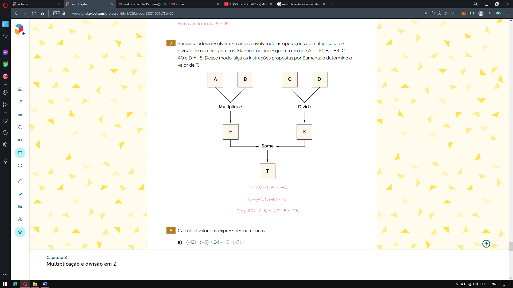
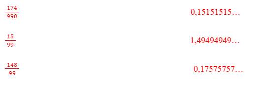
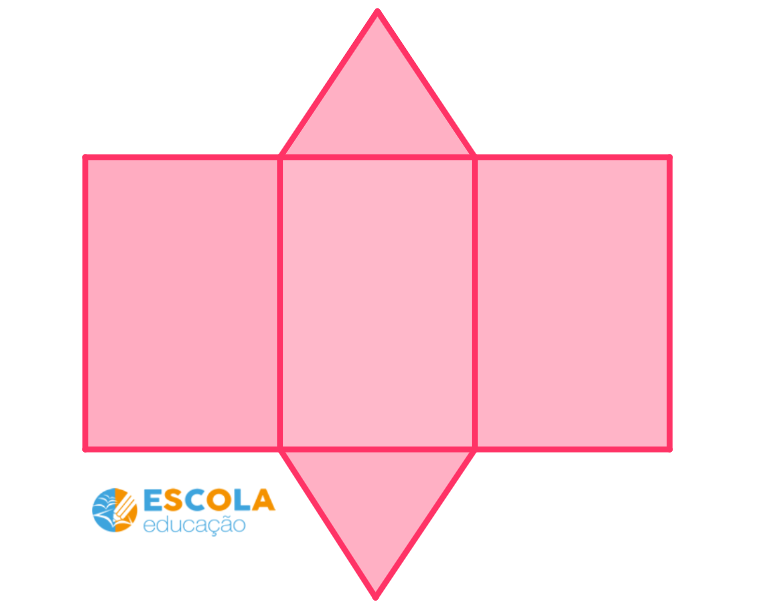
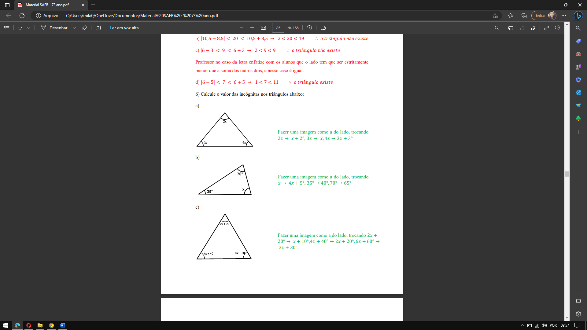
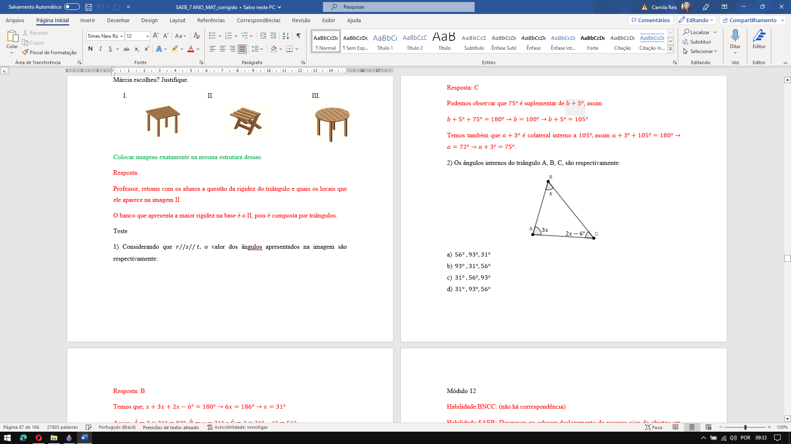
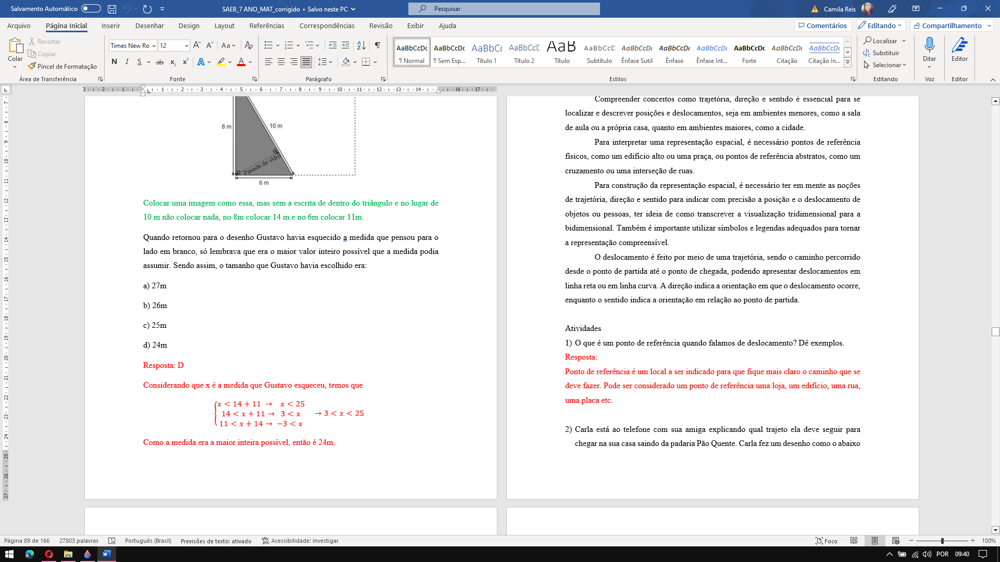
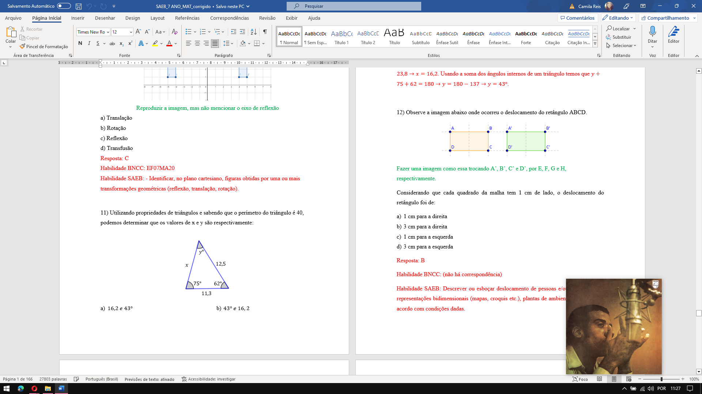
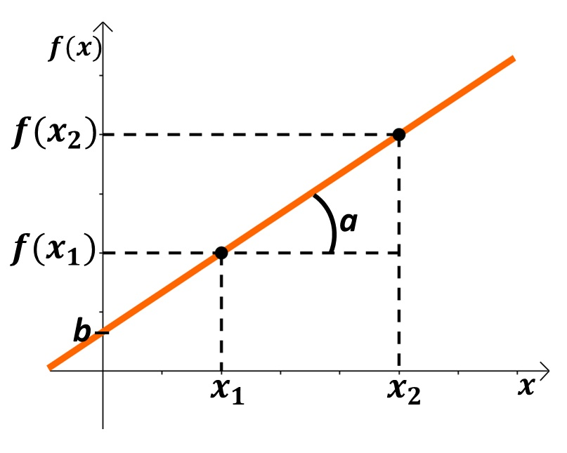

# Módulo 1

Habilidades BNCC: EF07MA01, EF07MA03, EF07MA10.

Habilidades SAEB:

*  Escrever números racionais (representação fracionária ou decimal
finita) em sua representação por algarismos ou em língua materna ou
associar o registro numérico ao registro em língua materna.

*  Compor ou decompor números racionais positivos (representação decimal
finita) na forma aditiva, ou em suas ordens, ou em adições e
multiplicações.

*  Identificar números racionais ou irracionais.

*  Comparar ou ordenar números reais, com ou sem suporte da reta
numérica, ou aproximar números reais para múltiplos de potência de 10
mais próxima.

*  Converter uma representação de um número racional positivo para outra
representação.

*  Identificar um número natural como primo, composto, "múltiplo/fator
de" ou "divisor de" ou identificar a decomposição de um número natural
em fatores primos ou relacionar as propriedades aritméticas (primo,
composto, "múltiplo/fator de" ou "divisor de") de um número natural à
sua decomposição em fatores primos.

Box de teoria

Professor, neste módulo é muito importante relembrar os alunos, de cada
conjunto de números. Revisar desde os naturais e os inteiros para que
fique mais fácil de salientar as particularidades dos números racionais
e principalmente, dos irracionais, que foge um pouco da classe de
pertencimento dos outros conjuntos. 

**Números naturais**

O conjunto dos números naturais é chamado de ℕ. Um número natural são
todos os números que são positivos e possuem somente parte inteira. Os
números naturais têm algumas particularidades, como: Um número é primo
quando possui apenas dois divisores, que é ele mesmo e o número 1. O
único número primo que é par, é o número dois. Números compostos, são os
números que não são primos, isto é, podem ser divididos por mais de dois
números. 

**Exemplos:**

Números primos: 7,11,13,23, etc.

Números compostos: 4,9,12,14,16, etc.

**Números racionais**

Números racionais são números que podem ser escritos em forma de fração,
tal que esteja na forma:

$$\frac{a}{b}$$

Desde que a, b sejam inteiros e b diferente de zero.

O conjunto dos números racionais, recebe o nome de ℚ. Os números que são
possíveis de serem escritos em fração, estão divididos em quatro
classes, as próprias frações, que já estão no formato da definição de
números racionais, os números inteiros, que basta dividir por 1, que se
obtém o mesmo número é possível de encontrar suas equivalentes, decimais
finitos, que são números divididos por potências de 10 e as dízimas
periódicas, que são decimais que tem um período que se repete, em sua
parte decimal.

**Exemplos:**

Frações:$\frac{7}{8},\frac{5}{3},\frac{4}{9}$ toda fração que tenha a, b
inteiros e b diferente de zero.

Números inteiros:
$- \frac{9}{1},\frac{4}{1},\  - \frac{8}{1},\frac{1057}{1}$

Números decimais finitos: Qualquer número decimal finito pode ser
escrito na forma de fração, de modo que o denominador é uma potência de
10 elevado a quantidade de algarismos das casas
decimais$,8,692\  = \frac{8692}{10^{3}} = \frac{8692}{1000}$.

Dízimas periódicas: São dízimas que são infinitas mas possuem um período
que se repete: $\frac{23}{9}\  = \ 2,55555\ldots$ ;
$\frac{22}{9} = 2,44444$...; $\frac{478}{990} = 0,4828282$... .

Para redigir em português os números racionais, devemos relembrar do
sistema de numeração decimal, em que separa a parte inteira e cada
número em sua posição recebe um nome. 

**Exemplo: **

{width="2.5416666666666665in"
height="2.5in"}

Reproduzir a imagem trocando o número 2,4132 por 7,9853, as cores de
acordo com o padrão do material.

Todo número decimal lê-se primeiro a parte inteira, ou seja, 7 inteiros
e para os decimais lê-se o número inteiro e indica a última classe em
que parou nove mil oitocentos e cinquenta e três décimos de milésimos.

**Exemplos: **

0,26 = vinte e seis centésimos;

1,256 = um inteiro e duzentos e cinquenta e seis milésimos;

5,3632 = cinco inteiros e três mil seiscentos e trinta e dois décimos de
milésimos.

Analisando os exemplos acima, como pode ser feita a decomposição dos
números racionais?

A decomposição dos números racionais, é feita de acordo com o sistema
posicional, e completando com zeros onde não tem número após a vírgula. 

**Exemplos:**

$$0,26\  = \ 0,20 + 0,06$$

$$1,256 = \ 1 + 0,200 + 0,050 + 0,006$$

$$5,3632 = \ 5 + 0,30000 + 0,0600 + 0,0030 + 0,0002$$

**Números irracionais **

O conjunto dos números irracionais recebem o nome 𝕀. Números irracionais
são todos aqueles números que não é possível representar por frações.
Alguns exemplos, são as dízimas que não possuem período que se repete e
algumas raízes como $\sqrt{2}\ e\ \sqrt{3}$. 

 

**Números reais **

O conjunto dos números reais recebe o nome de ℝ. Os números reais são
todos os números naturais, inteiros, racionais e irracionais, excluindo
somente o conjunto dos números complexos. Para representação e
comparação de números reais, convém transformar em números decimais para
que fique melhor de visualizar, ordem por ordem qual número é maior,
menor ou em alguns casos, igual ao outro. Quando for necessário comparar
a parte decimal de um número, basta buscar a casa decimal que difere um
número do outro, para que assim a gente consiga saber qual número é
maior e qual é menor.

**Exemplos: **

Vamos comparar 3 números decimais e colocá-los em ordem crescente.

$$33,785\  - \ 33,784\  - \ 33,659$$

A primeira questão a se analisar é que a parte inteira são iguais, então
continua inconclusivo. Então, vamos comparar número por número, os
décimos nos dois primeiros números são iguais, mas o último é menor, já
sabemos que o terceiro número é o menor deles. Analisando os dois
primeiros números, passamos para os centésimos, que também é igual, só
os milésimos que são diferentes e o segundo número é o menor entre os
dois, portanto, a ordenação em ordem crescente é:

$$33,659\  - \ 33,784\  - \ 33,785$$

Uma alternativa que pode ser usada é a aproximação para múltiplos de 10
para a comparação. Esse método arredonda o número para a dezena mais
próxima. Em que depende se está trabalhando com unidade, centena ou
dezena, o número será arredondado para o mais próximo. Quando o número é
maior ou igual a 5, o arredondamento será feito para cima e diferente
disso, para baixo.

**Exemplos: **

58 $\cong$ 60 Como o 58 está nas casas das dezenas, o arredondamento
mais próximo, será uma dezena.

459 $\cong$ 460 Como o 459 está nas casas das centenas, o arredondamento
mais próximo, será uma centena.

$7\  \cong \ 10$ Como o 7 está nas casas das unidades, o arredondamento
mais próximo, será uma dezena, pois não há números nas unidades que
escrevem em potências de 10. Isso porque esses números podem ser
escritos na potência 10, o que facilita ver em uma reta numérica quem
está mais próximo ou não.

\colorsec{Atividades}

1\) Marque Verdadeiro (V) ou falso (F) para as afirmações abaixo e
justifique sua resposta.

(    ) Todo número que é racional é também irracional

(    ) As dízimas periódicas são irracionais.

(    ) Dízimas periódicas podem ser escritas na forma de fração.

(    ) Todos os números inteiros são racionais. 

Resposta:

\(F\) Números irracionais não podem ser escritos em forma de fração e
essa é a definição de números racionais.

\(F\) É possível encontrar uma fração para dízimas periódicas, o que é
controverso a definição de irracional.

\(V\) É possível encontrar uma fração geratriz.

\(V\) Todos os números inteiros podem ser escritos na forma de
racionais.

2\) Relacione as colunas abaixo com o número escrito por extenso.

a)  0,333                       (   ) Trezentos e três milésimos 

b)  0,303                    (   ) Quatro inteiros e duzentos e
    cinquenta e oito milésimos

c)  4,258                       (   ) Trezentos e trinta e três
    milésimos

d)  4,058                       (   ) Quatro inteiros e cinquenta e oito
    milésimos

Resposta:

( b  ) Trezentos e três milésimos 

( c ) Quatro inteiros e duzentos e cinquenta e oito milésimos

( a  ) Trezentos e trinta e três milésimos

( d  ) Quatro inteiros e cinquenta e oito milésimos

3\) Aproxime as partes inteiras dos números reais a potências de 10.

a\) 1039

b\) 6

c\) 782

d\) 24

e\) 3563

f\) 3

Resposta:\
Para aproximar números para a potência de 10, a parte inteira será
analisada.

a)  1040

b)  10

c)  780

d)  20

e)  3560

f)  10

4\) Foi feita uma competição na escola Super Saber dos alunos que
percorrem a maior distância em um tiro de 5 minutos de corrida com
obstáculos. Após averiguar as distâncias, viu que a maioria percorreu a
mesma parte inteira e a decisão ficou nos números decimais, observe a
tabela com os resultados e organize em um ranking decrescente de
distâncias. 

  ---------------- ----------------------
  Nome do aluno    Distância percorrida
  Daniel           302,006 m
  Flávia           303,01 m
  Adriel           304,05 m
  Larissa          303,68 m
  Luís Fabiano     300 m 
  Emanuelly        302,072 m
  Henrique         303,809 m
  ---------------- ----------------------

  ---------- ----------------------
  Ranking    Distância percorrida
             
             
             
             
             
             
             
  ---------- ----------------------

Resposta:

  --------------- ----------------------
  Ranking         Distância percorrida
  Adriel          304,05 m
  Henrique        303,809 m
  Larissa         303,68 m
  Flávia          303,01 m
  Emanuelly       302,072 m
  Daniel          302,006 m
  Luís Fabiano    300 m 
  --------------- ----------------------

Professor, lembre os alunos que o desempate acontece no maior número
depois da vírgula que ocupa a mesma casa decimal do outro valor.

5\) Classifique os números abaixo como compostos ou primos, para o caso
dos compostos, indique 3 divisores.

a\) 11

b\) 48

c\) 23

d\) 51

e\) 100

Resposta:

a)  O número 11 é primo, só é divisível por ele mesmo e por 1.

b)  O número 48 é composto. Seus menores divisores: 2,4,6.

c)  O número 23 é primo, só é divisível por ele mesmo e por 1.

d)  O número 51 é primo, só é divisível por ele mesmo e por 1.

e)  O número 100 é composto. Seus menores divisores: 2,4,5.

6\) Decomponha os números racionais abaixo:\
\
a) 28,3569

b\) 8,596

c\) 42,568

d\) 144,326

Resposta:

a)  $28,3569 = \ 25 + 0,3000 + 0,0500 + 0,0060 + 0,0009$b

b)  $8,596 = \ 8 + 0,500 + 0,090 + 0,006$

c)  $42,568 = \ 42 + 0,5 + 0,06 + 0,008$

d)  $144,326 = 144 + 0,300 + 0,020 + 0,006$

7\) Apresente uma representação equivalente ao número racional dado:

a)  5,667

b)  $\frac{42}{99}$

c)  0,36

Resposta:        

a)  $5,667 = \frac{5667}{1000}$

b)  $\frac{42}{99} = 0,42424242...$

c)  $0,36 = \frac{36}{100}$

8\) Em uma empresa que tem 120 funcionários, constatou-se que 25 dos
funcionários são mulheres e 1220 são homens, há mais homens ou mulheres
que trabalham nesta empresa? 

Resposta:\
A maioria dos funcionários são homens, pois 25 de 120= 48 mulheres e a
quantidade de homens é igual a 72.

9\) Classifique os números como racionais ou irracionais

a\) 7,3695216...

b\) 1,28567676767...

c\) 1,2365787878...

Resposta:

a)  Irracional, pois não possui um período que se repete.

b)  Racional, porque é uma dízima periódica.

c)  Racional, porque é uma dízima periódica.

10\) Na sala da professora Ana Júlia houve uma atividade em que cada
aluno deveria medir seu pé, para depois usar como unidade de medida. No
grupo do Thiago, da Maria e da Paula, eles obtiveram, respectivamente,
as seguintes medidas: 23,9; 22,7 e 23,91. Quem tem o maior pé?

Resposta:\
Quem tem o maior pé é a Paula, pois como as casas centesimais são
iguais, observa-se os milésimos, e de Thiago é 0 e de Paula 1, logo,
Paula tem o pé maior.

\colorsec{Treino}

1\) Marque a alternativa em que classifica os números respectivamente e
corretamente.

$$\sqrt{3}\ \ \ \ \ \ 0,222..\ \ \ \ 5,363636...\ \ \ \ \ \sqrt{\ 2}$$

a\) Natural, Inteiro, Racional, Racional.

b\) Irracional, Racional, Racional, Irracional.

c\) Racional, Irracional, Irracional, Racional.

d\) Racional, Racional, Racional, Irracional.

Resposta: B

Habilidades BNCC: EF07MA01, EF07MA03, EF07MA10.

Habilidades SAEB:

*  Converter uma representação de um número racional positivo para outra
representação.

*  Escrever números racionais (representação fracionária ou decimal
finita) em sua representação por algarismos ou em língua materna ou
associar o registro numérico ao registro em língua materna.

A - Errada, porque $\sqrt{3}\ $ não é Natural, 0,2222 não é Inteiro,
$\sqrt{2}$ não é racional

B - Correta

C - Errada, porque $\sqrt{3}\ $ não é Racional, 0,2222 não é Irracional,
$\sqrt{2}$ , $\ \ 5,363636$não é Irracional e $\sqrt{2}$ não é
racional.\
D - Errada, porque $\sqrt{3}$ não é racional

2\) Um professor marcou numa reta numérica um ponto entre o 0 e o 1.
Qual número racional melhor representa este ponto?

a\) $\frac{2}{8}$

b\) $\frac{5}{2}$

c\) $\frac{10}{7}$

d\) $\frac{18}{12}$

Resposta: A

Habilidades BNCC: EF07MA03

Habilidades SAEB: Comparar ou ordenar números reais, com ou sem suporte
da reta numérica, ou aproximar números reais para múltiplos de potência
de 10 mais próxima.

Ao efetuar a divisão e encontrar a representação decimal, teremos:

a)  0,25

b)  2,5

c)  1,42

d)  1,5

Logo, o único número que está entre 0 e 1 é o 0,25.

3\) Julgue as afirmações e marque a resposta correta.

 I - Todos os números inteiros são racionais.

II - Todo número decimal finito pode ser representado por fração.

III- O número 21 é primo.

IV- O número 2 é o único número que é par e é primo.

a)  As questões II e IV são falsas.

b)  I, II, e IV são verdadeiras.

c)  Apenas IV é falsa.

d)  São todas verdadeiras

Resposta: B

Habilidades BNCC: EF07MA01, EF07MA03, EF07MA10.

Habilidades SAEB:

-Converter uma representação de um número racional positivo para outra
representação.

*  Identificar um número natural como primo, composto, "múltiplo/fator
de" ou "divisor de" ou identificar a decomposição de um número natural
em fatores primos ou relacionar as propriedades aritméticas (primo,
composto, "múltiplo/fator de" ou "divisor de") de um número natural à
sua decomposição em fatores primos.

A - Errada, pois todo número decimal finito pode ser representado por
fração e o número 2 é o único par que é primo.

B - Correta.

C - Errada, pois o número 2 é o único número par que é primo, então é
uma verdade

D - Errada, a afirmação III é falsa, o número 21 não é primo, possui 4
divisores: 1, 3,7 e 21.

# Módulo 2

Habilidade BNCC: EF07MA04

Habilidades SAEB:

*  Calcular o resultado de adições, subtrações, multiplicações ou
divisões envolvendo números reais.

*  Calcular o resultado de potenciação ou radiciação envolvendo números
reais.

*  Resolver problemas de adição, subtração, multiplicação, divisão,
potenciação ou radiciação envolvendo números reais, inclusive notação
científica.

*  Resolver problemas de contagem cuja resolução envolva a aplicação do
princípio multiplicativo.

*  Resolver problemas que envolvam as ideias de múltiplo, divisor,
máximo divisor comum ou mínimo múltiplo comum.

Box teoria

Professor, tenha muita atenção ao trabalhar esse módulo com os alunos
por se tratar das operações fundamentais envolvendo números positivos e
negativos. Revise soma, subtração, multiplicação, divisão, potenciação e
radiciação com números positivos, e em seguida refaça todas elas com os
números negativos. Enfatize bem as regras de sinais fazendo uma boa
distinção entre as regras da soma e multiplicação/divisão.

As operações de adição, subtração, multiplicação, potência e raiz, agora
no contexto dos números negativos, precisam ser realizadas com mais
atenção por envolverem as regras de sinais. Vamos relembrá-las?

**Soma**

Sinais iguais: somamos os algarismos e mantemos o sinal em comum no
resultado.

Sinais diferentes: subtraímos os algarismos e mantemos o sinal do maior
no resultado.

**Exemplo:**
$- 9 + \left( - 12 \right) = \  - 21\ \ \ \ \ \ \ \ \ \ \ \ \ \ \ \ \ \ \ \  - 15 + 8 = \  - 7\ \ \ \ \ \ \ \ \ \ \ \ \ \ \ \ \ \ \  - 4 + 28 = 24$

**Multiplicação/Divisão**

Sinais iguais: o sinal do resultado fica positivo.

Sinais diferentes: o sinal do resultado fica negativo.

**Exemplo:**
$- 10 \times \left( - 5 \right) = \ 50\ \ \ \ \ \ \ \ \ \ \ \ \ \ \ \ \ \ \ \  - 7 \times 8 = \  - 56\ \ \ \ \ \ \ \ \ \ \ \ \ \ \ \ \ \ \  - 42 \div 3 = - 14$

**Observação:** Lembre-se que a subtração tem a função de trocar o sinal
do número que vem após ela. Assim,

$$15 + 27 - \left( - 5 \right) = 15 + 27 + 5 = 47$$

**Potenciação (**$a^{n})$

Professor, use esse tópico para revisar as propriedades de potência que
já foram estudadas no 6º ano, multiplicação e divisão de bases iguais,
potência de potência, potência de expoente 0, 1, etc.

**Base negativa:** aplicamos a regra do expoente, ou seja, quando o
expoente for par o resultado fica positivo, quando for ímpar fica
negativo.

**\
Exemplo:**
$\left( - 3 \right)^{2} = 9\ \ \ \ \ \ \ \ \ \ \ \ \ \ \ \ \ \ \ \ \ \ \ \ \ \ \ \ \ \ \ \ \ \ \ \ \ \ \ \ \ \left( - 3 \right)^{3} = \  - 27\ \ \ \ \ \ \ $

**Observação:** para a base ser considerada negativa e valer as regras
de sinais, ela deve aparecer entre parênteses. Caso contrário, apenas
repetimos o sinal e calculamos a potência separadamente.

$$\left( - 4 \right)^{2} \neq - 4^{2}$$

$$16 \neq - 16$$

**Raiz quadrada (**$\sqrt{a})$

Professor, use esse tópico para revisar fatoração estudada no 6º ano,
revise o conceito de múltiplos, divisores, números primos, m.m.c. e
m.d.c.

Para resolver uma raiz quadrada podemos utilizar três técnicas,
tentativa e erro, fatoração ou aproximação para aquelas que não são
exatas.

Professor, faça a fatoração e explique para os alunos que agrupamos os
termos de acordo com o índice da raiz para poder retirar os números lá
de dentro.

**Exemplo:**
$\text{\ \ \ \ \ \ \ \ \ \ \ \ \ \ \ \ \ \ \ \ \ \ }\sqrt{576} = \ \sqrt{2^{2}.2^{2}.2^{2}.3²} = 2.2.2.3 = 24$

$$\sqrt{7} \rightarrow \ \sqrt{4} < \sqrt{7} < \sqrt{9} \rightarrow 2 < \sqrt{}7 < 3$$

\colorsec{Atividades}

1)  Calcule o valor das expressões a seguir:

a\) $- 15 + 27 - \left( - 5 \right) + 75 =$

b\) $37 + \left( - 11 \right) - \left( 66 \right) - ( - 8) =$

c\) $- (22 + \left( - 33 \right) - 14 + 120) =$

d\) $200 - 88 - 14 - 144 + 75 =$

Resposta:

Professor, ao resolver os exercícios com os alunos, enfatize as regras,
faça o passo a passo onde for preciso retirar parênteses, trabalhe a
resolução de dois em dois números, deixando bem claro os resultados que
vão sendo encontrados para depois obter o resultado.

a)  $- 15 + 27 - \left( - 5 \right) + 75 = - 15 + 27 + 5 + 75 = 92$

b)  $37 + \left( - 11 \right) - \left( 66 \right) - \left( - 8 \right) = 37 - 11 - 66 + 8 = - 32$

c)  $- \left( 22 + \left( - 33 \right) - 14 + 120 \right) = - \left( 22 - 33 - 14 + 120 \right) = - \left( 95 \right) = - 95$

d)  $200 - 88 - 14 - 144 + 75 = 29$

2\) Mariana foi ao banco para tirar um extrato da sua conta, mas ao
imprimir o extrato saiu com algumas partes danificadas. Complete o
extrato usando as informações de depósitos e saques apresentados:

{width="3.546984908136483in"
height="2.140587270341207in"}

> Produzir uma figura conforme a indicada acima trocando o nome do banco
> para Banco S.A, o número do extrato para 00121, as datas para
> 05/01/23, 07/01/23, 09/01/23, 11/01/23 e os números colocar na
> seguinte sequência: 550, 1200, 2500, 665.
>
> Resposta:
>
> Professor, retome com os alunos os conceitos de depósito e saque,
> orientando que quando ocorrem retiradas além do dinheiro que havia em
> conta o saldo deve ser indicado com sinal negativo.

+--------------+---------------+---------------+---------------+
| DATA         | DEPÓSITO      | SAQUE         | SALDO         |
+--------------+---------------+---------------+---------------+
| > 05/01/2023 | > \-          | > \-          | > R\$ 550,00  |
+--------------+---------------+---------------+---------------+
| > 07/01/2023 | > R\$ 1200,00 | > \-          | > R\$ 1750,00 |
+--------------+---------------+---------------+---------------+
| > 09/01/2023 | > \-          | > R\$ 2500,00 | > R\$ -750,00 |
+--------------+---------------+---------------+---------------+
| > 11/01/2023 | > R\$ 665,00  | > \-          | > R\$ -85,00  |
+--------------+---------------+---------------+---------------+

3\) Associe a primeira coluna das operações com os resultados
apresentados na segunda coluna:

A.  $- 2 \times 5 \times \left( - 3 \right) \times \left( - 1 \right) =$

B.  ($- 4 \times 8) \div ( - 2 \times \left( - 8 \right)) =$

C.  $12 \times 3 \times \left( - 3 \right) \times 2 =$

D.  $( - 50 \div \left( - 5 \right)) \times (36 \div 9) =$

( ) $40$

( ) $- 2$

( ) $- 30$

( ) $- 216$

> Resposta:\
> A.$\  - 2 \times 5 \times \left( - 3 \right) \times \left( - 1 \right) = - 30$
>
> B.($- 4 \times 8) \div ( - 2 \times \left( - 8 \right)) = \left( - 32 \right) \div 16 = - 2$
>
> C.$\ 12 \times 3 \times \left( - 3 \right) \times 2 = - 216$
>
> D.
> $\left( - 50 \div \left( - 5 \right) \right) \times \left( 36 \div 9 \right) = \left( 10 \right) \times 4 = 40$
>
> \(D\) $40$
>
> \(B\) $- 2$
>
> \(A\) $- 30$
>
> \(C\) $- 216$

4\) Aplicando as propriedades de bases iguais, simplifique como uma
única potência e indique se seus resultados serão positivos ou
negativos:

a\) ${( - 5)}^{10} \times ( - {5)}^{8} \times {( - 5)}^{3} =$

b\) ${( - 2)}^{4} \times ( - {2)}^{6} \times {( - 2)}^{12} =$

c\) $\ \frac{{( - 7)}^{15}}{{( - 7)}^{11}} =$

d\) $\frac{{( - 3)}^{33}}{{( - 3)}^{12}} =$

e)$\ \frac{{( - 10)}^{55} \times {( - 10)}^{25} \times {( - 10)}^{35}}{{( - 10)}^{4} \times {( - 10)}^{6} \times {( - 10)}^{32}} =$

Resposta:

a\)
${( - 5)}^{10} \times ( - {5)}^{8} \times \left( - 5 \right)^{3} = \left( - 5 \right)^{10 + 8 + 3} = \left( - 5 \right)^{21} \rightarrow \ $Como
o expoente é ímpar o resultado fica negativo.

b\)
${( - 2)}^{4} \times ( - {2)}^{6} \times \left( - 2 \right)^{12} = \ \left( - 2 \right)^{4 + 6 + 12} = \left( - 2 \right)^{22} \rightarrow \ $Como
o expoente é par o resultado fica positivo.

c\) $\ \frac{{( - 7)}^{15}}{{( - 7)}^{11}} =$
${( - 7)}^{4} \rightarrow \ $Como o expoente é par, o resultado fica
positivo.

d\) $\frac{{( - 3)}^{33}}{{( - 3)}^{12}} =$
${( - 3)}^{21} \rightarrow \ $Como o expoente é ímpar, o resultado fica
negativo.

Professor, faça a letra e com calma explicando aos alunos que primeiro
resolvemos numerador e denominador da fração separadamente, para depois
aplicar a regra de divisão de bases iguais.

e)$\ \frac{{( - 10)}^{55} \times {( - 10)}^{25} \times {( - 10)}^{35}}{{( - 10)}^{4} \times {( - 10)}^{6} \times {( - 10)}^{32}} = \frac{{( - 10)}^{55 + 25 + 35}}{{( - 10)}^{4 + 6 + 32}} = \frac{{( - 10)}^{115}}{{( - 10)}^{42}} = {( - 10)}^{115 - 42} = {( - 10)}^{73} \rightarrow \ $Como
o expoente é ímpar, o resultado fica negativo.

5\) A cada letra está associado o valor de uma raiz quadrada. Calcule o
valor delas usando a fatoração e coloque-as em ordem crescente, como no
exemplo:

$$A = \sqrt{225} = \sqrt{3^{2} \times 5^{2}} = 3 \times 5 = 15$$

$$B = \sqrt{324} = \sqrt{2² \times 3² \times 3²} = 2 \times 3 \times 3 = 18$$

$$C = \sqrt{144} = \sqrt{2² \times 2² \times 3²} = 2 \times 2 \times 3 = 12$$

$$C - A - B$$

$$A = \sqrt{441}$$

$$B = \sqrt{784}$$

$$C = \sqrt{1225}$$

$$D = \sqrt{676}$$

$$E = \sqrt{484}$$

Resposta:

$$A = \sqrt{441} = \sqrt{3^{2}.7²} = 3\ .\ 7 = 21$$

$$B = \sqrt{784} = \sqrt{2^{2}.2^{2}.7²} = 2\ .\ 2\ .\ 7 = 28$$

$$C = \sqrt{1225} = \sqrt{5².7²} = 5\ .\ 7 = 35$$

$$D = \sqrt{676} = \sqrt{2^{2}.\ 13²} = 2\ .\ 13\  = 26$$

$E = \sqrt{484} =$ $\sqrt{2².11²} = 2\ .\ 11 = 22$

A -- E -- D -- B -- C

6\) Indique entre quais inteiros encontram-se as raízes abaixo,
utilizando as raízes exatas que são menores e maiores que a desejada.
Siga o exemplo:

$\sqrt{23} \rightarrow \ \sqrt{16} < \sqrt{23} < \sqrt{25} \rightarrow \ $a
$\sqrt{23}\ $está entre 4 e 5

a\) $\sqrt{55}$

b\) $\sqrt{66}$

c\) $\sqrt{96}$

d\) $\sqrt{42}$

Resposta:

Professor, faça no quadro com os alunos todos os produtos de fatores
iguais de 1 até 10 para deixar mais fácil para eles enxergarem quais
raízes que vão utilizar.

a)  $\sqrt{55} \rightarrow \ \sqrt{49} < \sqrt{55} < \sqrt{64} \rightarrow \ $a
    $\sqrt{55}\ $está entre 7 e 8

b)  $\sqrt{66} \rightarrow \ \sqrt{64} < \sqrt{66} < \sqrt{81} \rightarrow \ $a
    $\sqrt{66}\ $está entre 8 e 9

c)  $\sqrt{96} \rightarrow \ \sqrt{81} < \sqrt{96} < \sqrt{100} \rightarrow \ $a
    $\sqrt{96}\ $está entre 9 e 10

$\sqrt{42} \rightarrow \ \sqrt{36} < \sqrt{42} < \sqrt{49} \rightarrow \ $a
$\sqrt{42}\ $está entre 6 e 7

7\) Pietra, Marcelo e Antônio estão estudando para a prova de matemática
montando expressões para trocarem as resoluções entre eles. Resolveram
fazer disso um jogo e quem montasse a expressão com maior resultado
negativo venceria. Determine qual deles foi o vencedor:

Pietra:
$2^{5} + \left\{ 75 \div \left( - 3 \right) - \left\lbrack 6^{2} + \left( 2 - 4 \right)^{3} \right\rbrack \right\} - \sqrt{16}$

Marcelo:
$230^{0} + ( - 5)²\left\{ 15 \div 5 \times \left\lbrack 7^{2} - \left( 12 - 8 \right)^{3} \right\rbrack \right\} - \sqrt{121}$

Antônio:
$1^{500} \times \left\{ - 5 \times \left\lbrack \left( - 9 \right)^{2} - \left( 34 - 26 \right)^{2} \right\rbrack \right\} - (\sqrt{100}\  \times 700^{0})$

Resposta:

Professor, enfatize com os alunos a ordem de resoluções das expressões
numéricas, estabelecendo as hierarquias de resoluções dos sinais de
agrupamentos e das operações.

Pietra:\
$2^{5} + \left\{ 75 \div \left( - 3 \right) - \left\lbrack 6^{2} + \left( 2 - 4 \right)^{3} \right\rbrack \right\} - \sqrt{16} = 32 + \left\{ - 25 - \left\lbrack 36 + \left( - 2 \right)^{3} \right\rbrack \right\} - 4 = 32 + \left\{ - 25 - \left\lbrack 36 - 8 \right\rbrack \right\} - 4 = 32 + \left\{ - 25 - 28 \right\} - 4 = 32 - 53 - 4 = - 25$

Marcelo\
$230^{0} + \left( - 5 \right)^{2} - \left\{ 15 \div 5 \times \left\lbrack 7^{2} - \left( 12 - 8 \right)^{3} \right\rbrack \right\} - \sqrt{121} = 1 + 25 - \left\{ 3 \times \left\lbrack 49 - 64 \right\rbrack \right\} - 11 = 26 - \left\{ 3 \times \left( - 15 \right) \right\} - 11 = 26 - \left\{ - 45 \right\} - 11 = 26 + 45 - 11 = 60$

Antônio:
$1^{500} \times \left\{ - 5 \times \left\lbrack \left( - 9 \right)^{2} - \left( 34 - 26 \right)^{2} \right\rbrack \right\} - \left( \sqrt{100}\  \times 700^{0} \right) = 1 \times \left\{ - 5 \times \left\lbrack 81 - 64 \right\rbrack \right\} - \left( 10 \times 1 \right) = 1 \times \left\{ - 5 \times 17 \right\} - 10 = 1 \times \left( - 85 \right) - 10 = - 85 - 10 = - 95$

Logo, quem venceu o jogo foi a Pietra já que o maior resultado negativo
foi o dela.

Professor, revise com os alunos que a comparação dos números negativos
funciona ao contrário dos positivos, que quanto mais longe do zero o
número está menor o número é.

8\) Para montar um bolo Fabiana utiliza de 2 tipos de massas, 16 tipos
de recheios, 8 tipos de coberturas e 4 tamanhos distintos, tanto para
massa retangular quanto para a redonda. Escreva em forma de potência a
quantidade de bolos distintos que Fabiana consegue produzir combinando
as opções descritas e calcule a potência.

Resposta:

Para calcular a quantidade de bolos vamos usar o Princípio
Multiplicativo, ou seja, basta multiplicar todas as opções, assim:

$$2 \times 16 \times 8 \times 4 \times 2$$

Como é para representar como uma única potência, vamos transformar todos
os termos para uma potência de base 2:

$2 \times 2^{4} \times 2^{3} \times 2^{2} \times 2 = 2^{1 + 4 + 3 + 2 + 1} = 2^{11} = 2048$
bolos distintos

9\) Em um terminal urbano três ônibus saem às 7h com destino a bairros
distintos, e de tempos em tempos retornam ao terminal para refazer o
trajeto. O ônibus A retorna ao terminal de 20 em 20 minutos, o ônibus B
de 30 em 30 minutos e o ônibus C retorna 45 em 45 minutos. Qual o último
horário do dia que os três ônibus saem da rodoviária ao mesmo tempo,
sabendo que os ônibus saem a última vez do terminal às 23h?

Resposta:

Professor lembre os alunos que quando queremos determinar encontros
repetidos usamos a ideia de Mínimo Múltiplo Comum e revise com eles o
cálculo pela fatoração simultânea.

Para resolver basta calcularmos o M.M.C dos tempos, ou seja, de 20, 30 e
45, achando de quanto em quanto tempo os ônibus vão se encontrar no
terminal. Depois, determinamos o último horário que esse encontro
ocorrerá:

  -------- ---- ---- ---
  $$20$$   30   45   2
  10       15   45   2
  5        15   45   3
  5        5    15   3
  5        5    5    5
  1        1    1    
  -------- ---- ---- ---

Ou seja, os ônibus se encontram de 180 em 180 minutos, ou seja, 3 em 3
horas, assim se eles saem juntos às 7 da manhã eles vão se encontrar às
10h, 13h, 16h, 19h, 22h, ou seja, o último horário que eles saem juntos
é às 22h.

10\) Em um ateliê existem três tecidos iguais, mas de estampas
diferentes, que são vendidos no mesmo tamanho. Em uma semana, o ateliê
recebeu rolos retangulares de 150 cm² da estampa azul, 120 cm² da
estampa vermelha e 180 cm² da estampa rosa. Qual tamanho foi cortado os
tecidos de maneira a obterem o maior tamanho possível de retalho sem
sobrar nenhuma parte dos rolos recebidos? Quantos retalhos foram obtidos
de cada cor do tecido?

Resposta:

Professor, lembre os alunos que quando é necessário fazer divisões da
maior forma possível, usamos a ideia de Máximo Divisor Comum e revise
com eles o cálculo pela fatoração simultânea.

Para resolver basta calcularmos o M.D.C dos tamanhos dos tecidos, ou
seja, de 120, 150 e 180, achando assim o tamanho do retalho e em seguida
quantos retalhos cada cor renderá. Assim:

  ----- ----- ----- ----------------
  120   150   180   2 $\leftarrow$
  60    75    90    2
  30    75    45    2
  15    75    45    3 $\leftarrow$
  5     25    15    3
  5     25    5     5 $\leftarrow$
  1     5     1     5
  1     1     1     
  ----- ----- ----- ----------------

Assim, cada retalho vai ter 30cm² de tamanho e serão produzidos:

$\frac{150}{30} = 5$ retalhos azuis

$\frac{120}{30} = 4$ retalhos vermelhos

$\frac{180}{30} = 6$ retalhos rosas

\colorsec{Treino}

1)  Os fusos horários são feitos a partir do Meridiano de Greenwich, que
    é o marco 0. Toda localidade que tem horário atrasado em relação ao
    meridiano encontra-se em fusos negativos, e quem tem horário
    adiantado encontra-se em fusos positivos. Pedro vai fazer uma viagem
    saindo de São Paulo, que tem fuso GMT--3, às 8 horas do dia 23/03 e
    vai para a capital da Austrália que tem fuso GMT+11. Porém, o voo de
    Pedro vai fazer uma escala em Dubai, que tem fuso GMT+4. Se a viagem
    do Brasil até Dubai é de aproximadamente 14 horas e de Dubai até a
    Austrália é de aproximadamente 18 horas, que dia e que horas Pedro
    chegará na Austrália?

```{=html}
<!-- -->
```
a)  16h do dia 24/03

b)  6h do dia 24/03

c)  6h do dia 25/03

d)  16h do dia 25/03

Resposta:

Habilidade BNCC: EF07MA04\
Habilidade SAEB: Resolver problemas de adição, subtração, multiplicação,
divisão, potenciação ou radiciação envolvendo números reais, inclusive
notação científica.

A - Errada, pois não foi considerada a diferença de fuso horário, só
somou as horas de maneira direta.

B - Errada, pois o cálculo das horas foi feito da maneira correta, porém
não considerou a mudança de dia.

C - Correta.

Saída de São Paulo as 8h do dia 23/03 $\rightarrow$ em Dubai vão ser 15h
do dia 23/03 ($4 - ( - 3) = 4 + 3 = 7\text{h\ }$de diferença).

A viagem de São Paulo para Dubai dura 14 horas, assim Pedro vai chegar
em Dubai às 5h do dia 24/03, que serão 12h do dia 24/03 na Austrália
($11 - 4 = 7\text{h\ }$de diferença).

A viagem de Dubai até a Austrália são 18 horas, assim Pedro vai chegar
na Austrália às 6h do dia 25/03.

D - Errada, pois o dia está correto mas considerou o cálculo sem a
diferença de fuso horário, apenas adicionou um dia a mais.

2)  Para trabalhar multiplicação e divisão de números inteiros com uma
    turma de 7º ano, a professora Valquíria resolveu usar um fluxograma
    como o da figura abaixo:

{width="3.9229615048118984in"
height="3.188976377952756in"}

Fazer uma imagem igual a de cima trocando as letras iniciais por W, X,
Y, Z, nesta ordem e onde está escrito multiplique troque por dívida e
onde está escrito some troque por multiplique. Nos quadradinhos onde tem
F, K, T deixar sem nenhuma letra dentro.

Valquíria pediu para os alunos considerarem
$W = - 75,\ X = 5,\ Y = - 144\ e\ Z = - 12$. Qual o valor encontrado
pelos alunos no final do fluxograma?

a\) -180

b\) 180

c\) - 300

d\) -300

Resposta:

Habilidade BNCC: EF07MA04\
Habilidade SAEB: Calcular o resultado de adições, subtrações,
multiplicações ou divisões envolvendo números reais.

A - Correta.

$$W \div X = - 75 \div 5 = - 15$$

$$Y \div Z = - 144 \div ( - 12) = 12$$

$$- 15 \times 12 = - 180$$

B - Errada, pois não fez a regra de sinal das operações da maneira
correta.

C - Errada, pois calculou que $- 75 \div 5 = - 25$.

D - Errada, pois além de calcular que $- 75 \div 5 = - 25$, também errou
a regra de sinal das operações.

3)  Mateus está fazendo a compra de um lote para construir uma nova sede
    para sua empresa. O lote tem formato quadrangular de área igual a
    1296 m². Antes de iniciar a construção, Mateus vai murar o terreno
    por todo seu perímetro e colocar um portão de 12 metros de
    comprimento. Qual a extensão do muro que será construído no lote de
    Mateus?

a\) 24 m

b\) 36 m

c\) 144 m

d\) 132 m

Resposta:

Habilidade BNCC: EF07MA04\
Habilidade SAEB: Resolver problemas de adição, subtração, multiplicação,
divisão, potenciação ou radiciação envolvendo números reais, inclusive
notação científica.

A - Errada, pois considerou apenas o tamanho de um lado do terreno e
tirou o comprimento do portão.

B - Errada, pois considerou apenas o tamanho de um lado do terreno.

C - Errada, pois não tirou o comprimento do portão do perímetro do
terreno.

D - Correta.

Como a área de um quadrado é dado por l² onde l é o tamanho do lado,
então para calcular o tamanho do lado basta extrair a raiz quadrada da
área. Assim

$$l^{2} = 1296 \rightarrow l = \ \sqrt{1296} \rightarrow l = \sqrt{2².2^{2}.3^{2}.3^{2}} = 2 \times 2 \times 3 \times 3 = 36m\ $$

Como o exercício pede a extensão do muro, basta calcular o perímetro do
terreno e tirar o tamanho do portão. Assim:

$p\  = \ 4 \times 36 = 144 - 12 = 132$

# Módulo 3

Habilidades BNCC: EF07MA08, EF07MA09.

Habilidades SAEB:

*  Representar frações menores ou maiores que a unidade por meio de
representações pictóricas ou associar frações a representações
pictóricas.

*  Identificar frações equivalentes.

*  Determinar uma fração geratriz para uma dízima periódica.

Box teoria

Professor, neste módulo é importante ter objetos concretos e material
dourado a disposição para trabalhar as frações. Estimule que os alunos
pensem não só nos números como parte um do outro, mas pensem em
representações reais. E como frações, podem ser diferentes, podem
representar o mesmo "espaço". Estes materiais também podem ser
alimentos, como pizzas e chocolates para que estimule que os alunos
dividam entre si e enxerguem como partes de uma fração.

**Frações próprias e impróprias**

Como já vimos antes, uma fração é representada pela sua parte no
numerador e seu inteiro no denominador. Ou seja, fração é uma
representação numérica de partes de um valor inteiro que foi dividido em
parcelas iguais, que também recebem o nome de frações próprias, que o
numerador é maior que o denominador.

**Exemplos:**

-   Joana tem 6 batons, 5 deles são vermelhos e 1 é nude. Qual é a
    representação fracionária do batom nude?

$\frac{1}{6}$

Pois, o numerador é a quantidade de batons que estou interessada e o
denominador, a quantidade total.

-   Considerando os círculos abaixo, qual a fração que representa a
    parte pintada?

{width="2.2604166666666665in"
height="1.0678313648293962in"}

Produzir uma imagem como a imagem de cima, permanecer com as mesmas
divisões, só que no primeiro círculo, ao invés de uma parte pintada,
colocar 2 partes e no segundo círculo, três partes pintadas. As cores
podem ser de acordo com o padrão do material.

As frações que representam a parte pintada, são, respectivamente,
$\frac{2}{4}$ e $\frac{3}{8}$ .

Além disso, há as representações que são maiores que as parcelas
divididas que são chamadas de frações mistas ou impróprias, isto é, tem
parte inteira e parte que não é inteira. Isto acontece, quando o
numerador é maior que o denominador, que é possível extrair uma parte
inteira da fração. A notação utilizada é que a parte inteira fique na
frente do número e em forma fracionária depois, seguindo da esquerda
para direita.

Professor nesta parte, relembre o que é uma fração inteira, relembrando
que toda fração é uma divisão, e que quando seus numeradores são iguais
ou superiores aos seus denominadores, já temos um inteiro.

**Exemplos:**

-   Carlos foi a um rodízio de pizzas e comeu uma pizza e metade de
    outra. Se cada pizza fosse cortada em 8 pedaços, qual seria a sua
    representação fracionária?

$$\frac{8}{8}\  + \ \frac{4}{8}\  = \ 1\ \frac{4}{8}$$

-   Considerando a imagem abaixo, qual a fração que representa a parte
    pintada?

> {width="2.2251476377952755in"
> height="0.7604166666666666in"}{width="2.188688757655293in"
> height="0.8169761592300963in"}

Reproduzir uma imagem igual a de cima utilizando as cores padrões do
material.

Professor, explique que há duas formas de representar esta fração,
comece pedindo que eles encontrem a fração de cada círculo separada e
depois com o numerador com parte inteira ou todos juntos, que pode
extrair a parte inteira.

> $\frac{29}{8}$ ou $3\ \frac{5}{8}$
>
> **Frações Equivalentes**

Frações equivalentes são frações que são escritas de forma diferentes,
mas representam o mesmo valor numérico. No sexto ano, vimos o que são
frações irredutíveis, isto é, que é quando podemos reduzir uma fração
com seu numerador e denominador no menor número possível. Para frações
equivalentes, podemos encontrar novas frações, dividindo ou
multiplicando o numerador e o denominador pelo mesmo número, encontrando
uma nova razão, para uma mesma proporção. Como qualquer sequência de
números, comparando duas frações, uma só pode ser maior, menor ou igual
a outra fração, que nos resulta das frações equivalentes.

Professor, nesta parte vale lembrar os critérios de divisibilidade, para
que fique mais fácil encontrar outra fração que precise dividir o
numerador e o denominador pelo mesmo número. Durante os exercícios,
convém utilizar a calculadora com os alunos para que eles visualizem que
as frações equivalentes, dão o mesmo quociente.

**Exemplos:**

-   Fábio e Micael foram a uma fábrica de chocolates. Fábio comprou um
    chocolate que era repartido em 12 quadradinhos e ele comeu 4 desses
    12 quadradinhos, já Micael comprou um chocolate que vinha cortado em
    36 quadradinhos e comeu 12 quadradinhos. Considerando que as barras
    eram do mesmo tamanho, somente com cortes diferentes, quem comeu
    mais chocolate?

Fábio comeu uma quantidade referente a $\frac{4}{12}$ e Micael uma
quantidade referente a $\frac{12}{36}$ .

Note que, é possível encontrar um padrão nos numeradores e
denominadores, a quantidade de que Micael comeu, é igual ao triplo do
numerador de Fábio dividido pelo triplo do denominador de Fábio, o que
permanece com a mesma razão.

-   Para cada fração abaixo, encontraremos duas de suas equivalentes:

$\frac{3}{7}$ : Como temos dois números primos, utilizaremos seus
múltiplos, primeiro, multiplicando por 2, obteremos $\frac{6}{14}$
depois, multiplicando por 3, $\frac{9}{21}$.

$\frac{18}{64}$: Como temos dois números pares, sabemos que eles são
divisíveis por 2, logo, temos $\frac{9}{32}$, o que resultou na fração
irredutível, logo, a outra fração que podemos encontrar é multiplicando
a inicial por 2, $\frac{36}{128}$.

$\frac{15}{75}$: Como temos dois números terminados em 5, a primeira
fração equivalente será dividir por 5, o que resulta $\frac{3}{15}$,
outra fração que podemos encontrar, é dividir ambos por 3, que resulta
$\frac{5}{25}$.

**Observação:** É importante ressaltar, que da mesma forma que existem
infinitos números múltiplos, existem infinitas frações equivalentes.

As frações equivalentes em imagens são facilmente encontradas, uma vez
que a área procurada pela fração equivalente, serão exatamente iguais,
como no exemplo abaixo:

{width="5.156820866141732in"
height="1.364734251968504in"}

Reproduzir a imagem usando as cores padrões do material.

**Dízimas periódicas**

Professor, nesta seção é importante trabalhar primeiro a demonstração
para encontrar frações geratrizes e depois o método prático para que os
alunos entendam o que está acontecendo passo a passo. É preciso
ressaltar que as dízimas periódicas são números racionais e por isso tem
representação em forma de fração.

Alguns números, quando divididos, resultam em algarismos que se repetem
infinitamente na mesma ordem. Essa repetição de números infinita é
chamada de período, o que explica o nome de dízima periódica. Existem
dois tipos de dízimas periódicas, as simples e compostas. As dízimas
periódicas simples é quando toda a sua parte decimal se repete e as
dízimas periódicas compostas, há mais números do que o que está se
repetindo.

**Exemplos:**

-   Dízimas periódicas simples: 0,6666...; 0,222222...; 0,77777...;
    0,88888...

-   Dízimas periódicas compostas: 0,855555...; 0,47888888...,
    0,985626262...

**Frações geratrizes**

Vamos fazer um passo a passo para encontrar a fração geratriz de dízimas
periódicas simples e depois fazer pelo método prático.

**Método convencional:**

-   Primeiro passo: Chamar a dízima periódica de x;

-   Segundo passo: Multiplicar os dois lados da igualdade por potências
    de 10, dependendo da quantidade de algarismos que há no período,
    será nossa potência de 10, exemplo, se tem dois números, será
    multiplicado por 100, se tem 3 algarismos, por 1000 e assim por
    diante;

-   Terceiro passo: Encontrar a diferença (subtração) entre a equação
    encontrada e a equação do primeiro passo.

-   Quarto passo: encontrar o valor de x na equação do terceiro passo.

**Exemplo:**

Vamos encontrar a fração geratriz da dízima 1,5555...

Primeiro passo: $x\  = \ 1,5555\ldots$

Segundo passo: Multiplicar por 10, uma vez que só o número 5 se repete.

$$10x\  = \ 1,5555\ldots\  \times \ 10$$

$$10x\  = \ 15,5555\ \ldots$$

Terceiro passo: Diferença entre as equações

$$10\ x\ –\ x\  = \ 15,5555\ \ldots\ –\ 1,5555\ldots$$

$$9x\  = \ 14$$

Quarto passo: $\frac{14}{9}$

**Método prático:**

-   Primeiro passo: Separar a parte inteira da parte decimal;

-   Segundo passo: Encontrar o numerador da fração geratriz, que será
    dado pelos números da parte inteira até o período (sem a vírgula) -
    parte inteira.

-   Terceiro passo: Encontrar o denominador da fração geratriz, isso
    dependerá da quantidade de algarismos do período. Se tem 1, colocar
    um 9 no denominador, se tem 2 algarismos, coloca-se dois 9 ("99") no
    denominador e assim por diante.

**Exemplo:**

Vamos encontrar a fração geratriz da dízima 1,5555...

Primeiro passo:

Parte inteira: 1

Período: 5

Segundo passo: $15 - 1 = 14$

Terceiro passo: Somente o 5 está repetindo, logo, no denominador terá
somente um 9.

Logo, a fração geratriz é $\frac{14}{9}$.

Agora, veremos como encontrar dízimas compostas pelos dois métodos:

**Método convencional:**

-   Primeiro passo: igualar a dízima periódica a x.

-   Segundo passo: Multiplicar a dízima periódica composta por potências
    de 10 de modo que o antiperíodo fique antes da vírgula, isto é,
    multiplicar por 10 se tiver apenas um algarismo no antiperíodo, por
    100 se tiver dois e assim sucessivamente;

-   Terceiro passo: Agora, a dízima periódica já é igual uma dízima
    simples, basta multiplicar os dois lados da igualdade por potências
    de 10, dependendo da quantidade de algarismos que há no período,
    será nossa potência de 10, exemplo, se tem dois números, será
    multiplicado por 100, se tem 3 algarismos, por 1000 e assim por
    diante;

-   Quarto passo: Encontrar a diferença (subtração) entre a equação
    encontrada no terceiro e no segundo passo.

**Método prático:**

-   Primeiro passo: Separar a parte inteira, o antiperíodo e o período
    da dízima;

-   Segundo passo: Encontrar o numerador da fração geratriz, que será
    dado pelos números da parte inteira, antiperíodo até o período (sem
    a vírgula) - parte inteira e antiperíodo.

-   Terceiro passo: Encontrar o denominador da fração geratriz, isso
    dependerá da quantidade de algarismos do período. Se tem 1, colocar
    um 9 no denominador, se tem 2 algarismos, coloca-se dois 9 ("99") no
    denominador e assim por diante e para cada algarismo do antiperíodo,
    acrescentamos um 0 no denominador, na mesma lógica dos "9".

**Exemplo:**

Vamos encontrar a fração geratriz da dízima 1,745555...

Primeiro passo:

Parte inteira: 1

Antiperíodo: 74

Período: 5

Segundo passo: $1745 - 174 = \ 1571$

Terceiro passo: Como só há um algarismo para período, no denominador
haverá só um 9 e como há dois antiperíodos, haverá dois 0. Logo, a
fração encontrada é: $\frac{1571}{900}.$

**Observação:** também há os casos de não possuir parte inteira e a
dízima periódica ser simples, então é diretamente a regra dos 9 e zeros,
o próprio período é o numerador e usa-se um nove para cada número do
período.

\colorsec{Atividades}

1\) Encontre as frações das partes pintadas a partir das imagens:

a\) {width="2.5914916885389325in"
height="0.8985575240594925in"}

Produzir uma imagem que ao invés de cortada em 8 fatias, esteja em
quatro fatias. A parte pintada dos círculos só mudará no círculo 3, que
é para pintar 3 fatias das 4 que serão desenhadas. As cores usadas serão
a padrão do material.

Resposta:\
Essa fração é uma fração imprópria, então há duas respostas. A primeira:
$\frac{11}{4}$ , pois há 11 fatias pintadas, do tamanho das 4 que foram
divididas ou então, como fração mista que são 2 círculos inteiros
pintados, mais três fatias do outro: 2$\frac{3}{4}$.

b\) {width="0.8333333333333334in"
height="0.9166666666666666in"}

Produzir uma imagem igual a referência, porém com 5 quadradinhos
pintados. As cores usadas serão a padrão do material.

Resposta:

A resposta é uma fração própria, ou seja, não tem parte inteira. Basta
contar os quadradinhos pintados que são 5, sobre o todo, que são 16
quadradinhos. Logo, $\frac{5}{16}$.

c\) {width="0.8333333333333334in"
height="0.9166666666666666in"}

Produzir uma imagem igual a referência, porém com 12 quadradinhos
pintados. As cores usadas serão a padrão do material.

Resposta: A resposta é uma fração própria, ou seja, não tem parte
inteira. Basta contar os quadradinhos pintados que são 12, sobre o todo,
que são 16 quadradinhos. Logo, $\frac{12}{16}$.

2\) Associe as colunas com as suas frações equivalentes:

a\) $\frac{45}{104}$ $\left( \text{\ \ \ \ } \right)$ $\frac{40}{120}$

b)$\frac{27}{144}$ $\left( \text{\ \ \ \ \ } \right)\frac{90}{208}$

c)$\frac{2}{8}$ $\left( \text{\ \ \ \ \ \ } \right)$ $\frac{14}{200}$

d)$\frac{7}{100}$ $\left( \text{\ \ \ \ \ \ } \right)\frac{1}{4}$

e)$\frac{1}{2}$ $\left( \text{\ \ \ \ \ \ } \right)\frac{3}{16}$

f\) $\frac{1}{3}$ $\left( \text{\ \ \ \ \ \ \ } \right)$ $\frac{35}{70}$

Resposta: A sequência das letras ficará: f- a-d-c-b-e

a)  A primeira fração o numerador e denominador estão multiplicados por
    2, logo, $\frac{90}{208}$

b)  A segunda fração o numerador e denominador estão divididos por 9,
    logo, $\frac{3}{16}$

c)  A terceira fração o numerador e denominador estão divididos por 2,
    logo $\frac{1}{4}$

d)  A quarta fração o numerador e denominador estão multiplicados por 2,
    logo $\frac{14}{200}$

e)  A quinta fração o numerador e denominador estão multiplicados por
    35, logo$\frac{35}{70}$

f)  A sexta fração o numerador e denominador estão multiplicados por 40,
    logo $\frac{40}{120}$

3\) Encontre as frações geratrizes das dízimas periódicas pelo método
prático:

a\) $1,89555555\ldots$

b\) $1,44444\ldots$

c\) $0,222222\ldots$

Resposta:

a\) Como é uma dízima composta, devemos considerar o período e
antiperíodo:

Primeiro passo:

Parte inteira: 1

Antiperíodo: 89

Período: 5

Segundo passo: $1895 - 189 = \ 1706$

Terceiro passo: O período é só um número, então 9, e o antiperíodo são
dois números 900, ou seja, um 0 para cada algarismo do antiperíodo, logo
$\frac{1706}{900}$.

b\) Essa dízima é simples, então vamos usar o método prático para dízima
simples:

Primeiro passo:

Parte inteira: 1

Período: 4

Segundo passo: $14 - 1 = \ 13$

Terceiro passo: Como o período é somente um número, o denominador ficará
apenas com um 9, logo $\frac{13}{9}$.

c\) A regra para dízimas sem parte inteira, está na observação, basta
colocar o período no numerador e um 9 no denominador, logo
$\frac{2}{9}$.

4\) Pinte o equivalente fração $\frac{1}{2}$ no desenho abaixo.

  -- -- -- --
           
  -- -- -- --

Resposta: O aluno deve pintar dois retângulos do desenho, não importando
a ordem que está pintado. Há seis formas de pintar dois retângulos. Uma
das respostas possíveis:

  -- -- -- --
           
  -- -- -- --

5\) Encontre a fração geratriz da dízima 1,253333... pelo método
convencional.

Resposta:

Primeiro passo: $1,2533\ldots = x$

Segundo passo: Como o antiperíodo tem dois algarismos, vamos multiplicar
pela potência de dez 2, ou seja, 100 ⇒
$1,253*100 = 100*x\  \Rightarrow \ 125,333\ldots = \ 100x$

Terceiro passo: $125,33\ldots*10 = 100x*10$ vamos multiplicar por 10,
pois o período tem um número, então a potência de 10 é 1.

$$1253,33\ldots = 1000x$$

Quarto passo:
$1000x - 100x = \ 1253,3333 - 125,3333\ldots\ 900x = \ 1128$

$\text{\ \ \ \ \ \ \ \ \ \ \ \ \ \ \ \ \ \ \ \ \ \ \ \ \ \ \ \ \ \ \ \ \ \ \ \ \ \ \ \ \ \ \ \ \ \ \ \ \ \ \ \ \ \ }x = \ \frac{1128}{900}$

6\) Classifique se é uma fração própria ou imprópria.

a)$\ \frac{14}{3}$

b\) $\frac{1}{8}$

c)$\frac{8}{2}$

d\) $\frac{9}{30}$

Resposta: Basta analisar quais frações tem o numerador maior que o
denominador, que fazem delas impróprias. a) Imprópria, b) Própria, c)
Imprópria, d) Própria.

7\) Construa um quadrado e destaque a representação da fração
$\frac{1}{4}$.

Resposta: O aluno deverá dividir o quadrado em 4 e pintar somente uma
das parte{width="1.6053554243219597in"
height="1.5684514435695538in"}\
8) João Marcos e Felipe, estão pintando um cômodo em que as paredes têm
o mesmo tamanho. Se João Marcos pintou $\frac{1}{4}$ da parede e Felipe
pintou $\frac{4}{16}$, quem está mais adiantado?

Resposta: Ambos os rapazes pintaram o mesmo tanto, pois as frações
equivalem o mesmo tanto, basta multiplicar o numerador e o denominador
por 4 da fração de João Marcos, obterá a fração de Felipe.

9\) Ligue a fração geratriz a sua forma decimal.

$\frac{174}{990}$ 0,15151515...

$\frac{15}{99}$ 1,49494949...

$\frac{148}{99}$ 0,17575757...

Resposta:

{width="5.583333333333333in"
height="1.84375in"}

Para descobrir cada fração geratriz, devemos:

0,151515...= Quando não tem parte inteira, basta colocar o período no
numerador e a quantidade de 9 para cada algarismo do período
$\frac{15}{99}$.

1,49494949...= Se trata de uma dízima simples, então 149-1 para o
numerador e no denominador, 99, pois tem dois algarismos no período.

0,1757575...= Se trata de uma dízima composta, então 175-01= 174 e para
o denominador um 9 para cada algarismo do período e um 0 para o
antiperíodo.

10\) Em uma corrida dividida em 6 partes, há 10 competidores. Analisando
Ricardo, Júlia, Marina e Flávio, eles percorreram, respectivamente,
$\frac{2}{6}$, $\frac{4}{6}$, $\frac{3}{12}$, $\frac{8}{24}$. Algum
deles está empatado? Por quê?

Resposta: Sim, Ricardo e Flávio estão empatados, pois a fração de
conclusão equivale ao mesmo tanto. Basta multiplicar o numerador e
denominador por 4 da fração de Ricardo ou dividir a de Flávio.

\colorsec{Treino}

1\) Qual a fração da dízima periódica 7,95959595...?

a\) $\frac{795}{99}$

b)$\ \frac{788}{90}$

c)$\ \frac{95}{99}$

d)$\ \frac{788}{99}$

Resposta: D

Habilidades BNCC: EF07MA08, EF07MA09.

Habilidade SAEB: Determinar uma fração geratriz para uma dízima
periódica.

A - Errada, pois não subtraiu a parte inteira do denominador.

B - Errada, pois, quando há 0 no denominador, é que tem antiperíodo na
dízima periódica.

C - Errada, pois desconsiderou a parte inteira da fração.

D - Correta, para encontrar o numerador: 795-7=788 e denominador= 99
pois há dois algarismos no período.

2\) Fabiana, Marcelo, Maicon e Juliano participaram de uma competição de
12 etapas. O desempenho deles, respectivamente foi: $\frac{1}{12}$,
$\frac{6}{12}$, $\frac{2}{12}$,$\frac{3}{36}$. Qual foi a dupla de
competidores que ficaram em último lugar?

a)  Fabiana e Marcelo

b)  Fabiana e Juliano

c)  Juliano e Maicon

d)  Marcelo e Maicon

Resposta: B

Habilidade BNCC: EF07MA08.

Habilidade SAEB: Identificar frações equivalentes.

A - Errada, pois Marcelo foi o melhor colocado.

B - Correta, Comparando as frações de mesmo denominador, Fabiana teve o
pior desempenho e a fração de Juliano é equivalente ao resultado de
Fabiana.

C - Errada, Maicon ficou em segundo colocado.

D - Marcelo e Maicon foram os primeiros colocados.

3\) Qual desenho representa a fração $2\frac{3}{4}$ ?

a)  {width="2.7095220909886266in"
    height="0.8560520559930008in"}

b)  {width="2.126188757655293in"
    height="1.0085772090988627in"}

c)  {width="2.0193733595800527in"
    height="1.049368985126859in"}

d\) {width="1.9828707349081365in"
height="0.9487423447069117in"}

Reproduzir as imagens iguais a,b,c e d usando as cores padrões do
material.

Resposta: A

Habilidades BNCC: EF07MA08, EF07MA09.

Habilidade SAEB: Representar frações menores ou maiores que a unidade
por meio de representações pictóricas ou associar frações a
representações pictóricas.

A - Correta, pois a imagem que tem 2 quadrados inteiros e um quadrado
$\frac{3}{4}$ preenchidos.

B - Errada, pois a fração mista correspondente é $1\frac{3}{4}$

C - Errada, pois a fração correspondente é 2 inteiros.

D - Errada, pois a fração correspondente é $1\frac{1}{2}$

# Módulo 4

Habilidade BNCC: EF07MA02

Habilidade SAEB: Resolver problemas que envolvam porcentagens, incluindo
os que lidam com acréscimos e decréscimos simples, aplicação de
percentuais sucessivos e determinação de taxas percentuais.

Box teoria

Professor, faça uma boa revisão de porcentagem com os alunos discutindo
representação fracionária e decimal, e dê destaque para que as
porcentagens notáveis sejam feitas por cálculo mental.

Porcentagem vem de "por cem", ou seja, são relações com o número 100,
mais precisamente uma divisão por 100. Assim, definimos:

$$x\ \% = \frac{x}{100}$$

Assim, toda porcentagem pode ser representada de 3 formas distintas:
percentual, fracionário ou decimal.

**Exemplo:** $5\% = \frac{5}{100} = 0,05$
$\ \ \ \ \ \ \ \ \ \ \ \ \ \ \ \ 17,5\% = \frac{17,5}{100} = \frac{175}{1000} = 0,175$

Para calcular a porcentagem de um valor basta multiplicá-lo pela
representação decimal ou fracionária, nunca pela forma percentual, não
se faz cálculo com essa representação.

**Exemplo:**
$6\%\ \text{de}\ 120 = \frac{6}{100}\  \times 120 = \frac{6 \times 12}{10} = \frac{72}{10} = 7,2\ \ \ \ \ \ \ \ \ \ \text{ou}\ \ \ 0,06 \times 120 = 7,2$

Existem algumas porcentagens chamadas de "notáveis" que podem ser feitas
por cálculo mental. Temos que, para calcular:

$$1\%\ \text{de}\ \text{um}\ \text{valor} \rightarrow \text{basta}\ \text{dividir}\ \text{por}\ 100$$

$$10\%\ \text{de}\ \text{um}\ \text{valor} \rightarrow \text{basta}\ \text{dividir}\ \text{por}\ 10$$

$$20\%\ \text{de}\ \text{um}\ \text{valor} \rightarrow \text{basta}\ \text{dividir}\ \text{por}\ 5$$

$$25\%\ \text{de}\ \text{um}\ \text{valor} \rightarrow \text{bas}\text{ta}\ \text{dividir}\ \text{por}\ 4$$

$$50\%\ \text{de}\ \text{um}\ \text{valor} \rightarrow \text{basta}\ \text{dividir}\ \text{por}\ 2$$

A partir dessas, podemos calcular valores que se relacionam com ele de
alguma forma, como 5% ser metade de 10%, 40% ser o dobro de 20%, assim
por diante.

**Acréscimos e descontos**

O contexto que a porcentagem é usada em sua maioria é o financeiro, onde
aparecem problemas de aumento ou diminuição de preço de itens, que na
maioria das vezes vão ser dados na forma de porcentagem. Quando vamos
calcular aumento e desconto em algum item podemos usar dois raciocínios:

1º $\rightarrow$ calcular qual valor corresponde a porcentagem dada e em
seguida adicionar/subtrair do preço original do item.

2º $\rightarrow$ relacionar o preço inicial a 100% e pensar que quando
temos um acréscimo vamos somar a porcentagem à 100% e quando temos um
desconto vamos subtrair. Essa nova porcentagem é calculada em cima do
valor original e já descobrimos direto o novo valor desejado.

**Exemplo:** Um item que custava R\$250,00 recebeu um desconto de 12%.
Qual o valor do item após o desconto?

1º
$\rightarrow \ 12\%\ \text{de}\ 250 = 0,12\  \times \ 250 = 30\  \rightarrow \ \text{Valor}\ \text{final} = 250 - 30 = 220\ \text{reais}$

2º
$\rightarrow \ \text{desconto}\ \text{de}\ 12\% = 100\% - 12\% = 88\%$

$$\text{\ \ \ \ \ \ \ }\text{Valor}\ \text{final} = 88\%\ \text{de}\ 250 = 0,88\  \times 250 = 220\ \text{reais}$$

**Acréscimos e descontos sucessivos**

Quando é necessário aplicar um acréscimo em cima de outro ou um desconto
é necessário multiplicar o que chamamos de "fatores de multiplicação",
que é o valor percentual encontrado depois de subtrair de 100% o
percentual de acréscimo ou desconto aplicado sucessivamente. Observe o
exemplo:

$\rightarrow \ $Um item que custava R\$50,00 sofreu um acréscimo de 10%
e como não foi vendido a loja deu um desconto de 15% na compra à vista.
Qual valor ao final do aumento e do desconto?

Aumento de 10%
$\rightarrow \text{fator}\ \text{de}\ \text{multiplica}ção\ é\ 110\% = 1,1$

Desconto de 15%
$\rightarrow \text{fator}\ \text{de}\ \text{multiplica}ção\ é\ 85\% = 0,85$

Assim, valor final é igual à
$50 \times 1,1 \times 0,85 = 46,75\ \text{reais}$

Professor, enfatize com os alunos que ao aplicar aumentos e descontos
sucessivos nunca podemos somar as porcentagens. Use o exemplo anterior
para mostrar como ficaria o resultado se for feito dessa forma. Se
necessário faça um outro exemplo.

\colorsec{Atividades}

1)  Represente as porcentagens abaixo na forma de fração e decimal:

a\) $88\% =$

b\) $57\% =$

c\) $22,5\% =$

d\) $7,12\% =$

e\) $152\% =$

f\) $356\% =$

Resposta:

Professor, revise com os alunos as regras para transformação fracionária
em decimal, com as regras dos números de zero e a quantidade de casas
decimais, enfatize que não podemos misturar decimal com fração e que
para retirar a vírgula do numerador ou denominador basta adicionar zeros
no que não é decimal etc.

a\) $88\% = \frac{88}{100} = 0,88$

b\) $57\% = \frac{57}{100} = 0,57$

c\) $22,5\% = \frac{22,5}{100} = \frac{225}{1000} = 0,225$

d\) $7,12\% = \frac{7,12}{100} = \frac{712}{10000} = 0,0712$

e\) $152\% = \frac{152}{100} = 1,52$

f\) $356\% = \frac{356}{100} = 3,5$

2\) Transforme o decimal abaixo em fração e em porcentagem:

a\) $0,12 =$

b\) $0,03 =$

c\) $5,17 =$

d\) $1,36 =$

e\) $0,58 =$

f\) $0,802$

Resposta:

a\) $0,12 = \frac{12}{100} = 12\%$

b\) $0,03 = \frac{3}{100} = 3\%$

c\) $5,17 = \frac{517}{100} = 517\%$

d\) $1,36 = \frac{136}{100} = 136\%$

e\) $0,58 = \frac{58}{100} = 58\%$

f\) $0,802 = \frac{802}{1000} = \frac{80,2}{100} = 80,2\%$

3\) Calcule as porcentagens abaixo usando a multiplicação do valor pela
representação fracionária ou decimal:

a\) $2\%\ \text{de}\ 156 =$

b\) $77\%\ \text{de}\ 105 =$

c\) $65\%\ \text{de}\ 178 =$

d\) $180\%\ \text{de}\ 2700 =$

Resposta:

Professor, dê como dica para os alunos que, quando o número que queremos
calcular a porcentagem, der para simplificar com 100 é mais fácil
multiplicarmos pela representação fracionária, senão é mais fácil
usarmos o decimal.

a\) $2\%\ \text{de}\ 156 = 0,02 \times 156 = 3,12$

b\) $77\%\ \text{de}\ 105 = 0,77 \times 105 = 80,85$

c\) $65\%\ \text{de}\ 178 = 0,65 \times 178 = 115,7$

d\)
$180\%\ \text{de}\ 2700 = \frac{180}{100} \times 2700 = 180 \times 27 = 4860$

4\) Encontre o valor das porcentagens usando a ideia das porcentagens
notáveis:

a\) $50\%\ \text{de}\ 852 =$\
b) $10\%\ \text{de}\ 1980 =$\
c) $20\%\ \text{de}\ 365 =$\
d) 1$\%\ \text{de}\ 4500 =$\
e) $25\%\ \text{de}\ 496 =$

Resposta:

Professor, revise a parte teórica das porcentagens notáveis, enfatizando
por quanto cada porcentagem deve dividir o valor, e aproveite para falar
dos critérios de divisibilidade por 2, 4, 5, 10, 100.

a)$\ 50\%\ \text{de}\ 852 = \frac{852}{2} = 426$\
b)$\ 10\%\ \text{de}\ 1980 = \frac{1980}{10} = 198$\
c)$\ 20\%\ \text{de}\ 365 = \frac{365}{5} = 73$\
d)1$\%\ \text{de}\ 4500 = \frac{4500}{100} = 45$\
e) $25\%\ \text{de}\ 496 = \frac{496}{4} = 124$

5)  Em uma escola de 1500 alunos é composta por 45% de meninos, então
    quantos meninas há nessa escola?

Resposta:

Professor, relacione com os alunos que quando falamos de um todo usamos
100%, e que tudo que parte do todo é parte de 100%.

$$45\%\ são\ \text{meninos} \rightarrow 55\%\ são\ \text{meninas}$$

$$55\%\ \text{de}\ 1500\  = \frac{55}{100} \times 1500 = 55 \times 15 = 825\ \text{meninas}$$

6\) Priscila foi fazer a compra do material escolar de seus dois filhos
para o retorno das aulas. O total da compra ficou em R\$2100,00 que
poderia ser pago à vista com 7% de desconto ou dividido em 10x sem juros
no cartão. Priscila decidiu que só pagaria à vista se o desconto
significasse uma diferença de R\$150,00 ou mais no valor final. Qual a
forma de pagamento que Priscila escolheu?

Resposta:\
Professor, resolva esse exercício usando fator de multiplicação para os
alunos se acostumarem a usar essa ideia para calcular acréscimo e
desconto.

$$7\%\ \text{de}\ \text{desconto} \rightarrow \text{fator}\ \text{de}\ \text{multiplica}ção = 0,93$$

$$0,93 \times 2100 = 1953$$

$$2100 - 1953 = 147 < 150 \rightarrow \text{Priscila}\ \text{escol}h\text{eu}\ a\ \text{forma}\ \text{parcelada}$$

7\) Mário decidiu trocar seu carro, ele foi em duas lojas para fazer uma
pesquisa de preço e ver qual estava oferecendo a melhor oportunidade. A
loja X vendia o carro por R\$45.000,00 à vista ou em
$12\  \times R\$ 4000,00$, enquanto a loja Z vendia o carro por
R\$46.500,00 em até $12$ vezes sem juros ou com 10% de desconto à vista.
Mário decidiu comprar na loja que oferecia a maior diferença do valor à
vista para o a prazo. Qual loja Mário escolheu e quanto ele pagou pelo
carro sendo que ele pagou à vista?

Resposta:

Loja A

$$R\$\ 45.000,00\ à\ \text{vista}$$

$$12 \times 4000 = R\$ 48.000,00\ à\ \text{prazo}$$

$$48.000 - 45.000 = R\$\ 3.000,00$$

Loja B

$$10\%\ \ \text{de}\ \text{desconto} = 0,9 \times 46.500,00 = R\$\ 41.850,00\ à\ \text{vista}\text{\ \ }$$

$$R\$ 46.500,0\ à\ \text{prazo}$$

$$46.500 - 41.850 = R\$ 4.650,00$$

Portanto, Mário escolheu a loja B e pagou $R\$\ 41.850,00$ no carro.

8\) Calcule o fator de multiplicação, com duas casas decimais, dos
aumentos e descontos sucessivos abaixo:

a\) Aumento de $15\%$ seguido de um desconto de $20\%\  =$

b\) Dois aumentos de 5$\%$ seguido de um desconto de $15\%\  =$

c\) Dois descontos de $20\%$ seguido de dois aumentos de $8\%\  =$

d\) Desconto de 12$\%$ seguido de dois aumentos de $3\%\  =$

Resposta:

Professor, discuta com os alunos que para encontrar os fatores de
multiplicação final, basta multiplicarmos todos os fatores de aumento e
desconto. Além disso, retome regras de arredondamento com os alunos nos
casos que os fatores ficarem com mais de duas casas decimais.

a\) Aumento de $15\%$ seguido de um desconto de $20\% =$

$$115\% \times 80\% = 1,15 \times 0,8 = 0,92$$

b\) Dois aumentos de 5$\%$ seguido de um desconto de $15\%\  =$

$$105\% \times 105\% \times 85\% = 1,05 \times 1,05 \times 0,85 \cong 0,94$$

c\) Dois descontos de $20\%$ seguido de dois aumentos de $8\%\  =$

$$80\% \times 80\% \times 108\% \times 108\% = 0,8 \times 0,8 \times 1,08 \times 1,08 \cong 0,75$$

d\) Desconto de 12$\%$ seguido de dois aumentos de $3\%\  =$

$$88\% \times 103\% \times 103\% = 0,88 \times 1,03 \times 1,03 \cong 0,93$$

9\) Uma geladeira que custava R\$ 2850,00 entrou na promoção com 15% de
desconto à vista e com isso a procura pela geladeira aumentou. Querendo
aproveitar as vendas, a loja resolveu aumentar em 5% o preço da
geladeira. Quanto passou a custar a geladeira após o desconto e o
aumento?

Resposta:

Desconto de $15\%\  = \ 0,85$

Aumento de $5\%\  = \ 1,05$

$$2850 \times 0,85 \times 1,05 = 2543,625$$

No final, a geladeira saiu pelo valor de R\$ 2.543,62.

10\) Uma moto comprada em 2020 custava R\$ 8100,00 sofreu uma
desvalorização de 5% em 2021 e de 10% em 2022. Qual o valor da moto no
início de 2023?

Desvalorização de $15\%\  = \ 0,95$

Desvalorização de $10\%\  = \ 0,9$

$$8100 \times 0,95 \times 0,9 = 6.196,5$$

No início de 2023 o valor da mota era de R\$ 6.925,50.

\colorsec{Treino}

1\) Marta desenvolveu um jogo de cartas com diferentes representações de
porcentagem, onde ao tirar uma carta é necessário encontrar as outras 3
representações equivalentes. Se uma pessoa retirar a carta abaixo
durante um jogo, quais outras 3 cartas ela precisa encontrar?

{width="0.8541666666666666in"
height="0.9270833333333334in"}

Fazer uma imagem de carta como essa com a porcentagem de 78,2%.

a\) $0,782\ ;\frac{782}{1000};\frac{391}{500}$

b\) $78,2\ ;\frac{782}{1000};\frac{391}{500}$

c\) $7,82\ ;\frac{782}{1000};\frac{391}{500}$

d\) $0,782\ ;\frac{782}{100};\frac{391}{500}$

Resposta: A

Habilidade BNCC: EF07MA02

Habilidade SAEB: Resolver problemas que envolvam porcentagens, incluindo
os que lidam com acréscimos e decréscimos simples, aplicação de
percentuais sucessivos e determinação de taxas percentuais.

A - Correta.
$78,2\% = \frac{78,2}{100} = \frac{782}{1000} = \frac{391}{500} = 0,782$

B - Errada, a representação decimal só retirou o símbolo do percentual.

C - Errada, a representação decimal considerou apenas duas casas
decimais.

D - Errada, o denominador da segunda fração deveria ser 1000 ao invés de
100.

2\) Um apartamento é vendido por $60$ parcelas de R\$ 4.500,00 ou com
15% de desconto à vista em cima do preço parcelado. A diferença do preço
à vista do preço a prazo é de:

a\) $R\$\ 4.050,00$

b\) $R\$\ 4.500,00$

c\) $R\$\ 40.500,00$

d\) $R\$\ 40.050,00$

Resposta: C

Habilidade BNCC: EF07MA02

Habilidade SAEB: Resolver problemas que envolvam porcentagens, incluindo
os que lidam com acréscimos e decréscimos simples, aplicação de
percentuais sucessivos e determinação de taxas percentuais.

A - Errada, a conta foi feita como se o apartamento custasse 27.000.

B - Errada, só considerou o valor de uma parcela como resposta.

C - Correta.

$$60 \times 4500 = 270.000$$

$$15\% \rightarrow \text{fator}\ 0,85 \rightarrow 0,85 \times 270.000 = 229.500$$

$$270.000 - 229.500 = R\$\ 40.500,00$$

D - Errada, a conta $270.000 - 229.500$ foi feita de maneira errada.

3\) Uma loja que vende pneus recebeu uma remessa nova de mercadoria que
sofreu um aumento de 6% no preço. No final do semestre ainda restavam
alguns pneus em estoque e para acelerar as vendas o gerente resolveu dar
um desconto de 10% no preço para as compras à vista. Sabendo que antes
do aumento, o pneu custava $R\$\ 270,00$, uma pessoa que comprou no
final pagou aproximadamente:

a\) R\$ 286,00

b\) R\$ 280,00

c\) R\$ 260,00

d\) R\$ 258,00

Resposta: D

Habilidade BNCC: EF07MA02

Habilidade SAEB: Resolver problemas que envolvam porcentagens, incluindo
os que lidam com acréscimos e decréscimos simples, aplicação de
percentuais sucessivos e determinação de taxas percentuais.

A - Errada, pois considerou apenas o aumento de 6%.

B - Errada, considerou o fator de multiplicação como sendo 1,04.

C - Errada, pois calculou o fator de multiplicação como 100% + 6% - 10%.

D - Correta.

Aumento de $6\%\  = \ 1,06$

Desconto de $10\%\  = \ 0,9$

$$270 \times 1,06 \times 0,9 = 257,58$$

No final do semestre o pneu saiu por aproximadamente R\$ 258,00.

# Módulo 5

Habilidades BNCC: EF07MA18

Habilidades SAEB:

*  Resolver uma equação polinomial de 1º grau.

*  Inferir uma equação, inequação polinomial de 1º grau ou um sistema de
equações de 1º grau com duas incógnitas que modelam um problema.

*  Associar uma equação polinomial de 1º grau com duas variáveis a uma
reta no plano cartesiano.

*  Resolver problemas que possam ser representados por sistema de
equações de 1º grau com duas incógnitas.

Box de teoria

Professor, neste módulo será muito importante que os alunos saibam que a
adição é o inverso da subtração e a divisão é o inverso da
multiplicação. É importante em todas as resoluções lembrar que a equação
é uma questão de equilíbrio e tudo que eu faço de um lado, tenho que
fazer do outro lado da igualdade para manter o mesmo. É bom trabalhar
muitos exercícios para normalizar a escrita algébrica.

**Equação do primeiro grau**

Uma equação do primeiro grau é toda expressão que tem letras e números e
o grau das letras é 1. Devemos encontrar o valor das incógnitas que são
as letras, isolando-as, para isso, utilizamos das operações básicas,
adição, subtração, multiplicação e divisão. Para isolar as letras, é
preciso fazer uma manipulação para que se mantenha o equilíbrio, para
isso, utilizamos as operações inversas.

**Exemplos de soma e subtração:**

$$x + 8 = 11$$

$$x = 11 - 8$$

$$x = 3$$

Como tinha uma soma com a letra, utilizamos da operação inversa que é a
multiplicação para descobrir o valor numérico da letra. Se fosse uma
subtração:

$$n - 100 = \ 312$$

$$n = 312 + 100$$

$$n = 412$$

O mesmo acontece para multiplicação e divisão.

**Exemplos multiplicação e divisão:**

$$30b = \ 15$$

$$b = \ \frac{15}{30} = \ \frac{1}{2}$$

Ou seja, tudo que está com a letra vai ser operado de forma inversa para
a letra ser isolada.

$$\frac{x}{12} = \ 12$$

$$x = \ 144$$

Quando nos deparamos com um problema de equação do primeiro grau, o que
estamos querendo descobrir, sempre será a incógnita.

**Exemplos:** Suponha que você tenha um número e multiplique ele por 3 e
depois adicione 40, como resultado você obteve 133. Qual é este número?

Basta seguir o passo a passo, o número será x que foi multiplicado por
3, então 3x e adicionado 40 e de resultado 133:

$$3x + 40 = 133$$

$$3x = 133 - 40$$

$$x = \ 93$$

$$x = 31$$

A idade de Jéssica é o dobro da idade de Rafael. Daqui a 10 anos,
Jéssica terá 20 anos. Qual a idade de Rafael hoje?

$$2x = \ 20 - 10$$

$$2x = 10$$

$$x = 5$$

**Observação:** Além das equações do primeiro grau, há casos das
inequações do primeiro grau, que é quando ao invés de um sinal de
igualdade, é um sinal de maior ou menor. Ou seja, uma desigualdade. A
diferença nos métodos de resolução é quando um número negativo está
dividindo ou multiplicando a desigualdade será invertida, isto é, se é
maior, torna-se menor e vice-versa.

**Representações gráficas**

As equações polinomiais de grau 1 podem ser representadas por gráficos
no plano cartesiano. Sempre será uma reta, que pode ser crescente ou
decrescente:

{width="4.822916666666667in"
height="1.6979166666666667in"}

Produzir uma imagem igual a essa, seguindo os padrões do material.

Todo ponto do plano cartesiano é dado por $(x,y)$, e com as equações não
são diferentes. Temos que, x é o valor que encontramos da incógnita e o
resultado da equação.

**Exemplo:**

Dada a equação $x + 4$, temos os seguintes pares ordenados:

Se $x = 1$ então (1,5), pois $1 + 4 = 5.$

Se $x = 3$ então (3,7), pois $3 + 4 = 7$.

Pela relação das grandezas, seria um gráfico crescente, pois quanto
maior o valor de x, maior o resultado obtido.

**Sistemas de equações**

É possível que se depare com um problema com duas incógnitas. Para isso,
há dois métodos comuns de solução, que é o método da adição e da
substituição.

**Método da adição:** Soma-se as duas equações a fim de eliminar uma das
incógnitas e ao descobrir uma delas, descobre a outra.

**Método da substituição:** Isola-se uma das incógnitas em função da
outra. E substitui na equação que não está isolada.

**Exemplos:**

Método da adição:

{width="1.9595220909886264in"
height="1.096998031496063in"}

Produzir uma imagem igual seguindo os padrões do material.

Para a resolução, basta somar as duas equações, para isso, é necessário
deduzir que uma das incógnitas será eliminada. Em alguns casos, dá para
multiplicar ou dividir a equação toda, para que elimine com a outra.

$$x + x + y - y = \ 15 + 9$$

$$2x = 24$$

$$x = 12$$

Se $x = 12$, substituindo na equação 1, temos
$12 + y = 15 \rightarrow \ y = 15 - 12 \rightarrow \ y = 3$

Método da substituição:

{width="1.8136887576552931in"
height="1.0183814523184602in"}

Produzir uma imagem igual seguindo os padrões do material.

Primeiramente, vamos isolar x na primeira equação: $x = 15 - y$

Agora, substituir na segunda equação:

$$15 - y - y = 9\  \Rightarrow \ 15 - 2y = 9\  \Rightarrow \  - 2y = 9 - 15\  \Rightarrow \  - 2y = - 6\  \Rightarrow \ y = 3$$

Agora, que descobrimos y, só substituir em uma das equações para
descobrir o x, substituindo na segunda equação:

$$x - 3 = 9\  \Rightarrow \ x = 9 + 3\  \Rightarrow \ x = 12$$

\colorsec{Atividades}

1\) Daiane e Leandra compraram 7 balas e 4 chocolates e gastaram 10,70.
Se o valor de cada chocolate equivale a 25 balas, quanto custou cada
chocolate?

Resposta:

$$7b + 4c = 10,70$$

$$1c = 25b$$

Neste caso, uma das variáveis já está isolada, basta substituir na
primeira equação:

$$7b + 4*25b = 10,70$$

$$7b + 100b = 10,70$$

$$107\ b = 10,70$$

$$b = 0,10$$

$$\text{Se}\ b = 0,10,\ c = \ 2,50$$

2\) Resolva as equações abaixo:

a\) $2n - 40 = 102$

b\) $3p - 15 = \ 330$

c\) $\frac{x}{20} + 7 = \ 10$

d\) $m + 24 = 189$

Respostas:

a\) $2n = 102 + 40\  \Rightarrow \ 2n = 142\  \Rightarrow \ n = 71$

b\) $3p = 330 + 15\  \Rightarrow \ 3p = 345\  \Rightarrow \ p = \ 115$

c)$\ \frac{x}{20} + 7 = \ 10\  \Rightarrow \frac{x}{20} = \ 10 - 7\  \Rightarrow \ x = \ 3*20 = \ 60$

d\) $m = 189 - 24\  \Rightarrow \ m = \ 165$

3\) Os irmãos Henrique e Matheus são gêmeos e completaram 10 anos.
Considerando que daqui 6 anos, a mãe deles terá o triplo da idade deles,
qual a idade dela?

Resposta:

Professor neste tipo de problema, deixe que os alunos pensem e discutam
entre si, qual o caminho mais rápido para a solução, para depois ajudar
a formalizar a equação.

$$3*(10 + 6) = x\ \  \Rightarrow \ 30 + 18 = 48\  \Rightarrow \ x = 48$$

4\) Marque um x em todos os gráficos que são de equações do primeiro
grau:

( ) ( )

{width="1.871152668416448in"
height="1.5428794838145232in"} {width="1.2651870078740157in"
height="1.5947233158355205in"}

( ) ( ){width="2.5543493000874893in"
height="2.0652187226596674in"} {width="1.7616054243219597in"
height="2.081897419072616in"}

Reproduzir os gráficos iguais e adaptar as cores para o padrão do
material.

Resposta:

Os gráficos de uma equação do 1º grau é sempre uma reta.

(x)\
{width="1.871152668416448in"
height="1.5428794838145232in"}

(x)\
{width="2.0318766404199473in"
height="1.646340769903762in"}

5\) Encontre o valor das incógnitas e escreva em forma de par ordenado.

a)  $x + 10 = 28$

b)  $c - 13 = \ 79$

c)  $3a + 8 = \ 35$

Resposta:

Professor, neste momento é bom trabalhar bastante o abstrato para que os
estudantes entendam, que independentemente do par ordenado, o conjunto
de pontos de uma equação do primeiro grau é uma reta.

a\) $x = 28 - 10\  \Rightarrow \ x = \ 18$. Logo, o par ordenado será:
(18,28)

b\) $c = 79 - 13\  \Rightarrow \ x = \ 66.\ $Logo, o par ordenado será:
(66,79)

c\) $3a = 35 - 8\  \Rightarrow \ 3a = \ 27\  \Rightarrow \ a = 9$. Logo,
o par ordenado será (9,35)

6\) Letícia e Gabriela juntas tem 58 anos. Se Gabriela é 4 anos mais
velha que Letícia, qual idade delas?

Resposta:

Para resolver essas equações, precisaremos de um sistema.

$$L + G = 58$$

$$G = \ L + 4$$

Como Gabriela é quatro anos mais velha, ela tem a idade de Letícia
somado com 4 anos.

Um dos termos da equação já está isolado, então, basta substituir.

$$L + L + 4 = 58\  \Rightarrow \ 2L = 58 - 4\  \Rightarrow \ 2L = 54\  \Rightarrow \ L = 27$$

Portanto, Letícia tem 27 anos. Se Letícia tem 27 anos, vamos substituir
novamente na primeira equação.

$$27 + G = 58$$

$$G = 58 - 27$$

$$G = 31$$

Ou ainda, poderia pensar que como Gabriela tem 4 anos a mais que
Letícia, bastava fazer $27 + 4 = 31.$

7\) Fábio trabalha no Cartório Eleitoral, e estava analisando a
quantidade de eleitores que já tinham feito seu voto na última eleição.
No total, são 9536 eleitores. Na última conta feita, 7504 já tinham
votado e 900 justificado a falta nas urnas. Sabendo que ainda faltavam
duas zonas de votação para serem analisadas, quantas pessoas votam em
uma das urnas, sabendo que é a mesma quantidade nas duas que sobraram?

Resposta:

$$9536 - 7504 - 900 = 2x$$

$$1132 = 2x$$

$$x = \ 566$$

8\) Coloque entre parênteses, o par ordenado tal qual $x = 8$ que
corresponde a equação dada:

a\) $12x + 4 - 2$ (8; )

b\) $10x - 9$ (8; )

c\) $5x + 2$ (8; )

d\) $7 - 2x$ (8; )

Resposta:

a\) $12x + 4 - 2\ \ (8;\ 98\ )$

$$\ \ \ \ 12*8 + 4 - 2 = \ 98$$

b\) $10x - 9\ \ \ \ \ \ (8;71\ )$

$10*8 - 9 = 71$

c\) $5x + 2\ \ \ \ \ \ \ (8;\ 42)$

$$\ \ \ \ \ 5*8 + 2 = \ 42$$

d\) $7 - 2x\text{\ \ \ \ \ \ \ \ }\left( 8;\ \  - 9\  \right)$

$$\ \ \ \ 7 - 2*8 = - 9$$

9\) Analise a balança a seguir e indique o valor dos pesos que estão
faltando. {width="3.8298359580052495in"
height="1.550171697287839in"}

Produzir uma imagem igual, trocando os valores dos "pesos", da esquerda
para direita: Trocar os pesos de x para 2x escrito, o terceiro peso,
colocar no valor de 4 e do outro lado, colocar um peso de 16 kg.

Resposta:

Professor, retome com os alunos o conceito de igualdade de uma equação.

$2x + 2x + 4 = 16\  \Rightarrow \ 4x + 4 = 16 \Rightarrow \ 4x = 16 - 4 \Rightarrow \ 4x = 12\  \Rightarrow \ x = 3$.
Logo, cada peso equivale a 6 kg.

10\) Ana está tentando encontrar um número que o resultado da divisão
por 2, somado a 10 é igual a 28.

Resposta:

$$\ \frac{n}{2}\  + \ 10\  = \ 28\  \Rightarrow \ \frac{n}{2} = \ 28 - 10\  \Rightarrow \ n = 18*2\  \Rightarrow \ n = 36$$

\colorsec{Treino}

1\) Considerando a balança, quanto vale o peso correspondente a 3x?

{width="3.8298359580052495in"
height="1.550171697287839in"}

Produzir uma imagem igual, trocando os valores dos "pesos", da esquerda
para direita: Fazer 4 pesos na esquerda, cada um valendo 10 kg, na
bandeja da direita, fazer 3 pesos, um valendo 20 kg, um valendo x e
outro 3x.

a\) 20 kg

b\) 15 kg

c\) 5 kg

d\) 25 kg

Resposta: B

Habilidade BNCC: EF07MA18

Habilidades SAEB:

*  Resolver uma equação polinomial de 1º grau.

*  Inferir uma equação, inequação polinomial de 1º grau ou um sistema de
equações de 1º grau com duas incógnitas que modelam um problema.

A - Errada, pois se os pesos valessem 15kg cada um, a bandeja da direita
teria o peso 60kg.

B - Correta, A equação que resolve este problema é:
$4*10 = \ x + 3x + 20$

$40 = 4x + 20\  \Rightarrow \ 40 - 20 = \ 4x\  \Rightarrow \ x = 5$,
como o exercício pede o peso igual a 3x, então $3*5\  = 15\text{kg}$.

C - Errada, pois se os pesos valessem 5kg cada um, a bandeja da direita
teria o peso 20kg.

D - Errada, pois se os pesos valessem 25kg cada um, a bandeja da direita
teria o peso 100kg

2\) Gabriel está tentando encontrar um número que o seu triplo, somado a
41, resulta no número 143. Qual é este número?

a\) 34

b\) 27

c\) 30

d\) 33

Resposta: A

Habilidade BNCC: EF07MA18

Habilidades SAEB:

*  Resolver uma equação polinomial de 1º grau.

*  Inferir uma equação, inequação polinomial de 1º grau ou um sistema de
equações de 1º grau com duas incógnitas que modelam um problema.

A - Correta, $3n + 41 = 143$

$$3n = 143 - 41$$

$$3n = 102$$

$$n = \ 34$$

B - Errada, porque o triplo de 27 somado a 41 é igual a 122, que é
diferente de 143.

C - Errada, porque o triplo de 30 somado a 41 é igual a 131, que é
diferente de 143.

D - Errada, porque o triplo de 33 somado a 41 é igual a 140, que é
diferente de 143.

3\) O preço de uma cartela de bingo, em uma festa beneficente, está no
valor de R\$3,00. Yasmin saiu de casa com R\$ 89,00 reais, gastou
R\$22,00 com a ida e a volta no aplicativo de veículos, comprou um
salgado de R\$8,00, um refrigerante de R\$5,00 e gastou com cartelas de
bingo. Sabendo que ela retornou para casa com R\$33,00, quantas cartelas
foram compradas?

a\) 5 cartelas

b\) 6 cartelas

c\) 9 cartelas

d\) 7 cartelas

Resposta: D

Habilidade BNCC: EF07MA18

Habilidades SAEB:

*  Resolver uma equação polinomial de 1º grau.

*  Inferir uma equação, inequação polinomial de 1º grau ou um sistema de
equações de 1º grau com duas incógnitas que modelam um problema..

A - Errada, se comprasse 5 cartelas, teria retornado com R\$39,00

B - Errada, se comprasse 6 cartelas, teria retornado com R\$36,00

C - Errada, se comprasse 9 cartelas, teria retornado com R\$27,00

D - Correta, para encontrar o valor, devemos subtrair todos os gastos e
igualar a 3c, que é o valor de cada cartela.

$$3c = \ 89 - 22 - 8 - 5 - 33$$

$$3c = \ 21$$

$c = \ 7$ cartelas compradas

# Módulo 6

Habilidades BNCC: EF07MA13; EF07MA14; EF07MA15; EF07MA16

Habilidades SAEB:

*  Identificar uma representação algébrica para o padrão ou a
regularidade de uma sequência de números racionais ou representar
algebricamente o padrão ou a regularidade de uma sequência de números
racionais.

*  Identificar representações algébricas equivalentes.

*  Resolver problemas que envolvam cálculo do valor numérico de
expressões algébricas.

Box teoria

**[Expressões algébricas]{.underline}**

Professor diferencie com ênfase para os alunos expressões algébricas de
expressões numéricas, para ao falar de equação eles enxerguem relação
desse módulo com o de equações.

As expressões algébricas são expressões matemáticas que relacionam
letras e números, ou apenas letras, que representam valores
desconhecidos a serem calculados.

**Exemplo:** O dobro de um valor somado com 7 $\rightarrow 2a + 7$.

As expressões algébricas são compostas por termos algébricos, que são
fatores da multiplicação de um *[coeficiente]{.underline}* e por uma
*[parte literal]{.underline}*.

$$- 15x \rightarrow \text{coeficiente} = \  - 15\ e\ \text{parte}\ \text{literal} = x$$

Como em uma expressão algébrica a letra não tem um valor fixo, ela é
chamada de *[variável]{.underline}* e não incógnita como na equação.
Quando atribuímos valor para a variável e encontramos um resultado para
a expressão algébrica chamamos esse resultado de *[valor
numérico.]{.underline}*

**Exemplo:** O dobro de um valor somado com 7, considere esse valor como
5.

$$2a + 7 = 2 \times 5 + 7 = 10 + 7 = 17 \leftarrow \text{valor}\ \text{num}é\text{rico}$$

Quando a expressão algébrica possuí termos com parte literal igual,
esses termos são chamados *[termos semelhantes]{.underline}*, que podem
ser agrupados e reduzidos á um único termo.

$$5\text{ab} + 9\text{ab} - 2\text{ab} - 20\text{ab} + 8a = \left( 5 + 9 - 2 - 21 \right)\text{ab} + 8a = - 9\text{ab} + 8a$$

O termo 8a não é semelhante, já que a parte literal é diferente, por
isso não é possível agrupar.

Existem expressões algébricas chamadas de *[equivalentes]{.underline}*,
que são aquelas que ao atribuir o mesmo valor às suas variáveis
encontram-se o mesmo valor numérico.

**Exemplo:** Considere as expressões $2(x\  + \ 1) + 3$ e $2x + 5$. Se
substituirmos x por 4, temos que
$2\left( x\  + \ 1 \right) + \ 3 = 2\left( 4 + 1 \right) + 3 = 2 \times 5 + 3 = 10 + 3 = 13$
e $2x + 5 = 2 \times 4 + 5 = 8 + 5 = 13$. Portanto, elas são expressões
algébricas equivalentes.

**[Sequência Numérica]{.underline}**

Uma sequência é um conjunto de elementos ordenados a partir de uma regra
ou uma lei de formação. Na matemática, o foco são as Sequências
Numéricas que podem ser finitas ou infinitas.

**Exemplo:** A sequência dos múltiplos positivos de 2
$(2,\ 4,\ 6,\ 8,\ 10,\ ...)$ é uma sequência infinita. A sequência dos
divisores positivos de 10 $(1,\ 2,\ 5,\ 10)$ é uma sequência finita.

O termo geral de uma sequência é indicado por $a_{n}$, onde $n\ $é a
posição do termo na sequência, se ela for finita $a_{n}$ indica o último
termo da sequência.

As sequências podem ser *[recursivas,]{.underline}* onde um termo é
obtido a partir do seu anterior, ou *[não recursivas]{.underline}*, onde
os termos são obtidos independentes uns dos outros.

**Exemplo:** A sequência $(1,\ 4,\ 7,\ 10,\ ...)$ é recursiva, pois um
termo é obtido pelo seu anterior somado 3. A sequência dos números
primos é uma sequência não recursiva, já que os termos independem uns
dos outros.

As sequências podem ser obtidas a partir de uma *[lei de
formação]{.underline}*, que é uma expressão algébrica que determina
qualquer termo $a_{n}\ $de uma sequência a partir da sua posição $n$.

**Exemplo:** Considere $a_{n} = n + 1$ uma sequência qualquer, qual será
o 12º termo dessa sequência?

Utilizando a lei de formação, temos que
$a_{n} = n + 1 \rightarrow a_{12} = 12 + 1 = 13$

\colorsec{Atividades}

1\) Classifique se nas expressões matemáticas abaixo tem uma incógnita
ou uma variável:

a\) $x + y = 16$

b\) $2a - 8 = 2$

c\) $5w - 1$

d\) $s - t = 7$

Resposta:

Professor, na letra a e na d discuta com os alunos que apesar de ter uma
igualdade, x e y podem assumir mais de um valor, logo são variáveis.

a\) Variável
$\rightarrow \text{temos}\ \text{que}\ 10 + 6 = 16,\ 14 + 2 = 16,\ \text{etc}$

b\) Incógnita
$\rightarrow \text{temos}\ \text{que}\ 2a - 8 = 2 \rightarrow 2a = 2 + 8 \rightarrow 2a = 10 \rightarrow a = 5$

c\) Variável
$\rightarrow é\ \text{uma}\ \text{express}ão\ \text{alg}é\text{brica}$

d\) Variável
$\rightarrow \text{temos}\ \text{que}\ 20 - 13 = 7,\ 10 - 3 = 7,\ \text{etc}$

2\) Indique qual o coeficiente e qual a parte literal dos termos
algébricos abaixo:

a\) $- 7\text{xyz}$

b\) $5a²b³$

c\) $- st^{4}$

d\) $\frac{4x^{5}}{9}$

Resposta:

Professor, reforce com os alunos que os expoentes das incógnitas também
compõem a parte literal. Na letra c e d discuta com os alunos sobre a
definição de coeficiente para que eles enxerguem onde ele está nesses
fatores.

a\) $- 7\text{xyz} \rightarrow C:\  - 7\ \ \ \ \ \ \ \ P.L:\text{xyz}$

b\) $5a²b³ \rightarrow C:\ 5\ \ \ \ \ \ \ P.L:a²b³$

c\) $- st^{4} \rightarrow C:\  - 1\ \ \ \ \ \ \ P.L:t^{4}$

d\)
$\frac{4x^{5}}{9} \rightarrow C:\frac{4}{9}\text{\ \ \ \ \ \ \ }P.L:x^{5}$

3\) Escreva em linguagem algébrica o que está em escrita corrente:

a\) O dobro de um valor mais seu quadrado.

b\) O triplo de um valor somado com sua terça parte.

c\) Um valor subtraído de quadruplo outro.

d\) A metade de um valor somado com a quinta parte de outro.

Resposta:

a)  $2x + x²$

b)  $3x + \frac{x}{3}$

c)  $x - 4y$

d)  $\frac{x}{2} + \frac{y}{5}$

4\) Calcule o valor numérico das expressões algébricas do exercício 3,
considerando $x = 6\ e\ y = 10.$

Resposta:

a\) $2x + x^{2} = 2 \times 6 + 6^{2} = 12 + 36 = 48$

b\) $3x + \frac{x}{3} = 3 \times 6 + \frac{6}{3} = 18 + 2 = 20$

c\) $x - 4y = 6 - 4 \times 10 = 6 - 40 = - 34$

d\) $\frac{x}{2} + \frac{y}{5} = \frac{6}{2} + \frac{10}{5} = 3 + 5 = 8$

5\) Reduza os termos semelhantes nas expressões algébricas abaixo:

a\)
$5\text{xy} - 12\text{xyz} + 8\text{xz} - 6\text{xy} + 3\text{xz} - 7\text{xyz}$

b\) $\text{ab} + 8a - 14b - 6\text{ab} + 7b$

c\) $\text{st} + 2\text{st} + 11\text{st} - 35\text{st} + 12s - 9t$

d\)
$50\text{cd} - 17\text{cd} - 25\text{cd} + 2,5\text{cd} - 12,1\text{cd}$

Resposta:

a\)
$\left( 5 - 6 \right)\text{xy} + \left( - 12 - 7 \right)\text{xyz} + \left( 8 + 3 \right)\text{xz} = - \text{xy} - 19\text{xyz} + 11\text{xz}$

b\)
$\left( 1 - 6 \right)\text{ab} + \left( - 14 + 7 \right)b + 8a = \  - 5\text{ab} - 8\text{ab} - 7b$

c\)
$\left( 1 + 2 + 11 - 35 \right)\text{st} + 12s - 9t = - 21\text{st} + 12s - 9t$

d\) $\left( 50 - 17 - 25 + 2,5 - 12,1 \right)\text{cd} = - 1,6\text{cd}$

6\) Utilizando $n = 3$, encontre quais das expressões da primeira coluna
são equivalentes às da segunda:

I. $n^{2} - 4$

II\. $n + 7$

III\. $n^{2} - 5n$

A. $- n( - n + 5)$

B. $(n + 2)(n - 2)$

C. $2n + 2 - (n - 5)$

Resposta:

I. $n^{2} - 4 = 3^{2} - 4 = 9 - 4 = 5$

II\. $n + 7 = 3 + 7 = 10$

III\. $n^{2} - 5n = 3^{2} - 5 \times 3 = 9 - 15 = - 6$

A.
$- n\left( - n + 5 \right) = - 3\left( - 3 + 5 \right) = - 3 \times 2 = - 6$

B.
$\left( n + 2 \right)\left( n - 2 \right) = \left( 3 + 2 \right)\left( 3 - 1 \right) = 5 \times 1 = 5$

C.
$2n + 2 - \left( n - 5 \right) = 2 \times 3 + 2 - \left( 3 - 5 \right) = 6 + 2 - \left( - 2 \right) = 8 + 2 = 10$

$$\therefore\ I\ é\ \text{equivalente}\ a\ B,\ \text{II}\ a\ C\ e\ \text{III}\ a\ A\text{.\ }$$

7\) Complete os espaços que faltam seguindo a sequência:

a\) $12,\ 10,\ 8,\ 6,\ \_\_\_\_,\_\_\_\_,\_\_\_\_$

b\) $1,\ 1,\ 2,\ 3,\ \_\_\_\_,\_\_\_\_,\_\_\_\_$

c\) $7,\ 14,\ 21,\ 28,\ \_\_\_\_,\_\_\_\_,\_\_\_\_$

d\) $1,\ 4,\ 9,\ 16,\ \_\_\_\_,\_\_\_\_,\_\_\_\_$

Resposta:

Professor, deixe os alunos analisarem as sequências com calma para que
identifiquem qual o padrão por trás de cada uma.

a\) O padrão é o termo anterior $- 2$, assim os termos que faltam são
$4,\ 2,\ 0$.

b\) O padrão é a soma dos dois anteriores, assim os termos que faltam
são $5,\ 8,\ 13$.

c\) O padrão é o termo anterior $+ 7$, assim os termos que faltam são
$35,\ 42,\ 49$

d\) O padrão é a posição do termo elevada ao quadrado, assim os termos
que faltam são $25,\ 36,\ 49$.

8\) Classifique se as sequências do exercício 7 são recursivas ou não
recursivas.

Resposta:

Recursiva: a, b, c, pois os termos dependem do anterior para serem
calculados.

Não recursiva: d, pois os termos são definidos a partir da sua posição.

9\) Escreva uma lei de formação para as sequências do exercício 7.

Resposta:

Professor, nas sequências recursivas discuta com os alunos como
encontrar o termo anterior ao $a_{n}$, para que eles cheguem a ideia de
$a_{n - 1}$.

a)  $a_{n} = a_{n - 1} - 2$

b)  $a_{n} = a_{n - 2} + a_{n - 1}$

c)  $a_{n} = a_{n - 1} + 7$

d)  $a_{n} = n²$

10\) Defina qual os 3 primeiros termos das sequências descritas pelas
leis de formação abaixo:

a\) $a_{n} = 2n - 3$

b\) $a_{n} = n³$

c\) $a_{n} = 5n - n²$

d\) $a_{n} = - 3n^{2} + 10n$

Resposta:

a)  $a_{1} = 2 \times 1 - 3 = 2 - 3 = - 1$

$$\text{\ \ \ \ \ }a_{2} = 2 \times 2 - 3 = 4 - 3 = 1$$

$${\text{\ \ \ \ \ }a}_{3} = 2 \times 3 - 3 = 6 - 3 = 3$$

b)  $a_{1} = 1^{3} = 1$

$$\text{\ \ \ \ \ }a_{2} = 2^{3} = 8$$

$${\text{\ \ \ \ \ }a}_{3} = 3^{3} = 27$$

c)  $a_{1} = 5 \times 1 - 1^{2} = 5 - 1 = 4$

$$\text{\ \ \ \ \ }a_{2} = 5 \times 2 - 2² = 10 - 4 = 6$$

$${\text{\ \ \ \ \ }a}_{3} = 5 \times 3 - 3² = 15 - 9 = 6$$

d)  $a_{1} = - 3 \times 1^{2} + 10 \times 1 = - 3 + 10 = - 7$

$$\text{\ \ \ \ \ }a_{2} = - 3 \times 2^{2} + 10 \times 2 = - 12 + 20 = 8$$

$${\text{\ \ \ \ \ }a}_{3} = - 3 \times 3^{2} + 10 \times 3 = - 27 + 30 = 3$$

Teste

1\) Samuel trabalha como vendedor em uma loja de roupas, seu salário é
composto por uma parte fixa mais uma porcentagem em cima do total que
vende no mês. Em janeiro houve uma alteração no salário de Samuel que
passou a ser um fixo de R\$ 2.500,00 mais 3% em cima de suas vendas.
Assim, considerando $x$ como o total de vendas do mês a expressão
algébrica que descreve o salário de Samuel é:

a\) $2.500 + 3x$

b\) $\frac{2.500 + 3x}{100}$

c\) $2.500 \times 0,03x$

d\) $2.500 + 0,03x$

Resposta:

Habilidade BNCC: EF07MA13\
Habilidade SAEB: Identificar uma representação algébrica para o padrão
ou a regularidade de uma sequência de números racionais ou representar
algebricamente o padrão ou a regularidade de uma sequência de números
racionais.

A - Errada, pois usou a porcentagem na forma percentual.

B - Errada, pois apesar de transformar 3% para $\frac{3}{100}$, colocou
o 100 como denominador da parte fixa do salário, transformando ela para
25 ao invés de 2500.

C - Errada, pois multiplicou a comissão pelo fixo ao invés de somar.

D - Correta.

$$\text{Fixo}\  = \ 2500\ \ \ \ \ \ \ \ \ \ \ \ \ \ \ \ \ \ \ \ \ \ \ \text{Vari}á\text{vel}\  = \ 3\%\ \text{de}\ x\text{\ \ \ \ \ \ \ \ \ \ \ \ \ \ \ \ \ }\text{Sal}á\text{rio} = 2500 + 0,03x$$

2\) O valor numérico da expressão
$\frac{a}{4} + 5b + \frac{2a^{2} - b}{5c},\ a = 8,\ b = - 3,\ c = 2$:

a\) $23,1$

b\) $- 23,1$

c\) $0,1$

d\) $- 0,1$

Resposta:

Habilidade BNCC: EF07MA15\
Habilidade SAEB: Resolver problemas que envolvam cálculo do valor
numérico de expressões algébricas.

A - Errada, pois somou os algarismos como se fossem ambos positivos.

B - Errada, pois somou os algarismos como se fossem ambos negativos.

C - Correta.

$$\frac{a}{4} + 5b + \frac{2a^{2} - b}{5c} = \frac{8}{4} + 5 \times \left( - 3 \right) + \frac{2\left( 8 \right)^{2} - \left( - 3 \right)}{5 \times 2} = = 2 - 15 + \frac{2 \times 64 + 3}{10} =$$

$$= \  - 13 + \frac{131}{10} = - 13 + 13,1 = 0,1$$

D - Errada, pois considerou o sinal do 13 como sendo o correto.

3\) Considerando a sequência dada por $a_{n} = n^{2} + 5n + 6$, uma
sequência que é equivalente a ela é:

a\) $a_{n} = (n + 2) + (n + 3)$

b\) $a_{n} = (n + 2)(n + 3)$

c\) $a_{n} = (n - 2) + (n - 3)$

d\) $a_{n} = (n - 2)(n - 3)$

Resposta:

Habilidade BNCC: EF07MA16\
Habilidade SAEB: Identificar representações algébricas equivalentes.

Escolhendo um valor para n
temos:$a_{n} = n^{2} + 5n + 6 \rightarrow a_{1} = 1^{2} + 5 \times 1 + 6 = 1 + 5 + 6 = 12\ $

A - Errada, pois
$\left( n + 2 \right) + \left( n + 3 \right) = \left( 1 + 2 \right) + \left( 1 + 3 \right) = 3 + 4 = 7$

B - Correta.
$\left( n + 2 \right)\left( n + 3 \right) = \left( 1 + 2 \right)\left( 1 + 3 \right) = 3 \times 4 = 12$

$$\therefore\ \left( n + 2 \right)\left( n + 3 \right)\ é\ \text{equivalente}\ a\ n^{2} + 5n + 6.$$

C - Errada, pois
$\left( n - 2 \right) + \left( n - 3 \right) = \left( 1 - 2 \right) + \left( 1 - 3 \right) = - 1 - 2 = - 3$

D - Errada, pois
$\left( n - 2 \right)\left( n - 3 \right) = \left( 1 - 2 \right)\left( 1 - 3 \right) = - 1\  \times \ ( - 2) = 2$

# Módulo 7

Habilidade BNCC: EF07MA17

Habilidade SAEB: Resolver problemas que envolvam variação de
proporcionalidade direta ou inversa entre duas ou mais grandezas,
inclusive escalas, divisões proporcionais e taxa de variação.

Box teoria

Professor, trabalhe esse módulo com calma e de forma bem detalhada com
os alunos, pois as relações de grandezas são de extrema importância já
que cálculos com regra de três serão muito utilizados nos próximos anos,
na matemática em outras áreas.

**Razão e Proporção**

**[Razão:]{.underline}** é uma relação de divisão entre duas grandezas
de algum sistema de medidas, indicada como $r\  = \frac{A}{B}$.

**Exemplo:** a razão de 3 e 5 é $\rightarrow \ \frac{3}{5} = 0,6.$

Algumas razões aparecem em outras áreas para além da matemática, entre
elas: velocidade média, escala, densidade demográfica, densidade de um
corpo etc.

$\text{Vel}\text{ocidade}\ mé\text{dia} = \frac{\text{dist}â\text{ncia}}{\text{tempo}}$
$\text{Escala} = \frac{\text{desen}ho\ }{\text{real}}\ $

$\text{Densidade}\ \text{demogr}á\text{fica} = \frac{nº\ \text{de}\text{\ h}\text{abitantes}}{á\text{rea}\ \text{da}\ \text{regi}ão}$
$\text{\ \ \ \ \ \ \ \ \ \ \ \ \ \ \ \ \ \ \ \ \ \ \ \ \ }D\text{ensidade}\ \text{corpo} = \frac{\text{massa}}{\text{volume}}$

**[Proporção:]{.underline}** é a igualdade entre duas razões. Assim,
sendo A, B, C, D números reais não nulos, se eles formam uma proporção
temos a seguinte relação:

$$\frac{A}{B} = \frac{C}{D} = K$$

Lemos que "A está para B, assim como C está para D" e *K* é a constante
de proporcionalidade, que indica quantas vezes os numeradores das razões
são maiores ou menores que os denominadores.

**[Propriedade fundamental das proporções:]{.underline}** em uma
proporção $\frac{A}{B} = \frac{C}{D}$ vale a propriedade:
$A \times D\  = \ B \times C$.

[Observação]{.underline}: Outra propriedade muito usada no contexto de
proporções, principalmente para encontrar o valor da constante de
proporcionalidade, é que:

$$\frac{A}{B} = \frac{C}{D} = \frac{A \pm C}{B \pm D}$$

**Exemplo:** Qual o valor da incógnita a seguir, sabendo que as razões
formam uma proporção?

$$\frac{x}{3} = \frac{6}{15}\  \rightarrow 15x = 18 \rightarrow \ \ x = \frac{18}{15} \rightarrow \ \ x = 1,2$$

**Exemplo:** Qual o valor das incógnitas a seguir, sabendo que as razões
formam uma proporção e que $x + y = 25$?

$$\frac{x}{4} = \frac{y}{6} = \frac{x + y}{10} = \frac{25}{10} = 2,5\frac{x}{4} = 2,5 \rightarrow \ \ x = 10 \rightarrow y = 15$$

**[Grandezas Diretamente Proporcionais (G.D.P)]{.underline}:** duas
grandezas são diretamente proporcionais quando elas aumentam ou diminuem
na mesma proporção. Dizemos que são grandezas que se dividem:

$$\frac{A}{B} = K$$

**[Grandezas Inversamente Proporcionais (G.I.P)]{.underline}:** duas
grandezas são inversamente proporcionais quando uma aumenta e a outra
diminui na mesma proporção. Dizemos que são grandezas que se
multiplique:

$$A \times B = K$$

**Observação:** quando vamos comprar duas grandezas, precisamos ter
alguma constante que seja referência para a comparação e só assim
classificar em D.P ou I.P.

**Exemplo:** Comprando 15 maçãs paga-se R\$ 7,50; comprando 8 maçãs
quanto será pago?

$$\text{Ma}çã - \text{Pre}ço \rightarrow \text{quanto}\ \text{mais}\ \text{ma}çãs,\ \text{maior}\ o\ \text{pre}ço,\ \text{logo}\ são\ G.D.P$$

A constante é o preço por maçã.

**Exemplo:** Com 5 funcionários uma reforma é feita em 80 dias, se forem
contratados mais 3 funcionários em quantos dias a reforma será feita?

$$\text{Funcion}á\text{rios} - \text{Dias}$$

$\text{quanto}\ \text{mais}\ \text{pessoas}\ \text{trabal}h\text{ando},\ \text{menos}\ \text{dias}\ \text{ser}ão\ \text{gastos},\ \text{logo}\ são\ G.I.P$.

A constante é a reforma.

**[Regra de três simples direta e inversa:]{.underline}** usada para
encontrar uma grandeza desconhecida em uma proporção. Usamos a direta
quando as grandezas são diretamente proporcionais e a inversa quando
elas são inversamente proporcionais.

**Exemplo:** Comprando 15 maçãs paga-se R\$ 7,50; comprando 8 maçãs
quanto será pago?

$$\frac{15}{7,5} = \frac{8}{x}\ \  \rightarrow \ \ 15x = 60 \rightarrow \ \ x = \frac{60}{15} \rightarrow \ \ x = 4\ \text{reai}s\ $$

**Exemplo:** Com 5 funcionários uma reforma é feita em 80 dias, se forem
contratados mais 3 funcionários em quantos dias a reforma será feita?

$$5 \times 80 = 8 \times y \rightarrow \ \ 400 = 8y \rightarrow \ \ y = \frac{400}{8} = 50\ \text{dias}$$

Professor, faça mais alguns exemplos para que os alunos compreendam bem
como aplicar essas relações e como identificar de maneira correta se as
grandezas são diretamente ou inversamente proporcionais.

\colorsec{Atividades}

1)  Representa as razões abaixo em forma de frações irredutíveis:

```{=html}
<!-- -->
```
a)  $5\ e\ 12$

b)  $9\ e\ 6$

c)  $75\ e\ 15$

d)  $120\ e\ 45$

Resposta:

a)  $5\ e\ 12 = \frac{5}{12}$

b)  $9\ e\ 6 = \frac{9}{6} = \frac{3}{2}$

c)  $75\ e\ 35 = \frac{75}{35} = \frac{25}{7}$

d)  $120\ e\ 48 = \frac{120}{48} = \frac{5}{2}\ $

```{=html}
<!-- -->
```
2)  Calcule o valor das razões abaixo:

a\) 14$\ e\ 35$

b)$\ 63\ e\ 18$

c\) $21\ e\ 105$

d\) $212\ e\ 84$

Resposta:

a\) 14$\ e\ 35 = \frac{14}{35} = 0,4$

b)$\ 63\ e\ 18 = \frac{63}{18} = 3,5$

c\) $21\ e\ 105 = \frac{21}{105} = 0,2$

d\) $\ 848\ e\ 212 = 4$

3\) Verifique se as razões abaixo formam uma proporção:

a\) $\frac{12}{15} = \frac{60}{75}$

b\) $\frac{25}{16} = \frac{105}{80}$

c\) $\frac{7}{35} = \frac{84}{420}$

d\) $\frac{6}{14} = \frac{48}{128}$

Resposta:

Professor, relembre com os alunos a propriedade fundamental das
proporções, que para verificar se uma igualdade de duas razões é
proporção basta multiplicar cruzado e encontrar o mesmo resultado.

a\)
$\frac{12}{15} = \frac{60}{75}\ \ \ \  \rightarrow \ \ \ 12 \times 75 = 15 \times 60\  \rightarrow \ \ 900 = 900\  \rightarrow \ \ \ É\ \text{uma}\ \text{pr}\text{opor}ção\text{\ \ \ }$

b\) $\frac{25}{16} = \frac{105}{80}$
$\ \ \  \rightarrow \ \ \ 80 \times 25 = 16 \times 105\  \rightarrow \ \ 2000 \neq 1680 \rightarrow Não\ é\ \text{uma}\ \text{propor}ção\text{\ \ \ }$

c\) $\frac{7}{35} = \frac{84}{420}$
$\ \ \  \rightarrow \ \ \ 7 \times 420 = 84 \times 35\  \rightarrow \ \ 2940 = 2940 \rightarrow É\ \text{uma}\ \text{propor}ção\text{\ \ \ }$

d\)
$\frac{6}{14} = \frac{48}{128}\ \  \rightarrow \ \ \ 6 \times 128 = 48 \times 14\  \rightarrow \ \ 768 = 672\ \ \ \ \  \rightarrow Não\ é\ \text{uma}\ \text{propor}ção\text{\ \ \ }$

4\) Encontre o valor das incógnitas nas proporções abaixo:

a\) $\frac{x}{8} = \frac{6}{15}$

b\) $\frac{12}{9} = \frac{20}{a}$

c\) $\frac{11}{b} = \frac{5}{7}$

d\) $\frac{25}{5} = \frac{2y}{13}$

Resposta:

Professor, aproveite esse momento para retomar com os alunos as etapas
básicas de resolução de equações do primeiro grau.

a\)
$\frac{x}{8} = \frac{6}{15}\  \rightarrow \ \ \ 15x = 48\  \rightarrow \ \ x = \frac{48}{15}\  \rightarrow \ \ \ x = 3,2$

b\)
$\frac{12}{9} = \frac{20}{a}\  \rightarrow \ \ \ 12a = 180 \rightarrow \ \ a = \frac{180}{12}\  \rightarrow \ \ \ a = 15$

c\)
$\frac{11}{b} = \frac{4}{7}\  \rightarrow \ \ \ 4b = 77\  \rightarrow \ \ b = \frac{77}{4}\  \rightarrow \ \ \ b = 19,25$

d\)
$\frac{25}{5} = \frac{2y}{13}\  \rightarrow \ \ \ 5 \times 2y = 25 \times 13\  \rightarrow \ \ 10y = 325\  \rightarrow \ \ \ y = \frac{325}{10}\  \rightarrow \ \ \ y = 32,5$

5\) Encontre o valor de x e y nas proporções abaixo, usando o valor das
suas somas e subtrações dadas:

a\) $\frac{x}{4} = \frac{y}{12}\  \rightarrow \ \ $sabendo que
$x + y = 32$

b\) $\frac{55}{x} = \frac{22}{y}\  \rightarrow \ \ $sabendo que
$x - y = 2$

c\) $\frac{x}{58} = \frac{y}{8} \rightarrow \ \ $sabendo que
$x - y = 25$

d\) $\frac{63}{x} = \frac{9}{y} \rightarrow \ \ $sabendo que
$x + y = 16$

Resposta:

Professor, comente com os alunos que para resolver esse problema é
necessário usar a segunda propriedade de proporção, calculando a
constante de proporcionalidade. Após encontrar o valor de k, é
necessário voltar na razão para encontrar o valor das incógnitas.

a\)
$\frac{x}{4} = \frac{y}{12}\  \rightarrow \ \ \frac{x + y}{4 + 12} = \frac{32}{16} = 2\  \rightarrow \ \ \frac{x}{4} = 2\ \therefore x = 8\  \rightarrow \ \ \ \frac{y}{12} = 2\ \therefore y = 24\ $

b\)
$\frac{40}{x} = \frac{24}{y}\  \rightarrow \ \ \frac{40 - 24}{x - y} = \frac{16}{2} = 8 \rightarrow \ \ \frac{40}{x} = 8\ \therefore x = 5\  \rightarrow \ \ \ \frac{24}{y} = 8\ \therefore y = 3\ $

c\)
$\frac{x}{58} = \frac{y}{8}\  \rightarrow \ \ \frac{x - y}{58 - 8} = \frac{25}{50} = 0,5\  \rightarrow \ \ \frac{x}{58} = 0,5\ \therefore x = 29\  \rightarrow \ \ \ \frac{y}{8} = 0,5\ \therefore y = 4\ $

a\)
$\frac{63}{x} = \frac{9}{y}\  \rightarrow \ \ \frac{63 + 9}{x + y} = \frac{72}{16} = 4,5\  \rightarrow \ \ \frac{63}{x} = 4,5\ \therefore x = 14\  \rightarrow \ \ \ \frac{9}{y} = 4,5\ \therefore y = 2\ $

6\) Classifique as grandezas abaixo como G.D.P (diretamente
proporcionais) e G.I.P (inversamente proporcionais), e indique qual deve
ser a constante da relação entre elas:

a\) Distância e tempo:

b\) Quilometragem percorrida e consumo de combustível:

c\) Velocidade e tempo:

d\) Desconto em um produto e o valor pago ao final:

Resposta:

a\) Distância e tempo: se a velocidade for constante, quanto maior a
distância maior será o tempo, ou seja, G.D.P.

b\) Quilometragem percorrida e quantidade de combustível: se o consumo
do veículo for constante, quanto maior a distância maior será a
quantidade do combustível, ou seja, G.D.P.

c\) Velocidade e tempo: se a distância for constante, quanto maior a
velocidade menor será o tempo, ou seja, G.I.P.

d\) Desconto em um produto e o valor pago ao final: se o preço inicial
do produto for constante, quanto maior o desconto menor será o valor
pago no final, ou seja, G.I.P.

7\) Sabendo que A e B; C e D são grandezas diretamente proporcionais,
calcule o valor da grandeza desconhecida:

a\) $A = 44,\ B = \ ?,\ C = 32,\ D = 8$

b\) $A = 150,\ B = \ 50,\ C = ?,\ D = 66$

c\) $A = \ ?,\ \ B = \ 1200,\ C = 225,\ D = 300$

Resposta:

Professor, relembre com os alunos que se as grandezas são diretamente
proporcionais, elas são grandezas que se dividem.

a\)
$\frac{A}{B} = \frac{C}{D}\  \rightarrow \ \ \ \frac{44}{x} = \frac{32}{8}\  \rightarrow \ \ \ 32x = 352\  \rightarrow \ \ \ x = \frac{352}{32} = 11$

b\)
$\frac{A}{B} = \frac{C}{D}\  \rightarrow \ \ \ \frac{150}{50} = \frac{x}{66}\  \rightarrow \ \ \ 50x = 66 \times 150\  \rightarrow \ \ \ x = \frac{66 \times 150}{50}\  \rightarrow \ \ \ x = 66 \times 3 = 198$

c\)
$\frac{A}{B} = \frac{C}{D}\  \rightarrow \ \frac{x}{1200} = \frac{225}{300}\  \rightarrow \ 300x = 225 \times 1200\  \rightarrow \ x = \frac{225 \times 1200\ }{300} \rightarrow \ x = 225 \times 4 = 900$

8\) Sabendo que A e B; C e D são grandezas inversamente proporcionais,
calcule o valor da grandeza desconhecida:

a\) $A = 82\ ,\ B = \ 3,\ C = 41,\ D = ?$

b\) $A = 7\ ,\ B = \ ?,\ C = 49,\ D = 2$

c\) $A = \ 22\ ,\ B = \ 5,\ C = ?,\ D = 10$

Resposta:

Professor, relembre com os alunos que se as grandezas são inversamente
proporcionais, elas são grandezas que se multiplicam.

a)  $A \times B = C \times D \rightarrow \ \ 82 \times 3 = 41x\  \rightarrow 41x = 246 \rightarrow x = \frac{246\ }{41} \rightarrow \ x = 6$

b)  $A \times B = C \times D \rightarrow \ \ 7x = 49 \times 2\  \rightarrow \ 7x = 98 \rightarrow x = \frac{98\ }{7} \rightarrow \ x = 14$

c)  $A \times B = C \times D \rightarrow \ \ 22 \times 5 = 10x\  \rightarrow 10x = 110 \rightarrow x = \frac{110\ }{10} \rightarrow \ x = 11$

9\) Uma caixa d'água que possui 3 m de altura, comporta 15 000 litros de
água. Se essa caixa d'água for substituída por uma de mesmas medidas,
mas com 4 m de altura, qual a nova capacidade em litros?

Resposta:

Quanto maior a altura, maior a capacidade da caixa d'água, logo são
G.D.P:

$$\frac{3}{15\ 000} = \frac{4}{x}\  \rightarrow \ \ 3x = 60\ 000\  \rightarrow \ \ \ x = \frac{60\ 000}{3}\  \rightarrow \ \ \ x = 20\ 000\ \text{litros}$$

10\) Uma fábrica de estampar camisetas disse ao cliente que gastaria 10
dias para realizar seu pedido de última hora, utilizando as 9 máquinas
que estão disponíveis. Porém, ao iniciar o processo três máquinas
estragaram, então qual o novo prazo precisa ser comunicado ao cliente
para entrega do pedido?

Resposta:

Como diminuiu o número de máquinas trabalhando, o tempo será maior para
concluir o pedido, logo são G.I.P:

$$10\ .\ 9 = x\ .\ 6\  \rightarrow \ \ \ 6x = 90\  \rightarrow \ \ \ x = \frac{90}{6} = 15\ \text{dias}$$

Teste

1\) Marcos está fazendo alguns testes para saber quanto tempo ele vai
gastar da sua casa até seu novo emprego. Em um dia sem trânsito ele
consegue fazer todo percurso no limite da velocidade da rodovia de 80
km/h e gasta 40 minutos. Porém, em dias de trânsito ele só consegue ir a
uma velocidade de 50 km/h gasta 1 hora e 4 minutos. Marcos precisa da
constante de proporcionalidade para fazer o cálculo da velocidade e do
tempo para fazer os cálculos com outros valores, para isso ele deve
considerar que:

a\) as grandezas são diretamente proporcionais e $k\  = \ 2$.

b\) as grandezas são inversamente proporcionais e $k\  = \ 2.$

a\) as grandezas são diretamente proporcionais e $k\  = \ 3200$

a\) as grandezas são inversamente proporcionais e $k\  = \ 3200$

Resposta: D

Habilidade BNCC: EF07MA17\
Habilidade SAEB: Resolver problemas que envolvam variação de
proporcionalidade direta ou inversa entre duas ou mais grandezas,
inclusive escalas, divisões proporcionais e taxa de variação.

A - Errada, pois considerou as grandezas como sendo diretamente
proporcionais.

B - Errada, pois ao invés de multiplicar as grandezas 80 e 40, fez a
divisão entre elas.

C - Errada, apesar de encontrar a constante correta, considerou as
grandezas como sendo diretamente proporcionais.

D - Correta.

Podemos notar que ao reduzir a velocidade o tempo para percorrer o
trajeto aumentou, ou seja, são grandezas inversamente proporcionais.
Assim:

$$80 \times 40 = 50 \times 64 = k = 3200$$

2\) Na construção de uma área comercial, para pintar 3 salas com 2
paredes de 15 m² e 2 paredes de 11 m² foi calculado que 3 pintores
gastariam 2 dias. Porém, ao terminar de levantar as paredes os pedreiros
perceberam que em uma sala as paredes ficaram com 22 m² e 34 m²
respectivamente. Para manter o prazo de 2 dias, quantos pintores
precisam ser contratados?

a\) 5

b\) 4

c\) 2

d\) 1

Resposta: C

Habilidade BNCC: EF07MA17\
Habilidade SAEB: Resolver problemas que envolvam variação de
proporcionalidade direta ou inversa entre duas ou mais grandezas,
inclusive escalas, divisões proporcionais e taxa de variação.

A - Errada, pois colocou o total de pintores para concluir o serviço e
não quantos tinham que ser contratados.

B - Errada, pois considerou que seriam necessários 4 pintores no total
ao invés de 5.

C - Correta.

Inicialmente:

1 quarto $\rightarrow 30 + 22 = 52m^{2}$ 3 quartos
$\rightarrow 3 \times 52 = 156m^{2}$

No final:\
1 quarto $\rightarrow 44 + 68 = 112m^{2}$ 3 quartos
$\rightarrow 2 \times 52 + 112 = 216m^{2}$

Se aumentou o serviço, para manter o prazo, é preciso aumentar o número
de pintores, ou seja, relação diretamente proporcional. Assim:

$$\frac{156}{3} = \frac{216}{x}\  \rightarrow \ \ 156x = 648 \rightarrow x \cong 4,1$$

Logo, são necessários 4,1 pintores para realizar a nova pintura, mas
como não é possível contratar 1,1 pessoas é necessário contratar 2
pintores para manter o prazo inicial.

D - Errada, pois considerou que o resultado sendo 1,1 bastava contratar
1 pintor.

3\) Uma empresa, composta por 3 investidores, vai fazer a divisão
proporcional dos lucros obtidos no ano de 2022. A divisão será
diretamente proporcional ao valor que cada investidor aplicou no início
do ano. O investidor A aplicou um capital de R\$50.000, o investidor B
de R\$ 75.000,00 e o investidor C de R\$ 115.000,00. Se o lucro da
empresa foi de R\$ 60.000,00, quanto o investidor B deverá receber?

a\) R\$ 15.000,00

b\) R\$ 18.750,00

c\) R\$ 20.000,00

d\) R\$ 12.500,00

Resposta: B

Habilidade BNCC: EF07MA17\
Habilidade SAEB: Resolver problemas que envolvam variação de
proporcionalidade direta ou inversa entre duas ou mais grandezas,
inclusive escalas, divisões proporcionais e taxa de variação.

A - Errada, pois pegou o total dos lucros e subtraiu do total investido
pelo investidor B.

B - Correta.

Vamos considerar os seguintes valores recebidos de lucro pelos
investidores:

$$A\  = \ x\text{\ \ \ \ \ \ \ \ \ \ \ \ \ \ \ \ \ \ \ \ }B\  = \ y\text{\ \ \ \ \ \ \ \ \ \ \ \ \ \ \ \ \ \ \ \ }C\  = \ z$$

Como a divisão é diretamente proporcional ao valor investido, temos:

$$\frac{x}{50.000} = \frac{y}{75.000}\  = \frac{z}{115.000} = k$$

$$\frac{x + y + z}{50.000 + 75.000 + 115.000} = \frac{60.000}{240.000} = 0,25$$

$$\frac{x}{50.000} = 0,25 \rightarrow x = 12.500$$

$$\ \frac{y}{75.000} = 0,25 \rightarrow y = 18.750\ \ \ \ \ \ \ \ \ $$

$$\frac{z}{115.000} = 0,25 \rightarrow z = 28.750$$

C - Errada, pois pegou o total do lucro e dividiu por 3, sem considerar
a proporcionalidade ao que cada um investiu.

D - Errada, pois considerou o investidor A.

# Módulo 10

Habilidades BNCC: EF07MA19; EF07MA20; EF07MA21.

Habilidades SAEB:

*  Identificar, no plano cartesiano, figuras obtidas por uma ou mais
transformações geométricas (reflexão, translação, rotação).

*  Relacionar o número de vértices, faces ou arestas de prismas ou
pirâmides, em função do seu polígono da base.

*  Relacionar objetos tridimensionais às suas planificações ou vistas.

*  Classificar polígonos em regulares e não regulares.

*  Reconhecer polígonos semelhantes ou as relações existentes entre
ângulos e lados correspondentes nesses tipos de polígonos.

*  Reconhecer circunferência/círculo como lugares geométricos, seus
elementos (centro, raio, diâmetro, corda, arco, ângulo central, ângulo
inscrito).

*  Construir/desenhar figuras geométricas planas ou espaciais que
satisfaçam as condições dadas.

*  Resolver problemas que envolvam relações entre os elementos de uma
circunferência/círculo (raio, diâmetro, corda, arco, ângulo central,
ângulo inscrito).

Box de teoria

Professor para este módulo é muito importante desenhar e retomar sempre
a ideia de da mesma forma que dá para montar figuras planificadas, dá
para abrir figuras espaciais. Estabelecer todas as relações de
planificação e espaço geométrico ocupado.

**Transformações geométricas no plano cartesiano**

Há três transformações geométricas no plano que podem ser vistas na
figura a seguir, que, basicamente, são posições diferentes do mesmo
objeto pelos quadrantes. A reflexão é semelhante a um espelho pelos
quadrantes, a translação é mudar a posição na horizontal e vertical e
diagonal e rotação, quando o objeto foi girado.

{width="4.493277559055118in"
height="3.1819346019247594in"}

Reproduzir a imagem de acordo com os padrões do material e no lugar de
um triângulo um quadrado.

**Planificações no plano cartesiano**

Com o plano cartesiano, tem muitas possibilidades com figuras
geométricas bidimensionais e tridimensionais, uma vez que as figuras
tridimensionais podem ser planificadas e ajudam no cálculo de suas
áreas. A melhor forma de reconhecer uma figura planificada é olhar as
suas faces e arestas, pois, é bem mais fácil para visualização. Além de
passar por um processo dedutivo de abstrair a montagem e desmontagem da
figura geométrica.

**Exemplos:\
**{width="4.210022965879265in"
height="2.9017683727034123in"}

Reproduzir a imagem de acordo com os padrões do material.

**Relação de Euler**

A relação de Euler, diz que para todo prisma que tem base um polígono,
segue a fórmula que sendo
$vé\text{rtices} = V,\ \text{arestas} = A\ e\ \text{faces} = F$, então
vale a relação

$\ V - A + F = 2$.

**Exemplos:**

{width="5.905555555555556in"
height="1.9166666666666667in"}

Reproduzir a imagem de acordo com os padrões do material.

Da esquerda para direita, temos:

$$V - A + F = 2 \rightarrow \ \ 6 - 9 + 5 = 2\ $$

$$V - A + F = 2 \rightarrow \ 8 - 12 + 6 = 2\ $$

$$V - A + F = 2 \rightarrow \ 10 - 15 + 7 = 2\ $$

$$V - A + F = 2 \rightarrow \ 12 - 18 + 8 = 2\ $$

**Classificação de polígonos **

Os polígonos recebem dois tipos de classificação, são ditos regulares,
todos os polígonos que possuem todos os lados e medidas de ângulos
congruentes, já os polígonos não regulares não possuem todos os lados
congruentes. Dois polígonos são ditos semelhantes quando possuem os
ângulos congruentes e os lados que estão relacionados com esses ângulos
também são congruentes. Com a prova da semelhança de polígonos, há duas
propriedades: Polígonos que são semelhantes, além dos lados, possuem
semelhança nos perímetros e diagonais. Polígonos congruentes também são
semelhantes. 

**Exemplo:** Na figura podemos ver dois polígonos que são semelhantes,
pois os ângulos que correspondem aos lados, são todos congruentes.

{width="3.46875in"
height="2.125in"}

Reproduzir a imagem de acordo com os padrões do material.

**Círculos e circunferências **

Círculo é uma figura geométrica e a circunferência é o lugar geométrico
de todos os pontos de um plano que estão apresentam equidistância, que é
chamado de  raio, de um ponto fixo denominado o centro da circunferência
(ponto O). A circunferência possui partes interessantes em suas
relações, que é o raio, o diâmetro, o arco, a corda.

**Exemplos:**

{width="2.8229166666666665in"
height="2.03125in"}

**P**roduzir uma imagem que aponte o raio, diâmetro, arco e corda da
circunferência e siga os padrões do material.

Além disso, a circunferência oferece dois casos que facilitam o cálculo
de ângulos. 

1º caso: Ângulo central, que a abertura que o ângulo está coincide com o
arco.

                                      {width="2.4583333333333335in"
height="2.875in"}

Produzir uma imagem igual de acordo com o padrão do material

2º caso: Ângulo inscrito, é quando o ponto do ângulo faz parte da
circunferência (borda). O valor do arco é o dobro do ângulo.

{width="2.5in"
height="2.1875in"}

Produzir uma imagem igual de acordo com o padrão do material

**Exemplos:**

Dado um ângulo central $AÔB = \ 35{^\circ}$ qual valor do arco AB? O
arco AB valerá 35°.

Quando se tem um arco de 84°. Qual valor do ângulo inscrito na
circunferência? O ângulo valerá 42°.

\colorsec{Atividades}

1\) Identifique qual transformação geométrica acontece em cada uma das
situações.

 {width="1.3645833333333333in"
height="2.5625in"}

Produzir uma imagem igual de acordo com o padrão do material

Resposta:

Rotação

Reflexão

Translação

2\) Complete os espaços com as possíveis transformações geométricas:

A figura 1 \_\_\_\_\_\_\_\_\_\_\_\_ para figura 2

A figura 1 \_\_\_\_\_\_\_\_\_\_\_\_\_\_ para figura 3

A figura 1 \_\_\_\_\_\_\_\_\_\_\_\_\_\_para figura 4

 

{width="2.7462204724409447in"
height="2.0772681539807523in"}

Produzir uma imagem igual de acordo com o padrão do material

Resposta:

Rotacionou

Transladou

Rotacionou

3\) Suponha que você tem um ângulo central em uma circunferência e este
ângulo vale 31°. Qual a amplitude do arco do ângulo central?

Resposta:

Quando o ângulo é central, vale o mesmo tanto do arco, então, 31°.

4\) Calcule a medida do arco:

{width="2.59375in"
height="2.1041666666666665in"}

Reproduzir a imagem, mas trocar o tamanho do arco para 35° e a equação
para x+10°

Resposta:

Como temos o caso de um ângulo central, temos que a medida do ângulo é
igual a amplitude do arco, logo,
$x + 10{^\circ} = 35{^\circ}\ \ x = 25{^\circ}.$

5\) Descubro o valor da amplitude do arco.

{width="2.8125in"
height="2.5416666666666665in"}

Reproduzir a imagem, mas trocar o tamanho do ângulo para 52° e
permanecer com o x.

Resposta:

Para ângulos inscritos, o arco vale o dobro, logo, vale 104°.

6\) As torres em forma de pirâmide de uma construção na cidade de Felipe
possuem base quadrangular e 5 faces. Quantos vértices essa figura
geométrica possui?

Resposta:

Se tem base quadrangular e 5 faces, e tem forma de pirâmide, logo, tem 8
arestas para sustentação. Pela relação de Euler,
$V - 8 + 5 = 2 \rightarrow \ 5 - 8 + 5 = 2$ logo, tem 5 vértices

7\) Tavares foi ao médico e descobriu que tem uma carne esponjosa no
fundo do globo ocular, lembrando a espécie de ponto inscrito na
circunferência. O quanto pode atrapalhar a visão? 

Resposta:

A medida de um ângulo inscrito é a metade da amplitude de seu raio.

8)  Na escola Caminhando Sempre Giovanna trabalhou com os estudantes da
pré-escola o uso de um espelho para ver que desenho formava. Qual
transformação geométrica isso implica?

Resposta:

A transformação geométrica que assemelha um espelho é a reflexão.

9\) Um objeto passou pela transformação geométrica e as coordenadas
mudaram de negativa e positiva para ambas sendo negativas, sem alterar
os números. Qual o seu novo quadrante? 

Resposta:

O novo quadrante é o terceiro quadrante.

10\) Os ringues de luta possuem um padrão, são sempre octógonos
regulares e semelhantes. O que faz o octógono ser maior que o outro em
perímetro semelhante ao seu semelhante?

Resposta:

Uma propriedade dos polígonos é que quando são semelhantes, o perímetro
também é semelhante.

\colorsec{Treino}

1\) Da figura 1 para figura 2, aconteceram duas transformações
geométricas. Quais foram elas?

{width="3.3869564741907263in"
height="2.3495100612423445in"}

Produzir uma imagem igual de acordo com o padrão do material

a\) Translação e Rotação

b\) Rotação e Reflexão

c\) Translação e Reflexão

d\) Não aconteceu nada

Resposta: B

Habilidade BNCC: EF07MA20.

Habilidade SAEB: Identificar, no plano cartesiano, figuras obtidas por
uma ou mais transformações geométricas (reflexão, translação, rotação).

A - Errada, as figuras permaneceram na mesma altura, logo, não
transladou.

B - Correta, aconteceram os movimentos de Rotação e Reflexão.

C - Errada, a figura refletiu que mudou de posição, mas não andou em
relação a x,y, logo, não transladou.

D - A figura mudou de posição, logo, aconteceram transformações.

2\) O quarto de Fernanda tem as mesmas dimensões em altura, largura e
profundidade em todas as paredes. Qual a planificação mais se aproxima?

a\) {width="1.4270833333333333in"
height="1.4791666666666667in"}

Produzir uma imagem igual de acordo com o padrão do material

b\) {width="1.625in"
height="1.6145833333333333in"}

Produzir uma imagem igual de acordo com o padrão do material

c\)  {width="1.65625in"
height="1.2708333333333333in"}

Produzir uma imagem igual de acordo com o padrão do material

d\) {width="1.1792727471566053in"
height="0.9378477690288713in"}

> Produzir uma imagem igual de acordo com o padrão do material

Resposta: C

Habilidades BNCC: EF07MA19; EF07MA20; EF07MA21.

Habilidades SAEB:

*  Relacionar objetos tridimensionais às suas planificações ou vistas.

*  Classificar polígonos em regulares e não regulares.

*  Reconhecer polígonos semelhantes ou as relações existentes entre
ângulos e lados correspondentes nesses tipos de polígonos.

*  Construir/desenhar figuras geométricas planas ou espaciais que
satisfaçam as condições dadas.

A - Errada, pois uma pirâmide não possui a largura, altura e dimensões
de mesmo tamanho.

B - Errada, pois as dimensões de altura e largura são diferentes.

C - Correta, pois o poliedro que tem todas as dimensões iguais é o cubo.

D - Errada, a largura e a profundidade são diferentes.

3\) Se um poliedro tem 6 faces e 10 arestas, quantos vértices ele tem?

a\) 5

b\) 6

c\) 8

d\) 4

Resposta: B

Habilidade BNCC: EF07MA19

Habilidade SAEB: Construir/desenhar figuras geométricas planas ou
espaciais que satisfaçam as condições dadas.

A - Errada, pois $5 - 10 + 6 = 1\  \neq \ 2$, logo, não corresponde à
relação de Euler.

B - Correta, pois $V - 10 + 6 = 2 \rightarrow \ 6 - 10 + 6 = 2$ , logo,
tem 6 vértices.

C - Errada, pois $8 - 10 + 6 = 4\  \neq \ 2$, logo, não corresponde à
relação de Euler.

D - Errada, pois $4 - 10 + 6 = 0\  \neq \ 2$, logo, não corresponde à
relação de Euler.

# Módulo 11

Habilidades BNCC: EF07MA23; EF07MA24; EF07MA25.

Habilidades SAEB:

*  Identificar propriedades e relações existentes entre os elementos de
um triângulo (condição de existência, relações de ordem entre as medidas
dos lados e as medidas dos ângulos internos, soma dos ângulos internos,
determinação da medida de um ângulo interno ou externo).

*  Classificar triângulos ou quadriláteros em relação aos lados ou aos
ângulos internos.

*  Identificar retas ou segmentos de retas concorrentes, paralelos ou
perpendiculares.

*  Identificar relações entre ângulos formados por retas paralelas
cortadas por uma transversal.

*  Resolver problemas que envolvam relações entre ângulos formados por
retas paralelas cortadas por uma transversal, ângulos internos ou
externos de polígonos ou cevianas (altura, bissetriz, mediana,
mediatriz) de polígonos.

*  Resolver problemas que envolvam relações métricas do triângulo
retângulo, incluindo o teorema de Pitágoras.

*  Resolver problemas que envolvam polígonos semelhantes.

*  Resolver problemas que envolvam aplicação das relações de
proporcionalidade abrangendo retas paralelas cortadas por transversais.

*  Determinar o ponto médio de um segmento de reta ou a distância entre
dois pontos quaisquer, dadas as coordenadas desses pontos no plano
cartesiano.

Box teoria

Professor, neste módulo vamos focar nas habilidades da BNCC que são
específicas para o sétimo ano.

**[Retas paralelas e retas transversais]{.underline}**

[Paralelas:]{.underline} retas que possuem o mesmo sentido, mas nunca se
encontram, ou seja, não possuem pontos em comum.

[Transversal:]{.underline} reta que encontra simultaneamente duas ou
mais retas em pontos diferentes.

[Paralelas cortadas por uma transversal:]{.underline} nessa situação
dividimos o plano em região interna e externa das retas paralelas e
lados diferentes em relação a transversal. Assim, surgem ângulo que se
relacionam de algumas formas, chamados de correspondentes, alternos e
colaterais.

{width="3.100726159230096in"
height="3.152594050743657in"}

Fazer uma imagem como essa.

i.  Ângulos correspondentes: ocupam uma mesma região da reta transversal
    e regiões diferentes das paralelas. Esses ângulos são congruentes.

ii. Ângulos alternos: ocupam uma mesma região das retas paralelas e
    regiões diferentes da transversal. Podendo ser alternos internos ou
    alternos externos, esses ângulos são congruentes.

iii. Ângulos colaterais: ocupam a mesma região da reta transversal e das
     paralelas. Podendo ser colaterais internos ou colaterais externos,
     esses ângulos são suplementares.

**[Triângulo]{.underline}**

Considerando A, B e C três pontos não colineares, definimos como
triângulo a união desses pontos por meio de segmentos de reta.

{width="3.5317377515310584in"
height="1.8060028433945756in"}

A, B, C $\rightarrow$ são vértices

a, b, c $\rightarrow$ são lados

$\alpha,\beta,\gamma \rightarrow$ são os ângulos

*Condição de existência*: para um triângulo ser possível de construir é
preciso satisfazer relações sobre o tamanho dos lados e dos ângulos. São
elas,

$\{ a < b + c\ b < a + c\ c < b + c\ $
$\alpha + \beta + \gamma = 180{^\circ}$

**Observação:** dependendo do contexto basta aplicar a desigualdade para
o maior lado, se ele satisfizer já é garantido que o triângulo existe.
Assim, sendo **[a]{.underline}** o maior lado do triângulo:

$$\left| b - c \right| < a < b + c$$

*Rigidez do triângulo:* como os vértices dos triângulos definem um único
plano, isso os tornam figuras planas com estabilidade, ou seja, são
polígonos rígidos, são fortes e não se deformam de forma fácil. Por
isso, são utilizados em construções arquitetônicas, como telhados,
estruturas metálicas, em objetos de uso diário e aparecem também nas
artes plásticas.

\colorsec{Atividades}

1)  Complete as frases abaixo de acordo com os ângulos gerados por duas
    paralelas cortadas por uma transversal:

a\) Ângulos \_\_\_\_\_\_\_\_\_\_\_\_\_\_\_\_\_\_\_ estão na região
interna das paralelas e no mesmo lado em relação à transversal.

b\) Ângulos \_\_\_\_\_\_\_\_\_\_\_\_\_\_\_\_\_\_\_ estão na região
externa das paralelas e em lados contrários em relação à transversal.

c\) Ângulos correspondentes estão em regiões
\_\_\_\_\_\_\_\_\_\_\_\_\_\_\_\_ das paralelas e em regiões
\_\_\_\_\_\_\_\_\_\_\_ em relação à transversal.

Resposta:

a\) colaterais internos

b\) alternos externos

c\) opostas e iguais

2)  Determine o valor de x na figura abaixo, sabendo que r é paralela a
    s:

> {width="2.740498687664042in"
> height="2.2000306211723535in"}

Fazer uma imagem como essa, mas colocar no primeiro ângulo
$4x - 35{^\circ}e\ \text{no}\ \text{segundo}\ x + 25{^\circ}$.

Resposta:

Professor deixe os alunos identificarem qual das relações de ângulos se
encontra na imagem, para que eles enxerguem o que são os ângulos
correspondentes.

Ângulos correspondentes são congruentes, assim

$$4x - 35{^\circ} = x + 25{^\circ}\  \rightarrow \ \ 3x = 60{^\circ} \rightarrow \ \ x = 20{^\circ}$$

3)  Determine o valor de y nas figuras abaixo, sabendo que r é paralela
    à s:

```{=html}
<!-- -->
```
a)  {width="1.878147419072616in"
    height="1.6236001749781277in"}

b)  {width="1.6041666666666667in"
    height="1.5104166666666667in"}

Fazer uma imagem como essa, mas na letra A colocar no primeiro ângulo
$2y - 23{^\circ}\ e\ \text{no}\ \text{segundo}\ 37{^\circ}$. Já na letra
B colocar no primeiro ângulo
$7y + 14{^\circ}\ e\ \text{no}\ \text{segundo}\ 2y + 59{^\circ}$.

Resposta:

Professor, deixe os alunos identificarem qual das relações de ângulos se
encontra nas imagens, para que eles enxerguem o que são os ângulos
alternos internos e externos.

a)  Ângulos alternos externos são congruentes, assim

$$2y - 23{^\circ} = 77{^\circ}\  \rightarrow \ \ 2y = 100{^\circ} \rightarrow \ \ y = 50{^\circ}$$

b)  Ângulos alternos internos são congruentes, assim

$$7y + 14{^\circ} = 2y + 59{^\circ}\  \rightarrow \ \ 5y = 45{^\circ} \rightarrow \ \ y = 9{^\circ}$$

4\) Determine o valor de a e b nas figuras abaixo, sabendo que r é
paralela a s:

a)\
{width="2.1145833333333335in"
height="1.5in"}

b)\
{width="1.5353904199475066in"
height="1.0862620297462817in"}

Fazer uma imagem como essa, mas na letra A colocar no primeiro ângulo
$a + 13{^\circ}\ e\ \text{no}\ \text{segundo}\ 2a - 103{^\circ}$. Já na
letra B colocar a letra r e s nas linhas horizontais, e t na outra, no
primeiro ângulo
$5b + 75{^\circ}\ e\ \text{no}\ \text{segundo}\ 18{^\circ} - 4b.$

Resposta:

Professor, deixe os alunos identificarem qual das relações de ângulos se
encontra nas imagens, para que eles enxerguem o que são os ângulos
colaterais internos e externos.

a\) Ângulos colaterais internos são suplementares, assim

$$a + 13{^\circ} + 2a - 103{^\circ} = 180{^\circ}\  \rightarrow \ \ 3a = 180{^\circ} - 13{^\circ} + 103{^\circ} \rightarrow \ \ 3a = 270 \rightarrow \ \ a = \frac{270}{3} = 90{^\circ}$$

b\) Ângulos colaterais externos são suplementares, assim

$$5b + 75{^\circ} + 18{^\circ} - 4b = 180{^\circ}\  \rightarrow \ \ b = 180{^\circ} - 75{^\circ} - 18{^\circ} \rightarrow \ \ b = 87{^\circ}$$

5\) Verifique se é possível construir um triângulo com os tamanhos de
lado a seguir:

a\) 11, 13, 21

b\) 8,5; 10,5; 20

c\) 3, 6, 9

d\) 5, 6, 7

Resposta:

Professor, mostre para os alunos que nesse contexto basta verificar se o
maior lado satisfaz a desigualdade.

a\)
$\left| 13 - 11 \right| < \ 21\  < \ 13 + 11\  \rightarrow \ \ 2 < 21 < 24\ \ \ \ \ \ \ \ \ \therefore\ o\ triâ\text{ngulo}\ \text{existe}$

b\)
$\left| 10,5 - 8,5 \right| < \ 20\  < \ 10,5 + 8,5\  \rightarrow \ \ 2 < 20 < 19\ \ \ \ \ \ \ \ \ \therefore\ o\ \text{tri}â\text{ngulo}\ não\ \text{existe}$

c\)
$\left| 6 - 3 \right| < \ 9\  < \ 6 + 3\  \rightarrow \ \ 2 < 9 < 9\ \ \ \ \ \ \ \ \ \therefore\ o\ \text{tri}â\text{ngulo}\ não\ \text{existe}$

Professor, no caso da letra D, enfatize com os alunos que o lado tem que
ser estritamente menor que a soma dos outros dois, e nesse caso é igual.

d\)
$\left| 6 - 5 \right| < \ 7\  < \ 6 + 5\  \rightarrow \ \ 1 < 7 < 11\ \ \ \ \ \ \ \ \therefore\ o\ triâ\text{ngulo}\ \text{existe}$

6\) Calcule o valor das incógnitas nos triângulos abaixo:

{width="6.697458442694663in"
height="5.823264435695538in"}

Resposta:

a\)
$\ x + 2{^\circ} + x + 2x + 3{^\circ} = 180{^\circ}\  \rightarrow \ \ \ 5x + 5{^\circ} = 180{^\circ}\  \rightarrow \ \ \ 5x = 175{^\circ}\  \rightarrow \ \ \ x = 35{^\circ}$

b)$\ 4x + 5{^\circ} + 40{^\circ} + 65{^\circ} = 180{^\circ}\  \rightarrow \ \ 4x + 110{^\circ} = 180{^\circ}\  \rightarrow \ \ \ 4x = 70{^\circ}\  \rightarrow \ \ \ x = 17,5{^\circ}$

c)$\ x + 10{^\circ} + 2x + 20{^\circ} + 3x + 30{^\circ} = 180{^\circ}$

$$\ \ \ \ 6x + 60{^\circ} = 180{^\circ} \rightarrow 6x = 120{^\circ} \rightarrow x = 20{^\circ}$$

7\) Para quais valores inteiros positivos de y o triângulo abaixo pode
ser construído?

{width="2.326000656167979in"
height="1.771175634295713in"}

Resposta:

Para o triângulo existir as relações de desigualdade precisam ser
analisadas para todos os lados, assim

$\{ x < 17 + 15\  \rightarrow \ \ \ x < 32\ 17 < x + 15 \rightarrow \ \ 2 < x\ 15 < x + 17 \rightarrow \  - 2 < x\ $
$\rightarrow \ \ \ 2 < x < 32 \rightarrow x = \{ 3,\ 4,\ 5,\ 6,\ \ldots,31\}$

8\) Qual o maior valor inteiro positivo de b para que o triângulo abaixo
exista?

{width="2.326000656167979in"
height="1.771175634295713in"}

Resposta:

Para o triângulo existir as relações de desigualdade precisam ser
analisadas para todos os lados, assim

$\{ b < 10 + 11 \rightarrow \ \ \ b < 21\ 11 < b + 10 \rightarrow \ \ 1 < b\ 10 < b + 11 \rightarrow \  - 1 < x\ $
$\rightarrow \ \ \ 1 < b < 21 \rightarrow \text{logo}\ o\ \text{maior}\ \text{valor}\ \text{de}\ b\ é\ 20$

9\) Em um triângulo de lados 32 e 38, e ângulos
$85{^\circ}\ e\ 42{^\circ}$. Qual o menor valor de lado e o tamanho de
ângulo para que esse triângulo exista?

Resposta:

Em relação ao ângulo $85{^\circ} + 42{^\circ} = 127{^\circ}$, portanto o
ângulo deve medir $53{^\circ}$.

Quanto ao lado, vamos chamar de x o lado desconhecido, logo

$\{ x < 32 + 38\  \rightarrow \ \ \ x < 70\ 38 < x + 32 \rightarrow \ \ 6 < x\ 32 < x + 38 \rightarrow \  - 6 < x\ $
$\rightarrow \ \ \ 6 < x < 70 \rightarrow$ o menor valor do lado deve
ser 7.

10\) Marcia quer trocar os banquinhos do seu jardim. Entre as opções
disponíveis na loja, ela optou por aquela que apresentava a maior
rigidez na base. Qual das opções abaixo Márcia escolheu? Justifique.

I.  {width="1.0416666666666667in"
    height="0.8958333333333334in"}

II. {width="1.0416666666666667in"
    height="0.8854166666666666in"}\
    III.\
    {width="1.0416666666666667in"
    height="1.0625in"}

Colocar imagens exatamente na mesma estrutura dessas.

Resposta:

Professor, retome com os alunos a questão da rigidez do triângulo e
quais os locais que ele aparece na imagem II.

O banco que apresenta a maior rigidez na base é o II, pois é composta
por triângulos.

Teste

1\) Considerando que $r//s//\ t,$ o valor dos ângulos apresentados na
imagem são respectivamente:

{width="3.080978783902012in"
height="1.9345680227471567in"}

Fazer uma imagem como essa trocando $x$ por $a + 3{^\circ}$, $y$ por
$b + 5{^\circ}$ e o $50{^\circ}$ por $75{^\circ}$.

a\) $75{^\circ}\ e\ 100{^\circ}$

b\) $72{^\circ}\ e\ 100{^\circ}$

c\) $75{^\circ}\ e\ 105{^\circ}$

d\) $72{^\circ}\ e\ 105{^\circ}$

Resposta: C

Habilidade BNCC: EF07MA23\
Habilidade SAEB: Identificar relações entre ângulos formados por retas
paralelas cortadas por uma transversal.

A - Errada, pois não somou os 5º ao valor do b.

B - Errada, pois não somou 3º ao valor do a e 5º ao valor do b.

C - Correta.

Podemos observar que $75{^\circ}$ é suplementar de $b + 5{^\circ}$,
assim

$b + 5{^\circ} + 75{^\circ} = 180{^\circ} \rightarrow b = 100{^\circ} \rightarrow b + 5{^\circ} = 105{^\circ}$

Temos também que $a + 3{^\circ}$ é colateral interno a
$105{^\circ},\ $assim
$a + 3{^\circ} + 105{^\circ} = 180{^\circ} \rightarrow a = 72{^\circ} \rightarrow a + 3{^\circ} = 75{^\circ}$.

D - Errada, pois não somou 3º ao valor do a.

2\) Os ângulos internos do triângulo A, B, C, são respectivamente:

{width="2.171796806649169in"
height="1.865909886264217in"}

a)  $56{^\circ}\ ,\ 93{^\circ},\ 31{^\circ}$

b)  $93{^\circ}\ ,\ 31{^\circ},\ 56{^\circ}$

c)  $31{^\circ}\ ,\ 56{^\circ},\ 93{^\circ}$

d)  $31{^\circ}\ ,\ 93{^\circ},\ 56{^\circ}$

Resposta: B

Habilidade BNCC: EF07MA24

Habilidade SAEB: Identificar propriedades e relações existentes entre os
elementos de um triângulo.

A - Errada, pois inverteu a ordem colocando o valor de C, A, B.

B - Correta.

Temos que,
$x + 3x + 2x - 6{^\circ} = 180{^\circ} \rightarrow 6x = 186{^\circ} \rightarrow x = 31{^\circ}$

Assim, $\widehat{A} = 3 \times 31{^\circ} = 93{^\circ},$
$\widehat{B} = x = 31{^\circ}\ e\ \widehat{C} = 2 \times 31{^\circ} - 6{^\circ} = 56{^\circ}.$

C - Errada, pois inverteu a ordem colocando o valor de B, C, A.

D - Errada, pois inverteu a ordem colocando o valor de B, A, C.

3\) Gustavo está desenhando o esboço do projeto de sua nova sala de
trabalho que terá um formato triangular e será construída no seu
quintal. Ele começou o desenho, mas foi interrompido no meio deixando o
desenho como o abaixo:

{width="2.8575787401574804in"
height="2.2580325896762905in"}

Colocar uma imagem como essa, mas sem a escrita de dentro do triângulo e
no lugar de 10 m não colocar nada, no 8m colocar 14 m e no 6m colocar
11m.

Quando retornou para o desenho Gustavo havia esquecido a medida que
pensou para o lado em branco, só lembrava que era o maior valor inteiro
possível que a medida podia assumir. Sendo assim, o tamanho que Gustavo
havia escolhido era:

a\) 27m

b\) 26m

c\) 25m

d\) 24m

Resposta: D

Habilidade BNCC: EF07MA24

Habilidade SAEB: Identificar propriedades e relações existentes entre os
elementos de um triângulo.

A - Errada, fez a relação de 14 + 11 de maneira incorreta.

B - Errada, fez a relação de 14 + 11 de maneira incorreta.

C - Errada, não considerou que a relação é estritamente menor.

D - Correta.

Considerando que x é a medida que Gustavo esqueceu, temos que

{width="2.769274934383202in"
height="0.5520833333333334in"}

Como a medida era a maior inteira possível, então é 24m.

# Módulo 12

Habilidade BNCC: (não há correspondência)

Habilidade SAEB: Descrever ou esboçar deslocamento de pessoas e/ou de
objetos em representações bidimensionais (mapas, croquis etc.), plantas
de ambientes ou vistas, de acordo com condições dadas.

Box teoria

**[Deslocamento]{.underline}**

Compreender conceitos como trajetória, direção e sentido é essencial
para se localizar e descrever posições e deslocamentos, seja em
ambientes menores, como a sala de aula ou a própria casa, quanto em
ambientes maiores, como a cidade.

Para interpretar uma representação espacial, é necessário pontos de
referência físicos, como um edifício alto ou uma praça, ou pontos de
referência abstratos, como um cruzamento ou uma interseção de ruas.

Para construção da representação espacial, é necessário ter em mente as
noções de trajetória, direção e sentido para indicar com precisão a
posição e o deslocamento de objetos ou pessoas, ter ideia de como
transcrever a visualização tridimensional para a bidimensional. Também é
importante utilizar símbolos e legendas adequados para tornar a
representação compreensível.

O deslocamento é feito por meio de uma trajetória, sendo o caminho
percorrido desde o ponto de partida até o ponto de chegada, podendo
apresentar deslocamentos em linha reta ou em linha curva. A direção
indica a orientação em que o deslocamento ocorre, enquanto o sentido
indica a orientação em relação ao ponto de partida.

\colorsec{Atividades}

1.  O que é um ponto de referência quando falamos de deslocamento? Dê
    exemplos.

Resposta:

Ponto de referência é um local a ser indicado para que fique mais claro
o caminho que se deve fazer. Pode ser considerado um ponto de referência
uma loja, um edifício, uma rua, uma placa etc.

2.  Carla está ao telefone com sua amiga explicando qual trajeto ela
    deve seguir para chegar na sua casa saindo da padaria Pão Quente.
    Carla fez um desenho como o abaixo e deu as seguintes instruções:
    siga para baixo por duas casas, vire à direita e anda 3 casas e
    desça uma casa. Em qual coordenada está a casa de Carla?

> {width="3.0941819772528434in"
> height="3.3025437445319334in"}{width="0.1909722222222222in"
> height="0.3736111111111111in"}

Fazer uma imagem como essa trocando colocando a imagem de um pãozinho no
quadradinho com x.

Resposta:

Seguindo as instruções temos que ao andar duas casas para baixo chegamos
em B2, em seguida andando 3 para a direita chegamos em B5, e descendo
uma chegamos na casa de Carla em A5.

3\) Desenhe os elementos nas coordenadas indicadas:

a\) Estrela $\rightarrow (A,2)$

b\) Triângulo $\rightarrow (C,5)$

c\) Coração$\rightarrow (D,2)$

d\) Quadrado $\rightarrow (B,3)$

{width="2.3505161854768155in"
height="2.5087992125984253in"}

Fazer uma imagem como essa.

Resposta:

{width="2.078627515310586in"
height="1.847668416447944in"}

Fazer uma imagem como essa.

4\) Indique as coordenadas das figuras abaixo:

 {width="3.0399398512685916in"
height="2.9328412073490813in"}

Fazer uma imagem como essa trocando kiwi por uma casa, a banana por um
carro, a pera por um relógio, a melancia por um livro, o abacaxi por um
telefone e a maçã por um tênis.

a\) Casa:

b\) Carro:

c\) Relógio:

d\) Livro:

e\) Telefone:

f\) Tênis:

Resposta:

a\) Casa: $(A,5)$

b\) Carro: $(B,2)$

c\) Relógio: $(C,3)$

d\) Livro: $(D,1)$

e\) Telefone: $(D,4)$

f\) Tênis: $(E,5)$

5\) José saiu de moto do ponto X e percorreu o trajeto abaixo para
chegar no ponto da estrela. O trajeto seguiu esse sentido, por conta do
sentido permitido nas ruas. Descreva qual foi o trajeto feito por José,
indicando os sentidos e as direções.

{width="3.5881091426071743in"
height="2.3746128608923884in"}

Fazer uma imagem como essa.

Resposta:

Seguir em frente virar a 2ª para esquerda, depois 2ª direita e 1ª
esquerda, 1ª à direita e seguir reto por duas esquinas encontrando o
destino à esquerda.

6\) Saindo do ponto A e fazendo o trajeto de duas coordenadas para
direita, uma para baixo, uma para a direita e duas para baixo, paramos
no ponto B que terá qual coordenada?

![assinale em um plano cartesiano ;os pontos a
\[-1;3\];d\[4;0\];b\[0;-2\];e\[3;-1\] respostas -
Brainly.com.br](./imgSAEB_7_MAT/media/image61.png){width="2.379501312335958in"
height="2.3008398950131235in"}

Fazer uma imagem igual a essa.

Resposta:

Andando duas coordenadas para a direita estamos em
$\left( 1,3 \right),\ $uma para baixo vamos para (1, 2), uma para
direita vamos para (2, 2) e por último duas para baixo o ponto B é (2,
0)

7\) Para construir um quadrado de 2cm de lado, saindo do ponto A e
chegando em B, sabendo que a distância entre os números é 1cm, qual a
trajetória que deve ser percorrida?

{width="2.8541666666666665in"
height="2.09375in"}

Fazer uma imagem como essa deixando apenas o ponto A e o B colocar em
cima do 3.

Resposta:

Saindo de A vamos andar 2 espaços para cima encontrando um vértice D,
virar à direita e andar mais dois espaços encontrando o vértice C, virar
a direita novamente, andar duas casas e encontrar o vértice B. Para
fechar o quadrado andamos duas casas para a esquerda.

8\) Para movimentar a \# do local que ela está até a coordenada do "?",
qual (is) trajeto (s) deve(m) ser feito?

{width="2.3505161854768155in"
height="2.5087992125984253in"}

Resposta:

1ª opção: 1 coordenada para baixo e duas coordenadas para a direita.

2ª opção: 2 coordenadas para a direita e uma coordenada para baixo.

9\) Na aula de Matemática de Priscila a professora colocou um ponto A no
plano cartesiano e pediu que os alunos fizessem o seguindo passo a
passo:

1º: Andar três coordenadas para baixo.

2º: Andar cinco coordenadas para a esquerda.

3º: Andar duas coordenadas para baixo.

A figura abaixo mostra os pontos B, C e D que Priscila, Maria e João
chegaram respectivamente. Qual deles encontrou a localização correta?

{width="2.8056791338582676in"
height="3.5409601924759406in"}

Fazer uma imagem como essa.

Resposta:

Ao andar três coordenadas para baixo encontra-se a coordenada (2, 0). Em
seguida, ao andar cinco coordenadas para a esquerda têm-se (-3, 0). Por
último, indo duas coordenadas para baixo encontra-se (-3, -2), logo quem
encontrou a localização correta foi Maria.

10\) Faça uma descrição do trajeto da sua casa até a escola usando o
conceito de direção, trajetória e referência.

Professor, nesse exercício oriente cada aluno para que faça a descrição
do trajeto da forma mais clara possível.

Resposta: Pessoal.

Teste

1\) André está jogando batalha naval e está com a seguinte situação no
jogo.

{width="3.579925634295713in"
height="2.8262576552930883in"}

Fazer uma imagem como essa, usando as cores padrão do material.

André quer afundar o hidroavião, pois vale mais pontos, mas ele só pode
ser afundado se encontrar o desenho igual ao da legenda. A coordenada
escolhida por André para a próxima jogada foi:

a)  $(\ J,1)$

b)  $(D,\ 6)$

c)  $(G,\ 2)$

d)  $(D,\ 3)$

Resposta: C

Habilidade BNCC: (não há correspondência).\
Habilidade SAEB: Descrever ou esboçar deslocamento de pessoas e/ou de
objetos em representações bidimensionais (mapas, croquis etc.), plantas
de ambientes ou vistas, de acordo com condições dadas.

A - Errada, pois considerou o hidroavião de cabeça para baixo.

B - Errada, pois considerou as coordenadas do avião.

C - Correta. Pelo desenho da legenda podemos observar que a imagem de
cima é o hidroavião, assim a coordenada escolhida foi (G, 2).

D - Errada, pois tentou completar o hidroavião na imagem do avião.

2\) A planta abaixo é de um escritório de contabilidade. Se uma pessoa
entrar pela sala de reunião e virar duas vezes para a esquerda, em qual
sala ela vai parar?\
{width="3.604669728783902in"
height="1.9377701224846895in"}

Fazer uma imagem como essa com as mesmas disposições.

a\) Atendimento

b\) Cozinha

c\) Descanso

d\) R.H

Resposta: B

Habilidade BNCC: (não há correspondência)

Habilidade SAEB: Descrever ou esboçar deslocamento de pessoas e/ou de
objetos em representações bidimensionais (mapas, croquis etc.), plantas
de ambientes ou vistas, de acordo com condições dadas.

A - Errada, pois entrou pela sala de reunião e virou para a direita.

B - Correta. Ao entrar pela sala e virar a primeira vez para a esquerda
a pessoa vai andar na direção do R.H e da cozinha, e à esquerda nesse
corredor temos a cozinha.

C - Errada, pois entrou na sala de reunião e seguiu em frente.

D - Errada, pois encontrou na sala de reunião, virou para esquerda e
depois para a direita.

3\) A figura abaixo descreve o trajeto da cidade A para B, indicando o
preço dos pedágios a serem pagos. O maior valor de pedágio nesse trajeto
é:

{width="5.354913604549432in"
height="2.073205380577428in"}

Faça uma imagem como essa trocando o 10 por 7.5, 20 por 12, 30 por 5, 70
por 8.9 e 80 por 11.5.

a\) $R\$\ 36,50$

b\) $R\$\ 39,00$

c\) $R\$\ 43,50$

d\) $R\$\ 44,00$

Resposta: D

Habilidade BNCC: (não há correspondência)

Habilidade SAEB: Descrever ou esboçar deslocamento de pessoas e/ou de
objetos em representações bidimensionais (mapas, croquis etc.), plantas
de ambientes ou vistas, de acordo com condições dadas.

A - Errada, pois somou 7,5 uma única vez.

B - Errada, pois não somou o 5.

C - Errada, pois somou 7,5 uma vez e 7 outra vez.

D - Correta.

1º $\rightarrow \ 12 + 7.5 + 8.9 = 28.4$

2º $\rightarrow \ 12 + 7.5 + 5 + 12 + 7.5 = 44$

3º $\rightarrow 11.5 + 12 + 7.5 = 31$

4º $\rightarrow 11.5 + 5 + 8.9 = 25.4$

Portanto, o maior valor é R\$ 44,00.

# Módulo 13

Habilidades BNCC: EF07MA35, EF07MA37.

Habilidades SAEB:

*  Identificar os indivíduos (universo ou população-alvo da pesquisa),
as variáveis e os tipos de variáveis (quantitativas ou categóricas) em
um conjunto de dados.

*  Representar ou associar os dados de uma pesquisa estatística ou de um
levantamento em listas, tabelas (simples ou de dupla entrada) ou
gráficos (barras simples ou agrupadas, colunas simples ou agrupadas,
pictóricos, de linhas, de setores, ou em histograma).

*  Inferir a finalidade da realização de uma pesquisa estatística ou de
um levantamento, dada uma tabela (simples ou de dupla entrada) ou
gráfico (barras simples ou agrupadas, colunas simples ou agrupadas,
pictóricos, de linhas, de setores ou em histograma) com os dados dessa
pesquisa. 

*  Interpretar o significado das medidas de tendência central (média,
aritmética simples, moda e mediana) ou da amplitude.

 - Calcular os valores de medidas de tendência central de uma pesquisa
estatística (média aritmética simples, moda ou mediana).

 - Resolver problemas que envolvam dados estatísticos apresentados em
tabelas (simples ou de dupla entrada) ou gráficos (barras simples ou
agrupadas, colunas simples ou agrupadas, pictóricos, de linhas, de
setores ou em histograma).

 - Argumentar ou analisar argumentações/conclusões com base nos dados
apresentados em tabelas (simples ou de dupla entrada) ou gráficos
(barras simples ou agrupadas, colunas simples ou agrupadas, pictóricos,
de linhas, de setores ou em histograma).

 - Explicar/descrever os passos para a realização de uma pesquisa
estatística ou de um levantamento.

Box de teoria

Professor neste módulo é importante focar bastante nos gráficos para que
os exemplos fiquem bem explícitos. Aliás, é o momento de fazer com que
os alunos compreendam que todo processo científico depende de um rigor e
uma sequência de passos.

**População e amostra**

População e amostra são partes que compõem uma pesquisa científica. A
população está relacionada ao todo, ou seja, ao público-alvo e amostra é
uma parte desse público-alvo, que seja relevante para a pesquisa. É bem
importante relacionar se a amostra representa bem o que a pesquisa
propõe.

** Exemplo:** Determinado grupo de pessoas, vão fazer uma pesquisa sobre
a intenção de voto para o próximo presidente da república no Brasil. É
possível entrevistar todos os eleitores? Como é um espaço curto de tempo
entre candidatura e eleição, não seria possível, mas é importante que a
amostra seja significativa, uma vez que influencia um grupo de pessoas.
Logo, a nossa população da pesquisa são todos eleitores do Brasil e a
amostra corresponde ao grupo de pessoas que respondeu a intenção de voto
na pesquisa.

**Variáveis quantitativas e qualitativas **

Variáveis quantitativas são os dados que podem ser expressos em números,
variáveis qualitativas são aquelas que não podem ser expressas por
números. As variáveis qualitativas são divididas em dois grupos,
ordinais e nominais, as ordinais, elas podem ser ordenadas, como:
escolaridade, é possível ordenar até qual grau a pessoa estudou.

**Exemplos:** Variáveis quantitativas $\rightarrow$ Peso, altura, notas,
idade, salário, pressão.

Variáveis qualitativas$\rightarrow \ \ $Sexo, cor dos olhos, classe
social.

**Tipos de gráficos**

Colunas

{width="2.78125in"
height="1.4895833333333333in"}

Reproduzir imagem com as cores padrões do material, no lugar de Porto,
Lisboa, Leiria e Faro trocar por "Minas Gerais, São Paulo, Espírito
Santo, Rio de Janeiro".

Barras

{width="4.28125in"
height="3.1979166666666665in"}

Reproduzir imagem com as cores padrões do material, no lugar de Item 1,
Item 2, Item 3 e Item 4, trocar por "Matemática, Português, Ciências e
Geografia"

Gráfico de setores

{width="2.9270833333333335in"
height="1.8645833333333333in"}

Reproduzir imagem com as cores padrões do material, no lugar de Futebol,
vôlei, basquete, natação e outros, colocar "Filmes, séries, seriados,
novelas"

Gráfico de linhas ou histograma

{width="3.3229166666666665in"
height="1.78125in"}

Reproduzir imagem com as cores padrões do material, no lugar dos valores
em dinheiro, na coluna, trocar por 5, 10, 15, 20, 25 e 30.

  Os gráficos e as tabelas auxiliam a visualização de uma pesquisa. Uma
vez que pelo gráfico, geralmente dá para entender algumas discussões do
estudo em questão. Os gráficos de setores geralmente são utilizados para
variáveis qualitativas e os de colunas, barras e linhas, para variáveis
quantitativas. Através dos gráficos e das tabelas é possível compreender
a correlação que o autor deseja. 

**Exemplos:** Fernando tem uma loja de veículos usados e pretende
organizar a venda de carros de acordo com a marca. Com uma tabela
simples, é possível ver qual marca é a mais vendida da loja. Modelo de
tabela:

  ------------ -------------------
  Marcas       Unidades vendidas
  Honda        16
  Toyota       5
  Chevrolet    11
  ------------ -------------------

Reproduzir a imagem de acordo com o padrão do material.

Temos, que a marca que tem mais saída na loja de Fernando é a Toyota.

**Medidas de tendência central**

As medidas de tendência central, levam este nome pois tem o intuito de
encontrar os valores de equilíbrio de uma pesquisa. Ou seja, os valores
que estão no meio do conjunto de dados. As medidas de tendência central
são:

Moda: É o dado que mais se repete no conjunto de dados. Podem haver mais
de uma moda, ou seja, um dado que se repete a mesma quantidade de vezes
que outro ou pode não ter moda.

Média aritmética: Calculada pela soma de todos os dados do conjunto,
dividido pela quantidade de dados do conjunto.

Mediana: Para calcular, primeiramente, é preciso ordenar os dados do
conjunto em ordem crescente. Feito isso, localizar qual é o dado do
meio, isso, para conjunto de dados com quantidade ímpar, para os
conjuntos de dados com quantidade par de dados, encontrar a média
aritmética dos dois dados que ficam no meio.

Obs: Na maioria das vezes, não é possível calcular a média e mediana em
variáveis qualitativas.

Exemplos: Thiago quer descobrir em qual matéria ele se saiu melhor no
bimestre, entre Inglês e Português, para isso, ele reuniu as notas das
quatro avaliações que tiveram e calculou a moda, média e mediana.

  -------------- -----
  Inglês         
  1ª avaliação   8,2
  2ª avaliação   8
  3ª avaliação   8,2
  4ª avaliação   9,7
  -------------- -----

$$\text{Moda} = \ 8,2$$

$$Mé\text{dia} = \frac{8,2 + 8 + 8,2 + 9,7}{4} = 8,525$$

$$\text{Mediana} = \ 8\  - \ 8,2\  - \ 8,2\  - \ 9,7\ $$

Como o conjunto de dados é par:

$$\text{Mediana}\  = \frac{\ 8,2 + 8,2}{2} = \ 8,2$$

  -------------- -----
  Português      
  1ª avaliação   10
  2ª avaliação   6,8
  3ª avaliação   5
  4ª avaliação   10
  -------------- -----

$$\text{Moda} = \ 10$$

$$Mé\text{dia} = \frac{10 + 6,8 + 5 + 10}{4} = 7,95$$

$$\text{Mediana} = \ 5 - \ 6,8\  - \ 10 - \ 10\ $$

Como o conjunto de dados é par:

$$\text{Mediana}\  = \frac{\ 6,8 + 10}{2} = \ 8,4$$

Podemos concluir, que, ao analisar as médias, Thiago obteve melhor
rendimento em inglês. Mas uma característica interessante das medidas de
tendência central é que quanto maior a variedade dos dados, ou seja, uns
muito grandes e outros muito pequenos, menos eficazes elas são.

**Critérios para realizar uma pesquisa estatística **

Para realizar pesquisas com cunho estatístico é necessário seguir alguns
critérios. São eles:

**Delimitação do problema**: Determinar como uma pesquisa de coleta de
dados pode resolver o problema.

**Planejamento:** Traçar como será feito o levantamento dos dados.

**Coleta de dados:** Coletar os dados de acordo com o planejamento
feito, seja por entrevista, por documentos do governo, por aferições ou
medidas, assim por diante.

> **Organização dos dados:** Contagem de dados.
>
> **Apresentação dos dados:** Reunião dos dados em tabelas ou gráficos
> para organização dos dados.
>
> **Análise dos dados**: Resultados e discussões, sejam eles que
> provaram que o problema existe de fato ou que o planejamento não
> representa a população da do problema.

1\) Classifique as variáveis como qualitativas ou quantitativas:

a.  Profissão

b\. Religião

c\. Número de visualizações em vídeos

d\. Cor dos cabelos

e\. Batimentos cardíacos 

f\. Temperatura

Resposta:

a.  Qualitativa

b\. Qualitativa

c\. Quantitativa

d\. Qualitativa

e\. Quantitativa

f\. Quantitativa

2\) O diretor da escola Brilho do Conhecimento anunciou que iriam
começar as eleições para representante de sala no Ensino Médio. Três
alunos dentre os 25 da turma do 1º ano, se interessaram e se
candidataram. Luana, que não era candidata, resolveu perguntar para o
seu grupo de 10 amigos quem era o favorito à eleição, eles ficaram
divididos, mas, a maioria entre os 10, que era igual a 5, preferia um
candidato. Qual a população e a amostra deste experimento de Luana? A
amostra é significativa?

Resposta:

A população do experimento são os 25 alunos, a amostra são os 10 amigos
de Luana e a amostra não é significativa, ou seja, não dá para concluir
que o candidato iria ganhar, já que o número que respondeu a pesquisa, é
bem menor que o de todos os eleitores.

3\) Uma lanchonete resolveu marcar quantos lanches vendiam cada noite
que ficavam abertos para ter maior controle na hora de fazer as compras.
Analise a tabela e responda:

  ---------------- ----------------------
  Dias da semana   Quantidade de vendas
  Quinta-feira     30
  Sexta-feira      58
  Sábado           63
  Domingo          21
  ---------------- ----------------------

a.  Qual a média de vendas da lanchonete?

b\. Qual o dia que menos vendeu nesta semana que registrou?

Resposta:

a.  A média de vendas é dada por $\frac{30 + 58 + 63 + 21}{4} = \ 43$
    lanches por dia.

b\. Domingo

 4) Classifique cada tipo de gráfico

a)  {width="2.1666666666666665in"
    height="1.6145833333333333in"}

> Reproduzir o gráfico de acordo com os padrões do material.

b)  {width="2.0104166666666665in"
    height="1.78125in"}

> Reproduzir o gráfico de acordo com os padrões do material.

c){width="2.34375in"
height="1.3020833333333333in"}

> Reproduzir o gráfico de acordo com os padrões do material.

d){width="2.46875in"
height="1.9583333333333333in"}

> Reproduzir o gráfico de acordo com os padrões do material.
>
> Respostas:

a.  Gráfico de colunas

b\. Gráfico de linhas

c\. Gráfico de setores

d\. Gráfico de colunas

5\) Um grupo de jovens optou por anotar a temperatura da cidade deles
todos os dias no mesmo horário. Qual a moda, média e mediana das
temperaturas?

  ------------- -------------
  Dia do mês    Temperatura
  01/03/2023    19º
  02/03/2023    18º
  03/03/2023    22º
  04/03/2023    22º
  05/03/2023    17º
  06/03/2023    29º
  07/03/2023    18º
  ------------- -------------

Resposta:

$$\text{MODA} = \ 18º\ e\ \ 22º$$

$$MÉ\text{DIA}\  = \frac{19 + 18 + 22 + 22 + 17 + 29 + 18}{7} \cong 20,7$$

$$\text{Mediana} = \ 17 - 18 - 18 - 19 - 22 - 22 - 29\ ,\ \text{logo},\ a\ \text{Mediana} = 19$$

6\) Enumere do primeiro ao último passo para se fazer uma pesquisa em
estatística.

**Análise dos dados**

**Planejamento**

**Apresentação dos dados**

**Delimitação do problema**

**Organização dos dados**

**Coleta de dados**

Resposta:

\(6\) Análise dos dados

\(2\) Planejamento

\(5\) Apresentação dos dados

\(1\) Delimitação do problema

\(4\) Organização dos dados

\(3\) Coleta de dados

7\) Indique cada problema, qual é a população e qual é a população e
qual é a amostra.

a)  Turma do segundo ano, 3 pessoas que usam óculos do segundo ano

b)  Eleitores no Brasil, eleitores de Minas Gerais

c)  Macacos, fauna

Resposta:

a)  População: Turma do segundo ano; amostra: 3 pessoas que usam óculos
    do segundo ano.

b)  População: Eleitores do Brasil; amostra: Eleitores de Minas Gerais.

c)  População: Fauna; amostra: Eleitores de Minas Gerais

8\) De acordo com o gráfico, qual mês, menos alunos vão à escola?

{width="4.208333333333333in"
height="2.8229166666666665in"}

Reproduzir o gráfico, trocar "nº de celular vendidos" por " média da
frequência dos alunos na escola" para cada risco na horizontal, colocar
de 5 em 5 "0,5,10,15,20,25,30,35"

Resposta:

De acordo com o gráfico, são nos meses de janeiro e março.

9\) Foi feito um gráfico numa cidade do interior de São Paulo, sobre a
preferência de quatro sabores de pizza cotadas em três pizzarias da
cidade. De acordo com o gráfico, qual a preferência de sabores em ordem
decrescente?

{width="1.875in"
height="2.03125in"}

Reproduzir a imagem com as cores padrões, mas manter os tamanhos e
adicionar a legenda, verde: Calabresa, Laranja: Quatro queijos, Amarelo:
Brócolis, Azul: portuguesa.

Resposta:

Calabresa, Quatro queijos, Brócolis e Portuguesa.

10\) Tarcísio gosta muito de ir ver corrida de cavalos, além de
assistir, ele optou por anotar por uma semana, a velocidade que o cavalo
favorito dele, o Falcão, se sairia nas provas de 400m. Indique a mediana
das velocidades.

  -------- -------- -------- -------- -------- -------- --------
  60km/h   61km/h   55km/h   54km/h   71km/h   50km/h   65km/h
  -------- -------- -------- -------- -------- -------- --------

Resposta:

Para encontrar a mediana, é preciso organizar o conjunto de dados e
encontrar o valor que está no meio.

$$\text{Mediana} = \ 50 - 54 - 55 - 60 - 61 - 65 - 71$$

$$\text{Mediana} = \ 60\text{km}/h$$

\colorsec{Treino}

1\) Analise as afirmações e marque a correta.

I - A média é o valor que mais se repete.

II - Uma variável quantitativa pode ser expressa por números.

III - O primeiro passo para realizar uma pesquisa estatística é
delimitar o problema.

a\) Apenas I está correta

b\) Todas estão erradas

c\) As afirmações II e III estão corretas

d\) As afirmações I e II estão corretas

Resposta: C

Habilidades BNCC: EF07MA35, EF07MA37.

Habilidades SAEB:

*  Interpretar o significado das medidas de tendência central (média,
aritmética simples, moda e mediana) ou da amplitude.

 - Calcular os valores de medidas de tendência central de uma pesquisa
estatística (média aritmética simples, moda ou mediana).

 - Explicar/descrever os passos para a realização de uma pesquisa
estatística ou de um levantamento.

A - Errada, pois a I não está correta, média, é a soma dos valores do
conjunto de dados, dividido pela quantidade dos dados.

B - Errada, pois somente a I está incorreta.

C - Correta, pois I -É falsa porque a moda é o valor que mais se repete

D - Errada, pois, a I, o valor que mais se repete é a moda, ou seja,
está incorreta.

2\) Dada a tabela de salário + horas extras de Juliano durante 6 meses,
qual foi a média de salário dele?

  ----------- -------------------------
  Meses       Salários + horas extras
  Janeiro     R\$1400
  Fevereiro   R\$1359
  Março       R\$1260
  Junho       R\$1300
  Julho       R\$1500
  Agosto      R\$1400
  ----------- -------------------------

a\) Aproximadamente 1500

b\) Aproximadamente 1369

c\) Aproximadamente 1112

d\) Aproximadamente 1489

Resposta: B

Habilidades BNCC: EF07MA35, EF07MA37.

Habilidades SAEB:

*  Interpretar o significado das medidas de tendência central (média,
aritmética simples, moda e mediana) ou da amplitude.

 - Calcular os valores de medidas de tendência central de uma pesquisa
estatística (média aritmética simples, moda ou mediana).

 - Resolver problemas que envolvam dados estatísticos apresentados em
tabelas (simples ou de dupla entrada) ou gráficos (barras simples ou
agrupadas, colunas simples ou agrupadas, pictóricos, de linhas, de
setores ou em histograma).

A- Para a média ser aproximadamente 1500, os valores tinham que ser mais
próximos de 1500 e a média não sofrer muitas oscilações.

B- Correta, pois
$MÉ\text{DIA} = \frac{1400 + 1359 + 1260 + 1300 + 1500 + 1400}{6} \cong 1369$.

C- Para a média ser aproximadamente 1112, os valores tinham que ser mais
próximos de 1112 e a média não sofrer muitas oscilações.

D- Para a média ser aproximadamente 1489, os valores tinham que ser mais
próximos de 1489 e a média não sofrer muitas oscilações.

3\) Marque a alternativa que classifica as variáveis, respectivamente:
Profissão, Batimentos cardíacos, Pressão, Altura.

a\) Qualitativa, Quantitativa, Quantitativa, Quantitativa

b\) Qualitativa, Qualitativa, Quantitativa, Quantitativa

c\) Quantitativa, Qualitativa, Quantitativa, Quantitativa

d\) Quantitativa, Quantitativa, Quantitativa, Quantitativa

Resposta: A

Habilidades BNCC: EF07MA35, EF07MA37.

Habilidade SAEB: Identificar os indivíduos (universo ou população-alvo
da pesquisa), as variáveis e os tipos de variáveis (quantitativas ou
categóricas) em um conjunto de dados.

A - Correta, pois, somente profissão não dá para quantificar.

B - Errada, pois, batimentos cardíacos é uma variável quantitativa.

C - Errada, pois, profissão não é quantitativa e batimentos cardíacos
não é qualitativo.

D - Errada, profissão, não é quantitativo.

# Módulo 14

Habilidades BNCC: EF07MA29; EF07MA30; EF07MA31; EF07MA32;

Habilidades SAEB:

*  Resolver problemas que envolvam medidas de grandezas (comprimento,
massa, tempo, temperatura, capacidade ou volume) em que haja conversões
entre unidades mais usuais.

*  Resolver problemas que envolvam perímetro de figuras planas.

*  Resolver problemas que envolvam área de figuras planas.

*  Resolver problemas que envolvam volume de prismas retos ou cilindros
retos.

Box teoria

Professor, trabalhe com calma as conversões de unidade de medidas, pois
é um conteúdo de extrema utilidade nos próximos anos para a matemática e
para outras áreas.

**Unidades de medidas**

Quando é necessário medir algo é preciso estabelecer um referencial de
medida, e é assim que se faz necessário uma padronização de como se deve
medir algo. Com isso, temos o Sistema Internacional (S.I) de medidas,
que estabelece uma medida central de acordo com o que se quer medir.
Aqui vamos focar nas unidades de comprimento, massa, tempo, capacidade e
volume, e as transformações que ocorrem nelas.

1º) [Unidade de comprimento]{.underline}: o metro é a unidade central e,
para transformar os múltiplos e submúltiplos, usamos multiplicações e
divisões por 10.

{width="5.291666666666667in"
height="1.3229166666666667in"}

Criar uma tabela como a colocada à cima.

2º) [Unidade de área]{.underline}: o metro quadrado é a unidade central
e, para transformar os múltiplos e submúltiplos, usamos multiplicações e
divisões por 10², ou seja, 100.

{width="5.428181321084864in"
height="1.239463035870516in"}

Criar uma tabela como a colocada à cima.

3º) [Unidade de volume]{.underline}: o metro cúbico é a unidade central
e, para transformar os múltiplos e submúltiplos, usamos multiplicações e
divisões por 10³, ou seja, 1000.

{width="4.7902646544181975in"
height="1.3228346456692914in"}

Criar uma tabela como a colocada à cima, mas onde tem 10² trocar por
10³.

4º) [Unidade de capacidade:]{.underline} o litro é a unidade central e,
para transformar os múltiplos e submúltiplos, usamos multiplicações e
divisões por 10.

{width="5.227330489938757in"
height="1.3228346456692914in"}

Criar uma tabela como a colocada à cima.

**Observação:** as unidades de volume e capacidade se relacionam, uma
vez que o volume mede o espaço que o corpo ocupa no espaço, enquanto a
capacidade mede o espaço que pode ser preenchido no corpo. Temos que,

$$1L = 1\ dm^{2}1m^{3} = 1000l1cm^{3} = 1\text{ml}$$

5º) [Unidade de massa:]{.underline} o grama é a unidade central e, para
transformar os múltiplos e submúltiplos, usamos multiplicações e
divisões por 10.

{width="5.716535433070866in"
height="1.3228346456692914in"}

Criar uma tabela como a colocada à cima.

6º) [Unidade de tempo:]{.underline} o minuto é a unidade central e,
usamos um múltiplo e submúltiplo, cuja transformação é feita com
multiplicação e divisão por 60.

Professor, discuta com os alunos como uma curiosidade que essa é uma
herança histórica dos babilônicos que já faziam uma divisão de tempo
como a nossa e que a base de numeração deles era o 60, daí essa relação.

{width="5.146397637795276in"
height="1.2088932633420821in"}

Criar uma tabela como a colocada acima.

Professor faça alguns exemplos de transformação de medidas para os
alunos compreenderem bem para qual sentido usamos a multiplicação e a
divisão, além de converter aquelas que têm relação entre si. Use durante
o processo de transformação a ideia de "andar" com a vírgula do número
quando multiplicamos por 10, 100 ou 1000.

Na matemática, usamos as conversões de medidas principalmente no cálculo
de perímetro e área de figuras planas, e volume de sólidos. Vamos
relembrar as principais relações para o cálculo dessas medidas?

**[Perímetro:]{.underline}** é a medida do contorno de uma figura plana,

**[Área]{.underline}:** é a medida do espaço interno de uma figura
plana, na qual usamos medidas área.

**Observação:** As principais relações de perímetro e área que usamos
são:

{width="5.645833333333333in"
height="5.84375in"}

Fazer uma imagem como a colocada à cima, no círculo colocar apenas o
perímetro, só que onde tem um L trocar por um C e não colocar a frase
onde está longitude etc.

**Observação:** Algumas figuras podem ter a área calculada sendo
decompostas em parte que já sabemos como calcular a área. Por exemplo,

{width="6.271194225721785in"
height="2.1667913385826774in"}

Fazer uma imagem como a colocada acima, trocando
$2\text{cm} = 4cm,\ 3\ \text{cm} = 6\text{cm},\ 4\ \text{cm} = 8\ \text{cm}$.

Assim, temos que:

$$Á\text{rea}\ \mathrm{\Delta}\text{BCD}\  = \frac{4 \times 8}{2} = 2 \times 8 = 32\text{cm}²\ $$

$$Á\text{rea}\ \mathrm{\Delta}\text{DEF}\  = \frac{6 \times 6}{2} = 3 \times 6 = 18\text{cm}²\ $$

$$Á\text{rea}\ \text{ABDF}\  = 6 \times 8 = 48\ \text{cm}²\ $$

Portanto, a área total é de $32 + 16 + 48 = 96\text{cm}²$.

**[Volume:]{.underline}** é o espaço ocupado por um objeto
tridimensional, no qual usamos medidas de volume. Aqui vamos focar no
volume do cubo e do paralelepípedo, temos que:

{width="3.2077821522309713in"
height="2.2573272090988628in"}

Fazer uma imagem como a colocada acima.

\colorsec{Atividades}

1)  Encontre o valor das transformações das unidades de comprimento
    abaixo:

a\) 360 m em hm

b\) 5,2 dam em cm

c\) 72 mm em m

d\) 0,003 km em dm

Resposta:

Professor, trabalhe as transformações usando a tabela dos múltiplos e
submúltiplos como auxiliar, para que os alunos enxerguem bem quantas
multiplicações ou divisões por 10 estão sendo feitas no processo.
Enfatize bem, que basta caminhar com a vírgula que encontramos a
transformação.

a\) $\frac{360}{100} = 3,6\ hm$

b\) $5,2 \times 1000 = 5200\ \text{cm}$

c\) $\frac{72}{1000} = 0,072\ m$

d\) $0,003 \times 10.000 = 30\ \text{dm}$

2\) A figura abaixo mostra o trajeto em que Pedro faz seu treino de
bicicleta de manhã. Sabendo que ele treina 4 vezes por semana, qual a
distância que Pedro corre por semana?

{width="3.3854166666666665in"
height="1.4270833333333333in"}

Fazer uma imagem como essa e colocar as seguintes medidas no lugar das
letras:
$x = 5\text{km},\ 2x = 10\text{km},\ x + 1 = 6\text{km},\ x - 1 = 4\text{km},\ 3x + 2 = 17\text{km}$.

Resposta:

Para encontrar a distância que Pedro percorre em um dia, basta calcular
o perímetro da figura dada. Assim:

$$1\ \text{dia} \rightarrow 5 + 10 + 6 + 4 + 17 = 42\text{km}$$

$$4\ \text{dias}\  \rightarrow \ 4 \times 42 = 168\text{km}$$

3\) Encontre o valor das transformações das unidades de área abaixo:

a\) 0,3 dam² em dm²

b\) 3.500 cm² em mm²

c\) 720 hm² em km²

d\) 265.000 mm² em m²

Resposta:

Professor, enfatize com os alunos que no caso das unidades de área as
transformações são feitas utilizando o 100, ou seja, ao transformar
movimentamos a vírgula 2 casas em cada unidade que passamos.

a\)
$0,3 \times 10.000 = 3.000\ dm^{2}\text{\ \ \ \ \ \ \ \ \ \ \ \ \ \ \ \ \ \ \ \ \ \ \ \ \ \ \ \ \ \ }$b)
$3500 \times 100 = 350.000\ \text{mm}²$

c\)
$\frac{720}{100} = 7,2\ km^{2}\text{\ \ \ \ \ \ \ \ \ \ \ \ \ \ \ \ \ \ \ \ \ \ \ \ \ \ \ \ \ \ \ \ \ \ \ \ \ \ \ \ \ \ \ \ \ \ \ \ \ \ \ \ \ }$d)
$\frac{265.000}{1\ 000\ 000} = 0,265m²$

4\) Maria resolveu revestir a porta da sua geladeira com um papel
adesivo colorido. Para isso ela mediu a porta e obteve as seguintes
medidas:

{width="2.2112904636920385in"
height="2.536480752405949in"}

O papel adesivo é vendido por cm² quadrado, logo quantos cm² Maria
precisa comprar, sabendo que ela quer comprar o dobro do que precisa
para deixar guardado?

Resposta:

Como a porta da geladeira tem o formato de um retângulo, logo
$1,92 \times 0,8 = 1,536\ m^{2}$.

Transformando para cm², a porta da geladeira tem
$1,536 \times 10.000 = 15.360\ \text{cm}²$.

Como Maria quer comprar o dobro de papel, ela precisa comprar
$15.360 \times 2 = 30.720\text{cm}²$.

5\) Calcula a área das figuras abaixo usando as relações adequadas:

a)\
{width="2.3766666666666665in"
height="1.9291338582677164in"}

b)\
{width="2.5569794400699912in"
height="1.7739041994750657in"}

c)\
{width="1.9081780402449693in"
height="1.9733355205599301in"}

6\) Encontre o valor das transformações das unidades de massa abaixo:

a\) 850 cg em dg

b\) 9,3 dag em g

c\) 63,9 dag em kg

d\) 0,002 kg em mg

Resposta:

Professor, retome a tabela de múltiplos e submúltiplos usando o grama
como unidade central, mostre que os prefixos são os mesmos que as
unidades de comprimento e que o processo de transformação também é o
mesmo.

a\) $\frac{850}{10} = 85\ \text{dg}$

b\) $93\  \times 10 = 930\ g$

c\) $\frac{63,9}{100} = 0,639\ \text{kg}$

d\) $0,002 \times 1.000.000 = 2000\ \text{mg}$

7\) Encontre o valor das transformações das unidades de tempo abaixo:

a\) 300 minutos em horas

b\) 25 minutos em segundos

c\) 2 horas em segundos

d\) 10.800 segundos em horas

Resposta:

Professor, retome com os alunos que as unidades de tempo são as únicas
que a transformação é feita usando divisões e multiplicações por 60, ao
invés de 10 ou uma potência dele.

a\) $\frac{300}{60} = 5\ h\text{oras}$

b\) $25 \times 60 = 1500\ \text{segundos}$

c\) $2 \times 60 \times 60 = 7200\ \text{segundos}$

d\)
$\frac{10.800}{60} = 180\ \text{minutos} = \frac{180}{60} = 3\ h\text{oras}$

8)  Encontre o valor das transformações das unidades de volume abaixo:

a\) 0,0012 hm³ em m³

b\) 9804 cm³ em dm³

c\) 0,651 dm³ em cm³

d\) 4.200.000.000 cm³ em hm³

Resposta:

Professor, enfatize com os alunos que no caso das unidades de volume as
transformações são feitas utilizando o 1000, ou seja, ao transformar
movimentamos a vírgula 3 casas em cada unidade que passamos.

a\)
$0,0012\  \times 1.000.000 = 1200\ m^{³}\text{\ \ \ \ \ \ \ \ \ \ \ \ \ \ \ \ \ \ \ \ \ \ \ \ }\ c)$
$0,651 \times 1000 = 651\ \text{cm}³$

b\)
$\frac{9804}{1000} = 9,804\ dm^{³}\text{\ \ \ \ \ \ \ \ \ \ \ \ \ \ \ \ \ \ \ \ \ \ \ \ \ \ \ \ \ \ \ \ \ \ \ \ \ \ \ \ \ \ \ \ \ \ \ \ \ \ \ \ \ }$d)
$\frac{4.200.000.000\ }{10^{12}} = 0,0042\ hm³$

9\) Faça a conversão entre as unidades de volume e capacidade:

a\) 25 m³ em L

b\) 400 L em m³

c\) 725 dm³ em ml

d\) 188 L em dm³

Resposta:

Professor, retome com os alunos quais são as unidades de volume e
capacidade que se relacionam para depois trabalhar as transformações
solicitadas.

a\)
$25,4\ m^{3}\text{em}\ L \rightarrow 1m^{3} = 1000L \rightarrow 25m^{3} = 25,4 \times 1000 = 25.400L$

b\)
$400\ L\ \text{em}\ m^{3} \rightarrow 1m^{3} = 1000L \rightarrow 400L = \frac{400}{1000} = 0,4m³$

c\)
$725\ dm^{3}\text{em}\ \text{ml} \rightarrow 1dm^{3} = 1L \rightarrow 725dm^{3} = 725L \rightarrow 725 \times 1000 = \mathbf{725\ 000}\mathbf{\text{ml}}$

d\)
$188\ L\ \text{em}\ dm^{3} \rightarrow \ 1dm^{3} = 1L \rightarrow 188L = 188\text{dm}³$

10\) Calcule os volumes abaixo em m³ e depois indique a capacidade dos
objetos em litros:

a)\
{width="2.3958333333333335in"
height="1.9270833333333333in"}

b)\
{width="2.7916666666666665in"
height="1.9583333333333333in"}

c)\
{width="2.8333333333333335in"
height="1.9270833333333333in"}

d)\
{width="2.3854166666666665in"
height="1.2916666666666667in"}

Resposta:

a\)
$V = {2,5}^{3} = 15,625m^{3} = 15,625 \times 1000 = 15.625\ \text{litros}$

b\) $V = 25 \times 8 \times 15 = 3000dm^{3} = 3000\ \text{litros}$

c\)
$V = 45^{3} = 91.125cm^{3} = \frac{91.125}{1000} = 91.125dm^{3} = 91.125\ \text{litros}$

d\)
$V = 5,4 \times 10 \times 3,5 = 189m^{3} = 189 \times 1000 = 189.000\ \text{litros}$

\colorsec{Treino}

1\) Fernanda está reformando seu apartamento e vai trocar os pisos de
todos os cômodos, sendo que o apartamento é retangular e tem medidas
$1800\ \text{cm} \times 2200\ \text{cm}\text{.\ }$As caixas de pisos que
Fernanda vai comprar comportam 15 m² de pisos, logo ela deve comprar:

a\) 264 caixas

b\) 25 caixas

c\) 26 caixas

d\) 27 caixas

Resposta: D

Habilidades BNCC: EF07MA29, EF07MA31\
Habilidades SAEB:

*  Resolver problemas que envolvam medidas de grandezas (comprimento,
massa, tempo, temperatura, capacidade ou volume) em que haja conversões
entre unidades mais usuais

*  Resolver problemas que envolvam área de figuras planas.

A - Errada, pois transformou errado cm² para m².

B - Errada, pois fez a divisão por 16 m² ao invés de 15 m².

C - Errada, pois considerou que 26,4 arredondaria para 26 caixas.

D - Correta.

Área do apartamento $= 1800 \times 2200 = 3.960.000\ cm^{2} = 396m²$

Caixas com 15m² $= \frac{396}{15} = 26,4\ \text{caixas}$

Como não é possível comprar 1,4 caixas, Fernanda deve comprar 27 caixas.

2\) O professor de educação física de Mateus montou um treino aeróbico,
onde ele deve fazer por 5 dias na semana a sequência: 25 minutos de
esteira, 15 minutos de bicicleta e 5 minutos de pulo de corda. Assim,
Mateus faz por semana um treino aeróbico por:

a\) 3 horas e 45 minutos

b\) 3 horas e 35 minutos

c\) 4 horas e 45 minutos

d\) 4 horas e 35 minutos

Resposta: A

Habilidade BNCC: EF07MA29\
Habilidade SAEB: Resolver problemas que envolvam medidas de grandezas
(comprimento, massa, tempo, temperatura, capacidade ou volume) em que
haja conversões entre unidades mais usuais

A - Correta.

1 dia $\rightarrow 25 + 15 + 5 = 45\ \text{minutos}$

5 dias $\rightarrow 45 \times 5 = 225\ \text{minutos}$

$$\frac{225}{60} = 3,75\ h\text{oras} \rightarrow 0,75\ h\text{oras} = 0,75 \times 60 = 45\ \text{minutos}$$

Portanto, o tempo de treino por semana é de 3 horas e 45 minutos.

B - Errada, pois calculou que $0,75 \times 60 = 35$.

C - Errada, pois calculou que $\frac{225}{60} = 4,75$

D - Errada, pois calculou que
$\frac{225}{60} = 4,75\ e\ 0,75 \times 60 = 35$.

3\) A piscina da casa de Tânia tem medidas iguais à 12 m de comprimento,
7m de largura e 2,5m de profundidade, e ela precisa contratar caminhões
pipas para enchê-la. Um caminhão tem capacidade igual a 5000 litros de
água, logo Tânia precisa contratar:

a\) 33 caminhões

b\) 34 caminhões

c\) 42 caminhões

d\) 43 caminhões

Resposta: C\
Habilidades BNCC: EF07MA29, EF07MA30\
Habilidades SAEB:\
- Resolver problemas que envolvam medidas de grandezas (comprimento,
massa, tempo, temperatura, capacidade ou volume) em que haja conversões
entre unidades mais usuais.\
- Resolver problemas que envolvam volume de prismas retos ou cilindros
retos.

A - Errada, pois calculou o volume da piscina utilizando 2 ao invés de
2,5 e ainda aproximou a divisão de maneira errada.

B - Errada, pois calculou o volume da piscina utilizando 2 ao invés de
2,5.

C - Correta.

Volume da piscina = $12 \times 7 \times 2,5 = 210\ m^{3}\ $

Capacidade da piscina = $210 \times 1000 = 210.000\ \text{litros}$

Quantidade de caminhões =
$\frac{210.000}{5.000} = 42\ \text{camin}hõ\text{es}$

D - Errada, pois fez a multiplicação do volume errado, encontrando 215
ao invés de 210.

# Módulo 15

Habilidade BNCC: EF07MA34

Habilidades SAEB:

*  Resolver problemas que envolvam a probabilidade de ocorrência de um
resultado em eventos aleatórios equiprováveis independentes ou
dependentes.

Box de teoria

Professor neste módulo é muito importante que os alunos leiam com
atenção para distinguir se um evento depende do outro ou não. Isso
mudará o caminho que o aluno tem que seguir para resolução do problema.

**[Probabilidade condicional]{.underline}**

**Eventos independentes:** são os eventos, que a ocorrência do primeiro
não altera em nada que o próximo evento ocorra.

**Exemplo:** Qual a probabilidade de tirar um ás de paus em um baralho?
Não há intercorrência nenhuma, ou seja, todas as cartas estão em um
baralho e só há 1 chance dentre as 52 cartas de sair um ás de paus.
Fazendo com que 1 é a chance de ocorrer dentre as 52 cartas que existem
no baralho todo.

Dado isso, sabemos que a probabilidade independente de acontecer um
evento é:

P(A)=
$\frac{nú\text{mero}\ \text{de}\ ch\text{ances}\ \text{de}\ \text{ocorrer}\ o\ \text{evento}}{\text{espa}ço\ \text{amostral}(\text{todas}\ ch\text{ances}\ \text{poss}í\text{veis})}$

Então temos que $P(A|B) = \ P(A)$ e $P(B|A) = \ P(B)$.

**Exemplo:** Tirar um número específico em um dado ou cara/coroa em uma
moeda, são eventos dependentes.

**Regra da multiplicação para eventos independentes:** para encontrar a
probabilidade de dois eventos que não dependem entre si ocorram um
seguida do outro, utiliza-se a regra da multiplicação:

$$P(A\ e\ B)\  = \ P(A).P(B/A)$$

$$P(A\ e\ B)\  = \ P(A).P(B)\ $$

**Exemplo:** A probabilidade da Juliana acertar duas questões seguidas
na prova de matemática é igual a 0,82.

$$P\ (2\ \text{quest}õ\text{es}\ \text{corretas})\ 0,82.\ 0,82 = \ 0,6724$$

**Observação:** A probabilidade total é sempre igual a 1 (remetendo a
100%), então, o exemplo anterior, poderia perguntar a probabilidade de
fracasso, que seria 1-0,82 a chance de erro para cada questão.

**Eventos dependentes:** é quando o evento anterior influencia na tomada
de decisão do evento atual.

**Exemplo:** em um jogo de baralho, ganha quem encontrar o 10 de ouros
primeiro. Flávia foi a primeira a retirar uma carta do baralho e tirou
uma dama de paus, não retornou para o baralho. Qual a chance de Josué,
que é o próximo jogador, encontrar a carta vencedora?

É perceptível, que a ação de Flávia, influencia na jogada de Josué,
pois, o espaço amostral é diferente do início do jogo, pois a carta de
Flávia foi retirada, restando 51 cartas no jogo.

Para calcular a probabilidade de eventos dependentes, haverá dois
momentos: o cálculo da probabilidade do evento A, que é o primeiro
evento e depois o cálculo do evento B, dado que A ocorreu. Depois de
calculado, multiplicam-se a probabilidade dos eventos.

$$P(A \cap B)\  = \ P(A).\ P(B|A)$$

**Exemplo:** Em uma urna há 7 bolas brancas e 6 vermelhas. Em uma
competição, entre duas pessoas, quem retirar 3 bolas vermelhas primeiro,
ganha. Na decisão de par ou ímpar, Sandro venceu e é o primeiro a tentar
retirar uma bola vermelha, retirou uma bola branca. Dado que as bolas
não são retornadas de volta para a urna, qual a chance de Max, o próximo
jogador, retirar uma bola vermelha?

$P(A) = \frac{6}{13}$, pois, dentre todas as bolas, 6 delas são
vermelhas.

Agora, probabilidade de B, dado que Sandro já jogou,
$P(B|A) = \ \frac{6}{12}$.

A probabilidade que seja vermelha é:
$\frac{6}{13} \times \frac{6}{12} = \frac{12}{156}$ ou, a fração
irredutível $\frac{1}{13}$.

\colorsec{Atividades}

1\) Classifique se os eventos são dependentes ou independentes:

a)  Um jogador de futebol erra dois chutes a gol.

b)  Uma pessoa escolhe o lugar no cinema antes de você.

c)  Retirar cartas do baralho e não devolver em um jogo e passar para o
    próximo jogador.

Resposta:

a)  Eventos independentes, não é porque o jogador errou o primeiro
    chute, que vai errar o segundo.

b)  Dependente, pois, quando você for escolher, terão menos opções.

c)  Dependente, porque quando a próxima pessoa for retirar uma carta,
    terão menos opções.

2\) Felipe é muito bom em geografia e as chances de acertar questões em
provas objetivas é de 0,9, ou seja, 90%. Qual a chance de Felipe acertar
3 questões consecutivas?

Resposta:

São eventos independentes, pois ele errar ou acertar a questão anterior,
não influencia na próxima questão, então, utilizando a regra da
multiplicação,
temos$:\ P(\ 3\ \text{acertos}\ \text{em}\ \text{quest}õ\text{es}) = \ 0,9 \times 0,9 \times 0,9 = \ 0,729.$

3\) Qual a probabilidade que o lançamento de um dado, cair 4 vezes
seguidas no número 2?

Resposta:

São eventos independentes, uma vez o resultado anterior do dado, não
diminui as chances de cair na mesma face, então, pela regra da
multiplicação:

$$P(A) = \ \frac{1}{6} \times \frac{1}{6} \times \frac{1}{6} \times \frac{1}{6} = \ \frac{1}{1296}$$

Professor, nesta questão é importante trabalhar com o número decimal e
ver o quão longe do 1, está, logo, a chance de acontecer é muito
pequena.

4\) Em um sorteio de final de ano em uma empresa, algumas lojas
ofereceram presentes. Haviam variados tipos de presentes, mas uma loja
específica, enviou presentes para crianças e adolescentes. Então, a
empresa foi dividida entre homens que são pais e mulheres que são mães
de crianças e adolescentes para concorrerem ao presente. Como visto na
tabela abaixo:

  ----------------------- ----
  Homens que são pais     15
  Mulheres que são mães   8
  Total de concorrentes   23
  ----------------------- ----

a\) Qual a chance que seja um homem o ganhador do prêmio?

b\) Dado que uma mulher ganhou o prêmio e tenha mais um prêmio a ser
sorteado, qual a chance de um homem ganhar considerando que os nomes que
já saíram, não concorrem mais?

Resposta:

a\) A chance do ganhador ser um homem é de $\frac{15}{23}$

b\) Neste caso, são eventos dependentes, a probabilidade do primeiro
evento, que é uma mulher ter ganhado é de P(A)= $\frac{8}{23}$ e a
probabilidade de um homem ganhar o segundo presente é de
$P(B|A) = \ \frac{15}{22}$, multiplicando, temos:
$\frac{8}{23} \times \frac{15}{22} = \frac{120}{506}$ ou a fração
irredutível $\frac{60}{253}.$

5\) Qual a chance de eu virar cartas de um baralho ao acaso, retirar um
5, não voltar para o baralho e depois tirar uma dama?

Resposta:

Trata-se de um evento dependente, então é preciso calcular o primeiro
evento, depois o segundo acontecimento, dado o primeiro já ter ocorrido
e multiplicar as probabilidades.

$$P\left( A \right) = \frac{4}{52}\ e\ P\left( A \right) = \ \frac{4}{51},\ P\left( A \right)\text{.\ }P\left( A \right) = \ \frac{4}{52} \times \ \frac{4}{51} = \frac{16}{2652}\ \text{ou}\ a\ \text{fra}ção\ \text{irredut}í\text{vel}\ \frac{4}{663}.$$

6\) A chance de um processador de 7ª geração estragar antes de um ano de
garantia equivale a 0,2, qual é a chance de dois processadores não
estragarem nesse um ano?

Resposta:

São eventos independentes, não é porque um processador estragou que o
outro também estrague. Se a chance de estragar é 0,2, a de não estragar
é de 0,8, pois $1 - 0,2 = 0,8$. Para eventos independentes, utilizamos a
regra da multiplicação,
$P(2\ \text{processad}\text{ores}\ não\ \text{estragarem}) = \ 0,8.0,8 = \ 0,64,\ \text{ou}\ \text{seja},\ 64\%.$

7\) Você joga um dado, calcule a probabilidade de ser um número par.

Resposta:

A probabilidade de ser um número par é: 2,4 ou 6. Logo, a probabilidade
de ser um número par é de $\frac{3}{6}$.

8\) Um professor informou aos alunos que apenas 2 pessoas da turma
haviam tirado notas acima da média. Considerando que na turma há 24
alunos e o primeiro aluno que viu a nota foi acima da média e o restante
ainda não viu a nota. Qual a chance de Gabriel ser a segunda nota acima
da média?

Resposta:

Trata-se de um problema dependente. Vamos ter dois eventos acontecendo,
o primeiro é que o primeiro aluno tinha 2 chances de ser ele acima da
média, dentre os 24 alunos.

$$P(A) = \ \frac{2}{24}\ $$

Já a chance de Gabriel é outra, uma vez que uma nota já foi revelada e
era acima da média, que é de $P(B|A) = \frac{1}{23}$, subtraindo a nota
da pessoa que já foi revelada.

$$P(A).P(B|A) = \ \frac{2}{24} \times \frac{1}{23} = \ \frac{2}{552}\ \text{ou}\ \frac{1}{276}.$$

9\) Qual a probabilidade de eu tirar uma carta de um baralho que seja
preta e de ouro sendo que uma carta já foi retirada do baralho e não
retornada e era vermelha?

Resposta:

A probabilidade acima é igual a 0. Porque as cartas de ouro de um
baralho são vermelhas.

10\) Ruan tem que selecionar dois alunos de uma classe de 20 meninas e
18 meninos. Qual é a probabilidade de os dois alunos escolhidos serem
meninos?

Resposta:

A primeira probabilidade temos que $P(A) = \frac{18}{38}$ que são 18
meninos para uma turma de total 38. Considerando que o primeiro menino
já foi retirado, vamos calcular a probabilidade do segundo menino
$P(B|A) = \ \frac{17}{37}$, agora, utilizando a regra da multiplicação,
temos:

$$P(A).P(B|A) = \frac{18}{38} \times \frac{17}{37} = \ \frac{306}{1406} = \ \frac{153}{703}$$

\colorsec{Treino}

1\) Jogando uma moeda, qual a chance de sair 3 vezes seguidas, a face
coroa?

a)$\ \frac{3}{8}$

b\) $\frac{1}{8}$

c\) $\frac{3}{2}$

d)$\ \frac{1}{6}$

Resposta: B

Habilidade BNCC: EF07MA34

Habilidade SAEB: Resolver problemas que envolvam a probabilidade de
ocorrência de um resultado em eventos aleatórios equiprováveis
independentes ou dependentes.

A - Errada, pois usou as três jogadas no numerador, porém, o correto
seria a possibilidade de cair coroa.

B - Correta:

Trata-se de eventos independentes, ou seja, eles não dependem do evento
anterior para ocorrer.

$$P(A).\ P(B).\ P(C) = \ \frac{1}{2} \times \frac{1}{2} \times \frac{1}{2} = \ \frac{1}{8}$$

C - Errada, pois considerou a quantidade vezes de jogadas como o
numerador e desconsiderou que se trata de eventos independentes.

D - Errada, pois multiplicou o número de jogadas pelo número de
possibilidades em uma moeda, desconsiderando que são eventos
independentes.

2\) Em um globo de bingo existem 75 bolas que são numeradas de 1 a 75.
Qual a chance de tirar a bola 18, não repor e tirar a bola 4?

a\) $\frac{2}{75}$

b\) $\frac{5}{75}$

c\) $\frac{1}{5550}$

d\) $\frac{1}{74}$

Resposta: C

Habilidade BNCC: EF07MA34

Habilidade SAEB: Resolver problemas que envolvam a probabilidade de
ocorrência de um resultado em eventos aleatórios equiprováveis
independentes ou dependentes.

A - Errada, não foram considerados eventos dependentes.

B - Errada, não foram considerados eventos dependentes para 5 jogadas.

C - Correta: Trata-se de eventos dependentes. O primeiro evento é
retirar a bola 18, que é dada por: $P(A) = \ \frac{1}{75}\ $. Retirando
a primeira bola e não devolvendo, restam 74 bolas, assim a probabilidade
de retirar a bola 4 de primeira, no segundo evento é
$P(A|B) = \ \frac{1}{74}$. Assim, a probabilidade do evento ocorrer é:
$P(A).P(A|B) = \ \frac{1}{5550}$.

D - Errada, retirou uma das bolas do espaço amostral, mas não considerou
o evento ocorrido anteriormente e dependente.

3\) O melhor arremessador do mundo, tem uma porcentagem de erro igual a
0,18. Qual a chance de o arremessador acertar três arremessos
consecutivos?

a\) Aproximadamente 100%

b\) Aproximadamente 21%

c\) Aproximadamente 55%

d\) Aproximadamente 1%

Resposta: C\
Habilidade BNCC: EF07MA34\
Habilidade SAEB: Resolver problemas que envolvam a probabilidade de
ocorrência de um resultado em eventos aleatórios equiprováveis
independentes ou dependentes.

A - Errada, para que o arremessador acertasse todas as bolas, a
porcentagem de erro seria igual a 0.

B - Errada, 21% é a aproximadamente a chance de erro para um arremesso.

C - Correta.

Trata-se de eventos independentes, então basta multiplicarmos as
probabilidades. P(1) P(2) P(3) são as chances de acerto, então, basta
descobrirmos as chances de acertos dado por $1 - 0,18 = \ 0,82.$

$$P(1).P(2).P(3) = \ 0,551\ \text{aproximadamente}\ 55\%.$$

D- Errada, para que os arremessos fossem perto de 1%, a probabilidade de
erro do arremessador seria muito perto de 0,98, ou melhor, 98%.

# Simulado 1

1\) Sandra e Letícia montaram um percurso cheio de obstáculos, chamaram
seus amigos para completarem o percurso enquanto elas cronometravam para
ver quem era o mais veloz. Quatro amigos das meninas participaram da
brincadeira. Respectivamente, Júlio, Tiago, Isabel e Fábio obtiveram os
tempos: $13,02\  - \ 14,89\  - \ 14,62\  - \ 14,7$. Marque a opção em
que os tempos são ordenados numa crescente. 

a\) Tiago - Fábio- Júlio - Isabel

b\) Fábio - Isabel - Júlio - Tiago

c\) Júlio - Isabel - Fábio - Tiago

d\) Júlio - Isabel - Tiago - Fábio

Resposta: C

Habilidade BNCC: EF07MA10

Habilidade SAEB: Comparar ou ordenar números reais, com ou sem suporte
da reta

numérica, ou aproximar número reais para múltiplos de potência de 10

mais próxima.

A - Errada, pois Fábio fez em um tempo menor que Tiago e veio depois na
listagem.

B - Errada, pois Isabel fez em um tempo menor que Fábio e veio depois na
listagem.

C - Correta, Os números que possuem as partes inteiras iguais, são
analisados pelas casas decimais.

D - Errada, apesar de Júlio e Isabel estarem nas posições corretas, o
Fábio fez um tempo menor que Tiago, logo, ele não seria o último.

2\) A solução para a expressão
$17 + ( - 2) \times \left\{ 5 - 9 + 2 \times \left\lbrack 36 \div 4 - \left( 7 \times 3 \right) \right\rbrack \right\}$
é:

a\) -420

b\) 420

c\) - 79

d\) 73

Resposta: D

Habilidade BNCC: EF07MA04

Habilidade SAEB: Calcular o resultado de adições, subtrações,
multiplicações ou divisões envolvendo números reais.

A - Errada, pois resolveu
$17 + ( - 2) \times \left( - 28 \right) = 15 \times ( - 28) = - 420\ $

B - Errada, pois resolveu
$17 + ( - 2) \times \left( - 28 \right) = - 15 \times ( - 28) = 420\ $

C - Errada, errou no jogo de sinal e resolveu pois resolveu que
$( - 2) \times \left( - 28 \right) = \  - 96$

D - Correta.

$$17 + ( - 2) \times \left\{ - 4 + 2 \times \left\lbrack 9 - \left( 21 \right) \right\rbrack \right\} = 17 + ( - 2) \times \left\{ - 4 - 24 \right\} = 17 + ( - 2) \times \left( - 28 \right) = 73$$

3\) Juliana tem um tio que é 20 anos mais velho que ela. Considerando
que Leandro foi pai de Juliana com 23 anos e hoje está com 39 anos. Qual
a idade do tio de Juliana?

a\) 36

b\) 22

c\) 25

d\) 35

Resposta: A

Habilidade BNCC: EF07MA18

Habilidade SAEB: Resolver uma equação polinomial de 1º grau.

A - Correta:

$$\text{\ \ \ \ \ \ \ }J + 20 = \ \text{Tio}$$

$$J = 39 - 23 = 16$$

$$16 + 20 = 36$$

B - Errada, se Juliana tivesse 22 anos, seu tio, teria 42 anos e não
condiz com o enunciado.

C - Errada, se Juliana tivesse 25 anos, seu tio teria 45 anos e não
condiz com o enunciado.

D - Errada, se Juliana tivesse 35 anos, seu tio teria 55 anos e não
condiz com o enunciado.

4\) Marcela estava acompanhando o preço de um produto desde janeiro,
quando ele custava $R\$\ 2.100,00$. Em março ela observou que houve um
aumento de 10% do valor, mas que logo em maio foi dado um desconto de
12%. Marcela pretendia comprar o produto em junho, mas quando foi fazer
a comprar percebeu um novo aumento de 5%, mas teve que comprar mesmo
assim. Comparado com o preço de janeiro, Marcela comprou o produto com:

a\) Aumento de aproximadamente 16%

b\) Desconto de aproximadamente 16%

c\) Aumento de aproximadamente 1,6%

d\) Desconto de aproximadamente 1,6%

Resposta: C

Habilidade BNCC: EF07MA02

Habilidade SAEB: Resolver problemas que envolvam porcentagens, incluindo
os que lidam com acréscimos e decréscimos simples, aplicação de
percentuais sucessivos e determinação de taxas percentuais.

A - Errada, pois considerou que $0,0164\  \cong \ 16\%$\
B - Errada, pois além de considerar $0,0164\  \cong \ 16\%$, interpretou
como desconto.

C - Correta.

Fazendo os cálculos com os fatores de multiplicação temos

$$1,1 \times 0,88 \times 1,05 = 1,0164 - 1 = 0,0164\  \cong 1,6\%$$

D - Errada, fez as contas de forma correta, mas interpretou como
desconto ao invés de aumento.

5\) Rogério, Fernanda, Otávio foram em um rodízio de pizza e comeram o
equivalente ao que está pintado na figura. Qual fração representa essa
quantidade?

{width="3.625in"
height="1.7291666666666667in"}

Reproduzir a imagem usando os padrões do material.

a\) $\frac{5}{6}$

b\) $3\frac{1}{4}$

c\) $1\frac{1}{4}$

d\) $1\frac{4}{4}$

Resposta: C

Habilidade BNCC: EF07MA09

Habilidade SAEB: Representar frações menores ou maiores que a unidade
por meio de representações pictóricas ou associar frações a
representações pictóricas.

A - Errada, a quantidade de fatias pintadas está correta, porém, o
denominador não condiz, uma vez, que é dividido em 4 partes.

B - Errada, a fração $\frac{1}{4}$ está correta em relação a parte
decimal, já a parte inteira, tem somente um círculo todo pintado.

C - Correta, tem 1 círculo todo pintado, que é a parte inteira e
$\frac{1}{4}$ de outro.

D- Errada, pois a representação da parte inteira e da parte decimal,
corresponde a 1 inteiro, logo 2 inteiros, e na imagem somente um círculo
está todo pintado.

6\) Na aula de matemática de Sofia a professora escreveu a sequência
abaixo no quadro e pediu para os alunos escreverem a lei de formação de
acordo com a posição dos termos.

$$2,\ 6,\ 12,\ 20,\ldots$$

Sofia conseguiu encontrar a lei de formação correta, sendo ela:

a)  $a_{n} = 2n + 2$

b)  $a_{n} = n² + n$

c)  $a_{n} = 4n$

d)  $a_{n} = n(n - 1)$

Resposta: B

Habilidade BNCC: EF07MA15

Habilidade SAEB: Identificar uma representação algébrica para o padrão
ou a regularidade de uma sequência de números racionais ou representar
algebricamente o padrão ou a regularidade de uma sequência de números
racionais.

A - Errada, pois o primeiro termo seria
$a_{1} = 2 \times 1 + 2 = 2 + 2 = 4$, o que não confere. B - Correta.\
Temos, $a_{1} = 1^{2} + 1 = 1 + 1 = 2$, $a_{2} = 2^{2} + 2 = 4 + 2 = 6$,
$a_{3} = 3^{2} + 3 = 9 + 3 = 12$ e $a_{4} = 4² + 4 = 16 + 4 = 20$.

C - Errada, o primeiro termo seria $a_{1} = 4 \times 1 = 4$*,* o que não
confere.*\
*D - Errada, o primeiro termo seria
$a_{1} = 1\left( 1 - 1 \right) = 1 \times 0 = 0$, o que não confere.

7\) Em uma roda de amigos, inventaram uma brincadeira que ganhava o
primeiro que encontrasse o sete de copas em um baralho. Lucas começou
jogando e acabou tirando duas cartas e nenhuma era o sete de copas. Qual
a probabilidade de o próximo jogador ganhar?

a\) $\frac{3}{52}$

b\) $\frac{1}{2650}$

c)$\ \frac{1}{52}$

d\) $\frac{1}{2600}$

Resposta: D

Habilidade BNCC: EF07MA34

Habilidade SAEB: Resolver problemas que envolvam a probabilidade de
ocorrência de um resultado em eventos aleatórios equiprováveis
independentes ou dependentes.

A - Errada, pois calculou a probabilidade que fossem tiradas 3 cartas,
desconsiderando os eventos e independência entre eles.

B - Errada, não considerou que foram retiradas 2 cartas de uma vez

C - Errada, calculou a probabilidade do primeiro evento acontecer

D - Correta.

São eventos dependentes, a primeira jogada influencia na segunda jogada.

$$P\left( A \right) = \frac{1}{52};\ P\left( A \right) = \frac{1}{50}\ $$

$$P\left( A \right) \times P\left( A \right) = \frac{1}{52} \times \frac{1}{50} = \frac{1}{2600}$$

8\) Um carro gasta em uma viagem 5 horas andando a 120km/h. Porém, o
trajeto foi reformado e o limite de velocidade passou a ser de 100km/h.
Quanto tempo esse carro gastará no trajeto com essa nova velocidade?

a\) 5 horas

b\) 6 horas

c\) 4 horas e 9 minutos

d\) 4 horas e 10 minutos

Resposta: B

Habilidade BNCC: EF07MA17

Habilidade SAEB: Resolver problemas que envolvam variação de
proporcionalidade direta ou inversa entre duas ou mais grandezas.

A - Errada, considerou que mesmo mudando a velocidade o tempo
permaneceria o mesmo. B - Correta.

Velocidade e tempo são grandezas inversamente proporcionais, logo o
produto entre elas é constante. Assim,

$$5 \times 120 = 100x \rightarrow 100x = 600 \rightarrow x = \frac{600}{100} = 6\ h\text{oras}$$

C - Errada, pois considerou as grandezas como diretamente proporcional e
ainda arrendou 4,16 horas para 4 horas e 9 minutos.

D - Errada, pois considerou as grandezas como diretamente proporcional.

9\) Em uma pesquisa qualitativa nominal, apresentou-se dados da cor dos
olhos da amostra escolhida. O gráfico era todo colorido dentro de um
círculo dividido em fatias. Qual tipo de gráfico é este?

a.  Histograma

b.  Gráfico de barras

c.  Gráfico de colunas

d.  Gráfico de linhas 

Resposta: C

Habilidade: BNCC: EF07MA37

Habilidade SAEB: Representar ou associar os dados de uma pesquisa
estatística ou de um levantamento em listas, tabelas (simples ou de
dupla entrada) ou gráficos (barras simples ou agrupadas, colunas simples
ou agrupadas, pictóricos, de linhas, de setores, ou em histograma).

A - Errada, o histograma é feito por linhas e barras.

B - Errada, o gráfico de barras são barras retangulares, com base maior
na horizontal.

C - Correta, o gráfico de setores, são setores de uma figura geométrica,
geralmente, um círculo.

D - Errada, o gráfico de linhas é representado por pontos unidos por
linhas.

10\) Quando uma imagem sofre uma transformação geométrica, sem alterar
tamanhos e fica de frente uma para outra, o movimento foi de

{width="3.6458333333333335in"
height="2.46875in"}

Reproduzir a imagem, mas não mencionar o eixo de reflexão

a\) Translação

b\) Rotação

c\) Reflexão

d\) Transfusão 

Resposta: C

Habilidade BNCC: EF07MA20

Habilidade SAEB: Identificar, no plano cartesiano, figuras obtidas por
uma ou mais

transformações geométricas (reflexão, translação, rotação).

A - Errada, para transladar, os números das coordenadas, deveriam ter
mudado.

B - Errada, para rotacionar, as imagens iriam sofrer inclinação.

C - Correta, a transformação reflexão assemelha-se a colocar um espelho
perpendicular à figura.

D - Errada, pois, transfusão não é uma transformação geométrica.

11\) Utilizando propriedades de triângulos e sabendo que o perímetro do
triângulo é 40, podemos determinar que os valores de x e y são
respectivamente:

{width="2.0692661854768155in"
height="2.0729166666666665in"}

a)  $16,2\ e\ 43{^\circ}$

b)  $43{^\circ}\ e\ 16,2$

c)  $13,2\ e\ 43{^\circ}$

d)  $43{^\circ}\ e\ 13,2$

Resposta: A

Habilidade BNCC: EF07MA24

Habilidade SAEB: Identificar propriedades e relações existentes entre os
elementos de um triângulo

A - Correta.\
Como o perímetro é a soma dos lados, então
$x + 11,3 + 12,5 = 40 \rightarrow x = 40 - 23,8 \rightarrow x = 16,2$.
Usando a soma dos ângulos internos de um triângulo temos que
$y + 75 + 62 = 180 \rightarrow y = 180 - 137 \rightarrow y = 43{^\circ}$.

B - Errada, pois inverteu o valor de x e y.\
C - Errada, pois calculou que $40 - 23,8\  = \ 13,2$.\
D - Errada, pois além de calcular que $40 - 23,8\  = \ 13,2$, ainda
trocou a ordem de x e y.

12\) Observe a imagem abaixo onde ocorreu o deslocamento do retângulo
ABCD.

{width="3.40625in"
height="1.0in"}

Fazer uma imagem como essa trocando A', B', C' e D', por E, F, G e H,
respectivamente.

Considerando que cada quadrado da malha tem 1 cm de lado, o deslocamento
do retângulo foi de:

a)  1 cm para a direita

b)  3 cm para a direita

c)  1 cm para a esquerda

d)  3 cm para a esquerda

Resposta: B

Habilidade BNCC: (não há correspondência)

Habilidade SAEB: Descrever ou esboçar deslocamento de pessoas e/ou de
objetos em representações bidimensionais (mapas, croquis etc.), plantas
de ambientes ou vistas, de acordo com condições dadas.

A - Errada, considerou a distância das duas imagens como o total do
deslocamento.\
B - Correta.\
Pegando o vértice A como referência podemos observar que ele foi
deslocado em três espaços para a direita, gerando o vértice E. Como cada
linha da malha é 1 cm, o total do deslocamento foi de 3 cm para a
direita.\
C - Errada, além de considerar a distância das duas imagens como o total
do deslocamento, ainda confundiu a direção.\
D - Errada, pois fez o deslocamento correto, mas confundiu a direção.

13\) Frederico e Paulo estão pesquisando o mercado de motos para
adquirirem uma. A alternativa que eles encontraram, foi comparar a venda
de quatro marcas diferentes, durante três meses. O critério de escolha,
será a maior média. Qual marca eles compraram?

  --------- ------------------------ ----------------------- ------------------------
  Marcas    Primeiro mês de vendas   Segundo mês de vendas   Terceiro mês de vendas
  Yamaha    12                       8                       13
  Suzuki    7                        4                       10
  BMW       2                        6                       14
  Honda     8                        3                       7
  --------- ------------------------ ----------------------- ------------------------

a\) Yamaha

b\) Suzuki

c\) BMW

d\) Honda

Resposta: A

Habilidade BNCC: EF07MA35

Habilidade SAEB: Calcular os valores de medidas de tendência central de
uma pesquisa estatística (média aritmética simples, moda ou mediana).

A- Correta, pois,
$Mé\text{dia}\ \text{yama}ha = \ \frac{12 + 8 + 13}{3} = 11$

B- Errada,
pois,$\ Mé\text{dia}\ \text{Suzuki}\  = \ \frac{7 + 4 + 10}{3} = 7$

C- Errada, pois,
$Mé\text{dia}\ \text{BMW} = \ \frac{2 + 6 + 14}{3} = 7,3$

D- Errada, pois,
$Mé\text{dia}\ \text{Honda} = \ \frac{8 + 3 + 7}{3} = 6$

14\) Um recipiente de formato cúbico tem aresta de tamanho 9m, assim a
capacidade desse recipiente é de:

a\) 729 litros

b\) 7.290 litros

c\) 72.900 litros

d\) 729.000 litros

Resposta: D

Habilidade BNCC: EF07MA29\
Habilidade SAEB: Resolver problemas que envolvam medidas de grandezas em
que haja conversões entre unidades mais usuais.

A - Errada, pois considerou que a relação m³ é direta ao litro.

B - Errada, pois converteu m³ para litro multiplicando por 10.

C - Errada, pois converteu m³ para litro multiplicando por 100.

D - Correta.

O volume do cubo é sou elevar o tamanho da aresta a terceira potência,
logo $V = 9^{3} = 729m³$ . Como
$1m^{3} = \ 1000\ L \rightarrow \ 729\ m³\  = \ 729.000$ litros.

15\) Considerando a expressão algébrica $5c = d$, o valor de c para
$d = 75\ $é:

a\) $70$

b\) $375$

c)$\ 80$

d\) $15$

Resposta: D

Habilidade BNCC: EF07MA13

Habilidade SAEB: Resolver problemas que envolvam cálculo do valor
numérico de

expressões algébricas.

A - Errada, pois ao calcular $5c = 75$, passou o 5 subtraindo ao invés
de dividindo.

B - Errada, pois substituiu o valor de d no lugar de c.

C - Errada, pois ao calcular $5c = 75$, passou o 5 somando ao invés de
dividindo.

D - Correta.\
Para encontrar o valor de s basta substituir o valor de t dado. Assim,

$$5c = d\  \rightarrow \ 5c = 75\  \rightarrow \ c = \frac{75}{5} = 15$$

# Simulado 2

1\) Marcela vai fazer uma viagem para o exterior e precisa levar pelo
menos 300 combinações diferentes de looks para um ensaio fotográfico. Na
separação de roupas ela escolheu 5 blusas, 4 calças, 3 saias, 2 sapatos
e 3 blusas de frio. Usando essas opções Marcela vai conseguir a
quantidade de looks diferentes que precisa?

a\) Sim, ainda vão sobrar 60 combinações de roupa.

b\) Não, ainda vão faltar 60 combinações de roupa.

c\) Não, ainda vão faltar 180 combinações de roupa..

d\) Não, ela vai ter apenas 17 combinações possíveis de roupa.

Resposta: A

Habilidade BNCC: EF07MA04

Habilidade SAEB: Resolver problemas de contagem cuja resolução envolva a
aplicação do princípio multiplicativo.

A - Correta.

Usando o Princípio Multiplicativo temos que as combinações distintas são

$$5 \times 4 \times 3 \times 2 \times 3 = 360$$

Como Marcela precisa de 300 combinações distintas, ainda vão sobrar 60
opções de combinações.

B - Errada, pois não prestou atenção que estava FALTAR ao invés de
SOBRAR peças.

C - Errada, pois considerou que como saia e blusa são 3, basta
multiplicar por 3 uma vez.

D - Errada, pois somou as opções de escolha ao invés de multiplicar.

2\) Mateus está vendendo seu telefone com 1 ano de uso e fazendo uma
pesquisa ele descobriu que o preço desvalorizou 20% em relação ao que
ele havia pago. Sabendo que ele pagou R\$ 1800,00 no celular e vendeu
com a desvalorização, ele vendeu por:

a\) R\$ 1780,00

b\) R\$ 1440,00

c\) R\$ 360,00

d\) R\$ 1400,00

Resposta: B

Habilidade BNCC: EF07MA02

Habilidade SAEB: Resolver problemas que envolvam porcentagens, incluindo
os que lidam com acréscimos e decréscimos simples, aplicação de
percentuais sucessivos e determinação de taxas percentuais.

A - Errada, pois considerou como uma desvalorização de 20 reais.

B - Correta.

Como houve uma desvalorização de 20% vamos utilizar o fator
multiplicativo $100\% - 20\% = 80\% = 0,8$, assim

$$0,8 \times 1800 = 1440$$

C - Errada, pois considerou o valor da desvalorização e não o valor
final.

D - Errada, pois ao fazer 1800 - 360 encontrou 1400 ao invés de 1440.

3\) Considerando a sequência dada por $a_{n} = n²(n + 1)$, uma sequência
que é equivalente a ela é:

a\) $a_{n} = n³(n + 1)$

b\) $a_{n} = n(n² + 1)$

c\) $a_{n} = n^{3} + n²$

d\) $a_{n} = \ n³ + 1$

Resposta: C

Habilidade BNCC: EF07MA16

Habilidade SAEB: Identificar representações algébricas equivalentes.

A - Errada, pois considerou que para duas sequências serem equivalentes,
basta ter uma parte em comum.

B - Errada, pois considerou que ao trocar o n com n² de lugar geraria
uma sequência semelhante.

C - Correta.\
Aplicando a propriedade distributiva temos:
$n^{2}\left( n + 1 \right) = n^{3} + n^{2}.$

D - Errada, ao fazer a distributiva multiplicou o n apenas pelo n².

4\) Giovanna está estudando mapas na aula de Geografia e a professora
começou a discutir escala. Giovanna lembrou que já havia aprendido isso
na aula de matemática e facilmente encontrou a escala do mapa dado pela
professora. As instruções eram de que 10 cm no desenho correspondiam a
10 km do real, assim a escala encontrada por Giovanna foi:

a\) $1\ :10$

b\) $10\ :100000$

c\) $1\ :1000000$

d\) $1\ :100000$

Resposta: D

Habilidade BNCC: EF07MA17

Habilidade SAEB: Resolver problemas que envolvam variação de
proporcionalidade direta ou inversa entre duas ou mais grandezas.

A - Errada, pois considerou que na escala basta pegar 1 cm no desenho e
igualar ao que temos no real.

B - Errada, pois ao simplificar $\frac{10}{1000000}$ esqueceu de tirar o
0 do numerador.

C - Errada, pois ao simplificar $\frac{10}{1000000}$ esqueceu de tirar o
0 do denominador.

D - Correta.\
Como escala é a razão $\frac{\text{desen}ho}{\text{real}}$, e ambos na
mesma unidade de medida, temos

$$\frac{\text{desen}ho}{\text{real}} = \frac{10\text{cm}}{10\text{km}} = \frac{10}{1000000} = \frac{1}{100000}$$

5\) Um marceneiro está construindo uma mesa de madeira e precisa decidir
qual será o formato dos pés da mesa. Sabendo que ele optou pelo formato
com maior rigidez, os pés vão ter uma forma:

a\) circular

b\) triangular

c\) retangular

d\) hexagonal

Resposta: B\
Habilidade BNCC: EF07MA25 \
Habilidade SAEB: Identificar propriedades e relações existentes entre os
elementos de um triângulo.

A - Errada, pois considerou que o círculo é uma figura rígida por não
possuir pontas.\
B - Correta. Como estudado, a forma geométrica que possui maior rigidez
é o triângulo, assim a mesa que apresenta a maior rigidez na base é a de
base triangular.\
C - Errada, pois considerou a estrutura que costuma ver com maior
frequência no dia a dia.\
D - Errada, pois considerou o hexágono com maior rigidez que o
triângulo.

6\) Para construir um quadrado de lado 3cm, saindo do ponto A e passando
no ponto C e sabendo que a distância entre os números é 0,5cm, a
trajetória percorrida será:

{width="2.8541666666666665in"
height="2.09375in"}

Fazer uma imagem como essa retirando as linhas que formam o quadrado, o
ponto d e o ponto b.

a\) 6 espaços para cima, 6 para a direita, 6 para a direita e 6 para a
esquerda.\
b) 3 espaços para cima, 3 para a direita, 3 para a direita e 3 para a
esquerda\
c) 6 espaços para cima, 6 para a direita, 6 para a esquerda e 6 para a
direita.\
d) 6 espaços para cima, 6 para a esquerda, 6 para a esquerda e 6 para a
direita.

Resposta: A\
Habilidade BNCC: (não há correspondência)\
Habilidade SAEB: Descrever ou esboçar deslocamento de pessoas e/ou de
objetos em representações bidimensionais (mapas, croquis etc.), plantas
de ambientes ou vistas, de acordo com condições dadas.\
A - Correta.\
Como a distância entre os números equivalem a 0,5cm é necessário andar 2
vezes para obter 1 cm de lado, além disso o ponto C encontra-se à
direita do ponto A. Portanto, a trajetória será, 6 espaços para cima, 6
para a direita, 6 para a direita e 6 para a esquerda.\
\
B - Errada, pois considerou que cada espaço da malha era equivalente a 1
cm.

C - Errada, pois no vértice C ao invés de seguir para a direita foi para
a esquerda.\
\
D - Errada, pois no vértice B ao invés de seguir para a direita foi para
a esquerda.

7\) Na aula de Geometria, o professor de Paulo pediu para que eles
escolhessem um objeto em casa como formato de bloco retangular,
calculassem as medidas dos lados e depois, seu volume. Paulo resolveu
pegar uma caixa de pasta de dente com as medidas abaixo:

{width="3.7395833333333335in"
height="1.8854166666666667in"}

Fazer uma imagem como a acima com as mesmas medidas.

O volume encontrado por Paulo foi de:

a\) 24 cm³\
b) 24 cm²\
c) 420 cm³\
d) 420 cm²

Resposta: C\
Habilidade BNCC: EF07MA30\
Habilidade SAEB: Resolver problemas que envolvam volume de prismas retos
ou cilindros retos.

A - Errada, pois considerou que o volume de um bloco retangular é a soma
das três medidas.

B - Errada, pois além de somar as três medidas, a unidade de medida foi
colocada errada.

C - Correta.\
Como o volume de um bloco retangular é o produto das medidas dos seus
lados, temos que $V = 12 \times 7 \times 5 = 420\text{cm}³$.

D - Errada, apesar do valor do volume ter sido calculado corretamente a
unidade de medida foi colocada errada.

8\) Fagner percebeu que os rendimentos da sua lanchonete caíram. Para
tomar uma medida, Fagner fez um perfil em um aplicativo de satisfação do
cliente, para ver como os clientes enxergam o atendimento do
estabelecimento. O aplicativo gera um gráfico. Marque a alternativa
correta sobre o resultado.

{width="3.652600612423447in"
height="1.8912346894138232in"}

Reproduzir o gráfico mudando de "satisfação dos consumidores do produto
A" para "satisfação dos clientes" onde é 25% mudar para 15%.

a\) Os clientes não gostam do atendimento, pois 75% estão insatisfeitos.

b\) O atendimento pode melhorar pois, somente 10% estão muito
satisfeitos.

c\) Eles não gostam muito do atendimento, pois, 25% estão insatisfeitos

d\) Eles gostam muito, porque 15% estão muito satisfeitos

Resposta: B

Habilidade BNCC: EF07MA37

Habilidade SAEB: Inferir a finalidade da realização de uma pesquisa
estatística ou de um levantamento, dada uma tabela (simples ou de dupla
entrada) ou gráfico, (barras simples ou agrupadas, colunas simples ou
agrupadas, pictóricos, de linhas, de setores ou em histograma) com os
dados dessa pesquisa. 

A - Errada, pois, segundo o gráfico 75% estão satisfeitos.

B - Correta, somente 10% estão muito satisfeitos.

C - Errada, 25% é a soma dos clientes muito satisfeitos e insatisfeitos.

D - Errada, pois 15% dos clientes estão insatisfeitos.

9\) Dia de quinta-feira é dia de jogar RPG na casa de Pedro.
Considerando que um dado de RPG tem 12 lados, qual a chance de Pedro
tirar 2 vezes seguidas o número 4?

a)$\frac{1}{2}$

b)$\frac{2}{12}$

c)$\frac{1}{12}$

d)$\frac{1}{144}$

Resposta: D

Habilidade BNCC: EF07MA34

Habilidade SAEB: Resolver problemas que envolvam a probabilidade de
ocorrência de um resultado em eventos aleatórios equiprováveis
independentes ou dependentes.

A - Errada, cálculo de probabilidade normal, sem considerar os eventos e
considerando que havia jogado o dado uma única vez.

B - Errada, cálculo de uma probabilidade normal sem considerar os
eventos.

C - Errada, probabilidade de acertar a face número 4 uma vez.

D - Correta:

São eventos independentes, logo
$P\left( A \right) \times P\left( B \right) = \frac{1}{12} \times \frac{1}{12}\  = \frac{1}{144}.$

10\) Teve festa de comemoração na escola e cada aluno levou um cupcake
para comemorar. Juliana comeu somente a metade do dela, pois, já estava
cheia e cedeu o resto a Leonardo, se Leonardo já havia comido o dele,
qual fração representa o que ele comeu?

a)$\frac{1}{8}$

b)$\frac{1}{2}$

c)$1\frac{1}{2}$

d)$5\frac{1}{5}$

Resposta: C

Habilidade BNCC: EF07MA09

Habilidade SAEB: Representar frações menores ou maiores que a unidade
por meio de representações pictóricas ou associar frações a
representações pictóricas.

A - Errada, pois, o cupcake não estava dividido em oito pedaços para ela
ter consumido uma das partes.

B - Errada, Leonardo consumiu mais de um cupcake.

C - Correta: 1 cupcake inteiro e metade do de Juliana.

D - Errada, Leonardo não consumiu 5 cupcakes inteiros e 1 parte entre 4
de outro.

11\) A idade de Alice triplicada e somada a 19 é igual a 40. Qual a
idade de Alice?

a\) 3

b\) 7

c\) 20

d\) 40

Resposta: B

Habilidade BNCC: EF07MA18

Habilidade SAEB: Resolver uma equação polinomial de 1º grau.

A - Errada, se a idade de Alice fosse 3, a idade a soma seria igual a
18.

B - Correta, pois:
$3x + 19 = 40 \Rightarrow \ 3x = 40 - 19 - \Rightarrow 3x = 21 \Rightarrow x = 7$

C - Errada, se a idade de Alice fosse 20, a soma teria que ser 79.

D - Errada, se a idade de Alice fosse 40, a soma teria que ser 139.

$$3x + 19 = 40 \rightarrow \ 3x = 40 - 19 \rightarrow 3x = 21 \rightarrow \ x = 7$$

12\) Uma bailarina está no centro de um círculo na primeira posição do
balé com os pés, que é em formato de V e é igual a abertura de um arco,
se o ângulo aberto é de 30º, quanto vale o arco correspondente?

a\) 15º

b\) 17º

c\) 30º

d\) 60º

Resposta: C

Habilidade BNCC: EF07MA19, EF07MA20, EF07MA21

Habilidade SAEB: Reconhecer circunferência/círculo como lugares
geométricos, seus elementos (centro, raio, diâmetro, corda, arco, ângulo
central, ângulo inscrito).

A - Errada, o ângulo não é a metade, é para quando o ângulo está do lado
de fora.

B - Errada, o ângulo não é próximo da metade.

C - Correta: Quando o ponto está no centro da circunferência é do mesmo
tamanho do arco.

D - Errada, não é o dobro do ângulo.

13\) Considerando que as duas figuras são iguais em tamanho e forma,
qual transformação geométrica ela sofreu?

{width="1.7138167104111985in"
height="1.8280708661417322in"}\
Inserir uma imagem como essa.

a\) Translação

b\) Rotação

c\) Reflexão

d\) Imersão

Resposta: B

Habilidade BNCC: EF07MA19, EF07MA20, EF07MA21

Habilidade SAEB: Identificar, no plano cartesiano, figuras obtidas por
uma ou mais transformações geométricas (reflexão, translação, rotação).

A - Errada, na translação, muda-se as coordenadas cima/baixo e/ou
direita/esquerda.

B - Correta: A figura geométrica girou, logo, rotacionou. 

C - Errada, a reflexão assemelha-se a um espelho na perpendicular com a
imagem, a seta ficaria frente a frente ela mesmo.

D - Errada, imersão não uma transformação geométrica.

14\) Foi pedido a Fernanda que desenhasse um gráfico de uma equação de
primeiro grau, o gráfico de Fernanda tem que parecer com qual dos
gráficos abaixo?

a\) {width="1.3958333333333333in"
height="1.1666666666666667in"}

Reproduzir a imagem de acordo com os padrões do material.

b\) {width="1.7708333333333333in"
height="1.1354166666666667in"}

Reproduzir a imagem de acordo com os padrões do material.

c\) {width="1.6875in"
height="1.28125in"}

Reproduzir a imagem de acordo com os padrões do material.

d\) {width="1.6507195975503062in"
height="1.3152077865266842in"}

Reproduzir a imagem de acordo com os padrões do material.

Resposta: D

Habilidade BNCC: EF07MA18

Habilidade SAEB: Associar uma equação polinomial de 1º grau com duas
variáveis a uma reta no plano cartesiano.

A - Errada, é um gráfico de equação de segundo grau.

B - Errada, é um gráfico de logarítmica

C - Errada, é um gráfico modular

D - Correta: Uma reta.

15\) Considerando a expressão algébrica $s - 15 = 2t$, o valor de s para
$t = 8\ $é:

a\) $- 5$

b\) $25$

c)$\ 31$

d\) $1$

Resposta: C

Habilidade BNCC: EF07MA13

Habilidade SAEB: Resolver problemas que envolvam cálculo do valor
numérico de

expressões algébricas.

A - Errada, pois ao invés de multiplicar o valor de t por 2 fez a soma e
ainda levou o 15 subtraindo ao invés de somando.

B - Errada, pois ao invés de multiplicar o valor de t por 2 fez a soma.

C - Correta.\
Para encontrar o valor de s basta substituir o valor de t dado. Assim,

$$s - 15 = 2t\  \rightarrow \ s - 15 = 2\  \times \ 8\  \rightarrow \ s - 15 = 16\  \rightarrow \ \ s = 16 + 15 = 31$$

D - Errada, pois ao invés de fazer 16 + 15, fez 16-15.

# Simulado 3

1\) Fabrício colocou em uma tabela, o lucro de todos os dias da semana
do restaurante em que é dono. Temos que o lucro foi superior a 400
reais, quais dias da semana?

  ---------------- -------
  Dias da semana   Lucro
  Segunda-feira    100
  Terça-feira      80
  Quarta-feira     407
  Quinta-Feira     100
  Sexta-feira      140
  Sábado           500
  Domingo          700
  ---------------- -------

a\) Quarta feira, Sábado e Domingo.

b)Somente domingo

c\) Segunda feira, Quarta, Domingo

d\) Terça feira, Sexta-feira

Resposta: A

Habilidade BNCC: EF07MA37

Habilidade SAEB: Inferir a finalidade da realização de uma pesquisa
estatística ou de um levantamento, dada uma tabela (simples ou de dupla
entrada) ou gráfico, (barras simples ou agrupadas, colunas simples ou
agrupadas, pictóricos, de linhas, de setores ou em histograma) com os
dados dessa pesquisa. 

A - Correta, nesses dias, o lucro foi de 407, 500 e 700,
respectivamente.

B - Errada, apesar de que obteve lucro superior a 400, a pergunta é
quais os dias e estão faltando a quarta feira e o sábado.

C - Errada, na segunda-feira lucrou 100, o que é menos que 400.

D - Errada, terça-feira e nem sexta feira tiveram lucros maiores que
400.

2\) No intervalo Luana e Gabriel estavam brincando de lançar uma moeda.
Qual a chance de Luana lançar a moeda e cair duas vezes cara?

a)$\ \frac{1}{2}$

b\) $\frac{2}{4}$

c)$\frac{1}{8}$

d\) $\frac{1}{4}$

Resposta: D

Habilidade BNCC: EF07MA34

Habilidade SAEB: Resolver problemas que envolvam a probabilidade de
ocorrência de um resultado em eventos aleatórios equiprováveis
independentes ou dependentes.

A - Errada, cálculo da probabilidade de uma única moeda ser lançada.

B - Errada, considerou as jogadas e as e as o espaço amostral, sem
considerar os eventos independentes.

C - Errada, o espaço amostral não pode ser 8.

D - Correta.\
São eventos independentes, logo
$P\left( A \right) \times P\left( B \right) = \frac{1}{2}\  \times \frac{1}{2} = \frac{1}{4}$.

3\) Fim de ano, os paraninfos sempre levam os formandos para um rodízio
de pizza, se esse ano foram 31 alunos e foram consumidas 8 pizzas de 8
pedaços cada e outros 2 pedaços de outra pizza, como podemos representar
em fração?

a\) $\frac{1}{8}$

b)$\ 4\frac{1}{3}$

c)$\ 8\frac{1}{4}$

d)$\ 7\frac{1}{2}$

Resposta: C

Habilidade BNCC: EF07MA09

Habilidade SAEB: Representar frações menores ou maiores que a unidade
por meio de representações pictóricas ou associar frações a
representações pictóricas.

A - Errada, essa fração corresponde a comer somente 1 pedaço da pizza.

B - Errada, essa fração corresponde a 4 pizzas inteiras e um pedaço em
uma pizza de corte diferente.

C - Correta: Fração imprópria com a parte inteira 8 e mais os dois
pedaços de 8 pedaços.

D - Errada, essa fração corresponde a 7 pizzas inteiras e metade de
outra.

4\) Pensei em um número. Multipliquei por 3 e somei com 70, o resultado
foi 103. Qual o número?

a\) 12\
b) 11\
c) 20\
d) 103

Resposta: B

Habilidade BNCC: EF07MA18

Habilidade SAEB: Resolver uma equação polinomial de 1º grau.

A- Errada, se o número fosse 12, a soma teria que ser 106.

B - Correta:
$3x + 70 = 103 \rightarrow \ 3x = 103 - 70 \rightarrow \ 3x = 33 \rightarrow x = 11$

C - Errada, se o número fosse 20, a soma teria que ser 130.

D - Errada, se o número fosse 103, a soma teria que ser 379.

5\) Fizemos um círculo e estou na borda do círculo segurando a dobra de
um varal de abertura 40°. Se mais dois amigos, estão segurando as pontas
do varal, com uma abertura em V, simulando o arco de um raio, qual a
amplitude desse raio?

a\) 10º

b\) 20º

c\) 80º

d\) 120º

Resposta: C

Habilidades BNCC: EF07MA19, EF07MA20, EF07MA21

Habilidade SAEB: Reconhecer circunferência/círculo como lugares
geométricos, seus

elementos (centro, raio, diâmetro, corda, arco, ângulo central, ângulo
inscrito).

A - Errada, a amplitude do arco, não é dividida por 4.

B - Errada, a amplitude não é a metade do arco, quando o ponto está na
borda da circunferência.

C - Correta: Quando o ponto está na borda da circunferência, a amplitude
do arco é o dobro.

D - Errada, o arco não é multiplicado por 3.

6\) Dois corredores estão treinando na mesma pista de corrida e saem da
linha de partida ao mesmo tempo. Sabendo que um corre toda a pista em 15
minutos e outro corre em 25 minutos, depois de quanto tempo eles se
encontram novamente na linha de partida?

a\) 5 minutos\
b) 40 minutos.\
c) 1 hora e 5 minutos\
d) 1 hora e 15 minutos

Resposta: D\
Habilidade BNCC: EF07MA04\
Habilidade SAEB: Resolver problemas que envolvam as ideias de múltiplo,
divisor, máximo divisor comum ou mínimo múltiplo comum.

A - Errada, pois considerou que o tempo de encontro seria pelo M.D.C ao
invés do M.M.C.\
B - Errada, apenas fez a soma do tempo de cada corredor.\
C - Errada, pois considerou que 1 hora é 70 minutos.\
D - Correta.\
Quando queremos que as coisas se encontrem novamente, usamos a ideia de
mínimo múltiplo comum. Assim, calculando o M.M.C dos tempos temos:

  ---- ---- ----------------
  15   25   3
  5    25   5
  1    5    5
  1    1    $$3x5x5 = 75$$
  ---- ---- ----------------

Logo, os atletas se encontram depois de 75 minutos, ou seja, 1 hora e 15
minutos.

7\) A porcentagem possui diversas representações, a percentual, a
fracionária e a decimal. Considerando a porcentagem 25,3% as suas
representações são:

a\) $2,53\ e\frac{253}{100}$\
b) $0,253\ e\frac{253}{1000}$\
c) $0,253\ e\frac{253}{100}$\
d) $2,53\ e\frac{253}{1000}$\
\
Resposta: B\
Habilidade BNCC: EF07MA02\
Habilidade SAEB: - Resolver problemas que envolvam porcentagens,
incluindo os que lidam com acréscimos e decréscimos simples, aplicação
de percentuais sucessivos e determinação de taxas percentuais.

A - Errada, pois considerou que o numerador da fração centesimal é a
forma percentual sem a vírgula.

B - Correta. $25,3\% = \frac{25,3}{100} = \frac{253}{1000} = 0,253$.

C - Errada, pois esqueceu de adicionar um 0 no denominador da
representação fracionária ao andar com a vírgula.

D - Errada, pois esqueceu que se temos três 0 no denominador da fração,
temos 3 casas decimais.

8\) A corrida de um táxi na cidade de São Paulo custa R\$1,50 por km
rodado mais a bandeira de R\$ 6,50. Uma pessoa que pagou R\$ 18,50 por
uma corrida percorreu um total de:

a\) $18\ \text{km}$\
b)$\ 16,6\ \text{km}$\
c) $12,3\ \text{km}$\
d) $8\ \text{km}$\
\
Resposta: D\
Habilidade BNCC: EF07MA13\
Habilidade SAEB: Resolver problemas que envolvam cálculo do valor
numérico de expressões algébricas.

A - Errada, pois ao invés de fazer $\frac{12}{1,5}\ $calculou 12 x 1,5.\
B - Errada, pois ao invés de fazer 18,5 - 6,5 fez uma soma.\
C - Errada, pois considerou apenas o preço pago por km sem o valor da
bandeira.\
D - Correta.\
Como a corrida tem um preço por km mais um fixo, podemos escrever de
maneira geral que a corrida custa $c = 1,5q + 6,5$. Assim,

$$18,5 = 1,5q + 6,5 \rightarrow 1,5q = 12 \rightarrow \ q = \frac{12}{1,5} \rightarrow \ \ q = 8\text{km}$$

9\) No atendimento do caixa de um banco um atendente, que faz saque de
salários, gasta 1 horas e 40 minutos para atender 12 clientes. No quinto
dia útil o atendimento acaba sendo maior, então para atender 18
clientes, o atendente vai gastar:

a\) 2 horas e 30 minutos\
b) 1 hora e 30 minutos\
c) 1 hora e 7 minutos\
d) 1 hora e 50 minutos

Resposta: A

Habilidade BNCC: EF07MA17

Habilidade SAEB: Resolver problemas que envolvam variação de
proporcionalidade direta ou inversa entre duas ou mais grandezas.

A - Correta.\
Quanto mais pessoas para atender mais tempo será gasto, logo são G.D.P.
Para fazer o cálculo precisamos do tempo em uma unidade apenas, ou seja,
1 hora e 40 minutos vai ser 100 minutos. Assim.

$$\frac{100}{12} = \frac{x}{18} \rightarrow 12x = 1800 \rightarrow x = \frac{1800}{12} = 150\ \text{minutos} = 2\ h\text{oras}\ e\ 30\ \text{minutos}
$$

B - Errada, pois ao converter 150 minutos para horas considerou 1 hora
ao invés de duas.

C - Errada, pois considerou as grandezas como sendo inversamente
proporcional, fazendo $100\ .\ 12\  = \ 18x$.

D - Errada, pois considerou que 1 hora tem 100 minutos.

10\) O valor $x$ na relação abaixo é igual a:

{width="2.2708333333333335in"
height="1.8958333333333333in"}\
Fazer uma imagem como essa trocando $x + 75{^\circ}$ por
$x + 105{^\circ}$

a\) $15{^\circ}$\
b) $30{^\circ}$\
c) $150{^\circ}$\
d) $45{^\circ}$

Resposta: D\
Habilidade BNCC: EF07MA23\
Habilidade SAEB: Resolver problemas que envolvam relações entre ângulos
formados por retas paralelas cortadas por uma transversal, ângulos
internos ou externos de polígonos ou cevianas (altura, bissetriz,
mediana, mediatriz) de polígonos.

A - Errada, pois considerou que os ângulos eram suplementares ao invés
de congruentes.

B - Errada, pois ao invés de considerar
$3x - x = 105{^\circ} - 15{^\circ}$, fez
$3x + x = 105{^\circ} + 15{^\circ}$.

C - Errada, pois indicou o valor dos ângulos e não o valor de x.

D - Correta.\
Pela imagem temos que os ângulos são alternos externos, ou seja, são
congruentes. Logo,

$$3x + 15{^\circ} = x + 105{^\circ} \rightarrow \ \ 3x - x = 105{^\circ} - 15{^\circ} \rightarrow \ \ 2x = 90{^\circ} \rightarrow \ \ x = \frac{90{^\circ}}{2} = 45{^\circ}$$

11\) Saindo do ponto D e fazendo o trajeto de uma coordenada para baixo,
cinco coordenadas para a esquerda, três para cima e uma para a esquerda,
paramos no ponto E que terá coordenada:

![assinale em um plano cartesiano ;os pontos a
\[-1;3\];d\[4;0\];b\[0;-2\];e\[3;-1\] respostas -
Brainly.com.br](./imgSAEB_7_MAT/media/image61.png){width="3.0482994313210847in"
height="2.48457239720035in"}

Fazer uma imagem igual a essa tirando os pontos A, B, E.

a\) (-2, 1)\
b) (-2, 2)\
c) (0, 2)\
d) (-1, 2)

Resposta: B

Habilidade BNCC: (não há correspondência)

Habilidade SAEB: Descrever ou esboçar deslocamento de pessoas e/ou de
objetos em representações bidimensionais (mapas, croquis etc.), plantas
de ambientes ou vistas, de acordo com condições dadas.

A - Errada, pois ao invés de andar três casas para cima e chegar em (-1,
2), chegou em (-1,1).

B - Correta.\
Andando uma coordenada para baixo estamos em cinco para a esquerda (-1,
-1), seguindo três para cima vamos para (-1, 2) e por último uma para a
esquerda o ponto D é (-2, 2).

C - Errada, pois no final foi uma para a direita ao invés de andar uma
para a esquerda.

D - Errada, pois ao andar cinco para a esquerda e chegar em (-1, -1),
andou só até (-1,0)

12\) O terreno abaixo vai ser base para uma construção que ocupa todo o
terreno. Portanto, o total da área da construção será de:

{width="3.0729166666666665in"
height="1.7708333333333333in"}\
Fazer uma imagem como essa colocando $a = 10m,\ b = 6m,\ B = 18m$ e o c
só apagar.

a\) $120m$\
b) $120m²$\
c) $240m²$\
d) $240m$

Resposta: B

Habilidade BNCC: EF07MA31

Habilidade SAEB: Resolver problemas que envolvam área de figuras planas.

A - Errada, pois esqueceu que na área a unidade fica elevada ao
quadrado.

B - Correta.\
Como o terreno é um trapézio vamos usar a fórmula dele para calcular a
área.

$$A = \frac{\left( b + B \right)h}{2} = \frac{(6 + 18) \times 10}{2} = 24 \times 5 = 120m²$$

C - Errada, pois não considerou que na fórmula da área do trapézio deve
dividir por 2.

D - Errada, pois além de não considerar que na fórmula da área do
trapézio deve dividir por 2, ainda esqueceu que na área a unidade fica
elevada ao quadrado

13\) Em um plano cartesiano foi desenhada uma letra L no primeiro
quadrante. Se eu desenhar a mesma letra nas mesmas dimensões sem mudar
os ângulos de visão, só que sem utilizar da simetria dos pares
ordenados, com duas unidades para cima, qual transformação geométrica
ocorrerá?

a\) Translação

b\) Rotação

c\) Reflexão

d\) Imersão

Resposta: A

Habilidades BNCC: EF07MA19, EF07MA20, EF07MA21

Habilidade SAEB: Identificar, no plano cartesiano, figuras obtidas por
uma ou  mais transformações geométricas (reflexão, translação, rotação).

A - Correta: Como não saiu do eixo e só subiu duas unidades da simetria,
só transladou.

B - Errada, para ocorrer rotação iria sofrer uma inclinação.

C - Errada, a transformação geométrica reflexão, assemelha-se com deixar
um espelho perpendicular à figura geométrica e a imagem, fica frente a
frente.

D - Errada, a imersão não é uma transformação geométrica.

14\) Em uma competição de natação, Renato, Yan e Cristian e Rafael
completaram as provas, respectivamente nos seguintes tempos: 7,573
-7,563- 7,482-7,568. Quem foi o terceiro colocado entre eles?

a\) Yan

b\) Renato

c\) Cristian

d\) Rafael

Resposta: D

Habilidades BNCC: EF07MA01, EF07MA03, EF07MA10.

Habilidade Saeb: Comparar ou ordenar números reais, com ou sem suporte
da reta

numérica, ou aproximar número reais para múltiplos de potência de 10
mais próxima.

A - Errada, Yan é o segundo colocado, estando atrás somente do Cristian

B- Errada, Renato é o último colocado.

C - Errada, Cristian ficou em primeiro lugar, pois o 4 é o menor número
e o primeiro após a vírgula.

D - Correta: Rafael é o terceiro colocado.

15\) Considerando a expressão algébrica $x - y + 20 = 0$, o valor de x
para $y = \  - 2\ $é:

a\) $22$

b\) $- 22$

c\) $- 18$

d\) $18$

Resposta: B

Habilidade BNCC: EF07MA13

Habilidade SAEB: Resolver problemas que envolvam cálculo do valor
numérico de

expressões algébricas.

A - Errada, pois não trocou a operação do 22 ao mudar de lado na
igualdade.

B - Correta.

Para encontrar o valor de x basta substituir o valor de y dado. Assim,

$$x - y + 20 = 0 \rightarrow x - ( - 2) + 20 = 0 \rightarrow \ x + 22 = 0 \rightarrow \ x = - 22$$

C - Errada, pois ao substituir o y não fez o jogo de sinal e ficou
$x - 2 + 20$.

D - Errada, pois além de não fazer o jogo de sinal com o y, não trocou a
operação do 18 que encontrou ao mudar de lado na igualdade.

# Simulado 4

1\) Em uma corrida, o primeiro lugar ganhou com diferença de 0,035 de
tempo para o segundo lugar. A diferença de tempo por extenso é:

a) 35 segundos

b\) 35 milésimos de segundos

c\) 35 centésimos de segundos 

d\) 35 minutos

Resposta: B 

Habilidade BNCC: EF07MA10

Habilidade SAEB: Escrever números racionais (representação fracionária
ou decimal finita) em sua representação por algarismos ou em língua
materna ou associar o registro numérico ao registro em língua materna.

A - Errada, 35 segundos não é representado por números decimais.

B - Correto: quando há três casas decimais, são milésimos de segundos.

C - Errada, 35 centésimos de segundos seria com duas casas decimais após
a vírgula.

D - Errada, 3 minutos é um número inteiro.

2\) A data para eleição do novo diretor da escola foi marcada para o
final do mês de novembro. A escola possui 9 turmas e somente uma turma
de 9º ano que ainda não podem votar. Duas alunas tiveram a ideia de
pesquisar a intenção de voto de algumas pessoas, e a pesquisa delas
angariou a opinião de 3 turmas completas. Marque a opção que indica,
respectivamente, a população e a amostra dessa pesquisa. 

a\) 9 turmas, 3 turmas

b\) 3 turmas, 9 turmas

c\) 8 turmas, 3 turmas

d\) 3 turmas, 8 turmas

Resposta: C

Habilidade BNCC: EF07MA35

Habilidade SAEB: Identificar os indivíduos (universo ou população-alvo
da pesquisa), as variáveis e os tipos de variáveis (quantitativas ou
categóricas) em um conjunto de dados.

A - Errada, apesar da escola ter 9 turmas, uma delas é excluída que não
faz parte da votação.

B - Errada, o valor de amostra e população estão invertidos e a
população são 8 turmas.

C - Correta: a população são 8 turmas, excluindo uma que não se encaixa
e a amostra 3 turmas.

D - Errada, o valor da amostra e população estão invertidos.

3\) Ana Clara encheu $\frac{4}{8}$ do galão de água da casa dela. É a
mesma coisa que encher:

a\) Metade

b\) Inteiro

c\) $\frac{1}{4}$

d\) Faltou $\frac{1}{3}$

Resposta: A

Habilidade BNCC: EF07MA08, EF07MA09.

Habilidade SAEB: Identificar frações equivalentes.

A - Correta: $\frac{4}{8}$ é equivalente a $\frac{1}{2}$.

B - Errada, a fração não corresponde ao galão inteiro, uma vez que
encheu 4 partes de 8 divididas.

C - Errada, a fração irredutível foi encontrada errada.

D - Errada, a fração que representa o faltante é os outros
$\frac{4}{8}$.

4\) Yuri pensou em um número que se somar com 1200 é igual a quatro
vezes o próprio número que ele pensou. O número que Yuri pensou é o:

a\) 355

b\) 400

c\) 200

d\) 420

Resposta: B

Habilidade BNCC: EF07MA18

Habilidade SAEB: Resolver uma equação polinomial de 1º grau.

A - Errada, se o número fosse 355, ao somar com 1200, não encontra seu
quádruplo e sim, 1555, que é diferente a 1420.

B - Correta:
$x + 1200 = 4x \rightarrow \ 4x - x = 1200 \rightarrow 3x = 1200 \rightarrow x = 400$

C - Errada, se o número fosse 200, ao somar com 1200, não encontra seu
quádruplo e sim, 1400, que é diferente a 800.

D - Errada, se o número fosse 420, ao somar com 1200, não encontra seu
quádruplo e sim, 1620, que é diferente a 260.

5\) Marque a alternativa correta do valor de β.

{width="1.3909722222222223in"
height="1.4090277777777778in"}

Reproduzir a imagem no valor 38º, indicar a letra O e mudar para 25º.

a\) 25º

b\) 50º

c\) 12,5º

d\) 100º

Resposta: B

Habilidades BNCC: EF07MA19, EF07MA20, EF07MA21

Habilidade SAEB: Reconhecer circunferência/círculo como lugares
geométricos, seus

elementos (centro, raio, diâmetro, corda, arco, ângulo central, ângulo
inscrito).

A - Errada, o valor do ângulo do ponto da borda do círculo (inscrito) é
a metade do arco da borda, se o arco vale 50º, o do centro da borda,
valerá o mesmo tanto.

B - Correta, o arco vale 50º e o ângulo do centro é da mesma medida.

C - Errada, o ângulo central, não vale $\frac{1}{4}$ do seu arco.

D - Errada, o ângulo não é o dobro do seu arco.

6\) A transformação geométrica que ocorre com objetos bidimensionais se
posicionar um espelho perpendicular a folha é:

a\) Rotação

b\) Reflexão

c\) Translação

d\) Inchaço 

Resposta: B

Habilidades BNCC: EF07MA19, EF07MA20, EF07MA21

Habilidade SAEB: Identificar, no plano cartesiano, figuras obtidas por
uma ou  mais transformações geométricas (reflexão, translação, rotação).

A - Errada, a rotação acontece quando o objeto inclina-se

B - Correta, o ato de posicionar um espelho reflete a imagem

C - Errada, a translação é quando o objeto segue norte, sul, leste,
oeste.

D - Errada, inchaço há deformação na imagem.

7)  O professor de Matemática resolveu fazer uma brincadeira e contar as
notas dos alunos em forma de fração, Lúcio tirou $\frac{19}{3}$. Onde
está localizado este número na reta numérica?

{width="3.44375in"
height="1.573611111111111in"}

Reproduzir imagem de acordo com o padrão do material.

a\) Entre o 5 e o 6

b\) Entre o 9 e o 10

c\) Próximo ao 1

d\) Entre o 6 e o 7

Resposta: D

Habilidade BNCC: EF07MA01

Habilidade SAEB: Comparar ou ordenar números reais, com ou sem suporte
da reta

numérica, ou aproximar número reais para múltiplos de potência de 10
mais próxima.

A - Errada, a divisão de 19 por 3 é maior que 6.

B - Errada, a divisão de 19 por 3 é menor que 7.

C - Errada, a divisão de 19 por 3 é maior que 1.

D - Correta: Analisando a fração como divisão temos que o 3 está dentro
do 9 mais ou menos 6 vezes, logo a fração é maior do que 6 e menor do
que 7.

8\) Marcos está montando uma lembrança para seus alunos e resolveu fazer
saquinhos com doce. Ele comprou 75 balas, 60 pirulitos e 45 chocolates e
quer dividi-los com a maior quantidade possível de cada doce por
lembrancinha. Assim, em cada saquinho vão ter uma quantidade de doces
iguais a:

a\) 5\
b) 8\
c) 15\
d) 20

Resposta: C\
Habilidade BNCC: EF07MA04\
Habilidade SAEB: Resolver problemas que envolvam as ideias de múltiplo,
divisor, máximo divisor comum ou mínimo múltiplo comum.

A - Errada, pois esqueceu de considerar na fatoração simultânea que o 3
também dividiu os valores simultaneamente.

B - Errada, pois ao invés de multiplicar o 3 e o 5, fez a soma deles.

C - Correta.\
Para dividir as coisas na maior quantidade possível usamos o cálculo do
M.D.C, assim fatorando a quantidade de cada doce, temos

  ---- ---- ---- ----------------
  75   60   45   2
  75   30   45   2
  75   15   45   3 $\leftarrow$
  25   5    15   3
  25   5    5    5 $\leftarrow$
  5    1    1    5
  1    1    1    
  ---- ---- ---- ----------------

Logo, em cada saquinho terá 15 doces.

D - Errada, pois ao fatorar considerou que usaria todos os fatores como
se fosse M.M.C e além disso, somou todos eles.

9\) Larissa decidiu comprar um vídeo game de presente para seu sobrinho
e fazendo uma pesquisa na internet encontrou um valor de R\$3500,00 com
desconto de 5% à vista. Ela já havia procurado na sua cidade e
encontrado o mesmo aparelho por R\$3800,00 com desconto de 10% à vista.
Sabendo que a loja virtual cobra um frete de R\$35,00 e que Larissa vai
comprar à vista, a melhor opção dela é:

a\) Na loja virtual, pagando R\$3360,00\
b) Na loja virtual, pagando R\$3325,00\
c) Na loja física, pagando R\$3360,00\
d) Na loja física, pagando R\$3420,00

Resposta: A\
Habilidade BNCC: EF07MA02\
Habilidade SAEB: - Resolver problemas que envolvam porcentagens,
incluindo os que lidam com acréscimos e decréscimos simples, aplicação
de percentuais sucessivos e determinação de taxas percentuais.

A - Correta.

$$\text{Na}\ \text{loja}\ \text{virtual} \rightarrow 3500 \times 0,95 = 3.325 + 35 = 3360$$

$$\text{Na}\ \text{loja}\ fí\text{sica} \rightarrow 3800 \times 0,9 = 3420$$

Portanto, a melhor opção de Larissa é a loja virtual mesmo com o frete.

B - Errada, pois não considerou o valor do frete da loja virtual.

C - Errada, pois confundiu as informações da loja física com a virtual.

D - Errada, pois ao realizar as operações acertou a loja física, mas
comentou algum engano na da loja virtual.

10\) Analisando as sequências abaixo podemos classificar como recursiva
ou não recursiva na seguinte ordem:

$$I\text{.\ }\left( 1,\ 4,\ 7,\ 10,\ 13,\ \ldots \right)$$

$$\text{II}.\ ( - 3,\  - 5\ , - \ 7,\  - 9,\  - 11,\ \ldots)$$

$$\text{III}.\ (2,\ 3,\ 5,\ 7,\ 11,\ \ldots)$$

a\) Recursiva, não recursiva, recursiva\
b) Recursiva, recursiva, recursiva\
c) Recursiva, não recursiva, não recursiva\
d) Recursiva, recursiva, não recursiva

Resposta: D\
Habilidade BNCC: EF07MA14\
Habilidade SAEB: Identificar uma representação algébrica para o padrão
ou a regularidade de uma sequência de números racionais ou representar
algebricamente o padrão ou a regularidade de uma sequência de números
racionais.

A - Errada, pois considerou que a sequência 2 não apresenta uma relação
entre os termos e que os números primos possuem algum padrão para ser
determinado.

B - Errada, pois considerou que a sequência dos números primos pode ser
encontrada por alguma relação entre os termos.

C - Errada, pois não enxergou que a sequência 2 apresenta uma relação
entre os termos por meio do antecessor subtraído 2.

D - Correta.\
Podemos observar que a sequência I é determinada pelo termo anterior
mais 3, na sequência II pelo termo anterior menos 2 e a III é a
sequência dos números primos. Como a sequência recursiva é aquela que um
termo depende do anterior, temos recursiva, recursiva e não recursiva.

11\) Sabendo que $x + y + z = 38$, então o valor de x, y, z na proporção
abaixo é respectivamente:

$$\frac{x}{42} = \frac{y}{16} = \frac{z}{18}$$

a\) 84, 32, 36

b\) 21, 8, 9

c\) 84, 36, 32

d\) 21, 9, 8

Resposta: B

Habilidade BNCC: EF07MA17

Habilidade SAEB: Resolver problemas que envolvam variação de
proporcionalidade direta ou inversa entre duas ou mais grandezas.

A - Errada, pois ao determinar o valores de x, y, z, fez uma
multiplicação por 2 ao invés de uma divisão.

B - Correta.

$$\frac{x}{42} = \frac{y}{16} = \frac{z}{18} = \frac{x + y + z}{42 + 16 + 18} = \frac{38}{76} = \frac{1}{2}$$

$\frac{x}{42} = \frac{1}{2} \rightarrow \ \ x = 21$
$\frac{y}{16} = \frac{1}{2} \rightarrow \ \ x = 8\ \ \ \ \ \ \ \ \ \ \ \ \frac{z}{18} = \frac{1}{2} \rightarrow \ \ x = 9$

C - Errada, pois além de calcular o valor das incógnitas usando a
multiplicação, ainda inverteu os valores que seriam y e z.

D - Errada, pois apesar de fazer os cálculos corretos, inverteu a ordem
dos valores de y e z.

12\) O valor dos ângulos na relação abaixo é igual a:

{width="2.4479166666666665in"
height="1.9166666666666667in"}\
Fazer uma imagem como essa trocando $2x + 50{^\circ}\ $ por
$x + 25{^\circ}$ e $3x + 5{^\circ}\ $ por $3x + 15{^\circ}$.

a\) $30{^\circ}\ e\ 30{^\circ}$\
b) $60{^\circ}\ e\ 105{^\circ}$\
c) $60{^\circ}\ e\ 120{^\circ}$\
d) $60{^\circ}\ e\ 53{^\circ}$

Resposta: C\
Habilidade BNCC: EF07MA23\
Habilidade SAEB: Resolver problemas que envolvam relações entre ângulos
formados por retas paralelas cortadas por uma transversal, ângulos
internos ou externos de polígonos ou cevianas (altura, bissetriz,
mediana, mediatriz) de polígonos.

A - Errada, pois considerou que os ângulos seriam congruentes.

B - Errada, pois ao substituir no ângulo $3x + 15{^\circ}$ só
multiplicou o valor do x por 3 e esqueceu de somar o $15{^\circ}$.

C - Correta.

$$x + 25{^\circ} + 3x + 15{^\circ} = 180{^\circ} \rightarrow \ \ 4x + 40 = 180{^\circ}\  \rightarrow \ \ 4x = 140{^\circ} \rightarrow \ \ x = 35{^\circ}$$

$$x + 25{^\circ} = 35{^\circ} + 25{^\circ} = 60{^\circ}\ \ \ \ \ \ 3x + 15{^\circ} = 3 \times 35{^\circ} + 15{^\circ} = 120{^\circ}\ \ \ \ \ \ \ \ \ \ \ $$

D - Errada, pois ao substituir no ângulo $3x + 15{^\circ}$, considerou
que entre o 3 e o x é uma soma ao invés de uma multiplicação.

13\) Saindo do ponto B e fazendo o trajeto de três coordenadas para
cima, duas coordenadas para a direita, uma para cima e uma para a
esquerda, paramos no ponto A que terá coordenada:

![assinale em um plano cartesiano ;os pontos a
\[-1;3\];d\[4;0\];b\[0;-2\];e\[3;-1\] respostas -
Brainly.com.br](./imgSAEB_7_MAT/media/image61.png){width="3.0482994313210847in"
height="2.48457239720035in"}

Fazer uma imagem igual a essa tirando os pontos A, D, E.

a\) (1, 2)\
b) (2, 1)\
c) (1, 1)\
d) (2, 2)

Resposta: A

Habilidade BNCC: (não há correspondência)

Habilidade SAEB: Descrever ou esboçar deslocamento de pessoas e/ou de
objetos em representações bidimensionais (mapas, croquis etc.), plantas
de ambientes ou vistas, de acordo com condições dadas.

A - Correta.\
Andando três coordenadas para cima estamos em
$\left( 0,1 \right),\ $duas para a direita (2, 1), uma para cima vamos
para (2, 2) e por último uma para a esquerda o ponto A é (1,2).

B - Errada, pois inverteu a coordenada x com a y.

C - Errada, pois no primeiro movimento chegou em (0, 0) ao invés de (0,
1).

D - Errada, pois no movimento de andar duas para a direita e chegar em
(2, 1), acabou chegando em (3, 1).

14\) Utilizando os conhecimentos de geometria plana é possível calcular
que a área da figura abaixo é:

{width="3.3958333333333335in"
height="2.1875in"}

Fazer uma imagem como essa.

a\) 131 cm²\
b) 190 cm²\
c) 146 cm²\
d) 175 cm²

Resposta: A\
Habilidade BNCC: EF07MA32

Habilidade SAEB: Resolver problemas que envolvam área de figuras planas.

A - Correta.\
Fazendo decomposição de figuras planas, obtemos a seguinte região:

{width="3.2567672790901137in"
height="2.007723097112861in"}

Fazer uma imagem como essa trocando 12 m por 12 cm, e no triângulo
colocar A3 ao invés de A2.

$$A1 = 6 \times 12 = 72cm^{2}$$

$$A2 = \frac{\left( 8 + 3 \right) \times 8}{2} = 11 \times 4 = 44cm^{2}$$

$$A3 = \frac{5 \times 6}{2} = \frac{30}{2} = 15cm^{2}$$

$$\therefore\ \text{AT} = 72 + 44 + 15 = 131\text{cm}²$$

B - Errada, pois não considerou que na área do trapézio e do triângulo é
preciso dividir por 2.\
C - Errada, pois não considerou que na área do triângulo é preciso
dividir por 2.

D - Errada, pois não considerou que na área do trapézio é preciso
dividir por 2.

15\) Considerando a expressão algébrica $2a + 8 - 3b = 5$, o valor de b
para $a = - 3\ $é:

a\) $- 1$

b\) $1$

c\) $3$

d\) $- \frac{7}{3}$

Resposta: A

Habilidade BNCC: EF07MA13

Habilidade SAEB: Resolver problemas que envolvam cálculo do valor
numérico de

expressões algébricas.

A - Correta. Para encontrar o valor de b basta substituir o valor de a
dado. Assim,

$$2a + 8 - 3b = 5\  \rightarrow \ 2\  \times \ \left( - 3 \right) + 8 - 3b = 5 \rightarrow \  - 6 + 8 - 3b = 5$$

$$- 3b = 3\  \rightarrow \ b = \  - 1$$

B - Errada, pois ao dividir 3 por -3 esqueceu da regra de sinal.

C - Errada, pois ao fazer $2\  \times \ \left( - 3 \right)$ encontrou 6
ao invés de -6.

D - Errada, pois ao passar o 2 de lado na igual ficou 5 + 2 ao invés de
5 - 2.
