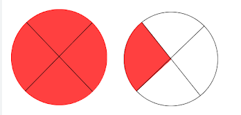
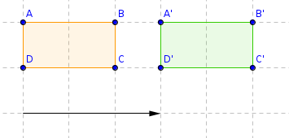
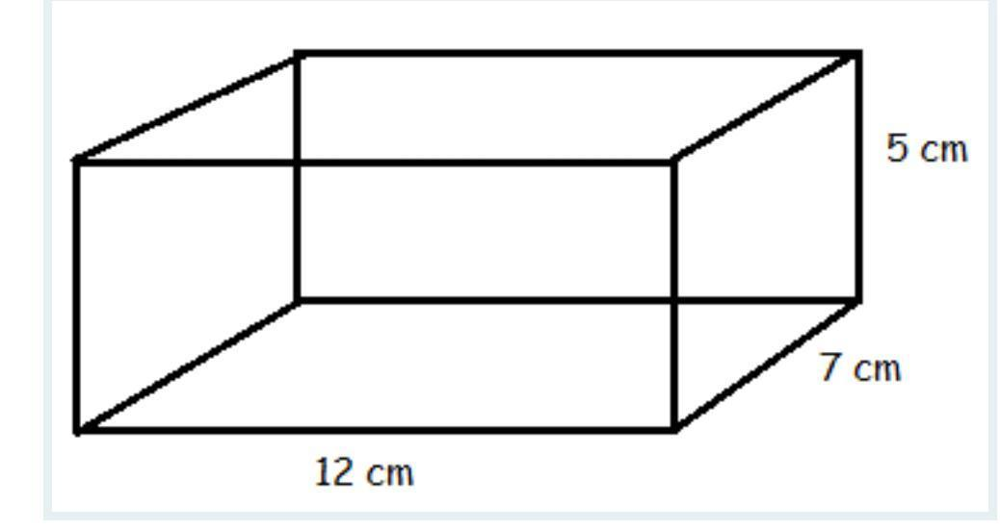
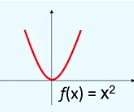
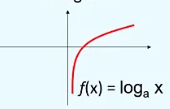
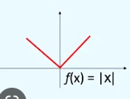
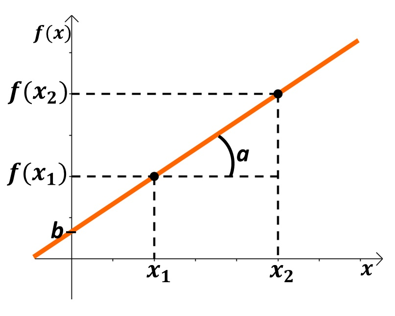
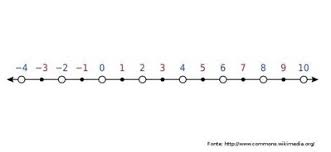

# 1. Representações numéricas

Habilidades do SAEB
*  Escrever números racionais (representação fracionária ou decimal
finita) em sua representação por algarismos ou em língua materna ou
associar o registro numérico ao registro em língua materna.

*  Compor ou decompor números racionais positivos (representação decimal
finita) na forma aditiva, ou em suas ordens, ou em adições e
multiplicações.

*  Identificar números racionais ou irracionais.

*  Comparar ou ordenar números reais, com ou sem suporte da reta
numérica, ou aproximar números reais para múltiplos de potência de 10
mais próxima.

*  Converter uma representação de um número racional positivo para outra
representação.

*  Identificar um número natural como primo, composto, "múltiplo/fator
de" ou "divisor de" ou identificar a decomposição de um número natural
em fatores primos ou relacionar as propriedades aritméticas (primo,
composto, "múltiplo/fator de" ou "divisor de") de um número natural à
sua decomposição em fatores primos.

Habilidades da BNCC
EF07MA01, EF07MA03, EF07MA10.

Professor, neste módulo é muito importante relembrar os alunos de cada
conjunto de números. Revisar desde os naturais e os inteiros para que
fique mais fácil de salientar as particularidades dos números racionais
e, principalmente, dos irracionais, que fogem um pouco da classe de
pertencimento dos outros conjuntos. 

**Números naturais**

O conjunto dos números naturais é chamado de ℕ. Números naturais são
todos os números que são positivos e possuem somente parte inteira. Os
números naturais têm algumas particularidades, como: um número é primo
quando possui apenas dois divisores, ele mesmo e o número 1. O
único número primo que é par é o número dois. Números compostos são os
números que não são primos, isto é, podem ser divididos por mais de dois
números. 

**Exemplos:**

Números primos: 7,11,13,23, etc.

Números compostos: 4,9,12,14,16, etc.

**Números racionais**

Números racionais são números que podem ser escritos em forma de fração,
por exemplo:

$$\frac{a}{b}$$,

desde que a e b sejam inteiros e b diferente de zero.

O conjunto dos números racionais recebe o nome de ℚ. Os números que podem
ser escritos em fração estão divididos em quatro
classes: as próprias frações, que já estão no formato da definição de
números racionais, os números inteiros, que, ao serem divididos por 1,
resultam no mesmo número, decimais finitos, que são números divididos 
por potências de 10 e as dízimas periódicas, que são decimais que 
têm um período que se repete em sua parte decimal.

**Exemplos:**

Frações:$$\frac{7}{8},\frac{5}{3},\frac{4}{9}$$ toda fração que tenha a, b inteiros e b diferente de zero.

Números inteiros:
$$- \frac{9}{1},\frac{4}{1},\  - \frac{8}{1},\frac{1057}{1}$$

Números decimais finitos: Qualquer número decimal finito pode ser
escrito na forma de fração, de modo que o denominador é uma potência de
10 elevada à quantidade de algarismos das casas
decimais: $$8,692\  = \frac{8692}{10^{3}} = \frac{8692}{1000}$$.

Dízimas periódicas: São dízimas que são infinitas, mas possuem um período
que se repete: $$\frac{23}{9}\  = \ 2,55555\ldots$$ ;
$$\frac{22}{9} = 2,44444$$...; $$\frac{478}{990} = 0,4828282$$... .

Para redigir em português os números racionais, devemos relembrar do
sistema de numeração decimal. A parte inteira é separada e cada
número recebe um nome de acordo com sua posição. 

**Exemplo:**
%Paulo: Colocar cada número abaixo com uma cor diferente.

7,9853

7 = parte inteira.
9 = décimos
8 = centésimos
5 = milésimos
3 = décimos de centésimos

Em todo número decimal, lemos primeiro a parte inteira, ou seja, 7 inteiros.
Para os decimais, lê-se o número inteiro, indicando a última classe, ou seja,
nove mil oitocentos e cinquenta e três décimos de milésimos.

**Exemplos:**

0,26 = vinte e seis centésimos;

1,256 = um inteiro e duzentos e cinquenta e seis milésimos;

5,3632 = cinco inteiros e três mil seiscentos e trinta e dois décimos de
milésimos.

Analisando os exemplos acima, como pode ser feita a decomposição dos
números racionais?

A decomposição dos números racionais é feita de acordo com o sistema
posicional, completando com zeros onde não encontramos números após a vírgula. 

**Exemplos:**

$$0,26\  = \ 0,20 + 0,06$$

$$1,256 = \ 1 + 0,200 + 0,050 + 0,006$$

$$5,3632 = \ 5 + 0,30000 + 0,0600 + 0,0030 + 0,0002$$

**Números irracionais**

O conjunto dos números irracionais recebem o nome 𝕀. Números irracionais
são todos aqueles números que não podemos representar por frações.
Alguns exemplos são as dízimas que não possuem período e que se repetem, e
algumas raízes, como $$\sqrt{2} \ e \ \sqrt{3}$$. 

 

**Números reais**

O conjunto dos números reais recebe o nome de ℝ. Os números reais são
todos os números naturais, inteiros, racionais e irracionais, excluindo
somente o conjunto dos números complexos. Para a representação e
comparação de números reais, convém transformá-los em decimais para
tornar sua visualização mais clara. Quando for necessário comparar
a parte decimal de um número, basta buscar a casa decimal que difere um
número do outro para que, assim, seja possível saber qual número é
maior e qual é menor.

**Exemplos:**

Vamos comparar 3 números decimais e colocá-los em ordem crescente.

$$33,785\  - \ 33,784\  - \ 33,659$$

A primeira questão a se analisar é que suas partes inteiras são iguais. 
Devemos, então, comparar os números após a vírgula. Os décimos nos dois primeiros 
números são iguais, mas o último é menor. Sabemos, então, que o terceiro 
número é o menor deles. Passamos para os centésimos, que também são iguais. 
Somente os milésimos são diferentes  e, como o segundo número é o menor 
entre os dois, a ordenação crescente é:

$$33,659\  - \ 33,784\  - \ 33,785$$

Como alternativa, podemos usar a aproximação para múltiplos de 10. 
Esse método arredonda o número para a dezena mais próxima. Quando o
número é maior ou igual a 5, o arredondamento será feito para cima. 
Em todos os outros casos, arredondamos para baixo.

**Exemplos:**

$$58\  \cong \ 60$$: Como o 58 está nas casas das dezenas, o arredondamento
mais próximo será uma dezena.

$$459\  \cong \ 460$$: Como o 459 está nas casas das centenas, o arredondamento
mais próximo será uma centena.

$$7\  \cong \ 10$$: Como o 7 está nas casas das unidades, o arredondamento
mais próximo será uma dezena, pois não há números nas unidades que
escritos em potências de 10. Isso ocorre pelo fato de esses números serem
escritos na potência 10, o que facilita visualizá-los em uma reta numérica.

\colorsec{Atividades}

1\) Marque Verdadeiro (V) ou falso (F) para as afirmações abaixo e
justifique sua resposta.

(    ) Todo número que é racional é também irracional.

(    ) As dízimas periódicas são irracionais.

(    ) Dízimas periódicas podem ser escritas na forma de fração.

(    ) Todos os números inteiros são racionais. 

R:

\(F\) Números irracionais não podem ser escritos em forma de fração, sendo
essa é a definição de números racionais.

\(F\) É possível encontrar uma fração para dízimas periódicas.

\(V\) É possível encontrar uma fração geratriz.

\(V\) Todos os números inteiros podem ser escritos na forma de
racionais.

2\) Relacione as colunas abaixo com o número escrito por extenso.

%Paulo: criar uma tabela de duas colunas com as informações abaixo:

a)  0,333                       (   ) Trezentos e três milésimos 

b)  0,303                       (   ) Quatro inteiros e duzentos e cinquenta e oito milésimos

c)  4,258                       (   ) Trezentos e trinta e três
    milésimos

d)  4,058                       (   ) Quatro inteiros e cinquenta e oito
    milésimos

R:

( b ) Trezentos e três milésimos 

( c ) Quatro inteiros e duzentos e cinquenta e oito milésimos

( a ) Trezentos e trinta e três milésimos

( d ) Quatro inteiros e cinquenta e oito milésimos

3\) Aproxime as partes inteiras dos números reais a potências de 10.

a\) 1.039

b\) 6

c\) 782

d\) 24

e\) 3.563

f\) 3

R:
Para aproximar números para a potência de 10, a parte inteira será
analisada.

a)  1.040

b)  10

c)  780

d)  20

e)  3.560

f)  10

4\) Foi feita uma competição na escola Super Saber. Durante 5 minutos, os alunos
tinham de percorrer a maior distância possível com obstáculos. Constatou-se que a 
maioria percorreu a mesma distância, condicionando a decisão aos números decimais. 
Observe a tabela com os resultados e organize em um ranking decrescente de distâncias. 

%Paulo: criar uma tabela com as informações abaixo.
  ---------------- ----------------------
  Nome do aluno    Distância percorrida
  Daniel           302,006 m
  Flávia           303,01 m
  Adriel           304,05 m
  Larissa          303,68 m
  Luís Fabiano     300 m 
  Emanuelly        302,072 m
  Henrique         303,809 m
  ---------------- ----------------------

R:

  --------------- ----------------------
  Ranking         Distância percorrida
  Adriel          304,05 m
  Henrique        303,809 m
  Larissa         303,68 m
  Flávia          303,01 m
  Emanuelly       302,072 m
  Daniel          302,006 m
  Luís Fabiano    300 m 
  --------------- ----------------------

Professor, lembre os alunos que o desempate acontece no maior número
depois da vírgula que ocupa a mesma casa decimal do outro valor.

5\) Classifique os números abaixo como compostos ou primos. Indique 3 
divisores para os números compostos.

a\) 11

b\) 48

c\) 23

d\) 51

e\) 100

R:

a)  O número 11 é primo, só é divisível por ele mesmo e por 1.

b)  O número 48 é composto. Seus menores divisores são 2, 4 e 6.

c)  O número 23 é primo, só é divisível por ele mesmo e por 1.

d)  O número 51 é primo, só é divisível por ele mesmo e por 1.

e)  O número 100 é composto. Seus menores divisores são 2, 4 e 5.

6\) Decomponha os números racionais abaixo:

a) 28,3569

b\) 8,596

c\) 42,568

d\) 144,326

R:

a)  28,3569 = 28 + 0,3000 + 0,0500 + 0,0060 + 0,0009

b)  8,596 = 8 + 0,500 + 0,090 + 0,006

c)  42,568 =  42 + 0,5 + 0,06 + 0,008

d)  144,326 = 144 + 0,300 + 0,020 + 0,006

7\) Apresente uma representação equivalente ao número racional dado:

a)  5,667

b)  $$\frac{42}{99}$$

c)  0,36

R:        

a)  $$5,667 = \frac{5667}{1000}$$

b)  $$\frac{42}{99} = 0,42424242...$$

c)  $$0,36 = \frac{36}{100}$$

8\) Escreva o número decimal 0,625 como uma fração irredutível.

R:
$$\frac{5}{8}$$

Para resolver este exercício, primeiro precisamos entender que um número decimal pode ser escrito como uma fração dividindo-se o valor decimal pelo valor do lugar decimal. No caso de 0,625, o número está escrito na casa decimal de milésimos, logo, 0,625 = $$\frac{625}{1000}$$. Simplificando a fração, temos $$\frac{5}{8}$$.

9\) Classifique os números como racionais ou irracionais.

a\) 7,3695216...

b\) 1,28567676767...

c\) 1,2365787878...

R:

a)  Irracional, pois não possui um período que se repete.

b)  Racional, porque é uma dízima periódica.

c)  Racional, porque é uma dízima periódica.

10\) Na sala da professora Ana Júlia, foi realizada uma atividade de
medição dos pés dos alunos. Thiago, Maria e Paula obtiveram, 
respectivamente, as seguintes medidas: 
23,9; 22,7 e 23,91. Quem tem o maior pé?

R:
Paula possui o maior pé, pois, como as casas centesimais são
iguais, devemos observar os milésimos.

\colorsec{Treino}

1\) Marque a alternativa em que os seguintes números são classificados respectiva e
corretamente.

$$\sqrt{3}\ \ \ \ \ \ 0,222..\ \ \ \ 5,363636...\ \ \ \ \ \sqrt{\ 2}$$

a\) Natural, Inteiro, Racional, Racional.

b\) Irracional, Racional, Racional, Irracional.

c\) Racional, Irracional, Irracional, Racional.

d\) Racional, Racional, Racional, Irracional.

R: B

SAEB:
Identificar números racionais ou irracionais.

BNCC: EF07MA10 -- Comparar e ordenar números racionais em diferentes contextos e associá-los a pontos da reta numérica..

A - Incorreta, pois $$\sqrt{3}\\$$ não é Natural, 0,2222 não é Inteiro,
$$\sqrt{2}\\$$ não é racional.

B - Correta, pois os números foram classificados corretamente.

C - Incorreta, pois $$\sqrt{3}\\$$ não é racional, 0,2222 não é irracional,
$$\sqrt{2}\\$$ , 5,363636 não é irracional e $$\sqrt{2}\\$$ não é racional.

D - Incorreta, pois $$\sqrt{3}\\$$ não é racional.

2\) Um professor marcou numa reta numérica um ponto entre o 0 e o 1.
Qual número racional melhor representa este ponto?

a\) $$\frac{2}{8}$$

b\) $$\frac{5}{2}$$

c\) $$\frac{10}{7}$$

d\) $$\frac{18}{12}$$

SAEB: 
Comparar ou ordenar números reais, com ou sem suporte
da reta numérica, ou aproximar números reais para múltiplos de potência
de 10 mais próxima.

BNCC: 
EF07MA03 -- Comparar e ordenar números inteiros em diferentes contextos, incluindo o histórico, associá-los a pontos da reta numérica e utilizá-los em situações que envolvam adição e subtração.

A - correta, pois, ao efetuarmos a divisão, temos  0,25.

B - incorreta, pois, ao efetuarmos a divisão, temos 2,5.

C - incorreta, pois, ao efetuarmos a divisão, temos 1,42.

D - incorreta, pois, ao efetuarmos a divisão, temos 1,5.

3\) Julgue as afirmações e marque a resposta correta.

 I - Todos os números inteiros são racionais.

II - Todo número decimal finito pode ser representado por fração.

III - O número 21 é primo.

IV - O número 2 é o único número que é par e primo.

a)  As questões II e IV são falsas.

b)  I, II, e IV são verdadeiras.

c)  Apenas IV é falsa.

d)  São todas verdadeiras

R: B

SAEB:
Converter uma representação de um número racional positivo para outra
representação.

BNCC: EF07MA10 -- Comparar e ordenar números racionais em diferentes contextos e associá-los a pontos da reta numérica.

A - Incorreta, pois todo número decimal finito pode ser representado por
fração e o número 2 é o único par que é primo.

B - Correta, pois essas são as afirmações certas.

C - Incorreta, pois o número 2 é o único número par que é primo, então é
uma verdade

D - Incorreta, pois a afirmação III é falsa. O número 21 não é primo, ele possui 4
divisores: 1, 3,7 e 21.

# 2. Operações aritméticas

Habilidades do SAEB
*  Calcular o resultado de adições, subtrações, multiplicações ou
divisões envolvendo números reais.

*  Calcular o resultado de potenciação ou radiciação envolvendo números
reais.

*  Resolver problemas de adição, subtração, multiplicação, divisão,
potenciação ou radiciação envolvendo números reais, inclusive notação
científica.

*  Resolver problemas de contagem cuja resolução envolva a aplicação do
princípio multiplicativo.

*  Resolver problemas que envolvam as ideias de múltiplo, divisor,
máximo divisor comum ou mínimo múltiplo comum.

Habilidade da BNCC
EF07MA04.

Professor, tenha muita atenção ao trabalhar esse módulo com os alunos, pois
trataremos das operações fundamentais envolvendo números positivos e
negativos. Revise as operações de soma, subtração, multiplicação, divisão, 
potenciação e radiciação com números positivos. Em seguida, refaça todas elas 
com os números negativos. Enfatize bem as regras de sinais, distinguindo as regras 
da soma e multiplicação/divisão.

As operações de adição, subtração, multiplicação, potência e raiz, 
no contexto dos números negativos, precisam ser realizadas com mais
atenção por envolverem as regras de sinais. Vamos relembrá-las?

**Soma**

Sinais iguais: somamos os algarismos e mantemos o sinal em comum no
resultado.

Sinais diferentes: subtraímos os algarismos e mantemos o sinal do maior
no resultado.

**Exemplo:**
$$- 9 + \left( - 12 \right) = \  - 21\\$$
$$- 15 + \left( 8 \right) = \  - 7\\$$
$$- 4 + \left( 28 \right) = \  - 24\\$$

**Multiplicação/Divisão**

Sinais iguais: o sinal do resultado fica positivo.

Sinais diferentes: o sinal do resultado fica negativo.

**Exemplo:**
$$- 10 \times \left( - 5 \right) = \ 50\\$$
$$- 7 \times \left( 8 \right) = \ - 56\\$$
$$- 42 \div \left( 3 \right) = - 14\\$$

**Observação:** Lembre-se de que a subtração tem a função de trocar o sinal
do número que vem após ela. Assim,

$$15 + 27 - \left( - 5 \right) = 15 + 27 + 5 = 47$$

**Potenciação** ($$a^{n})$$

Professor, use esse tópico para revisar as propriedades de potência que
já foram estudadas no 6º ano: multiplicação e divisão de bases iguais,
potência de potência, potência de expoente 0, 1, etc.

**Base negativa:** aplicamos a regra do expoente, ou seja, quando o
expoente for par o resultado fica positivo, e quando for ímpar fica
negativo.

**\
Exemplo:**
$$\left( - 3 \right)^{2} = 9\\$$
$$\left( - 3 \right)^{3} = -27\\$$

**Observação:** para a base ser considerada negativa e aplicarmos as regras
de sinais, ela deve aparecer entre parênteses. Caso contrário, apenas
repetimos o sinal e calculamos a potência separadamente.

$$\left( - 4 \right)^{2} \neq - 4^{2}$$

$$16 \neq - 16$$

**Raiz quadrada** ($$\sqrt{a})$$

Professor, use esse tópico para revisar a  fatoração.
Revise os conceitos de múltiplos, divisores, números primos, m.m.c. e
m.d.c.

Para resolver uma raiz quadrada, podemos utilizar três técnicas:
tentativa e erro, fatoração ou aproximação.

Professor, faça a fatoração e explique para os alunos que agrupamos os
termos de acordo com o índice da raiz para retirarmos os números.

**Exemplo:**
$$\text{}\sqrt{576} = \sqrt{2^{2}.2^{2}.2^{2}.3²} = 2.2.2.3 = 24$$

$$\sqrt{7} \rightarrow \ \sqrt{4} < \sqrt{7} < \sqrt{9} \rightarrow 2 < \sqrt{}7 < 3$$

\colorsec{Atividades}

1)  Calcule o valor das expressões a seguir:

a\) $$- 15 + 27 - \left( - 5 \right) + 75 =$$

b\) $$37 + \left( - 11 \right) - \left( 66 \right) - ( - 8) =$$

c\) $$- (22 + \left( - 33 \right) - 14 + 120) =$$

d\) $$200 - 88 - 14 - 144 + 75 =$$

R:

Professor, ao resolver os exercícios com os alunos, enfatize as regras,
faça o passo a passo onde for preciso retirar parênteses e trabalhe a
resolução de dois em dois números, deixando bem claros os resultados 
encontrados.

a)  $$- 15 + 27 - \left( - 5 \right) + 75 = - 15 + 27 + 5 + 75 = 92$$

b)  $$37 + \left( - 11 \right) - \left( 66 \right) - \left( - 8 \right) = 37 - 11 - 66 + 8 = - 32$$

c)  $$- \left( 22 + \left( - 33 \right) - 14 + 120 \right) = - \left( 22 - 33 - 14 + 120 \right) = - \left( 95 \right) = - 95$$

d)  $$200 - 88 - 14 - 144 + 75 = 29$$

2\) Qual é o valor da expressão $$3^4 \times \sqrt{16}$$?

R:

Primeiro, vamos calcular a raiz quadrada de 16, que é 4. Substituindo esse valor na expressão, temos:

$$3^4 \times \sqrt{16} = 3^4 \times 4 = 81 \times 4 = 324$$

Portanto, o resultado da expressão é 324.

3\) Associe a primeira coluna das operações com os resultados
apresentados na segunda coluna:

A.  $$- 2 \times 5 \times \left( - 3 \right) \times \left( - 1 \right) =$$

B.  ($$- 4 \times 8) \div ( - 2 \times \left( - 8 \right)) =$$

C.  $$12 \times 3 \times \left( - 3 \right) \times 2 =$$

D.  $$( - 50 \div \left( - 5 \right)) \times (36 \div 9) =$$

( ) $$40$$

( ) $$- 2$$

( ) $$- 30$$

( ) $$- 216$$

R:\
A.$$\  - 2 \times 5 \times \left( - 3 \right) \times \left( - 1 \right) = - 30$$

B.($$- 4 \times 8) \div ( - 2 \times \left( - 8 \right)) = \left( - 32 \right) \div 16 = - 2$$

C.$$\ 12 \times 3 \times \left( - 3 \right) \times 2 = - 216$$

D.
$$\left( - 50 \div \left( - 5 \right) \right) \times \left( 36 \div 9 \right) = \left( 10 \right) \times 4 = 40$$

\(D\) $$40$$

\(B\) $$- 2$$

\(A\) $$- 30$$

\(C\) $$- 216$$

4\) Aplicando as propriedades de bases iguais, simplifique como uma
única potência e indique se seus resultados serão positivos ou
negativos:

a\) $${( - 5)}^{10} \times ( - {5)}^{8} \times {( - 5)}^{3} =$$

b\) $${( - 2)}^{4} \times ( - {2)}^{6} \times {( - 2)}^{12} =$$

c\) $$\ \frac{{( - 7)}^{15}}{{( - 7)}^{11}} =$$

d\) $$\frac{{( - 3)}^{33}}{{( - 3)}^{12}} =$$

e)$$\ \frac{{( - 10)}^{55} \times {( - 10)}^{25} \times {( - 10)}^{35}}{{( - 10)}^{4} \times {( - 10)}^{6} \times {( - 10)}^{32}} =$$

R:

a\)
$${( - 5)}^{10} \times ( - {5)}^{8} \times \left( - 5 \right)^{3} = \left( - 5 \right)^{10 + 8 + 3} = \left( - 5 \right)^{21} \rightarrow\\$$ Como
o expoente é ímpar o resultado fica negativo.

b\)
$${( - 2)}^{4} \times ( - {2)}^{6} \times \left( - 2 \right)^{12} = \ \left( - 2 \right)^{4 + 6 + 12} = \left( - 2 \right)^{22} \rightarrow \\$$ Como
o expoente é par o resultado fica positivo.

c\) $$\ \frac{{( - 7)}^{15}}{{( - 7)}^{11}} =$$
$${( - 7)}^{4} \rightarrow \\$$ Como o expoente é par, o resultado fica
positivo.

d\) $$\frac{{( - 3)}^{33}}{{( - 3)}^{12}} =$$
$${( - 3)}^{21} \rightarrow \\$$ Como o expoente é ímpar, o resultado fica
negativo.

Professor, explique aos alunos que primeiro
resolvemos o numerador e o denominador da fração separadamente para, depois,
aplicar a regra de divisão de bases iguais.

e)$$\ \frac{{( - 10)}^{55} \times {( - 10)}^{25} \times {( - 10)}^{35}}{{( - 10)}^{4} \times {( - 10)}^{6} \times {( - 10)}^{32}} = \frac{{( - 10)}^{55 + 25 + 35}}{{( - 10)}^{4 + 6 + 32}} = \frac{{( - 10)}^{115}}{{( - 10)}^{42}} = {( - 10)}^{115 - 42} = {( - 10)}^{73} \rightarrow\\$$ Como
o expoente é ímpar, o resultado fica negativo.

5\) A cada letra está associado o valor de uma raiz quadrada. Calcule o
valor delas usando a fatoração e coloque-as em ordem crescente, como no
exemplo:

$$A = \sqrt{225} = \sqrt{3^{2} \times 5^{2}} = 3 \times 5 = 15$$

$$B = \sqrt{324} = \sqrt{2² \times 3² \times 3²} = 2 \times 3 \times 3 = 18$$

$$C = \sqrt{144} = \sqrt{2² \times 2² \times 3²} = 2 \times 2 \times 3 = 12$$

$$C - A - B$$

$$A = \sqrt{441}$$

$$B = \sqrt{784}$$

$$C = \sqrt{1225}$$

$$D = \sqrt{676}$$

$$E = \sqrt{484}$$

R:

$$A = \sqrt{441} = \sqrt{3^{2}.7²} = 3\ .\ 7 = 21$$

$$B = \sqrt{784} = \sqrt{2^{2}.2^{2}.7²} = 2\ .\ 2\ .\ 7 = 28$$

$$C = \sqrt{1225} = \sqrt{5².7²} = 5\ .\ 7 = 35$$

$$D = \sqrt{676} = \sqrt{2^{2}.\ 13²} = 2\ .\ 13\  = 26$$

$$E = \sqrt{484} =$$ $$\sqrt{2².11²} = 2\ .\ 11 = 22$$

A -- E -- D -- B -- C

6\) Indique entre quais números inteiros encontram-se as raízes abaixo,
utilizando as raízes exatas menores e maiores.
Siga o exemplo:

$$\sqrt{23} \rightarrow \ \sqrt{16} < \sqrt{23} < \sqrt{25} \rightarrow \ $$a
$$\sqrt{23}\\$$ está entre 4 e 5

a\) $$\sqrt{55}$$

b\) $$\sqrt{66}$$

c\) $$\sqrt{96}$$

d\) $$\sqrt{42}$$

R:

Professor, faça com os alunos todos os produtos de fatores iguais de 1 até 10 para facilitar a visualização das raízes a serem utilizadas.

a)  $$\sqrt{55} \rightarrow \ \sqrt{49} < \sqrt{55} < \sqrt{64} \rightarrow \ $$a
   $$\sqrt{55}\ $$ está entre 7 e 8

b) $$\sqrt{66} \rightarrow \ \sqrt{64} < \sqrt{66} < \sqrt{81} \rightarrow \ $$a
    $$\sqrt{66}\\$$ está entre 8 e 9

c) $$\sqrt{96} \rightarrow \ \sqrt{81} < \sqrt{96} < \sqrt{100} \rightarrow \ $$a
    $$\sqrt{96}\\$$ está entre 9 e 10

d) $$\sqrt{42} \rightarrow \ \sqrt{36} < \sqrt{42} < \sqrt{49} \rightarrow \ $$a
$$\sqrt{42}\\$$ está entre 6 e 7

7\) Pietra, Marcelo e Antônio decidiram criar um jogo para estudar para a prova de matemática. Quem montasse a expressão com maior resultado negativo venceria. Determine qual deles foi o vencedor:

Pietra:
$$2^{5} + \left\{ 75 \div \left( - 3 \right) - \left\lbrack 6^{2} + \left( 2 - 4 \right)^{3} \right\rbrack \right\} - \sqrt{16}$$

Marcelo:
$$230^{0} + ( - 5)²\left\{ 15 \div 5 \times \left\lbrack 7^{2} - \left( 12 - 8 \right)^{3} \right\rbrack \right\} - \sqrt{121}$$

Antônio:
$$1^{500} \times \left\{ - 5 \times \left\lbrack \left( - 9 \right)^{2} - \left( 34 - 26 \right)^{2} \right\rbrack \right\} - (\sqrt{100}\  \times 700^{0})$$

R:

Professor, enfatize a ordem de resoluções das expressões
numéricas, estabelecendo as hierarquias de resoluções dos sinais de
agrupamentos e das operações.

Pietra:\
$$2^{5} + \left\{ 75 \div \left( - 3 \right) - \left\lbrack 6^{2} + \left( 2 - 4 \right)^{3} \right\rbrack \right\} - \sqrt{16} = 32 + \left\{ - 25 - \left\lbrack 36 + \left( - 2 \right)^{3} \right\rbrack \right\} - 4 = 32 + \left\{ - 25 - \left\lbrack 36 - 8 \right\rbrack \right\} - 4 = 32 + \left\{ - 25 - 28 \right\} - 4 = 32 - 53 - 4 = - 25$$

Marcelo\
$$230^{0} + \left( - 5 \right)^{2} - \left\{ 15 \div 5 \times \left\lbrack 7^{2} - \left( 12 - 8 \right)^{3} \right\rbrack \right\} - \sqrt{121} = 1 + 25 - \left\{ 3 \times \left\lbrack 49 - 64 \right\rbrack \right\} - 11 = 26 - \left\{ 3 \times \left( - 15 \right) \right\} - 11 = 26 - \left\{ - 45 \right\} - 11 = 26 + 45 - 11 = 60$$

Antônio:
$$1^{500} \times \left\{ - 5 \times \left\lbrack \left( - 9 \right)^{2} - \left( 34 - 26 \right)^{2} \right\rbrack \right\} - \left( \sqrt{100}\  \times 700^{0} \right) = 1 \times \left\{ - 5 \times \left\lbrack 81 - 64 \right\rbrack \right\} - \left( 10 \times 1 \right) = 1 \times \left\{ - 5 \times 17 \right\} - 10 = 1 \times \left( - 85 \right) - 10 = - 85 - 10 = - 95$$

Logo, quem venceu o jogo foi a Pietra, já que o maior resultado negativo
foi o dela.

Professor, revise com os alunos que a comparação dos números negativos
funciona ao contrário dos positivos, que quanto mais longe do zero o
número está, menor é seu valor.

8\) Para montar um bolo, Fabiana utiliza 2 tipos de massa, 16 tipos
de recheio, 8 tipos de cobertura e 4 tamanhos distintos, tanto para a
parte retangular quanto para a redonda. Escreva em forma de potência a
quantidade de bolos distintos que Fabiana consegue produzir combinando
as opções descritas e calcule a potência.

R:

Para calcular a quantidade de bolos, vamos usar o Princípio
Multiplicativo. Basta multiplicarmos todas as opções, logo:

$$2 \times 16 \times 8 \times 4 \times 2$$

Como devemos representar o resultado como uma única potência, vamos transformar todos
os termos para uma potência de base 2:

$$2 \times 2^{4} \times 2^{3} \times 2^{2} \times 2 = 2^{1 + 4 + 3 + 2 + 1} = 2^{11} = 2048$$ bolos distintos

9\) Em um terminal urbano, três ônibus saem às 7h com destino a bairros
distintos. De tempos em tempos, eles retornam ao terminal para refazer o
trajeto. O ônibus A retorna ao terminal de 20 em 20 minutos, o ônibus B
de 30 em 30 minutos e o ônibus C, de 45 em 45 minutos. Qual é o último
horário do dia em que os três ônibus saem da rodoviária ao mesmo tempo,
sabendo que os ônibus saem a última vez do terminal às 23h?

R:

Professor, mostre aos alunos que, quando queremos determinar encontros
repetidos, usamos a ideia de Mínimo Múltiplo Comum. Revise com eles o
cálculo pela fatoração simultânea.

Para resolver, basta calcularmos o M.M.C dos tempos, ou seja, de 20, 30 e
45, achando de quanto em quanto tempo os ônibus vão se encontrar no
terminal. Depois, determinamos o último horário em que esse encontro
ocorrerá:
%Paulo: criar uma tabela com as informações abaixo:
  -------- ---- ---- ---
  $$20$$   30   45   2
  10   15   45   2
  5    15   45   3
  5    5    15   3
  5    5    5    5
  1    1    1    
  -------- ---- ---- ---

Ou seja, os ônibus se encontram de 180 em 180 minutos, isto é, 3 em 3
horas. Assim, se eles saem juntos às 7 da manhã, eles irão se encontrar às
10h, 13h, 16h, 19h e 22h; logo, o último horário em que eles saem juntos
é às 22h.

10\) Em um ateliê, existem três tecidos iguais, mas de estampas
diferentes, que são vendidos no mesmo tamanho. Em uma semana, o ateliê
recebeu rolos retangulares de 150 cm² da estampa azul, 120 cm² da
estampa vermelha e 180 cm² da estampa rosa. Para obtermos o maior tamanho 
possível de retalhos sem sobrar nenhuma parte dos rolos recebidos, quais dimensões de tecidos deverão ser cortadas? Quantos retalhos foram obtidos de cada cor do tecido?

R:

Professor, mostre aos alunos que, quando necessitamos fazer divisões da
maior forma possível, usamos a ideia de Máximo Divisor Comum. Revise
com eles o cálculo pela fatoração simultânea.

Para resolver, basta calcularmos o M.D.C dos tamanhos dos tecidos, ou
seja, de 120, 150 e 180, achando assim o tamanho do retalho e em seguida
quantos retalhos cada cor renderá. Assim:

  ----- ----- ----- ----------------
  120   150   180   2 $$\leftarrow$$
  60    75    90    2
  30    75    45    2
  15    75    45    3 $$\leftarrow$$
  5     25    15    3
  5     25    5     5 $$\leftarrow$$
  1     5     1     5
  1     1     1     
  ----- ----- ----- ----------------

Assim, cada retalho vai ter 30cm² de tamanho e serão produzidos:

$$\frac{150}{30} = 5$$ retalhos azuis

$$\frac{120}{30} = 4$$ retalhos vermelhos

$$\frac{180}{30} = 6$$ retalhos rosas

\colorsec{Treino}

1\)  Os fusos horários são feitos a partir do Meridiano de Greenwich, que
    representa o marco 0. Toda localidade possui fuso negativo quando seu
	horário é atrasado em relação ao meridiano. Por sua vez, o fuso é considerado 
	positivo quando é adiantado a partir do marco 0. Pedro vai fazer uma viagem 
	saindo de São Paulo, com fuso GMT-3, às 8 horas do dia 23/03 e vai para 
	a capital da Austrália, com fuso GMT+11. Porém, o voo de Pedro vai fazer 
	uma escala em Dubai, local cujo fuso é GMT+4. Se a viagem do Brasil até 
	Dubai é de aproximadamente 14 horas e de Dubai até a Austrália é de 
	aproximadamente 18 horas, quando Pedro chegará na Austrália?

a\)  16h do dia 24/03.

b\)  6h do dia 24/03.

c\)  6h do dia 25/03.

d\)  16h do dia 25/03.

R:

SAEB: Resolver problemas de adição, subtração, multiplicação,
divisão, potenciação ou radiciação envolvendo números reais, inclusive
notação científica.

BNCC: EF07MA04 -- Resolver e elaborar problemas que envolvam operações com números inteiros.

A - Incorreta, pois não foi considerada a diferença de fuso horário, apenas a
soma das horas de maneira direta.

B - Incorreta, pois o cálculo das horas foi feito da maneira correta, porém a mudança de dia não foi considerada.

C - Correta, pois:

Saída de São Paulo as 8h do dia 23/03 $$\rightarrow$$ em Dubai vão ser 15h
do dia 23/03 ($$4 - ( - 3) = 4 + 3 = 7\text{h\ }$$de diferença).

A viagem de São Paulo para Dubai dura 14 horas, assim Pedro vai chegar
em Dubai às 5h do dia 24/03, que serão 12h do dia 24/03 na Austrália
($$11 - 4 = 7\text{h\ }$$de diferença).

A viagem de Dubai até a Austrália são 18 horas, assim Pedro vai chegar
na Austrália às 6h do dia 25/03.

D - Incorreta, pois o dia está correto, mas foi considerado o cálculo sem a
diferença de fuso horário.

2\)  Quantos números de quatro algarismos diferentes podem ser formados utilizando-se os algarismos 1, 2, 3, 4 e 5?

a\) 24
b\) 60
c\) 120
d\) 240

SAEB: Resolver problemas de contagem cuja resolução envolva a aplicação do princípio multiplicativo.

BNCC: EF07MA04 -- Resolver e elaborar problemas que envolvam operações com números inteiros.

A - Incorreta, pois essa resposta não considera o fato de que cada algarismo deve ser diferente dos demais.

B - Incorreta, pois essa resposta não leva em conta que a quantidade de opções vai diminuindo a cada algarismo escolhido.

C - Correta, pois a quantidade de números de quatro algarismos diferentes que podem ser formados utilizando-se cinco algarismos é determinada pelo princípio multiplicativo.
Portanto, o número total de combinações possíveis é dado pelo produto das opções disponíveis para cada algarismo: $$\ 5 \times 4\times 3\times 2  = 120$$

D - Incorreta, pois essa resposta excede o número máximo de combinações possíveis, uma vez que estamos limitados a quatro algarismos diferentes.

3\)  Mateus está comprando um lote para construir uma nova sede
    para sua empresa. O lote tem formato quadrangular de área igual a
    1296 m². Antes de iniciar a construção, Mateus vai murar o terreno
    por todo seu perímetro e colocar um portão de 12 metros de
    comprimento. Qual é a extensão do muro que será construído no lote de
    Mateus?

a\) 24 m

b\) 36 m

c\) 144 m

d\) 132 m

R:

SAEB: Resolver problemas de adição, subtração, multiplicação, divisão, 
potenciação ou radiciação envolvendo números reais, inclusive notação 
científica.

BNCC: EF07MA04 -- Resolver e elaborar problemas que envolvam operações com 
números inteiros.

A - Incorreta, pois considerou apenas o tamanho de um lado do terreno e
ignorou o comprimento do portão.

B - Incorreta, pois considerou apenas o tamanho de um lado do terreno.

C - Incorreta, pois não considerou o comprimento do portão do perímetro do
terreno.

D - Correta, pois, como a área de um quadrado é dado por l² - onde l é o tamanho do lado -, para calcular o tamanho do lado basta extrair a raiz quadrada da área. 
Assim

$$l^{2} = 1296 \rightarrow l = \ \sqrt{1296} \rightarrow l = \sqrt{2².2^{2}.3^{2}.3^{2}} = 2 \times 2 \times 3 \times 3 = 36m\ $$

Como o exercício pede a extensão do muro, basta calcular o perímetro do
terreno e tirar o tamanho do portão. Assim:

$$p\  = \ 4 \times 36 = 144 - 12 = 132$$

# 3. Frações

Habilidades do SAEB
*  Representar frações menores ou maiores que a unidade por meio de
representações pictóricas ou associar frações a representações
pictóricas.

*  Identificar frações equivalentes.

*  Determinar uma fração geratriz para uma dízima periódica.

Habilidades da BNCC 
EF07MA08, EF07MA09.

Professor, neste módulo é importante ter objetos concretos e material
dourado a disposição para trabalhar as frações. Estimule os alunos a
pensar não só nos números, mas também em representações reais. 
Os alunos podem dividir alimentos (como pizzas e chocolates) entre si 
e enxergar as partes como frações.

**Frações próprias e impróprias**

Como já vimos antes, uma fração é representada pela sua parte no
numerador e seu inteiro no denominador. Ou seja, fração é uma
representação numérica de partes de um valor inteiro dividido em
parcelas iguais.  Elas recebem o nome de frações próprias quando o
numerador é maior que o denominador.

**Exemplos:**

-   Joana tem 6 batons. 5 deles são vermelhos e 1 é nude. Qual é a
    representação fracionária do batom nude?

$$\frac{1}{6}$$

O numerador é a quantidade de batons de que estou falando. Já o
denominador representa a quantidade total.

Além disso, há representações que são maiores que as parcelas
divididas. Elas são chamadas de frações mistas ou impróprias. Elas são 
divididas em partes inteiras e partes não inteiras. Isso acontece quando 
o numerador é maior que o denominador. Nesses casos, é possível extrair uma 
parte inteira da fração. A notação utilizada apresenta, da esquerda para a
direita, a parte inteira na frente do número e sua forma fracionária.

Professor, relembre o que é uma fração inteira, mencionando
que toda fração é uma divisão. Quando seus numeradores são iguais
ou superiores aos seus denominadores, já temos um inteiro.

**Exemplos:**

-   Carlos foi a um rodízio de pizzas e comeu uma pizza e metade de
    outra. Se cada pizza fosse cortada em 8 pedaços, qual seria a sua
    representação fracionária?

$$\frac{8}{8}\  + \ \frac{4}{8}\  = \ 1\ \frac{4}{8}$$

$$\frac{29}{8}$$ ou $$3\ \frac{5}{8}$$

**Frações Equivalentes**

Frações equivalentes são frações escritas de forma diferentes,
mas com o mesmo valor numérico. No sexto ano, vimos o que são
frações irredutíveis, isto é, uma fração com numerador e denominador 
apresentados no menor número possível. Para frações
equivalentes, podemos encontrar novas frações, dividindo ou
multiplicando o numerador e o denominador pelo mesmo número. Dessa forma, 
encontramos uma nova razão para uma mesma proporção. Assim como ocorre em 
qualquer sequência de números, quando comparamos duas frações, 
a relação só pode ser maior, menor ou igual. Logo, podemos encontrar
frações equivalentes.

Professor, nesta parte, vale lembrar os critérios de divisibilidade mostrando
como o numerador e o denominador devem ser divididos pelo mesmo número.
Durante os exercícios, convém utilizar a calculadora com os alunos para que eles visualizem como as frações equivalentes chegam ao mesmo quociente.

**Exemplos:**

-   Fábio e Michel foram a uma fábrica de chocolates. Fábio comprou um
    chocolate que era repartido em 12 quadradinhos e comeu 4 desses
    12 quadradinhos. Já Michel comprou um chocolate que vinha cortado em
    36 quadradinhos e comeu 12 quadradinhos. Considerando que as barras
    eram do mesmo tamanho, quem comeu mais chocolate?

Fábio comeu uma quantidade referente a $$\frac{4}{12}$$ e Michel uma
quantidade referente a $$\frac{12}{36}$$ .

Note que é possível encontrar um padrão nos numeradores e
denominadores, pois a quantidade de que Michel comeu é igual ao triplo do
numerador de Fábio dividido pelo triplo de seu denominador, permanecendo
com a mesma razão.

-   Para cada fração abaixo, encontraremos duas de suas equivalentes:

$$\frac{3}{7}$$ : Como temos dois números primos, utilizaremos seus
múltiplos, primeiro multiplicando por 2, obtendo $$\frac{6}{14}$$.
Multiplicando por 3, obtemos $$\frac{9}{21}$$.

$$\frac{18}{64}$$: Como temos dois números pares, sabemos que eles são
divisíveis por 2, logo, temos $$\frac{9}{32}$$, o que resultou na fração
irredutível, logo, podemos encontrar outra fração multiplicando
a inicial por 2, chegando a $$\frac{36}{128}$$.

$$\frac{15}{75}$$: Como temos dois números terminados em 5, a primeira
fração equivalente será encontrada por meio da divisão por 5, o que 
resulta em $$\frac{3}{15}$$. Podemos encontrar outra fração dividindo ambos 
por 3, resultando em $$\frac{5}{25}$$.

**Observação:** É importante ressaltar, que da mesma forma que existem
infinitos números múltiplos, existem infinitas frações equivalentes.

**Dízimas periódicas**

Professor, nesta seção, é importante trabalhar primeiro a demonstração
para encontrar frações geratrizes e, depois, o método prático para que os
alunos entendam o que está acontecendo. É preciso ressaltar que as 
dízimas periódicas são números racionais e, por isso, têm representação 
em forma de fração.

Alguns números, quando divididos, resultam em algarismos que se repetem
infinitamente na mesma ordem. Essa repetição de números infinita é
chamada de período, o que explica o nome de dízima periódica. Existem
dois tipos de dízimas periódicas, as simples e compostas. As dízimas
periódicas simples apresentam um único número que se repete indefinidamente.
Já as dízimas periódicas compostas apresentam mais números no trecho que está 
se repetindo.

**Exemplos:**

-   Dízimas periódicas simples: 0,6666...; 0,222222...; 0,77777...;
    0,88888...

-   Dízimas periódicas compostas: 0,855555...; 0,47888888...,
    0,985626262...

**Frações geratrizes**

Vamos fazer um passo a passo para encontrar a fração geratriz de dízimas
periódicas simples. Depois, aprenderemos o método prático.

**Método convencional:**

-   Primeiro passo: Chamar a dízima periódica de x;

-   Segundo passo: Multiplicar os dois lados da igualdade por potências
    de 10 a partir da quantidade de algarismos que há no período.
    Por exemplo, se temos dois números, multiplicremos por 100;

-   Terceiro passo: Encontrar a diferença (subtração) entre a equação
    encontrada e a equação do primeiro passo.

-   Quarto passo: encontrar o valor de x na equação do terceiro passo.

**Exemplo:**

Vamos encontrar a fração geratriz da dízima 1,5555...

Primeiro passo: $$x\  = \ 1,5555\ldots$$

Segundo passo: Multiplicar por 10, uma vez que só o número 5 se repete.

$$10x\  = \ 1,5555\ldots\  \times \ 10$$

$$10x\  = \ 15,5555\ \ldots$$

Terceiro passo: Diferença entre as equações

$$10\ x\ –\ x\  = \ 15,5555\ \ldots\ –\ 1,5555\ldots$$

$$9x\  = \ 14$$

Quarto passo: $$\frac{14}{9}$$

**Método prático:**

-   Primeiro passo: Separar a parte inteira da parte decimal;

-   Segundo passo: Encontrar o numerador da fração geratriz, que será
    dado pelos números da parte inteira até o período (sem a vírgula);

-   Terceiro passo: Encontrar o denominador da fração geratriz. Isso
    dependerá da quantidade de algarismos do período. Por exemplo, caso
	haja apenas um número, colocaremos um 9 no denominador.

**Exemplo:**

Vamos encontrar a fração geratriz da dízima 1,5555...

Primeiro passo:

Parte inteira: 1

Período: 5

Segundo passo: $$15 - 1 = 14$$

Terceiro passo: Somente o 5 está se repetindo, logo, no denominador encontraremos
somente um 9.

Logo, a fração geratriz é $$\frac{14}{9}$$.

Agora, veremos como encontrar dízimas compostas pelos dois métodos:

**Método convencional:**

-   Primeiro passo: igualar a dízima periódica a x.

-   Segundo passo: Multiplicar a dízima periódica composta por potências
    de 10 de modo que o antiperíodo fique antes da vírgula, isto é,
    multiplicar por 10 se encontrarmos apenas um algarismo no antiperíodo;

-   Terceiro passo: A dízima periódica está igual a uma dízima
    simples. Agora, basta multiplicar os dois lados da igualdade por potências
    de 10, dependendo da quantidade de algarismos que há no período.
    Por exemplo, se temos dois números, multiplicaremos por 100;

-   Quarto passo: Encontrar a diferença (subtração) entre a equação
    encontrada no terceiro e no segundo passo.

**Método prático:**

-   Primeiro passo: Separar a parte inteira, o antiperíodo e o período
    da dízima;

-   Segundo passo: Encontrar o numerador da fração geratriz, que será
    dado pelos números da parte inteira e do antiperíodo até o período .

-   Terceiro passo: Encontrar o denominador da fração geratriz, isso
    dependerá da quantidade de algarismos do período. Se encontrarmos 1 número,
	colocaremos um 9 no denominador. Para cada algarismo do antiperíodo,
    acrescentamos um 0 no denominador.

**Exemplo:**

Vamos encontrar a fração geratriz da dízima 1,745555...

Primeiro passo:

Parte inteira: 1

Antiperíodo: 74

Período: 5

Segundo passo: $$1745 - 174 = \ 1571$$

Terceiro passo: Como só há um algarismo no período, no denominador,
haverá só um 9. Como há dois antiperíodos, haverá dois 0. Logo, a
fração encontrada é: $$\frac{1571}{900}.$$

**Observação:** também há casos em que não encontramos parte inteira em uma
dízima periódica. Quando isso ocorre, utilizamos diretamente a regra dos 9 e 
dos zeros. O próprio período é o numerador.

\colorsec{Atividades}

1\) Uma sala de aula tem 30 alunos, dos quais 20 são meninas. Qual das alternativas representa a razão de meninas para o total de alunos na sala como uma fração?

R:

A razão de meninas para o total de alunos na sala é expressa pela fração que representa a parte em relação ao todo. Neste caso, temos 20 meninas em um total de 30 alunos.

Portanto, a razão de meninas para o total de alunos é de 20/30. Essa fração pode ser simplificada dividindo ambos os números por 10, resultando em 2/3.

2\) Associe as colunas com as suas frações equivalentes:

a\) $$\frac{45}{104}$$ 

b\) $$\frac{27}{144}$$ 

c\) $$\frac{2}{8}$$ 

d\) $$\frac{7}{100}$$ 

e\) $$\frac{1}{2}$$ 

f\) $$\frac{1}{3}$$ 

I. $$\frac{40}{120}$$

II. $$\frac{90}{208}$$

III. $$\frac{14}{200}$$

IV. $$\frac{1}{4}$$

V. $$\frac{3}{16}$$

VI. $$\frac{35}{70}$$

R: a-II, b-V, c-IV, d-III, e-VI, f-I.

a) O numerador e denominador estão multiplicados por 2, logo, $$\frac{90}{208}$$.

b)  O numerador e denominador estão divididos por 9, logo, $$\frac{3}{16}$$.

c)  O numerador e denominador estão divididos por 2, logo, $$\frac{1}{4}$$.

d)  O numerador e denominador estão multiplicados por 2, logo, $$\frac{14}{200}$$.

e)  O numerador e denominador estão multiplicados por 35, logo $$\frac{35}{70}$$.

f)  O numerador e denominador estão multiplicados por 40, logo, $$\frac{40}{120}$$.

3\) Encontre as frações geratrizes das dízimas periódicas pelo método
prático:

a\) $$1,89555555\ldots$$

b\) $$1,44444\ldots$$

c\) $$0,222222\ldots$$

R:

a\) Como é uma dízima composta, devemos considerar o período e
antiperíodo:

Primeiro passo:

Parte inteira: 1

Antiperíodo: 89

Período: 5

Segundo passo: $$1895 - 189 = \ 1706$$

Terceiro passo: O período é só um número (9) e o antiperíodo são
dois números (900), logo $$\frac{1706}{900}$$.

b\) Essa dízima é simples, então vamos usar o método prático para dízima
simples:

Primeiro passo:

Parte inteira: 1

Período: 4

Segundo passo: $$14 - 1 = \ 13$$

Terceiro passo: Como o período contém somente um número, o denominador ficará
apenas com um 9, logo $$\frac{13}{9}$$.

c\) Basta colocar o período no numerador e um 9 no denominador, logo
$$\frac{2}{9}$$.

4\) Pinte o equivalente à fração $$\frac{1}{2}$$ no desenho abaixo.

%Paulo: inserir a imagem:
Disponível em: https://br.freepik.com/vetores-gratis/boho-art-tribal-doodle-esboco-linha-tracejada-quadro_14925840.htm#query=blank%20rectangle%20line&position=0&from_view=search&track=ais. Acesso em: 14 maio 2023.

R: O aluno deve pintar a metade do desenho.

5\) Encontre a fração geratriz da dízima 1,253333... pelo método
convencional.

R:

Primeiro passo: $$1,2533\ldots = x$$

Segundo passo: Como o antiperíodo tem dois algarismos, vamos multiplicar
por 100 ⇒
$$1,253*100 = 100*x\  \Rightarrow \ 125,333\ldots = \ 100x$$

Terceiro passo: $$125,33\ldots*10 = 100x*10$$ vamos multiplicar por 10,
pois o período tem um número, então a potência de 10 é 1.

$$1253,33\ldots = 1000x$$

Quarto passo:
$$1000x - 100x = \ 1253,3333 - 125,3333\ldots\ 900x = \ 1128$$

$$\text{ }x = \ \frac{1128}{900}$$

6\) Classifique as frações em próprias ou impróprias.

a) $$\ \frac{14}{3}$$

b\) $$\frac{1}{8}$$

c) $$\frac{8}{2}$$

d\) $$\frac{9}{30}$$

R: São imprórias as frações cujo numerador é maior que o denominador. a) Imprópria, b) Própria, c) Imprópria, d) Própria.

7\) Construa um quadrado e destaque a representação da fração
$$\frac{1}{4}$$.

R: O aluno deverá dividir o quadrado em 4 e pintar somente uma
das partes.

8\) João Marcos e Felipe, estão pintando um cômodo com paredes do
mesmo tamanho. Se João Marcos pintou $$\frac{1}{4}$$ da parede e Felipe
pintou $$\frac{4}{16}$$, quem está mais adiantado?

R: Ambos os rapazes pintaram o mesmo tanto, pois as frações
equivalem o mesmo tanto, basta multiplicar o numerador e o denominador
por 4 da fração de João Marcos, obterá a fração de Felipe.

9\) Ligue a fração geratriz a sua forma decimal.

a\) $$\frac{174}{990}$$ 

b\) $$\frac{15}{99}$$ 

c\) $$\frac{148}{99}$$ 

I. 0,15151515... 

II. 1,49494949...

III. 0,17575757...

R: a-III, b-I, c-II

Para descobrir cada fração geratriz, devemos:

0,151515...= Quando não há parte inteira, basta colocar o período no
numerador e a quantidade de números 9 para cada algarismo do período.

1,49494949...= Se trata de uma dízima simples, então, 149 - 1 para o
numerador. No denominador, colocamos 99, pois encontramos dois algarismos no período.

0,1757575...= Se trata de uma dízima composta, então, 175 - 1 = 174. Para
o denominador, colocamos um 9 para cada algarismo do período e um 0 para o
antiperíodo.

10\) Em uma corrida dividida em 6 partes, há 10 competidores. Ricardo, 
Júlia, Marina e Flávio percorreram, respectivamente, $$\frac{2}{6}$$, $$\frac{4}{6}$$, $$\frac{3}{12}$$, $$\frac{8}{24}$$. 
Algum deles está empatado? Por quê?

R: Sim, Ricardo e Flávio estão empatados, pois a fração de
conclusão equivale ao mesmo valor. Basta multiplicar o numerador e o
denominador por 4 da fração de Ricardo ou dividir a de Flávio pelo 
mesmo número.

\colorsec{Treino}

1\) Qual é a fração da dízima periódica 7,95959595...?

a\) $$\frac{795}{99}$$

b) $$\ \frac{788}{90}$$

c) $$\ \frac{95}{99}$$

d) $$\ \frac{788}{99}$$

SAEB: Determinar uma fração geratriz para uma dízima periódica.

A - Incorreta, pois não subtraiu a parte inteira do denominador.

B - Incorreta, pois, quando há 0 no denominador, temos um antiperíodo na
dízima periódica.

C - Incorreta, pois desconsiderou a parte inteira da fração.

D - Correta, pois, para encontrar o numerador, calculamos 795 - 7 = 788 no
numerador e colocamos 99 no denominador, já que há dois algarismos no período.

2\) Fabiana, Marcelo, Maicon e Juliano participaram de uma competição de
12 etapas. O desempenho deles, respectivamente foi: $$\frac{1}{12}$$, $$\frac{6}{12}$$, $$\frac{2}{12}$$,$$\frac{3}{36}$$. 
Qual foi a dupla de competidores que ficou em último lugar?

a)  Fabiana e Marcelo

b)  Fabiana e Juliano

c)  Juliano e Maicon

d)  Marcelo e Maicon

SAEB: Identificar frações equivalentes.

BNCC: EF07MA08 -- Comparar e ordenar frações associadas às ideias de partes de inteiros, resultado da divisão, razão e operador.

A - Incorreta, pois Marcelo foi o melhor colocado.

B - Correta, pois, comparando as frações de mesmo denominador, Fabiana teve o
pior desempenho e a fração de Juliano é equivalente ao resultado de
Fabiana.

C - Incorreta, pois Maicon ficou em segundo colocado.

D - Incorreta, pois Marcelo e Maicon foram os primeiros colocados.

3\) Um terreno foi dividido em três partes iguais. João comprou 2 dessas partes. Qual das alternativas representa a fração que expressa a parte do terreno que João comprou?

a\) $$\frac{1}{3}$$

b\) $$\frac{2}{3}$$

c\) $$\frac{2}{5}$$

d\) $$\frac{3}{4}$$

SAEB: Representar frações menores ou maiores que a unidade por meio de representações pictóricas ou associar frações a representações pictóricas.

BNCC: EF07MA09 -- Utilizar, na resolução de problemas, a associação entre razão e fração, como a fração 2/3 para expressar a razão de duas partes de uma grandeza para três partes da mesma ou três partes de outra grandeza.

A - Incorreta, pois essa fração representa a parte de um todo quando uma parte é considerada. No caso, João comprou mais do que 1/3 do terreno.

B - Correta, pois o terreno foi dividido em três partes iguais. João comprou 2 dessas partes. Para determinar a fração que expressa a parte do terreno que João comprou, devemos considerar que ele comprou 2 partes de um total de 3 partes do terreno.

C - Incorreta, pois essa fração não corresponde à proporção de partes do terreno que João comprou.

D - Incorreta, pois essa fração também não representa corretamente a proporção de partes do terreno que João comprou.

# 4. Porcentagem

Habilidade do SAEB
* Resolver problemas que envolvam porcentagens, incluindo
os que lidam com acréscimos e decréscimos simples, aplicação de
percentuais sucessivos e determinação de taxas percentuais.

Habilidade da BNCC 
EF07MA02

Professor, faça uma boa revisão de porcentagem com os alunos, discutindo
representação fracionária e decimal.

Porcentagem vem de "por cem", ou seja, são relações com o número 100,
mais precisamente uma divisão por 100. Assim, definimos:

$$x\ \% = \frac{x}{100}$$

Assim, toda porcentagem pode ser representada de 3 formas distintas:
percentual, fracionária ou decimal.

**Exemplo:** $$5\% = \frac{5}{100} = 0,05$$
$$ 17,5\% = \frac{17,5}{100} = \frac{175}{1000} = 0,175$$

Para calcular a porcentagem de um valor, basta multiplicá-lo pela
representação decimal ou fracionária, e nunca pela forma percentual. 

**Exemplo:**
$$6\%\ \text{de}\ 120 = \frac{6}{100}\  \times 120 = \frac{6 \times 12}{10} = \frac{72}{10} = 7,2\ \ \ \ \ \ \ \ \ \ \text{ou}\ \ \ 0,06 \times 120 = 7,2$$

Existem algumas porcentagens chamadas de "notáveis", que podem ser feitas
por cálculo mental:

$$1\%\ \text{de}\ \text{um}\ \text{valor} \rightarrow \text{basta}\ \text{dividir}\ \text{por}\ 100$$

$$10\%\ \text{de}\ \text{um}\ \text{valor} \rightarrow \text{basta}\ \text{dividir}\ \text{por}\ 10$$

$$20\%\ \text{de}\ \text{um}\ \text{valor} \rightarrow \text{basta}\ \text{dividir}\ \text{por}\ 5$$

$$25\%\ \text{de}\ \text{um}\ \text{valor} \rightarrow \text{bas}\text{ta}\ \text{dividir}\ \text{por}\ 4$$

$$50\%\ \text{de}\ \text{um}\ \text{valor} \rightarrow \text{basta}\ \text{dividir}\ \text{por}\ 2$$

A partir dessas porcentagens, podemos calcular valores relacionados, como 5% 
(metade de 10%), 40% (o dobro de 20%), e assim por diante.

**Acréscimos e descontos**

A porcentagem é muito usada no contexto financeiro.
Encontramos, por exemplo, problemas de aumento ou diminuição no preço de itens, 
que, na maioria das vezes, vão ser dados na forma de porcentagem. Quando vamos
calcular aumento e desconto em algum item, podemos usar dois raciocínios:

1º $$\rightarrow$$ calcular qual valor corresponde à porcentagem dada e, em
seguida, adicionar/subtrair do preço original do item.

2º $$\rightarrow$$ relacionar o preço inicial a 100% e pensar que, quando
temos um acréscimo, somamos a porcentagem a 100% e, quando temos um
desconto, subtraímos. Essa nova porcentagem é calculada em cima do
valor original.

**Exemplo:** Um item que custava R$250,00 recebeu um desconto de 12%.
Qual é o valor do item após o desconto?

1º
$$\rightarrow \ 12\%\ \text{de}\ 250 = 0,12\  \times \ 250 = 30\  \rightarrow \ \text{Valor}\ \text{final} = 250 - 30 = 220\ \text{reais}$$

2º
$$\rightarrow \ \text{desconto}\ \text{de}\ 12\% = 100\% - 12\% = 88\%$$

$$\\{Valor}\ \text{final} = 88\%\ \text{de}\ 250 = 0,88\  \times 250 = 220\ \text{reais}$$

**Acréscimos e descontos sucessivos**

Quando é necessário aplicar um acréscimo ou desconto em cima de outros,
é necessário multiplicar o que chamamos de "fatores de multiplicação",
que são os valores percentuais encontrados após subtrairmos de 100% o
percentual de acréscimo ou desconto aplicado sucessivamente. Observe o
exemplo:

$$\rightarrow \ $$Um item que custava R$50,00 sofreu um acréscimo de 10%.
Como não foi vendido, a loja deu um desconto de 15% na compra à vista.
Qual é valor após o aumento e o desconto?

Aumento de 10%
$$\rightarrow \text{fator}\ \text{de}\ \text{multiplica}ção\ é\ 110\% = 1,1$$

Desconto de 15%
$$\rightarrow \text{fator}\ \text{de}\ \text{multiplica}ção\ é\ 85\% = 0,85$$

Assim, o valor final é igual à
$$50 \times 1,1 \times 0,85 = 46,75\ \text{reais}$$

Professor, enfatize com os alunos o fato de que, ao aplicar aumentos e descontos
sucessivos, nunca podemos somar as porcentagens. Use o exemplo anterior
para mostrar como ficaria o resultado se fizéssemos dessa forma. Se
necessário, faça um outro exemplo.

\colorsec{Atividades}

1\)  Represente as porcentagens abaixo na forma de fração e decimal:

a\) $$88\% =$$

b\) $$57\% =$$

c\) $$22,5\% =$$

d\) $$7,12\% =$$

e\) $$152\% =$$

f\)$$356\% =$$

R:

a\) $$88\% = \frac{88}{100} = 0,88$$

b\) $$57\% = \frac{57}{100} = 0,57$$

c\) $$22,5\% = \frac{22,5}{100} = \frac{225}{1000} = 0,225$$

d\) $$7,12\% = \frac{7,12}{100} = \frac{712}{10000} = 0,0712$$

e\) $$152\% = \frac{152}{100} = 1,52$$

f\) $356\% = \frac{356}{100} = 3,5$

2\) Transforme o decimal abaixo em fração e em porcentagem:

a\) $$0,12 =$$

b\) $$0,03 =$$

c\) $$5,17 =$$

d\) $$1,36 =$$

e\) $$0,58 =$$

f\) $$0,802$$

R:

a\) $$0,12 = \frac{12}{100} = 12\%$$

b\) $$0,03 = \frac{3}{100} = 3\%$$

c\) $$5,17 = \frac{517}{100} = 517\%$$

d\) $$1,36 = \frac{136}{100} = 136\%$$

e\) $$0,58 = \frac{58}{100} = 58\%$$

f\) $$0,802 = \frac{802}{1000} = \frac{80,2}{100} = 80,2\%$$

3\) Calcule as porcentagens abaixo usando a multiplicação do valor pela
representação fracionária ou decimal:

a\) $$2\%\ \text{de}\ 156 =$$

b\) $$77\%\ \text{de}\ 105 =$$

c\) $$65\%\ \text{de}\ 178 =$$

d\) $$180\%\ \text{de}\ 2700 =$$

R:

a\) $$2\%\ \text{de}\ 156 = 0,02 \times 156 = 3,12$$

b\) $$77\%\ \text{de}\ 105 = 0,77 \times 105 = 80,85$$

c\) $$65\%\ \text{de}\ 178 = 0,65 \times 178 = 115,7$$

d\) $$180\%\ \text{de}\ 2700 = \frac{180}{100} \times 2700 = 180 \times 27 = 4860$$

4\) Encontre o valor das porcentagens usando a ideia das porcentagens
notáveis:

a\) $$50\%\ \text{de}\ 852 =$$
b\) $$10\%\ \text{de}\ 1980 =$$
c\) $$20\%\ \text{de}\ 365 =$$
d\) 1$$\%\ \text{de}\ 4500 =$$
e\) $$25\%\ \text{de}\ 496 =$$

R:

a\) $$\ 50\%\ \text{de}\ 852 = \frac{852}{2} = 426$$
b\) $$\ 10\%\ \text{de}\ 1980 = \frac{1980}{10} = 198$$
c\) $$\ 20\%\ \text{de}\ 365 = \frac{365}{5} = 73$$
d\) 1$$\%\ \text{de}\ 4500 = \frac{4500}{100} = 45$$
e\) $$25\%\ \text{de}\ 496 = \frac{496}{4} = 124$$

5\) Uma escola é composta por 1.500 alunos. 45% são meninos. Quantas 
meninas há nessa escola?

R:

$$45\%\ são\ \text{meninos} \rightarrow 55\%\ são\ \text{meninas}$$

$$55\%\ \text{de}\ 1.500\  = \frac{55}{100} \times 1.500 = 55 \times 15 = 825\ \text{meninas}$$

6\) Priscila foi fazer a compra do material escolar de seus dois filhos
para o retorno das aulas. O total da compra ficou em R$.2100,00, a ser 
pago à vista com 7% de desconto ou em 10x sem juros
no cartão. Priscila decidiu que só pagaria à vista se o desconto
significasse uma diferença de R$150,00 ou mais no valor final. Qual
forma de pagamento Priscila escolheu?

R:

$$7\%\ \text{de}\ \text{desconto} \rightarrow \text{fator}\ \text{de}\ \text{multiplica}ção = 0,93$$

$$0,93 \times 2100 = 1953$$

$$2100 - 1953 = 147 < 150 \rightarrow \text{Priscila}\ \text{escol}h\text{eu}\ a\ \text{forma}\ \text{parcelada}$$

7\) Mário decidiu trocar seu carro. Ele foi a duas lojas para fazer uma
pesquisa de preço e ver qual delas estava oferecendo a melhor oportunidade. A
loja X vendia o carro por R$45.000,00 à vista ou em $$12 \times 4000,00$$, 
enquanto a loja Z vendia o carro por R$46.500,00 em até 12 vezes sem juros 
ou com 10% de desconto à vista. Mário decidiu comprar na loja que oferecia a maior diferença do valor à vista para o prazo. Qual loja Mário escolheu e quanto 
ele pagou pelo carro, sabendo que ele pagou à vista?

R:

Loja A

$$\ 45.000,00\ à\ \text{vista}$$

$$12 \times 4000 = 48.000,00\ à\ \text{prazo}$$

$$48.000 - 45.000 = \ 3.000,00$$

Loja B

$$10\%\ \ \text{de}\ \text{desconto} = 0,9 \times 46.500,00 = \ 41.850,00\ à\ \text{vista}$$

$$ 46.500,00\ à\ \text{prazo}$$

$$46.500 - 41.850 = 4.650,00$$

Portanto, Mário escolheu a loja B e pagou R$41.850,00 no carro.

8\) Calcule o fator de multiplicação, com duas casas decimais, dos
aumentos e descontos sucessivos abaixo:

a\) Aumento de $$15\%$$ seguido de um desconto de $$20\%\  =$$

b\) Dois aumentos de $$5\%$$ seguido de um desconto de $$15\%\  =$$

c\) Dois descontos de $$20\%$$ seguido de dois aumentos de $$8\%\  =$$

d\) Desconto de $$12\%$$ seguido de dois aumentos de $$3\%\  =$$

R:

a\) Aumento de $$15\%$$ seguido de um desconto de $$20\% =$$

$$115\% \times 80\% = 1,15 \times 0,8 = 0,92$$

b\) Dois aumentos de $$5\%$$ seguido de um desconto de $$15\%\  =$$

$$105\% \times 105\% \times 85\% = 1,05 \times 1,05 \times 0,85 \cong 0,94$$

c\) Dois descontos de $$20\%$$ seguido de dois aumentos de $$8\%\  =$$

$$80\% \times 80\% \times 108\% \times 108\% = 0,8 \times 0,8 \times 1,08 \times 1,08 \cong 0,75$$

d\) Desconto de $$12\%$$ seguido de dois aumentos de $$3\%\  =$$

$$88\% \times 103\% \times 103\% = 0,88 \times 1,03 \times 1,03 \cong 0,93$$

9\) Uma geladeira que custava R$2.850,00 entrou na promoção com 15% de
desconto à vista. Como a procura foi grande, a loja resolveu aumentar 
seu preço em 5% para aproveitar as vensas. Quanto passou a custar a 
geladeira após o desconto e o aumento?

R:

Desconto de $$15\%\  = \ 0,85$$

Aumento de $$5\%\  = \ 1,05$$

$$2850 \times 0,85 \times 1,05 = 2543,625$$

No final, a geladeira saiu pelo valor de R$ 2.543,62.

10\) Uma moto que, em 2020, custava R$8.100,00 sofreu uma
desvalorização de 5% em 2021 e de 10% em 2022. Qual é o valor da moto no
início de 2023?

Desvalorização de $$15\%\  = \ 0,95$$

Desvalorização de $$10\%\  = \ 0,9$$

$$8100 \times 0,95 \times 0,9 = 6.196,5$$

No início de 2023 o valor da mota era de R$ 6.925,50.

\colorsec{Treino}

1\) Um item que custava R$200,00 teve um acréscimo de 15%. Qual das alternativas representa o novo valor do item?

a\) R$ 215,00

b\) R$ 220,00

c\) R$ 230,00

d\) R$ 245,00

SAEB: Resolver problemas que envolvam porcentagens, incluindo
os que lidam com acréscimos e decréscimos simples, aplicação de
percentuais sucessivos e determinação de taxas percentuais.

BNCC: EF07MA02 -- Resolver e elaborar problemas que envolvam porcentagens, como os que lidam com acréscimos e decréscimos simples, utilizando estratégias pessoais, cálculo mental e calculadora, no contexto de educação financeira, entre outros.

A - Incorreta, pois essa resposta não leva em consideração o acréscimo de 15% no valor original.

B - Incorreta, pois essa resposta também não considera o acréscimo correto. É importante lembrar que 15% de R$200,00 é igual a R$30,00, não R$20,00.

C - Correta, pois o novo valor = Valor original + (Porcentagem de acréscimo vezes o Valor original). Nesse caso, o valor original é R$200,00 e o acréscimo é de 15%.

Novo valor = 200 + $$\frac {15}{100}\times 200$$
Novo valor = 200 + $$0,15 \times 200$$
Novo valor = 200 + 30
Novo valor = 230

D - Incorreta, pois representa o valor original acrescido de 22,5%, não de 15%.

2\) Um apartamento é vendido por $$60$$ parcelas de R$4.500,00 ou com
15% de desconto à vista em cima do preço parcelado. A diferença do preço
à vista em relação ao preço a prazo é de:

a\) $$4.050,00$$

b\) $$4.500,00$$

c\) $$40.500,00$$

d\) $$40.050,00$$

SAEB: Resolver problemas que envolvam porcentagens, incluindo
os que lidam com acréscimos e decréscimos simples, aplicação de
percentuais sucessivos e determinação de taxas percentuais.

BNCC: EF07MA02 -- Resolver e elaborar problemas que envolvam porcentagens, como os que lidam com acréscimos e decréscimos simples, utilizando estratégias pessoais, cálculo mental e calculadora, no contexto de educação financeira, entre outros.

A - Incorreta, pois a conta foi feita como se o apartamento custasse R$27.000.

B - Incorreta, pois somente considerou o valor de uma parcela como resposta.

C - Correta, pois

$$60 \times 4500 = 270.000$$

$$15\% \rightarrow \text{fator}\ 0,85 \rightarrow 0,85 \times 270.000 = 229.500$$

$$270.000 - 229.500 = 40.500,00$$

D - Incorreta, pois a conta $$270.000 - 229.500$$ foi feita incorretamente.

3\) Uma loja que vende pneus recebeu uma remessa nova de mercadoria que
sofreu um aumento de 6% no preço. No final do semestre, ainda restavam
alguns pneus em estoque e, para acelerar as vendas, o gerente resolveu dar
um desconto de 10% no preço à vista. Sabendo que, antes
do aumento, o pneu custava R$270,00, uma pessoa que comprou no
final do semestre pagou aproximadamente:

a\) R$286,00

b\) R$280,00

c\) R$260,00

d\) R$258,00

SAEB: Resolver problemas que envolvam porcentagens, incluindo
os que lidam com acréscimos e decréscimos simples, aplicação de
percentuais sucessivos e determinação de taxas percentuais.

BNCC: EF07MA02 -- Resolver e elaborar problemas que envolvam porcentagens, como os que lidam com acréscimos e decréscimos simples, utilizando estratégias pessoais, cálculo mental e calculadora, no contexto de educação financeira, entre outros.

A - Incorreta, pois considerou apenas o aumento de 6%.

B - Incorreta, pois considerou o fator de multiplicação como sendo 1,04.

C - Incorreta, pois calculou o fator de multiplicação como 100% + 6% - 10%.

D - Correta, pois

Aumento de $$6\%\  = \ 1,06$$

Desconto de $$10\%\  = \ 0,9$$

$$270 \times 1,06 \times 0,9 = 257,58$$

No final do semestre, o pneu saiu por aproximadamente R$258,00.

# 5. Equações de 1.º grau

Habilidades do SAEB
*  Resolver uma equação polinomial de 1º grau.

*  Inferir uma equação, inequação polinomial de 1º grau ou um sistema de
equações de 1º grau com duas incógnitas que modelam um problema.

*  Associar uma equação polinomial de 1º grau com duas variáveis a uma
reta no plano cartesiano.

*  Resolver problemas que possam ser representados por sistema de
equações de 1º grau com duas incógnitas.

Habilidade da BNCC
EF07MA18

Box de teoria

Professor, neste módulo será muito importante que os alunos saibam que a
adição é o inverso da subtração e a divisão é o inverso da
multiplicação. É importante em todas as resoluções lembrar que a equação
é uma questão de equilíbrio e tudo que eu faço de um lado, tenho que
fazer do outro lado da igualdade para manter o mesmo. É bom trabalhar
muitos exercícios para normalizar a escrita algébrica.

**Equação do primeiro grau**

Uma equação do primeiro grau é toda expressão que tem letras e números e
o grau das letras é 1. Devemos encontrar o valor das incógnitas que são
as letras, isolando-as, para isso, utilizamos das operações básicas,
adição, subtração, multiplicação e divisão. Para isolar as letras, é
preciso fazer uma manipulação para que se mantenha o equilíbrio, para
isso, utilizamos as operações inversas.

**Exemplos de soma e subtração:**

$$x + 8 = 11$$

$$x = 11 - 8$$

$$x = 3$$

Como tinha uma soma com a letra, utilizamos da operação inversa que é a
multiplicação para descobrir o valor numérico da letra. Se fosse uma
subtração:

$$n - 100 = \ 312$$

$$n = 312 + 100$$

$$n = 412$$

O mesmo acontece para multiplicação e divisão.

**Exemplos multiplicação e divisão:**

$$30b = \ 15$$

$$b = \ \frac{15}{30} = \ \frac{1}{2}$$

Ou seja, tudo que está com a letra vai ser operado de forma inversa para
a letra ser isolada.

$$\frac{x}{12} = \ 12$$

$$x = \ 144$$

Quando nos deparamos com um problema de equação do primeiro grau, o que
estamos querendo descobrir, sempre será a incógnita.

**Exemplos:** Suponha que você tenha um número e multiplique ele por 3 e
depois adicione 40, como resultado você obteve 133. Qual é este número?

Basta seguir o passo a passo, o número será x que foi multiplicado por
3, então 3x e adicionado 40 e de resultado 133:

$$3x + 40 = 133$$

$$3x = 133 - 40$$

$$x = \ 93$$

$$x = 31$$

A idade de Jéssica é o dobro da idade de Rafael. Daqui a 10 anos,
Jéssica terá 20 anos. Qual a idade de Rafael hoje?

$$2x = \ 20 - 10$$

$$2x = 10$$

$$x = 5$$

**Observação:** Além das equações do primeiro grau, há casos das
inequações do primeiro grau, que é quando ao invés de um sinal de
igualdade, é um sinal de maior ou menor. Ou seja, uma desigualdade. A
diferença nos métodos de resolução é quando um número negativo está
dividindo ou multiplicando a desigualdade será invertida, isto é, se é
maior, torna-se menor e vice-versa.

**Representações gráficas**

As equações polinomiais de grau 1 podem ser representadas por gráficos
no plano cartesiano. Ela sempre será uma reta crescente ou
decrescente:

{width="4.822916666666667in"
height="1.6979166666666667in"}

Produzir uma imagem igual a essa, seguindo os padrões do material.

Todo ponto do plano cartesiano é dado por $(x,y)$, e com as equações não
são diferentes. Temos que, x é o valor que encontramos da incógnita e o
resultado da equação.

**Exemplo:**

Dada a equação $$x + 4$$, temos os seguintes pares ordenados:

Se $$x = 1$$ então (1,5), pois $$1 + 4 = 5.$$

Se $$x = 3$$ então (3,7), pois $$3 + 4 = 7$$.

Pela relação das grandezas, seria um gráfico crescente, pois quanto
maior o valor de x, maior o resultado obtido.

**Sistemas de equações**

É possível que se depare com um problema com duas incógnitas. Para isso,
há dois métodos comuns de solução, que é o método da adição e da
substituição.

**Método da adição:** Soma-se as duas equações a fim de eliminar uma das
incógnitas e ao descobrir uma delas, descobre a outra.

**Método da substituição:** Isola-se uma das incógnitas em função da
outra. E substitui na equação que não está isolada.

**Exemplos:**

Método da adição:

O método da adição é uma técnica utilizada para resolver sistemas de equações lineares. Ele envolve a adição ou subtração das equações do sistema de forma a eliminar uma das variáveis, permitindo assim resolver a outra variável.

Considere o seguinte sistema de equações:
Equação 1: 2x + 3y = 7
Equação 2: 4x - y = 1

O objetivo é encontrar os valores de x e y que satisfazem simultaneamente as duas equações.

Passo 1: Escolha uma das variáveis para eliminar. Neste caso, vamos eliminar a variável y.

Passo 2: Multiplique cada termo de uma das equações por um número de forma a tornar o coeficiente da variável escolhida igual em magnitude (mas de sinal oposto) nas duas equações. Neste exemplo, vamos multiplicar a Equação 2 por 3, para tornar o coeficiente de y igual a 3.

Equação 1: 2x + 3y = 7
Equação 2 (multiplicada por 3): 12x - 3y = 3

Agora, as equações ficam:
Equação 1: 2x + 3y = 7
Equação 2: 12x - 3y = 3

Passo 3: Some as duas equações termo a termo. Nesse caso, somamos as equações 1 e 2 para eliminar a variável y.

(2x + 3y) + (12x - 3y) = 7 + 3

Simplificando, temos:
14x = 10

Passo 4: Isolamos a variável x dividindo ambos os lados da equação por 14:

$$\frac {14x}{14}$$ = $$\frac {10}{14}$$ 

x = $$\frac {5}{7}$$

Agora, encontramos o valor de x.

Passo 5: Substitua o valor encontrado para x em uma das equações originais. Vamos usar a Equação 1:

2($$\frac {5}{7}$$) + 3y = 7

Simplificando, temos:
$$\frac {10}{7}$$ + 3y = 7

Passo 6: Isolamos a variável y:

3y = 7 - $$\frac {10}{7}$$

3y = $$\frac {49}{7}$$ - $$\frac {10}{7}$$

3y = $$\frac {39}{7}$$

Dividindo ambos os lados da equação por 3:
y = $$\frac {13}{7}$$

Agora, encontramos o valor de y.

Portanto, a solução do sistema é x = $$\frac {5}{7}$$ e y = $$\frac {13}{7}$$.

Para a resolução, basta somar as duas equações, para isso, é necessário
deduzir que uma das incógnitas será eliminada. Em alguns casos, é possível
multiplicar ou dividir a equação toda, para que a outra seja eliminada.

Método da substituição:

Já o método da substituição envolve a substituição de uma variável em uma equação por uma expressão equivalente obtida a partir de outra equação do sistema.

Considere o seguinte sistema de equações:
Equação 1: 2x + y = 5
Equação 2: x - y = 1

O objetivo é encontrar os valores de x e y que satisfazem simultaneamente as duas equações.

Passo 1: Escolha uma das equações e resolva-a em relação a uma das variáveis. Vamos escolher a Equação 2 e resolver em relação a x:

x = 1 + y

Passo 2: Substitua a expressão encontrada para a variável escolhida na outra equação do sistema. Nesse caso, vamos substituir x na Equação 1:

2(1 + y) + y = 5

Simplificando, temos:
2 + 2y + y = 5

3y + 2 = 5

Passo 3: Resolva a equação resultante para encontrar o valor da variável. Continuando com o exemplo:

3y + 2 = 5

3y = 5 - 2

3y = 3

Dividindo ambos os lados da equação por 3:
y = 1

Agora, encontramos o valor de y.

Passo 4: Substitua o valor encontrado para y na expressão que encontramos no Passo 1 para encontrar o valor da outra variável. Vamos substituir y = 1 em x = 1 + y:

x = 1 + 1

x = 2

Agora, encontramos o valor de x.

Portanto, a solução do sistema é x = 2 e y = 1.

\colorsec{Atividades}

1\) Daiane e Leandra compraram 7 balas e 4 chocolates, gastando 10,70.
Se o valor de cada chocolate equivale a 25 balas, quanto custou cada
chocolate?

R:

$$7b + 4c = 10,70$$

$$1c = 25b$$

Neste caso, como uma das variáveis já está isolada, basta substituir na
primeira equação:

$$7b + 4*25b = 10,70$$

$$7b + 100b = 10,70$$

$$107\ b = 10,70$$

$$b = 0,10$$

$$\text{Se}\ b = 0,10,\ c = \ 2,50$$

2\) Resolva as equações abaixo:

a\) $$2n - 40 = 102$$

b\) $$3p - 15 = \ 330$$

c\) $$\frac{x}{20} + 7 = \ 10$$

d\) $$m + 24 = 189$$

Respostas:

a\) $$2n = 102 + 40\  \Rightarrow \ 2n = 142\  \Rightarrow \ n = 71$$

b\) $$3p = 330 + 15\  \Rightarrow \ 3p = 345\  \Rightarrow \ p = \ 115$$

c) $$\ \frac{x}{20} + 7 = \ 10\  \Rightarrow \frac{x}{20} = \ 10 - 7\  \Rightarrow \ x = \ 3*20 = \ 60$$

d\) $$m = 189 - 24\  \Rightarrow \ m = \ 165$$

3\) Os irmãos Henrique e Matheus são gêmeos e completaram 10 anos.
Considerando que, daqui 6 anos, sua mãe terá o triplo da idade deles,
qual é a idade dela?

R:

$$3*(10 + 6) = x\ \  \Rightarrow \ 30 + 18 = 48\  \Rightarrow \ x = 48$$

4\) João está economizando dinheiro para comprar um novo videogame. Ele já possui R$ 50,00 guardados e está economizando R$ 10,00 por semana. Ele quer saber quanto tempo levará para juntar o valor total necessário para comprar o videogame, que custa R$ 250,00.

R:

O problema pode ser resolvido utilizando uma equação polinomial de 1º grau, na forma ax + b = c, onde x representa o número de semanas, a é o coeficiente de x (10, pois João economiza R$ 10,00 por semana), b é o termo constante (50, pois ele já tem R$ 50,00) e c é o valor total necessário para comprar o videogame (250).

Ao resolver a equação, encontramos x = 20, o que significa que João levará 20 semanas para juntar o valor necessário.

5\) Encontre o valor das incógnitas e escreva em forma de par ordenado.

a)  $$x + 10 = 28$$

b)  $$c - 13 = \ 79$$

c)  $$3a + 8 = \ 35$$

R:

Professor, neste momento é bom trabalhar bastante o abstrato para que os
estudantes entendam, que independentemente do par ordenado, o conjunto
de pontos de uma equação do primeiro grau é uma reta.

a\) $$x = 28 - 10\  \Rightarrow \ x = \ 18$$. Logo, o par ordenado será (18,28)

b\) $$c = 79 - 13\  \Rightarrow \ x = \ 66.\ $$ Logo, o par ordenado será (66,79)

c\) $$3a = 35 - 8\  \Rightarrow \ 3a = \ 27\  \Rightarrow \ a = 9$$. Logo, o par ordenado será (9,35)

6\) As idades de Letícia e Gabriela somam 58 anos. Se Gabriela é 4 anos mais
velha que Letícia, qual é a idade de cad uma?

R:

Para resolver essas equações, precisaremos de um sistema.

$$L + G = 58$$

$$G = \ L + 4$$

Como Gabriela é quatro anos mais velha, ela tem a idade de Letícia
somado com 4 anos.

Um dos termos da equação já está isolado, então, basta substituir.

$$L + L + 4 = 58\  \Rightarrow \ 2L = 58 - 4\  \Rightarrow \ 2L = 54\  \Rightarrow \ L = 27$$

Portanto, Letícia tem 27 anos. Se Letícia tem 27 anos, vamos substituir
novamente na primeira equação.

$$27 + G = 58$$

$$G = 58 - 27$$

$$G = 31$$

Ou ainda, poderia pensar que como Gabriela tem 4 anos a mais que
Letícia, bastava fazer $$27 + 4 = 31.$$

7\) Fábio trabalha no Cartório Eleitoral e estava analisando a
quantidade de eleitores que já tinham feito seu voto na última eleição.
No total, são 9.536 eleitores. Na última conta feita, 7.504 já tinham
votado e 900 tinham justificado a falta nas urnas. Sabendo que ainda faltavam
duas zonas de votação para serem analisadas, quantas pessoas votam em
uma delas, sabendo que as duas que sobraram possuem a mesma quantidade de
eleitores?

R:

$$9536 - 7504 - 900 = 2x$$

$$1132 = 2x$$

$$x = \ 566$$

8\) Coloque entre parênteses, o par ordenado tal qual $$x = 8$$ que
corresponde a equação dada:

a\) $$12x + 4 - 2$$ (8; )

b\) $$10x - 9$$ (8; )

c\) $$5x + 2$$ (8; )

d\) $$7 - 2x$$ (8; )

R:

a\) $$12x + 4 - 2\ \ (8;\ 98\ )$$

$$\ \ \ \ 12*8 + 4 - 2 = \ 98$$

b\) $$10x - 9\ \ \ \ \ \ (8;71\ )$$

$$10*8 - 9 = 71$$

c\) $$5x + 2\ \ \ \ \ \ \ (8;\ 42)$$

$$\ \ \ \ \ 5*8 + 2 = \ 42$$

d\) $$7 - 2x\text{\ \ \ \ \ \ \ \ }\left( 8;\ \  - 9\  \right)$$

$$\ \ \ \ 7 - 2*8 = - 9$$

9\) Uma loja vende camisetas a R$ 30,00 cada e calças a R$ 50,00 cada. Em um determinado dia, um cliente comprou algumas camisetas e calças, totalizando 7 peças. O valor total da compra foi de R$ 280,00. Quantas camisetas o cliente comprou?

R:
Vamos denotar por "x" o número de camisetas compradas pelo cliente.

De acordo com o enunciado, cada camiseta custa R$ 30,00, então o valor total gasto em camisetas será de 30x reais.

Além disso, sabemos que o cliente comprou um total de 7 peças, ou seja, camisetas e calças juntas. Portanto, o número de calças compradas será dado por 7 - x.

Cada calça custa R$ 50,00, então o valor total gasto em calças será de $$50 \times (7 - x)$$ reais.

Somando os valores gastos em camisetas e calças, temos o valor total da compra, que é R$ 280,00. Portanto, podemos escrever a seguinte equação:

$$30x + 50 \times (7-x)$$ = 280

Agora, vamos resolver essa equação de primeiro grau.

Começamos simplificando a expressão:

30x + 350 - 50x = 280

Em seguida, agrupamos os termos com x:

30x - 50x = 280 - 350

-20x = -70

Dividindo ambos os lados por -20, obtemos:

x = -70 / -20

x = 3,5

Portanto, o cliente comprou 3,5 camisetas. No entanto, como não é possível comprar meio produto, concluímos que o cliente comprou 3 camisetas.

10\) Qual é o número cujo resultado da divisão por 2 somado a 10 é igual a 28?

R:

$$\ \frac{n}{2}\  + \ 10\  = \ 28\  \Rightarrow \ \frac{n}{2} = \ 28 - 10\  \Rightarrow \ n = 18*2\  \Rightarrow \ n = 36$$

\colorsec{Treino}

1\) Determine o valor de x na equação 2x + 3 = 9.

a\) x = 4
b\) x = 3
c\) x = 2
d\) x = 6

SAEB: Resolver uma equação polinomial de 1º grau.

BNCC: EF07MA18 -- Resolver e elaborar problemas que possam ser representados por equações polinomiais de 1º grau, redutíveis à forma ax + b = c, fazendo uso das propriedades da igualdade.

A - Incorreta, pois se substituirmos x por 4 na equação original, obtemos 2(4) + 3 = 8 + 3 = 11, que não é igual a 9.

B - Correta, pois se substituirmos x por 3 na equação original, obtemos 2(3) + 3 = 6 + 3 = 9, que é igual a 9. Portanto, x = 3 é a solução correta da equação.

C - Incorreta, pois se substituirmos x por 2 na equação original, obtemos 2(2) + 3 = 4 + 3 = 7, que não é igual a 9.

D - Incorreta, pois se substituirmos x por 6 na equação original, obtemos 2(6) + 3 = 12 + 3 = 15, que não é igual a 9.

2\) Qual é o número que, multiplicado por 3 e somado a 41 resulta em 143?

a\) 34

b\) 27

c\) 30

d\) 33

SAEB: Resolver uma equação polinomial de 1º grau.

BNCC: EF07MA18 -- Resolver e elaborar problemas que possam ser representados por equações polinomiais de 1º grau, redutíveis à forma ax + b = c, fazendo uso das propriedades da igualdade.

A - Correta, pois $3n + 41 = 143$

$$3n = 143 - 41$$

$$3n = 102$$

$$n = \ 34$$

B - Incorreta, pois o triplo de 27 somado a 41 é igual a 122, que é
diferente de 143.

C - Incorreta, pois o triplo de 30 somado a 41 é igual a 131, que é
diferente de 143.

D - Incorreta, pois o triplo de 33 somado a 41 é igual a 140, que é
diferente de 143.

3\) O preço de uma cartela de bingo em uma festa beneficiente é R$3,00. 
Yasmin saiu de casa com R$ 89,00 reais, gastou R$22,00 com a ida e a volta no aplicativo de veículos, comprou um salgado de R$8,00, um refrigerante de R$5,00 e gastou uma quantia com cartelas de bingo. Sabendo que ela retornou para casa com R$33,00, quantas cartelas
foram compradas?

a\) 5 cartelas

b\) 6 cartelas

c\) 9 cartelas

d\) 7 cartelas

SAEB: Inferir uma equação, inequação polinomial de 1º grau ou um sistema de
equações de 1º grau com duas incógnitas que modelam um problema.

BNCC: EF07MA18 -- Resolver e elaborar problemas que possam ser representados por equações polinomiais de 1º grau, redutíveis à forma ax + b = c, fazendo uso das propriedades da igualdade.

A - Incorreta, pois, ela teria retornado com R$39,00 se tivesse comprado 5 cartelas

B - Incorreta, pois ela teria retornado com R$36,00 se tivesse comprado 6 cartelas.

C - Incorreta, pois ela teria retornado com R$27,00 se tivesse comprado 9 cartelas.

D - Correta, pois, para encontrar o valor, devemos subtrair todos os gastos e
igualar a 3c, que é o valor de cada cartela.

$$3c = \ 89 - 22 - 8 - 5 - 33$$

$$3c = \ 21$$

$$c = \ 7$$ cartelas compradas.

# 6. Expressões

Habilidades do SAEB
*  Identificar uma representação algébrica para o padrão ou a
regularidade de uma sequência de números racionais ou representar
algebricamente o padrão ou a regularidade de uma sequência de números
racionais.

*  Identificar representações algébricas equivalentes.

*  Resolver problemas que envolvam cálculo do valor numérico de
expressões algébricas.

Habilidades da BNCC
EF07MA13, EF07MA14, EF07MA15, EF07MA16.

**[Expressões algébricas]**

As expressões algébricas são expressões matemáticas que relacionam
letras e números, ou apenas letras, que representam valores
desconhecidos a serem calculados.

**Exemplo:** O dobro de um valor somado com 7 $$\rightarrow 2a + 7$$.

As expressões algébricas são compostas por termos algébricos, que são
fatores da multiplicação de um *[coeficiente]*, e por uma *[parte literal]*.

$$- 15x \rightarrow \text{coeficiente} = \  - 15\ e\ \text{parte}\ \text{literal} = x$$

Como, em uma expressão algébrica, a letra não tem um valor fixo, ela é
chamada de *[variável]*, e não incógnita como vimos na equação.
Quando atribuímos valor para a variável e encontramos um resultado para
a expressão algébrica, chamamos esse resultado de *[valor
numérico.]*

**Exemplo:** Temos o dobro de um valor somado com 7. Consideremos esse valor como
5.

$$2a + 7 = 2 \times 5 + 7 = 10 + 7 = 17 \leftarrow \text{valor}\ \text{num}é\text{rico}$$

Quando a expressão algébrica possui termos com parte literal igual,
esses termos são chamados de *[termos semelhantes]*, que podem
ser agrupados e reduzidos a um único termo.

$$5\text{ab} + 9\text{ab} - 2\text{ab} - 20\text{ab} + 8a = \left( 5 + 9 - 2 - 21 \right)\text{ab} + 8a = - 9\text{ab} + 8a$$

O termo 8a não é semelhante, já que a parte literal é diferente, por
isso não é possível realizar o agrupamento.

Existem expressões algébricas chamadas de *[equivalentes]*. 
Ao atribuirmos o mesmo valor às suas variáveis, encontramos 
o mesmo valor numérico.

**Exemplo:** Considere as expressões $$2(x\  + \ 1) + 3$$ e $$2x + 5$$. Se
substituirmos x por 4, temos que $$2\left( x\  + \ 1 \right) + \ 3 = 2\left( 4 + 1 \right) + 3 = 2 \times 5 + 3 = 10 + 3 = 13$$
e $$2x + 5 = 2 \times 4 + 5 = 8 + 5 = 13$$. Portanto, elas são expressões
algébricas equivalentes.

**[Sequência Numérica]**

Uma sequência é um conjunto de elementos ordenados a partir de uma regra
ou uma lei de formação. Na matemática, o foco são as sequências
numéricas, que podem ser finitas ou infinitas.

**Exemplo:** A sequência dos múltiplos positivos de 2
$$(2,\ 4,\ 6,\ 8,\ 10,\ ...)$$ é uma sequência infinita. A sequência dos
divisores positivos de 10 $$(1,\ 2,\ 5,\ 10)$$ é uma sequência finita.

O termo geral de uma sequência é indicado por $$a_{n}$$, onde $$n\ $$ é a
posição do termo na sequência. Se ela for finita, $$a_{n}$$ indica o último
termo da sequência.

As sequências podem ser *[recursivas]*, quando um termo é
obtido a partir do seu anterior, ou *[não recursivas]*, quando
os termos são obtidos independentemente.

**Exemplo:** A sequência $$(1,\ 4,\ 7,\ 10,\ ...)$$ é recursiva, pois um
termo é obtido pelo seu anterior + 3. A sequência dos números
primos é uma sequência não recursiva, já que os termos independem uns
dos outros.

As sequências podem ser obtidas a partir de uma *[lei de
formação]*, que é uma expressão algébrica que determina
qualquer termo $$a_{n}\ $$ de uma sequência a partir da sua posição $$n$$.

**Exemplo:** Considere $$a_{n} = n + 1$$ uma sequência qualquer. Qual será
o 12º termo dessa sequência?

Utilizando a lei de formação, temos que
$$a_{n} = n + 1 \rightarrow a_{12} = 12 + 1 = 13$$

\colorsec{Atividades}

1\) Classifique se nas expressões matemáticas abaixo temo uma incógnita
ou uma variável:

a\) $$x + y = 16$$

b\) $$2a - 8 = 2$$

c\) $$5w - 1$$

d\) $$s - t = 7$$

R:

a\) Variável
$$\rightarrow \text{temos}\ \text{que}\ 10 + 6 = 16,\ 14 + 2 = 16,\ \text{etc}$$

b\) Incógnita
$$\rightarrow \text{temos}\ \text{que}\ 2a - 8 = 2 \rightarrow 2a = 2 + 8 \rightarrow 2a = 10 \rightarrow a = 5$$

c\) Variável
$$\rightarrow é\ \text{uma}\ \text{express}ão\ \text{alg}é\text{brica}$$

d\) Variável
$$\rightarrow \text{temos}\ \text{que}\ 20 - 13 = 7,\ 10 - 3 = 7,\ \text{etc}$$

2\) Indique o coeficiente e a parte literal dos termos algébricos abaixo:

a\) $$- 7\text{xyz}$$

b\) $$5a²b³$$

c\) $$- st^{4}$$

d\) $$\frac{4x^{5}}{9}$$

R:

a\) $$- 7\text{xyz} \rightarrow C:\  - 7\ \ \ \ \ \ \ \ P.L:\text{xyz}$$

b\) $$5a²b³ \rightarrow C:\ 5\ \ \ \ \ \ \ P.L:a²b³$$

c\) $$- st^{4} \rightarrow C:\  - 1\ \ \ \ \ \ \ P.L:t^{4}$$

d\) $$\frac{4x^{5}}{9} \rightarrow C:\frac{4}{9}{\ \ \ \ \ \ \ }P.L:x^{5}$$

3\) Reescreva as frases em linguagem algébrica:

a\) O dobro de um valor mais seu quadrado.

b\) O triplo de um valor somado com sua terça parte.

c\) Um valor subtraído de quadruplo outro.

d\) A metade de um valor somado com a quinta parte de outro.

R:

a)  $$2x + x²$$

b)  $$3x + \frac{x}{3}$$

c)  $$x - 4y$$

d)  $$\frac{x}{2} + \frac{y}{5}$$

4\) Calcule o valor numérico das expressões algébricas do exercício 3,
considerando $$x = 6\ e\ y = 10.$$

R:

a\) $$2x + x^{2} = 2 \times 6 + 6^{2} = 12 + 36 = 48$$

b\) $$3x + \frac{x}{3} = 3 \times 6 + \frac{6}{3} = 18 + 2 = 20$$

c\) $$x - 4y = 6 - 4 \times 10 = 6 - 40 = - 34$$

d\) $$\frac{x}{2} + \frac{y}{5} = \frac{6}{2} + \frac{10}{5} = 3 + 5 = 8$$

5\) Reduza os termos semelhantes nas expressões algébricas abaixo:

a\) $$5\text{xy} - 12\text{xyz} + 8\text{xz} - 6\text{xy} + 3\text{xz} - 7\text{xyz}$$

b\) $$\text{ab} + 8a - 14b - 6\text{ab} + 7b$$

c\) $$\text{st} + 2\text{st} + 11\text{st} - 35\text{st} + 12s - 9t$$

d\) $$50\text{cd} - 17\text{cd} - 25\text{cd} + 2,5\text{cd} - 12,1\text{cd}$$

R:

a\)
$$\left( 5 - 6 \right)\text{xy} + \left( - 12 - 7 \right)\text{xyz} + \left( 8 + 3 \right)\text{xz} = - \text{xy} - 19\text{xyz} + 11\text{xz}$$

b\)
$$\left( 1 - 6 \right)\text{ab} + \left( - 14 + 7 \right)b + 8a = \  - 5\text{ab} - 8\text{ab} - 7b$$

c\)
$$\left( 1 + 2 + 11 - 35 \right)\text{st} + 12s - 9t = - 21\text{st} + 12s - 9t$$

d\) 
$$\left( 50 - 17 - 25 + 2,5 - 12,1 \right)\text{cd} = - 1,6\text{cd}$$

6\) Utilizando $$n = 3$$, encontre quais das expressões da primeira coluna
são equivalentes às da segunda:

I. $$n^{2} - 4$$

II\. $$n + 7$$

III\. $$n^{2} - 5n$$

A. $$- n( - n + 5)$$

B. $$(n + 2)(n - 2)$$

C. $$2n + 2 - (n - 5)$$

R:

I. $$n^{2} - 4 = 3^{2} - 4 = 9 - 4 = 5$$

II. $$n + 7 = 3 + 7 = 10$$

III. $$n^{2} - 5n = 3^{2} - 5 \times 3 = 9 - 15 = - 6$$

A.
$$- n\left( - n + 5 \right) = - 3\left( - 3 + 5 \right) = - 3 \times 2 = - 6$$

B.
$$\left( n + 2 \right)\left( n - 2 \right) = \left( 3 + 2 \right)\left( 3 - 1 \right) = 5 \times 1 = 5$$

C.
$$2n + 2 - \left( n - 5 \right) = 2 \times 3 + 2 - \left( 3 - 5 \right) = 6 + 2 - \left( - 2 \right) = 8 + 2 = 10$$

$$\therefore\ I\ é\ \text{equivalente}\ a\ B,\ \text{II}\ a\ C\ e\ \text{III}\ a\ A\text{.\ }$$

7\) Complete os espaços que faltam seguindo a sequência:

a\) $$12,\ 10,\ 8,\ 6,\ \_\_\_\_,\_\_\_\_,\_\_\_\_$$

b\) $$1,\ 1,\ 2,\ 3,\ \_\_\_\_,\_\_\_\_,\_\_\_\_$$

c\) $$7,\ 14,\ 21,\ 28,\ \_\_\_\_,\_\_\_\_,\_\_\_\_$$

d\) $$1,\ 4,\ 9,\ 16,\ \_\_\_\_,\_\_\_\_,\_\_\_\_$$

R:

Professor, deixe os alunos analisarem as sequências com calma para que
identifiquem qual o padrão por trás de cada uma.

a\) O padrão é o termo anterior $$- 2$$, assim os termos que faltam são
$$4,\ 2,\ 0$$.

b\) O padrão é a soma dos dois anteriores, assim os termos que faltam
são $$5,\ 8,\ 13$$.

c\) O padrão é o termo anterior $$+ 7$$, assim os termos que faltam são
$$35,\ 42,\ 49$$

d\) O padrão é a posição do termo elevada ao quadrado, assim os termos
que faltam são $$25,\ 36,\ 49$$.

8\) Classifique se as sequências do exercício 7 são recursivas ou não
recursivas.

R:

Recursiva: a, b, c, pois os termos dependem do anterior para serem
calculados.

Não recursiva: d, pois os termos são definidos a partir da sua posição.

9\) Escreva uma lei de formação para as sequências do exercício 7.

R:

Professor, nas sequências recursivas discuta com os alunos como
encontrar o termo anterior ao $$a_{n}$$, para que eles cheguem a ideia de
$$a_{n - 1}$$.

a)  $$a_{n} = a_{n - 1} - 2$$

b)  $$a_{n} = a_{n - 2} + a_{n - 1}$$

c)  $$a_{n} = a_{n - 1} + 7$$

d)  $$a_{n} = n²$$

10\) Defina os 3 primeiros termos das sequências descritas pelas
leis de formação abaixo:

a\) $$a_{n} = 2n - 3$$

b\) $$a_{n} = n³$$

c\) $$a_{n} = 5n - n²$$

d\) $$a_{n} = - 3n^{2} + 10n$$

R:

a)  $$a_{1} = 2 \times 1 - 3 = 2 - 3 = - 1$$

$${}a_{2} = 2 \times 2 - 3 = 4 - 3 = 1$$

$${a}_{3} = 2 \times 3 - 3 = 6 - 3 = 3$$

b)  $$a_{1} = 1^{3} = 1$$

$${a}_{2} = 2^{3} = 8$$

$${a}_{3} = 3^{3} = 27$$

c)  $$a_{1} = 5 \times 1 - 1^{2} = 5 - 1 = 4$$

$$\ {a}_{2} = 5 \times 2 - 2² = 10 - 4 = 6$$

$${a}_{3} = 5 \times 3 - 3² = 15 - 9 = 6$$

d)  $$a_{1} = - 3 \times 1^{2} + 10 \times 1 = - 3 + 10 = - 7$$

$$a_{2} = - 3 \times 2^{2} + 10 \times 2 = - 12 + 20 = 8$$

$${a}_{3} = - 3 \times 3^{2} + 10 \times 3 = - 27 + 30 = 3$$

\colorsec{Treino}

1\) Samuel trabalha como vendedor em uma loja de roupas. Seu salário é
composto por uma parte fixa mais uma porcentagem em cima do total que
vende no mês. Em janeiro, houve uma alteração em seu salário, que
passou a ser um fixo de R$2.500,00 mais 3% em cima de suas vendas.
Assim, considerando $$x$$ como o total de vendas do mês, a expressão
algébrica que descreve o salário de Samuel é:

a\) $$2.500 + 3x$$

b\) $$\frac{2.500 + 3x}{100}$$

c\) $$2.500 \times 0,03x$$

d\) $$2.500 + 0,03x$$

SAEB: Identificar uma representação algébrica para o padrão
ou a regularidade de uma sequência de números racionais ou representar
algebricamente o padrão ou a regularidade de uma sequência de números
racionais.

BNCC: EF07MA13 -- Compreender a ideia de variável, representada por letra ou símbolo, para expressar relação entre duas grandezas, diferenciando-a da ideia de incógnita.

A - Incorreta, pois usou a porcentagem na forma percentual.

B - Incorreta, pois apesar de transformar 3% para $$\frac{3}{100}$$, colocou
o 100 como denominador da parte fixa do salário, transformando ela para
25 ao invés de 2500.

C - Incorreta, pois multiplicou a comissão pelo fixo ao invés de somar.

D - Correta, pois

$$\text{Fixo}\  = \ 2500\ \ \ \ \ \ \ \ \ \ \ \ \ \ \ \ \ \ \ \ \ \ \ \text{Vari}á\text{vel}\  = \ 3\%\ \text{de}\ x\text{\ \ \ \ \ \ \ \ \ \ \ \ \ \ \ \ \ }\text{Sal}á\text{rio} = 2500 + 0,03x$$

2\) O valor numérico da expressão
$$\frac{a}{4} + 5b + \frac{2a^{2} - b}{5c},\ a = 8,\ b = - 3,\ c = 2$$ é:

a\) $$23,1$$

b\) $$- 23,1$$

c\) $$0,1$$

d\) $$- 0,1$$

R:
SAEB: Resolver problemas que envolvam cálculo do valor
numérico de expressões algébricas.

BNCC: EF07MA15 -- Utilizar a simbologia algébrica para expressar regularidades encontradas em sequências numéricas.

A - Incorreta, pois somou os algarismos como se fossem ambos positivos.

B - Incorreta, pois somou os algarismos como se fossem ambos negativos.

C - Correta, pois

$$\frac{a}{4} + 5b + \frac{2a^{2} - b}{5c} = \frac{8}{4} + 5 \times \left( - 3 \right) + \frac{2\left( 8 \right)^{2} - \left( - 3 \right)}{5 \times 2} = = 2 - 15 + \frac{2 \times 64 + 3}{10} =$$

$$= \  - 13 + \frac{131}{10} = - 13 + 13,1 = 0,1$$

D - Incorreta, pois considerou o sinal do 13 como sendo o correto.

3\) Considerando a sequência dada por $$a_{n} = n^{2} + 5n + 6$$, uma
sequência que é equivalente a ela é:

a\) $$a_{n} = (n + 2) + (n + 3)$$

b\) $$a_{n} = (n + 2)(n + 3)$$

c\) $$a_{n} = (n - 2) + (n - 3)$$

d\) $$a_{n} = (n - 2)(n - 3)$$

R:

SAEB: Identificar representações algébricas equivalentes.
BNCC: EF07MA16 -- Reconhecer se duas expressões algébricas obtidas para descrever a regularidade de uma mesma sequência numérica são ou não equivalentes.

A - Incorreta, pois
$$\left( n + 2 \right) + \left( n + 3 \right) = \left( 1 + 2 \right) + \left( 1 + 3 \right) = 3 + 4 = 7$$

B - Correta, pois
$$\left( n + 2 \right)\left( n + 3 \right) = \left( 1 + 2 \right)\left( 1 + 3 \right) = 3 \times 4 = 12$$

$$\therefore\ \left( n + 2 \right)\left( n + 3 \right)\ é\ \text{equivalente}\ a\ n^{2} + 5n + 6.$$

C - Incorreta, pois
$$\left( n - 2 \right) + \left( n - 3 \right) = \left( 1 - 2 \right) + \left( 1 - 3 \right) = - 1 - 2 = - 3$$

D - Incorreta, pois
$$\left( n - 2 \right)\left( n - 3 \right) = \left( 1 - 2 \right)\left( 1 - 3 \right) = - 1\  \times \ ( - 2) = 2$$

# 7. Proporcionalidade

Habilidade do SAEB
* Resolver problemas que envolvam variação de
proporcionalidade direta ou inversa entre duas ou mais grandezas,
inclusive escalas, divisões proporcionais e taxa de variação.

Habilidade da BNCC 
EF07MA17

Professor, trabalhe esse módulo de forma bem detalhada com os alunos, 
pois as relações de grandezas são de extrema importância. Os cálculos 
com regra de três serão muito utilizados nos próximos anos, tanto na 
matemática como em outras áreas.

**Razão e Proporção**

**[Razão:]** é uma relação de divisão entre duas grandezas
de algum sistema de medidas, indicada como $$r\  = \frac{A}{B}$$.

**Exemplo:** a razão de 3 e 5 é $$\rightarrow \ \frac{3}{5} = 0,6.$$

Algumas razões aparecem em outras áreas além da matemática. São
elas: velocidade média, escala, densidade demográfica, densidade de um
corpo etc.

$$\text{Vel}\text{ocidade}\ mé\text{dia} = \frac{\text{dist}â\text{ncia}}{\text{tempo}}$$

$$\text{Escala} = \frac{\text{desen}ho\ }{\text{real}}\ $$

$$\text{Densidade}\ \text{demogr}á\text{fica} = \frac{nº\ \text{de}\text{\ h}\text{abitantes}}{á\text{rea}\ \text{da}\ \text{regi}ão}$$

$$\text {Densidade}\ \text{corpo} = \frac{\text{massa}}{\text{volume}}$$

**[Proporção:]** é a igualdade entre duas razões. Assim,
os números reais não nulos A, B, C, D formam uma proporção.
Temos a seguinte relação:

$$\frac{A}{B} = \frac{C}{D} = K$$

Lemos que "A está para B, assim como C está para D", sendo *K* a constante
de proporcionalidade, que indica quantas vezes os numeradores das razões
são maiores ou menores que os denominadores.

**[Propriedade fundamental das proporções:]** em uma
proporção $$\frac{A}{B} = \frac{C}{D}$$, vale a propriedade:
$$A \times D\  = \ B \times C$$.

**[Observação]**: Outra propriedade muito usada no contexto de
proporções, principalmente para encontrar o valor da constante de
proporcionalidade, é:

$$\frac{A}{B} = \frac{C}{D} = \frac{A \pm C}{B \pm D}$$

**Exemplo:** Qual é o valor da incógnita a seguir, sabendo que as razões
formam uma proporção?

$$\frac{x}{3} = \frac{6}{15}\  \rightarrow 15x = 18 \rightarrow \ \ x = \frac{18}{15} \rightarrow \ \ x = 1,2$$

**Exemplo:** Qual é o valor das incógnitas a seguir, sabendo que as razões
formam uma proporção e que $$x + y = 25$$?

$$\frac{x}{4} = \frac{y}{6} = \frac{x + y}{10} = \frac{25}{10} = 2,5\frac{x}{4} = 2,5 \rightarrow \ \ x = 10 \rightarrow y = 15$$

**[Grandezas Diretamente Proporcionais (G.D.P)]:** duas
grandezas são diretamente proporcionais quando aumentam ou diminuem
na mesma proporção. Dizemos que são grandezas que se dividem:

$$\frac{A}{B} = K$$

**[Grandezas Inversamente Proporcionais (G.I.P)]{.underline}:** duas
grandezas são inversamente proporcionais quando uma aumenta e a outra
diminui na mesma proporção. Dizemos que são grandezas que se
multiplicam:

$$A \times B = K$$

**Observação:** quando vamos comparar duas grandezas, precisamos ter
alguma constante como referência para a comparação, e só assim
classificá-las em D.P ou I.P.

**Exemplo:** Comprando 15 maçãs, paga-se R$ 7,50; comprando 8 maçãs,
quanto será pago?

$$\text{Ma}çã - \text{Pre}ço \rightarrow \text{quanto}\ \text{mais}\ \text{ma}çãs,\ \text{maior}\ o\ \text{pre}ço,\ \text{logo}\ são\ G.D.P$$

A constante é o preço por maçã.

**Exemplo:** Com 5 funcionários, uma reforma é feita em 80 dias. Caso sejam
contratados mais 3 funcionários, em quantos dias a reforma será concluída?

$$\text{Funcion}á\text{rios} - \text{Dias}$$

$$\text{quanto}\ \text{mais}\ \text{pessoas}\ \text{trabal}h\text{ando},\ \text{menos}\ \text{dias}\ \text{ser}ão\ \text{gastos},\ \text{logo}\ são\ G.I.P$$.

A constante é a reforma.

**[Regra de três simples direta e inversa:]** usada para
encontrar uma grandeza desconhecida em uma proporção. Usamos a direta
quando as grandezas são diretamente proporcionais e a inversa quando
elas são inversamente proporcionais.

**Exemplo:** Comprando 15 maçãs, paga-se R$ 7,50; comprando 8 maçãs
quanto será pago?

$$\frac{15}{7,5} = \frac{8}{x}\ \  \rightarrow \ \ 15x = 60 \rightarrow \ \ x = \frac{60}{15} \rightarrow \ \ x = 4\ \text{reai}s\ $$

**Exemplo:** Com 5 funcionários, uma reforma é feita em 80 dias, se forem
contratados mais 3 funcionários em quantos dias a reforma será feita?

$$5 \times 80 = 8 \times y \rightarrow \ \ 400 = 8y \rightarrow \ \ y = \frac{400}{8} = 50\ \text{dias}$$

\colorsec{Atividades}

1\)  Representa as razões abaixo em forma de frações irredutíveis:

a) $$5\ e\ 12$$

b) $$9\ e\ 6$$

c) $$75\ e\ 15$$

d) $$120\ e\ 45$$

R:

a)  $$5\ e\ 12 = \frac{5}{12}$$

b)  $$9\ e\ 6 = \frac{9}{6} = \frac{3}{2}$$

c)  $$75\ e\ 35 = \frac{75}{35} = \frac{25}{7}$$

d)  $$120\ e\ 48 = \frac{120}{48} = \frac{5}{2}\ $$

2\)  Calcule o valor das razões abaixo:

a\) $$14\ e\ 35$$

b\) $$\ 63\ e\ 18$$

c\) $$21\ e\ 105$$

d\) $$212\ e\ 84$$

R:

a\) $$14\ e\ 35 = \frac{14}{35} = 0,4$$

b\) $$63\ e\ 18 = \frac{63}{18} = 3,5$$

c\) $$21\ e\ 105 = \frac{21}{105} = 0,2$$

d\) $$\ 848\ e\ 212 = 4$$

3\) Verifique se as razões abaixo formam uma proporção:

a\) $$\frac{12}{15} = \frac{60}{75}$$

b\) $$\frac{25}{16} = \frac{105}{80}$$

c\) $$\frac{7}{35} = \frac{84}{420}$$

d\) $$\frac{6}{14} = \frac{48}{128}$$

R:

a\)
$$\frac{12}{15} = \frac{60}{75}\ \ \ \  \rightarrow \ \ \ 12 \times 75 = 15 \times 60\  \rightarrow \ \ 900 = 900\  \rightarrow \ \ \ É\ \text{uma}\ \text{pr}\text{opor}ção$$

b\) $$\frac{25}{16} = \frac{105}{80}$$
$$\ \ \  \rightarrow \ \ \ 80 \times 25 = 16 \times 105\  \rightarrow \ \ 2000 \neq 1680 \rightarrow Não\ é\ \text{uma}\ \text{propor}ção$$

c\) $$\frac{7}{35} = \frac{84}{420}$$
$$\ \ \  \rightarrow \ \ \ 7 \times 420 = 84 \times 35\  \rightarrow \ \ 2940 = 2940 \rightarrow É\ \text{uma}\ \text{propor}ção$$

d\)
$$\frac{6}{14} = \frac{48}{128}\ \  \rightarrow \ \ \ 6 \times 128 = 48 \times 14\  \rightarrow \ \ 768 = 672 \rightarrow Não\ é\ \text{uma}\ \text{propor}ção$$

4\) Encontre o valor das incógnitas nas proporções abaixo:

a\) $$\frac{x}{8} = \frac{6}{15}$$

b\) $$\frac{12}{9} = \frac{20}{a}$$

c\) $$\frac{11}{b} = \frac{5}{7}$$

d\) $$\frac{25}{5} = \frac{2y}{13}$$

R:

a\)
$$\frac{x}{8} = \frac{6}{15}\  \rightarrow \ \ \ 15x = 48\  \rightarrow \ \ x = \frac{48}{15}\  \rightarrow \ \ \ x = 3,2$$

b\)
$$\frac{12}{9} = \frac{20}{a}\  \rightarrow \ \ \ 12a = 180 \rightarrow \ \ a = \frac{180}{12}\  \rightarrow \ \ \ a = 15$$

c\)
$$\frac{11}{b} = \frac{4}{7}\  \rightarrow \ \ \ 4b = 77\  \rightarrow \ \ b = \frac{77}{4}\  \rightarrow \ \ \ b = 19,25$$

d\)
$$\frac{25}{5} = \frac{2y}{13}\  \rightarrow \ \ \ 5 \times 2y = 25 \times 13\  \rightarrow \ \ 10y = 325\  \rightarrow \ \ \ y = \frac{325}{10}\  \rightarrow \ \ \ y = 32,5$$

5\) Encontre o valor de x e y nas proporções abaixo, usando o valor das
suas somas e subtrações dadas:

a\) $$\frac{x}{4} = \frac{y}{12}\  \rightarrow \ \ $$sabendo que $$x + y = 32$$

b\) $$\frac{55}{x} = \frac{22}{y}\  \rightarrow \ \ $$sabendo que $$x - y = 2$$

c\) $$\frac{x}{58} = \frac{y}{8} \rightarrow \ \ $$sabendo que $$x - y = 25$$

d\) $$\frac{63}{x} = \frac{9}{y} \rightarrow \ \ $$sabendo que $$x + y = 16$$

R:

a\)
$$\frac{x}{4} = \frac{y}{12}\  \rightarrow \ \ \frac{x + y}{4 + 12} = \frac{32}{16} = 2\  \rightarrow \ \ \frac{x}{4} = 2\ \therefore x = 8\  \rightarrow \ \ \ \frac{y}{12} = 2\ \therefore y = 24\ $$

b\)
$$\frac{40}{x} = \frac{24}{y}\  \rightarrow \ \ \frac{40 - 24}{x - y} = \frac{16}{2} = 8 \rightarrow \ \ \frac{40}{x} = 8\ \therefore x = 5\  \rightarrow \ \ \ \frac{24}{y} = 8\ \therefore y = 3\ $$

c\)
$$\frac{x}{58} = \frac{y}{8}\  \rightarrow \ \ \frac{x - y}{58 - 8} = \frac{25}{50} = 0,5\  \rightarrow \ \ \frac{x}{58} = 0,5\ \therefore x = 29\  \rightarrow \ \ \ \frac{y}{8} = 0,5\ \therefore y = 4\ $$

a\)
$$\frac{63}{x} = \frac{9}{y}\  \rightarrow \ \ \frac{63 + 9}{x + y} = \frac{72}{16} = 4,5\  \rightarrow \ \ \frac{63}{x} = 4,5\ \therefore x = 14\  \rightarrow \ \ \ \frac{9}{y} = 4,5\ \therefore y = 2\ $$

6\) Classifique as grandezas abaixo como G.D.P (diretamente
proporcionais) e G.I.P (inversamente proporcionais), e indique qual deve
ser a constante da relação entre elas:

a\) Distância e tempo:

b\) Quilometragem percorrida e consumo de combustível:

c\) Velocidade e tempo:

d\) Desconto em um produto e o valor pago ao final:

R:

a\) Distância e tempo: se a velocidade for constante, quanto maior a
distância, maior será o tempo, ou seja, G.D.P.

b\) Quilometragem percorrida e quantidade de combustível: se o consumo
do veículo for constante, quanto maior a distância, maior será a
quantidade do combustível, ou seja, G.D.P.

c\) Velocidade e tempo: se a distância for constante, quanto maior a
velocidade, menor será o tempo, ou seja, G.I.P.

d\) Desconto em um produto e o valor pago ao final: se o preço inicial
do produto for constante, quanto maior o desconto, menor será o valor
pago no final, ou seja, G.I.P.

7\) Sabendo que A e B; C e D são grandezas diretamente proporcionais,
calcule o valor da grandeza desconhecida:

a\) $$A = 44,\ B = \ ?,\ C = 32,\ D = 8$$

b\) $$A = 150,\ B = \ 50,\ C = ?,\ D = 66$$

c\) $$A = \ ?,\ \ B = \ 1200,\ C = 225,\ D = 300$$

R:

a\)
$$\frac{A}{B} = \frac{C}{D}\  \rightarrow \ \ \ \frac{44}{x} = \frac{32}{8}\  \rightarrow \ \ \ 32x = 352\  \rightarrow \ \ \ x = \frac{352}{32} = 11$$

b\)
$$\frac{A}{B} = \frac{C}{D}\  \rightarrow \ \ \ \frac{150}{50} = \frac{x}{66}\  \rightarrow \ \ \ 50x = 66 \times 150\  \rightarrow \ \ \ x = \frac{66 \times 150}{50}\  \rightarrow \ \ \ x = 66 \times 3 = 198$$

c\)
$$\frac{A}{B} = \frac{C}{D}\  \rightarrow \ \frac{x}{1200} = \frac{225}{300}\  \rightarrow \ 300x = 225 \times 1200\  \rightarrow \ x = \frac{225 \times 1200\ }{300} \rightarrow \ x = 225 \times 4 = 900$$

8\) Sabendo que A e B; C e D são grandezas inversamente proporcionais,
calcule o valor da grandeza desconhecida:

a\) $$A = 82\ ,\ B = \ 3,\ C = 41,\ D = ?$$

b\) $$A = 7\ ,\ B = \ ?,\ C = 49,\ D = 2$$

c\) $$A = \ 22\ ,\ B = \ 5,\ C = ?,\ D = 10$$

R:

a) $$A \times B = C \times D \rightarrow \ \ 82 \times 3 = 41x\  \rightarrow 41x = 246 \rightarrow x = \frac{246\ }{41} \rightarrow \ x = 6$$

b) $$A \times B = C \times D \rightarrow \ \ 7x = 49 \times 2\  \rightarrow \ 7x = 98 \rightarrow x = \frac{98\ }{7} \rightarrow \ x = 14$$

c) $$A \times B = C \times D \rightarrow \ \ 22 \times 5 = 10x\  \rightarrow 10x = 110 \rightarrow x = \frac{110\ }{10} \rightarrow \ x = 11$$

9\) Uma caixa d'água que possui 3 m de altura comporta 15.000 litros de
água. Se essa caixa d'água for substituída por uma de medidas iguais,
mas com 4 m de altura, qual será a nova capacidade em litros?

R:

Quanto maior a altura, maior a capacidade da caixa d'água. Logo, são
G.D.P:

$$\frac{3}{15\ 000} = \frac{4}{x}\  \rightarrow \ \ 3x = 60\ 000\  \rightarrow \ \ \ x = \frac{60\ 000}{3}\  \rightarrow \ \ \ x = 20\ 000\ \text{litros}$$

10\) Uma fábrica de estampar camisetas disse ao cliente que gastaria 10
dias para realizar seu pedido de última hora, utilizando as 9 máquinas
disponíveis. Porém, ao iniciar o processo, três máquinas quebraram. 
Qual é o novo prazo a ser comunicado ao cliente para a entrega do pedido?

R:

Como o número de máquinas trabalhando diminuiu, o tempo será maior para
concluir o pedido, logo, são G.I.P:

$$10\ .\ 9 = x\ .\ 6\  \rightarrow \ \ \ 6x = 90\  \rightarrow \ \ \ x = \frac{90}{6} = 15\ \text{dias}$$

\colorsec{Treino}

1\) Marcos está fazendo alguns testes para saber quanto tempo ele vai
gastar da sua casa até seu novo emprego. Em um dia sem trânsito, ele
consegue fazer todoo  percurso no limite da velocidade da rodovia de 80
km/h em 40 minutos. Porém, em dias de trânsito, ele só consegue ir a
uma velocidade de 50 km/h e gasta 1 hora e 4 minutos. Marcos precisa da
constante de proporcionalidade para fazer o cálculo da velocidade e do
tempo para os outros valores. Para isso, ele deve considerar que:

a\) as grandezas são diretamente proporcionais e $$k\  = \ 2$$.

b\) as grandezas são inversamente proporcionais e $$k\  = \ 2.$$

a\) as grandezas são diretamente proporcionais e $$k\  = \ 3200$$

a\) as grandezas são inversamente proporcionais e $$k\  = \ 3200$$

SAEB: Resolver problemas que envolvam variação de proporcionalidade 
direta ou inversa entre duas ou mais grandezas, inclusive escalas, 
divisões proporcionais e taxa de variação.

BNCC: EF07MA17 -- Resolver e elaborar problemas que envolvam 
variação de proporcionalidade direta e de proporcionalidade inversa entre 
duas grandezas, utilizando sentença algébrica para expressar a relação entre 
elas.

A - Incorreta, pois considerou as grandezas como diretamente proporcionais.

B - Incorreta, pois ao invés de multiplicar as grandezas 80 e 40, fez a
divisão entre elas.

C - Incorreta, pois, apesar de encontrar a constante correta, considerou as
grandezas como diretamente proporcionais.

D - Correta, pois, ao reduzir a velocidade, o tempo para percorrer o
trajeto aumentou, ou seja, são grandezas inversamente proporcionais.
Assim:

$$80 \times 40 = 50 \times 64 = k = 3.200$$

2\) Na construção de uma área comercial, para pintar 3 salas com 2
paredes de 15 m² e 2 paredes de 11 m², foi calculado que 3 pintores
gastariam 2 dias. Porém, ao terminar de levantar as paredes, os pedreiros
perceberam que as paredes de uma ssala ficaram com 22 m² e 34 m²
respectivamente. Para manter o prazo de 2 dias, quantos pintores
precisam ser contratados?

a\) 5

b\) 4

c\) 2

d\) 1

SAEB: Resolver problemas que envolvam variação de
proporcionalidade direta ou inversa entre duas ou mais grandezas,
inclusive escalas, divisões proporcionais e taxa de variação.

BNCC: EF07MA17 -- Resolver e elaborar problemas que envolvam 
variação de proporcionalidade direta e de proporcionalidade inversa entre 
duas grandezas, utilizando sentença algébrica para expressar a relação entre 
elas.

A - Incorreta, pois colocou o total de pintores para concluir o serviço e
não quantos tinham que ser contratados.

B - Incorreta, pois considerou que seriam necessários 4 pintores no total
ao invés de 5.

C - Correta, pois

Inicialmente:

1 quarto $$\rightarrow 30 + 22 = 52m^{2}$$ 3 quartos $$\rightarrow 3 \times 52 = 156m^{2}$$

No final:\
1 quarto $$\rightarrow 44 + 68 = 112m^{2}$$ 3 quartos $$\rightarrow 2 \times 52 + 112 = 216m^{2}$$

Se o serviço aumentou, para manter o prazo, é preciso aumentar o número
de pintores, ou seja, relação diretamente proporcional. Assim:

$$\frac{156}{3} = \frac{216}{x}\  \rightarrow \ \ 156x = 648 \rightarrow x \cong 4,1$$

Logo, são necessários 4,1 pintores para realizar a nova pintura, mas,
como não é possível contratar 1,1 pessoas, é necessário contratar 2
pintores para manter o prazo inicial.

D - Incorreta, pois considerou a partir do resultado 1,1, considerou que 
bastava contratar 1 pintor.

3\) Uma empresa composta por 3 investidores vai fazer a divisão
proporcional dos lucros obtidos no ano de 2022. A divisão será
diretamente proporcional ao valor que cada investidor aplicou no início
do ano. O investidor A aplicou um capital de R$50.000, o investidor B,
de R$75.000,00 e o investidor C, de R$ 115.000,00. Se o lucro da
empresa foi de R$60.000,00, quanto o investidor B deverá receber?

a\) R$ 15.000,00

b\) R$ 18.750,00

c\) R$ 20.000,00

d\) R$ 12.500,00

SAEB: Resolver problemas que envolvam variação de
proporcionalidade direta ou inversa entre duas ou mais grandezas,
inclusive escalas, divisões proporcionais e taxa de variação.

BNCC: EF07MA17 -- Resolver e elaborar problemas que envolvam 
variação de proporcionalidade direta e de proporcionalidade inversa entre 
duas grandezas, utilizando sentença algébrica para expressar a relação entre 
elas.

A - Incorreta, pois pegou o total dos lucros e subtraiu do total investido
pelo investidor B.

B - Correta.

Vamos considerar os seguintes valores recebidos de lucro pelos
investidores:

$$A\  = \ x$$  
$$B\  = \ y$$ 
$$C\  = \ z$$

Como a divisão é diretamente proporcional ao valor investido, temos:

$$\frac{x}{50.000} = \frac{y}{75.000}\  = \frac{z}{115.000} = k$$

$$\frac{x + y + z}{50.000 + 75.000 + 115.000} = \frac{60.000}{240.000} = 0,25$$

$$\frac{x}{50.000} = 0,25 \rightarrow x = 12.500$$

$$\ \frac{y}{75.000} = 0,25 \rightarrow y = 18.750\ \ \ \ \ \ \ \ \ $$

$$\frac{z}{115.000} = 0,25 \rightarrow z = 28.750$$

C - Incorreta, pois pegou o total do lucro e dividiu por 3 sem considerar
a proporcionalidade ao que cada um investiu.

D - Incorreta, pois considerou apenas o investidor A.

# 8. Polígonos

Habilidades do SAEB:
*  Identificar, no plano cartesiano, figuras obtidas por uma ou mais
transformações geométricas (reflexão, translação, rotação).

*  Relacionar o número de vértices, faces ou arestas de prismas ou
pirâmides, em função do seu polígono da base.

*  Relacionar objetos tridimensionais às suas planificações ou vistas.

*  Classificar polígonos em regulares e não regulares.

*  Reconhecer polígonos semelhantes ou as relações existentes entre
ângulos e lados correspondentes nesses tipos de polígonos.

*  Reconhecer circunferência/círculo como lugares geométricos, seus
elementos (centro, raio, diâmetro, corda, arco, ângulo central, ângulo
inscrito).

*  Construir/desenhar figuras geométricas planas ou espaciais que
satisfaçam as condições dadas.

*  Resolver problemas que envolvam relações entre os elementos de uma
circunferência/círculo (raio, diâmetro, corda, arco, ângulo central,
ângulo inscrito).

Habilidades da BNCC: 
EF07MA19, EF07MA20, EF07MA21.

Professor, para este módulo, é muito importante retomar a ideia de que,
assim como é possível desenharmos figuras planificadas, podemos
criar figuras espaciais. Estabelecer todas as relações de planificação e 
espaço geométrico ocupado.

**Transformações geométricas no plano cartesiano**

As transformações no plano cartesiano são operações que podem ser aplicadas a pontos, figuras geométricas ou até mesmo a todo o sistema de coordenadas cartesianas, resultando em uma modificação na sua posição, forma ou orientação. Essas transformações são amplamente estudadas na geometria e são úteis para descrever movimentos e relações espaciais entre objetos.

Existem quatro principais transformações no plano cartesiano: translação, rotação, reflexão e ampliação/redução (também conhecida como dilatação).

Translação: A translação consiste em mover um objeto em uma determinada direção e distância no plano cartesiano. Esse movimento é feito mantendo a mesma forma e tamanho do objeto original. Para realizar uma translação, cada ponto do objeto é deslocado por uma mesma quantidade em direção horizontal e vertical.

Rotação: A rotação envolve girar um objeto em torno de um ponto fixo chamado centro de rotação. Nessa transformação, todos os pontos do objeto descrevem uma trajetória circular. A rotação pode ser feita em sentido horário (rotação negativa) ou anti-horário (rotação positiva) e pode ser especificada pelo ângulo de rotação.

Reflexão: A reflexão é uma transformação que espelha um objeto em relação a uma linha chamada eixo de reflexão. Todos os pontos do objeto são refletidos em relação a essa linha, resultando em uma imagem espelhada do objeto original. A reflexão pode ocorrer tanto horizontalmente quanto verticalmente, dependendo da posição do eixo de reflexão.

Ampliação/Redução: A ampliação/redução consiste em alterar o tamanho de um objeto mantendo sua forma e proporções. Essa transformação pode ser realizada multiplicando as coordenadas de cada ponto do objeto por um fator de escala. Se o fator de escala for maior que 1, ocorre uma ampliação, enquanto se for menor que 1, ocorre uma redução.

**Planificações no plano cartesiano**

No contexto da geometria, planificação refere-se a representar uma figura tridimensional em um plano bidimensional, como o plano cartesiano. Isso é feito por meio de projeções e mapeamentos, permitindo que a figura tridimensional seja visualizada em uma forma plana.

As planificações são amplamente utilizadas para representar sólidos geométricos complexos de uma maneira mais acessível e compreensível. Elas desempenham um papel importante na engenharia, arquitetura, design e outras áreas que lidam com objetos tridimensionais.

Existem diferentes técnicas para realizar planificações no plano cartesiano. Alguns dos métodos mais comuns são:

Projeção Ortogonal: Nesse método, as arestas do objeto tridimensional são projetadas perpendicularmente em um plano, criando uma representação bidimensional. Cada face do sólido é então mapeada no plano cartesiano, preservando as relações entre os vértices e as arestas.

Desenvolvimento: Essa técnica é usada principalmente para planificar objetos que podem ser desdobrados, como caixas, embalagens e poliedros regulares. Consiste em desdobrar as faces do objeto ao longo das suas arestas e estendê-las em um plano. Isso cria uma representação bidimensional que mostra todas as faces do objeto de forma plana e organizada.

Mapeamento Cilíndrico: Nesse método, o objeto tridimensional é envolvido em torno de um cilindro imaginário. A superfície do objeto é então desenrolada e mapeada em um plano. Essa técnica é frequentemente usada para planificar objetos com superfícies curvas, como cones e cilindros.

**Relação de Euler**

A relação de Euler diz que, para todo prisma cuja base é um polígono,
utilizamos a fórmula

$$\ V - A + F = 2$$,

onde $$vé\text{rtices} = V,\ \text{arestas} = A\ e\ \text{faces} = F$$ .

**Classificação de polígonos **

Os polígonos recebem dois tipos de classificação. São regulares
os polígonos que possuem todos os lados e medidas de ângulos
congruentes. Já os polígonos não regulares não possuem todos os lados
congruentes. Dois polígonos são ditos semelhantes quando são congruentes
os ângulos e os lados que estão relacionados a eles. Com a prova da semelhança de polígonos, encontramos duas propriedades: em polígonos semelhantes, os perímetros e as diagonais também são semelhantes. Por fim, também são semelhantes os polígonos congruentes.  

**Círculos e circunferências **

Círculo é uma figura geométrica. Circunferência é o lugar geométrico
de todos os pontos de um plano que apresentam equidistância em relação ao 
centro da circunferência.(ponto O). A circunferência é dividida em alguns
elementos essenciais, como o raio, o diâmetro, o arco e a corda.

Além disso, a circunferência oferece dois casos que facilitam o cálculo
de ângulos. 

1º caso: Ângulo central, quando a abertura do ângulo coincide com o
arco.

2º caso: Ângulo inscrito, quando o ponto do ângulo faz parte da
circunferência (borda). O valor do arco é o dobro do ângulo.

**Exemplos:**

Dado um ângulo central $$AÔB = \ 35{^\circ}$$, qual é valor do arco AB? O
arco AB valerá 35°.

Quando se tem um arco de 84°, qual é valor do ângulo inscrito na
circunferência? O ângulo valerá 42°.

\colorsec{Atividades}

1\) Considere um prisma com uma base formada por um polígono regular de n lados. Seja V o número de vértices, F o número de faces e A o número de arestas desse prisma.

Relacione V, F e A em função de n, o número de lados do polígono da base.

R:

Um prisma é um sólido geométrico formado por duas bases paralelas congruentes e faces laterais retangulares ou quadradas. O número de vértices, faces e arestas de um prisma está diretamente relacionado ao número de lados do polígono da base.

Para entender a relação entre essas quantidades, vamos analisar cada elemento separadamente:

Número de vértices (V):
Cada base possui n vértices, pois é um polígono regular de n lados.
Além disso, há um vértice em cada interseção das arestas laterais com as bases.
Portanto, o número de vértices em um prisma é dado por V = 2n + n = 3n.

Número de faces (F):
Cada base é uma face.
Além disso, há n faces laterais retangulares ou quadradas, cada uma correspondente a um lado do polígono da base.
Portanto, o número de faces em um prisma é dado por F = 2 + n.

Número de arestas (A):
Cada base possui n arestas, pois é um polígono regular de n lados.
Além disso, há n arestas laterais que conectam os vértices das bases.
Portanto, o número de arestas em um prisma é dado por A = 2n + n = 3n.

Em resumo, a relação entre o número de vértices (V), faces (F) e arestas (A) de um prisma com uma base de polígono regular de n lados é dada por:
V = 3n
F = 2 + n
A = 3n

2\) Dado um polígono de n lados, determine se ele é um polígono regular ou não regular.

R:

Um polígono é classificado como regular se todos os seus lados têm o mesmo comprimento e todos os seus ângulos internos têm a mesma medida. Caso contrário, ele é classificado como não regular.

Para determinar se um polígono é regular ou não, devemos comparar os comprimentos dos lados e as medidas dos ângulos internos.

Verificar os comprimentos dos lados:
Medir o comprimento de cada lado do polígono.
Se todos os lados tiverem o mesmo comprimento, o polígono é regular.
Caso haja pelo menos um par de lados com comprimentos diferentes, o polígono é não regular.

Verificar as medidas dos ângulos internos:
Medir cada ângulo interno do polígono.
Se todos os ângulos tiverem a mesma medida, o polígono é regular.
Caso haja pelo menos um par de ângulos com medidas diferentes, o polígono é não regular.

Portanto, para classificar um polígono como regular ou não regular, é necessário analisar tanto os comprimentos dos lados quanto as medidas dos ângulos internos. Se todos os lados tiverem o mesmo comprimento e todos os ângulos internos tiverem a mesma medida, o polígono será classificado como regular. Caso contrário, ele será classificado como não regular.

3\) Suponha um ângulo central em uma circunferência de 31°. Qual é a amplitude do arco do ângulo central?

R:

Quando o ângulo é central, vale o mesmo tanto do arco, então, 31°.

4\) Considere um círculo de centro O e raio r. Seja AB uma corda desse círculo e seja C um ponto qualquer sobre o círculo. Seja D o ponto de interseção entre a reta AC e o círculo. Determine o diâmetro do círculo em função do raio r.

R:

O diâmetro do círculo é o dobro do raio, portanto o diâmetro é igual a 2r.

5\) Considere um círculo de raio 5 cm. Um ângulo central de 60 graus é formado no centro desse círculo.

R:

Para calcular o arco correspondente a um ângulo central, utilizamos a fórmula:

s = $$\frac {θ}{360} \times 2πr$$

Substituindo os valores conhecidos:

θ = 60 graus
r = 5 cm

Podemos calcular o arco (s) correspondente utilizando a fórmula:

s = $$\frac {60}{360} \times 2π \times 5$$
s = $$\frac {1}{6} \times 2π \times 5$$
s = $$\frac {5π}{6}$$

Portanto, o arco correspondente ao ângulo central de 60 graus é aproximadamente igual a $$\frac {5π}{6}$$ cm.

6\) As torres em forma de pirâmide de uma construção na cidade de Felipe
possuem base quadrangular e 5 faces. Quantos vértices essa figura
geométrica possui?

R:

Se a base é quadrangular, a forma é piramidal e há 5 faces, temos 8
arestas para sustentação. Pela relação de Euler, $$V - 8 + 5 = 2 \rightarrow \ 5 - 8 + 5 = 2$$ .
Logo, temos 5 vértices.

7\) Considere um prisma regular de base triangular equilátera. Determine o número de vértices, faces e arestas desse prisma.

R:

Um prisma regular é um sólido geométrico que possui duas bases paralelas congruentes, que são polígonos regulares, e suas faces laterais são retângulos. Para determinar o número de vértices, faces e arestas desse prisma, precisamos considerar o número de lados do polígono da base, que é um triângulo equilátero.

Um triângulo equilátero possui três lados iguais, então cada lado do polígono da base é igual.

Número de vértices:
Um prisma tem duas bases, e cada base tem 3 vértices, sendo eles os vértices do triângulo equilátero.
Além disso, há um vértice em cada interseção das arestas laterais com as bases.
Portanto, o número de vértices em um prisma com base triangular equilátera é dado por:
V = 3 + 3 + 1 = 7.

Número de faces:
Um prisma tem duas bases, que são triângulos equiláteros.
Além disso, há 3 faces laterais retangulares que se conectam as arestas dos triângulos da base.
Portanto, o número de faces em um prisma com base triangular equilátera é dado por:
F = 2 + 3 = 5.

Número de arestas:
Um prisma tem 3 arestas em cada base, pois o triângulo equilátero possui 3 lados.
Além disso, há 3 arestas laterais que conectam os vértices das bases.
Portanto, o número de arestas em um prisma com base triangular equilátera é dado por:
A = 3 + 3 = 6.

Portanto, um prisma regular de base triangular equilátera possui 7 vértices, 5 faces e 6 arestas.

8\) A professora Giovanna trabalhou com os estudantes da
pré-escola o uso de um espelho para ver que desenho formava. Qual
transformação geométrica isso implica?

R:

A transformação geométrica descrita é a reflexão.

9\) Um objeto passou por uma transformação geométrica. Todas as coordenadas
passaram a ser negativas, sem alteraração nos números. Qual é o seu novo quadrante? 

R:

O novo quadrante é o terceiro quadrante.

10\) Considere dois polígonos A e B. Os ângulos correspondentes de A e B são iguais, enquanto os lados correspondentes têm comprimentos proporcionais. Determine se os polígonos A e B são semelhantes.

R:

Dois polígonos são considerados semelhantes se seus ângulos correspondentes são iguais e os lados correspondentes têm comprimentos proporcionais.

No problema proposto, é dito que os ângulos correspondentes de A e B são iguais, o que atende a uma das condições para a semelhança. Agora, precisamos verificar se os lados correspondentes têm comprimentos proporcionais.

Sejam os lados de A denotados por a1, a2, a3, ..., an, e os lados correspondentes de B denotados por b1, b2, b3, ..., bn. Dado que os polígonos são semelhantes, isso implica que existe uma constante de proporcionalidade k tal que:

b1 = $$k \times a1$$
b2 = $$k \times a2$$
b3 = $$k \times a3$$
...
bn = k * an $$k \times an$$

Se essa condição de proporcionalidade for satisfeita para todos os lados correspondentes de A e B, podemos concluir que os polígonos são semelhantes.

Portanto, para resolver o problema, é necessário verificar se os lados correspondentes têm comprimentos proporcionais utilizando a relação descrita acima. Se a relação de proporcionalidade for válida para todos os lados, podemos concluir que os polígonos A e B são semelhantes. Caso contrário, eles não são semelhantes.

\colorsec{Treino}

1\) Qual das seguintes opções identifica corretamente a corda de uma circunferência?

a\) Um segmento de reta que liga dois pontos da circunferência.

b\) Um segmento de reta que liga o centro da circunferência a um ponto qualquer da circunferência.

c\) Um arco da circunferência que possui a mesma medida que um ângulo central.

d\) Um segmento de reta que liga o centro da circunferência a um ponto médio de um arco da circunferência.

SAEB: Reconhecer circunferência/círculo como lugares geométricos, seus elementos (centro, raio, diâmetro, corda, arco, ângulo central, ângulo inscrito).

BNCC: EF07MA20 -- Reconhecer e representar, no plano cartesiano, o simétrico de figuras em relação aos eixos e à origem.

A - Incorreta, pois uma corda não é apenas um segmento de reta que liga dois pontos da circunferência, já que não necessariamente passa pelo centro da circunferência.

B -  Incorreta, pois essa opção descreve o raio da circunferência, não a corda. O raio liga o centro da circunferência a um ponto específico na circunferência, enquanto a corda liga dois pontos quaisquer da circunferência.

C - Incorreta, pois um arco da circunferência não pode ser considerado uma corda. A corda é um segmento de reta, enquanto o arco é uma parte da circunferência.

D - Correta, pois a definição correta de uma corda é um segmento de reta que liga o centro da circunferência a um ponto médio de um arco da circunferência. Isso significa que a corda passa pelo centro da circunferência e divide o arco em duas partes iguais.

2\) Um prisma retangular possui 6 faces retangulares. Quantas arestas esse prisma possui?

a\) 8

b\) 10

c\) 12

d\) 14

SAEB: Relacionar o número de vértices, faces ou arestas de prismas ou pirâmides, em função do seu polígono da base.

BNCC: EF07MA19 -- Realizar transformações de polígonos representados no plano cartesiano, decorrentes da multiplicação das coordenadas de seus vértices por um número inteiro.

A - Incorreta, pois, se um prisma retangular tivesse 8 arestas, teria apenas duas arestas por face, o que não seria suficiente para formar as arestas laterais.

B - Incorreta, pois, se um prisma retangular tivesse 10 arestas, teria três arestas por face, o que também não seria suficiente para formar as arestas laterais.

C - Incorreta, pois, se um prisma retangular tivesse 12 arestas, teria quatro arestas por face, o que ainda não seria suficiente para formar as arestas laterais.

D - Correta, pois um prisma retangular possui 12 arestas na base (4 arestas do retângulo superior + 4 arestas do retângulo inferior + 4 arestas verticais que conectam as bases). Além disso, existem duas arestas laterais que se estendem verticalmente e conectam os vértices das bases, totalizando 14 arestas.

3\) Se um poliedro tem 6 faces e 10 arestas, quantos vértices ele tem?

a\) 5

b\) 6

c\) 8

d\) 4

R: B

Habilidade SAEB: Construir/desenhar figuras geométricas planas ou
espaciais que satisfaçam as condições dadas.

BNCC: EF07MA19 -- Realizar transformações de polígonos representados no plano cartesiano, decorrentes da multiplicação das coordenadas de seus vértices por um número inteiro.

A - Incorreta, pois $$5 - 10 + 6 = 1\  \neq \ 2$$, logo, não corresponde à
relação de Euler.

B - Correta, pois $$V - 10 + 6 = 2 \rightarrow \ 6 - 10 + 6 = 2$$ , logo,
tem 6 vértices.

C - Incorreta, pois $$8 - 10 + 6 = 4\  \neq \ 2$$, logo, não corresponde à
relação de Euler.

D - Incorreta, pois $$4 - 10 + 6 = 0\  \neq \ 2$$, logo, não corresponde à
relação de Euler.

# 9. Triângulos

Habilidades do SAEB
*  Identificar propriedades e relações existentes entre os elementos de
um triângulo (condição de existência, relações de ordem entre as medidas
dos lados e as medidas dos ângulos internos, soma dos ângulos internos,
determinação da medida de um ângulo interno ou externo).

*  Classificar triângulos ou quadriláteros em relação aos lados ou aos
ângulos internos.

*  Identificar retas ou segmentos de retas concorrentes, paralelos ou
perpendiculares.

*  Identificar relações entre ângulos formados por retas paralelas
cortadas por uma transversal.

*  Resolver problemas que envolvam relações entre ângulos formados por
retas paralelas cortadas por uma transversal, ângulos internos ou
externos de polígonos ou cevianas (altura, bissetriz, mediana,
mediatriz) de polígonos.

*  Resolver problemas que envolvam relações métricas do triângulo
retângulo, incluindo o teorema de Pitágoras.

*  Resolver problemas que envolvam polígonos semelhantes.

*  Resolver problemas que envolvam aplicação das relações de
proporcionalidade abrangendo retas paralelas cortadas por transversais.

*  Determinar o ponto médio de um segmento de reta ou a distância entre
dois pontos quaisquer, dadas as coordenadas desses pontos no plano
cartesiano.

Habilidades da BNCC 
EF07MA23, EF07MA24, EF07MA25.

**[Retas paralelas e retas transversais]**

[Paralelas:] retas que possuem o mesmo sentido, mas nunca se
encontram, ou seja, não possuem pontos em comum.

[Transversal:] reta que encontra simultaneamente duas ou
mais retas em pontos diferentes.

[Paralelas cortadas por uma transversal:] nessa situação
dividimos o plano em região interna e externa das retas paralelas e
lados diferentes em relação a transversal. Assim, surgem ângulo que se
relacionam de algumas formas, chamados de correspondentes, alternos e
colaterais.

I.  Ângulos correspondentes: ocupam uma mesma região da reta transversal
    e regiões diferentes das paralelas. Esses ângulos são congruentes.

II. Ângulos alternos: ocupam uma mesma região das retas paralelas e
    regiões diferentes da transversal. Podendo ser alternos internos ou
    alternos externos, esses ângulos são congruentes.

III. Ângulos colaterais: ocupam a mesma região da reta transversal e das
     paralelas. Podendo ser colaterais internos ou colaterais externos,
     esses ângulos são suplementares.

**[Triângulo]{.underline}**

Considerando A, B e C três pontos não colineares, definimos como
triângulo a união desses pontos por meio de segmentos de reta.

{width="3.5317377515310584in"
height="1.8060028433945756in"}

A, B, C $$\rightarrow$$ são vértices

a, b, c $$\rightarrow$$ são lados

$$\alpha,\beta,\gamma \rightarrow$$ são os ângulos

*Condição de existência*: para um triângulo ser possível de construir é
preciso satisfazer relações sobre o tamanho dos lados e dos ângulos. São
elas,

$$\{ a < b + c\ b < a + c\ c < b + c\ $$
$$\alpha + \beta + \gamma = 180{^\circ}$$

**Observação:** dependendo do contexto basta aplicar a desigualdade para
o maior lado, se ele satisfizer já é garantido que o triângulo existe.
Assim, sendo **[a]{.underline}** o maior lado do triângulo:

$$\left| b - c \right| < a < b + c$$

*Rigidez do triângulo:* como os vértices dos triângulos definem um único
plano, isso os tornam figuras planas com estabilidade, ou seja, são
polígonos rígidos, são fortes e não se deformam de forma fácil. Por
isso, são utilizados em construções arquitetônicas, como telhados,
estruturas metálicas, em objetos de uso diário e aparecem também nas
artes plásticas.

\colorsec{Atividades}

1\)  Complete as frases abaixo de acordo com os ângulos gerados por duas
    paralelas cortadas por uma transversal:

a\) Ângulos ___ estão na região interna das paralelas e no mesmo lado em 
relação à transversal.

b\) Ângulos ___ estão na região externa das paralelas e em lados 
contrários em relação à transversal.

c\) Ângulos correspondentes estão em regiões ___ das paralelas e 
em regiões ___ em relação à transversal.

R:

a\) colaterais internos

b\) alternos externos

c\) opostas e iguais

2\)  Considere duas retas paralelas cortadas por uma transversal. Determine a relação entre os ângulos formados por essa configuração.

R:

Quando duas retas paralelas são cortadas por uma transversal, são formados vários pares de ângulos. Esses ângulos possuem relações específicas entre si, que podem ser classificadas em três tipos principais:

Ângulos Correspondentes: São os pares de ângulos que ocupam a mesma posição em relação às retas paralelas. Esses ângulos têm a mesma medida e são correspondentes um ao outro.

Ângulos Alternos Internos: São os pares de ângulos que estão no interior das retas paralelas, mas em lados opostos da transversal. Esses ângulos têm a mesma medida e são chamados de ângulos alternos internos. Por exemplo, os ângulos 3 e 6 na figura acima.

Ângulos Alternos Externos: São os pares de ângulos que estão no exterior das retas paralelas, mas em lados opostos da transversal. Esses ângulos têm a mesma medida e são chamados de ângulos alternos externos. Por exemplo, os ângulos 2 e 7 na figura acima.

Portanto, ao identificar uma configuração de retas paralelas cortadas por uma transversal, podemos determinar as relações entre os ângulos formados utilizando os conceitos de ângulos correspondentes, ângulos alternos internos e ângulos alternos externos. Essas relações são fundamentais para o estudo da geometria das retas paralelas e transversais.

3/)  Dois triângulos são semelhantes, e a medida do lado do primeiro triângulo é 5 cm. Se a medida do lado correspondente do segundo triângulo é 10 cm, qual é a razão de semelhança entre os triângulos?

R:

Quando dois polígonos são semelhantes, isso significa que eles possuem ângulos correspondentes iguais e lados correspondentes proporcionais.

Nesse problema, sabemos que dois triângulos são semelhantes e que a medida do lado do primeiro triângulo é 5 cm, enquanto a medida do lado correspondente do segundo triângulo é 10 cm. Para determinar a razão de semelhança entre os triângulos, devemos comparar os lados correspondentes.

Se a medida do lado do primeiro triângulo é 5 cm, e a medida do lado correspondente do segundo triângulo é 10 cm, podemos escrever a proporção:

5 cm / 10 cm = x

Para encontrar o valor de x, devemos simplificar a proporção:

$$\frac {1}{2}$$ = x

4\) Um poste de 6 metros de altura projeta uma sombra de 3 metros no chão em um determinado momento do dia. Ao mesmo tempo, um edifício nas proximidades projeta uma sombra de 15 metros no chão. Sabendo que o poste e o edifício estão em uma configuração de retas paralelas cortadas por uma transversal, qual é a altura do edifício?

R:

Nesse problema, temos uma situação em que um poste e um edifício estão em uma configuração de retas paralelas cortadas por uma transversal. As sombras projetadas no chão nos fornecem informações sobre as relações de proporcionalidade entre as alturas dos objetos e os comprimentos das sombras.

Sabemos que o poste possui 6 metros de altura e projeta uma sombra de 3 metros no chão. Da mesma forma, o edifício projeta uma sombra de 15 metros no chão. Podemos usar essas informações para estabelecer uma proporção entre as alturas dos objetos e os comprimentos das sombras.

Seja x a altura do edifício. Podemos estabelecer a proporção:

$$\frac {6}{3}$$ = $$\frac {x}{15}$$

Simplificando a proporção, temos:

2 = $$\frac {x}{15}$$

Multiplicando ambos os lados por 15, obtemos:

30 = x

Portanto, a altura do edifício é de 30 metros.

5\) Verifique se é possível construir um triângulo com os tamanhos de
lado a seguir:

a\) 11, 13, 21

b\) 8,5; 10,5; 20

c\) 3, 6, 9

d\) 5, 6, 7

R:

Professor, mostre para os alunos que nesse contexto basta verificar se o
maior lado satisfaz a desigualdade.

a\)
$$\left| 13 - 11 \right| < \ 21\  < \ 13 + 11\  \rightarrow \ \ 2 < 21 < 24\ \ \ \ \ \ \ \ \ \therefore\ o\ triâ\text{ngulo}\ \text{existe}$$

b\)
$$\left| 10,5 - 8,5 \right| < \ 20\  < \ 10,5 + 8,5\  \rightarrow \ \ 2 < 20 < 19\ \ \ \ \ \ \ \ \ \therefore\ o\ \text{tri}â\text{ngulo}\ não\ \text{existe}$$

c\)
$$\left| 6 - 3 \right| < \ 9\  < \ 6 + 3\  \rightarrow \ \ 2 < 9 < 9\ \ \ \ \ \ \ \ \ \therefore\ o\ \text{tri}â\text{ngulo}\ não\ \text{existe}$$

Professor, no caso da letra D, enfatize com os alunos que o lado tem que
ser estritamente menor que a soma dos outros dois, e nesse caso é igual.

d\)
$$\left| 6 - 5 \right| < \ 7\  < \ 6 + 5\  \rightarrow \ \ 1 < 7 < 11\ \ \ \ \ \ \ \ \therefore\ o\ triâ\text{ngulo}\ \text{existe}$$

6\) Em um triângulo ABC, sabe-se que a medida do ângulo A é o triplo da medida do ângulo B, e a medida do ângulo C é a metade da medida do ângulo B. Além disso, a medida do lado AB é o dobro da medida do lado AC. Determine as medidas dos ângulos e dos lados do triângulo ABC.

R:

Nesse problema, temos um triângulo ABC com informações sobre as medidas dos ângulos e dos lados. Podemos utilizar as propriedades e relações existentes entre os elementos de um triângulo para determinar suas medidas.

Sabemos que a medida do ângulo A é o triplo da medida do ângulo B. Seja x a medida do ângulo B. Portanto, a medida do ângulo A é 3x.

Também é dito que a medida do ângulo C é a metade da medida do ângulo B. Então, a medida do ângulo C é (1/2)x.

Sabemos que a soma dos ângulos internos de um triângulo é 180 graus. Portanto, podemos escrever a equação:

A + B + C = 180

Substituindo as medidas dos ângulos, temos:

$$ 3x + x + \frac {1}{2}x = 180$$ 

Simplificando a equação, temos:

6x + 2x + x = 360

9x = 360

x = 40

Agora que conhecemos a medida do ângulo B, podemos encontrar as medidas dos outros ângulos:

Ângulo A = $$3x = 3 \times 40 = 120$$ graus
Ângulo C = $$\frac {1}{2}x = {1}{2} \times 40 =$$ 20 graus

Além disso, sabemos que o lado AB é o dobro do lado AC. Seja y a medida do lado AC. Portanto, o lado AB tem medida 2y.

Com base nessas informações, encontramos as medidas dos ângulos e dos lados do triângulo ABC:

Ângulo A = 120 graus
Ângulo B = 40 graus
Ângulo C = 20 graus
Lado AB = 2y
Lado AC = y

A solução é justificada utilizando as propriedades e relações existentes entre os elementos de um triângulo. As medidas dos ângulos foram determinadas com base nas relações dadas e na soma dos ângulos internos. As medidas dos lados foram determinadas com base na relação dada entre os lados AB e AC. Essas determinações são consistentes com as propriedades e relações existentes em triângulos, permitindo obter as medidas solicitadas.

7\) Classifique o seguinte quadrilátero em relação aos seus ângulos internos: ABCD, onde os ângulos A, B, C e D medem 90 graus cada.

R:

Para classificar um quadrilátero em relação aos seus ângulos internos, é necessário analisar as medidas dos ângulos formados pelos seus lados.

No problema dado, os ângulos A, B, C e D medem 90 graus cada. Essa medida é característica de ângulos retos, que são ângulos de 90 graus.

Um quadrilátero que possui todos os ângulos internos de 90 graus é chamado de quadrado. Portanto, o quadrilátero ABCD com ângulos A, B, C e D medindo 90 graus cada é um quadrado.

Essa classificação é justificada pela definição de um quadrado, que é um quadrilátero com quatro lados congruentes e quatro ângulos retos. No problema, os ângulos internos do quadrilátero ABCD possuem medidas de 90 graus, cumprindo a definição de um quadrado. Portanto, a resposta correta é que ABCD é um quadrado.

8\) Considere as retas r, s e t no plano cartesiano, dadas pelas seguintes equações:

r: y = 2x + 3
s: y = -2x - 1
t: y = 2x - 4

Identifique as relações existentes entre as retas r, s e t: se são concorrentes, paralelas ou perpendiculares.

R:

Para identificar as relações entre as retas r, s e t, devemos analisar as inclinações de suas equações.

A inclinação de uma reta é representada pelo coeficiente angular, que é o valor que acompanha a variável x na equação da reta.

Na equação da reta r: y = 2x + 3, o coeficiente angular é 2.
Na equação da reta s: y = -2x - 1, o coeficiente angular é -2.
Na equação da reta t: y = 2x - 4, o coeficiente angular é 2.

Podemos observar que as retas r e t possuem o mesmo coeficiente angular, que é 2. Isso indica que as retas r e t são paralelas, pois têm a mesma inclinação.

Por outro lado, a reta s possui um coeficiente angular -2, que é o inverso aditivo de 2. Isso indica que a reta s é perpendicular às retas r e t.

Portanto, podemos concluir que as relações entre as retas r, s e t são as seguintes:

A reta r e a reta t são paralelas.
A reta s é perpendicular às retas r e t.

Essa classificação é justificada pela definição de retas paralelas e perpendiculares. Duas retas são paralelas se têm a mesma inclinação, ou seja, seus coeficientes angulares são iguais. No caso das retas r e t, ambas têm coeficiente angular 2, indicando que são paralelas.

Duas retas são perpendiculares quando seus coeficientes angulares são inversos aditivos, ou seja, quando um é o oposto do recíproco do outro. No caso da reta s, seu coeficiente angular é -2, que é o inverso aditivo de 2, coeficiente angular das retas r e t, indicando que s é perpendicular a r e t.

9\) Em um triângulo de lados 32 e 38, e ângulos $$85{^\circ}\ e\ 42{^\circ}$$. Qual o menor valor de lado e o tamanho de ângulo para que esse triângulo exista?

R:

Em relação ao ângulo $$85{^\circ} + 42{^\circ} = 127{^\circ}$$, portanto o ângulo deve medir $$53{^\circ}$$.

Quanto ao lado, vamos chamar de x o lado desconhecido, logo

$$\{ x < 32 + 38\  \rightarrow \ \ \ x < 70\ 38 < x + 32 \rightarrow \ \ 6 < x\ 32 < x + 38 \rightarrow \  - 6 < x\ $$
$$\rightarrow \ \ \ 6 < x < 70 \rightarrow$$ o menor valor do lado deve ser 7.

10\) Considere um paralelogramo ABCD, onde as diagonais AC e BD se intersectam em um ponto E. Se a medida do ângulo AED é 110 graus, determine a medida dos ângulos internos do paralelogramo ABCD.

R:

Para resolver esse problema, podemos utilizar as propriedades dos ângulos formados por retas paralelas cortadas por uma transversal.

No caso do paralelogramo ABCD, as diagonais AC e BD se intersectam em um ponto E, formando quatro ângulos internos.

Sabemos que o ângulo AED mede 110 graus. Como as diagonais de um paralelogramo se dividem em ângulos congruentes, podemos inferir que o ângulo BEC, que é oposto ao ângulo AED, também mede 110 graus.

Além disso, a soma dos ângulos internos de um paralelogramo é sempre 360 graus. Portanto, podemos escrever a equação:

Ângulo A + Ângulo B + Ângulo C + Ângulo D = 360

Sabendo que os ângulos AED e BEC medem 110 graus cada, podemos substituir na equação:

110 + Ângulo B + Ângulo C + 110 = 360

Simplificando a equação, temos:

Ângulo B + Ângulo C = 360 - 110 - 110
Ângulo B + Ângulo C = 140

Sabemos que os ângulos opostos em um paralelogramo são congruentes. Portanto, Ângulo B e Ângulo D também possuem a mesma medida.

Podemos reescrever a equação:

Ângulo B + Ângulo D = 140

A soma dos ângulos B e D é igual a 140 graus. Dividindo igualmente, cada ângulo mede:

Ângulo B = $$\frac {140}{2}$$ = 70 graus
Ângulo D = $$\frac {140}{2}$$ = 70 graus

Assim, encontramos a medida dos ângulos internos do paralelogramo ABCD:

Ângulo A = 110 graus
Ângulo B = 70 graus
Ângulo C = 140 graus
Ângulo D = 70 graus

\colorsec{Treino}

1\) Em um triângulo retângulo ABC, onde o ângulo B é reto, determine a relação correta entre as medidas dos lados:

a\) a² + b² = c² (Teorema de Pitágoras)

b\) a + b = c (Propriedade da soma dos lados)

c\) a = b (Lados congruentes em um triângulo retângulo)

d\) a > b > c (Relação entre as medidas dos lados)

R:

SAEB: Resolver problemas que envolvam relações métricas do triângulo retângulo, incluindo o teorema de Pitágoras.

BNCC: EF07MA24 -- Construir triângulos, usando régua e compasso, reconhecer a condição de existência do triângulo quanto à medida dos lados e verificar que a soma das medidas dos ângulos internos de um triângulo é 180°.

A - correta, pois a² + b² = c² representa corretamente o Teorema de Pitágoras, que estabelece que, em um triângulo retângulo, o quadrado da hipotenusa (c) é igual à soma dos quadrados dos catetos (a e b).

B - Incorreta, pois, na verdade, a soma dos quadrados dos catetos a e b é igual ao quadrado da hipotenusa c, como afirma o Teorema de Pitágoras.

C - Incorreta, pois, em um triângulo retângulo, os lados a e b são os catetos, e eles podem ter medidas diferentes.

D - Incorreta, pois não há uma relação específica entre as medidas dos lados a, b e c de um triângulo retângulo. As medidas podem variar dependendo do triângulo em questão.

2\) Considere dois polígonos, P e Q, com medidas proporcionais em todos os lados. Determine a relação correta entre os ângulos internos dos polígonos:

a\) Os ângulos internos de P são congruentes aos ângulos internos de Q.

b\) Os ângulos internos de P são proporcionais aos ângulos internos de Q.

c\) Os ângulos internos de P são suplementares aos ângulos internos de Q.

d\) Os ângulos internos de P são complementares aos ângulos internos de Q.

SAEB: Resolver problemas que envolvam polígonos semelhantes.

BNCC: EF07MA23 -- Verificar relações entre os ângulos formados por retas paralelas cortadas por uma transversal, com e sem uso de softwares de geometria dinâmica.

A - Correta, pois, em polígonos semelhantes, os ângulos internos correspondentes têm medidas iguais. Isso ocorre porque a semelhança entre os polígonos preserva a congruência dos ângulos internos.

B - Incorreta, pois a proporção é uma relação entre as medidas dos lados dos polígonos semelhantes, não entre os ângulos internos.

C - Incorreta, pois ângulos suplementares são aqueles que somam 180 graus, mas não há uma relação de suplementaridade entre os ângulos internos de polígonos semelhantes.

D - Incorreta, pois ângulos complementares são aqueles que somam 90 graus, mas não há uma relação de complementaridade entre os ângulos internos de polígonos semelhantes.

3\) Considere duas retas paralelas cortadas por uma transversal, formando vários ângulos. Determine a relação correta entre os ângulos formados:

a\) Ângulos alternos internos são congruentes.

b\) Ângulos adjacentes são suplementares.

c\) Ângulos correspondentes são congruentes.

d\) Ângulos consecutivos são complementares.

SAEB: Resolver problemas que envolvam relações entre ângulos formados por retas paralelas cortadas por uma transversal, ângulos internos ou externos de polígonos ou cevianas (altura, bissetriz, mediana, mediatriz) de polígonos.

BNCC: EF07MA23 -- Verificar relações entre os ângulos formados por retas paralelas cortadas por uma transversal, com e sem uso de softwares de geometria dinâmica.

A - Incorreta, pois, embora essa afirmação seja verdadeira, ela se refere aos ângulos formados pelas retas paralelas e uma transversal, não aos ângulos internos de polígonos.

B - Incorreta, pois ângulos adjacentes são aqueles que têm um lado em comum, mas não necessariamente são suplementares. Essa relação é verdadeira apenas para ângulos lineares ou ângulos opostos pelo vértice, não para todos os ângulos formados por retas paralelas cortadas por uma transversal.

C - Correta, pois ângulos correspondentes são pares de ângulos que estão em lados opostos da transversal e em posições correspondentes em relação às retas paralelas. Esses ângulos têm medidas iguais.

D - Incorreta, pois ângulos consecutivos são ângulos que possuem o mesmo vértice e um lado em comum, mas não necessariamente são complementares. Essa relação é verdadeira apenas para ângulos suplementares, não para todos os ângulos formados por retas paralelas cortadas por uma transversal.

# 10. Deslocamentos

Habilidade do SAEB 
* Descrever ou esboçar deslocamento de pessoas e/ou de objetos em representações bidimensionais (mapas, croquis etc.), plantas de ambientes ou vistas, de acordo com condições dadas.

**[Deslocamento]**

Compreender conceitos como trajetória, direção e sentido é essencial
para se localizar e descrever posições e deslocamentos, seja em
ambientes menores, como a sala de aula ou em nossa própria casa, quanto em
ambientes maiores, como a cidade.

Para interpretar uma representação espacial, são necessários pontos de
referência, como um edifício alto, uma praça, um cruzamento ou uma 
interseção de ruas.

Para a construção da representação espacial, é necessário ter em mente as
noções de trajetória, direção e sentido para indicar com precisão a
posição e o deslocamento de objetos ou pessoas, ter ideia de como
transcrever a visualização tridimensional para a bidimensional. Também é
importante utilizar símbolos e legendas adequados para tornar a
representação compreensível.

O deslocamento é feito por meio de uma trajetória, definida como o 
caminho percorrido desde o ponto de partida até o ponto de chegada, 
podendo apresentar deslocamentos em linha reta ou em linha curva. 
A direção indica a orientação em que o deslocamento ocorre, enquanto 
o sentido indica a orientação em relação ao ponto de partida.

\colorsec{Atividades}

1\)  O que é um ponto de referência quando falamos de deslocamento? Dê
    exemplos.

R:

Ponto de referência é um local a ser indicado para que fique mais claro
o caminho a ser percorrido. Pode ser considerado um ponto de referência
uma loja, um edifício, uma rua, uma placa etc.

2\) Considere um mapa de um parque, onde três amigos, Alice, Bob e Carol, estão localizados em diferentes pontos do parque. Eles decidem se deslocar seguindo as seguintes instruções:

I. Alice se desloca 3 unidades para o norte.
II. Bob se desloca 5 unidades para o leste.
III. Carol se desloca 2 unidades para o sul e depois 4 unidades para o oeste.

R:

Alice está a noroeste de Bob e a leste de Carol. Ao se deslocar para o norte, Alice estará acima de Bob, o que indica uma posição noroeste em relação a ele. Além disso, ao se deslocar para o oeste, Carol estará a oeste de Alice, indicando que Alice está a leste de Carol.

3\) João está em um parque e deseja chegar à lanchonete que fica do outro lado do lago. Ele sabe que para chegar à lanchonete, precisa percorrer 200 metros para o norte até a ponte, atravessar a ponte e percorrer mais 150 metros para o sul.

Considerando que João está em um mapa do parque, qual é a melhor representação de seu deslocamento?

R:

O aluno deverpa criar um esboço de um caminho que mostra João indo 200 metros para o norte, depois atravessando a ponte e indo 150 metros para o sul é a correta. Essa representação descreve corretamente o deslocamento de João, indicando que ele deve seguir para o norte até a ponte, atravessá-la e, em seguida, ir para o sul até a lanchonete.

4\) Considere um mapa de um shopping center, representado em um plano cartesiano. João está localizado no ponto (2, 5) e decide se deslocar seguindo as seguintes instruções:

I. João se desloca 3 unidades para o norte.
II. João se desloca 4 unidades para o leste.
III. João se desloca 2 unidades para o sul.

R:

O deslocamento de 3 unidades para o norte a partir da posição inicial (2, 5) coloca João na coordenada (2, 8). O deslocamento subsequente de 4 unidades para o leste o leva à coordenada (6, 8). Por fim, o deslocamento de 2 unidades para o sul o coloca na coordenada final (6, 7).

5\) Considere um mapa de um labirinto representado em uma grade bidimensional, onde cada célula representa uma posição no labirinto. Você está localizado na célula (0, 0) e deseja chegar à célula (4, 4), que é a saída do labirinto. No entanto, existem algumas restrições de movimento:

Você só pode se mover para cima (C), para baixo (B), para a esquerda (E) ou para a direita (D).
Você não pode atravessar paredes, representadas por células bloqueadas no mapa.

Determine a sequência correta de movimentos para chegar à saída do labirinto:

R:

A sequência correta é E, E, C, C, D, D, B, B. Essa sequência de movimentos permite que você se desloque do ponto inicial (0, 0) para o ponto de saída (4, 4) seguindo um caminho válido pelo labirinto

6\) Considere um mapa de um labirinto retangular, representado por uma grade de 5 por 5. Um objeto está inicialmente localizado no ponto A(2, 3) e deseja chegar ao ponto B(5, 1) seguindo apenas movimentos para cima, para baixo, para a esquerda ou para a direita.

Determine o caminho correto para o objeto chegar ao ponto B a partir do ponto A.

R:

A resposta correta é A(2, 3) -> A(3, 3) -> A(3, 2) -> B(4, 2) -> B(5, 2) -> B(5, 1). Seguindo essa sequência de movimentos, o objeto avança para a direita e para baixo até chegar ao ponto B, percorrendo o caminho correto no labirinto.

7\) Considere um mapa de uma cidade, onde Maria está localizada na posição A e precisa chegar à posição C. Ela decide seguir as seguintes instruções:

I. Maria se desloca 3 quadras para o norte.
II. Em seguida, ela se desloca 5 quadras para o leste.
III. Por fim, ela se desloca 2 quadras para o sul.

Descreva o deslocamento de Maria em relação à posição inicial A.

R:

Ao se deslocar para o norte, Maria estará acima da posição inicial A. Em seguida, ao se deslocar para o leste, Maria estará a leste da posição inicial A. Por fim, ao se deslocar para o sul, Maria estará duas quadras abaixo da posição inicial A, indicando uma posição sudeste em relação a A.

8\) Uma sala retangular possui as seguintes medidas: 6 metros de largura e 8 metros de comprimento. A escala utilizada na planta do ambiente é de 1 cm para cada 2 metros. Determine a medida do comprimento da sala na planta.

R:

Para resolver esse problema, devemos considerar a escala utilizada na planta do ambiente. Sabemos que 1 cm na planta representa 2 metros na realidade.

O comprimento da sala é de 8 metros. Portanto, para determinar a medida correspondente na planta, devemos dividir esse valor pela escala de conversão:

$$\frac {8}{2}$$ = 4 cm

Assim, a medida do comprimento da sala na planta é de 4 cm.

9\) Você está construindo uma nova casa e deseja projetar o layout da cozinha. Para isso, você recebeu uma planta baixa simplificada da cozinha, representada por um retângulo. As dimensões do retângulo são fornecidas da seguinte forma:

Comprimento: 6 metros
Largura: 4 metros

Além disso, você precisa posicionar a pia e o fogão de acordo com as seguintes condições:

A pia deve ser colocada na parede mais próxima à porta de entrada da cozinha.
O fogão deve ser colocado na parede oposta à pia.

Determine as coordenadas (x, y) da posição correta para a pia e o fogão na planta da cozinha:

R:

A resposta correta é Pia: (2, 0) e Fogão: (4, 4).

De acordo com a primeira condição, a pia deve ser colocada na parede mais próxima à porta de entrada da cozinha. No retângulo que representa a planta da cozinha, a parede mais próxima à porta de entrada é a parede com y = 0 (ou seja, no "chão" da planta).

De acordo com a segunda condição, o fogão deve ser colocado na parede oposta à pia. No retângulo, a parede oposta à parede com y = 0 é a parede com y = 4 (ou seja, no "teto" da planta).

Assim, a posição correta para a pia é (2, 0) e para o fogão é (4, 4).

10\) Faça uma descrição do trajeto da sua casa até a escola usando o
conceito de direção, trajetória e referência.

Professor, nesse exercício, oriente cada aluno para que faça a descrição
do trajeto da forma mais clara possível.

R: Pessoal.

\colorsec{Treino}

1\) Um grupo de amigos está participando de uma caminhada em uma trilha. Cada pessoa segue um caminho específico e realiza as seguintes ações:

I. Júlia caminha 500 metros para o norte.
II. Carlos caminha 300 metros para o leste.
III. Maria caminha 200 metros para o sul e depois 400 metros para o oeste.

Determine a posição final de cada pessoa na trilha:

A) Júlia está a nordeste de Carlos e a oeste de Maria.

B) Júlia está a noroeste de Carlos e a leste de Maria.

C) Júlia está a sudeste de Carlos e a oeste de Maria.

D) Júlia está a sudoeste de Carlos e a leste de Maria.

SAEB: Descrever ou esboçar deslocamento de pessoas e/ou de
objetos em representações bidimensionais (mapas, croquis etc.), plantas
de ambientes ou vistas, de acordo com condições dadas.

A - Correta, pois, ao caminhar 500 metros para o norte, Júlia estará acima da posição inicial de Carlos. Isso indica que Júlia está a nordeste de Carlos. 
Carlos caminha 300 metros para o leste, o que o coloca à direita da posição inicial de Júlia.
Maria caminha 200 metros para o sul e depois 400 metros para o oeste. Isso a coloca abaixo da posição inicial de Júlia e à esquerda da posição inicial de Carlos. Portanto, Maria está a oeste de Alice.
Assim, a posição final de cada pessoa pode ser descrita da seguinte forma: Júlia está a nordeste de Carlos e a oeste de Maria.

B - Incorreta, pois não seguiu corretamente as direções e posições finais das pessoas na trilha.

C - Incorreta, pois não seguiu corretamente as direções e posições finais das pessoas na trilha.

D - Incorreta, pois não seguiu corretamente as direções e posições finais das pessoas na trilha.

2\) Você recebeu uma planta baixa de uma sala retangular com as seguintes dimensões:

Comprimento: 10 metros
Largura: 6 metros

De acordo com a planta baixa, você precisa identificar a localização correta de uma janela na sala. As seguintes condições devem ser consideradas:

I. A janela deve estar posicionada na parede mais próxima à entrada da sala.
II. A janela deve ser colocada a uma distância igual a 4 metros da parede oposta à entrada.

Determine a posição correta da janela na planta da sala:

a\) A janela está localizada na parede de 10 metros, a 4 metros da entrada.

b\) A janela está localizada na parede de 6 metros, a 4 metros da entrada.

c\) A janela está localizada na parede de 10 metros, a 2 metros da entrada.

d\) A janela está localizada na parede de 6 metros, a 2 metros da entrada.

R:

SAEB: Descrever ou esboçar deslocamento de pessoas e/ou de
objetos em representações bidimensionais (mapas, croquis etc.), plantas
de ambientes ou vistas, de acordo com condições dadas.

A - Incorreta, pois não foram seguidas corretamente as condições especificadas para a localização da janela na planta da sala.

B - Correta. pois, de acordo com a primeira condição, a janela deve estar posicionada na parede mais próxima à entrada da sala. No retângulo que representa a planta da sala, a parede mais próxima à entrada é a parede de 6 metros.
De acordo com a segunda condição, a janela deve ser colocada a uma distância igual a 4 metros da parede oposta à entrada. Como a sala possui uma largura de 6 metros, a parede oposta à entrada é a parede de 10 metros. Portanto, a janela deve estar localizada a 4 metros dessa parede.
Assim, a posição correta da janela na planta da sala é na parede de 6 metros, a 4 metros da entrada, conforme descrito na alternativa B.

C - Incorreta, pois não foram seguidas corretamente as condições especificadas para a localização da janela na planta da sala.

D - Incorreta, pois não foram seguidas corretamente as condições especificadas para a localização da janela na planta da sala.

3\) Considere um mapa de uma cidade em escala, no qual estão representados dois pontos A e B. João deseja se deslocar de A para B seguindo as seguintes condições:

I. Ele deve caminhar 500 metros para o norte.
II. Em seguida, deve virar à esquerda e caminhar 300 metros para o leste.
III. Por fim, deve seguir mais 200 metros para o sul.

Determine a posição final de João no mapa:

a\) João está a nordeste do ponto B.

b\) João está a noroeste do ponto B.

c\) João está a sudeste do ponto B.

d\) João está a sudoeste do ponto B.

SAEB: Descrever ou esboçar deslocamento de pessoas e/ou de objetos em representações bidimensionais (mapas, croquis etc.), plantas de ambientes ou vistas, de acordo com condições dadas.

A - Incorreta, pois as direções não foram seguidas corretamente.

B - Incorreta, pois as direções não foram seguidas corretamente.

C - Incorreta, pois as direções não foram seguidas corretamente.

D - Correta, pois, ao caminhar 500 metros para o norte a partir de A, João estará acima do ponto B. Isso indica que João está ao norte de B.
Em seguida, João vira à esquerda e caminha 300 metros para o leste. Isso o coloca à direita da posição inicial de B.
Por fim, João segue mais 200 metros para o sul. Isso o coloca abaixo da posição inicial de B. Portanto, João está ao sul de B.

# 11. Estatística e sua Representação

Habilidades do SAEB
*  Identificar os indivíduos (universo ou população-alvo da pesquisa),
as variáveis e os tipos de variáveis (quantitativas ou categóricas) em
um conjunto de dados.

*  Representar ou associar os dados de uma pesquisa estatística ou de um
levantamento em listas, tabelas (simples ou de dupla entrada) ou
gráficos (barras simples ou agrupadas, colunas simples ou agrupadas,
pictóricos, de linhas, de setores, ou em histograma).

*  Inferir a finalidade da realização de uma pesquisa estatística ou de
um levantamento, dada uma tabela (simples ou de dupla entrada) ou
gráfico (barras simples ou agrupadas, colunas simples ou agrupadas,
pictóricos, de linhas, de setores ou em histograma) com os dados dessa
pesquisa. 

*  Interpretar o significado das medidas de tendência central (média,
aritmética simples, moda e mediana) ou da amplitude.

* Calcular os valores de medidas de tendência central de uma pesquisa
estatística (média aritmética simples, moda ou mediana).

* Resolver problemas que envolvam dados estatísticos apresentados em
tabelas (simples ou de dupla entrada) ou gráficos (barras simples ou
agrupadas, colunas simples ou agrupadas, pictóricos, de linhas, de
setores ou em histograma).

* Argumentar ou analisar argumentações/conclusões com base nos dados
apresentados em tabelas (simples ou de dupla entrada) ou gráficos
(barras simples ou agrupadas, colunas simples ou agrupadas, pictóricos,
de linhas, de setores ou em histograma).

* Explicar/descrever os passos para a realização de uma pesquisa
estatística ou de um levantamento.

Habilidades da BNCC
EF07MA35, EF07MA37.

Professor, neste módulo, é importante focar bastante nos gráficos para que
os exemplos fiquem bem explícitos. Aliás, é o momento de fazer com que
os alunos compreendam que todo processo científico depende de um rigor e
uma sequência de passos.

**População e amostra**

População e amostra são partes que compõem uma pesquisa científica. A
população está relacionada ao todo, ou seja, ao público-alvo, e amostra é
uma parte desse público-alvo que seja relevante para a pesquisa. É bem
importante relacionar se a amostra representa bem o que a pesquisa
propõe.

** Exemplo:** Será realizada uma pesquisa sobre a intenção de voto para o próximo presidente da república no Brasil. É possível entrevistar todos os eleitores? 
Como o espaço de tempo entre candidatura e eleição é curto, não seria possível, 
mas é importante que a amostra seja significativa, uma vez que influencia um 
grupo de pessoas. Logo, a população da pesquisa são todos eleitores do Brasil 
e a amostra corresponde ao grupo de pessoas que respondeu à pesquisa.

**Variáveis quantitativas e qualitativas **

Variáveis quantitativas são os dados que podem ser expressos em números. 
Já as variáveis qualitativas são aquelas que não aparecem dessa forma. 

As variáveis qualitativas são divididas em dois grupos,
ordinais e nominais.

**Exemplos:** Variáveis quantitativas $$\rightarrow$$ Peso, altura, notas,
idade, salário, pressão.

Variáveis qualitativas $$\rightarrow \ \ $$Sexo, cor dos olhos, classe social.

**Tipos de gráficos**

Colunas

%Paulo: inserir a imagem.
Disponível em: https://br.freepik.com/vetores-gratis/bares-modelo-de-grafico_763948.htm#query=gr%C3%A1fico%20de%20colunas&position=12&from_view=search&track=aisais. Acesso em: 18 maio 2023.

Barras

%Paulo: inserir a imagem.
Disponível em: https://br.freepik.com/vetores-gratis/fundo-colorido-infografico_938707.htm#query=gr%C3%A1fico%20de%20barras%20horizontais&position=7&from_view=search&track=ais Acesso em: 18 maio 2023.

Gráfico de setores

%Paulo: inserir a imagem.
Disponível em: https://br.freepik.com/vetores-gratis/carregamento-circular-grafico-progresso_796523.htm#query=gr%C3%A1fico%20pizza&position=5&from_view=search&track=ais Acesso em: 18 maio 2023.

Gráfico de linhas ou histograma

%Paulo: inserir a imagem.
Disponível em: https://br.freepik.com/vetores-gratis/ilustracao-do-grafico-de-analise-de-dados_2806796.htm#query=gr%C3%A1fico%20de%20linhas&position=17&from_view=search&track=ais

Os gráficos e as tabelas auxiliam a visualização de uma pesquisa, pois, por
meio de sua leitura, compreendemos os dados apresentados.
Os gráficos de setores geralmente são utilizados para variáveis qualitativas 
e os de colunas, barras e linhas, para variáveis quantitativas. Através dos 
gráficos e das tabelas é possível compreender a correlação que o autor deseja. 

**Exemplos:** Fernando tem uma loja de veículos usados e pretende
organizar a venda de carros de acordo com a marca. Com uma tabela
simples, é possível ver qual marca é a mais vendida da loja. Modelo de
tabela:

%Paulo: criar uma tabela com as informações abaixo.

  ------------ -------------------
  Marcas       Unidades vendidas
  Honda        16
  Toyota       5
  Chevrolet    11
  ------------ -------------------

**Medidas de tendência central**

As medidas de tendência central levam esse nome porque têm o intuito de
encontrar os valores de equilíbrio de uma pesquisa. Ou seja, os valores
que estão no meio do conjunto de dados. As medidas de tendência central
são:

Moda: É o dado que mais se repete no conjunto de dados. É possível ocorrer mais
de uma moda, ou seja, um dado que se repete a mesma quantidade de vezes
que outro. Também é possível que não haja moda.

Média aritmética: Calculada pela soma de todos os dados do conjunto
dividida pela quantidade de dados do conjunto.

Mediana: Para calcular a mediana, é preciso ordenar os dados do
conjunto em ordem crescente. Feito isso, em conjuntos de dados com
quantidade ímpar, devemos localizar o dado do meio. Para os
conjuntos de dados com quantidade par, devemos encontrar a média
aritmética dos dois dados localizados no meio.

Obs: Na maioria das vezes, não é possível calcular a média e mediana em
variáveis qualitativas.

Exemplos: Thiago quer descobrir em qual matéria ele se saiu melhor no
bimestre, Português ou Inglês. Para isso, ele reuniu as notas das
quatro avaliações e calculou a moda, a média e a mediana.

  -------------- -----
  Inglês         
  1ª avaliação   8,2
  2ª avaliação   8
  3ª avaliação   8,2
  4ª avaliação   9,7
  -------------- -----

$$\text{Moda} = \ 8,2$$

$$Mé\text{dia} = \frac{8,2 + 8 + 8,2 + 9,7}{4} = 8,525$$

$$\text{Mediana} = \ 8\  - \ 8,2\  - \ 8,2\  - \ 9,7\ $$

Como o conjunto de dados é par:

$$\text{Mediana}\  = \frac{\ 8,2 + 8,2}{2} = \ 8,2$$

  -------------- -----
  Português      
  1ª avaliação   10
  2ª avaliação   6,8
  3ª avaliação   5
  4ª avaliação   10
  -------------- -----

$$\text{Moda} = \ 10$$

$$Mé\text{dia} = \frac{10 + 6,8 + 5 + 10}{4} = 7,95$$

$$\text{Mediana} = \ 5 - \ 6,8\  - \ 10 - \ 10\ $$

Como o conjunto de dados é par:

$$\text{Mediana}\  = \frac{\ 6,8 + 10}{2} = \ 8,4$$

Podemos concluir que, ao analisar as médias, Thiago obteve melhor
rendimento em Inglês. Uma característica interessante das medidas de
tendência central é que, quanto maior a variedade dos dados, ou seja, uns
muito grandes e outros muito pequenos, menos eficazes elas serão.

**Critérios para realizar uma pesquisa estatística **

Para realizar pesquisas com cunho estatístico, é necessário seguir alguns
critérios. São eles:

**Delimitação do problema**: Determinar como uma pesquisa de coleta de
dados pode resolver o problema.

**Planejamento:** Traçar como será feito o levantamento dos dados.

**Coleta de dados:** Coletar os dados de acordo com o planejamento
feito, seja por entrevista, por documentos do governo, por aferições ou
medidas, assim por diante.

**Organização dos dados:** Contagem de dados.

**Apresentação dos dados:** Reunião dos dados em tabelas ou gráficos
para organização dos dados.

**Análise dos dados**: Resultados e discussões. O que podemos aprender
a respeito do problema inicial a partir dos dados coletados?

1\) Classifique as variáveis como qualitativas ou quantitativas:

a\)  Profissão

b\) Religião

c\) Número de visualizações em vídeos

d\) Cor dos cabelos

e\) Batimentos cardíacos 

f\) Temperatura

R:

a\)  Qualitativa

b\) Qualitativa

c\) Quantitativa

d\) Qualitativa

e\) Quantitativa

f\) Quantitativa

2\) O diretor da escola Brilho do Conhecimento anunciou que as eleições 
para representante de sala no Ensino Médio seriam realizadas. Três
alunos dentre os 25 da turma do 1º ano se interessaram e se
candidataram. Luana, que não era candidata, resolveu perguntar para
10 amigos em quem pretendiam votar. Qual é a população e a amostra deste 
experimento de Luana?

R:

A população do experimento são os 25 alunos. A amostra são os 10 amigos
de Luana.

3\) Uma lanchonete resolveu marcar quantos lanches eram vendidos a cada noite
para ter maior controle na hora de fazer as compras. Analise a tabela e responda:

  ---------------- ----------------------
  Dias da semana   Quantidade de vendas
  Quinta-feira     30
  Sexta-feira      58
  Sábado           63
  Domingo          21
  ---------------- ----------------------

a\) Qual é a média de vendas da lanchonete?

b\) Em qual dia foram vendidos menos lanches?

R:

a\) A média de vendas é dada por $$\frac{30 + 58 + 63 + 21}{4} = \ 43$$
    lanches por dia.

b\) Domingo

4\) Uma pesquisa foi realizada em uma escola para determinar as preferências dos alunos em relação a diferentes esportes. Os resultados foram registrados e agora precisam ser apresentados em forma de gráfico. A tabela abaixo mostra o número de alunos que escolheram cada esporte:
------------- -------------
Esporte	      Número de Alunos
Futebol	      30
Basquete	  20
Vôlei	      15
Tênis	      10
Natação	      5

Qual tipo de gráfico seria mais adequado para representar esses dados?

R:

O gráfico de colunas é adequado para representar dados categóricos, como as preferências dos alunos em relação aos esportes. Cada esporte pode ser representado por uma coluna vertical no gráfico, e a altura da coluna corresponderá ao número de alunos que escolheram aquele esporte.

A tabela fornece os números específicos de alunos para cada esporte, e o gráfico de colunas simples é uma maneira eficiente de visualizar e comparar esses números. Cada coluna representará um esporte e a altura da coluna será proporcional ao número de alunos.

5\) Um grupo de jovens optou por anotar a temperatura da cidade deles
todos os dias no mesmo horário. Qual é a moda, média e mediana das
temperaturas?

  ------------- -------------
  Dia do mês    Temperatura
  01/03/2023    19º
  02/03/2023    18º
  03/03/2023    22º
  04/03/2023    22º
  05/03/2023    17º
  06/03/2023    29º
  07/03/2023    18º
  ------------- -------------

R:

$$\text{MODA} = \ 18º\ e\ \ 22º$$

$$MÉ\text{DIA}\  = \frac{19 + 18 + 22 + 22 + 17 + 29 + 18}{7} \cong 20,7$$

$$\text{Mediana} = \ 17 - 18 - 18 - 19 - 22 - 22 - 29\ ,\ \text{logo},\ a\ \text{Mediana} = 19$$

6\) Enumere do primeiro ao último passo para se fazer uma pesquisa em
estatística.

**Análise dos dados**

**Planejamento**

**Apresentação dos dados**

**Delimitação do problema**

**Organização dos dados**

**Coleta de dados**

R:

\(6\) Análise dos dados

\(2\) Planejamento

\(5\) Apresentação dos dados

\(1\) Delimitação do problema

\(4\) Organização dos dados

\(3\) Coleta de dados

7\) Indique, em cada alternativa, a população e a amostra.

a\)  Turma do segundo ano, 3 pessoas que usam óculos do segundo ano

b\)  Eleitores no Brasil, eleitores de Minas Gerais

c\)  Macacos, fauna

R:

a\)  População: Turma do segundo ano; amostra: 3 pessoas que usam óculos
    do segundo ano.

b\)  População: Eleitores do Brasil; amostra: Eleitores de Minas Gerais.

c\)  População: Fauna; amostra: Eleitores de Minas Gerais

8\) Um professor de matemática aplicou uma prova para sua turma, e as notas dos alunos foram as seguintes: 8, 7, 9, 6, 8, 9, 7, 10.

Considerando as medidas de tendência central, qual é a moda das notas?

R:

A média aritmética simples é calculada somando todas as notas e dividindo pelo número de notas. No caso das notas apresentadas (8, 7, 9, 6, 8, 9, 7, 10), a soma é 64 e o número de notas é 8. Portanto, a média aritmética simples é $$\frac {64}{8}$$ = 8.

A moda é o valor que ocorre com maior frequência em um conjunto de dados. Neste caso, a nota 9 ocorre duas vezes, enquanto as outras notas ocorrem apenas uma vez cada. Portanto, a moda das notas é 9.

9\) Uma pesquisa foi realizada para determinar o número de horas que os estudantes de uma escola dedicam aos estudos diariamente. Os resultados obtidos foram os seguintes: 3, 4, 2, 5, 2, 3, 6, 4.

Calcule a média aritmética, a moda e a mediana.

R:

A média aritmética simples é calculada somando todas as observações e dividindo pelo número de observações. No caso dos dados apresentados (3, 4, 2, 5, 2, 3, 6, 4), a soma é 29 e o número de observações é 8. Portanto, a média aritmética simples é $$\frac {29}{8}$$ = 3.625, que arredondado para uma casa decimal é igual a 3.5.

A moda é o valor que ocorre com maior frequência em um conjunto de dados. Neste caso, o número 2 ocorre duas vezes, assim como o número 3 e o número 4. Portanto, a moda dessa pesquisa é múltipla, sendo 2, 3 e 4.

A mediana é o valor que ocupa a posição central quando os dados são organizados em ordem crescente ou decrescente. Após ordenar os dados, temos: 2, 2, 3, 3, 4, 4, 5, 6. Como o conjunto de dados possui um número ímpar de observações, a mediana é o valor central, que é 3.

10\) Tarcísio gosta muito de assistir corridas de cavalos. Ele decidiu anotar 
a velocidade de seu cavalo favorito durante uma semana. Indique a mediana
desses valores.

  -------- -------- -------- -------- -------- -------- --------
  60km/h   61km/h   55km/h   54km/h   71km/h   50km/h   65km/h
  -------- -------- -------- -------- -------- -------- --------

R:

Para encontrar a mediana, é preciso organizar o conjunto de dados e
encontrar o valor que está no meio.

$$\text{Mediana} = \ 50 - 54 - 55 - 60 - 61 - 65 - 71$$

$$\text{Mediana} = \ 60\text{km}/h$$

\colorsec{Treino}

1\) Analise as afirmações e marque a correta.

I - A média é o valor que mais se repete.

II - Uma variável quantitativa pode ser expressa por números.

III - O primeiro passo para realizar uma pesquisa estatística é
delimitar o problema.

a\) Apenas I está correta.

b\) Todas estão erradas.

c\) As afirmações II e III estão corretas.

d\) As afirmações I e II estão corretas.

R: C

SAEB: Interpretar o significado das medidas de tendência central (média,
aritmética simples, moda e mediana) ou da amplitude.

BNCC: EF07MA35 -- Compreender, em contextos significativos, o significado de média estatística como indicador da tendência de uma pesquisa, calcular seu valor e relacioná-lo, intuitivamente, com a amplitude do conjunto de dados.

A - Incorreta, pois a I não está correta. mMédia, é a soma dos valores do
conjunto de dados,dividido pela quantidade dos dados.

B - Incorreta, pois somente a I está incorreta.

C - Correta, pois a I é falsa. Moda é o valor que mais se repete.

D - Incorreta, pois, a definição de moda está incorreta na I.

2\) Dada a tabela de salário + horas extras de Juliano durante 6 meses,
qual foi a média dos valores que ele recebeu?

  ----------- -------------------------
  Meses       Salários + horas extras
  Janeiro     R$1.400,00
  Fevereiro   R$1.359,00
  Março       R$1.260,00
  Junho       R$1.300,00
  Julho       R$1.500,00
  Agosto      R$1.400,00
  ----------- -------------------------

a\) Aproximadamente R$1.500,00

b\) Aproximadamente R$1.369,00

c\) Aproximadamente R$1.112,00

d\) Aproximadamente R$1.489,00

SAEB: Calcular os valores de medidas de tendência central de uma pesquisa
estatística (média aritmética simples, moda ou mediana).

BNCC: EF07MA35 -- Compreender, em contextos significativos, o significado de média estatística como indicador da tendência de uma pesquisa, calcular seu valor e relacioná-lo, intuitivamente, com a amplitude do conjunto de dados.

A - Incorreta, pois, os valores informados não são próximos de R$1.500,00.

B - Correta, pois $$MÉ\text{DIA} = \frac{1400 + 1359 + 1260 + 1300 + 1500 + 1400}{6} \cong 1369$$.

C - Incorreta, pois o cálculo não apresenta esse resultado.

D- Incorreta, pois os valores informados não chegam a essa média.

3\) Marque a alternativa que classifica as seguintes variáveis, respectivamente:
Profissão, Batimentos cardíacos, Pressão, Altura.

a\) Qualitativa, Quantitativa, Quantitativa, Quantitativa

b\) Qualitativa, Qualitativa, Quantitativa, Quantitativa

c\) Quantitativa, Qualitativa, Quantitativa, Quantitativa

d\) Quantitativa, Quantitativa, Quantitativa, Quantitativa

SAEB: Identificar os indivíduos (universo ou população-alvo
da pesquisa), as variáveis e os tipos de variáveis (quantitativas ou
categóricas) em um conjunto de dados.

BNCC: EF07MA35 -- Compreender, em contextos significativos, o significado de média estatística como indicador da tendência de uma pesquisa, calcular seu valor e relacioná-lo, intuitivamente, com a amplitude do conjunto de dados.

A - Correta, poi, somente profissão não pode ser quantificada.

B - Incorreta, pois batimentos cardíacos constituem uma variável quantitativa.

C - Incorreta, pois profissão não é uma variável quantitativa e batimentos cardíacos
não são qualitativos.

D - Incorreta, pois profissão não é uma varáivel quantitativa.

# 12. Grandezas

Habilidades do SAEB:

*  Resolver problemas que envolvam medidas de grandezas (comprimento,
massa, tempo, temperatura, capacidade ou volume) em que haja conversões
entre unidades mais usuais.

*  Resolver problemas que envolvam perímetro de figuras planas.

*  Resolver problemas que envolvam área de figuras planas.

*  Resolver problemas que envolvam volume de prismas retos ou cilindros
retos.

Habilidades da BNCC 
EF07MA29, EF07MA30, EF07MA31, EF07MA32.

Professor, trabalhe com calma as conversões de unidade de medidas, pois
é um conteúdo de extrema utilidade nos próximos anos.

**Unidades de medidas**

Quando precisamos medir algo, devemos partir de uma padronização. Com isso, 
temos o Sistema Internacional (S.I) de medidas, que estabelece medidas 
centrais de acordo com o que se quer medir. Aqui vamos focar nas unidades 
de comprimento, massa, tempo, capacidade e volume e suas respectivas 
transformações.

1º) [Unidade de comprimento]: o metro é a unidade central e,
para transformar os múltiplos e submúltiplos, usamos multiplicações e
divisões por 10.

2º) [Unidade de área]: o metro quadrado é a unidade central
e, para transformar os múltiplos e submúltiplos, usamos multiplicações e
divisões por 10², ou seja, 100.

3º) [Unidade de volume]: o metro cúbico é a unidade central
e, para transformar os múltiplos e submúltiplos, usamos multiplicações e
divisões por 10³, ou seja, 1000.

4º) [Unidade de capacidade:]{.underline} o litro é a unidade central e,
para transformar os múltiplos e submúltiplos, usamos multiplicações e
divisões por 10.

**Observação:** as unidades de volume e capacidade se relacionam, uma
vez que o volume mede o espaço que o corpo ocupa no espaço, enquanto a
capacidade mede o espaço que pode ser preenchido no corpo. Temos que,

$$1L = 1\ dm^{2}1m^{3} = 1000l1cm^{3} = 1\text{ml}$$

5º) [Unidade de massa:]{.underline} o grama é a unidade central e, para
transformar os múltiplos e submúltiplos, usamos multiplicações e
divisões por 10.

6º) [Unidade de tempo:]{.underline} o minuto é a unidade central e,
usamos um múltiplo e submúltiplo, cuja transformação é feita com
multiplicação e divisão por 60.

Professor, ofereça alguns exemplos de transformação de medidas para os
alunos compreenderem como usamos a multiplicação e a divisão. Use, durante
o processo de transformação, a ideia de "andar" com a vírgula do número
quando multiplicamos por 10, 100 ou 1000.

Na matemática, usamos as conversões de medidas principalmente no cálculo
do perímetro, da área de figuras planas e do volume de sólidos. Vamos
relembrar as principais relações para o cálculo dessas medidas.

**[Perímetro:]** é a medida do contorno de uma figura plana.

**[Área]:** é a medida do espaço interno de uma figura
plana, na qual usamos medidas área.

Fazer uma imagem como a colocada acima.

\colorsec{Atividades}

1\)  Encontre o valor das transformações das unidades de comprimento
    abaixo:

a\) 360 m em hm

b\) 5,2 dam em cm

c\) 72 mm em m

d\) 0,003 km em dm

R:

a\) $$\frac{360}{100} = 3,6\ hm$$

b\) $$5,2 \times 1000 = 5200\ \text{cm}$$

c\) $$\frac{72}{1000} = 0,072\ m$$

d\) $$0,003 \times 10.000 = 30\ \text{dm}$$

2\) Um jardineiro deseja cercar um terreno retangular para criar uma área de plantio. Ele mediu os lados do terreno e obteve as seguintes medidas: lado A = 5 metros e lado B = 8 metros.

Calcule o perímetro do terreno.

R:

O perímetro de um retângulo é calculado somando todos os lados. No caso do terreno apresentado, temos dois lados de comprimento A = 5 metros e dois lados de comprimento B = 8 metros. Portanto, o perímetro é dado por 2A + 2B = 2(5) + 2(8) = 10 + 16 = 26 metros.

3\) Encontre o valor das transformações das unidades de área abaixo:

a\) 0,3 dam² em dm²

b\) 3.500 cm² em mm²

c\) 720 hm² em km²

d\) 265.000 mm² em m²

R:

Professor, enfatize com os alunos que no caso das unidades de área as
transformações são feitas utilizando o 100, ou seja, ao transformar
movimentamos a vírgula 2 casas em cada unidade que passamos.

a\)
$$0,3 \times 10.000 = 3.000\ dm^{2}$$

b\)
$$3500 \times 100 = 350.000\ \text{mm}²$$

c\)
$$\frac{720}{100} = 7,2\ km^{2}$$

d\)
$$\frac{265.000}{1\ 000\ 000} = 0,265m²$$

4\) Um fazendeiro está planejando construir um cercado retangular para abrigar suas ovelhas. Ele mediu os lados do cercado e obteve as seguintes medidas: base = 10 metros e altura = 6 metros.

R:

A resposta correta é Área = 60 m², pois é o resultado correto obtido ao multiplicar a base pela altura do cercado retangular

5\) Um engenheiro está projetando um reservatório de água cilíndrico para armazenar água em uma fazenda. Ele precisa calcular o volume do reservatório para garantir que tenha capacidade suficiente. As medidas obtidas são: altura = 4 metros e raio da base = 2 metros.

Calcule o volume do reservatório.

R:

O volume de um cilindro é calculado multiplicando a área da base pela altura. No caso do reservatório, temos um cilindro com altura de 4 metros e raio da base de 2 metros. Portanto, o volume é dado por π * (raio)^2 * altura = π * 2^2 * 4 ≈ 25,13 metros cúbicos.

$$π \times (raio)^{2} \times altura$$ = $$π \times 2^{2} \times {4}$$ ≈ 25,13.

6\) Encontre o valor das transformações das unidades de massa abaixo:

a\) 850 cg em dg

b\) 9,3 dag em g

c\) 63,9 dag em kg

d\) 0,002 kg em mg

R:

a\) $$\frac{850}{10} = 85\ \text{dg}$$

b\) $$93\  \times 10 = 930\ g$$

c\) $$\frac{63,9}{100} = 0,639\ \text{kg}$$

d\) $$0,002 \times 1.000.000 = 2000\ \text{mg}$$

7\) Encontre o valor das transformações das unidades de tempo abaixo:

a\) 300 minutos em horas

b\) 25 minutos em segundos

c\) 2 horas em segundos

d\) 10.800 segundos em horas

R:

a\) $$\frac{300}{60} = 5\ h\text{oras}$$

b\) $$25 \times 60 = 1500\ \text{segundos}$$

c\) $$2 \times 60 \times 60 = 7200\ \text{segundos}$$

d\) $$\frac{10.800}{60} = 180\ \text{minutos} = \frac{180}{60} = 3\ h\text{oras}$$

8\)  Encontre o valor das transformações das unidades de volume abaixo:

a\) 0,0012 hm³ em m³

b\) 9804 cm³ em dm³

c\) 0,651 dm³ em cm³

d\) 4.200.000.000 cm³ em hm³

R:

a\) $$0,0012\  \times 1.000.000 = 1200\ m^{³}$$

b\) $$\frac{9804}{1000} = 9,804\ dm^{³}$$

c\) $$0,651 \times 1000 = 651\ \text{cm}³$$ 

d\) $$\frac{4.200.000.000\ }{10^{12}} = 0,0042\ hm³$$

9\) Faça a conversão entre as unidades de volume e capacidade:

a\) 25 m³ em L

b\) 400 L em m³

c\) 725 dm³ em ml

d\) 188 L em dm³

R:

Professor, retome com os alunos quais são as unidades de volume e
capacidade que se relacionam para depois trabalhar as transformações
solicitadas.

a\)
$$25,4\ m^{3}\text{em}\ L \rightarrow 1m^{3} = 1000L \rightarrow 25m^{3} = 25,4 \times 1000 = 25.400L$$

b\)
$$400\ L\ \text{em}\ m^{3} \rightarrow 1m^{3} = 1000L \rightarrow 400L = \frac{400}{1000} = 0,4m³$$

c\)
$$725\ dm^{3}\text{em}\ \text{ml} \rightarrow 1dm^{3} = 1L \rightarrow 725dm^{3} = 725L \rightarrow 725 \times 1000 = \mathbf{725\ 000}\mathbf{\text{ml}}$$

d\)
$$188\ L\ \text{em}\ dm^{3} \rightarrow \ 1dm^{3} = 1L \rightarrow 188L = 188\text{dm}³$$

10\) Uma sala retangular possui comprimento 10 metros e largura 6 metros. Um tapete será colocado em toda a área da sala, exceto em uma faixa de 1 metro ao redor das paredes.

Qual é o perímetro dessa faixa sem tapete?

R:

Para calcular o perímetro da faixa sem tapete, precisamos encontrar o comprimento dos quatro lados dessa faixa. Sabendo que a sala possui comprimento 10 metros e largura 6 metros, e que a faixa sem tapete tem largura 1 metro, podemos calcular o comprimento dos lados.

Os dois lados mais longos da faixa serão iguais ao comprimento da sala, descontando as faixas sem tapete, ou seja, 10 metros - 2 metros = 8 metros cada.

Os dois lados mais curtos da faixa serão iguais à largura da sala, descontando as faixas sem tapete, ou seja, 6 metros - 2 metros = 4 metros cada.

A soma dos comprimentos dos quatro lados da faixa sem tapete é 8 + 8 + 4 + 4 = 24 metros.

Portanto, a resposta correta é 24 metros, que representa o perímetro da faixa sem tapete ao redor das paredes da sala retangular.

\colorsec{Treino}

1\) Fernanda está reformando seu apartamento e vai trocar os pisos de
todos os cômodos, sendo que o apartamento é retangular e tem medidas
$$1800\ \text{cm} \times 2200\ \text{cm}$$. As caixas de pisos que Fernanda vai comprar comportam 
15 m² de pisos, logo, ela deve comprar:

a\) 264 caixas

b\) 25 caixas

c\) 26 caixas

d\) 27 caixas

R: D

SAEB: Resolver problemas que envolvam medidas de grandezas (comprimento,
massa, tempo, temperatura, capacidade ou volume) em que haja conversões
entre unidades mais usuais.

BNCC: EF07MA29 -- Resolver e elaborar problemas que envolvam medidas de grandezas inseridos em contextos oriundos de situações cotidianas ou de outras áreas do conhecimento, reconhecendo que toda medida empírica é aproximada.

A - Incorreta, pois transformou errado cm² para m².

B - Incorreta, pois fez a divisão por 16 m² ao invés de 15 m².

C - Incorreta, pois considerou que 26,4 seria arredondado para 26 caixas.

D - Correta, pois

Área do apartamento $= 1800 \times 2200 = 3.960.000\ cm^{2} = 396m²$

Caixas com 15m² $= \frac{396}{15} = 26,4\ \text{caixas}$

Como não é possível comprar 1,4 caixas, Fernanda deve comprar 27 caixas.

2\) O professor de educação física de Mateus montou para ele um treino 
aeróbico. Ele deve fazer por 5 dias na semana a sequência: 25 minutos de
esteira, 15 minutos de bicicleta e 5 minutos de pulo de corda. Assim,
Mateus faz por semana um treino aeróbico de:

a\) 3 horas e 45 minutos

b\) 3 horas e 35 minutos

c\) 4 horas e 45 minutos

d\) 4 horas e 35 minutos

SAEB: Resolver problemas que envolvam medidas de grandezas
(comprimento, massa, tempo, temperatura, capacidade ou volume) em que
haja conversões entre unidades mais usuais.

BNCC: EF07MA29 -- Resolver e elaborar problemas que envolvam medidas de grandezas inseridos em contextos oriundos de situações cotidianas ou de outras áreas do conhecimento, reconhecendo que toda medida empírica é aproximada.

A - Correta, pois

1 dia $$\rightarrow 25 + 15 + 5 = 45\ \text{minutos}$$

5 dias $$\rightarrow 45 \times 5 = 225\ \text{minutos}$$

$$\frac{225}{60} = 3,75\ h\text{oras} \rightarrow 0,75\ h\text{oras} = 0,75 \times 60 = 45\ \text{minutos}$$

Portanto, o tempo de treino por semana é de 3 horas e 45 minutos.

B - Incorreta, pois calculou que $$0,75 \times 60 = 35$$.

C - Incorreta, pois calculou que $$\frac{225}{60} = 4,75$$.

D - Incorreta, pois calculou que $$\frac{225}{60} = 4,75\ e\ 0,75 \times 60 = 35$$.

3\) A piscina da casa de Tânia tem medidas iguais a 12 m de comprimento,
7m de largura e 2,5m de profundidade. Ela precisa contratar caminhões
pipas para enchê-la. Um caminhão tem capacidade igual a 5.000 litros de
água, logo ela precisa contratar:

a\) 33 caminhões

b\) 34 caminhões

c\) 42 caminhões

d\) 43 caminhões

SAEB: Resolver problemas que envolvam volume de prismas retos ou cilindros
retos.

BNCC: EF07MA30 -- Resolver e elaborar problemas de cálculo de medida do volume de blocos retangulares, envolvendo as unidades usuais (metro cúbico, decímetro cúbico e centímetro cúbico).

A - Incorreta, pois calculou o volume da piscina utilizando 2 ao invés de
2,5 e ainda aproximou a divisão de maneira errada.

B - Incorreta, pois calculou o volume da piscina utilizando 2 ao invés de
2,5.

C - Correta, pois

Volume da piscina = $$12 \times 7 \times 2,5 = 210\ m^{3}\ $$

Capacidade da piscina = $$210 \times 1000 = 210.000\ \text{litros}$$

Quantidade de caminhões =
$$\frac{210.000}{5.000} = 42\ \text{camin}hõ\text{es}$$

D - Incorreta, pois fez a multiplicação do volume errado, encontrando 215
ao invés de 210.

# 13. Probabilidade

Habilidades do SAEB
*  Resolver problemas que envolvam a probabilidade de ocorrência de um
resultado em eventos aleatórios equiprováveis independentes ou
dependentes.

Habilidade da BNCC: EF07MA34

Professor, neste módulo, é muito importante que os alunos saibam distinguir a dependência ou independência dos eventos.

**[Probabilidade condicional]**

**Eventos independentes:** a ocorrência de um evento não depende de seus antecessores ou sucessores.

**Exemplo:** Qual é a probabilidade de tirar um ás de paus em um baralho?
Não há intercorrência nenhuma, ou seja, todas as cartas estão em um
baralho e só há 1 chance dentre as 52 cartas de sair um ás de paus.

Sendo assim, sabemos que a probabilidade independente de acontecer um
evento é:

P(A)=
$$\frac{nú\text{mero}\ \text{de}\ ch\text{ances}\ \text{de}\ \text{ocorrer}\ o\ \text{evento}}{\text{espa}ço\ \text{amostral}(\text{todas}\ ch\text{ances}\ \text{poss}í\text{veis})}$$

Então temos que $$P(A|B) = \ P(A)$$ e $$P(B|A) = \ P(B)$$.

**Exemplo:** Tirar um número específico em um dado ou cara/coroa em uma
moeda são eventos dependentes.

**Regra da multiplicação para eventos independentes:** para encontrar a
probabilidade da ocorrência de dois eventos que não dependem entre si, 
utiliza-se a regra da multiplicação:

$$P(A\ e\ B)\  = \ P(A).P(B/A)$$

$$P(A\ e\ B)\  = \ P(A).P(B)\ $$

**Exemplo:** A probabilidade de Juliana acertar duas questões seguidas
na prova de matemática é igual a 0,82.

$$P\ (2\ \text{quest}õ\text{es}\ \text{corretas})\ 0,82.\ 0,82 = \ 0,6724$$

**Observação:** A probabilidade total é sempre igual a 1 (remetendo a
100%), então, no exemplo anterior, poderíamos perguntar a probabilidade de
fracasso, ou seja, 1-0,82 a chance de erro para cada questão.

**Eventos dependentes:** é quando o evento anterior influencia na tomada
de decisão do evento atual.

**Exemplo:** em um jogo de baralho, ganha quem encontrar o 10 de ouros
primeiro. Flávia foi a primeira a retirar uma carta do baralho, obtendo
uma dama de paus que não retornou para o baralho. Qual é a chance de Josué,
o próximo jogador, encontrar a carta vencedora?

É perceptível que a ação de Flávia influencia na jogada de Josué,
pois o espaço amostral é diferente do início do jogo, já que uma das
cartas de Flávia foi retirada, restando 51 no jogo.

Para calcular a probabilidade de eventos dependentes, haverá dois
momentos: o cálculo da probabilidade do evento A, que é o primeiro
evento, e depois o cálculo do evento B, dado que A ocorreu. Depois de
calculado, multiplicam-se a probabilidade dos eventos.

$$P(A \cap B)\  = \ P(A).\ P(B|A)$$

**Exemplo:** Em uma urna, há 7 bolas brancas e 6 vermelhas. Em uma
competição entre duas pessoas, quem retirar 3 bolas vermelhas primeiro,
ganha. Na decisão de par ou ímpar, Sandro venceu e é o primeiro a tentar
retirar uma bola vermelha. Sua primeira bola é branca. Dado que as bolas
não são retornadas de volta para a urna, qual aé  chance de Max, o próximo
jogador, retirar uma bola vermelha?

$$P(A) = \frac{6}{13}$$, pois, dentre todas as bolas, 6 delas são vermelhas.

Agora, dado que Sandro já jogou, a probabilidade de B é
$$P(B|A) = \ \frac{6}{12}$$.

A probabilidade que seja vermelha é:
$$\frac{6}{13} \times \frac{6}{12} = \frac{12}{156}$$ ou a fração irredutível $$\frac{1}{13}$$.

\colorsec{Atividades}

1\) Classifique os eventos como dependentes ou independentes:

a\)  Um jogador de futebol erra dois chutes a gol.

b\)  Uma pessoa escolhe o lugar no cinema antes de você.

c\)  Retirar cartas do baralho e não devolvê-las antes de passar a vez para o
    próximo jogador.

R:

a\)  Eventos independentes, pois o fato de o jogador errar o primeiro
    chute não impõe que ele errará o segundo.

b\)  Dependente, pois, quando você for escolher, terá menos opções.

c\)  Dependente, porque quando a próxima pessoa for retirar uma carta,
    terá menos opções.

2\) Felipe é muito bom em geografia. As chances de acertar questões em
provas objetivas é de 0,9, ou seja, 90%. Qual é a chance de Felipe acertar
3 questões consecutivas?

R:

São eventos independentes, pois errar ou acertar a questão anterior
não influencia na próxima questão. Então, utilizando a regra da
multiplicação, temos $$:\ P(\ 3\ \text{acertos}\ \text{em}\ \text{quest}õ\text{es}) = \ 0,9 \times 0,9 \times 0,9 = \ 0,729.$$

3\) Qual é a probabilidade de o lançamento de um dado cair 4 vezes
seguidas no número 2?

R:

São eventos independentes, uma vez que o resultado anterior do dado não
diminui as chances de cair na mesma face. Então, pela regra da
multiplicação:

$$P(A) = \ \frac{1}{6} \times \frac{1}{6} \times \frac{1}{6} \times \frac{1}{6} = \ \frac{1}{1296}$$

Professor, nesta questão, é importante trabalhar com o número decimal e
ver o quão longe do 1, está. Logo, a chance de acontecer é muito
pequena.

4\) Um dado de seis faces é lançado duas vezes consecutivas. Qual é a probabilidade de obter um número par no primeiro lançamento e um número ímpar no segundo lançamento?

R:

Para determinar a probabilidade desejada, devemos analisar cada lançamento separadamente e considerar que o resultado de um lançamento não influencia o resultado do outro, tornando os eventos independentes.

No primeiro lançamento, metade das faces do dado é par e a outra metade é ímpar, então a probabilidade de obter um número par é de $$\frac {1}{2}$$.

No segundo lançamento, mesmo após o primeiro, a probabilidade de obter um número ímpar ainda é de $$\frac {1}{2}$$, pois os eventos são independentes.

Para determinar a probabilidade conjunta dos dois eventos independentes, multiplicamos as probabilidades individuais: $$\frac {1}{2} \times \frac {1}{2} = \frac {1}{4}$$

5\) Qual é a chance de eu virar cartas de um baralho ao acaso e retirar um
5, não retorná-lo, e tirar uma dama logo em seguida?

R:

Trata-se de um evento dependente, então é preciso calcular o primeiro
evento e depois o segundo acontecimento, dado o primeiro já ter ocorrido,
e multiplicar as probabilidades.

$$P\left( A \right) = \frac{4}{52}\ e\ P\left( A \right) = \ \frac{4}{51},\ P\left( A \right)\text{.\ }P\left( A \right) = \ \frac{4}{52} \times \ \frac{4}{51} = \frac{16}{2652}\ \text{ou}\ a\ \text{fra}ção\ \text{irredut}í\text{vel}\ \frac{4}{663}.$$

6\) A chance de um processador de 7ª geração estragar antes de um ano de
garantia equivale a 0,2. Qual é a chance de dois processadores não
estragarem nesse um ano?

R:

São eventos independentes, pois o fato de um processador ter estragado não
implica que o outro também estrague. Se a chance de estragar é 0,2, a de não estragar
é de 0,8, pois $$1 - 0,2 = 0,8$$. Para eventos independentes, utilizamos a
regra da multiplicação,
$$P(2\ \text{processad}\text{ores}\ não\ \text{estragarem}) = \ 0,8.0,8 = \ 0,64,\ \text{ou}\ \text{seja},\ 64\%.$$

7\) Calcule a probabilidade de encontrarmos um número par ao jogarmos um dado.

R:

Os números pares de um dado são 2,4 ou 6. Logo, a probabilidade
de ser um número par é de $$\frac{3}{6}$$.

8\) Um saco contém 5 bolas numeradas de 1 a 5. Uma pessoa retira uma bola do saco sem olhar e registra o número. Em seguida, a bola é colocada de volta no saco e a pessoa retira outra bola. Qual é a probabilidade de ambas as bolas retiradas terem números ímpares?

R:

Para calcular a probabilidade de ambas as bolas retiradas terem números ímpares, vamos considerar cada retirada de bola como um evento independente.

Existem três bolas com números ímpares no saco: 1, 3 e 5. O número total de bolas no saco é 5.

Na primeira retirada, a probabilidade de escolher uma bola ímpar é de $$\frac {3}{5}$$, pois existem três bolas ímpares entre as cinco disponíveis.

Após a primeira retirada, a bola é colocada de volta no saco, e o número de bolas e a proporção de bolas ímpares permanecem as mesmas.

Na segunda retirada, a probabilidade de escolher uma bola ímpar novamente é de $$\frac {3}{5}$$.

Portanto, para calcular a probabilidade de ambas as bolas retiradas terem números ímpares, multiplicamos as probabilidades de cada evento independente: $$\frac {3}{5} \times \frac {3}{5} = \frac {9}{25}$$

9\) Qual é a probabilidade de eu tirar uma carta de um baralho que seja
preta e de ouro, sendo que uma carta vermelha já foi retirada do baralho e não
retornada?

R:

A probabilidade acima é igual a 0, pois as cartas de ouro de um
baralho são vermelhas.

10\) Ruan tem que selecionar dois alunos de uma classe de 20 meninas e
18 meninos. Qual é a probabilidade de os dois alunos escolhidos serem
meninos?

R:

Temos que $$P(A) = \frac{18}{38}$$, ou seja, 18 meninos para uma turma de total 38. Considerando que o primeiro menino já foi retirado, vamos calcular a probabilidade do segundo menino: $$P(B|A) = \ \frac{17}{37}$$. Utilizando a regra da multiplicação,
temos:

$$P(A).P(B|A) = \frac{18}{38} \times \frac{17}{37} = \ \frac{306}{1406} = \ \frac{153}{703}$$

\colorsec{Treino}

1\) Jogando uma moeda, qual é a chance de sair, 3 vezes seguidas, a face
coroa?

a) $$\ \frac{3}{8}$$

b\) $$\frac{1}{8}$$

c\) $$\frac{3}{2}$$

d) $$\ \frac{1}{6}$$

SAEB: Resolver problemas que envolvam a probabilidade de
ocorrência de um resultado em eventos aleatórios equiprováveis
independentes ou dependentes.

BNCC: EF07MA34 -- Planejar e realizar experimentos aleatórios ou simulações que envolvem cálculo de probabilidades ou estimativas por meio de frequência de ocorrências.

A - Incorreta, pois usou as três jogadas no numerador, porém, o correto
seria a possibilidade de cair coroa.

B - Correta, pois são de eventos independentes, ou seja, eles não dependem do evento
anterior para ocorrer.

$$P(A).\ P(B).\ P(C) = \ \frac{1}{2} \times \frac{1}{2} \times \frac{1}{2} = \ \frac{1}{8}$$

C - Incorreta, pois considerou a quantidade vezes de jogadas como o
numerador e desconsiderou que se trata de eventos independentes.

D - Incorreta, pois multiplicou o número de jogadas pelo número de
possibilidades em uma moeda, desconsiderando que são eventos
independentes.

2\) Em um globo de bingo existem 75 bolas numeradas de 1 a 75.
Qual é a chance de tirar a bola 18, não recolocá-la e tirar a bola 4 em seguida?

a\) $$\frac{2}{75}$$

b\) $$\frac{5}{75}$$

c\) $$\frac{1}{5550}$$

d\) $$\frac{1}{74}$$

SAEB: Resolver problemas que envolvam a probabilidade de
ocorrência de um resultado em eventos aleatórios equiprováveis
independentes ou dependentes.

BNCC: EF07MA34 -- Planejar e realizar experimentos aleatórios ou simulações que envolvem cálculo de probabilidades ou estimativas por meio de frequência de ocorrências.

A - Incorreta, pois não foram considerados eventos dependentes.

B - Incorreta, pois não foram considerados eventos dependentes para 5 jogadas.

C - Correta, pois são eventos dependentes. O primeiro evento é
retirar a bola 18, que é dada por: $$P(A) = \ \frac{1}{75}\ $$. Retirando
a primeira bola e não devolvendo, restam 74 bolas, assim a probabilidade
de retirar a bola 4 de primeira, no segundo evento é
$$P(A|B) = \ \frac{1}{74}$$. Assim, a probabilidade do evento ocorrer é:
$$P(A).P(A|B) = \ \frac{1}{5550}$$.

D - Incorreta, pois retirou uma das bolas do espaço amostral, mas não considerou
o evento ocorrido anteriormente.

3\) O melhor arremessador do mundo tem uma porcentagem de erro igual a
0,18. Qual é a chance de o arremessador acertar três arremessos
consecutivos?

a\) Aproximadamente 100%

b\) Aproximadamente 21%

c\) Aproximadamente 55%

d\) Aproximadamente 1%

SAEB: Resolver problemas que envolvam a probabilidade de
ocorrência de um resultado em eventos aleatórios equiprováveis
independentes ou dependentes.

BNCC: EF07MA34 -- Planejar e realizar experimentos aleatórios ou simulações que envolvem cálculo de probabilidades ou estimativas por meio de frequência de ocorrências.

A - Incorreta, pois, para que o arremessador acertasse todas as bolas, a
porcentagem de erro seria igual a 0.

B - Incorreta, pois 21% é a aproximadamente a chance de erro para um arremesso.

C - Correta. pois são eventos independentes. Devemos multiplicar as
probabilidades. P(1) P(2) P(3) são as chances de acerto, então, basta
descobrirmos as chances de acertos dado por $1 - 0,18 = \ 0,82.$

$$P(1).P(2).P(3) = \ 0,551\ \text{aproximadamente}\ 55\%.$$

D- Incorreta, pois, para que os arremessos fossem perto de 1%, a probabilidade de
erro do arremessador seria muito perto de 0,98, ou melhor, 98%.

# Simulado 1

1\) Uma escola organizou uma corrida com obstáculos. Respectivamente, Júlio, Tiago, Isabel e Fábio obtiveram os tempos: $$13,02\  - \ 14,89\  - \ 14,62\  - \ 14,7$$. Marque a opção em que os tempos são ordenados numa crescente. 

a\) Tiago - Fábio- Júlio - Isabel

b\) Fábio - Isabel - Júlio - Tiago

c\) Júlio - Isabel - Fábio - Tiago

d\) Júlio - Isabel - Tiago - Fábio

SAEB: Comparar ou ordenar números reais, com ou sem suporte da reta numérica, ou 
aproximar número reais para múltiplos de potência de 10 mais próxima.

BNCC: EF07MA10 -- Comparar e ordenar números racionais em diferentes contextos e associá-los a pontos da reta numérica.

A - Incorreta, pois Fábio fez em um tempo menor que Tiago e veio depois na
listagem.

B - Incorreta, pois Isabel fez em um tempo menor que Fábio e veio depois na
listagem.

C - Correta, pois os números que possuem as partes inteiras iguais foram
analisados pelas casas decimais.

D - Incorreta, pois, apesar de Júlio e Isabel estarem nas posições corretas, o
Fábio fez um tempo menor que Tiago, logo, ele não seria o último.

2\) A solução para a expressão $$17 + ( - 2) \times \left\{ 5 - 9 + 2 \times \left\lbrack 36 \div 4 - \left( 7 \times 3 \right) \right\rbrack \right\}$$ é:

a\) -420

b\) 420

c\) - 79

d\) 73

SAEB: Calcular o resultado de adições, subtrações, multiplicações ou divisões envolvendo números reais.

BNCC: EF07MA04 -- Resolver e elaborar problemas que envolvam operações com números inteiros.

A - Incorreta, pois resolveu
$$17 + ( - 2) \times \left( - 28 \right) = 15 \times ( - 28) = - 420\ $$

B - Incorreta, pois resolveu
$$17 + ( - 2) \times \left( - 28 \right) = - 15 \times ( - 28) = 420\ $$

C - Incorreta, errou no jogo de sinal e resolveu pois resolveu que
$$( - 2) \times \left( - 28 \right) = \  - 96$$

D - Correta, pois

$$17 + ( - 2) \times \left\{ - 4 + 2 \times \left\lbrack 9 - \left( 21 \right) \right\rbrack \right\} = 17 + ( - 2) \times \left\{ - 4 - 24 \right\} = 17 + ( - 2) \times \left( - 28 \right) = 73$$

3\) O tio de Juliana é 20 anos mais velho que ela. Considerando
que Leandro foi pai de Juliana com 23 anos e hoje está com 39 anos, qual é
a idade do tio de Juliana?

a\) 36

b\) 22

c\) 25

d\) 35

R: A

SAEB: Resolver uma equação polinomial de 1º grau.

BNCC: EF07MA18 -- Resolver e elaborar problemas que possam ser representados por equações polinomiais de 1º grau, redutíveis à forma ax + b = c, fazendo uso das propriedades da igualdade.

A - Correta, pois

$$J + 20 = \ \text{Tio}$$

$$J = 39 - 23 = 16$$

$$16 + 20 = 36$$

B - Incorreta, pois, se Juliana tivesse 22 anos, seu tio teria 42 anos, o que não
condiz com o enunciado.

C - Incorreta, pois, se Juliana tivesse 25 anos, seu tio teria 45 anos, o que não
condiz com o enunciado.

D - Incorreta, pois, se Juliana tivesse 35 anos, seu tio teria 55 anos, o que não
condiz com o enunciado.

4\) Marcela estava acompanhando o preço de um produto desde janeiro,
quando ele custava R$2.100,00. Em março, ela observou que houve um
aumento de 10% do valor. Em maio, foi dado um desconto de
12%. Marcela comprou o produto em junho, quando percebeu um novo aumento de
5%. Comparado com o preço de janeiro, Marcela comprou o produto com

a\) aumento de, aproximadamente, 16%.

b\) desconto de, aproximadamente, 16%.

c\) aumento de, aproximadamente, 1,6%.

d\) desconto de, aproximadamente, 1,6%.

R: C

SAEB: Resolver problemas que envolvam porcentagens, incluindo os que lidam com acréscimos e decréscimos simples, aplicação de percentuais sucessivos e determinação de taxas percentuais.

BNCC: EF07MA02 -- Resolver e elaborar problemas que envolvam porcentagens, como os que lidam com acréscimos e decréscimos simples, utilizando estratégias pessoais, cálculo mental e calculadora, no contexto de educação financeira, entre outros.

A - Incorreta, pois considerou que $$0,0164\  \cong \ 16\%$$

B - Incorreta, pois além de considerar $$0,0164\  \cong \ 16\%$$, interpretou
como desconto.

C - Correta, pois, fazendo os cálculos com os fatores de multiplicação, temos

$$1,1 \times 0,88 \times 1,05 = 1,0164 - 1 = 0,0164\  \cong 1,6\%$$

D - Incorreta, pois fez as contas de forma correta, mas interpretou como
desconto ao invés de aumento.

5\) Rogério, Fernanda, Otávio foram em um rodízio de pizza e comeram o
equivalente ao que está pintado na figura. Qual fração representa essa
quantidade?

{width="3.625in"
height="1.7291666666666667in"}

a\) $$\frac{5}{6}$$

b\) $$3\frac{1}{4}$$

c\) $$1\frac{1}{4}$$

d\) $$1\frac{4}{4}$$

SAEB: Representar frações menores ou maiores que a unidade por meio de representações pictóricas ou associar frações a representações pictóricas.

BNCC: EF07MA09 -- Utilizar, na resolução de problemas, a associação entre razão e fração, como a fração 2/3 para expressar a razão de duas partes de uma grandeza para três partes da mesma ou três partes de outra grandeza.

A - Incorreta, pois a quantidade de fatias pintadas está correta, porém, o
denominador não condiz, uma vez, que é dividido em 4 partes.

B - Incorreta, pois, embora a fração $$\frac{1}{4}$$ apareça, a parte inteira 
tem somente um círculo todo pintado.

C - Correta, pois apresenta 1 círculo todo pintado, que é a parte inteira e
$$\frac{1}{4}$$ de outro.

D- Incorreta, pois a representação da parte inteira e da parte decimal,
corresponde a 1 inteiro, logo 2 inteiros, e na imagem somente um círculo
está todo pintado.

6\) Na aula de matemática de Sofia, a professora escreveu a sequência
abaixo no quadro e pediu para os alunos escreverem a lei de formação de
acordo com a posição dos termos.

$$2,\ 6,\ 12,\ 20,\ldots$$

Sofia conseguiu encontrar a lei de formação correta, sendo ela:

a)  $$a_{n} = 2n + 2$$

b)  $$a_{n} = n² + n$$

c)  $$a_{n} = 4n$$

d)  $$a_{n} = n(n - 1)$$

SAEB: Identificar uma representação algébrica para o padrão
ou a regularidade de uma sequência de números racionais ou representar
algebricamente o padrão ou a regularidade de uma sequência de números
racionais.

BNCC: EF07MA15 -- Utilizar a simbologia algébrica para expressar regularidades encontradas em sequências numéricas.

A - Incorreta, pois o primeiro termo seria $$a_{1} = 2 \times 1 + 2 = 2 + 2 = 4$$, o que não confere. 

B - Correta., pois temos, $$a_{1} = 1^{2} + 1 = 1 + 1 = 2$$, $$a_{2} = 2^{2} + 2 = 4 + 2 = 6$$, $$a_{3} = 3^{2} + 3 = 9 + 3 = 12$$ e $$a_{4} = 4² + 4 = 16 + 4 = 20$$.

C - Incorreta, pois o primeiro termo seria $$a_{1} = 4 \times 1 = 4$$, o que não
confere.

D - Incorreta, pois o primeiro termo seria $$a_{1} = 1\left( 1 - 1 \right) = 1 \times 0 = 0$$, o que não confere.

7\) Em uma brincadeira, ganha aquele que encontrar o sete de copas em um baralho. Lucas começou jogando e tirou duas cartas, nenhuma delas sendo o sete de copas. Qual
é a probabilidade de o próximo jogador ganhar?

a\) $$\frac{3}{52}$$

b\) $$\frac{1}{2650}$$

c) $$\ \frac{1}{52}$$

d\) $$\frac{1}{2600}$$

SAEB: Resolver problemas que envolvam a probabilidade de
ocorrência de um resultado em eventos aleatórios equiprováveis
independentes ou dependentes.

HBNCC: EF07MA34 -- Planejar e realizar experimentos aleatórios ou simulações que envolvem cálculo de probabilidades ou estimativas por meio de frequência de ocorrências.

A - Incorreta, pois calculou a probabilidade com 3 cartas,
desconsiderando os eventos e a independência entre eles.

B - Incorreta, pois não considerou que foram retiradas 2 cartas de uma vez.

C - Incorreta, pois calculou apenas a probabilidade do primeiro evento acontecer.

D - Correta, pois são eventos dependentes. A primeira jogada influencia na segunda jogada:

$$P\left( A \right) = \frac{1}{52};\ P\left( A \right) = \frac{1}{50}\ $$

$$P\left( A \right) \times P\left( A \right) = \frac{1}{52} \times \frac{1}{50} = \frac{1}{2600}$$

8\) Um carro faz uma viagem em 5 horas andando a 120km/h. Porém, o
trajeto foi modificado e o limite de velocidade passou a ser de 100km/h.
Quanto tempo esse carro gastará no trajeto com essa nova velocidade?

a\) 5 horas

b\) 6 horas

c\) 4 horas e 9 minutos

d\) 4 horas e 10 minutos

SAEB: Resolver problemas que envolvam variação de proporcionalidade direta ou inversa entre duas ou mais grandezas.

BNCC: EF07MA17 -- Resolver e elaborar problemas que envolvam variação de proporcionalidade direta e de proporcionalidade inversa entre duas grandezas, utilizando sentença algébrica para expressar a relação entre elas.

A - Incorreta, pois considerou que, mesmo mudando a velocidade, o tempo
permaneceria o mesmo. 

B - Correta, pois velocidade e tempo são grandezas inversamente proporcionais, logo, o
produto entre elas é constante. Assim,

$$5 \times 120 = 100x \rightarrow 100x = 600 \rightarrow x = \frac{600}{100} = 6\ h\text{oras}$$

C - Incorreta, pois considerou as grandezas como diretamente proporcionais e
ainda arredondou 4,16 horas para 4 horas e 9 minutos.

D - Incorreta, pois considerou as grandezas como diretamente proporcionais.

9\) Em uma pesquisa qualitativa nominal, foram apresentados dados da cor dos
olhos da amostra escolhida. O gráfico era todo colorido dentro de um
círculo dividido em fatias. Qual tipo de gráfico é esse?

a.  Histograma

b.  Gráfico de barras

c.  Gráfico de colunas

d.  Gráfico de linhas 

SAEB: Representar ou associar os dados de uma pesquisa
estatística ou de um levantamento em listas, tabelas (simples ou de
dupla entrada) ou gráficos (barras simples ou agrupadas, colunas simples
ou agrupadas, pictóricos, de linhas, de setores, ou em histograma).

BNCC: EF07MA37 -- Interpretar e analisar dados apresentados em gráfico de setores divulgados pela mídia e compreender quando é possível ou conveniente sua utilização.

A - Incorreta, pois o histograma é feito por linhas e barras.

B - Incorreta, pois o gráfico de barras é formado por barras retangulares e com base maior
na horizontal.

C - Correta, pois esse tipo de gráico apresenta setores de uma figura geométrica,
geralmente, um círculo.

D - Incorreta, pois o gráfico de linhas é representado por pontos unidos por
linhas.

10\) No plano cartesiano, considere o triângulo ABC com vértices A(2, 4), B(5, 6) e C(7, 2). A figura obtida após aplicar uma transformação de reflexão em relação ao eixo x nesse triângulo será:

a\) Triângulo A'B'C' com vértices A'(-2, 4), B'(5, -6) e C'(7, -2).

b\) Triângulo A'B'C' com vértices A'(-2, -4), B'(5, -6) e C'(7, -2).

c\) Triângulo A'B'C' com vértices A'(-2, -4), B'(5, 6) e C'(7, 2).

d\) Triângulo A'B'C' com vértices A'(2, -4), B'(-5, -6) e C'(-7, -2).

SAEB: Identificar, no plano cartesiano, figuras obtidas por
uma ou mais transformações geométricas (reflexão, translação, rotação).

BNCC: EF07MA20 -- Reconhecer e representar, no plano cartesiano, o simétrico de figuras em relação aos eixos e à origem.

A - Incorreta, pois os valores dos vértices não condizem com o processo de reflexão.

B - Correta, pois, ao realizar uma reflexão em relação ao eixo x, os pontos mantêm a mesma coordenada x, mas têm sua coordenada y negativa. No triângulo ABC original, o ponto A(2, 4) terá a mesma coordenada x, mas sua coordenada y será negativa, resultando em A'(-2, -4). Da mesma forma, os pontos B(5, 6) e C(7, 2) terão suas coordenadas y negativas após a reflexão, resultando em B'(5, -6) e C'(7, -2), respectivamente.

C - Incorreta, pois os valores dos vértices não condizem com o processo de reflexão.

D - Incorreta, pois os valores dos vértices não condizem com o processo de reflexão.

11\) No triângulo ABC, o ângulo A é um ângulo reto e o lado AC mede 5 cm. Se o ângulo B mede 45 graus, qual é o comprimento do lado BC?

A) 5 cm

B) $$5 \sqrt 2 \; cm$$

C) $$5 \sqrt 3\;cm$$

D) 10 cm

SAEB: Identificar propriedades e relações existentes entre os
elementos de um triângulo.

BNCC: EF07MA24 -- Construir triângulos, usando régua e compasso, reconhecer a condição de existência do triângulo quanto à medida dos lados e verificar que a soma das medidas dos ângulos internos de um triângulo é 180°.

A - Correta, pois pois o comprimento do lado BC é igual ao comprimento do lado AC em um triângulo retângulo com ângulos de 45 graus.

B - Incorreta, pois essa resposta seria correta se o triângulo fosse um triângulo isósceles retângulo de 45-45-90 graus, mas no problema não foi mencionado que os ângulos são iguais.

C - Incorreta, pois essa resposta seria correta se o triângulo fosse um triângulo equilátero de 60 graus, mas no problema não foi mencionado que os ângulos são iguais.

D - Incorreta, pois essa resposta é o dobro do comprimento do lado AC, o que não é possível em um triângulo retângulo com ângulos de 45 graus.

12\) Observe a imagem abaixo onde ocorreu o deslocamento do retângulo
ABCD.

Considerando que cada quadrado da malha tem 1 cm de lado, o deslocamento
do retângulo foi de:

a)  1 cm para a direita

b)  3 cm para a direita

c)  1 cm para a esquerda

d)  3 cm para a esquerda

SAEB: Descrever ou esboçar deslocamento de pessoas e/ou de
objetos em representações bidimensionais (mapas, croquis etc.), plantas
de ambientes ou vistas, de acordo com condições dadas.

A - Incorreta, pois considerou a distância das duas imagens como o total do
deslocamento.

B - Correta, pois, pegando o vértice A como referência, podemos observar que ele foi
deslocado em três espaços para a direita, gerando o vértice A'. Como cada
linha da malha é 1 cm, o total do deslocamento foi de 3 cm para a
direita.

C - Incorreta, pois, além de considerar a distância das duas imagens como o total
do deslocamento, confundiu a direção.

D - Incorreta, pois fez o deslocamento correto, mas confundiu a direção.

13\) Frederico e Paulo estão pesquisando o preço de motos. A alternativa que eles encontraram foi comparar a venda de quatro marcas diferentes durante três meses. O critério de escolha será a maior média. Qual marca eles compraram?

%Paulo: criar uma tabela com as informações abaixo:
  --------- ------------------------ ----------------------- ------------------------
  Marcas    Primeiro mês de vendas   Segundo mês de vendas   Terceiro mês de vendas
  Yamaha    12                       8                       13
  Suzuki    7                        4                       10
  BMW       2                        6                       14
  Honda     8                        3                       7
  --------- ------------------------ ----------------------- ------------------------

a\) Yamaha

b\) Suzuki

c\) BMW

d\) Honda

SAEB: Calcular os valores de medidas de tendência central de
uma pesquisa estatística (média aritmética simples, moda ou mediana).

BNCC: EF07MA35 -- Compreender, em contextos significativos, o significado de média estatística como indicador da tendência de uma pesquisa, calcular seu valor e relacioná-lo, intuitivamente, com a amplitude do conjunto de dados.

A - Correta, pois, $$Mé\text{dia}\ \text{yama}ha = \ \frac{12 + 8 + 13}{3} = 11$$

B - Incorreta, pois, $$\ Mé\text{dia}\ \text{Suzuki}\  = \ \frac{7 + 4 + 10}{3} = 7$$

C - Incorreta, pois, $$Mé\text{dia}\ \text{BMW} = \ \frac{2 + 6 + 14}{3} = 7,3$$

D - Incorreta, pois, $$Mé\text{dia}\ \text{Honda} = \ \frac{8 + 3 + 7}{3} = 6$$

14\) Um recipiente de formato cúbico tem aresta de tamanho 9m. A capacidade 
desse recipiente é de:

a\) 729 litros

b\) 7.290 litros

c\) 72.900 litros

d\) 729.000 litros

SAEB: Resolver problemas que envolvam medidas de grandezas em que haja conversões 
entre unidades mais usuais.

BNCC: EF07MA29 -- Resolver e elaborar problemas que envolvam medidas de grandezas inseridos em contextos oriundos de situações cotidianas ou de outras áreas do conhecimento, reconhecendo que toda medida empírica é aproximada.

A - Incorreta, pois considerou que a relação m³ é direta ao litro.

B - Incorreta, pois converteu m³ para litro multiplicando por 10.

C - Incorreta, pois converteu m³ para litro multiplicando por 100.

D - Correta, pois o volume do cubo cprresponde ao tamanho da aresta 
elevado à terceira potência. Logo, $$V = 9^{3} = 729m³$$ . Como $$1m^{3} = \ 1000\ L \rightarrow \ 729\ m³\  = \ 729.000$$ litros.

15\) Considerando a expressão algébrica $5c = d$, o valor de c para
$$d = 75\ $$é:

a\) $70$

b\) $375$

c)$\ 80$

d\) $15$

SAEB: Resolver problemas que envolvam cálculo do valor numérico de expressões algébricas.

BNCC: EF07MA13 -- Compreender a ideia de variável, representada por letra ou símbolo, para expressar relação entre duas grandezas, diferenciando-a da ideia de incógnita.

A - Incorreta, pois ao calcular $$5c = 75$$, passou o 5 subtraindo ao invés
de dividindo.

B - Incorreta, pois substituiu o valor de d no lugar de c.

C - Incorreta, pois ao calcular $$5c = 75$$, passou o 5 somando ao invés de
dividindo.

D - Correta, pois, para encontrar o valor de s, basta substituir o valor de t. Assim,

$$5c = d\  \rightarrow \ 5c = 75\  \rightarrow \ c = \frac{75}{5} = 15$$

# Simulado 2

1\) Marcela vai fazer uma viagem para o exterior e precisa levar pelo
menos 300 combinações diferentes de looks para um ensaio fotográfico. Na
separação de roupas ela escolheu 5 blusas, 4 calças, 3 saias, 2 sapatos
e 3 blusas de frio. Usando essas opções Marcela vai conseguir a
quantidade de looks diferentes que precisa?

a\) Sim. Ainda vão sobrar 60 combinações de roupa.

b\) Não. Ainda vão faltar 60 combinações de roupa.

c\) Não. Ainda vão faltar 180 combinações de roupa..

d\) Não, pois ela terá apenas 17 combinações possíveis de roupa.

SAEB: Resolver problemas de contagem cuja resolução envolva a aplicação 
do princípio multiplicativo.

BNCC: EF07MA04 -- Resolver e elaborar problemas que envolvam operações com números inteiros.

A - Correta, pois, usando o princípio multiplicativo, as combinações distintas são

$$5 \times 4 \times 3 \times 2 \times 3 = 360$$

Como Marcela precisa de 300 combinações distintas, ainda vão sobrar 60
opções de combinações.

B - Incorreta, pois não percebeu que o número mínimo de combinações foi atingido.

C - Incorreta, pois não considerou todas as peças de roupa.

D - Incorreta, pois somou as opções de escolha ao invés de multiplicar.

2\) Mateus está vendendo seu telefone com 1 ano de uso. Fazendo uma
pesquisa, ele descobriu que o celular desvalorizou 20% em relação ao preço
inicial. Sabendo que ele pagou R$1.800,00, o preço atual é:

a\) R$1.780,00

b\) R$1.440,00

c\) R$360,00

d\) R$1.400,00

SAEB: Resolver problemas que envolvam porcentagens, incluindo
os que lidam com acréscimos e decréscimos simples, aplicação de
percentuais sucessivos e determinação de taxas percentuais.

BNCC: EF07MA02 -- Resolver e elaborar problemas que envolvam porcentagens, como os que lidam com acréscimos e decréscimos simples, utilizando estratégias pessoais, cálculo mental e calculadora, no contexto de educação financeira, entre outros.

A - Incorreta, pois considerou uma desvalorização de 20 reais.

B - Correta, pois, como houve uma desvalorização de 20%, vamos utilizar o fator
multiplicativo $$100\% - 20\% = 80\% = 0,8$$, assim

$$0,8 \times 1800 = 1440$$

C - Incorreta, pois considerou o valor da desvalorização e não o valor
final.

D - Incorreta, pois, ao fazer 1800 - 360, encontrou 1400 ao invés de 1440.

3\) Uma sequência equivalente a $$a_{n} = n²(n + 1)$$ seria

a\) $$a_{n} = n³(n + 1)$$

b\) $$a_{n} = n(n² + 1)$$

c\) $$a_{n} = n^{3} + n²$$

d\) $$a_{n} = \ n³ + 1$$

SAEB: Identificar representações algébricas equivalentes.

BNCC: EF07MA16 -- Reconhecer se duas expressões algébricas obtidas para descrever a regularidade de uma mesma sequência numérica são ou não equivalentes.

A - Incorreta, pois considerou que, para duas sequências serem equivalentes,
basta ter uma parte em comum.

B - Incorreta, pois considerou que, ao trocar o n com n² de lugar, uma sequência semelhante seria gerada.

C - Correta., pois, aplicando a propriedade distributiva, temos:
$$n^{2}\left( n + 1 \right) = n^{3} + n^{2}.$$

D - Incorreta, pois, ao fazer a distributiva, apenas multiplicou o n pelo n².

4\) Em um mapa, as instruções eram de que 10 cm no desenho correspondiam a
10 km do real. Dessa forma, a escala utilizada é de:

a\) $$1\ :10$$

b\) $$10\ :100000$$

c\) $$1\ :1000000$$

d\) $$1\ :100000$$

SAEB: Resolver problemas que envolvam variação de proporcionalidade direta 
ou inversa entre duas ou mais grandezas.

BNCC: EF07MA17 -- Resolver e elaborar problemas que envolvam variação de proporcionalidade direta e de proporcionalidade inversa entre duas grandezas, utilizando sentença algébrica para expressar a relação entre elas.

A - Incorreta, pois considerou que basta igualar 1 cm no desenho ao mundo real.

B - Incorreta, pois, ao simplificar $$\frac{10}{1000000}$$, foi colocado um 0 a mais no numerador.

C - Incorreta, pois, ao simplificar $$\frac{10}{1000000}$$, foi colocado um 0 a 
mais no denominador.

D - Correta, pois, como escala é a razão $$\frac{\text{desen}ho}{\text{real}}$$ e ambos possuem a mesma unidade de medida, temos

$$\frac{\text{desen}ho}{\text{real}} = \frac{10\text{cm}}{10\text{km}} = \frac{10}{1000000} = \frac{1}{100000}$$

5\) Um marceneiro está construindo uma mesa de madeira e precisa decidir
qual será o formato dos pés da mesa. Sabendo que ele optou pelo formato
com maior rigidez, os pés vão ter uma forma:

a\) circular

b\) triangular

c\) retangular

d\) hexagonal

SAEB: Identificar propriedades e relações existentes entre os
elementos de um triângulo.

BNCC: EF07MA25 -- Reconhecer a rigidez geométrica dos triângulos e suas aplicações, como na construção de estruturas arquitetônicas (telhados, estruturas metálicas e outras) ou nas artes plásticas.

A - Incorreta, pois considerou que o círculo é uma figura rígida por não
possuir pontas.

B - Correta, pois, como estudado, a forma geométrica que possui maior rigidez
é o triângulo. Assim, a mesa que apresenta a maior rigidez na base é a de
base triangular.

C - Incorreta, pois considerou a estrutura que costuma ver com maior
frequência no dia a dia.

D - Incorreta, pois considerou o hexágono com maior rigidez que o
triângulo.

6\) Em uma planta de um apartamento, a sala de estar possui 6 metros de comprimento e 4 metros de largura. O quarto principal tem o dobro da área da sala de estar. Qual das opções abaixo representa corretamente a área do quarto principal?

a\) 10 metros quadrados.

b\) 12 metros quadrados.

c\) 16 metros quadrados.

d\) 24 metros quadrados.

SAEB: Descrever ou esboçar deslocamento de pessoas e/ou de
objetos em representações bidimensionais (mapas, croquis etc.), plantas
de ambientes ou vistas, de acordo com condições dadas.

A - Incorreta, pois o valor encontrado a partir do cálculo da área não é esse.

B - Incorreta, pois o valor encontrado a partir do cálculo da área não é esse.

C - Incorreta, pois o valor encontrado a partir do cálculo da área não é esse.

D - Correta, pois a área da sala de estar é calculada multiplicando o comprimento pela largura: $${6 \; metros} \times {4\; metros} = 24\;m^2$$
Como o quarto principal tem o dobro da área da sala de estar, a área do quarto principal será 48 metros quadrados.

7\) Calcule o volume da caixa representada a seguir:

a\) 24 cm³
b\) 24 cm²
c\) 420 cm³
d\) 420 cm²

SAEB: Resolver problemas que envolvam volume de prismas retos ou cilindros retos.

BNCC: EF07MA30 -- Resolver e elaborar problemas de cálculo de medida do volume de blocos retangulares, envolvendo as unidades usuais (metro cúbico, decímetro cúbico e centímetro cúbico).

A - Incorreta, pois considerou que o volume de um bloco retangular é a soma
das três medidas.

B - Incorreta, pois além de somar as três medidas, a unidade está errada.

C - Correta, pois, como o volume de um bloco retangular é o produto das medidas dos seus
lados, temos que $$V = 12 \times 7 \times 5 = 420\text{cm}³$$.

D - Incorreta, pois, apesar de o valor do volume ter sido calculado corretamente, a
unidade de medida está errada.

8\) Ao analisar uma tabela de dupla entrada que apresenta a relação entre o nível de escolaridade e a renda média mensal dos indivíduos, é possível inferir a finalidade da pesquisa estatística realizada. Qual das opções abaixo representa corretamente a finalidade dessa pesquisa?

a\) Investigar a relação entre a idade e a renda dos indivíduos.

b\) Comparar a escolaridade entre diferentes faixas etárias.

c\) Identificar os fatores determinantes do nível de escolaridade.

d\) Avaliar a influência da escolaridade na renda dos indivíduos.

SAEB: Inferir a finalidade da realização de uma pesquisa estatística 
ou de um levantamento, dada uma tabela (simples ou de dupla entrada) 
ou gráfico, (barras simples ou agrupadas, colunas simples ou
agrupadas, pictóricos, de linhas, de setores ou em histograma) com os
dados dessa pesquisa.

BNCC: EF07MA37 -- Interpretar e analisar dados apresentados em gráfico de setores divulgados pela mídia e compreender quando é possível ou conveniente sua utilização.

A - Incorreta, pois o gráfico não faz essa relação.

B - Correta, pois o gráfica não apresenta faixas etárias.

C - Incorreta, pois o gráfico não apresenta tais fatores.

D - Correta, pois a tabela de dupla entrada apresenta a relação entre duas variáveis: o nível de escolaridade e a renda média mensal. A finalidade dessa pesquisa é analisar e inferir como o nível de escolaridade influencia a renda dos indivíduos. Ao cruzar os dados da tabela, é possível observar se há uma relação entre a escolaridade e a renda e, assim, avaliar a influência dessa variável na determinação da renda média mensal.

9\) Dia de quinta-feira é dia de jogar RPG na casa de Pedro.
Considerando que um dado de RPG tem 12 lados, qual é a chance de Pedro
tirar o número 4 duas vezes seguidas?

a)$$\frac{1}{2}$$

b)$$\frac{2}{12}$$

c)$$\frac{1}{12}$$

d)$$\frac{1}{144}$$

SAEB: Resolver problemas que envolvam a probabilidade de
ocorrência de um resultado em eventos aleatórios equiprováveis
independentes ou dependentes.

BNCC: EF07MA34 -- Planejar e realizar experimentos aleatórios ou simulações que envolvem cálculo de probabilidades ou estimativas por meio de frequência de ocorrências.

A - Incorreta, pois foi feito o cálculo de probabilidade normal, sem considerar os eventos e considerando que o dado havia sido jogado uma única vez.

B - Incorreta, pois foi feito o cálculo de uma probabilidade normal sem considerar os
eventos.

C - Incorreta, pois foi calculada a probabilidade de acertar a face número 4 uma vez.

D - Correta, pois são eventos independentes. Desse modo:
$$P\left( A \right) \times P\left( B \right) = \frac{1}{12} \times \frac{1}{12}\  = \frac{1}{144}.$$

10\) Em uma festa na escola, cada aluno levou um cupcake para comemorar. Juliana comeu somente a metade de seu doce e cedeu o resto a Leonardo. Como Leonardo já havia comido o dele, qual fração representa o que ele consumiu?

a)$$\frac{1}{8}$$

b)$$\frac{1}{2}$$

c)$$1\frac{1}{2}$$

d)$$5\frac{1}{5}$$

SAEB: Representar frações menores ou maiores que a unidade
por meio de representações pictóricas ou associar frações a
representações pictóricas.

BNCC: EF07MA09 -- Utilizar, na resolução de problemas, a associação entre razão e fração, como a fração 2/3 para expressar a razão de duas partes de uma grandeza para três partes da mesma ou três partes de outra grandeza.

A - Incorreta, pois, o cupcake não estava dividido em oito pedaços.

B - Incorreta, pois Leonardo consumiu mais de um cupcake.

C - Correta, pois foi consumido 1 cupcake inteiro e metade do de Juliana.

D - Incorreta, pois Leonardo não consumiu 5 cupcakes inteiros e 1 parte entre 4
de outro.

11\) A idade de Alice triplicada e somada a 19 é igual a 40. Quantos anos
ela tem?

a\) 3

b\) 7

c\) 20

d\) 40

SAEB: Resolver uma equação polinomial de 1º grau.

BNCC: EF07MA18 -- Resolver e elaborar problemas que possam ser representados por equações polinomiais de 1º grau, redutíveis à forma ax + b = c, fazendo uso das propriedades da igualdade.

A - Incorreta, pois, se a idade de Alice fosse 3, a idade seria igual a
18.

B - Correta, pois:
$$3x + 19 = 40 \Rightarrow \ 3x = 40 - 19 - \Rightarrow 3x = 21 \Rightarrow x = 7$$

C - Incorreta, pois, se a idade de Alice fosse 20, a soma teria que ser 79.

D - Incorreta, pois, se a idade de Alice fosse 40, a soma teria que ser 139.

12\) Uma bailarina está no centro de um círculo na primeira posição do
balé, ou seja, com os pés em formato de V. Se o ângulo aberto é de 30º, 
quanto vale o arco correspondente?

a\) 15º

b\) 17º

c\) 30º

d\) 60º

SAEB: Reconhecer circunferência/círculo como lugares
geométricos, seus elementos (centro, raio, diâmetro, corda, arco, ângulo
central, ângulo inscrito).

BNCC: EF07MA20 -- Reconhecer e representar, no plano cartesiano, o simétrico de figuras em relação aos eixos e à origem.

A - Incorreta, pois o ângulo não equivale à metade de 30º.

B - Incorreta, pois esse valor não condiz ao que foi pedido.

C - Correta, pois, quando o ponto está no centro da circunferência, ele apresenta o
mesmo tamanho do arco.

D - Incorreta, pois não equivale o dobro do ângulo.

13\) Considere a figura A no plano cartesiano dada por A(2,3). Após a aplicação da seguinte transformação geométrica, a figura A se transforma na figura B:

Reflexão em relação ao eixo y, seguida de uma translação de 4 unidades para a esquerda e 2 unidades para baixo.

Qual é a coordenada da figura B no plano cartesiano?

a\) B(-6,1)

b\) B(2,-5)

c\) B(-2,1)

d\) B(6,-1)

SAEB: Identificar, no plano cartesiano, figuras obtidas por
uma ou mais transformações geométricas (reflexão, translação, rotação).

BNCC: EF07MA20 -- Reconhecer e representar, no plano cartesiano, o simétrico de figuras em relação aos eixos e à origem.

A - Correta, pois a reflexão em relação ao eixo y faz com que o ponto A(2,3) se transforme no ponto A'(-2,3). Em seguida, a translação de 4 unidades para a esquerda e 2 unidades para baixo transforma o ponto A'(-2,3) no ponto B(-6,1). 

B - Incorreta, pois  não leva em consideração a reflexão em relação ao eixo y.

C - Incorreta, pois  não leva em consideração a reflexão em relação ao eixo y.

D - Incorreta, pois não leva em consideração a translação de 4 unidades para a esquerda e 2 unidades para baixo.

14\) Foi pedido a Fernanda que desenhasse um gráfico de uma equação de
primeiro grau. O gráfico de Fernanda tem de parecer com qual dos gráficos abaixo?

a\) 

b\) 

c\) 

d\) 

SAEB: Associar uma equação polinomial de 1º grau com duas variáveis a uma reta no plano cartesiano.

BNCC: EF07MA18 -- Resolver e elaborar problemas que possam ser representados por equações polinomiais de 1º grau, redutíveis à forma ax + b = c, fazendo uso das propriedades da igualdade.

A - Incorreta, pois é um gráfico de equação de segundo grau.

B - Incorreta, pois é um gráfico de logarítmica

C - Incorreta, pois é um gráfico modular

D - Correta: pois se trata de uma reta.

15\) Considerando a expressão algébrica $$s - 15 = 2t$$, o valor de s para $$t = 8\ $$ é:

a\) $$- 5$$

b\) $$25$$

c) $$\ 31$$

d\) $$1$$

SAEB: Resolver problemas que envolvam cálculo do valor numérico de
expressões algébricas.

BNCC: EF07MA13 -- Compreender a ideia de variável, representada por letra ou símbolo, para expressar relação entre duas grandezas, diferenciando-a da ideia de incógnita.

A - Incorreta, pois, ao invés de multiplicar o valor de t por 2, fez a soma e subtraiu
o 15 ao invés de somar.

B - Incorreta, pois ao invés de multiplicar o valor de t por 2 fez a soma.

C - Correta, pois, para encontrar o valor de s, basta substituir o valor de t dado. Assim,

$$s - 15 = 2t\  \rightarrow \ s - 15 = 2\  \times \ 8\  \rightarrow \ s - 15 = 16\  \rightarrow \ \ s = 16 + 15 = 31$$

D - Incorreta, pois ao invés de fazer 16 + 15, fez 16-15.

# Simulado 3

1\) Fabrício colocou em uma tabela o lucro de todos os dias da semana
do seu restaurante. Em quais dias da semana o lucro foi superior a R$400
reais?

  ---------------- -------
  Dias da semana   Lucro
  Segunda-feira    R$100
  Terça-feira      R$80
  Quarta-feira     R$407
  Quinta-Feira     R$100
  Sexta-feira      R$140
  Sábado           R$500
  Domingo          R$700
  ---------------- -------

a\) Quarta feira, Sábado e Domingo.

b\) Somente domingo

c\) Segunda feira, Quarta, Domingo

d\) Terça feira, Sexta-feira

SAEB: Inferir a finalidade da realização de uma pesquisa
estatística ou de um levantamento, dada uma tabela (simples ou de dupla
entrada) ou gráfico, (barras simples ou agrupadas, colunas simples ou
agrupadas, pictóricos, de linhas, de setores ou em histograma) com os
dados dessa pesquisa. 

BNCC: EF07MA37 -- Interpretar e analisar dados apresentados em gráfico de setores divulgados pela mídia e compreender quando é possível ou conveniente sua utilização.

A - Correta, pois, nesses dias, o lucro foi de 407, 500 e 700,
respectivamente.

B - Incorreta, pois não levou em conta todo os dias em que o lucro foi maior.

C - Incorreta, pois não levou em conta todo os dias em que o lucro foi maior.

D - Incorreta, pois não levou em conta todo os dias em que o lucro foi maior.

2\) Luana e Gabriel estavam brincando de cara ou coroa. Qual é a chance de Luana 
lançar a moeda e obter duas vezes cara?

a) $$\ \frac{1}{2}$$

b\) $$\frac{2}{4}$$

c) $$\frac{1}{8}$$

d\) $$\frac{1}{4}$$

SAEB: Resolver problemas que envolvam a probabilidade de
ocorrência de um resultado em eventos aleatórios equiprováveis
independentes ou dependentes.

BNCC: EF07MA34 -- Planejar e realizar experimentos aleatórios ou simulações que envolvem cálculo de probabilidades ou estimativas por meio de frequência de ocorrências.

A - Incorreta, pois foi feito o cálculo da probabilidade de uma única moeda.

B - Incorreta, pois não considerou cada lance como um evento independente.

C - Incorreta, pois o espaço amostral não pode ser 8.

D - Correta, pois são eventos independentes, logo $$P\left( A \right) \times P\left( B \right) = \frac{1}{2}\  \times \frac{1}{2} = \frac{1}{4}$$.

3\) 31 pessoas consumiram 8 pizzas de 8 pedaços cada e outros 2 pedaços. Como podemos representar essa quantidade em fração?

a\) $$\frac{1}{8}$$

b\) $$\ 4\frac{1}{3}$$

c\) $$\ 8\frac{1}{4}$$

d\) $$\ 7\frac{1}{2}$$

SAEB: Representar frações menores ou maiores que a unidade por meio de representações pictóricas ou associar frações a representações pictóricas.

BNCC: EF07MA09 -- Utilizar, na resolução de problemas, a associação entre razão e fração, como a fração 2/3 para expressar a razão de duas partes de uma grandeza para três partes da mesma ou três partes de outra grandeza.

A - Incorreta, pois essa fração corresponde a comer somente 1 pedaço da pizza.

B - Incorreta, pois essa fração corresponde a 4 pizzas inteiras e um pedaço em
uma pizza de corte diferente.

C - Correta, pois é uma fração imprópria com a parte inteira 8 e mais os dois
pedaços.

D - Incorreta, pois essa fração corresponde a 7 pizzas inteiras e metade de
outra.

4\) Pensei em um número. Multipliquei por 3 e somei com 70, obtendo 103. Qual é esse número?

a\) 12

b\) 11

c\) 20

d\) 103

SAEB: Resolver uma equação polinomial de 1º grau.

BNCC: EF07MA18 -- Resolver e elaborar problemas que possam ser representados por equações polinomiais de 1º grau, redutíveis à forma ax + b = c, fazendo uso das propriedades da igualdade.

A- Incorreta, pois, se o número fosse 12, a soma seria 106.

B - Correta, pois
$$3x + 70 = 103 \rightarrow \ 3x = 103 - 70 \rightarrow \ 3x = 33 \rightarrow x = 11$$

C - Incorreta, pois, se o número fosse 20, a soma teria que ser 130.

D - Incorreta, pois, se o número fosse 103, a soma teria que ser 379.

5\) Considere uma circunferência de raio 8 cm. Determine o arco correspondente a um ângulo central de 45 graus.

a\) 2 cm

b\) 6 cm

c\) 8 cm

d\) 16 cm

SAEB: Reconhecer circunferência/círculo como lugares
geométricos, seus elementos (centro, raio, diâmetro, corda, arco, 
ângulo central, ângulo inscrito).

BNCC: EF07MA21 -- Reconhecer e construir figuras obtidas por simetrias de translação, rotação e reflexão, usando instrumentos de desenho ou softwares de geometria dinâmica e vincular esse estudo a representações planas de obras de arte, elementos arquitetônicos, entre outros.

A - Incorreta, pois essa resposta não corresponde ao cálculo correto do arco.

B - Correta, pois o arco correspondente ao ângulo central de 45 graus possui um comprimento de aproximadamente 6.28 cm.

C - Incorreta, pois essa resposta corresponde ao perímetro da circunferência, não ao comprimento do arco de um ângulo central específico.

D - Incorreta, pois essa resposta corresponde ao dobro do perímetro da circunferência, não ao comprimento do arco de um ângulo central específico.

6\) Dois corredores saem da linha de partida ao mesmo tempo. Sabendo que um deles percorre toda a pista em 15 minutos e o outro, em 25 minutos, dentro de quanto tempo eles se
encontram novamente na linha de partida?

a\) 5 minutos
b\) 40 minutos.
c\) 1 hora e 5 minutos
d\) 1 hora e 15 minutos

SAEB: Resolver problemas que envolvam as ideias de múltiplo, divisor, 
máximo divisor comum ou mínimo múltiplo comum.

BNCC: EF07MA04 -- Resolver e elaborar problemas que envolvam operações com números inteiros.

A - Incorreta, pois considerou que o tempo de encontro seria pelo M.D.C ao
invés do M.M.C. .
B - Incorreta, pois apenas foi feita a soma do tempo de cada corredor.
C - Incorreta, pois foi associado um número errado de minutos.
D - Correta, pois devemos usar a ideia de mínimo múltiplo comum. Assim, calculando o M.M.C dos tempos, temos:

  ---- ---- ----------------
  15   25   3
  5    25   5
  1    5    5
  1    1    $$3x5x5 = 75$$
  ---- ---- ----------------

Logo, os atletas se encontram depois de 75 minutos, ou seja, 1 hora e 15
minutos.

7\) A porcentagem possui diversas representações: a percentual, a
fracionária e a decimal. Considerando a porcentagem, 25,3% as suas
representações são:

a\) $$2,53\ e\frac{253}{100}$$
b) $$0,253\ e\frac{253}{1000}$$
c) $$0,253\ e\frac{253}{100}$$
d) $$2,53\ e\frac{253}{1000}$$

SAEB: - Resolver problemas que envolvam porcentagens,
incluindo os que lidam com acréscimos e decréscimos simples, aplicação
de percentuais sucessivos e determinação de taxas percentuais.

BNCC: EF07MA02 --: Resolver e elaborar problemas que envolvam porcentagens, como os que lidam com acréscimos e decréscimos simples, utilizando estratégias pessoais, cálculo mental e calculadora, no contexto de educação financeira, entre outros.

A - Incorreta, pois considerou que o numerador da fração centesimal é a
forma percentual sem a vírgula.

B - Correta, pois $$25,3\% = \frac{25,3}{100} = \frac{253}{1000} = 0,253$$.

C - Incorreta, pois esqueceu de adicionar um 0 no denominador da
representação fracionária ao andar com a vírgula.

D - Incorreta, pois se esqueceu de levar em conta as 3 casas decimais no denominador.

8\) A corrida de um táxi na cidade de São Paulo custa R$1,50 por km
rodado mais a bandeira de R$ 6,50. Uma pessoa que pagou R$ 18,50 por
uma corrida percorreu um total de:

a\) $$18\ \text{km}$$
b\) $$\ 16,6\ \text{km}$$
c\) $$12,3\ \text{km}$$
d\) $$8\ \text{km}$$

SAEB: Resolver problemas que envolvam cálculo do valor numérico de expressões algébricas.

BNCC: EF07MA13 -- Compreender a ideia de variável, representada por letra ou símbolo, para expressar relação entre duas grandezas, diferenciando-a da ideia de incógnita.

A - Incorreta, pois ao invés de fazer $$\frac{12}{1,5}\ $$calculou 12 x 1,5.
B - Incorreta, pois ao invés de fazer 18,5 - 6,5 fez uma soma.
C - Incorreta, pois considerou apenas o preço pago por km sem o valor da
bandeira.
D - Correta, pois, como a corrida tem um preço por km mais um fixo, podemos escrever de
maneira geral que a corrida custa $$c = 1,5q + 6,5$$. Assim,

$$18,5 = 1,5q + 6,5 \rightarrow 1,5q = 12 \rightarrow \ q = \frac{12}{1,5} \rightarrow \ \ q = 8\text{km}$$

9\) Um atendente de um banco gasta 1 horas e 40 minutos para atender 12 clientes. No quinto dia útil o atendimento acaba sendo maior, então para atender 18 clientes, o atendente vai gastar:

a\) 2 horas e 30 minutos
b\) 1 hora e 30 minutos
c\) 1 hora e 7 minutos
d\) 1 hora e 50 minutos

SAEB: Resolver problemas que envolvam variação de
proporcionalidade direta ou inversa entre duas ou mais grandezas.

BNCC: EF07MA17 -- Resolver e elaborar problemas que envolvam variação de proporcionalidade direta e de proporcionalidade inversa entre duas grandezas, utilizando sentença algébrica para expressar a relação entre elas.

A - Correta, pois, quanto mais pessoas para atender, mais tempo será gasto, logo são G.D.P. Para fazer o cálculo, precisamos do tempo em uma unidade apenas, ou seja,
1 hora e 40 minutos será 100 minutos. Assim,

$$\frac{100}{12} = \frac{x}{18} \rightarrow 12x = 1800 \rightarrow x = \frac{1800}{12} = 150\ \text{minutos} = 2\ h\text{oras}\ e\ 30\ \text{minutos}$$

B - Incorreta, pois, ao converter 150 minutos para horas, considerou 1 hora
ao invés de 2.

C - Incorreta, pois considerou as grandezas como sendo inversamente
proporcionais, fazendo $$100\ .\ 12\  = \ 18x$$.

D - Incorreta, pois considerou que 1 hora tem 100 minutos.

10\) Considere um triângulo ABC, onde AB = 8 cm, AC = 6 cm e BC = 10 cm. Qual é a medida da altura relativa ao lado AB?

a\) 2 cm

b\) 3 cm

c\) 4 cm

d\) 5 cm

SAEB: Resolver problemas que envolvam relações entre ângulos formados por retas paralelas cortadas por uma transversal, ângulos internos ou externos de polígonos ou cevianas (altura, bissetriz, mediana, mediatriz) de polígonos.

BNCC: EF07MA23 -- Verificar relações entre os ângulos formados por retas paralelas cortadas por uma transversal, com e sem uso de softwares de geometria dinâmica.

A - Incorreta, pois 2 cm é a medida da altura relativa ao lado BC.

B - Incorreta, pois 3 cm é a medida da altura relativa ao lado AC.

C - Correta, pois a altura relativa ao lado AB divide o triângulo ABC em dois triângulos retângulos, onde a altura é a hipotenusa e os catetos são os segmentos AH e BH.
Podemos utilizar o teorema de Pitágoras para calcular a medida da altura e chegar ao resultado.

D - Incorreta, pois 5 cm é a medida da mediana relativa ao lado AB.

11\) Qual das seguintes afirmações melhor descreve a diferença entre mapa, planta e croqui?

a) Um mapa é uma representação de uma região ou área, enquanto uma planta é um desenho esquemático de uma construção, e um croqui é uma vista aérea de uma cidade ou paisagem.

b) Um mapa é uma vista aérea de uma cidade ou paisagem, enquanto uma planta é uma representação de uma região ou área, e um croqui é um desenho esquemático de uma construção.

c) Um mapa é um desenho esquemático de uma construção, enquanto uma planta é uma representação de uma região ou área, e um croqui é uma vista aérea de uma cidade ou paisagem.

d) Um mapa, uma planta e um croqui são todos sinônimos e podem ser usados de forma intercambiável.

SAEB: Descrever ou esboçar deslocamento de pessoas e/ou de
objetos em representações bidimensionais (mapas, croquis etc.), plantas
de ambientes ou vistas, de acordo com condições dadas.

A - Correta, pois essa definição está correta.

B - Incorreta, pois as primeiras definições estão incorretas.

C - Incorreta, pois a definição de planta está incorreta.

D - Incorreta, pois há diferenças entre esses conceitos.

12\) Qual é a área de um triângulo retângulo com base de 10 cm e altura de 6 cm?

a\) 30 cm²

b\) 36 cm²

c\) 45 cm²

d\) 60 cm²

SAEB: Resolver problemas que envolvam área de figuras planas.

BNCC: EF07MA31 -- Estabelecer expressões de cálculo de área de triângulos e de quadriláteros.

A - Incorreta, pois essa resposta corresponde ao cálculo incorreto da área.

B - Correta, pois, substituindo os valores fornecidos na fórmula, temos:

Área do triângulo = $$\frac {(10 \times 6)}{2} = \frac {60}{2}$$ = $$30 \;cm^2$$

Portanto, a área do triângulo retângulo é de 30 cm².

$$A = \frac{\left( b + B \right)h}{2} = \frac{(6 + 18) \times 10}{2} = 24 \times 5 = 120m²$$

C - Incorreta, pois essa resposta não corresponde ao cálculo correto da área do triângulo com os valores fornecidos.

D - Incorreta, pois essa resposta corresponde à multiplicação da base pela altura, sem dividir por 2, o que resulta em uma área incorreta.

13\) Em um plano cartesiano, foi desenhada uma letra L no primeiro
quadrante. Se eu desenhar a mesma letra com as mesmas dimensões, mas sem 
utilizar da simetria dos pares ordenados, com duas unidades para cima, 
qual transformação geométrica ocorrerá?

a\) Translação

b\) Rotação

c\) Reflexão

d\) Imersão

SAEB: Identificar, no plano cartesiano, figuras obtidas por
uma ou  mais transformações geométricas (reflexão, translação, rotação).

BNCC: EF07MA20 -- Reconhecer e representar, no plano cartesiano, o simétrico de figuras em relação aos eixos e à origem.

A - Correta, pois como não saiu do eixo e só subiu duas unidades da simetria,
ocorreu a translação.

B - Incorreta, pois, para ocorrer a rotação, teríamos uma inclinação.

C - Incorreta, pois a transformação geométrica reflexão apenas repetiria a figura.

D - Incorreta, pois a imersão não é uma transformação geométrica.

14\) Em uma competição de natação, Renato, Yan, Cristian e Rafael
completaram as provas, respectivamente, nos seguintes tempos: 7,573
7,563 7,482 7,568. Quem foi o terceiro colocado entre eles?

a\) Yan

b\) Renato

c\) Cristian

d\) Rafael

SAEB: Comparar ou ordenar números reais, com ou sem suporte
da reta numérica, ou aproximar número reais para múltiplos de potência de 10
mais próxima.

BNCC: EF07MA10 -- Comparar e ordenar números racionais em diferentes contextos e associá-los a pontos da reta numérica.

A - Incorreta, pois Yan é o segundo colocado.

B- Incorreta, pois Renato é o último colocado.

C - Incorreta, pois Cristian ficou em primeiro lugar.

D - Correta, pois Rafael ficou na terceira posição.

15\) Considerando a expressão algébrica $$x - y + 20 = 0$$, o valor de x
para $$y = \  - 2\ $$é:

a\) $$22$$

b\) $$- 22$$

c\) $$- 18$$

d\) $$18$$

SAEB: Resolver problemas que envolvam cálculo do valor numérico de 
expressões algébricas.

BNCC: EF07MA13 -- Compreender a ideia de variável, representada por letra ou símbolo, para expressar relação entre duas grandezas, diferenciando-a da ideia de incógnita.

A - Incorreta, pois não trocou a operação do 22 ao mudar de lado na
igualdade.

B - Correta, pois, para encontrar o valor de x, basta substituir o valor de y. Assim,

$$x - y + 20 = 0 \rightarrow x - ( - 2) + 20 = 0 \rightarrow \ x + 22 = 0 \rightarrow \ x = - 22$$

C - Incorreta, pois, ao substituir o y, a mudança de sinal não foi feita.

D - Incorreta, pois, além de não fazer a mudança do sinal com o y, a
operação do 18 não foi feita.

# Simulado 4

1\) Em uma corrida, o primeiro lugar ganhou com diferença de 0,035 de
tempo para o segundo lugar. A diferença de tempo por extenso é:

a) 35 segundos

b\) 35 milésimos de segundos

c\) 35 centésimos de segundos 

d\) 35 minutos

SAEB: Escrever números racionais (representação fracionária
ou decimal finita) em sua representação por algarismos ou em língua
materna ou associar o registro numérico ao registro em língua materna.

BNCC: EF07MA10 -- Comparar e ordenar números racionais em diferentes contextos e associá-los a pontos da reta numérica.

A - Incorreta, pois 35 segundos não é representado por números decimais.

B - Correta, pois, quando há três casas decimais, temos milésimos de segundos.

C - Incorreta, pois 35 centésimos de segundos apareceria com duas casas decimais após
a vírgula.

D - Incorreta, pois 3 minutos é uma quantidade representada por um número inteiro.

2\) A data para a eleição do novo diretor da escola foi marcada para o
final do mês de novembro. A escola possui 9 turmas, sendo que somente 
uma turma de 9º ano ainda não pode votar. Duas alunas tiveram a 
ideia de pesquisar a intenção de voto de algumas pessoas, angariando a 
opinião de 3 turmas completas. Marque a opção que indica, respectivamente, 
a população e a amostra dessa pesquisa. 

a\) 9 turmas, 3 turmas

b\) 3 turmas, 9 turmas

c\) 8 turmas, 3 turmas

d\) 3 turmas, 8 turmas

SAEB: Identificar os indivíduos (universo ou população-alvo
da pesquisa), as variáveis e os tipos de variáveis (quantitativas ou
categóricas) em um conjunto de dados.

BNCC: EF07MA35 -- Compreender, em contextos significativos, o significado de média estatística como indicador da tendência de uma pesquisa, calcular seu valor e relacioná-lo, intuitivamente, com a amplitude do conjunto de dados.

A - Incorreta, pois, apesar de a escola ter 9 turmas, uma delas é excluída da votação.

B - Incorreta, pois o valor de amostra e população estão invertidos.

C - Correta, pois temos 8 turmas como população e 3 turmas de amostra.

D - Incorreta, pois o valor da amostra e população estão invertidos.

3\) Ana Clara encheu $$\frac{4}{8}$$ do galão de água da casa dela. Um valor equivalente seria

a\) Metade

b\) Inteiro

c\) $$\frac{1}{4}$$

d\) $$\frac{1}{3}$$

SAEB: Identificar frações equivalentes.

BNCC: EF07MA08 -- Comparar e ordenar frações associadas às ideias de partes de inteiros, resultado da divisão, razão e operador.

A - Correta, pois $$\frac{4}{8}$$ é equivalente a $$\frac{1}{2}$$.

B - Incorreta, pois a fração não corresponde ao galão inteiro, uma vez que
encheu 4 partes de 8 divididas.

C - Incorreta, pois a fração irredutível encontrada está errada.

D - Incorreta, pois essa fração não representa a parte cheia do galão.

4\) Yuri pensou em um número que, somado a 1.200, é igual a quatro
vezes si mesmo. O número que Yuri pensou é:

a\) 355

b\) 400

c\) 200

d\) 420

SAEB: Resolver uma equação polinomial de 1º grau.

BNCC: EF07MA18 -- Resolver e elaborar problemas que possam ser representados por equações polinomiais de 1º grau, redutíveis à forma ax + b = c, fazendo uso das propriedades da igualdade.

A - Incorreta, pois, se o número fosse 355, o resultado final seria diferente.

B - Correta, pois $$x + 1200 = 4x \rightarrow \ 4x - x = 1200 \rightarrow 3x = 1200 \rightarrow x = 400$$

C - Incorreta, pois, se o número fosse 200, o resultado final seria diferente.

D - Incorreta, pois, se o número fosse 420, o resultado final seria diferente.

5\) Qual é o arco de uma circunferência de raio 10 cm, considerando um ângulo central de 60°?

a\) 10π cm

b\) 6π cm

c\) 3π cm

d\) 2π cm

SAEB: Reconhecer circunferência/círculo como lugares
geométricos, seus elementos (centro, raio, diâmetro, corda, arco, ângulo central, ângulo
inscrito).

BNCC: EF07MA19 -- Realizar transformações de polígonos representados no plano cartesiano, decorrentes da multiplicação das coordenadas de seus vértices por um número inteiro.

A - Incorreta, pois o valor do ângulo central não foi considerado corretamente.

B - Incorreta, pois o valor do ângulo central não foi considerado corretamente

C - Correta, pois Arco = $$\frac {Ângulo}{360º} \times 2π \times raio$$

No caso do problema, substituindo os valores na fórmula, temos 3π cm.

D - Incorreta, pois o valor do ângulo central não foi considerado corretamente.

6\) A transformação geométrica que ocorre com objetos bidimensionais
posicionados diante de um espelho perpendicular é:

a\) Rotação

b\) Reflexão

c\) Translação

d\) Inchaço 

SAEB: Identificar, no plano cartesiano, figuras obtidas por
uma ou  mais transformações geométricas (reflexão, translação, rotação).

BNCC: EF07MA20 -- Reconhecer e representar, no plano cartesiano, o simétrico de figuras em relação aos eixos e à origem.

A - Incorreta, pois a rotação acontece quando o objeto inclina-se.

B - Correta, pois o ato de posicionar um espelho reflete a imagem.

C - Incorreta, pois a translação ocorre quando o objeto segue pelas direções 
norte, sul, leste e oeste.

D - Incorreta, pois no inchaço há deformação na imagem.

7\)  O professor de Matemática resolveu fazer uma brincadeira e contar as
notas dos alunos em forma de fração, Lúcio tirou $\frac{19}{3}$. Onde
está localizado este número na reta numérica?

a\) Entre o 5 e o 6

b\) Entre o 9 e o 10

c\) Próximo ao 1

d\) Entre o 6 e o 7

SAEB: Comparar ou ordenar números reais, com ou sem suporte da reta numérica,
ou aproximar número reais para múltiplos de potência de 10 mais próxima.

BNCC: EF07MA01 -- Resolver e elaborar problemas com números naturais, envolvendo as noções de divisor e de múltiplo, podendo incluir máximo divisor comum ou mínimo múltiplo comum, por meio de estratégias diversas, sem a aplicação de algoritmos.

A - Incorreta, pois a divisão de 19 por 3 é maior que 6.

B - Incorreta, pois a divisão de 19 por 3 é menor que 7.

C - Incorreta, pois a divisão de 19 por 3 é maior que 1.

D - Correta, pois, analisando a fração como divisão, temos que o 3 está dentro
do 9 aproximadamente 6 vezes, logo, a fração é maior do que 6 e menor do
que 7.

8\) Marcos está montando uma lembrança para seus alunos e resolveu fazer
saquinhos com doces. Ele comprou 75 balas, 60 pirulitos e 45 chocolates, e
quer dividi-los com a maior quantidade possível de cada doce por
lembrancinha. Assim, em cada saquinho, o número de lembranças será

a\) 5

b\) 8

c\) 15

d\) 20

SAEB: Resolver problemas que envolvam as ideias de múltiplo,
divisor, máximo divisor comum ou mínimo múltiplo comum.

BNCC: EF07MA04 -- Resolver e elaborar problemas que envolvam operações com números inteiros.

A - Incorreta, pois esqueceu de considerar que o 3 também dividiu os valores simultaneamente.

B - Incorreta, pois, ao invés de multiplicar o 3 e o 5, fez a soma deles.

C - Correta, pois, para dividir as lembranças na maior quantidade possível, usamos o cálculo do M.D.C; assim, fatorando a quantidade de cada doce, temos

  ---- ---- ---- ----------------
  75   60   45   2
  75   30   45   2
  75   15   45   3 $$\leftarrow$$
  25   5    15   3
  25   5    5    5 $$\leftarrow$$
  5    1    1    5
  1    1    1    
  ---- ---- ---- ----------------

Logo, em cada saquinho terá 15 doces.

D - Incorreta, pois, ao fatorar, considerou que usaria todos os fatores como
se fosse M.M.C.

9\) Larissa decidiu comprar um videogame de presente para seu sobrinho.
Fazendo uma pesquisa na internet, encontrou um valor de R$3.500,00 com
desconto de 5% à vista. Ela já havia procurado na cidade e
encontrado o mesmo aparelho por R$3.800,00 com desconto de 10% à vista.
Sabendo que a loja virtual cobra um frete de R$35,00 e que Larissa vai
comprar à vista, a melhor opção dela é:

a\) Na loja virtual, pagando R$3.360,00
b\) Na loja virtual, pagando R$3.325,00
c\) Na loja física, pagando R$3.360,00
d\) Na loja física, pagando R$3.420,00

SAEB: - Resolver problemas que envolvam porcentagens,
incluindo os que lidam com acréscimos e decréscimos simples, aplicação
de percentuais sucessivos e determinação de taxas percentuais.

BNCC: EF07MA02 -- Resolver e elaborar problemas que envolvam porcentagens, como os que lidam com acréscimos e decréscimos simples, utilizando estratégias pessoais, cálculo mental e calculadora, no contexto de educação financeira, entre outros.

A - Correta, pois

$$\text{Na}\ \text{loja}\ \text{virtual} \rightarrow 3500 \times 0,95 = 3.325 + 35 = 3360$$

$$\text{Na}\ \text{loja}\ fí\text{sica} \rightarrow 3800 \times 0,9 = 3420$$

Portanto, a melhor opção de Larissa é a loja virtual.

B - Incorreta, pois não considerou o valor do frete da loja virtual.

C - Incorreta, pois confundiu as informações da loja física com a virtual.

D - Incorreta, pois, ao realizar as operações, o resultado obtido é outro.
 
10\) Analisando as sequências abaixo, podemos classificá-las como recursivas
ou não recursivas na seguinte ordem:

$$\text{I.} \; \left( 1,\ 4,\ 7,\ 10,\ 13,\ \ldots \right)$$

$$\text{II}.\ ( - 3,\  - 5\ , - \ 7,\  - 9,\  - 11,\ \ldots)$$

$$\text{III}.\ (2,\ 3,\ 5,\ 7,\ 11,\ \ldots)$$

a\) Recursiva, não recursiva, recursiva

b\) Recursiva, recursiva, recursiva

c\) Recursiva, não recursiva, não recursiva

d\) Recursiva, recursiva, não recursiva

SAEB: Identificar uma representação algébrica para o padrão
ou a regularidade de uma sequência de números racionais ou representar
algebricamente o padrão ou a regularidade de uma sequência de números
racionais.

BNCC: EF07MA14 -- Classificar sequências em recursivas e não recursivas, reconhecendo que o conceito de recursão está presente não apenas na matemática, mas também nas artes e na literatura.

A - Incorreta, pois considerou que a sequência 2 não apresenta uma relação
entre os termos e que os números primos possuem algum padrão.

B - Incorreta, pois considerou que a sequência dos números primos pode ser
encontrada por alguma relação entre os termos.

C - Incorreta, pois não enxergou que a sequência 2 apresenta uma relação
entre os termos por meio do antecessor subtraído de 2.

D - Correta, pois podemos observar que a sequência I é determinada pelo termo anterior
mais 3, a sequência II pelo termo anterior menos 2, e a III é a
sequência dos números primos. Como a sequência recursiva é aquela em que um
termo depende do anterior, temos recursiva, recursiva e não recursiva.

11\) Sabendo que $$x + y + z = 38$$, o valor de x, y, z na proporção abaixo é, respectivamente:

$$\frac{x}{42} = \frac{y}{16} = \frac{z}{18}$$

a\) 84, 32, 36

b\) 21, 8, 9

c\) 84, 36, 32

d\) 21, 9, 8

SAEB: Resolver problemas que envolvam variação de
proporcionalidade direta ou inversa entre duas ou mais grandezas.

BNCC: EF07MA17 -- Resolver e elaborar problemas que envolvam variação de proporcionalidade direta e de proporcionalidade inversa entre duas grandezas, utilizando sentença algébrica para expressar a relação entre elas.

A - Incorreta, pois, ao determinar o valores de x, y, z, foi feita uma
multiplicação por 2 ao invés de uma divisão.

B - Correta, pois

$$\frac{x}{42} = \frac{y}{16} = \frac{z}{18} = \frac{x + y + z}{42 + 16 + 18} = \frac{38}{76} = \frac{1}{2}$$

$$\frac{x}{42} = \frac{1}{2} \rightarrow \ \ x = 21$$

$$\frac{y}{16} = \frac{1}{2} \rightarrow \ \ x = 8\ \ \ \ \ \ \ \ \ \ \ \ \frac{z}{18} = \frac{1}{2} \rightarrow \ \ x = 9$$

C - Incorreta, pois, além de calcular o valor das incógnitas usando a
multiplicação, os valores que seriam y e z foram invertidos.

D - Incorreta, pois, apesar de fazer os cálculos corretos, a ordem
dos valores de y e z foi invertida.

12\) Em um triângulo retângulo, a hipotenusa mede 10 cm e um dos catetos mede 6 cm. Qual é a medida do ângulo agudo oposto a esse cateto?

a\) 30°

b\) 45°

c\) 60°

d\) 90°

SAEB: Resolver problemas que envolvam relações entre ângulos
formados por retas paralelas cortadas por uma transversal, ângulos
internos ou externos de polígonos ou cevianas (altura, bissetriz,
mediana, mediatriz) de polígonos.

BNCC: EF07MA23 -- Verificar relações entre os ângulos formados por retas paralelas cortadas por uma transversal, com e sem uso de softwares de geometria dinâmica.

A - Incorreta, pois não corresponde à medida correta do ângulo agudo.

B - Incorreta, pois não corresponde à medida correta do ângulo agudo.

C - Correta, pois, no triângulo retângulo, o ângulo agudo oposto ao cateto é sempre o complementar do ângulo formado entre a hipotenusa e o cateto. Esse ângulo pode ser encontrado usando a função trigonométrica seno.

D - Incorreta, pois corresponde ao ângulo reto, não ao ângulo agudo oposto ao cateto.

13\) Qual é o perímetro de um retângulo com comprimento de 10 cm e largura de 5 cm?

a\) 10 cm

b\) 15 cm

c\) 20 cm

d\) 30 cm

SAEB: Resolver problemas que envolvam perímetro de figuras planas.

A - Incorreta, pois corresponde à soma apenas dos comprimentos das duas arestas menores.

B - Incorreta, pois corresponde à soma apenas dos comprimentos das duas arestas maiores.

C - Correta, pois o perímetro de um retângulo é dado pela soma dos comprimentos de todos os lados, ou seja, a soma dos comprimentos das quatro arestas.

No caso do retângulo descrito no problema, temos duas arestas de comprimento 10 cm e duas arestas de comprimento 5 cm. Portanto, o perímetro é dado por:

P = 10 cm + 10 cm + 5 cm + 5 cm
P = 20 cm + 10 cm
P = 30 cm

D - Incorreta, pois corresponde à soma de todos os lados do retângulo, incluindo os comprimentos das arestas duas vezes.

14\) Qual é a área de um triângulo retângulo com base de 8 cm e altura de 6 cm?

a\) 12 cm²

b\) 24 cm²

c\) 30 cm²

d\) 48 cm²

SAEB: Resolver problemas que envolvam área de figuras planas.

BNCC: EF07MA32 -- Resolver e elaborar problemas de cálculo de medida de área de figuras planas que podem ser decompostas por quadrados, retângulos e/ou triângulos, utilizando a equivalência entre áreas.

A - Incorreta, pois corresponde à metade da área correta do triângulo.

B - Correta, pois a fórmula para calcular a área de um triângulo é dada pela metade do produto da base pela altura: A = $$\frac {(base \times altura)}{2}$$

Substituindo os valores do problema, temos:

A = 24 cm²

C - Incorreta, pois não corresponde à área correta do triângulo.

D - Incorreta, pois corresponde à área do retângulo formado pela base e altura do triângulo, não à área do próprio triângulo.

15\) Considerando a expressão algébrica $$2a + 8 - 3b = 5$$, o valor de b
para $$a = - 3\ $$é:

a\) $$- 1$$

b\) $$1$$

c\) $$3$$

d\) $$- \frac{7}{3}$$

SAEB: Resolver problemas que envolvam cálculo do valor
numérico de expressões algébricas.

BNCC: EF07MA13 -- Compreender a ideia de variável, representada por letra ou símbolo, para expressar relação entre duas grandezas, diferenciando-a da ideia de incógnita.

A - Correta, pois, para encontrar o valor de b, basta substituir o valor de a. Assim,

$$2a + 8 - 3b = 5\  \rightarrow \ 2\  \times \ \left( - 3 \right) + 8 - 3b = 5 \rightarrow \  - 6 + 8 - 3b = 5$$

$$- 3b = 3\  \rightarrow \ b = \  - 1$$

B - Incorreta, pois, ao dividir 3 por -3, a regra de sinal não foi respeitada.

C - Incorreta, pois ao fazer $$2\  \times \ \left( - 3 \right)$$, foi encontrado 6
ao invés de -6.

D - Incorreta, pois, ao passar o 2 de lado, a regra do sinal foi ignorada.
