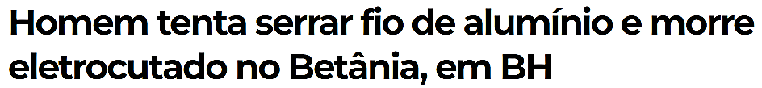
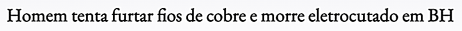

# Módulo 1 

**Gêneros textuais argumentativos**

\colorsec{Habilidades do SAEB}
- Identificar o uso de recursos persuasivos em textos verbais e não verbais.
- Identificar teses, opiniões, posicionamentos explícitos e argumentos em textos.

\colorsec{Habilidade da BNCC}
- EF89LP04.

Argumentar é convencer, persuadir o outro de que os argumentos usados
têm procedência lógica e podem ser comprovados.

Os gêneros textuais argumentativos têm o objetivo de apresentar e
defender um ponto de vista sobre um assunto por meio de argumentação e
recursos persuasivos que buscam a adesão do interlocutor. Duas características fundamentais dos textos argumentativos
são a emissão de juízo de valor e o emprego de argumentos e recursos
persuasivos para justificar o ponto de vista.

Entre esses gêneros, destacam-se o **artigo de opinião**, a **resenha crítica**, a **carta de leitor**, o **editorial** e o **anúncio publicitário**.

* O artigo de opinião tem o objetivo de opinar sobre um assunto relevante que esteja em evidência na sociedade. Seu público-alvo são os leitores de um jornal, revista ou portal de notícias. A linguagem pode ter tom mais impessoal (em 3ª pessoa) ou pessoal (em 1ª pessoa), e o nível de formalidade pode variar conforme o perfil do público.
* A resenha crítica tem o objetivo de apresentar um resumo comentado e opinativo sobre um filme, uma série, um livro ou outra obra, de modo a persuadir o leitor a consumir ou não aquela produção. Seu público-alvo são os fãs ou interessados em consumir o filme, a série, o livro ou outra obra. A linguagem pode ser coloquial e pode ter tom mais impessoal (em 3ª pessoa) ou pessoal (em 1ª pessoa); o nível de formalidade pode variar
* A carta de leitor tem o objetivo de expor ponto de vista acerca de determinado assunto publicado em um jornal ou uma revista. Seu público-alvo é o editor da revista ou do jornal, ou o autor da matéria jornalística que motivou a carta de leitor. A linguagem pode ter tom mais impessoal (1ª pessoa) ou pessoal (em 1ª pessoa).
* O editorial tem o objetivo de expor a opinião do jornal ou da revista sobre assuntos abordados nas notícias e reportagens publicados naquele veículo de informação. Seu público-alvo são os leitores daquele jornal ou revista. A linguagem, geralmente, tem tom impessoal (3ª pessoa), por representar a opinião da equipe jornalística, e não de uma pessoa.
* O anúncio publicitário tem o objetivo de vender um produto ou divulgar uma ideia. Seu público-alvo pode ser geral ou específico, dependendo do produto ou da ideia. A linguagem é variada e pode valer-se de texto verbal e texto não verbal.

\colorsec{Atividades}

\num{1} Numere a segunda coluna de acordo com a primeira considerando o
teor dos argumentos que você espera encontrar em cada gênero textual
argumentativo listado.

  I. Artigo de opinião      ( \coment{III} ) Qualidade dos personagens, do enredo, da narrativa, do desfecho, da trilha sonora etc.
    II. Anúncio publicitário   ( \coment{I} ) Dados e estatísticas, citação de especialista na área, exemplificação de fatos importantes e de repercussão etc.
  III. Resenha crítica        ( \coment{II} ) Imagem de personalidade famosa, pergunta provocativa, trocadilhos, apelo ao consumo etc.

\num{2} Associe as duas colunas de acordo com o tipo de argumento
exemplificado em cada parágrafo.

  I. Alusão histórica   ( \coment{IV} ) A internet é uma tecnologia que faz parte do cotidiano das pessoas e que protagoniza a cultura contemporânea. Ela é uma ferramenta que encurta distâncias e confere um caráter de acessibilidade universal à informação e aos mais diversos campos do conhecimento humano, sendo um dos principais agentes da globalização
 II. Exemplificação     ( \coment{III} ) Em primeiro lugar, deve-se ressaltar a ausência de medidas governamentais para combater a venda de dados pessoais e a manipulação do comportamento nas redes. Segundo o pensador Thomas Hobbes, o Estado é responsável por garantir o bem-estar da população, entretanto, isso não ocorre no Brasil.
  III. Autoridade         ( \coment{I} ) A utilização dos meios de comunicação para manipular comportamentos não é recente no Brasil: ainda em 1937, Getúlio Vargas apropriou-se da divulgação de uma falsa ameaça comunista para legitimar a implantação de um governo ditatorial.
  IV. Factual            ( \coment{II} ) Em consequência disso, os deficientes auditivos encontram inúmeras dificuldades em variados âmbitos de suas vidas. Um exemplo disso é a difícil inserção dos surdos no mercado de trabalho, devido à precária educação recebida por eles e ao preconceito intrínseco à sociedade brasileira.

\num{3} Você leu uma matéria num jornal e discordou do posicionamento do
jornalista ao abordar o tema. Você, então, decide interagir com o jornal
e com o público que o acompanha, emitindo sua opinião sobre o assunto
publicado naquela edição do jornal e questionando a abordagem do
redator. Marque o gênero textual que você deverá produzir para concluir
seu objetivo.

( ) Artigo de opinião

( ) Resenha crítica

( \coment{X} ) Carta de leitor

\num{4} Você foi convidado a escrever um texto opinativo sobre uma série
de televisão de sua preferência para o jornal da escola e fazer a
indicação dessa obra para os alunos como forma de enriquecer seu
conhecimento cultural. Assinale o gênero textual que você precisará
escrever para realizar essa tarefa.

( ) Artigo de opinião

( \coment{X} ) Resenha crítica

( ) Carta de leitor

\num{5} Escreva um texto opinativo sobre um livro, um filme ou uma série que você conheça para ser publicado no jornal da escola e faça a indicação da obra para os alunos. Procure apresentar argumentos plausíveis para convencê-los de que vale a pena conhecê-la.

\linhas{15}
\coment{A atividade se destina a colocar em prática a teoria básica estudada sobre o gênero argumentativo resenha crítica. Talvez esse gênero textual já tenha sido estudado mais a fundo e de forma sistematizada; entretanto, mais importante do que atender às exigências da teoria de construção composicional, conteúdo temático e estilo do gênero é o aluno entender que precisa convencer seu leitor com uma avaliação convincente da obra, por meio de argumentos que convençam o leitor a se interessar por conhecê-la.}

Leia o texto para resolver as atividades de 6 a 10.

%Paulo, inserir o anúncio disponível em: https://aguaslindasdegoias.go.gov.br/dia-mundial-da-agua/

\num{6} Esse cartaz é um texto argumentativo. Nele, os recursos persuasivos são construídos por meio da
associação entre texto verbal e texto não verbal. Cite o recurso não
verbal que foi utilizado para convencer o leitor a adotar o
comportamento explicitado no texto verbal.

\linhas{6}
\coment{O recurso persuasivo não verbal utilizado para se obter a adesão do leitor é a imagem de duas mãos que acolhem uma gota de água que cai, num gesto de proteção com esse recurso.}

\num{7} Qual é a ideia representada pela ilustração presente no cartaz?

\linhas{2}
\coment{A figura da torneira aberta representa a ideia de cuidado com a água.}

\num{8} De que modo as cores predominantes no cartaz relacionam-se com o tema central dele?

\linhas{6}
\coment{O predomínio de azul relaciona-se à água, o bem que está sendo celebrado no cartaz, assim como a outra cor predominante (verde) relaciona-se com o cuidado com o meio ambiente.}

\num{9} Qual é o sentido global que se constrói a partir da associação
entre o texto verbal e o texto não verbal do cartaz?

\linhas{6}
\coment{No cartaz, está ilustrada uma situação de cuidado e proteção com a água, o que se reflete na ideia de economia de água traduzida no texto verbal.}

\num{10} Justifique importância da publicação desse cartaz para a
conscientização da população.

\linhas{6}
\coment{Uma possibilidade de resposta é que
a publicação desse cartaz transmite a mensagem da preservação da água de
forma simples e corriqueira, pelo fato de usar frases pouco complexas e
ilustrações facilmente reconhecíveis pela população em geral.}

\colorsec{Treino}

Leia o texto para responder às questões 1 e 2.

>**A família Mandible - Lionel Shriver**

>Se você me acompanha, sabe que sou fascinada por distopias. Não perco a oportunidade de ler uma boa história desse gênero. Então, quando recebi o livro "A família Mandible" como a escolha de janeiro do Clube Intrínsecos, número 028, percebi que se tratava de uma sátira distópica. Minha curiosidade ficou imensa e eu mal podia esperar para devorar o livro assim que tivesse a chance. Fiquei ainda mais intrigada quando descobri que, em vez de abordar uma distopia futurista com invasões de zumbis ou alienígenas, o enredo tratava de um apocalipse financeiro que levou os Estados Unidos da América, uma das maiores potências mundiais, ao colapso. No entanto, será que, ao final da leitura, achei que toda essa curiosidade valeu a pena? Venha descobrir!

\fonte{Fonte de pesquisa: Evelyn Butgnoli. Viagem literária. A família Mandible - Lionel Shriver. Disponível em: _http://www.viagemliteraria.com.br/2021/03/a-familia-mandible-lionel-shriver.html_. Acesso em: 10 fev. 2023.

\num{1} Os gêneros textuais podem ser reconhecidos com base em determinadas
características que apresentam. Considerando-se as características do
texto lido, ele corresponde ao gênero

a) crônica, porque a resenhista faz uma narração do seu cotidiano
como leitora.

b) diário, porque a resenhista conta suas experiências literárias em
um dia específico.

c) resenha crítica, porque a resenhista apresenta sua avaliação
sobre um livro que leu.

d) anúncio publicitário, porque a resenhista elogia um livro para
convencer o leitor a comprá-lo.

SAEB: Identificar teses, opiniões, posicionamentos explícitos e
argumentos em textos.
BNCC: EF89LP04 -- Identificar e avaliar teses/opiniões/posicionamentos
explícitos e implícitos, argumentos e contra-argumentos em textos
argumentativos do campo (carta de leitor, comentário, artigo de opinião,
resenha crítica etc.), posicionando-se frente à questão controversa de
forma sustentada.

\(A\) Incorreta. O texto não é do gênero crônica, pois a situação
explicitada não está situada no tempo, embora o texto de fato expresse
uma experiência literária da resenhista.
\(B\) Incorreta. O texto não é do gênero diário, pois seu objetivo não é
falar sobre o cotidiano literário da resenhista nem sobre outro tipo de
situação cotidiana.
\(C\) Correta. O texto é do gênero resenha crítica porque apresenta a
avaliação e a opinião da resenhista sobre um livro que ela leu, para
indicar a leitura ao leitor.
\(D\) Incorreta. O texto não é do gênero anúncio publicitário, pois a
avaliação que a resenhista trará sobre o livro não tem o objetivo de
vendê-lo como mercadoria para o leitor, e sim dizer-lhe se deve
experimentar lê-lo ou não.

\num{2} A autora ressalta um diferencial do livro. Esse diferencial, segundo
ela, foi o que a convenceu a lê-lo e também pode interessar ao público. O
diferencial está descrito em:

a\) "Venha descobrir!"

b\) "Se você me acompanha, sabe que sou fascinada por distopias."

c\) "No entanto, será que, ao final da leitura, achei que toda essa curiosidade valeu a pena?"

d\) "em vez de abordar uma distopia futurista com invasões de zumbis ou alienígenas, o enredo tratava de um apocalipse financeiro".

SAEB: Identificar o uso de recursos persuasivos em textos verbais e não
verbais.
BNCC: EF89LP04 -- Identificar e avaliar teses/opiniões/posicionamentos
explícitos e implícitos, argumentos e contra-argumentos em textos
argumentativos do campo (carta de leitor, comentário, artigo de opinião,
resenha crítica etc.), posicionando-se frente à questão controversa de
forma sustentada.

\(A\) Incorreta. O trecho expressa um convite para que o leitor continue
acompanhando a resenha para saber se a autora gostou ou não do livro.
\(B\) Incorreta. O trecho expressa um gosto da resenhista por um gênero
literário específico e não se refere ainda ao livro em questão, que
nesse ponto da resenha não tinha sido citado.
\(C\) Incorreta. O trecho expressa uma hipótese ou dúvida que a
resenhista deixa em suspense, como forma de incentivar o leitor a
continuar lendo a resenha para saber a opinião dela sobre o livro.
\(D\) Correta. O trecho expressa o diferencial do livro em questão, pois
a resenhista diz que ele é diferente dos outros livros do gênero
distopia futurista por mostrar um apocalipse financeiro nos Estados
Unidos, em vez do mais comum, que é uma invasão zumbi ou alienígena, e
isso a deixa ainda mais instigada a lê-lo e pode também incentivar o
leitor.

\num{3} Leia o cartaz.

%Paulo, inserir o cartaz disponível em: https://cosmopolis.sp.gov.br/saude-inicia-a-campanha-nacional-de-vacinacao-contra-a-poliomielite/

A importância da figura sorridente do personagem Zé Gotinha deve-se ao fato de que

a) o personagem é o exemplo ruim de alguém que se vacina.
b) a intenção da campanha é motivar as crianças a se vacinarem.
c) a campanha pretende criar a ideia de que a vacina afasta a felicidade.
d) as doenças contra as quais se anuncia são leves e não causam grandes problemas.

SAEB: Identificar o uso de recursos persuasivos em textos verbais e não
verbais.
BNCC: EF89LP04 -- Identificar e avaliar teses/opiniões/posicionamentos
explícitos e implícitos, argumentos e contra-argumentos em textos
argumentativos do campo (carta de leitor, comentário, artigo de opinião,
resenha crítica etc.), posicionando-se frente à questão controversa de
forma sustentada.

a) Incorreta. O objetivo do personagem é justamente o de aproximar a vacinação das crianças.
b) Correta. A felicidade do personagem mostra como se vacinar é algo bom.
c) Incorreta. A ideia é justamente o contrário, já que a campanha serve para mostrar que a vacinação é algo bom.
d) Incorreta. As doenças são graves, e a vacinação é importante, mas a felicidade do personagem não diminui esses dados.

# Módulo 2 

 **Gêneros textuais informativos**
 
 \colorsec{Habilidades do SAEB}
 - Identificar elementos constitutivos de textos pertencentes ao domínio jornalístico/midiático.
- Identificar formas de organização de textos normativos, legais e/ou reinvindicatórios.
- Identificar elementos constitutivos de gêneros de divulgação científica.
- Analisar a relação temática entre diferentes gêneros jornalísticos.

\colorsec{Habilidades da BNCC}
- EF69LP02, EF69LP20, EF69LP27, EF08LP01.

Os gêneros textuais informativos têm o objetivo de informar sobre
determinado assunto, objeto ou fato. Por isso, são centrados na
informação a ser transmitida, sem juízo de valor por parte do autor,
prezando assim pela isenção e pela imparcialidade, diferentemente do que
ocorre nos gêneros argumentativos, que são opinativos. Entre os gêneros
informativos, destacam-se a **notícia**, a **reportagem**, o **artigo científico** e o **verbete**.

Por não conterem opinião ou pontos de vista do autor, não pretendem
também convencer o leitor ou ganhar sua adesão. Sendo assim, não há
margem para interpretações duplas; pelo contrário, a compreensão do
conteúdo pelo leitor é restrita aos limites do texto propriamente dito.

A linguagem nos gêneros textuais informativos é objetiva (impessoal, em
3ª pessoa), concisa (focada nas informações essenciais), denotativa
(literal) e clara (precisa), com predominância da norma-padrão.

Pode haver nos gêneros textuais informativos o uso de dados, estatísticas e citação para reforçar a veracidade da informação e garantir a credibilidade dela, já que se trata do domínio jornalístico e do científico, que têm seu rigor e compromisso próprios.

\colorsec{Atividades}

Para resolver as atividades de 1 a 4, leia uma manchete e o respectivo subtítulo a seguir.

>**Estudo confirma que o vírus da zika não é transmitido pela saliva**
>*Baixas quantidades virais, substâncias antimicrobianas naturais e textura viscosa dificultam a infecção do zika por meio de contato com a saliva, de acordo com o artigo.*

\fonte{G1. Estudo confirma que o vírus da zika não é transmitido pela saliva. Disponível em: _https://g1.globo.com/bemestar/zika-virus/noticia/estudo-confirma-que-o-virus-da-zika-nao-e-transmitido-pela-saliva.ghtml_. Acesso em: 16 maio 2023.}

\num{1} Apenas com base nessas informações, provavelmente você logo reconheceu o gênero
textual a que o texto pertence e deduziu o objetivo comunicativo dele.
Cite-os.

\linhas{4}
\coment{Trata-se de uma notícia, e o objetivo comunicativo é informar sobre uma descoberta científica que envolve o vírus da zika e sua transmissão.}

\num{2} Aponte e explique uma marca de impessoalidade e objetividade
presente nesse texto.

\linhas{6}
\coment{No texto, isso é feito por meio do uso da 3ª pessoa e da ausência de adjetivação valorativa.}

\num{3} Qual recurso é utilizado no texto para afastar a responsabilidade pelo que é dito?

\linhas{4}
\coment{Trata-se da citação de um estudo científico prévio que pesquisou e fez conclusões sobre o tema}

\num{4} Há mais de uma interpretação possível para o conteúdo desse
texto? Justifique sua resposta.

\linhas{6}
\coment{Não. Há apenas uma interpretação possível porque o texto privilegia o
sentido literal das palavras, dando ao leitor pouca possibilidade de
interpretação para além do sentido pretendido, já que as palavras são
empregadas em seu sentido original, dicionarizado.}

Para resolver as atividades 5 e 6, leia o texto a seguir.

>**Nova espécie de orangotango descoberta em pequena ilha**

>Cientistas da universidade suíça de Zurique que estão trabalhando em Sumatra, uma ilha na Indonésia, conseguiram confirmar que uma pequena população de orangotangos é, de fato, uma espécie nova e anteriormente desconhecida.

>A investigação teve início em 2013, quando os restos mortais de um orangotango macho revelaram que certas características dentárias e cranianas do primata eram distintas e exclusivas, conforme informado pela instituição acadêmica.

\fonte{Fonte de pesquisa: Vix. Mulher. Nova espécie de orangotango descoberta em pequena ilha: como são os tapanuli?. Disponível em: _https://www.mulher.com.br/atualidades/ciencia/nova-especie-de-orangotango-descoberta-em-pequena-ilha-como-sao-os-tapanuli_. Acesso em: 16 fev. 2023.

\num{5} Sobre o texto, responda às perguntas básicas de estruturação de uma notícia.

a) O fato. O que aconteceu?
\linhas{2}
\coment{Descoberta de uma nova espécie de orangotango}

b) O modo. De que forma aconteceu?
\linhas{2}
\coment{Pela análise das características dos dentes e do crânio de um orangotango macho morto.}

c) O local. Onde aconteceu?
\linhas{2}
\coment{Na pequena ilha de Sumatra.}

d) O tempo. Quando aconteceu?
\linhas{2}
\coment{Em 2013.}

e) Os participantes. Quem são as pessoas envolvidas?
\linhas{2}
\coment{Pesquisadores da universidade suíça de Zurique.}

\num{6} Assinale com um X as características que você identifica no
texto, de acordo com o gênero textual a que ele pertence.

( \coment{X} ) Objetividade (3ª pessoa).
( \coment{X} ) Impessoalidade.
( \coment{X} ) Citação de autoridade no assunto.
(   ) Parcialidade.
( \coment{X} ) Concisão (foco nas informações essenciais).
( \coment{X} ) Escrita em norma-padrão.
(   ) Prolixidade.
(   ) Sentido conotativo (figurado).
(   ) Escrita em norma não padrão.
( \coment{X} ) Imparcialidade.
( \coment{X} ) Sentido denotativo (literal).
(   ) Pessoalidade.
(   ) Subjetividade (1ª pessoa).

Para resolver as atividades de 7 a 10, leia o texto a seguir.

>**Plantas medicinais: uma abordagem sobre o uso seguro e racional**

>Diversas espécies vegetais possuem propriedades medicinais e servem como complementos terapêuticos no tratamento de doenças, trazendo benefícios consideráveis para a saúde quando utilizadas de forma racional e apropriada. No entanto, as plantas contêm uma ampla gama de compostos químicos, que podem ser benéficos, mas também acarretar potenciais riscos à saúde. Portanto, é crucial que os usuários, profissionais da área da saúde e prescritores possuam conhecimento sobre as plantas, incluindo sua identificação correta, conservação, métodos de preparo e uso, bem como os possíveis efeitos colaterais.

>Neste artigo, são abordadas as plantas medicinais, seus riscos e benefícios, levando em consideração as publicações científicas contemporâneas. Destaca-se a importância dos profissionais de saúde como educadores e promotores de saúde nas comunidades, especialmente aquelas que utilizam o Sistema Único de Saúde.

\fonte{Fonte de pesquisa: SCIELO. Plantas medicinais: uma abordagem sobre o uso seguro e racional. Disponível em:
_https://www.scielo.br/j/physis/a/kwsS5zBL84b5w9LrMrCjy5d/_. Acesso em: 18 fev. 2023.}

\num{7} O texto relaciona-se ao gênero artigo. Marque o subgênero a que ele se relaciona.

( \coment{X} ) Artigo científico.
(  ) Artigo de opinião.

\num{8} Qual elemento ou característica do texto determinou sua
resposta à questão anterior?

\linhas{6}
\coment{Uma possibilidade de resposta é a ausência de valoração e
juízo de valor no artigo científico e a centralidade no objetivo
comunicativo de informar.}

\num{9} O que o trecho "levando em consideração as publicações científicas contemporâneas"
revela sobre o conteúdo do texto? Explique.

\linhas{6}
\coment{O trecho é uma representação de autoridade no assunto em questão. Não há
citação explícita, mas fica claro que o conteúdo do artigo se apoiará em
comprovações científicas prévias que já abordaram o assunto. Ou seja,
parte do conteúdo do artigo já foi dita ou afirmada por outrem.}

\num{10} Em sua opinião, esse artigo é voltado para leitores comuns ou
para leitores específicos? Justifique sua resposta e cite o público-alvo.

\linhas{6}
\coment{O texto exige certo conhecimento prévio sobre plantas medicinais e a área de saúde. Além disso, o assunto traz um recorte bastante específico que, por outro motivo que não o de estudo, não interessaria ao grande público, isto é, ao leitor comum. Portanto, podemos dizer que seu público-alvo é específico, restringindo-se, por exemplo, aos
profissionais da saúde e a outros interessados em plantas medicinais.}

\colorsec{Treino}

\num{1} Leia o texto.

>**Defesa Civil alerta para chuvas intensas em SP no carnaval**

>O carnaval em São Paulo terá chuvas intensas, segundo alerta da Defesa Civil Estadual. A previsão meteorológica é que o volume alcance de 80 milímetros a 250 milímetros \[...]. O litoral norte do estado deve ser o mais impactado. A Baixada Santista, Serra da Mantiqueira, Vale do Ribeira e Itapeva podem ter até 150 milímetros de chuvas. Com o solo já encharcado, há risco de deslizamentos em regiões de encosta.

>A chegada de uma frente fria \[...] deixa o tempo instável e cria condições para chuvas intensas, com momentos de temporais na faixa leste do estado. A previsão é que também ocorram raios, vento e granizo. A temperatura ficará mais amena \[...].

>Para quem mora em São José dos Campos, Barretos e Franca, o total de chuvas pode alcançar a 100 milímetros. Na capital e região metropolitana, Campinas, Sorocaba, Ribeirão Preto e Araraquara, o volume total de precipitações é de até 80 milímetros.

>\[...]

\fonte{Agência Brasil. Defesa Civil alerta para chuvas intensas em SP no carnaval. Disponível em:
_https://agenciabrasil.ebc.com.br/geral/noticia/2023-02/defesa-civil-alerta-para-chuvas-intensas-no-carnaval-em-sao-paulo_. Acesso em: 17 fev. 2023.

A finalidade desse texto é

a\) opinar.

b\) alertar.

c\) ensinar.

d\) informar.

SAEB: Identificar elementos constitutivos de textos pertencentes ao
domínio jornalístico/midiático.
BNCC: EF08LP01 -- Identificar e comparar as várias editorias de jornais impressos e digitais e de sites noticiosos, de forma a refletir sobre os tipos de fato que são noticiados e comentados, as escolhas sobre o que noticiar e o que não noticiar e o destaque/enfoque dado e a fidedignidade da informação.

\(A\) Incorreta. O gênero textual é notícia e, assim, não se encontram
no texto marcas de valoração ou pontos de vista.
\(B\) Incorreta. Embora o texto possa gerar a sensação de alerta na
população, por antecipar grande volume de chuva, a finalidade
comunicativa primária de uma notícia não é alertar.
\(C\) Incorreta. O gênero notícia não tem como característica o
didatismo, nem se encontram no texto marcas de instrução ao leitor.
\(D\) Correta. O gênero notícia tem a finalidade de informar o leitor
sobre acontecimentos passados e futuros relevantes para a sociedade.

\num{2} Leia o texto.

>**Retrospectiva 2022: confira as principais notícias de janeiro**

>\[...]
>
A nova variante Ômicron do novo coronavírus fez com que o mundo
mergulhasse em uma nova onda da doença no começo de 2022. Já nos
primeiros dias do ano, 4 mil voos foram cancelados no mundo. No dia 19,
a Organização Pan-Americana de Saúde (Opas) afirmou que o vírus se
espalhava "como nunca antes" nas Américas. No mesmo dia, a Fundação
Oswaldo Cruz (Fiocruz) revelou que o aumento do número de casos no
Brasil era seis vezes acima do observado no início de dezembro de 2021. \[...]

\fonte{Agência Brasil. Retrospectiva 2022: confira as principais notícias de janeiro. Disponível em:
_https://agenciabrasil.ebc.com.br/geral/noticia/2022-09/retrospectiva-2022-confira-principais-noticias-de-janeiro_. Acesso em: 13 fev. 2023.}

Considerando-se a relevância do assunto e as características do texto,
as aspas em "como nunca antes" foram usadas para

a\) destacar a frase para chamar a atenção do leitor.

b\) citar os dados que comprovam a verdade da notícia.

c\) informar que o vírus se espalha de uma maneira nova.

d\) atribuir a frase a um terceiro com maior credibilidade.

SAEB: Analisar efeitos de sentido produzido pelo uso de formas de
apropriação textual (paráfrase, citação etc.).
BNCC: EF08LP01 -- Identificar e comparar as várias editorias de jornais
impressos e digitais e de *sites* noticiosos, de forma a refletir sobre
os tipos de fato que são noticiados e comentados, as escolhas sobre o
que noticiar e o que não noticiar e o destaque/enfoque dado e a fidedignidade da informação.

\(A\) Incorreta. Outros tipos de destaque poderiam ser usados para
chamar a atenção do leitor, tais como negrito, itálico, sublinhado, os
quais não carregariam, entretanto, o mesmo valor do uso das aspas nesse
texto.
\(B\) Incorreta. O trecho entre aspas não traz dados no sentido estrito;
trata-se apenas de parte de um texto maior da Organização Pan-Americana
de Saúde, ao qual o leitor não tem acesso na notícia em questão.
\(C\) Incorreta. Do ponto de vista semântico, o trecho entre aspas
realmente significa que o vírus se espalha de uma maneira nova,
diferentemente do modo até então conhecido. Porém, as aspas não foram usadas
simplesmente para informar isso. Seu valor é externo ao texto, pois está
relacionado aos princípios de isenção e objetividade do jornalismo.
\(D\) Correta. O texto jornalístico, em geral, preza pela objetividade e
pela isenção. Uma das formas de atender a esses requisitos é citar entre
aspas as palavras de outrem. No texto em questão, as aspas foram usadas para evitar assumir a responsabilidade por uma afirmação categórica feita, na
realidade, por uma instituição que tem legitimidade para tal (a
Organização Pan-Americana de Saúde). Isso significa que tal instituição
tem maior credibilidade, de modo que as aspas servem, ao mesmo tempo,
para comprovar que a notícia veicula informações reais já confirmadas
por instituição competente.

\num{3} Leia o texto.

>**Uma soneca por todo o inverno**
>
>Se alguém comentar: "Você dorme como um urso!", saiba que está dormindo excessivamente. Afinal, os ursos têm a capacidade de dormir por períodos extremamente longos. Na realidade, eles hibernam, ficando meses sem acordar para comer, beber água ou se higienizar. Mas como os ursos e outros animais conseguem fazer isso?
>
>A natureza parece encontrar soluções para tudo. No inverno, os recursos naturais diminuem. Basta observar as árvores, por exemplo, e perceber que há menos folhas e menos frutas disponíveis. Nesse contexto, para alguns animais, é mais vantajoso "dormir" durante esse período de escassez alimentar.
>
>É claro que dormir por um período tão prolongado requer algum tipo de preparação. Nas estações que antecedem o inverno, os animais que hibernam se preparam comendo em grande quantidade. Dessa forma, eles acumulam reservas de energia na forma de gordura corporal. E, quando o inverno chega, eles estão prontos para passar longos e frios meses em suas tocas, até a chegada da primavera.

\fonte{Fonte de pesquisa: Ciência Hoje das Crianças. Uma soneca por todo o inverno. Disponível em: _https://chc.org.br/artigo/uma-soneca-por-todo-o-inverno/_. Acesso em: 13 fev. 2023.}

A linguagem não habitual empregada nesse texto contribui para alcançar o
objetivo de

a\) informar aos estudiosos da ciência as descobertas recentes dos
cientistas sobre a vida selvagem.

b\) ensinar aos biólogos especialistas o comportamento dos animais para
sobreviverem na natureza selvagem.

c\) popularizar para o leitor comum conhecimentos científicos,
explicando com linguagem cotidiana a hibernação de alguns animais
selvagens.

d\) divulgar para a população os ditados populares inspirados no
comportamento dos animais, como, por exemplo, o dito popular "você dorme como um urso".

SAEB: Identificar elementos constitutivos de gêneros de divulgação
científica.

\(A\) Incorreta. O texto não é construído com linguagem técnica e, por
isso, seu público-alvo não são estudiosos nem pessoas com grande
conhecimento científico.

\(B\) Incorreta. O texto não é construído com linguagem técnica e, por
isso, seu público-alvo não são biólogos, que, para aprenderem conteúdos
de sua área, provavelmente procurarão textos científicos especializados,
normalmente divulgados em forma de artigos científicos, teses,
dissertações.

\(C\) Correta. O texto tem um tom bastante informal e utiliza
vocabulário e linguagem simples e cotidianos, sem perder seu caráter
científico, pois seu objetivo é fazer divulgação científica correta para
o grande público não especializado.

\(D\) Incorreta. Não é o objetivo do texto divulgar o ditado popular, que
nesse caso serve apenas para ativar um conhecimento prévio e corriqueiro
do leitor, de modo a estabelecer com ele uma interação e ganhar sua
atenção. Isso se confirma ainda pelo fato de apenas na introdução o
texto citar o ditado e não mais abordar o assunto.

# Módulo 3 

 **Gêneros literários**
 
 \colorsec{Habilidades do SAEB}
 - Analisar elementos constitutivos de textos pertencentes ao domínio literário.
- Analisar a intertextualidade entre textos literários ou entre estes e outros textos verbais ou não verbais.
- Inferir a presença de valores sociais, culturais e humanos em textos literários.

\colorsec{Habilidades da BNCC}
- EF69LP44, EF69LP47, EF89LP32.

Os gêneros literários são categorias usadas para classificar os textos
dos diversos gêneros textuais existentes na literatura de acordo com
suas características em comum. Essas categorias são: gênero narrativo ou
épico, gênero lírico e gênero dramático. Dessa forma, qualquer texto
literário pode ser classificado como narrativo, lírico ou dramático com
base em suas características.

+----------------------+----------------------+----------------------+
| **Gênero literário** | **Características**  | **Exemplos**       |
+======================+======================+======================+
| Narrativo ou épico   | Conta uma história   | Conto, novela,       |
|                      | estruturada com os   | romance, fábula,     |
|                      | seguintes elementos: | crônica, conto de    |
|                      |                      | fadas, lenda, poema  | 
|                      |                      | narrativo.           |
|                      | -   Enredo (situação |                      |
|                      |     > inicial ou     |                      |
|                      |     > introdução,    |                      |
|                      |     > conflito,      |                      |
|                      |     > clímax e       |                      |
|                      |     > desfecho);     |                      |
|                      |                      |                      |
|                      | -   Personagens;     |                      |
|                      |                      |                      |
|                      | -   Narrador;        |                      |
|                      |                      |                      |
|                      | -   Tempo;           |                      |
|                      |                      |                      |
|                      | -   Espaço.          |                      |
+----------------------+----------------------+----------------------+
| Lírico               | Expressa emoções,    | Poema, letra de      |
|                      | sentimentos, desejos | música, hino,        |
|                      | e ideias subjetivas  | soneto, sátira.      |
|                      | do eu lírico (voz    |                      |
|                      | que fala no poema).  |                      |
|                      |                      |                      |
|                      | É geralmente escrito |                      |
|                      | em versos e          |                      |
|                      | estrofes, com        |                      |
|                      | abundância de        |                      |
|                      | linguagem conotativa |                      |
|                      | (figurada) e figuras |                      |
|                      | de linguagem.        |                      |
|                      |                      |                      |
|                      | Usa linguagem        |                      |
|                      | expressiva,          |                      |
|                      | valendo-se, para     |                      |
|                      | isso, de             |                      |
|                      | musicalidade, ritmo  |                      |
|                      | e rimas, sempre com  |                      |
|                      | finalidade estética. |                      |
+----------------------+----------------------+----------------------+
| Dramático            | É escrito para ser   | Peça de teatro,      |
|                      | encenado por atores  | auto, comédia,       |
|                      | em um palco.         | tragicomédia.        |
|                      |                      |                      |
|                      | O texto tem a        |                      |
|                      | seguinte estrutura:  |                      |
|                      |                      |                      |
|                      | -   Atos (partes da  |                      |
|                      |     > peça; ex.: 1º  |                      |
|                      |     > ato, 2º ato    |                      |
|                      |     > etc.);         |                      |
|                      |                      |                      |
|                      | -   Cenas (conteúdo  |                      |
|                      |     > de cada ato);  |                      |
|                      |                      |                      |
|                      | -   Rubrica          |                      |
|                      |     > (instrução de  |                      |
|                      |     > como a cena ou |                      |
|                      |     > fala devem ser |                      |
|                      |     > interpretadas  |                      |
|                      |     > pelo ator);    |                      |
|                      |                      |                      |
|                      | -   Falas dos        |                      |
|                      |     > personagens.   |                      |
+----------------------+----------------------+----------------------+

\colorsec{Atividades}

Para resolver as atividades de 1 a 3, leia o poema a seguir.

>**Presságio**

>O amor, quando se revela,

>Não se sabe revelar.

>Sabe bem olhar p'ra ela,

>Mas não lhe sabe falar.

>Quem quer dizer o que sente

>Não sabe o que há de dizer.

>Fala: parece que mente...

>Cala: parece esquecer...

>Ah, mas se ela adivinhasse,

>Se pudesse ouvir o olhar,

>E se um olhar lhe bastasse

>P'ra saber que a estão a amar!

>Mas quem sente muito, cala;

>Quem quer dizer quanto sente

>Fica sem alma nem fala,

>Fica só, inteiramente!

>Mas se isto puder contar-lhe

>O que não lhe ouso contar,

>Já não terei que falar-lhe

>Porque lhe estou a falar...

\fonte{Fernando Pessoa. Disponível em:
_https://campusvirtual.fiocruz.br/portal/?q=palavra-chave-de-documentos/fernando-pessoa_. Acesso em: 12 mar. 2023.}

\num{1} O poema "Presságio" versa sobre um sentimento humano, o amor.
Esse amor é vivido na prática pelo eu lírico? Explique e justifique.

\linhas{10}
\coment{O poema de Fernando Pessoa retrata um amor platônico. Ao longo do texto,
o eu lírico sofre com esse amor que sente, mas não pela falta de
reciprocidade, e sim pela falta de coragem de se abrir com a pessoa
amada. Sendo assim, o amor entre eles nunca chega a acontecer na
realidade, justamente porque o eu lírico, em certos versos, parece
preferir o anonimato a correr o risco de não ser correspondido.}

\num{2} Aponte outros sentimentos secundários que, como consequência do
amor, parecem acometer o eu lírico em relação à pessoa amada.

\linhas{6}
\coment{O receio de se de declarar, o medo de não ser correspondido, a
dúvida entre falar ou calar-se, o lamento por seu amor não ser descoberto de outro modo senão pelas palavras e a impotência por não conseguir expressar seu sentimento para a pessoa amada.}

\num{3} Assumindo não saber como expressar seu amor com palavras, qual
outra forma de expressão o eu lírico gostaria que a pessoa amada
compreendesse? Comprove sua resposta com um trecho do poema.

\linhas{6}
\coment{O eu lírico, na terceira estrofe, deseja que a pessoa amada pudesse compreender seu amor por ela apenas pelo olhar. O trecho que comprova isso é "Se pudesse ouvir o olhar, / E se um olhar lhe bastasse / P'ra saber que a estão a amar!"}

Para resolver as atividades de 4 a 7, leia o texto a seguir.

>**O homem e a cobra**
>
Durante um frio inverno e debaixo de forte chuva, andava uma cobra,
fraca e encolhida. Um homem de piedade a recolheu, agasalhou e alimentou
enquanto houve frio. Chegado o verão, a cobra começou a estender-se e,
então, o homem disse-lhe que deveria seguir o caminho dela, mas a cobra,
relutante, levantou o pescoço para o morder. O homem, por isso, lançou
mão de um pau e investiu contra a cobra. Após uma longa luta, a cobra
restou morta e o homem muito mordido.

\fonte{Joseph Shafan. *As fábulas de Esopo*. Disponível em:
_http://www.dominiopublico.gov.br/download/texto/ea000378.pdf_. Acesso em: 26 fev. 2023.}

\num{4} A qual dos gêneros literários (narrativo, lírico ou dramático)
pertence o texto? Justifique sua resposta, mencionando características do texto.

\linhas{4}
\coment{O texto é do gênero literário narrativo, pois conta uma história estruturada com elementos da narrativa (narrador, personagens, enredo, tempo).}

\num{5} Dentro do gênero literário que você indicou na questão anterior,
a qual gênero textual o texto pertence? Justifique sua resposta com uma
característica do texto.

\linhas{4}
\coment{Trata-se de um fábula, texto curto que animais como personagens humanizados e uma lição moral, que pode estar explícita ou implícita.}

\num{6} Com base no texto, numere a segunda coluna de acordo com a primeira.

  I. Situação inicial.   ( \coment{II} ) Chegado o verão, a cobra começou a estender-se e, então, o homem disse-lhe que deveria seguir o caminho dela, mas a cobra, relutante, levantou o pescoço para o morder.
  II. Conflito.           ( \coment{IV} )   Após uma longa luta, a cobra restou morta e o homem muito mordido.
  III. Clímax.             ( \coment{I} ) Durante um frio inverno e debaixo de forte chuva, andava uma cobra, fraca e encolhida. Um homem de piedade a recolheu, agasalhou e alimentou enquanto houve frio.
  IV. Desfecho.           ( \coment{III} ) O homem, por isso, lançou mão de um pau e investiu contra a cobra.

\num{7} Um elemento característico do gênero textual apresentado na
questão anterior é a moral (ou ensinamento) ao fim do texto. No
texto lido, ela está implícita. Explicite a lição moral que você
apreendeu desse texto. Explique.

\linhas{6}
\coment{Resposta pessoal.

\num{8} Associe as duas colunas conforme o gênero literário ao qual
pertence o texto.

I. Gênero épico.
II. Gênero dramático.
III. Gênero lírico.

( \coment{III} ) **Vai alta no céu a lua da Primavera** (Fernando Pessoa)
>
Vai alta no céu a lua da Primavera
>
Penso em ti e dentro de mim estou completo.

>
Corre pelos vagos campos até mim uma brisa ligeira.
>
Penso em ti, murmuro o teu nome; e não sou eu: sou feliz.

>
Amanhã virás, andarás comigo a colher flores pelo campo,
>
E eu andarei contigo pelos campos ver-te colher flores.
>
Eu já te vejo amanhã a colher flores comigo pelos campos,
>
Pois quando vieres amanhã e andares comigo no campo a colher flores,
>
Isso será uma alegria e uma verdade para mim.

( \coment{I} ) **A divina comédia** (Dante Alighieri)
>
No meio do caminho de nossa vida,
>
Encontrei-me em uma selva escura,
>
Pois o caminho certo havia se perdido.

>
Ah, como é difícil dizer o quão selvagem
>
E amarga é essa floresta,
>
Que renova o medo em minha mente!

>
Tão amarga que se assemelha à morte,
>
Mas para falar sobre o bem que encontrei lá,
>
Falarei também sobre outras coisas que observei.

( \coment{II} ) **O auto da Compadecida** (Ariano Suassuna)
>
JOÃO GRILO, ajoelhando-se, em tom lamentoso: Lembra-te de Nosso Senhor Jesus Cristo. Chicó. Chicó, Jesus vai contigo e tu vais com Jesus. Lembra-te de Nosso Senhor Jesus Cristo, Chicó.
CHICÓ: Que latomia é essa para o meu lado? Você quer me agourar?
JOÃO GRILO, erguendo-se: Ah, e você está vivo?
CHICÓ: Estou, que é que você está pensando? Não é besta não?
JOÃO GRILO: Você disse que hora de chamar padre era a hora da morte, começou a gritar por Padre João, eu só podia pensar que estava lhe dando a agonia.
CHICÓ, depois de estender-lhe o punho fechado: Padre João!

\num{9} Descreva as características composicionais que você identificou
em cada texto da atividade anterior para indicar seu gênero literário.

\linhas{8}
\coment{O poema de Fernando Pessoa expressa emoções subjetivas do eu lírico. O trecho de *A divina comédia* apresenta sequência narrativa escrita em versos. O texto de Ariano Suassuna apresenta os nomes dos personagens destacados de suas falas, com instruções do movimento que os atores deverão fazer ao encenar.

\num{10} Qual é a voz que fala no texto *A divina comédia*, apresentado na
atividade 8? Justifique sua resposta.

\linhas{4}
\coment{A voz que fala no texto é a do narrador, pois ele apresenta o espaço e o
tempo da narrativa. Trata-se de um poema épico.}

\colorsec{Treino}

Leia o texto a seguir e responda às questões 1 e 2.

>**Caramelo**
>
No café
>
A xícara de expresso esfriava
>
Nessas raras tardes elegantes
>
Do Rio de Janeiro
>
Quando não estamos
>
Ensopados de suor
>
Uma brisa fria do mar

>
Fazia o vapor desvanecer
>
Minha boca adocicada
>
Pelo *petit four*
>
Aguardava com ânsia
>
Um caramelo

>
Quando esse caramelo
>
Adoçou minha boca
>
Os prazeres do café
>
E do *petit four*
>
Foram subestimados

>
Um caramelo viçoso
>
Encolhe-se ao vento frio
>
E pede abrigo
>
Em minha boca

>\[...]

\fonte{Nelson Lima. *Poetas devem jogar poemas no lixo*. Disponível em:
_http://dominiopublico.mec.gov.br/download/texto/ea000321.pdf_. Acesso em:
23 mar. 2023.}

\num{1} O recurso empregado na descrição da experiência vivida na cena do poema
é o apelo

a\) moral, refletindo valores.

b\) sensorial, refletindo o deleite.

c\) crítico, refletindo uma opinião.

d\) humorístico, refletindo um estado de espírito.

SAEB: Analisar elementos constitutivos de textos pertencentes ao domínio
literário.
BNCC: EF69LP44 -- Inferir a presença de valores sociais, culturais e humanos e de diferentes visões de mundo, em textos literários, reconhecendo nesses textos formas de estabelecer múltiplos olhares sobre as identidades, sociedades e culturas e considerando a autoria e o contexto social e histórico de sua produção.

\(A\) Incorreta. O apelo moral não está presente no poema.

\(B\) Correta. O apelo sensorial está presente no poema por meio de
referências à sensação térmica no Rio de Janeiro, à temperatura e à degustação do café, ao paladar ("boca adocicada"), ao sabor doce do caramelo e à própria boca.

\(C\) Incorreta. O apelo crítico não está presente no poema.

\(D\) Incorreta. O apelo humorístico não está presente no poema.

\num{2} Que visão de mundo já abordada por diferentes filósofos está implícita
no poema?

a\) A verdadeira felicidade está nas coisas mais simples da vida.

b\) A felicidade de sua vida depende da qualidade de seus pensamentos.

c\) A felicidade do corpo consiste na saúde, e a do espírito, na
sabedoria.

d\) Felicidade é como uma borboleta: quanto mais se tenta apanhá-la,
mais ela se afasta de você.

SAEB: Analisar a intertextualidade entre textos literários ou entre
estes e outros textos verbais ou não verbais.
BNCC: EF89LP32 -- Analisar os efeitos de sentido decorrentes do uso de mecanismos de
intertextualidade (referências, alusões, retomadas) entre os textos literários, entre esses textos literários e outras manifestações artísticas (cinema, teatro, artes visuais e midiáticas, música), quanto aos temas, personagens, estilos, autores etc., e entre o texto original e paródias, paráfrases, pastiches, trailer honesto, vídeos-minuto, vidding, dentre outros.

\(A\) Correta. O eu lírico exalta o momento em que toma café expresso
com caramelo em uma tarde do Rio de Janeiro, a qual ele considera rara, que, por isso mesmo, se torna um momento de degustação e deleite. Isso comprova que o eu lírico valoriza coisas simples como um singelo café com caramelo.

\(B\) Incorreta. O poema descreve as sensações de um momento específico,
e não pensamentos.

\(C\) Incorreta. O poema descreve as sensações de um momento específico,
e não a saúde ou a sabedoria.

\(D\) Incorreta. O poema descreve as sensações de um momento específico,
e não a busca da felicidade.

\num{3} Leia o texto.

>**Smita**

>Smita acorda com uma estranha sensação, uma suave urgência, um inédito
frio na barriga. Hoje é um dia que ela irá lembrar para o resto da vida.
Hoje, sua filha vai entrar para a escola.

>Na escola, Smita nunca pôs os pés. Aqui, em Badlapur, gente como ela não
vai à escola. Smita é uma *dalit*. Uma intocável. Desses que Ghandi
chamava de filhos de Deus. Fora das castas, fora do sistema, fora de
tudo. Uma espécie à parte, julgada impura demais para se misturar com as
outras, uma ralé indigna da qual as pessoas cuidadosamente se afastam,
como separar o joio do trigo. Como Smita, eles são milhões a viver fora
das aldeias, da sociedade, na periferia da humanidade.

\fonte{Laetitia Colombani. *A trança*. São Paulo: Intrínseca, 2021.}

A narrativa retrata uma sociedade que discrimina a personagem devido a

a\) sua origem social, sendo considerada indigna dos bens sociais.

b\) seu estado civil, sendo considerada impura por ser mãe solteira.

c\) seu gênero, sendo proibida de frequentar a escola por ser mulher.

d\) sua religião, sendo considerada herege por servir a outros deuses.

SAEB: Inferir a presença de valores sociais, culturais e humanos em
textos literários.
BNCC: EF69LP44 -- Inferir a presença de valores sociais, culturais e humanos e de diferentes visões de mundo, em textos literários, reconhecendo nesses textos formas de estabelecer múltiplos olhares sobre as identidades, sociedades e culturas e considerando a autoria e o contexto social e histórico de sua produção.

\(A\) Correta. A personagem é discriminada por sua origem social, pois ela
é uma *dalit*, um grupo social excluído da sociedade indiana o qual não
participa sequer do sistema de castas, conforme diz a narrativa.

\(B\) Incorreta. A personagem é discriminada por ser uma *dalit,* um
grupo social excluído da sociedade na Índia. O fato de ela ter uma filha
não é mencionado como causa da discriminação sofrida, mesmo porque não é
possível, no trecho, saber se é mãe solo.

\(C\) Incorreta. O gênero da personagem, inicialmente, parece ter
relação com a proibição de ir à escola, mas a narrativa logo esclarece
que todo o grupo social dos *dalits*, do qual ela faz parte, vive à
margem da sociedade.

\(D\) Incorreta. O texto cita uma fala de Gandhi sobre os *dalits* serem
filhos de Deus, mas isso não é mencionado com o objetivo de situá-los em
alguma religião. O texto não cita a religião desse grupo social.

# Módulo 4 

 **As diferentes vozes de um texto**
 
 \colorsec{Habilidades da BNCC}
 - Analisar efeitos de sentido produzido pelo uso de formas de apropriação textual (paráfrase, citação etc.).
- Analisar os efeitos de sentido decorrentes dos mecanismos de construção de textos jornalísticos/midiáticos.

\colorsec{Habilidades da BNCC}
- EF69LP16, EF69LP43, EF89LP05.

Todo texto traz a voz do autor que o escreveu, mas também as vozes de
terceiros que o autor mobiliza para confirmar, reforçar, corroborar,
refutar as ideias e informações que apresenta em seu texto. Essas outras
vozes podem revelar visões de mundo, ideologias, concepções, argumentos,
dizeres, pontos de vista.

As diferentes vozes presentes em um texto podem ser marcadas de forma
explícita, quando são identificáveis na superfície do texto, ou de forma
implícita, quando não podem ser imediatamente identificadas. Dois
procedimentos linguísticos bem comuns para demarcar a presença explícita
de diferentes vozes num texto são a citação (discurso direto) e a
paráfrase (discurso indireto), muito comuns em textos de divulgação
científica. Outro procedimento menos explícito é o uso, por exemplo, do
futuro do pretérito, muito comum em textos jornalísticos.

Essas e outras operações textuais provocam efeitos de sentido. Em textos
de divulgação científica, por exemplo, a citação serve como argumento de
autoridade, isto é, o autor recorre a uma voz externa que transmite uma
verdade científica que valida, por exemplo, um conceito. Já em textos
jornalísticos, o futuro do pretérito tem o objetivo de atribuir a um
terceiro o conteúdo do que se diz, afastando a responsabilidade do
veículo de informação por aquele dizer. No jornalismo, esse recurso pode
também ter o objetivo de manter um dizer no campo hipotético. Por sua
vez, os artigos de opinião e os textos publicitários podem recorrer a
frases de efeito que expressem o sentido de consenso para convencer o
leitor.

Imaginemos, por exemplo, a frase "As crianças são o futuro da
nação" em um texto de propaganda política em que o objetivo seja convencer
o eleitor. Vejamos, no quadro a seguir, alguns exemplos dos procedimentos
linguísticos que demarcam as vozes presentes em um texto.

+----------------------------------+----------------------------------+
| **Mecanismo de introdução de     | **Exemplo**                      |
| voz**                            |                                  |
+==================================+==================================+
| Discurso direto                  | Para o presidente, a internet    |
|                                  | trouxe "resultados               |
|                                  | extraordinários para a economia  |
|                                  | global e para as sociedades".    |
+----------------------------------+----------------------------------+
| Discurso indireto (paráfrase)    | O presidente afirma que as plataformas   |
|                                  | digitais definiram a maneira     |
|                                  | como as pessoas se comunicam, se |
|                                  | relacionam e como consomem       |
|                                  | produtos e serviços.             |
+----------------------------------+----------------------------------+
| Outros marcadores de discurso    | De acordo com a prefeitura, os   |
| indireto: "segundo", "de acordo  | turistas gastaram 17 vezes mais  |
| com", "para"                     | que os residentes da capital     |
|                                  | paulista durante o Carnaval      |
|                                  | de 2023.                         |
+----------------------------------+----------------------------------+
| Futuro do pretérito              | Ossos encontrados em sítio       |
|                                  | arqueológico brasileiro seriam   |
|                                  | de um homem pré-histórico.       |
+----------------------------------+----------------------------------+

\colorsec{Atividades}

Leia o texto a seguir para resolver as atividades de 1 a 7.

>**Bora Votar! Conheça a nova campanha para o eleitorado jovem**

>Se você faz 16 anos antes das próximas eleições, tire seu título eleitoral na internet e “Bora Votar!”. A nova campanha nacional criada pela Secretaria de Comunicação do Tribunal Superior Eleitoral (TSE) com foco no eleitorado jovem estreia nesta segunda-feira (13) nas emissoras de televisão e rádio de todo o país.

>\[...]

>Com o conceito “Bora Votar. Eu vou porque eu posso”, a campanha incentiva o alistamento eleitoral e o voto consciente dos jovens de 16 e 17 anos, que, mesmo não sendo obrigados a votar, podem participar do processo eleitoral e escolher seus representantes nos Poderes Executivo e Legislativo.

>O objetivo da ação é estimular o interesse dessa faixa etária em participar da vida política e conscientizá-los sobre o potencial que o voto tem de mudar a realidade do país. A campanha transmite a mensagem de que o Brasil pertence a toda a população brasileira e que os jovens podem fazer a diferença por meio do voto.

>A campanha destaca que votar é um exercício de cidadania que fortalece a democracia. Segundo a iniciativa do TSE, ao votar, a cidadã e o cidadão podem ajudar a mudar o futuro da cidade, do estado, do país. “Portanto, não permita que outras pessoas decidam por você. Por isso, vote porque você pode, vote porque você quer, vote porque você se importa. Não deixe de emitir sua opinião”, alerta a ação.

>O vídeo da campanha foi protagonizado por jovens atrizes e atores negros, pardos, indígenas e brancos, retratados em situações cotidianas, indo ao encontro de um dos objetivos da Justiça Eleitoral em suas ações de comunicação: representar a diversidade da população brasileira.

>\[...]

\fonte{Tribunal Superior Eleitoral. Bora Votar! Conheça a nova campanha para o eleitorado jovem. Disponível em: _https://www.tse.jus.br/comunicacao/noticias/2021/Setembro/bora-votar-conheca-a-nova-campanha-para-o-eleitorado-jovem_. Acesso em: 17 maio 2023.}

\num{1} Quem é o autor do texto e por que essa autoria é relevante ao se considerar o teor do texto?

\linhas{4}
\coment{O texto foi escrito e publicado pelo TSE (Tribubal Superior Eleitoral), o que é relevante porque o assunto do texto é justamente o incentivo a novos eleitores.}

\num{2} A campanha mencionada é destinada a qualquer pessoa ou a um público específico?

\linhas{2}
\coment{A campanha é destinada a um público específico.}

\num{3} Aponte quem é o provável público-alvo da campanha.

\linhas{4}
\coment{O público-alvo são jovens em geral e jovens cuja idade ainda não obriga
ao voto, mas que já podem votar e ainda não fizeram seu título de
eleitor.}

\num{4} Aponte a finalidade comunicativa da campanha mencionada.

\linhas{4}
\coment{A finalidade comunicativa é convidar os jovens para fazerem seu título de
eleitor e incentivá-los a exercer seu direito de voto.}

\num{5} A voz evocada pelo conceito da campanha é condizente com o
público-alvo e a finalidade comunicativa? Justifique sua resposta.

\linhas{6}
\coment{Essa voz é condizente com os dois fatores, público e finalidade
comunicativa, pois retratam um jovem dialogando com seus pares por meio
de linguagem típica da idade.}

\num{6} Releia o trecho destacado a seguir.

>“Portanto, não permita que outras pessoas decidam por você. Por isso, vote porque você pode, vote porque você quer, vote porque você se importa. Não deixe de emitir sua opinião”, alerta a ação.

Como você caracteriza o tom dessa mensagem em relação à campanha como um todo?

\linhas{6}
\coment{Ao contrário do conceito da campanha, que é mais informal e mais ligado à fala dos jovens, essa mensagem é mais formal e mais séria, justamente porque o assunto da camapanha merece muita atenção e desperta muita relevância.}

\num{7} Se a voz predominante for a da mensagem analisada na atividade anterior,
considerando-se a seriedade que normalmente se espera do autor do texto, a campanha
teria o mesmo efeito sobre o público-alvo? Justifique sua resposta.

\linhas{8}
\coment{A campanha elaborada com a seriedade que se espera do autor não teria o
mesmo efeito sobre o público-alvo, pois assim estaria desconsiderando o
leitor que pretende alcançar, o que resultaria no uso de uma linguagem
distante do universo dessas pessoas e que não contribuiria para que esse
público se reconhecesse ali e aderisse à causa.}

Leia o texto a seguir para resolver as atividades de 8 a 10.

>**O menino e a maçã**

>Um menino de quatro anos de idade estava comendo uma maçã, sentado no
banco de trás do carro, quando perguntou:

>--- Papai, por que a minha maçã está ficando marrom?

>--- Porque --- o pai explicou ---, depois de você comer a casca, a polpa do
fruto começa a entrar em contato com o ar, o que faz com que oxide,
alterando assim a estrutura molecular e tornando sua cor diferente.

>Houve um longo silêncio. Em seguida, o filho perguntou baixinho:

>--- Papai, você está falando comigo?

\fonte{Tradução feita para este material. O texto original está disponível em: _http://hayspost.com_. Acesso em: 17 maio 2023.}

\num{8} Além das vozes do menino e do pai, qual é a outra voz que pode
ser identificada na fala do pai?

\linhas{2}
\coment{A voz que pode ser identificada na fala do pai é uma voz do discurso científico.}

\num{9} Justifique o longo silêncio que houve após a explicação do pai.

\linhas{4}
\coment{O longo silêncio que houve após a explicação do pai ocorreu porque a
criança não compreendeu a explicação dada por ele.}

\num{10} Relacione o longo silêncio à voz mobilizada na explicação do
pai.

\linhas{6}
\linhas{A voz mobilizada pelo pai é desconhecida para o menino, por empregar
linguagem e vocabulário técnicos do ramo científico, algo distante da
realidade de uma criança de quatro anos, o que fez com que ela se
calasse e até tivesse dúvida se o pai estava de fato se dirigindo a ela.}

\colorsec{Treino}

Leia o texto a seguir para responder às questões 1 e 2.

>**Galinha cega**

>O dono correu atrás de sua branquinha, agarrou-a, lhe examinou os olhos.
Estavam direitinhos, graças a Deus, e muito pretos. Soltou-a no terreiro
e lhe atirou mais milho. A galinha continuou a bicar o chão
desorientada. Atirou ainda mais, com paciência, até que ela se fartasse.
Mas não conseguiu com o gasto de milho, de que as outras se
aproveitaram, atinar com a origem daquela desorientação. Que é que seria
aquilo, meu Deus do céu? Se fosse efeito de uma pedrada na cabeça e se
soubesse quem havia mandado a pedra, algum moleque da vizinhança, aí...
Nem por sombra imaginou que era a cegueira irremediável que principiava.

>Também a galinha, coitada, não compreendia nada, absolutamente nada
daquilo. Por que não vinham mais os dias luminosos em que procurava a
sombra das pitangueiras? Sentia ainda o calor do sol, mas tudo quase
sempre tão escuro. Quase que já não sabia onde é que estava a luz, onde
é que estava a sombra.

>\[...]

J. A. Guimaraens. *Contos e novelas*. Rio de Janeiro: Imago, 1976.

\num{1} No texto, emprega-se uma técnica narrativa de gerenciamento de vozes em
que

a\) a voz do narrador silencia as vozes dos personagens.

b\) a voz do narrador se mistura com as vozes dos personagens.

c\) as vozes dos personagens perdem sua importância expressiva.

d\) as vozes dos personagens são introduzidas por sinais gráficos.

SAEB: Analisar efeitos de sentido produzido pelo uso de formas de
apropriação textual (paráfrase, citação etc.).
BNCC: EF69LP43 -- Identificar e utilizar os modos de introdução de outras vozes no texto – citação literal e sua formatação e paráfrase –, as pistas linguísticas responsáveis por introduzir no texto a posição do autor e dos outros autores citados (“Segundo X; De acordo com Y; De minha/nossa parte, penso/amos que”...) e os elementos de normatização (tais como as regras de inclusão e formatação de citações e paráfrases, de organização de referências bibliográficas) em textos científicos, desenvolvendo reflexão sobre o modo como a intertextualidade e a retextualização ocorrem nesses textos.

\(A\) Incorreta. As vozes dos personagens estão presentes no texto;
apenas não estão marcadas graficamente, por se tratar de discurso
indireto livre.
\(B\) Correta. A técnica narrativa empregada é o discurso indireto
livre, caracterizado por não marcar graficamente as vozes dos
personagens, inserindo-as dentro da voz do narrador.
\(C\) Incorreta. As vozes das personagens mantêm sua importância
expressiva, embora estejam inseridas na voz do narrador.
\(D\) Incorreta. Os sinais gráficos de marcação do discurso direto, como
travessão e aspas, não são usados no discurso indireto livre.

\num{2} Analisando-se a técnica narrativa de gerenciamento de vozes empregada no
texto, infere-se que o narrador

a\) omite as angústias dos personagens.

b\) exagera os sentimentos dos personagens.

c\) conhece os pensamentos dos personagens.

d\) manipula e altera as falas dos personagens.

SAEB: Analisar efeitos de sentido produzido pelo uso de formas de
apropriação textual (paráfrase, citação etc.).
BNCC: EF89LP05 -- Analisar o efeito de sentido produzido pelo uso, em textos, de recurso a formas de apropriação textual (paráfrases, citações, discurso direto, indireto ou indireto livre).

\(A\) Incorreta. As angústias do menino e da galinha são claramente
perceptíveis nos trechos que marcam a presença de suas vozes no texto.
Essas angústias são escritas como perguntas retóricas feitas para si
mesmo.

\(B\) Incorreta. As vozes dos personagens aparecem tal como são ditas ou
pensadas por eles, embora integradas à voz do narrador, e o narrador não
tem o poder de exagerá-las, pois não são reportadas em discurso
indireto.

\(C\) Correta. O narrador conhece os pensamentos do menino e da galinha
porque suas vozes estão integradas à voz narrativa, pois é como se o
narrador as reproduzisse para o leitor. Entretanto, vale lembrar que as
vozes dos personagens são reproduzidas tal como são ditas ou pensadas
por eles.

\(D\) Incorreta. O narrador, no discurso indireto livre, reproduz as
vozes do menino e da galinha tal como são ditas ou pensadas, embora não
estejam marcadas graficamente como discurso direto.

\num{3} Leia o texto.

>**ENTREVISTA: a simbiose afetuosa de Pitty e Nando Reis em nova turnê**

>\[...]

>**POPline**: Quando vocês \[Nando Reis e Pitty\] tiveram a ideia de sair
em turnê juntos? Foi papo de empresário ou partiu de vocês?

>**Nando**: Então, na verdade não foi um papo de empresário coisa
nenhuma. Foi uma ideia nossa. Começou há um ano e meio. Ela publicou um
vídeo dela cantando "Relicário". Eu fiquei superemocionado. Começamos a
conversar. Eu fiz um convite pra fazer o dueto \["Um tiro no coração"\]
e imediatamente ela topou, mas falou "eu quero mais". E daí pintou a
ideia de fazer a turnê em que estamos trabalhando há um ano e tanto.

>\[...]

\fonte{Douglas Françoza. POPline. ENTREVISTA: a simbiose afetuosa de Pitty e Nando Reis em nova turnê. Disponível em: _https://portalpopline.com.br/entrevista-simbiose-pitty-nando-reis-nova-turne/_. Acesso em: 18 mar. 2023.}

O gênero entrevista se caracteriza pela alternância das vozes do
entrevistador e do entrevistado. No texto transcrito, essa
característica torna-se interessante por

a\) exigir maior nível de formalidade entre os participantes da
conversa.

b\) admitir a participação do público na formulação de perguntas ao
artista.

c\) permitir que os fãs conheçam os bastidores do encontro entre os
artistas.

d\) afastar do entrevistador a responsabilidade pelas opiniões do
entrevistado.

SAEB: Analisar os efeitos de sentido decorrentes dos mecanismos de
construção de textos jornalísticos/midiáticos.
BNCC: EF89LP05 -- Analisar o efeito de sentido produzido pelo uso, em textos, de recurso a formas de apropriação textual (paráfrases, citações, discurso direto, indireto ou indireto livre).

\(A\) Incorreta. A análise da entrevista mostra que o nível de
formalidade entre os participantes foi baixo, o que se percebe pelo
emprego de linguagem informal.

\(B\) Incorreta. O trecho transcrito da entrevista ocorre entre dois
participantes apenas, o entrevistador e o entrevistado.

\(C\) Correta. Ao dar voz ao entrevistado, esse gênero textual permite
um contato direto do leitor com as respostas dele. Na entrevista
transcrita, o fã passa a conhecer os detalhes do encontro entre os
artistas Nando Reis e Pitty pelo ponto de vista do próprio cantor.
Informações de bastidores geralmente são dadas pelo próprio artista ou
por pessoas muito próximas a ele, pois estão no universo de sua vida
privada.

\(D\) Incorreta. A entrevista não traz perguntas que exijam emissão de
opinião; trata-se de assunto do cotidiano dos artistas.

# Módulo 5 

 **Objetividade e subjetividade**
 
\colorsec{Habilidades do SAEB}
- Inferir informações implícitas em distintos textos.
- Distinguir fatos de opiniões em textos.

Nem sempre fato e opinião são facilmente diferenciados em textos. Muitas
vezes, para distinguir entre eles, é necessário reconhecer o gênero
textual e suas características predominantes. Numa notícia, por exemplo,
espera-se encontrar mais fatos do que opiniões, pois imparcialidade e
objetividade devem ser predominantes nesse gênero textual jornalístico. Por
outro lado, ainda no campo jornalístico, o gênero reportagem, por
aprofundar-se mais em um assunto, é mais flexível à opinião de
quem escreve, permitindo a coexistência de fato e opinião no mesmo
texto, assim como ocorre em textos dos gêneros textuais argumentativos.

Segundo dicionário da língua portuguesa, fato é:

* evento de cuja ocorrência se tem conhecimento, ou coisa cuja existência não se põe em dúvida;
* tudo aquilo que acontece por ação do homem ou em decorrência de eventos exteriores ou naturais, que independem da vontade humana; acontecido, acontecimento, ocorrência;
* Algo cuja existência é inquestionável; realidade, verdade.

Por sua vez, os mesmos dicionários trazem que opinião é:

* modo de pensar, de julgar, de ver;
* ponto de vista ou posição tomada sobre assunto em particular (social, político, religioso etc.);
* parecer emitido sobre determinado assunto em que muito se refletiu e deliberou;
* juízo de valor que se faz sobre alguém ou alguma coisa.

Dessa forma, dois conceitos são determinantes para a distinção entre
fato e opinião: a objetividade e a subjetividade. A opinião se
caracteriza pela subjetividade, isto é, o ponto vista do sujeito, sua
visão e impressão pessoal, seus sentimentos sobre um fato. Palavras e
expressões que sinalizam opinião são, por exemplo, os adjetivos e os advérbios ou expressões avaliativas. O fato, por outro lado,
caracteriza-se pela objetividade, ou seja, a realidade dos
acontecimentos concretos inquestionáveis. Uma marca linguística da
objetividade é a presença do sentido literal das palavras e a ausência
de adjetivos e advérbios que sinalizem pontos de vista.

Vejamos dois exemplos que ilustram fato e opinião. Com eles,
é possível perceber que a opinião pode ser construída por meio da adição de elementos linguísticos dispensáveis para a compreensão básica da frase,
o que facilita, em alguns casos, a diferenciação entre fato e opinião.

Fato: Um acidente ocorreu na manhã de ontem.
Opinião: Um trágico acidente que ocorreu na manhã de ontem poderia ter sido evitado.

\colorsec{Atividades}

Leia a manchete a seguir para resolver as atividades de 1 a 4.

>**O impacto da tragédia das chuvas no turismo do litoral Norte de SP**
>*Estradas fechadas, praias interditadas e dezenas de mortes. No cenário de caos, consumidores tiveram que cancelar ou remarcar a hospedagem em pousadas da região*

\fonte{Luciana Atheniense. Estado de Minas. O impacto da tragédia das chuvas no turismo do litoral Norte de SP. Disponível em: _https://www.em.com.br/app/colunistas/luciana-atheniense/2023/02/27/interna\_luciana\_atheniense,1462512/o-impacto-da-tragedia-das-chuvas-no-turismo-do-litoral-norte-de-sp.shtml_. Acesso em: 01 mar. 2023.}

\num{1} Escreva os fatos e as opiniões que você consegue identificar no texto.

\linhas{8}
\coment{Fatos: as chuvas no litoral norte de São Paulo tiveram impacto no turismo; houve fechamento de estradas, interdição de praias e dezenas de mortes; consumidores precisaram cancelar ou remarcar a hospedagem em pousadas da região. Opinião: as chuvas no litoral norte de São Paulo são uma tragédia e causaram um cenário de caos.}

\num{2} Além de objetividade, o texto apresenta marcas de subjetividade,
que se manifesta por meio de duas expressões avaliativas específicas.
Reescreva o texto eliminando essas duas expressões.

\linhas{6}
\coment{O impacto das chuvas no turismo do litoral Norte de SP. Estradas fechadas, praias interditadas e dezenas de mortes. Consumidores tiveram que cancelar ou remarcar a hospedagem em pousadas da região.}

\num{3} Após a reescrita, houve prejuízo para o leitor interessado em
informar-se dos fatos ocorridos? Justifique sua resposta.

\linhas{6}
\coment{A reescrita não trouxe prejuízo para o leitor interessado na informação,
pois as expressões suprimidas não são factuais, e sim opinativas, sendo,
portanto, dispensáveis sem prejuízo da informação.}

\num{4} Após a reescrita, houve prejuízo para o leitor interessado em
saber a avaliação do autor sobre os fatos ocorridos? Justifique sua resposta.

\linhas{6}
\coment{A reescrita trouxe prejuízo para o leitor que buscou a avaliação do
autor, pois as expressões suprimidas são opinativas.}

Leia o texto a seguir para resolver as atividades de 5 a 10.

>**A terceira margem do rio**
>
>Nosso pai era homem cumpridor, ordeiro, positivo; e sido assim desde
mocinho e menino, pelo que testemunharam as diversas sensatas pessoas,
quando indaguei a informação. Do que eu mesmo me alembro, ele não
figurava mais estúrdio nem mais triste do que os outros, conhecidos
nossos. Só quieto. Nossa mãe era quem regia, e que ralhava no diário com
a gente -- minha irmã, meu irmão e eu.

\fonte{João Guimarães Rosa. A terceira margem do rio. In: *Ficção completa*: volume II. Rio de Janeiro: Nova Aguilar, 1994.}

\num{5} Qual é o fator principal que interfere na perspectiva do narrador
em relação ao homem de quem ele fala, tornando-a ainda mais subjetiva?

\linhas{4}
\coment{O fator que interfere na perspectiva do narrador e a torna ainda mais
subjetiva é sua relação afetiva com o homem de quem ele fala, pois se trata de uma relação de pai e filho.}

\num{6} Para confirmar sua impressão pessoal sobre o homem de quem fala,
qual foi a iniciativa tomada pelo narrador?

\linhas{2}
\coment{O narrador recorreu ao testemunho de pessoas que conhecem seu pai desde
a juventude.}

\num{7} A qualidade atribuída pelo narrador aos terceiros de quem ele
colhe testemunhos influencia a credibilidade deles? Justifique sua resposta.

\linhas{6}
\coment{Sim. O narrador caracteriza esses terceiros como "sensatas pessoas", e
isso o influencia fortemente a dar credibilidade ao testemunho dessas
pessoas.}

\num{8} Em se tratando de um fragmento de narrativa, você consegue
prever, no desenvolvimento dela, o possível motivo pelo qual o narrador
tece elogios ao homem e busca o testemunho de terceiros sobre ele? 

\linhas{6}
\coment{Resposta pessoal. Uma hipótese de resposta plausível é que o homem
tenha desaparecido sem motivo aparente e o narrador esteja tentando
entender os motivos por meio de uma análise de perfil.}

\num{9} É possível que o narrador, com base na sua relação com o homem e
no testemunho das "sensatas pessoas", esteja equivocado sobre ele?
Justifique sua resposta.

\linhas{8}
\coment{Resposta pessoal. Uma hipótese de resposta plausível é que o
narrador esteja equivocado, pois pode estar sob influência da relação
afetiva que tem com o homem, o que pode enviesar sua visão; além disso,
ele parece ter levado em conta apenas testemunhos condizentes com sua
opinião, excluindo os demais, pois ele próprio qualifica como "sensatas"
as pessoas de quem colheu tais testemunhos.}

\num{10} Com a breve descrição que faz da mãe, o narrador constrói, para
o leitor, uma imagem dela oposta a determinado comportamento do homem.
Explique como isso se dá.

\linhas{6}
\coment{O pai é descrito como uma pessoa quieta, enquanto a mãe era quem "regia"
e "ralhava no diário com os filhos". Essas expressões, no contexto,
denotam que a mãe era atuante no dia a dia com os filhos, enquanto o pai
era mais passivo.}

\colorsec{Treino}

\num{1} Leia o texto.

>**As cianobactérias**

>Sob determinadas circunstâncias, as cianobactérias podem proliferar rapidamente nos corpos d'água, resultando na formação de colônias visíveis. A maioria dos casos de intoxicação por ingestão desses organismos ocorreu após a aplicação de sulfato de cobre em águas com alta densidade de plâncton vegetal. Isso era previsível, uma vez que a aplicação contínua de sulfato de cobre leva à morte das algas e à ruptura de suas paredes celulares, liberando as toxinas na água. Por esse motivo, o uso dessa substância como desinfetante não é recomendado atualmente.

\fonte{Texto escrito para este material.}

Há traço de opinião em

a\) "Isso era previsível".

b\) "a aplicação contínua de sulfato de cobre leva à morte das algas".

c\) "Sob determinadas circunstâncias, as cianobactérias podem proliferar rapidamente nos corpos d'água".

d\) "A maioria dos casos de intoxicação por ingestão desses organismos ocorreu após a aplicação de sulfato de cobre".

SAEB: Distinguir fatos de opiniões em textos.

\(A\) Correta. O texto é do gênero artigo científico e, como tal,
privilegia a transmissão de informação com objetividade. Porém, há nele
um traço sutil de opinião. No trecho "Isso era previsível" avalia o
fato como uma decorrência óbvia, pois ambos estabelecem entre si uma
relação necessária de causa e consequência.
\(B\) Incorreta. O trecho expressa um fato.
\(C\) Incorreta. O trecho expressa um fato.
\(D\) Incorreta. O trecho expressa um fato.

\num{2} Leia o texto.

>**Conexão**

>Regido por esse despretensioso fluxo de ideias, me sinto tentado a fazer
uma parada. Até aqui me fiz tantas perguntas\... Mas será que você,
leitor, é um jovem em busca de referências? Ou será que você é como eu
quando adolescente, que queria bater um papo sobre as identidades em
formação, mas sem um viés acadêmico? Só um papo que trouxesse conforto e
em que eu pudesse me espelhar\... Quando, neste livro, eu sou você? Onde
nos encontramos? Em nossas semelhanças ou em nossas discordâncias?

Lázaro Ramos. *Na minha pele*. Rio de Janeiro: Objetiva, 2017.

A ideia presente no título se concretiza ao longo do texto

a\) pelo descompasso entre as subjetividades do narrador e do leitor.

b\) pela apresentação de ideias centradas na subjetividade do narrador.

c\) pela apresentação de ideias centradas na subjetividade do leitor.

d\) pela busca de interação entre as subjetividades do narrador e do leitor.

SAEB: Inferir informações implícitas em distintos textos.

\(A\) Incorreta. O narrador busca interagir com o leitor para estabelecer
com ele a correspondência entre suas vivências, de modo que não se sabe
se tal intenção provoca semelhanças ou descompasso entre as
subjetividades de narrador e leitor.
\(B\) Incorreta. O narrador expõe situações de sua vivência para buscar
interação com as vivências do leitor, de modo que as ideias são voltadas
para ambas as subjetividades, do narrador e do leitor.
\(C\) Incorreta. O narrador expõe situações de sua vivência para buscar
interação com as vivências do leitor, de modo que as ideias são voltadas
para ambas as subjetividades, do narrador e do leitor.
\(D\) Correta. A conexão expressa no título é buscada quando o narrador
expõe sua subjetividade por meio do relato de vivências e experiências
pessoais, ao mesmo tempo fazendo perguntas retóricas ao leitor para
buscar uma interação entre ambas as vivências, do narrador e do leitor.

\num{3} Leia o texto.

>**Direito de ter direitos**

>Cidadania --- uma palavra usada com frequência, mas que poucos entendem o
que significa --- quer dizer, em essência, a garantia por lei de viver
dignamente. É o direito de expressar as próprias ideias; de votar em
quem quiser sem nenhum tipo de constrangimento; de processar um médico
ou hospital por negligência ou imperícia; de devolver um produto
estragado e receber o dinheiro de volta; \[\...\]

>O direito de ter direitos foi uma conquista árdua da humanidade. No
Brasil, por exemplo, demorou muito tempo para que as pessoas tivessem o
direito de votar e escolher seus governantes. \[\...\]

\fonte{Gilberto Dimenstein. *O cidadão de papel:* a infância, a adolescência e
os Direitos Humanos no Brasil. São Paulo: Ática, 2012.}

A leitura do texto permite inferir que

a\) o povo brasileiro conquistou sua cidadania tardiamente.

b\) o conceito de cidadania é restrito a direitos específicos.

c\) a cidadania é garantida em todos os países do mundo.

d\) a sociedade é hoje bem informada sobre cidadania.

SAEB: Inferir informações implícitas em distintos textos.

\(A\) Correta. O leitor precisa, antes, compreender que o conceito de
cidadania é amplo e abrange diferentes direitos, dentre os quais o direito
ao voto. Assim, ao citar o exemplo do Brasil, fica claro que esse
direito de cidadania foi conquistado tardiamente no país.
\(B\) Incorreta. Pelo contrário, o texto enfatiza que o conceito de
cidadania é amplo e abrange os diferentes direitos a que se pode ter
acesso. Os direitos específicos listados no texto são apenas
exemplificações dos tantos outros abrangidos.
\(C\) Incorreta. O texto diz que a cidadania foi uma conquista árdua da
humanidade, porém não é possível deduzir daí que ela seja garantida em
todos os países do mundo, pois um conhecimento prévio básico nos diz que
há países autoritários.
\(D\) Incorreta. O texto nega essa afirmativa ao dizer que o conceito
correto de cidadania ainda é desconhecido, embora o termo seja muito
usado no cotidiano.

# Módulo 6 

 **Humor e ironia**
 
 \colorsec{Habilidade do SAEB}
 - Inferir, em textos multissemiótico, efeitos de humor, ironia e/ou crítica.

\colorsec{Habilidades da BNCC}
- EF69LP03, EF69LP05.

A leitura de um texto envolve não só a habilidade de reconhecer as
palavras e seus significados dicionarizados, mas também a habilidade de
interpretar os sentidos que estão por trás delas e que são construídos
pela inter-relação entre diferentes aspectos, como o contexto, os
interlocutores envolvidos, os papéis sociais que eles desempenham etc.

Como exemplo, podemos pensar na frase "A porta está aberta". Dita por
alguém que está dentro de casa e acaba de ouvir a campainha tocando,
essa frase expressa uma autorização para que o visitante entre. Dita em um
ambiente de trabalho por um chefe a um funcionário insatisfeito com seu
salário, ela pode ser interpretada como um convite para que o
funcionário se retire da empresa ou peça demissão.

O que podemos concluir disso? Os efeitos de sentido não estão ditos
explicitamente no texto. Alguém que tem a intenção de provocar humor não
avisa que está fazendo piada, mas espera que o interlocutor
simplesmente interprete as pistas linguísticas e contextuais e, assim,
perceba o efeito de humor.

Alguns dos efeitos de sentido mais importantes que encontramos em textos
são o **humor** e a **ironia**, muito comuns em piadas, anedotas, tirinhas e
charges. O objetivo desses efeitos de sentido nem sempre é apenas fazer
piada ou crítica pura e simplesmente, mas sim levar o leitor a refletir
sobre aquele assunto.

O humor é um efeito de sentido gerador de riso que pode
ser provocado por meio de diferentes estratégias. Algumas delas são
quebra de expectativa, contradição, ambiguidade, trocadilhos, jogos de
palavras, situações absurdas ou engraçadas. Em resumo, o humor é
provocado quando algo ocorre fora do que é esperado. Vejamos um exemplo
de texto humorístico baseado em trocadilho: "O que o tijolo falou para o
outro? Há um ciumento entre nós." Cria-se, nessa piadinha, um trocadilho entre as palavras "ciumento", que se relaciona à relação entre os dois tijolos, e "cimento", que se relaciona com o contexto de uma obra, em que os tijolos são esperados.

A ironia consiste em dizer algo que, no contexto, expressa o contrário
do que realmente significa, ou seja, é a palavra ou a expressão dita com o
objetivo de produzir um sentido contrário ao de sua aplicação comum em
determinada situação comunicativa. Geralmente o objetivo é fazer uma
crítica. Vejamos um exemplo de ironia: "Puxa, que bom que o elevador
quebrou! Agora só teremos que subir 12 lances de escada..." Certamente, a pessoa não está feliz por ter de subir 12 lances de escada.

\colorsec{Atividades}

\num{1} Numere a segunda coluna de acordo com a primeira, associando a
anedota à estratégia geradora de humor.

+---------------------------+-----------------------------------------+
| I. Trocadilho            | ( \coment{IV} )                                     |
|                           |                                         |
|                           | Um rapaz chegou num velório e a         |
|                           | primeira coisa que perguntou foi:       |
|                           |                                         |
|                           | --- Qual é a senha do wi-fi?             |
|                           |                                         |
|                           | Um parente incomodado disse:            |
|                           |                                         |
|                           | --- Respeite o falecido!                 |
|                           |                                         |
|                           | E ele perguntou:                        |
|                           |                                         |
|                           | --- É tudo junto?                        |
+===========================+=========================================+
| II. Quebra de expectativa | ( \coment{I} )                                     |
|                           |                                         |
|                           | Qual a cidade brasileira que não tem    |
|                           | táxi?                                   |
|                           |                                         |
|                           | Uberlândia.                             |
+---------------------------+-----------------------------------------+
| III. Ambiguidade           | ( \coment{III} )                                     |
|                           |                                         |
|                           | Por que a plantinha não foi atendida no |
|                           | hospital?                               |
|                           |                                         |
|                           | Porque só tinha médico de plantão.      |
+---------------------------+-----------------------------------------+
| IV. Situação absurda      | ( \coment{II} )                                     |
|                           |                                         |
|                           | Dois amigos conversando:                |
|                           |                                         |
|                           | --- Meu pai quer que eu faça Direito e   |
|                           | seja um bom advogado.                   |
|                           |                                         |
|                           | --- Que bom! Vai seguir a profissão do   |
|                           | velho?                                  |
|                           |                                         |
|                           | --- Não! Ele quer que tire ele da        |
|                           | cadeia.                                 |
+---------------------------+-----------------------------------------+

Leia a manchete a seguir para resolver as atividades 2 e 3.

>**Crítica a Maju Coutinho não passou deoportunismo naturalizado**
>*Jornalista trocou nome de escola de samba e logo corrigiu; que grave, não?*

\fonte{Djamila Ribeiro. Folha de S.Paulo. Crítica a Maju Coutinho não passou deoportunismo naturalizado. Disponível em: _https://www1.folha.uol.com.br/colunas/djamila-ribeiro/2023/03/critica-a-maju-coutinho-©-passou-de-oportunismo-naturalizado.shtml&cd=1&hl=pt-BR&ct=clnk&gl=_. Acesso em: 13 mar. 2023.

\num{2} Considerando o erro cometido pela jornalista e a crítica que
recebeu em razão dele, identifique o efeito de sentido da expressão "que
grave, não?". Explique.

\linhas{4}
\coment{O efeito de sentido da expressão é de ironia, pois a autora pretende que
o leitor entenda o contrário do que disse, isto é, que o erro não é
grave.}

\num{3} Na opinião da autora, o erro cometido pela jornalista justifica a
crítica recebida por ela? Justifique. (3 linhas)

\linhas{4}
\coment{A autora do artigo considera que a crítica feita à jornalista Maju
Coutinho não foi merecida, pois o erro não foi grave e, além disso, logo
foi corrigido.}

Leia a tirinha para resolver as atividades de 4 a 7.

{width="5.40625in"
height="1.7797287839020122in"}

\num{4} Em que consiste o humor presente na tirinha?

\linhas{4}
\coment{O humor consiste no mal-entendido cometido pelo menino, que confundiu um
supér-herói com outro, deixando o homem-grilo aborrecido por não ter
sido reconhecido, como tinha pensado ser o caso.}

\num{5} Qual foi a expectativa criada pelo herói ao receber o pedido de
autógrafo e o que ele acaba descobrindo em relação a ela, no último
quadrinho?

\linhas{4}
\coment{O personagem tinha a expectativa de que já era um super-herói famoso,
mas descobriu que ainda não tem fama.}

\num{6} A estratégia usada pelo autor da tirinha para gerar o humor é a
quebra de expectativa. Justifique essa afirmação.

\linhas{6}
\coment{O personagem pensou ter sido reconhecido pelo menino como super-herói,
mas, após dar o autógrafo, teve sua expectativa quebrada, pois o menino
acaba revelando que o havia confundido com outro super-herói.}

\num{7} O que o mal-entendido cometido pelo menino revela sobre a
originalidade da fantasia do herói?

\linhas{4}
\coment{O mal-entendido revela que o herói veste uma fantasia que o caracteriza
de forma pouco original.}

Leia as duas manchetes a seguir para resolver as atividades de 8 a 10.

**TEXTO I**

>**Governo pretende lançar programa com passagens aéreas a R\$ 200**
>*Valor tem recorte de renda e categorias, como aposentados e servidores*

\fonte{Priscilla Mazenotti. Agência Brasil. Governo pretende lançar programa com passagens aéreas a R\$ 200. Disponível em: _https://agenciabrasil.ebc.com.br/radioagencia-nacional/economia/ervi/2023-03/programa-do-governo-preve-passagens-aereas-por-r-200_.
Acesso em: 14 mar. 2023.}

**TEXTO II**

>**Governo quer lançar passagem aérea a R$ 200 e ricos já cogitam viajar de ônibus**

\fonte{Sensacionalista. Governo quer lançar passagem aérea a R$ 200 e ricos já cogitam viajar de ônibus. Disponível em: _https://oglobo.globo.com/blogs/humor/sensacionalista/post/2023/03/governo-quer-lancar-passagem-aerea-a-r-200-e-ricos-©-cogitam-viajar-de-onibus.ghtml_. Acesso em: 14 mar. 2023.}

\num{8} O texto II é uma versão humorística e fictícia da manchete de
notícia apresentada no texto I. Em que consiste o humor obtido no texto II?

\linhas{6}
\coment{O humor consiste no fato de a queda no valor da passagem aérea causar um
efeito contrário nos ricos, que passarão a viajar de ônibus, um
transporte popular por ser mais barato e, consequentemente, menos eficiente
no tempo de viagem.}

\num{9} O humor foi empregado no texto II com o objetivo de fazer uma
crítica social. Qual é essa crítica?

\linhas{8}
\coment{A crítica social consiste no fato de os mais ricos não quererem se juntar aos mais pobres, que provavelmente viajarão mais de avião. Para evitar isso, preferirão viajar de ônibus, pois a queda no preço das passagens vai popularizar o transporte aéreo, sabidamente restrito à elite.}

\num{10} O que a fuga para o transporte rodoviário indica sobre a
satisfação dos ricos em relação à queda no preço da passagem aérea?
Justifique sua resposta.

\linhas{6}
\coment{A fuga de um transporte de elite para um transporte popular indica que
os ricos têm uma opinião contrária e estão insatisfeitos com a queda dos
preços da passagem aérea, pois isso atrairá a população menos abastada
para esse tipo de transporte historicamente ocupado pela elite.}

\colorsec{Treino}

\num{1} Leia o texto.

>**Reunião de mães**

>Na reunião de pais só havia mães. Eu me sentiria constrangido em meio a
tanta mulher, por mais simpáticas que me parecessem, e acabaria nem
entrando --- se não pudesse logo distinguir, espalhadas no auditório,
duas ou três presenças masculinas \[\...\].

\fonte{Fernando Pessoa. Reunião de mães. In: *O homem nu*. Rio de Janeiro: Record, 1976.}

O efeito de humor é obtido no texto a partir da presença de

a\) contradição.

b\) ambiguidade.

c\) situação absurda.

d\) quebra de expectativa.

SAEB: Inferir, em textos multissemiótico, efeitos de humor, ironia e/ou
crítica.
BNCC: EF69LP05 -- Inferir e justificar, em textos multissemióticos --- tirinhas, charges, memes, gifs etc. --–, o efeito de humor, ironia e/ou crítica pelo uso ambíguo de palavras, expressões ou imagens ambíguas, de clichês, de recursos iconográficos, de pontuação etc.

\(A\) Incorreta. O texto não apresenta contradição como forma de gerar
humor.
\(B\) Correta. A situação humorística é criada pela brincadeira com a
expressão "reunião de pais", com a palavra "pais" ora significando
progenitor masculino, ora significando ambos os progenitores, pai e mãe.
\(C\) Incorreta. A situação narrada não é absurda, mas corriqueira,
pois a reunião de pais faz parte do cotidiano de famílias com filhos em
idade escolar.
\(D\) Incorreta. Não há quebra de expectativa no texto.

\num{2} Leia a manchete humorística.

>**Autoridades aprendem com enxurradas e já começam a trabalhar em desculpas para 2024**

Sensacionalista. Autoridades aprendem com enxurradas e já começam a trabalhar em desculpas para 2024. Disponível em: _https://oglobo>.globo.com/blogs/humor/sensacionalista/post/2023/02/autoridades-aprendem-com-enxurradas-e-©-comecam-a-trabalhar-em-desculpas-para-2024.ghtml_. Acesso em: 06 mar. 2023.

O jornal *Sensacionalista* se destaca pelo humor crítico em suas
notícias fictícias baseadas em notícias reais. O principal recurso usado para provocar humor crítico nessa manchete é a

a\) ironia.

b\) denúncia.

c\) objetividade.

d\) imparcialidade.

SAEB: Inferir, em textos multissemiótico, efeitos de humor, ironia e/ou
crítica.
BNCC: EF69LP05 -- Inferir e justificar, em textos multissemióticos --- tirinhas, charges, memes, gifs etc. --–, o efeito de humor, ironia e/ou crítica pelo uso ambíguo de palavras, expressões ou imagens ambíguas, de clichês, de recursos iconográficos, de pontuação etc.

\(A\) Correta. O texto ironiza a postura de procrastinação da classe
política, que ano após ano deixa de atuar na resolução dos problemas
causados pelo grande volume de chuvas que já é conhecido e esperado todo
ano.
\(B\) Incorreta. A denúncia não se faz presente no texto, pois se trata
de um texto humorístico que se utiliza de outras estratégias
argumentativas mais aptas do que a denúncia para gerar o humor, tais
como a ironia.
\(C\) Incorreta. Por ser um texto voltado para o humor, a objetividade
não está presente nele, já que ela pode prejudicar a expressividade
necessária aos efeitos de humor.
\(D\) Incorreta. Por ser um texto voltado para o humor, pressupõe-se o
posicionamento crítico frente ao fato, isto é, a parcialidade é que se
faz presente.

\num{3} Leia o texto.

>**Conexão**

>Regido por esse despretensioso fluxo de ideias, me sinto tentado a fazer
uma parada. Até aqui me fiz tantas perguntas\... Mas será que você,
leitor, é um jovem em busca de referências? Ou será que você é como eu
quando adolescente, que queria bater um papo sobre as identidades em
formação, mas sem um viés acadêmico? Só um papo que trouxesse conforto e
em que eu pudesse me espelhar\... Quando, neste livro, eu sou você? Onde
nos encontramos? Em nossas semelhanças ou em nossas discordâncias?

Lázaro Ramos. *Na minha pele*. Rio de Janeiro: Objetiva, 2017.

Ao relatar sua busca por diálogos sobre as identidades em formação na
juventude, o autor emprega a expressão "viés acadêmico" para

a\) contrapor sua inquietude juvenil à sua passividade na vida adulta.

b\) incentivar o leitor a dedicar-se ao estudo teórico do tema
tratado.

c\) caracterizar uma forma de abordagem com que ele não se identificava.

d\) situar o tema no campo teórico em detrimento das experiências
vividas.

Saeb: Inferir, em textos multissemióticos, efeitos de humor, ironia e/ou
crítica.
BNCC: EF69LP05 -- Inferir e justificar, em textos multissemióticos --- tirinhas, charges, memes, gifs etc. ---, o efeito de humor, ironia e/ou crítica pelo uso ambíguo de palavras, expressões ou imagens ambíguas, de clichês, de recursos iconográficos, de pontuação etc.

\(A\) Incorreta. O autor não apresenta passividade frente à clara
inquietude juvenil, pois seu texto apresenta questionamentos que indicam
a permanência da postura inquieta frente ao tema em questão.
\(B\) Incorreta. O autor chama o leitor para um diálogo voltado para a vida prática, de modo a ter alguém em quem se espelhar, tal como o autor fazia na juventude.
\(C\) Correta. O autor relata que buscava exemplos práticos para se espelhar e fugia de diálogos com viés acadêmico.
\(D\) Incorreta. Ao referir-se à abordagem acadêmica, o autor está, na
realidade, refutando-a, pois prefere exemplos práticos que sirvam de espelho.

# Módulo 7 

 ** -- **Parcialidade em textos jornalísticos**
 
 \colorsec{Habilidades do SAEB}
 - Analisar marcas de parcialidade em textos jornalísticos.
- Avaliar diferentes graus de parcialidade em textos jornalísticos.
- Avaliar a fidedignidade de informações sobre um mesmo fato divulgado em diferentes veículos e mídias.

Como visto no módulo 2, os textos jornalísticos fazem parte do grupo dos
gêneros textuais informativos e, assim, são centrados na informação a
ser transmitida. Isso pressupõe certo distanciamento do autor, isto é,
menor presença de marcas de subjetividade ou valoração, o que no
jornalismo é chamado de imparcialidade. Porém, nesse campo da
comunicação, há graus variados de tratamento da informação, isto é, há
diferentes níveis de imparcialidade, conforme o foco dado pelo jornal
aos diferentes aspectos do fato abordado. Isso porque, além da função de
informar, o jornalismo tem também a função de formar opinião.

Sendo assim, nem sempre um texto jornalístico se limita a transmitir
informação, há gêneros textuais jornalísticos que informam e opinam ao
mesmo tempo. Imparcialidade e parcialidade, portanto, são
características presentes no jornalismo, dependendo do gênero textual, e
referem-se à presença ou ausência de valoração.

Notícia e reportagem, típicos do jornalismo, são dois exemplos de
gêneros em que ocorre variação no tratamento da informação e, assim, no
nível de imparcialidade. Na notícia, o jornalista privilegia a
informação e tenta manter um nível maior de imparcialidade. Na
reportagem, ele pode ser mais parcial, não só informando os fatos, mas
emitindo avaliação sobre eles, com a intenção de trazer sua visão
crítica da realidade, o que pode influenciar na formação da opinião do
leitor.

Parcialidade é um termo também conhecido como isenção e pode
manifestar-se de forma explícita, quando está visível nas marcas
linguísticas do texto, ou implícita, isto é, quando exige interpretação
por parte do leitor. Dessa forma, uma habilidade muito importante é a de
identificar a parcialidade em textos jornalísticos.

Como dito acima, o foco dado pelo jornalista a determinado aspecto de um
fato pode ser indicativo de parcialidade. Vejamos as seguintes
manchetes:

Manchete 1

{width="2.1041666666666665in"
height="0.3726935695538058in"}

Disponível em:
https://www1.folha.uol.com.br/poder/2017/10/1929305-voto-religioso-so-guia-2-entre-10-brasileiros-diz-datafolha.shtml.
Acesso em: 04 mar. 2023.

Manchete 2

{width="2.1458333333333335in"
height="0.469588801399825in"}

Disponível em:
https://g1.globo.com/politica/noticia/8-em-cada-10-brasileiros-dizem-©-seguir-orientacao-de-religiosos-na-hora-do-voto-aponta-datafolha.ghtml.
Acesso em: 04 mar. 2023.

Manchete 3

{width="1.7395833333333333in"
height="0.6893700787401574in"}

Disponível em:
https://datafolha.folha.uol.com.br/opiniaopublica/2017/10/1930455-para-votar-19-dos-brasileiros-com-religiao-seguem-indicacao-da-igreja.shtml.
Acesso em: 04 mar. 2023.

Manchete 4

{width="2.922192694663167in"
height="0.3350349956255468in"}

Disponível em:
https://veja.abril.com.br/politica/so-19-seguem-lider-religioso-ao-votar-diz-datafolha/.
Acesso em: 04 mar. 2023.

Todas essas manchetes, dadas por diferentes jornais, abordam o mesmo
assunto: o resultado de uma pesquisa do Datafolha sobre a influência da
religião na orientação do voto. Embora o assunto seja o mesmo, há nessas
manchetes diferentes tratamentos da informação, ou seja, o foco em
determinado aspecto da pesquisa é dado conforme a escolha do veículo de
informação, deixando transparecer diferentes perspectivas sobre o mesmo
fato. Isso pode ser observado no uso de numerais quantitativos ou de
dados percentuais como forma de ressaltar ou diminuir a influência da
religião sobre o voto.

Vale ressaltar que diferentes formas linguísticas presentes nos textos
jornalísticos podem revelar parcialidade. Exemplos:

*trocar ofensas / xingar;

*revisão de tarifas / atualização de tarifas / aumento de preços;

*pouso não programado da aeronave / pane;

*enriquecimento ilícito / roubo;

*insuficiência orçamentária / falta de dinheiro;

*instituição financeira / banco.

\colorsec{Atividades}

**Texto para as questões de 1 a 4.**

**TEXTO I**

{width="5.018445975503062in"
height="0.9937762467191601in"}

Disponível em:
https://brasil.elpais.com/brasil/2019/06/19/opinion/1560981343\_901218.html.

Acesso em: 04 mar. 2023 (fragmento).

10) Qual é o fato que está sendo abordado no texto? (2 linhas)

O fato abordado são as mudanças que estão sendo feitas nas leis federais
e estaduais que versam sobre florestas públicas e a Amazônia. O texto é
claramente opinativo, porém ele se baseia num fato objetivo (as leis
federais e estaduais vêm sofrendo mudanças), sobre o qual o autor passa
a opinar e fazer avaliações.

\num{2} O fato é abordado com parcialidade ou imparcialidade? Justifique
sua resposta com um exemplo extraído do texto. (5 linhas)

O fato (as leis federais e estaduais vêm sofrendo mudanças) é claramente
abordado com imparcialidade, pois o autor passa a avaliar essas mudanças
como prejudiciais à proteção das florestas públicas, sobretudo da
Amazônia. Os elementos do texto que comprovam a imparcialidade são:
"estimulam o roubo de florestas públicas", "quem der menos leva".

\num{3} Conforme sua resposta à questão anterior, esse texto jornalístico
é provavelmente uma notícia ou uma reportagem? Justifique. (5 linhas)

O texto provavelmente é do gênero reportagem, pois o trecho apresentado
tem uma estrutura semelhante à de uma notícia (título e subtítulo),
diferenciando-se dela por abordar um fato relevante para a sociedade
emitindo parecer sobre ele, cumprindo a função jornalística de formar de
opinião.

\num{4} O título do texto apresenta uma ironia que se constrói por meio
de uma contradição. Explique essa contradição. (4 linhas)

A contradição está no fato de se colocar à venda algo tão valioso como a
Amazônia e aceitar o menor valor pela venda dela.

**Texto para as questões de 5 a 10.**

**TEXTO II**

{width="3.1702482502187226in"
height="0.366084864391951in"}

O TEMPO, 04 mar. 2023. Disponível em:
https://www.otempo.com.br/cidades/homem-tenta-serrar-fio-de-aluminio-e-morre-eletrocutado-no-betania-em-bh-1.2823651.
Acesso em: 05 mar. 2023.

**TEXTO III**

{width="4.515415573053368in"
height="0.3090277777777778in"}

ESTADO DE MINAS, 04 mar. 2023. Disponível em:
https://www.msn.com/pt-br/noticias/brasil/homem-tenta-furtar-fios-de-cobre-e-morre-eletrocutado-em-bh/ar-AA18dtwh.
Acesso em: 04 mar. 2023.

\num{5} Nos textos II e III, do gênero notícia, qual é o fato que
certamente aconteceu? (2 linhas)

O fato que certamente aconteceu é a morte de um homem por eletrocussão.

\num{6} Quais são os termos e expressões que sinalizam que os veículos de
imprensa apresentaram versões diferentes do mesmo fato? Compare os dois
textos. (3 linhas)

O Texto II diz que o homem tentou serrar os cabos e que esses cabos eram
de alumínio, enquanto o Texto III diz que ele tentou furtá-los e que
eles eram de cobre.

\num{7} Em qual dos dois textos está implícito um provável motivo para o
homem se arriscar a ter contato com um fio eletrizado? Justifique. (3
linhas)

O Texto III traz implícito um provável motivo para o homem se arriscar a
ter contato com um fio eletrizado, pois diz que ele tentou furtar os
fios. Portanto, o furto foi o motivo que o levou a se arriscar.

**Leia outra manchete sobre o mesmo fato.**

**TEXTO IV**

{width="2.5208333333333335in"
height="0.5569903762029746in"}

Disponível em:
https://g1.globo.com/mg/minas-gerais/noticia/2023/03/04/homem-morre-eletrocutado-em-cima-de-poste-em-bh-a-suspeita-e-de-que-ele-tentava-roubar-a-fiacao.ghtml

\num{8} Em relação ao tratamento do fato e à motivação do homem, qual é a
diferença do Texto IV para os textos II e III? (4 linhas)

O Texto IV trata a morte como fato e o furto como hipótese como
hipótese, enquanto os textos II e III não fazem essa distinção.

\num{9} Qual das três notícias -- textos II, III e IV -- atende melhor
aos parâmetros do jornalismo? Justifique. (4 linhas)

O Texto IV é o que melhor atende aos parâmetros do jornalismo, pois
apresenta o fato com objetividade e imparcialidade, evitando afirmar
categoricamente que o homem tentava roubar os frios, embora isso possa
ser óbvio na situação, buscando manter no campo da hipótese para que não
soe como acusação leviana.

\num{0} Por todas as características abordadas nas questões anteriores,
na sua opinião, qual das três notícias apresenta maior imparcialidade?
Justifique.

(3 linhas)

Resposta pessoal. Uma hipótese plausível de resposta, com base na
abordagem feita às caraterísticas dos textos, é apontar a notícia
apresentada no texto IV.

\colorsec{Treino}

\num{1}

**Ipea: população em situação de rua no Brasil supera 281 mil**

*Em dez anos, esse segmento vulnerável cresceu 211%*

O estudo do Ipea alerta que o aumento de pessoas nas ruas é muito maior
em proporção do que o da população em geral. No período de dez anos, de
2012 a 2022, o crescimento desse segmento vulnerável foi de 211%.
Segundo dados do IBGE, o aumento populacional brasileiro foi de 11%
entre 2011 e 2021.

A Região Sudeste concentra pouco mais da metade da população em situação
de rua do país: são 151 mil pessoas. Na sequência estão Nordeste, Sul,
Centro-Oeste e Norte. A pesquisa destaca a Região Norte, onde está a
menor parcela de população de rua do país \[\...\].

Disponível em:
https://agenciabrasil.ebc.com.br/direitos-humanos/noticia/2023-02/ipea-populacao-em-situacao-de-rua-no-brasil-supera-281-mil.
Acesso em: 05 mar. 2023.

A expressão "população em situação de rua" é uma escolha alternativa
para referir-se aos indivíduos antes referidos como "moradores de rua"
ou "mendigos". O uso dessa expressão no texto está pautado na ideia de

a\) linguagem neutra, que trata a todos de maneira igualitária.

b\) compaixão, para ressaltar a vulnerabilidade dessas pessoas.

c\) condição temporária, isto é, "estar na rua" e não "ser da rua".

d\) solidariedade, para aumentar a adesão às campanhas de doação.

Saeb: Analisar marcas de parcialidade em textos jornalísticos.

BNCC: não há correspondência

\(A\) Incorreta. Não se trata de linguagem neutra, pois a escolha entre
os diferentes termos citados não se refere à abordagem de gênero nem
está sendo abordada no texto.

\(B\) Incorreta. O texto não aborda o tema sob o ponto de vista da
compaixão.

\(C\) Correta. O texto traz o tema sob um ponto de vista do problema
social que assola o país. A expressão traz um sentido implícito de
condição temporária que se opõe a "morador de rua" e "mendigo", formas
linguísticas categóricas que expressam o sentido implícitos de condição
permanente.

\(D\) Incorreta. O texto não aborda a solidariedade nem campanhas de
doação.

\num{2}

**TEXTO I**

{width="5.051060804899388in"
height="1.1255599300087489in"}

Disponível em:
https://www.itatiaia.com.br/editorias/cidades/2023/02/14/greve-do-metro-e-mantida-para-semana-do-carnaval.
Acesso em: 05 mar. 2023.

**TEXTO II**

{width="5.364436789151356in"
height="1.375in"}

Disponível em:
https://www.otempo.com.br/erviço/editorial/erviço-essencial-deve-ser-prestado-1.2817688.
Acesso em: 05 mar. 2023.

Esses textos jornalísticos apresentam diferentes finalidades
comunicativas em razão de seus gêneros serem distintos. Os textos I e II
destinam-se, respectivamente, a

a\) divulgar a assembleia dos metroviários e criticar o evento.

b\) informar sobre a manutenção da greve e avaliar essa decisão.

c\) criticar os metroviários pela greve e reclamar da falta de
transporte.

d\) avaliar a necessidade da greve e solidarizar-se com os prejudicados.

Saeb: Avaliar diferentes graus de parcialidade em textos jornalísticos.

BNCC: não há correspondência

\(A\) Incorreta. O Texto I foi publicado após a assembleia, não podendo
ser uma divulgação dela. O Texto II critica a decisão tomada na
assembleia, e não o evento propriamente dito.

\(B\) Correta. O Texto I, sendo uma notícia, informa os leitores de que
a greve foi mantida. O Texto II, sendo um texto opinativo, avalia
negativamente a decisão de manter a greve.

\(C\) Incorreta. O Texto I apenas noticia um fato, e o Texto II de fato
faz uma reclamação sobre a greve por ser opinativo.

\(D\) Incorreta. O Texto I apenas noticia um fato, e o Texto II de fato
se solidariza com as pessoas que depende do transporte público,
avaliando negativamente a greve.

\num{3}

**TEXTO I**

{width="5.905555555555556in"
height="0.8590277777777777in"}

Disponível em:
https://www.brasildefato.com.br/2023/01/20/com-bolsonaro-desmatamento-na-amazonia-cresce-150-pior-marca-©-registrada-pelo-imazon.

Acesso em: 05 mar. 2023 (fragmento).

**TEXTO II**

{width="5.415972222222222in"
height="1.8647659667541556in"}

Disponível em:
https://jornaldireita.com.br/a-midia-mentiu-desmatamento-na-amazonia-cai-mais-de-11-em-2022/.
Acesso em: 05 mar. 2023 (fragmento).

As manchetes apresentadas nos textos I e II versam sobre o mesmo fato.
Ao compará-las, o leitor em busca de se informar sobre o assunto terá de
lidar com a dúvida sobre

a\) o momento em que ocorreu o fato noticiado.

b\) a ocorrência do fato noticiado: o desmatamento.

c\) as taxas reais de aumento e queda do desmatamento.

d\) os posicionamentos políticos assumidos pelos veículos.

Saeb: Avaliar a fidedignidade de informações sobre um mesmo fato
divulgado em diferentes veículos e mídias.

BNCC: não há correspondência

\(A\) Incorreta. Os dois textos mencionam o ano de 2022 como o período
principal de referência das informações.

\(B\) Incorreta. O fato certo presente em ambos os textos,
independentemente do viés, é a ocorrência do desmatamento.

\(C\) Correta. Os dois textos apresentam dados distintos sobre o
desmatamento, e o leitor não consegue, à primeira vista, identificar
qual é mais real, pois provavelmente os critérios por trás do
levantamento desses dados são completamente diferentes entre os veículos
de informação e voltados para o interesse do ponto de vista que se quer
transmitir no texto.

\(D\) Incorreta. Ambos os textos expressam posicionamentos políticos
claros. O Texto I opõe-se ao governo, apresentando a notícia de modo
desfavorável a ele, enquanto o Texto II é favorável ao governo, buscando
um viés que favoreça a imagem do presidente.

# Módulo 8 

 ** -- **Modalização**
 
 \colorsec{Habilidades do SAEB}
 - Identificar os recursos de modalização em textos diversos.
 - Analisar os efeitos de sentido dos tempos, modos e/ou vozes verbais com base no gênero textual e na intenção comunicativa.
- Analisar os efeitos de sentido produzidos pelo uso de modalizadores em textos diversos.

\colorsec{Habilidades da BNCC}
- EF69LP04, EF69LP28, EF89LP16, EF89LP31, EF08LP16.

Um texto é muito mais que um simples conjunto organizado de palavras e
frases combinadas. Por trás desse conjunto que chamamos de texto está a
escolha feita dentre infinitas possibilidades de combinação e seleção de
palavras e frases. É justamente aí -- nas possibilidades de escolha e
combinação -- que o autor pode interferir e moldar seu texto segundo
diferentes objetivos.

Essa intervenção deixa marcas que permitem perceber as atitudes do autor
em relação àquilo que está dizendo e o direcionamento argumentativo que
ele pretende dar ao texto. Chamamos essas marcas de modalizadores do
discurso. Em resumo, modalizadores são as marcas linguísticas que
revelam a atitude do autor em relação ao que ele diz, revelando,
portanto, a subjetividade de quem fala ou escreve. Essas atitudes podem
ser de crítica, elogio, análise/julgamento, delimitação, sentimento,
intenção, desejo, vontade, necessidade, obrigatoriedade, certeza,
dúvida, possibilidade, proibição, permissão, crença etc.

A modalização pode ser identificada num texto por meio da observação de
diferentes elementos linguísticas. Vejamos alguns exemplos.

CERTEZA E INCERTEZA/POSSIBILIDADE OU HIPÓTESE

*É certo que/Certamente*

*Tenho certeza que*

*É claro que/Está claro que*

*É provável que/Provavelmente*

*Talvez*

*Pode ser que*

*É possível que/Possivelmente*

*Parece que*

Verbo no modo indicativo -- Certeza/verdade (A água *ferve* a 100
graus.)

Verbo no modo subjuntivo -- Dúvida/hipótese (Talvez ele *chegue* mais
tarde.)

NECESSIDADE E OBRIGAÇÃO

*É preciso*

*É necessário/Faz-se necessário*

*É obrigatório*

*É dever*

*É indispensável*

ANÁLISE/JULGAMENTO

*Felizmente*

*Lamentavelmente*

*Estranhamente*

*Ainda bem que*

*Sinceramente/Francamente*

DELIMITAÇÃO

*Matematicamente/Geograficamente* (do ponto de vista da
matemática/geografia)

\colorsec{Atividades}

\num{1} Marque o sentido expresso pelas palavras modalizadoras em
destaque nas frases.

a\) **Possivelmente**, aqui no Brasil, a melhor solução para os alunos
das redes públicas de ensino consistirá no uso de conteúdos transmitidos
por meio dos celulares com internet.

( ) Avaliação ( ) Possibilidade ( ) Delimitação

Possibilidade. O advérbio "possivelmente" marca uma atitude ponderada do
enunciador, ao evitar fazer uma afirmação categórica e expressá-la como
uma possibilidade que pode ou não ser eficiente como solução para o
problema apontado.

b\) O secretário-geral das Nações Unidas, António Guterres, afirmou que
"**precisamos** alçar a voz contra todas as expressões de racismo e
casos de comportamento racista".

( ) Avaliação ( ) Obrigação ( ) Necessidade

Necessidade. O locutor traz implícita em sua fala a ideia da necessidade
de que as pessoas, em conjunto, se posicionem contra expressões de
racismo e casos de comportamento racista.

c\) A arte de viver cada vez mais **se faz indispensável** para a
emancipação humana.

( ) Necessidade ( ) Obrigação ( ) Certeza

Necessidade. A palavra expressa a atitude do locutor frente à relação
entre a arte de viver cada vez mais e a emancipação humana, significando
que entre elas há uma relação de dependência.

d\) Hoje enfrentamos em nosso país árdua discussão sobre o uso do ensino
mediado por tecnologias. **Talvez** esse período nos ensine que ambas as
modalidades **podem** conviver em harmonia em prol de um projeto
pedagógico que atenda às necessidades de uma educação voltada para o
século 21.

( ) Julgamento ( ) Obrigação ( ) Hipótese

Hipótese. O locutor expressa na frase uma hipótese que ele espera
acontecer a partir da discussão feita em torno do ensino mediado por
tecnologias, mas que ao mesmo tempo pode não vir a ocorrer, justamente
por ser uma hipótese.

e\) **Estranhamente**, a cada temporada, os eleitores teimam em repetir
erros grosseiros, votando em candidatos que, lá na frente, voltam a
atentar contra a cidadania.

( ) Delimitação ( ) Julgamento ( ) Certeza

Julgamento. A palavra modalizadora expressa um julgamento subjetivo do
locutor sobre uma situação de cujos motivos ele parece duvidar, por se
tratar de algo recorrente.

\num{2} Numere a segunda coluna de acordo com o posicionamento do falante
em relação ao que diz.

  1\. Obrigatoriedade   ( ) É vedado ao assistente social praticar condutas antiéticas.
  --------------------- -----------------------------------------------------------------
  2\. Proibição         ( ) Você pode sair hoje à noite com seus amigos.
  3\. Permissão         ( ) Você deve fazer as tarefas de casa.

Gabarito: 2 / 3 / 1

A estrutura "é vedado" é típica dos textos de lei ou de gênero
semelhante para expressar proibições. O verbo "poder", dentre as nuances
de sentido que apresenta, como possibilidade, dedução lógica, permissão,
expressa uma permissão dada por alguém que detém tal prerrogativa, como,
por exemplo, um pai ou uma mãe falando com o filho. É o mesmo que ocorre
com o verbo "dever", que dentre as nuances como dedução lógica,
necessidade e obrigatoriedade, expressa uma obrigatoriedade imposta por
alguém com tal prerrogativa, como um professor falando com seu aluno.

\num{3} Adicione modalizadores às frases de acordo com o sentido indicado
nos parênteses.

a\) Ele acredita demais nas próprias verdades. (Hipótese)b) Ele viu o
gabarito antes da prova. (Incerteza)

c\) Eu vou chegar à escola às 7h. (Necessidade)

d\) Não tirou boa nota na escola este ano. (Julgamento)

e\) João viajará de avião por temer o perigo das estradas.
(Probabilidade)

(1 linha para cada frase)

São diversas as possibilidades de palavras de modalização para a
construção das ideias sugeridas, que devem ser aceitas desde que
coerentes e coesas do ponto de vista semântico e formal da língua.
Hipóteses de resposta:

a\) Talvez ele acredite demais nas próprias verdades.

b\) Parece que ele viu o gabarito antes da prova.

c\) Eu preciso chegar à escola às 7h.

d\) Infelizmente não tirou boa nota na escola este ano.

e\) João provavelmente viajará de avião por temer o perigo das estradas.

\num{4} Aponte, em cada texto, a palavra ou expressão que permite
identificar a atitude de quem fala frente ao que é dito. Em seguida,
justifique.

a\) Um banho quente de chuveiro elétrico de 15 minutos consome 135
litros de água. Um banho de 5 minutos, com o registro fechado para
ensaboar, consome apenas 45 litros.

b\) Ainda é cedo para afirmar quais são os verdadeiros impactos da
sociedade tecnológica.

c\) O controle de dados dos internautas pode ser utilizado como
artifício para manipular a opinião desse público.

d\) Sim! Foi a Tara Sports, usando a imagem de Ronaldo Fenômeno, que
salvou o Cruzeiro de um buraco ainda maior em 2022.

(3 linhas para cada frase)

a\) Palavra: apenas. O locutor avalia uma atitude em relação a outra no
uso de água, realçando uma delas como a mais adequada para a economia de
água.

b\) Expressão: ainda é cedo para. O locutor alerta que pode ser leviano
fazer uma afirmação sobre os impactos da sociedade tecnológica.

c\) Expressão: pode ser. O locutor evita generalizar que todo controle
de dados é usado para fins negativos de manipulação, expressando assim
que o uso para essa finalidade é uma das possibilidades, que podem
também ser positivas.

d\) Palavra: "Sim!". Trata-se de uma afirmação categórica que se
antecipa ao teor do que está sendo confirmado pela palavra, demonstrando
que o locutor acredita piamente no que diz e pretende que seu leitor
também acredite.

\num{5} Escreva sentenças que expressem as atitudes indicadas abaixo.

a\) Certeza

b\) Incerteza

c\) Hipótese

d\) Necessidade

e\) Obrigação

f\) Análise/julgamento

(1 linha para cada item)

São diversas as possibilidades de palavras de modalização para a
construção das ideias sugeridas, que devem ser aceitas desde que
coerentes e coesas do ponto de vista semântico e formal da língua.

**Texto para as questões de 6 a 8.**

**TEXTO I**

"A informação está cada vez mais ao nosso alcance. Mas a sabedoria, que
é o tipo mais precioso de conhecimento, essa só pode ser encontrada nos
grandes autores da literatura."

CEREJA, W. R; MAGALHÃES, T. C. *Português*: linguagens. São Paulo:
Atual, 2012. P. 11.

\num{6} Qual é o assunto principal do texto?

(2 linhas)

O assunto do texto é o valor da informação comparado ao valor da
sabedoria.

\num{7} A parcialidade é uma característica presente no texto transcrito.
Qual é a opinião que o texto traz sobre o assunto tratado?

(5 linhas)

A opinião expressa é a de que a sabedoria vale mais que a informação,
pois está é trivial, por sua presença maciça e facilidade de alcance por
todos, enquanto a sabedoria está restrita à literatura de grandes
autores, demandando maior esforço para ser adquirida.

\num{8} Qual é o efeito de sentido provocado pelos elementos linguísticos
"mas" e "só" na construção da opinião presente no texto?

(5 linhas)

O articulador "mas" expressa sentido oposto ao que foi dito na frase
anterior, e com ela o texto atribui valor especial à sabedoria em
oposição à trivialidade da informação. O termo "só" reforça que a
sabedoria é restrita a poucos, enquanto a informação é mais facilmente
acessível.

**Texto para as questões 9 e 10.**

**TEXTO II**

{width="2.575in"
height="3.21875in"}

Disponível em:
https://www.aracas.ba.gov.br/Site/Noticias/noticia-020620220839064273-E-a-melhor-preven-o-parar-de-fumar-Cuide-de-voc-e-da-sa-de-das-pessoas-ao.
Acesso em: 19 mar. 2023.

\num{9} O texto utiliza-se da modalização para abordar o leitor de forma
menos enfática e mais suave. Qual é a ordem ou recomendação enfática que
foi suavizada? (2 linhas)

"Pare de fumar!"

Trata-se do sentido denotativo correspondente ao sentido conotativo
empregado como estratégia argumentativa no texto original.

\num{0} Qual é o efeito de sentido obtido no texto com a abordagem menos
enfática do leitor?

O emprego de sentido conotativo, responsável pela abordagem menos
enfática ao leitor, gerou um efeito menos impositivo e autoritário no
texto, e assim pode contribuir para a adesão do leitor, por não ser
abordado de uma forma que pode lhe causar incômodo.

**\_\_\_\_\_\_\_\_\_\_\_\_\_\_\_\_\_\_\_\_\_\_\_\_\_\_\_\_\_\_\_\_\_\_\_\_\_\_\_\_\_\_\_\_\_\_\_\_\_\_\_\_\_\_\_\_\_\_\_\_\_\_\_\_\_\_\_\_\_\_**

\colorsec{Treino}

**Texto para as questões de 1 a 3.**

**Manaus sofre com expansão urbana em assentamentos precários**

*Crescimento desordenado favorece ocorrência de desastres naturais*

Um estudo publicado recentemente pela rede colaborativa de organizações
não governamentais (ONGs) MapBiomas mostra que Manaus é a cidade com
maior expansão das áreas urbanizadas em assentamentos precários no país.

Disponível em:
https://agenciabrasil.ebc.com.br/geral/noticia/2023-03/manaus-sofre-com-expansao-urbana-em-assentamentos-precarios.
Acesso em: 19 mar. 2023 (fragmento).

\num{1}

O texto, sendo do gênero notícia, privilegia na manchete o emprego de
verbos no tempo presente, produzindo o efeito de

a\) atualidade dos fatos noticiados.

b\) comprovação da veracidade dos fatos.

c\) imparcialidade na abordagem dos fatos.

d\) apreciação sobre os fatos noticiados.

Saeb: Analisar os efeitos de sentido dos tempos, modos e/ou vozes
verbais com base no gênero textual e na intenção comunicativa.

BNCC: EF08LP16

\(A\) Correta. A notícia privilegia o relato de fatos relevantes do
cotidiano de uma sociedade, e para manter o interesse do leitor ou
ganhar sua atenção, precisa sempre parecer nova e recente, já que os
fatos novos sempre se sobrepõem aos antigos, o mesmo acontecendo com as
notícias. Para isso, recorre ao emprego do tempo verbal presente do
indicativo.

\(B\) Incorreta. A veracidade dos fatos não depende exclusivamente do
tempo verbal presente, pois há trechos de notícia narrados com o tempo
verbal passado, nem por isso deixando de ser verdadeiros. Além disso, a
veracidade pode ser comprovada com o depoimento das pessoas envolvidas
no fato.

\(C\) Incorreta. A imparcialidade se constrói por meio de outras
estratégias, como o uso de terceira pessoa, citação de depoimentos etc.

\(D\) Incorreta. O gênero notícia busca, geralmente, abordar os fatos
com objetividade, embora possa apresentar traço de opinião. Entretanto,
o tempo verbal presente não é um dos elementos linguísticos usados para
marcar opinião.

\num{2}

Os termos "expansão urbana" e "crescimento desordenado", ao revelarem
posicionamentos distintos em relação ao mesmo fato, exemplificam o
fenômeno da

a\) veracidade.

b\) modalização.

c\) objetividade.

d\) imparcialidade.

Saeb: Identificar os recursos de modalização em textos diversos.

BNCC: EF08LP16

\(A\) Incorreta. A veracidade está presente no texto, por se tratar do
gênero notícia, mas não se trata de uma característica influenciada
pelas expressões em questão.

\(B\) Correta. A expressão "expansão urbana" é atribuída à ONG MapBiomas
e revela uma postura menos avaliativa e mais neutra sobre o crescimento
da cidade de Manaus. Por outro lado, referindo-se ao mesmo fato, a
expressão "crescimento desordenado", presente em trechos que
correspondem à voz do veículo de notícias, revela uma apreciação sobre o
crescimento da cidade de Manaus.

\(C\) Incorreta. Embora a objetividade seja uma característica desejável
no gênero notícia, a expressão "crescimento desordenado" revela certo
grau de subjetividade por trazer em si uma postura avaliativa do veículo
de notícias em relação ao fato.

\(D\) Incorreta. Embora a imparcialidade seja uma característica
desejável no gênero notícia, apenas uma das expressões, o termo
"expansão urbana", traz um efeito semântico mais imparcial.

\num{3}

A transmissão de informações sobre o fato mescla-se, na notícia, com a
emissão de posicionamento do veículo, manifestado no(a)

a\) linguagem desinteressada com que o fato é abordado.

b\) emprego da primeira pessoa para marcar a pessoalidade.

c\) citação de um estudo desenvolvido pela ONG MapBiomas.

d\) visão pessimista sobre o crescimento da cidade de Manaus.

Saeb: Analisar os efeitos de sentido produzidos pelo uso de
modalizadores em textos diversos.

BNCC: EF08LP16

\(A\) Incorreta. A linguagem é do texto é comprometida com o jornalismo
e com a postura do veículo de notícias frente ao fato.

\(B\) Incorreta. Tratando-se de uma notícia, a linguagem empregada é
sempre em terceira pessoa para marcar a impessoalidade, característica
desejável nesse gênero textual.

\(C\) Incorreta. A citação do estudo feito pela ONG tem como objetivo
aumentar a credibilidade da notícia, em não emitir apreciação.

\(D\) Correta. O veículo de notícia refere-se ao fato noticiado
empregando a expressão "crescimento desordenado", citando ainda os
respectivos prejuízos para Manaus. O título demonstra esse
posicionamento ao empregar o verbo "sofre". Por outro lado, a ONG citada
emprega um termo mais neutro, "expansão urbana", para designar o mesmo
fato.

# Módulo 9 

 ** -- **Figuras de linguagem**
 
 \colorsec{Habilidade do SAEB}
 - Analisar o uso de figuras de linguagem como estratégia argumentativa.
- Avaliar a eficácia das estratégias argumentativas em textos de diferentes gêneros.

\colorsec{Habilidades da BNCC}
- EF69LP17, EF89LP06, EF89LP14, EF89LP37.

As figuras de linguagem são recursos muito úteis aos textos
argumentativos. Elas se caracterizam por expressarem sempre um sentido
figurado, mas não se restringem somente aos textos literários. Por darem
dinâmica e maior força à construção de sentidos em um texto,
consequentemente auxiliam o autor na tarefa de argumentar, persuadir,
convencer.

Figuras de linguagem são recursos que permitem tornar o texto mais rico
e interessante, pois provocam um deslocamento do sentido literal para o
sentido figurado, isto é, trata-se de uma fuga da expressão comum para
uma expressão inovadora, enriquecendo assim a linguagem e os sentidos
que dela se constroem.

São várias as figuras de linguagem, mas aqui vamos nos ater às mais
importantes e cujo caráter argumentativo é mais perceptível e recorrente
em textos argumentativos.

+----------------------+----------------------+----------------------+
| **Figura de          | **Conceito**         | **Exemplo**          |
| linguagem**          |                      |                      |
+======================+======================+======================+
| Comparação           | É a relação de       | 1\) O teu olhar é    |
|                      | semelhança entre     | fulminante como um   |
|                      | coisas, pessoas      | raio.                |
|                      | etc., por meio de um |                      |
|                      | item linguístico que | 2\) Ele fala que nem |
|                      | promova uma          | papagaio.            |
|                      | comparação           |                      |
|                      | explícita.           |                      |
+----------------------+----------------------+----------------------+
| Metáfora             | É o desvio da        | Toda profissão tem   |
|                      | significação própria | seus espinhos. (isto |
|                      | de uma palavra por   | é, suas              |
|                      | meio de uma          | dificuldades, seus   |
|                      | comparação mental ou | percalços)           |
|                      | característica comum |                      |
|                      | entre dois seres ou  |                      |
|                      | fatos.               |                      |
+----------------------+----------------------+----------------------+
| Ironia               | É sugerir o          | Vejam os grandes     |
|                      | contrário do que as  | feitos destes        |
|                      | palavras ou frases   | senhores: arruinar   |
|                      | exprimem, quase      | os bens públicos e   |
|                      | sempre com intenção  | estimular a          |
|                      | sarcástica.          | corrupção.           |
+----------------------+----------------------+----------------------+
| Metonímia            | Consiste em usar uma | Ele não tinha teto   |
|                      | palavra no lugar de  | onde se abrigasse.   |
|                      | outra por causa da   | (isto é, não tinha   |
|                      | afinidade de sentido | casa onde morar)     |
|                      | entre elas, o que    |                      |
|                      | não significa que    |                      |
|                      | sejam sinônimas.     |                      |
+----------------------+----------------------+----------------------+
| Eufemismo            | Consiste em suavizar | O político faltou    |
|                      | a expressão de uma   | com a verdade. (isto |
|                      | ideia triste ou      | é, mentiu)           |
|                      | desagradável,        |                      |
|                      | substituindo por um  |                      |
|                      | termo polido menos   |                      |
|                      | impactante.          |                      |
+----------------------+----------------------+----------------------+
| Hipérbole            | Consiste no exagero  | "Eu nasci há 10 mil  |
|                      | da expressão.        | anos atrás" (Raul    |
|                      |                      | Seixas)              |
+----------------------+----------------------+----------------------+
| Antítese             | Consiste na          | As melhores marcas   |
|                      | colocação de duas    | com o menor preço!   |
|                      | ideias opostas lado  |                      |
|                      | a lado, na mesma     |                      |
|                      | frase.               |                      |
+----------------------+----------------------+----------------------+
| Gradação             | Consiste numa        | "Nem o sol, nem o    |
|                      | sequência de ideias  | mar, nem o brilho    |
|                      | colocadas em ordem   | das estrelas. Tudo   |
|                      | crescente ou         | isso não tem valor   |
|                      | decrescente de       | sem você." (Beto     |
|                      | intensidade.         | Guedes)              |
+----------------------+----------------------+----------------------+
| Prosopopeia          | Consiste na          | "E o canto daquela   |
|                      | atribuição de        | guitarra estrangeira |
|                      | características      | era um lamento       |
|                      | humanas a seres      | choroso e dolorido." |
|                      | inanimados,          | (Aluísio Azevedo)    |
|                      | comumente o          |                      |
|                      | pensamento ou a fala |                      |
|                      | humanos.             |                      |
+----------------------+----------------------+----------------------+
| Catacrese            | Consiste em dar um   | Ele colocou um dente |
|                      | novo sentido a uma   | de alho no arroz.    |
|                      | palavra já           | (dente de alho)      |
|                      | existente, fazendo   |                      |
|                      | com que ale passe a  |                      |
|                      | dar nome a outro     |                      |
|                      | ser, como se fosse   |                      |
|                      | um empréstimo        |                      |
|                      | linguístico.         |                      |
+----------------------+----------------------+----------------------+

\colorsec{Atividades}

Nomeie a figura de linguagem presente em cada texto e justifique a
presença dela.

\num{1} Parabéns à Argentina, que bateu o recorde com a maior inflação em
31 anos. Convenhamos, 102% de inflação em 12 meses não é para qualquer
um.

\num{2} O meio ambiente pede socorro!

\num{3} Vida ou morte são situações corriqueiras na vida de médicos e
veterinários.

\num{4} Fui tão feliz naquela época, eu vivia no paraíso e não sabia!

\num{5} "\[\...\] coube-me a boa fortuna de não comprar o pão com o suor
do meu rosto." (Machado de Assis)

\num{6} Eu já te falei um milhão de vezes que eu não gosto disso!

\num{7} Ela berrou, gritou, falou, sussurrou, murmurou... já não havia
mais nada que pudesse fazer.

\num{8} Os pais normalmente odeiam que as crianças se sentem no braço do
sofá.

\num{9} Aquela casa parece um hospício!

\num{0} O réu faltou com a verdade no julgamento.

(3 linhas para cada item)

\num{1} Ironia. A inflação, algo que é prejudicial à economia de um país, é
tratado como se fosse algum bom, equiparado a um recorde, mas a intenção
do autor é dizer justamente o contrário.

\num{2} Prosopopeia. O meio ambiente ganha expressão humana ao pedir
socorro, como forma de reforçar o perigo que a natureza está correndo.

\num{3} Antítese. A figura de linguagem está representada na presença dos
termos opostos "vida" e "morte".

\num{4} Metáfora. O momento feliz é comparado a uma vida no paraíso, símbolo
de uma vida livre de problemas e cheia de felicidade.

\num{5} Metonímia. O pão representa o alimento do dia a dia e o suor
representa o trabalho.

\num{6} Hipérbole. O exagero ocorre ao quantificar um número de vezes
impossível de alguém dizer algo.

\num{7} Gradação. Os termos "gritar", "falar" e "murmurar" são variações de
uma mesma forma de expressão oral, significando que a personagem tentou
todas as possibilidades frente a alguma situação não citada na frase.

\num{8} Catacrese. A parte do sofá chamada "braço" exemplifica o emprego
dessa palavra fora de seu uso original.

\num{9} Comparação. A comparação entre a casa e o hospício significa que as
pessoas que ali moram se comportam de modo fora do comum.

\num{10} Eufemismo. O eufemismo "faltar com a verdade" é uma forma de evitar
usar uma expressão mais pesada como "mentir".

\_\_\_\_\_\_\_\_\_\_\_\_\_\_\_\_\_\_\_\_\_\_\_\_\_\_\_\_\_\_\_\_\_\_\_\_\_\_\_\_\_\_\_\_\_\_\_\_\_\_\_\_\_\_\_\_\_\_\_\_\_\_\_\_\_\_\_\_\_\_

\colorsec{Treino}

\num{1}

Enquanto minha mãe era velada na sala de casa, tia Leonor me trocou a
roupa e disse: "A mamãe descansou". Fiquei sem saber o que pensar; tinha
apenas quatro anos, mas imaginei que descansar devia ser uma coisa ruim,
porque todos choravam.

Passadas algumas semanas, senti uma tristeza doída no café da manhã
enquanto vó Aurélia fervia o leite, de costas para mim. "Vó, nunca mais
vou ver a minha mãe?"

Ela ouviu em silêncio, sem se virar para mim. Tinha lágrimas nos olhos
quando consegui ver seu rosto.

Nesse dia entendi que morte era a ausência definitiva.

VARELLA, Drauzio. *O exercício da incerteza*: Memórias. 1.ed.

São Paulo: Companhia das Letras, 2022 (fragmento).

No contexto apresentado, o uso da expressão "A mamãe descansou" teve
objetivo de

a\) esconder do menino a notícia da morte da mãe.

b\) confortar o menino em relação à morte da mãe.

d\) provocar no menino o sentimento de perda da mãe.

c\) explicar ao menino o sentido real do descanso da mãe.

Saeb: Avaliar a eficácia das estratégias argumentativas em textos de
diferentes gêneros.

BNCC: EF67LP38

\(A\) Incorreta. O menino acompanhou o velório da mãe, que foi realizado
na casa da família, portanto ele sabia da morte dela.

\(B\) Correta. A expressão se caracteriza como eufemismo, uma figura de
linguagem, e buscou amenizar a dor do menino, embora ele não tivesse a
real dimensão do fato. Sendo ele uma criança, a tia preocupou-se em
confortá-lo pela perda da mãe.

\(C\) Incorreta. Por se tratar de uma criança, de modo algum a tia, que
lhe tinha afeto, teria a intenção de aumentar no menino a dor da perda
da mãe.

\(D\) Incorreta. Somente no fim do texto o menino compreende o sentido
real da expressão usada pela tia. Esse entendimento foi provocado em
outra situação posterior, vivida com a avó.

\num{2}

Se eu pudesse trincar a terra toda

E sentir-lhe um paladar,

Seria mais feliz um momento\...

Mas eu nem sempre quero ser feliz.

É preciso ser de vez em quando infeliz

Para se poder ser natural\...

Nem tudo é dias de sol,

E a chuva, quando falta muito, pede-se.

Por isso tomo a infelicidade com a felicidade

Naturalmente, como quem não estranha

Que haja montanhas e planícies

E que haja rochedos e erva\...

PESSOA, Fernando. Disponível em: http://arquivopessoa.net/textos/613.

Acesso em: 19 mar. 2023 (fragmento).

A visão de mundo expressa no poema é construída linguisticamente a
partir de uma figura de linguagem caracterizada por

a\) emparelhar expressões opostas.

b\) suavizar expressões impactantes.

c\) exagerar o sentido das expressões.

d\) inverter o sentido das expressões.

Saeb: Analisar o uso de figuras de linguagem como estratégia
argumentativa.

BNCC: EF89LP37

\(A\) Correta. O emparelhamento de ideias opostas é feito pela figura de
linguagem chamada antítese, que no texto se identifica pelos versos com
que se acham as seguintes ideias: feliz/infeliz, sol/chuva,
felicidade/infelicidade, montanhas/planícies, rochedos/erva.

\(B\) Incorreta. A alternativa se refere ao eufemismo, que não é a
principal figura de linguagem no poema, pois não há recorrência dela.

\(C\) Incorreta. O exagero é obtido por meio da hipérbole, que não se
faz presente no poema.

\(D\) Incorreta. Trata-se da ironia, figura de linguagem que significa o
contrário do que se diz, característica que não se encontra no poema.

\num{3}

**Obesidade infantil é tema do programa Salto para o Futuro**

Um dos problemas de saúde pública mais preocupantes atualmente, a
obesidade infantil, será o tema da próxima edição do programa *Salto
para o Futuro*, nesta quarta-feira, 18, às 20h, na TV Escola. A escolha
da matéria não acontece por acaso, uma vez que a Organização Mundial de
Saúde (OMS), em seu estudo mais recente de outubro de 2017, apontou um
total de 124 milhões de crianças e adolescentes obesos em todo o mundo.

\[\...\]

As causas da doença e as medidas para evitar que crianças, adolescentes
e jovens se tornem obesos são o foco desta edição do programa da TV
Escola.

Disponível em:
http://portal.mec.gov.br/ultimas-noticias/33491-tv-escola/63021-obesidade-infantil-e-tema-do-programa-salto-para-o-futuro.
Acesso em: 08 mar. 2023 (fragmento adaptado).

Ao divulgar um programa de televisão, o texto menciona a Organização
Mundial de Saúde para

a\) informar a participação de um representante do órgão.

b\) ressaltar a necessidade do combate à obesidade infantil.

c\) influenciar a opinião do leitor sobre a obesidade infantil.

d\) comprovar a pertinência e importância do tema escolhido.

Saeb: Avaliar a eficácia das estratégias argumentativas em textos de
diferentes gêneros.

BNCC: EF89LP14

\(A\) Incorreta. O texto não menciona a participação de representante da
OMS no programa.

\(B\) Incorreta. O argumento de autoridade empregado ao citar a OMS pode
relacionar-se com a necessidade do combate à obesidade infantil, mas seu
objetivo no texto é justificar a escolha do tema.

\(C\) Incorreta. O texto não visa influenciar a opinião ou formar a
opinião do leitor, apenas influenciar sua decisão de acompanhar o
programa divulgado.

\(D\) Correta. A menção à OMS, tendo em vista o objetivo do texto de
convidar o espectador para acompanhar o programa, visa convencer o
público de que o tema é relevante. O texto chega a dizer que a escolha
do tema não foi por acaso, justificando-a com dados estatísticos da OMS
sobre a doença.

# Módulo 10 

  **Progressão textual**
  
  \colorsec{Habilidade do SAEB}
  - Analisar os mecanismos que contribuem para a progressão textual.
- Analisar os processos de referenciação lexical e pronominal.

\colorsec{Habilidades da BNCC}
- EF08LP13, EF08LP15.

A progressão textual é o desenvolvimento das ideias e do tema de um
texto. Esse desenvolvimento ocorre com a adição de informações novas às
informações já dadas, que precisam estar conectadas de modo que o texto
avance sem que o leitor perca a linha de raciocínio proposta pelo autor.
A coesão é a principal responsável pela adequada progressão temática,
pois estabelece relações entre diferentes partes e ideias do texto meio
da coesão referencial e da coesão sequencial, retomando sem
necessariamente repetir palavras e expressões do texto.

C**oesão referencial:** ocorre quando um termo ou expressão refere-se a
outro termo ou expressão dentro do texto, colaborando tanto para a
manutenção quanto para a progressão do assunto. Alguns desses termos ou
expressões são: pronomes, advérbios, numerais, artigos, sinônimos,
antônimos, palavras genéricas etc. Vejamos alguns exemplos.

\num{1} Substituição: **Os alunos** foram advertidos pelo **mau
comportamento**. Caso **isso** \[mau comportamento\] volte a acontecer,
**eles** \[os alunos\] serão suspensos.

\num{2} Reiteração/Repetição: "Smita acorda com uma estranha sensação, uma
suave urgência, um inédito frio na barriga. **Hoje** é um dia que ela
irá lembrar para o resto da vida. **Hoje**, sua filha vai entrar para a
escola" (Laetitia Colombani).

A repetição, nesse caso, tem efeito enfático.

\num{3} Associação: "À medida que o **rio** se afunila entre os paredões
cada vez mais verticais, a **correnteza** vai ganhando velocidade e
companhia de uma **espuma branca**, originada pelo choque violento das
**águas** contra as pedras. O bote responde de imediato ao
**turbilhão**, chacoalhando sem intervalos. O corpo esquenta, o coração
bate mais forte. Uns 3 metros acima de nossas cabeças, onde termina o
cânion, a selva toma conta. \[...\]" (Thiago Medaglia).

Obs.: Todos os termos destacados retomam o assunto principal: o rio.

**Coesão sequencial:** elementos linguísticos que estabelecem relações
lógicas e semânticas entre as partes do texto. Esses elementos,
responsáveis pela coesão sequencial, chamados de conectivos e promovem a
articulação entre ideias, informações e argumentos no texto. Vejamos
alguns exemplos.

  **TIPO DE CONEXÃO / FUNÇÃO DA CONEXÃO**          **EXEMPLOS DE ELEMENTOS DE COESÃO (CONEXÃO)**
  ------------------------------------------------ -------------------------------------------------------------------------------------------------------------------------------------------------------------------------------------------------------------------------------------------------------------------------
  **Adição**                                       e, além disso, além do mais, e ainda, e até, também, igualmente, do mesmo modo, não só\... como também, não só\... como ainda, bem como, assim como, por um lado\... por outro, nem\... nem, de novo, incluindo etc.
  **Certeza**                                      com certeza, decerto, naturalmente, é evidente que, certamente, sem dúvida que etc.
  **Oposição / contraste**                         mas, porém, todavia, contudo, no entanto, entretanto, de outro modo, ao contrário, pelo contrário, contrariamente, não obstante, por outro lado etc.
  **Concessão**                                    apesar de, ainda que, embora, mesmo que, por mais que, se bem que, ainda assim, mesmo assim, a despeito de etc.
  **Conclusão / síntese / resumo**                 pois, portanto, por conseguinte, assim, logo, enfim, concluindo, em conclusão, em síntese, consequentemente, em consequência, por outras palavras, ou seja, em resumo, em suma, ou melhor etc.
  **Confirmação**                                  com efeito, efetivamente, na verdade, de fato, sem dúvida, decerto, deste modo, na verdade, ora, aliás, sendo assim, veja-se, assim etc.
  **Explicitação / particularização / destaque**   quer isto dizer, isto (não) significa que, por outras palavras, isto é, por exemplo, ou seja, é o caso de, nomeadamente, em particular, a saber, entre outros, especificamente, ou melhor, assim, ressalte-se, saliente-se, importa salientar, é importante frisar etc.
  **Dúvida**                                       talvez, provavelmente, é provável que, possivelmente, é possível, porventura etc.
  **Alternativa**                                  fosse\... fosse, ou, ou então, ou\... ou, ora\... ora, quer\... quer, seja\... seja, alternativamente, em alternativa, senão etc.
  **Comparação**                                   como, conforme, também, tanto\... quanto, tal como, assim como, tão como, pela mesma razão, do mesmo modo, de forma idêntica, igualmente etc.
  **Consequência**                                 por tudo isso, de modo que, de tal forma que, de sorte que, daí que, tanto\... que, é por isso que etc.
  **Causa**                                        pois, pois que, visto que, já que, porque, dado que, uma vez que, por causa de, posto que, em virtude de, devido a, graças a etc.
  **Finalidade / intenção**                        com o intuito de, para (que), para tanto, a fim de, com o fim de, com o objetivo de, de forma a etc.
  **Hipótese / condição**                          se, caso, a menos que, salvo se, exceto se, a não ser que, desde que, supondo que, admitindo que etc.
  **Sequência temporal**                           em primeiro lugar, num primeiro momento, antes de, em segundo lugar, em seguida, seguidamente, então, durante, ao mesmo tempo, quando, simultaneamente, depois de, após, até que, enquanto, logo que, no fim de, por fim, finalmente. .

\colorsec{Atividades}

\num{1} Numere a segunda coluna de acordo com a primeira, conforme o
valor semântico dos conectivos presente nas orações.

  1\. Conclusão     ( ) Conseguiu reaver o relógio, **contudo** o aparelho estava quebrado.
  ----------------- -----------------------------------------------------------------------------------------------------------------------------------------------------
  2\. Contraste     (    ) **Dentre** os profissionais de saúde que trabalharam na pandemia, vale ressaltar a coragem dos enfermeiros que estiveram na linha de frente.
  3\. Explicação    ( ) Um carro, uma casa, uma família linda, **tudo** parecia perfeito.
  4\. Confirmação   ( ) Queria comprar um vestido novo **porque** iria a uma festa naquele dia.
  5\. Síntese       ( ) De fato o Brasil é o país do futebol
  6\. Destaque      ( ) Choveu bastante, portanto a colheita está garantida.

Gabarito: 2 / 6 / 5 / 3 /4 / 1

O trabalho com os conectivos em orações descontextualizadas pode ser
útil para a fixação do valor semântico primeiro que carregam. Ao serem
contextualizados, esses conectivos adquirem valores semânticos mais
complexos no contexto, ainda relacionados ao valor semântico original,
daí a importância de se saber seu valor essencial.

\num{2} Reescreva as orações abaixo ligando-as por meio de conectivos que
expressem as ideias indicadas entre parênteses. Faça as alterações
necessárias.

a\) Esforçou-se muito. Não teve sucesso. (oposição)

b\) Esforçou-se muito. Não teve sucesso. (concessão)

c\) Está chovendo. A roupa do varal ficou molhada. (conclusão)

c\) Gostamos de ler. Gostamos de ouvir música. (adição)

d\) Precisamos de um médico. Um cliente está passando mal. (explicação)

(1 linha para cada item)

Há inúmeras possibilidades de expressão dos valores semânticos
indicados, porém é importante verificar se, do ponto de vista
estrutural, a frase está bem elaborada. Hipóteses de resposta:

a\) Esforçou-se muito, mas / porém / contudo não teve sucesso.

b\) Embora tenha se esforçado muito, não teve sucesso.

c\) Está chovendo, portanto a roupa do varal ficou molhada.

d\) Precisamos de um médico, pois / porque um cliente está passando mal.

\num{3} Complete a lacuna em cada frase com o conetivo adequado à ideia
indicada nos parênteses.

a\) \_\_\_\_\_\_\_\_\_\_\_\_\_\_\_\_\_ pertencêssemos a partidos rivais,
nossos ideais coincidiam em muitos pontos. (concessão)

b\) Ele disse que gostou muito do meu CD, \_\_\_\_\_\_\_\_\_\_\_\_ com
algumas ressalvas. (contraste)

c\) Irei contigo, \_\_\_\_\_\_\_\_\_\_\_\_\_\_\_\_ minha família não se
oponha. (condição)

d\) \_\_\_\_\_\_\_\_\_\_\_\_\_\_\_ o futebol é o melhor esporte que
existe! (certeza)

A seleção do conectivo adequado dependerá da estrutura da frase, como,
por exemplo, o modo verbal empregado e demais aspectos sintáticos.

a\) A lacuna se relaciona com o modo subjuntivo, exigindo assim o
conectivo "embora" para expressar concessão.

b\) A lacuna admite os conectivos de contraste que tipicamente se
posicionam após uma vírgula, tais como "mas" e "porém".

c\) A lacuna se relaciona ao modo verbal subjuntivo, que expressa dúvida
e, na frase em questão, passa a expressar condição quando empregado o
conectivo "caso".

d\) A lacuna admite diferentes conectivos de certeza, pois eles não
interferem na sintaxe da frase, apenas enfatizam a certeza sobre o que
está sendo dito.

**Texto para as questões de 4 a 10.**

No Brasil, há quase 30 anos têm-se direitos civis, políticos e sociais
garantidos. No entanto, para muitos brasileiros, isso se deu mais no
campo teórico do que no campo prático. Há, ainda, uma falta de sincronia
entre o que está previsto na lei e o que de fato ocorre na sociedade
brasileira \[\...\].

LINHARES, Bianca de Freitas.; CABRERA, Valéria Cabreira. Proteção de
direitos humanos e democracia: uma análise longitudinal da percepção do
cidadão brasileiro de 2007 a 2015. *Agenda Política*, São Carlos, v. 7,
n. 1, p. 141-167, 2019 (fragmento adaptado).

\num{4} As autoras abrem o texto apresentando um fato e, na frase
seguinte, introduzem uma problematização relativa a esse fato. Aponte
essa problematização.

(3 linhas)

A problematização é a falta da garantia dos direitos civis, políticos e
sociais a muitos brasileiros.

\num{5} Indique o conectivo responsável por introduzir a problematização
apontada na questão anterior e cite seu valor semântico.

O conectivo responsável por introduzir a problematização é "no entanto",
cujo valor semântico é de oposição/contraste.

\num{6} Relacione o sentido expresso pelo conectivo à problematização
expressa na frase que ele introduz.

(5 linhas)

O conectivo "no entanto" expressa oposição/contraste, e é exatamente
essa a ideia da frase que ele introduz, pois, segundo ela, muitos
brasileiros, em 30 anos de garantia dos direitos civis, políticos e
sociais, ainda não têm esses direitos garantidos, o que indica um
contraste entre a teoria de a realidade, expresso sobretudo nas frases
seguintes do texto.

\num{7} Releia:

"Há, ainda, uma falta de sincronia entre o que está previsto na lei e o
que de fato ocorre na sociedade brasileira \[\...\]".

O advérbio "ainda" se relaciona diretamente com a circunstância de tempo
"há quase 30 anos". De acordo com o contexto, qual é a ideia expressa
por "ainda" nessa relação?

(5 linhas)

O advérbio "ainda" enfatiza a permanência da falta da garantia de
direitos durante os quase 30 anos em que já são garantidos por lei,
tempo suficiente para serem colocados em prática.

\num{8} Indique os dois segmentos do texto que retomam, por meio de
paráfrase, as ideias das expressões "campo teórico" e "campo prático".

(3 linhas)

As ideias das expressões "campo teórico" e "campo prático" são retomadas
pelos termos "o que está previsto na lei" e "o que de fato ocorre".

\num{9} O pronome demonstrativo "isso" promove uma economia linguística
no texto ao retomar, com apenas uma palavra, uma expressão longa. Qual
expressão o pronome está substituindo?

(3 linhas)

O pronome "isso" retoma, na frase anterior, o termo "têm-se direitos
civis, políticos e sociais garantidos", que também poderia ser dito como
"a garantia dos direitos civis, políticos e sociais".

\num{0} As palavras e expressões abordadas nas questões anteriores foram
suprimidas do texto. Preencha as lacunas com outras palavras e
expressões que mantenham os sentidos originais do texto.

No Brasil, há quase 30 anos têm-se direitos civis, políticos e sociais
garantidos. \_\_\_\_\_\_\_\_\_\_\_\_\_\_\_\_\_\_\_\_\_\_\_\_\_, para
muitos brasileiros, \_\_\_\_\_\_\_\_\_\_\_\_\_\_\_\_\_\_\_\_\_\_\_\_\_\_
se deu mais no campo teórico do que no campo prático. Há, ainda, uma
falta de sincronia entre
\_\_\_\_\_\_\_\_\_\_\_\_\_\_\_\_\_\_\_\_\_\_\_\_\_\_\_\_\_\_\_\_\_\_\_\_\_\_\_\_\_\_\_\_\_\_\_\_\_\_\_\_\_\_\_\_\_\_\_\_\_\_\_\_
e
\_\_\_\_\_\_\_\_\_\_\_\_\_\_\_\_\_\_\_\_\_\_\_\_\_\_\_\_\_\_\_\_\_\_\_\_\_\_\_\_\_\_\_\_\_\_\_\_\_\_\_\_\_
.

A questão tem o objetivo de trabalhar a variedade de possibilidades
linguísticas para expressar os mesmos sentidos. Hipótese de resposta:

No Brasil, há quase 30 anos têm-se direitos civis, políticos e sociais
garantidos. [Entretanto / Porém / Contudo / Apesar disso]{.underline},
para muitos brasileiros, [a garantia desses direitos / essa garantia / o
alcance desses direitos]{.underline} se deu mais no campo teórico do que
no campo prático. Há, ainda, uma falta de sincronia entre [a
lei]{.underline} e [a realidade]{.underline}.

\_\_\_\_\_\_\_\_\_\_\_\_\_\_\_\_\_\_\_\_\_\_\_\_\_\_\_\_\_\_\_\_\_\_\_\_\_\_\_\_\_\_\_\_\_\_\_\_\_\_\_\_\_\_\_\_\_\_\_\_\_\_\_\_\_\_\_\_\_\_

\colorsec{Treino}

\num{1}

\[\...\]

Disse a mamãe, um dia, à loura Georgeana:

--- Se até anoitecer, eu não te ouvir chorar,

nem dar gritos, prometo, amor, ir-te comprar

uma nenê gentil, d'olhos de porcelana.

Apenas isto ouviu, a bela pequenita

dança e salta a cantar, com tal sofreguidão,

que entontecendo, cai, ao comprido, no chão.

Esqueceu-lhe a promessa. Ei-la que chora e grita.

--- Prantos? Adeus boneca. Ouvindo esta ameaça,

ergue-se Georgeana e diz muito **ligeira**,

mudando o choro em riso, e com imensa graça.

--- Chorei\... por brincadeira\...

RATISBONNE, Louis. Tradução de Adelina Amélia Lopes Vieira. Disponível
em: http://www.dominiopublico.gov.br/download/texto/wk000073.pdf. Acesso
em: 11 fev.2023.

No texto, a palavra que substitui o nome Georgeana e, ao mesmo tempo,
atribui uma característica à personagem é

a\) nenê.

b\) ligeira.

c\) boneca.

d\) pequenita.

Saeb: Analisar os processos de referenciação lexical e pronominal.

BNCC: EF07LP13

\(A\) Incorreta. O termo "nenê" se refere à boneca.

\(B\) Incorreta. O termo "ligeira" descreve a forma como a menina se
antecipou ao castigo da mãe naquela situação específica.

\(C\) Incorreta. O termo "boneca" se refere ao brinquedo propriamente
dito.

\(D\) Correta. O termo "pequenita" retoma o nome Georgeana e, ao mesmo
tempo, qualifica a menina, indicando que era uma criança.

\num{2}

Se alguém lhe disser: "você dorme como um urso!", saiba que anda
dormindo demais. Afinal, ursos são capazes de dormir por muito, muito
tempo. Na verdade, eles hibernam. Passam meses sem acordar para comer,
beber água, tomar banho... \[\...\]

### Mas por que dormir taaanto?

\[\...\] O inverno é a época do ano em que os recursos naturais
diminuem. Só de olharmos para as árvores, por exemplo, vemos que há
menos folhas, menos frutos... Então, naturalmente, para alguns animais é
melhor "dormir" neste período em que há menor oferta de alimentos. 

Disponível em: https://chc.org.br/artigo/uma-soneca-por-todo-o-inverno/.
Acesso em: 16 fev. 2023.

A associação semântica entre os termos "recursos naturais", "folhas" e
"frutos" permite identificar que, do primeiro para o segundo e o
terceiro, ocorre um movimento de

a\) oposição.

b\) conclusão.

c\) explicação.

d\) particularização.

Saeb: Analisar os mecanismos que contribuem para a progressão textual.

BNCC: EF08LP15

\(A\) Incorreta. Os termos não apresentam sentidos opostos no texto, e
sim se complementam semanticamente.

\(B\) Incorreta. Os termos se relacionam semanticamente, mas um não é
conclusão do outro.

\(C\) Incorreta. Os termos se relacionam semanticamente, mas um não é a
explicação do outro.

\(D\) Correta. Os termos estabelecem entre si uma relação de coesão e
progressão textual, na medida em que o segundo e o terceiro retomam a
ideia do primeiro, porém especificando-o, numa relação semântica de todo
(recursos naturais) e parte (folhas e frutos).

\num{3}

As primeiras duas décadas do século XXI, no Brasil e no mundo
globalizado, foram marcadas por consideráveis avanços científicos,
dentre os quais destacam-se as tecnologias de informação e comunicação
(TICs). Nesse sentido, tal panorama promoveu a ampliação do acesso ao
conhecimento, por intermédio das redes sociais e mídias virtuais. Em
contrapartida, nota-se que essa realidade impôs novos desafios às
sociedades contemporâneas, como a possibilidade de manipulação
comportamental via dados digitais. Desse modo, torna-se premente
analisar os principais impactos dessa problemática: a perda da autonomia
de pensamento e a sabotagem dos processos políticos democráticos.

Disponível em:
http://portal.mec.gov.br/images/stories/noticias/2019/outubro/24.10.2019redacaolink6.pdf.

Acesso em: 21 fev. 2023 (fragmento).

A "problemática" a que se refere o autor pode ser compreendida, no
texto, pela oposição entre

a\) Brasil e mundo globalizado.

b\) redes sociais e mídias virtuais.

c\) acesso ao conhecimento e manipulação comportamental.

d\) perda da autonomia de pensamento e sabotagem dos processos políticos
democráticos.

Saeb: Analisar os mecanismos que contribuem para a progressão textual.

BNCC: EF07LP13

\(A\) Incorreta. Brasil e mundo globalizado não são localidades opostas,
pois ambos são impactados positiva e negativamente, de forma igual, pela
tecnologia, segundo o texto.

\(B\) Incorreta. Redes sociais e mídias virtuais são citados como
exemplos de tecnologias que promoveram benefícios para a humanidade e
não se opõem, pelo contrário, se complementam ao ampliarem o acesso ao
conhecimento.

\(C\) Correta. Os avanços tecnológicos são trabalhados no texto sob a
ótica da oposição entre seus benefícios e seus prejuízos. A ampliação do
acesso ao conhecimento é um benefício e a manipulação comportamental é
um prejuízo, e estão em lados opostos.

\(D\) Incorreta. A alternativa apresenta exemplos não opostos, pois
ambos são prejuízos da tecnologia, segundo o texto.

# Módulo 11 

 ** -- **Variação linguística**
 
 \colorsec{Habilidades do SAEB}
 - Analisar as variedades linguísticas em textos.
- Avaliar a adequação das variedades linguísticas em contextos de uso.

\colorsec{Habilidades da BNCC}
- EF69LP55, EF69LP56.

A língua portuguesa é falada, no Brasil, por mais de 200 milhões de
pessoas, que podem ser agrupadas de acordo com as diferentes regiões do
país, os diferentes grupos sociais, as diferentes profissões, as
diferentes faixas de idade, os diferentes níveis de escolaridade, as
diferentes classes sociais, enfim, qualquer outro critério que possamos
determinar.

Mas será que, com tanta diversidade de grupos sociais, todas as pessoas
usam a língua da mesma forma? Será que você consegue identificar o grupo
a que uma pessoa pertence pelo modo como ela usa a língua? Claro que
sim! A língua pode variar de época para época, de região para região, de
classe social para classe social etc., e essas variações são um fenômeno
natural na língua. A variação, portanto, é parte integrante da língua.

Então será que existe um modo melhor ou mais correto de usar a língua?
Claro que não! A melhor variedade da língua será aquela mais adequada à
situação comunicativa. Portanto, todas as variedades de uso da língua
têm o mesmo valor, desde que sejam usadas na situação comunicativa
adequada.

As duas variedades de uso da língua mais comuns são a culta e a popular.
A variedade culta é usada por falantes escolarizados e está mais próxima
da norma-padrão ensinada nos livros de gramática usados na escola, pois
seu uso está baseado em regras gramaticais explícitas. A variedade
popular, por sua vez, é usada por falantes menos escolarizados e está
mais distante da norma-padrão ensinada nos livros, ignorando diversas
regras impostas nesses livros, por isso tende a sofrer preconceito
linguístico.

Essa situação é resultado de má interpretação e desconhecimento, pois as
pessoas pensam que a norma popular não tem regras e que somente a
norma-padrão é correta por seguir regras, o que é um conceito incorreto.
Toda manifestação da língua está pautada em regras internas do idioma,
regras naturais que organizam seus usos. A diferença entre a norma culta
e a norma popular é que a norma popular pauta o uso da língua em regras
não explícitas, enquanto a norma culta está preocupada em adequar-se a
regras conhecidas, isto é, explícitas. Caso não houvesse regras
gramaticais na norma popular, você não conseguiria compreender um
falante dessa variedade, e isso não é o que acontece na realidade.

Mas isso significa que pessoas escolarizadas só usem a variedade culta e
pessoas menos escolarizadas só usem a variedade popular, e que uma
variedade é melhor ou mais correta que a outra? Não! Todos nós usamos,
por exemplo, a variedade popular em algum momento, até mesmo com o
objetivo de nos adequarmos a uma situação comunicativa em que ela seja
necessária, provando assim que ela é uma variedade tão útil quanto a
variedade culta. Tanto as pessoas escolarizadas quanto as não
escolarizadas poderão usar ambas as variedades da língua conforme sintam
a necessidade de adequar sua linguagem ao contexto. A única diferença é
que as pessoas menos escolarizadas terão mais dificuldades em usar a
variedade culta, porque saber usá-la depende de ensino formal,
justamente por ser mais próxima da norma-padrão ensinada nos livros de
gramática.

Podemos, então, estabelecer uma importante diferença entre norma culta,
norma popular e norma-padrão: a norma culta é tipicamente falada por
pessoas escolarizadas; a norma popular é tipicamente falada por pessoas
não escolarizadas ou menos escolarizadas; e a norma-padrão é o conjunto
de regras de uso da língua ensinadas nos livros de gramática usados na
escola.

A variação linguística pode ser percebida por meio de marcas
linguísticas deixadas pelo falante. Vejamos agora alguns tipos de
variação linguística.

+----------------------------------+----------------------------------+
| **Variação linguística**         | Usos de uma língua que se        |
|                                  | diferenciam da norma-padrão      |
|                                  | influenciados por convenções     |
|                                  | sociais, momento histórico,      |
|                                  | contexto ou região em que o      |
|                                  | falante se encontra.             |
+==================================+==================================+
| **Variação histórica**           | Influenciada pelo momento        |
|                                  | histórico da língua.             |
|                                  | Apresenta-se como arcaísmo, isto |
|                                  | é, uso de formas linguísticas    |
|                                  | que estão em desuso na           |
|                                  | atualidade.                      |
|                                  |                                  |
|                                  | Exemplo: O português falado hoje |
|                                  | no Brasil não é o mesmo falado   |
|                                  | no Brasil Colônia.               |
+----------------------------------+----------------------------------+
| **Variação geográfica            | Influenciada pela localidade ou  |
| (regional)**                     | região de origem do falante.     |
|                                  | Apresenta-se como sotaque e      |
|                                  | regionalismo.                    |
|                                  |                                  |
|                                  | Exemplo: O vocabulário regional  |
|                                  | gaúcho é diferente do            |
|                                  | vocabulário regional mineiro, e  |
|                                  | vice-versa.                      |
+----------------------------------+----------------------------------+
| **Variação social**              | Influenciada pelo grupo social a |
|                                  | que pertence o falante. Alguns   |
|                                  | exemplos são profissão, classe   |
|                                  | social, nível de escolaridade,   |
|                                  | tribos urbanas, idade, gênero.   |
|                                  | Apresenta-se como gíria e        |
|                                  | jargão.                          |
|                                  |                                  |
|                                  | Exemplo: As diferenças no modo   |
|                                  | de usar a língua entre pessoas   |
|                                  | de idades diferentes, profissões |
|                                  | diferentes, classes sociais      |
|                                  | diferentes etc.                  |
+----------------------------------+----------------------------------+
| **Variação situacional**         | Influenciada pela adequação da   |
|                                  | linguagem a determinada situação |
|                                  | ou contexto comunicativo.        |
|                                  | Exemplo: Os diferentes modos de  |
|                                  | falar que uma mesma pessoa adota |
|                                  | com os amigos e numa entrevista  |
|                                  | de emprego.                      |
+----------------------------------+----------------------------------+

O professor poderá explorar mais o assunto com debates em sala de aula,
baseando-se em filmes que mostrem variação linguística, música e outros
recursos que considerar convenientes, sempre trazendo à tona a questão
do preconceito linguístico e da valorização social diferente que é dada
às variedades da língua com base em critérios não linguísticos, mas
históricos, ideológicos, políticos e econômicos.

\colorsec{Atividades}

\num{1} Conceitue norma-padrão, norma culta e norma popular.

  Norma-padrão   Norma culta   Norma popular
  -------------- ------------- ---------------
                               

  Norma-padrão                                                                           Norma culta                                                                                                   Norma popular
  -------------------------------------------------------------------------------------- ------------------------------------------------------------------------------------------------------------- -----------------------------------------------------------------------------------------
  Conjunto de regras de uso da língua escritas no livro que se conhece como gramática.   Modalidade da língua falada por pessoas residentes em centros urbanos e com nível de escolaridade superior.   Modalidade da língua falada pela população menos escolarizada, sobretudo no meio rural.

\num{2} Conceitue variação linguística e cada tipo de variação
linguística: variação histórica, social, geográfica, social,
situacional.

  Variação linguística   
  ---------------------- --
  Variação histórica     
  Variação social        
  Variação geográfica    
  Variação situacional   

+----------------------------------+----------------------------------+
| **Variação linguística**         | Usos de uma língua que se        |
|                                  | diferenciam da norma-padrão      |
|                                  | influenciados por convenções     |
|                                  | sociais, momento histórico,      |
|                                  | contexto ou região em que o      |
|                                  | falante se encontra.             |
+==================================+==================================+
| **Variação histórica**           | Influenciada pelo momento        |
|                                  | histórico da língua.             |
|                                  | Apresenta-se como arcaísmo, isto |
|                                  | é, uso de formas linguísticas    |
|                                  | que estão em desuso na           |
|                                  | atualidade.                      |
|                                  |                                  |
|                                  | Exemplo: O português falado hoje |
|                                  | no Brasil não é o mesmo falado   |
|                                  | no Brasil Colônia.               |
+----------------------------------+----------------------------------+
| **Variação geográfica            | Influenciada pela localidade ou  |
| (regional)**                     | região de origem do falante.     |
|                                  | Apresenta-se como sotaque e      |
|                                  | regionalismo.                    |
|                                  |                                  |
|                                  | Exemplo: O vocabulário regional  |
|                                  | gaúcho é diferente do            |
|                                  | vocabulário regional mineiro, e  |
|                                  | vice-versa.                      |
+----------------------------------+----------------------------------+
| **Variação social**              | Influenciada pelo grupo social a |
|                                  | que pertence o falante. Alguns   |
|                                  | exemplos são profissão, classe   |
|                                  | social, nível de escolaridade,   |
|                                  | tribos urbanas, idade, gênero.   |
|                                  | Apresenta-se como gíria e        |
|                                  | jargão.                          |
|                                  |                                  |
|                                  | Exemplo: As diferenças no modo   |
|                                  | de usar a língua entre pessoas   |
|                                  | de idades diferentes, profissões |
|                                  | diferentes, classes sociais      |
|                                  | diferentes etc.                  |
+----------------------------------+----------------------------------+
| **Variação situacional**         | Influenciada pela adequação da   |
|                                  | linguagem a determinada situação |
|                                  | ou contexto comunicativo.        |
|                                  | Exemplo: Os diferentes modos de  |
|                                  | falar que uma mesma pessoa adota |
|                                  | com os amigos e numa entrevista  |
|                                  | de emprego.                      |
+----------------------------------+----------------------------------+

\num{3} Pense sobre os seguintes exemplos de preconceito linguístico e
responda.

-   rir de alguém por causa do sotaque;

-   achar que o português falado em Portugal é mais correto que o falado
    > no Brasil;

-   debochar de quem usa gírias antigas;

-   corrigir a pronúncia "errada" de alguém;

-   acreditar que a linguagem usada antigamente era mais correta;

-   discriminar a linguagem simplificada usada na internet.

O preconceito linguístico realmente se justifica nessas situações, ou
esses usos devem ser entendidos como um fenômeno natural de variação da
língua? Justifique. (6 linhas)

Esses usos devem ser entendidos como variação linguística, pois são
variedades que respeitam regras internas da língua portuguesa, assim
como outros usos mais valorizados socialmente, como, por exemplo, aquele
prescrito pela norma-padrão. Caso não respeitassem regra alguma, seriam
incompreensíveis a um falante da língua portuguesa.

\num{4} Escreva o tipo de variação linguística representado em cada
situação de uso da língua e indique o fator que influencia a variação.

  **Uso da língua**                                                            **Tipo de variação linguística**
  ---------------------------------------------------------------------------- ----------------------------------
  Falar com sotaque para marcar sua origem natal                               
  Usar jargão médico para conversar com um colega enfermeiro                   
  Conversar com o avô e estranhar os termos que ele usa de determinada época   
  Usar linguagem formal para participar de uma entrevista de emprego           

  **Uso da língua**                                                        **Tipo de variação linguística**
  ------------------------------------------------------------------------ --------------------------------------------------------------------
  Falar com sotaque para marcar sua origem natal                           Variação geográfica (influenciada pela região)
  Usar jargão médico para conversar com um colega enfermeiro               Variação social (influenciada pela profissão)
  Conversar com o avô e estranhar os termos que ele usa de época passada   Variação histórica (influenciada pelo momento histórico da língua)
  Usar linguagem formal para participar de uma entrevista de emprego       Variação situacional (influenciada pela adequação ao contexto)

\num{5} Leia o texto a seguir.

MULHER, entrando, assombrada.

Valha-me Deus! Ai, meu marido de minha alma, vai morrer todo mundo
agora. Socorro,

Senhor Bispo.

BISPO

Que há? Que é isso? Que barulho!

MULHER

É Severino do Aracaju, que entrou na cidade com um cabra e vem para cá
roubar a igreja.

PADRE

Ave-Maria! Valha-me Nossa Senhora!

BISPO

Quem é Severino do Aracaju?

SACRISTÃO

Um cangaceiro, um homem horrível.

BISPO, à mulher.

Chame a polícia.

SUASSUNA, Ariano. *Auto da compadecida.* 35 ed. Rio de Janeiro: Agir,
2005 (fragmento).

Transcreva do texto um segmento que exemplifique a variação linguística
geográfica.

(2 linhas)

Resposta: "entrou na cidade com um cabra"

A palavra "cabra" faz parte do vocabulário nordestino e é uma forma de
designar um sujeito.

**Nas questões de 6 a 9, classifique o tipo de variação linguística
exemplificado ou abordado em cada texto e aponte o fator que influencia
a variação.**

\num{6} Tipo de variação linguística:
\_\_\_\_\_\_\_\_\_\_\_\_\_\_\_\_\_\_\_\_\_\_\_\_\_\_\_\_\_\_\_\_\_

Fator de influência:
\_\_\_\_\_\_\_\_\_\_\_\_\_\_\_\_\_\_\_\_\_\_\_\_\_\_\_\_\_\_\_\_\_\_\_\_\_\_

-- E aí, mano.

--E aí, cabuloso

-- Hoje eu conheci um surfista casca grossa em uma competição na praia.

-- Sério? Quem é ele?

-- Um tal de Sérgio.

-- Ah, conheço o sujeito, só não é mais marrento porque é só um!

-- Não, mano! Ele é gente boa, sem kaô. Marcamos até um trip e eu tava
pensando em te levar junto.

-- Eu toparia se pudesse levar o Marquinhos, o cara é big rider.

-- Conheço o sujeito. Mas, aliás, você sabe onde é o point que vamos com
o Sérgio?

-- Não, mas qualquer coisa eu vou junto com você.

--Valeu, mano. Você vai ver como o Sérgio é gente boa. Ah, e tenho uma
história zoada pra te contar.

-- O quê?

-- Eu fui com a minha mina na praia, até que eu decido impressionar ela,
pego minha prancha e vou pegar uma onda. Mas na hora do drop, eu levei
uma vaca, passei o dia inteiro com vergonha, e o lugar tava crowd.

Disponível em: https://brainly.com.br/tarefa/12113762. Acesso em: 18
mar. 2023 (adaptado).

Tipo de variação linguística: social

Fator de influência: pertencimento a uma tribo urbana (surfista)

\num{7} Tipo de variação linguística:
\_\_\_\_\_\_\_\_\_\_\_\_\_\_\_\_\_\_\_\_\_\_\_\_\_\_\_\_\_\_\_\_\_

Fator de influência:
\_\_\_\_\_\_\_\_\_\_\_\_\_\_\_\_\_\_\_\_\_\_\_\_\_\_\_\_\_\_\_\_\_\_\_\_\_\_

Dali avistamos homens que andavam pela praia, obra de sete ou oito. Eram
pardos, todos nus. Nas mãos traziam arcos com suas setas. Não fazem o
menor caso de encobrir ou mostrar suas vergonhas; nisso têm tanta
inocência como em mostrar o rosto. Ambos traziam os beiços de baixo
furados e metidos neles seus ossos brancos e verdadeiros. Os cabelos
seus são corredios."

CAMINHA, P.V. Carta. In: RIBEIRO, et al. *Viagem pela história do
Brasil*: documentos. São Paulo: Companhia das Letras, 1997 (fragmento).

Tipo de variação linguística: histórica

Fator de influência: momento histórico da língua

\num{8} Tipo de variação linguística:
\_\_\_\_\_\_\_\_\_\_\_\_\_\_\_\_\_\_\_\_\_\_\_\_\_\_\_\_\_\_\_\_\_

Fator de influência:
\_\_\_\_\_\_\_\_\_\_\_\_\_\_\_\_\_\_\_\_\_\_\_\_\_\_\_\_\_\_\_\_\_\_\_\_\_\_

{width="2.6145833333333335in"
height="2.8645833333333335in"}

CARQUEIJÓ, Joaquim. *Arte da cozinha*, São Paulo, n. 03.

Tipo de variação linguística: geográfica

Fator de influência: região do falante

\num{9} Tipo de variação linguística:
\_\_\_\_\_\_\_\_\_\_\_\_\_\_\_\_\_\_\_\_\_\_\_\_\_\_\_\_\_\_\_\_\_

Fator de influência:
\_\_\_\_\_\_\_\_\_\_\_\_\_\_\_\_\_\_\_\_\_\_\_\_\_\_\_\_\_\_\_\_\_\_\_\_\_\_

A entrevista é o momento de comunicar quem você é, o que sabe fazer,
suas experiências anteriores e planos para o futuro. É nessa hora que
muita gente pisa na bola.

Para não chegar despreparado ao que pode ser o seu primeiro passo rumo a
uma carreira de sucesso, o segredo é estudar um bocado e seguir algumas
regras para mandar bem na entrevista. Descubra a seguir!

1\. \[\...\]

\num{2} Cuidado com a linguagem

Ter um vocabulário adequado é importante para passar uma boa impressão
ao entrevistador. Por isso, evite a todo custo falar gírias, palavrões e
expressões chulas. Não que você precise ser excessivamente formal, ou
tenha que usar palavras difíceis. Basta ser simples e direto.

GUIA DA CARREIRA. Disponível em:
https://www.guiadacarreira.com.br/blog/cuidados-entrevista. Acesso em:
18 mar. 2023 (fragmento).

Tipo de variação linguística: situacional

Fator de influência: contexto comunicativo

\num{0} Leia esta postagem do Tribunal Regional Eleitoral.

{width="5.260416666666667in"
height="1.4716054243219598in"}

Avalie a adequação da linguagem ao público-alvo da publicação. (5
linhas)

O público-alvo da publicação são os jovens, conhecidos por sua linguagem
característica permeada por gírias e expressões informais que
transgridem a norma-padrão, o que se identifica no texto da publicação.
Portanto, na tentativa de dialogar com esse público, a linguagem está
adequada.

\colorsec{Treino}

\num{1}

**POPline**: Quando vocês \[Nando Reis e Pitty\] tiveram a ideia de sair
em turnê juntos? Foi papo de empresário ou partiu de vocês?

**Nando**: Então, na verdade não foi um papo de empresário coisa
nenhuma, foi uma ideia nossa. Começou há um ano e meio. Ela publicou um
vídeo dela cantando "Relicário". Eu fiquei super emocionado. Começamos a
conversar. Eu fiz um convite pra fazer o dueto \["Um tiro no coração"\]
e imediatamente ela topou, mas falou "eu quero mais". E daí pintou a
ideia de fazer a turnê em que estamos trabalhando há um ano e tanto.

Disponível em:
<https://portalpopline>.com.br/entrevista-simbiose-pitty-nando-reis-nova-turne/.

Acesso em: 18 mar. 2023 (fragmento adaptado).

Dois registros de variação linguística que influenciam o nível da
formalidade da entrevista são demonstrados em

a\) "papo de empresário" e "pintou a ideia".

b\) "Começamos a conversar" e "eu quero mais".

c\) "Ela publicou um vídeo" e "foi uma ideia nossa".

d\) "Um tiro no coração" e "Começou há um ano e meio".

Saeb: Analisar as variedades linguísticas em textos.

BNCC: EF69LP55

\(A\) Correta. As duas expressões promovem uma interação informal entre
os participantes da entrevista, pois estão presentes em ambas as falas,
do entrevistado e do entrevistador, de modo a aumentar o engajamento de
ambos no diálogo.

\(B\) Incorreta. Os termos não exemplificam nenhum tipo de variação
linguística.

\(C\) Incorreta. Os termos não exemplificam nenhum tipo de variação
linguística.

\(D\) Incorreta. Os termos não exemplificam nenhum tipo de variação
linguística.

\num{2}

**Conexão**

Regido por esse despretensioso fluxo de ideias, me sinto tentado a fazer
uma parada. Até aqui me fiz tantas perguntas\... Mas será que você,
leitor, é um jovem em busca de referências? Ou será que você é como eu
quando adolescente, que queria bater um papo sobre as identidades em
formação, mas sem um viés acadêmico? Só um papo que trouxesse conforto e
em que eu pudesse me espelhar\... Quando, neste livro, eu sou você? Onde
nos encontramos? Em nossas semelhanças ou em nossas discordâncias?

RAMOS, Lázaro. *Na minha pele*. 1.ed. Rio de Janeiro: Objetiva, 2017
(fragmento).

A composição do texto privilegia o emprego de linguagem

a\) informal, visando interagir com o leitor.

b\) culta, visando exibir domínio para o leitor.

c\) formal, visando adequar-se ao público intelectual.

d\) coloquial, visando atingir o leitor menos escolarizado.

Saeb: Avaliar a adequação das variedades linguísticas em contextos de
uso.

BNCC: EF69LP55

\(A\) Correta. O texto tem a finalidade de interagir com o leitor, o que
se percebe pelas perguntas pessoais que faz para buscar aproximar-se
dele. Para isso, emprega linguagem informal, que se percebe na colocação
pronominal diferente do que prescreve a norma-padrão -- "me sinto" -- e
no emprego de expressões do dia a dia, como "bater um papo".

\(B\) Incorreta. A linguagem do texto pode ser considerada como um uso
culto da língua, pois o autor é alguém que reside em centro urbano e
teve acesso à escolaridade, o que se percebe por sua boa articulação em
língua escrita. Entretanto, o erro está em dizer que o autor visa exibir
seu domínio da língua para o leitor.

\(C\) Incorreta. O texto não visa a um público intelectual, e sim aos
diferentes tipos de leitores que podem ter acesso ao texto. Isso fica
claro na crítica feita ao viés acadêmico com que se aborda o tema. A
linguagem empregada no texto busca atingir o maior número de tipos de
leitores possível, daí seu caráter mais acessível.

\(D\) Incorreta. O texto visa a um público leitor diversificado. Além
disso, a linguagem coloquial não pressupõe que o leitor deva ser menos
escolarizado.

\num{3}

**Mudança**

Levantei as 6 hóras preparando as roupas, fazendo trouxas para zarpar da
favela. Fiz o café e fui comprar pão, pedi ao Chico para atender-me logo
porque eu ia mudar.

-- Para onde?

-- Vou ressidir em Osasco.

Ele serviu logo, paguei e sai correndo.

Estava preparando os trastes quando chegou o senhor Paulino de Moura
dono da livraria Boulevard. Vêio convidar-me para eu ir na sua livraria
autografar os meus livros.

Eu disse-lhe que irei depois que agêitar a vida dos meus filhos porque,
quando eu os deixo na favela os favelados maltrata-os. \[\...\]

JESUS, Carolina Maria de. *Casa de alvenaria, volume 1*: Osasco. 1.ed.

São Paulo: Companhia das Letras, 2021 (fragmento).

O texto é um trecho do diário de Maria Carolina de Jesus publicado num
livro. Os acentos gráficos em "hóras", "vêio" e "agêitar" revelam que
sua escrita é fortemente influenciada pela

a\) idade.

b\) escolaridade.

c\) regionalidade.

d\) informalidade.

Saeb: Analisar as variedades linguísticas em textos.

BNCC: EF69LP55

\(A\) Incorreta. O desvio ortográfico presente no texto não é
proveniente da idade da autora, pois não é marca de distinção de uma
geração específica.

\(B\) Correta. O desvio ortográfico presente no texto provém do nível de
escolaridade da autora, cuja escrita se mostra influenciada pela
oralidade diante de certas relações entre som e letra que são aprendidas
somente com ensino formal. O contexto também permite essa constatação,
pois a autora é moradora da periferia, onde normalmente está a maior
parte da população pouco escolarizada.

\(C\) Incorreta. O desvio de escrita em questão não é distintivo de
regionalidade.

\(D\) Incorreta. No texto, predomina a colocação pronominal enclítica
(atender-me/disse-lhe/maltrata-os), uma marca característica da
linguagem formal. Além disso, os desvios ortográficos em questão são
provenientes do baixo domínio das relações representativas entre som e
letra.

[\_\_\_\_\_\_\_\_\_\_\_\_\_\_\_\_\_\_\_\_\_\_\_\_\_\_\_\_\_\_\_\_\_\_\_\_\_\_\_\_\_\_\_\_\_\_\_\_\_\_\_\_\_\_\_\_\_\_\_\_\_\_\_\_\_\_\_\_\_\_]{.underline}

#Simulado 1

\num{1}

**Direito de ter direitos**

Cidadania -- uma palavra usada com frequência, mas que poucos entendem o
que significa -- quer dizer, em essência, a garantia por lei de viver
dignamente. É o direito de expressar as próprias ideias; de votar em
quem quiser sem nenhum tipo de constrangimento; de processar um médico
ou hospital por negligência ou imperícia; de devolver um produto
estragado e receber o dinheiro de volta; \[\...\]

O direito de ter direitos foi uma conquista árdua da humanidade. No
Brasil, por exemplo, demorou muito tempo para que as pessoas tivessem o
direito de votar e escolher seus governantes. \[\...\]

DIMENSTEIN, Gilberto. *O cidadão de papel*: a infância, a adolescência e
os Direitos Humanos no Brasil. 24.ed. São Paulo: Ática, 2012.

No texto, o trecho isolado por travessões pode ser interpretado como

a\) uma crítica.

b\) um conselho.

d\) uma dedução.

c\) uma suposição.

Saeb: Distinguir fatos de opiniões em textos.

BNCC: sem correspondência

\(A\) Correta. O critica as pessoas que usam com frequência a palavra
"cidadania" sem realmente saber seu significado.

\(B\) Incorreta. Não há marcas linguísticas de conselho no trecho.

\(C\) Incorreta. O que a autor faz no trecho não é deduzir, pois isso
envolve chegar a uma conclusão com base em dados ou fatos. Ele pode até
ter se baseado em uma vivência pessoal, mas o texto não traz esse
conteúdo como condição para se compreender o trecho.

\(D\) Incorreta. O autor não supõe (sugere) e sim afirma (assevera) que
o uso da palavra "cidadania" é frequente, mas seu significado é pouco
conhecido.

\num{2}

{width="4.03125in"
height="2.852308617672791in"}

Disponível em:
https://lucasdorioverde.mt.gov.br/site/noticias/campanha-de-vacinacao-antirrabica-sera-realizada-neste-sabado-07-5018\#gallery.
Acesso em: 10 fev. 2023.

A relação entre a imagem e a linguagem verbal é evidenciada, no texto da
campanha, pela presença de

a\) frases curtas.

b\) frases nominais.

c\) nomes de animais.

d\) gírias de interação.

Saeb: Identificar o uso de recursos persuasivos em textos verbais e não
verbais.

BNCC: sem correspondência.

\(A\) Incorreta. O texto não verbal, isto é, as imagens de cachorros e
demais imagens não têm relação com a extensão das frases no cartaz. A
presença de frases curtas obedece a outros critérios, como espaço
disponível.

\(B\) Incorreta. O texto não verbal, isto é, as imagens de cachorros e
demais imagens não têm relação com a estrutura sintática das frases no
cartaz. A frase nominal é aquela que não tem verbo em sua estrutura
sintática. A presença desse tipo de frase obedece a outros critérios,
como estilo do autor.

\(C\) Incorreta. O texto não verbal. tem uma relação meramente
ilustrativa com os nomes de animais (gato e cachorro) que aparecem no
cartaz.

\(D\) Correta. O texto não verbal mostra cachorros e gatos vestidos com
determinado tipo de traje e adornos típicos de um grupo social que usa
as gírias de interação "bicho" e "se liga", presentes no texto verbal.

\num{3}

Pescadores e caçadores são sempre os heróis de suas histórias \[\...\].
Quem quiser acreditar neste causo, aqui relatado, que acredite! Não sou
pescador, não sou caçador, sou apenas ouvinte. Ao ouvir este causo,
achei-o interessante e o escrevi, conforme segue nas linhas abaixo\...

O causo se deu no Norte de Minas Gerais, numa cidadezinha rancheira,
onde o povo completava a sua alimentação com a pesca e com a caça.

Dizem que nessa cidadezinha existia um grande caçador, qual habilidade
queria passar ao filho primogênito de 15 anos. Ele procurava um modo de
parafrasear a famosa premissa popular: "filho de peixe, peixinho é",
tomando-a para ele como "filho de caçador, caçadorzinho é". \[\...\]

RODRIGUES JÚNIOR, Francisco. *Causos de Minas* -- Literatura: memória,
identidade e cultura mineira. Selo editorial: Independently published,
2014 (fragmento).

Em qual trecho texto o narrador se exime do compromisso com a veracidade
do causo que ele conta?

a\) "Não sou pescador, não sou caçador, sou apenas ouvinte."

b\) "Quem quiser acreditar neste causo, aqui relatado, que acredite!"

c\) "Ele procurava um modo de parafrasear a famosa premissa popular:"

d\) "O causo se deu no Norte de Minas Gerais, numa cidadezinha rancheira
\[\...\]."

Saeb: Identificar os recursos de modalização em textos diversos.

BNCC: EF08LP16

\(A\) Incorreta. O narrador apenas diz que não é o autor da história que
vai contar, apenas a ouviu de alguém e achou interessante.

\(B\) Correta. O narrador, com essa ressalva, se exime de garantir a
veracidade da história e deixa para o ouvinte/leitor a responsabilidade
de acreditar ou não, conforme queira.

\(C\) Incorreta. O narrador, nesse trecho, já está contando a história
para o ouvinte/leitor. Não se trata, portanto, de um comentário seu
sobre a veracidade dela.

\(D\) Incorreta. O narrador apenas situa a história no espaço para
contextualizar o ouvinte/leitor.

**Texto para as questões 4 e 5.**

Fernando foi passar as férias na casa de Pedro, um amigo que mora há
muito tempo em outro

estado. Enquanto aproveitam a praia, eles conversam:

-- Nossa, que fome! Me dá uma bolacha aí!

-- Não tenho bolacha.

-- Então o que é isso que você tá comendo?

-- Biscoito.

-- Ah, tanto faz, o importante é matar a fome!

-- Tá bem, eu dou, mas você quer biscoito ou bolacha?

-- Não importa, tô com fome!

Elaborado pelo autor.

\num{4}

No diálogo, o fato de os amigos viverem em regiões diferentes faz com
que eles

a\) tenham opiniões diferentes sobre o sabor do alimento.

b\) prefiram o biscoito ou a bolacha a qualquer outro lanche.

c\) usem palavras diferentes para nomear o mesmo alimento.

d\) discutam sobre a diferença de sabor entre o biscoito e a bolacha.

Saeb: Analisar as variedades linguísticas em textos.

BNCC: EF69LP56

\(A\) Incorreta. O sabor do biscoito não é discutido entre os amigos no
texto.

\(B\) Incorreta. A preferência dos amigos entre um ou outro alimento não
é discutida no texto.

\(C\) Correta. A região é fator determinante do registro linguístico de
cada um dos personagens, condicionando o emprego de "bolacha" e
"biscoito" para nomear o mesmo alimento.

\(D\) Incorreta. Biscoito e bolacha são variações do nome dado ao mesmo
alimento com base no critério de região e não de sabor.

\num{5}

O traço de humor do texto reside

a\) na indiferença de um dos amigos ao aceitar qualquer um dos lanches.

b\) no pedido de um dos amigos ao querer comida num ambiente de praia.

c\) no uso de abreviações de palavras numa situação que exigia
formalidade.

d\) na atitude de um dos amigos ao fingir não conhecer a palavra usada
pelo colega.

Saeb: Inferir, em textos multissemióticos, efeitos de humor, ironia e/ou
crítica.

BNCC: EF69LP05

\(A\) Incorreta. A indiferença de um dos amigos em relação a qual lanche
vai comer (se bolacha ou biscoito) não é o trecho de humor do texto.

\(B\) Incorreta. O ambiente físico do diálogo é pouco relevante para a
construção dos sentidos do texto.

\(C\) Incorreta. O diálogo é entre dois amigos, situação em que a
linguagem é usada de forma pouco monitorada e mais informal, geralmente
com mais desvios à norma-padrão.

\(D\) Correta. Um dos amigos claramente zomba do outro por usar uma
palavra diferente para nomear o alimento. Isso fica claro quando ele
finge não saber o que é "bolacha", pois em sua variedade linguística o
termo mais aceito é "biscoito".

\num{6}

+----------------------------------+----------------------------------+
| ![Texto Descrição gerada         | > ![Uma imagem contendo texto,   |
| automaticamente com confiança    | > placar, grama, placa Descrição |
| média]                           | > gerada                         |
| (./imgSAEB_8_POR/media/image29.p | > automaticamente]               |
| ng){width="2.2083333333333335in" | (./imgSAEB_8_POR/media/image30.p |
| height="2.2083333333333335in"}   | ng){width="2.7083333333333335in" |
|                                  | > height="2.2029101049868767in"} |
| Disponível em:                   |                                  |
| https://www.ibiting              | Disponível em:                   |
| a.sp.gov.br/noticias/saude/vacin | https://www.parac                |
| a-contra-gripe-comeca-segunda-fe | uru.ce.gov.br/informa.php?id=64. |
| ira-em-idosos-acima-de-80-anos-. |                                  |
|                                  | Acesso em: 10 fev. 2023.         |
| Acesso em: 10 fev. 2023.         |                                  |
+----------------------------------+----------------------------------+

Os dois textos têm em comum o fato de abordarem o mesmo assunto, mas sua
estratégia argumentativa se diferencia condicionada pelo

a\) assunto.

b\) público-alvo.

c\) meio de circulação.

d\) objetivo comunicativo.

Saeb: Avaliar a eficácia das estratégias argumentativas em textos de
diferentes gêneros.

BNCC: EF89LP14

\(A\) Incorreta. O assunto é o mesmo nos textos, pois ambos abordam o
tema vacinação.

\(B\) Correta. O público-alvo de cada texto condiciona a construção de
sua linguagem verbal e não verbal. No primeiro texto, o público é a
população idosa e o cartaz é mais neutro, e, no segundo, a população é
infantil e o texto é mais lúdico.

\(C\) Incorreta. O meio de circulação de ambos os textos pode ser o
mesmo, por exemplo, o quadro de avisos de um posto de saúde, de uma
repartição pública, de um estabelecimento, ou um site governamental, em
razão de ser um tema de interesse público.

\(D\) Incorreta. O objetivo comunicativo é o mesmo nos dois textos, pois
ambos visam divulgar uma campanha de vacinação.

**Texto para as questões 7 e 8.**

Bom, inicialmente gostaria de agradecer a presença de todos. Para mim é
uma oportunidade importante, única e emotiva também, de mostrar o meu
trabalho. Enfim, é a função da minha vida. E gostaria de agradecer o
convite feito pelos professores e artistas. Vou fazer um depoimento
sobre a minha obra, sobre o meu trabalho. É a primeira vez que apresento
a grande maioria desses eslaides. Preparei uma seleção de imagens
focando a apresentação na produção de desenho, que é tema deste
seminário. Na verdade, meu surgimento como artista deu-se como
desenhista, e é bom que eu diga de início para, desde já, dar uma
resposta para essa questão do desenho como ponte: o desenho me colocou
no mundo, me colocou em contato com a minha comunidade, com as pessoas,
com o mundo em geral. \[\...\]

Disponível em:
https://seer.ufrgs.br/RevistaValise/article/download/41375/26239.

Acesso em: 16 fev. 2023 (fragmento adaptado).

\num{7}

O trecho é a transcrição de uma apresentação oral feita em um seminário
universitário. Nesse contexto, o autor do texto privilegia o uso da
linguagem

a)  coloquial, buscando interagir com as pessoas da plateia.

b)  técnica, usando termos da área profissional em que atua.

c)  formal, promovendo a adequação à situação comunicativa.

d)  regional, empregando o vocabulário da região dos ouvintes.

Saeb: Avaliar a adequação das variedades linguísticas em contextos de
uso.

BNCC: EF69LP55

\(A\) Incorreta. No ambiente acadêmico (seminário universitário) e para
o público-alvo (professores e estudantes) em questão, não é adequado ao
palestrante usar uma linguagem coloquial, pois não é o que se espera
nessa situação comunicativa.

\(B\) Incorreta. O texto não contém termos técnicos ou jargão
profissional. A vocabulário é compreensível a qualquer ouvinte.

\(C\) Correta. Sendo o meio de circulação do texto um seminário
universitário, espera-se que a linguagem utilizada pelo palestrante seja
mais próxima da norma-padrão, por se tratar de um ambiente acadêmico em
que o público-alvo são estudantes e professores, indicando alto nível de
formalidade.

\(D\) Incorreta. O texto não contém marcas de variação linguística
regional.

\num{8}

O trecho "Preparei uma seleção de imagens focando a apresentação na
produção de desenho, que é tema deste seminário" contém o elemento
linguístico "deste seminário", que aponta para

a\) um elemento externo ao texto.

b\) um elemento já citado no texto.

c\) um elemento a ser citado no texto.

d\) um elemento que pertence ao autor.

Saeb: Avaliar a adequação das variedades linguísticas em contextos de
uso.

BNCC: EF69LP55

\(A\) Correta. O termo remete ao seminário, isto é, o contexto
comunicativo imediato em que o falante está inserido no momento que
profere seu texto.

\(B\) Incorreta. O termo não retoma elemento anterior a ele citado no
texto, não é anafórico.

\(C\) Incorreta. O termo não retoma elemento anda a ser citado no texto,
embora seja catafórico.

\(D\) Incorreta. O termo, embora seja formado por pronome que indica
posse, não remete ao sujeito.

\num{9}

Trago dentro do meu coração,

Como num cofre que se não pode fechar de cheio,

Todos os lugares onde estive,

Todos os portos a que cheguei,

Todas as paisagens que vi através de janelas ou vigias,

\[\...\]

A entrada de Singapura, manhã subindo, cor verde,

O coral das Maldivas em passagem cálida,

\[\...\]

E o Cabo da Boa Esperança nítido ao sol da madrugada\...

E a Cidade do Cabo com a Montanha da Mesa ao fundo\...

PESSOA, F. Disponível em:
http://www.dominiopublico.gov.br/download/texto/pe000010.pdf.

Acesso em: 11 fev. 2023 (fragmento).

O eu lírico expressa no poema, como tema central,

a\) a saudade da sua terra natal.

b\) as lembranças das suas viagens.

c\) a vontade de conhecer o mundo.

d\) o gosto pelas belezas da natureza.

Saeb: Inferir a presença de valores sociais, culturais e humanos em
textos literários.

BNCC: EF69LP44

\(A\) Incorreta. O eu lírico demonstra um sentimento cosmopolita,
voltado para o mundo exterior e não para suas raízes ou para seu
sentimento de pertencimento, representados pela terra natal.

\(B\) Correta. O eu lírico, em tom saudosista, diz guardar no seu
coração vários lugares onde já esteve e paisagens que já viu mundo
afora. Coração, no primeiro verso, e cofre, no segundo, são metáforas de
sua memória. Portanto, o tema central do poema são as lembranças das
viagens do eu lírico pelo mundo.

\(C\) Incorreta. O eu lírico é alguém que já viajou pelo mundo e que
criou muitas memórias de suas viagens, isto é, ele não expressa uma
vontade de viajar pelo mundo, pois demonstra que já o conhece bastante.

\(D\) Incorreta. O eu lírico cita paisagens naturais que viu pelo mundo
e, de fato, as admira, porém ele se refere a elas por representarem
características particulares dos locais, não necessariamente por gostar
da natureza.

\num{10}

{width="4.211025809273841in"
height="2.8645833333333335in"}

Disponível em:
https://www.novaguarita.mt.gov.br/Noticias/Campanha-julho-amarelo\--mes-de-prevencao-e-conscientizacao-contra-hepatites-virais\--796.
Acesso em: 16 fev. 2023.

A estratégia de persuasão empregada no texto enfatiza

a)  a forma de contágio da doença.

b)  os integrantes do grupo de risco.

c)  a ausência de sintomas da doença.

d)  os fatores de risco para o contágio.

Saeb: Identificar o uso de recursos persuasivos em textos verbais e não
verbais.

BNCC: EF89LP04

\(A\) Incorreta. A forma de contágio da doença (viral) está colocada num
texto escrito em fonte pequena e com pouco destaque.

\(B\) Incorreta. O texto é voltado para o público em geral (você,
qualquer pessoa que esteja lendo) e não específico.

\(C\) Correta. O texto sugere que os sintomas são silenciosos, pois o
portador pode não saber que tem a doença, daí o objetivo da campanha,
convencer as pessoas a procurar o diagnóstico antes que seja tarde.

\(D\) Incorreta. O texto não cita fatores de risco, diz apenas que o
contágio é viral. Um fator de risco, por exemplo, para uma doença viral
é frequentar locais com grande público.

\num{11}

**TEXTO I**

**Estudo alerta para vacinação infantil abaixo da meta no estado do
Rio**

*Prefeituras têm até 2024 para fornecer dados ao Ministério da Saúde*

As metas de cobertura vacinal de crianças menores de cinco anos não
foram atingidas no estado do Rio de Janeiro para nenhuma das vacinas do
calendário infantil de 2022, alerta levantamento preliminar divulgado
nesta terça-feira (27) pela Fundação Oswaldo Cruz (Fiocruz).

Apesar de ser o segundo estado mais rico do país, o Rio de Janeiro
também está abaixo da cobertura média nacional de todas as vacinas, não
chegando a atingir metade do público-alvo no caso das proteções contra
poliomielite, difteria, tétano, coqueluche, hepatite B, pneumonia e
meningite bacterianas. \[\...\]

Mesmo que alguns municípios consigam atingir as metas para algumas
vacinas com a atualização dos dados, a coordenadora do Observa Infância,
Patricia Boccolini, avaliou que o cenário geral do estado continuará
sendo de baixas coberturas. \[\...\]

Disponível em:
https://agenciabrasil.ebc.com.br/saude/noticia/2022-12/estudo-alerta-para-vacinacao-infantil-abaixo-da-meta-no-estado-do-rio.
Acesso em: 13 fev. 2023 (fragmento).

**TEXTO II**

{width="3.15625in"
height="2.484178696412948in"}

Disponível em:
https://saude.es.gov.br/dia-d-da-campanha-de-vacinacao-contra-a-polio.

Acesso em: 13 fev. 2023.

Comparando-se os dois textos, conclui-se que o texto II cumpre, em
relação à situação noticiada no texto I, a função de

a\) apresentar o personagem Zé Gotinha e seus amigos ao público
infantil.

b\) convidar as crianças a seguirem as redes sociais do personagem Zé
Gotinha.

c\) divulgar as campanhas de vacinação infantil do governo e atrair a
população.

d\) entreter o público infantil com ilustrações sobre vacinação
adequadas à faixa etária.

Saeb: Analisar a relação temática entre diferentes gêneros
jornalísticos.

BNCC: EF69LP02

\(A\) Incorreta. Zé Gotinha é um personagem muito conhecido do público
infantil, de modo que dispensa apresentações. O texto, inclusive,
pressupõe essa popularidade do personagem.

\(B\) Incorreta. O texto não usa o verbo "seguir" no sentido de
acompanhar redes sociais de alguma personalidade, e sim no sentido de
tomar o personagem como exemplo na proteção da saúde das crianças.

\(C\) Correta. O texto I aborda a baixa cobertura vacinal entre o
público infantil, e um dos motivos, não citados no texto, pode ser uma
divulgação deficitária e a falta de informação, o que pode ser combatido
com campanhas de divulgação e atração da população, como é feito no
texto II, um cartaz de divulgação.

\(D\) Incorreta. O texto II tem sua construção pautada no seu
público-alvo, as crianças, sobretudo por meio de ilustrações. Porém,
somente entretê-las não se relaciona com a notícia do texto I; a baixa
cobertura vacinal citada no texto I se relaciona com a necessidade de
atrair a população para vacinar suas crianças.

\num{12}

**TEXTO I**

{width="5.343055555555556in"
height="1.377859798775153in"}Disponível em:
https://www.cnnbrasil.com.br/esporte/cbf-define-punicao-por-racismo-em-competicoes-nacionais-clubes-poderao-perder-pontos/.
Acesso em: 17 fev. 2023 (fragmento).

**TEXTO II**

{width="5.478472222222222in"
height="1.3734831583552056in"}

Disponível em:
https://www.em.com.br/app/colunistas/kelen-cristina/2023/02/16/interna\_kelen\_cristina,1458525/cbf-acerta-ao-determinar-punicao-a-racismo-em-estadios-no-brasil.shtml.
Acesso em: 17 fev. 2023 (fragmento).

Ao se deparar com os fragmentos de texto I e II, sobre o mesmo assunto,
o leitor pode prever que a finalidade deles é, respectivamente,

a\) informar e opinar.

b\) criticar e informar.

c\) opinar e denunciar.

d\) reivindicar e conscientizar.

Saeb: Avaliar diferentes graus de parcialidade em textos jornalísticos.

BNCC: EF07LP02

\(A\) Correta. O texto I, uma notícia, visa apenas divulgar a informação
nova que veicula, isto é, a decisão da CBF de punir atitudes racistas. O
texto II, um artigo de opinião, faz uma avaliação positiva dessa
decisão.

\(B\) Incorreta. O texto I não faz juízo de valor, apenas informa o
fato. O texto II não apenas informa o fato, ele o avalia e pressupõe que
o leitor já tem conhecimento da decisão da CBF.

\(C\) Incorreta. O texto I, uma notícia, visa apenas divulgar a
informação nova que veicula. O texto II traz um ponto de vista, porém
sua intenção não é fazer denúncia.

\(D\) Incorreta. O texto I, uma notícia, visa apenas divulgar a
informação nova que veicula. O texto II não visa conscientizar, embora o
tema seja oportuno para tal empreitada.

\num{13}

{width="5.905555555555556in"
height="1.7868055555555555in"}

O carnaval em São Paulo terá chuvas intensas, segundo alerta da Defesa
Civil Estadual. A previsão meteorológica é que o volume alcance de 80
milímetros a 250 milímetros até domingo (19). O litoral norte do estado
deve ser o mais impactado. A Baixada Santista, Serra da Mantiqueira,
Vale do Ribeira e Itapeva podem ter até 150 milímetros de chuvas. Com o
solo já encharcado, há risco de deslizamentos em regiões de encosta.

Disponível em:
https://agenciabrasil.ebc.com.br/geral/noticia/2023-02/defesa-civil-alerta-para-chuvas-intensas-no-carnaval-em-sao-paulo.
Acesso em: 17 fev. 2023 (fragmento).

A finalidade do texto é informar a previsão do tempo. As formas verbais
"alcance", "deve ser" e "podem ter" estão empregadas nos tempos e modos
verbais adequados para

a\) quantificar o volume de chuvas que é esperado para o período de
carnaval.

b\) recomendar cautela e atenção à população que vive nas regiões
mencionadas.

c\) ressaltar o alerta de chuvas intensas que foi emitido pela Defesa
Civil Estadual.

d\) exprimir a ideia de possibilidade e hipótese do que pode acontecer
com o clima.

Saeb: Analisar os efeitos de sentido dos tempos, modos e/ou vozes
verbais com base no gênero textual e na intenção comunicativa.

BNCC: Sem correspondência

\(A\) Incorreta. Embora uma informação quantitativa do volume de chuvas
esteja acompanhada de dois dos verbos citados (alcançar e podem ter),
ela poderia ser dada com uso de tantas outras formas da língua, sem
depender dos tempos e modos verbais.

\(B\) Incorreta. O texto é uma notícia e, como tal, visa apenas
transmitir uma informação e não interage com o leitor. Os modos e tempos
verbais em questão não proporcionam interação com o leitor.

\(C\) Incorreta. Os verbos não conferem nenhuma ênfase ou destaque nem
têm uma relação direta com a ideia de alertar a população.

\(D\) Correta. Os tempos e modos verbais dos verbos são o indicativo
(deve ser/podem ter -- verbos que indicam possibilidade, embora no
indicativo) e o subjuntivo (alcance), que expressa naturalmente a ideia
de hipótese/possibilidade. Por se tratar de um texto que fala de
previsão do tempo, sua construção linguística colabora para expressar
hipóteses e não certezas.

**Texto para as questões 14 e 15.**

-- Gosto muito de ouvir você, Olívia. Sei que vou me esquecer\... Espero
que você não se importe de repetir sua história outras vezes. Você se
importa?

-- Não.

-- Ouvirei sempre como se fosse a primeira vez. Isso é o que posso
prometer. E não é pouco, viu? A primeira vez tem sempre os melhores
ouvidos. Quando ouvi "Erbarme dich", de Bach, pela primeira vez\... Você
conhece essa música?

-- Acho que não\... talvez.

MADEIRA, Carla. *A natureza da mordida.* 1.ed. Rio de Janeiro: Record,
2022 (fragmento).

\num{14}

No diálogo, a personagem é interpelada duas vezes. Em relação à segunda
pergunta que lhe é feita, sua resposta expressa

a\) hesitação.

b\) desinteresse.

c\) constrangimento.

d\) desconhecimento.

Saeb: Analisar os efeitos de sentido produzidos pelo uso de
modalizadores em textos diversos.

BNCC: EF89LP31

\(A\) Correta. A personagem usa as expressões "acho que não" e "talvez"
por não estar certa da resposta. Isso se comprova pela reformulação da
expressão "acho que não", que se torna "talvez", o que demonstra que,
mesmo em dúvida, ela quer cooperar com a continuidade do diálogo.

\(B\) Incorreta. A personagem demonstra estar cooperando com sua
interlocutora no diálogo, de modo que não há o sentido de desinteresse
em sua última fala.

\(C\) Incorreta. A personagem coopera com o diálogo e responde às duas
perguntas espontaneamente, sem demonstrar que se sente constrangida.

\(D\) Incorreta. A personagem não tem certeza de sua resposta. O sentido
de desconhecimento não é coerente porque a personagem não responde nem
que sim, nem que não, ou seja, ela tem dúvida.

\num{15}

A figura de linguagem empregada em "A primeira vez tem sempre os
melhores ouvidos" introduz a intenção de

a\) expressar a opinião da locutora em relação à melodia de Bach.

b\) recomendar a apreciação da melodia "Erbarme dich", de Bach.

c\) valorizar o esforço da personagem Olívia de recontar sua história.

d\) desculpar-se pelo esquecimento da história de vida contada antes.

Saeb: Analisar o uso de figuras de linguagem como estratégia
argumentativa.

BNCC: EF89LP37

\(A\) Incorreta. A locutora não chega a emitir opinião sobre a melodia,
embora ela implicitamente associe o ato de ouvir a melodia ao ato de
ouvir a história de Olívia. Porém, a figura de linguagem não expressa
opinião sobre a melodia.

\(B\) Incorreta. A locutora não recomenda, e sim pergunta se Olívia
conhece a melodia.

\(C\) Correta. Após se desculpar pelo esquecimento, a locutora pede que
Olívia repita sua história outras vezes. A figura de linguagem visa
demonstrar para Olívia que esse esforço vai ser recompensado por uma
escuta atenta, tal como se compreende a frase em questão.

\(D\) Incorreta. A locutora já havia se desculpado antes, agora ela quer
convencer Olívia a recontar sua história, recebendo em troca uma escuta
atenta.

\_\_\_\_\_\_\_\_\_\_\_\_\_\_\_\_\_\_\_\_\_\_\_\_\_\_\_\_\_\_\_\_\_\_\_\_\_\_\_\_\_\_\_\_\_\_\_\_\_\_\_\_\_\_\_\_\_\_\_\_\_\_\_\_\_\_\_\_\_\_

**SIMULADO 2**

\num{1}

**Mudança**

Levantei as 6 hóras preparando as roupas, fazendo trouxas para zarpar da
favela. Fiz o café e fui comprar pão, pedi ao Chico para atender-me logo
porque eu ia mudar.

-- Para onde?

-- Vou ressidir em Osasco.

Ele serviu logo, paguei e sai correndo.

Estava preparando os trastes quando chegou o senhor Paulino de Moura
dono da livraria Boulevard. Vêio convidar-me para eu ir na sua livraria
autografar os meus livros.

Eu disse-lhe que irei depois que agêitar a vida dos meus filhos porque,
quando eu os deixo na favela os favelados maltrata-os. \[\...\]

JESUS, Carolina Maria de. *Casa de alvenaria, volume 1*: Osasco. 1.ed.

São Paulo: Companhia das Letras, 2021 (fragmento).

O texto deve ser considerado um exemplo de

a\) variação linguística, devendo ser respeitado como possibilidade de
uso da língua.

b\) ignorância em relação à gramática, o que se percebe pela falta de
habilidade na escrita.

c\) descuido com a língua, pois a autora não se importou com o público
que leria seu livro.

d\) uso incorreto da língua, pois o desrespeito à norma-padrão
comprometeu a coerência.

Saeb: Avaliar a adequação das variedades linguísticas em contextos de
uso.

BNCC: EF69LP55

\(A\) Correta. Os desvios ortográficos presentes na escrita da autora em
nada afetam o sentido do texto, por isso sua escrita é um exemplo de
variação linguística possível dentro da língua e demonstra que, embora
desviante da norma-padrão, a autora se utilizou de outros conhecimentos
empíricos e outras experiências para enriquecer o conteúdo de seu texto.

\(B\) Incorreta. A alternativa reproduz um preconceito linguístico que
limita a língua à forma padrão prescrita pela gramática normativa,
desconsiderando que a construção de sentidos está para além dela.

\(C\) Incorreta. Os desvios ortográficos não configuram mero descuido, e
sim uma limitação da autora do ponto de vista da norma-padrão, o que, no
entanto, não diminui a qualidade literária de seu texto.

\(D\) Incorreta. A alternativa reproduz a noção de erro, geradora de
preconceito linguístico, segundo a qual a norma-padrão é suficiente para
dar conta de todos os aspectos envolvidos na produção textual, como a
coerência, o que é incorreto, pois trata-se de uma habilidade de
articulação que mobiliza outros conhecimentos para além das regras da
norma-padrão.

\num{2}

{width="1.8147419072615922in"
height="2.664290244969379in"}

Disponível em:
https://commons.wikimedia.org/wiki/File:Col%C3%ADrio\_Moura\_Brasil\_1944\_propaganda.png.
Acesso em: 19 fev. 2023.

Em relação à vantagem de se comprar o produto anunciado, o texto verbal
e não verbal da propaganda enfatiza

a\) seu preço acessível.

b\) sua marca renomada.

c\) sua eficiência no tratamento.

d\) sua disponibilidade no mercado.

Saeb: Identificar o uso de recursos persuasivos em textos verbais e não
verbais.

BNCC: EF89LP04

\(A\) Incorreta. Não há menção ao preço do produto no texto.

\(B\) Incorreta. Embora a marca de fato apareça com destaque, esse não é
o ponto enfatizado no texto, nem mesmo se diz que a marca é de renome.

\(C\) Correta. A expressão "pronto socorro" enfatiza que o tratamento
proporcionado pelo produto é imediato (pronto = imediato), daí o
destaque à sua eficiência como recurso persuasivo.

\(D\) Incorreta. O texto não menciona os locais ou estabelecimentos onde
se pode comprar o produto.

\num{3}

No filme "Matrix", clássico do gênero ficção científica, o protagonista
Neo é confrontado pela descoberta de que o mundo em que vive é, na
realidade, uma ilusão construída a fim de manipular o comportamento dos
seres humanos, que, imersos em máquinas que mantêm seus corpos sob
controle, são explorados por um sistema distópico dominado pela
tecnologia. Embora seja uma obra ficcional, o filme apresenta
características que se assemelham ao atual contexto brasileiro, pois,
assim como na obra, os mecanismos tecnológicos têm contribuído para a
alienação dos cidadãos, sujeitando-os aos filtros de informações
impostos pela mídia, o que influencia negativamente seus padrões de
consumo e sua autonomia intelectual.

Disponível em:
http://portal.mec.gov.br/images/stories/noticias/2019/outubro/24.10.2019redacaolink7.pdf.

Acesso em: 19 fev. 2023 (fragmento).

O texto constrói sua argumentação a partir

a\) da negação da influência da tecnologia.

b\) da análise do perfil do protagonista Neo.

c\) do convite para assistir ao filme "Matrix".

d\) da comparação entre a ficção e a realidade.

Saeb: Identificar teses, opiniões, posicionamentos explícitos e
argumentos em textos.

BNCC: EF89LP04

\(A\) Incorreta. Pelo contrário, o cerne do texto é a influência da
tecnologia na sociedade.

\(B\) Incorreta. O personagem Neo é citado por ser o protagonista do
filme, mas seu perfil não é analisado. A citação a ele é curta e poderia
ser dispensada, sem prejuízo para a compreensão do enredo do filme.

\(C\) Incorreta. O texto não tem o objetivo de fazer avaliação do filme
para indicá-lo ao leitor, pois se trata de um artigo de opinião sobre
assunto diverso. A menção ao filme é apenas uma estratégia de introdução
do assunto, de modo a ativar um conhecimento prévio do leitor.

\(D\) Correta. O filme mencionado tem um enredo que, para o autor, se
assemelha à nossa realidade atual, no que diz respeito à influência da
tecnologia na sociedade. Essa estratégia de argumentação é de
comparação. No caso, compara-se a ficção do filme com a realidade da
sociedade tecnológica atual.

**Texto para as questões 4 e 5.**

Devia ser proibido debochar de quem se aventura em língua estrangeira.
Certa manhã, ao deixar o metrô por engano numa estação azul igual à
dela, com um nome semelhante à estação da casa dela, telefonei da rua e
disse: aí estou chegando quase. Desconfiei na mesma hora que tinha
falado besteira, porque a professora me pediu para repetir a sentença.
Aí estou chegando quase\... havia provavelmente algum problema com a
palavra quase. Só que, em vez de apontar o erro, ela me fez repeti-lo,
repeti-lo, repeti-lo, depois caiu numa gargalhada que me levou a bater o
fone. Ao me ver à sua porta teve novo acesso, e quanto mais prendia o
riso na boca, mais se sacudia de rir com o corpo inteiro. Disse enfim
ter entendido que eu chegaria pouco a pouco, primeiro o nariz, depois
uma orelha, depois um joelho, e a piada nem tinha essa graça toda.

BUARQUE, Chico Buarque. *Budapeste.* São Paulo: Companhia das Letras,
2003 (fragmento).

\num{4}

A expressão "devia ser proibido" revela, da parte do
narrador-personagem,

a\) uma postura autoritária em relação a uma brincadeira feita pela
professora com o erro cometido.

b\) uma indignação com a atitude da professora, de quem esperava um
comportamento diferente.

c\) um arrependimento por ter se arriscado a falar uma língua
estrangeira que ainda não dominava.

d\) uma decepção perante o erro que cometeu e que realçou seu fraco
domínio da língua estrangeira.

Saeb: Analisar os efeitos de sentido produzidos pelo uso de
modalizadores em textos diversos.

BNCC: EF08LP16

\(A\) Incorreta. O desejo de proibição da atitude em questão não torna o
narrador uma pessoa autoritária, pois, de acordo com o contexto, ele é
vítima de uma brincadeira de mau gosto.

\(B\) Correta. O narrador diz ter cometido um erro gramatical ao falar
uma língua que não domina. O problema é que seu erro não só foi
ridicularizado, como isso foi feito por sua professora da língua em
questão, de quem ele esperava um tratamento diferente, como apontar o
erro em vez de fazê-lo repetir e ficar ainda mais constrangido, daí sua
indignação.

\(C\) Incorreta. O narrador não demonstra ter se arrependido de ter se
arriscado na língua em que ainda era aprendiz. Pelo contrário, ele
sugere que seria uma oportunidade de aprender com o erro, caso tivesse
sido apontado pela professora.

\(D\) Incorreta. O narrador se mostra decepcionado não com o erro, mas
com a postura da professora ao caçoar dele duas vezes por ter errado.

\num{5}

As duas ocorrências do pronome possessivo "dela" dependem de outro termo
presente no texto para terem seu sentido completo. Esse termo é

a\) rua.

b\) estação.

c\) professora.

d\) língua estrangeira.

Saeb: Analisar os processos de referenciação lexical e pronominal.

BNCC: EF08LP15

\(A\) Incorreta. O pronome "dela" não se refere a "rua".

\(B\) Incorreta. O pronome "dela" não se refere a "estação".

\(C\) Correta. O pronome "dela" tem no texto função catafórica, isto é,
ele aponta para um termo posterior na cadeia textual. Portanto, em
"estação azul igual à dela" e "nome semelhante à estação da casa dela",
"dela" se refere a "professora".

\(D\) Incorreta. O pronome "dela" não se refere a "língua estrangeira".

\num{6}

Num passado não muito distante\...

A neblina cobria parte dos limites da cidade, enquanto ele caminhava
rumo ao seio urbano. Seus passos firmes amassavam a grama amarelada que
crescia à beira da rodovia. Usava uma capa negra com capuz e sapatos de
couro, ligeiramente sujos de barro avermelhado. \[\...\]

VENÂNCIO, Gabrielle. *Angellore*, a divina conspiração: essência, volume
II. Ribeirão Preto: Selo Jovem, 2016 (fragmento).

A apresentação do cenário e do personagem contribui para dar a essa
narrativa uma feição

a\) lúdica.

b\) realista.

c\) fantástica.

d\) enigmática.

Saeb: Analisar elementos constitutivos de textos pertencentes ao domínio
literário.

BNCC: EF69LP47

\(A\) Incorreta. Um texto lúdico, por outro lado, tem uma linguagem
leve, divertida, figurada, privilegiando a imaginação. A narrativa em
questão, por outro lado, traz um texto bastante literal e sóbrio, sem
linguagem figurada.

\(B\) Incorreta. A narrativa seria realista se a situação narrada fosse
corriqueira, cotidiana, comum de acontecer no dia a dia, o que não é o
caso.

\(C\) Incorreta. Apesar de narrar uma situação pouco comum de acontecer
no dia a dia, não se trata também de algo fantástico, isto é,
sobrenatural, pelo menos não nesse trecho do texto.

\(D\) Correta. A narrativa se refere ao personagem de forma genérica,
sem nomeá-lo, e sua descrição, no caso da vestimenta, indica que ele
pretende não ser reconhecido e está sozinho caminhando no escuro de uma
rodovia. Além disso, na descrição do cenário, percebe-se que é noite e
que há neblina, o que dificulta a visibilidade.

\num{7}

**Torto arado**

Quando retirei a faca da mala de roupas, embrulhada em um pedaço de
tecido antigo e encardido, com nódoas escuras e um nó no meio, tinha
pouco mais de sete anos. Minha irmã, Belonísia, que estava comigo, era
mais nova um ano. Pouco antes daquele evento estávamos no terreiro da
casa antiga, brincando com bonecas feitas de espigas de milho colhidas
na semana anterior. Aproveitávamos as palhas que já amarelavam para
vestir feito roupas nos sabugos. Falávamos que as bonecas eram nossas
filhas, filhas de Bibiana e Belonísia. Ao percebermos nossa avó se
afastar da casa pela lateral do terreiro, nos olhamos em sinal de que o
terreno estava livre, para em seguida dizer que era hora de descobrir o
que Donana escondia na mala de couro, em meio às roupas surradas com
cheiro de gordura rançosa. Donana notava que crescíamos e, curiosas,
invadíamos seu quarto para perguntar sobre as conversas que escutávamos
e sobre as coisas que nada sabíamos, como os objetos no interior de sua
mala. A todo instante éramos repreendidas por nosso pai ou nossa mãe.
Minha vó, em particular, só precisava nos olhar com firmeza para
sentirmos a pele arrepiar e arder, como se tivéssemos nos aproximado de
uma fogueira. \[\...\]

VIEIRA JUNIOR, Itamar. *Torto arado*. 1.ed. São Paulo: Todavia, 2019
(fragmento).

O modo de sequenciação dos acontecimentos pode tornar uma narrativa
bastante interessante para o leitor. No decorrer da leitura desse trecho
de narrativa, o leitor descobre que a primeira frase

a\) introduz a situação inicial da história, a qual mais tarde entra em
desequilíbrio.

b\) descreve o cenário em que vivem a protagonista e os demais
personagens da história.

c\) apresenta a protagonista e o contexto, auxiliando na compreensão das
ações seguintes.

d\) antecipa uma ação que, à frente, será compreendida como conflito por
narrar uma travessura da protagonista.

Saeb: Analisar elementos constitutivos de textos pertencentes ao domínio
literário.

BNCC: EF69LP47

\(A\) Incorreta. A frase inicial apresenta ao leitor uma cena posterior
à situação inicial da narrativa. Isso fica claro no trecho seguinte à
frase inicial: "pouco antes desse evento".

\(B\) Incorreta. O leitor ainda não sabe onde se passa a cena narrada na
frase inicial da narrativa, pois isso não é mencionado no início.

\(C\) Incorreta. O que auxilia na compreensão das ações narradas é o
trecho introduzido pela expressão "pouco antes desse evento", que não
faz parte da frase inicial da narrativa. Além disso, a frase inicial não
auxilia na compreensão das ações seguintes, pois ela é que precisa do
apoio do restante da narrativa para ser entendida.

\(D\) Correta. O leitor é "jogado" num ponto adiantado da história e se
depara com a narração de uma cena posterior à situação inicial, mas
ainda não sabe disso, pois até então aquela parece ser uma cena
qualquer. No decorrer da leitura, essa cena ganha importância
diferenciada na narrativa, porque o leitor descobre que a ação da
personagem, narrada no início, é algo proibido.

**Texto para as questões 8 e 9.**

As primeiras duas décadas do século XXI, no Brasil e no mundo
globalizado, foram marcadas por consideráveis avanços científicos,
dentre os quais destacam-se as tecnologias de informação e comunicação
(TICs). Nesse sentido, tal panorama promoveu a ampliação do acesso ao
conhecimento, por intermédio das redes sociais e mídias virtuais. Em
contrapartida, nota-se que essa realidade impôs novos desafios às
sociedades contemporâneas, como a possibilidade de manipulação
comportamental via dados digitais. Desse modo, torna-se premente
analisar os principais impactos dessa problemática: a perda da autonomia
de pensamento e a sabotagem dos processos políticos democráticos.

Disponível em:
http://portal.mec.gov.br/images/stories/noticias/2019/outubro/24.10.2019redacaolink6.pdf.

Acesso em: 21 fev. 2023 (fragmento).

\num{8}

A ideia que o autor pretende sustentar no texto é a de que

a\) a ciência ajudou a construir uma sociedade livre de problemas e
desafios.

b\) a tecnologia trouxe vantagens, mas também desvantagens para a
humanidade.

c\) os prejuízos trazidos pelos avanços científicos não compensaram seus
benefícios.

d\) o acesso ao conhecimento facilitado pela tecnologia foi prejudicial
para a sociedade.

Saeb: Identificar teses, opiniões, posicionamentos explícitos e
argumentos em textos.

BNCC: EF67LP05

\(A\) Incorreta. O autor não acredita nisso; pelo contrário, aceita o
fato de que a tecnologia tem também seu lado negativo sobre a
humanidade, não só benéfico.

\(B\) Correta. O autor remete aos avanços científicos do século XXI e
cita benefícios e prejuízos da tecnologia para humanidade, comprovando
ainda com exemplos práticos e colocando, lado a lado, por oposição, o
caráter positivo e o caráter negativo dos avanços tecnológicos.

\(C\) Incorreta. O autor não faz juízo de valor dos benefícios
comparados aos prejuízos da tecnologia, embora os coloque em lados
opostos.

\(D\) Incorreta. O autor cita o acesso ao conhecimento com um de exemplo
de benefício da tecnologia.

\num{9}

O articulador "em contrapartida" introduz no texto uma

a\) mudança de assunto, avançando no tema.

b\) reformulação, para retificar uma informação.

c\) concordância conclusiva, para encerrar o assunto.

d\) avaliação pessimista, oposta ao que foi dito antes.

Saeb: Analisar os mecanismos que contribuem para a progressão textual.

BNCC: EF08LP13

\(A\) Incorreta. O trecho introduzido pelo articulador não traz novo
assunto, pois, embora sejam adicionadas novas informações, o assunto
principal não se altera.

\(B\) Incorreta. A reformulação é realizada por outros articuladores,
tais como "ou seja" e "isto é". Além disso, não há retificação de
informação no trecho introduzido pelo articulador em questão.

\(C\) Incorreta. Pelo contrário, o articulador introduz uma ideia
oposta, e não uma concordância. Além disso, ele não expressa sentido
conclusivo.

\(D\) Correta. No trecho anterior, o autor apresenta vantagens da
tecnologia. O articulador introduz desvantagens, isto é, apresenta
ideias opostas às anteriores e que avaliam negativamente a tecnologia.

\num{10}

Estava exausto, cansado, mas não conseguia dormir. A adrenalina do show
percorria todo o meu corpo dolorido, ainda sentia as batidas da banda
atrás de mim, o calor do público e o grito das meninas. Observava as
luzes da cidade a perder de vista atrás da janela do hotel enquanto me
secava, tentando me lembrar onde estava. Isto acontecia com frequência
após os shows. A turnê atingia a metade e, depois de duas horas tocando
e cantando, memorizar o nome do lugar em que me apresentei era algo
confuso. Após um tempo respirando profundamente, eu me lembrei que
estava em Curitiba e, no dia seguinte, iria para Porto Alegre. \[\...\]

MAYRINK, Graciela. *O som de um coração vazio*. 1.ed. Rio de Janeiro:
Bambolê, 2018 (fragmento).

A narrativa traz, já na introdução, um fato que causa desequilíbrio na
situação inicial apresentada, manifestado

a\) na pressão que o personagem sofre para ser um artista perfeito o
tempo todo.

b\) na insônia que atrapalha o descanso do personagem após as
apresentações no palco.

c\) na insatisfação do personagem com a recepção do público nas
apresentações musicais.

d\) nos lapsos de memória após o personagem experimentar momentos de
euforia nos shows.

Saeb: Analisar elementos constitutivos de textos pertencentes ao domínio
literário.

BNCC: EF69LP47

\(A\) Incorreta. A pressão psicológica de ser um artista de sucesso
poderia ser a origem do problema que acomete o personagem, mas isso não
se comprova no texto.

\(B\) Incorreta. O personagem não consegue dormir, mas isso não parece
ser um problema para ele, pois está ciente de que está sob efeito da
adrenalina de uma apresentação musical recente.

\(C\) Incorreta. O personagem cita o calor do público e o grito das
meninas, o que sugere a boa recepção que teve.

\(D\) Correta. Tudo está perfeito para o personagem: o show foi um
sucesso, o público foi receptivo e a banda tocou bem. Entretanto, ele se
depara novamente com um problema que o incomoda pela frequência com que
acontece: a dificuldade de memorizar os nomes dos lugares onde se
apresenta.

\num{11}

{width="3.03125in"
height="2.635207786526684in"}

Disponível em:
http://www.diaadiaeducacao.pr.gov.br/portals/cadernospde/pdebusca/producoes\_pde/2016/2016\_pdp\_port\_uel\_eldamariadeoliveiraesilva.pdf.
Acesso em: 21 fev. 2023.

A campanha de doação de sangue remete ao texto bíblico com o objetivo de

a\) sensibilizar as pessoas com a lembrança da morte e ressurreição de
Cristo.

b\) expressar religiosidade e divulgar a mensagem de Cristo para a
sociedade.

c\) valorizar o doador, que com seu sangue pode salvar a vida de outra
pessoa.

d\) restringir o público doador, que para doar precisa ser membro de uma
igreja.

Saeb: Identificar o uso de recursos persuasivos em textos verbais e não
verbais.

BNCC: sem correspondência

\(A\) Incorreta. O cartaz não tem caráter religioso.

\(B\) Incorreta. O cartaz não tem caráter religioso.

\(C\) Correta. O sangue do possível doador é comparado ao de Cristo, que
para os cristãos é o salvador do mundo. Dessa forma, o sangue do doador
é valorizado como salvador da vida das pessoas que precisam de doação.

\(D\) Incorreta. O cartaz se destina ao público em geral, sem distinção
de crença, dada a importância dessa ação para quem precisa.

\num{12}

Biosfera. O conjunto de todos os ecossistemas terrestres é chamado de
biosfera, que significa a camada de vida que envolve a Terra. É a área
do nosso planeta em que é possível a sobrevivência dos organismos vivos,
devido à existência de diversas condições que permitem a sustentação da
vida. Compreende não só a superfície terrestre, mas também uma parte da
atmosfera, do meio aquático e do subsolo. Tem aproximadamente 18
quilômetros, sendo 7 quilômetros para cima da superfície, na atmosfera,
e 11 quilômetros para baixo, até as profundezas marinhas. A biosfera
pode ser considerada o maior dos ecossistemas conhecidos.

RIOS, E.P.; THOMPSON, Miguel. *Biomas brasileiros*. São Paulo:
Melhoramentos, 2013 (fragmento).

Em razão das características do gênero, emprega-se no texto uma
linguagem que preza pelo(a)

a\) criatividade e autenticidade, com o objetivo de demarcar a autoria.

b\) sentido literal das palavras, de modo a restringir a interpretação
das informações.

c\) alternância da objetividade e da subjetividade, quando a opinião do
autor aparece.

d\) sequenciação dos fatos no tempo e no espaço, a qual leva a um
desfecho inevitável.

Saeb: Identificar elementos constitutivos de gêneros de divulgação
científica.

BNCC: sem correspondência

\(A\) Incorreta. O gênero textual verbete tem como característica a
ausência de pontos de vista e, por caráter informativo/expositivo,
privilegia o uso da 3ª pessoa.

\(B\) Correta. O gênero textual verbete tem como característica a
linguagem denotativa, isto é, literal, pois visa preservar ao máximo o
sentido dicionarizado das palavras e, consequentemente, evitar mais de
uma possibilidade de interpretação do conteúdo, dado o seu caráter
informativo/expositivo e a objetividade exigida num texto conceitual.

\(C\) Incorreta. O gênero em questão não apresenta opinião e, por
consequência, está ausente dele a subjetividade.

\(D\) Incorreta. A alternativa apresenta características de uma
narrativa, e não de um texto informativo/expositivo.

**Texto para as questões 13 e 14.**

Merecer é um verbo que vem sendo muito utilizado ultimamente. Todo mundo
acha que merece uma porção de coisas. Tem gente que compra roupa nova
toda semana. Tem aqueles que adquirem relógios, computadores e outros
bens de consumo disponíveis no mercado.

Conheço mães que presenteiam seus filhos pequenos com brinquedos novos
num curto espaço de tempo, sem qualquer critério. Vejo homens que
costumam trocar de carro todos os anos e assim por diante.

Essas aquisições são feitas sob a desculpa do "eu mereço". E cada um tem
seus motivos para justificar esse merecimento. No entanto, muitas vezes
o tempo passa e as pessoas continuam extasiadas com seus pequenos
prazeres cotidianos, sem perceber que se contentam, na verdade, com
muito pouco.

DOMINGOS, Reinaldo. *Como reduzir o impulso de comprar*. São Paulo: DSOP
Educação Financeira, 2013 (fragmento).

\num{13}

Em seu texto, o autor desenvolve uma crítica ao comportamento

a\) egoísta, representado na fala "eu mereço".

b\) consumista, justificado pela lei da compensação.

c\) materialista, percebido no apego aos bens de consumo.

d\) conformista, manifestado no contentamento com o pouco.

Saeb: Identificar teses, opiniões, posicionamentos explícitos e
argumentos em textos.

BNCC: EF89LP04

\(A\) Incorreta. A fala "eu mereço" apenas ilustra o pensamento que está
por trás do consumismo.

\(B\) Correta. O autor critica o consumismo com exemplos de gastos
desnecessários, como trocar de carro todo ano, e a justificativa dada
pelas pessoas de que "merecem" essas regalias, como se estivessem
compensando a si mesmas com produtos desnecessários.

\(C\) Incorreta. O materialismo está implícito no comportamento
consumista, mas não é o foco da crítica do autor. O apego, nesse caso, é
relativo, pois as pessoas compram novos produtos justamente por desapego
dos que já adquiriu.

\(D\) Incorreta. O conformismo é uma ideia que, de certa forma, está
presente no texto, mas não com destaque. O conformismo é mencionado
apenas no fim do texto como um tipo de sintoma do consumismo.

\num{14}

A finalidade comunicativa do texto indica que foi organizado em forma de

a\) relato pessoal.

b\) nota de repúdio.

c\) artigo de opinião.

d\) carta de reclamação.

Saeb: Identificar elementos constitutivos de textos pertencentes ao
domínio jornalístico/midiático.

BNCC: EF08LP01

\(A\) Incorreta. O relato pessoal é um gênero narrativo, diferente do
texto em questão, que é argumentativo.

\(B\) Incorreta. A nota de repúdio aborda um fato específico que
repercutiu na sociedade e sobre o qual o autor pretende opinar refutando
e criticando o acontecimento.

\(C\) Correta. O artigo de opinião visa avaliar uma situação relevante
da sociedade apresentando argumentos que fundamentem a tese.

\(D\) Incorreta. A carta de reclamação tem destinatário certo, o que não
ocorre no texto em questão.

\num{15}

**TEXTO I**

**Com redução de crimes e outras ocorrências, Governo de Minas promove o
Carnaval mais seguro do Brasil**

*Atuação conjunta das secretarias e planejamento estratégico das forças
de segurança garantiram sucesso da folia no estado*

AGÊNCIA MINAS, 23 fev. 2023. Disponível em:
https://www.agenciaminas.mg.gov.br/noticia/com-reducao-de-crimes-e-outras-ocorrencias-governo-de-minas-promove-o-carnaval-mais-seguro-do-brasil.
Acesso em: 04 mar. 2023 (fragmento).

**TEXTO II**

**Carnaval de Minas Gerais registra queda expressiva de criminalidade;**

**veja números**

*Os dados são em comparação ao último Carnaval, em 2020, e mostram queda
de assaltos, furtos e importunação sexual*

CAVALCANTI, M. *Rádio Itatiaia,* 23 fev. 2023. Disponível em:
https://www.itatiaia.com.br/editorias/cidades/2023/02/23/carnaval-de-minas-gerais-registra-queda-expressiva-de-criminalidade-veja-numeros.
Acesso em: 04 mar. 2023 (fragmento).

Considerando-se as características do gênero textual, a diferença entre
os textos I e II se verifica

a\) na apresentação das informações fundamentais, tais como "o quê",
"quando", "quem" e "onde".

b\) na especificação dos tipos de crimes que foram cometidos e de
ocorrências que foram registradas.

c\) nas marcas de parcialidade e imparcialidade com que se referem à
queda na criminalidade.

d\) na veracidade das informações divulgadas, o que levanta dúvidas
sobre a credibilidade de um dos veículos.

Saeb: Analisar marcas de parcialidade em textos jornalísticos.

BNCC: sem correspondência.

\(A\) Incorreta. A apresentação das informações fundamentais "o quê",
"quando", "quem" e "onde" é uma característica do gênero notícia, e
essas informações estão presentes nos dois textos noticiosos
transcritos.

\(B\) Incorreta. O texto II especifica os crimes, enquanto o texto I
apenas se refere a eles de modo genérico, mas se trata de uma diferente
pouco relevante sob o ponto de vista das características do gênero
textual notícia.

\(C\) Correta. Os textos I e II são do gênero notícia, o que pressupõe
certas características comuns entre eles. Dentre essas características,
a que os diferencia é a imparcialidade presente no Texto I, ao
considerar que a queda na criminalidade foi tão grande que o carnaval de
Minas Gerais foi um sucesso e o mais seguro do Brasil. Por outro lado, o
Texto I tem marcas de maior imparcialidade, ao caracterizar os mesmos
dados simplesmente como uma queda expressiva se comparados ao evento
anterior.

\(D\) Incorreta. No gênero textual notícia está pressuposto que as
informações são verdadeiras. Nos textos em questão, a veracidade é
comprovada pela fonte da notícia, que indica veículos com credibilidade
no meio jornalístico.

\_\_\_\_\_\_\_\_\_\_\_\_\_\_\_\_\_\_\_\_\_\_\_\_\_\_\_\_\_\_\_\_\_\_\_\_\_\_\_\_\_\_\_\_\_\_\_\_\_\_\_\_\_\_\_\_\_\_\_\_\_\_\_\_\_\_\_\_\_\_\_\_\_

**[SIMULADO 3]{.underline}**

\num{1}

**TEXTO I**

{width="2.21875in"
height="1.6659055118110235in"}

Disponível em:
https://commons.wikimedia.org/wiki/File:Placa\_pre-1911\_(Porto).jpg.

Acesso em: 27 fev. 2023.

**TEXTO II**

+---------------------+
| É PROIBIDO          |
|                     |
| COLOCAR             |
|                     |
| CARTAZES E ANÚNCIOS |
|                     |
| EM TODO             |
|                     |
| O EDIFÍCIO.         |
+---------------------+

Elaborado pelo autor.

O Texto II é uma reescrita do Texto I e ambos representam estágios
diferentes da língua portuguesa. Nesse sentido, exemplificam a variação
linguística

a)  social.

b)  regional.

c)  histórica.

d)  situacional.

Saeb: Analisar as variedades linguísticas em textos.

BNCC: EF69LP56

\(A\) Incorreta. A variação social ocorre devido a diferenças entre
indivíduos, como idade, profissão, sexo, escolaridade.

\(B\) Incorreta. A variação regional ocorre devido a diferenças entre
lugares ou regiões, como, por exemplo, a diferença entre o dialeto
mineiro e o carioca.

\(C\) Correta. A variação histórica ocorre devido a diferenças entre
estágios da língua em diferentes momentos históricos dela. A diferença
entre a ortografia do Texto I e do Texto II refere-se aos anos de 1911 e
2023.

\(D\) Incorreta. A variação situacional ocorre em razão da tentativa do
falante em adequar-se ao contexto sociocomunicativo, tal como num
tribunal, em que se exige um padrão de linguagem predominantemente
jurídica.

\num{2}

**A Raposa e as Uvas**

Uma Raposa, aproximando-se de uma parreira, viu que ela estava carregada
de uvas maduras e apetitosas. Com água na boca, desejou-as comer e, para
tanto, começou a fazer esforços para subir até elas. Porém, como
estivessem as uvas muito altas e fosse muito difícil a subida, a Raposa
tentou, mas não conseguiu alcançá-las. Disse então:

-- Estas uvas estão muito azedas e podem desbotar os meus dentes; não
quero colhê-las agora porque não gosto de uvas que não estão maduras.

E, dito isso, se foi.

Disponível em:
<http://www>.dominiopublico.gov.br/download/texto/ea000378.pdf.

Acesso em: 26 fev. 2023.

No gênero narrativo fábula normalmente se pode reconhecer um ditado
popular que expressa um ensinamento. Essa fábula se relaciona com qual
ditado popular?

a\) Saco vazio não para em pé.

b\) Quem tem pressa come cru.

c\) Quem desdenha quer comprar.

d\) Há males que vêm para o bem.

Saeb: Analisar a intertextualidade entre textos literários ou entre
estes e outros textos verbais ou não verbais.

BNCC: EF69LP44

\(A\) Incorreta. Embora a raposa tenha desejado comer as uvas, não é
possível deduzir que estivesse faminta ou fraca pela fala de
alimentação, uma vez que nada é mencionado a respeito.

\(B\) Incorreta. A raposa demonstra ser paciente e oportunista, ou seja,
não é precipitada, age quando as situações que lhe são favoráveis, pois,
percebendo a dificuldade de alcançar as uvas, logo desistiu de comê-las.

\(C\) Correta. O narrador caracteriza as uvas como maduras e apetitosas,
e, estando a parreira carregada delas, provavelmente isso chamou a
atenção da raposa. Porém, a raposa colocou defeitos nas uvas após
perceber que não conseguiria alcançá-las, não admitindo assim sua
limitação.

\(D\) Incorreta. A raposa, ao contrário do narrador, aponta defeitos nas
uvas os quais provavelmente lhe trariam algum mal se fossem verdadeiros,
porém são inventados por ela para evitar admitir sua limitação em
alcançar as uvas.

\num{3}

{width="3.6555555555555554in"
height="3.6555555555555554in"}

GOVERNO DO RIO GRANDE DO SUL. Disponível em:
https://www.facebook.com/GovernoDoRS/?locale=pt\_BR. Acesso em: 01 mar.
2023.

O recurso persuasivo utilizado na campanha é o efeito de humor,
alcançado, sobretudo, por meio

a\) da relativização da dor.

b\) da citação de uma canção.

c\) da referência ao cotidiano.

d\) da oposição medo-solidariedade.

Saeb: Analisar efeitos de sentido produzido pelo uso de formas de
apropriação textual (paráfrase, citação etc.).

BNCC: EF89LP05

\(A\) Incorreta. A relativização da dor serve ao propósito de levar o
leitor a concluir que a dor de doar sangue, compara à dor de situações
cotidianas, é suportável e não deve ser o motivo da não doação.

\(B\) Correta. O verso musical citado exemplifica uma das situações
cotidianas que causam mais dor do que dar sangue. O humor é gerado
porque se trata de um verso muito conhecido que fala de amor não
correspondido de forma bastante peculiar.

\(C\) Incorreta. A referência ao cotidiano estabelece no texto uma
escala de comparação entre tipos de dor, de modo a levar o leitor a
concluir que a dor de doar sangue é suportável frente a outras do
cotidiano.

\(D\) Incorreta. A oposição entre medo e solidariedade, na última frase
da campanha, apenas chama o leitor à ação, após o texto "provar" a ideia
de que a dor de doar sangue é menor que muitas outras na vida.

\num{4}

A criança que fui chora na estrada.

Deixei-a ali quando vim ser quem sou.

Mas hoje, vendo que o que sou é nada,

Quero ir buscar quem fui onde ficou.

Fernando Pessoa.

Em razão do gênero literário a que pertence, o texto caracteriza-se por
colocar em foco

a\) os sentimentos subjetivos do eu lírico.

b\) a clareza e objetividade da mensagem.

c\) a interpretação dramática de uma cena.

d\) os elementos da sequência da narrativa.

Saeb: Analisar elementos constitutivos de textos pertencentes ao domínio
literário.

BNCC: EF69LP44

\(A\) Correta. O texto é um poema e, assim, pertence ao gênero lírico,
que pressupõe subjetividade como característica principal, isto é, o
texto volta-se para o interior do eu.

\(B\) Incorreta. Sendo o texto um poema e pertencendo ao gênero lírico,
a clareza e objetividade são características dispensáveis, pois a poesia
trabalha justamente com a instabilidade dos sentidos, isto é, a
conotação.

\(C\) Incorreta. A interpretação dramática sugere a encenação feita por
atores, o que é uma característica do gênero dramático, que se manifesta
em textos teatrais, por exemplo.

\(D\) Incorreta. Por se tratar de um poema, o texto pertence ao gênero
lírico e não ao gênero narrativo.

\num{5}

Bula de Remédio: documento que acompanha um medicamento para orientar o
usuário quanto à ingestão.

A bula contém:

-   Indicações;

-   Contraindicações;

-   Efeitos secundários;

-   Apresentação;

-   Fórmula ou composição;

-   Nome do laboratório;

-   Posologia (dose adequada).

Elaborado pelo autor.

O conteúdo da bula de remédio e sua finalidade comunicativa justificam,
na escrita desse gênero, o emprego de linguagem

a\) objetiva, para expor as informações do medicamento.

b\) argumentativa, para dar uma opinião sobre o medicamento.

c\) narrativa, para relatar as etapas de produção do medicamento.

d\) figurada, para facilitar a compreensão dos dados do medicamento.

Saeb: Analisar os efeitos de sentido dos tempos, modos e/ou vozes
verbais com base no gênero textual e na intenção comunicativa.

BNCC: sem correspondência

\(A\) Correta. As informações que constam na bula de remédio são
importantes para o correto uso do medicamento. Além disso, sua
finalidade comunicativa é orientar o usuário nesse uso correto, daí a
necessidade de uma linguagem objetiva na exposição das informações do
medicamento e das orientações de uso, para que a saúde não seja posta em
risco pelo mau uso.

\(B\) Incorreta. A bula de remédio é um texto predominantemente
informativo e expositivo, pois a intenção é que o usuário faça um uso
seguro e correto. Assim, não há intenção de fazer juízo de valor sobre o
uso ou não uso do medicamento, nem sobre suas qualidades ou defeitos.

\(C\) Incorreta. Não há menção a tempo, espaço, personagens etc. no
texto da bula de remédio, nem relato de acontecimentos, e sim exposição
de informações.

\(D\) Incorreta. A linguagem figurada expressa sentidos pouco claros e
mais interpretativos, o que não é útil na compreensão dos dados de um
medicamento.

**Texto para as questões de 6 a 8.**

A história do futebol é uma triste viagem do prazer ao dever. \[\...\] O
jogo se transformou em espetáculo, com poucos protagonistas e muitos
espectadores, futebol para olhar, e o espetáculo se transformou num dos
negócios mais lucrativos do mundo, que não é organizado para ser jogado,
mas para impedir que se jogue. A tecnocracia do esporte profissional foi
impondo um futebol de pura velocidade e muita força, que renuncia à
alegria, atrofia a fantasia e proíbe a ousadia. Por sorte ainda aparece
nos campos \[\...\] algum atrevido que sai do roteiro e comete o
disparate de driblar o time adversário inteirinho, além do juiz e do
público das arquibancadas \[\...\].

GALEANO, E. *Futebol ao sol e à sombra*. Porto Alegre: L&PM, 1995
(fragmento).

\num{6}

Nas relações de sentido construídas no texto, o termo "dever" se
relaciona, no contexto do futebol, com a ideia de roteiro, assim como
"prazer" se relaciona com a ideia de

a\) improviso.

b\) espetáculo.

c\) velocidade.

d\) tecnocracia.

Saeb: Analisar os mecanismos que contribuem para a progressão textual.

BNCC: EF08LP15

\(A\) Correta. O termo "dever" sugere que o futebol "renuncia à alegria,
atrofia a fantasia e proíbe a ousadia", como se seguisse um roteiro
predeterminado e pouco dinâmico, enquanto, na ideia de prazer, "algum
atrevido sai do roteiro e comete o disparate de driblar o time
adversário inteirinho, além do juiz e do público das arquibancadas",
dando a ideia de improviso e criatividade.

\(B\) Incorreta. O futebol como espetáculo, no texto, foi uma criação do
mundo dos negócios e sugere uma prática profissional. Como tal, está
associado ao dever do trabalho, e não do prazer.

\(C\) Incorreta. Velocidade, embora seja uma característica positiva no
futebol, é tida como pejorativa no texto, pois, juntamente com a força,
opõe-se ao futebol alegre, ousado e criativo.

\(D\) Incorreta. Segundo o texto, a tecnocracia é um dos principais
responsáveis pelo futebol roteirizado, que se relaciona com o dever e,
consequentemente, opõe-se ao prazer.

\num{7}

Do ponto de vista do jogador, o futebol do dever e o futebol do prazer
caracterizam-se, respectivamente, por

a\) arte e criatividade.

b\) velocidade e força.

c\) monotonia e divertimento.

d\) profissionalismo e várzea.

Saeb: Inferir informações implícitas em distintos textos.

BNCC: Não há correspondência

\(A\) Incorreta. Arte e criatividade são características apenas do
futebol do prazer, conforme se depreende do texto.

\(B\) Incorreta. Velocidade e força são características apenas do
futebol do deve, conforme explicitado no texto.

\(C\) Correta. Monotonia relaciona-se aos trechos "não é organizado para
ser jogado, mas para impedir que se jogue" e "renuncia à alegria,
atrofia a fantasia e proíbe a ousadia". Divertimento está associado ao
trecho "Por sorte ainda aparece nos campos \[\...\] algum atrevido que
sai do roteiro e comete o disparate de driblar o time adversário
inteirinho, além do juiz e do público das arquibancadas".

\(D\) Incorreta. O texto fala do futebol como prática profissional,
associando-o a um jogo mais pragmático e roteirizado. Entretanto, a
criatividade não é associada pelo autor ao futebol de várzea. Ele diz
que, por sorte, ainda se encontra um representante do futebol do prazer
nos campos profissionais.

\num{8}

Para realçar as qualidades do futebol do prazer sobre as do futebol do
dever, o autor emprega exagero em

a\) "o espetáculo se transformou num dos negócios mais lucrativos do
mundo."

b\) "A tecnocracia do esporte profissional foi impondo um futebol de
pura velocidade e muita força."

c\) "O jogo se transformou em espetáculo, com poucos protagonistas e
muitos espectadores."

d\) "comete o disparate de driblar o time adversário inteirinho, além do
juiz e do público das arquibancadas."

Saeb: Analisar o uso de figuras de linguagem como estratégia
argumentativa.

BNCC: EF89LP37

\(A\) Incorreta. No trecho, o autor faz uma afirmação objetiva que pode
ser comprovada por números, embora não sejam citados no texto.

\(B\) Incorreta. No trecho, o autor faz uma afirmação objetiva sobre as
mudanças que houve no futebol causada pela tecnocracia.

\(C\) Incorreta. No trecho, o autor faz uma afirmação objetiva que
descreve uma consequência da entrada do capital no futebol.

\(D\) Correta. No trecho, o autor descreve de forma exagerada a
habilidade do jogador atrevido, por meio de uma linguagem conotativa,
como forma de mostrar quanta criatividade está presente no futebol não
roteirizado que privilegia o prazer e não o dever.

\num{9}

No Distrito Federal, uma reportagem revelou orientações ilegais contidas
em material utilizado no curso de formação de praças da PM. A Promotoria
Militar do Ministério Público do Distrito Federal e Territórios pediu
que a Corregedoria da Polícia Militar do DF abra investigação sobre a
denúncia, feita pelo colunista do UOL, Chico Alves.

Numa apresentação de PowerPoint sobre disciplina, ética, chefia e
liderança, conceitos teriam sido distorcidos para afirmar que, ao forjar
um flagrante ou praticar pequena tortura, o policial estaria agindo
corretamente.

Disponível em:
https://agenciabrasil.ebc.com.br/direitos-humanos/noticia/2023-03/policia-militar-do-piaui-quer-formacao-antirracista-dos-agentes.
Acesso em: 03 mar. 2023.

Em se tratando do gênero notícia, a forma verbal "teriam sido
distorcidos" demonstra a intenção de

a\) reforçar a denúncia, pois a distorção dos conceitos ficou
comprovada.

b\) duvidar da veracidade do fato, pois a instituição denunciada é de
confiança.

c\) atribuir a afirmação a um terceiro, pois a denúncia foi feita por
outro jornal.

d\) amenizar a gravidade do fato, pois a distorção respeitou os limites
da lei.

Saeb: Analisar os efeitos de sentido decorrentes dos mecanismos de
construção de textos jornalísticos/midiáticos.

BNCC: EF69LP43

\(A\) Incorreta. A forma verbal está conjugada no futuro do pretérito,
que expressa dúvida e hipótese, o que, portanto, opõe-se à ideia de que
estaria reforçando a denúncia, pois, para isso, seria mais adequado
empregar uma forma verbal de certeza. Além disso, a notícia procura
tratar a distorção dos conceitos como ação suspeita, evitando fazer
acusações categóricas.

\(B\) Incorreta. A forma verbal está no modo subjuntivo, que expressa
dúvida e hipótese. Porém, a notícia não faz juízo de valor sobre o fato,
já que essa não é uma das características desse gênero textual.

\(C\) Correta. O jornal traz uma notícia que não é nova ou inédita. Ele
está apenas relatando uma denúncia já feita antes numa reportagem por
outro veículo de informação. Por isso, usa a forma verbal conjugada no
futuro do pretérito, de modo a evitar assumir a responsabilidade pela
afirmação e, ao mesmo tempo, atribuí-la a um terceiro.

\(D\) Incorreta. A reportagem citada na notícia qualificou a distorção
dos conceitos como algo ilegal, por deturpar as orientações dadas a
policiais num curso de formação, e a notícia manteve o tom de gravidade
da prática.

\num{10}

VERA -- (sentando-se pensativa) Algo de ruim aconteceu a ele. Pode até
estar morto! Oh, Michael, estou tão angustiada com Dmitri.

MICHAEL -- Nunca vai amar outra pessoa além dele?

VERA -- (sorrindo) Não sei. Há muitas outras coisas para fazer no mundo
além de amar.

MICHAEL -- Nada mais vale a pena, Vera.

PETER -- Que barulho é este, Vera? (ouve-se um ruído metálico)

VERA -- (levantando-se e indo até a porta) Não sei, pai. Não se parece
com sinos de gado, senão poderia ser Nicholas retornando da feira.

WILDE, Oscar. *Teatro completo*. Tradução de Doris Goettems. São Paulo:
Editora Landmark, 2011 (fragmento).

O que caracteriza o texto como peça teatral é a presença de

a\) rubricas com instruções de interpretação da cena.

b\) emoções subjetivas dos personagens, como a angústia.

c\) indicações do tempo e espaço em que se passa a história.

d\) discurso indireto em que as falas são reproduzidas pelo narrador.

Saeb: Analisar elementos constitutivos de textos pertencentes ao domínio
literário.

BNCC: EF69LP47

\(A\) Correta. As instruções de interpretação são características da
estrutura do texto teatral e servem para orientar os atores sobre o que
fazer na hora da encenação. Essas rubricas são colocadas entre
parênteses, isoladas das falas dos personagens.

\(B\) Incorreta. A peça teatral, por ser do gênero dramático, conta com
apelo às emoções, mas isso não é característica estrutural do texto.

\(C\) Incorreta. O trecho transcrito não faz referência a tempo e
espaço.

\(D\) Incorreta. O texto teatral é reproduzido diretamente pelos
personagens, isto é, em discurso direto. O narrador pode aparecer
eventualmente, mas não reproduz falas de personagens.

\num{11}

Mito 04: "Português é muito difícil": os estudantes, principalmente,
utilizam essa afirmação (falsa!) para se referirem às** **regras da
modalidade linguística aprendida na escola**,** e não ao uso real que
fazem do português. Afinal, eles se comunicam usando essa língua, não é
mesmo?

BAGNO, Marcos. *Preconceito Linguístico*: o que é, como se faz. Editora
Parábola, 1999 (fragmento).

O autor considera ser falsa a afirmação de que o português é uma língua
difícil. Para ele, o mito do português como língua difícil surgiu porque

a\) a escola ensina a gramática da língua de forma errada para os
estudantes.

b\) os estudantes não se dedicam ao estudo da língua para aprenderem a
gramática.

c\) a língua do cotidiano não tem regras, ao contrário da língua
ensinada na escola.

d\) as pessoas pensam que a língua se limita às regras gramaticais
ensinadas na escola.

Saeb: Avaliar a adequação das variedades linguísticas em contextos de
uso.

BNCC: EF69LP55

\(A\) Incorreta. O autor não faz juízo de valor sobre o ensino de
gramática na escola. Ele apenas afirma que a escola ensina a modalidade
padrão, e que as pessoas é que erram ao pensar que essa modalidade é a
única possibilidade na língua.

\(B\) Incorreta. A suposta dificuldade dos estudantes em português não
advém da falta de dedicação aos estudos, mas sim de um conceito
equivocado que têm de língua, reduzindo-a às regras linguísticas
ensinadas na escola.

\(C\) Incorreta. A língua do cotidiano é governada por regras tanto
quanto a língua ensinada na escola, porém são regras diferentes baseadas
em critérios diferentes, às vezes não conscientes, como no caso da
língua cotidiana.

\(D\) Correta. O autor diferencia as regras linguísticas ensinadas na
escola (norma-padrão) do uso real do português. Segundo ele, as pessoas
não fazem essa distinção e acabam afirmando levianamente que o português
é difícil, porque reduzem a língua, em todos os seus usos, àquela
modalidade ensinada na escola.

\num{12}

A gente se acostuma a morar em apartamentos de fundos e a não ter outra
vista que não as janelas ao redor. E, porque não tem vista, logo se
acostuma a não olhar para fora. E, porque não olha para fora, logo se
acostuma a não abrir de todo as cortinas. E, porque não abre as
cortinas, logo se acostuma a acender mais cedo a luz. \[\...\]

COLASANTI, Marina. *Eu sei, mas não devia*. Rio de Janeiro: Rocco, 1996
(fragmento).

A repetição de certas palavras no texto contribui para a progressão
textual ao

a\) narrar a rotina da autora, do começo ao fim do dia.

b\) justificar a preferência da autora por morar numa casa.

c\) descrever ações realizadas, na ordem em que ocorreram.

d\) enumerar situações que são consequências umas das outras.

Saeb: Analisar os mecanismos que contribuem para a progressão textual.

BNCC: EF08LP15

\(A\) Incorreta. As situações retratadas no texto não são de caráter
temporal.

\(B\) Incorreta. A autora não expressa preferência, apenas se conforma
com as situações que acontecem a quem mora em apartamento.

\(C\) Incorreta. O texto não narra ações ordenadas no tempo, pois não há
marcadores temporais.

\(D\) Correta. Cada ação citada causa a situação seguinte, o que é
marcado pela conjunção "porque", e todas as ações são consequência da
ação principal que é morar em apartamento.

\num{13}

TÍTULO I

Dos Princípios Fundamentais

Art. 1º A República Federativa do Brasil, formada pela união
indissolúvel dos Estados e Municípios e do Distrito Federal,
constitui-se em Estado Democrático de Direito e tem como fundamentos:

I - a soberania;

II - a cidadania;

\[\...\]

Art. 2º São Poderes da União, independentes e harmônicos entre si, o
Legislativo, o Executivo e o Judiciário.

Art. 3º Constituem objetivos fundamentais da República Federativa do
Brasil:

I - construir uma sociedade livre, justa e solidária;

II - garantir o desenvolvimento nacional;

\[\...\]

Disponível em:
https://www.planalto.gov.br/ccivil\_03/constituicao/constituicaocompilado.htm.

Acesso em: 03 mar. 2023.

O texto de lei apresenta uma organização textual própria. O trecho
transcrito da Constituição é exemplar do gênero lei, pois

a\) determina as obrigações a serem cumpridas pelos cidadãos.

b\) apresenta um vocabulário conhecido apenas por advogados.

c\) estrutura os assuntos em artigos, elemento básico do gênero.

d\) narra a evolução do país até se tornar uma república federativa.

Saeb: Identificar formas de organização de textos normativos, legais
e/ou reinvindicatórios.

BNCC: EF69LP20

\(A\) Incorreta. As leis costumam impor obrigações, mas isso não é fator
preponderante na organização textual do gênero.

\(B\) Incorreta. O vocabulário jurídico, embora possa estar presente,
não é fator preponderante da organização do texto de lei. O texto da
Constituição transcrito não apresenta jargão jurídico que limite a
compreensão.

\(C\) Incorreta. A estrutura do texto de lei tem como elemento básico o
artigo, que organiza a divisão dos assuntos a serem tratados. O texto de
lei é identificável facilmente por essa característica estrutural.

\(D\) Incorreta. O texto de lei não é narrativo, ou seja, não conta uma
história.

**Texto para as questões 14 e 15.**

Vivia longe dos homens, só se dava bem com animais. Os seus pés duros
quebravam espinhos e não sentiam a quentura da terra. Montado,
confundia-se com o cavalo, grudava-se a ele. E falava uma linguagem
cantada, monossilábica e gutural, que o companheiro entendia. A pé, não
se aguentava bem. Pendia para um lado, para o outro lado, cambaio, torto
e feio. Às vezes, utilizava nas relações com as pessoas a mesma língua
com que se dirigia aos brutos -- exclamações, onomatopeias. Na verdade
falava pouco. Admirava as palavras compridas e difíceis da gente da
cidade, tentava reproduzir algumas em vão, mas sabia que elas eram
inúteis e talvez perigosas.

*RAMOS, Graciliano. Vidas secas. Rio de Janeiro: Record, 2013
(fragmento).*

\num{14}

A descrição física e psicológica do personagem contribui caracterizá-lo
como alguém

a\) tolo.

b\) rústico.

c\) analfabeto.

d\) mal-humorado.

Saeb: Analisar elementos constitutivos de textos pertencentes ao domínio
literário.

BNCC: EF69LP47

\(A\) Incorreta. A descrição do personagem demonstra que ele não é tolo,
pois consegue distinguir sua linguagem simples da linguagem mais
complexa da gente da cidade, e até mesmo tem uma visão crítica sobre
ela, pois, embora admire as palavras compridas e difíceis dessa gente,
sabe que elas são inúteis e talvez perigosas.

\(B\) Correta. O personagem vive no campo e tem muito contato com a
terra e os animais. Não tem convívio social, excetuando-se a convivência
com um companheiro. Esse contexto de isolamento reflete no seu estado
físico e jeito de ser, tal como descrito ao longo do texto.

\(C\) Incorreta. É possível que o personagem seja analfabeto, mas não é
a falta de conhecimento das letras o fio condutor do texto.

\(D\) Incorreta. Embora utilize nas relações com as pessoas a mesma
língua com que se dirige aos brutos, isso não é sinônimo de mau humor, e
sim de uma forma austera de tratamento.

\num{15}

Em "Na verdade falava pouco", o narrador introduz uma

a\) conclusão.

b\) reformulação.

c\) exemplificação.

d\) particularização.

Saeb: Identificar os recursos de modalização em textos diversos.

BNCC: EF08LP16

\(A\) Incorreta. Não há sentido de conclusão no trecho em questão.

\(B\) Correta. O narrador reformula a ideia dita antes, de modo a dar ao
leitor uma visão mais apurada do perfil do personagem descrito.

\(C\) Incorreta. Não há exemplificação no trecho.

\(D\) Incorreta. Não há particularização no trecho.

\_\_\_\_\_\_\_\_\_\_\_\_\_\_\_\_\_\_\_\_\_\_\_\_\_\_\_\_\_\_\_\_\_\_\_\_\_\_\_\_\_\_\_\_\_\_\_\_\_\_\_\_\_\_\_\_\_\_\_\_\_\_\_\_\_\_\_\_\_\_

**[SIMULADO 4]{.underline}**

\num{1}

**Campus Party: reciclagem de lixo eletrônico dá origem a projetos
sociais**

A cada dia surgem novos modelos de computadores, smartphones, câmeras
digitais e outros diversos produtos eletrônicos. A velocidade dos
lançamentos e atualizações faz com que esses equipamentos se tornem
obsoletos rapidamente, e assim cresce a demanda por uma destinação
correta para o lixo eletrônico. Projetos que atuam na reutilização
desses objetos estão sendo apresentados na Campus Party Brasília, que é
realizada até este sábado (17).

Disponível em:
https://agenciabrasil.ebc.com.br/pesquisa-e-inovacao/noticia/2017-06/campus-party-reciclagem-de-lixo-eletronico-da-origem-projetos.
Acesso em: 08 mar. 2023 (fragmento).

Da leitura do texto, depreende-se que a grande quantidade gerada de lixo
eletrônico tem como causa

a\) a obsolescência dos eletrônicos em razão das rápidas inovações
tecnológicas.

b\) o descarte dos equipamentos eletrônicos de forma incorreta no meio
ambiente.

c\) a qualidade baixa dos equipamentos eletrônicos que leva a uma curta
vida útil.

d\) a falta de projetos sociais que possam dar uma destinação adequada
aos eletrônicos.

Saeb: Inferir informações implícitas em distintos textos.

BNCC: não há correspondência

\(A\) Correta. Os eletrônicos se tornam obsoletos devido aos lançamentos
cada vez mais frequentes de produtos mais atualizados com inovações
tecnológicas mais avançadas, levando as pessoas a comprarem novos
equipamentos sem necessidade, simplesmente para se manterem atualizadas
com essas inovações, inutilizando o equipamento "antigo".

\(B\) Incorreta. A alternativa descreve não uma causa, mas uma possível
consequência da grande quantidade de lixo eletrônico, que não conta com
muitos locais de destinação adequada e pode acabar sendo descartado no
meio ambiente.

\(C\) Incorreta. A inutilização dos equipamentos eletrônicos citada no
texto se relaciona não com a qualidade de fabricação dos produtos, mas
com o lançamento de inovações tecnológicas.

\(D\) Incorreta. A geração de lixo eletrônico independe da existência de
projetos sociais de destinação adequada e reutilização dos eletrônicos.

\num{2}

**Obesidade infantil é tema do programa Salto para o Futuro**

Um dos problemas de saúde pública mais preocupantes atualmente, a
obesidade infantil, será o tema da próxima edição do programa *Salto
para o Futuro*, nesta quarta-feira, 18, às 20h, na TV Escola. A escolha
da matéria não acontece por acaso, uma vez que a Organização Mundial de
Saúde (OMS), em seu estudo mais recente de outubro de 2017, apontou um
total de 124 milhões de crianças e adolescentes obesos em todo o mundo.

\[\...\]

As causas da doença e as medidas para evitar que crianças, adolescentes
e jovens se tornem obesos são o foco desta edição do programa da TV
Escola.

Disponível em:
http://portal.mec.gov.br/ultimas-noticias/33491-tv-escola/63021-obesidade-infantil-e-tema-do-programa-salto-para-o-futuro.
Acesso em: 08 mar. 2023 (fragmento adaptado).

No último parágrafo, o termo "doença", além de retomar "obesidade
infantil", adiciona-lhe um valor semântico. Nesse sentido, o termo
retoma a expressão "obesidade infantil" e, ao mesmo tempo,

a\) situa-a no horizonte de preocupação da medicina como um problema de
saúde.

b\) atenua a gravidade com que se deve observar a obesidade na
juventude.

c\) relaciona-a aos dados estatísticos da Organização Mundial de Saúde.

d\) chama o espectador a acompanhar a edição do programa divulgado.

Saeb: Analisar os processos de referenciação lexical e pronominal.

BNCC: EF08LP15

\(A\) Correta. O termo "doença" recategoriza a obesidade infantil como
uma condição de saúde, trazendo-a para o horizonte de preocupação da
medicina.

\(B\) Incorreta. O termo "doença", pelo contrário, atribui à obesidade
infantil uma informação de que, sendo doença, sua gravidade é relevante.

\(C\) Incorreta. A referenciação promovida na relação entre os termos em
questão não remete aos dados da OMS, citado no texto.

\(D\) Incorreta. A referenciação promovida na relação entre os termos em
questão não se relaciona diretamente com o convite feito ao espectador.

\num{3}

**TEXTO I**

**Organização e segurança são destaques no carnaval de rua de São
Paulo**

*Prévia de pesquisa entre os foliões de ruas aponta que a organização
teve aprovação de 96,3% com nota de 8,8, em escala de zero a dez. Já
para o público que esteve no sambódromo, a nota final foi 9 (mais de 50%
deram 10)*

SECRETARIA ESPECIAL DE COMUNICAÇÃO, 23 fev. 2023. Disponível em:
capital.sp.gov.br/noticia/organizacao-e-seguranca-sao-destaques-no-carnaval-de-rua-de-sao-paulo.
Acesso em: 04 mar. 2023.

**TEXTO II**

**Mais de 3 mil celulares foram furtados durante o carnaval em SP**

*Número é quase 40% inferior aos registrados de 2020*

Durante o período de carnaval foram registrados 3.486 roubos e furtos de
celulares no estado de São Paulo, segundo balanço divulgado hoje (22)
pela Secretaria de Segurança Pública de São Paulo.

O número é quase 40% inferior à quantidade de registros de roubos e
furtos ocorridos no carnaval de 2020, quando foram feitos 5.450 boletins
de ocorrência. O número também é inferior ao que foi registrado no
carnaval de 2019, quando foram lavrados 5.471 boletins.

AGÊNCIA BRASIL, 22 fev. 2023. Disponível em:
https://agenciabrasil.ebc.com.br/geral/noticia/2023-02/mais-de-3-mil-celulares-foram-furtados-durante-o-carnaval-em-sp.
Acesso em: 04 mar. 2023.

A aparente divergência entre as informações apresentadas nessas notícias
é afastada

a\) pelo conhecimento prévio do leitor.

b\) pela presença de dados estatísticos.

c\) pela credibilidade dos veículos.

d\) pelo meio de circulação.

Saeb: Avaliar a fidedignidade de informações sobre um mesmo fato
divulgado em diferentes veículos e mídias.

BNCC: não há correspondência

\(A\) Incorreta. O gênero notícia não conta com conhecimento prévio do
leitor sobre o fato relatado, pois sua finalidade é justamente trazer a
informação e o leitor busca a notícia para se informar dos fatos.

\(B\) Correta. As duas notícias abordam o mesmo fato sob enfoques
diferentes: uma apresenta uma pesquisa de opinião sobre a segurança no
carnaval e a outra, dados estatísticos sobre a segurança no evento.
Ambos os dados comprovam o fato principal de que o carnaval foi mais
seguro em São Paulo em relação a anos anteriores.

\(C\) Incorreta. Ambos os veículos de notícia têm credibilidade perante
a sociedade, porém isso não é suficiente para sanar possíveis dúvidas
sobre as informações, pois estas são de caráter quantitativo.

\(D\) Incorreta. A fonte bibliográfica das notícias indica que elas
foram publicadas na internet, mas não se trata de um fator que ajude a
esclarecer possíveis dúvidas sobre as informações.

**Texto para as questões 4 e 5.**

{width="2.1287871828521436in"
height="2.8333333333333335in"}

Disponível em: https://bvsms.saude.gov.br/bvs/folder/10006001944.pdf.

Acesso em: 09 mar. 2023 (adaptado).

\num{4}

A campanha, na linguagem verbal e não verbal, busca ganhar a adesão do
público por meio da ênfase

a\) na data da vacinação.

c\) no motivo da vacinação.

d\) no método de vacinação.

c\) no público da vacinação.

Saeb: Identificar elementos constitutivos de textos pertencentes ao
domínio jornalístico/midiático.

BNCC: EF69LP02

\(A\) Incorreta. A data é uma informação secundária, pois está
posicionada num local de pouco destaque e com fonte pequena, menor que a
dor texto principal, além de não estar relacionada com a linguagem não
verbal.

\(B\) Incorreta. O motivo da vacinação é a proteção contra a paralisia
infantil, mas seu caráter é meramente informativo, não estabelecendo
relação com a linguagem não verbal.

\(C\) Correta. O texto se relaciona com a fotografia para enfatizar o
método de aplicação que ocorre por via oral, uma vez que o público é o
infantil, que teme a aplicação de injeção.

\(D\) Incorreta. A referência ao público no texto e na fotografia cumpre
apenas um caráter informativo.

\num{5}

Textos publicitários utilizam diferentes recursos na construção da
mensagem. Na campanha apresentada, o recurso utilizado é

a\) a imparcialidade, para evitar influenciar a adesão do público.

b\) o efeito humorístico, gerado pela pose da criança na fotografia.

c\) a duplicidade de sentidos, como na expressão "mostre a língua".

d\) a linguagem literal, privilegiando o sentido denotativo das
palavras.

Saeb: Identificar elementos constitutivos de textos pertencentes ao
domínio jornalístico/midiático.

BNCC: EF69LP02

\(A\) Incorreta. Pelo contrário, a intenção é influenciar o público a
tomar a vacina.

\(B\) Incorreta. Não há efeito humorístico no texto.

\(C\) Correta. A expressão "mostre a língua" apresenta o sentido literal
de mostrar a língua para aplicação das gotas da vacina, bem como o
sentido figurado de desdenhar da doença.

\(D\) Incorreta. O texto da campanha apresenta um jogo entre os sentidos
figurado e literal, como na expressão "mostre a língua".

\num{6}

Passava das 11 horas da noite quando Bento deixou a fazendo do compadre
Chico em sua velha caminhonete vermelha. Estava a pouco menos de vinte
quilômetros de sua casa. Conhecia o caminho como a palma da mão. Os
primeiros cinco quilômetros eram asfaltados. O resto parecia uma
montanha-russa de terra batida, repleta de pedregulhos. Ao passar pela
última porteira, ligou o rádio. Acordara às 6 da manhã e não queria
dormir ao volante. Perdera o melhor amigo em um acidente naquele mesmo
trajeto.

FARAH, F.T. *O enigma das estrelas.* São Paulo: Geração Editorial, 2013
(fragmento).

Há sentido figurado em

a\) "Os primeiros cinco quilômetros eram asfaltados".

b\) "O resto parecia uma montanha-russa de terra batida".

c\) "Estava a pouco menos de vinte quilômetros de sua casa".

d\) "Perdera o melhor amigo em um acidente naquele mesmo trajeto".

Saeb: Analisar elementos constitutivos de textos pertencentes ao domínio
literário.

BNCC: EF69LP47

\(A\) Incorreta. Trata-se de uma caracterização física da via em que
transitava o rapaz.

\(B\) Correta. A alusão à montanha-russa, um brinquedo que se move por
trilhos irregulares de subida e descidas, no parque de diversões, remete
à péssima condição da estrada, possivelmente esburacada e muito
irregular.

\(C\) Incorreta. Trata-se de uma informação numérica objetiva que indica
distância.

\(D\) Incorreta. Trata-se de uma referência à morte do amigo que
percorria aquele trajeto.

\num{7}

Era uma O ônibus Greyhound fez sua parada regular em Meade, Ohio, uma
insignificante cidade produtora de papel a uma hora ao sul de Columbus
que cheirava a ovo podre. Forasteiros

reclamavam do fedor, mas os moradores gostavam de se vangloriar de que
aquele era o doce aroma do dinheiro. O motorista, um homem simplório e
atarracado que usava sapatos com salto e uma gravata borboleta frouxa,
parou no beco ao lado da estação e anunciou uma parada de quarenta
minutos. Desejava poder tomar uma xícara de café, porém sua úlcera
estava atacando novamente. Bocejou e deu um gole numa garrafa de um
remédio rosa que deixava no painel. A chaminé do outro lado da cidade,
de longe a estrutura mais alta naquela parte do estado, arrotava mais
uma nuvem marrom e suja. Era possível vê-la por quilômetros, soprando
como um vulcão prestes a estourar seu topo estreito.

\[\...\]

POLLOCK, Donald Ray. *O mal nosso de cada dia*. Tradução de Paulo
Raviere. Rio de janeiro:

DarkSide Books, 2020.

Pelo conteúdo do texto, e sabendo que se trata de uma narrativa, pode-se
reconhecer que esse parágrafo apresenta

a\) o desfecho, que introduz a resolução do problema surgido na
história.

b\) o conflito, que introduz o problema que precisa ser resolvido na
história.

c\) a situação inicial, que introduz o tempo, o espaço e os personagens
da história.

d\) o clímax, que introduz as tensões entre os personagens e
reviravoltas na história.

Saeb: Analisar elementos constitutivos de textos pertencentes ao domínio
literário.

BNCC: EF69LP47

\(A\) Incorreta. Não se trata de desfecho, pois o leitor é apresentado à
situação inicial da história.

\(B\) Incorreta. Não se trata de desfecho, pois o leitor é apresentado à
situação inicial da história.

\(C\) Correta. O leitor é apresentado às personagens -- como o motorista
e o narrador --, ao espaço -- uma cidade "produtora de papel a uma hora
ao sul de Columbus que cheirava a ovo podre" -- e ao tempo -- "tarde de
quarta-feira do outono de 1945, não muito depois do fim da guerra".

\(D\) Incorreta. Não se trata de desfecho, pois o leitor é apresentado à
situação inicial da história.

**Texto para as questões 8 e 9.**

Uma noite destas, vindo da cidade para o Engenho Novo, encontrei no trem
da Central um rapaz aqui do bairro, que eu conheço de vista e de chapéu.
Cumprimentou-me, sentou-se ao pé de mim, falou da Lua e dos ministros, e
acabou recitando-me versos. A viagem era curta, e os versos pode ser que
não fossem inteiramente maus. Sucedeu, porém, que, como eu estava
cansado, fechei os olhos três ou quatro vezes; tanto bastou para que ele
interrompesse a leitura e metesse os versos no bolso.

--- Continue, disse eu acordando.

--- Já acabei, murmurou ele.

--- São muito bonitos.

Vi-lhe fazer um gesto para tirá-los outra vez do bolso, mas não passou
do gesto; estava amuado. No dia seguinte entrou a dizer de mim nomes
feios, e acabou alcunhando-me Dom Casmurro. Os vizinhos, que não gostam
dos meus hábitos reclusos e calados, deram curso à alcunha, que afinal
pegou. Nem por isso me zanguei. Contei a anedota aos amigos da cidade, e
eles, por graça, chamam-me assim, alguns em bilhetes: "Dom Casmurro,
domingo vou jantar com você". \[\...\]

ASSIS, Machado de. *Dom Casmurro*. Rio de Janeiro: Nova Aguilar, 1994
(fragmento).

\num{8}

O narrador considera ser uma anedota a situação que vivenciou com um
rapaz no trem. A situação pode ser considerada engraçada porque

a\) a conversa entre o narrador e o rapaz abordou diferentes assuntos.

b\) o rapaz interrompeu a leitura e guardou os versos do poema no bolso.

c\) o narrador evitou dar atenção ao rapaz por conhecê-lo apenas de
vista.

d\) o cansaço do narrador foi confundido com falta de interesse no
poema.

Saeb: Inferir, em textos multissemióticos, efeitos de humor, ironia e/ou
crítica.

BNCC: EF69LP05

\(A\) Incorreta. Não se trata de situação gerador de humor na história.

\(B\) Incorreta. O rapaz interrompeu a leitura e guardou os versos como
forma de protestar contra o narrador, que não lhe deu a atenção
desejada.

\(C\) Incorreta. O narrador tentou manter-se atento, mas foi vencido
pelo cansaço.

\(D\) Correta. O narrador cochilou durante a conversa, o que deixou o
rapaz indignado. Entretanto, ele não percebeu que se tratou de cansaço e
não de indiferença.

\num{9}

De acordo com o contexto, o uso da expressão "fechei os olhos três ou
quatro vezes" teve o objetivo de

a\) diminuir a importância do motivo causador da indignação do rapaz.

b\) concordar com o motivo de o rapaz ter desistido da leitura dos
versos.

c\) indicar a quantidade de vezes que dormiu ao longo da conversa.

d\) justificar sua indiferença em relação ao poema lido pelo rapaz.

Saeb: Analisar os efeitos de sentido produzidos pelo uso de
modalizadores em textos diversos.

BNCC: EF08LP16

\(A\) Correta. O narrador nega que dormiu durante a conversa e considera
que o rapaz exagerou em sua indignação. Para isso, ele se refere ao ato
de dormir como "fechar os olhos três ou quatro vezes", querendo dizer
que nem foi motivo suficiente para tamanha indignação do rapaz.

\(B\) Incorreta. O narrador nega que seu cochilo durante a conversa seja
motivo suficiente para a desistência do rapaz. Inclusive, o narrador
nega ter cochilado.

\(C\) Incorreta. A fala "fechei os olhos três ou quatro vezes" é carrega
de força de expressão, isto é, não expressa exatamente a quantidade de
vezes que o narrador dormiu.

\(D\) Incorreta. A justificativa do narrador para não ter prestado
atenção no rapaz foi o cansaço, pois ele nega que tenha sido indiferente
ao poema do rapaz.

\num{10}

**O goleiro**

Também chamado de porteiro, guarda-metas, arqueiro, guardião, golquíper
ou guarda-valas, mas poderia muito bem ser chamado de mártir, vítima,
saco de pancadas, eterno penitente ou favorito das bofetadas. Dizem que
onde ele pisa, nunca mais cresce a grama. \[\...\]

Os outros jogadores podem errar feio uma vez, muitas vezes, mas se
redimem com um drible espetacular, um passe magistral, um tiro certeiro.
Ele, não. A multidão não perdoa o goleiro. Saiu em falso? Catando
borboleta? Deixou a bola escapar? Os dedos de aço se fizeram de seda?
Com uma só falha, o goleiro arruína uma partida ou perde um campeonato,
e então o público esquece subitamente todas as suas façanhas e o condena
à desgraça eterna. Até o fim de seus dias, será perseguido pela
maldição.

GALEANO, Eduardo. *Futebol ao sol e à sombra*. Tradução de Eric
Nepomuceno e Maria do Carmo Brito. Porto Alegre: L&PM Pocket, 2014
(fragmento).

O texto aborda a profissão de goleiro com tom humorístico. O efeito de
humor se manifesta por meio de

a\) caracterização pejorativa e exagero.

b\) uso de termos e expressões ofensivos.

c\) desqualificação das habilidades do goleiro.

d\) exaltação dos jogadores de linha.

Saeb: Inferir, em textos multissemióticos, efeitos de humor, ironia e/ou
crítica.

BNCC: EF69LP05

\(A\) Correta. O goleiro é caracterizado de forme pejorativa, por
exemplo: vítima, saco de pancadas, eterno penitente ou favorito das
bofetadas. Além disso, o exagero é expresso em "onde ele pisa, nunca
mais cresce a grama" e "o condena à desgraça eterna. Até o fim de seus
dias, será perseguido pela maldição".

\(B\) Incorreta. Os termos usados no texto não chegam a ser
discriminatórios no sentido de ofensa, embora pejorativos. O humor
presente no texto é leve.

\(C\) Incorreta. O goleiro é tido como um jogador confiável, como se
percebe nos termos porteiro, guarda-metas, arqueiro, guardião, até que
cometa um erro, pois segundo o autor ele pode perder a confiabilidade
num único lance. Não se trata do efeito de humor do texto.

\(D\) Incorreta. Os jogadores de linha não são exaltados, eles são
citados para fins de comparação do quanto um goleiro precisa fazer para
ser reconhecido ou para recuperar esse reconhecimento perante a torcida.

\num{11}

**Manutenção**

Aumente a vida útil do aparelho, limpe-o regularmente!

NOTA: Antes de iniciar a limpeza do equipamento desligue-o da tomada.

**Limpando a tela**

\num{1} Molhe um pano macio em uma mistura de água morna com um pouco de
detergente. Esprema bem o pano até que ele fique quase seco e então
utilize-o em sua tela.

\num{2} Para garantir que não exista resíduos líquidos na tela, deixe-a
secar por alguns minutos e só depois ligue o aparelho na tomada.

Disponível em:
https://www.lg.com/br/products/documents/MFL59166617\_BBTV\_SERIES\_REV00.pdf.
Acesso em: 10 mar. 2023 (fragmento).

Devido ao gênero a que pertence, o texto apresenta, em sua composição,
verbos no imperativo que expressam o sentido de

a\) comando, para que o usuário se sinta obrigado a limpar o
equipamento.

b\) recomendação, para que o usuário faça a correta limpeza do
equipamento.

c\) apelo, para que o usuário reconheça a necessidade de limpar o
equipamento.

d\) convite, para que o leitor seja convencido a realizar a limpeza do
equipamento.

Saeb: Analisar os efeitos de sentido dos tempos, modos e/ou vozes
verbais com base no gênero textual e na intenção comunicativa.

BNCC: EF08LP16

\(A\) Incorreta. Sendo o texto do gênero manual de instruções, o efeito
de sentido do imperativo não é comando, pois é uma escolha do usuário
cuidar do equipamento como queira, seguindo ou não o manual.

\(B\) Correta. O manual, sendo produzido pelo fabricante, traz
recomendações de manutenção correta do equipamento de modo a estender
sua vida útil.

\(C\) Incorreta. O manual de instruções não tem caráter emotivo, como é
o caso de um apelo, pois privilegia a objetividade.

\(D\) Incorreta. Sendo o texto do gênero manual de instruções, não se
trata de convite.

\num{12}

**TEXTO I**

**Isto**

Dizem que finjo ou minto

Tudo que escrevo. Não.

Eu simplesmente sinto

Com a imaginação.

Não uso o coração.

Tudo o que sonho ou passo,

O que me falha ou finda,

É como que um terraço

Sobre outra coisa ainda.

Essa coisa é que é linda.

Por isso escrevo em meio

Do que não está ao pé,

Livre do meu enleio,

Sério do que não é.

Sentir? Sinta quem lê!

PESSOA, Fernando. Disponível em:
http://arquivopessoa.net/typographia/textos/arquivopessoa-4250.pdf.
Acesso em: 10 mar. 2023.

**TEXTO II**

**Autopsicografia**

O poeta é um fingidor

Finge tão completamente

Que chega a fingir que é dor

A dor que deveras sente.

E os que leem o que escreve,

Na dor lida sentem bem,

Não as duas que ele teve,

Mas só a que eles não têm.

E assim nas calhas de roda

Gira, a entreter a razão,

Esse comboio de corda

Que se chama coração.

PESSOA, Fernando. Disponível em: <http://arquivopessoa.net/textos/4234>.
Acesso em: 10 mar. 2023.

Os dois poemas se relacionam intertextualmente por

a\) pertencerem ao mesmo autor.

b\) concordarem no mesmo ponto de vista.

c\) abordarem o mesmo tema: o fazer poético.

d\) apresentarem a mesma estrutura de estrofes.

Saeb: Analisar a intertextualidade entre textos literários ou entre
estes e outros textos verbais ou não verbais.

BNCC: F89LP32

\(A\) Incorreta. Fernando Pessoa é autor de ambos os poemas, mas esse
não é o ponto de intertextualidade, pois assim todos os poemas do autor
seriam intertextuais entre si, o que não acontece, pois o autor escreve
sobre temas variados.

\(B\) Incorreta. Os poemas divergem em seus pontos de vista sobre a
origem da inspiração do fazer poético. Um deles se inspira na
imaginação, enquanto o outro se inspira no sentimento.

\(C\) Correta. Os dois poemas abordam os fatores que inspiram e
influenciam o poeta em seu fazer poético.

\(D\) Incorreta. A intertextualidade é um fenômeno identificável no
conteúdo e não na forma de textos.

\num{13}

**Como nuvens pelo céu**

Como nuvens pelo céu

Passam os sonhos por mim.

Nenhum dos sonhos é meu

Embora eu os sonhe assim.

São coisas no alto que são

Enquanto a vista as conhece,

Depois são sombras que vão

Pelo campo que arrefece.

Símbolos? Sonhos? Quem torna

Meu coração ao que foi?

Que dor de mim me transtorna?

Que coisa inútil me dói?

PESSOA, Fernando. Disponível em: http://arquivopessoa.net/textos/1063.
Acesso em: 13 mar. 2023.

O eu lírico utiliza, em sua reflexão, uma comparação com as nuvens por
sua característica de serem

a\) lúdicas.

b\) uniformes.

c\) transitórias.

d\) reconhecíveis.

Saeb: Analisar elementos constitutivos de textos pertencentes ao domínio
literário.

BNCC: não há correspondência.

\(A\) Incorreta. As nuvens podem ser lúdicas, por apresentarem formas
reconhecidas no mundo real, porém o caráter lúdico não é o que motivou
seu uso na comparação.

\(B\) Incorreta. As nuvens são, pelo contrário, multiformes e, quando
menos se espera, já assumiram outro formato ou sumiram. Portanto, não é
esse o motivo da comparação.

\(C\) Correta. O eu lírico compara as nuvens aos seus sonhos porque,
segundo ele, estes são passageiros, assim como as nuvens são
transitórias.

\(D\) Incorreta. As nuvens podem ser reconhecíveis, mas isso não é algo
referido no poema. O eu lírico, ao contrário, não reconhece seus sonhos
porque são passageiros.

\num{14}

Assim como acontece em várias famílias brasileiras, na minha há uma
prática comum: quem ascende socialmente numa capital (no caso, Salvador)
acaba "puxando" os parentes do interior. No meu lado paterno, quem
cumpriu esse papel foi Dindinha, tia-avó de meu pai. Ela, aliás, levou
esse costume ao extremo: recebemos nada menos que dezenove sobrinhos na
sua casa, no bairro da Federação.

RAMOS, Lázaro. *Na minha pele*. 1.ed. Rio de Janeiro: Objetiva, 2017
(fragmento).

Os termos "esse papel" e "esse costume" contribuem para a progressão
textual ao evitarem repetição de palavras e

a\) provocarem mudança de assunto.

b\) fazerem referência externa ao texto.

c\) anteciparem o que ainda vai ser dito.

d\) retomarem o mesmo trecho antecedente.

Saeb: Analisar os processos de referenciação lexical e pronominal.

BNCC: EF08LP15

\(A\) Incorreta. Pelo contrário, os elementos citados promovem a
manutenção do tema enquanto são adicionadas novas informações ao texto.

\(B\) Incorreta. A referenciação promovida pelos elementos citados é
intratextual.

\(C\) Incorreta. Os elementos citados são anafóricos, isto e´,
referem-se a termos anteriores a eles.

\(D\) Correta. Os dois elementos citados evitam a repetição porque
retomam um único trecho mesmo sendo formas linguísticas diferentes entre
si. Eles retomam o seguinte trecho: "quem ascende socialmente numa
capital acaba "puxando" os parentes do interior".

\num{15}

Se eu pudesse trincar a terra toda

E sentir-lhe um paladar,

Seria mais feliz um momento\...

Mas eu nem sempre quero ser feliz.

É preciso ser de vez em quando infeliz

Para se poder ser natural\...

Nem tudo é dias de sol,

E a chuva, quando falta muito, pede-se.

Por isso tomo a infelicidade com a felicidade

Naturalmente, como quem não estranha

Que haja montanhas e planícies

E que haja rochedos e erva\...

O que é preciso é ser-se natural e calmo

Na felicidade ou na infelicidade,

Sentir como quem olha,

Pensar como quem anda,

E quando se vai morrer, lembrar-se de que o dia morre,

E que o poente é belo e é bela a noite que fica\...

Assim é e assim seja\...

PESSOA, Fernando. Disponível em: http://arquivopessoa.net/textos/613.
Acesso em: 19 mar. 2023.

O verso final do poema, "Assim é e assim seja\...", confirma a visão de
mundo exposta ao longo do texto. O eu poético, nesse verso, assume, em
relação aos infortúnios da vida, uma postura de

a\) conformismo

b\) negação.

c\) pessimismo.

d\) indignação.

Saeb: Inferir a presença de valores sociais, culturais e humanos em
textos literários.

BNCC: EF69LP44

\(A\) Correta. O eu poético lida com as vicissitudes da vida com
naturalidade, defendendo a importância de momentos infelizes para a
valorização dos momentos felizes.

\(B\) Incorreta. O eu poético não fala sobre sua existência ao longo do
poema.

\(C\) Incorreta. Pelo contrário, o eu poético é otimista em relação às
dificuldades da vida, pois lida com naturalidade com elas, reconhecendo
sua importância.

\(D\) Incorreta. O eu poético não se indigna com as dificuldades da
vida, e sim reconhece sua importância.

**REFERÊNCIAS**

ALMEIDA, L. de. **Análise semântica de operadores argumentativos em
textos publicitários**. 2001. 187 f. Dissertação (Mestrado em Estudos
Linguísticos). Programa de PósGraduação em Estudos Linguísticos,
Instituto de Letras e Linguística, Universidade Federal de Uberlândia,
2001.

CEGALLA, Domingos Paschoal. **Novíssima gramática da língua
portuguesa**. 48. ed. São Paulo: IBEP, 2009.

CHALHUB, Samira. **Funções da linguagem**. 11 ed. São Paulo: Ática,
2000.

MARCUSCHI, Luiz Antônio. Gêneros textuais: definição e funcionalidade.
In: DIONISIO, Angela Paiva; MACHADO, Anna Rachel; BEZERRA, Maria
Auxiliadora (Org.). **Gêneros textuais & ensino**. São Paulo: Parábola,
2010. p. 23.

PORSCHE, Sandra Cristina. et al. **O gênero verbete no ensino**.
Simpósio Internacional de Gêneros Textuais. Disponível em:
\<<https://www.ucs.br/ucs/extensao/agenda/eventos/vsiget/portugues/anais/arquivos/o_genero_verbete_no_ensino.pdf>\>.
Acessado em: 03/07/2018.

SARMENTO, Leila Luar: TUFANO: Douglas. **Literatura, Gramática e
Produção de Texto**. São Paulo: Moderna, 2001.

