# Módulo 1: Conjuntos Numéricos

\conteudo{Os números racionais e irracionais são duas categorias de números
importantes na matemática.

Os números racionais são todos aqueles que podem ser escritos na forma
de fração, ou seja, como a razão entre dois números inteiros. Eles podem
ser representados no formato decimal finito ou infinito periódico, como
1/2, 0,75 e 0,333\... Os números racionais incluem também os números
inteiros e fracionários.

Por outro lado, os números irracionais são aqueles que não podem ser
expressos na forma de fração. Eles possuem infinitas casas decimais não
periódicas, como pi (π), a raiz quadrada de 2 ($\sqrt{2}$) e a constante
de Euler (e). Os números irracionais não podem ser representados como
uma fração simples de dois números inteiros.

Uma característica importante dos números irracionais é que eles são
infinitos e não repetitivos, o que os torna fundamentais para a
geometria e para outras áreas da matemática.

Em resumo, os números racionais são aqueles que podem ser escritos na
forma de fração, enquanto os números irracionais são aqueles que não
podem. Ambos os tipos de números são importantes e estão presentes em
diversas áreas da matemática e da ciência.}

\colorsec{Atividades}

1)  Escreva se os números abaixo são Racionais (Q) ou Irracionais (I)

\_\_\_\_\_ Deixar espaço na frente de cada item para responder

a)  0,25

b)  

c)  

d)  

e)  2,1230012579\...

Professor: BNCC: EF09MA02 SAEB: 9N1.3

a)  Decimal exato é racional.

b)  O número pi é irracional.

c)  Toda fração é racional.

d)  A raiz quadrada de 7 não é exata, está entre os números naturais 2 e
    3, pois 2² = 4 e 3² = 9. Toda raiz quadrada não exata é irracional.

e)  Este número trata-se de uma dízima **não** periódica, ou seja,
    irracional.

2)  Localize na reta aproximadamente os locais correspondentes aos
    valores abaixo:

{width="4.100355424321959in"
height="0.883409886264217in"}

Construir uma reta graduada com a de cima, preferencialmente com uma
reta em cima com uma seta para o lado direito.

a)  

b)  -- 1,8

c)  

> Professor: BNCC: EF09MA02 SAEB: 9N1.4

{width="4.100355424321959in"
height="0.883409886264217in"}

Fazer a figura colocando a resposta com a seta e letra

3)  Em um jogo realizado em sala de aula o professor colocou diversos
    números racionais e irracionais em uma urna. A primeira parte
    consistia em cada grupo sortear 5 números sem reposição,
    posteriormente deveriam colocar os números sorteados em ordem
    crescente. Os números sorteados por um destes grupos foram: 7; ; ;
    0,75 e . Escreva eles em ordem crescente.

Colocar uma linha para a resposta

> Professor: BNCC: EF09MA02 SAEB: 9N1.4
>
> Considerando as aproximações ; ; 0,75 e
>
> Temos: ; 0,75; ; ; 7

4)  Complete a tabela:

  Representação decimal ou fracionário   Descrição na língua materna (escrito por extenso)
  -------------------------------------- ---------------------------------------------------
                                         
                                         Três décimos
  0,003                                  
                                         Dois milésimos
                                         

> Professor: BNCC: EF09MA02 SAEB: 9N1.1
>
> Dois centésimos // ou 0,3 // Três milésimos // ou 0,002 // Cinquenta e
> um décimos

5)  Os números naturais podem ser primos ou compostos. Considerando os
    números naturais 87 e 29, como podemos classificá-los? E quais os
    critérios você utilizou para definir a classificação?

> Deixar 3 linhas para resposta
>
> Professor: BNCC: EF09MA02 SAEB: 9N1.2
>
> O número 89 é composto, pois pode ser escrito como 3 · 29 e o número
> 29 é primo, pois não tem outro divisor primo.

6)  Jorge adora propor desafios matemáticos para seus netos. No último
    domingo disse para seu neto que em 2023 ele completou a idade
    correspondente ao número de divisores positivos do número 5 040.
    Quantos aos completou Jorge no ano de 2023?

> Deixar 3 linhas para resposta
>
> Professor: BNCC: EF09MA02 SAEB: 9N1.11
>
> Decompondo o número 5 040 temos que: com isso o número de divisores
> positivos são: (4+1) · (2+1) · (1+1) · (1+1) = 5 · 3 · 2 · 2 = 60.
> Desta forma Jorge completou 60 anos em 2023.

7)  Complete a tabela:

  Representação decimal   Representação fracionária
  ----------------------- ---------------------------
                          
  2,712                   
  0,0003                  
  0,25                    
                          

> Professor: BNCC: EF09MA02 SAEB: 9N1.1
>
> 2,4 // // // // 0,875

8)  Decomponha os números abaixo em fatores primos: Deixar espaço na
    frente de cada item para responder

a)  256

b)  1250

c)  4800

> Professor: BNCC: EF09MA02 SAEB: 9N1.2

a)  256 = 2^8^

b)  1250 = 2 · 5^4^

c)  4800 = 2^6^ · 3 · 5^2^

9)  Escreva o número que corresponde a cada fatoração em números primos:
    Deixar espaço na frente de cada item para responder

a)  
b)  

> Professor: BNCC: EF09MA02 SAEB: 9N1.2

a)  360

b)  4725

10) Ao fazer a decomposição de 336 em fatores primos, Thiago chegou a
    seguinte expressão . Qual o valor que Thiago deve colocar no lugar
    de x?

> Colocar uma linha para a resposta
>
> Professor: BNCC: EF09MA02 SAEB: 9N1.2

Como o número 336 = 2^4^ · 3 · 7, temos que x é igual a 4

\colorsec{Treino}

1)  Se o número tem exatamente 60 divisores positivos então o valor e x
    é:

a)  5

b)  4

c)  3

d)  **2**

> Professor: BNCC: EF09MA02 SAEB: 9N1.2

Desta forma temos que x = 2

2)  Em um jogo foi proposto 4 cartas com afirmações em que o jogador
    deve encontrar a verdadeira.

> Imagem: Fazer 4 retângulos com uma afirmação em cada:

A)  Todo múltiplo de 5 é ímpar

B)  Todo número ímpar é múltiplo de 5

C)  Todo número par é múltiplo de 6

D)  Todo múltiplo de 12 é um número par

Qual alternativa identifica a carta com a afirmação correta?

a)  A

b)  B

c)  C

d)  **D**

> Professor: BNCC: EF09MA02 SAEB: 9N1.11

a)  Falso, 10 é múltiplo de 5 e não é ímpar.

b)  Falso, 3 é ímpar e não é múltiplo de 5.

c)  Falso, 2 é par e não é múltiplo de 6.

d)  Verdadeiro, como o 12 é par todo múltiplo deste número terá o
    fator 2.

3)  Na reta numérica abaixo, há quatro valores indicados pelas letras A,
    B, C e D. Qual destas letras indica a localização do número 1,6?

{width="3.6666655730533684in"
height="0.8583333333333333in"}

Imagem: Construir uma imagem como esta

a)  A

b)  B

c)  C

d)  **D**

> Professor: BNCC: EF09MA02 SAEB: 9N1.4

O item D, pois entre os números 1 e 2 temos 9 marcações e a letra D está
na sexta marcação, o que corresponde a 1,6.

# Módulo 2: Operações

\conteudo{...}

O conjunto dos números reais é a união entre o conjunto dos números
racionais e o conjunto dos números irracionais, sendo assim, o número
real pode ser um número racional ou um número irracional. Por isso, esse
conjunto também contempla o dos números naturais e o dos números
inteiros.

O conjunto dos números reais é o mais utilizado no cotidiano, como na
realização de medições, no cálculo de funções matemáticas, no estudo de
grandezas da física e da química, entre outras situações.

As operações envolvendo os números reais são:

\- Adição

\- Subtração

\- Multiplicação

\- Divisão

\- Potenciação

\- Radiciação

[Potenciação]{.underline}

A **potenciação** é a operação matemática que representa a multiplicação
de fatores iguais. Ou seja, usamos a potenciação quando um número é
multiplicado por ele mesmo várias vezes.

Notação:

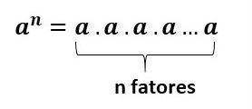{width="1.46875in"
height="0.633992782152231in"}

Refazer imagem

Sendo a ≠ 0, temos:

a: Base (número que está sendo multiplicado por ele mesmo).

n: Expoente (número de vezes que o número é multiplicado)

Para melhor entender a potenciação, no caso do número 4^3^ (quatro
elevado a terceira potência ou quatro elevado ao cubo), tem-se:

4³ = 4 x 4 x 4 = 16 x 4 = 64

[Radiciação]{.underline}

Radiciação é o método matemático inverso à potenciação. Enquanto os
cálculos com potências são determinados pela multiplicação de elementos
iguais sucessivas vezes, a radiciação procura quais são esses elementos.

Por exemplo, 8² = 64, desta forma podemos dizer que a raiz quadrada de
64 é 8.

\colorsec{Atividades}

1)  Urano é o sétimo planeta do Sol e é o terceiro maior no sistema
    solar. Foi descoberto por William Herschel em 1781. Tem um diâmetro
    equatorial de 51.800 quilômetros (32.190 milhas) e orbita o Sol uma
    vez a cada 84,01 anos da Terra. Tem uma distância média do Sol de
    2.870.990.000 quilômetros.

Escreva a distância média de Urano ao Sol em notação Científica.

Deixar uma linha para resposta

Professor:

BNCC: EF09MA04 SAEB: 9N1.4

2,87 · 10^9^ km.

2)  Jorge foi fazer uma entrega, em um condomínio, de 50 caixas pesando
    60kg cada caixa. Para tal utilizou o elevador, que tinha a
    capacidade máxima de 800kg. Jorge pesa 100kg. Por segurança o
    zelador não deixa que o limite de capacidade do elevador seja
    ultrapassado.

Quantas vezes será necessário usar o elevador para levar todas as
caixas?

Deixar um espaço equivalente a 4 linhas para resposta

Professor:

BNCC: EF09MA04 SAEB: 9N1.5

50 · 60 = 3 000 kg de carga. Como Jorge tem 100 kg temos que considerar
que o limite de peso que pode colocar no elevador será de no máximo 700
kg. Para carregar 700 kg ele deverá levar no máximo 11 caixas por vez.
50 : 11 = 4,54 aproximadamente, ou seja, 5 viagens.

3)  Para fazer a publicação e um determinado livro, estimou-se um custo
    inicial de R\$ 250.000,00 e ainda um custo de R\$ 10,00 por unidade.
    Elisa quer publicar um livro com uma tiragem de 5 000 exemplares.

Para isso o custo por exemplar será de:

Professor:

BNCC: EF09MA04 SAEB: 9N1.5

250 000 + 5 000 · 10 = 300 000, como serão 5 000 exemplares teremos que
dividir o valor. 300 000 : 5 000 = 60. Ou seja um custo de R\$ 60,00 por
unidade.

4)  A cantina da escola optou por vender lanches saudáveis e fez uma
    negociação com o distribuidor de maçãs da região. A negociação fez
    com que a cada duas maçãs fossem pagos (custo) o valor de R\$ 0,80.
    O preço de venda será de R\$ 1,00 a unidade.

Pretende-se um lucro mínimo semanal de R\$ 90,00 com as maçãs dados os
custos operacionais internos.

Quantas maçãs precisam ser vendidas?

Professor:

BNCC: EF09MA04 SAEB: 9N1.5

Dado que o custo por unidade é de R\$ 0,40 e o valor de venda é R\$ 1,00
temos um lucro por unidade de R\$ 0,60. Desta forma 90 : 0,60 = 150
maçãs.

\num{5}  Uma xícara com leite pesa 420 g, porém se bebermos metade do leite
    ele passa a pesar 230 g.

Qual o peso da xícara vazia?

Professor:

BNCC: EF09MA04 SAEB: 9N1.5

Ao analisar a diferença do peso da xícara cheia e com metade do leite
percebemos que houve uma redução de 190 g, ou seja, esta é massa ocupada
por metade do leite, desta forma o leite tem a massa de 190 · 2 = 380 g
e a xícara 420 -- 380 = 40 gramas.

\num{6}  "A NGC 4151 está localizada a cerca de 43 milhões de anos-luz da
    Terra e se enquadra entre as galáxias jovens que possui um buraco
    negro em intensa atividade. Mas ela não é só lembrada por esses
    quesitos. A NGC 4151 é conhecida por astrônomos como o 'olho de
    Sauron', uma referência ao vilão do filme 'O Senhor dos Anéis'".

(<http://www1.folha.uol.com.br/ciencia/887260-galaxia-herda-nome-de-vilao-do-filme-o-senhor-dos-aneis.shtml>
Acesso em: 25.02.2023.)

Para facilitar os cálculos utiliza-se os números em notação científica,
o número em destaque em notação científica está corretamente
representado na alternativa:

**a)**

b\)

c\)

d\)

Professor:

a

BNCC: EF09MA04 SAEB: 9N1.4

43 milhões representa 43 000 000, ou seja, 43 · 10^6^ ou 4,3 · 10^7^.

\num{7}  Um professor de Educação Física quer mesclar os jogos que são
    oferecidos para suas turmas e com isso estabeleceu uma regularidade
    de repetição dos esportes das turmas. O futebol acontece a cada 30
    dias, os de basquete a cada 45 dias e os de handebol, a cada 60
    dias.

Todas as modalidades foram oferecidas no dia de hoje, quando essa
situação ocorrerá novamente?

Deixar 3 linhas

Professor:

BNCC: - SAEB: 9N2.4

Determinando o MMC (30, 45, 60) = 180

Ocorrerá após 180 dias.

\num{8}  Durante uma campanha de arrecadação de alimentos motivados por uma
    gincana na escola a turma da Larissa arrecadou: 288 pacotes de
    feijão, 96 pacotes de açúcar, 360 pacotes de arroz e 240 pacotes de
    fubá. Larissa recorreu a seus conhecimentos matemáticos para
    organizar pacotes para que cada família beneficiária.

Quantos pacotes de feijão foram colocados em cada pacote para entregar,
considerando que o objetivo era atender a maior quantidade possível de
famílias?

Deixar espaço de 5 linhas

Professor:

BNCC: - SAEB: 9N2.4

MDC (96, 240, 288, 360) = 24, desta forma podemos determinar que em cada
pacote foram colocados 288 : 24 = 12 pacotes de feijão.

9)  Uma costureira dispõe de dois pedaços de fita de comprimentos 1,20m
    e 1,80m essas fitas, quantos pedaços menores de fita e de máximo
    tamanho possível ela conseguirá cortando as fitas?

Deixar espaço de 5 linhas

Professor:

BNCC: - SAEB: 9N2.4

MDC (1,20 e 1,80) = 0,60

Serão 2 pedaços da fita de 1,20 e 3 pedaços da fita de 1,80. Os pedaços
serão de 60 cm.

10) Simplificando a expressão encontramos:

a)  2

b)  4

c)  6

d)  **8**

> Professor:
>
> BNCC: EF09MA03 SAEB: 9N1.6
>
> d

\colorsec{Treino}

1)  Fernando faz caminhada a cada 4 dias. Thiago, vizinho de Fernando,
    faz caminhada no mesmo parque, a cada 6 dias. Considerando que
    Fernando e Thiago se encontraram sexta fazendo caminhada.

Eles se encontrarão novamente em qual dia da semana?

a)  Segunda

b)  Terça

c)  **Quarta**

d)  Sexta

Professor:

BNCC: EF09MA03 SAEB: 9N2.4

MMC (4,6) = 12 dias. Após 7 dias será sexta-feira e podemos continuar
contando (8º dia - sábado, 9º dia - domingo, 10º dia - segunda, 11º dia
- terça e 12º dia - quarta).

2)  Para arrecadar dinheiro para a festa de formatura do 9º ano Julinha
    decidiu fazer doces. Ela decidiu que para facilitar iria fazer
    pacotinhos com brigadeiros e com beijinhos. Fez uma primeira receita
    de cada para ver quantos consegui em cada receita. Neste primeiro
    teste ela conseguiu fazer 150 brigadeiros e 120 beijinhos.

Como ela queria fazer a mesma quantidade de pacotes de cada doce com a
maior quantidade possível de pacotes e sem misturar os doces, selecione
a alternativa que apresenta quantos doces ela deve colocar por pacote e
a quantidade de pacotes.

a)  **5 brigadeiros, 4 beijinhos, 30 pacotes de cada.**

b)  15 brigadeiros, 12 beijinhos, 10 pacotes de cada.

c)  10 brigadeiros, 12 beijinhos, 15 pacotes de cada.

d)  3 brigadeiros, 3 beijinhos, 90 pacotes de cada.

Professor:

BNCC: EF09MA03 SAEB: 9N2.4

MDC (120, 150) = 30, sendo assim temos 150 : 30 = 5 e 120 : 30 = 4

3)  **Equipe diz ter descoberto menor forma de vida**

(WILLIAM J. BROAD do \"The New York Times\")

Cientistas australianos podem ter descoberto algo surpreendente nas
profundezas do mar: criaturas misteriosas, aparentemente vivas e tão
pequenas que chegam ao limite do que é necessário para que exista vida
independente.

Seus descobridores, da Universidade de Queensland, afirmam que esses
seres são novas formas de micróbios. Céticos, no entanto, vêem a
descoberta como uma provável nova desilusão na caçada às menores formas
de vida.

Os pesquisadores as chamam de nanobes. O \"nano\" vem de seu
comprimento, de 20 a 150 nanômetros (bilionésimos de metro).

(Disponível em:
<https://www1.folha.uol.com.br/fsp/ciencia/fe1901200001.htm> - acessado
em 25/02/2023)

O maior tamanho do nanobe em notação científica está corretamente
representado na alternativa:

a)  m\.

b)  **m.**

c)  m\.

d)  m\.

Professor:

BNCC: EF09MA04 SAEB: 9N1.4

150 bilionésimo de m pode ser representado por:

$150 \cdot \frac{1}{1000000000} = \ 150 \cdot \frac{1}{10^{9}} = 150 \cdot 10^{- 9} = 1,5 \cdot 10^{- 7}m$

# Módulo 3: Frações (associadas a imagens e fração geratriz)

\conteudo{...}

A fração geratriz é aquela que quando calculamos seu valor decimal,
obtemos como resultado será uma dízima periódica (número decimal
periódico).

Os números decimais periódicos apresentam um ou mais algarismos que se
repetem infinitamente. Esse algarismo ou algarismos que se repetem
representam o período do número.

A fração geratriz pode ser determinada através de operações com equações
ou ainda através de algumas regras práticas que podem facilitar seu
processo de identificação.

O processo por equação pode ser realizado da seguinte forma:

1º passo: Igualar a dízima periódica a uma incógnita, por exemplo x, de
forma a escrever uma equação do 1º grau.

2º passo: Multiplique ambos os lados da equação por um múltiplo de 10
(depende do número de casas que ocorre a repetição dos termos.

3º passo: Subtrair a equação encontrada no 2º passo da equação inicial.

4º passo: Isolar a incógnita.

Exemplos:

1)  0,232323\...

x = 0,232323\...

100x = 23,232323\...

100x -- x = 23,23232323\... -- 0,232323\...

99x = 23

$x = \frac{23}{99}$ .

2)  0,5123123123\...

Neste exemplo temos um dígito após a vírgula que não se repete, por isso
é necessário fazer dois passos para que seja ajustado de maneira que
fique após a vírgula apenas os dígitos que repetem.

x = 0,5123123123\...

10x = 5,123123123\...

10000x = 5123,123123\...

10000x -- 10x = 5123,123123\... -- 5,123123123\...

9990x = 5118

$x = \frac{5118}{9990}$.

\colorsec{Atividades}

1)  Dados dois números reais x e y, tais que x = 2,333\... e y =
    0,151515\... são dízimas periódicas. Qual a fração representa a soma
    de x e y?

Deixar 4 linhas

Professor

BNCC: - SAEB:9N1.10

$x = 2,333\ldots = 2 + \frac{1}{3} = \frac{7}{3}$ e
$y = 0,1515\ldots = \ \frac{15}{99} = \frac{5}{33}$. Fazendo
$x + y = \frac{7}{3} + \frac{5}{33} = \frac{77 + 5}{33} = \frac{82}{33}$.

2)  A representação do número 2,123123123\... pode ser colocada pela
    fração:

Deixar 2 linhas

Professor

BNCC: - SAEB:9N1.10

$$2,123123123 = 2 + \frac{123}{999} = \frac{1998 + 123}{999} = \frac{2121}{999} = \frac{707}{333}$$

3)  Beatriz precisa encontrar uma fração na forma irredutível que
    represente o número 5,151515\... . Qual será a fração que ela deve
    encontrar?

Deixar 2 linhas

Professor

BNCC: - SAEB:9N1.10

$$5,151515\ldots = 5 + \frac{15}{99} = 5 + \frac{5}{33} = \frac{165 + 5}{33} = \frac{170}{33}$$

4)  Na imagem abaixo faça um x sobre os bombons de forma a representar a
    fração equivalente a $\frac{5}{9}$.

Fazer uma imagem semelhante a imagem abaixo sem os pontilhados, o aluno
irá preencher a resposta sobre a imagem.

{width="2.9870975503062116in"
height="1.2395833333333333in"}

Professor

BNCC: - SAEB:9N1.7

Montar imagem como a de baixo

{width="3.5513724846894137in"
height="1.3802077865266842in"}

5)  Quando Artur chega em casa encontra uma pizza com alguns pedaços já
    consumidos, seu irmão deve ter comido, então come alguns pedaços.
    Qual a fração de pizza Artur comeu?

Montar imagem como a de baixo

{width="2.755207786526684in"
height="0.8889359142607174in"}

Professor

BNCC: - SAEB:9N1.7

Pela imagem vemos que a pizza estava com 8 pedaços de 10 e
posteriormente com 5 pedaços de 10, sendo assim Artur consumiu 3 pedaços
de 10, ou seja, $\frac{3}{10\ }.$

6)  A fração de $\ \frac{2}{7}$ ao ser somada com a fração representada
    na figura a seguir será igual a:

{width="1.265624453193351in"
height="1.1625820209973754in"}

Professor

BNCC: - SAEB:9N1.7

$$\frac{2}{7} + \frac{5}{8} = \frac{16 + 35}{56} = \frac{51}{56}$$

7)  Qual das imagens abaixo representa 4 décimos?

a)  {width="1.0625in"
    height="1.2878783902012247in"}

b)  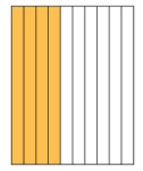{width="1.0772823709536308in"
    height="1.2916666666666667in"}

c)  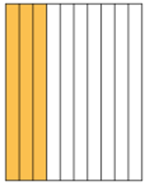{width="1.0052077865266842in"
    height="1.2551804461942258in"}

d)  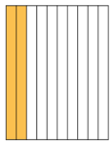{width="0.9751038932633421in"
    height="1.25in"}

Professor

BNCC: - SAEB:9N1.7

Imagem da letra d

8)  Qual a fração que representa a quantidade de crianças que preferem
    hamster como animal de estimação?

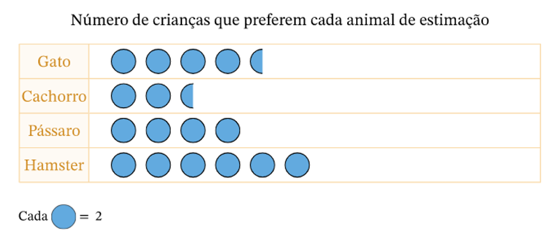{width="3.8593744531933507in"
height="1.6492202537182852in"}

Professor

BNCC: - SAEB:9N1.8

Pela contagem temos 17 bolinhas que representam 34 crianças. Desta forma
temos que 12 crianças que preferem hamster. A fração é
$\frac{12}{34} = \frac{6}{17}$.

9)  Uma fração equivalente ao número de peixes que Pedro tem em relação
    aos amigos.

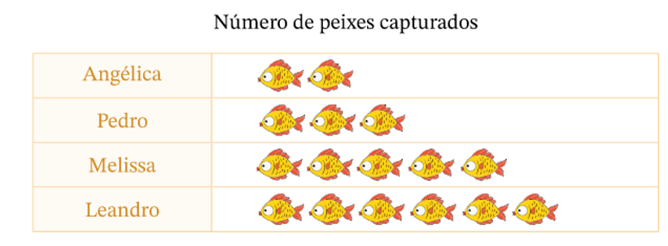{width="3.6510411198600177in"
height="1.3476738845144356in"}

Qual a fração equivalente ao número de peixes do Pedro em relação a
todos?

a)  $\frac{1}{16}$

b)  $\frac{3}{25}$

c)  $\frac{\mathbf{9}}{\mathbf{48}}$

d)  $\frac{5}{16}$

> Professor
>
> BNCC: - SAEB:9N1.8
>
> Pelo gráfico a quantidade a fração da quantidade de peixes que Pedro
> tem em relação ao total é $\frac{3}{16}$, esta fração é equivalente a
> fração da alternativa c.

10) O professor de André montou uma lista de exercícios que destes
    alguns iriam cair na sua avaliação. Alice já resolveu $\frac{4}{5}$,
    Bruno $\frac{2}{7}$, Augusto $\frac{12}{15}$ e Cadu $\frac{8}{10}$.

Considerando as informações dos exercícios já resolvidos, os alunos que
resolveram a mesma quantidade de exercícios foram:

a)  Alice e Bruno.

b)  Bruno e Augusto.

c)  **Alice e Augusto.**

d)  Augusto e Cadu.

> Professor
>
> BNCC: - SAEB:9N1.8
>
> As frações equivalentes são as que representam a quantidade da Alice e
> Augusto, pois $\frac{4}{5} = \frac{12}{15}$.

\colorsec{Treino}

1)  A dízima periódica 0,126126\... é representada pela fração:

a)  $\frac{126}{1000}$

b)  $\frac{14}{111}$

c)  $\frac{126}{990}$

d)  $\frac{63}{99}$

> Professor
>
> BNCC: - SAEB:9N1.10
>
> 0,126126\... = $\frac{126}{999} = \frac{14}{111}$

2)  O número x, de forma a que as frações
    $\frac{12}{37} = \frac{x}{111}$ sejam equivalentes é:

a)  12

b)  24

c)  36

d)  48

> Professor
>
> BNCC: - SAEB:9N1.7
>
> Como o valor 111 é igual a 3·37, então basta fazer 3·12=36, desta
> forma x=36.

3)  Observando os pedaços de chocolate, percebemos que há três tipos
    espalhados.

{width="4.540972222222222in"
height="1.515437445319335in"}

[Free Vector \| Vetor grátis conjunto de várias fatias de chocolate
(freepik.com)](https://br.freepik.com/vetores-gratis/conjunto-de-varias-fatias-de-chocolate_10155086.htm#page=2&query=chocolate&position=49&from_view=search&track=sph)

Chocolate meio amargo, chocolate ao leite e chocolate branco.

Juca comeu $\frac{2}{3}$ do chocolate meio amargo e $\frac{1}{2}$ do
chocolate ao leite.

A fração correspondente a quantidade que Juca comeu em relação ao total
é:

a)  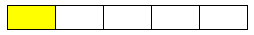{width="2.1168503937007874in"
    height="0.29169181977252845in"}

b)  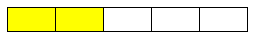{width="2.1085159667541555in"
    height="0.3000262467191601in"}

c)  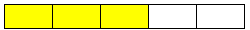{width="2.083513779527559in"
    height="0.2500218722659667in"}

d)  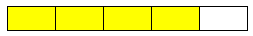{width="2.1085159667541555in"
    height="0.3000262467191601in"}

Essas imagens da alternativa foram feitas pelo autor, podem ser mantidas
ou alteradas para se adequar ao projeto.

> Professor
>
> BNCC: - SAEB: 9N1.8

$\frac{2}{3}\ $de 12 são 8 pedaços e $\frac{1}{2}$ de 12 são 6 pedaços,
ou seja, Juca comeu 14 pedaços dos 35 disponíveis. A fração que ele
comeu de chocolate foi $\frac{14}{35} = \frac{2}{5}$ que está
representada na alternativa b.

# Módulo 4: Porcentagem: Aumentos e Descontos

\conteudo{...}

Para determinar aumentos ou descontos sucessivos utilizamos o fator de
correção. O fator de correção é dado por F = (1 + i), onde i é a taxa
percentual de maneira unitária.

Exemplo:

-   3% = 0,03

-   12% = 0,12

-   50% = 0,5

Composição de aumentos e descontos sucessivos podem ser composto por
vários aumentos e vários descontos.

Exemplo:

Um produto que passou por dois aumentos sucessivos, sendo um de 10% e
outro de 15%. Qual foi o aumento total?

O percentual total não depende do valor do produto, por isso podemos
fazer:

(1 + 0,1) · (1 + 0,15) = 1,265 → 1 + 0,265 , ou seja, um aumento de
26,5% no total.

\colorsec{Atividades}

1)  Em um período de alta inflação os itens da cesta básica tiveram um
    aumento de 75%.

Considerando que o preço inicial a cesta básica era de R\$ 60,00 , qual
o preço no final do referido período?

Professor

BNCC: EF09MA05 SAEB: 9N2.3

Calculando 75% de 60 teremos 0,75·60=45, ou seja, no final do período
teremos o valor de R\$ 105,00.

2)  Vou comprar um tênis no valor de R\$ 250,00 e tenho duas opções para
    pagar que são:

I -- Pagamento à vista com 20% de desconto;

II -- Pagamento em duas parcelas iguais sem aumento, pagando a primeira
no dia da compra e a segunda um mês depois.

Apesar de parecer que o parcelamento é sem juros o valor parcelado é
mais alto que o valor quando a mercadoria é paga à vista.

Qual a taxa de juros aplicada no pagamento parcelado?

Professor

BNCC: EF09MA05 SAEB: 9N2.3

O valor do tênis pode até não ser considerado no cálculo, mas para
facilitar para os estudantes vamos utilizá-lo.

Plano I: Desconto de 20% sobre o valor de 250,00. Neste caso o valor
pago seria de R\$ 200,00 , pois seria dado R\$50,00 de desconto.

No plano II o comprador tem que desembolsar metade do valor no dia da
compra, ou seja, pagaria no dia R\$ 125,00 e pagaria mais R\$ 125,00
após 30 dias, mas temos que levar em consideração que o preço à vista é
R\$ 200,00. Desta forma ele deveria ficar devendo para segunda parcela
apenas 200 -- 125 = 75.

No entanto paga R\$ 125,00. Calculando o valor pago em relação ao que
seria o valor à vista temos: $\frac{125}{75} = 1,667$, ou seja, 66,7% a
mais.

3)  Ao longo do ano de 2017 o preço de um artigo esportivo foi
    reajustado da seguinte forma: de 15 de março a 15 de abril sofreu um
    aumento de 30%; de 15 de março a 15 de maio, 56%; de 15 de março a
    15 de junho, 48,2% e de 15 de março a 15 de julho, 90%.

{width="3.25in"
height="2.183333333333333in"}

Sendo o preço em 15/05 era igual a R\$ 120,00 qual foi preço praticado
em 15/07, aproximadamente?

Professor

BNCC: EF09MA05 SAEB: 9N2.3

Como em 15/05 estava com 56% de aumento, podemos retroagir para o valor
em 15/03, para isso dividimos 120 por 1,56 e obtemos o valor de
aproximadamente 76,92. Agora podemos fazer o aumento de 90% que
determinará o valor procurado.

76,92 · 1,9 = 146,15.

4)  Veja os valores na tabela

  **ANO**    **Escola A**   **Escola B**
  ---------- -------------- --------------
  **2022**                  
  **2023**                  

Determine qual escola teve o maior aumento percentual nas mensalidades
de 2022 para 2023 e diga qual foi o percentual de aumento.

Professor

BNCC: EF09MA05 SAEB: 9N2.3

Calculando a razão da diferença pelo valor inicial teremos:

Escola A: $\frac{150}{1000} = 0,15$

Escola B: $\frac{180}{1500} = 0,12$

Maior aumento foi o da escola A em 15% de aumento.

5)  *"A sigla Ideb se refere ao Índice de Desenvolvimento da Educação
    Básica e seu objetivo é medir a qualidade \[\...\]do ensino da
    educação básica no Brasil. "*

O gráfico abaixo mostra os resultados do Ideb nacional por biênio de
2005 a 2015.

{width="4.916666666666667in"
height="2.8644925634295713in"}

No ano de 2021 o índice do Ensino Médio no Brasil foi de 4,2. Com isso
podemos afirmar que o percentual de evolução em relação ao ano de 2015
foi de aproximadamente:

a)  **13,5%**

b)  10%

c)  5%

d)  0,5%

Professor

BNCC: EF09MA05 SAEB: 9N2.3

O índice era de 3,7 e aumentou para 4,2. Com isso temos um aumento de
0,5 o que representa $\frac{0,5}{3,7} \cong 1,1351\ldots\ $ou seja, um
aumento de aproximadamente 13,5%.

6)  **Disparidade de rendimento entre sexos permanece alta apesar do
    maior ganho para mulheres**

Além da valorização do salário-mínimo, houve aumento real do rendimento
médio de todas as fontes na comparação entre 2010 e 2000. Em 2010, o
rendimento médio era de R\$ 1.587 para os homens e R\$ 1.074 entre as
mulheres.

Adaptado, disponível em:
<https://censo2010.ibge.gov.br/noticias-censo?busca=1&id=1&idnoticia=2747&t=estatisticas-genero-mostram-como-mulheres-vem-ganhando-espaco-realidade-socioeconomica-pais&view=noticia#:~:text=Em%202010%2C%20o%20rendimento%20m%C3%A9dio,7%25%20do%20rendimento%20masculino>
Acessado em 26/02/2023

Qual deve ser o desconto sobre o rendimento médio dos homens para
atingir o valor do salário das mulheres?

Professor

BNCC: EF09MA05 SAEB: 9N2.3

A diferença entre os salários é de 1587 -- 1074 = 513. Calculando a
razão $\frac{513}{1587} \cong 0,3232..$, ou seja, aproximadamente 32,3%.

7)  Veja o gráfico:

{width="2.917817147856518in"
height="2.7963560804899386in"}

<https://petrobras.com.br/data/files/55/43/0A/53/165954104F528454893851A8/producao-petroleo-VALE-ESTE.jpg>

Diante da previsão realizada em 2013 para atingir a produção de 3,9
milhões de barris por dia qual deveria ser o percentual de aumento em
relação a 2013?

Professor

BNCC: EF09MA05 SAEB: 9N2.3

Calculando a razão $\frac{3,9}{2,32} = 1,681\ldots\ $. Sendo assim temos
uma previsão de aumento de 68,1%.

8)  Calcule o percentual total de aumento sobre um produto que teve dois
    aumentos sucessivos de 20%.

Professor

BNCC: EF09MA05 SAEB: 9N2.3

(1 + 0,2) · (1 + 0,2) = 1,44. Assim podemos afirmar que tivemos um
aumento de 44%.

9)  Calcule o percentual total de desconto sobre um produto que teve
    dois descontos sucessivos de 10%.

Professor

BNCC: EF09MA05 SAEB: 9N2.3

(1 - 0,1) · (1 - 0,1) = 0,81. Assim podemos afirmar que tivemos um
desconto de 19%.

10) Um produto teve um aumento de 20% e posteriormente um desconto de
    15%. Considerando o valor final tivemos um aumento ou um desconto de
    quantos porcento?

Professor

BNCC: EF09MA05 SAEB: 9N2.3

(1 +0,2) · (1 - 0,15) = 1,2 · 0,85 = 1,02. Desta forma podemos afirmar
que tivemos um aumento de 2%.

\colorsec{Treino}

1)  Jorge comprou uma televisão por R\$ 2.150,00 para pagar em duas
    parcelas. A primeira parcela que corresponde a 30% do preço da
    televisão e o restante pagou após 30 dias.

Quanto Jorge pagou pela segunda parcela?

a)  R\$ 645,00

b)  R\$ 1.290,00

c)  **R\$ 1.505,00**

d)  R\$ 2.120,00

> Professor
>
> BNCC: EF09MA05 SAEB: 9N2.3
>
> Como foi pago 30% de entrada sobrou 70% para a segunda parcela. Para
> saber o valor da segunda parcela precisamos calcular 70% de 2150.
>
> 0,70 · 2150 =1505.

2)  Hugo comprou 150 figurinhas para o seu álbum da copa do mundo
    de 2022. Porém, dessas 150 figurinhas, 90 eram repetidas.

As figurinhas que efetivamente foram utilizadas representam qual
porcentagem do total de figurinhas que ele comprou?

a)  **40%**

b)  50%

c)  60%

d)  90%

> Professor
>
> BNCC: EF09MA05 SAEB: 9N2.3
>
> Hugo comprou 150 figurinhas, mas apenas 60 não eram repetidas, sendo
> assim ele usou efetivamente $\frac{60}{150} = 0,40 = 40\%.$

3)  Kríssia quer comprar à vista uma mochila que custa R\$ 560,00, mas,
    para pagamento à vista, a loja oferece um desconto de 5%. No entanto
    por ser a última peça foi oferecido um desconto na etiqueta de 20%.

Ao chegar ao caixa Kríssia foi surpreendida, pois o desconto de
pagamento à vista foi dado sobre o preço já com desconto por ser a
última peça, qual foi o valor pago?

a)  532

b)  **425,60**

c)  420,00

d)  404,32

> Professor
>
> BNCC: EF09MA05 SAEB: 9N2.3
>
> Houve dois descontos sucessivos, sendo um de 20% e outro de 5%.
>
> (1 -- 0,2) · (1 -- 0,05) · 560 = 0,8 · 095 · 560 = 425,60.

# Módulo 5: Equação do 1º grau

\conteudo{...}

A equação do primeiro grau refere-se a toda expressão algébrica que
possui incógnita com grau 1. Uma sentença Matemática que pode ser
escrita do tipo ax + b = 0, em que a e b são números reais, e a é
diferente de 0.

O objetivo de escrever uma equação do 1º grau é encontrar qual é o valor
da incógnita que satisfaz a equação. Esse valor é conhecido como solução
ou raiz da equação.

As incógnitas podem na definição da equação serem restringidas a um
conjunto numérico a qual a raiz seja um elemento, caso não pertença ao
conjunto universo proposto dizemos que o conjunto solução é vazio.

O que define o grau de uma equação é o expoente da incógnita. Sendo
assim, quando o expoente da incógnita possui grau 1, temos uma equação
do 1º grau. Por exemplo:

-   3x + 5 = 29 (equação do 1º grau com uma incógnita, x)

-   y + 5 = - 3y(equação do 1º grau com uma incógnita, y)

-   2x -- 3y + 5 = 0 (equação do 1º grau com duas incógnitas, x e y)

O maior desafio é "transformar" os problemas em uma equação e
resolvê-la, o que chamamos de resolução de problemas que se reduzem a
uma equação do 1º grau. Seguem algumas dicas para resolver problema
matemáticos em geral:

1)  Leia o problema cuidadosamente: certifique-se de entender o que o
    problema está pedindo. Leia o problema mais de uma vez, se
    necessário.

2)  Identifique as informações importantes: sublinhe ou destaque as
    informações que são relevantes para o problema. Seja claro sobre o
    que você está tentando encontrar e quais dados você tem.

3)  Desenhe um diagrama: um diagrama pode ajudar a visualizar o problema
    e ajudar na solução. Isso pode ser especialmente útil em problemas
    geométricos.

4)  Use palavras-chave: muitas vezes as palavras usadas em um problema
    podem dar uma indicação de que tipo de operação matemática deve ser
    usada. Por exemplo, \"mais\" pode indicar uma adição, \"menos\" pode
    indicar uma subtração, \"vezes\" pode indicar uma multiplicação e
    \"dividido por\" pode indicar uma divisão.

5)  Escreva equações: transforme as informações importantes do problema
    em equações matemáticas. Use variáveis para representar quantidades
    desconhecidas.

6)  Simplifique: tente simplificar as equações matemáticas tanto quanto
    possível. Isso pode ajudar a reduzir a complexidade do problema.

7)  Resolva a equação: use as propriedades matemáticas para resolver as
    equações. Lembre-se de seguir as regras corretas de operações
    matemáticas.

8)  Verifique sua resposta: certifique-se de que sua resposta faz
    sentido no contexto do problema. Verifique se você respondeu a todas
    as partes do problema e se a resposta está em um formato adequado.

\colorsec{Atividades}

1\) Com o objetivo de juntar um dinheiro para a formatura Jorge começou
a produzir doces para revender. Cada receita é composta de kg de
castanha e kg de açúcar.

O kg de castanha custa R\$ 20,00 e o do açúcar, R\$ 4,00. Porém, o
açúcar teve um aumento e o kg passou a custar R\$ 4,40. Para manter o
custo com a produção de uma receita, Jorge terá que negociar um desconto
com o fornecedor de castanha.

Nas condições estabelecidas, o novo valor do kg de castanha deverá ser
reduzido para qual valor?

Deixar 4 linhas

Professor

BNCC: - SAEB: 9A1.1

Primeiramente vamos calcular o custo da receita inicial:

Agora vamos calcular o valor da castanha para manter o custo de R\$
16,80.

O valor do kg da castanha deverá ser reduzido a R\$ 19,90.

2\) Um condomínio grande de uma cidade possui três entradas de água. A
vazão de cada entrada é apresentada na tabela.

  **Entrada de água**   **Vazão (litro/minuto)**
  --------------------- --------------------------
  A                     50
  B                     60
  C                     90
  Vazão total           200

Em função do aumento do número de moradores e considerando o histórico
do consumo de água, o síndico do condomínio julgou prudente aumentar em
100% a vazão total de água nas entradas de água. Para esse propósito, as
vazões das entradas A e B foram aumentadas ao máximo, para 80 L/min e
100 L/min, respectivamente.

Para que a vazão de água das três entradas juntas seja aumentada em
100%, a vazão, em litro por minuto, da entrada C deve ser aumentada
para:

a\) 220.

b\) 180.

c\) 130.

d\) 110.

Professor

BNCC: - SAEB: 9A1.1

A vazão total era de 200 litros por minuto e precisa dobrar, como a
entrada A e B passaram a ser de 80 litros por minuto e 100 litros por
minuto temos:

400 = 80 + 100 + x

220 = x

A entrada C era de 90 L/ min , então 220 -- 90 = 130 L/min, ou seja, um
aumento de 130 L/min.

Alternativa C

3\) Um vendedor vendeu cadeiras a R\$ 50,00 cada e mesas a R\$ 120,00
cada. No total, esse marceneiro arrecadou R\$ 4.800,00 com a venda
desses objetos, sendo o número de cadeiras vendidas igual a quatro vezes
o número de mesas vendidas.

Chamando-se o número de cadeiras vendidas de x e o número de mesas
vendidas de *y*, faço o sistema que representa, em linguagem matemática
essa situação e resolva-o.

Deixar 3 linhas

Professor

BNCC: - SAEB: 9A2.3

4\) Dois lutadores MMA de categorias diferentes foram desafiados para
disputar o cinturão de uma categoria intermediária às suas atuais. Um
deles tinha 91 kg e o outro tinha 77 kg. Eles foram submetidos a uma
\colorsec{Treino}
primeiro perdia 1,2 kg, enquanto o outro ganhava 0,6 kg. Logo após esse
período de preparação, a diferença de massa entre os dois atletas era de
apenas 4 kg.

Quantas semanas, no mínimo, teve esse período de preparação dos
lutadores?

Deixar 4 linhas

Professor

BNCC: - SAEB: 9A1.1

Lutador A: 91 - 1,2x

Lutador B: 77 + 0,6x

Lutador A -- Lutador B = 4

(91 -- 1,2x) -- (77 + 0,6x) = 4

91 -- 1,2x -- 77 -- 0,6x = 4

-1,8x = 4 +77 -- 91

\- 1,8x = -10

x = 5,56

Passaram-se 5 semanas e 4 dias aproximadamente.

5\) Marcos quer triplicar o valor que recebe de sua mesada e aceita o
desconto de 5 reais para ajudar nas despesas, ele ficará com R\$ 60,00.

Uma equação que expressa essa situação é

a\) 3x + 5 = 60

b\) 3x -- 5 = 60

c\) 3(x + 5) = 60

d\) 3x + 35 = 0

Professor

BNCC: - SAEB: 9A1.1

Seja x sua mesada, com quer triplicar temos que escrever 3x, como vai
ter um desconto de R\$ 5,00 precisamos escrever -- 5 e tudo isso será
igual a 60.

3x -- 5 = 60

Alternativa b

6\) Paulo é garçom de um badalado de um restaurante. Ele recebe, por
mês, R\$ 650,00 mais R\$ 20,00 por hora extra que trabalha. Quanto ele
receberá este mês?

Montar imagem semelhante

{width="2.246875546806649in"
height="0.9537609361329834in"}

Deixar 4 linhas

Professor

BNCC: - SAEB: 9A1.1

650 + 20x = 3150

20x = 2500

x = 125

7\) O reservatório de uma chácara estava cheio de água. Foi retirado
$\frac{2}{3}$ desse conteúdo para encher a piscina e, em seguida,
adicionou 3 000 litros de água no reservatório. Com isso, o conteúdo do
reservatório passou a ocupar a metade de sua capacidade inicial. Qual a
capacidade total do reservatório?

Deixar 2 linhas

Professor

BNCC: - SAEB: 9A1.1

8\) Carol e Alexandre têm, juntos, 1 000 reais, sendo que o dobro do
valor de Alexandre corresponde ao triplo do valor de Carol. Qual o valor
que cada um possuí?

Deixar 2 linhas

Professor

BNCC: - SAEB: 9A2.3

9\) Um estacionamento cobra R\$ 8,00 pelas primeiras duas horas e mais
R\$ 1,50 pelas horas subsequentes. Considerando que foram gastos R\$
14,00, qual foi o tempo de permanência?

Deixar 2 linhas

Professor

BNCC: - SAEB: 9A1.1

1,5x + 8 = 14

1,5x = 6

x = 4 horas

10\) Nico viaja 350 quilômetros para ir de carro de sua casa à cidade
onde moram seus avós. Em uma dessas viagens, após alguns quilômetros,
ele parou para almoçar. A seguir, percorreu o triplo da quantidade de
quilômetros que havia percorrido antes de parar.

Quantos quilômetros ele percorreu após a parada?

Deixar 2 linhas

Professor

BNCC: - SAEB: 9A1.1

Chamando o 1º trecho de x o 2º trecho foi o triplo, ou seja, 3x. Somando
os dois devemos encontrar o valor de 350.

x + 3x = 350

4x = 350

x = 87,5 km até a parada e depois percorreu 350 -- 87,5 = 262,5 km.

\colorsec{Treino}

1\) Aos domingos é comum em algumas cidades termos ciclovias, onde as
famílias se reúnem para um passeio ciclístico. Uma locadora de bicicleta
cobra R\$ 16,00 por hora pelo aluguel de uma bicicleta. Além disso, ela
também cobra, uma taxa fixa de manutenção de R\$ 10,00. Carlos alugou a
bicicleta por 5 horas, qual o custo ele teve?

a)  R\$ 80,00

b)  R\$ 85,00

c)  R\$ 90,00

d)  R\$ 130,00

BNCC: - SAEB: 9A1.1

Como são 16 por hora mais 10 fixos de taxa, podemos escrever a expressão

C = 10 +16x, onde ao substituir o x por 5 teremos C = 10 +16·5 = 90.

Alternativa c.

2\) Um estacionamento tem 50 veículos entre carros e motos, sabendo que
o total de rodas do estacionamento é igual a 160 rodas, qual o número de
carros?

a)  20

b)  30

c)  40

d)  50

Professor

BNCC: - SAEB: 9A2.3

Serão 30 carros, alternativa b.

3\) A soma de três números inteiros consecutivos é 33. Qual é o produto
entre esses três números?

a\) 110

b\) 120

c\) 1320

d\) 4200

BNCC: - SAEB: 9A1.1

x + x+1 + x+2 = 33

3x = 30

x = 10

x+1 = 11

x+2 = 12

10·11·12 = 1 320

# Módulo 6: Sequências e Expressões Algébricas

\conteudo{...}

Sequências numéricas são conjuntos ordenados de números que seguem um
padrão ou uma regra específica. Essas sequências podem ser finitas ou
infinitas e podem ser classificadas de diferentes maneiras, dependendo
de suas características.

Algumas das sequências numéricas mais comuns incluem as sequências
aritméticas, que seguem uma regra de adição ou subtração constante entre
seus termos sucessivos, e as sequências geométricas, que seguem uma
regra de multiplicação ou divisão constante entre seus termos
sucessivos.

Outros tipos de sequências numéricas incluem as sequências harmônicas,
as sequências de Fibonacci e as sequências de números primos. Cada uma
dessas sequências tem propriedades e características únicas que podem
ser estudadas e exploradas por matemáticos e estudantes.

O estudo de sequências numéricas é importante em muitas áreas da
matemática, bem como em outras disciplinas, como física, engenharia e
ciência da computação. As sequências numéricas são usadas para modelar e
descrever fenômenos naturais, para resolver problemas matemáticos e para
desenvolver algoritmos eficientes para uma variedade de aplicativos.

[Lei de formação]{.underline}

Podemos ter sequências de vários elementos, como meses, nomes, dias da
semana, entre outros. Quando envolve número a sequência numérica pode
ter uma "regra" específica. Podemos formar a sequência de números pares,
números ímpares, números primos, múltiplos de 8 etc.

A sequência numérica pode ser representada por meio de uma lei de
formação. Isso nada mais é que a lista dos elementos da sequência
numérica que seguem a mesma regra, por exemplo:

a~n~= 3n +1, calculando 1º termo com n=1, 2º termo com n=2 e assim
sucessivamente teremos a sequência: (4, 7, 10, 13, 16, 19, \...).

[Classificação da sequência numérica]{.underline}

A sequencia numérica pode ser classificada como: Crescente, Decrescente
ou constante.

\colorsec{Atividades}

1\) Matheus montou figuras com palitos de fósforo. Na 1ª figura, montou
um triângulo e, nas etapas seguintes, foi acrescentando triângulos
conforme imagem.

{width="4.447916666666667in"
height="1.5305325896762905in"}

Montar figura semelhante, lembrando que a quantidade é importante

Qual a quantidade de palitos de fósforo necessários e suficientes para a
construção da 6ª figura?

Deixar 4 linhas

Professor

BNCC: - SAEB: 9A1.3

1ª figura: 3 palitos

2ª figura: 9 palitos

3ª figura: 15 palitos

\...

Sempre são acrescentados 6 palitos, desta forma uma das expressões que
apresenta a quantidade de palito é y = 6n -- 3, onde n é a posição da
figura. Para n = 6 teremos:

y = 6·6 -- 3 = 33 palitos.

2**)** Em um grupo de crianças, 210 de bombons foram distribuídos para
cada uma, na forma de uma sequência crescente, da criança de menor
estatura para a de maior estatura. Ao colocarmos as crianças nessa
ordem, percebeu-se que a segunda criança ganhou 5 bombons, a quinta
ganhou 11 e sétimo 15. Complete a tabela abaixo para encontrar a
quantidade de bombons de cada criança, desde que sempre seja regular.

  **1ª**   **2ª**   **3ª**   **4ª**   **5ª**   **6ª**   **7ª**   **8ª**   **9ª**   **10ª**
  -------- -------- -------- -------- -------- -------- -------- -------- -------- ---------
           5                          11                15                         

Montar uma tabela como a de cima

Professor

BNCC: - SAEB: 9A1.3

A regularidade deve despertar a percepção que entre os 2 primeiros
números já preenchidos temos 6 de diferença, mas ao olhar o 5º e 7º
apenas 4 de diferença, ou seja, a mudança de um para outro será de 2
unidades.

Professor, os alunos provavelmente usarão de tentativa e erro para
resolver e está ótimo se conseguirem por este meio.

  **1ª**   **2ª**   **3ª**   **4ª**   **5ª**   **6ª**   **7ª**   **8ª**   **9ª**   **10ª**
  -------- -------- -------- -------- -------- -------- -------- -------- -------- ---------
  3        5        7        9        11       13       15       17       19       21

3**)** Observe a quantidade de lugares em cada configuração:

Montar uma tabela como a de baixo. É importante ter a mesma quantidade
de cadeiras e não pode se redonda, precisam ser retangulares

{width="5.729166666666667in"
height="1.3in"}

Se mantivermos o padrão, quantos lugares teríamos no total se
acrescentarmos a configuração 4 e 5?

Deixar 5 linhas

Professor

BNCC: - SAEB: 9A1.3

1ª temos 4 lugares

2ª temos 6 lugares + 4 lugares anteriores = 10 lugares

3ª temos 8 lugares + 10 lugares anteriores = 18 lugares

Percebe-se que a próxima configuração a partir da 3ª sempre irá ter duas
cadeiras a mais na configuração, sendo assim:

4, 6, 8, 10, 12 essas são as quantidades de cadeiras em cada
configuração, somando teremos:

4 + 6 + 8 + 10 + 12 = 40 lugares.

4\) Uma fábrica trabalha com vários modelos e tamanhos de mesas. As
mesas são todas acompanhadas com uma certa quantidade de poltronas a
depender do tamanho da mesa.

Montar uma tabela como a de baixo. É importante ter a mesma quantidade
de cadeiras.

{width="4.28125in"
height="1.5083333333333333in"}

O primeiro modelo acompanha poltronas, o segundo modelo acompanha
poltronas, o terceiro, poltronas e assim sucessivamente. Ao adquirir uma
unidade de cada um dos primeiros modelos de mesa circular quantas
poltronas estarão disponíveis?

Professor

BNCC: - SAEB: 9A1.3

A sequência de poltronas pode ser observada pelo enunciado como:

3, 6, 9, 12, 15, 18, 21, 24, 27, 30. Somando encontraremos: 3 + 6 + 9 +
12 + 15 + 18 + 21 + 24 + 27 + 30 = 165

5\) Os circos não se utilizam mais de animais em seus números, mas ainda
é um atrativo pelos números apresentados. Em uma apresentação forma-se
uma pirâmide humana com uma pessoa no topo sustentada por duas outras
que são sustentadas por mais três e assim sucessivamente. Quantas
pessoas são necessárias para formar uma pirâmide com 5 filas de pessoas,
da base ao topo?

{width="1.7135411198600174in"
height="1.5630227471566054in"}

[Pirâmide Criadas Por Pessoas Desenho - Arte vetorial de stock e mais
imagens de Pirâmide Humana - Pirâmide Humana, Esboço, Pirâmide -
Estrutura construída - iStock
(istockphoto.com)](https://www.istockphoto.com/pt/vetorial/pir%C3%A2mide-criadas-por-pessoas-desenho-gm499201238-79908399?phrase=pir%C3%A2mide%20humana)

a\) 8

b\) 15

c\) 21

d\) 28

Professor

BNCC: - SAEB: 9A1.3

Pela imagem temos 4 filas e é possível contar 10 pessoas, na próxima
fila teremos mais 5 pessoas e com isso um total de 15.

6\) **Qual o número de cadeiras ao utilizar 10 mesas na configuração da
imagem abaixo:**

{width="4.6875in" height="0.8in"}

**Montar imagem semelhante, número de cadeiras é importante.**

Professor

BNCC: - SAEB: 9A1.3

Pela imagem temos uma sequência numérica de cadeiras que pode ser
verificada da seguinte forma:

1 mesa: 4

2 mesas: 6

3 mesas: 8

Podemos estabelecer uma expressão de quantidade de cadeiras de acordo
com a quantidade de mesa, por exemplo, y = 2·n + 2 com n representando a
quantidade de mesa.

y = 2 · 10 + 2 = 22 cadeiras.

7\) Escreva mais 3 números da sequência 18, 30, 42, 54, \_\_, \_\_, \_\_

Professor

BNCC: - SAEB: 9A1.3

Basta perceber que aumenta de 12 em 12. Resposta: 66, 78, 90.

8\) Observe a imagem:

**Montar imagem semelhante, número de cadeiras é importante.**

{width="5.683333333333334in"
height="1.3333333333333333in"}

Complete a tabela a seguir.

**Montar tabela semelhante**

  Configuração   Número de mesas   Número de lugares
  -------------- ----------------- -------------------
  1                                
  2                                
  3                                
  4                                
  5                                
  n                                

Professor

BNCC: - SAEB: 9A1.3

  Configuração   Número de mesas   Número de lugares
  -------------- ----------------- -------------------
  1              1                 4
  2              2                 6
  3              3                 8
  4              4                 10
  5              5                 12
  n              n                 2n + 2

9\) Dado a expressão a~n~ = 3n + 2. A diferença entre o décimo e o
quinto termos dessa sequência é um número:

a\) múltiplo de 5.

b\) par maior que 10.

c\) ímpar maior que 20.

d\) primo menor que 20.

Professor

BNCC: - SAEB: 9A1.3

n=10 32

n=5 17

32 -- 17 = 15, ou seja, é múltiplo de 5.

10\) Veja a sequência: 0, 1, 4, 9, 16, 25, \...

Qual expressão pode gerar essa sequência?

Professor

BNCC: - SAEB: 9A1.3

Trata-se uma sequência difícil de perceber, são os quadrados dos números
naturais:

1², 2², 3² \... y = n².

\colorsec{Treino}

1\) Renato colecionou figurinhas da copa do mundo, hoje se ganhar mais 8
a quantidade ficará igual ao dobro da quantidade de figurinhas que
Rodrigo tem menos 12. Se Rodrigo possui 20 figurinhas, então o número de
figurinhas que Renato possui é igual a:

a\) 40

b\) 44

c\) 52

d\) 60

Professor

BNCC: - SAEB: 9A1.3

Sendo x a quantidade de figurinhas de Renata:

x + 8 = 2 ⋅ 20 + 12

x + 8 = 40 + 12

x + 8 = 52

x = 52 -- 8

x = 44

2\) Caio e Bruna têm, juntos, R\$ 21.000,00 para dar de entrada em um
carro. A quantia que Caio possui é três quartos da quantia que Bruna
possui. Qual é o valor a que a Bruna possuí?

a\) R\$ 142.000,00

b\) R\$ 135.000,00

c\) R\$ 90.000,00

d\) R\$ 120.000,00

Professor

BNCC: - SAEB: 9A1.3

Seja x a quantidade de dinheiro da Bruna, e $\frac{3}{4}x$ a quantidade
de dinheiro de Caio.

$$x + \frac{3}{4}x = 21000$$

$$\frac{4 + 3}{4}x = 21000$$

$$7x = 84000$$

$$x = 12000$$

3\) Um vendedor recebe pagamento composto por uma parte fixa de R\$
850,00 mais um bônus de R\$ 60,00 a cada peça vendida. Se em um
determinado mês um vendedor recebeu o salário de R\$ 1870,00, a
quantidade de produtos vendidos foi igual a:

a\) 15

b\) 16

c\) 17

d\) 18

Professor

BNCC: - SAEB: 9A1.3

Montando a equação, sabemos que:

60x + 850 = 1870

60x=1870−850

60x=1020

x=17

# Módulo 7: Equações do 2º grau

\conteudo{...}

Chamamos de equação do segundo grau as equações do tipo ax² + bx + c = 0
com a, b e c ∈ R, em que **a** é diferente de zero.

As equações do 2º grau podem ter duas raízes reais iguais, duas raízes
reais distintas ou nenhuma raiz real. O que determina como as raízes são
é o valor encontrado para o discriminante $\mathrm{\Delta}$.

A maneira mais comum de determinar as raízes da equação do 2º grau é
através da famosa fórmula de Bhaskara, vamos relembrar a fórmula?

$$\mathrm{\Delta} = b^{2} - 4 \cdot a \cdot c$$

$$x = \frac{- b \pm \sqrt{\mathrm{\Delta}}}{2 \cdot a}$$

Fazer um box para a fórmula

Se Δ \> 0, então a equação admite duas raízes distintas em R;

Se Δ = 0, então a equação admite duas raízes iguais em R;

Se Δ \< 0, ou seja, Δ for negativo, a equação não admite solução em R.

As equações do 2º grau podem ser completas ou incompletas. Elas são
incompletas quando o valor referente a **b** ou **c** for ausente, ou
seja, igual a zero. Lembrando que o valor de **a** tem que ser diferente
de zero.

Os parâmetros da equação são:

a -- coeficiente principal

b -- coeficiente secundário

c -- termo independente

Exemplo:

-   2x² + 6x + 3 = 0 (essa é uma equação do segundo grau)

-   Chamamos a, b e c de coeficientes, a é sempre coeficiente de x², b é
    sempre coeficiente de x, e c é sempre coeficiente do termo
    independente.

Exemplos:

a.  3x² + 4x + 1 = 0: é uma equação do segundo grau, com a = 3, b = 4, c
    > = 1.

b.  x² -- x -- 1 = 0: é uma equação incompleta com grau 2, com a = 1, b
    > = --1, c = --1 .

c.  x² -- 5x = 0: também é uma equação incompleta de grau 2, com a = 9,
    > b = --5, c = 0.

d.  5x² -- 4 = 0: equação do segundo grau, com a = 5, b = 0, c = --4.

\colorsec{Atividades}

1\) O IMC (Índice de Massa Corporal) é um padrão internacional de
cálculo da obesidade de um indivíduo adotado pela OMS (Organização
Mundial da Saúde). O método, desenvolvido pelo belga Lambert Quételet no
fim do século XIX, é a forma mais fácil de saber se uma pessoa está com
o peso ideal ou não.

A altura (calculada em metros) e o peso (calculado em quilogramas) do
indivíduo são os dois fatores levados em conta no cálculo do IMC. Para
calcularmos o índice, basta dividirmos o peso de uma pessoa pela sua
altura ao quadrado.

<https://mundoeducacao.uol.com.br/saude-bem-estar/imc.htm>

A fórmula do **IMC** é a mesma para todas as pessoas e pode ser escrita
como:

sendo a altura da pessoa em metros e o seu peso em quilogramas

Se uma pessoa possui **IMC** igual a e está com peso igual a [assinale a
alternativa que apresenta o valor mais aproximado de sua
altura]{.underline}:

Assinale a alternativa **CORRETA**.

a\) metros

b\) metros

c\) metros

d\) metros

e\) metros

Professor

BNCC: EF09MA09 SAEB: 9A2.4

Substituindo os valores na fórmula dada, chegamos a:

Alternativa d

2\) Calcule os valores das raízes das equações de 2º grau:

a\) x² + 6x + 8 = 0

b\) x² - 5x -- 24 = 0

Deixar 5 linhas

Professor

BNCC: EF09MA09 SAEB: 9A1.7

e.  Por fatoração podemos escrever a equação x² + 6x + 8 = (x+4)·(x+2) =
    0

Com isso temos como raízes -- 4 e -- 2. S={-4, -2}

f.  Por fatoração podemos escrever a equação x² - 5x -- 24 = (x+8)·(x-3)
    = 0

Com isso temos como raízes -- 8 e 3. S = {- 8, 3}

3\) Ao quadrado de um número x você adiciona 7 e obtém sete vezes o
número x, menos 3. Quais são as raízes dessa equação?

Deixar 3 linhas

Professor

BNCC: EF09MA09 SAEB: 9A2.4

x² + 7 = 7x -- 3

x² -7x + 10 = 0

(x -- 5)·(x -- 2) = 0

x = 5 ou x = 2

4\) Suponha que a área 4.225 km² delimitado por um retângulo. Se o
comprimento da área excede em sua largura x, uma equação que permite
determinar essa largura x é

a\)

b\)

c\)

d\)

e\)

Professor

BNCC: EF09MA09 SAEB: 9A2.4

Largura · Comprimento

x·(x+100) = 4225

x² + 100x -- 4225 = 0

Alternativa c

**5) Uma escola pretende colocar o piso das salas de aula como na
figura:**

{width="1.7083333333333333in"
height="1.7583333333333333in"}

Fazer imagem semelhante

Cada piso é formado por quatro retângulos iguais de lados 10 cm e (x +
10) cm respectivamente, e um quadrado de lado igual a x cm.

Sabendo-se que a área de cada piso equivale a 900 cm² o valor de x, em
centímetros, é

a\) 10

b\) 23

c\) 24

d\) 50

Professor

BNCC: EF09MA09 SAEB: 9A2.4

Alternativa a

6\) Um retângulo tem

{width="2.175in"
height="1.2916666666666667in"}

Para uma atividade escolar precisa-se que o retângulo seja refeito com 3
cm a mais no comprimento e 2 cm a mais na largura e com isso a
superfície aumentou em 76 cm².

Nessas condições, o comprimento pode ter dois valores, ambos contidos no
intervalo

a\)

b\)

c\)

d\)

Professor

BNCC: EF09MA09 SAEB: 9A2.4

Do enunciado, temos:

Da equação (ii),

Como

Substituindo na equação (i),

Resolvendo a equação acima, obtemos x = 17 ou x = 18.

Como e ambos estão contidos no intervalo

7\) Um grupo de amigos decidiram alugar uma chácara em um feriado
prolongado para comemorar a formatura. O valor de seria igualmente
dividido por todos. Devido a alguns problemas financeiros, oito alunos
que estavam no grupo desistiram, e a parte que cada um do grupo deveria
pagar aumentou

Quantos alunos faziam parte do grupo inicialmente?

Deixar 5 linhas

Professor

BNCC: EF09MA09 SAEB: 9A2.4

Seja x o número de alunos e y o valor de cada aluno, desta maneira temos
as duas situações:

Substituindo a primeira equação na segunda, temos:

Aplicando soma e produto temos:

Logo, o total de alunos da turma é 24.

8\) Augusto tem anos e Gabriela tem Daqui a quantos anos o produto de
suas idades será igual a 42?

Deixar 4 linhas

Professor

BNCC: EF09MA09 SAEB: 9A2.4

(x + 6) · (x + 5) = 42

x² + 11x -- 12 = 0

x = - 11 ou x = 1

Daqui a 1 ano.

9\) Um café da manhã que seria dado de presente no valor de R\$ 360,00
deveria ser comprado por um grupo de amigos que contribuíram em partes
iguais. Como deles desistiram, os outros precisaram aumentar a sua
participação em R\$ 15,00 cada um.

Qual era a quantidade inicial de rapazes?

Deixar 6 linhas

Professor

BNCC: EF09MA09 SAEB: 9A2.4

Sendo x igual ao número de rapazes e y igual à quantia que cada um deve
disponibilizar inicialmente, pode-se escrever:

Após a desistência de 4 rapazes, a quantia que cada um deve que
disponibilizar aumentou 15 reais, ou seja:

Sabendo o valor de xy e de y conforme a relação inicial, pode-se
substituir:

Como é impossível ter uma quantidade negativa de pessoas, conclui-se que
o número inicial de rapazes era 12.

10\) Jandira usou a seguinte frase: "Um número natural x cujo quadrado
aumentado do seu dobro é igual a 15". Que número é este?

Deixar 4 linhas

Professor

BNCC: EF09MA09 SAEB: 9A2.4

x² + 2x = 15

x² + 2x -- 15 = 0

x = - 5 ou x = 3

O número é 3.

\colorsec{Treino}

1\) Em uma empresa, o custo de produção, em milhares de reais, de n
peças iguais é calculado pela expressão C(n) = n² -- n + 10.

Se o custo foi de 82 mil reais, então, o número de caçambas utilizadas
na produção foi

a\) 6

b\) 7

c\) 8

d\) 9

Professor

BNCC: EF09MA09 SAEB: 9A2.4

n² - n + 10 = 82

n² - n -72 = 0

n = 9 ou n = - 8 (Não convém)

Alternativa d

2\) Eloisa multiplicou a idade atual de seu filho pela idade que ele
terá daqui a 8 anos e obteve como resultado 20 anos.

Qual é a idade atual do filho de Eloisa?

a\) 2 anos.

b\) 5 anos.

c\) 7 anos.

d\) 9 anos.

Professor

BNCC: EF09MA09 SAEB: 9A2.4

x · (x + 8) = 20

x² + 8x -- 20 = 0

x = 2 ou x = - 10

Resposta 2 anos.

Alternativa a

3\) As idades de dois irmãos são as raízes da equação: x² -- 24x + 144 =
0. Com isso, podemos afirmar que:

a\) Eles são gêmeos.

b\) Um deles ainda não nasceu.

c\) Os dois ainda não nasceram.

d\) Um é mais velho do que o outro um ano.

Professor

BNCC: EF09MA09 SAEB: 9A2.4

(x -- 12)² = 0

x = 12

Única raiz, ou seja, são gêmeos.

# Módulo 8: Grandezas Direta e Inversamente Proporcionais

\conteudo{
    [Grandeza Diretamente Proporcional]

Dizemos que duas grandezas x e y são diretamente proporcionais quando a
razão (divisão) entre x e y sempre dá o mesmo resultado, ou seja, é
constante.

$$\frac{x}{y} = k$$

k é a constante de proporcionalidade. Em outras palavras, duas grandezas
são diretamente proporcionais quando uma aumenta e a outra também
aumenta na mesma proporção (quando uma triplica, a outra também
triplica, por exemplo); quando uma diminui, a outra também diminui na
mesma proporção (quando uma cai pela metade, a outra também tem o mesmo
comportamento).

Podemos pegar alguns exemplos do cotidiano, tais como a quantidade de
ovos de uma receita, para dobrar a receita devemos dobrar também a
quantidade de ingredientes. Uma pessoa que recebe apenas pela quantidade
de horas trabalhada ao triplicar a quantidade de horas triplicará o
valor recebido.

Exemplo:

Com a velocidade constante, veja a relação entre deslocamento tempo

  **Deslocamento (m)**   3   6   9   12   15
  ---------------------- --- --- --- ---- ----
  **Tempo (s)**          1   2   3   4    5

[Grandeza Inversamente Proporcional]{.underline}

Dizemos que duas grandezas x e y são inversamente proporcionais quando o
produto entre x e y é constante.

x ⋅ y = k

Este valor k é denominado constante de proporção.

Em outras palavras, duas grandezas são inversamente proporcionais quando
uma aumenta e a outra diminui na mesma proporção (uma dobra e a outra
cai pela metade, por exemplo).

Um exemplo de grandezas inversamente proporcionais é a velocidade e o
tempo, pois ao dobrar a velocidade você tem o tempo reduzido.

Exemplo:

Com o mesmo índice de rendimento de produtividade de cada máquina

  **Máquinas**       2    4    8    16
  ------------------ ---- ---- ---- ----
  **Tempo (dias)**   80   40   20   10
}

\colorsec{Atividades}

1\) Uma máquina produz 5 peças a cada 40 segundos. A tabela a seguir
mostra a quantidade de peças que são produzidas em termo da quantidade
de segundos.

{width="3.4166666666666665in"
height="0.55in"}

Montar imagem semelhante

Depois de 20 minutos, qual a quantidade de peças produzidas?

BNCC: EF09MA07 e EF09MA08 SAEB: 9A2.1

Em 20 minutos temos 20 · 60 = 1 200 segundos, ou seja, olhando a tabela
podemos perceber que se a cada 200 segundos a máquina produz 25 peças em
1 200 segundos produzirá 6 · 25 = 150 peças.

2\) Uma obra será realizada em uma cidade do interior de São Paulo. A
empresa contratada fez uma planilha com a previsão de todos os gastos
com a execução dessa obra. Foi planejado executar a obra em 16 dias com
25 operários trabalhando 6 horas por dia. Porém, o engenheiro verificou
alguns itens não previstos no projeto fizeram com que a obra tivesse o
triplo da dificuldade inicialmente prevista..

Com o replanejamento viu a necessidade de dobrar o número de operários e
que trabalhassem 8 horas por dia.

Qual o prazo para concluir a obra?

Deixar 4 linhas

BNCC: EF09MA07 e EF09MA08 SAEB: 9A2.1

  Dias   Horas por dia   Funcionários   Dificuldade
  ------ --------------- -------------- -------------
  16     6               25             d
  x      8               50             3d

Portanto, o total de dias necessários será 18.

3\) Uma família que tem sua própria horta, sabe que são utilizados 2
litros de água por hora para manutenção da irrigação por gotejamento.
Sabe-se que o reservatório de água tem 20 litros de capacidade. Com isso
podemos garantir que a água é suficiente pra manter a horta irrigada por
quantas horas?

Deixar 2 linhas

BNCC: EF09MA07 e EF09MA08 SAEB: 9A2.1

Basta calcular a razão $\frac{20}{2} = 10$ horas.

4\) No período de seca é comum termos incêndios em matas. Em um destes
incêndios de grandes proporções, foram chamados 60 bombeiros para
realizar o rescaldo numa área de 400 m². Considerando que estes
bombeiros demoraram 96 horas para controlar as chamas, quantos bombeiros
teriam sido necessários para controlar as chamas em 50 horas?

BNCC: EF09MA07 e EF09MA08 SAEB: 9A2.1

  Bombeiros   Área   Tempo
  ----------- ------ -------
  40          400    96
  x           400    60

Pela área está fixa não precisamos considerá-la.

5\) Uma pequena fábrica de móveis de madeira tem dois funcionários
especialistas na produção artesanal de um tipo de cadeira. O Lucas
fabrica 20 cadeiras do modelo em 3 dias de 4 horas de trabalho por dia.
No entanto o Marcel fabrica 15 cadeiras do modelo em 8 dias de 2 horas
de trabalho por dia.

Eles receberam uma encomenda de 250 cadeiras, para atender esta demanda
se dedicaram em trabalhar 6 horas por dia. Quantos dias serão necessário
para concluir o trabalho?

Deixar 4 linhas

BNCC: EF09MA07 e EF09MA08 SAEB: 9A2.1

Lucas fabrica 20 cadeiras em 3 · 4 = 12 horas, Marcel fabrica 15
cadeiras em 8 · 2 = 16 horas.

O número total de horas necessárias para concluir o trabalho é igual a:

6\) Para administrar um medicamento infantil normalmente a dosagem
depende da massa corpórea da criança. Veja a distribuição da tabela:

  **Massa (kg)**   **Dosagem (mL)**
  ---------------- ------------------
  Até 5            4
  10               6
  15               9

Seguindo a proporcionalidade qual deve ser a dose para uma criança de 25
kg?

Deixar 4 linhas

BNCC: EF09MA07 e EF09MA08 SAEB: 9A2.1

Pela tabela notamos que a cada 5kg aumenta-se 3 ml na dosagem, sendo
assim para 25 kg deve-se tomar 15 mL.

7\) Um comerciante compra maças pagando R\$ 7,50 para cada 3 kg e as
revende ao preço de R\$ 30,00 para cada 6 kg. Para que ele obtenha um
lucro de R\$ 420,00 qual quantidade ele deve comprar e revender?

Deixar 4 linhas

BNCC: EF09MA07 e EF09MA08 SAEB: 9A2.1

Para 6 kg de maça ele gasta R\$ 15,00 e recebe R\$ 30,00. Desta forma,
percebemos que ele recebe o dobro do valor gasto, sendo seu lucro metade
do valor empregado. Sendo assim ele deve comprar R\$ 420,00 em maças que
receberá o mesmo valor em lucro.

$\frac{420}{2,5} = 168$ kg

8\) Fernando quis fazer um teste sobre seu gasto de combustível. Para
tal ele em cada abastecimento, colocou a mesma quantidade de combustível
e anotou o valor pago pelo abastecimento. Posteriormente, calculou a
distância percorrida com aquela quantidade de combustível e construiu o
seguinte quadro:

  **Tipo de combustível**   **Valor pago (R\$)**   **Distância percorrida (km)**
  ------------------------- ---------------------- -------------------------------
  Gasolina comum            210                    350
  Gasolina aditivada        270                    360
  Etanol                    175                    250

Decidiu verificar o rendimento, ou seja, custo por quilômetro
percorrido. Qual foi o combustível mais econômico?

Deixar 4 linhas

BNCC: EF09MA07 e EF09MA08 SAEB: 9A2.1

Fazendo as divisões de valor por km temos:

Gasolina comum: 0,60

Gasolina aditivada: 0,75

Etanol: 0,70

O combustível mais econômico foi a gasolina comum.

9\) Um grupo de cartógrafos decide imprimir um mapa de regiões de
preservação permanente. Eles gostariam que, no mapa, a distância entre
dois pontos seja de 2 cm Sabendo que a distância real é de,
aproximadamente, 12 km qual deve ser a escala utilizada no mapa?

Deixar 4 linhas

BNCC: EF09MA07 e EF09MA08 SAEB: 9A2.1

A razão deverá ser $\frac{2}{1200000} = \frac{1}{600000}$, ou seja,
1:600000.

10\) Uma oca de 50 m² de área é construída em 8 dias com o trabalho de
10 pessoas,

quantos dias serão necessários para fazer uma oca de 80 m² se indígenas
trabalharem na sua construção?

Deixar 3 linhas

BNCC: EF09MA07 e EF09MA08 SAEB: 9A2.1

  Área   Dias   Índios
  ------ ------ --------
  50     8      10
  80     x      16

$\frac{8}{x} = \frac{50}{80} \cdot \frac{16}{10} \rightarrow \frac{8}{x} = \frac{1}{1} \cdot \frac{2}{2} \rightarrow x = 8$,
a quantidade de dias permanecerá a mesma.

\colorsec{Treino}

1\) Um campeonato entre escolas foi promovido. Com isso separou-se
algumas salas que foram organizadas. Para arrumar tais salas, seis
pessoas trabalharam por três dias.

Para que a mesma quantidade total de salas de aula ficasse pronta em um
único dia, o número de pessoas a mais que teriam que ajudar na
arrumação, trabalhando no mesmo ritmo das anteriores, qual quantidade de
pessoas a mais ?

a\) 18

b\) 15

c\) 12

d\) 8

BNCC: EF09MA07 e EF09MA08 SAEB: 9A2.1

Basta perceber que por ser inversamente proporcional ao dividir por 3 o
tempo devemos multiplicar por 3 o número de pessoas. Desta forma
precisa-se de 18 pessoas, mas como o enunciado pede apenas a quantidade
de aumento, temos que 18 -- 6 =12 pessoas.

2\) Para realizar inscrição em um evento, 3 pessoas atenderam 80 alunos
em 4 horas.

Se houvesse 4 pessoas atendendo os alunos no mesmo ritmo, quantas horas
eles levariam para atender 160 alunos?

a\) 3 horas

b\) 5 horas

c\) 6 horas

d\) 8 horas

e\) 9 horas

BNCC: EF09MA07 e EF09MA08 SAEB: 9A2.1

  Pessoas   Alunos   Tempo
  --------- -------- -------
  3         80       4
  4         160      x

A grandeza alunos em relação ao tempo é direta, mas a grandezas pessoas
que atendem é inversamente proporcional em relação ao tempo.

$$\frac{4}{x} = \frac{80}{160} \cdot \frac{4}{3} \rightarrow \frac{4}{x} = \frac{4}{6} \rightarrow x = 6.$$

Alternativa c.

3\) Augusto gasta 50 minutos para ir dirigindo de casa ao trabalho com
uma velocidade média de 80km/h. A uma velocidade média de 50km/h o tempo
gasto por ele é aproximadamente:

A\) 10 minutos.

B\) 25 minutos.

C\) 31 minutos.

D\) 64 minutos.

BNCC: EF09MA07 e EF09MA08 SAEB: 9A2.1

Como a velocidade e tempo são inversamente proporcionais temos:

$\frac{80}{50} = \frac{50}{x} \rightarrow x = \frac{2500}{80} = 31,25$
minutos.

Alternativa c.

# Módulo 9: Função do 1º e 2º grau

\conteudo{...}

A função do 1º grau é uma função linear que pode ser escrita na forma
f(x) = ax + b, onde a e b são constantes reais. É uma função que
representa uma reta no plano cartesiano e tem uma inclinação constante.
Ela é usada para modelar situações que envolvem uma relação de
proporcionalidade direta entre duas variáveis.

Já a função do 2º grau é uma função quadrática que pode ser escrita na
forma f(x) = ax² + bx + c, onde a, b e c são constantes reais, com a
diferente de zero. É uma função que representa uma curva no plano
cartesiano e pode ter um ponto máximo ou mínimo. Ela é usada para
modelar situações que envolvem uma relação de proporcionalidade indireta
entre duas variáveis.

[Função do 1º grau -- Itens importantes]{.underline}

\- É do f(x) = ax + b. O coeficiente a é chamado de angular e b de
coeficiente linear.

\- Gráfico é formada por uma reta, dados dois pontos no plano cartesiano
é possível determinar o gráfico da função.

\- A função pode ser crescente (a \>0), decrescente (a\<0).

[Função do 2º grau -- Itens importantes]{.underline}

\- É do f(x) = ax² + bx + c.

\- Gráfico é formada por uma parábola. A parábola pode ter concavidade
para cima (a\>0) ou para baixo (a\<0).

\- A função tem ponto de máxima quando a parábola tem a concavidade para
baixo, a função tem ponto de mínimo quando a parábola tem a concavidade
para cima.

\colorsec{Atividades}

1\) Uma empresa de transportes calcula o preço a ser cobrado de acordo
com a distância percorrida entre a coleta e a entrega dos objetos. O
preço total a pagar (P) depende da distância (d) a ser percorrida,
acrescido de um valor fixo de R\$ 400,00, referente ao carregamento e à
descarga dos objetos.

Parte dos valores são vistos nesta tabela

  **Representação parcial do quadro disponível na empresa**                     
  ----------------------------------------------------------- ----- ----- ----- ------
  Distância percorrida (km)                                   10    20    30    \...
  Preço total a pagar (R\$)                                   430   460   490   \...

Escreva a função que pode modelar o preço.

Deixar 3 linhas

BNCC: EF09MA06 SAEB: 9A2.5

Podemos verificar pela tabela que o valor aumenta de 30 em 30 a cada
aumento de 10 km, sendo assim temos que o aumento será de 3 em 3 por
unidade.

Com isso temos:

$$P\left( d \right) = 3 \cdot d + 400$$

2\) Veja o quadro a seguir e determine a regra matemática que relaciona
x e y.

  x   --1   2   3   5
  --- ----- --- --- ----
  y   --4   5   8   14

Deixar 3 linhas

BNCC: EF09MA06 SAEB: 9A2.5

Primeiramente podemos imaginar a tabela de maneira que tenha o
distanciamento de uma unidade para cada valor de x.

  x   --1   0     1   2   3   4    5
  --- ----- ----- --- --- --- ---- ----
  y   --4   --1   2   5   8   11   14

Com a tabela ampliada fica claro o aumento de 3 unidades em y a cada
aumento de 1 unidade em x. Essa regularidade nos aponta que em é função
afim do tipo y = ax+b e o valor de a é 3. Para determinar o valor de b
basta ajustar o valor:

Para x = 0, por exemplo, y = 3·0 + b = --1 (dado da tabela) 0 + b = --
1, ou seja, b = -- 1.

y = 3x -- 1

3\) Considere o gráfico da função real representado no plano cartesiano
a seguir.

{width="1.97542760279965in"
height="2.2051279527559053in"}

Determine a função afim, f(x).

Deixar 4 linhas

BNCC: EF09MA06 SAEB: 9A2.5

Como o eixo y é "cortado" no valor 4, temos que b = 4, para determinar o
valor de a vamos substituir na função, pois pelo gráfico sabemos que
f(2) = 0 (raiz da função).

f(2) = a · 2 + 4 = 0 →2a = - 4 → a = - 2. f(x) = - 2x + 4.

4\) Para se deslocar em uma cidade de interior que não possui transporte
de carro por aplicativo utiliza-se uma das empresas de transporte.

                                     **Empresa 1**   **Empresa 2**
  ---------------------------------- --------------- ---------------
  **Taxa fixa (R\$)**                5               7
  **Taxa por quilômetro (R\$/km)**   0,45            0,35

Baseado nestes preços para qual distância o valor das duas empresas se
iguala.

Deixar 4 linhas

BNCC: EF09MA06 SAEB: 9A2.5

Empresa1: P~1~ = 0,45x + 5

Empresa2: P~2~ = 0,35x + 7

P~1~ = P~2~ → 0,45x + 5 = 0,35x + 7

0,10x = 2 → x = 20 km

5\) Carlos trabalha como segurança, cobrando uma taxa fixa de 150,00
mais 20,00 por hora. Roberto, na mesma função, cobra uma taxa fixa de
120,00 mais 25,00 por hora. O tempo máximo para contratarmos o Roberto,
de tal forma que não seja mais caro que o de Carlos será, em horas,
igual a

a\)

b\)

c\)

d\)

BNCC: EF09MA06 SAEB: 9A2.5

Carlos: P~C~ = 20x + 150

Roberto: P~R~ = 25x + 120

P~C~ = P~R~ → 20x + 150 = 25x + 120

30 = 5x → x = 6.

**6) O corte transversal de um túnel, de pista única, em que a base tem
30 m de largura e** a altura máxima é de 10 m, o formato é um arco de
parábola, conforme representado na ilustração e no gráfico a seguir,
sendo o vértice da parábola.

{width="5.566666666666666in"
height="2.2419838145231847in"}

Escreva uma função que modele essa parábola.

BNCC: EF09MA06 SAEB: 9A1.6

f(x) = a· (x -- x~1~)·(x -- x~2~), considerando x~1~ = 0 e x~2~ = 30
temos então:

f(x) = a · (x -- 0)·(x -- 30) = a·(x² - 30x). Como a parábola é
simétrica temos que a altura é determinada quando x = 15.

f(15) = a·(15² - 30·15) = 10

a·(225 -- 450) = 10 → a = $- \ \frac{10}{225} = \  - \ \frac{2}{45}$.

$f\left( a \right) = - \ \frac{2}{45}(x^{2} - 30x)$.

7\) Em uma indústria, o custo de produção em mil reais de x mil unidades
de determinado produto, é dada pela função Calcule o custo para a
produção de 100 unidades.

BNCC: EF09MA06 SAEB: 9A1.7

Calculando o custo para x = 100 temos:

C(100) = 0,1·(100)² - 4·100 + 70 = 0,1·10000 -- 400 + 70 = 670.

8\) A concentração de um medicamento de certa medicação, em varia de
acordo com a função em que é o tempo decorrido, em horas, após a
ingestão da medicação, durante um período de observação de horas.
Determine a concentração após 12 horas.

BNCC: EF09MA06 SAEB: 9A1.7

C = 6·12 -- 0,25·12² = 72 -- 36 = 36.

9\) Qual função representa o gráfico abaixo?

{width="2.1410476815398076in"
height="1.7666666666666666in"}

BNCC: EF09MA06 SAEB: 9A1.8

Sabemos que f(2) = 2 e f(5) = 4. Dado o gráfico sabemos que a função é
do tipo f(x)=ax+b.

f(2)=2a + b = 2

f(5)=5a + b = 4

Resolvendo o sistema $\left\{ \begin{matrix}
2a + b = 2 \\
5a + b = 4 \\
\end{matrix} \rightarrow 3a = 2 \rightarrow a = \frac{2}{3} \right.\ $.

$$5 \cdot \frac{2}{3} + b = 4 \rightarrow \frac{10}{3} - 4 = - b$$

$b = \frac{2}{3}$.

$f\left( x \right) = \frac{2}{3}x + \frac{2}{3}$.

10\) O deslocamento de um balão é dado pelo gráfico abaixo. Sabe-se que
a altura máxima foi atingida na metade do tempo. A altura em metros, do
balão, está em função do tempo em horas, através da fórmula . Qual é
altura máxima?

{width="2.6252274715660544in"
height="2.0585115923009623in"}

BNCC: EF09MA06 SAEB: 9A2.4

Como a altura máxima foi atingida no tempo de 4 horas. h(4) =
$- \frac{3}{4}4^{2} + 6 \cdot 4 = - 12 + 24 = 12$ horas.

\colorsec{Treino}

1)  Uma prestadora de serviços cobra pela visita à residência do cliente
    e pelo tempo necessário para realizar o serviço na residência. O
    valor da visita é R\$ 60 e o valor da hora para realização do
    serviço é R\$ 35. Uma expressão que indica o valor a ser pago (P) em
    função das horas (h) necessárias à execução do serviço é:

A\) P = 40h

B\) P = 60h

C\) P = 35 + 60h

D\) P = 60 + 35h

BNCC: EF09MA06 SAEB: 9A1.5

Dado que a função tem um valor que varia por hora e uma parte fixa, taxa
de visita. P(x)=35h+60.

Alternativa D

2)  Uma aplicação tem valorização determinada pelo gráfico abaixo,
    diante dos dados determine o valor no tempo 10 anos.

{width="2.8085772090988628in"
height="2.3252012248468943in"}

a)  260 000

b)  300 000

c)  320 000

d)  400 000

> BNCC: EF09MA06 SAEB: 9A1.5
>
> Pelo gráfico podemos concluir que temos uma função linear em que a
> cada 2 anos há uma aumento de 40 000. Com isso em 10 anos teremos um
> aumento de cinco vezes maior, ou seja, 5·40 000 = 200 000.
>
> Alternativa D.

3)  Baseado no gráfico apresentado abaixo:

{width="1.7251498250218722in"
height="1.5668022747156605in"}

Qual é o ponto de máximo?

a)  (1,0)

b)  (2,1)

c)  (3,0)

d)  (4,-3)

> BNCC: EF09MA06 SAEB: 9A2.4
>
> Pelo gráfico podemos localizar o ponto mais alto do gráfico e
> determinar seu par ordenado que é (2,1). Alternativa B.

# Módulo 10: Geometria Plana I

\conteudo{...}

1 -- Plano Cartesiano

{width="1.8125in"
height="1.8125in"}

Montar nova figura

O plano cartesiano tem os pontos indicado par ordenado (a, b). O valor
**a** é a abscissa e **b** é a ordenada. Por exemplo, o ponto A é (2,
3).

2 -- Polígonos

Polígonos são formas geométricas planas compostas por segmentos de reta
que se unem em vértices. Eles são classificados como convexos ou
não-convexos.

Exemplos de polígonos convexo e não convexo.

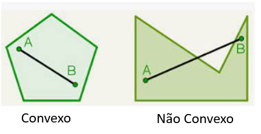{width="2.3229166666666665in"
height="1.1938713910761154in"}

Fazer figura semelhante

O polígono é convexo quando quaisquer dois pontos pertencentes ao
interior do polígono ao serem unidos formando um segmento de reto, este
segmento pertence totalmente ao polígono (não passa por fora, observe a
figura).

{width="3.072037401574803in"
height="1.7083333333333333in"}

Fazer figura semelhante

3 -- Relações de Euler

A relação de Euler nos ajuda a definir a quantidade de vértices, arestas
e faces.

{width="3.619792213473316in"
height="2.6666655730533684in"}

Refazer a imagem

4 -- Elementos da circunferência

{width="1.5302690288713912in"
height="1.5729166666666667in"}

Fazer imagem semelhante

-   Tangente -- um ponto em comum com a circunferência

-   Secante -- dois pontos em comum com a circunferência

-   Corda -- segmento de reta interior a circunferência que não passa
    pelo centro.

-   Diâmetro -- segmento de reta interior a circunferência que passa
    pelo centro.

-   Raio -- segmento de reta entre o centro a e borda da circunferência.

\colorsec{Atividades}

1\. Escreva as coordenadas dos A, B e C.

{width="2.5835575240594926in"
height="2.950255905511811in"}

Montar uma figura semelhante.

Deixar 2 linhas

BNCC: - SAEB: 9G1.1

A = (--1, 2); B = (2, 1) e C = (1, --3)

2\. O par ordenado de números que representa a igreja é:

{width="2.7in"
height="1.926729002624672in"}

Montar figura semelhante

Deixar 2 linhas

BNCC: - SAEB: 9G1.1

A igreja está localizado no ponto ( - 3, 2)

3\. Uma formiga sai de um ponto x, anda 6 metros para a esquerda, 5
metros para cima, 2 metros para a direita, 2 metros para baixo, 6 metros
para a esquerda e 3 metros para baixo, chegando ao ponto y. Qual a
distância entre x e y?

Deixar 2 linhas

BNCC: - SAEB: 9G1.1

{width="3.5419739720034995in"
height="2.800242782152231in"}

A distância será de 10 metros

4\. Relacione as duas colunas ligando as planificações aos respectivos
objetos tridimensionais

{width="3.45in"
height="2.1140430883639545in"}

Montar imagem semelhante

BNCC: - SAEB: 9G1.3

{width="3.45in"
height="2.1140430883639545in"}

Montar figura semelhante

5\. Um sólido geométrico convexo é formado por 8 faces triangulares, 10
faces quadrangulares e 12 faces hexagonais. Quantos vértices possui esse
sólido geométrico?

BNCC: - SAEB: 9G1.2

Sabemos que o total de faces é igual a 8 + 10 + 12 = 30, para determinar
o número de arestas somamos todas e dividimos por 2, pois elas cada
aresta é compartilhada entre duas faces.

8 · 3 + 10 · 4 + 12 · 6 = 24 + 40 + 72 = 136 → 136 ÷ 2 = 68 arestas.
Pela relação de Euler V + F = A + 2 → V + 30 = 68 + 2 → V = 40.

6\. Escreva os respectivos nomes dos segmentos
$\overline{\mathbf{\text{MN}}}$ e $\overline{\mathbf{\text{RS}}}$ e das
retas **a** e **b**:

{width="4.875422134733158in"
height="2.250194663167104in"}

BNCC: - SAEB: 9G1.8

$\overline{\mathbf{\text{MN}}}$ é corda

$\overline{\mathbf{\text{RS}}}$ é o diâmetro

A reta a é secante

A reta b é tangente

7\. Considere as figuras planificadas I e II

{width="3.933333333333333in"
height="2.183333333333333in"}

Montar figura semelhante

Estas planificações ao serem montadas de maneira tridimensional irão
gerar respectivamente:

a)  Prisma, Prisma

b)  Prisma, Cone

c)  Pirâmide, Prisma

d)  Prima, Pirâmide

BNCC: - SAEB: 9G1.3

A figura I irá gerar um prisma triangular e a figura II uma pirâmide
quadrangular.

Alternativa D.

8\. Uma pirâmide com base hexagonal possui quantas faces e quantos
vértices?

Deixar uma linha

BNCC: - SAEB: 9G1.2

Uma pirâmide com base hexagonal terá seis faces triangulares (laterais),
mais a base hexagonal, ou seja, serão 7 faces. Em relação aos vértices
terá os seis vértices da base e mais o vértice do topo, desta forma
serão 7 vértices.

9\. Uma cuia indígena é um tipo de cuia feita por indígenas, utilizando
técnicas e materiais tradicionais de suas culturas. As cuias indígenas
podem ser feitas de diferentes materiais, como cabaça, madeira, bambu,
taquara, entre outros, dependendo da região e da cultura de cada povo
indígena.

As cuias indígenas são usadas para diversas finalidades, dependendo da
cultura em que são produzidas. Um exemplo de uso é armazenar e servir
alimentos e bebidas.

A parte superior de uma determinada cuia tem a forma de uma
circunferência de 60 cm de comprimento.

{width="2.316666666666667in"
height="1.4083333333333334in"}

Fazer figura semelhante

Qual a medida em centímetros do raio dessa circunferência?

Use

a\) 10

b\) 12

c\) 15

d\) 20

BNCC: - SAEB: 9G2.7

Como o comprimento da circunferência é dado por
$C = 2\pi r = 2 \cdot 3 \cdot r = 60 \rightarrow r = 10$ cm.

Alternativa A.

10\. Nomeio os ângulos ACD e ABD como um ângulo central ou ângulo
inscrito.

{width="2.425in" height="2.4in"}

Montar figura semelhante com os pontos A, B, C e D. Não é necessário
deixar este pontilhado da parte de baixo.

ACD é um ângulo \_\_\_\_\_\_\_\_\_\_\_\_\_\_\_

ABD é um ângulo \_\_\_\_\_\_\_\_\_\_\_\_\_\_\_

BNCC: - SAEB: 9G1.8

ACD é um ângulo **central**. Porque o vértice está no centro da
circunferência.

ABD é um ângulo **inscrito**. Porque o vértice está sobre a
circunferência.

\colorsec{Treino}

1\. Considere um poliedro convexo que possui oito vértices e apenas
faces triangulares e quadrangulares. Sabe-se que o número de faces
triangulares desse poliedro é quatro vezes maior do que o número de
faces quadrangulares. Determine a quantidade de arestas presentes nesse
poliedro.

Sabe-se que Vértice + Face = Aresta + 2

a\)

b\)

c\)

d\)

BNCC: - SAEB: 9G1.2

Sejam e respectivamente, o número de faces triangulares e o número de
faces quadrangulares. Logo, como temos

em que é o número de arestas.

Ademais, se é o número total de faces, então

Portanto pela Relação de Euler, temos

A resposta é

2\. Uma pirâmide que possui 6 vértices e 6 faces tem como base um:

a\) triângulo

b\) quadrado

c\) pentágono

d\) hexágono

BNCC: - SAEB: 9G1.2

Por ser pirâmide o sólido obrigatoriamente terá um vértice no topo e o
restante na base, ou seja, 5 na base. Isso implica que a base é um
pentágono.

Alternativa C.

3\. Dos polígonos a seguir, indique aquele que é sempre regular.

a\) Retângulo

b\) Triângulo isósceles

c\) Trapézio

d\) Quadrado

BNCC: - SAEB: 9G1.4

Entre todas as figuras listadas temos que apenas o quadrado tem ângulos
internos iguais e lados iguais, por isso o único regular.

# Módulo 11: Geometria II

\conteudo{...}

1 -- Triângulos

Os triângulos podem ser classificados pela medida do lado ou pelos
ângulos:

[Lado]{.underline}

-   Triângulo escaleno: triângulo que possui todos os lados com medidas
    diferentes.

-   Triângulos isósceles: triângulo que possui dois lados com medidas
    iguais.

-   Triângulo equilátero: triângulo que possui todos os lados com
    medidas iguais.

[Ângulo]{.underline}

-   Triângulo acutângulo: possui todos os ângulos internos menores que
    90°.

-   Triângulo obtusângulo: possui exatamente um ângulo interno maior que
    90°.

-   Triângulo retângulo: possui exatamente um ângulo interno igual a
    90°.

[Propriedades]{.underline}

Estas são as principais propriedades dos triângulos:

-   A soma dos ângulos internos de qualquer triângulo é sempre igual a
    180°.

-   A soma dos ângulos externos de qualquer triângulo é sempre igual a
    360°.

-   A soma das medidas de dois lados de um triângulo é sempre maior que
    a medida do terceiro lado. Essa propriedade é chamada de
    desigualdade triangular, trata-se da condição de existência do
    triângulo.

2 -- Paralelas cortadas por uma transversal

Duas retas distintas são paralelas quando possuem a mesma inclinação, ou
seja, possuem o mesmo coeficiente angular. Além disso, a distância entre
elas é sempre a mesma e não possuem pontos em comum (não se cruzam).

Seja duas retas r e s, paralelas entre si e uma transversal t, não
perpendicular a r e s. Temos que os 8 (oito) ângulos formados pela reta
transversal com as retas r e s, quatro deles serão agudos (α) e
congruentes (mesma medida), os outros quatro serão obtusos (β) e
congruentes. Além disso, os ângulos obtusos e agudos serão suplementares
(medem 180°).

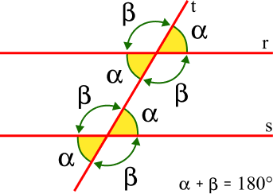{width="1.9635411198600174in"
height="1.3968044619422573in"}

Refazer a figura

\colorsec{Atividades}

1\. Determine o valor de x e os valores dos ângulos A e B.

{width="2.8333333333333335in"
height="1.6093875765529309in"}

Montar figura semelhante, colocando o ângulo 2x -- 60º = A e o ângulo
x/2 + 30º = B

BNCC: EF09MA14 SAEB: 9G1.10

Pela figura sabemos que os ângulos alternos externos são congruentes, ou
seja, A = B.

$$2x - 60 = \frac{x}{2} + 30$$

$$2x - \frac{x}{2} = 30 + 60 \rightarrow \frac{4x - x}{2} = 90 \rightarrow \frac{3}{2}x = 90 \rightarrow x = 60$$

X = 60º, A = B = 60º.

2\. Um retângulo foi desenhado em um plano cartesiano, com altura
determinada pelos vértices dos pontos A e B de coordenadas (1, 3) e (1,
4), respectivamente. Além disso, sabe-se que um ponto M de coordenadas
(3, 3) é o ponto médio da base do retângulo.

Qual é a área desse retângulo?

Deixar 3 linhas

BNCC: EF09MA16 SAEB: 9G2.3

Construindo o retângulo com vértices em A e B, podemos perceber que sua
altura será igual a 1 unidade. A distância entre o ponto A (1,3) e M
(3,3) é de 2 unidades, dado que M é ponto médio da base, podemos afirmar
que a base tem 4 unidades.

Assim para determinar a área, basta fazer 1 · 4 = 4 unidades quadradas
de área.

3\. Veja o texto:

**Futebol e Matemática**

A bola de futebol utilizada na Copa de 2010, na África do Sul, ganhou o
apelido de \"Jabulani\" e foi criticada pelos jogadores por ser mais
simples do que as bolas utilizadas desde a década de 1970, que
apresentam uma estrutura icosaedro truncado com 32 faces compostas por
12 pentágonos regulares e 20 hexágonos regulares. Cada um dos 60
vértices do icosaedro truncado é formado pela união de um pentágono e
dois hexágonos, resultando em 90 arestas para o sólido.

Qual soma dos ângulos internos do pentágono e hexágono respectivamente?

 Deixar 3 linhas

BNCC: - SAEB: 9G2.3

A soma dos ângulos internos é dada por:

S = (n -- 2)· 180º

Para pentágono temos: S = 3 · 180 = 540º

Para hexágono temos: S = 4 · 180 = 720º

4\. Um estudante fez um polígono inscrito em um círculo. Para executar
essa tarefa, ele dividiu o círculo em cinco arcos de mesma medida, e
marcou os pontos A, B, C, D e E.

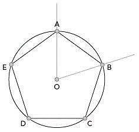{width="2.4529133858267715in"
height="2.317795275590551in"}

Determine a medida de AOB.

 Deixar 3 linhas

BNCC: - SAEB: 9G2.7

Como a circunferência foi dividida em 5 arcos, basta fazer 360 ÷ 5 =
72º, com AOB é ângulo central a medida do ângulo e arco é a mesma.

5\. Um polígono com ângulos centrais medindo 40º tem quantos lados? Qual
a medida do ângulo interno deste mesmo polígono?

 Deixar 3 linhas

BNCC: EF09MA11 SAEB: 9G2.7

Como o ângulo central tem medida 40º, podemos determinar o número de
lados do polígono utilizando o Ângulo de 360º: 360 ÷ 40 = 9. O polígono
tem 9 lados. A soma dos ângulo internos é dada por S = 7 · 180 = 1260,
logo cada ângulo interno é dado por 1260 ÷ 9 = 140º.

6\. Entre as medidas dos palitos dadas abaixo quais dela impossibilitam
a formação de um triângulo?

I - Três palitos de 7 cm cada;

II - Dois palitos de 7 cm e um palito de 15 cm;

III - Dois palitos de 10 cm e um palito de 13 cm;

IV - Um palito de 10 cm, um de 13 cm e outro de 15 cm.

 Deixar 5 linhas

BNCC: - SAEB: 9G1.5

Para testar a condição de existência de um triângulo, é preciso
verificar se a soma das medidas de dois lados quaisquer é maior do que a
medida do terceiro lado.

II - Dois palitos de 7 cm e um palito de 15 cm:

A soma das medidas de dois lados quaisquer é igual a 14 cm, que é menor
do que a medida do terceiro lado, que é de 15 cm. Portanto, não é
possível construir um triângulo com dois palitos de 7 cm e um palito de
15 cm.

 7. João montou um triângulo retângulo utilizando régua e compasso. Os
catetos formados tinham as medidas 12 cm e 16 cm. Com isso qual será a
medida do 3º lado?

 Deixar 4 linhas

BNCC: EF09MA13 SAEB: 9G2.4

Pelo teorema de Pitágoras temos:

x² = 12² + 16²

x² = 144 + 256

x² = 400 → x = 20.

Pode-se também utilizar da ideia do triângulo 3, 4 e 5 e perceber que é
semelhante ao triângulo do problema com razão de proporção 4. Ou seja,
bastaria fazer 4 · 5 = 20.

8\. Ao tentar construí um triângulo escaleno, ou seja, como todos os
lados diferentes quais são as opções para o terceiro lado, com medida
inteira, sabendo que os dois primeiros lados têm a medida 3 e 4?

 Deixar 5 linhas

BNCC: - SAEB: 9G1.5

Para construir um triângulo escaleno, é preciso que os três lados tenham
medidas diferentes. Se dois lados desse triângulo tiverem medidas
respectivamente iguais a 3 e 4, o terceiro lado só poderá ter uma medida
que não seja 3 e nem 4.

Descartamos o valor 1, pois a soma com 3 daria 4 que a medida de um dos
lados, pelo critério de existência do triângulo podemos usar os valores:
2, 5 e 6.

9\. Terrenos estão localizados entre as ruas das rosas e rua das flores,
sabendo que o proprietário pode optar por fazer a frente da casa par
qualquer uma das flores. Qual a medida, em metros, dos lotes na rua das
Flores?

{width="2.8916666666666666in"
height="1.9959558180227472in"}

Montar uma figura semelhante

BNCC: - SAEB: 9G2.6

Podemos calcular através do Teorema de Tales. Fazendo a proporção para
determinar os valores:

$$\frac{20}{x} = \frac{50}{64} \rightarrow 50x = 1\ 280 \rightarrow x = 25,6$$

$$\frac{60}{x} = \frac{50}{64} \rightarrow 50x = 3840 \rightarrow x = 76,8$$

10\. Determine o valor de α, sabendo que temos uma figura formada por 2
quadrados e um triângulo equilátero.

{width="2.900251531058618in"
height="1.3501170166229222in"}

Montar uma figura semelhante

BNCC: - SAEB: 9G2.7

Dado a formação com dois quadrados e um triângulo equilátero temos:

{width="2.975in"
height="1.5335050306211724in"}

Temos que x = 60º e y = 90º. Desta forma α será igual a:

α + 90 + 90 + 60 = 360, pois fecha a circunferência. Logo podemos
afirmar que α = 120º.

\colorsec{Treino}

1\. Um portão é formado por barras de fecho:

{width="3.3666666666666667in"
height="1.5166666666666666in"}\]

Fazer figura semelhante

Determine a medida da barra que está na diagonal.

a)  2

b)  2,5

c)  3

d)  4

BNCC: EF09MA13 SAEB: 9G2.4

Pelo Teorema de Pitágoras temos: x² = 1,5² + 2² → x² = 2,25 + 4 = 6,25 →
x = 2,5 m.

Alternativa B.

2\. Qual figura representa um trapézio escaleno?

{width="3.441965223097113in"
height="1.933500656167979in"}

Montar figura semelhante

a)  I

b)  II

c)  III

d)  IV

BNCC: EF09MA13 SAEB: 9G1.6

Para ser escaleno devemos ter todos os ângulos e lados diferentes e isso
ocorre apenas no item IV.

3\. Observe esta imagem que apresenta paralelas cortadas por resta
transversais.

{width="3.658333333333333in"
height="1.8463746719160106in"}

Fazer imagem semelhante

Determine o valor de x.

a)  12º

b)  20º

c)  24º

d)  48º

BNCC: EF09MA10 SAEB: 9G2.3

{width="4.15in"
height="2.159912510936133in"}

Fazer imagem semelhante

Primeiramente traçamos retas auxiliares cortando a estrutura nos
vértices. Aplicando a regra de transversais podemos seguir os seguintes
passos:

O valor 25º pode ser colocado como parte do ângulo de 43º, ou seja,
sobra 18º que pode ser comparado a parte do lado de 3x, por outro lado
temos a medida 54º que também é parte.

Assim temos:

3x = 54 + 18 = 72 → x = 24º.

Alternativa C.

# Módulo 12: Deslocamento usando coordenadas

\conteudo{...}

**Localização e movimentação**

Interpretar e construir representações espaciais são habilidades
fundamentais para a vida cotidiana das pessoas em diversas situações.
Compreender noções como trajetória, direção e sentido é essencial para
se localizar e comunicar posições e deslocamentos, tanto em ambientes
menores, como a sala de aula ou a própria casa, quanto em ambientes
maiores, como a cidade.

Ao interpretar uma representação espacial, é preciso selecionar
referências para se localizar e entender as informações presentes. Essas
referências podem ser pontos de referência físicos, como um edifício
alto ou uma praça, ou pontos de referência abstratos, como um cruzamento
ou uma interseção de ruas.

Já ao construir uma representação espacial, é necessário ter em mente as
noções de trajetória, direção e sentido para indicar com precisão a
posição e o deslocamento de objetos ou pessoas. Além disso, é importante
utilizar símbolos e legendas adequados para tornar a representação clara
e compreensível.

Em resumo, interpretar e construir representações espaciais, localizar
objetos e comunicar posições e deslocamentos são habilidades
fundamentais para a vida cotidiana. O entendimento de noções como
trajetória, direção e sentido é essencial para se localizar e
interpretar informações em ambientes de dimensões menores e maiores.

**Trajetória**

A trajetória é o caminho percorrido por um objeto, pessoa ou evento em
uma sequência de pontos, desde o ponto de partida até o ponto de
chegada. Ao longo da trajetória, podem existir pontos fixos que servem
como referência para a localização e orientação.

A trajetória pode apresentar deslocamentos em linha reta ou em linha
curva, dependendo do percurso que é seguido. A direção indica a
orientação em que o deslocamento ocorre, enquanto o sentido indica a
orientação em relação ao ponto de partida.

É importante entender e interpretar a trajetória, a direção e o sentido
em diversas situações do cotidiano, como na locomoção em uma cidade ou
na navegação em um mapa. Compreender essas noções é fundamental para se
orientar e se deslocar com segurança e eficiência.

Por exemplo, o deslocamento da Praça da Sé na cidade de São Paulo até a
NeoQuímica Arena (Arena Corinthians).

{width="3.3906244531933507in"
height="1.6853444881889763in"}

Disponível em:
<https://www.google.com.br/maps/dir/Pra%C3%A7a+da+S%C3%A9+-+S%C3%A9,+S%C3%A3o+Paulo+-+SP,+01001-000/Arena+Corinthians+-+Avenida+Miguel+Ign%C3%A1cio+Curi+-+Artur+Alvim,+S%C3%A3o+Paulo+-+SP/@-23.5331433,-46.5950426,12.74z/data=!3m1!5s0x94ce66de952b5e23:0x3333a5705850af9c!4m14!4m13!1m5!1m1!1s0x94ce59abaaae4233:0xd9186faf714bc5b1!2m2!1d-46.6342009!2d-23.5503099!1m5!1m1!1s0x94ce66dec98fb855:0xf2b061ffbcd2ecf8!2m2!1d-46.4742676!2d-23.5453221!3e0>

1\. Gustavo e Heitor utilizaram um tabuleiro quadriculado como tabuleiro
de um "jogo da velha", no qual as linhas são identificadas por letras,
e, as colunas, por números. Durante uma partida, Gustavo decidiu começar
o jogo pela casa destacada em cinza.

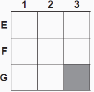{width="1.591804461942257in"
height="1.5584678477690288in"}

Construir a figura semelhante

Qual é a coordenada que o Gustavo decidiu começar a jogada?

BNCC: - SAEB 9G2.1

Ele começou pela casa G3.

2\. Observando um tabuleiro de xadrez com algumas peças escreva a
posição da peça
{width="0.2708333333333333in"
height="0.2763888888888889in"}

no tabuleiro.

{width="2.4027777777777777in"
height="2.271609798775153in"}

Montar figura semelhante, posição da peça influencia na resposta.

BNCC: - SAEB 9G2.1

A peça está na casa I3.

3\. Veja o mapa abaixo:

{width="2.7430555555555554in"
height="2.003744531933508in"}

Montar figura semelhante, posição influencia na resposta.

Eloisa disse para sua amiga Lara que mora numa rua entre as avenidas A e
B e entre as ruas da igreja e da locadora. Sendo assim, qual rua Eloisa
mora?

BNCC: - SAEB 9G2.1

Entre as avenidas A e B temos as ruas 2 e 4, mas entre a Igreja e
locadora temos a rua 4, logo é a rua da casa da Eloisa.

4\. Considerando o mapa da região onde Lucas mora escreva a localização
da escola.

{width="1.7152777777777777in"
height="1.7152777777777777in"}

Montar uma imagem semelhante

Deixe 1 linhas (pode ser na lateral da imagem)

BNCC: - SAEB 9G2.1

A escola está na coluna 3, linha E.

5\. O mapa abaixo é de um bairro, em que cada quadrado representa um
quarteirão, cuja a medida do lado de cada quadrado é de 100m.

{width="2.4375in"
height="1.8229166666666667in"}

Fazer imagem semelhante, é importante os dados

Maria saiu da esquina indicada pelo ponto Q e percorreu o seguinte
percurso:

> • caminhou 500 metros na direção Norte;
>
> • depois caminhou 200 metros na direção Oeste;
>
> • depois caminhou 300 metros na direção Sul;
>
> • e, finalmente, caminhou mais 200 metros na direção Oeste.

Ao final desse percurso, Maria chegou na esquina indicada pela letra:

a)  R

b)  T

c)  S

d)  P

BNCC: - SAEB 9G2.1

{width="1.5027668416447943in"
height="1.4513888888888888in"}

Fazer imagem semelhante, é importante os dados

Alternativa C.

6\. Luiz Felipe criou uma planta da sua casa para um trabalho da escola.

{width="2.5208333333333335in"
height="1.1814709098862641in"}

Fazer imagem semelhante, é importante os dados

Ao entrar pela porta da sala virar a esquerda, seguir até o final do
corredor e virar a esquerda novamente, a qual cômodo Luiz Felipe foi?

BNCC: - SAEB 9G2.1

{width="3.283617672790901in"
height="1.5834700349956254in"}

Fazer imagem semelhante, é importante os dados

Deixar 1 linha

Luiz Felipe chegou ao Quarto1.

7\. João e Marcos resolveram disputar uma corrida diferente, entre os
pontos A e B, partindo simultaneamente de A e deslocando-se
rigorosamente sobre as linhas tracejadas das alamedas.

{width="3.0069444444444446in"
height="1.3684667541557305in"}

Fazer imagem semelhante, é importante os dados

Qual a diferença, em metros, da distância percorrida pelo João e Marcos?

Deixar 2 linhas

BNCC: - SAEB 9G2.1

A distância percorrida pelo amigo da bicicleta foi: 150 + 150 + 250 +
250 + 150 + 150 = 1 100 metros. O amigo a pé 250 + 250 = 500 m.
Diferença entre eles: 1 100 -- 500 = 600 metros.

8\. O mapa de uma região de uma cidade do interior está representado na
figura abaixo.

{width="2.9652777777777777in"
height="2.9652777777777777in"}

Fazer imagem semelhante, é importante os dados

Deixar 1 linha

Jorge saiu da praça central e, orientando-se por esse mapa, caminhou 3
quadras na direção oeste e, depois, 2 quadras na direção sul. Em qual
local Jorge chegou?

BNCC: - SAEB 9G2.1

Jorge chegou ao Posto de Saúde.

{width="1.9513888888888888in"
height="1.8464752843394576in"}

9\. Carlos precisa sair do ponto A e chegou no ponto D. Faça a indicação
de qual menor caminho para interligar ponto A ao ponto D.

{width="2.4027777777777777in"
height="1.5385772090988628in"}

Fazer imagem semelhante, é importante os dados

Deixar 2 linhas

BNCC: - SAEB 9G2.1

Carlos pode ter saído do ponto A pela Avenida Orla por 1 quarteirão,
virar a direita na Rua Paraguai e seguir até o cruzamento da Avenida
Projetada.

10\. Um turista caminhou por todo os pontos turísticos, a distância
entre os pontos estão em quilômetros.

{width="2.7777777777777777in"
height="2.5in"}

Fazer imagem semelhante, é importante os dados

Saindo de A, passando por B, C, D, E e retornando ao ponto A. Qual a
distância total percorrida, em km?

Deixar 2 linhas

BNCC: - SAEB 9G2.1

90 + 153 + 121 + 239 + 117 = 720 km.

\colorsec{Treino}

1\. Observe a imagem:

Fazer imagem semelhante, é importante os dados

Qual a distância entre a casa da Silva e Paula?

a)  100 m

b)  200 m

c)  300 m

d)  400 m

BNCC: - SAEB 9G2.1

Alternativa D. São 2 quadras ao Sul e duas quadras ao Leste

> 2\. Qual é a melhor maneira de determinar sua localização exata em um
> mapa?
>
> a\) Usando um sistema de orientação, como uma bússola ou GPS.
>
> b\) Estimando sua posição com base em pontos de referência próximos.
>
> c\) Adivinhando sua posição com base em sua experiência anterior na
> área.
>
> d\) Olhando para o mapa e tentando comparar com o ambiente ao seu
> redor.

BNCC: - SAEB 9G2.1

A resposta correta é a alternativa A.

Usando um sistema de orientação, como uma bússola ou GPS.

3\. Determine a distância entre a casa de Lucas e a escola.

{width="3.2916666666666665in"
height="1.7916666666666667in"}

Fazer imagem semelhante, é importante os dados

a\) 3 Norte e 2 Leste

b\) 2 Norte e 3 Leste

c\) 5 Sul e 2 Oeste

d\) 3 Norte e 4 Leste

BNCC: - SAEB 9G2.1

Alternativa A. Subiu 3 quadras Norte e 2 quartas Leste.

# Módulo 13: Estatística

\conteudo{...}

A moda, a média e a mediana são medidas de tendência central usadas na
estatística para resumir um conjunto de dados.

A moda é o valor mais comum em um conjunto de dados, ou seja, é o valor
que aparece com mais frequência. É útil para dados discretos e pode ser
usada em combinação com outras medidas de tendência central.

A média é a soma de todos os valores em um conjunto de dados dividida
pelo número de valores. É a medida mais comum de tendência central e é
útil para dados contínuos. No entanto, é sensível a valores extremos,
que podem distorcer o resultado.

A mediana é o "valor do meio" em um conjunto de dados quando eles são
colocados em ordem crescente ou decrescente. É uma medida robusta de
tendência central, ou seja, é menos afetada por valores extremos do que
a média. A mediana é útil para dados com valores extremos ou
distribuição assimétrica. Para calcular a mediana organizam-se os dados
de forma crescente ou decrescente. Esta lista é o ROL de dados. Após,
verificamos se a quantidade de dados no ROL é par ou ímpar.

-   Se a quantidade de dados no ROL é ímpar, a mediana é o valor do
    meio, da posição central.

-   Se a quantidade de dados no ROL é par, a mediana é a média
    aritmética dos valores centrais.

Em geral, a escolha da medida de tendência central depende da natureza
dos dados e do objetivo da análise estatística. Cada medida pode ser
útil em diferentes contextos e situações.

\colorsec{Atividades}

a)  Complete a frase

João no 1º trimestre tirou as notas parciais 5,0 na prova 1 e 3,0 na
prova 2. Portanto sua média foi \_\_\_. No entanto, se tivesse tirado
\_\_\_ na segunda prova, sua média seria 6,0.

BNCC: EF09MA21 SAEB: 9E1.4

A média é: $\frac{5 + 3}{2} = 4$. Com a segunda prova igual a 6,0 a
média seria $\frac{5 + 6}{2} = 5,5$.

2\. Carlos e Anderson tiveram a mesma nota na disciplina de Álgebra.
Carlos tirou as seguintes notas7,0 e 5,0. Anderson tirou 8,0 em uma das
provas, qual foi a nota na segunda prova?

Deixar 2 linhas

BNCC: EF09MA21 SAEB: 9E1.4

A média de Carlos é: $\frac{7 + 5}{2} = 6$. Anderson em uma das provas
tirou 8,0. A média de Anderson também é 6, sendo assim temos que
$\frac{x + 8}{2} = 6 \rightarrow x + 8 = 12 \rightarrow x = 4$.

3\. Construa um gráfico de setor com base na tabela a seguir,
representando-a em porcentagem.

  **Marca**   **Pessoas**
  ----------- -------------
  A           30
  B           70
  C           45
  D           55

Deixar espaço de 5 linhas

BNCC: EF09MA22 SAEB: 9E1.4

{width="2.4166666666666665in"
height="2.4363681102362205in"}

4\. Uma loja fez um levantamento para saber como estava distribuído o
atendimento dos clientes ao longo do dia para poder decidir sobre novas
contratações para atender o horário com maior fluxo de clientes.

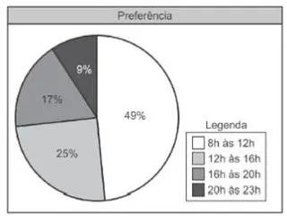{width="3.325984251968504in"
height="2.5826771653543306in"}

Monta figura semelhante

Qual o horário que deve ter mais funcionários para atender?

BNCC: EF09MA22 SAEB: 9E1.4

Dado a distribuição dos horários é perceptível que a grande maioria dos
clientes frequentam a loja das 8h às 12h.

5\. Foi realizada uma pesquisa sobre a possibilidade de alterar o
horário de início das aulas de uma grande escola das 7h30 para às 7h.
3700 famílias responderam a pesquisa e tiveram ruas respostas tabuladas
e colocadas em um gráfico de setores.

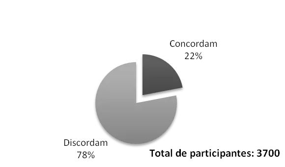{width="3.346771653543307in"
height="1.9606299212598426in"}

Fazer uma nova imagem

Quantas pessoas concordaram com a mudança?

a\) 925

b\) 814

c\) 740

d\) 555

BNCC: EF09MA22 SAEB: 9E2.1

Precisamos calcular 22% de 3700 = 0,22 · 3700 = 814 pessoas.

6\. Em uma aula de Matemática os estudantes receberam a tarefa de medir
a largura da sala. Após a medição, os estudantes colocaram os resultados
encontrados na lousa.

5,35 5,21 5,74 5,19 4,96 5,80 5,56 5,94 5,56 4,98 6,10 5,38 5,74 5,65

O professor ao perceber que os alunos não foram muito precisos em suas
medidas propôs uma nova proposta, perguntando quais são os valores
relativos à moda e mediana?

Deixar 4 linhas

BNCC: EF09MA22 SAEB: 9E1.5

Primeiramente precisamos organizar o rol de informações

4,96 4,98 5,19 5,21 5,35 5,38 5,56 5,56 5,58 5,74 5,74 5,74 5,94 6,1

Com isso podemos facilmente perceber que a moda é 5,74 , porque se
repete mais vezes. Como temos uma quantidade par de elementos, pois
temos 14 medições a mediana é dada pela média aritmética entre o 7º e 8º
elemento do rol, que neste caso ambos tem o valor 5,56 , sendo assim a
mediana é 5,56.

7\. Uma cidade investiu em tratamento de água de chuva. A análise da
água tradada revelou os dados apresentados no gráfico da quantidade em
m³ x mês.

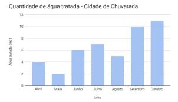{width="4.9558552055993in"
height="2.5069444444444446in"}

Fazer novo gráfico

b)  Qual mês registrou a menor quantidade e qual registrou a maior
    quantidade de água de chuva tratada nesse período?

Deixar 1 linha

c)  Sabendo que em junho foram tratados 6 m³ de água, qual a porcentagem
    de aumento para o mês de setembro?

Deixar 3 linhas

BNCC: EF09MA22 SAEB: 9E2.3

d)  A menor quantidade foi registrada no mês de maio com 2m³ e a maior
    foi em outubro com 11m³.

e)  Como em junho foram tratados 6 m³ de água e em setembro foram
    tratados 10 m³ tivemos um aumento de 4 m³ o que representa um
    aumento aproximado de 66,67%

8\. O gráfico a seguir representa a quantidade de casas que uma
imobiliária alugou em cada mês em uma determinada cidade.

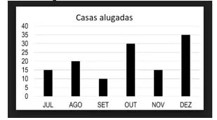{width="3.2116535433070865in"
height="1.779527559055118in"}

Montar gráfico semelhante.

Qual é a mediana da quantidade de casas alugadas?

BNCC: EF09MA22 SAEB: 9E1.5

Primeiramente precisamos organizar o rol de informações

10 , 15 , 15 , 20 , 30 , 35 . Por ter 6 elementos a mediana é
determinada pela média aritmética entre os elementos centrais que são 15
e 20, ou seja, a mediana é dada pelo valor 17,5.

9\. Uma auditoria de uma montadora do grande ABC paulista levantou os
dados da tabela:

{width="3.4166666666666665in"
height="0.8541666666666666in"}

Montar tabela

O gráfico que melhor representa a quantidade da produção vendida por
essas três montadoras é:

Montar os gráficos de cada alternativa, importante os títulos dos eixos

a\)

{width="1.8501607611548556in"
height="1.5751367016622921in"}

b\)

{width="1.841826334208224in"
height="1.4334580052493437in"}

c\)

{width="2.016841644794401in"
height="1.900165135608049in"}

d\)

{width="1.8918307086614172in"
height="2.2668635170603673in"}

BNCC: EF09MA21 SAEB: 9E1.2

A alternativa que apresenta os valores correspondente ao da tabela é a
alternativa C. É importante verificar que o gráfico representa a
quantidade vendida e não a quantidade produzida. Caso seja marcada a
alternativa B ficará perceptível que foi levado em consideração a
quantidade produzida.

10\. Uma loja de queijos fez a contagem de queijos canastra vendidos ao
longo de 2022 em forma do pictograma abaixo:

{width="2.9791666666666665in"
height="1.7163921697287838in"}

Refazer o gráfico, sugiro usar a imagem de queijos meia cura.

Qual a quantidade de queijos vendidos por mês?

BNCC: EF09MA21 SAEB: 9E2.1

Setembro: 200 + 100 = 300

Outubro: 3 · 200 + 50 = 650

Novembro: 2 · 200 + 150 = 550

Dezembro: 4 · 200 = 800

\colorsec{Treino}

f)  Um studio de danças fez pesquisa sobre as suas turmas

{width="3.048611111111111in"
height="1.3472222222222223in"}

Fazer nova tabela

Qual a quantidade de alunos que fazem Ioga ou Dança no período da tarde?

a\) 15

b\) 8

c\) 23

d\) 30

BNCC: EF09MA21 SAEB: 9E1.2

Pela tabela temos que 15 alunos fazem Dança no período da tarde e 8
fazem Ioga no período da tarde. Sendo assim a reposta correta é 23,
alternativa C.

2\. Veja o gráfico sobre formas de pagamento

{width="3.75in"
height="2.3477187226596676in"}

<https://s2.glbimg.com/cULAdhFJ_T233T8LcZE3axW8tAA=/984x0/smart/filters:strip_icc()/i.s3.glbimg.com/v1/AUTH_63b422c2caee4269b8b34177e8876b93/internal_photos/bs/2022/7/A/DB4wyNRGAeb1vhvBiDJw/arte25emp-101-market-b6.jpg>
\<Acessado 15/03/2023 -- Jornal Valor Econômico\>

Quais dos meios de pagamento apresenta maior perspectiva de crescimento?

a\) Cartão de crédito

b\) Pix

c\) Boleto

d\) Wallets

BNCC: EF09MA21 SAEB: 9E2.2

Analisando os dados pode-se perceber que a expectativa de crescimento de
pagamento por pix apresenta um crescimento esperado acima de 230 %,
enquanto os outros apresentam crescimento aproximados:

Cartão: 69%, Wallets 77% e Boleto 47%.

3\. O uso de internet pelo celular tem crescido significativamente nos
últimos anos, impulsionado pela popularidade cada vez maior dos
smartphones e pela melhoria da infraestrutura de telecomunicações. Isso
permite que as pessoas acessem a internet em qualquer lugar e a qualquer
momento, facilitando o acesso à informação e a comunicação.

{width="3.508251312335958in"
height="2.3333333333333335in"}

Disponível em
<https://g1.globo.com/economia/tecnologia/noticia/2019/08/28/uso-da-internet-no-brasil-cresce-e-70percent-da-populacao-esta-conectada.ghtml>
\<acessado em 15/03/2023\>

Baseado nas informações e no gráfico podemos inferir que:

a\) Estão sem alterações as escolhas para acessar internet.

b\) O uso de computadores para acesso a internet tem crescido de maneira
considerável.

c\) O uso de celulares como único meio de acesso a internet é o que mais
cresce segundo o gráfico.

d\) Todos os meios de acesso a internet estão estáveis desde 2014.

BNCC: EF09MA21 SAEB: 9E2.2

O gráfico apresenta um crescimento da curva de acesso exclusivo pelo
celular quando comparado com os outros meios de acesso.

Alternativa c.

# Módulo 14: Unidades de medida

\conteudo{...}

As unidades de medidas de comprimento surgem para padronizar as medidas
de distância. Existem várias unidades de medidas de comprimento, a
utilizada no sistema internacional de unidades é o metro, e seus
múltiplos (quilômetro, hectômetro e decâmetro) e submúltiplos
(decímetro, centímetro milímetro).

Além das unidades de medidas de comprimento apresentadas, existem outras
como as que utilizam o corpo como parâmetro: o palmo, o pé, a polegada.
Ainda, há aquelas que não são do sistema internacional, mas são
utilizadas a depender da região ou de medidas astronômicas, como a
légua, a jarda, a milha e o ano-luz.\"

[Mudança de unidade de medida linear]{.underline}

{width="1.6336636045494313in"
height="0.765670384951881in"}

Refazer imagem

[Mudança de unidades de medida: volume e capacidade]{.underline}

a)  Volume

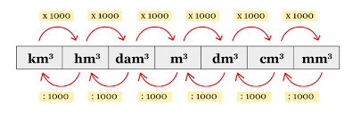{width="2.8731769466316712in"
height="0.9207917760279966in"}

Refazer imagem

b)  Capacidade

{width="2.736570428696413in"
height="1.0693066491688539in"}

Refazer imagem

IMPORTANTE

1 m³ = 1 000 Litros

1 cm³ = 1 mL

1 dm³ = 1 Litro

\colorsec{Atividades}

1\. Nanômetro (nm) é uma unidade de medida que equivale a um bilionésimo
de 1 metro e que tem grande relevância na indústria de semicondutores.
Essa é a escala usada para medir dimensões no interior de qualquer
microchip: módulos de memória, SSDs, processadores e GPUs.

Disponível em:
<https://www.techtudo.com.br/noticias/2016/10/o-que-sao-nanometros-e-por-que-eles-sao-tao-importantes-na-tecnologia.ghtml>
\<Acessado em 14/03/2023\>.

Represente o valor de 250 nanômetros em m.

Deixar 1 linha

BNCC: EF09MA18 SAEB: 9M2.1

Como um nanômetro é a bilionésima parte de 1 metro podemos calcular que
250 nanômetros é o mesmo que $250 \cdot 10^{- 9} = 0,00000025$ m ou
$2,5 \cdot 10^{- 7}$ m.

2\. Observe o infográfico abaixo:

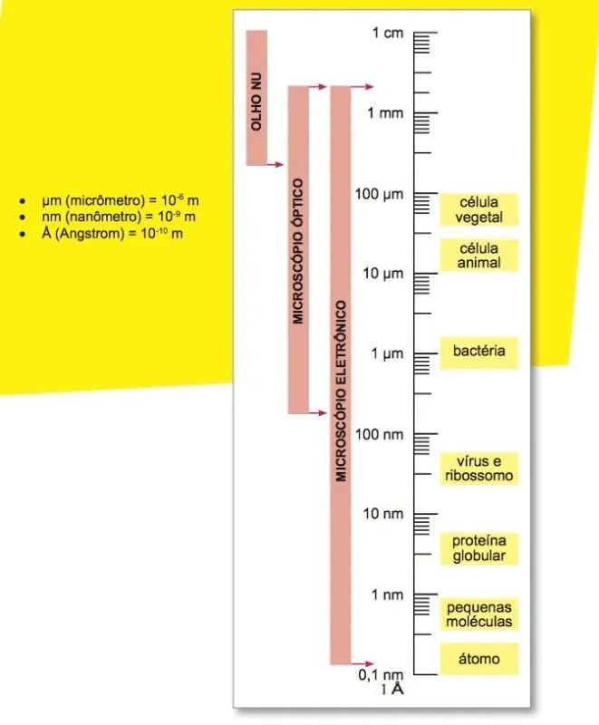{width="4.240629921259843in"
height="5.133858267716535in"}

Fazer figura semelhante

Baseado nos dados abaixo e sabendo que o vírus Influenza mede 100 nm, o
vírus da febre amarela mede 20 nm e Staphylococcus que mede 1 000 nm.
Destes elementos citados quais podem ser vistos apenas por microscópio
eletrônico e quais podem também ser vistos por microscópico óptico?

Deixar 1 linha

 BNCC: EF09MA18 SAEB: 9M2.1

O vírus Influenza e de febre amarela pela escala apenas no microscópico
eletrônico, mas o Staphyloccus pode ser visto em ambos, pois tem mais de
100 nm.

3\. Uma distância muito famosa e a distância entre a Terra e a Lua que é
384 400 km. Qual é esta medida em metros?

Deixar 1 linha

 BNCC: EF09MA18 SAEB: 9M2.1

Para transformar medidas de km para m basta multiplicar por 1 000, ou
seja, a distância entre a Terra e a Lua é 384 400 000 metros.

4\. Uma estrela famosa é a Próxima Centauri, a estrela mais próxima do
sistema solar. Ela está localizada na constelação de Centaurus e tem uma
distância de cerca de 4,2 anos-luz da Terra. Próxima Centauri é uma
estrela anã vermelha, com uma magnitude aparente de 11, e é parte do
sistema estelar triplo Alpha Centauri. É conhecida por abrigar um
planeta potencialmente habitável.

Um ano-luz é a distância que a luz viaja no vácuo durante um ano
juliano, que tem uma duração média de 365,25 dias. Essa distância é de
cerca de 9,46 trilhões de quilômetros ou 5,88 trilhões de milhas. O
ano-luz é uma unidade de medida usada principalmente em astronomia para
descrever distâncias entre estrelas e galáxias.

A distância da Próxima Centauri em relação a Terra corresponde a quantos
dias completos?

Deixar 3 linhas

 BNCC: EF09MA18 SAEB: 9M2.1

Um ano-luz é a distância percorrida pela luz em um ano juliano, que tem
365,25 dias. Portanto, para calcular o número de dias em 4,2 anos-luz,
podemos multiplicar 4,2 por 365,25:

4,2 anos-luz · 365,25 dias/ano = 1 534,05 dias

Então, 4,2 anos-luz correspondem a aproximadamente 1 534 dias inteiros.

5\. Observando uma lata de suco, verificamos que seu conteúdo é de 355
ml. Esta mesma quantidade pode ser expressa em \_\_\_ litro(s). Complete
a a frase anterior.

 BNCC: EF09MA19 SAEB: 9M2.1

Como 1 litro é o mesmo que 1 000 ml, o valor que completa a frase é
0,355 .

6\. Junior fez uma piscina em sua casa, sendo que a piscina tem 1,5
metro de profundidade, 3 metros de comprimento e 2 de largura. Caso
decida por colocar água até a altura de 1,2 m para evitar desperdício de
água, quantos litros serão necessários?

Deixar 3 linhas

 BNCC: EF09MA19 SAEB: 9M2.1

Para calcular o volume de água necessário basta multiplicar as três
medidas 3 · 2 · 1,2 = 7,2 m³ = 7 200 litros, pois 1 m³ = 1 000 litros.

7\. Antigamente as embalagens que armazenavam óleo de soja eram
cilíndricas e de metal. Sabendo que na lata cabiam 900 ml, considerando
que o raio era de 3 cm e considerando $\pi = 3$, calcule a altura mínima
necessária.

Deixar 3 linhas

 BNCC: EF09MA19 SAEB: 9M2.1

$$V = 900\ ml$$

$900 = 3 \cdot 3^{2} \cdot h \rightarrow h = \frac{900}{27} \cong 33,3\ cm$

8\. Uma caixa d\'água em formato de bloco retangular tem capacidade para
1 500 L. Considerando-se que ela seja completamente cheia 3 vezes por
dia, quantos metros cúbicos de água são usados para enchê-la durante um
mês de 30 dias?

Deixar 3 linhas

 BNCC: EF09MA19 SAEB: 9M2.1

1 500 L = 1,5 m³. Como a caixa é completamente cheia 3 vezes ao dia por
30 dias, temos:

1,5 · 3 · 30 = 135 m³.

9\. Calcule a área do polígono:

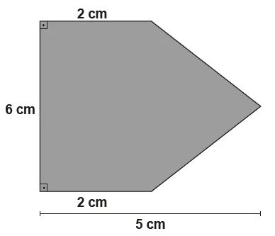{width="1.7787117235345582in"
height="1.5277777777777777in"}

Deixar 4 linhas.

Fazer figura semelhante

 BNCC: EF09MA19 SAEB: 9M2.3

Para determinar a área vamos dividir a figura.

{width="1.6555555555555554in"
height="1.326738845144357in"}

A área do triângulo pode ser calculada por:

$\frac{6 \cdot 3}{2} = 9$ cm²

A área do retângulo: 6 · 2 = 12 cm², somando área 1 com área 2 temos: 21
cm².

10\. Janaina quer fazer uma festa para comemorar seu aniversário. Em
suas contas em média as pessoas irão consumir em média dois copos de 300
ml, sabendo que Janaina tem a expectativa de 70 pessoas, quantas
garrafas de 2 litros ela deverá comprar?

Deixar 3 linhas

 BNCC: EF09MA19 SAEB: 9M2.1

Calculando a expectativa de pessoas temos:

70 · 2 · 300 = 42 000 ml = 42 litros = 21 garrafas de 2 litros.

\colorsec{Treino}

1\. Para fazer um determinado prato, Alessandra precisa de 1 kg de carne
para cada receita. Ao tirar o pacote de carne da geladeira, vê que ele
tem apenas 625 gramas. De quantos gramas de carne ela ainda precisa para
fazer duas receitas?

a\) 1375 gramas.

b\) 1750 gramas.

c\) 950 gramas.

d\) 967 gramas.

 BNCC: EF09MA19 SAEB: 9M2.1

Para fazer duas receitas, problema vemos que se consideremos Que serão
necessários 2kg, mas por hora temos 625 g, ou 0,625 kg. Desta forma
falta:

2 000 -- 625 = 1375 gramas faltando.

Alternativa A.

2\. Uma piscina recebe tratamento diário com um produto na proporção de
50 gramas para cada 1 000 litros. A piscina tem as seguintes medidas:
1,0 m x 2,0 m x 3,5 m. Qual o volume o piscineiro deve levar em
consideração para colocar o produto na piscina e qual a quantidade de
produto respectivamente ele deve utilizar?

{width="2.7in"
height="2.177419072615923in"}

<https://www.shutterstock.com/pt/image-illustration/swimming-pool-3d-rendered-illustration-isolated-73423618>

a\) 5,5 m³, 275 g.

b\) 7 m³, 350 g.

c\) 6,5 m³, 325 g.

d\) 3,5 m³, 700 g.

 BNCC: EF09MA19 SAEB: 9M2.4

O volume da piscina é 1 · 2 · 3,5 = 7 m³, ou seja, 7 000 litros. O
produto é usado na proporção de 50 gramas a cada 1 000 litros, sendo
assim, precisará de 7 · 50 = 350 gramas.

Alternativa B.

3\. Uma caixa em forma de cilindro reto foi instalada em um condomínio
para resolver um problema de falta d'água. Percebeu-se no projeto que os
engenheiros calcularam errado a demanda de uso de água do condomínio e
que seria necessário mais um reservatório de 20 000 litros. Sabendo-se
que a caixa tem 1,5 metros de raio e altura de 3 metros, podemos afirmar
que após a instalação a demanda:

{width="3.2944444444444443in"
height="2.9166666666666665in"}

<https://www.shutterstock.com/pt/image-vector/water-tank-vector-wallpaper-on-white-1346364413>

a\) foi atendida e sobrou 250 litros.

b\) foi atendida e sobrou 1 195 litros.

c\) não foi atendida, pois faltou 250 litros.

d\) não foi atendida, pois faltou 13 250 litros.

 BNCC: EF09MA19 SAEB: 9M2.4

Calculando o volume do cilindro instalado como reservatório temos:

$V = {1,5}^{2} \cdot 3,14 \cdot 3 = 21,195\ m³$, ou seja, 21 195 litros,
o que atendeu a demanda com a sobra de 1 195 litros. Alternativa B.

# Módulo 15: Probabilidade

\conteudo{...}

Probabilidade é o estudo das chances de obtenção de cada resultado de um
experimento aleatório. A essas chances são atribuídos os números reais
do intervalo entre 0 e 1. Resultados mais próximos de 1 têm mais chances
de ocorrer. Além disso, a probabilidade também pode ser apresentada na
forma percentual.

Usamos com notação para probabilidade de ocorrer um evento A como sendo
P(A) e pela definição este valor está entre 0 e 1 incluindo estes.

[Experimento aleatório]{.underline}: É qualquer experiência cujo
resultado não seja conhecido, por exemplo, observar a face voltada para
cima de um dado, ou de uma moeda lançada. [Espaço Amostral]{.underline}:
Conjunto formado por todos os resultados possíveis.

[Evento]{.underline}: É um subconjunto do espaço amostral.

[Cálculo da probabilidade]{.underline}

Seja um evento A, a probabilidade de A ocorrer é dado por:

$$P\left( A \right) = \frac{Quantidade\ de\ casos\ favoráveis\ ao\ evento}{\text{Total\ de\ possibilidades}}$$

Exemplo:

Qual a probabilidade em um lançamento de um dado honesto sair um número
maior que 1?

Evento: Sair número maior que 1, {2, 3, 4, 5 e 6}

Espaço Amostral: {1, 2, 3, 4, 5 e 6}

$P\left( A \right) = \frac{5}{6}$.

\colorsec{Atividades}

1\. Um dado foi construído com duas faces 4 e nenhuma face 3. Ao lançar
o dado qual a probabilidade de sair o número 4?

Deixar duas linhas

 BNCC: EF09MA19 SAEB: 9E2.4

Para calcular esta probabilidade temos que levar em consideração que
entre as 6 faces tem duas delas com o número 4, sendo assim,
$P\left( A \right) = \frac{2}{6} = 33,3\%.$

2\. Lançando um dado e uma moeda, qual a probabilidade de obter Cara e
um número maior que 2?

Deixar duas linhas

 BNCC: EF09MA19 SAEB: 9E2.4

Para calcular esta probabilidade temos que levar em consideração que
entre as 6 faces tem 4 delas com o número maior que 2 e a chance de sair
cara na moeda é de 1 pra 2, sendo assim, seja A o evento sair número
maior que 2 no lançamento do dado e B sair cara no lançamento da moeda,
temos que: $P\left( A \right) = \frac{4}{6} = \frac{2}{3}$,
$P\left( B \right) = \frac{1}{2}$ e a chance de ocorrer A e B é dada
pelo produto das probabilidade de cada evento:
$P\left( A \right) \cdot P\left( B \right) = \frac{2}{3} \cdot \frac{1}{2} = \frac{1}{3}.$

3\. A \_\_\_\_\_\_\_\_\_\_\_\_\_\_\_ de um
\_\_\_\_\_\_\_\_\_\_\_\_\_\_\_\_\_\_\_ depende diretamente do número de
elementos do seu \_\_\_\_\_\_\_\_\_\_\_\_\_\_\_\_\_. O evento que ocorre
sem interferência de fatores externos é dito
\_\_\_\_\_\_\_\_\_\_\_\_\_\_\_\_\_\_\_\_\_\_\_\_\_\_\_\_\_.

Complete a frase acima:

Aleatório Espaço Amostral Evento Probabilidade

 BNCC: EF09MA19 SAEB: 9E2.4

A frase completa é:

A **probabilidade** de um **evento** depende diretamente do número de
elementos do seu **espaço amostral**. O evento que ocorre sem
interferência de fatores externos é dito **aleatório**.

4\. Relacione as duas colunas

 

   (1) Evento             ( ) É o conjunto finito composto por todas as possibilidades de ocorrência de um evento.
  ----------------------- ------------------------------------------------------------------------------------------
  \(2\) Espaço amostral   ( ) É um subconjunto do espaço amostral.
  \(3\) Aleatório         ( ) Sempre é um número real positivo pertencente ao intervalo \[0,1\].
  \(4\) Probabilidade     ( ) Não sofre influência de fatores externos ao evento.

  BNCC: EF09MA19 SAEB: 9E2.4

A correspondência em ordem é:

2 -- 1 -- 4 -- 3

5\. Fernando viajou e levou na mochila apenas 5 camisetas distintas e 3
calças, sendo estas azul, preta e bege.

Sabendo que Fernando já escolheu a camiseta, mas está em dúvida sobre a
calça. Qual a probabilidade de que ele escolha a calça azul?

  BNCC: EF09MA19 SAEB: 9E2.4

Dado que a camiseta foi escolhida não precisamos levar em consideração
esta escolha para determinar a probabilidade da calça a ser escolhida.
São 3 possibilidades e 1 escolha, ou seja,
$P\left( A \right) = \frac{1}{3}$.

6\. Analisando as informações sobre a qualidade de determinado produto
de iluminação foi gerada a tabela:

+--------+----------------+--------------+----------------+
|        |                | INTENSIDADE  |                |
+========+================+==============+================+
|        |                | SATISFATÓRIA | INSATISFATÓRIA |
+--------+----------------+--------------+----------------+
| > VIDA | SATISFATÓRIA   |              |                |
| >      |                |              |                |
| > ÚTIL |                |              |                |
+--------+----------------+--------------+----------------+
|        | INSATISFATÓRIA |              |                |
+--------+----------------+--------------+----------------+

 Ao escolher um produto ao acaso, qual a probabilidade dele ser
reprovado na Intensidade e na Vida útil?

{width="1.8666666666666667in"
height="1.8666666666666667in"}

https://labs.openai.com/s/MH4cirXDETwaVt7t4vCK3esf

BNCC: EF09MA19 SAEB: 9E2.4

De acordo com a tabela temos um total de 117 + 8 + 3 + 2 = 130 produtos
avaliados, deste apenas 2 estão na coluna INSATISFATÓRIA dos dois
fatores, sendo assim temos que a probabilidade será:
$P\left( A \right) = \frac{2}{130}$.

7\. Em um estudo laboratorial envolvendo cobaias para estudar os fatores
genéticos que determinavam cada tipo de cor de pelos, os estudantes
tomaram nota destes dados:

  **Números de descendentes**                                     
  ----------------------------- ------- -------- ------- -------- -------
  Ninhada                       Preto   Marrom   Creme   Albino   Total
  1ª                            5       3        0       2        10
  2ª                            0       4        2       2        8
  3ª                            0       5        0       4        9
  Total                         5       12       2       8        27

Sabendo que as cobaias estão todas juntas, ao escolher ao acaso um
descendente Albino, qual a probabilidade que ele seja da 1ª ninhada?

Deixar 3 linhas

BNCC: EF09MA19 SAEB: 9E2.4

As cobaias albinas são em seu total 8, como na 1ª ninhada temos 2
cobaias a probabilidade será: $P\left( A \right) = \frac{2}{8} = 25\%$

8\. Em uma escola a escolha do representante de sala é feita por
sorteio. Em uma turma em que temos 12 meninas e 20 meninos, qual a
probabilidade de o representante ser do sexo feminino?

Deixar 2 linhas

BNCC: EF09MA19 SAEB: 9E2.4

Para determinar esta probabilidade devemos estabelecer a seguinte razão:

$P\left( A \right) = \frac{12}{32} = 37,5\%$.

 9. Uma empresa premia seu funcionário quando atingem a meta de
trabalho, mas devido a crise foi necessário limitar a premiação. Este
ano será apenas 1 smartphones para ser entregue, ficou combina que caso
mais funcionários atinjam a meta, o smartphone será sorteado.

 Ao terminar a apuração foi verificado que 5 funcionários atingiram a
meta, entre eles, João Pedro. Ao realizar o sorteio, qual a chance de
João Pedro não ser um o sorteado?

BNCC: EF09MA19 SAEB: 9E2.4

João Pedro tem 1 chance em 5 possíveis, ou seja, a chance de João ganhar
é de $P\left( A \right) = \frac{1}{5} = 20\%$, sendo assim, a chance de
não ganhar é de 80%.

10\. Os tipos sanguíneos são 4, como consta na tabela abaixo, sendo
ainda que existem ainda dois fatores o Rh+ e Rh-. As pessoas do tipo O
com Rh-- são consideradas doadoras universais e as do tipo AB com Rh+
são receptoras universais.

             **A**   **B**   **AB**   **O**
  ---------- ------- ------- -------- -------
  **Rh+**    37      44      33       85
  **Rh--**   15      13      13       60

 300 pessoas foram testadas e compuseram a tabela. Escolhendo uma pessoa
de grupo ao acaso, qual a chance de escolher uma doadora universal?

BNCC: EF09MA19 SAEB: 9E2.4

Segundo o enunciado o doador universal é quem é do tipo O com Rh-. Sendo
assim temos que:

$$P\left( A \right) = \frac{60}{300} = \frac{1}{5}.$$

\colorsec{Treino}

1.  Numa cidade, 56% dos habitantes são mulheres. Destas, 2,8% têm olhos
    azuis e 2,2% dos homens, olhos da mesma cor. A probabilidade de uma
    pessoa nessa cidade, escolhida ao acaso, ter olhos azuis é cerca de:

a)  0,6%

b)  1,4%

c)  2,0%

d)  2,5%

> SAEB: 9E2.4 - Resolver problemas que envolvam a probabilidade de
> ocorrência de um resultado em eventos aleatórios equiprováveis
> independentes ou dependentes.
>
> BNCC: EF09MA20 - Reconhecer, em experimentos aleatórios, eventos
> independentes e dependentes e calcular a probabilidade de sua
> ocorrência, nos dois casos.

Calculando as probabilidades de ser mulher e olhos azuis ou ser homem
com olhos azuis temos:

$P\left( A \right) = \frac{56}{100} \cdot \frac{28}{1000} + \frac{44}{100} \cdot \frac{22}{1000} = 2,5\%$.

Alternativa d.

2.  Um caixa eletrônico de certo banco dispõe apenas de cédulas de 20 e
    50 reais. No caso de um saque de 400 reais, a probabilidade do
    número de cédulas entregues ser ímpar é igual a:

a)  25%

b)  40%

c)  66%

d)  60%

> SAEB: 9E2.4 - Resolver problemas que envolvam a probabilidade de
> ocorrência de um resultado em eventos aleatórios equiprováveis
> independentes ou dependentes.
>
> BNCC: EF09MA20 - Reconhecer, em experimentos aleatórios, eventos
> independentes e dependentes e calcular a probabilidade de sua
> ocorrência, nos dois casos.
>
> Há 5 maneiras de sacar R\$ 400,00 em notas de 20 ou 50, sendo que
> apenas em 2 temos quantidade ímpar de notas, veja a tabela:

  **Nota de 20**   **Nota de 50**   **Total**
  ---------------- ---------------- -----------
  0                8                8
  5                6                11
  10               4                14
  15               2                17
  20               0                20

> Desta forma a probabilidade é de 2/5 ou 40%.
>
> Alternativa b.

3.  Em uma urna são depositadas 5 bolas vermelhas, 6 bolas azuis e 4
    bolas amarelas, todas com mesmo formato e tamanho. Se duas bolas
    forem retiradas sucessivamente, sem reposição, a probabilidade de
    que elas sejam de mesma cor é mais próxima de:

a)  10%

b)  15%

c)  30%

d)  45%

> SAEB: 9E2.4 - Resolver problemas que envolvam a probabilidade de
> ocorrência de um resultado em eventos aleatórios equiprováveis
> independentes ou dependentes.
>
> BNCC: EF09MA20 - Reconhecer, em experimentos aleatórios, eventos
> independentes e dependentes e calcular a probabilidade de sua
> ocorrência, nos dois casos.

Para atender à solicitação temos que ter duas bolas vermelhas ou ter
duas bolas amarelas ou duas bolas azuis.

$$\frac{5}{15} \cdot \frac{4}{14} + \frac{6}{15} \cdot \frac{5}{14} + \frac{4}{15} \cdot \frac{3}{14}´ = \frac{20 + 30 + 12}{210} = \frac{62}{210} = \frac{31}{105} = 29,5\%.$$

Alternativa c.

 

 

Simulado 1

1.  Os números distribuídos abaixo pertencem a dois conjuntos.

A = $\sqrt{2}$ B = $\frac{3}{5}$ C = $0,454545\ldots$ D = $\sqrt{5}$

A distribuição dos conjuntos pode ser feita:

a)  A e B pertencem aos Naturais, C e D pertencem aos Racionais.

b)  A e D pertencem aos Irracionais, B e C pertencem aos Racionais.

c)  A e C, pertencem aos Irracionais, B e D pertencem aos Racionais.

d)  A e D pertencem aos Racionais, B e C pertencem aos Irracionais.

SAEB - 9N1.3 - números racionais ou irracionais.

EF09MA02 - Reconhecer um número irracional como um número real cuja
representação decimal é infinita e não periódica, e estimar a
localização de alguns deles na reta numérica.

Alternativa b. As raízes não exatas são irracionais, dízimas periódicas
e frações são racionais.

2.  A distância média entre a Terra e o Sol é de aproximadamente 149.6
    milhões de quilômetros. Essa distância é fundamental para a vida em
    nosso planeta, pois determina a quantidade de energia solar que
    recebemos. A Terra orbita ao redor do Sol em uma trajetória
    elíptica, o que significa que a distância entre eles varia ao longo
    do ano. No ponto mais próximo da Terra ao Sol, chamado de perigeu,
    essa distância pode ser de cerca de 147 milhões de quilômetros,
    enquanto no ponto mais distante, chamado de apogeu, pode chegar a
    cerca de 152 milhões de quilômetros. Essas variações na distância
    não são significativas o suficiente para afetar drasticamente a vida
    na Terra, mas podem ter efeitos sutis no clima e nas estações do
    ano.

A distância da Terra ao Sol no apogeu pode ser representado por:

a)  $1496 \cdot 10^{6}$km

b)  $14,96 \cdot 10^{6}$km

c)  $1,52 \cdot 10^{8}$km

d)  $152\ 000\ km$

SAEB -- 9N2.1 - Resolver problemas de adição, subtração, multiplicação,

divisão, potenciação ou radiciação envolvendo números reais,

> EF09MA03 - Efetuar cálculos com números reais, inclusive potências com
> expoentes fracionários.
>
> Segundo o texto a distância entre Terra e Sol no apogeu era de 152
> milhões de quilômetro, escrevendo em Notação Científica
> $1,52 \cdot 10^{8}$km.

3.  Observando a malha:

{width="2.2380949256342957in"
height="1.7775306211723534in"}

Montar figura semelhante

Qual a fração em relação ao total da malha está pintada?

a)  $\frac{1}{5}$

b)  $\frac{2}{5}$

c)  $\frac{3}{5}$

d)  $\frac{4}{5}$

> SAEB 9N1.7 - Representar frações menores ou maiores que a unidade
>
> por meio de representações pictóricas OU associar frações a
>
> representações pictóricas.
>
> $\frac{\text{Quadrados\ pintados}}{\text{Total\ de\ quadrados}} = \frac{32}{80} = \frac{2}{5}$
> , com isso temos a alternativa b.

4.  Pedro tem uma dívida com o banco no valor de R\$ 6 000,00. Neste mês
    recebeu um bônus por desempenho e pagará 20% desta dívida.

Qual o valor que pagará ao banco?

a)  R\$ 120,00

b)  R\$ 1.000,00

c)  R\$ 1.200,00

d)  R\$ 2.400,00

> SAEB: 9N2.3 - Resolver problemas que envolvam porcentagens, incluindo
> os que lidam com acréscimos e decréscimos simples, aplicação de
> percentuais sucessivos e determinação das taxas percentuais.
>
> BNCC: EF09MA05 - Resolver e elaborar problemas que envolvam
> porcentagens, com a ideia de aplicação de percentuais sucessivos e a
> determinação das taxas percentuais, preferencialmente com o uso de
> tecnologias digitais, no contexto da educação financeira.
>
> Calculando 20% de 6.000 → 0,2 · 6000 = 1200. Desta forma Pedro irá
> pagar R\$1.200,00 ao banco.
>
> Alternativa c.

5.  Aluísio olhou sua carteira e decidiu dar um terço do dinheiro que
    tinha nela para sua neta mais velha. Posteriormente ele deu mais 10
    reais a ela e ficou com 20 reais na carteira.

Qual equação permite encontrar o valor que o avô Aluísio tinha na sua
carteira?

a)  $\frac{x}{3} - 10 = 20$

b)  $x - \frac{x}{3} - 10 = 20$

c)  $x + 10 = \frac{x}{3} - 20$

d)  $\frac{x}{3} - \frac{10}{3} = 20$

SAEB: 9A1.2 - Inferir uma equação, inequação polinomial de 1º grau ou um

sistema de equações de 1º grau com duas incógnitas que

modela um problema.

Seja x o valor que Aluísio tinha em sua carteira, então
$\frac{x}{3}\ $será um terço do valor da carteira, então temos:

$$x - \frac{x}{3} - 10 = 20.$$

Alternativa b.

6.  Observe a imagem:

{width="3.5in"
height="0.875in"}

Montar imagem semelhante

Seguindo este padrão, quantos palitos estarão na figura de n = 8.

a)  10

b)  12

c)  16

d)  17

SAEB: - Identificar uma representação algébrica para o padrão ou a
regularidade de uma sequência de números racionais OU representar
algebricamente o padrão ou a regularidade de uma sequência de números
racionais.

Procurando a regularidade podemos observar que:

Para n = 1 temos 3

Para n = 2 temos 5

Para n = 3 temos 7

Para n = x temos 2x + 1.

Sendo assim para n = 8 teremos 2·8 + 1 = 17 palitos.

Alternativa d.

7.  Um objeto é lançado obliquamente. Sua trajetória é descrita pela
    > função $h\left( t \right) = - t^{2} + 5t$, sendo representa a
    > altura, em metros, e *t* o tempo em segundos. Quantos metros de
    > altura estará o objeto após 3 segundos do lançamento?

> a\) 1
>
> b\) 2
>
> c\) 4
>
> d\) 6
>
> SAEB: 9A2.4 - Resolver problemas que possam ser representados por
> equações polinomiais de 2º grau.
>
> Para achar a altura, basta substituir t = 3 na expressão: h(3) = - 3²
> + 5 · 3 = - 9 + 15 = 6, ou seja, a altura será de 6 metros.
>
> Alternativa d.

8.  Rodrigo por ser prudente sempre controla a velocidade em suas
    > viagens. Em uma viagem recente entre Porto Feliz e Cidade Alegre
    > ele fez a viagem em uma velocidade média de 80 km e com isso
    > gastou 2,5 horas.

> Para voltar se Rodrigo fizer a viagem com velocidade média de 100 km/h
> deverá gastar quanto tempo?
>
> a\) 1h 30min
>
> b\) 2h
>
> c\) 2h 40min
>
> d\) 3h

BNCC: EF09MA07 - Resolver problemas que envolvam a razão entre duas
grandezas de espécies diferentes, como velocidade e densidade
demográfica.

SAEB: 9A2.1 - Resolver problemas que envolvam variação de
proporcionalidade direta ou inversa entre duas ou mais grandezas,
inclusive escalas, divisões proporcionais e taxa de variação.

Rodrigo na velocidade média de 80km/h demorou 2,5 horas para completar o
percurso sendo assim ao multiplicarmos 80 por 2,5 teremos a distância
percorrida, em km.

80 · 2,5 = 200 km.

Fazendo o mesmo percurso a uma velocidade média de 100 km/h teremos:

$t = \frac{200}{100} = 2$ horas.

Alternativa b.

9\. Apesar dos carros por aplicativos ter emplacado na maioria das
cidades, ainda temos cidades que ainda tem apenas taxis convencionais.
Em um destas cidades uma corrida de táxi, é cobrado um valor inicial
fixo, chamado de bandeirada, mais uma quantia proporcional aos
quilômetros percorridos. Se por uma corrida de 10 km paga-se R\$ 34,50 e
por uma corrida de 4 km paga-se R\$ 16,50, então o valor da bandeirada é

a\) R\$ 7,50.

b\) R\$ 6,50.

c\) R\$ 5,50.

d\) R\$ 4,50.

SAEB: 9A2.5 - Resolver problemas que envolvam função afim.

BNCC: EF09MA06 - Compreender as funções como relações de dependência
unívoca entre duas variáveis e suas representações numérica, algébrica e
gráfica e utilizar esse conceito para analisar situações que envolvam
relações funcionais entre duas variáveis.

A diferença entre o valor das duas corridas é de R\$ 18,00 e a diferença
da distância percorrida entre as duas corridas é de 6 km, sendo assim
podemos dizer que o custo por km percorrido é de R\$ 3,00. Como a
corrida de 4 km custou R\$16,50 e de deslocamento gastou-se 4 · 3 = 12,
a diferença 16,50 -- 12,00 = 4,50 é o valor da bandeirada.

Alternativa d.

10\. A figura a seguir mostra uma circunferência, em que os arcos ADC e
AEB são congruentes e medem 150º cada um.

{width="1.578124453193351in"
height="1.681570428696413in"}

Refazer a figura

Qual o valor de x?

a\)

b\)

c\)

d\)

SAEB: 9G1.8 - Reconhecer circunferência/círculo como lugares
geométricos, seus elementos (centro, raio, diâmetro, corda, arco, ângulo
central, ângulo inscrito).

BNCC: EF09MA11 - Resolver problemas por meio do estabelecimento de
relações entre arcos, ângulos centrais e ângulos inscritos na
circunferência, fazendo uso, inclusive, de softwares de geometria
dinâmica.

Como arcos ADC e AEB medem 150º cada um, juntos correspondem a 300º,
sobrando um último arco de 60º que é correspondente do ângulo inscrito
de medida x. Como x é um ângulo inscrito, sua medida é metade da medida
do arco, ou seja, 30º.

Alternativa c.

11\. Na imagem a seguir, as retas u, r e s são paralelas e cortadas por
uma reta t transversal.

{width="2.1927088801399823in"
height="1.3281550743657042in"}

Qual o valor de x e y respectivamente?

a)  50º e 130º.

b)  130º e 50º.

c)  30º e 150º.

d)  150º e 30º.

SAEB: 9G1.10 - Identificar relações entre ângulos formados por retas
paralelas cortadas por uma transversal.

BNCC: EF09MA10 - Demonstrar relações simples entre os ângulos formados
por retas paralelas cortadas por uma transversal.

Para determinar os valores podemos ir completando os ângulos
correspondentes.

{width="2.4479166666666665in"
height="1.6442804024496938in"}

Refazer a figura

Alternativa a.

12\. O coordenador de uma escola de Ensino Médio fez uma pesquisa para
conhecer as carreiras que os alunos pretendem prestar no vestibular.

Após tabular os dados dos 170 estudantes entrevistados, chegou-se a
seguinte tabela:

  Carreira        Masculino   Feminino
  --------------- ----------- ----------
  Medicina        17          20
  Direito         8           16
  Administração   12          22
  Fisioterapia    8           16
  Outras          25          26

Um desses estudantes é escolhido ao acaso e sabe-se que ele é do sexo
feminino. A probabilidade de este estudante ter escolhido Administração
é:

a\) 7%.

b\) 12,9%.

c\) 16%.

d\) 22%.

SAEB: 9E2.4 - Resolver problemas que envolvam a probabilidade de
ocorrência de um resultado em eventos aleatórios equiprováveis
independentes ou dependentes.

BNCC: EF09MA20 - Reconhecer, em experimentos aleatórios, eventos
independentes e dependentes e calcular a probabilidade de sua
ocorrência, nos dois casos.

Como o enunciado nos orienta que o estudante é do sexo feminino para
determinar a probabilidade de ser do curso de Administração temos
primeiramente que olhar o nosso espaço amostral, pois não serão mais os
170 estudantes entrevistados, mas sim apenas os de sexo feminino.

E = 20 + 16 + 22 +16 + 26 = 100 entre estas 22 escolheram Administração,
sendo assim a probabilidade de ser de a aluna ser de Administração é
22%.

Alternativa d.

**13. Em um concurso público, as notas finais dos candidatos foram as
seguintes:**

  Número de Candidatos   Nota Final
  ---------------------- ------------
  7                      6,0
  3                      7,0
  4                      9,0

Com base na tabela anterior, a mediana das notas finais foi:

a\) 6

b\) 6,5

c\) 7

d\) 9

SAEB: 9E1.5 - Calcular os valores de medidas de tendência central de uma
pesquisa

estatística (média aritmética simples, moda ou mediana).

Como temos 14 elementos a mediana é dada pela média aritmética do 7º e
8º termo, ou seja, entre 6 e 7. Sendo assim a mediana será 6,5.

Alternativa b.

14\. Em uma piscina retangular de 9,0 m x 12,0 m com água até a altura
de 1,4 m. Um produto químico em pó deve ser misturado à água à razão de
um pacote para cada 3 000 litros. O número de pacotes a serem comprados
é:

a\) 30

b\) 36

c\) 51

d\) 60

SAEB: 9A2.1 - Resolver problemas que envolvam variação de
proporcionalidade direta ou inversa entre duas ou mais grandezas,
inclusive escalas, divisões proporcionais e taxa de variação.

9M2.4 - Resolver problemas que envolvam volume de prismas retos ou
cilindros

retos.BNCC: EF09MA07 - Resolver problemas que envolvam a razão entre
duas grandezas de espécies diferentes, como velocidade e densidade
demográfica.

EF09MA19 - Resolver e elaborar problemas que envolvam medidas de volumes
de prismas e de cilindros retos, inclusive com uso de expressões de
cálculo, em situações cotidianas.

Inicialmente iremos calcular o volume de água presente na piscina:

9 · 12 · 1,4 = 151,2 m³ → 151 200 litros. Calculando agora quantos
pacotes precisaremos utilizar. 151 200 ÷ 3 000 = 50,4 pacotes, ou seja,
preciso comprar 51 pacotes.

Alternativa c.

15\. Numa urna, foram colocados 10 cartões numerados de 1 a 10. Serão
sorteados, sem reposição, dois cartões. Qual a probabilidade,
aproximada, de os números presentes nos cartões sorteados serem pares?

a\) 30%

b\) 22%

c\) 50%

d\) 60%

SAEB: 9E2.4 - Resolver problemas que envolvam a probabilidade de
ocorrência de um resultado em eventos aleatórios equiprováveis
independentes ou dependentes.

BNCC: EF09MA20 - Reconhecer, em experimentos aleatórios, eventos
independentes e dependentes e calcular a probabilidade de sua
ocorrência, nos dois casos.

Os números pares disponíveis são: 2, 4, 6, 8 e 10. A probabilidade para
o 1º cartão ser par é: $P\left( A \right) = \frac{5}{10}$. Já a
probabilidade do segundo também ser par é:
$P\left( B \right) = \frac{4}{9}$, para sair par no 1º e par no 2º
temos: $\frac{5}{10} \cdot \frac{4}{9} = \frac{20}{90} = \frac{2}{9}$,
ou seja, aproximadamente 22%.

Alternativa c.

Simulado 2

1.  Observe a reta numérica abaixo:

{width="3.6072462817147857in"
height="0.7083333333333334in"}

Refazer a imagem

Qual dos racionais abaixo é um candidato para a posição da seta?

a)  $\sqrt{3}$

b)  $\sqrt{5}$

c)  $\sqrt{6}$

d)  $\sqrt{10}$

> SAEB - 9N1.3 - números racionais ou irracionais.
>
> EF09MA02 - Reconhecer um número irracional como um número real cuja
> representação decimal é infinita e não periódica, e estimar a
> localização de alguns deles na reta numérica.
>
> Alternativa d, pois $3 < \sqrt{10} < 4$

2.  A idade estimada do universo é de cerca de 13.8 bilhões de anos.
    Essa estimativa é baseada em dados observacionais e teóricos,
    incluindo a radiação cósmica de fundo e a taxa de expansão do
    universo. Acredita-se que o universo tenha se originado a partir de
    uma grande explosão, conhecida como Big Bang, que ocorreu há cerca
    de 13.8 bilhões de anos. Desde então, o universo tem continuado a
    expandir-se e a evoluir, dando origem a galáxias, estrelas e
    planetas, incluindo a Terra. O estudo da idade do universo é
    fundamental para entendermos a história e a evolução do cosmos.

A estimativa de idade do universo pode ser representada por:

a)  $138 \cdot 10^{6}$

b)  $13,8 \cdot 10^{7}$

c)  $1,38 \cdot 10^{10}$

d)  $138\ 000\ 000$

SAEB -- 9N2.1 - Resolver problemas de adição, subtração, multiplicação,

divisão, potenciação ou radiciação envolvendo números reais,

> EF09MA03 - Efetuar cálculos com números reais, inclusive potências com
> expoentes fracionários.
>
> Alternativa c. Segundo o texto a idade do universo é estimada em 13,8
> bilhões, escrevendo em Notação Científica $1,38 \cdot 10^{10}$.

3.  Quatro colegas pintaram uma parede. Jorge pintou $\frac{1}{6}$ dessa
    parede, Gabriel pintou $\frac{3}{18}$, Mário pintou $\frac{2}{8}$ e
    Lucas $\frac{3}{8}$.

Eles ainda não terminaram a pintura da parede, mas quais colegas
pintaram a mesma quantidade?

a)  Jorge e Mário

b)  Gabriel e Lucas

c)  Mário e Lucas

d)  Jorge e Gabriel

SAEB 9N1.8 -- Identificar frações equivalentes.

Para saber quais pintaram a mesma quantidade temos que comparar as
frações, uma maneira prática é reduzir todas aos mesmos denominadores:

$\frac{1}{6}$ , $\frac{3}{18} = \frac{1}{6}$ com isso já definimos que
Jorge e Gabriel pintaram a mesma quantidade.

Alternativa d.

4.  Em uma loja de artigos esportivos é comum em período de grande
    procura por determinada camisa de time o valor subir, por exemplo,
    em finais de campeonato, Copa da Mundo etc. Um determinado artigo
    teve seu preço reajustado com um aumento de 10%, mas depois de certo
    período lançou-se a promoção que daria 10% de desconto se fosse
    realizado o pagamento por PIX.

Se o pagamento for realizado por PIX, durante o período promocional,
podemos afirmar que:

a)  O preço será o mesmo que antes do aumento.

b)  O preço ficará 1% maior do que antes do aumento.

c)  O preço ficará 1% menor do que antes do aumento.

d)  O preço ficará 99% menor em comparação com o preço depois do
    aumento.

> SAEB: 9N2.3 - Resolver problemas que envolvam porcentagens, incluindo
> os que lidam com acréscimos e decréscimos simples, aplicação de
> percentuais sucessivos e determinação das taxas percentuais.
>
> BNCC: EF09MA05 - Resolver e elaborar problemas que envolvam
> porcentagens, com a ideia de aplicação de percentuais sucessivos e a
> determinação das taxas percentuais, preferencialmente com o uso de
> tecnologias digitais, no contexto da educação financeira.
>
> Quando um produto tem 10% de aumento o preço p é corrigido pelo fato
> (1+0,1) e ao ser descontado em 10% é corrigido pelo fator (1-0,1),
> como neste caso ocorreram os dois podemos calcular assim:
>
> Seja p o valor antes do aumento, após o aumento será p·(1+0,1) = 1,1p.
> Como depois temos o desconto, aplicaremos o fator de correção:
>
> 1,1p·(1-0,1) = 1,1p·0,9 = 0,99p, ou seja, o produto custará 99% do
> valor antes do aumento o que implica em um desconto de 1%.
>
> Alternativa c.

5.  O estacionamento de um shopping, cobra pela primeira hora, R\$ 8,00
    e, em cada hora seguinte, ou fração da hora, R\$ 3,00.

Uma pessoa que pagou 23 reais, logo, permaneceu com seu veículo no
estacionamento, por até:

a\) 5 horas, porque 23 = 8 + 3x.

b\) 3 horas, porque 23 = 8x -- 3.

c\) 6 horas, porque 23 = 8 + (x -- 1) · 3.

d\) 5 horas, porque 23 = 3 + (x -- 1) · 3.

SAEB: 9A1.1 - Resolver uma equação polinomial de 1º grau.

Como temos a 1ª hora do estacionamento por 8,00 + uma quantidade horas
no valor de 3,00 cada. Para formatar uma equação para este fim é
necessário calcular que ocorreu 1 hora de 8 mais (x -- 1) de 3, então
podemos definir que:

23 = 8 + (x -- 1) · 3. Resolvendo teremos:

23 -- 8 = 3x -- 3 → 18 = 3x → x = 6, ou seja, ficou estacionado por 6
horas.

Alternativa c.

6.  Analisando a sequência (1, 4, 9, 16, 25, ... ), Carlos e Lucas
    ficaram muito curiosos em estabelecer como continuar a sequência.

Após pensar muito Carlos e Lucas estabeleceram que os três os próximos
números são:

a\) 35, 46 e 55.

b\) 36, 49 e 64.

c\) 30, 41 e 54.

d\) 41, 50, 59.

SAEB: 9A1.3 -- Identificar uma representação algébrica para o padrão ou
a regularidade de uma sequência de números racionais OU representar
algebricamente o padrão ou a regularidade de uma sequência de números
racionais.

Para encontrar os três próximos números da sequência, é importante
encontrar uma regularidade na sequência. Note que, do primeiro termo
para o segundo termo, somamos 3; do segundo para o terceiro termo,
somamos 5; do terceiro para o quarto termo e do quarto para o quinto
termo, somamos, respectivamente, 7 e 9, logo a soma aumenta duas
unidades a cada termo da sequência, ou seja, no próximo, somaremos 11,
depois 13, depois 15, depois 17 e assim sucessivamente. Para encontrar o
sucessor do 25, somaremos 11, depois 13 e pra concluir 15.

Alternativa b.

7.  Uma empresa em suas análises, estimou que o custo de produção, em
    milhares de reais, de n produtos de sua linha esportiva é calculado
    pela expressão **C(n)= n² -- n + 10.**

Se o custo foi de 100 mil reais, então, o número de produtos produzidos
foi

> a\) 6.
>
> b\) 7.
>
> c\) 8.
>
> d\) 10.

8\. Mário gosta muito de montar e desmontar coisas, recentemente ganhou
um brinquedo de robótica e estava estudando as engrenagens e seus
movimentos. Ele percebeu que, enquanto a menor dá uma volta completa, a
maior gira só meia-volta.

{width="1.3020833333333333in"
height="0.9270833333333334in"}

Construir uma imagem semelhante. É importante o número de dentes de cada
engrenagem.

Quantas voltas dará a engrenagem grande, considerando que a engrenagem
pequena dará 20 voltas completas?

a\) 20 voltas.

b\) 5 voltas.

c\) 10 voltas.

d\) 15 voltas.

SAEB: 9A2.1 - Resolver problemas que envolvam variação de
proporcionalidade direta ou inversa entre duas ou mais grandezas,
inclusive escalas, divisões proporcionais e taxa de variação.

BNCC: EF09MA08 - Resolver e elaborar problemas que envolvam relações de
proporcionalidade direta e inversa entre duas ou mais grandezas,
inclusive escalas, divisão em partes proporcionais e taxa de variação,
em contextos socioculturais, ambientais e de outras áreas.

Como ficou perceptível para Mário que a engrenagem grande metade de uma
volta a cada volta da engrenagem pequena, basta então dividir pela
metade o número de voltas da engrenagem pequena.

20 ÷ 2 = 10.

Alternativa c.

9\. Observando dois reservatórios A e B percebeu-se que os volumes, em
litros, deles variam em função do tempo t, medido em minutos, de acordo
com as seguintes relações:

$V_{A} = 400 + 4t$ *e* $V_{B} = 6000 - 4t$

Em que instante em que os reservatórios estarão com o mesmo volume?

a\) t = 500 minutos

b\) t = 550 minutos

c\) t = 700 minutos

d\) t = 1 500 minutos

SAEB: 9A2.5 - Resolver problemas que envolvam função afim.

BNCC: EF09MA06 - Compreender as funções como relações de dependência
unívoca entre duas variáveis e suas representações numérica, algébrica e
gráfica e utilizar esse conceito para analisar situações que envolvam
relações funcionais entre duas variáveis.

Estamos procurando valor de t, tal qual V~A~ = V~B~, ou seja,
$400 + 4t = 6000 - 4t \rightarrow 8t = 5600 \rightarrow t = 700$
*minutos, pois ambos os reservatórios terão 3 200 litros.*

*Alternativa c.*

*10.* Em um círculo de raio 12 está inscrito um quadrilátero ABCD. Sobre
a soma dos ângulos opostos BÂD e BD, podemos afirmar que vale:

a\) 12 x 180^°^.

b\) 360.

c\) 90º.

d\) 180^°^.

SAEB: 9G1.8 - Reconhecer circunferência/círculo como lugares
geométricos, seus elementos (centro, raio, diâmetro, corda, arco, ângulo
central, ângulo inscrito)

BNCC: EF09MA11 - Resolver problemas por meio do estabelecimento de
relações entre arcos, ângulos centrais e ângulos inscritos na
circunferência, fazendo uso, inclusive, de softwares de geometria
dinâmica.

Pela propriedade de quadrilátero inscrito em circunferências, podemos
afirmar que ângulos opostos terão sua soma igual a 180º. A justificativa
é porque cada um dos ângulos terá um arco que completa 360º quando
somado ao arco referente ao ângulo oposto.

{width="1.2291666666666667in"
height="1.1557261592300963in"}

Refazer a imagem

Alternativa d.

11\. Em uma experiência em uma aula de Matemática, o professor André
desafiou os alunos a descobrirem a altura do mastro da bandeira. O aluno
que descobriu a altura fincou, paralelamente a esse mastro, um bastão de
1m. Medindo-se as sombras projetadas no chão pelo bastão e pelo mastro,
encontrando, respectivamente, 250 cm e 1 250 cm. Portanto, a altura do
mastro, em metros, é

a\) 5,0.

b\) 5,5.

c\) 6,0.

d\) 6,5.

SAEB: 9G1.7 - Reconhecer polígonos semelhantes ou as relações existentes
entre ângulos e lados correspondentes nesses tipos de polígonos.

BNCC: EF09MA12) Reconhecer as condições necessárias e suficientes para
que dois triângulos sejam semelhantes.

Para facilitar o entendimento, podemos fazer uma figura:

{width="3.067707786526684in"
height="1.139704724409449in"}

Refazer a imagem

Dado que o momento foi o mesmo, podemos afirmar que os triângulos são
semelhantes e com isso podemos fazer a razão entre as sombras e alturas.
Escrevendo todas as medidas em metros, temos:

$\frac{1}{2,5} = \frac{x}{12,5} \rightarrow x = \frac{12,5}{2,5} = 5$ m.

Alternativa a.

12\. **O gráfico a seguir mostram o número de alunos que utilizaram
carros por aplicativo para ir a universidade, durante uma determinada
semana, de segunda a sexta-feira.**

{width="3.7968744531933507in"
height="1.8426268591426072in"}

Dado que era a semana do consumidor e uma determinada empresa propôs
valores fixos independentes dos deslocamentos, apenas variando que no
período da manhã era R\$ 10,00 e a tarde era R\$ 15,00. Qual foi a
receita bruta do dia em que houve maior volume de atendimento?

a\) R\$ 4.500,00

b\) R\$ 9.000,00

c\) R\$ 13.500,00

d\) R\$ 15.000.00

SAEB: 9A1.8 - Associar uma das representações de uma função afim ou
quadrática a outra de suas representações (tabular, algébrica, gráfica)
ou associar uma situação que envolva função afim ou quadrática a uma das
suas representações (tabular, algébrica, gráfica).

EF09MA06 - Compreender as funções como relações de dependência unívoca
entre duas variáveis e suas representações numérica, algébrica e gráfica
e utilizar esse conceito para analisar situações que envolvam relações
funcionais entre duas variáveis.

O dia com maior movimento naquela semana foi na quinta-feira. Sendo que
ocorreram 450 utilizações de manhã e 300 no período da tarde.

Calculando a receita, temos: 450 · 10 + 300 · 15 = 4 500 + 4 500 = 9
000. A receita bruta foi de R\$ 9.000,00.

Alternativa b.

13\. Uma empresa de importação de cosméticos possui 30 funcionários com
a seguinte distribuição salarial em reais.

  Nº de funcionários   Salário em R\$
  -------------------- ----------------
  10                   2.000,00
  12                   3.600,00
  5                    4.000,00
  3                    6.000,00

O diretor financeiro tem como objetivo descer o custo da folha de
pagamento, por isso propôs ao conselho que fossem realizadas demissões
na faixa salarial de R\$ 3.600,00 e com isso pretende chegar a uma
mediana de R\$ 2.800,00.

Quantos funcionários devem ser demitidos?

a\) 8

b\) 11

c\) 9

d\) 10

SAEB: 9E1.5 - Calcular os valores de medidas de tendência central de uma
pesquisa estatística (média aritmética simples, moda ou mediana).

EF09MA21) Analisar e identificar, em gráficos divulgados pela mídia, os
elementos que podem induzir, às vezes propositadamente, erros de
leitura, como escalas inapropriadas, legendas não explicitadas
corretamente, omissão de informações importantes (fontes e datas), entre
outros.

Para atingir o objetivo do diretor financeiro será necessário que a
mediana seja dada pela média aritmética entre 2000 e 3600, mas para que
isso ocorra, considerando demissões apenas de funcionário que recebem
3600, o total de funcionários deve ser igual a 22.

Logo será necessário demitir 8 pessoas.

Alternativa a.

14\. Em uma distribuidora de produtos os funcionários "juntam" as caixas
de tal forma que se possa colocar sobre paletes e passar o plástico
filme em volta.

Veja o modelo que o funcionário da empilhadeira está organizando.
Precisa pegar os cubos A e fazer a pilha de caixa conforme o bloco B.

Quantas caixas A são necessárias para montar a B?

{width="2.411457786526684in"
height="1.6261876640419948in"}

a\) 60

b\) 47

c\) 94

d\) 48

SAEB: 9G1.2 - Resolver problemas que envolvam volume de prismas retos ou
cilindros retos.

BNCC: EF09MA19 - Resolver e elaborar problemas que envolvam medidas de
volumes de prismas e de cilindros retos, inclusive com uso de expressões
de cálculo, em situações cotidianas.

Podemos perceber que a placa da base possuí 5 caixas de frente e 3
laterais, ou seja, são 15 vagas. Como temos 4 placas, uma sobre a outra,
ou seja, precisamos de 60 blocos de A para formar 1 do B.

Alternativa a.

15\. Seja um triângulo retângulo, cujos catetos medem 6 e 8.

{width="2.2656244531933507in"
height="1.1518285214348207in"}

Qual a altura relativa à hipotenusa deste triângulo?

a\) 3 cm

b\) 4 cm

c\) 4,8 cm

d\) 10 cm

SAEB: 9G2.4 - Resolver problemas que envolvam relações métricas do
triângulo

retângulo, incluindo o teorema de Pitágoras.

BNCC: EF09MA13 - Demonstrar relações métricas do triângulo retângulo,
entre elas o teorema de Pitágoras, utilizando, inclusive, a semelhança
de triângulos.

Podemos utilizar as relações métricas no triângulo retângulo para
determinar a altura relativa.

Pelo Teorema de Pitágoras sabemos que a hipotenusa vale 10, sendo assim
podemos complementar a figura:

{width="1.71875in"
height="1.1057163167104112in"}

Vamos usar a relação entre hipotenusa e altura. 10 · h = 6 · 8 → h = 4,8
cm.

Alternativa c.

Simulado 3

1.  O número $\sqrt{8} + \sqrt{18}$ pode ser escrito como:

a)  $\sqrt{26}$

b)  $2\sqrt{13}$

c)  $5\sqrt{2}$

d)  $\sqrt{10}$

> SAEB - 9N1.3 - números racionais ou irracionais.
>
> EF09MA02 - Reconhecer um número irracional como um número real cuja
> representação decimal é infinita e não periódica, e estimar a
> localização de alguns deles na reta numérica.
>
> Alternativa c.
> $\sqrt{8} + \sqrt{18} = \ \sqrt{2^{2} \cdot 2} + \sqrt{3^{2} \cdot 2} = 2\sqrt{2} + 3\sqrt{2} = 5\sqrt{2}.$

2.  Em uma distribuidora de material para escritório, existem 100 pilhas
    de resmas de papel A4, com cada pilha tendo 1 metro de altura. Cada
    resma contém 500 folhas de papel. O fornecedor informa na embalagem
    que a espessura de uma única folha é de 0,4 milímetros.

Quantas resmas tem na distribuidora?

a)  2500

b)  2000

c)  1000

d)  500

SAEB -- 9N2.1 - Resolver problemas de adição, subtração, multiplicação,

divisão, potenciação ou radiciação envolvendo números reais,

EF09MA03 - Efetuar cálculos com números reais, inclusive potências com
expoentes fracionários.

Alternativa d. Cada pilha tinha 1 m = 1 000 mm. O número de folhas em
uma pilha é calculado pela divisão entre 1 000 por 0,4 mm.
$\frac{1000}{0,4} = 2500$.

Calcule 100 · 2 500 = 250 000 folhas, como cada resma tem 500 folhas
basta dividir 250 000 folhas por 500 folhas. $\frac{250000}{500} = 500$
resmas.

3.  As operações entre dízimas periódicas podem ser realizadas através
    das frações que as representa. Seja x = 0,272727\... y = 0,5555\...

Qual o valor de x + y ?

a)  $\frac{27}{99}$

b)  $\frac{5}{9}$

c)  $\frac{82}{99}$

d)  $\frac{32}{108}$

SAEB: 9N1.10 - Determinar uma fração geratriz para uma dízima periódica.

Primeiramente vamos escrever a fração geratriz de cada número:

$0,27272727\ldots = \frac{27}{99}$ e $0,5555\ldots = \ \frac{5}{9}$

Agora podemos fazer a soma
$\frac{27}{99} + \frac{5}{9} = \frac{27 + 55}{99} = \frac{82}{99}$.
Alternativa c.

4.  Foi anunciado em uma loja de móveis usados a seguinte mesa de
    escritório.

{width="1.6607141294838146in"
height="1.8286001749781278in"}

Montar figura semelhante

Qual será o valor da mesa pagamento à vista?

a)  R\$500,00

b)  R\$350,00

c)  R\$300,00

d)  R\$100,00

SAEB: 9N2.3 - Resolver problemas que envolvam porcentagens, incluindo os
que lidam com acréscimos e decréscimos simples, aplicação de percentuais
sucessivos e determinação das taxas percentuais.

BNCC: EF09MA05 - Resolver e elaborar problemas que envolvam
porcentagens, com a ideia de aplicação de percentuais sucessivos e a
determinação das taxas percentuais, preferencialmente com o uso de
tecnologias digitais, no contexto da educação financeira.

Para determinar o resultado, precisamos apenas calcular 25% de 400.
Sendo assim: 0,25 · 400 = 100. Como o desconto será de R\$100,00 o valor
a ser pago será de R\$ 300,00.

Alternativa c.

5.  Observe a pesagem na balança abaixo, que está em equilíbrio. As
    caixas de mesmo tamanho tem a mesma massa.

{width="2.8281244531933507in"
height="0.9775732720909887in"}

Montar o desenho com o dê cima

A massa da caixa pequena é

> a\) 50 g.
>
> b\) 100 g.
>
> c\) 150 g.
>
> d\) 300 g.

SAEB: 9A1.1 - Resolver uma equação polinomial de 1º grau

Seja x a massa da caixa, temos que

300 + 3x = 600

3x = 300

x = 100. Cada caixa pequena tem 100 gramas.

Alternativa b.

6.  As variáveis x e y assumem valores conforme mostra o quadro abaixo:

  x   5    6    7    8    9    10
  --- ---- ---- ---- ---- ---- ----
  y   17   21   25   29   33   37

A relação entre y e x é dada pela expressão:

> a\) y = 4x + 1.
>
> b\) y = 2x + 2
>
> c\) y = 4x -- 3
>
> d\) y = 3x + 2

SAEB: 9A1.3 -- Identificar uma representação algébrica para o padrão ou
a regularidade de uma sequência de números racionais OU representar
algebricamente o padrão ou a regularidade de uma sequência de números
racionais.

Observando os valore de y, pode-se perceber que o aumento de y a cada
unidade aumentada em x é 4, sendo assim podemos estabelecer que a
expressão será 4x com algum ajuste. Fazendo 4·5 obtemos 20, mas o número
é 17 (3 a menos), fazendo 4·6 obtemos 24, mas o número é 21 (3 a menos),
logo podemos afirmar que y = 4x -- 3.

Alternativa c.

7\. Os valores referentes às duas raízes da equação **x² + 2x -- 24 =
0** estão no intervalo

> a\) de 4 até 6.
>
> b\) de -- 7 até 5.
>
> c\) de -- 5 até 7.
>
> d\) de -- 6 até 2.

SAEB: 9A1.7 - Resolver uma equação polinomial de 2º grau

Para resolver essa equação podemos utilizar da fórmula de Bhaskara.

$$\mathrm{\Delta} = 2^{2} - 4 \cdot 1 \cdot \left( 24 \right) = 4 + 96 = 100$$

$$x = \frac{- 2 \pm \sqrt{100}}{2 \cdot 1} = \frac{- 2 \pm 10}{2} = \left\{ \begin{matrix}
\frac{- 2 + 10}{2} = 4 \\
\frac{- 2 - 10}{2} = - 6 \\
\end{matrix} \right.\ $$

Dado que as raízes desta equação são -- 6 e 4 e considerando os
intervalos apresentados nas alternativas, temos que a alternativa
correta é b.

8\. Josias é zelador em um condomínio, por isso contratou um jardineiro
para cortar o gramado do condomínio. Para fazer o serviço em uma região
de 40 m^2^ foram necessários 80 minutos. O gramado está representado
pela figura, indicando as regiões onde o trabalho já foi realizado e
onde o gramado ainda deve ser aparado.

{width="1.953124453193351in"
height="1.0152777777777777in"}

Considerando que o jardineiro mantenha o mesmo ritmo de trabalho no
restante do gramado.

Qual o tempo, em minuto, previsto para que o jardineiro conclua o
serviço de corte do gramado?

a\) 320

b\) 200

c\) 120

d\) 100

SAEB: 9A2.1 - Resolver problemas que envolvam variação de
proporcionalidade direta ou inversa entre duas ou mais grandezas,
inclusive escalas, divisões proporcionais e taxa de variação.

BNCC: EF09MA08 - Resolver e elaborar problemas que envolvam relações de
proporcionalidade direta e inversa entre duas ou mais grandezas,
inclusive escalas, divisão em partes proporcionais e taxa de variação,
em contextos socioculturais, ambientais e de outras áreas.

9\. Jorge fez um estudo em laboratório acompanhando a população de um
determinado vírus. Ele montou a seguinte tabela:

  Tempo em minutos   Quantidade
  ------------------ ------------
  1                  1
  2                  5
  3                  9
  4                  13
  5                  17

Supondo-se que o ritmo de crescimento dessa população tenha continuado a
obedecer a essa mesma lei, o número de vírus, ao final de 30 minutos,
era:

a\) 102

b\) 117

c\) 197

d\) 200

SAEB: 9A2.5 - Resolver problemas que envolvam função afim.

BNCC: EF09MA06 - Compreender as funções como relações de dependência
unívoca entre duas variáveis e suas representações numérica, algébrica e
gráfica e utilizar esse conceito para analisar situações que envolvam
relações funcionais entre duas variáveis.

Dada a regularidade de aumento de 4 vírus a cada 1 minuto, temos que a
quantidade tem a expressão do tipo q = 4n + k, como para 3 minutos temos
9 vírus podemos determinar k, pois 9 = 4·3 + k → 9 -- 12 = k → k = -- 3.

Dado que q = 4n -- 3 → q = 4·30 -- 3 = 120 -- 3 = 117.

Alternativa b.

10\. Na figura abaixo, temos um quadrado AEDF e e .

{width="1.4635411198600174in"
height="1.1378838582677164in"}

Qual é área do quadrado?

a\) 5,76

b\) 4,8

c\) 20

d\) 23,04

SAEB: 9G2.5 - Resolver problemas que envolvam polígonos semelhantes.

9M2.3 - Resolver problemas que envolvam área de figuras planas.

BNCC: EF09MA12 - Reconhecer as condições necessárias e suficientes para
que dois triângulos sejam semelhantes.

$\frac{8 - x}{x} = \frac{x}{12 - x} \rightarrow x^{2} = 96 - 8x - 12x + x^{2} \rightarrow 20x = 96 \rightarrow x = 4,8$.

A área é igual a 4,8² = 23,04 unidade de medida quadrada.

{width="2.0729166666666665in"
height="1.4874825021872267in"}

Alternativa d.

11\. Um triângulo retângulo tem a medida da hipotenusa é 13 cm e a de um
dos catetos é 5 cm.

Qual a medida do outro cateto?

a\) 12

b\) 11

c\) 10

d\) 8

SAEB: 9G2.4 - Resolver problemas que envolvam relações métricas do
triângulo

retângulo, incluindo o teorema de Pitágoras.

BNCC: EF09MA13 - Demonstrar relações métricas do triângulo retângulo,
entre elas o teorema de Pitágoras, utilizando, inclusive, a semelhança
de triângulos.

Calculando o valor de do cateto utilizando o Teorema de Pitágoras temos:

13² = 5² + x² → 169 -- 25 = x² → x = 12 cm.

12\. Os gráficos mostram, em milhões de reais, o total do valor das
vendas que uma empresa realizou em cada mês, nos anos de 2021 e 2022.

{width="4.734374453193351in"
height="2.0069870953630797in"}

As vendas em 2022 foram bem melhores que as de 2021, mas olhando o
gráfico podemos afirmar que:

a\) nas vendas de 2021 em vários meses tivemos quedas em relação ao mês
anterior.

b\) houve uma queda brusca em 2022 de julho para agosto.

c\) houve uma queda no mês de setembro para outubro em 2022.

d\) o maior aumento foi de novembro para dezembro.

SAEB: 9E2.2 - Argumentar ou analisar argumentações/conclusões com base
nos dados apresentados em tabelas (simples ou de dupla entrada) ou
gráficos (barras simples ou agrupadas, colunas simples ou agrupadas,
pictóricos, de linhas, de setores ou em histograma).

BNCC: EF09MA21 - Analisar e identificar, em gráficos divulgados pela
mídia, os elementos que podem induzir, às vezes propositadamente, erros
de leitura, como escalas inapropriadas, legendas não explicitadas
corretamente, omissão de informações importantes (fontes e datas), entre
outros.

a)  Incorreta. Em 2021 ocorreu crescimento em todos os meses.

b)  Incorreta. Em 2022 de julho para agosto as vendas cresceram.

c)  Correta.

d)  Incorreta. Novembro para dezembro as vendas estavam estáveis.

Alternativa c.

13\. Um dado foi lançado 100 vezes. A tabela a seguir mostra os seis
resultados possíveis e as suas respectivas frequências de ocorrências:

  **Resultado**    **1**   **2**   **3**   **4**   **5**   **6**
  ---------------- ------- ------- ------- ------- ------- -------
  **Frequência**   14      21      15      12      18      20

Qual a moda dos resultados?

a)  2

b)  3

c)  4

d)  5

SAEB: 9E1.5 - Calcular os valores de medidas de tendência central de uma
pesquisa estatística (média aritmética simples, moda ou mediana).

BNCC: EF09MA21 - Analisar e identificar, em gráficos divulgados pela
mídia, os elementos que podem induzir, às vezes propositadamente, erros
de leitura, como escalas inapropriadas, legendas não explicitadas
corretamente, omissão de informações importantes (fontes e datas), entre
outros.

Alternativa a.

14\. Marcos comprou uma TV no valor de R\$ 4.500,00. Ele optou por dar
30% de entrada e o restante foi negociado em 5 parcelas sem juros.

Qual o valor da parcela?

a\) R\$ 135,00

b\) R\$ 315,00

c\) R\$ 530,00

d\) R\$ 630,00

SAEB: 9N2.3 - Resolver problemas que envolvam porcentagens, incluindo os
que lidam com acréscimos e decréscimos simples, aplicação de percentuais
sucessivos e determinação de taxas percentuais.

BNCC: EF09MA05 - Resolver e elaborar problemas que envolvam
porcentagens, com a ideia de aplicação de percentuais sucessivos e a
determinação das taxas percentuais, preferencialmente com o uso de
tecnologias digitais, no contexto da educação financeira.

Calculando 30% de 4.500 encontramos o valor de 1.350,00. O saldo que
ficou é 3.150,00. Sendo assim a parcela será igual 3150 ÷ 5 = 630. Serão
5 parcelas de R\$ 630,00.

Alternativa d.

15**.** Considere o lançamento simultâneo de dois dados distinguíveis e
não viciados, isto é, em cada dado, a chance de se obter qualquer um dos
resultados (1, 2, 3, 4, 5, 6) é a mesma. A probabilidade de que a soma
dos resultados seja 7 é:

a\) $\frac{5}{36}$

b\) $\frac{1}{2}$

c\) $\frac{1}{3}$

d\) $\frac{1}{6}$

SAEB: 9E2.4 - Resolver problemas que envolvam a probabilidade de
ocorrência de um resultado em eventos aleatórios equiprováveis
independentes ou dependentes.

BNCC: EF09MA20 - Reconhecer, em experimentos aleatórios, eventos
independentes e dependentes e calcular a probabilidade de sua
ocorrência, nos dois casos.

Para facilitar a contagem podemos montar uma tabela com as 36
possibilidades de resultados do lançamento de 2 dados:

  ** **   **1**   **2**   **3**   **4**   **5**   **6**
  ------- ------- ------- ------- ------- ------- -------
  **1**   ** **   ** **   ** **   ** **   ** **   ** **
  **2**   ** **   ** **   ** **   ** **   ** **   ** **
  **3**   ** **   ** **   ** **   ** **   ** **   ** **
  **4**   ** **   ** **   ** **   ** **   ** **   ** **
  **5**   ** **   ** **   ** **   ** **   ** **   ** **
  **6**   ** **   ** **   ** **   ** **   ** **   ** **

Marcando as possibilidades de soma igual a 7 encontramos 6 situações.
Então a probabilidade de encontrar a soma 7 temos:

$P\left( A \right) = \frac{6}{36} = \frac{1}{6}$*.*

*Alternativa d.*

Simulado 4

1.  O número $\sqrt{12}$ é um número:

a)  Natural

b)  Inteiro

c)  Racional

d)  Irracional

SAEB - 9N1.3 - números racionais ou irracionais.

EF09MA02 - Reconhecer um número irracional como um número real cuja
representação decimal é infinita e não periódica, e estimar a
localização de alguns deles na reta numérica.

$\sqrt{12} = 2\sqrt{3}$ é um número irracional, pois não é possível
escrever este número em forma de fração.

2.  A luz viaja 9,45·10^15^ metros por ano. O ano tem 3,15·10^7^
    segundos.

Para determinar a velocidade calculamos a razão entre a distância e o
tempo.

Qual a velocidade da luz, em m/s?

a)  $3 \cdot 10^{8}$

b)  $9,45 \cdot 10^{15}$

c)  $3,15 \cdot 10^{7}$

d)  $6,3 \cdot 10^{8}$

SAEB -- 9N2.1 - Resolver problemas de adição, subtração, multiplicação,

divisão, potenciação ou radiciação envolvendo números reais,

EF09MA03 - Efetuar cálculos com números reais, inclusive potências com
expoentes fracionários.

Alternativa

$V = \frac{9,45 \cdot 10^{15}}{3,15 \cdot 10^{7}} = 3 \cdot 10^{8}m/s$*.*

3.  Comparando duas reportagens um leitor ficou confuso, pois parte do
    texto traziam números diferentes, veja este trecho:

Jornal A: Segundo pesquisa realizada 3 a cada 8 pessoas já passaram por
tentativa de golpe \...

Jornal B: 37,5% das pessoas já passaram por tentativa de golpe, segundo
pesquisa realiza. \[\...\]

Observando os dados podemos afirmar que:

a)  Ambos os jornais trazem os mesmos valores, mas representados em
    formas diferentes.

b)  O Jornal A traz um número muito maior de pessoas na sua fração
    $\frac{3}{8}$ quando comparado com o percentual de B.

c)  O Jornal B traz um percentual que supera em muito a fração dada pelo
    Jornal A.

d)  Não é possível executar comparação.

> SAEB 9N1.8 -- Identificar frações equivalentes.
>
> Escrevendo 37,5% em forma de fração irredutível, temos:
>
> $37,5\% = \frac{37,5}{100} = \frac{375}{1000} = \frac{3}{8}$, ou seja,
> temos exatamente o mesmo valor representado. Alternativa a.

4.  Um comerciante precisou aumentar o preço de uma mercadoria de acordo
    com a inflação, pois quando não repassa o aumento ao consumidor
    acaba ficando com prejuízo. Em janeiro ajustou o preço de uma
    determinada mercadoria em 8%, posteriormente em junho precisou
    aplicar novo aumento de 12%.

O preço da mercadoria após os dois aumentos é R\$ 60,48, qual era o
valor antes do aumento?

a)  R\$ 50,00

b)  R\$ 48,96

c)  R\$ 53,22

d)  R\$ 48,38

SAEB: 9N2.3 - Resolver problemas que envolvam porcentagens, incluindo os
que lidam com acréscimos e decréscimos simples, aplicação de percentuais
sucessivos e determinação das taxas percentuais.

Podemos determinar o valor antes do aumento verificando qual foi o
percentual total aplicado. Para isso usaremos o fator de correção (1+i)
= (1 + 0,08) e (1+0,12). Foram dois aumentos sucessivos, sendo assim:
$\left( 1 + 0,08 \right) \cdot \left( 1 + 0,12 \right) = 1,2026$, ou
seja, o valor de 60,48 representa 120,96% do preço inicial.

Preço %

X 100

60,48 120,96

Resolvendo a regra de três, temos: $\frac{6048}{120,96} = 50$.

Ou seja, antes do aumento a mercadoria custava R\$ 50,00. Alternativa a.

5.  Tia Lúcia sempre distribui balas os seus sobrinhos, que são muitos.
    Quando Lúcia distribui 8 balas a cada aluno, sobram-lhe 44 balas; se
    ela der 10 balas a cada sobrinho, faltam-lhe 12 balas. Dado o
    apresentado, quantos sobrinhos tem a Lúcia.

a\) 22

b\) 23

c\) 24

d\) 28

SAEB: 9A1.1 - Resolver uma equação polinomial de 1º grau.

Seja x o número de sobrinhos, sendo assim temos: 8x + 44 = 10x -- 12.

8x -- 10x = -- 12 -- 44 → -- 2x = -- 56 → x = 28.

Alternativa d.

6.  Observando a sequência de azulejos pintados:

{width="3.0in"
height="0.9652569991251093in"}

Fazer figura semelhante

Ficou perceptível que a quantidade de azulejos pintados era dada pela
seguinte expressão q = n · (n + 1), sendo **n** o número do termo e
**q** a quantidade de azulejos. Qual será a quantidade de azulejos
pintados no 8º termo?

a)  44

b)  49

c)  56

d)  72

SAEB: 9A2.2 - Resolver problemas que envolvam cálculo do valor numérico

de expressões algébricas.

Fazendo a substituição temos q = 8 · (8 + 1) = 8 · 9 = 72.

Alternativa d.

7.  A expressão determina o número total de diagonais de um polígono
    convexo, em que D representa o número total de diagonais do
    polígono, e *n* o número de lados.

Qual é o número de lados de um polígono que tem 14 diagonais?

> a\) 35
>
> b\) 32
>
> c\) 10
>
> d\) 7
>
> SAEB: 9A1.7 - Resolver uma equação polinomial de 2º grau.
>
> Para determinar a quantidade de lados, precisamos resolver a equação:
>
> $14 = \frac{n^{2} - 3n}{2} \rightarrow n^{2} - 3n - 28 = 0$, por se
> tratar de uma equação do 2º grau podemos aplicar Bhaskara.

$$\mathrm{\Delta} = \left( - 3 \right)^{2} - 4 \cdot 1 \cdot \left( - 28 \right) = 9 + 112 = 121$$

> $n = \frac{- ( - 3) \pm \sqrt{121}}{2} = \frac{3 \pm 11}{2} = \left\{ \begin{matrix}
> \frac{3 + 11}{2} = 7\ \ \ \ \ \ \ \ \ \ \ \ \ \ \ \ \ \ \ \ \ \ \ \ \ \ \ \ \ \  \\
> \frac{3 - 11}{2} = - 4\ Não\ convém \\
> \end{matrix} \right.\ $. Por se tratar de quantidade de lados de um
> polígono desprezamos o valor negativo.
>
> Alternativa d.

8.  Uma das grandes preocupações de hoje é a quantidade de açúcar
    ingerido, por isso as pessoas têm ficado mais atentar aos dados da
    embalagem.

Em uma embalagem de um chocolate, consta que, em cada 100 gramas de
chocolate, contém 24 gramas de açúcar. Fernando comprou uma barra de 450
gramas desse chocolate.

Quantos gramas de açúcar contém essa barra que Fernando comprou?

> a\) 48
>
> b\) 96
>
> c\) 108
>
> d\) 160

SAEB: 9A2.1 - Resolver problemas que envolvam variação de
proporcionalidade direta ou inversa entre duas ou mais grandezas,
inclusive escalas, divisões proporcionais e taxa de variação.

BNCC: EF09MA08 - Resolver e elaborar problemas que envolvam relações de
proporcionalidade direta e inversa entre duas ou mais grandezas,
inclusive escalas, divisão em partes proporcionais e taxa de variação,
em contextos socioculturais, ambientais e de outras áreas.

Proporcionalmente se a cada 100 gramas obtemos 24 gramas de açúcar, em
400 gramas teremos 96 gramas (4 · 24 = 96). Podemos ainda concluir que
em 50 gramas teremos 12 gramas de açúcar, pois é metade da massa
descrita na etiqueta, sendo assim em 450 gramas teremos 96 + 12 = 108
gramas de açúcar.

Alternativa c.

9\. Avaliando o consumo de bolas de sorvete e a temperatura foi anotado
os dados na tabela:

  *temperatura média mensal (ºC)*   **23**   **24**   **25**   **27**   **28**   **29**   **30**
  --------------------------------- -------- -------- -------- -------- -------- -------- --------
  *bolas de sorvete*                860      880      900      940      960      980      1000

A regularidade se mantendo, qual seria a quantidade de bolas de sorvete
em um dia de temperatura de 34 º

C.

a\) 1010

b\) 1020

c\) 1040

d\) 1060

SAEB: 9A1.3 - Identificar uma representação algébrica para o padrão ou a
regularidade de uma sequência de números racionais ou representar
algebricamente o padrão ou a regularidade de uma sequência de números
racionais.

10\. Observe a figura.

{width="1.8541666666666667in"
height="1.1160148731408575in"}

Qual a medida do lado do quadrado?

a\) 10.

b\) 8.

c\) 6.

d\) 4.

SAEB: 9G2.5 - Resolver problemas que envolvam polígonos semelhantes.

BNCC: EF09MA12 - Reconhecer as condições necessárias e suficientes para
que dois triângulos sejam semelhantes.

{width="1.7552077865266842in"
height="1.1842366579177603in"}

$\frac{x}{12} = \frac{3}{x} \rightarrow x^{2} = 36 \rightarrow x = 6$.

Alternativa c.

11\. Numa pesquisa de opinião, feita para verificar o nível de aprovação
de um produto, foram entrevistadas 1000 pessoas, que responderam sobre a
qualidade de uma marca de sabão em pó, escolhendo-se apenas uma
resposta.

O gráfico abaixo mostra o resultado da pesquisa.

{width="3.25in"
height="2.183333333333333in"}

Refazer o gráfico

De acordo com o gráfico, pode-se afirmar que o percentual de pessoas que
consideram a marca de sabão em pó boa ou regular é de:

a\) 28%.

b\) 65%.

c\) 71%.

d\) 84%.

SAEB: 9E2.2 - Argumentar ou analisar argumentações/conclusões com base
nos dados apresentados em tabelas (simples ou de dupla entrada) ou
gráficos (barras simples ou agrupadas, colunas simples ou agrupadas,
pictóricos, de linhas, de setores ou em histograma).

BNCC: EF09MA22 - Escolher e construir o gráfico mais adequado (colunas,
setores, linhas), com ou sem uso de planilhas eletrônicas, para
apresentar um determinado conjunto de dados, destacando aspectos como as
medidas de tendência central.

12\. Uma empresa está analisando se coloca seu produto em um tipo de
cilindro de 6 cm de raio ou em um mais alto com 3 cm de raio.

{width="1.770158573928259in"
height="1.2291666666666667in"}

Sabendo que os volumes são iguais, qual o valor de x?

a)  8

b)  12

c)  16

d)  20

SAEB: 9M2.4 - Resolver problemas que envolvam volume de prismas retos ou
cilindros

retos.

BNCC: EF09MA19 - Resolver e elaborar problemas que envolvam medidas de
volumes de prismas e de cilindros retos, inclusive com uso de expressões
de cálculo, em situações cotidianas.

$V_{1} = \pi \cdot 6^{2} \cdot 4 = 144\pi$ →
$V_{2} = \pi \cdot 3^{2} \cdot x$ →
$\pi \cdot 3^{2} \cdot x = 144\pi \rightarrow x = 16.$

Alternativa c.

13\. As notas de um grupo de alunos em suas provas de Matemática foram:
8,4; 9,1; 7,2; 6,8; 8,7 e 7,2.

Qual a média e a mediana respectivamente?

a\) 7,9; 7,8

b\) 7,2; 7,8

c\) 7,8; 7,8

d\) 7,8; 7,9

SAEB: 9E1.5 - Calcular os valores de medidas de tendência central de uma
pesquisa estatística (média aritmética simples, moda ou mediana).

Para determinar a mediana precisamos colocar os número em ordem:

6,8 7,2 7,2 8,4 8,7 9,1

A mediana é calculada como média aritmética entre 7,2 e 8,4:
$\frac{7,2 + 8,4}{2} = \frac{15,6}{2} = 7,8$. A média é :
$\frac{6,8 + 7,2 + 7,2 + 8,4 + 8,7 + 9,1}{6} = 7,9$.

Alternativa a.

14\. Um reservatório é formado por uma caixa de forma cúbica com 1 metro
de lado e está acoplada a um cano cilíndrico com 4 cm de diâmetro e 50 m
de comprimento.

Qual o volume total do sistema quando está completamente cheio?

a\) 1 000 litros.

b\) 1015 litros.

c\) 1 062,8 litros.

d\) 1600 litros.

SAEB: 9M2.4 - Resolver problemas que envolvam volume de prismas retos ou
cilindros retos.

BNCC: EF09MA19 - Resolver e elaborar problemas que envolvam medidas de
volumes de prismas e de cilindros retos, inclusive com uso de expressões
de cálculo, em situações cotidianas.

Volume da caixa cúbica: V~Caixa~ = 1m³

Volume do cano: V~Cano~ = (0,02)² · 3,14 · 50 = 0,0628 m³

Volume total: 1,0628 m³ = 1 062,8 litros.

Alternativa c.

15\. O dominó é um jogo de tabuleiro que tem origem incerta, mas é
geralmente associado aos países europeus e latino-americanos. Há várias
teorias sobre a sua origem, mas nenhuma delas é totalmente comprovada.

Uma das teorias é que o dominó teria sido criado na China, por volta do
século XII, durante a Dinastia Song. No entanto, essa teoria é
controversa e não há evidências históricas que comprovem a sua
veracidade.

Outra teoria é que o dominó teria sido criado na Europa, mais
precisamente na Itália ou na França, durante o século XVIII. Nessa
época, o jogo era conhecido como \"dominoes\" e era jogado com peças de
madeira.

Independentemente da sua origem, o dominó se tornou um jogo muito
popular em todo o mundo, especialmente em países como México, Brasil e
Cuba, onde é considerado um símbolo da cultura local.

{width="2.40625in"
height="1.828954505686789in"}

Procurar outra imagem para ilustrar

Qual a probabilidade de ao escolher uma peça ao acaso e ela tenha dois
números diferentes entre si?

a)  25%.

b)  75%.

c)  35%.

d)  60%.

SAEB: 9E2.4 - Resolver problemas que envolvam a probabilidade de
ocorrência de um resultado em eventos aleatórios equiprováveis
independentes ou dependentes.

BNCC: EF09MA20 - Reconhecer, em experimentos aleatórios, eventos
independentes e dependentes e calcular a probabilidade de sua
ocorrência, nos dois casos.

A probabilidade de que os números sejam diferentes é igual a
$\frac{21}{28} = 0,75 = 75\%.$
