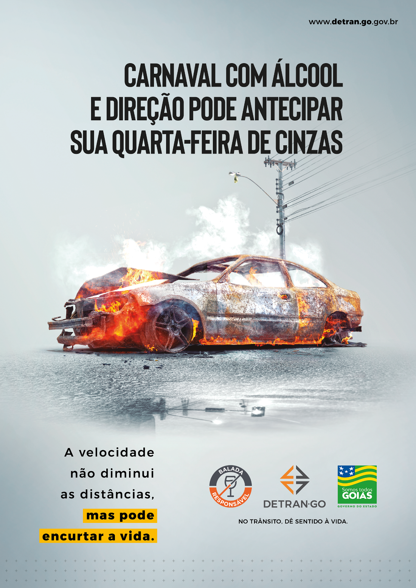
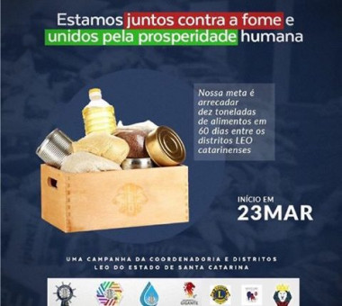
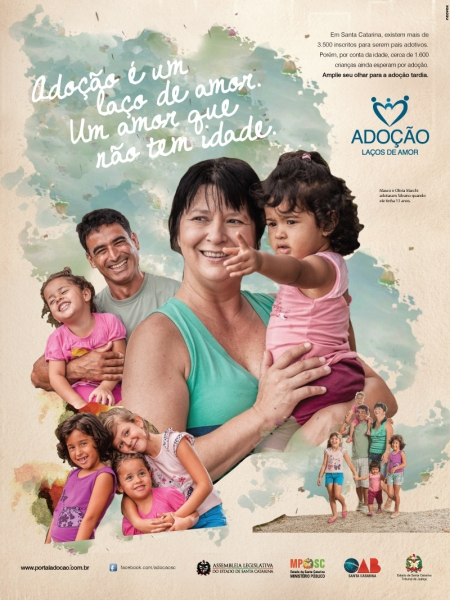

# Módulo 1

Convencer pelo texto


Habilidades do SAEB

1. Identificar o uso de recursos persuasivos em textos verbais e não
verbais.

1. Identificar teses, opiniões, posicionamentos explícitos e argumentos
em textos.

Habilidade da BNCC
1. EF89LP04.

https://pixabay.com/pt/vectors/argumento-alto-discuss%c3%a3o-conflito-6080057/

{width="5.905555555555556in"
height="4.004861111111111in"}

\<início do boxe de conteúdo\>

Um texto argumentativo é aquele em que se usam argumentos para se
comprovar uma tese ou para se convencer alguém a pensar de determinada
maneira, a fazer algo ou a consumir determinado produto, por exemplo.
Nesses textos, aparecem elementos importantes, como:

  TESE                       Hipótese a ser comprovada por meio de argumentos.
  -------------------------- -----------------------------------------------------------------------------------------------------
  OPINIÃO                    Manifestação de um ponto de vista.
  POSICIONAMENTO EXPLÍCITO   Esclarecimento, de forma indiscutível, de uma crença ou da definição de um dos lados de um assunto.
  ARGUMENTOS                 Construções que visam a ajudar na comprovação de uma tese.

Há diversos tipos de argumentos:

-   **Argumento de autoridade**: é fundamentado na citação de fonte
    confiável -- um especialista no assunto, dados de instituição de
    pesquisa, uma frase dita por alguém importante na sociedade (que
    deve ser inserida entre aspas).

-   **Argumento por exemplificação**: é apoiado em exemplos
    representativos, como o relato de um pequeno fato que comprova a
    tese defendida.

-   **Argumentação por causa e consequência**: apresenta a causa (os
    motivos) e a consequência (os efeitos) de determinada situação.

-   **Contra-argumento**: argumento oposto a outro.

Existem muitos gêneros argumentativos, que variam de acordo com suas
estruturas específicas e com a circulação a que se propõem. O ponto em
comum entre os gêneros argumentativos é que, em todos eles, o objetivo
final é a persuasão, ou seja, o convencimento de quem lê aquele texto em
relação à tese que se pretende defender. Alguns dos principais gêneros
argumentativos são os seguintes: dissertação escolar, artigo de opinião,
crônica argumentativa, editorial, resenha crítica, cartas de reclamação
e de solicitação, carta do leitor.

\<fim do boxe de conteúdo\>

\colorsec{Atividades}

O anúncio trata do trânsito de bicicletas. Leia-o atentamente
para responder às questões de 1 a 8.

\coment{Conduza os alunos a realizar a leitura atenta do anúncio e sugira
que observem o modo como a ideia é anunciada, observando como acontece a
relação entre os elementos verbais e não verbais, o que está mais em
evidência, qual é o significado da imagem e sua relação com a ideia e
quais atributos estão sendo mais ressaltados.}

%Inserir imagem:https://www.freepik.com/free-photo/asphalt-bicycle-background-bike-active_1160565.htm#query=biking&position=4&from_view=search&track=sph

>A Prefeitura Municipal de Poços de Caldas, em parceria com a Associação de Ciclistas local (ACPC), está organizando uma campanha de conscientização durante os meses de dezembro e janeiro. O objetivo principal da campanha é informar e educar tanto os ciclistas quanto os motoristas sobre suas respectivas responsabilidades e direitos no trânsito, com o tema "CICLISTA NÃO É OBSTÁCULO, ELE FAZ PARTE DO TRÂNSITO. RESPEITE-O!".

>O último relatório do Infosiga revelou que o número de mortes de ciclistas no estado de São Paulo triplicou somente no primeiro trimestre de 2019, reforçando a necessidade urgente de mais informação e respeito por parte dos condutores. A campanha terá uma abrangência ampla, incluindo blitz no trânsito para distribuição de panfletos e adesivos, ações em autoescolas, transportadoras e nas mídias sociais. Um dos objetivos principais é a conscientização da necessidade de se manter a distância de pelo menos 1,5 m entre o carro e o ciclista, evitando acidentes.

\fonte{de pesquisa: Somos ciclistas. Campanha ACPC. Disponível em:  https://somosciclistas.com.br/noticias/48/campanha\_acpc~. Acesso em 05 maio 2023.


1\. Em sua opinião, é importante haver campanhas relacionadas a esse
tema? Justifique sua resposta. 

\coment{Resposta pessoal. Espera-se que os alunos falem sobre a necessidade de uso de transportes alternativos para combater a poluição, além de se lembrarem de que a bicicleta é um tipo de transporte que contribui para que não se tenha uma vida sedentária, comum a muitas pessoas nos grandes centros.}

\linhas{6}

2\. Qual é a finalidade dessa campanha publicitária? 

\coment{A finalidade da campanha é estimular o convívio saudável no trânsito entre motoristas e ciclistas.}

\linhas{3}

3\. Em sua opinião, qual pode ter sido o motivo para a produção dessa
campanha? 

\coment{Resposta pessoal. Sugestão de resposta: "O motivo pode ter sido
o número alto de acidentes entre ciclistas e motoristas que não se
respeitam no trânsito."}

\linhas{4}

4\. Uma das funções da propaganda é levar o leitor a realizar ações
concretas. No anúncio apresentado, quais são elas? 

\coment{A ideia é que os motoristas respeitem a distância de 1,5 m dos ciclistas para que sejam evitados acidentes de trânsito.}

\linhas{4}

5\. Qual é o público-alvo dessa campanha? 

\coment{Motoristas e ciclistas, assim como todas as pessoas que convivem no trânsito.}

\linhas{4}

6\. Em sua opinião, campanhas educativas podem convencer a população a
\coment{Resposta pessoal. Explique aos alunos que as campanhas educativas são
fundamentais para conscientizar as pessoas e podem mudar atitudes.}

\linhas{6}

7\. O período "Ciclista não é obstáculo, ele faz parte do trânsito:
Respeite-o!" dialoga com o leitor. Que forma verbal indica essa
interlocução? 

\coment{A forma verbal "respeite" em **respeite-o**.}

\linhas{2}

8\. A utilização dessa forma verbal dialoga diretamente com o leitor por
intermédio de:

( ) conselho.

( ) ordem.

( x ) pedido.

Leia, agora, mais um texto para, então, responder às questões 9 e 10.

%Inserir imagem: https://www.freepik.com/free-photo/people-driving-cars-city-street_18036808.htm#query=traffic&position=6&from_view=search&track=sph

>A segurança no trânsito é um assunto de grande importância e deve ser levado a sério por todos os envolvidos nas vias públicas. Infelizmente, ainda há muitas pessoas que não respeitam as leis de trânsito, o que resulta em acidentes graves e até mesmo mortes.

>De acordo com dados do Ministério da Saúde, em 2019, foram registrados 30.371 óbitos por acidentes de trânsito no Brasil. Isso representa uma média de 83 mortes por dia, um número alarmante que poderia ser evitado se houvesse mais conscientização sobre a importância da educação no trânsito.

>A educação no trânsito começa desde cedo, nas escolas, ensinando as crianças sobre as leis de trânsito, as sinalizações e as precauções que devem ser tomadas ao atravessar a rua. Além disso, é importante que os adultos também sejam educados e respeitem as leis de trânsito, como o uso do cinto de segurança, a não utilização do celular enquanto dirigem, a obediência aos limites de velocidade e a sinalização nas vias.

~Texto escrito para este material.~

9\. Para ajudar na conscientização, o texto traz dados estatísticos. Como eles ajudam nessa função de convencer os leitores?

\coment{Dados estatísticos ajudam na conscientização porque dão dados quantitativos que permitem visualizar a gravidade do problema - nesse caso, o problema da violência e das mortes no trânsito.}

\linhas{5}

10\. Quam você imagina que sejam "todos os envolvidos nas vias públicas", como menciona o texto?

\coment{Os envolvidos são os motoristas, os ciclistas, os pedestres, o poder público etc.}

\linhas{3}

\colorsec{Treino}

1\. Leia o trecho da reportagem a seguir.

**"No Brasil, se você for um jogador compulsivo, estará em
dificuldades", alerta psiquiatra**

>\[...\] Em 2004, quando os bingos foram proibidos, os pacientes não
desapareceram, mas a demanda diminuiu bastante. Teve um momento que os
bingos voltaram, a demanda aumentou de novo, depois foram
definitivamente proibidos e a demanda se estabilizou.

>Quando os bingos operavam livremente, tínhamos algo em torno de 240
solicitações de atendimento de casos novos por ano. Conseguíamos atender
120 casos novos por ano, e os outros 120 infelizmente tinham que
aguardar uma oportunidade de tratamento.

>Isso me deixava sempre muito preocupado, essa é uma população com alto
risco \[...\] de abuso de substância e acidentes. Eles estavam aguardando o momento de
poder se tratar. Com todas as idas e vindas na legislação, hoje a
demanda está mais ou menos estabilizada em torno de uns 80 casos. Embora
não seja uma estatística consolidada e publicada, sentimos na própria
pele que quando o jogo ocorre com acesso irrestrito, a demanda para o
tratamento praticamente triplica.

>Já quando os jogos operam de forma clandestina, a demanda cai para um
terço. Essa tem sido a nossa experiência nesses quase 20 anos de
trabalho.

\fonte{de pesquisa: Leandro Melito. EBC. No Brasil, se você for um jogador compulsivo, estará em dificuldades, alerta psiquiatra. Disponível em:
www.ebc.com.br/noticias/saude/2016/08/no-brasil-se-voce-um-jogador-compulsivo-estara-em-dificuldades-alerta. Acesso em: 28 mar. 2023.

Com a leitura do texto, é possível verificar que o psiquiatra apresenta
alguns dados, porém expõe também sua opinião. Dos trechos a seguir, o
que mostra a opinião do psiquiatra é

(a) "quando os bingos foram proibidos, os pacientes não desapareceram".

(b) "tínhamos algo em torno de 240 solicitações de atendimento de casos
    novos por ano".

(c) "Isso me deixava sempre muito preocupado, essa é uma população com
    alto risco"

(d) "essa tem sido a nossa experiência nesses quase 20 anos de
    trabalho.".

BNCC: EF89LP04 - Identificar e avaliar teses/opiniões/posicionamentos
explícitos e implícitos, argumentos e contra-argumentos em textos
argumentativos do campo (carta de leitor, comentário, artigo de opinião,
resenha crítica etc.), posicionando-se frente à questão controversa de
forma sustentada.

a\) Incorreta. Não é uma opinião, mas um fato apresentado pelo
psiquiatra.

b\) Incorreta. Nesse trecho, ele apresenta quantas solicitações de
atendimento de casos novos ele atendia por ano, o que não se caracteriza
como uma opinião.

c\) Correta. Ao falar sobre a quantidade da procura de pessoas
dependentes de jogos, o psiquiatra cita que, por ser uma população com
alto risco, esse crescimento no número de procuras o deixava preocupado.

d\) Incorreta. O psiquiatra apenas conclui sua fala ao dizer que tudo o
que foi falado faz parte de sua experiência ao longo de 20 anos de
trabalho.

2\. Leia o texto.

**No Rio, escolas públicas buscam parcerias para melhorar ensino médio**

\[...\]

>O diretor da unidade, Willmann Costa, explica que o desenvolvimento
cognitivo e socioemocional são dois componentes importantes para a
formação do indivíduo. Para ele, o principal diferencial da escola são
os seus profissionais e a vontade de fazer diferente.

>"A Chico Anysio é assim porque tem toda uma estrutura que é feita dentro
da escola; a Secretaria Estadual de Educação (Seeduc) não nos dá uma
condição melhor. As parcerias não dão nada de material; oferecem a mesma
formação que é dada para outras escolas. Mas uma coisa é você se
apropriar do que recebe e acreditar no que está fazendo: outra é você ir
para a formação e depois não executar", destaca.

>O estudante Lucas Paulo Rodrigues Gonçalves, do 3º ano do ensino médio,
diz que entrou para o colégio "por acaso", quando a seleção ainda era
por sorteio, depois de não ter conseguido se inscrever no concurso para
outros colégios públicos, \[...\[. Para Lucas, morador de Belford Roxo,
na Baixada Fluminense, o trabalho desenvolvido na escola melhorou seu
relacionamento com a própria família.

>"A meu ver, as outras escolas não têm a integração que a gente tem com o
professor, que é bastante amigo. Eu gosto de ficar aqui, é a única
escola que mudou minha vida de fato, eu nunca teria isso em outra
escola. O Projeto de Vida abre novos horizontes, mostra o caminho, te
faz refletir e a metodologia te faz achar o caminho correto para seguir.
Ajudou bastante com minha família, agora eu sei compreender melhor os
outros".

Akemi Nitahara. EBC. No Rio, escolas públicas buscam parcerias para
melhorar ensino médio. Disponível em:
<http://agenciabrasil.ebc.com.br/educacao/noticia/2018-09/no-rio-escolas-publicas-buscam-parcerias-para-melhorar-ensino-medio>. Acesso em: 27 mar. 2023.

O estudante Lucas citou que o colégio Chico Anysio

\(a\) apresenta ótimos profissionais e componentes importantes para a
formação do indivíduo.

\(b\) apropria-se do que recebe, acredita no que faz e tem uma estrutura
feita dentro da escola.

\(c\) oferece a mesma formação que é dada para outras escolas do
município.

\(d\) é um lugar em que gosta de estar, pois mudou sua vida e ajudou no
relacionamento com sua família.

BNCC: EF89LP04 - Identificar e avaliar teses/opiniões/posicionamentos
explícitos e implícitos, argumentos e contra-argumentos em textos
argumentativos do campo (carta de leitor, comentário, artigo de opinião,
resenha crítica etc.), posicionando-se frente à questão controversa de
forma sustentada.

\(A\) Incorreta. O desenvolvimento cognitivo e o socioemocional são dois
componentes importantes para a formação do indivíduo, segundo o diretor
do colégio.

\(B\) Incorreta. Refere-se à opinião do diretor Willmann, o qual diz que
a Seeduc não lhes dá condição melhor, mas que valoriza a ideia de a escola se
apropriar do que recebe e acreditar naquilo que está fazendo.

\(C\) Incorreta. São as parcerias com a escola que não dão nada de
material e oferecem a mesma formação que é dada para outras escolas.

\(D\) Correta. O estudante diz que eles têm uma integração com o
professor, o que não acontece em outras escolas. Foi a única escola que
realmente mudou a vida dele, lugar onde gosta de estar e que ajudou a
melhorar seu relacionamento com sua família.

3\. Leia o trecho de um artigo de opinião.

**Comida de pobres**

\[\...\]
Na Espanha, cerca de 1 em cada 5 pessoas está em "risco de exclusão", enfrentando situações difíceis. Além disso, 5 em cada 100 cidadãos sofrem com "privação material severa", incluindo fome e frio. No entanto, muitos de nós não parecemos se importar com essa realidade e frequentemente culpamos aqueles que estão nessa situação, como se a pobreza fosse uma escolha.

Esquecemos que nossa alimentação e conforto dependem em grande parte do acaso, como o lugar onde nascemos e a educação que recebemos. Embora haja exemplos de superação pessoal heroica, a maioria das histórias de vida é determinada pela sorte, inércia e condições sociais.
\[\...\]

\fonte{de pesquisa: Enric Gonzáles. El país. Comida de pobres. Disponível em:
https://brasil.elpais.com/brasil/2019/12/27/opinion/1577467822\_271521.html.
Acesso em: 5 maio 2023.

A tese do artigo de opinião pode ser vista em

\(A\) "Na Espanha, cerca de 1 em cada 5 pessoas está em 'risco de exclusão'."

\(B\) "Além disso, 5 em cada 100 cidadãos sofrem com 'privação material severa'."

\(C\) "nossa alimentação e conforto dependem em grande parte do acaso, como o lugar onde nascemos e a educação que recebemos".

\(D\) "Embora haja exemplos de superação pessoal heroica, a maioria das histórias de vida é determinada pela sorte, inércia e condições sociais.".

BNCC: EF89LP04 - Identificar e avaliar teses/opiniões/posicionamentos
explícitos e implícitos, argumentos e contra-argumentos em textos
argumentativos do campo (carta de leitor, comentário, artigo de opinião,
resenha crítica etc.), posicionando-se frente à questão controversa de
forma sustentada.

\(A\) Incorreta. O trecho apresenta dados de pesquisa, sem apresentar
opinião do articulista.

\(B\) Incorreta. O trecho é um dado, e não a opinião do articulista.

\(C\) Correta. O artigo de opinião apresenta dados de pesquisas para
afirmar que a situação de vida das pessoas depende do acaso, de onde
elas nasceram e quem as educou.

\(D\) Incorreta. O trecho é um exemplo que vai auxiliar a tese de que a
condição de vida das pessoas depende do acaso.

# Módulo 2

Textos, regras e novidades


Habilidades do SAEB

1. Identificar elementos constitutivos de textos pertencentes ao domínio
jornalístico/midiático.

1. Identificar formas de organização de textos normativos, legais e/ou
reivindicatórios.

1. Identificar elementos constitutivos de gêneros de divulgação
científica.

1. Analisar a relação temática entre diferentes gêneros jornalísticos.

Habilidades da BNCC
1. EF69LP27
1. EF69LP02
1. EF69LP20

https://www.freepik.com/free-photo/view-metallic-typesetting-letters_27506247.htm#query=journalistic%20text&position=13&from_view=search&track=ais


\<início do boxe de conteúdo\>

Uma **proposta pública** é um conjunto de ações e decisões
governamentais direcionadas à solução de problemas referentes à
sociedade. Propostas desse tipo são formuladas em prol de uma demanda
socialmente relevante. Isto é, as políticas públicas consistem em ações,
metas e planos que o conjunto de governos (nacional, estaduais ou
municipais) planejam para atingir a satisfação da sociedade, assim como
do interesse público. Essas propostas são realizadas com base na
realidade e devem apresentar objetivos, metas, programas, projetos
e ações.

Esse tipo de documento do governo normalmente tem como proposta alguma
ação que beneficie determinado grupo social, étnico ou econômico. Muitas
vezes, são documentos elaborados com a participação ativa do setor privado, o que
assegura à população que tenham garantidos seus direitos à cidadania.

Esses gêneros textuais embasam uma política pública; por esse motivo existe relação com várias outras áreas do conhecimento, como Geografia,
Educação, Saúde, Gastronomia, História, Psicologia e diversas outras que
criam dados, fatos e argumentos que sustentam as medidas que são
expostas.

Em uma **proposta pública** predomina a **linguagem verbal**. É
necessário que o registro seja formal e impessoal.

\<fim do boxe de conteúdo\>

\colorsec{Atividades}

A proposta pública a seguir apresenta metas para o desenvolvimento da
igualdade de raça e de gênero e povos e comunidades tradicionais e faz
parte do plano de desenvolvimento integrado da Bahia 2035, o qual
abrange diversos núcleos, como saúde, educação, desenvolvimento rural
sustentabilidade, tecnologia etc.

Leia o texto para conhecer essas propostas de igualdade de raça
e de gênero e povos e comunidades tradicionais.

**PLANO DE DESENVOLVIMENTO INTEGRADO BAHIA 2035**

>A promoção do desenvolvimento na Bahia enfrenta desafios fundamentais relacionados ao racismo e à violência de gênero, que caracterizam socialmente sua formação socioeconômica como patriarcal e escravocrata por séculos. Esses padrões de conduta foram historicamente utilizados para justificar relações de dominação, exploração e violência, o que pode ser comprovado pela atualidade dessas condutas, evidenciada pelo número de feminicídios e homicídios que vitimam a população negra. A igualdade de raça e gênero e o combate ao racismo são essenciais para transformar os padrões das relações étnico-raciais e de gênero ainda vigentes, já que esses traços estruturantes atingem desrespeitosamente a maioria da população, negros e mulheres.

>Os critérios organizadores das relações sociais devem pautar-se na conquista da cidadania e na defesa incansável dos direitos humanos, em vez da diferença de raça e gênero, que promove uma inserção injusta e violenta. O Estado precisa proteger os direitos dos negros e das mulheres e considerar a questão racial e de gênero como dimensão estratégica central na resolução da desigualdade social, considerando as superposições interseccionais. Isso requer um modelo de desenvolvimento inclusivo para a população negra, para as mulheres e para os povos e comunidades tradicionais.

>Os povos e comunidades tradicionais precisam ser reconhecidos como portadores de futuro, organizados social e economicamente sob valores, princípios e práticas que fogem à lógica capitalista restrita. A Bahia reconhece 10 segmentos de povos e comunidades tradicionais, mas, apesar das políticas públicas, ocupa o terceiro lugar no ranking de mortes no campo. O planejamento a longo prazo visa fomentar e articular ações públicas e em parceria com a sociedade civil que combatam as violências e promovam a emancipação do sujeito - negros, mulheres, povos e comunidades tradicionais - por meio da garantia de direitos, oportunidades de geração de trabalho e renda, autonomia e acesso a bens e serviços públicos de qualidade, além de contribuir substancialmente para a estruturação de novas sociabilidades possíveis e necessárias. É necessário produzir conteúdos em várias linguagens da comunicação que proporcionem reflexões sobre as problemáticas vivenciadas no dia a dia das mulheres relativas às questões de gênero, raça e classe, promover e implementar políticas públicas voltadas para a construção da autonomia econômica e social das mulheres, realizar parcerias e alianças estratégicas com fim de atender e expandir a transversalidade das ações nas diversas áreas e serviços públicos, desenvolver e promover políticas públicas de enfrentamento à violência contra as mulheres, e promover a intersecção das políticas públicas de modo a enfrentar o racismo e a intolerância religiosa, a feminização da pobreza, além de trabalhar pela democratização da terra, o acesso à moradia e a programas de inclusão socio produtiva pautado no etnodesenvolvimento.

GOVERNO DO ESTADO DA BAHIA. Plano de Desenvolvimento Integrado -- PDI
Bahia 2035.Disponível em: \<
https://www.seplan.ba.gov.br/wp-content/uploads/caderno\_pdi\_bahia\_2035\_16082021\_0959.pdf\>.
Acesso em: 28 mar. 2023.

1\. Uma proposta pública é dirigida a vários grupos sociais. Qual é o
objetivo dessa proposta, considerando a sociedade a que ela se destina?

\coment{O objetivo da proposta é planejar investimentos em políticas públicas de
igualdade de direitos e redução das iniquidades como elemento de
desenvolvimento da população do estado da Bahia.}

\linhas{6}

2\. O primeiro parágrafo apresenta os padrões de conduta que
caracterizam socialmente a formação socioeconômica baiana. De que forma se deu a formação socioeconômica baiana? 

\coment{ Essa sociedade se formou e se constituiu de forma patriarcal e,
por séculos, escravocrata.}

\linhas{5}

3\. Quem tem a obrigação de garantir os direitos dos negros e das
mulheres, e protegê-los? 

\coment{O Estado.}

\linhas{4}

4\. Explique o que significa dizer que é necessário promover a
**emancipação do sujeito**. 

\coment{Espera-se que os alunos relacionem a expressão ao processo de liberdades política, cultural, humana e social de todas as pessoas que sofrem opressão.}

\linhas{6}

5\. Com base no título, pode-se perceber se a proposta pública abrange
diversas demandas sociais? Justifique sua resposta. 

\coment{Sim, pois no título
há a menção de que se trata de um "plano de desenvolvimento integrado",
uma proposta que tem o objetivo de atender em conjunto diversas áreas.}

\linhas{6}

6\. O texto traça finalidades e planejamentos a serem adotados para que
a proposta pública seja efetivamente aplicada. Por que é fundamental registrar esses planejamentos e finalidades em um documento? Explique. 

\coment{Espera-se que os alunos percebam que esses planejamentos e finalidades conduzem as ações ou estratégias que deverão ser realizadas para que as propostas sejam realizadas pelo governo.}

\linhas{6}

7\. A proposta pública é um plano de ação criado por determinado
governo e que circula na esfera política. Marque a alternativa a seguir que
apresenta características da linguagem desse gênero textual.

( x ) Utilização dos modos formal e impessoal da língua.

( ) Predomínio de linguagem pessoal, com registros em 1ª pessoa.

8\. Releia o trecho a seguir.

 
  >A atualidade dessas condutas pode ser comprovada, **além de** outros indicadores, pelo número de feminicídios e de homicídios que vitimam a população negra.

-   Organizar as ideias é essencial para que se compreenda um texto. O
    recurso coesivo \"além de\", destacado no trecho, indica:

( ) oposição

( x ) acréscimo

( ) objetivo

Releia o último parágrafo do texto para responder às questões 9 e 10.

>Os povos e comunidades tradicionais precisam ser reconhecidos como portadores de futuro, organizados social e economicamente sob valores, princípios e práticas que fogem à lógica capitalista restrita. A Bahia reconhece 10 segmentos de povos e comunidades tradicionais, mas, apesar das políticas públicas, ocupa o terceiro lugar no *ranking* de mortes no campo. O planejamento a longo prazo visa fomentar e articular ações públicas e em parceria com a sociedade civil que combatam as violências e promovam a emancipação do sujeito[...] É necessário produzir conteúdos em várias linguagens da comunicação que proporcionem reflexões sobre as problemáticas vivenciadas no dia a dia das mulheres relativas às questões de gênero, raça e classe, promover e implementar políticas públicas voltadas para a construção da autonomia econômica e social das mulheres, realizar parcerias e alianças estratégicas com fim de atender e expandir a transversalidade das ações nas diversas áreas e serviços públicos, desenvolver e promover políticas públicas de enfrentamento à violência contra as mulheres, e promover a intersecção das políticas públicas de modo a enfrentar o racismo e a intolerância religiosa, a feminização da pobreza, além de trabalhar pela democratização da terra, o acesso à moradia e a programas de inclusão socio produtiva pautado no etnodesenvolvimento.

9\. O que significa "fomentar", no contexto em que aparece nesse parágrafo?

\coment{"Fomentar" significa "Fomentar significa incentivar, promover ou estimular algo, seja por meio de ações concretas ou por meio de apoio e investimento. O termo pode se referir a diversas áreas, desde a economia até a cultura, e tem como objetivo impulsionar o desenvolvimento, o crescimento ou o progresso de determinada atividade, setor ou região. Fomentar pode ser entendido como uma ação proativa e estratégica que visa fortalecer determinada iniciativa ou empreendimento, contribuindo para que se torne mais sustentável, produtivo e efetivo."}

10\. Veja as seguintes construções:

*Produzir conteúdos;
Promover e implementar políticas públicas
Realizar parcerias
Desenvolver e promover políticas públicas*

Reescreva o parágrafo, a partir da expressão "É necessário" até "contra as mulheres", introduzindo as expressões pela conjunção "que" e fazendo as adaptações necessárias.

\coment{É necessário que se produzam conteúdos em várias linguagens da comunicação que proporcionem reflexões sobre as problemáticas vivenciadas no dia a dia das mulheres relativas às questões de gênero, raça e classe, que se promovam e implementem políticas públicas voltadas para a construção da autonomia econômica e social das mulheres, que se realizem parcerias e alianças estratégicas com fim de atender e expandir a transversalidade das ações nas diversas áreas e serviços públicos, que se desenvolvam e promovam políticas públicas de enfrentamento à violência contra as mulheres [...]}


\colorsec{Treino}

1\. Observe a imagem e leia o texto, ambos de uma campanha de conscientização.

https://www.freepik.com/free-photo/people-driving-cars-city-street_18036808.htm#query=traffic&position=6&from_view=search&track=sph

***Maio amarelo: por mais segurança no trânsito.
Onde o cidadão é mais atento e respeitoso, o trânsito respnde com menos mortes e mais organização.***

A finalidade dessa campanha é

\(A\) apresentar aos leitores as ações que fazem um trânsito melhor, como a atenção dos cidadãos.

\(B\) relacionar segurança no trânsito exclusivamente à atenção dos motoristas no
trânsito.

\(C\) conscientizar a população em geral a ter atitudes conscientes no
trânsito para ter mais segurança nele.

\(D\) conscientizar os leitores de que eles devem ter atenção no
trânsito no mês de maio.

BNCC: EF69LP02 - Analisar e comparar peças publicitárias variadas
(cartazes, folhetos, outdoor, anúncios e propagandas em diferentes
mídias, spots, jingle, vídeos etc.), de forma a perceber a articulação
entre elas em campanhas, as especificidades das várias semioses e
mídias, a adequação dessas peças ao público-alvo, aos objetivos do
anunciante e/ou da campanha e à construção composicional e estilo dos
gêneros em questão, como forma de ampliar suas possibilidades de
compreensão (e produção) de textos pertencentes a esses gêneros.

a\) Incorreta. Mesmo que a "atenção" produza segurança no trânsito, o
objetivo dessa campanha não é apenas mostrar essa informação, mas
conscientizar a população a tomar essa atitude.

b\) Incorreta. Mesmo que se estabeleça uma relação entre a "atenção" e a
"segurança", essa relação não é a finalidade do texto, o qual pretende
levar as pessoas a adotar posturas mais amplas de segurança no trânsito.

c\) Correta. A finalidade dessa campanha é conscientizar a população de
forma geral a ter mais atenção em suas ações no trânsito, o que o torna
mais seguro para todos "Onde o cidadão é mais atento e respeitoso, o trânsito respnde com menos mortes e mais organização".

d\) Incorreta. A finalidade da campanha não é conscientizar a população
sobre o trânsito apenas no mês de maio, mas sim em todos os meses.

2\. Leia o trecho de um Estatuto referente à preservação do meio
ambiente.

**Estatuto da Associação de Preservação do Meio Ambiente e da Vida**

\[...\] Art. 3o -- A Associação de Preservação do Meio Ambiente e da
Vida -- APREMAVI tem por objetivos:

a\) Promover, estimular e apoiar ações e trabalhos em defesa,
conservação, preservação e recuperação do meio ambiente, do patrimônio
paisagístico e dos bens e valores culturais, prioritariamente no âmbito
da Mata Atlântica e Ecossistemas Associados; \[...\]

e\) Estimular e exigir das autoridades federais, estaduais e municipais,
instituições públicas e privadas, pessoas físicas e jurídicas, a adoção
de medidas práticas que visem a preservação, conservação, recuperação e
manejo sustentável dos recursos naturais e do meio ambiente, bem como o
controle de todas as formas de poluição e degradação; \[...\]

APREMAVI. Estatuto da Associação de Preservação do Meio Ambiente e da
Vida. Disponível em:
https://apremavi.org.br/wp-content/uploads/2020/02/estatuto-apremavi\_2019.pdf.
Acesso em: 28 mar. 2023.

A finalidade desse Estatuto é

\(A\) apresentar os meios por meio dos quais a Associação irá preservar o meio
ambiente.

\(B\) apresentar à Associação os planos do governo para preservação
ambiental.

\(C\) mostrar ao leitor os planos do governo para o desenvolvimento da
Associação.

\(D\) mostrar ao leitor os planos da Associação na preservação do meio
ambiente.

BNCC: EF69LP20 - Identificar, tendo em vista o contexto de produção, a
forma de organização dos textos normativos e legais, a lógica de
hierarquização de seus itens e subitens e suas partes: parte inicial
(título -- nome e data -- e ementa), blocos de artigos (parte, livro,
capítulo, seção, subseção), artigos (caput e parágrafos e incisos) e
parte final (disposições pertinentes à sua implementação) e analisar
efeitos de sentido causados pelo uso de vocabulário técnico, pelo uso do
imperativo, de palavras e expressões que indicam circunstâncias, como
advérbios e locuções adverbiais, de palavras que indicam generalidade,
como alguns pronomes indefinidos, de forma a poder compreender o caráter
imperativo, coercitivo e generalista das leis e de outras formas de
regulamentação.

\(A\) Incorreta. O texto não mostra como a Associação fará a preservação
e os meios para tal, mas as diretrizes dela nos planos para a
preservação do meio ambiente.

\(B\) Incorreta. O texto é em relação à Associação e promovido por ela,
por isso não se pode afirmar que seja uma apresentação dos planos
governamentais.

\(C\) Incorreta. Os planos são da Associação à preservação ambiental, e
não do governo para o desenvolvimento da Associação.

\(D\) Correta. A finalidade é apresentar ao leitor os planos da
Associação (APREMAVI) na preservação ambiental, o que pode ser visto em
"tem por objetivos" e nos planos descritos nas alíneas, como em
"Promover, estimular e apoiar ações e trabalhos [...]".

3\. Leia um trecho do edital a seguir.

**PROGRAMA DE EDITAIS DE RESIDÊNCIA EM PESQUISA BBM-**

**PRCEUUSP**

**5ª edição**

**EDITAL 2019**

**Finalidade e objetivos**

\[...\] Serão contemplados 3 (três) projetos voltados para a pesquisa do
material constante no acervo da biblioteca e relacionado aos temas do
projeto 3 VEZES 22, isto é, relativos ao bicentenário da Independência e
ao centenário da Semana de Arte Moderna, conforme documento anexo (Anexo
1); outros 3 (três) projetos voltados para a pesquisa do material
constante do acervo da biblioteca que abordem outros recortes temáticos;
1 (um) projeto sobre conservação e restauro; e, por fim, 1 (um) projeto
dedicado à pesquisa do material existente no arquivo da biblioteca.

BIBLIOTECA BRASILIANA Guita e José Mindlin. Pró Reitoria de Cultura e
Extensão Universitária. Universidade de São Paulo. Programa de editais
de residência em pesquisa BBM-PRCEUUSP. Disponível em:
https://jornal.usp.br/wp-content/uploads/2019/09/Edital\_residencia-bbm-5.pdf.
Acesso em: 28 mar. 2023.

O objetivo desse parágrafo do é

\(A\) incentivar novos pesquisadores a visitarem o acervo da biblioteca
e conhecer novos materiais.

\(B\) ensinar pesquisadores de diversas instituições a como fazer
trabalhos da temática "3 VEZES 22".

\(C\) dar dicas de como ser selecionado mais facilmente no programa
divulgado pelo edital público.

\(D\) apresentar quantos projetos de pesquisa serão contemplados pelo
programa da instituição.

BNCC: EF69LP27 - Analisar a forma composicional de textos pertencentes a
gêneros normativos/ jurídicos e a gêneros da esfera política, tais como
propostas, programas políticos (posicionamento quanto a diferentes ações
a serem propostas, objetivos, ações previstas etc.), propaganda política
(propostas e sua sustentação, posicionamento quanto a temas em
discussão) e textos reivindicatórios: cartas de reclamação, petição
(proposta, suas justificativas e ações a serem adotadas) e suas marcas
linguísticas, de forma a incrementar a compreensão de textos
pertencentes a esses gêneros e a possibilitar a produção de textos mais
adequados e/ou fundamentados quando isso for requerido.

a\) Incorreta. O edital não tem o objetivo de promover o espaço, mas
oferecer um programa de residência para alguns pesquisadores.

b\) Incorreta. Não aparece esse tipo de instrução no texto.

c\) Incorreta. Não há dicas ou informações sobre um modo mais fácil de
ser selecionado.

d\) Correta. O trecho diz respeito a quais serão os projetos
contemplados pela instituição, já que mostra que três serão relativos à
temática "3 vezes 22", outros três sobre pesquisas relativas ao acervo
constante, um a respeito do restauro da biblioteca e, finalmente, outro
dedicado à pesquisa de todo o material existente.

# Módulo 3

Humanidade no texto

Habilidades do SAEB

1. Analisar elementos constitutivos de textos pertencentes ao domínio
literário.

1. Analisar a intertextualidade entre textos literários ou entre estes e
outros textos verbais ou não verbais.

1. Inferir a presença de valores sociais, culturais e humanos em textos
literários.

Habilidades da BNCC
1. EF69LP44
1. EF69LP47
1. EF89LP32

\<início do boxe de conteúdo\>

**Conto**

https://www.freepik.com/free-photo/literature-composition_1320551.htm#query=literature%20book&position=16&from_view=search&track=ais

O gênero textual **conto** tem a finalidade de entreter e fazer aflorar
emoções, assim como provocar reflexões no leitor. 

O **tempo** é um ponto essencial na construção de narrativas, podendo
estar presente no texto como **cronológico** ou **psicológico**.

O **tempo cronológico** consiste no tempo "real", marcado pelo relógio
(segundos, minutos) e pelo calendário (dias, semanas, meses, anos),
assim como períodos (manhã, tarde, noite), estações (primavera, verão,
outono, inverno), épocas (Páscoa, Ano Novo), entre diversas outras marcações. Ele permite que o leitor se situe em relação ao momento concreto em que algum fato ocorreu.

O **tempo psicológico**, por sua vez, é individual e subjetivo, pois
cada personagem sente a passagem de tempo de modo diverso e a
depender das emoções, situações, sentimentos, sensações. Ocorre na
narrativa mediante memórias e lembranças de um personagem, como um
*flashback*, em que se relembra algo do passado.

Normalmente, o conto apresenta apenas um conflito, tempo e espaço
reduzidos e poucos personagens. Pode ser narrado em 1ª pessoa ou 3ª
pessoa.

\<fim do boxe de conteúdo\>

\colorsec{Atividades}

1.  Leia o conto a segui para responder às questões de 1 a 9.

\coment{Promova a leitura compartilhada e colaborativa do texto com os alunos. Oriente-os a marcar as palavras desconhecidas e a pesquisá-las no dicionário depois da leitura. Estimule a participação de todos, valendo-se de perguntas direcionadas, considerando a capacidade inicial deles, mas visando a avanços.}


**A pequena vendedora de fósforos**

> Estava tanto frio! A neve não parava de cair e a noite aproximava-se.
> Aquela era a última noite de Dezembro, véspera do dia de Ano Novo.
> Perdida no meio do frio intenso e da escuridão, uma pobre rapariguinha
> seguia pela rua fora, com a cabeça descoberta e os pés descalços. É
> certo que ao sair de casa trazia um par de chinelos, mas não duraram
> muito tempo, porque eram uns chinelos que já tinham pertencido à mãe,
> e ficavam-lhe tão grandes, que a menina os perdeu quando teve de
> atravessar a rua a correr para fugir de um trem. Um dos chinelos
> desapareceu no meio da neve, e o outro foi apanhado por um garoto que
> o levou, pensando fazer dele um berço para a irmã mais nova brincar.
>
> Por isso, a rapariguinha seguia com os pés descalços e já roxos de
> frio; levava no avental uma quantidade de fósforos, e estendia um maço
> deles a toda a gente que passava, apregoando: --- Quem compra fósforos
> bons e baratos? --- Mas o dia tinha-lhe corrido mal. Ninguém comprara
> os fósforos, e, portanto, ela ainda não conseguira ganhar um tostão.
> Sentia fome e frio, e estava com a cara pálida e as faces encovadas.
> Pobre rapariguinha! Os flocos de neve caíam-lhe sobre os cabelos
> compridos e loiros, que se encaracolavam graciosamente em volta do
> pescoço magrinho; mas ela nem pensava nos seus cabelos encaracolados.
> Através das janelas, as luzes vivas e o cheiro da carne assada
> chegavam à rua, porque era véspera de Ano Novo. Nisso, sim, é que ela
> pensava.
>
> Sentou-se no chão e encolheu-se no canto de um portal. Sentia cada vez
> mais frio, mas não tinha coragem de voltar para casa, porque não
> vendera um único maço de fósforos, e não podia apresentar nem uma
> moeda, e o pai era capaz de lhe bater. E afinal, em casa também não
> havia calor. A família morava numa água-furtada, e o vento metia-se
> pelos buracos das telhas, apesar de terem tapado com farrapos e palha
> as fendas maiores. Tinha as mãos quase paralisadas com o frio. Ah,
> como o calorzinho de um fósforo aceso lhe faria bem! Se ela tirasse
> um, um só, do maço, e o acendesse na parede para aquecer os dedos!
> Pegou num fósforo e: Fcht!, a chama espirrou e o fósforo começou a
> arder! Parecia a chama quente e viva de uma candeia, quando a menina a
> tapou com a mão. Mas, que luz era aquela? A menina julgou que estava
> sentada em frente de um fogão de sala cheio de ferros rendilhados, com
> um guarda-fogo de cobre reluzente. O lume ardia com uma chama tão
> intensa, e dava um calor tão bom! Mas, o que se passava? A menina
> estendia já os pés para se aquecer, quando a chama se apagou e o fogão
> desapareceu. E viu que estava sentada sobre a neve, com a ponta do
> fósforo queimado na mão.
>
> Riscou outro fósforo, que se acendeu e brilhou, e o lugar em que a luz
> batia na parede tornou-se transparente como tule. E a rapariguinha viu
> o interior de uma sala de jantar onde a mesa estava coberta por uma
> toalha branca, resplandecente de loiças finas, e mesmo no meio da mesa
> havia um ganso assado, com recheio de ameixas e puré de batata, que
> fumegava, espalhando um cheiro apetitoso. Mas, que surpresa e que
> alegria! De repente, o ganso saltou da travessa e rolou para o chão,
> com o garfo e a faca espetados nas costas, até junto da rapariguinha.
> O fósforo apagou-se, e a pobre menina só viu na sua frente a parede
> negra e fria.
>
> E acendeu um terceiro fósforo. Imediatamente se encontrou ajoelhada
> debaixo de uma enorme árvore de Natal. Era ainda maior e mais rica do
> que outra que tinha visto no último Natal, através da porta
> envidraçada, em casa de um rico comerciante. Milhares de velinhas
> ardiam nos ramos verdes, e figuras de todas as cores, como as que
> enfeitam as montras das lojas, pareciam sorrir para ela. A menina
> levantou ambas as mãos para a árvore, mas o fósforo apagou-se, e todas
> as velas de Natal começaram a subir, a subir, e ela percebeu então que
> eram apenas as estrelas a brilhar no céu. Uma estrela maior do que as
> outras desceu em direção à terra, deixando atrás de si um comprido
> rasto de luz.
>
> "Foi alguém que morreu", pensou para consigo a menina; porque a avó, a
> única pessoa que tinha sido boa para ela, mas que já não era viva,
> dizia-lhe muita vez: «Quando vires uma estrela cadente, é uma alma que
> vai a caminho do céu.»
>
> Esfregou ainda mais outro fósforo na parede: fez-se uma grande luz, e
> no meio apareceu a avó, de pé, com uma expressão muito suave, cheia de
> felicidade!
>
> --- Avó! --- gritou a menina --- leva-me contigo! Quando este fósforo
> se apagar, eu sei que já não estarás aqui. Vais desaparecer como o
> fogão de sala, como o ganso assado, e como a árvore de Natal, tão
> linda.
>
> Riscou imediatamente o punhado de fósforos que restava daquele maço,
> porque queria que a avó continuasse junto dela, e os fósforos
> espalharam em redor uma luz tão brilhante como se fosse dia. Nunca a
> avó lhe parecera tão alta nem tão bonita. Tomou a neta nos braços e,
> soltando os pés da terra, no meio daquele resplendor, voaram ambas tão
> alto, tão alto, que já não podiam sentir frio, nem fome, nem
> desgostos, porque tinham chegado ao reino de Deus.
>
> Mas ali, naquele canto, junto do portal, quando rompeu a manhã gelada,
> estava caída uma rapariguinha, com as faces roxas, um sorriso nos
> lábios... morta de frio, na última noite do ano. O dia de Ano Novo
> nasceu, indiferente ao pequenino cadáver, que ainda tinha no regaço um
> punhado de fósforos. --- Coitadinha, parece que tentou aquecer-se! ---
> exclamou alguém. Mas nunca ninguém soube quantas coisas lindas a
> menina viu à luz dos fósforos, nem o brilho com que entrou, na
> companhia da avó, no Ano Novo.
>

Hans Christian. Contos de Hans Christian Andersen. A pequena vendedora de fósforos. Disponível em: <https://epicentroliterario.com.br/dominio_publico/a-pequena-vendedora-de-fosforos/>. Acesso em: 28 mar. 2023.

1\) Quem é a personagem principal do conto? 

\coment{A menina que vendia fósforos}

\linhas{5}

2\) Em qual época aconteceu a história? 

\coment{Véspera do dia do Ano Novo.}

\linhas{3}

3\) Descreva fisicamente a menina. 

\coment{A personagem tinha cabelos compridos e loiros, que se encaracolavam graciosamente em volta do pescoço magrinho.}

\linhas{4}

4\) Por qual motivo a vendedora de fósforos não quis voltar para casa?

\coment{Porque não vendera um único maço de fósforos e não podia apresentar nem
uma moeda, e o pai era capaz de lhe bater. E, afinal, em casa também não
havia calor.}

\linhas{5}

5\) Os fatos narrados no conto "A pequena vendedora de fósforos" se
deram em quanto tempo? Justifique com elementos do texto. 

\coment{ Os fatos aconteceram no período de uma noite. No início aparece a marcação temporal "a noite aproximava-se" e, no final, aparece a delimitação "quando rompeu a manhã gelada".

\linhas{4}

6\) Reescreva, com suas palavras, o desfecho do conto. 

Resposta pessoal. Apresenta-se, aqui, uma sugestão, apenas.

Uma menina morreu de frio na última noite do ano, com um sorriso nos lábios e um punhado de fósforos no colo. O Ano Novo nasceu indiferente à sua morte e nunca souberam as coisas bonitas que ela viu à luz dos fósforos antes de morrer.

\linhas{5}

7\. Conto é um texto narrativo curto. Dentre as características a
seguir, marque a que você observou ao ler o conto "A pequena vendedora
de fósforos".

( x ) Poucos personagens, com atuações que giram em torno de uma
mesma situação.

( ) Espaços variados muito distantes entre si, para ambientar a
sequência dos fatos narrados.

( ) Trama desenvolvida em um longo período de tempo.

8\. O conto é narrado em:

( ) 1ª pessoa ( x ) 3ª pessoa

9\. O narrador conta a história como:

\coment{Explique aos alunos que o narrador observador só relata o que
presenciou, sem entrar na mente dos personagens e contar ao leitor o que
eles estão pensando.}

( ) narrador-personagem

( x ) narrador-observador

10\. Marque, entre as opções a seguir, objetivos de se publicarem textos como os contos.

( x ) Levar entretenimento e encantamento ao leitor.

( ) Informar o leitor sobre fatos do cotidiano.

( x ) Levar o leitor a refletir sobre o comportamento humano e
acontecimentos diversos.


\colorsec{Treino}

1\. Leia o miniconto "O valor do silêncio".

**O valor do silêncio**

>Havia um lugar onde o silêncio reinava soberano. Era uma pequena cabana nas montanhas, onde um velho eremita vivia em paz consigo mesmo. Ele passava seus dias contemplando a natureza ao redor, sem perturbar a harmonia do lugar com palavras desnecessárias.

>Um dia, um viajante chegou à cabana em busca de abrigo para a noite. Ao entrar, percebeu que o velho homem sequer olhava em sua direção, e o silêncio era tão intenso que parecia ensurdecedor.

>Incomodado com a falta de comunicação, o viajante tentou puxar assunto, contar histórias, mas o eremita apenas sorria e balançava a cabeça, sem emitir nenhum som.

>Frustrado, o viajante passou a noite em silêncio e partiu na manhã seguinte. No entanto, durante sua jornada, percebeu que aquele silêncio tão incompreensível da cabana o acompanhava, trazendo-lhe uma sensação de paz e contemplação que jamais sentira antes.

>Assim, o viajante aprendeu a valorizar o silêncio e a sua importância na vida. E sempre que sentia necessidade de se reconectar consigo mesmo, voltava àquela cabana nas montanhas, onde o velho eremita ainda vivia em silêncio, como um guardião da serenidade.

~Diva Lopes.~

O miniconto é um texto

\(A\) longo, em que o narrador conta, em 3ª pessoa, a história de dois
personagens que moram em uma cabana silenciosa.

\(B\) curto, com um narrador-observador, que conta a história em 3ª pessoa, e o personagem
secundário, o eremita.

\(C\) longo, contado em 1ª pessoa pelo narrador-personagem, que
é eremita e vive isolado.

\(D\) curto, narrado em 3ª pessoa, sobre dois amigos que, juntos, aprendem a valorizar o silêncio.

BNCC: EF69LP47 - Analisar, em textos narrativos ficcionais, as diferentes
formas de composição próprias de cada gênero, os recursos coesivos que
constroem a passagem do tempo e articulam suas partes, a escolha lexical
típica de cada gênero para a caracterização dos cenários e dos
personagens e os efeitos de sentido decorrentes dos tempos verbais, dos
tipos de discurso, dos verbos de enunciação e das variedades
linguísticas (no discurso direto, se houver) empregados, identificando o
enredo e o foco narrativo e percebendo como se estrutura a narrativa nos
diferentes gêneros e os efeitos de sentido decorrentes do foco narrativo
típico de cada gênero, da caracterização dos espaços físico e
psicológico e dos tempos cronológico e psicológico, das diferentes vozes
no texto (do narrador, de personagens em discurso direto e indireto), do
uso de pontuação expressiva, palavras e expressões conotativas e
processos figurativos e do uso de recursos linguístico-gramaticais
próprios a cada gênero narrativo.

a\) Incorreta. Não se trata de um texto longo, além de não viverem, os dois personagens, na cabana.

b\) Correta. Trata-se de um texto curto, com conflito resumido e simples e poucos personagens.

c\) Incorreta. Além de o texto não ser longo, Gabriel é o filho, não o
narrador-personagem.

d\) Incorreta. Além de os personagens não serem exatamente amigos, o eremita aprendeu a valorizar o silêncio antes do outro homem.

2\. Leia uma crônica jornalística.

**Valor inestimável**

>Nos últimos anos, tem se tornado cada vez mais comum ouvir notícias sobre a violência contra crianças nas metrópoles brasileiras. São relatos de tiroteios em escolas, assassinatos de menores de idade e outras formas de violência que têm como vítimas os mais jovens.

>A violência é apenas um dos fatores que contribuem para essa desvalorização. A falta de acesso a serviços básicos, como saúde e educação de qualidade, também faz com que as crianças sejam deixadas à margem da sociedade. O ECA e outrox textos legais, apesar de sua complexidade, não bastam para manter todas as garantias desses jovens cidadãos em dia.

>Além disso, muitas vezes essas crianças são vistas como um fardo pelos pais ou responsáveis, que precisam trabalhar longas horas para sustentar a família. E, assim, acabam sendo deixadas sozinhas em casa ou nas ruas, expostas a diversos riscos.

>A vida de uma criança tem um valor inestimável. Não podemos permitir que a desvalorização dessas vidas continue a ser uma triste realidade em nossas metrópoles. É hora de agir, de nos unirmos para garantir um futuro melhor para as nossas crianças.

~Diva Lopes.~

Para a autora

\(A\) apesar da gravidade dos casos, existe um arrefecimento da violência contra crianças.

\(B\) leis de proteção às crianças, como o ECA, são textos frágeis, por isso não garantem o fim da violência.

\(C\) há desrespeito à criança e ao adolescente por mais que seus pais e cuidadores lutem por esses direitos.

\(D\) é preciso haver uma postura mais ativa de todos, enquanto agentes sociais, para que haja reversão do quadro de violência instalado.

BNCC: EF69LP44 - Inferir a presença de valores sociais, culturais e
humanos e de diferentes visões de mundo, em textos literários,
reconhecendo nesses textos formas de estabelecer múltiplos olhares sobre
as identidades, sociedades e culturas e considerando a autoria e o
contexto social e histórico de sua produção.

a\) Incorreta. Pelo contrário, afirma-se que houve aumento nos casos, não diminuição ou arrefecimento.

b\) Incorreta. Não se qualifica o ECA como texto frágil - o que se afirma é que, simplesmente, ele, juntamente com outros textos legais, não basta para resolver o problema.

c\) Incorreta. O que se diz no texto é que, muitas vezes, as crianças são consideradas como fardos ou pesos por seus pais.

d\) Correta. Ao final do texto, afirma-se que "É hora de agir, de nos unirmos para garantir um futuro melhor para as nossas crianças.".

3\. Leia um trecho de um discurso de formatura.

O discurso de formatura dos estudantes de medicina da USP, em 1955, enfatizava o altruísmo como a lei do homem e a solidariedade como algo mais forte que todos os erros e defeitos humanos. Sylvio Saraiva, o orador responsável pelas palavras, manteve-se fiel à mensagem e ajudava pacientes que não podiam pagar por consultas.

\fonte{de pesquisa: Paulo Gomes. Folha de S. Paulo. Admirado, neurologista era inabalável. Disponível
em:
www1.folha.uol.com.br/cotidiano/2018/01/1947572-mortes-admirado-neurologista-era-inabalavel.shtml.
Acesso em: 28 mar. 2023.

O tema central do discurso de formatura, proferido em 1955, era

\(A\) a importância da profissão dos médicos.

\(B\) o sentimento de ajudar os outros.

\(C\) a necessidade de se seguir as leis.

\(D\) a defesa da gratuidade de consultas médicas.

BNCC: EF69LP44 - Inferir a presença de valores sociais, culturais e
humanos e de diferentes visões de mundo, em textos literários,
reconhecendo nesses textos formas de estabelecer múltiplos olhares sobre
as identidades, sociedades e culturas e considerando a autoria e o
contexto social e histórico de sua produção.

a\) Incorreta. O texto não defende explicitamente a importância da profissão dos
médicos, mas a importância de haver solidariedade entre os homens.

b\) Correta. Pode-se identificar que Sylvio Saraiva defendia o altruísmo
e a solidariedade entre os homens.

c\) Incorreta. O texto usa "lei" em sentido figurado, argumentando que a
solidariedade deve ser tão importante quanto uma lei.

d\) Incorreta. Não existe a explicitação dessa ideia no discurso de
formatura.

# Módulo 4

Quem lê tanta notícia?

Habilidades do SAEB

1. Analisar efeitos de sentido produzido pelo uso de formas de
apropriação textual (paráfrase, citação etc.).

1. Analisar os efeitos de sentido decorrentes dos mecanismos de
construção de textos jornalísticos/midiáticos.

Habilidades da BNCC
1. EF69LP16
1. EF69LP43
1. EF89LP05.

Notícia

https://pixabay.com/pt/photos/jornal-not%c3%adcia-meios-de-comunica%c3%a7%c3%a3o-412452/

{width="5.270833333333333in"
height="3.513682195975503in"}

\<início do boxe de conteúdo\>

A **notícia** consiste em um gênero textual jornalístico com a
finalidade de divulgar fatos cotidianos de relevância e interesse social
ou a um grupo específico de leitores ao qual se dirige.

O redator da notícia deve relatar os fatos de modo objetivo, sendo
o mais isento possível para garantir que a reconstituição do acontecimento seja também o mais fiel possível.

Uma notícia deve apresentar os seguintes elementos: o **título**, que
tenta atrair o interesse do leitor; a **linha-fina**, cuja função é
complementar o título com mais informações; o **lide** (parágrafo
introdutório) e o **corpo** (o restante do texto, com informações mais
detalhadas). As notícias podem ser acompanhadas de fotografias e
legendas.

A notícia deve ser **isenta da opinião** de quem a escreve. No
entanto, observa-se que, do ponto de vista linguístico,
não existe isenção absoluta, nem na notícia, nem em outro gênero qualquer, porque não há como abordar um fato sem participar de
algum modo da transmissão da mensagem. A escolha das palavras a serem
utilizadas normalmente deixa em evidência a intencionalidade do
enunciador.

\<fim do boxe de conteúdo\>

\colorsec{Atividades}

1\. Leia a notícia a seguir para responder às questões de 1 a 8.

\coment{Faça intervenções mediante perguntas sempre que aparecerem opiniões e
relatos que possam colaborar com a discussão que será realizada
durante a leitura da notícia. Solicite aos alunos que leiam o título da
notícia e pergunte: "Vocês já tinham conhecimento dessa informação?";
"Quais informações vocês acham que encontrarão na notícia?". Eleja um
aluno como escriba para anotar os sentidos levantados pela turma,
especialmente as opiniões divergentes. Promova a leitura compartilhada e
colaborativa com os alunos.}

**Servidores da Esplanada ganham espaço de trabalho compartilhado**

*Chamado de Sala 360°, ambiente de coworking é inovador e fruto de
parceria entre MCom, MInfra e ME*

Publicado em 28/12/2022 10h31 
Atualizado em 28/12/2022 10h51

Nesta terça-feira (27/12), um espaço moderno, dedicado ao trabalho
compartilhado (coworking), foi aberto para o uso de servidores da
Administração Pública federal. Com o nome de "[Sala
360](https://www.gov.br/economia/pt-br/acesso-a-informacao/acoes-e-programas/transformagov/sala360o)°",
o ambiente foi estruturado com computadores*, laptops*, espaços
individuais, salas de reunião com TVs *touch screen*, espaço de
descompressão, banheiros e uma copa. A sala, localizada no anexo do
Bloco R (ao lado da portaria), na Esplanada dos Ministérios, foi pensada
a partir de uma nova lógica de compartilhamento de espaços e prédios
públicos, destinada a atender profissionais enquadrados, por exemplo, na
modalidade de teletrabalho.

A secretária-executiva adjunta do Ministério das Comunicações (MCom),
Flávia Duarte, comentou que o projeto é inovador e contou, ainda, com a
iniciativa do MCom de desenvolver um aplicativo para a reserva das
salas. "Começamos em 2020, quando firmamos nosso Plano de Transformação
-- o TransformaGov. Estávamos no primeiro ano da pandemia e queríamos
implementar o Programa de Gestão (PG.MCom), que era importante porque o
ministério tinha sido recém-criado e não tínhamos espaço para alocar
fisicamente a equipe na época."

O aplicativo *mobile* Sala 360° foi desenvolvido pela Subsecretaria de
Planejamento e Tecnologia da Informação (SPTI) do MCom. O *app*, que já
pode ser baixado na Apple Store e em breve estará disponível na Google
Play, é primordial para o agendamento prévio do uso dos espaços. De
simples utilização, os usuários poderão acessá-lo com seu cadastro no
Gov.br, reservar os espaços e consultar as salas mais próximas e os
próprios agendamentos já realizados.

Projetada pelas arquitetas Patrícia Brito e Ana Luiza Magalhães, do
MInfra, a Sala 360° conta com infraestrutura completa e muitas cores nos
ambientes. "Acho que é legal sair daquele monocromático que é a cor de
ministério. Eu pensei na minha sala, aquele paredão branco, e pensei:
quero algo diferente, pensado no bem-estar e no conforto visual",
compartilhou Patrícia. E a arquiteta teve o apoio que precisava. "A
gente tentou inovar com cores e tecnologia para que as pessoas gostem de
estar aqui, que elas tenham um ambiente de trabalho mais receptivo e
possam trabalhar com mais eficiência", reforçou o subsecretário de
Planejamento, Orçamento e Administração do MInfra, Nerylson Lima da
Silva.

O projeto de modernização da gestão dos espaços foi viabilizado por meio
de termo de adesão firmado entre os Ministérios das Comunicações (MCom),
da Infraestrutura (MInfra) e da Economia (ME). Apesar de não ser a
primeira sala do projeto, é a primeira inaugurada por dois órgãos ao
mesmo tempo. "Essa sala já nasce compartilhada", destacou a
secretária-adjunta de Gestão do ME, Elise Sueli Pereira Gonçalves.

**Palavra do servidor**

A servidora pública Rita de Cássia da Silva Fernandes, que entrou no
último concurso do MCom para a seleção de temporários e atua na área de
licitação e contratos, ficou bem empolgada com o espaço: "vou usar
muito! Vai ser a minha segunda casa. Gostei das cores, do espaço, do
ambiente amplo. Bem diferente, moderno e agradável de ficar horas
estudando, trabalhando e em reunião".

E ela não foi a única. Pedro Guedes, do MInfra, se surpreendeu com a
sala: "Ao mesmo tempo em que é um espaço agradável pra trabalhar em
grupo, fazer dinâmicas e *brainstorm*, é ótimo também pra quem quer um
espaço privado para focar no trabalho em um ambiente mais silencioso.
Achei tudo muito bonito e moderno -- destoa do que a gente entende como
Administração Pública em geral".

Confira o [Termo de Uso e a Política de Privacidade da Sala
360º ](https://www.gov.br/mcom/pt-br/arquivos/spti/221226_sala360_appmcom_termouso_v2.pdf) e
o e-mail de contato para
suporte: [sala360\@mcom.gov.br](mailto:sala360@mcom.gov.br?subject=[%20Suporte%20]).

**Rede de espaços compartilhados**

As primeiras Salas 360º foram inauguradas em Florianópolis e Brasília.
Idealizada pela Secretaria de Gestão (Seges) da Secretaria Especial de
Desburocratização, Gestão e Governo Digital do ME, o espaço nasceu dos
esforços do Programa de Gestão Estratégica e Transformação do Estado
(TransformaGov), que apoia os órgãos na modernização e simplificação
administrativa.

No dia 21 de dezembro, outra Sala 360°, estruturada pela parceria entre
o ME e a Controladoria-Geral da União (CGU), foi inaugurada no Setor de
Indústrias Gráficas (SIG), em Brasília. A iniciativa faz parte do acordo
do ME com outros cinco órgãos para oferecer ambientes dotados de
infraestrutura adequada para o desempenho do trabalho de servidores
públicos federais em todo o país.

Ministério da economia. Servidores da Esplanada ganham espaço de trabalho compartilhado. Disponível em:
<https://www.gov.br/economia/pt-br/assuntos/noticias/2022/dezembro/servidores-da-esplanada-ganham-espaco-de-trabalho-compartilhado>.
Acesso em: 28 mar. 2023.

1.\ Qual é o fato relatado pela notícia? 

\coment{A notícia relata o fato de os
servidores da Esplanada ganharem um espaço de trabalho compartilhado.}

\linhas{4}

2.\ Determinados fatos se transformam em notícia porque despertam o
interesse da sociedade. Por que esse espaço de trabalho dos servidores
virou notícia? 

\coment{Porque é um projeto inovador e com infraestrutura
adequada para o desempenho do trabalho de servidores públicos federais
em todo o país.}

\linhas{4}

3.\ A função do título de uma notícia deve atrair o leitor,
incentivando-o a ler o texto.

-   Qual característica desse título contribui para esse objetivo?

( x ) Frase que sintetiza o tema desenvolvido no decorrer do texto.

( ) Explicação detalhada em relação ao assunto tratado no texto.

( ) Enunciado que utiliza metáforas para destacar o assunto do texto.

4.\ No decorrer da notícia foram utilizados dois intertítulos.

-   Relacione cada intertítulo à opção que representa suas ideias
    principais.

I. Palavra do servidor

II. Rede de espaços compartilhados

( II ) Informações sobre a inauguração dos primeiros espaços
de trabalho comum.

( I ) Depoimentos de servidores que deram suas opiniões em relação ao
novo espaço.

5.\ Qual é o objetivo da utilização de intertítulos em uma notícia? 

\coment{O objetivo é organizar a apresentação detalhada de informações conforme os
variados aspectos do tema abordado e, por ser um texto mais extenso, o
uso de intertítulos torna a leitura mais dinâmica, tornando mais fácil a
compreensão do texto.}

\linhas{6}

Este fragmento apresenta uma fala reproduzida no texto:


  *O projeto de modernização da gestão dos espaços foi viabilizado por meio de termo de adesão firmado entre os Ministérios das Comunicações (MCom), da Infraestrutura (MInfra) e da Economia (ME). Apesar de não ser a primeira sala do projeto, é a primeira inaugurada por dois órgãos ao mesmo tempo. "Essa sala já nasce compartilhada", destacou a secretária-adjunta de Gestão do ME, Elise Sueli Pereira Gonçalves.


6.\ Foram utilizadas aspas para demarcar a citação no texto. Qual é a
importância da utilização desse sinal gráfico para a organização do
texto? 

\coment{As aspas reproduzem exatamente o que Elise Sueli Pereira disse em
entrevista.}

\linhas{3}

7.\ Após a citação, foram apresentadas informações sobre a servidora.
Qual é a finalidade de se trazer essas informações? 

\coment{Essas informações servem para especificar o perfil da entrevistada.}

\linhas{4}

8.\ Observe que essa notícia apresenta *hiperlinks*, em destaque no texto e com uma
cor diferente (azul). Como eles aparecem no texto e qual são suas funções? 

\coment{Sua função é fazer o leitor que esteja lendo a
notícia na internet acesse mais informações sobre os termos de uso e os
projetos.}

\linhas{4}

Veja a imagem para resolver as questões 9 e 10.

https://www.freepik.com/free-photo/fire-steppe-grass-is-burning-destroying-everything-its-path_18629392.htm#query=fire%20in%20the%20forest&position=29&from_view=search&track=ais

9.\ Sobre o que poderia falar uma notícia ilustrada por essa imagem?

\coment{Uma notícia ilustrada por essa foto poderia tratar do risco de incêndio em áreas verdes por caisa de focos de fogo em vegetação seca, por exemplo.Há outras respostas possíveis.}

\linhas{6}

10.\ Crie, para a notícia imaginada:

1. Uma manchete (título).
1. Uma legenda para a foto.

\coment{Sua função é fazer o leitor que esteja lendo a
notícia na internet acesse mais informações sobre os termos de uso e os
projetos.}

\linhas{4}

\colorsec{Treino}

1 -- Leia um trecho de notícia a seguir.

**Pela ampliação da presença de mulheres em estádios**

A Federação Paulista de Futebol divulgou medidas que serão adotadas durante o Campeonato Paulista 2020 para aumentar a presença de mulheres nos estádios. A campanha #ElasNoEstádio foi lançada na sede da entidade, nesta quarta, com a presença exclusiva de mulheres, com o objetivo de transmitir aos profissionais a sensação de exclusão vivida pelas mulheres nos estádios. A competição começa nesta quarta-feira (22) e contará com a participação de 16 equipes.

Fonte de pesquisa: Carlos Petrocilo. Folha de S. Paulo. Federação paulista quer ampliar presença de mulheres em estádios. Disponível em:
www1.folha.uol.com.br/esporte/2020/01/federacao-paulista-quer-ampliar-presenca-de-mulheres-em-estadios.shtml.
Acesso em: 29 mar. 2023.

Em relação à interpretação da notícia, pode-se afirmar que

\(A\) "nesta quarta" corresponde ao "quando" da notícia, informando
quando foi realizado o evento de lançamento da campanha \#ElasNoEstádio.

\(B\) "a competição começa nesta quarta-feira" corresponde ao "o quê" da
notícia, trazendo qual é o assunto que gerou a produção do texto.

\(C\) "Federação Paulista de Futebol" corresponde ao "quem" da notícia,
visto que foi a entidade que elaborou a campanha \#ElasNoEstádio.

\(D\) "nos estádios" corresponde ao "onde" da notícia, anunciando que a
Federação quer lançar a campanha nos jogos da competição.

BNCC: EF69LP16 - Analisar e utilizar as formas de composição dos gêneros
jornalísticos da ordem do relatar, tais como notícias (pirâmide
invertida no impresso X blocos noticiosos hipertextuais e
hipermidiáticos no digital, que também pode contar com imagens de vários
tipos, vídeos, gravações de áudio etc.), da ordem do argumentar, tais
como artigos de opinião e editorial (contextualização, defesa de
tese/opinião e uso de argumentos) e das entrevistas: apresentação e
contextualização do entrevistado e do tema, estrutura pergunta e
resposta etc.

a\) Incorreta. O marcador temporal da quarta-feira corresponde ao início
do Campeonato Paulista, não a quando se deu o fato noticiado.

b\) Incorreta. O assunto principal da notícia é a criação da campanha
"\#ElasNoEstádio".

c\) Correta. O "quem" da notícia corresponde à Federação Paulista de
Futebol, que criou uma campanha de incentivo à presença das mulheres no
estádio.

d\) Incorreta. O "onde" da notícia corresponde à sede da entidade,
informação que não aparece no texto.

2\. Leia o texto a seguir.

**Descoberta proteína guardiã dos músculos**

Em estudos com ratos, cientistas identificaram uma proteína que, ao ser
superativada, consegue manter a força e a massa dos músculos. Trata-se de uma descoberta surpreendente e promissora, já que um dos efeitos gerados no corpo humano em consequência do envelhecimento é a perda da massa muscular - ou sarcopenia. Com sua pesquisa, os cientistas, que são franceses, descobriram um mecanismo que poderá ajudar a prevenir essa complicação, classificada como doença em 2016 pela Organização Mundial da Saúde.

Fonte de pesquisa: Vilhena Soares. Correio Braziliense. "Cientistas apontam a descoberta de proteína guardiã dos músculos". Correio Braziliense. Disponível em:
www.correiobraziliense.com.br/app/noticia/ciencia-e-saude/2019/11/07/interna\_ciencia\_saude,804406/cientistas-apontam-a-descoberta-de-proteina-guardia-dos-musculos.shtml.
Acesso em: 28 mar. 2023.

Para o trecho "Em estudos com ratos, cientistas identificaram uma
proteína que, ao ser superativada, consegue manter a força e a massa dos
músculos", uma paráfrase adequada seria

\(A\) "Cientistas identificaram ratos superativados que conseguem manter
sua força e sua massa muscular".

\(B\) "Cientistas fizeram testes em ratos para investigar a força e a
massa muscular superativada dos ratos".

\(C\) "A força e a massa muscular podem ser conservadas por meio da
ativação de uma proteína, o que foi observado por cientistas em testes com ratos".

\(D\) "Os estudos dos cientistas identificaram que eles possuem força e
massa muscular mantidas com o tempo".

BNCC: EF69LP43 - Identificar e utilizar os modos de introdução de outras
vozes no texto -- citação literal e sua formatação e paráfrase --, as
pistas linguísticas responsáveis por introduzir no texto a posição do
autor e dos outros autores citados ("Segundo X; De acordo com Y; De
minha/nossa parte, penso/amos que"\...) e os elementos de normatização
(tais como as regras de inclusão e formatação de citações e paráfrases,
de organização de referências bibliográficas) em textos científicos,
desenvolvendo reflexão sobre o modo como a intertextualidade e a
retextualização ocorrem nesses textos.

a\) Incorreta. Os ratos não eram superativados, mas sim as proteínas
presentes no corpo dos animais.

b\) Incorreta. Os testes não foram feitos para investigar a força e a
massa muscular superativada nos ratos, mas para observar como a ativação
de uma proteína consegue evitar a perda de massa muscular.

c\) Correta. Em "A força e a massa muscular podem ser conservadas por meio da
ativação de uma proteína, o que foi observado por cientistas em testes com ratos", observa-se que as informações presentes no trecho original foram
mantidas, embora tenham sido comunicadas de modo diferente.

d\) Incorreta. O estudo não é para investigar a força dos cientistas,
mas para compreender como a massa muscular reage a uma proteína
superativada.

3\. Leia o trecho da notícia a seguir.

**Covid-19 e as medidas de condomínios residenciais**

Complexos residenciais estão adotando medidas para garantir a segurança dos moradores frente à pandemia do novo coronavírus. Entre elas, estão a obrigatoriedade de uso de máscaras faciais, interdição de áreas comuns e suspensão de biometria. Desde março, o condomínio de duas torres em Águas Claras, onde o analista de sistemas Thiago Souza vive, já colocou em prática essas adaptações. 
"Além de fechar as áreas comuns, mantendo aberta apenas a
lavanderia, aumentaram a higienização dos espaços. Compraram equipamento
de proteção para os funcionários, e suspenderam o acesso biométrico na
portaria", detalha Thiago.

Fonte de pesquisa: Mariana Machado e Samara Schwingel.Correio Braziliense. Covid-19: Condomínios residenciais
adotam medidas para garantir segurança dos moradores. Disponível em:
<https://www.correiobraziliense.com.br/cidades-df/2020/08/4868600-condominios-em-alerta.html>.
Acesso em: 29 mar. 2023.

Ao apresentar a fala em discurso direto de um morador do condomínio, a
notícia

\(A\) apresenta que a posição das autoras do texto e do jornal é
diferente da opinião do falante.

\(B\) mostra que os condomínios não estão cumprindo com o que prometeram
às jornalistas.

\(C\) é imparcial, mostrando que é uma fala literal e fiel do que foi
dito pelo morador.

\(D\) é subjetiva, mostrando uma visão que difere do que as autoras ou o
jornal acreditam.

BNCC: EF89LP05 - Analisar o efeito de sentido produzido pelo uso, em
textos, de recurso a formas de apropriação textual (paráfrases,
citações, discurso direto, indireto ou indireto livre).

a\) Incorreta. A fala do morador relata o que está acontecendo no
condomínio, não apresentando uma opinião específica que possa ser
diferente da opinião das autoras.

b\) Incorreta. A fala do morador mostra o que o condomínio dele está
fazendo para conter a pandemia.

c\) Correta. Ao apresentar a fala literal do morador, as autoras da
notícia mostram imparcialidade

d\) Incorreta. A fala literal é objetiva, já que mostra o que foi dito
sem a interferência das autoras do texto.

# Módulo 5

Informação, fato, opinião

Habilidades do SAEB

1. Inferir informações implícitas em distintos textos.

1. Distinguir fatos de opiniões em textos.

**Fato x Opinião**

https://pixabay.com/pt/illustrations/debate-encontro-compromisso-1993399/

{width="5.40625in"
height="4.054687226596675in"}

\<início do boxe de conteúdo\>

A depender do gênero no qual estão estabelecidos, de seu público-alvo,
de seu contexto e de seu tema, os textos podem ter variados objetivos e
intenções.

Muitas vezes, o propósito de um texto é simplesmente reproduzir um
acontecimento; nesse caso, ele será constituído apenas por
**fatos**. Em outros casos, o autor de um texto tem o objetivo de expressar
suas opiniões em relação a certo tema ou em relação a algo que ocorreu. Nesse
caso, o texto será elaborado com **opiniões**.

Saber identificar fatos e opiniões em textos é fundamental para
compreender ideias, de modo que se possa ter entendimento sobre o que
ocorreu e, quando for o caso, conhecer a opinião de outros acerca disso,
sabendo que pode haver vários pontos de vista. É fundamental conhecer
e respeitar outros pontos de vista para construir suas próprias
interpretações e opiniões.

Resumindo...
**Fato**: Algo que pode ser comprovado; verdade, realidade.
**Opinião**: O que se pensa sobre um assunto ou pessoa; parecer, ponto
de vista.

Diferenciar fatos de opiniões não é algo tão simples. O segredo para
aprender a diferenciá-los é praticar com bastante leitura.

\<fim do boxe de conteúdo\>

\colorsec{Atividades}

Leia a notícia a seguir para responder às questões de 1 a 6.

\coment{Promova a leitura compartilhada da notícia. Durante a leitura, chame a
atenção dos alunos para os elementos que a compõem, como título,
subtítulo (linha fina), data de publicação, foto, legenda. Diga-lhes que
esses elementos podem ser vistos com mais frequência em notícias
impressas. Em publicações de notícias na internet, nem sempre acontece uma organização
dos elementos de forma tão rigorosa e padronizada.}

**Suíços estreitam parceria com Governo Federal para restaurar relógio
histórico danificado em 8 de janeiro**

Especialistas e artesãos do país europeu vão trabalhar com curadores e
profissionais brasileiros na recuperação do objeto do Século XVII, que
foi danificado durante a invasão ao Palácio do Planalto

Publicado em 10/02/2023 13h33 Atualizado em 10/02/2023 13h34

{width="5.905555555555556in"
height="3.9368055555555554in"}

O relógio antes e depois dos atos de vandalismo. Fotos: reprodução de
circuito interno de vídeo

A Embaixada da Suíça no Brasil ofereceu o suporte de especialistas e
artesãos do país europeu para auxiliar o Governo Federal Brasileiro no
trabalho de restauração e recuperação do relógio histórico Balthasar
Martinot Boulle, do Século XVII, que pertenceu a D. João VI. O relógio
ficava exposto no Palácio do Planalto, em Brasília, e foi bastante
danificado [...] em 8 de janeiro deste ano.

Segundo nota divulgada pela Embaixada da Suíça no Brasil, os graves
acontecimentos "despertaram profunda emoção na Suíça, assim como uma
forte solidariedade com as instituições e a democracia brasileira. A
Embaixada da Suíça em Brasília apresentou às autoridades brasileiras
(Presidência da República, Ministério da Cultura e IPHAN) uma iniciativa
de restauração do patrimônio histórico danificado, parte fundamental da
identidade e da memória do país".

Um produtor suíço de relógios de longa tradição e experiência ofereceu o
apoio de alguns dos maiores especialistas e artesãos para a restauração
da peça. Os detalhes da cooperação ainda estão sendo definidos. Numa
primeira avaliação, levando em conta os graves danos sofridos e as
características e complexidade do relógio, será necessário o engajamento
de um conjunto de especialistas. Ainda durante este mês de fevereiro de
2023, está prevista a visita de uma primeira missão técnica de
especialistas suíços sob supervisão de curadores e especialistas
brasileiros. Na sequência, será definido um cronograma para as
diferentes etapas de restauração do relógio.

"A Suíça e o Brasil têm relações históricas de amizade e cooperação
baseadas sobre valores comuns. A colaboração que decorre da nobre missão
de proteger o patrimônio histórico e artístico é um elemento emblemático
que reforçará ainda mais a amizade entre os nossos dois países", indicou
a nota da Embaixada da Suíça no Brasil.

Serviços e informações do Brasil. Suíços estreitam parceria com Governo Federal para restaurar relógio histórico danificado em 8 de janeiro. Disponível em:
<https://www.gov.br/pt-br/noticias/cultura-artes-historia-e-esportes/2023/02/suicos-estreitam-parceria-com-governo-federal-para-restaurar-relogio-historico-danificado-em-8-de-janeiro>. Acesso em 30 mar. 2023.

\num{1} Qual é o fato central da notícia? 
\linhas{5}

O fato de suíços firmarem parceria com o Governo Federal para a restauração do relógio histórico que foi danificado em 8 de janeiro na invasão ao Palácio do Planalto.

\num{2} Por que esse fato virou notícia? 
 \linhas{5}

Possível resposta: Porque o relógio fazia parte do acervo brasileiro e tinha um valor histórico incalculável. Foi trazido ao Brasil em 1808, por Dom João VI. Essa é uma das duas peças do relojoeiro francês Balthazar Martinot existentes. 

\num{3} Que fato foi noticiado na linha fina? 
\linhas{6}

O fato de que especialistas e artesãos do país europeu vão trabalhar com curadores e profissionais brasileiros na recuperação do objeto do Século XVII, que foi danificado
durante a invasão ao Palácio do Planalto.

\num{4} Qual é a função dessa linha em relação ao título? 

\linhas{3}

Complementar as informações do título e aumentar a vontade do leitor de ler a notícia.


\num{5} Pode-se perceber na notícia o relato de fatos e a apresentação de
opiniões de pessoas consultadas pelo jornalista. Leia novamente os
trechos a seguir e marque F para o que for fato e O para o que for
opinião.

\coment{A atividade tem o objetivo de fazer os alunos compreenderem que o
autor/jornalista relata fatos na notícia, mas também pode reproduzir em
discurso direto ou indireto opiniões de pessoas e relação aos
acontecimentos.}

( F ) A Embaixada da Suíça no Brasil ofereceu o suporte de especialistas
e artesãos do país europeu para auxiliar o Governo Federal Brasileiro no
trabalho de restauração e recuperação do relógio histórico Balthasar
Martinot Boulle, do Século XVII, que pertenceu a D. João VI.

( O ) Numa primeira avaliação, levando em conta os graves danos sofridos
e as características e complexidade do relógio, será necessário o
engajamento de um conjunto de especialistas.

( F ) O relógio ficava exposto no Palácio do Planalto, em Brasília, e
foi bastante danificado durante a tentativa de golpe de Estado ocorrida
em 8 de janeiro deste ano.

( O ) A colaboração que decorre da nobre missão de proteger o património
histórico e artístico é um elemento emblemático que reforçará ainda mais
a amizade entre os nossos dois países", indicou a nota da Embaixada da
Suíça no Brasil.

\num{6} Qual é a sua opinião em relação ao fato de terem destruído o relógio
histórico? 

\linhas{4}

Resposta pessoal. Espera-se que os alunos repudiem esse ato
de vandalismo de um relógio considerado raro e de valor inestimável.


\num{7} Como um fato pode ser comprovado?

\linhas{2}

Um fato pode ser comprovado por meio de evidências.


\num{8} O que significa **opinião**?

\linhas{3}

Opinião consiste na interpretação das pessoas em relação ao fato, em
decorrência da posição social que assumem.


\num{9} Considere as seguintes afirmações. Classifique cada uma como um fato ou uma opinião e explique sua resposta.

O aquecimento global é causado principalmente pela emissão de gases do efeito estufa.
O aquecimento global é o maior problema enfrentado pela humanidade.
O governo deve implementar impostos mais altos para reduzir as emissões de carbono.
As mudanças climáticas são exageradas pela mídia e não representam uma ameaça real.

\linhas{1 para cada afirmação}

Fato. O aquecimento global ser causado principalmente pela emissão de gases do efeito estufa é uma afirmação baseada em dados científicos e pode ser verificada objetivamente.
Opinião. A declaração de que o aquecimento global é o maior problema enfrentado pela humanidade é uma opinião pessoal, pois envolve uma avaliação subjetiva dos problemas globais.
Opinião. A afirmação de que o governo deve implementar impostos mais altos para reduzir as emissões de carbono reflete uma opinião sobre a melhor estratégia para lidar com o problema do aquecimento global.
Opinião. A afirmação de que as mudanças climáticas são exageradas pela mídia e não representam uma ameaça real é uma opinião que reflete uma perspectiva pessoal sobre o assunto.

\num{10} Determine se cada afirmação é um fato ou uma opinião. Justifique sua resposta.

"De acordo com dados científicos, a Terra aqueceu aproximadamente 1 grau Celsius nos últimos 100 anos."
"Eu acho que o aquecimento global é uma invenção das grandes empresas para lucrar com medidas ambientais."
"O desmatamento das florestas tropicais está contribuindo para a perda de biodiversidade."
"Acredito que as políticas de sustentabilidade devem ser priorizadas em todo o mundo para proteger o meio ambiente."

\linhas{1 para cada item}

Fato. A afirmação de que a Terra aqueceu aproximadamente 1 grau Celsius nos últimos 100 anos é um fato baseado em dados científicos e pode ser verificado por evidências.
Opinião. A frase "Eu acho que o aquecimento global é uma invenção das grandes empresas para lucrar com medidas ambientais" expressa uma opinião pessoal e não pode ser verificada objetivamente.
Fato. A afirmação de que o desmatamento das florestas tropicais está contribuindo para a perda de biodiversidade é um fato baseado em estudos científicos que demonstram a relação entre desmatamento e perda de biodiversidade.
Opinião. A frase "Acredito que as políticas de sustentabilidade devem ser priorizadas em todo o mundo para proteger o meio ambiente" expressa uma opinião pessoal sobre a importância das políticas de sustentabilidade e não pode ser comprovada como verdade absoluta.


\colorsec{Treino}

\num{1} Leia um trecho da resenha crítica sobre o filme "O Piano".

**O Piano**

A história se passa no final do século XIX, quando Ada e sua filha vão
morar na Nova Zelândia, onde Ada se casará com um desbravador da ilha a
quem foi prometida pelo seu pai. Ada é muda desde os seis anos de idade
e utiliza o piano como uma das formas de se comunicar com o mundo.
\[...\]
A fotografia traz cenas belas e bem montadas. A narração do filme é
feita por Ada, que logo no início indica que não é a voz dela, mas sim a
voz de seu pensamento, de sua alma, e é exatamente essa narração um dos
pontos altos desse filme.

O PIANO. Programa de formação de professores alfabetizadores. Disponível
em: http://portal.mec.gov.br/seb/arquivos/pdf/Profa/cat\_res.pdf. Acesso
em: 01 abr. 2023.

Há uma opinião do autor da resenha no trecho

\(A\) "Ada é muda desde os seis anos de idade".

\(B\) "A fotografia traz cenas belas e bem montadas".

\(C\) "A narração do filme é feita por Ada".

\(D\) "A história se passa no final do século XIX".

BNCC: EF67LP04 - Distinguir, em segmentos descontínuos de textos, fato da
opinião enunciada em relação a esse mesmo fato.

a\) Incorreta. O trecho corresponde a uma informação sobre o enredo do
filme; não apresenta, portanto, opiniões do resenhista sobre ele,
demonstrando que o aluno considerou um trecho descritivo como uma
opinião em vez de um fato.

b\) Correta. O trecho "A fotografia traz cenas belas e bem montadas"
mostra qual a opinião do resenhista sobre um aspecto técnico do filme,
já que exibe um juízo de valor sobre a fotografia, de modo a
caracterizar as cenas como "belas" e "bem montadas"

c\) Incorreta. O trecho não contém opinião, visto que representa apenas
o modo como o filme é estruturado.

d\) Incorreta. O trecho corresponde a uma informação do enredo do filme,
trazendo uma informação técnica da sinopse.

\num{2} Leia o trecho de artigo sobre a pandemia do Coronavírus.

**A Igualdade nas diferenças**

Nos primeiros dias de 2020, o mundo passou a acompanhar com certo
ceticismo as notícias sobre a nova doença que se espalhava pelo
território chinês. Apesar de as advertências sobre os riscos de uma
pandemia, a situação assemelhava-se a outras já vividas, a exemplo do
que havia ocorrido no continente africano envolvendo o ebola.

A partir do surgimento dos primeiros pacientes com a covid-19 além dos
limites de Wuhan, a humanidade se viu em meio a um roteiro paralisante.
Os brasileiros, por sua vez, retardaram um pouco mais. Como de costume,
na terra do futebol, as alas da realidade só se abrem depois do
carnaval.

CALANDRA, Henrique Nelson; GURGEL, Sergio Ricardo do Amaral. A Igualdade
nas diferenças. Correio Braziliense, 14 ago. 2020. Disponível em:
www.correiobraziliense.com.br/opiniao/2020/08/4868463-a-igualdade-nas
diferencas.html. Acesso em: 01 abr. 2023.

O trecho do texto que mostra um fato é

\(A\) "o mundo passou a acompanhar com certo ceticismo as notícias sobre
a nova doença".

\(B\) "a exemplo do que havia ocorrido no continente africano envolvendo
o ebola".

\(C\) "\...além dos limites de Wuhan, a humanidade se viu em meio a um
roteiro paralisante".

\(D\) "Como de costume, na terra do futebol, as alas da realidade só se
abrem depois do carnaval".

a\) Incorreta. O autor expõe sua opinião ao utilizar a palavra
"ceticismo", dizendo que o mundo estava descrente sobre os
acontecimentos.

b\) Correta. O autor utiliza como exemplo o fato sobre a epidemia do
ebola que aconteceu no continente africano para justificar a descrença
da população a respeito da nova pandemia do coronavírus

c\) Incorreta. No trecho, o autor indica que, quando surgiram os
primeiros infectados, o mundo se viu em meio a uma situação incomum.

d\) Incorreta. Trata-se da opinião do autor a respeito de como as coisas
são resolvidas no Brasil.

\num{3} Leia os trechos sobre as mascotes das Olimpíadas no Rio de Janeiro,
em 2015.

**Texto I**

As mascotes dos Jogos Olímpicos e Paralímpicos de 2016, que serão realizados na cidade do Rio de Janeiro, receberam os nomes Vinícius e Tom. Esses nomes foram escolhidos por meio de votação popular, obtendo um total de 323 mil votos, o que representa 44% do total. A escolha dos nomes é uma homenagem a dois ícones da Bossa Nova: o poeta Vinícius de Moraes e o compositor Antonio Carlos Jobim, conhecido como Tom Jobim. A colaboração entre eles resultou em "Garota de Ipanema", uma das canções brasileiras mais famosas em todo o mundo.

Vinícius, representando os Jogos Olímpicos, é retratado como um pequeno animal amarelo, com características de desenho animado, simbolizando a diversidade da fauna brasileira.

LANCE. Enquete: leitores do L!Net reprovam mascotes da Olimpíada
Rio-2016. Disponível
em:www.lance.com.br/todos-esportes/enquete-leitores-net-reprovam-mascotes-olimpiada-rio-2016.html.
Acesso em: 01 mar. 2023.

**Texto II**

Os mascotes dos Jogos Olímpicos e Paralímpicos de 2016, que acontecerão na cidade do Rio de Janeiro, foram batizados de Vinícius e Tom. Esses nomes foram selecionados por meio de uma votação popular, recebendo um total de 323 mil votos, o equivalente a 44% do total.

Fonte de pesauisa: Vitor Abdala. EBC. Mascotes dos Jogos Rio 2016 recebem os nomes Vinícius e Tom. EBC. Disponível em:
www.ebc.com.br/cultura/2014/12/mascotes-dos-jogos-rio-2016-recebem-os-nomes-de-vinicius-e-tom. Acesso em: 01 mar. 2023.

Pela comparação das informações disponíveis em ambos os textos, conclui-se que

\(A\) apenas a votação em enquetes populares não garante o resultado
final.

\(B\) as pessoas que votaram na enquete popular participaram da votação
oficial.

\(C\) quem fez a enquete popular não sabia da homenagem às
personalidades.

\(D\) os nomes Oba e Eba não participaram da enquete oficial das
Olimpíadas.

a\) Correta. Somente a participação na enquete popular não iria garantir
o resultado oficial, visto que para esse resultado era necessária a
participação na enquete oficial das mascotes.

b\) Incorreta. Não há garantias de que quem participou da votação
popular também votou na oficial, fato que pode ter ocorrido ou não.

c\) Incorreta. Não há como saber, pelos textos, que os autores da
enquete não tinham conhecimento da homenagem às personalidades.

d\) Incorreta. Os nomes Oba e Eba também participaram da enquete
oficial, apesar de não serem citados no texto II, isso porque, na
enquete popular o jornal de esportes colocou as opções que estavam para
ser escolhidas oficialmente.

# Módulo 6

Universo digital

Habilidade do SAEB

\- Inferir, em textos multissemiótico, efeitos de humor, ironia e/ou
crítica.

Habilidades da BNCC
\- EF69LP03
\- EF69LP05

\<início do boxe de conteúdo\>

https://www.freepik.com/free-photo/business-pug-puppy-wearing-tie_3740893.htm#query=meme&position=3&from_view=search&track=sph

**Memes: Humor, ironia e crítica**

Memes de internet consistem em objetos de leitura, análise e observação.
São vastamente utilizados usado na esfera digital (*blogs*, redes
sociais, *e-mails*, *sites* de notícia, entre outros).

Sua função é viralizar ideias e conceitos. Podem ter breve ou longa
duração e se tornarem objeto de interferência contínua de outros
internautas, originando diversas versões e dando ao gênero um caráter de
produções coletiva e colaborativa, sempre transformada.

Esses textos são altamente fantasiosos, combinados ou não a frases, sons
e movimentos e podem apresentar criticidade em relação a assuntos ou
temas em foco na mídia, ou podem conter teor puramente de humor. Esses
elementos de variadas linguagens são criados pelos elaboradores dos
memes, que utilizam aplicativos de imagem e som. Em relação aos recursos
verbais, costuma-se utilizar trocadilhos e figuras de estilo que
auxiliam na produção de discursos irônicos.

Para se produzir um meme, pode-se fazer uso de técnicas muito
diversificadas. A fonte-base de um meme, normalmente, é de algo que já
está circulando, sendo conhecido do público -- cenas de filmes, de
seriados, de novelas, personagens marcantes, fotos de personalidades
públicas, frases de impacto de alguma personalidade, canções que estão
em destaque etc.

Em razão de sua característica crítica e humorística, frequentemente os
memes são utilizados para fazer crítica a hábitos e personalidades
públicas, constituindo em uma excelente ferramenta crítica relacionada
ao comportamento humano.

\<fim do boxe de conteúdo\>

\colorsec{Atividades}

1.  Observe o meme a seguir. Veja a imagem e leia o texto que o compõem.

https://www.freepik.com/free-photo/photo-scared-woman-covers-face-with-both-hands-looks-through-fingers-peeks-with-fear-has-dark-hair-dressed-comfortable-jumper_11409440.htm#query=afraid&position=2&from_view=search&track=sph

"Dizem que a gente atrai aquilo de que tem medo.
Ai, que medo de ficar rico!"

De acordo com o meme, qual seria o objetivo de temer a riqueza? 

\linhas{3}
	
Por conta do ditado popular que diz que você atrai aquilo que tem medo. Logo, ter medo de ficar rico atrairia a riqueza em si.


Observe as imagens e os textos de um meme. Depois, responda às questões 2, 3 e 4.

%Quadro 1: "Faltam 2 dias para a Black Friday: ESPEREM!"
https://www.freepik.com/free-photo/annoyed-student-posing-against-white-wall_11140484.htm#query=angry%20man&position=28&from_view=search&track=ais

%Quadro 2: "Falta 1 dia para a Black Friday: ESPEREM!"
https://www.freepik.com/free-photo/annoyed-student-posing-against-white-wall_11140484.htm#query=angry%20man&position=28&from_view=search&track=ais

%Quadro 3: "Chegou a Black Friday."
https://www.freepik.com/free-photo/handsome-man-with-dark-hair-bristle-hides-face-with-hands_13761404.htm#query=sad%20man&position=47&from_view=search&track=ais


2. Por que, no primeiro e no segundo quadros, o homem pede que as pessoas
esperem? 

\linhas{5}

Ele pede que pessoas não façam compras até o dia a Black Friday
(dia no qual se abre uma temporada de compras que promete significativas
promoções em muitas lojas).

3. No terceiro quadro, o homem ficou envergonhado. Explique o motivo. 

\linhas{6}

Ele ficou chateado porque a propaganda da promoção foi mentirosa, uma vez
que os valores promocionais, provavelmente, não foram bons como prometido.

4. O texto traz humor em relação a um fato do dia a dia. Além de
provocar humor, a função desse texto é

( ) dar opinião.

( ) trazer uma informação.

( x ) realizar uma crítica.

Leia mais um meme e responda às questões 5 e 6.

https://www.freepik.com/free-photo/unaware-doubtful-woman-spreads-hands-raises-eyebrows-with-hesitation_10584966.htm#query=i%20dont%20understand&position=5&from_view=search&track=ais

Pessoas: Vc n entende nd do q falamos c vc...
Eu: Entendo nada de quê?

5. As abreviações das palavras se tornaram algo muito comum na
comunicação com o advento da internet. Reescreva a primeira fala do meme, explicitando cada uma das abreviações.

\linhas{2}

Pessoas: Você não entende nada do que falamos com você...

6. Por que a personagem do meme pode ser considerada muito lerda? 

\num{4} Leia o meme a seguir.

\linhas{3}

Por que ela teve dificuldades até de entender uma afirmação sobre a própria dificuldade de entender as coisas.

Leia o meme a seguir para responder às questões 7, 8, 9 e 10.

https://www.freepik.com/free-photo/hiker-climbing-outdoors_1150877.htm#query=difficult%20situation%20adventure&position=0&from_view=search&track=ais

Eu me esforçando para conseguir comprar um produto de 1 real, só porque tem frete grátis, antes de saber que meu cartão vai ser recusado.

7. Explique o humor desse meme. 

\linhas{6}

O fato de o homem se esforçar tanto simplesmente pelo fato de o valor do frete ser apresentado como grátis, mesmo que o valor total do produto seja tão baixo.

8. Fica implícito que o esforço não será recompensado porque haverá um problema no trajeto. Qual seria esse empecilho?

\linhas {3}

Seria o fato de que o cartão do homem (consumidor) não seria aprovado, impedindo a compra.

9. Existe uma crítica embutida no meme. Que crítica é essa?

\linhas{4}

Trata-se de uma crítica ao consumismo exacerbado e ao poder da propaganda.

10. O que representa, visualmente, a ideia de que existe esforço por parte do homem para conseguir realizar a compra anunciada?

\linhas{4}

O que representa, na imagem, esse esforço, é a montanha e a dficuldade de escalá-la.


\colorsec{Treino}

\num{1} Leia a charge a seguir entrevista a seguir.

https://www.freepik.com/free-vector/hand-drawn-japan-food-illustration_22821914.htm#query=vegetarian%20meal&position=6&from_view=search&track=ais

"Segunda-feira sem carne pelo planeta. terça, quarta, quinta, sexta, sábado e domingo sem carne por causa do bolso"

O humor da charge se apresenta

\(A\) no colorido dos vegetais mostrados na imagem.

\(B\) no fato de os pratos não combinarem entre si.

\(C\) na contradição gastronômica e ideológica de haver ovos na imagem.

\(D\) na citação de dias da semana em que não se come carne por causa de seu preço.

BNCC: EF69LP05 - Inferir e justificar, em textos multissemióticos --
tirinhas, charges, memes, gifs etc. --, o efeito de humor, ironia e/ou
crítica pelo uso ambíguo de palavras, expressões ou imagens ambíguas, de
clichês, de recursos iconográficos, de pontuação etc.

a\) Incorreta. O colorido não gera humor.

b\) Incorreta. Pratos de vegetais combinam entre si.

c\) Incorreta. Vegetarianos comem ovos.

d\) Correta. O humor da charge se encontra no fato de que em apenas um dos dias da semana não se come carne pelo meio ambiente e pelo planeta; nos demais, o impedimento é o preço da carne.

2\. Leia o trecho de entrevista a seguir.

**"O Brasil exportava talentos, hoje exporta animação: leia entrevista
com César Coelho"**

**Como você avalia a produção em animação nos últimos anos no Brasil?**

Nos últimos 12 anos a animação brasileira mudou radicalmente, da água
para o vinho. Essa mudança fica mais evidente agora com essas conquistas
que a gente está tendo, como O menino e o mundo no Oscar, mas a gente já
ganhou dois anos seguidos o Festival de Annecy, na França, e isso é a
ponta de um iceberg que a gente já vem cultivando há mais de 10 anos.

Ana Elisa Santana. EBC. O Brasil exportava talentos, hoje exporta animação:
leia entrevista com César Coelho. Disponível em:
www.ebc.com.br/cultura/2016/02/o-brasil-exportava-talentos-hoje-exporta-animacao-leia-entrevista-com-cesar-coelho&gt;.
Acesso em: 03 mar. 2023.

Por meio da leitura do trecho, o tema principal é (são)

\(A\) as vitórias no festival francês.

\(B\) o filme O menino e o mundo.

\(C\) o Festival de Annecy, na França.

\(D\) a evolução da animação no Brasil.

BNCC: EF69LP03 - Identificar, em notícias, o fato central, suas principais
circunstâncias e eventuais decorrências; em reportagens e
fotorreportagens o fato ou a temática retratada e a perspectiva de
abordagem, em entrevistas os principais temas/subtemas abordados,
explicações dadas ou teses defendidas em relação a esses subtemas; em
tirinhas, memes, charge, a crítica, ironia ou humor presente.

\(A\) Incorreta. O tema principal da entrevista gira em torno da
evolução das animações.

\(B\) Incorreta. O filme é apenas citado.

\(C\) Incorreta. O festival não é o tema principal.

\(D\) Correta. O tema principal é a evolução da animação no Brasil,
dadas as informações sobre a mudança ocorrida nos últimos 12 anos

3\- Observe a charge a seguir, que circulou na época da pandemia de Coronavírus.

https://www.freepik.com/free-vector/nice-family-vampires_1321010.htm#query=addam%20s%20family&position=0&from_view=search&track=ais

"Alguém sabe se o Mãozinha já tomou banho de álcool em gel?"

Essa charge está relacionada à pandemia do coronavírus. Pode-se afirmar
que o humor desse texto ocorre

\(A\) por intermédio da crítica social às famílias, que não se aproximam
mesmo em situações normais, exigindo de seus membros que mantenham
higienes exageradas.

\(B\) pelo caráter atemporal da charge, cuja crítica ainda será
compreendida muito tempo após a época da pandemia do coronavírus no
Brasil e no mundo.

\(C\) pela resposta do restante da família da Mãozinha, que recebe a
personagem após ela ter feito os procedimentos corretos de higienização
das mãos.

\(D\) pelo conhecimento prévio do leitor, que relacionará como uma
personagem da série lidaria com as restrições da pandemia causada pelo
coronavírus.

BNCC: EF69LP05 - Inferir e justificar, em textos multissemióticos --
tirinhas, charges, memes, gifs etc. --, o efeito de humor, ironia e/ou
crítica pelo uso ambíguo de palavras, expressões ou imagens ambíguas, de
clichês, de recursos iconográficos, de pontuação etc.

a\) Incorreta. Não há tom crítico na charge, mas um tom humorístico.

b\) Incorreta. A charge não tem caráter atemporal, visto que depende da
compreensão dos personagens da Família Addams, que podem não ser atuais,
além da situação do coronavírus, que é um acontecimento novo.

c\) Incorreta. Não há elementos que indiquem que a família recebeu a
personagem Mãozinha.

d\) Correta. Mediante o conhecimento prévio do leitor sobre as
personagens da série *A Família Addams*, o efeito de humor ocorre pela
situação de o coronavírus ter afetado mais fortemente uma personagem que
é apenas uma mão, a qual tem de lidar com as restrições e os
procedimentos higiênicos específicos da pandemia relacionada ao
coronavírus.


# Módulo 7

Jornalismo e parcialidade

Habilidades do SAEB

\- Analisar marcas de parcialidade em textos jornalísticos.

\- Avaliar diferentes graus de parcialidade em textos jornalísticos.

\- Avaliar a fidedignidade de informações sobre um mesmo fato divulgado
em diferentes veículos e mídias.


\<início do boxe de conteúdo\>

**Reportagem**

https://pixabay.com/pt/vectors/reportagem-o-neg%c3%b3cio-cinegrafista-4773846/

A **reportagem** consiste em um gênero jornalístico que aborda questões
de interesse do público em geral. Quem a elabora faz a realização de um
trabalho investigativo, ou seja, pesquisa dados e informações e faz
entrevistas com especialistas no assunto, com o objetivo de levar
informações com mais detalhes e aprofundamento em relação ao assunto
abordado. As reportagens circulam em veículos como jornais, revistas,
blogues de jornalistas, assim como em emissoras de rádio e de televisão.

O **título** da reportagem pode tanto trazer uma síntese do assunto como
pode também apenas aguçar a curiosidade do leitor, despertando seu
interesse pela leitura e deixando para a **linha-fina** (ou subtítulo) a
intenção de fornecer informações mais objetivas acerca do assunto.

Normalmente, a reportagem traz associação de elementos da linguagem
verbal -- título, linha-fina (ou subtítulo), texto principal e textos
complementares -- a recursos visuais, como mapas, gráficos,
infográficos, fotografias e ilustrações, com a finalidade de
aumentar as informações e explicar detalhadamente o assunto.

A **linguagem** de uma reportagem precisa ser transmitida de forma clara e objetiva, para que se cumpra o objetivo de informar com detalhamento
o leitor. A voz dos entrevistados pode aparecer em discurso direto ou
indireto. No discurso direto, o uso de verbos de elocução antes, no meio
ou após a citação ajuda a perceber a intencionalidade de quem está
falando. Utiliza-se a 3ª pessoa do discurso, o que confere tom impessoal
ao tema que está em discussão.

\<fim do boxe de conteúdo\>

\colorsec{Atividades}

A reportagem que você vai ler foi publicada no site do Plenarinho.
Leia com atenção para, então, responder às questões de 1 a 6.

\Coment{Oriente os alunos a identificar o tema da reportagem. Depois da leitura,
pergunte o que acharam do texto e questione sobre informações que tenham chamado mais a atenção. Solicite que tentem avaliar também a forma de
organização do texto e os elementos utilizados para destacar ou
hierarquizar informações}.

**Drogas: inimigas da vida**

[23/05/2017](https://plenarinho.leg.br/index.php/2017/05/drogas-inimigas-da-vida/) 

{width="5.905555555555556in"
height="2.3041666666666667in"}

O uso de drogas é um grave problema de saúde pública no Brasil e no
mundo, e não é uma novidade. É muito antiga a busca por substâncias que
causam alterações de humor, sensações e percepções, assim como são
antigas as consequências que o vício traz para a vida dos jovens e de
toda a sociedade.

Os motivos do uso de drogas variam muito e pessoas têm diferentes
necessidades, impulsos ou objetivos. No entanto, um ponto parece não se
alterar muito de país para país: o fato de os jovens serem o grupo mais
vulnerável às drogas.

A adolescência é uma fase de muitas mudanças físicas, mas também
sociais. Mudam os papéis e as relações, o comportamento é afetado e
cria-se um contexto de incertezas e descobertas. Além disso,
muitas experiências da vida adulta passam a ser possíveis, sem que, no
entanto, tenha-se maturidade para vivenciá-las.

E aí mora o perigo: na busca por amizades e o consolo para os dilemas
desta etapa, o jovem muitas vezes decide experimentar algum tipo
de droga sem saber exatamente aonde ela o levará. Isso é verdadeiro
tanto para as drogas consideradas lícitas, como remédios, cigarro e o
álcool, como para as ilícitas -- proibidas
por lei , como maconha, crack, cocaína.

**Consumo crescente**

Uma triste notícia é que o consumo de drogas está começando cada vez
mais cedo. Uma pesquisa feita
pelo Centro Brasileiro
de Informações sobre Drogas Psicotrópicas (Cebrid) ouviu cerca de 50
mil estudantes de escolas públicas. Os dados mostraram que crianças de
10 anos de idade já começam a ter contato com as drogas. O álcool, na
maioria das vezes, é a porta de entrada para o vício.

Apesar de a legislação brasileira
permitir o uso de bebidas alcoólicas somente a partir dos 18 anos, 90%
dos estudantes entrevistados afirmaram que elas são facilmente
adquiridas.

**Palavra de médico**

Em entrevista ao Portal Aprendiz, o psiquiatra Jairo Bouer fala do
cuidado que a família deve ter com os exemplos. "A criança está exposta
a vários tipos de drogas desde pequena: cresce vendo o pai chegar em
casa e beber uma dose para relaxar, a mãe que toma um remédio para
emagrecer e a avó que toma calmante para dormir. Quando chega na
adolescência, vai se perguntar o porquê de não usar também. É preciso
ficar atento às atitudes dentro da própria casa", advertiu.

E vale lembrar: quanto mais cedo o jovem tem contato com a droga, maior
é o risco de ele se tornar usuário frequente. "Hoje, eles têm contato com
o álcool aos 11 anos, com cigarro aos 12 e com a maconha aos 13″, disse
o médico.

**Drogas na escola**

Um dos ambientes onde acontece o primeiro contato com as drogas é a
escola. Distantes da vigilância dos pais, as crianças e jovens se sentem
mais à vontade para experimentar coisas novas. Tanto que muitos
traficantes costumam ficar por perto de escolas só esperando uma chance
para se aproximar. E, nessa hora, vale lembrar aquele precioso conselho
de mãe: "Não converse com estranhos".

O problema é que nem sempre são estranhos que oferecem drogas aos
adolescentes. Às vezes, numa festa da "galera" da escola, surge aquele
colega oferecendo um cigarrinho de maconha ou um lança-perfume. De
acordo com especialistas, um dos motivos que também leva o jovem a
experimentar drogas é a curiosidade. Outro motivo é simples: "se todo
mundo está fazendo, eu quero fazer também".

**Drogas afetam a saúde**

Muita gente acredita que o consumo esporádico de drogas não faz mal.
Errado. Se não tiver sido prescrita por um médico, a droga pode
prejudicar de forma grave a saúde, perturbando os estudos e alterando o
humor. [...]

"De um lado, há uma série de pressões culturais e sociais para que o
jovem beba. De outro, existe a curiosidade e a necessidade de
experimentação inerentes à fase da adolescência. Essa combinação faz com
que a maior parte dos jovens já tenha bebido antes de sair do ensino
médio", informa o psiquiatra Bouer.

E aí já dá até pra imaginar o resultado no desempenho escolar. Alunos
que usam drogas faltam muito e tiram notas baixas. Além disso, o
relacionamento com os amigos também pode ser prejudicado.

**Depoimento: "tive que sofrer para perceber"**

O publicitário Jorge Borges, que mora em Brasília, é um exemplo do que
dizem as pesquisas. Quando tinha 34 anos, em entrevista ao Plenarinho,
ele contou sobre sua luta para se livrar da dependência do tabaco. O
vício começou na escola quando ele ainda era adolescente. Acompanhe a
entrevista, vale a pena!

**Plenarinho:** Com quantos anos você experimentou cigarro pela primeira
vez?\
Jorge: Com 15 anos.

**P: Como foi?\
J:** Eu estava na escola e meus colegas me ofereceram. Eu achava bonito
e queria fazer parte da turma e acabei experimentando. Na primeira vez
eu lembro que fiquei tonto e quase caí no chão. A partir daí, não parei
mais de fumar.

P: E como você fazia para comprar cigarro, já que crianças e jovens são
proibidos de comprar?\
J: Eu usava o dinheiro do lanche. Infelizmente o vendedor não respeitava
as leis e vendia pra gente, apesar de todo mundo ter menos de 18 anos.
Meus pais logo descobriram e me proibiram de fumar, mas eu continuei
fumando escondido. Foi muito ruim porque acabei brigando com eles.

P: Hoje em dia, o que você acha disso?\
J: Hoje eu acho que fiz uma grande besteira. Além do dinheirão que já
gastei com cigarro, tenho sérios problemas de saúde. E o cigarro ainda
me abriu as portas para outras drogas.

P: Que conselho você dá para as crianças que vão ler esta entrevista?\
J: Eu diria pra elas nunca experimentarem cigarro, nem nenhuma outra
droga! Mesmo que seus colegas fumem e que pareça divertido, não caia
nessa, pois o cigarro não traz absolutamente nada de bom. Se por acaso
você estiver passando por problemas emocionais, como acontece com muitos
adolescentes, converse com seus pais [...]. Somente longe das drogas é possível ter uma vida saudável e
feliz. Infelizmente eu tive que sofrer para perceber isso. Mas garanto
que aprendi a lição.

Drogas: inimigas da vida. Plenarinho.Disponível em:
<https://plenarinho.leg.br/index.php/2017/05/drogas-inimigas-da-vida/>.
Acesso em: 05 abr. 2023.

\num{1} A quem essa reportagem é dirigida? 
\linhas{4}
Ao público em geral, mas principalmente aos jovens.

\num{2} Qual é o provável objetivo de dedicar a esse público uma reportagem
relacionada a esse tema? 
\linhas{6}
Provavelmente, trazer a discussão sobre o perigo das drogas para o dia a dia de crianças e jovens, considerando que é por meio da informação que se combate esse tipo de problema.

\num{3} De acordo com a reportagem, por que os jovens decidem experimentar
as drogas? 
\linhas{4}
Muitas vezes, em busca por amizades e o consolo para os dilemas dessa etapa da vida.

\num{4} Que informação no primeiro parágrafo da reportagem está relacionada
com o título? 
\linhas{4}
As consequências que o vício traz para a vida dos jovens e para toda a sociedade.

\num{5} A reportagem tem como característica o trabalho investigativo realizado por jornalistas. Nela, os fatos são abordados de modo mais detalhado. Marque os tipos de informações que deixam evidente o trabalho investigativo do jornalista na reportagem lida.

( x ) Dados de pesquisas.

( ) Relatórios.

( x ) Declaração de especialistas.

( x ) Entrevista.

\num{6} Por qual motivo essas informações são importantes em uma reportagem?
\linhas{5}
Porque deixam em evidência o compromisso do jornalista com a verdade, tendo em vista que apresentou elementos para comprovar o que está relatando.

A voz dos especialistas pode aparecer de variadas formas na reportagem. Veja algumas possibilidades.Depois, responda às questões de 7 a 10.

I.

  ----------------------------------------------------------------------------------------------------------------------------------------------------------------------------------------------------------------------------------------------------------------------------------------------------------------------------------------------------------------
  ["]{.underline}De um lado, há uma série de pressões culturais e sociais para que o jovem beba. De outro, existe a curiosidade e a necessidade de experimentação inerentes à fase da adolescência. Essa combinação faz com que a maior parte dos jovens já tenha bebido antes de sair do ensino médio["]{.underline}, [informa]{.underline} o psiquiatra Bouer.
  ----------------------------------------------------------------------------------------------------------------------------------------------------------------------------------------------------------------------------------------------------------------------------------------------------------------------------------------------------------------

II\.

  ------------------------------------------------------------------------------------------------------------------------------------------------------------------------------------------------------------------
  O publicitário Jorge Borges, que mora em Brasília, é um exemplo do que dizem as pesquisas. Quando tinha 34 anos, em entrevista ao Plenarinho, ele contou sobre sua luta para se livrar da dependência do tabaco.
  ------------------------------------------------------------------------------------------------------------------------------------------------------------------------------------------------------------------

\num{7} No trecho I, sublinhe o modo verbal utilizado para incluir a fala no
texto da reportagem. 
\coment{Resposta no trecho.}

\num{8} Ainda no trecho **I**, sublinhe os sinais gráficos utilizados para
apresentar a fala do entrevistado. 
\coment{Resposta no trecho}.

\num{9} No que se refere à fala do trecho **II**, utilizou-se o discurso
direto ou o indireto? 
\linhas{1}
\coment{Discurso indireto.}

\num{10} Qual discurso dá mais credibilidade à reportagem: o discurso direto
ou o discurso indireto? Justifique sua resposta. 
\linhas{5}
\coment{O discurso direto, uma vez que transfere exatamente o que o entrevistado falou.}

Na reportagem, o jornalista expressa sua opinião e suas impressões
    em relação ao assunto. Releia os trechos a seguir e, então, responda às questões 11 e 12.

  ------------------------------------------------------------------------------------------------------------------------------------------------------------------------------------------------------------------------
  Muita gente acredita que o consumo esporádico de drogas não faz mal. Errado. Se não tiver sido prescrita por um médico, as drogas podem prejudicar de forma grave a saúde, perturbando os estudos e alterando o humor.
  ------------------------------------------------------------------------------------------------------------------------------------------------------------------------------------------------------------------------

  --------------------------------------------------------------------------------------------------------------------------------------------------------------------------------------------------
  E aí já dá até pra imaginar o resultado no desempenho escolar. Alunos que usam drogas faltam muito e tiram notas baixas. Além disso, o relacionamento com os amigos também pode ser prejudicado.
  --------------------------------------------------------------------------------------------------------------------------------------------------------------------------------------------------

\num{11} O que o jornalista manifesta nesses trechos? 
\linhas{3}
\coment{O jornalista manifesta sua opinião em relação às consequências do uso de drogas.}

\num{12} Qual é a importância desse tipo de comentário em uma reportagem
sobre esse assunto?
\linhas{3}
\coment{Mostrar que há formas de mudar o que não está certo.}


\num{13} Assinale a(s) alternativa(s) que melhor caracteriza(m) a linguagem
que foi usada pelo jornalista.

( ) Despretensiosa.

( x ) Elaborada.

( x ) Formal e objetiva.

( ) Pouco objetiva e informal.

\colorsec{Treino}

\num{1} Leia os trechos de textos a seguir, que exploram as prospecções
brasileiras para o cumprimento da Agenda 2030, proposta pela ONU.

**Texto 1**

**Avanços brasileiros contribuem para cumprimento da Agenda 2030, diz
especialista**

Na avaliação do assessor sênior da Organização das Nações Unidas (ONU),
Haroldo Machado Filho, os resultados alcançados pelo Brasil na
implementação dos 8 Objetivos do Desenvolvimento do Milênio (ODM)
merecem destaque mundial e colocam o país em posição de vantagem na
execução da nova agenda mundial para a prosperidade. \[\...\]

Machado Filho conta que \[\...\] o país já contabiliza avanços
relevantes, como o cumprimento do objetivo que tratava do combate à
pobreza extrema e fome, em 2012. De acordo com a Secretaria de
Comunicação da Presidência da República, o país reduziu o percentual da
população com renda inferior a US\$ 1,25 ao dia de 25,5%, em 1990, para
3,5%, em 2012.

Para o assessor das Nações Unidas, a experiência brasileira pode servir
de exemplo para outros países lidarem com as mesmas questões.

Mariana Diniza. EBC. Avanços brasileiros contribuem para cumprimento da
Agenda 2030, diz especialista. Disponível em:
www.ebc.com.br/noticias/2015/09/avancos-brasileiros-contribuem-para-cumprimento-da-agenda-2030-diz-especialista. Acesso em: 05 abr. 2023.

**Texto 2**

**ONGs apontam desafios para Brasil atingir metas do Desenvolvimento
Sustentável**

O Brasil corre o risco de retroceder nos índices de erradicação da fome
e redução da pobreza e pode não alcançar as metas de sustentabilidade
estabelecidas pela Organização das Nações Unidas (ONU) \[\...\].

\[\...\] Um dos objetivos mais ameaçados é o da erradicação da pobreza e
da fome. \[\...\] De acordo com dados apresentados no relatório, baseado
em pesquisa do Instituto Brasileiro de Geografia e Estatística (IBGE), o
percentual da população que vive abaixo da linha de pobreza aumentou de
12,7%, em 2013, para 13,9%, em 2015.

\[\...\] O Secretário Nacional de Articulação Social da Secretaria de
Governo da Presidência da República, Henrique Ferreira, destacou que é
impossível assumir que algumas metas serão cumpridas até 2030, como a
ampliação total da cobertura de saneamento básico.

Débora Brito. EBC. ONGs apontam desafios para Brasil atingir metas do
Desenvolvimento Sustentável. Disponível em:
http://agenciabrasil.ebc.com.br/geral/noticia/2017-06/ongs-apontam-desafios-para-brasil-atingir-metas-do-desenvolvimento-sustentavel. Acesso em: 05 abr. 2023. (adaptado)

Os trechos

\(A\) tratam de um tema comum a partir da mesma perspectiva;
complementando-se, quando comparados.

\(B\) tratam de um tema comum a partir de perspectivas diferentes,
contrapondo-se, quando comparados.

\(C\) tratam de um tema comum a partir da mesma perspectiva;
contrariando-se, quando comparados.

\(D\) tratam de temas diferentes mediante perspectivas diferentes,
complementando-se, quando comparados.

\coment{Vale a pena explicar aos alunos, neste ponto, a diferença básica entre os conceitos de "tema" e "assunto". O assunto é algo mais amplo, que geralmente pode ser resumido em uma palavra ou expressão muito curta, como "ecologia" ou "agenda 2030". Já o tema é um recorte do assunto, sendo mais específico. De um único assunto podem surgir vários temas. Do assunto "Agenda 2030", por exemplo, extraiu-se o tema "Perspectivas brasileiras para cumprimento dos objetivos da Agenda 2030".}

\(a\) Incorreta. Os textos não se complementam, mas sim se contrapõem.

\(b\) Correta. Os textos tratam de um tema comum, o planejamento para o
cumprimento da agenda 2030 da ONU, mediante perspectivas diferentes,
contrapondo-se, tendo em vista que o primeiro afirma que a
erradicação da pobreza e da fome é possível, enquanto o segundo afirma
que é impossível.

\(c\) Incorreta. Os textos não tratam do assunto pela mesma perspectiva.

\(d\) Incorreta. Os textos tratam do mesmo tema.

\num{2} Leia a notícia a seguir.

**Brasil estreia contra Bolívia nas eliminatórias da Copa do Mundo
2022**

O caminho da seleção brasileira para garantir uma vaga na Copa do Mundo
de 2022, no Catar, foi traçado na manhã de hoje (17) pela Conmebol, que
sorteou os confrontos das eliminatórias sul-americanas. O Brasil estreia
em casa contra a Bolívia em março do 2020 e volta a enfrentar os
bolivianos na última rodada, na casa do adversário, em novembro de 2021.

Serão 18 rodadas em que todos os países da confederação (Brasil,
Uruguai, Chile, Colômbia, Venezuela, Paraguai, Peru, Argentina e
Equador) jogam entre si, em jogos de ida e volta. Os quatro mais bem
classificados asseguram vaga na Copa do Mundo. O quinto colocado ainda
terá chance de brigar por uma vaga: está prevista m uma disputa no
formato mata-mata, com jogos de ida e volta, contra uma seleção de outro
continente, ainda a ser definida pela Fifa.

Cláudia Soares Rodrigues. EBC.Brasil estreia contra Bolívia nas
eliminatórias da Copa do Mundo 2022. Disponível em:
http://agenciabrasil.ebc.com.br/esportes/noticia/2019-12/brasil-estreia-contra-bolivia-nas-eliminatorias-da-copa-do-mundo-2022. Acesso em: 05 abr. 2023.

A característica da notícia apresentada é

\(A\) a parcialidade do autor, que expõe os países que jogarão na Copa
do Mundo de 2022, de modo a não apresentar sua opinião a respeito do
assunto.

\(B\) a imparcialidade do autor, que informa possíveis acontecimentos
para a Copa do Mundo de 2022, expressando sua opinião sobre o assunto.

\(C\) a parcialidade do autor, que expõe sobre como aconteceu o jogo da
seleção brasileira de maneira a mostrar sua opinião a respeito do
assunto.

\(D\) a imparcialidade do autor, que informa sobre o jogo entre Brasil e
Bolívia de maneira a não expor sua opinião sobre o assunto.

\coment{É interessante, neste ponto, falar sobre a impossibilidade de um texto ser, em sua totalidade, imparcial.}

a\) Incorreta. A notícia expõe os países que jogarão antes da copa de
2022, além de haver imparcialidade do autor.

b\) Incorreta. A notícia não informa sobre possíveis acontecimentos para
a Copa, além de o autor ser imparcial.

c\) Incorreta. O autor mostra imparcialidade, não expondo a sua opinião
em relação ao assunto.

d\) Correta. A notícia mostra imparcialidade do autor, que não expõe sua
opinião sobre o assunto.

\num{3} Leia o trecho de notícia a seguir.

Corrida de investidores provoca queda de dois dígitos no preço do petróleo norte-americano

Há apenas oito dias, o preço do barril de petróleo do tipo Texas, referência nos Estados Unidos, caiu para valores negativos pela primeira vez em toda a sua série histórica 

O consumo global de petróleo despencou nas últimas semanas, uma tendência comum em todos os países ocidentais e em parte da Ásia. No entanto, as diferentes capacidades de armazenamento e o excesso de extração por parte de alguns produtores utilizando o método do fracking - cuja produção está se tornando cada vez menos lucrativa, mas ainda continua a produzir petróleo - criaram uma divisão entre as duas referências de petróleo nos dois lados do Atlântico, o Brent e o Texas, sendo o último muito mais afetado que o primeiro.

Fonte de pesquisa: Ignacio Fariza. Corrida de investidores leva petróleo norte-americano a
uma nova queda de dois dígitos. El País, 29 abr. 2020. Disponível em:
https://brasil.elpais.com/economia/2020-04-29/corrida-de-investidores-leva-petroleo-norte-americano-a-uma-nova-queda-de-dois-digitos.html. Acesso em: 05 abr. 2023.

Na notícia, a respeito do mercado financeiro relacionado ao petróleo
produzido nos Estados Unidos, analisa-se que o texto foi escrito de
maneira

\(A\) simples e acessível, porque o autor da matéria se preocupou em
adequar o texto a um público-alvo menos escolarizado.

\(B\) vaga e imprecisa, visto que os dados sobre a produção de petróleo
são especulativos, não havendo explicação sobre o fato noticiado.

\(C\) subjetiva e pessoal, marcado pela experiência do jornalista em
notar como anda o consumo global de petróleo no mundo.

\(D\) impessoal e objetiva, relacionado à função referencial da língua,
não havendo avaliações do jornalista sobre a situação.

\coment{Apesar de não se tratar de um texto técnico, ele traz elementos de um nível de complexidade que pode desafiar alguns leitores.}

a\) Incorreta. O texto não é voltado para um público menos escolarizado.

b\) Incorreta. O texto traz informações precisas a respeito da produção
petrolífera dos Estados Unidos e cita que entrou em crise oito dias
atrás, um fato histórico.

c\) Incorreta. O texto foi escrito majoritariamente em terceira pessoa,
o que evidencia a intenção do jornalista de ser imparcial e objetivo.

d\) Correta. As informações são apresentadas de modo impessoal e
objetivo.


# Módulo 8

A modalização

Habilidades do SAEB

\- Identificar os recursos de modalização em textos diversos.

\- Analisar os efeitos de sentido dos tempos, modos e/ou vozes verbais
com base no gênero textual e na intenção comunicativa.

\- Analisar os efeitos de sentido produzidos pelo uso de modalizadores
em textos diversos.

Habilidades da BNCC
\- EF69LP04
\- EF69LP28
\- EF89LP16
\- EF89LP31

\<início do boxe de conteúdo\>

**Modalizadores e argumentos**

https://pixabay.com/pt/vectors/mercado-propaganda-seo-n%c3%a9on-5000694/

{width="4.677083333333333in"
height="4.677083333333333in"}

Nos gêneros textuais que têm a finalidade de persuadir o interlocutor a
adotar uma ideia, como o anúncio publicitário, por exemplo, as classes
de palavras dos substantivos e dos adjetivos são utilizadas como
procedimento argumentativo.

A argumentação não se limita à condição tipológica estrutural,
mas também se expande à discursiva. Anúncios de propaganda configuram um gênero
discursivo que apresenta em sua estrutura atributos que devem ser
reconhecidos pelos leitores. Nesse gênero, elementos linguísticos --
substantivos, adjetivos e advérbios -- são utilizados como estratégia
argumentativa.

No gênero publicitário, a adjetivação impulsiona a finalidade
comunicativa do texto, comprovando a argumentação com o propósito de
atingir, satisfatoriamente, o seu interlocutor (consumidor).

Por meio dos adjetivos utilizados, pode-se notar a ideia do produtor --
não apenas de anúncios, mas de qualquer gênero textual -- e seu ponto
de vista em relação ao que observa, analisa.

Os efeitos de sentido gerados pelos substantivos e adjetivos são
fundamentais na construção argumentativa. Observe:

-   **Substantivos:** A escolha de substantivos ao escrever textos,
    principalmente os publicitários, não é realizada de modo aleatório,
    tendo em vista que reforça a argumentação da peça publicitária.

-   **Adjetivos:** Os adjetivos operam como modalizadores e
    qualificadores dos substantivos a que se referem, podendo aumentar
    ou diminuir sua potência argumentativa. A adjetivação é um poderoso
    recurso linguístico que auxilia na evidenciação do posicionamento do
    enunciador, dando dinamismo e sustentação à argumentação.

\<fim do boxe de conteúdo\>

\colorsec{Atividades}

Leia o anúncio de uma campanha de adoção de cães para responder às questões 1 e 2.

https://www.salinas.mg.gov.br/portal/0/galeria-de-fotos/314/adote-um-amigo!\#fotos-5

{width="4.968055555555556in"
height="4.968055555555556in"}

\num{1} No anúncio, há a frase: "Eu sempre tenho alguém feliz me esperando
em casa.". Ao escolher o adjetivo **feliz** para modificar o substantivo **alguém**, o que o autor do anúncio quis deixar em evidência? 
\linhas{4}
\coment{Ele quis evidenciar o fato de sempre ter um cachorro feliz que o espera em casa.}

\num{2} É possível afirmar que o adjetivo **feliz**:

( x ) intensifica a força argumentativa do substantivo ao qual se
refere.

( ) enfraquece a força argumentativa do substantivo dentro do contexto.

( ) não influencia na construção de sentidos do anúncio.

Leia o anúncio a seguir para responder às questões de 3 a 6.

http://lassance.mg.gov.br/dia-da-mulher-2023/

{width="4.613888888888889in"
height="4.613888888888889in"}

\num{3} O que se destaca no anúncio? 
\linhas{2}
\coment{O fato de haver a imagem de várias mulheres de diferentes etnias e biotipos.}


\num{4} Que efeito essa imagem pretende provocar no leitor? 
\linhas{4}
\coment{Pretende impactar o leitor e fazê-lo refletir sobre o fato de que todas as
mulheres, indiferentemente de sua classe social, cor, idade ou etnia,
merecem igualdade, dignidade e respeito.}

\num{5} O texto principal do anúncio foi elaborado com os substantivos
**igualdade**, **dignidade** e **respeito**. O que a escolha desses
substantivos pretende despertar no interlocutor? 
\linhas{4}
\coment{Pretende despertar memórias de circunstâncias que tenha experenciado ou escutado em que não ocorreu igualdade, dignidade e respeito.}

\num{6} Os substantivos **igualdade**, **dignidade** e **respeito** precisam
da ação de alguém para que vire realidade aquilo que representam. Como a
escolha deles colabora para que o criador do anúncio alcance o seu
propósito? 
\linhas{4}
\coment{Os substantivos buscam provocar o interlocutor para uma
diferente postura diante de atos desrespeitosos, indignos e desiguais.}

Leia mais este anúncio publicitário desenvolvido em comemoração ao
Dia Internacional da Mulher.Depois, responda às questões de 7 a 10.

https://www.pmvc.ba.gov.br/prefeitura-realiza-campanha-marco-mulher-2021-com-o-tema-a-violencia-que-ninguem-ve/

{width="4.197222222222222in"
height="4.197222222222222in"}

\num{7}  Qual é a proposta dessa campanha? 
\linhas{5}
\coment{A proposta é que as mulheres não se subestimem nem duvidem de seus potenciais. Promover reflexão, conscientização e mobilização para a conquista dos direitos das mulheres, assim como o de viver sem violência e sem discriminação.}

\num{8}  O tema da campanha é "A violência que ninguém vê". O que seria esse tipo de violência? 
\linhas{6}
\coment{Explique aos alunos que se trata de violência psicológica, que, em muitos casos, é o gatilho para casos mais graves, como a agressão física ou o feminicídio. Consiste na ação ou omissão que se destina a degradar ou controlar as ações da mulher, causando a ela dano emocional e diminuição da sua autoestima.}

Releia um trecho do anúncio para responder às questões 9 e 10.

  -------------------------------------------------------------------
  Você é forte e corajosa. Não deixe te fazerem pensar o contrário.
  -------------------------------------------------------------------

\num{9}  No trecho, quais palavras podem ser consideradas apreciativas, isto é, aquelas que emitem juízo de valor sobre as mulheres? 
\linhas{2}
\coment{Podem ser assim consideradas as palavras "forte" e "corajosa".}

\num{10} Por que essas palavras foram usadas? 
\linhas{6} Essas palavras chamam a atenção sobre os aspectos positivos das mulheres. Explique aos alunos que os mecanismos de modalização apreciativa em anúncios publicitários têm o a finalidade de destacar os aspectos positivos da ideia ou do produto em divulgação.

\colorsec{Treino}

\num{1} Leia dois trechos de textos que tratam sobre a Lei Seca.

**Texto 1**

**Sucesso absoluto**

Historicamente causadores de inúmeras vítimas, os acidentes de trânsito
vêm ocorrendo com frequência cada vez menor, no Brasil. Essa redução se
deve, principalmente, à implantação da Lei Seca ao longo de todo o
território nacional, diminuindo a quantidade de motoristas que dirigem
após terem ingerido bebida alcoólica. A maior fiscalização, aliada à
imposição de rígidos limites e à conscientização da população, permitiu
que tal alteração fosse possível. \[...\]

Paulo Henrique Caban Stern Matta. INEP. "Sucesso absoluto". Cartilha do
participante 2016. Disponível em:
<http://download.inep.gov.br/educacao_basica/enem/guia_participante/2016/manual_de_redacao_do_enem_2016.pdf>.Acesso em: 7 abr. 2023.

**Texto 2**

A Lei Seca foi implantada no Brasil no ano de 2008, com a finalidade de
reduzir o número de acidentes de trânsito, tendo em vista que 30% destes
são causados por condutores alcoolizados. A lei determina que, se
comprovada a ingestão de álcool através do teste do "bafômetro" ou exame
de sangue, o motorista poderia perder sua habilitação \[...\]

Clara de Araujo Dias. INEP. "Amostra de redações nota 1000". Cartilha do
participante 2016. Disponível em:
http://download.inep.gov.br/educacao\_basica/enem/guia\_participante/2016/manual\_de\_redacao\_do\_enem\_2016.pdf. Acesso em: 7 abr. 2023.

Com base na leitura dos trechos, há modalizador que deixa em evidência opinião

\(A\) em ambos, uma vez que abordam uma opinião dos autores sobre
o tema.

\(B\) exclusivamente no texto 2, o qual traz o contexto da Lei Seca e
mostra sua finalidade.

\(C\) exclusivamente no texto 1, o que pode ser visto no uso de palavras
como "principalmente".

\(D\) em ambos, o que pode ser visto pelo contexto da Lei Seca e
pelo uso de palavras que expressam opinião.

BNCC: EF89LP31 -- Analisar e utilizar modalização epistêmica, isto é,
modos de indicar uma avaliação sobre o valor de verdade e as condições
de verdade de uma proposição, tais como os asseverativos -- quando se
concorda com ("realmente, evidentemente, naturalmente, efetivamente,
claro, certo, lógico, sem dúvida" etc.) ou discorda de ("de jeito
nenhum, de forma alguma") uma ideia; e os quase-asseverativos, que
indicam que se considera o conteúdo como quase certo ("talvez, assim,
possivelmente, provavelmente, eventualmente").

a\) Incorreta. Inexistem modalizadores nos dois textos, uma vez que no
texto 2 a autora contextualiza a Lei Seca e seu objetivo, mas sem emitir opinião ou mostrar posição em relação ao assunto.

b\) Incorreta. O texto 2 apresenta o contexto da Lei Seca e seu objetivo, mas isso não é um modalizador.

c\) Correta. Há um modalizador apenas no texto I, o que pode ser visto pelo uso do advérbio "principalmente", para evidenciar a importância da Lei Seca.

d\) Incorreta. Não existem modalizadores em ambos os textos.

\num{2} Leia a campanha de doação de sangue.

{width="5.905555555555556in"
height="4.1682863079615045in"}

CAMPANHA de doação de Sangue acontece neste sábado (07). Disponível em:
\<www.lucasdorioverde.mt.gov.br/site/noticias/6303\>. Acesso em: 7 abr.
2023.

Segundo informações da campanha, grávidas não podem

\(A\) doar sangue em jejum.

\(B\) consumir alimentos gordurosos.

\(C\) estar expostas a outras doenças.

\(D\) fazer doação de sangue em circunstância alguma.

BNCC: EF69LP04 -- Identificar e analisar os efeitos de sentido que
fortalecem a persuasão nos textos publicitários, relacionando as
estratégias de persuasão e apelo ao consumo com os recursos
linguístico-discursivos utilizados, como imagens, tempo verbal, jogos de
palavras, figuras de linguagem etc., com vistas a fomentar práticas de
consumo conscientes.

a\) Incorreta. Essas são recomendações gerais para o dia da doação de
sangue.

b\) Incorreta. A campanha pede aos doadores de sangue que evitem a
ingestão de alimentos gordurosos.

c\) Incorreta. Essa informação trata do grupo de pessoas que não pode
doar sangue.

d\) Correta. Mulheres grávidas ou que estejam amamentando estão no grupo
de pessoas que não podem doar sangue.

\num{3} Leia um trecho de uma redação nota mil no Enem.

\[...\]

Assim, faz-se necessária a atuação do Ministério da Educação, em
parceria com a mídia, na educação da população --- especialmente dos
jovens, público mais atingido pela influência digital --- acerca da
necessidade do posicionamento crítico quanto ao conteúdo exposto e
sugerido na internet. Isso deve ocorrer por meio da promoção de
palestras, que, ao serem ministradas em escolas e universidades,
orientem os brasileiros no sentido de buscar informação em fontes
variadas, possibilitando a construção de senso crítico. Além disso, cabe
às entidades governamentais a elaboração de medidas que minimizem os
efeitos das propagandas que visam incentivar o consumismo. Dessa forma,
será possível tornar o meio virtual um ambiente mais seguro e
democrático para a população brasileira.

Fernanda Carolina Santos Terra de Deus. Especialistas analisam sete redações nota mil do Enem; confira. Disponível em:
<http://portal.mec.gov.br/images/stories/noticias/2019/outubro/24.10.2019redacaolink7.pdf>. Acesso em: 7 abr. 2023.

Percebe-se a opinião da candidata em alguns trechos do texto, como em

\(A\) "Assim, faz-se necessária a atuação do Ministério da Educação", no
qual ela dá exemplos da atuação da mídia na população.

\(B\) "Isso deve ocorrer por meio da promoção de palestras", no qual ela
propõe intervenções pontuais do Ministério da Educação.

\(C\) "Além disso, cabe às entidades governamentais", no qual ela faz
uma crítica em relação à ação do governo quanto ao fato abordado.

\(D\) "Dessa forma, será possível tornar o meio virtual um ambiente mais
seguro", no qual ela descarta as ideias anteriores e propõe novas.

BNCC: EF89LP16 -- Analisar a modalização realizada em textos noticiosos e
argumentativos, por meio das modalidades apreciativas, viabilizadas por
classes e estruturas gramaticais como adjetivos, locuções adjetivas,
advérbios, locuções adverbiais, orações adjetivas e adverbiais, orações
relativas restritivas e explicativas etc., de maneira a perceber a
apreciação ideológica sobre os fatos noticiados ou as posições
implícitas ou assumidas.

a\) Incorreta. O trecho não traz exemplos.

b\) Correta. No trecho "Isso deve ocorrer por meio da promoção de
palestras", a candidata consegue amarrar a exposição feita anteriormente
e, mediante modalizador "deve", dá sua opinião e propõe uma intervenção
pelo Estado.

c\) Incorreta. Nesse trecho, não há críticas.

d\) Incorreta. Ao usar a expressão "dessa forma", ela deixou em
evidência a tentativa de retomar e reunir os argumentos anteriores,
finalizando o texto.

# Módulo 9

Linguagem figurada

Habilidades do SAEB

\- Analisar o uso de figuras de linguagem como estratégia argumentativa.

\- Avaliar a eficácia das estratégias argumentativas em textos de
diferentes gêneros.

Habilidades da BNCC
\- EF69LP17
\- EF89LP06
\- EF89LP14
\- EF89LP37

\<início do boxe de conteúdo\>

**Figuras de linguagem**

https://www.istockphoto.com/br/vetor/mulher-jovem-gesticula-com-aspas-com-os-dedos-enquanto-diz-palavras-sarc%C3%A1sticas-ou-gm1466776257-498700063?utm\_source=pixabay&utm\_medium=affiliate&utm\_campaign=SRP\_vector\_sponsored&utm\_content=https%3A%2F%2Fpixabay.com%2Fpt%2Fvectors%2Fsearch%2Fironia%2F&utm\_term=ironia

{width="4.770138888888889in"
height="3.181587926509186in"}

As figuras de linguagem são recursos linguísticos utilizados por
escritores, publicitários e outros produtores com a finalidade de
ampliar os significados e dar expressividade aos textos produzidos. São
práticas que privilegiam os usos conotativos da linguagem, ou seja, os
vários significados que uma mesma expressão pode adquirir conforme o
contexto da produção.

Existem diversas figuras de linguagem, conheça algumas:

**Metonímia**

Consiste em substituir uma palavra ou expressão por outra, em que haja
entre elas uma relação de proximidade, de familiaridade ou de
contiguidade.

A **metonímia** ocorre quando empregamos:

-   o nome do autor pela obra. Exemplo: Eles gostam de escutar
    **Beatles**.

O termo **Beatles** é utilizado em lugar de "músicas dos Beatles".

-   a marca pelo produto. Exemplo: Não esqueça a minha **Caloi**.

O *slogan* utiliza a marca Caloi para representar o produto (bicicleta).

-   O inventor pelo invento. Exemplo: Cecília e Filipe compraram uma
    Harley Davidson.

Cecília e Filipe compraram uma **moto** da marca Harley Davidson.

-   o singular pelo plural ou vice-versa. Exemplo: **O
    espectador** deverá manter o silêncio durante a peça.

A palavra **espectador***,* embora no singular, representa todos os
espectadores que assistirão à peça.

-   a matéria pelo objeto (algo feito dessa matéria). Exemplo: Usava
    todo **o ouro** que tinha para se mostrar.

Utiliza-se a palavra **ouro** em lugar de "objetos de ouro".

**Aliteração**

É a repetição de um **som consonantal**. Pode aparecer no começo ou no
fim das palavras.

Exemplo:

Vozes veladas, veludosas vozes

Volúpias dos violões, vozes veladas,

Vagam nos velhos vórtices velozes

Dos ventos, vivas, vãs, vulcanizadas.

CRUZ E SOUZA, João da. Violões que choram\... In: \_\_\_\_\_\_.
**Faróis**. Disponível em:

\<http://www.dominiopublico.gov.br/download/texto/bv000074.pdf\>. Acesso
em: 07 abr. 2023.

No trecho do texto lido, utiliza-se a repetição do fonema /v/ para
imitar o som do violão, o que confere ritmo e musicalidade aos versos.

**Assonância**

Caracteriza-se pela repetição harmônica de **sons vocálicos** (vogais)
numa frase ou em versos.

Exemplo: "Concord**ei**,** **mas não acredit**ei**.\"

**Antítese**

Caracteriza-se pela utilização de palavras ou expressões de significados
opostos. Exemplo: Sua força é tão grande que inibe minha fraqueza.

**Ironia**

Afirmação do contrário do que realmente se pretende ou questionar algum

comportamento com a finalidade de ridicularizar ou criticar.

Exemplo:

O peixe estava tão gostoso que nem tive coragem de comê-lo.

**Eufemismo**

Utilização de palavras ou expressões que amenizam uma mensagem
considerada desagradável ou impactante.

Exemplo: Sua prima é **desprovida de beleza**!

A expressão destacada é utilizada no lugar de **feia**, amenizando o que
está sendo dito.

**Anáfora**

A anáfora faz referência a um termo ou expressão citado anteriormente no
texto. É usada para retomar algo.

Exemplo: O **professor** está de doente. **Ele** só retornará às suas
atividades no próximo mês.

Nesse exemplo, houve a retomada do substantivo "professor" pelo pronome
"ele".

**Catáfora**

Consiste em um mecanismo linguístico em que o referente aparece depois
do item coesivo.

Exemplo: Só desejamos **isto**: **saúde!**

Note que o pronome demonstrativo "**isto**"** **antecede o referente
"**saúde**", que aparece logo depois.

\<fim do boxe de conteúdo\>

\colorsec{Atividades}

1.  Leia as duas primeiras estrofes do poema de Luís Vaz de Camões. Se
    julgar pertinente, forneça aos alunos o poema integral, para uma
    leitura proveitosa e para a auxiliar na resolução das atividades
    propostas a seguir.

https://pixabay.com/pt/vectors/amor-p%c3%a1ssaros-animais-v%c3%b4o-cora%c3%a7%c3%b5es-1227864/

{width="3.2291666666666665in"
height="2.9280457130358704in"}

http://www.dominiopublico.gov.br/download/texto/bv000164.pdf

Amor é um fogo que arde sem se ver,

é ferida que dói, e não se sente;

é um contentamento descontente,

é dor que desatina sem doer.

É um não querer mais que bem querer;

é um andar solitário entre a gente;

é nunca contentar-se de contente;

é um cuidar que ganha em se perder.

\[\...\]

CAMÕES, Luís Vaz de. Amor é um fogo que arde sem se ver. In:
\_\_\_\_\_\_.

**Sonetos**. Disponível em:
\<http://www.dominiopublico.gov.br/download/texto/bv000164.pdf\>. Acesso
em: 7 abr. 2023.

a\) Segundo os versos de Camões, qual é a definição do amor? O que o
amor representa? É um sentimento poderoso e intenso que pode, em certos
momentos, gerar dor e sofrimento.

\_\_\_\_\_\_\_\_\_\_\_\_\_\_\_\_\_\_\_\_\_\_\_\_\_\_\_\_\_\_\_\_\_\_\_\_\_\_\_\_\_\_\_\_\_\_\_\_\_\_\_\_\_\_\_\_\_\_\_\_\_\_\_\_\_\_\_\_\_\_\_\_\_\_\_\_\_\_\_\_\_\_\_\_\_\_\_\_\_\_\_\_\_\_\_\_\_\_\_\_\_\_\_\_\_\_\_\_\_\_\_\_\_\_\_\_\_\_\_\_\_\_\_\_\_\_\_\_\_\_\_\_\_\_\_\_\_\_\_\_\_\_\_\_\_\_\_\_\_\_\_\_\_\_\_\_\_\_\_\_\_\_\_\_\_\_\_\_\_\_\_\_\_\_\_\_\_\_\_\_\_\_\_\_\_\_\_\_\_\_\_\_\_\_\_\_\_\_\_\_\_\_\_\_\_\_\_\_\_\_

b\) Qual é a figura de linguagem é predominante na composição desses
versos?

( ) Anáfora

( ) Pleonasmo

( x ) Antítese

( ) Ironia

c\) Que significado essa figura de linguagem confere ao sentimento
amoroso? Evidencia a imagem de que o amor é contraditório e ambíguo.

\_\_\_\_\_\_\_\_\_\_\_\_\_\_\_\_\_\_\_\_\_\_\_\_\_\_\_\_\_\_\_\_\_\_\_\_\_\_\_\_\_\_\_\_\_\_\_\_\_\_\_\_\_\_\_\_\_\_\_\_\_\_\_\_\_\_\_\_\_\_\_\_\_\_\_\_\_\_\_\_\_\_\_\_\_\_\_\_\_\_\_\_\_\_\_\_\_\_\_\_\_\_\_\_\_\_\_\_\_\_\_\_\_\_\_\_\_\_\_\_\_\_\_\_\_\_\_\_\_\_\_\_\_\_\_\_\_\_\_\_\_\_\_\_\_\_\_\_\_\_\_\_\_\_\_\_\_\_\_\_\_\_\_\_\_\_\_\_\_\_\_\_\_\_\_\_\_\_\_\_\_\_\_\_\_\_\_\_\_\_\_\_\_\_\_\_\_\_\_\_\_\_\_\_\_\_\_\_\_\_

2.  Leia o anúncio publicitário a seguir.

> https://juverson.com.br/campanha-de-carnaval-detran-go

{width="5.0in"
height="7.0702023184601925in"}

a\) Qual é o objetivo dessa campanha? O objetivo é convencer os
motoristas a aderirem a uma causa importante: álcool e direção podem
encurtar vidas.

\_\_\_\_\_\_\_\_\_\_\_\_\_\_\_\_\_\_\_\_\_\_\_\_\_\_\_\_\_\_\_\_\_\_\_\_\_\_\_\_\_\_\_\_\_\_\_\_\_\_\_\_\_\_\_\_\_\_\_\_\_\_\_\_\_\_\_\_\_\_\_\_\_\_\_\_\_\_\_\_\_\_\_\_\_\_\_\_\_\_\_\_\_\_\_\_\_\_\_\_\_\_\_\_\_\_\_\_\_\_\_\_\_\_\_\_\_\_\_\_\_\_\_\_\_\_\_\_\_\_\_\_\_\_\_\_\_\_\_\_\_\_\_\_\_\_\_\_\_\_\_\_\_\_\_\_\_\_\_\_\_\_\_\_\_\_\_\_\_\_\_\_\_\_\_\_\_\_\_\_\_\_\_\_\_\_\_\_\_\_\_\_\_\_\_\_\_\_\_\_\_\_\_\_\_\_\_\_\_\_

b\) Quais os órgãos responsáveis pela publicação da propaganda? Balada
Responsável, Detran-GO e Governo do Estado de Goiás.

\_\_\_\_\_\_\_\_\_\_\_\_\_\_\_\_\_\_\_\_\_\_\_\_\_\_\_\_\_\_\_\_\_\_\_\_\_\_\_\_\_\_\_\_\_\_\_\_\_\_\_\_\_\_\_\_\_\_\_\_\_\_\_\_\_\_\_\_\_\_\_\_\_\_\_\_\_\_\_\_\_\_\_\_\_\_\_\_\_\_\_\_\_\_\_\_\_\_\_\_\_\_\_\_\_\_\_\_\_\_\_\_\_\_\_\_\_\_\_\_\_\_\_\_\_\_\_\_\_\_\_\_\_\_\_\_\_\_\_\_\_\_\_\_\_\_\_\_\_\_\_\_\_\_\_\_\_\_\_\_\_\_\_\_\_\_\_\_\_\_\_\_\_\_\_\_\_\_\_\_\_\_\_\_\_\_\_\_\_\_\_\_\_\_\_\_\_\_\_\_\_\_\_\_\_\_\_\_\_\_

c\) Há no texto inicial da propaganda uma figura de linguagem que serve
para alertar os motoristas sobre a importância de não ingerir bebidas
alcoólicas ao dirigir. Qual figura de linguagem foi utilizada?

( ) Metonímia.

( ) Antítese.

( x ) Ironia.

d\) No anúncio, qual é o significado da expressão Quarta-Feira de
Cinzas? No anúncio, \"quarta-feira de cinzas\" significa a morte.

\_\_\_\_\_\_\_\_\_\_\_\_\_\_\_\_\_\_\_\_\_\_\_\_\_\_\_\_\_\_\_\_\_\_\_\_\_\_\_\_\_\_\_\_\_\_\_\_\_\_\_\_\_\_\_\_\_\_\_\_\_\_\_\_\_\_\_\_\_\_\_\_\_\_\_\_\_\_\_\_\_\_\_\_\_\_\_\_\_\_\_\_\_\_\_\_\_\_\_\_\_\_\_\_\_\_\_\_\_\_\_\_\_\_\_\_\_\_\_\_\_\_\_\_\_\_\_\_\_\_\_\_\_\_\_\_\_\_\_\_\_\_\_\_\_\_\_\_\_\_\_\_\_\_\_\_\_\_\_\_\_\_\_\_\_\_\_\_\_\_\_\_\_\_\_\_\_\_\_\_\_\_\_\_\_\_\_\_\_\_\_\_\_\_\_\_\_\_\_\_\_\_\_\_\_\_\_\_\_\_

\num{4} Faça uma pesquisa, em diferentes tipos de textos, e escreva um
exemplo para cada figura de linguagem proposta a seguir. Registre os
resultados nas linhas.

a\) Metonímia. Resposta pessoal.

\_\_\_\_\_\_\_\_\_\_\_\_\_\_\_\_\_\_\_\_\_\_\_\_\_\_\_\_\_\_\_\_\_\_\_\_\_\_\_\_\_\_\_\_\_\_\_\_\_\_\_\_\_\_\_\_\_\_\_\_\_\_\_\_\_\_\_\_\_\_\_\_\_\_\_\_\_\_\_\_\_\_\_\_\_\_\_\_\_\_\_\_\_\_\_\_\_\_\_\_\_\_\_\_\_\_\_\_\_\_\_\_\_\_\_\_\_\_\_\_\_\_\_\_\_\_\_\_\_\_\_\_\_\_\_\_\_\_\_\_

b\) Antítese. Resposta pessoal.

\_\_\_\_\_\_\_\_\_\_\_\_\_\_\_\_\_\_\_\_\_\_\_\_\_\_\_\_\_\_\_\_\_\_\_\_\_\_\_\_\_\_\_\_\_\_\_\_\_\_\_\_\_\_\_\_\_\_\_\_\_\_\_\_\_\_\_\_\_\_\_\_\_\_\_\_\_\_\_\_\_\_\_\_\_\_\_\_\_\_\_\_\_\_\_\_\_\_\_\_\_\_\_\_\_\_\_\_\_\_\_\_\_\_\_\_\_\_\_\_\_\_\_\_\_\_\_\_\_\_\_\_\_\_\_\_\_\_\_\_

c\) Catáfora. Resposta pessoal.

\_\_\_\_\_\_\_\_\_\_\_\_\_\_\_\_\_\_\_\_\_\_\_\_\_\_\_\_\_\_\_\_\_\_\_\_\_\_\_\_\_\_\_\_\_\_\_\_\_\_\_\_\_\_\_\_\_\_\_\_\_\_\_\_\_\_\_\_\_\_\_\_\_\_\_\_\_\_\_\_\_\_\_\_\_\_\_\_\_\_\_\_\_\_\_\_\_\_\_\_\_\_\_\_\_\_\_\_\_\_\_\_\_\_\_\_\_\_\_\_\_\_\_\_\_\_\_\_\_\_\_\_\_\_\_\_\_\_\_\_

d\) Ironia. Resposta pessoal.

\_\_\_\_\_\_\_\_\_\_\_\_\_\_\_\_\_\_\_\_\_\_\_\_\_\_\_\_\_\_\_\_\_\_\_\_\_\_\_\_\_\_\_\_\_\_\_\_\_\_\_\_\_\_\_\_\_\_\_\_\_\_\_\_\_\_\_\_\_\_\_\_\_\_\_\_\_\_\_\_\_\_\_\_\_\_\_\_\_\_\_\_\_\_\_\_\_\_\_\_\_\_\_\_\_\_\_\_\_\_\_\_\_\_\_\_\_\_\_\_\_\_\_\_\_\_\_\_\_\_\_\_\_\_\_\_\_\_\_\_

e\) Assonância. Resposta pessoal.

\_\_\_\_\_\_\_\_\_\_\_\_\_\_\_\_\_\_\_\_\_\_\_\_\_\_\_\_\_\_\_\_\_\_\_\_\_\_\_\_\_\_\_\_\_\_\_\_\_\_\_\_\_\_\_\_\_\_\_\_\_\_\_\_\_\_\_\_\_\_\_\_\_\_\_\_\_\_\_\_\_\_\_\_\_\_\_\_\_\_\_\_\_\_\_\_\_\_\_\_\_\_\_\_\_\_\_\_\_\_\_\_\_\_\_\_\_\_\_\_\_\_\_\_\_\_\_\_\_\_\_\_\_\_\_\_\_\_\_\_

\colorsec{Treino}

\num{1} Leia o trecho do editorial a seguir. (Fácil)

**Pobre Líbano**

A violentíssima explosão que assolou a capital do Líbano \[\...\]
produziu um rastro de destruição geralmente só observado após grandes
catástrofes naturais, como terremotos ou furacões.

Aproximadamente metade da cidade de Beirute foi destruída ou danificada.
A região portuária, epicentro do desastre, ficou completamente
aniquilada. O número de mortos já ultrapassa 150, e o de feridos, 5.000,
enquanto as buscas prosseguem entre os escombros. Nada menos que 300 mil
pessoas perderam suas casas.

POBRE Líbano. Disponível em:
https://www1.folha.uol.com.br/opiniao/2020/08/pobre-libano.shtml. Acesso
em: 08 abr. 2023.

No trecho "produziu um rastro de destruição geralmente só observado após
grandes catástrofes naturais, como terremotos ou furacões", o
modalizador argumentativo "só" indica

\(A\) um ponto de vista de que esse tipo de destruição era restrito a
fenômenos naturais.

\(B\) a quantidade de vezes em que um rastro de destruição como o da
explosão foi visto.

\(C\) uma comparação entre a destruição causada por humanos e a causada
por fenômenos naturais.

\(D\) o fato de que a destruição causada pela explosão nunca foi vista
antes no país.

Saeb: Identificar

BNCC:

a\) Correta. O uso "só" mostra o ponto de vista do veículo de
comunicação de que esse tipo de destruição era observado somente após
fenômenos naturais.

b\) Incorreta. "só" indica uma restrição, e não uma quantidade.

c\) Incorreta. A comparação é feita pela interpretação da frase, e não
pela utilização de "só".

d\) Incorreta. "só" indica que essa destruição era vista após fenômenos
naturais, e não que nunca foi vista.

\num{2} Leia um trecho do poema de Fernando Pessoa. (Médio)

**Ah! Ser indiferente!**

\[...\]

Ser alheio até a si mesmo!

É do alto do sentir desse alheamento

Que os mestres dos santos dominam o mundo.

Ser esquecido de que se existe!

É do alto do pensar desse esquecer

Que os deuses dos deuses dominam o mundo.

\[\...\]

PESSOA, Fernando. Ah! Ser indiferente!. Disponível em:
http://arquivopessoa.net/textos/3152. Acesso em: 08 abr. 2023.

A repetição dos termos "ser", "é do" e "que", no início dos versos, é
uma figura de linguagem conhecida por

\(A\) anáfora, que dá musicalidade ao poema.

\(B\) gradação, que intensifica a musicalidade do poema.

\(C\) alegoria, que dá ritmo ao poema.

\(D\) metáfora, que faz comparações entre os versos.

Saeb: D18

BNCC: EF89LP37: Analisar os efeitos de sentido do uso de figuras de
linguagem como ironia, eufemismo, antítese, aliteração, assonância,
dentre outras.

a\) Correta. A repetição das mesmas palavras e estruturas de frases no
começo de versos denomina-se anáfora e, nesse poema, essa figura de
linguagem está originando musicalidade.

b\) Incorreta. A gradação é uma figura de linguagem na qual os sentidos
das expressões se intensificam.

c\) Incorreta. A alegoria é uma figura de linguagem que compara dois
elementos.

d\) Incorreta. A metáfora é uma figura de linguagem que compara dois
elementos sem utilizar conjunção.

\num{3} Leia o trecho do Livro do desassossego, atribuído ao heterônimo
Bernardo Soares, de Fernando Pessoa. (Difícil)

**L. do D. (Prefácio)**

Mas o contraste não me esmaga --- liberta-me; e a ironia que há nele é
sangue meu. O que devera humilhar-me é a minha bandeira, que desfraldo;
e **o riso com que deveria rir de mim, é um clarim com que saúdo e gero
uma alvorada em que me faço**. \[...\]

PESSOA, Fernando. Livro do desassossego. Disponível em:

www.dominiopublico.gov.br/download/texto/vo000008.pdf. Acesso em: 08
abr. 2023.

No trecho, a frase destacada é formada pela figura de linguagem que
caracteriza uma relação comparativa entre dois elementos, denominada

\(A\) anáfora.

\(B\) metáfora.

\(C\) comparação.

\(D\) gradação.

Saeb: D18

BNCC: EF89LP37 Analisar os efeitos de sentido do uso de figuras de
linguagem como ironia, eufemismo, antítese, aliteração, assonância,
dentre outras.

a\) Incorreta. A anáfora caracteriza-se pela repetição de uma mesma
expressão em diferentes versos.

b\) Correta. A frase em destaque compara o riso a um instrumento
musical, sem utilizar palavras comparativas, caracterizando-se como uma
metáfora

c\) Incorreta. A comparação difere-se da metáfora por utilizar palavras
comparativas, por exemplo, "como".

d\) Incorreta. A gradação consiste em construir uma série na qual o
sentido das expressões vai se intensificando até um clímax ou se
reduzindo até um anticlímax.

# Módulo 10

Neste módulo, os alunos vão compreender o papel das conjunções como
recursos de coesão sequencial.

Habilidades da BNCC: EF09LP08 e EF09LP11.

Habilidades do SAEB:

\- Analisar os mecanismos que contribuem para a progressão textual.

\- Analisar os processos de referenciação lexical e pronominal.

\<início do boxe de conteúdo\>

**Coesão sequencial e seus recursos**

https://www.istockphoto.com/br/foto/businessperson-que-param-pessoas-de-queda-na-mesa-gm1146964274-309226920?utm\_source=pixabay&utm\_medium=affiliate&utm\_campaign=SRP\_image\_sponsored&utm\_content=https%3A%2F%2Fpixabay.com%2Fpt%2Fimages%2Fsearch%2Fsequencial%2F&utm\_term=sequencial

{width="5.145833333333333in"
height="3.429748468941382in"}

**Coesão sequencial** consiste na segunda grande modalidade de coesão
textual, sendo aquela que se estabelece entre enunciados, parte de
enunciados, parágrafos e sequências textuais por intermédio de
procedimentos linguísticos, fazendo as ideias do texto progredirem.

Os **recursos de coesão sequencial** são palavras e expressões que
conectam as diversas partes do texto, estabelecendo relações de adição,
oposição, causa, consequência, conclusão, continuação, entre diversas
outras.

Os **articuladores textuais**, além de possibilitar a coesão e a
progressão textual, estabelecem diferentes relações de sentidos entre
orações e parágrafos. Observe:

**Afirmação/igualdade:** felizmente; infelizmente; obviamente; na
verdade; realmente; de igual forma; do mesmo modo que; nesse sentido;
semelhantemente

**Exclusão:** somente; só; sequer; senão; exceto; excluindo; tão
somente; apenas

**Explicação:** como se nota; com efeito; como vimos; portanto; pois; é
óbvio que; isto é; por exemplo; a saber; de fato; aliás

**Continuação:** em seguida; depois; no geral; em termos gerais; por sua
vez; outrossim

Exemplo:

Para uma boa saúde, por exemplo, é preciso se alimentar bem e dormir
oito horas por dia.

O articulador **por exemplo** introduz uma explicação a respeito do que
é preciso fazer para ter boa saúde.

\<fim do boxe de conteúdo\>

\colorsec{Atividades}

1.  Leia um trecho de abertura do livro Fome Zero: Uma História
    Brasileira, organizado por Adriana Veiga Aranha para responder às
    questões propostas. Promova a leitura compartilhada e colaborativa
    com os alunos, fazendo pausas para relacionar as informações lidas.
    Oriente os alunos a marcar as palavras desconhecidas para que sejam
    pesquisadas no dicionário após a leitura.

https://www.istockphoto.com/br/foto/fome-m%C3%A3os-do-pobre-velho-uma-tigela-vazia-foco-seletivo-pobreza-na-aposentadoria-gm1301538713-393549508?phrase=fome

{width="5.239583333333333in"
height="2.8502252843394578in"}

**Lições da história -- avanços e retrocessos na trajetória das
políticas públicas de combate à fome e à pobreza no Brasil**

Anna Maria Medeiros Peliano

**Abertura**

A iniciativa de registrar a experiência do Fome Zero merece ser saudada
com entusiasmo. Afinal, o próprio nome do programa expressa a indignação
da sociedade com a permanência do paradoxo da presença da fome num País
que produz alimentos em abundância. A fome é a face mais amarga do
retrato de uma sociedade que exibe índices de desigualdades sociais
inadmissíveis frente aos níveis de riqueza alcançados pelo País.
Extirpar essa mazela é mais do que uma prioridade é uma obrigação ainda
não cumprida.

A experiência do Fome Zero coroa uma sucessão de iniciativas registradas
ao longo da história brasileira recente que buscaram enfrentar, com
ênfases e resultados distintos, esse problema. Ainda na primeira metade
do século XX a insatisfação com a permanência dessa mazela ensejou a
adoção de políticas de alimentação e nutrição no Brasil, dando início a
sucessivas adaptações e mudanças que exibem uma longa trajetória de
avanços e retrocessos. Ao longo desse percurso, muito se aprendeu sobre
o que deve ser feito, sem que tal aprendizado tivesse evitado atrasos.
De positivo, há que ressaltar o fato de que tendo a alimentação sido
elevada à condição de direito constitucionalmente reconhecido, o desafio
de assegurar a segurança alimentar não é mais uma opção de governo, mas
uma obrigação do Estado, com toda a complexidade que o tema envolve.

Portanto, não há mais espaço para retrocessos. Importa extrair da
história e do presente as devidas lições. E, para isso, o registro do
que foi e do que está sendo feito é de fundamental importância para que
o aprendizado se beneficie da reflexão e dos debates em curso não só no
Brasil, mas em nível internacional. E nesse campo, o Brasil tem não
apenas o que aprender com o exame de outras experiências, mas também
muito a oferecer, como demonstra o interesse internacional pelas ações
adotadas pelo País nessa área.

O que o passado e o presente nos ensina é que o sucesso de iniciativas
voltadas para garantir a segurança alimentar das populações pobres
depende de o tema estar contemplado na estratégia de desenvolvimento do
país. Combater a fome significa, acima de tudo, combater as causas do
subdesenvolvimento. Como já afirmava Josué de Castro, em Geografia da
Fome, não existe "nenhuma panaceia que possa curar este mal como se
fosse uma doença de causa definida. A fome não é mais do que uma
expressão (\...) é a mais trágica expressão do subdesenvolvimento
econômico".

\[\...\]

Fome Zero: Uma História Brasileira. Organizadora: Adriana Veiga Aranha.-
Brasília, DF: Ministério Zero, v. 1, 2010. Disponível em:
<https://www.mds.gov.br/webarquivos/publicacao/Fome%20Zero%20Vol1.pdf>.
Acesso em: 8 abr. 2023.

a\) Segundo o texto, por que a iniciativa de registrar a experiência do
Fome Zero merece ser saudada com entusiasmo? Porque expressa a
indignação da sociedade com a permanência do paradoxo da presença da
fome num País que produz alimentos em abundância.

\_\_\_\_\_\_\_\_\_\_\_\_\_\_\_\_\_\_\_\_\_\_\_\_\_\_\_\_\_\_\_\_\_\_\_\_\_\_\_\_\_\_\_\_\_\_\_\_\_\_\_\_\_\_\_\_\_\_\_\_\_\_\_\_\_\_\_\_\_\_\_\_\_\_\_\_\_\_\_\_\_\_\_\_\_\_\_\_\_\_\_\_\_\_\_\_\_\_\_\_\_\_\_\_\_\_\_\_\_\_\_\_\_\_\_\_\_\_\_\_\_\_\_\_\_\_\_\_\_\_\_\_\_\_\_\_\_\_\_\_\_\_\_\_\_\_\_\_\_\_\_\_\_\_\_\_\_\_\_\_\_\_\_\_\_\_\_\_\_\_\_\_\_\_\_\_\_\_\_\_\_\_\_\_\_\_\_\_\_\_\_\_\_\_\_\_\_\_\_\_\_\_\_\_\_\_\_\_\_\_

b\) Como é possível garantir que iniciativas que garantem a segurança
alimentar de pessoas pobres tenham sucesso? O tema precisa estar
contemplado na estratégia de desenvolvimento do país.

\_\_\_\_\_\_\_\_\_\_\_\_\_\_\_\_\_\_\_\_\_\_\_\_\_\_\_\_\_\_\_\_\_\_\_\_\_\_\_\_\_\_\_\_\_\_\_\_\_\_\_\_\_\_\_\_\_\_\_\_\_\_\_\_\_\_\_\_\_\_\_\_\_\_\_\_\_\_\_\_\_\_\_\_\_\_\_\_\_\_\_\_\_\_\_\_\_\_\_\_\_\_\_\_\_\_\_\_\_\_\_\_\_\_\_\_\_\_\_\_\_\_\_\_\_\_\_\_\_\_\_\_\_\_\_\_\_\_\_\_\_\_\_\_\_\_\_\_\_\_\_\_\_\_\_\_\_\_\_\_\_\_\_\_\_\_\_\_\_\_\_\_\_\_\_\_\_\_\_\_\_\_\_\_\_\_\_\_\_\_\_\_\_\_\_\_\_\_\_\_\_\_\_\_\_\_\_\_\_\_

c\) Para Josué de Castro, o que é a fome? É a mais trágica expressão do
subdesenvolvimento econômico".

\_\_\_\_\_\_\_\_\_\_\_\_\_\_\_\_\_\_\_\_\_\_\_\_\_\_\_\_\_\_\_\_\_\_\_\_\_\_\_\_\_\_\_\_\_\_\_\_\_\_\_\_\_\_\_\_\_\_\_\_\_\_\_\_\_\_\_\_\_\_\_\_\_\_\_\_\_\_\_\_\_\_\_\_\_\_\_\_\_\_\_\_\_\_\_\_\_\_\_\_\_\_\_\_\_\_\_\_\_\_\_\_\_\_\_\_\_\_\_\_\_\_\_\_\_\_\_\_\_\_\_\_\_\_\_\_\_\_\_\_\_\_\_\_\_\_\_\_\_\_\_\_\_\_\_\_\_\_\_\_\_\_\_\_\_\_\_\_\_\_\_\_\_\_\_\_\_\_\_\_\_\_\_\_\_\_\_\_\_\_\_\_\_\_\_\_\_\_\_\_\_\_\_\_\_\_\_\_\_\_

4\. Releia um trecho do livro.

  -----------------------------------------------------------------------------------------------------------------------------------------------------------------------------------------------------------------------------------------------------------
  A fome é a face mais amarga do retrato de uma sociedade que exibe índices de desigualdades sociais inadmissíveis frente aos níveis de riqueza alcançados pelo País. Extirpar essa mazela é mais do que uma prioridade é uma obrigação ainda não cumprida.
  -----------------------------------------------------------------------------------------------------------------------------------------------------------------------------------------------------------------------------------------------------------

a\) Procure no dicionário o significado da palavra extirpar e
registre-o. Extirpar significa arrancar pela raiz.

\_\_\_\_\_\_\_\_\_\_\_\_\_\_\_\_\_\_\_\_\_\_\_\_\_\_\_\_\_\_\_\_\_\_\_\_\_\_\_\_\_\_\_\_\_\_\_\_\_\_\_\_\_\_\_\_\_\_\_\_\_\_\_\_\_\_\_\_\_\_\_\_\_\_\_\_\_\_\_\_\_\_\_\_\_\_\_\_\_\_\_\_\_\_\_\_\_\_\_\_\_\_\_\_\_\_\_\_\_\_\_\_\_\_\_\_\_\_\_\_\_\_\_\_\_\_\_\_\_\_\_\_\_\_\_\_\_\_\_\_\_\_\_\_\_\_\_\_\_\_\_\_\_\_\_\_\_\_\_\_\_\_\_\_\_\_\_\_\_\_\_\_\_\_\_\_\_\_\_\_\_\_\_\_\_\_\_\_\_\_\_\_\_\_\_\_\_\_\_\_\_\_\_\_\_\_\_\_\_\_

b\) Que efeito de sentidos essa palavra traz ao trecho? Essa palavra
evidencia a indignação da autora do texto em relação ao fato citado.

\_\_\_\_\_\_\_\_\_\_\_\_\_\_\_\_\_\_\_\_\_\_\_\_\_\_\_\_\_\_\_\_\_\_\_\_\_\_\_\_\_\_\_\_\_\_\_\_\_\_\_\_\_\_\_\_\_\_\_\_\_\_\_\_\_\_\_\_\_\_\_\_\_\_\_\_\_\_\_\_\_\_\_\_\_\_\_\_\_\_\_\_\_\_\_\_\_\_\_\_\_\_\_\_\_\_\_\_\_\_\_\_\_\_\_\_\_\_\_\_\_\_\_\_\_\_\_\_\_\_\_\_\_\_\_\_\_\_\_\_\_\_\_\_\_\_\_\_\_\_\_\_\_\_\_\_\_\_\_\_\_\_\_\_\_\_\_\_\_\_\_\_\_\_\_\_\_\_\_\_\_\_\_\_\_\_\_\_\_\_\_\_\_\_\_\_\_\_\_\_\_\_\_\_\_\_\_\_\_\_

c\) Com que intenção provavelmente ela foi usada? Como um recurso de
persuasão para convencer o leitor do absurdo do fato de haver pessoas
que passam fome.

\_\_\_\_\_\_\_\_\_\_\_\_\_\_\_\_\_\_\_\_\_\_\_\_\_\_\_\_\_\_\_\_\_\_\_\_\_\_\_\_\_\_\_\_\_\_\_\_\_\_\_\_\_\_\_\_\_\_\_\_\_\_\_\_\_\_\_\_\_\_\_\_\_\_\_\_\_\_\_\_\_\_\_\_\_\_\_\_\_\_\_\_\_\_\_\_\_\_\_\_\_\_\_\_\_\_\_\_\_\_\_\_\_\_\_\_\_\_\_\_\_\_\_\_\_\_\_\_\_\_\_\_\_\_\_\_\_\_\_\_\_\_\_\_\_\_\_\_\_\_\_\_\_\_\_\_\_\_\_\_\_\_\_\_\_\_\_\_\_\_\_\_\_\_\_\_\_\_\_\_\_\_\_\_\_\_\_\_\_\_\_\_\_\_\_\_\_\_\_\_\_\_\_\_\_\_\_\_\_\_

d\) Interligando as ideias temos o advérbio **ainda**, funcionando como
um articulador textual. A relação que ele traz aos sentidos do trecho é
de:

**( )** igualdade.

**(** x **)** adição.

**( )** exclusão.

**( )** comparação.

\num{5} Ipiranga é uma rede de postos de gasolina. Leia a seguir um anúncio
dessa empresa para conscientização de motoristas, motociclistas e
pedestres para ampliar o movimento Maio Amarelo e o comportamento seguro
no trânsito.

https://www.aberje.com.br/ipiranga-lanca-na-direcao-seja-amarelao-para-promover-maio-amarelo/

{width="4.895833333333333in"
height="2.75in"}

a\) Qual é objetivo do produtor do anúncio? Provocar no leitor reflexão
acerca da importância do comportamento consciente no trânsito.

\_\_\_\_\_\_\_\_\_\_\_\_\_\_\_\_\_\_\_\_\_\_\_\_\_\_\_\_\_\_\_\_\_\_\_\_\_\_\_\_\_\_\_\_\_\_\_\_\_\_\_\_\_\_\_\_\_\_\_\_\_\_\_\_\_\_\_\_\_\_\_\_\_\_\_\_\_\_\_\_\_\_\_\_\_\_\_\_\_\_\_\_\_\_\_\_\_\_\_\_\_\_\_\_\_\_\_\_\_\_\_\_\_\_\_\_\_\_\_\_\_\_\_\_\_\_\_\_\_\_\_\_\_\_\_\_\_\_\_\_\_\_\_\_\_\_\_\_\_\_\_\_\_\_\_\_\_\_\_\_\_\_\_\_\_\_\_\_\_\_\_\_\_\_\_\_\_\_\_\_\_\_\_\_\_\_\_\_\_\_\_\_\_\_\_\_\_\_\_\_\_\_\_\_\_\_\_\_\_\_

b\) O substantivo **amarelão** é formado a partir do verbo **amarelar**,
que significa tingir de amarelo, tornar amarelo. **Amarelão** é uma
gíria usada pelos falantes para referir-se a pessoas que perdem a
coragem diante de situação difícil, perigosa, embaraçosa etc., sentem
medo. Que efeito o uso dessa gíria produz no contexto apresentado?
Explique sua resposta. No anúncio, a gíria tem significado positivo,
reforçando a importância de se ter atitudes e comportamentos seguros e
cautelosos no trânsito.

\_\_\_\_\_\_\_\_\_\_\_\_\_\_\_\_\_\_\_\_\_\_\_\_\_\_\_\_\_\_\_\_\_\_\_\_\_\_\_\_\_\_\_\_\_\_\_\_\_\_\_\_\_\_\_\_\_\_\_\_\_\_\_\_\_\_\_\_\_\_\_\_\_\_\_\_\_\_\_\_\_\_\_\_\_\_\_\_\_\_\_\_\_\_\_\_\_\_\_\_\_\_\_\_\_\_\_\_\_\_\_\_\_\_\_\_\_\_\_\_\_\_\_\_\_\_\_\_\_\_\_\_\_\_\_\_\_\_\_\_\_\_\_\_\_\_\_\_\_\_\_\_\_\_\_\_\_\_\_\_\_\_\_\_\_\_\_\_\_\_\_\_\_\_\_\_\_\_\_\_\_\_\_\_\_\_\_\_\_\_\_\_\_\_\_\_\_\_\_\_\_\_\_\_\_\_\_\_\_\_

c\) Releia o slogan do anúncio:

  -----------------------------------------------------------------------------------------
  "[Amarelar]{.underline} no Trânsito é um ato de [coragem]{.underline}. Respeite a Vida"
  -----------------------------------------------------------------------------------------

-   Identifique e sublinhe as palavras com significados opostos.

-   Que efeitos de sentido o uso dessas palavras atribui ao anúncio?
    Essas palavras realçam e intensificam a ideia que se quer transmitir
    no anúncio.

> \_\_\_\_\_\_\_\_\_\_\_\_\_\_\_\_\_\_\_\_\_\_\_\_\_\_\_\_\_\_\_\_\_\_\_\_\_\_\_\_\_\_\_\_\_\_\_\_\_\_\_\_\_\_\_\_\_\_\_\_\_\_\_\_\_\_\_\_\_\_\_\_\_\_\_\_\_\_\_\_\_\_\_\_\_\_\_\_\_\_\_\_\_\_\_\_\_\_\_\_\_\_\_\_\_\_\_\_\_\_\_\_\_\_\_\_\_\_\_\_\_\_\_\_\_\_\_\_\_\_\_\_\_\_

\colorsec{Treino}

\num{1} Leia o anúncio a seguir. (Fácil)

https://www.facebook.com/cnj.oficial/photos/a.191159914290110/1681947658544654/?type=3

{width="5.479166666666667in"
height="5.479166666666667in"}\<início de texto citado\>

Na frase do anúncio "Zoação ofensiva **e** violência não são
brincadeiras, a conjunção destacada estabelece uma relação de sentido
que

\(A\) exclui uma informação.

\(B\) acrescenta uma informação.

\(C\) explica uma informação.

\(D\) justifica uma informação.

Saeb: Identificar

BNCC: EF09LP11: Inferir efeitos de sentido decorrentes do uso de
recursos de coesão sequencial (conjunções e articuladores textuais).

a\) Incorreta. Uma vez que a informação é complementar à outra, não há
exclusão de informação.

b\) Correta. A conjunção "e" usada no período tem papel aditivo, ligando
duas orações independentes, no chamado período composto por coordenação.

c\) Incorreta. Não há sentido de explicação no trecho, porque a primeira
oração apresenta um sentido completo.

d\) Incorreta. Embora a conjunção introduza uma oração que complementa a
primeira, esta não apresenta função de dar fundamentações à primeira.

\num{2} Leia o trecho de uma redação nota mil no Enem, observando como a
conclusão foi elaborada. (Médio)

\[...\]

Assim, faz-se necessária a atuação do Ministério da Educação, em
parceria com a mídia, na educação da população --- especialmente dos
jovens, público mais atingido pela influência digital --- acerca da
necessidade do posicionamento crítico quanto ao conteúdo exposto e
sugerido na internet. Isso deve ocorrer por meio da promoção de
palestras, que, ao serem ministradas em escolas e universidades,
orientem os brasileiros no sentido de buscar informação em fontes
variadas, possibilitando a construção de senso crítico. Além disso, cabe
às entidades governamentais a elaboração de medidas que minimizem os
efeitos das propagandas que visam incentivar o consumismo. Dessa forma,
será possível tornar o meio virtual um ambiente mais seguro e
democrático para a população brasileira.

TERRA DE DEUS, Fernanda Carolina Santos. Especialistas analisam sete
redações nota mil do Enem; confira. Disponível em:
<http://portal.mec.gov.br/images/stories/noticias/2019/outubro/24.10.2019redacaolink7.pdf>.
Acesso em: 09 abr. 2023.

As expressões "Isso deve ocorrer", "Além disso" e "Dessa forma" são
expressões que concorrem para a coesão textual, uma vez que estabelecem
relações entre

\(A\) a ação do governo na questão em "cabe às entidades em
governamentais a elaboração de medidas" e a exclusão dos meios digitais
nesse processo.

\(B\) o modo como a tese deve ser solucionada, como na "promoção de
palestras" e os problemas que podem ocorrer, caso os brasileiros não
sejam orientados.

\(C\) a opinião da autora de que "faz-se necessária a atuação do
Ministério da Educação" e o fato de que a mídia não é parceira,
evidenciando um contraste.

\(D\) a tese da autora de que deve haver "posicionamento crítico quanto
ao conteúdo exposto e sugerido na internet" e as diferentes formas de
isso ocorrer.

Saeb: D2

BNCC: BNCC: EF09LP11: Inferir efeitos de sentido decorrentes do uso de
recursos de coesão sequencial (conjunções e articuladores textuais).

a\) Incorreta. A mídia deve ser parceira do governo nessa questão,
segundo a autora, não havendo exclusão do meio digital, mas sim de
inserção de pensamento crítico na população.

b\) Incorreta. O texto, nesse momento, não apresenta exemplos dos
problemas que a mídia pode causar, mas sim apresenta propostas de
solução para a tese.

c\) Incorreta. O texto não contrasta a mídia com o Ministério da
Educação, mas sim propõe uma articulação entre as duas esferas.

d\) Correta. As expressões apresentam os pronomes demonstrativos "isso",
"disso" e "dessa", os quais retomam as ideias dispostas no texto, que
estão relacionadas diretamente com a resolução da tese retomada nessa
conclusão

\num{3} Leia o trecho da reportagem a seguir.

**Em Lima, Brasil bate recorde histórico com 308 medalhas**

\[...\]

A delegação brasileira ultrapassou a marca de medalhas de ouro **quando
Evelyn Oliveira, Mateus Carvalho e Antônio Leme \[\...\] superaram o
time canadense na final por 4 a 3**.

JUSTO, Juliano. Em Lima, Brasil bate recorde histórico com 308 medalhas.
EBC, 1 set. 2019. Disponível em:
http://agenciabrasil.ebc.com.br/esportes/noticia/2019-09/em-lima-brasil-bate-recorde-historico-308-medalhas.
Acesso em: 9 abr. 2023.

A frase a seguir que, assim como a frase em destaque no trecho,
apresenta uma oração subordinada adverbial temporal é

\(A\) "estava tão faminta que vomitou".

\(B\) "vamos ao parque, contanto que não chova".

\(C\) "como não treinei para o concurso, tirei nota baixa".

\(D\) "comi o almoço assim que cheguei em casa".

Saeb:

BNCC: EF09LP08 - Identificar, em textos lidos e em produções próprias, a
relação que conjunções (e locuções conjuntivas) coordenativas e
subordinativas estabelecem entre as orações que conectam.

a\) Incorreta. É uma oração subordinada adverbial consecutiva.

b\) Incorreta. É uma oração subordinada adverbial condicional.

c\) Incorreta. É uma oração subordinada adverbial causal.

d\) Correta. "Assim que cheguei em casa" é uma oração subordinada
adverbial temporal, assim como a oração destacada no texto.

11\. Variações da língua

Neste módulo, os alunos vão analisar e explorar a regência de alguns
verbos.

Habilidades da BNCC: EF69LP55, EF69LP56 e EF09LP07.

Habilidades do SAEB:

\- Analisar as variedades linguísticas em textos.

\- Avaliar a adequação das variedades linguísticas em contextos de uso.

\<início do boxe de conteúdo\>

**Regências verbal e nominal**

https://www.pexels.com/pt-br/foto/foto-aproximada-de-cubos-na-superficie-rosa-1225127/

{width="4.5625in"
height="3.0608027121609798in"}

A regência (verbal e nominal) consiste na subordinação que acontece
entre um vocábulo e outros aos quais ele está relacionado. É a relação
entreposta pela regência que determina se o complemento de um nome ou de
um verbo será ligado ou não a eles por determinada preposição.

As regências verbais podem variar no decorrer do tempo, tendo em vista
que os usuários da língua começam a usar os verbos com outras
preposições, conferindo a eles novos sentidos. Os casos de regência
devem estar de acordo com o contexto de uso e a situação de comunicação.

A **regência verbal** admite que uma palavra complemente o sentido de
outra, de forma que o termo regente e o termo regido se tornem um todo
significativo. Em muitos casos, essa complementação de sentidos é
realizada com uma preposição. Observe o exemplo:

A médica deverá oferecer **aos** pacientes a medicação necessária para a
rápida cura.

Nesse exemplo, a locução verbal **deverá oferecer** precisa de outras
palavras para dar complementação ao seu sentido, pois sem esses termos
seria impossível conferir sentidos ao verbo e à oração.

Existem casos especiais, nos quais acontece algo que destaca a regência
do verbo, como algum uso diverso no dia a dia. Observe alguns exemplos:

Verbo **namorar**: pela norma-padrão é transitivo direto (namorar
alguém), mas, nos dias atuais, começou a ser usado como transitivo
indireto (namorar com alguém).

Verbo **chegar**: "chegar **em** algum lugar" ou "**a** algum lugar". No
uso diário e informal, a tendência é que os falantes considerem que
"quem chega chega e fica no lugar", daí julgarem mais adequada a forma
"chegar em casa".

Verbo **preferir: a** regência comum no dia a dia é "preferir uma coisa
do que outra", mas pela norma-padrão é "preferir alguma coisa a outra".

Verbo **simpatizar:** somente pode ser usado com a preposição **com**
antecedendo o objeto indireto, como em: "Simpatizo com aquele homem.".

A norma-padrão é uma forma de dominar a língua para adequar seu uso a
variadas situações de comunicação.

A **regência nominal**, por sua vez, consiste na relação que se
estabelece entre um nome -- termo regente -- e o termo que lhe serve de
complemento -- o termo regido.

Exemplo: Está ocorrendo uma **disputa entre** meninos e meninas **por**
notas mais altas. O nome **disputa** precisa de dois termos diferentes
para completar seu sentido. O primeiro termo, interligado pela
preposição **entre**, indica quais elementos fazem parte da disputa; o
segundo, interligado pela preposição **por**, informa a razão da
disputa.

No estudo da regência nominal, é necessário levar em consideração que
vários nomes seguem rigorosamente o mesmo regime dos verbos
correspondentes. O substantivo **incorporação**, por exemplo, vem do
verbo **incorporar**, que exige um complemento verbal para ser
compreendido.

Normalmente, a relação entre o nome e seu complemento é definida por uma
preposição. Determinados nomes podem pedir preposições variadas.
Observe:

**Amor**

**•** Muitas pessoas têm **amor a** seu animal de estimação.

**•** O **amor por** trabalho faz muitas pessoas felizes.

**•** Celebremos o **amor do** casal.

**•** O **amor para com** os necessitados é fundamental.

\<fim do boxe de conteúdo\>

\colorsec{Atividades}

1.  Leia o anúncio de uma campanha para doação de alimentos. Oriente a
    leitura do anúncio, retomando as características do gênero. Solicite
    aos alunos que observem a parte não verbal e relacione-a com a
    verbal.

> https://www.bomjesusdooeste.sc.gov.br/noticias/index/ver/codMapaItem/8423/codNoticia/550878
>
> {width="3.9583333333333335in"
> height="3.5416666666666665in"}

a)  Releia o *slogan* do anúncio: "Estamos juntos contra a fome e unidos
    pela prosperidade humana". Se essa frase não tivesse os termos
    **fome** e **prosperidade humana**, seria possível atribuir os
    sentidos pretendidos? Justifique sua resposta. Espera-se que os
    alunos cheguem à conclusão de que não seria possível, uma vez que as
    palavras às quais os termos estão relacionados necessariamente
    precisam de complementos para ser compreendidas.

\_\_\_\_\_\_\_\_\_\_\_\_\_\_\_\_\_\_\_\_\_\_\_\_\_\_\_\_\_\_\_\_\_\_\_\_\_\_\_\_\_\_\_\_\_\_\_\_\_\_\_\_\_\_\_\_\_\_\_\_\_\_\_\_\_\_\_\_\_\_\_\_\_\_\_\_\_\_\_\_\_\_\_\_\_\_\_\_\_\_\_\_\_\_\_\_\_\_\_\_\_\_\_\_\_\_\_\_\_\_\_\_\_\_\_\_\_\_\_\_\_\_\_\_\_\_\_\_\_\_\_\_\_\_\_\_\_\_\_\_\_\_\_\_\_\_\_\_\_\_\_\_\_\_\_\_\_\_\_\_\_\_\_\_\_\_\_\_\_\_\_\_\_\_\_\_\_\_\_\_\_\_\_\_\_\_\_\_\_\_\_\_

b)  Que preposições determinam a ligação entre os nomes e os termos que
    complementam seu sentido? As preposições **contra** e **pela** (da
    preposição *per* e do artigo *a*) e **a**.

\_\_\_\_\_\_\_\_\_\_\_\_\_\_\_\_\_\_\_\_\_\_\_\_\_\_\_\_\_\_\_\_\_\_\_\_\_\_\_\_\_\_\_\_\_\_\_\_\_\_\_\_\_\_\_\_\_\_\_\_\_\_\_\_\_\_\_\_\_\_\_\_\_\_\_\_\_\_\_\_\_\_\_\_\_\_\_\_\_\_\_\_\_\_\_\_\_\_\_\_\_\_\_\_\_\_\_\_\_\_\_\_\_\_\_\_\_\_\_\_\_\_\_\_\_\_\_\_\_\_\_\_\_\_\_\_\_\_\_\_\_\_\_\_\_\_\_\_\_\_\_\_\_\_\_\_\_\_\_\_\_\_\_\_\_\_\_\_\_\_\_\_\_\_\_\_\_\_\_\_\_\_\_\_\_\_\_\_\_\_\_\_

c)  Explique o que significa prosperidade humana. Resposta pessoal.
    Sugestão de resposta: abundância, fartura e estabilidade dos homens.
    \_\_\_\_\_\_\_\_\_\_\_\_\_\_\_\_\_\_\_\_\_\_\_\_\_\_\_\_\_\_\_\_\_\_\_\_\_\_\_\_\_\_\_\_\_\_\_\_\_\_\_\_\_\_\_\_\_\_\_\_\_\_\_\_\_\_\_\_\_\_\_\_\_\_\_\_\_\_\_\_\_\_\_\_\_\_\_\_\_\_\_\_\_\_\_\_\_\_\_\_\_\_\_\_\_\_\_\_\_\_\_\_\_\_\_\_\_\_\_\_\_\_\_\_\_\_\_\_\_\_\_\_\_\_\_\_\_\_\_\_\_\_\_\_\_\_\_\_\_\_\_\_\_\_\_\_\_\_\_\_\_\_\_\_\_\_\_\_\_\_\_\_\_\_\_\_\_\_\_\_\_\_\_\_\_\_\_\_\_\_\_\_

```{=html}
<!-- -->
```
2.  Leia o anúncio do Dia da Consciência Negra.

https://www.minasnovas.mg.leg.br/institucional/noticias/20-de-novembro-dia-da-consciencia-negra/image/image\_view\_fullscreen

{width="3.6979166666666665in"
height="3.6979166666666665in"}

a\) Em sua opinião, por que existe um dia especial para comemorar a
consciência negra? Para que todas as pessoas em geral se conscientizem
de que as diferenças devem ser respeitadas e o racismo eliminado, e que
os afrodescendentes têm os mesmos direitos e deveres que qualquer
cidadão brasileiro.

\_\_\_\_\_\_\_\_\_\_\_\_\_\_\_\_\_\_\_\_\_\_\_\_\_\_\_\_\_\_\_\_\_\_\_\_\_\_\_\_\_\_\_\_\_\_\_\_\_\_\_\_\_\_\_\_\_\_\_\_\_\_\_\_\_\_\_\_\_\_\_\_\_\_\_\_\_\_\_\_\_\_\_\_\_\_\_\_\_\_\_\_\_\_\_\_\_\_\_\_\_\_\_\_\_\_\_\_\_\_\_\_\_\_\_\_\_\_\_\_\_\_\_\_\_\_\_\_\_\_\_\_\_\_\_\_\_\_\_\_\_\_\_\_\_\_\_\_\_\_\_\_\_\_\_\_\_\_\_\_\_\_\_\_\_\_\_\_\_\_\_\_\_\_\_\_\_\_\_\_\_\_\_\_\_\_\_\_\_\_\_\_\_\_\_\_\_\_\_\_\_\_\_\_\_\_\_\_\_\_

b\) Que termo complementa o verbo **lutar** e de que forma ele está
ligado ao nome? O complemento é "contra o racismo" e está ligado ao
verbo pela preposição **contra.**

\_\_\_\_\_\_\_\_\_\_\_\_\_\_\_\_\_\_\_\_\_\_\_\_\_\_\_\_\_\_\_\_\_\_\_\_\_\_\_\_\_\_\_\_\_\_\_\_\_\_\_\_\_\_\_\_\_\_\_\_\_\_\_\_\_\_\_\_\_\_\_\_\_\_\_\_\_\_\_\_\_\_\_\_\_\_\_\_\_\_\_\_\_\_\_\_\_\_\_\_\_\_\_\_\_\_\_\_\_\_\_\_\_\_\_\_\_\_\_\_\_\_\_\_\_\_\_\_\_\_\_\_\_\_\_\_\_\_\_\_\_\_\_\_\_\_\_\_\_\_\_\_\_\_\_\_\_\_\_\_\_\_\_\_\_\_\_\_\_\_\_\_\_\_\_\_\_\_\_\_\_\_\_\_\_\_\_\_\_\_\_\_\_\_\_\_\_\_\_\_\_\_\_\_\_\_\_\_\_\_

c\) Além de "lutar contra o racismo", quais outras lutas podem
transformar vidas?? Cite duas. Resposta pessoal. Sugestões de resposta:
luta por direitos iguais; luta por empregos fixos; luta por salários
justos; luta por saneamento básico.

\_\_\_\_\_\_\_\_\_\_\_\_\_\_\_\_\_\_\_\_\_\_\_\_\_\_\_\_\_\_\_\_\_\_\_\_\_\_\_\_\_\_\_\_\_\_\_\_\_\_\_\_\_\_\_\_\_\_\_\_\_\_\_\_\_\_\_\_\_\_\_\_\_\_\_\_\_\_\_\_\_\_\_\_\_\_\_\_\_\_\_\_\_\_\_\_\_\_\_\_\_\_\_\_\_\_\_\_\_\_\_\_\_\_\_\_\_\_\_\_\_\_\_\_\_\_\_\_\_\_\_\_\_\_\_\_\_\_\_\_\_\_\_\_\_\_\_\_\_\_\_\_\_\_\_\_\_\_\_\_\_\_\_\_\_\_\_\_\_\_\_\_\_\_\_\_\_\_\_\_\_\_\_\_\_\_\_\_\_\_\_\_\_\_\_\_\_\_\_\_\_\_\_\_\_\_\_\_\_\_

3\. Leia a manchete a seguir.

**Coronavírus: infectologista responde a várias perguntas; veja**

Disponível em:
<https://g1.globo.com/mg/minas-gerais/noticia/2020/04/06/coronavirus-infectologista-responde-a-varias-perguntas-veja.ghtml>.
Acesso em: 9 abr. 2023.

a\) A regência verbal do verbo **responder** está de acordo com a
gramática normativa? Justifique sua resposta. Sim. De acordo cm a
gramática normativa, nesse sentido, o verbo **responder** pode ser
transitivo direto ou indireto, admitindo os dois tipos de complementos
verbais.

\_\_\_\_\_\_\_\_\_\_\_\_\_\_\_\_\_\_\_\_\_\_\_\_\_\_\_\_\_\_\_\_\_\_\_\_\_\_\_\_\_\_\_\_\_\_\_\_\_\_\_\_\_\_\_\_\_\_\_\_\_\_\_\_\_\_\_\_\_\_\_\_\_\_\_\_\_\_\_\_\_\_\_\_\_\_\_\_\_\_\_\_\_\_\_\_\_\_\_\_\_\_\_\_\_\_\_\_\_\_\_\_\_\_\_\_\_\_\_\_\_\_\_\_\_\_\_\_\_\_\_\_\_\_\_\_\_\_\_\_\_\_\_\_\_\_\_\_\_\_\_\_\_\_\_\_\_\_\_\_\_\_\_\_\_\_\_\_\_\_\_\_\_\_\_\_\_\_\_\_\_\_\_\_\_\_\_\_\_\_\_\_\_\_\_\_\_\_\_\_\_\_\_\_\_\_\_\_\_\_

b\) Assinale a resposta correta. Com base em sua resposta anterior, é
possível afirmar que:

**(**x ) **a várias perguntas** é objeto direto.

**( ) várias** é objeto direto e **perguntas** é objeto indireto.

**( ) a várias perguntas** é objeto direto.

4\. Leia outra manchete de jornal.

**Ministro diz que novas medidas do governo visam frear desemprego**

Disponível em:
<https://g1.globo.com/mg/minas-gerais/noticia/2020/04/06/coronavirus-infectologista-responde-a-varias-perguntas-veja.ghtml>.
Acesso em: 9 abr. 2023.

-   Pode-se afirmar que a forma verbal "visar" foi usada em consonância
    com a norma-padrão? Justifique sua resposta. Não, pois o verbo visar
    é transitivo indireto no sentido de "ter em vista", "almejar",
    "pretender", e o objeto indireto deve vir precedido da preposição
    **a.**

\_\_\_\_\_\_\_\_\_\_\_\_\_\_\_\_\_\_\_\_\_\_\_\_\_\_\_\_\_\_\_\_\_\_\_\_\_\_\_\_\_\_\_\_\_\_\_\_\_\_\_\_\_\_\_\_\_\_\_\_\_\_\_\_\_\_\_\_\_\_\_\_\_\_\_\_\_\_\_\_\_\_\_\_\_\_\_\_\_\_\_\_\_\_\_\_\_\_\_\_\_\_\_\_\_\_\_\_\_\_\_\_\_\_\_\_\_\_\_\_\_\_\_\_\_\_\_\_\_\_\_\_\_\_\_\_\_\_\_\_\_\_\_\_\_\_\_\_\_\_\_\_\_\_\_\_\_\_\_\_\_\_\_\_\_\_\_\_\_\_\_\_\_\_\_\_\_\_\_\_\_\_\_\_\_\_\_\_\_\_\_\_\_\_\_\_\_\_\_\_\_\_\_\_\_\_\_\_\_\_

5\. Leia a manchete a seguir.

**Brasileiros preferem ficar 24 horas sem água que sem o smartphone**

Disponível em:
<https://adnews.com.br/brasileiros-preferem-ficar-24-horas-sem-agua-que-sem-o-smartphone/>.
Acesso em: 9 abr. 2023.

-   É possível afirmar que a forma verbal "preferem" foi utilizada em
    conformidade com a norma-padrão? Justifique sua resposta. Não.
    Existe uma variação, pois, em lugar da preposição **a**, foi usada a
    expressão que.

\_\_\_\_\_\_\_\_\_\_\_\_\_\_\_\_\_\_\_\_\_\_\_\_\_\_\_\_\_\_\_\_\_\_\_\_\_\_\_\_\_\_\_\_\_\_\_\_\_\_\_\_\_\_\_\_\_\_\_\_\_\_\_\_\_\_\_\_\_\_\_\_\_\_\_\_\_\_\_\_\_\_\_\_\_\_\_\_\_\_\_\_\_\_\_\_\_\_\_\_\_\_\_\_\_\_\_\_\_\_\_\_\_\_\_\_\_\_\_\_\_\_\_\_\_\_\_\_\_\_\_\_\_\_\_\_\_\_\_\_\_\_\_\_\_\_\_\_\_\_\_\_\_\_\_\_\_\_\_\_\_\_\_\_\_\_\_\_\_\_\_\_\_\_\_\_\_\_\_\_\_\_\_\_\_\_\_\_\_\_\_\_\_\_\_\_\_\_\_\_\_\_\_\_\_\_\_\_\_\_

\colorsec{Treino}

1\. Examine o início de um cordel. (Fácil)

**A botija do Zé Duda**

Já ouviu contar a história de arrancador de botija?

\[...\]

é o matuto cavando e o cão tapando o buraco

até que chega o momento que o caboco não aguenta

tá de garra dum rosário, acende uma vela benta,

reza uma hora ou mais,

\[...\]

mas só volta às três e meia depois que arranca a panela

PEDROSA, Chico. "A botija do Zé Duda". Chico Pedrosa. Poesia viva. Rio
de Janeiro: Rocha Sonora, 2010. CD, Faixa 2.

Há exemplos da língua popular falada em:

\(A\) "é o matuto cavando".

\(B\) "até que chega o momento".

\(C\) "tá de garra dum rosário".

\(D\) "acende uma vela benta".

Saeb: D3

BNCC: EF69LP55: Reconhecer as variedades da língua falada, o conceito de
norma-padrão e o de preconceito linguístico.

a\) Incorreta. A expressão não apresenta traços da língua falada.

b\) Incorreta. A expressão está em conformidade com a norma-padrão.

c\) Correta. Verifica-se a variedade falada da língua no verso "tá de
garra dum rosário", pois "tá" é uma forma reduzida de "está" e "dum" é a
junção de "de um".

d\) Incorreta. A expressão está em conformidade com a norma-padrão.

2\. Leia um trecho da carta que o escrivão Pero Vaz de Caminha escreveu
para Dom Manuel, em 1500. (Médio)

\[\...\]

Segunda-feira, depois de comer, saímos todos em terra a tomar água. Ali
vieram então muitos; mas não tantos como as outras vezes. E traziam já
muito poucos arcos. E estiveram um pouco afastados de nós; mas depois
pouco a pouco misturaram-se conosco; e abraçavam-nos e folgavam; mas
alguns deles se esquivavam logo. Ali davam alguns arcos por folhas de
papel e por alguma carapucinha velha e por qualquer coisa. E de tal
maneira se passou a coisa que bem vinte ou trinta pessoas das nossas se
foram com eles para onde outros muitos deles estavam com moças e
mulheres. E trouxeram de lá muitos arcos e barretes de penas de aves,
uns verdes, outros amarelos, dos quais creio que o Capitão há demandar
uma amostra a Vossa Alteza.

CAMINHA, Pero Vaz de. A carta. Disponível em:
www.dominiopublico.gov.br/download/texto/ua000283.pdf. Acesso em: 9 abr.
2023.

**barretes**: gorro

**carapucinha**: veste para a cabeça

A utilização da norma-padrão escrita na carta ocorre porque o escrivão

\(A\) relata os primeiros contatos com os nativos.

\(B\) mostra como foi a chegada dos portugueses às novas terras.

\(C\) apresenta a duração dos acontecimentos da viagem.

\(D\) está se dirigindo a uma autoridade, no caso, o rei.

Saeb:

BNCC: EF69LP56: Fazer uso consciente e reflexivo de regras e normas da
norma-padrão em situações de fala e escrita nas quais ela deve ser
usada.

a\) Incorreta. Esse não é a razão de a norma-padrão ser usada na carta.

b\) Incorreta. O trecho não mostra a chegada dos portugueses, além de
que esse não é o motivo de a norma-padrão ser usada.

c\) Incorreta. Nesse trecho, não há mais dados para afirmar o tempo dos
acontecimentos, além de esse não ser o motivo de a norma padrão ser
usada.

d\) Correta. Por ser uma carta dirigida a uma autoridade, a carta usa a
norma-padrão da língua utilizada no período.

3\. Leia o trecho a seguir, do conto tradicional "Rumpelstichen".
(Difícil)

**Rumpelstichen**

\[...\] No dia seguinte, quando a moça **chegou**, o rei levou-a para um
quartinho cheio de palha, entregou-lhe uma roda e uma bobina e disse:

--- Agora, ponha-se a trabalhar. Se até amanhã cedo não tiver fiado toda
esta palha em ouro, você morrerá!

--- Depois saiu, trancou a porta e deixou a filha do moleiro sozinha.
\[...\]

IRMÃOS GRIMM. Rumpelstichen. Disponível em:
www.dominiopublico.gov.br/download/texto/me000588.pdf. Acesso em: 9 abr.
2023.

O verbo destacado no trecho não precisa de complemento, sendo
classificado como

\(A\) intransitivo.

\(B\) transitivo direto.

\(C\) transitivo indireto.

\(D\) objeto indireto.

Saeb:

BNCC: EF09LP07 - Comparar o uso de regência verbal e regência nominal na
norma-padrão com seu uso no português brasileiro coloquial oral.

a\) Correta. Os verbos que não precisam de complemento são os
intransitivos.

b\) Incorreta. Os verbos transitivos diretos são os que necessitam
complemento e se ligam a ele de forma direta.

c\) Incorreta. Os verbos transitivos indiretos são os que necessitam
complemento e se ligam a ele indiretamente.

d\) Incorreta. O objeto indireto é o termo que completa o sentido de um
verbo transitivo indireto.

# Simulado

1\. Leia o cartaz de uma campanha publicitária.

**http://agenciaal.alesc.sc.gov.br/index.php/sala\_imprensa\_single/novas-pecas-publicitarias-daeo-desfecho-a-campanha-adocaeo-lacos-de-amor\#!prettyPhoto**

{width="4.6875in" height="6.25in"}

**Disponível em:
\<http://agenciaal.alesc.sc.gov.br/index.php/sala\_imprensa\_single/novas-pecas-publicitarias-daeo-desfecho-a-campanha-adocaeo-lacos-de-amor\#!prettyPhoto\>.
Acesso em: 9 abr. 2023.**

**O público-alvo dessa campanha são**

**(A) crianças que estão na fila de espera da adoção.**

**(B) pessoas que desejam participar do processo de adoção.**

**(C) famílias que querem entregar uma criança para a adoção.**

**(D) cidadãos que já adotaram crianças.**

Saeb: D4

BNCC: EF69LP02: Analisar e comparar peças publicitárias variadas
(cartazes, folhetos, outdoor, anúncios e propagandas em diferentes
mídias, spots, jingle, vídeos etc.), de forma a perceber a articulação
entre elas em campanhas, as especificidades das várias semioses e
mídias, a adequação dessas peças ao público-alvo, aos objetivos do
anunciante e/ou da campanha e à construção composicional e estilo dos
gêneros em questão, como forma de ampliar suas possibilidades de
compreensão (e produção) de textos pertencentes a esses gêneros..

a\) Incorreta. O texto é destinado a quem pode e quer praticar a adoção.

b\) Correta. O público-alvo é toda pessoa que deseja participar do
processo de adoção.

c\) Incorreta. O texto não para pessoas que querem dar um filho para a
adoção, mas às pessoas que querem adotar uma criança.

d\) Incorreta. A campanha se destina a quem tem o desejo de adotar uma
criança. O propósito é convencer o leitor a realizar esse ato.

2\. Leia um trecho do texto acerca da construção dos espetáculos
teatrais.

**Corpo, Expressão e Movimento**

\[...\] Você sabe como acontece a construção de uma peça teatral?

O processo de criação teatral envolve todo um coletivo em pesquisa,
jogos teatrais e improvisação. Ele pode ser feito por meio de um texto
pré-existente ou mesmo na construção de um novo texto. Assim vai se
definindo personagens, cenas e outros elementos que compõe o espetáculo
teatral.

CORPO, expressão e movimento. Disponível em:
http://sme.goiania.go.gov.br/conexaoescola/eaja/musica-e-teatro/. Acesso
em: 9 abr. 2023.

Pela leitura do texto, pode-se afirmar que os jogos teatrais e a
improvisação

\(A\) representam o resultado final da encenação e são sempre
reproduzidos da mesma forma.

\(B\) mostram como é a forma correta de se representar uma cena teatral
a partir de um texto.

\(C\) são parte da preparação da peça, pois auxiliam no processo de
construção do espetáculo.

\(D\) fazem parte de um processo utilizado pelos atores, porque eles
dependem da presença de plateia.

Saeb: D4

BNCC: EF69LP44: Inferir a presença de valores sociais, culturais e
humanos e de diferentes visões de mundo, em textos literários,
reconhecendo nesses textos formas de estabelecer múltiplos olhares sobre
as identidades, sociedades e culturas e considerando a autoria e o
contexto social e histórico de sua produção.

a\) Incorreta. Os jogos teatrais e a improvisação em si são encenados de
modos diferentes, não tendo uma única forma de serem realizados.

b\) Incorreta. Inexiste uma tentativa de se estabelecer uma forma
correta, mas de ajudae na preparação da peça.

c\) Correta. É possível afirmar que a função dos jogos teatrais e da
improvisação é auxiliar a preparação da peça, pois ajudam na composição
dos elementos do espetáculo teatral.

d\) Incorreta. Nessas situações, pode não haver a presença de plateia.

3\. Leia o trecho de uma entrevista com uma escritora.

**Margaret Atwood, autora de O conto de aia: "Para mim é natural ser uma
'raposa velha' malvada"**

\[...\] Mais de três décadas depois de sua publicação, O conto da aia
retornou às listas de livros mais vendidos \[...\]. A distopia de
Margaret Atwood (Ottawa, 1939) voltou com força, e a prolífica autora --
que publicou seu primeiro livro de poemas em 1969 \[...\] -- se decidiu
a escrever a sequência.

\[...\]

P. A senhora escreveu que existem romances que enfeitiçam os leitores, e
outros a seus escritores, e que com O conto da aia as duas coisas
aconteceram. Esse livro a perseguiu?

R. Sim, com certeza. Há obras que resistem a ser somente livros e foi
assim com esse romance. Também há personagens que escapam das páginas
como Dom Quixote, que passou a ser uma metáfora e está aí dando voltas
pelo mundo.

AGUILAR, Andrea. Margaret Atwood, autora de O conto de aia: "Para mim é
natural ser uma 'raposa velha' malvada". Disponível em:
https://brasil.elpais.com/brasil/2019/09/06/cultura/1567786560\_937893.html.
Acesso em: 7 abr. 2023.

Compreende-se que o primeiro parágrafo

\(A\) mostra como serão as perguntas e as respostas da dinâmica de
conversa entre os participantes, iniciando o assunto de maneira
objetiva.

\(B\) mostra uma avaliação dos argumentos da entrevistada, evidenciando
a opinião da entrevistadora sobre o assunto tratado no texto.

\(C\) contextualiza para os leitores quem é a entrevistada, deixando
mais evidente qual é a importância de entrevistá-la para o veículo
jornalístico.

\(D\) justifica a elaboração das perguntas que aparecem posteriormente,
pois a entrevistadora mostra quais objetivos tinha com a entrevista.

Saeb: D12

BNCC: EF69LP16: Analisar e utilizar as formas de composição dos gêneros
jornalísticos da ordem do relatar, tais como notícias (pirâmide
invertida no impresso X blocos noticiosos hipertextuais e
hipermidiáticos no digital, que também pode contar com imagens de vários
tipos, vídeos, gravações de áudio etc.), da ordem do argumentar, tais
como artigos de opinião e editorial (contextualização, defesa de
tese/opinião e uso de argumentos) e das entrevistas: apresentação e
contextualização do entrevistado e do tema, estrutura pergunta e
resposta etc.

a\) Incorreta. As perguntas e as respostas são introduzidas diretamente
no texto principal, o que não ocorre no texto de apresentação.

b\) Incorreta. Os argumentos da entrevistada aparecem nas próprias
respostas.

c\) Correta. O gênero textual entrevista normalmente apresenta uma breve
apresentação do entrevistado no primeiro parágrafo, destinado ao leitor.

d\) Incorreta. O texto apresenta apenas a história da entrevistada, não
mostrando os propósitos da entrevista.

4\. Leia um trecho do artigo de divulgação científica.

**Inteligência artificial a favor do coração**

\[\...\] projeto da Universidade Estadual de Campinas (Unicamp), que
pode reverter em economia de R\$ 50 milhões por ano para o Sistema Único
demSaúde (SUS). Conduzido pelo Laboratório Aterolab da Faculdade de
Ciências Médicas (FCM), o projeto visa identificar os pacientes de
doenças coronarianas crônicas com maior risco de sofrerem eventos
clínicos adversos no intervalo de um ano. A pesquisa, orientada pelo
cardiologista Andrei Sposito, coordenador do Aterolab, foi premiada pela
Sociedade Brasileira de Cardiologia e pelo Congresso Europeu de
Inovação.

"No primeiro ano após um infarto, um a cada cinco pacientes pode sofrer
novo infarto ou, mesmo, morte súbita. Muitas tentativas já foram feitas
para identificar quem é esse paciente que corre mais risco", diz o
cardiologista. \[\...\]

TUNES, Suzel. Inteligência artificial a favor do coração. Disponível em:
https://revistapesquisa.fapesp.br/inteligencia-artificial-a-favor-do-coracao/.
Acesso em: 8 abr. 2023.

Percebe-se que a fala do cardiologista é uma citação direta porque

\(A\) apresenta um verbo de elocução após a fala.

\(B\) está entre aspas com indicação de quem deu a declaração.

\(C\) é composta pelas palavras do autor do texto.

\(D\) mostra a ideia do especialista sem utilizar a fala literal dele.

Saeb: D1

BNCC: EF69LP43: Identificar e utilizar os modos de introdução de outras
vozes no texto -- citação literal e sua formatação e paráfrase --, as
pistas linguísticas responsáveis por introduzir no texto a posição do
autor e dos outros autores citados ("Segundo X; De acordo com Y; De
minha/nossa parte, penso/amos que"\...) e os elementos de normatização
(tais como as regras de inclusão e formatação de citações e paráfrases,
de organização de referências bibliográficas) em textos científicos,
desenvolvendo reflexão sobre o modo como a intertextualidade e a
retextualização ocorrem nesses textos.

a\) Incorreta. Paráfrases também podem apresentar verbos de elocução,
portanto a presença do verbo não garante que seja uma citação direta.

b\) Correta. Acontece a citação direta quando a fala é transcrita de
forma literal, estando entre aspas e com a identificação de quem deu a
declaração, como ocorre no trecho "'No primeiro ano após um infarto, um
a cada cinco pacientes pode sofrer novo infarto ou, mesmo, morte súbita.
Muitas tentativas já foram feitas para identificar quem é esse paciente
que corre mais risco", diz o cardiologista.".

c\) Incorreta. As paráfrases que são compostas pelas palavras do autor
do texto.

d\) Incorreta. A citação direta é a transcrição da fala literal de
alguém.

5\. Leia um trecho de uma notícia sobre as epidemias.

**Como acabam as epidemias**

\[\...\] durante a gripe de 1918 um pastor de cabras \[\...\] levou seus
cinco filhos para um monte onde deveriam permanecer escondidos de um mal
que estava dizimando a cidadezinha. \[\...\]

Na época, como em grande parte das epidemias da história da humanidade,
o distanciamento social foi um modo de reduzir os contágios. Quando um
determinado número de pessoas já superou a doença e está imune a ela, o
contágio fica mais difícil, e a enfermidade míngua. Historicamente, esse
é o final das epidemias. "Às vezes acontece isso", explica José Prieto,
catedrático de microbiologia da Universidade Complutense de Madri
\[\...\]

MEDIAVILLA, Daniel. Como acabam as epidemias. El País. Disponível em:
https://brasil.elpais.com/ciencia/2020-03-26/como-acabam-as-epidemias.html.
Acesso em: 9 abr. 2023.

Um dos modos de a reportagem mostrar credibilidade aos fatos expostos é

\(A\) expor as ideias do especialista, de forma indireta, sobre as
maneiras de dar um fim ao contágio por vírus, o que retoma ações do
passado.

\(B\) mostrar uma relação histórica entre os acontecimentos do passado e
do presente, como as formas adequadas de isolamento em 1918 e 2020.

\(C\) transcrever a fala direta de um especialista no assunto, de modo a
embasar o que está sendo informado, como as palavras do microbiologista.

\(D\) utilizar dos conhecimentos do especialista e dos dados históricos
para fundamentar as opiniões do autor da reportagem sobre as epidemias.

Saeb: D1

BNCC: EF89LP05: Analisar o efeito de sentido produzido pelo uso, em
textos, de recurso a formas de apropriação textual (paráfrases,
citações, discurso direto, indireto ou indireto livre).

a\) Incorreta. O trecho não expõe as ideias do especialista de forma
indireta, mas reproduz, de forma direta.

b\) Incorreta. O trecho, além de não apontar o distanciamento do pastor
como a forma adequada de isolamento, não produz a comparação com o ano
de 2020, apenas apresenta que o distanciamento social foi "um modo de
reduzir os contágios" "em grande parte das epidemias da história da
humanidade".

c\) Correta. A transcrição da fala do especialista "'Às vezes acontece
isso', explica José Prieto, catedrático de microbiologia da Universidade
Complutense de Madri" dá o respaldo necessário às informações presentes
na reportagem -- "Quando um determinado número de pessoas já superou a
doença e está imune a ela, o contágio fica mais difícil, e a enfermidade
míngua" -- dando credibilidade ao que foi informado.

d\) Incorreta. Não há a exposição de dados históricos, mas de um fato
que aconteceu no passado e sua relação no combate das epidemias na
história da humanidade.

6\. Leia um trecho de um manifesto.

Em defesa do meio ambiente brasileiro e da produção de alimentos
saudáveis: não ao substitutivo do código florestal!

O Código Florestal (Lei nº. 4.771, de 15 de setembro de 1965) está
baseado em uma série de princípios que respondem às principais
preocupações no que tange ao uso sustentável do meio ambiente. Apesar
disso, entidades populares, agrárias, sindicais e ambientalistas,
admitem a concreta necessidade de aperfeiçoamento do Código criando
regulamentações que possibilitem atender às especificidades da
agricultura familiar e camponesa, reconhecidamente provedoras da maior
parte dos alimentos produzidos no país.

EM DEFESA do meio ambiente brasileiro e da produção de alimentos
saudáveis: não ao substitutivo do código florestal! Disponível em:
www.mma.gov.br/estruturas/182/\_arquivos/manifestoagriculturafamiliar\_182.pdf.
Acesso em: 10 abr. 2023.

Identifica-se que a finalidade do texto é

\(A\) advertir as entidades populares sobre o Código Florestal.

\(B\) pedir por mudanças e melhorias para o meio ambiente.

\(C\) exigir melhorias no Código Florestal vigente desde 1965.

\(D\) mudar a forma de prover alimentos produzidos no país.

Saeb: D6

BNCC: EF69LP20: Identificar, tendo em vista o contexto de produção, a
forma de organização dos textos normativos e legais, a lógica de
hierarquização de seus itens e subitens e suas partes: parte inicial
(título -- nome e data -- e ementa), blocos de artigos (parte, livro,
capítulo, seção, subseção), artigos (caput e parágrafos e incisos) e
parte final (disposições pertinentes à sua implementação) e analisar
efeitos de sentido causados pelo uso de vocabulário técnico, pelo uso do
imperativo, de palavras e expressões que indicam circunstâncias, como
advérbios e locuções adverbiais, de palavras que indicam generalidade,
como alguns pronomes indefinidos, de forma a poder compreender o caráter
imperativo, coercitivo e generalista das leis e de outras formas de
regulamentação.

a\) Incorreta. As entidades populares fazem parte dos órgãos que
reivindicam melhorias no Código Florestal.

b\) Incorreta. As mudanças exigidas são referentes à agricultura
familiar e camponesa, não ao meio ambiente.

c\) Correta. O texto busca exigir melhorias para o Código Florestal, a
fim de mostrar que mesmo que ele atenda às preocupações com o uso
sustentável do meio ambiente, há espaços para melhorias relacionadas à
agricultura familiar e camponesa.

d\) Incorreta. O modo de prover alimentos é o que o manifesto procura
proteger.

7\. Leia um trecho do texto divulgado pela Reitoria da Universidade
Estadual Paulista (Unesp).

**DA PROVA DE TÍTULOS**

35\. A prova de títulos será aplicada no mesmo dia e local das provas
objetiva e dissertativa, será aplicada logo após a prova dissertativa,
no período da tarde, devendo o candidato observar, total e atentamente o
disposto nos itens 1. ao 12., e suas alíneas, deste Capítulo, não
podendo ser alegada qualquer espécie de desconhecimento.

36\. Após o fechamento dos portões do local da prova de títulos, não
será permitida a saída do candidato, do prédio, para providenciar/buscar
títulos, nem a entrega desses por terceiros no portão do prédio de
aplicação.

REITORIA, Universidade Estadual Paulista "Júlio De Mesquita Filho".
Edital de abertura de inscrições (Concurso Público Nº 26/2020).
Disponível em:
https://documento.vunesp.com.br/documento/stream/MTU4NTQyMQ%3d%3d.
Acesso em: 9 abr. 2023.

O texto em questão é um edital em razão da

\(A\) reflexão que o texto faz sobre o modo de se aplicar provas,
propondo uma ordem específica.

\(B\) linguagem pessoal que o texto traz, fazendo menção ao "candidato"
e a "terceiros".

\(C\) estrutura típica de um texto normativo, como os itens e capítulos
mencionados no texto.

\(D\) maneira informal com que o texto se dirige ao candidato, tentando
atingir diversas pessoas.

Saeb: D9

BNCC: EF69LP27: Analisar a forma composicional de textos pertencentes a
gêneros normativos/ jurídicos e a gêneros da esfera política, tais como
propostas, programas políticos (posicionamento quanto a diferentes ações
a serem propostas, objetivos, ações previstas etc.), propaganda política
(propostas e sua sustentação, posicionamento quanto a temas em
discussão) e textos reivindicatórios: cartas de reclamação, petição
(proposta, suas justificativas e ações a serem adotadas) e suas marcas
linguísticas, de forma a incrementar a compreensão de textos
pertencentes a esses gêneros e a possibilitar a produção de textos mais
adequados e/ou fundamentados quando isso for requerido.

a\) Incorreta. O texto não é reflexivo.

b\) Incorreta. A linguagem é impessoal.

c\) Correta. A estrutura dos textos normativos presente na organização
do conteúdo, como exemplificado em "atentamente o disposto nos itens 1.
ao 12., e suas alíneas, deste Capítulo" confere ao texto o caráter
normativo característico dos editais.

d\) Incorreta. O texto é formal.

**REFERÊNCIAS**

ANTUNES, Irandé. **Análise de textos**: fundamentos e práticas. São
Paulo: Parábola Editorial, 2010.

BRASIL. Ministério da Educação. **Base Nacional Comum Curricular**:
educação é a base. Disponível em:
\<http://basenacionalcomum.mec.gov.br/\>. Acesso em: 10 abr. 2023.

BRONCKART, Jean-Paul. **Atividade de linguagem, textos e discursos**:
por um interacionismo sociodiscursivo. Tradução: Anna Rachel Machado e
Péricles Cunha. São Paulo: EDUC, 2007.

\_\_\_\_\_\_. **Diretrizes curriculares nacionais da educação básica**.
Disponível em
\<http://portal.mec.gov.br/index.php?option=com\_docman&view=download&alias=15548-d-c-n-educacao-basica-nova-pdf&Itemid=30192\>.
Acesso em: 10 abr. 2023.

\_\_\_\_\_\_. **Ensino fundamental de nove anos**: orientações para a
inclusão da criança de seis anos de idade. Disponível em:
\<http://portal.mec.gov.br/seb/arquivos/pdf/Ensfund/ensifund9anobasefinal.pdf\>.
Acesso em: 10 abr. 2023.

BRONCKART, Jean-Paul. **Atividade de linguagem, textos e discursos**:
por um interacionismo sociodiscursivo. Tradução: Anna Rachel Machado e
Péricles Cunha. São Paulo: EDUC, 2007.

DIONISIO, Angela P.; MACHADO, Anna Rachel; BEZERRA, Maria Auxiliadora.
(Org.). **Gêneros textuais & ensino**. São Paulo: Parábola Editorial,
2010.

MARCUSCHI, Beth. O texto escolar: um olhar sobre sua avaliação. In:
MARCUSCHI, Beth; SUASSUNA, Livia (Org.). **Avaliação em língua
portuguesa**: contribuições para a prática pedagógica. Belo Horizonte:
Autêntica, 2007.

TRAVAGLIA, Luiz Carlos. **Gramática e interação**: uma proposta para o
ensino de gramática. São Paulo: Cortez Editora, 2008.

VIGOTSKY, Lev S. **Pensamento e linguagem**. Tradução: Jefferson Luiz
Camargo. São Paulo: Martins Fontes, 2003.


