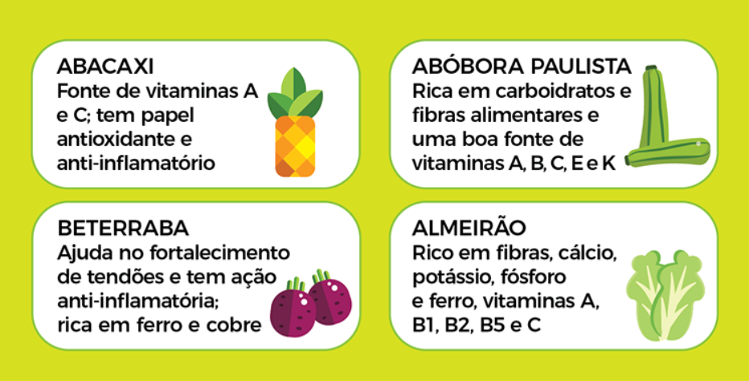

**Simulado 1**

5 -- Leia o texto e responda à pergunta.

"**Estado de SP realiza 'Dia V' de mobilização para aplicação de segunda
dose da vacina contra COVID-19**

*Estratégia acontece no sábado (2) e também servirá para os municípios
atualizarem o sistema VaciVida e inserirem imunizados que eventualmente
ainda não foram registrados*

Governo de São Paulo anunciou nesta quarta-feira (29) o "Dia V" de
vacinação contra COVID-19. A iniciativa, em parceria com os 645
municípios, acontecerá neste sábado (2) e tem como objetivo a aplicação
da segunda dose da vacina e a atualização dos registros de vacinação na
plataforma VaciVida.

\[\...\]

Mais de cinco mil pontos de vacinação no estado estarão abertos das 7h
às 19h para a aplicação exclusivamente destas doses neste sábado
(consulte a programação e horários de funcionamento dos postos de seu
município)".

Disponível em:
<http://www.saude.sp.gov.br/ses/perfil/cidadao/homepage/destaques/estado-de-sp-realiza-dia-v-de-mobilizacao-para-aplicacao-de-segunda-dose-da-vacina-contra-covid-19>.
Acesso em: 23 abr. 2023.

O texto reproduzido acima trata\...

a\) do número de vacinados no estado de São Paulo.

b\) da aprovação da campanha de vacinação por parte da população.

c\) de uma grande mobilização para a aplicação da segunda dose da vacina
contra COVID-19.

d\) da resistência da população em tomar o imunizante.

SAEB: Identificar a ideia central o texto.

BNCC: EF35LP03 \-- Identificar a ideia central do texto, demonstrando
compreensão global.

a\) Incorreta, pois o texto não faz menção direta ao número de
vacinados.

b\) Incorreta, pois o texto não cita nenhum juízo de valor em relação à
vacina.

c\) Correta, pois o texto trata da mobilização para a segunda dose da
vacina.

d\) Incorreta, pois a relação da população com a vacina não é citada no
texto.

6 - Leia o texto e responda à pergunta.

**"Ministério da Saúde lança campanha contra malária**

Ação tem foco na Região Amazônica, com 99% dos casos no país

O Ministério da Saúde (MS) lançou hoje (25) uma campanha voltada para a
prevenção e combate à malária. Com o slogan O combate à malária acontece
com a participação de todos: cidadãos, comunidade e governo, a campanha
tem como foco a Região Amazônica, que concentra 99% dos casos no país. A
doença, cuja incidência ocorre nas populações de maior vulnerabilidade
social, representa um grande problema de saúde pública no país. A data
marca o Dia Mundial de Luta Contra a Malária e os 20 anos de atuação do
Programa Nacional de Prevenção e Controle da Malária.

\[\...\]".

Disponível em:
<https://agenciabrasil.ebc.com.br/saude/noticia/2023-04/ministerio-da-saude-lanca-campanha-contra-malaria>.
Acesso em: 25 abr. 2023.

De acordo com o texto reproduzido acima, a campanha contra a Malária
terá como foco\...

a\) a região Sul do Brasil

b\) ações realizadas na internet.

c\) o ensino de formas de prevenção à doença.

d\) a região amazônica.

SAEB: - Localizar informação explícita.

BNCC: EF15LP03 \-- Localizar informações explícitas em textos.

a\) Incorreta, pois o texto menciona outra região.

b\) Incorreta, pois o texto não menciona como a campanha será realizada.

c\) Incorreta, pois o texto não menciona tais formas de prevenção.

d\) Correta, pois essa informação é citada explicitamente no texto.

7 -- Leia o texto e responda à pergunta.

"D. CECÍLIA (á parte) --- E titia não vem\... Que demora!\... Não sei
que lhe diga\...

estou tão vexada\... (O Barão tira um livro da algibeira e folheia-o).
Se eu pudesse

deixá-lo\... É o que vou fazer. (Sobe).

BARÃO (fechando o livro e erguendo-se) --- V. Excia. há de desculpar-me.
Recebi

hoje mesmo este livro da Europa; é obra que vai fazer revolução na
ciência; nada

menos que uma monografia das gramíneas, premiadas pela Academia de

Estocolmo."

ASSIS, Joaquim Maria Machado de. *Lição de Botânica*. Disponível em:
<https://machado.mec.gov.br/obra-completa-lista/item/download/65_2b8fb9ad43aa37653a58bc2bd56e33aa>.
Acesso em: 23 abr. 2023.

Tendo em vista as características formais do gênero dramático, quais são
as personagens envolvidas no trecho transcrito acima?

a\) D. Cecília e Barão.

b\) Machado de Assis e D. Cecília.

c\) Barão.

d\) D. Cecília.

SAEB: Identificar as marcas de organização de textos dramáticos.

BNCC: EF04LP27 \-- Identificar, em textos dramáticos, marcadores das
falas das personagens e de cena.

a\) Correta, pois são essas as personagens que aparecem no trecho.

b\) Incorreta, pois Machado de Assis é o autor da obra.

c\) Incorreta, pois D. Cecília também aparece no trecho.

d\) Incorreta, pois Barão também aparece no trecho.

8 -- Leia o texto e responda à pergunta.

**O MAR**

Que nostalgia vem de tuas vagas\
Ó velho mar, ó lutador Oceano!\
Tu de saudades íntimas alagas\
O mais profundo coração humano.\
\
Sim! Do teu choro enorme e soberano,\
Do teu gemer nas desoladas plagas\
Sai o que quer que é, rude sultão ufano,\
Que abre nos peitos verdadeiras chagas.\
\
Ó mar! Ó mar! Embora esse eletrismo,\
Tu tens em ti o gemem do lirismo.\
És um poeta lírico demais.\
\
E eu para rir com humor das tuas\
Nevroses colossais, bastam-me as luas\
Quando fazem luzir os seus metais.

CRUZ E SOUSA, João da. *O Mar.* Disponível em:
<http://www.antoniomiranda.com.br/>. Acesso em 23 abr. 2023.

O texto acima está organizado em versos e estrofes; logo, trata-se de
um\...

a\) poema.

b\) romance.

c\) anúncio.

d\) drama.

SAEB: Reconhecer diferentes modos de organização composicional de textos
em versos.

BNCC: EF35LP27 \-- Ler e compreender, com certa autonomia, textos em
versos, explorando rimas, sons e jogos de palavras, imagens poéticas
(sentidos figurados) e recursos visuais e sonoros.

a\) Correta, pois a poesia é organizada em versos e estrofes.

b\) Incorreta, pois um romance é um gênero narrativo.

c\) Incorreta, pois um anúncio pressupõe algo a ser anunciado.

d\) Incorreta, pois um texto dramático é organizado em diálogos.

9 -- Leia o texto e responda à pergunta.

"--- Vou ser atacado? exclamou D. Antônio pensativo.

--- Sim: podes contar.

--- **E por quem?**

--- Pelo Aimoré.

--- **E como sabes isto?** perguntou D. Antônio fitando nele um olhar
desconfiado".

ALENCAR, José de. *O Guarani.* Disponível em:
<https://pt.wikisource.org/wiki/O_Guarani/II/X>. Acesso em: 23 abr.
2023.

O sinal de pontuação utilizado nos trechos destacados indica\...

a\) o final de uma frase.

b\) uma frase destacada.

c\) uma dúvida.

d\) a divisão de uma frase.

SAEB: Reconhecer os usos da pontuação.

BNCC: EF04LP05 \-- Diferenciar, na leitura de textos, vírgula, ponto e
vírgula, dois-pontos e reconhecer, na leitura de textos, o efeito de
sentido que decorre do uso de reticências, aspas, parênteses.

a\) Incorreta, pois o ponto final é utilizado com essa finalidade.

b\) Incorreta, pois o ponto de exclamação é usado para destacar uma
frase.

c\) Correta, pois o ponto de interrogação indica uma dúvida.

d\) Incorreta, pois a vírgula é usada para dividir uma frase.

10 -- Observe a imagem e responda à pergunta.

{width="5.905555555555556in"
height="3.9402777777777778in"}

Disponível em:
<https://www.sjc.sp.gov.br/noticias/2021/maio/31/sao-jose-realiza-campanha-contra-o-trabalho-infantil/>.
Acesso em: 23 abr. 2023.

Na imagem acima, um recurso utilizado para convencer o público é/são\...

a\) as figuras coloridas.

b\) o uso das palavras "sim" e "não" em letras maiúsculas.

c\) os semblantes tristes das crianças.

d\) o uso da linguagem formal.

SAEB: Analisar o uso de recursos de persuasão em textos verbais e/ou
multimodais.

a\) Incorreta, pois as cores não são um recurso persuasivo.

b\) Correta, pois o uso de letras maiúsculas destaca a mensagem
transmitida.

c\) Incorreta, pois as crianças estão alegres na imagem.

d\) Incorreta, pois a imagem apresenta o uso da linguagem informal.

11 -- Leia o texto e responda à pergunta.

"--- Como vai, bacharel?

--- Menos mal, ignoto viajor.

--- Tomando a fresca, não?

--- C'est vrai, como dizem os franceses.

--- Bem, té-logo bacharel, estou meio afobado\..."

ANDRADE, Mário de. *Macunaíma.* Disponível em:
<https://pt.wikisource.org/wiki/Macuna%C3%ADma/1928/IV>. Acesso em: 23
abr. 2023.

No texto reproduzido acima, encontramos o uso de uma variante informal
da língua portuguesa no trecho\...

a\) "Menos mal, ignoto viajor \[...\]"

b\) "C'est vrai \[\...\]".

c\) "\[\...\] té logo bacharel \[\...\]"

d\) "Como vai, bacharel?"

SAEB: Identificar as variedades linguísticas em textos.

BNCC: EF35LP30 \-- Diferenciar discurso indireto e discurso direto,
determinando o efeito de sentido de verbos de enunciação e explicando o
uso de variedades linguísticas no discurso direto, quando for o caso.

a\) Incorreta, pois o trecho apresenta o uso formal da língua.

b\) Incorreta, pois o trecho apresenta o uso da língua francesa.

c\) Correta, pois "até logo" aparece como "té logo" no trecho.

d\) Incorreta, pois o trecho é escrito no registro formal da língua.

12 -- Leia o texto e responda à pergunta.

"**Bullying: combate deve ser feito de forma coletiva e intersetorial**

Um em cada três alunos em todo o mundo já foi vítima de
*bullying*, segundo a Organização das Nações Unidas para Educação,
Ciência e Cultura (Unesco). Esse tipo de violência, ainda comum nas
escolas**, gera consequências arrasadoras no desempenho dos alunos**,
além de sequelas negativas para a saúde física e mental das crianças.
Hoje (7) é comemorado no país o Dia Nacional de Combate ao Bullying e à
Violência nas Escolas

\[\...\]"

O adjetivo encontrado no trecho destacado indica uma conotação\...

a\) negativa.

b\) positiva.

c\) indiferente.

d\) duvidosa.

SAEB: Analisar os efeitos de sentido decorrentes do uso dos adjetivos.

BNCC: EF04LP07 \-- Identificar em textos e usar na produção textual a
concordância entre artigo, substantivo e adjetivo (concordância no grupo
nominal).

a\) Correta, pois o adjetivo "arrasadoras" possui uma conotação
negativa.

b\) Incorreta, pois o trecho atribui uma visão negativa à consequências
do bullying.

c\) Incorreta, pois o trecho demonstra uma visão valorativa a respeito
do problema.

d\) Incorreta, pois o trecho demonstra uma visão clara a respeito do
problema.

13 -- Leia o texto e responda à pergunta.

"**No verão, banhistas devem redobrar os cuidados para evitar
afogamentos**

Tempo quente e férias. Essa é a combinação ideal para que praias e
piscinas fiquem repletas de banhistas. Mas alguns cuidados são
fundamentais para que diversão não coloque a vida das pessoas em risco.
Segundo dados do Corpo de Bombeiros, no ano passado foram registrados
3,1 mil afogamentos no Estado, um aumento de 11,7% em relação a 2021,
quando ocorreram 2,81 mil casos em SP.

"Neste verão, não abuse da sorte e, na praia, sempre respeite as
orientações do salva-vidas. Lembre-se quase metade dos afogados
acreditavam que sabiam nadar", alerta a coordenadora do Grupo de
Atendimento e Resgate às Urgências (Grau), Cecilia Damasceno.

\[\...\]".

Disponível em:
<http://www.saude.sp.gov.br/ses/perfil/cidadao/homepage/destaques/no-verao-banhistas-devem-redobrar-os-cuidados-para-evitar-afogamentos>.
Acesso em 23 abr. 2023.

A citação de uma especialista no assunto tratado no texto torna o
argumento mais\...

a\) confuso.

b\) restrito.

c\) subjetivo.

d\) confiável.

SAEB: - Avaliar a fidedignidade de informações sobre um mesmo fato
veiculadas em diferentes mídias.

BNCC: EF04LP15 \-- Distinguir fatos de opiniões/sugestões em textos
(informativos, jornalísticos, publicitários etc.).

a\) Incorreta, pois a citação tem como objetivo clarificar o assunto.

b\) Incorreta, pois a citação traz mais informações sobre o tema do
texto.

c\) Incorreta, pois a citação torna o tema mais objetivo para o leitor.

d\) Correta, pois o uso de citações provenientes de especialistas
atribui maior confiabilidade ao argumento.

14 -- Observe a imagem e responda à pergunta.

{width="3.966666666666667in"
height="3.748163823272091in"}

Disponível em:
<https://www.saopaulo.sp.gov.br/spnoticias/entenda-por-que-uso-da-mascara-ajuda-a-reduzir-risco-de-contaminacao-por-covid-19/>.
Acesso em: 23 abr. 2023.

De acordo com o infográfico, a máscara de proteção\...

a\) ajuda a evitar a transmissão do vírus pelo ar.

b\) não deve ser usada por crianças.

c\) protege apenas seu usuário.

d\) deverá ser utilizada somente se o indivíduo estiver doente.

SAEB: Analisar informações apresentadas em gráficos, infográficos ou
tabelas.

BNCC: EF04LP20 \-- Reconhecer a função de gráficos, diagramas e tabelas
em textos, como forma de apresentação de dados e informações.

a\) Correta, pois o infográfico traz essa informação.

b\) Incorreta, pois o infográfico não menciona crianças.

c\) Incorreta, pois o infográfico menciona que as máscaras auxiliam o
usuário e as pessoas ao seu redor.

d\) Incorreta, pois o infográfico afirma exatamente o contrário.

15 -- Leia o texto e responda à pergunta.

**"Não sou o substituto do Google, afirma ChatGPT ao ser entrevistado**

Desde que foi apresentado ao mundo, em novembro de 2022, ainda em uma
versão de teste, o ChatGPT vem causando assombro. A reação inicial de
quem vê o sistema de inteligência artificial criado pela empresa
norte-americana OpenAI em funcionamento, respondendo a uma pergunta
qualquer, pode variar entre o fascínio e o entusiasmo. Em um segundo
momento, contudo, é inevitável pensar nas consequências de tamanho salto
tecnológico.

\[\...\]

Por ora, o ChatGPT produz apenas textos sobre praticamente qualquer
assunto, no formato requisitado pelo usuário. Há, no entanto, outros
programas de inteligência artificial capazes de gerar imagens
**hiper-realistas** a partir de descrições textuais fornecidas pelos
usuários, \[\...\]".

O prefixo "hiper" destacado no trecho acima indica\...

a\) negação.

b\) intensidade.

c\) diminuição.

d\) oposição.

SAEB: Reconhecer em textos o significado de palavras derivadas a partir
de seus afixos.

BNCC: EF35LP05 \-- Inferir o sentido de palavras ou expressões
desconhecidas em textos, com base no contexto da frase ou do texto.

a\) Incorreta, pois a ideia de negação está associada ao prefixo "anti".

b\) Correta, pois o prefixo "hiper" indica uma relação de intensidade.

c\) Incorreta, pois o prefixo destacado indica uma relação oposta.

d\) Incorreta, pois a ideia de oposição está associada ao prefixo
contra.

**Simulado 2**

5 -- Leia o texto e responda à pergunta.

"Já se não ria; tinha só um resto de sorriso forçado e resignado. Olhou
bem para

ela, e perguntou-lhe o que era.

--- Você promete o que lhe disse?

--- Vá lá. Que foi?

--- Pois saiba que ouvi nada menos que uma declaração de amor".

ASSIS, Joaquim Maria Machado de. *Quincas Borba*. Disponível em:
<https://machado.mec.gov.br/obra-completa-lista/item/download/14_7bbc6c42393beeac1fd963c16d935f40>.
Acesso em: 24 abr. 2023.

Os travessões empregados no trecho acima cumprem a função de\...

a\) expor informações sobre a aparência das personagens.

b\) introduzir a fala de uma personagem.

c\) concluir um parágrafo da narrativa.

d\) introduzir a descrição do espaço.

SAEB: Identificar elementos constitutivos de textos narrativos.

BNCC: EF35LP26 \-- Ler e compreender, com certa autonomia, narrativas
ficcionais que apresentem cenários e personagens, observando os
elementos da estrutura narrativa: enredo, tempo, espaço, personagens,
narrador e a construção do discurso indireto e discurso direto.

a\) Incorreta, pois tais descrições normalmente ocorrem ao longo do
texto.

b\) Correta, pois o travessão é utilizado em meio a um diálogo.

c\) Incorreta, pois os parágrafos são concluídos com pontos finais.

d\) Incorreta, pois as descrições de espaço acontecem ao longo do texto.

6 -- Leia o texto e responda à pergunta.

"Que tal agora desenhar a sua própria amarelinha? Para facilitar, siga o
passo a passo:

1\. Você vai precisar de giz e uma pedrinha;

2\. Desenhe a sequência de números de 1 a 10 (quadrados) no chão;

3\. Vamos às regras: Ninguém pode pisar fora do quadrado; a pedrinha
precisa ficar dentro da marcação e do número correto; só pode colocar um
pé em cada quadrado, quando for um quadrado pule de um pé só e quando
tiver dois é um pé em cada; não pode pisar no quadrado que estiver com a
pedra; deve recolher a pedra na volta.

4\. Se possível convide sua família ou amigos para brincar com você".

Disponível em:
<https://sme.goiania.go.gov.br/conexaoescola/ensino_fundamental/brincar-de-amarelinha/>.
Acesso em: 24 abr. 2023.

As instruções para a brincadeira descrita no texto acima são
introduzidas por\...

a\) verbos no imperativo.

b\) verbos no indicativo.

c\) adjetivos.

d\) substantivos.

SAEB: Analisar elementos constitutivos de gêneros textuais diversos.

BNCC: EF04LP05 \-- Identificar e reproduzir, em textos injuntivos
instrucionais (instruções de jogos digitais ou impressos), a formatação
própria desses textos (verbos imperativos, indicação de passos a ser
seguidos) e formato específico dos textos orais ou escritos desses
gêneros (lista/ apresentação de materiais e instruções/passos de jogo).

a\) Correta, pois o modo imperativo é usado para transmitir as
instruções.

b\) Incorreta, pois o modo indicativo não é usado para transmitir as
instruções.

c\) Incorreta, pois os adjetivos são usados para qualificar os
substantivos.

d\) Incorreta, pois os substantivos são usados para se referir a objetos
animados ou inanimados.

7 -- Leia o texto e responda a pergunta.

"**O velho abrio as palpebras e cerrou-as logo:**

--- Filha de Araken, escolhe para teu hospede o presente da volta e
prepara o moquem da viagem. Si o estrangeiro precisa de guia, o
guerreiro Cauby, senhor do caminho, o acompanhará".

ALENCAR, José de. *Iracema.* Disponível em:
<https://pt.wikisource.org/wiki/Iracema>. Acesso em: 24 abr. 2023.

O sinal de pontuação utilizado no trecho cumpre a função de\...

a\) concluir uma frase.

b\) enfatizar um dos termos da frase.

c\) marcar uma dúvida da personagem.

d\) indicar o início de um diálogo.

SAEB: Analisar os efeitos de sentido decorrentes do uso da pontuação.

BNCC: EF04LP05 \-- Identificar a função na leitura e usar,
adequadamente, na escrita ponto final, de interrogação, de exclamação,
dois-pontos e travessão em diálogos (discurso direto), vírgula em
enumerações e em separação de vocativo e de aposto.

a\) Incorreta, pois o ponto final é utilizado para concluir uma frase.

b\) Incorreta, pois o ponto de exclamação é usada para enfatizar um
termo.

c\) Incorreta, pois o ponto de interrogação é usado para marcar uma
dúvida.

d\) Correta, pois os dois pontos indicam o início de um diálogo no
trecho seguinte.

8 -- Leia o texto e responda à pergunta.

"**Formação de professores é entrave ao uso de tecnologia em sala de
aula**

Estudo do British Council - organização internacional do Reino Unido
para relações culturais e oportunidades educacionais - mostra que a
formação docente é um dos mais graves empecilhos ao uso de tecnologia em
laboratórios ou em sala de aula. Paralelamente a essa questão, as
escolas brasileiras enfrentam problemas de infraestrutura.

Os dados constam do estudo O ensino de ciências da natureza e suas
tecnologias na educação básica brasileira -- um panorama entre os anos
de 2010 e 2020, feito em parceria com a Fundação Carlos Chagas e lançado
nesta quarta-feira (12).

\[\...\]".

Disponível em:
<https://agenciabrasil.ebc.com.br/educacao/noticia/2023-04/formacao-de-professores-e-entrave-ao-uso-de-tecnologia-em-sala-de-aula>.
Acesso em: 24 abr. 2023.

Após a leitura do texto, podemos inferir que\...

a\) o uso da tecnologia é muito importante no contexto da sala de aula.

b\) o uso da tecnologia deve ser evitado no contexto da sala de aula.

c\) os professores brasileiros estão preparados para utilizar a
tecnologia em sala de aula.

d\) as escolas brasileiras utilizarão tecnologias britânicas em sala de
aula.

SAEB: Inferir informações implícitas em textos.

BNCC: EF35LP04 \-- Inferir informações implícitas nos textos lidos.

a\) Correta, pois o fato de o uso da tecnologia ser um elemento
considerado importante na formação dos docentes nos permite inferir sua
relevância.

b\) Incorreta, pois essa informação não surge no texto.

c\) Incorreta, pois desenvolve o argumento oposto.

d\) Incorreta, pois o texto afirma somente que a pesquisa foi realizada
por uma instituição britânica.

9 -- Leia o texto e responda à pergunta.

"Si fosse ser água os outros bebiam, si fosse ser formiga esmagavam, si
fosse mosquito flitavam, si fosse trem de ferro descarrilava, si fosse
rio punham no mapa\... Resolveu:

"Vou ser Lua". Gritou:

--- Abram a porta, gente, que quero umas coisas!"

ANDRADE. Mário de. *Macunaíma.* Disponível em:
<https://pt.wikisource.org/wiki/Macuna%C3%ADma/1928>. Acesso em: 24 abr.
2023.

No trecho reproduzido acima, o verbo utilizado para introduzir uma fala
é\...

a\) "abram".

b\) "gritou".

c\) "punham".

d\) "fosse".

SAEB: Analisar os efeitos de sentido de verbos de enunciação.

BNCC: EF35LP30 \-- Diferenciar discurso indireto e discurso direto,
determinando o efeito de sentido de verbos de enunciação e explicando o
uso de variedades linguísticas no discurso direto, quando for o caso.

a\) Incorreta, pois o verbo em questão é usado em meio ao diálogo.

b\) Correta, pois o verbo em questão é usado para introduzir a fala da
personagem.

c\) Incorreta, pois o verbo em questão é usado durante a descrição do
narrador.

d\) Incorreta, pois o verbo em questão é usado durante a descrição do
narrador.

10 -- Leio texto e responda à pergunta.

"Se, em conversa com o ex-presidente de província, disse todo o bem que
pensava do Governo Provisório, não lhe ouviu palavras de acordo nem de
contestação. Não entrou mais fundo na confissão do homem, porque a moça
o atraía, e ele gostava mais **dela** que do pai".

ASSIS, Joaquim Maria Machado de. *Esaú e Jacó*. Disponível em:
<https://machado.mec.gov.br/obra-completa-lista/item/download/12_ab2c739d2e8293712078e7b6b0c12abb>.
Acesso em: 24 abr. 2023.

O termo destacado no trecho acima é utilizado para retomar a palavra\...

a\) "confissão".

b\) "palavras".

c\) "moça".

d\) "ele".

SAEB: Identificar os mecanismos de progressão textual.

a\) Incorreta, pois a palavra em questão não é retomada.

b\) Incorreta, pois "palavras" não é retomada no texto.

c\) Correta, pois a contração "dela" retoma a palavra "moça".

d\) Incorreta, pois o pronome pessoal "ele" não é retomado.

11 -- Leia o texto e responda à pergunta.

"**Brasileiros preferem cursos online para qualificação profissional**

Cursos online têm uma vantagem em termos de se adequar mais ao tempo das
pessoas, embora um curso presencial, a interação com os colegas e
professores ao vivo, tenha as suas vantagens. "Eu diria que um curso
híbrido **talvez** seja uma solução a esses cursos puramente digitais,
embora reconheça que sejam mais complexos e caros esses cursos que têm
um lado presencial", afirmou o diretor da FGV Social.

\[\...\]".

Disponível em:
<https://agenciabrasil.ebc.com.br/geral/noticia/2023-04/brasileiro-prefere-cursos-online-para-qualificacao-ao-mercado>.
Acesso em: 25 abr. 2023.

O termo destacado no trecho acima indica\...

a\) lugar.

b\) tempo.

c\) negação.

d\) dúvida.

SAEB: Analisar os efeitos de sentido decorrentes do uso dos advérbios.

a\) Incorreta, pois a palavra "talvez" não é um advérbio de lugar.

b\) Incorreta, pois a palavra "talvez" não é um advérbio de tempo.

c\) Incorreta, pois a palavra "talvez" não é um advérbio de negação.

d\) Correta, pois a palavra "talvez" é um advérbio de dúvida.

12 -- Leia o texto e responda à pergunta.

"**Centro de Referência em Saúde Indígena é inaugurado em terra
Yanomami**

"O território Yanomami em Surucucu recebeu um Centro de Referência em
Saúde Indígena para combater crise humanitária de saúde no local. A
unidade foi inaugurada nessa sexta-feira (21) e é preparada para
atendimentos de urgência, consultas, exames e o tratamento de malária e
desnutrição. Desde o começo do ano, o governo federal mobiliza uma
operação interministerial para o atendimento aos povos dessa região.

\[\...\]".

O texto acima cumpre a função de informar o leitor a respeito de um
acontecimento; logo, trata-se de um(a)\...

a\) anúncio.

b\) poema.

c\) notícia.

d\) conto.

SAEB: Reconhecer diferentes gêneros textuais.

BNCC: EF04LP14 \-- Identificar, em notícias, fatos, participantes, local
e momento/tempo da ocorrência do fato noticiado.

a\) Incorreta, pois um anúncio cumpre a função de divulgar um produto ou
evento.

b\) Incorreta, pois um poema é estruturado em versos e estrofes.

c\) Correta, pois o gênero notícia tem como objetivo principal informar
o leitor.

d\) Incorreta, pois um conto constitui um gênero narrativo.

13 -- Leia o texto e responda à pergunta.

"**Governo de SP amplia Campanha de Multivacinação até 30 de novembro**

Devido à baixa procura, o Governo de SP amplia a Campanha de
Multivacinação e até o final de novembro, quando crianças e adolescentes
com menos de 15 anos podem atualizar a caderneta de vacinação. Apenas
34% do público-alvo, entre crianças e adolescentes de até 15 anos de
idade, procuraram os postos para se vacinar.

"É imprescindível que pais e responsáveis levem seus filhos aos postos
para tomarem os imunizantes e, deste modo, garantirem a saúde e
segurança de suas famílias e da sociedade. As baixas procuras estão
ameaçando o retorno de doenças já erradicadas, é preciso aproveitar a
oportunidade para prevenir e salvar", destaca Tatiana Lang, do Centro de
Vigilância Epidemiológica da Secretaria de Estado da Saúde.

\[\...\]"

Disponível em:
<https://www.saopaulo.sp.gov.br/spnoticias/governo-de-sp-amplia-campanha-de-multivacinacao-ate-30-de-novembro/>.
Acesso em: 24 abr. 2023.

O texto reproduzido acima pode ser considerado mais eficiente por
apresentar\...

a\) perspectivas conflitantes.

b\) a opinião de uma especialista.

c\) uma linguagem complexa.

d\) informações confusas.

SAEB: Julgar a eficácia de argumentos em textos.

a\) Incorreta, pois o texto não apresenta diferentes pontos de vista.

b\) Correta, pois o texto traz a opinião de uma especialista no tema.

c\) Incorreta, pois o texto apresenta uma linguagem de fácil
compreensão.

d\) Incorreta, pois o texto traz informações claras.

14 -- Leia o texto e responda à pergunta.

"**O MURO**

Movendo os pés doirados, lentamente,\
Horas brancas lá vão, de amor e rosas\
As impalpáveis formas, no ar, cheirosas.. . .\
Sombras, sombras que são da alma doente!\
\
E eu, magro, espio\... e um muro, magro, em frente\
Abrindo á tarde as órbitas musgosas\
--- Vazias? Menos do que misteriosas ---\
Pestaneja, estremece. . . O muro sente!\
\
E que cheiro que sai dos nervos dele,\
Embora o caio roído, cor de brasa,\
E lhe doa talvez aquela pele!\
\
Mas um prazer ao sofrimento casa. . .\
Pois o ramo em que o vento á dor lhe impele\
É onde a volúpia está de urna asa e outra asa. . .".

KILKERRY, Pedro. *O Muro.* Disponível em:
<http://www.antoniomiranda.com.br/poesia_brasis/bahia/pedro_kilkerry.html>.
Acesso em 24 abr. 2023.

A rima entre as palavras "rosas" e "cheirosas" encontrada na primeira
estrofe indica uma relação de\...

a\) oposição.

b\) aproximação.

c\) contraste.

d\) negação.

SAEB: Analisar a construção de sentidos de textos em versos com base em
seus elementos constitutivos.

BNCC: EF35LP27 \-- Ler e compreender, com certa autonomia, textos em
versos, explorando rimas, sons e jogos de palavras, imagens poéticas
(sentidos figurados) e recursos visuais e sonoros.

a\) Incorreta, pois a rima presente no poema faz com o que o substantivo
seja associado ao adjetivo.

b\) Correta, pois a presença da rima faz com as duas palavras sejam
lidas em conjunto.

c\) Incorreta, pois o poema pretende complementar o sentido da primeira
palavra.

d\) Incorreta, pois as duas palavras fazem parte do mesmo campo
semântico.

15 -- Observe a imagem e responda à pergunta.

{width="4.175in" height="4.175in"}

"O calor e as chuvas constantes são alguns dos fatores que mais
favorecem a proliferação do Aedes aegypti, mosquito transmissor da
dengue, zika e chikungunya. Por isso, o número de casos dessas doenças
vem aumentando a cada dia. Grande parte dos focos estão dentro das
residências e para evitar que o mosquito se prolifere, simples atitudes
como virar para baixo garrafas, colocar telas nas janelas, deixar sempre
com areia os pratos de plantas, manter calhas e vasilhas de animais de
estimação sempre limpas, fazem a diferença no combate do mosquito Aedes
Aegypti. Vale ressaltar que o descarte incorreto de lixo é uma das
principais causas para o acumulo de larvas dos mosquitos, por isso,
descarte seu lixo no local adequado. Todos juntos contra a Dengue! Já
combateu o mosquito hoje? Faça a sua parte e ajude a mantê-lo longe em
2022!"

Disponível em:
<https://www.pontesgestal.sp.gov.br/portal/noticias/0/3/435/campanha-contra-a-dengue>.
Acesso em: 24 abr. 2023.

A ilustração reproduzida acima estabelece com o texto uma relação de\...

a\) contraste.

b\) repetição.

c\) negação.

d\) complementação.

d\) negação.

SAEB: Analisar os efeitos de sentido de recursos multissemiótico em
textos que circulam em diferentes suportes.

a\) Incorreta, pois a imagem e o texto seguem a mesma linha
argumentativa.

b\) Incorreta, pois a imagem adiciona mais informações à argumentação.

c\) Correta, pois a imagem reforça o argumento a partir de novas
informações.

d\) Incorreta, pois tanto a imagem como o texto partem do mesmo
pressuposto.

**Simulado 3**

5 -- Leia o texto e responda à pergunta.

"**Jovens de até 24 anos veem 7 vezes menos TV aberta do que idosos**

\[\...\]

Gabriela Borges, coordenadora do Observatório da Qualidade no
Audiovisual e professora da Universidade do Algarve, confirma essa
tendência.

\[\...\]

Ela cita outra pesquisa recente, feita em 2022, pela Ofcom, a agência
reguladora britânica. O levantamento mostra que jovens entre 16 e 24
anos assistem quase sete vezes menos televisão do que pessoas com 65
anos ou mais, passando menos de uma hora em frente à TV.

 \"Eu acho que esse dado também é importante, porque os jovens já não
assistem a televisão, mas eles migram e eles assistem conteúdo
audiovisual nas plataformas de streaming ou conteúdos *on demand* e em
vídeos de redes sociais".

\[\...\]".

Disponível em:
<https://agenciabrasil.ebc.com.br/geral/noticia/2023-02/jovens-de-ate-24-anos-veem-7-vezes-menos-tv-aberta-do-que-idosos>.
Acesso em: 24 abr. 2023.

O trecho entre aspas encontrado ao final do texto reproduzido acima
indica um(a)

a\) opinião.

b\) fato.

c\) narrativa.

d\) verso.

SAEB: Distinguir fatos de opiniões em textos.

BNCC: EF04LP15 \-- Distinguir fatos de opiniões/sugestões em textos
(informativos, jornalísticos, publicitários etc.).

a\) Correta, pois o trecho transcreve a opinião da especialista.

b\) Incorreta, pois o trecho não apresenta um fato observável, e sim uma
opinião.

c\) Incorreta, pois o trecho não apresenta características narrativas.

d\) Incorreta, pois não se trata de um texto poético.

6 -- Leia o texto e responda à pergunta.

"**Telemedicina chegou com a pandemia e veio para ficar, indica estudo**

Uma pesquisa feita com 1.183 médicos dos Estados de São Paulo e do
Maranhão mostrou que os diversos usos da telemedicina -- que despontaram
como alternativa durante a crise sanitária causada pela COVID-19 --
devem permanecer no sistema de saúde brasileiro.

\[\...\]

"Os sistemas de saúde, ao se adaptarem às crises -- econômica, política
ou sanitária --, acabam encontrando soluções e alternativas que podem
ser **transitórias** ou permanentes. Como nosso projeto de pesquisa
estava em andamento quando veio a pandemia, decidimos, a partir do
estudo do trabalho dos médicos, entender mudanças na saúde que possam
ter sido aceleradas pela COVID-19", explica o pesquisador à Agência
FAPESP.

\[\...\]".

Disponível em:
<https://www.saopaulo.sp.gov.br/spnoticias/telemedicina-chegou-com-a-pandemia-e-veio-para-ficar-indica-estudo/>.
Acesso em: 24 abr. 2023.

A partir do contexto, é possível inferirmos que o termo destacado se
refere a algo\...

a\) eterno.

b\) fútil.

c\) de boa qualidade.

d\) passageiro.

SAEB: Inferir o sentido de palavras ou expressões em textos.

BNCC: EF35LP05 \-- Inferir o sentido de palavras ou expressões
desconhecidas em textos, com base no contexto da frase ou do texto.

a\) Incorreta, pois o termo destacado apresenta um sentido oposto.

b\) Incorreta, pois o termo destacado não apresenta esse sentido.

c\) Incorreta, pois o termo destacado não diz respeito à qualidade do
atendimento.

d\) Correta, pois o termo "transitória" é utilizado nesse sentido no
texto.

7 -- Leia o texto e responda à pergunta.

"**Lugares e monumentos contam a história do 7 de Setembro em São
Paulo**

Foi às margens do riacho Ipiranga, há 199 anos, em um 7 de setembro como
hoje, que Dom Pedro I (1789-1834) declarou a independência do Brasil em
relação a Portugal. O Brasil então se torna uma monarquia e Dom Pedro I
passa a ser imperador.

\[\...\]

Em São Paulo, onde a independência foi declarada, diversos museus e
monumentos ajudam a contar essa história e a entender que esse
**acontecimento** foi um processo e não se encerrou no momento do grito.

\[\...\]".

Disponível em:
<https://agenciabrasil.ebc.com.br/geral/noticia/2021-09/lugares-historicos-contam-historia-do-7-de-setembro-em-sp>.
Acesso em: 24 abr. 2023.

O termo destacado acima refere-se ao/à\...

a\) grito do Ipiranga.

b\) cidade de São Paulo.

c\) monumentos.

d\) independência do Brasil.

SAEB: Identificar os mecanismos de referenciação lexical e pronominal.

BNCC: EF05LP27 \-- Utilizar, ao produzir o texto, recursos de coesão
pronominal (pronomes anafóricos) e articuladores de relações de sentido
(tempo, causa, oposição, conclusão, comparação), com nível adequado de
informatividade.

a\) Incorreta, pois essa palavra aparece no texto após o termo
destacado.

b\) Incorreta, pois essa palavra não é retomada no texto.

c\) Incorreta, pois essa palavra não é retomada no texto.

d\) Correta, pois a palavra "acontecimento" se refere à independência.

8 -- Leia o texto e responda à pergunta.

"**Poluição em São Paulo cai 50% com a quarentena**

Apesar de todos os problemas acarretados com a pandemia do novo
coronavírus em todo o mundo, a imposição do isolamento social para
controlar o avanço da doença ajudou a reduzir os níveis de poluição nas
grandes cidades, como mostra a reportagem de Daniel Antonio à Agência
FAPESP.

**Isso acontece porque** a principal fonte de emissão de poluentes é a
frota veicular, que durante a quarentena está menos ativa do que o
normal. A avaliação é da professora do Instituto de Astronomia,
Geofísica e Ciências Atmosféricas da Universidade de São Paulo
(IAG-USP), Maria de Fátima Andrade.

\[\...\]".

Disponível em:
<https://www.saopaulo.sp.gov.br/noticias-coronavirus/poluicao-em-sao-paulo-cai-50-com-a-quarentena/>.
Acesso em: 24 abr. 2023.

O trecho destacado acima apresenta uma causa para

a\) o aumento da poluição na cidade de São Paulo.

b\) a diminuição das taxas de poluição na cidade de São Paulo.

c\) a transmissão do coronavírus na cidade de São Paulo.

d\) o aumento na frota de veicular na cidade de São Paulo.

SAEB: Analisar relações de causa e consequência.

BNCC: EF05LP27 \-- Utilizar, ao produzir o texto, recursos de coesão
pronominal (pronomes anafóricos) e articuladores de relações de sentido
(tempo, causa, oposição, conclusão, comparação), com nível adequado de
informatividade.

a\) Incorreta, pois o texto afirma exatamente o contrário.

b\) Correta, pois o trecho explica os motivos que levaram a esse quadro.

c\) Incorreta, pois, embora o texto mencione o coronavírus, o trecho não
explica esse problema .

d\) Incorreta, pois o texto não trata especificamente desse fato.

9 -- Leia o texto e responda à pergunta.

"**Tributo a Guilherme de Almeida revela as várias facetas do escritor**

O museu Casa Guilherme de Almeida realiza no mês de julho mais uma
edição do Guilherme de Almeida em Cena 一 evento que homenageia a obra
do poeta em seu mês de nascimento e falecimento. A atividade, que
acontece de 21 a 24 de julho, tem como objetivo apresentar a pluralidade
do trabalho do escritor e contempla desde sua atuação como cronista e
crítico de cinema até seu interesse pela cultura japonesa,
principalmente pelo haicai 一 modelo de poema de origem japonesa que tem
a brevidade como uma de suas características. Neste ano a programação
abre as inscrições para as atividades presenciais e virtuais.

O tributo inicia no dia 21 de julho, quinta-feira, a partir das 19h, com
a palestra Crônicas de Guilherme de Almeida, de Cesar Veneziani, poeta e
mestre em Estudos da Tradução pela FFLCH-USP, e Marlene Laky, jornalista
pela PUC-CAMP, conservadora-restauradora formada pelo SENAI e
coordenadora de oficinas sobre conservação de livros na Casa Guilherme
de Almeida.

\[\...\]".

Disponível em:
<https://www.saopaulo.sp.gov.br/ultimas-noticias/tributo-a-guilherme-de-almeida-revela-as-varias-facetas-do-escritor/>.
Acesso em: 24 abr. 2023.

O texto reproduzido acima fala sobre\...

a\) uma homenagem ao poeta Guilherme de Almeida.

b\) a necessidade de mais eventos literários serem realizados.

c\) os poemas mais importantes do escritor Guilherme de Almeida.

d\) a tradução de poemas no Brasil.

SAEB: Identificar a ideia central o texto.

BNCC: EF35LP03 \-- Identificar a ideia central do texto, demonstrando
compreensão global.

a\) Correta, pois se trata de um texto de divulgação dessa homenagem ao
poeta.

b\) Incorreta, pois o texto não menciona essa questão.

c\) Incorreta, pois o texto não cita poemas específicos do escritor.

d\) Incorreta, pois o texto apenas menciona que Guilherme de Almeida
também era tradutor.

10 -- Leia o texto e responda à pergunta.

"**Governo da Bahia reforça combate às fake news via WhatsApp**

O Governo do Estado amplia as ações de combate à desinformação com mais
um canal para denúncias de notícias falsas e conteúdos enganosos que
circulam pela internet. Através do WhatsApp, os usuários podem mandar
mensagens de texto, áudios, imagens ou vídeos para o número (71)
9646-4095. Desde 2020, os baianos e baianas contam também com o site
www.bahiacontraofake.ba.gov.br no enfrentamento às fake news.

As informações enviadas são analisadas pela equipe da Secretaria de
Comunicação Social do Estado (Secom) e encaminhadas para os órgãos
competentes. Após apuração, os esclarecimentos são feitos por meio da
seção "Fato ou Fake" do site. A plataforma pioneira do governo baiano
disponibiliza ainda artigos e vídeos que abordam a temática da
desinformação e os efeitos da disseminação de notícias falsas.

\[\...\]".

Disponível em:
<https://www.bahia.ba.gov.br/2023/01/noticias/comunicacao/governo-da-bahia-reforca-combate-as-fake-news-via-whatsapp/>.
Acesso em: 24 abr. 2023.

De acordo com o texto, uma das ações do governo da Bahia para combater
as *fake news* consiste em\...

a\) criar órgãos competentes para analisar as notícias.

b\) apreender os aparelhos envolvidos na disseminação de notícias
falsas.

c\) aumentar a fiscalização das redes sociais utilizadas no estado.

d\) analisar as informações e encaminhá-las aos órgãos competentes.

SAEB: Localizar informação explícita.

BNCC: EF35LP03 \-- Identificar a ideia central do texto, demonstrando
compreensão global.

a\) Incorreta, pois o texto apenas menciona esses órgãos.

b\) Incorreta, pois o texto não menciona punições.

c\) Incorreta, pois o texto não cita redes sociais.

d\) Correta, pois essa informação é afirmada explicitamente no texto.

11 -- Leia o texto e responda à pergunta.

"**Prêmio literário para mulheres é lançado no Planalto**

O governo federal lançou nesta quarta-feira (5) o Prêmio Carolina Maria
de Jesus de Literatura Produzida por Mulheres 2023. O edital prevê a
seleção de 40 obras escritas exclusivamente por mulheres no valor de R\$
50 mil por agraciada, totalizando R\$ 2 milhões.

Pelo menos 20% das obras selecionadas deverão ser escritas por mulheres
negras. Cotas para autoras indígenas, quilombolas, ciganas e com
deficiência também estão previstas. Os gêneros literários aceitos serão
**conto, crônica, romance, quadrinho e roteiro de teatro.** As
inscrições deverão ser realizadas no site da Ministério da Cultura de 12
de abril a 10 de junho.

\[\...\]".

Disponível em:
<https://agenciabrasil.ebc.com.br/geral/noticia/2023-04/premio-literario-para-mulheres-e-lancado-no-planalto>.
Acesso em: 24 abr. 2023.

No trecho destacado, a vírgula é utilizada para\...

a\) destacar uma informação.

b\) pontuar uma dúvida.

c\) enumerar diferentes informações.

d\) concluir uma frase.

SAEB: Reconhecer os usos da pontuação.

BNCC: EF04LP05 \-- Identificar a função na leitura e usar,
adequadamente, na escrita ponto final, de interrogação, de exclamação,
dois-pontos e travessão em diálogos (discurso direto), vírgula em
enumerações e em separação de vocativo e de aposto.

a\) Incorreta, pois o ponto de exclamação é utilizado para destacar
informações.

b\) Incorreta, pois o ponto de interrogação é usado para marcar dúvidas.

c\) Correta, pois a vírgula é utilizada para enumerar os gêneros
literários aceitos no prêmio.

d\) Incorreta, pois o ponto final é usado para concluir uma frase.

12 -- Leia o texto e responda à pergunta.

**"FLORES LUXEMBURGUESAS**\
\
Não é, não e alegria,\
Nem é tristeza sombria\
Que sinto me atravessar.\
Grato, grato sentimento\
De um passado encantamento ---\
Por toda parte a lembrar!\
\
Eram as roxas florestas,\
As sagradas sombras mestas\
Nossos berços da soidão:\
Se deles tendes as flores, ---\
A saudade dos amores\
Em vós reconheço estão".

SOUSÂNDRADE. *Flores Luxemburguesas*. Disponível em:
<http://www.antoniomiranda.com.br/iberoamerica/brasil/sousandrade.html>.
Acesso em: 24 abr. 2023.

O poema reproduzido acima apresenta\...

a\) 12 estrofes.

b\) 6 estrofes.

c\) 1 estrofe.

d\) 2 estrofes.

SAEB: Reconhecer diferentes modos de organização composicional de textos
em versos.

BNCC: EF35LP27 \-- Ler e compreender, com certa autonomia, textos em
versos, explorando rimas, sons e jogos de palavras, imagens poéticas
(sentidos figurados) e recursos visuais e sonoros.

a\) Incorreta, pois o poema apresenta 12 versos divididos em duas
estrofes..

b\) Incorreta, pois o poema apresenta seis versos em cada estrofe.

c\) Incorreta, pois o poema apresenta duas estrofes.

d\) Correta, pois o poema é dividido em duas estrofes com seis versos
cada.

13 -- Observe a imagem e responda à pergunta.

{width="5.425in"
height="2.7661373578302713in"}

Disponível em:
<https://www.saopaulo.sp.gov.br/spnoticias/conheca-alguns-dos-alimentos-tipicos-da-primavera/>.
Acesso em: 24 abr. 2023.

De acordo com o infográfico, um dos benefícios da beterraba é\...

a\) sua ação antioxidante.

b\) sua ação anti-inflamatória.

c\) a presença de vitamina A.

d\) a presença de muitas fibras.

SAEB: Analisar informações apresentadas em gráficos, infográficos ou
tabelas.

BNCC: EF04LP20 \-- Reconhecer a função de gráficos, diagramas e tabelas
em textos, como forma de apresentação de dados e informações.

a\) Incorreta, essa é uma característica do abacaxi.

b\) Correta, pois essa característica é mencionada no infográfico.

c\) Incorreta, essa é uma característica do almeirão.

d\) Incorreta, essa é uma característica da abóbora paulista.

14 -- Leia o texto e responda à pergunta.

"Camilo pegou-lhe nas mãos, e olhou para ela sério e fixo. Jurou que lhe
queria muito, que os seus sustos pareciam de criança; em todo o caso,
quando tivesse algum receio, a melhor cartomante era ele mesmo. Depois,
repreendeu-a; disse-lhe que era imprudente andar por essas casas. Vilela
podia sabê-lo, e depois\...".

ASSIS, Joaquim Maria Machado de. *A Cartomante.* Disponível em:
<https://machado.mec.gov.br/obra-completa-lista/item/download/26_29eaa69154e158508ef8374fcb50937a>.
Acesso em: 24 abr. 2023.

O trecho reproduzido acima apresenta a fala de/do\...

a\) Machado de Assis.

b\) narrador.

c\) Camilo.

d)Vilela.

SAEB: Identificar elementos constitutivos de textos narrativos.

BNCC: EF35LP26 \-- Ler e compreender, com certa autonomia, narrativas
ficcionais que apresentem cenários e personagens, observando os
elementos da estrutura narrativa: enredo, tempo, espaço, personagens,
narrador e a construção do discurso indireto e discurso direto.

a\) Incorreta, pois esse é o autor do conto.

b\) Correta, pois as descrições em uma narrativa são feitas pelo
narrador.

c\) Incorreta, pois esse é uma das personagens do conto.

d\) Incorreta, pois esse é uma das personagens do conto.

15 -- Observe a imagem e responda à pergunta.

{width="3.658333333333333in"
height="3.658333333333333in"}

Disponível em:
<https://www.saude.ba.gov.br/temasdesaude/coronavirus/campanhacovid19/>.
Acesso em: 24 abr. 2023.

De acordo com a ilustração reproduzida acima, podemos inferir que\...

a\) o uso de máscaras é necessário.

b\) não devemos prestar atenção à higiene no combate ao vírus.

c\) não devemos nos preocupar com a infecção.

d\) o uso de máscaras é opcional.

SAEB: Analisar os efeitos de sentido de recursos multissemiótico em
textos que circulam em diferentes suportes.

a\) Correta, pois a imagem mostra uma mulher utilizando uma máscara.

b\) Incorreta, pois o cartaz afirma exatamente o contrário.

c\) Incorreta, pois o cartaz menciona cuidados necessários contra o
vírus.

d\) Incorreta, pois a ilustração mostra exatamente o contrário.

**Simulado 4**

5 -- Leia o texto e responda à pergunta.

"**Mais livros: governo quer retomar políticas públicas para leitura**

Fazer uma nação leitora, este é o desafio do atual governo. Em
entrevista exclusiva para a Agência Brasil, o secretário de Formação,
Livro e Leitura do Ministério da Cultura, Fabiano Piúba, destaca as
ações de retomada das políticas para a área, assim como aponta propostas
da pasta para o novo Programa de Aceleração do Crescimento (PAC). De
acordo com ele, a formação leitora dos brasileiros é uma das prioridades
da gestão.

\[\...\]

**Além disso**, existe a expectativa de destacar recursos orçamentários
para o programa de tradução de obras de autores brasileiros, coordenado
pela Fundação Biblioteca Nacional. Dessa forma, a pasta espera
repercutir nossa criação literária em línguas diversas.

\[\...\]".

Disponível em:
<https://agenciabrasil.ebc.com.br/geral/noticia/2023-04/mais-livros-governo-quer-retomar-politicas-publicas-para-leitura>.
Acesso em: 25 abr. 2023.

A expressão destacada no trecho acima cumpre a função de\...

a\) concluir o texto.

b\) contrastar duas partes diferentes do texto.

c\) expandir as informações discutidas até então.

d\) negar as informações discutidas no início do texto.

SAEB: Identificar os mecanismos de progressão textual.

a\) Incorreta, pois a expressão adiciona novas informações ao texto.

b\) Incorreta, pois a expressão não opõe as duas partes do texto.

c\) Correta, pois a expressão indica a adição de mais informações no
texto.

d\) Incorreta, pois a expressão não indica uma relação negativa com
aquilo que foi dito.

6 -- Observe a imagem e responda à pergunta.

{width="4.813232720909887in"
height="3.433333333333333in"}

Disponível em: <https://www2.bauru.sp.gov.br/materia.aspx?n=34083>.
Acesso em: 25 abr. 2023.

Um dos recursos utilizados no cartaz para convencer o leitor da
importância do combate ao trabalho infantil é\...

a\) a presença de citações de especialistas.

b\) a presença de textos informativos.

c\) o uso da linguagem formal.

d\) a ilustração de uma garotinha feliz.

SAEB: Analisar o uso de recursos de persuasão em textos verbais e/ou
multimodais.

a\) Incorreta, pois, embora esse seja um recurso válido, ele não aparece
no cartaz.

b\) Incorreta, pois o cartaz apresenta somente um texto referente à data
de combate ao trabalho infantil.

c\) Incorreta, pois o cartaz apresenta o uso da linguagem informal.

d\) Correta, pois a ilustração auxilia na construção do argumento
principal -- o combate ao trabalho infantil.

7 -- Leia o texto e responda à pergunta.

"Araci tomou o arco e entrou na floresta. A imagem do guerreiro
**amado** fugia naquele instante de seus olhos; eles buscaram entre as
folhas o sinal de seus passos e não o descobriram."

ALENCAR. José de. *Ubirajara.* Disponível em:
<http://objdigital.bn.br/Acervo_Digital/Livros_eletronicos/ubirajara.pdf>.
Acesso em: 25 abr. 2023.

O adjetivo destacado no trecho denota\...

a\) carinho.

b\) tristeza.

c\) raiva.

d\) oposição.

SAEB: Analisar os efeitos de sentido decorrentes do uso dos adjetivos.

BNCC: EF04LP07 \-- Identificar em textos e usar na produção textual a
concordância entre artigo, substantivo e adjetivo (concordância no grupo
nominal).

a\) Correta, pois o adjetivo "amado" denota carinho pela personagem.

b\) Incorreta, pois o adjetivo em questão possui uma conotação positiva.

c\) Incorreta, pois esse sentimento não aparece no trecho.

d\) Incorreta, pois o trecho demonstra a proximidade entre as duas
personagens.

8 -- Leia o texto e responda à pergunta.

"---Ingênuo! respondeu Procópio Dias batendo-lhe alegremente no ombro.
Se eu confesso que ela não está muito estragada é porque não a quero
para mim. É grande demais; e depois, fica muito **longe** da cidade. Se
fosse mais para baixo\...".

ASSIS, Joaquim Maria Machado de. Disponível em:
<https://machado.mec.gov.br/obra-completa-lista/item/download/17_bff5cb6c81c213a22c492d69505ac411>.
Acesso em: 25 abr. 2023.

O termo destacado no texto é classificado como um advérbio de\...

a\) intensidade.

b\) tempo.

c\) lugar.

d\) modo.

SAEB: Analisar os efeitos de sentido decorrentes do uso dos advérbios.

BNCC: EF04LP07 \-- Identificar em textos e usar na produção textual a
concordância entre artigo, substantivo e adjetivo (concordância no grupo
nominal).

a\) Incorreta, pois o termo destacado não qualifica a intensidade de
algo.

b\) Incorreta, pois o termo destacado não é usado para definir uma
ocorrência no tempo.

c\) Correta, pois o termo destacado é usado para se referir a um lugar
específico.

d\) Incorreta, pois o termo destacado não é usado para definir como algo
ocorreu.

9 -- Leia o texto e responda à pergunta.

"--- Então, uma hora depois do baile? disse eu alçando a voz.

--- Sim; mas segredo! respondeu Nina levando o dedo à boca".

ALENCAR, José de. *Lucíola.* Disponível em:
<https://pt.wikisource.org/wiki/Luc%C3%ADola>. Acesso em: 25 abr. 2023.

No trecho reproduzido acima, os dois verbos usados para se referir às
falas das personagens são\...

a\) "respondeu" e "levando".

b\) "disse" e "respondeu".

c\) "levando" e "alçando".

d\) "alçando" e "disse".

SAEB: Analisar os efeitos de sentido de verbos de enunciação.

BNCC: EF35LP30 \-- Diferenciar discurso indireto e discurso direto,
determinando o efeito de sentido de verbos de enunciação e explicando o
uso de variedades linguísticas no discurso direto, quando for o caso.

a\) Incorreta, pois o verbo "levando" não se refere a uma das falas.

b\) Correta, pois os verbos em questão se referem às falas das
personagens.

c\) Incorreta, pois os verbos em questão não se referem ao diálogo do
trecho.

d\) Incorreta, pois o verbo "alçando" não se refere a uma das falas.

10 -- Observe a imagem e responda à pergunta.

{width="3.425in"
height="3.420569772528434in"}

Disponível em:
<https://www.delta.mg.gov.br/vacine-se-contra-a-gripe-influenza/>.
Acesso em: 25 abr. 2023.

O fato de a imagem apresentar diversas pessoas no mesmo espaço sugere
que\...

a\) a vacinação contra gripe é facultativa.

b\) a vacinação contra gripe não deve ser uma preocupação da saúde
pública.

c\) a vacinação contra a gripe é para diversos setores da população.

d\) a vacinação contra a gripe tem um público-alvo restrito.

SAEB: - Analisar os efeitos de sentido de recursos multissemiótico em
textos que circulam em diferentes suportes.

a\) Incorreta, pois a imagem sugere que todos devem se vacinar..

b\) Incorreta, pois a imagem demonstra a preocupação dos órgãos de saúde
com a vacinação.

c\) Correta, pois a imagem traz diferentes grupos unidos na vacinação.

d\) Incorreta, pois a imagem sugere exatamente o contrário.

11 -- Leia o texto e responda à pergunta.

"D. LEOCÁDIA (pegando-lhe nas mãos) --- Olhe bem para mim. (Pausa).
Suspire. (Cavalcante suspira). O senhor está doente: não negue que está
doente --- moralmente, entenda-se; não negue! (Solta-lhe as mãos)".

ASSIS, Joaquim Maria Machado de. *Não Consultes Médico.* Disponível em:
<https://machado.mec.gov.br/obra-completa-lista/item/download/66_390921fb4791464b4885563dc04a042c>.
Acesso em: 26 abr. 2023.

No trecho acima, as informações entre parênteses apresentam\...

a\) as falas das personagens.

b\) descrições dos figurinos.

c\) as ações das personagens.

d\) descrições do espaço.

SAEB: Identificar as marcas de organização de textos dramáticos.

BNCC: EF04LP27 \-- Identificar, em textos dramáticos, marcadores das
falas das personagens e de cena.

a\) Incorreta, pois os diálogos surgem ao longo do texto.

b\) Incorreta, pois esse tipo de descrição aparece ao longo da peça.

c\) Correta, pois esses trechos mostram as ações realizadas na cena.

d\) Incorreta, pois as descrições do espaço aparecem em outros trechos.

12 -- Leia o texto e responda à pergunta.

**"Informação e planejamento são chaves para profissionalizar negócios**

Informação e planejamento são as palavras-chaves para quem decide
empreender, seja por necessidade ou por oportunidade de negócio. Colocar
no papel informações básicas sobre o mercado consumidor e os custos são
essenciais para alinhar as expectativas e garantir a sustentabilidade de
uma empresa no longo prazo, em meio à concorrência.

\[\...\]

"Se eu colocar as informações da empresa na internet ou nas redes
sociais, o cliente está nesse canal? Ele vai me enxergar ou eu preciso
fazer algum impresso físico e distribuir para que as pessoas saibam que
estou oferecendo aquele serviço? Ou por meio de algum aplicativo eu
consigo que as pessoas me enxerguem?", explicou o gerente do Sebrae,
sobre as questões a serem respondidas pelo empreendedor.

\[\...\]".

Disponível em:
<https://agenciabrasil.ebc.com.br/economia/noticia/2021-03/informacao-e-planejamento-sao-chaves-para-profissionalizar-negocios>.
Acesso em: 26 abr. 2023.

As informações veiculadas no trecho acima podem ser consideradas
confiáveis pelo fato de\...

a\) utilizarem uma linguagem informal.

b\) serem publicadas na internet.

c\) utilizarem uma linguagem complexa.

d\) contarem com a opinião de um especialista.

SAEB: Julgar a eficácia de argumentos em textos.

a\) Incorreta, pois o registro informal não está associado à qualidade
do texto.

b\) Incorreta, pois o fato de informações serem publicadas na internet
não as torna mais confiáveis.

c\) Incorreta, pois a complexidade não está associada à qualidade dos
argumentos.

d\) Correta, pois a opinião do especialista atribui credibilidade ao
texto.

13 -- Leia o texto e responda à pergunta.

"--- Os cálculos não são precisos, disse ele, porque o Dr. Bacamarte não
arranja nada. Quem é que viu agora meter todos os doidos dentro da mesma
casa?"

ASSIS, Joaquim Maria Machado de. *O Alienista.* Disponível em:
<https://machado.mec.gov.br/obra-completa-lista/item/download/29_008edfdf58623bb13d27157722a7281e>.
Acesso em: 26 abr. 2023.

O sinal de pontuação utilizado no final do trecho indica\...

a\) uma dúvida.

b\) a fala de uma personagem.

c\) a enumeração de diferentes informações.

d\) um trecho destacado.

SAEB: Analisar os efeitos de sentido decorrentes do uso da pontuação.

BNCC: EF04LP05 \-- Identificar a função na leitura e usar,
adequadamente, na escrita ponto final, de interrogação, de exclamação,
dois-pontos e travessão em diálogos (discurso direto), vírgula em
enumerações e em separação de vocativo e de aposto.

a\) Correta, pois o ponto de interrogação é usado para indicar uma
pergunta.

b\) Incorreta, pois, em uma narrativa, utilizamos os dois pontos para
introduzir uma fala.

c\) Incorreta, pois a vírgula é utilizada em uma enumeração.

d\) Incorreta, pois o ponto de exclamação é usado para destacar uma
informação.

14 -- Leia o texto e responda à pergunta.

"**Exposição virtual apresenta registros das transformações da cidade de
São Paulo**

O Acervo Artístico-Cultural dos Palácios do Governo do Estado de São
Paulo apresenta a exposição virtual "Na Paisagem de São Paulo: Rebolo e
o Grupo Santa Helena", com mais de 30 pinturas de Francisco Rebolo e
integrantes do chamado Grupo Santa Helena que apresentam importantes
registros das transformações da cidade de São Paulo e seus arredores nas
décadas de 1930 e 1940.

Com curadoria de Ana Cristina Carvalho e Lisbeth Rebolo Gonçalves, a
mostra destaca a relevância desses artistas artesões na consolidação do
modernismo brasileiro e nos desdobramentos do impacto cultural causado
pelos primeiros modernistas pós-Semana de Arte Moderna de 1922.

Disponível em:
<https://www.saopaulo.sp.gov.br/spnoticias/exposicao-virtual-apresenta-registros-das-transformacoes-da-cidade-de-sao-paulo/>.
Acesso em: 26 abr. 2023.

\[\...\]".

O tema do texto reproduzido acima é\...

a\) o processo de urbanização ocorrido em São Paulo na década de 1940.

b\) os novos movimentos artísticos encontrados na cidade de São Paulo.

c\) uma exposição virtual sobre a cidade de São Paulo.

d\) a Semana de Arte Moderna de 1922.

SAEB: Identificar a ideia central o texto.

BNCC: EF35LP03 \-- Identificar a ideia central do texto, demonstrando
compreensão global.

a\) Incorreta, pois o texto apenas menciona essa década.

b\) Incorreta, pois o texto não faz menção a movimentos artísticos.

c\) Correta, pois o texto trata dessa exposição.

d\) Incorreta, pois o texto apenas menciona a Semana.

15 -- Leia o texto e responda à pergunta.

"**Estudantes surdos poderão ter acesso a vídeo com prova do Enem
traduzida**

Pela primeira vez, estudantes surdos poderão ter acesso a vídeo com as
questões do Enem traduzidas na Língua Brasileira de Sinais (Libras). O
Instituto Nacional de Estudos e Pesquisas Educacionais Anísio Teixeira
(Inep) vai disponibilizar salas adaptadas, e o participante poderá
escolher, na inscrição, se deseja participar da aplicação.

Os estudantes que optarem pela tradução no vídeo terão também acesso a
um tradutor por dupla de candidatos, que poderá apenas esclarecer
dúvidas pontuais de vocabulário. Eles preencherão o cartão de respostas
normalmente. A disponibilização do vídeo será feita este ano em caráter
experimental.

\[\...\]".

Disponível em:
<https://agenciabrasil.ebc.com.br/educacao/noticia/2017-04/estudantes-surdos-poderao-ter-acesso-video-com-prova-do-enem-traduzida>.
Acesso em: 26 abr. 2023.

De acordo com o texto\...

a\) a iniciativa já foi realizada anteriormente.

b\) estudantes surdos não podem realizar a prova do Enem.

c\) será disponibilizado um vídeo para que os estudantes surdos realizem
a prova.

d\) não será disponibilizado um tradutor para os candidatos.

SAEB: - Localizar informação explícita.

BNCC: EF15LP03 \-- Localizar informações explícitas em textos.

a\) Incorreta, pois o texto menciona o caráter experimental da
iniciativa.

b\) Incorreta, pois o texto afirma exatamente o contrário.

c\) Correta, pois o texto menciona que os estudantes contarão com um
vídeo para realizar a prova.

d\) Incorreta, pois o texto afirma o contrário.
