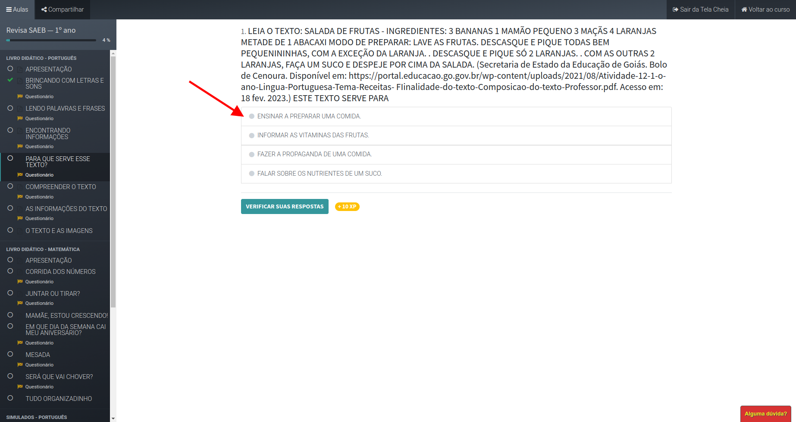
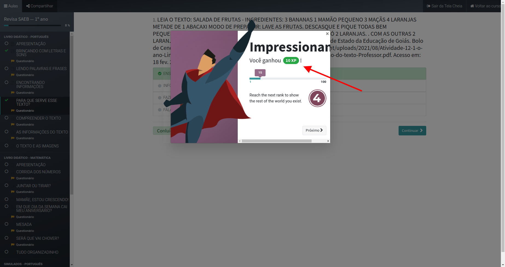
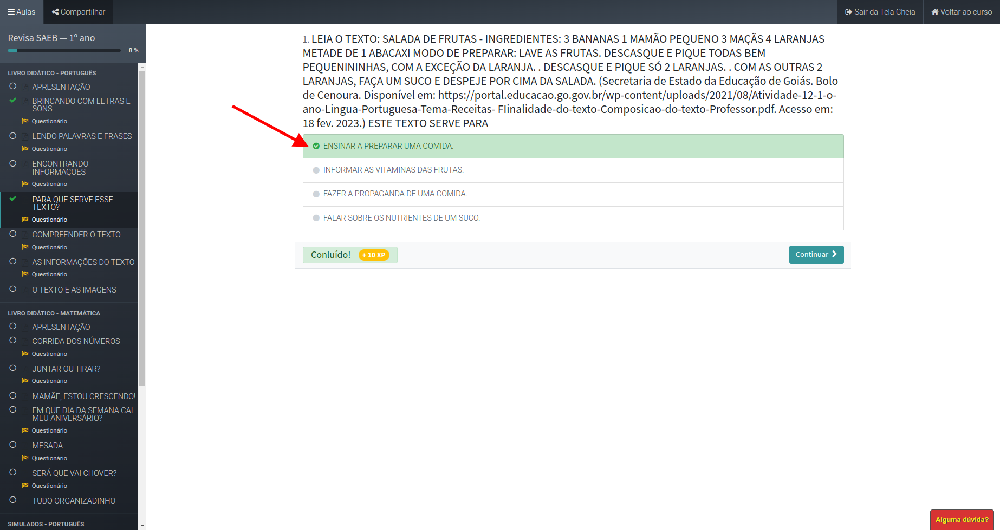

# Notas

	

## TRABALHO COM A VERSÃO 1.1

* Certificar-se de que todas as ilustrações que entraram no material são as
  feitas para ele. Se não for, resolver, inclusive podendo contar com a
  Isabella e a Luísa para fazer ilustração nova.
* Certificar-se de que todas as imagens (prontas ou feitas) têm resolução
  adequada para entrar no material, inclusive considerando que elas podem ter
  sido redimensionadas na página.
* Trocar imagens de bancos não gratuitos (que entraram com marca d'água no
  material) por imagens de bancos gratuitos.
* Certificar-se de que a fonte é 14 para os anos de primeiro a quarto e 12
  para os anos de quinto a nono.
* Trocar a fonte, em todo o material, por uma sem serifa.
* Garantir uma melhorada na edição do texto.
* Garantir paginação na versão do aluno: 128 páginas em 1º, 2º, 3º, 4º, 6º, 7º
  e 8º; 256 páginas em 5º e 9º. Na versão do professor, o gabarito não entra
  na conta da paginação.
* Certificar-se de que os textos de fontes externas entraram como fonte de
  pesquisa (precisam ser reescritos pelo ChatGPT). Se não for o caso, precisa
  fazer.

## Resultado do edital

| Dificuldade  | Frente    | Avaliação                                                                    |
|--------------|-----------|------------------------------------------------------------------------------|
|  Impossível  |  Digital  | Videoaulas para alunos e professores                                         |
|  Difícil     |  Digital  | Jogos: incluir jogos na plataforma (fica a questão da quantidade)            |
|  Difícil     |  LP       | Livro do professor em outro formato: mudar a estrutura do livro do professor |
|  Difícil     |  Digital  | Material de apoio para professores                                           |
|  Médio       |  Digital  | + Avaliação' Diagnóstico, Relatórios                                         |
|  Fácil       |  LP       | Instruções por atividade: retomar do original                                |
|  Fácil       |  LA       | Jogos & Encartes: fazer                                                      |
|  Fácil       |  Digital  | Livro do professor: subir o livro do professor na plataforma                 |
|  Fácil       |  LP       | Manual do coordenador: completar o manual                                    |
|  Fácil       |  Digital  | Perfis: Redesenhar o fluxo do site                                           |
|  Pronto      |  LP       | Fichas                                                                       |
|  Pronto      |  Digital  | Forum                                                                        |
|  Pronto      |  Digital  | Simulados com correção automática                                            |
|  ??????      |  LA       | QR Code                                                                      |

* Link de acesso aos arquivos enviados
https://1drv.ms/f/s!Atj_xOUGlbzyhM9Yx7T5pLzlLfPtpg?e=oS9V37
